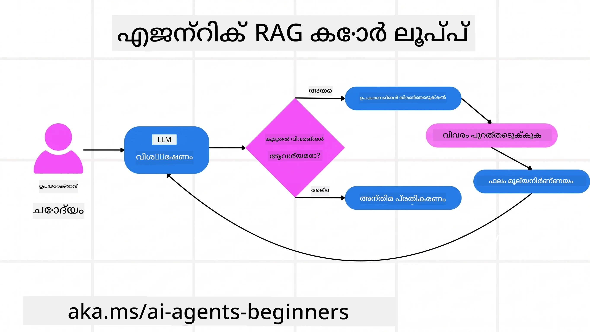
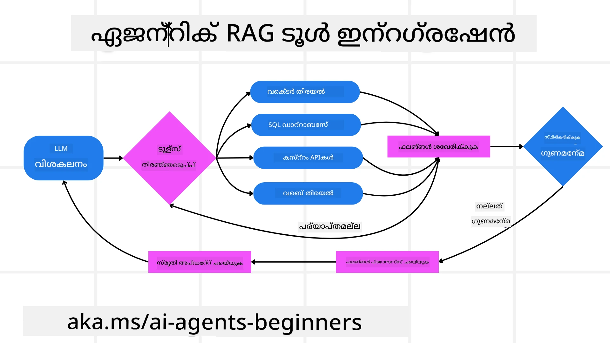
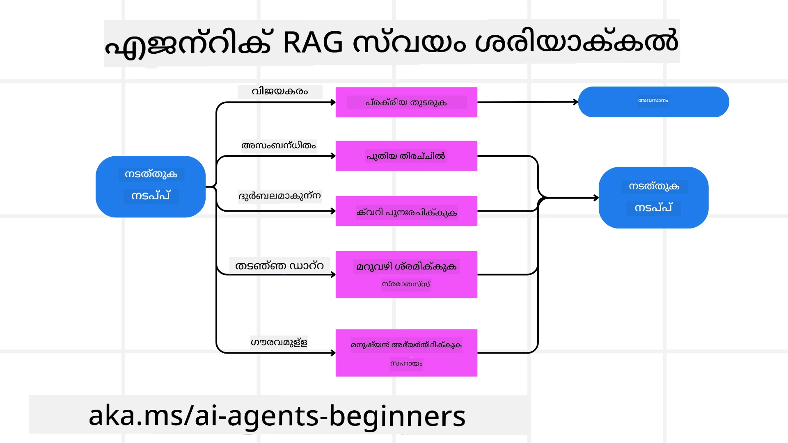
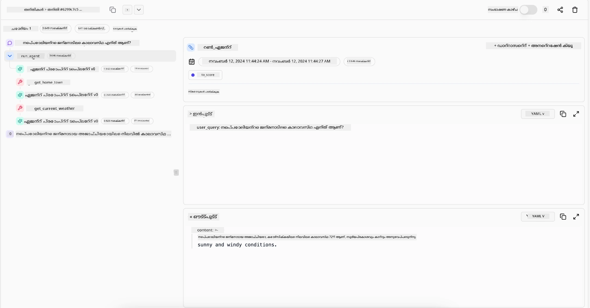

> _(മുകളിലുള്ള ചിത്രം ക്ലിക്ക് ചെയ്ത് ഈ പാഠത്തിന്റെ വീഡിയോ കാണുക)_

# ഏജന്റിക് RAG

ഈ പാഠം Agentic Retrieval-Augmented Generation (ഏജന്റിക് RAG) എന്നൊരു സമഗ്ര അവലോകനമാണ് നൽകുന്നത് — ഇതിൽ വലുതായ ഭാഷാ മോഡലുകൾ (LLMs) ബാഹ്യ ഉറവിടങ്ങളിൽ നിന്ന് വിവരങ്ങൾ ആക്കി എടുത്തുകൊണ്ട് സ്വന്തം അടുത്ത നടപടികൾ സ്വയം പദ്ധതിപ്പെടുത്തുന്നു. സ്റ്റാറ്റിക് retrieval-then-read മാതൃകകളിൽ നിന്നും വ്യത്യസ്തമായി, ഏജന്റിക് RAG ല്‍ LLM-ലിലേക്ക് ആവർത്തനപരമായി വിളികള്‍ വരുന്നു, ഇടയ്ക്കുള്ള ടൂൾ അല്ലെങ്കിൽ ഫംഗ്ഷൻ കോളുകളുമായി കൂടിയുള്ള ഘടിത ഔട്ട്‌പുട്ടുകൾ ഉണ്ടായിരിക്കുന്നു. സിസ്റ്റം ഫലങ്ങൾ വിലയിരുത്തുന്നു, ക്വെറികൾ ശുദ്ധമാക്കുന്നു, ആവശ്യമായ പക്ഷം കൂടുതൽ ടൂളുകൾ വിളിക്കുന്നു, കൂടാതെ തൃപ്തികരമായ പരിഹാരം ലഭിക്കുന്നതുവരെയുളള ഈ സൈക്കിൾ തുടരും.

## പരിചയം

ഈ പാഠത്തിൽ ചേർക്കുന്നവ:

- **ഏജന്റിക് RAG മനസ്സിലാക്കുക:** വലിയ ഭാഷാ മോഡലുകൾ (LLMs) ബാഹ്യ ഡാറ്റാ ഉറവിടങ്ങളിൽ നിന്നുള്ള വിവരങ്ങൾ ആക്കി എടുത്തുകൊണ്ടു തന്നെ അവരുടെ അടുത്ത നടപടികൾ സ്വയം പദ്ധതിപ്പെടുത്തുന്ന ùrറമ്പിച്ച AI മാതൃകയെക്കുറിച്ച് പഠിക്കുക.
- **ആവർത്തനപരമായ Maker-Checker ശൈലിയിൽ ആകെ ഗ്രഹിക്കുക:** LLM-ലിലേക്ക് ആവർത്തനപരമായ വിളികളുടെയും, ടൂൾ അല്ലെങ്കിൽ ഫംഗ്ഷൻ കോളുകളുടെയും ഘടിത ഔട്ട്‌പുട്ടുകളുടെയും ലൂപ്പ് മനസ്സിലാക്കുക — ഇത് ശരിതുറ്റലും തെറ്റായ ക്വെറികൾ കൈകാര്യംചെയ്യലും മെച്ചപ്പെടുത്താൻ രൂപകൽപ്പന ചെയ്തിരിക്കുന്നു.
- **പ്രായോഗിക ഉപയോഗങ്ങൾ പരിശോധിക്കുക:** correctness-first സാഹചര്യങ്ങൾ, ബഹുഭൂരിജൻകമായ ഡേറ്റാബേസ് ഇടപെടലുകൾ, ദൈർഘ്യമേറിയ വർക്‌ഫ്ലോകൾ എന്നിവിടങ്ങളിൽ ഏജന്റിക് RAG എവിടെയൊക്കെ പ്രയോജനപ്പെടും എന്നു തിരിച്ചറിയുക.

## പഠന ലക്ഷ്യങ്ങൾ

ഈ പാഠം പൂർത്തിയാക്കിയശേഷം, നിങ്ങൾ അറിയുകയും മനസിലാക്കുകയും ചെയ്യുക:

- **ഏജന്റിക് RAG മനസ്സിലാക്കൽ:** വലിയ ഭാഷാ മോഡലുകൾ (LLMs) ബാഹ്യ ഡാറ്റാ ഉറവിടങ്ങളിൽ നിന്നുള്ള വിവരങ്ങൾ ആക്കി എടുത്തുകൊണ്ടു തന്നെ അവരുടെ അടുത്ത اقدامات സ്വയം പദ്ധതി ചെയ്യുന്നതിനെക്കുറിച്ച് പഠിക്കുക.
- **ആവർത്തനപരമായ Maker-Checker ശൈലി:** LLM-ലിലേക്ക് ആവർത്തനപരമായി വിളികളുള്ള ഒരു ലൂപിന്റെ ആശയം ഗ്രഹിക്കുക, ഇടക്കാലങ്ങളിൽ ടൂൾ അല്ലെങ്കിൽ ഫംഗ്ഷൻ കോളുകൾ കൂടിയതും ഘടിത ഔട്ട്‌പുട്ടുകൾ ഉണ്ടായതുമായ രൂപത്തിൽ — ഇത് ശരിതുറ്റല മെച്ചപ്പെടുത്താനും തെറ്റായ ക്വെറികൾ കൈകാര്യം ചെയ്യാനും രൂപകൽപ്പന ചെയ്തിരിക്കുന്നു.
- **കരുതലിന്റെ ഉടമസ്ഥത:** സിസ്റ്റത്തിന്റെ തന്ത്രചിന്ത നൽകരുതലിന്റെ ഉടമസ്ഥതയെക്കുറിച്ച് മനസ്സിലാക്കുക — പ്രീ-നിശ്ചയിക്കപ്പെട്ട മാർഗ്ഗങ്ങളിൽ ആശ്രയിക്കാതെ പ്രശ്നങ്ങൾക്ക് സമീപിക്കുന്ന രീതികളെ തീരുമാനിക്കാറുള്ളത്.
- **വർക്‌ഫ്ലോ:** ഒരു ഏജന്റിക് മോഡൽ സ്വതന്ത്രമായി മാർക്കറ്റ് ട്രെൻഡ് റിപ്പോർട്ടുകൾ തിരിക്കാനുള്ള തീരുമാനമെടുക്കുന്നത്, മത്സരം സംബന്ധിച്ച ഡാറ്റ തിരിച്ചറിവ് ചെയ്യുന്നത്, ആന്തരീക വിൽപ്പന മെട്രിക്‌സ് സഹിതം ബന്ധിപ്പിക്കൽ, കണ്ടെത്തലുകൾ സംശ്ലേഷണം ചെയ്ത് തന്ത്രം വിലയിരുത്തൽ എന്നിവ എങ്ങനെ ചെയ്യുന്നതിനുള്ള സൂക്ഷ്മത മനസ്സിലാക്കുക.
- **ആവർത്തന ലൂപുകൾ, ടൂൾ സംയോജനം, മെമ്മറി:** ഘടികൽ ഇന്ററാക്ഷൻ പാറ്റേൺ ആയ ലൂപ്പിൽ സിസ്റ്റം എങ്ങനെ ആശ്രയിച്ചിരിക്കുന്നുവെന്നും, നിലയും മെമ്മറിയും ഘടക കണക്കിൽ എങ്ങനെ നിലനിർത്തുന്നുവെന്നും പഠിക്കുക — ഇത് ആവർത്തന ലൂപുകൾ ഒഴിവാക്കാനും გადაწყვეტილികളിൽ കൂടുതൽ അറിവുള്ളതാകാൻ സഹായിക്കുന്നു.
- **തെറ്റു മോഡുകളും സ്വയം-ശുദ്ധീകരണവും കൈകാര്യം ചെയ്യുക:** ആവർത്തിച്ച് വീണ്ടും ചോദിക്കൽ, ഡയഗണോസ്റിക് ടൂൾ ഉപയോഗിക്കൽ, മനുഷ്യ കാരണം മേൽനോട്ടത്തിലേക്ക് തിരിയൽ തുടങ്ങിയ ശക്തമായ സ്വയം-ശുദ്ധീകരണ ചിട്ടികളെ പരിശോധിക്കുക.
- **ഏജൻസിയുടെ പരിമിതിസ്വഭാവം:** ഏജന്റിക് RAG ന്റെ പരിധികൾ — ഡൊമൈൻ-നിര്ദിഷ്ട സ്വാതന്ത്ര്യം, ഇൻഫ്രാസ്ട്രക്ചർ ആശ്രിതത്വം, ഗാർഡ്‌റെയിൽസ് മാന്യം എന്നിവയെക്കുറിച്ച് മനസ്സിലാക്കുക.
- **പ്രായോഗിക ഉപയോഗങ്ങൾ һәм മൂല്യം:** correctness-first പരിസരങ്ങൾ, ബഹുജടില ഡാറ്റാബേസ് ഇടപെടലുകൾ, ദൈർഘ്യമേറിയ വർക്‌ഫ്ലോകൾ എന്നിവിടങ്ങളിൽ ഏജന്റിക് RAG എവിടെയെല്ലാം പ്രയോജനപ്പെടുന്നതെന്നും തിരിച്ചറിഞ്ഞുക.
- **ഭവന, പരദർശിത്വം, വിശ്വാസം:** വിശദീകരിക്കാവുന്ന ചിന്ത, പക്ഷപാത നിയന്ത്രണം, മനുഷ്യ മേൽനോട്ടം എന്നിവ ഉൾപ്പെടെ ഭവനവും പരദർശിത്വവും വിശ്വാസവുമായിട്ടുള്ള പ്രാധാന്യം മനസ്സിലാക്കുക.

## ഏജന്റിക് RAG എന്താണ്?

Agentic Retrieval-Augmented Generation (ഏജന്റിക് RAG) ഒരു ഉദിച്ചുയർന്ന AI മാതൃകയാണ്, ഇതിൽ വലിയ ഭാഷാ മോഡലുകൾ (LLMs) ബാഹ്യ ഉറവിടങ്ങളിൽ നിന്നുള്ള വിവരങ്ങൾ ആക്കി എടുത്തുകൊണ്ടതോടൊപ്പം അവരുടെ അടുത്ത നടപടികൾ സ്വയം പദ്ധതി ചെയ്യുന്നു. സ്റ്റാറ്റിക് retrieval-then-read മാതൃകകളിൽ നിന്നും വ്യത്യസ്തമായി, ഏജന്റിക് RAG ല്‍ LLM-ലിലേക്ക് ആവർത്തനപരമായി വിളികള്‍ വരുന്നു, ഇടയ്ക്കുള്ള ടൂൾ അല്ലെങ്കിൽ ഫംഗ്ഷൻ കോളുകളുമായി ഘടിത ഔട്ട്പുട്ടുകൾ ഉണ്ടായിരിക്കുന്നു. സിസ്റ്റം ലഭിച്ച ഫലങ്ങൾ വിലയിരുത്തുന്നു, ക്വെറികൾ ശുധീകരിക്കുന്നു, അധിക ടൂളുകൾ ആവശ്യമായാൽ വിളിക്കുന്നു, ഈ സൈക്കിൾ തൃപ്തികരമായ പരിഹാരം ലഭിക്കുന്നതുവരെ തുടരുന്നു. ഈ ആവർത്തനപരമായ “മേക്കർ-ചെക്കർ” ശൈലി ശരിതുറ്റല മെച്ചപ്പെടുത്താനും malformed ക്വെറികൾ കൈകാര്യം ചെയ്യാനും ഉയർന്ന നിലവാരമുള്ള ഫലങ്ങൾ ഉറപ്പാക്കാനും സഹായിക്കുന്നു.

സിസ്റ്റം അതിന്റെ തന്ത്രചിന്തയുടെ ഉടമസ്ഥത സ്വീകരിക്കുന്നു — തകരാറിലായ ക്വെറികൾ വീണ്ടും എഴുതുന്നത്, വിവിധ റെട്രീവൽ രീതികൾ തിരഞ്ഞെടുക്കുന്നത്, ഒട്ടനവധി ടൂളുകൾ സംയോജിപ്പിക്കുന്നത് (ഉദാഹരണത്തിന് vector search in Azure AI Search, SQL ഡാറ്റാബേസുകൾ, അല്ലെങ്കിൽ കസ്റ്റം APIകൾ) എന്നിവ ചെയ്യുന്നു, പിന്നീട് അവസാന ഉത്തരമുണ്ടാക്കുന്നതിന് മുൻപ്. ഏജന്റിക് സിസ്റ്റത്തിന്റെ വ്യത്യസ്തമായ ഗുണം അതിന്റെ തന്ത്രചിന്തയുടെ ഉടമസ്ഥതയാണ്. പരമ്പരാഗത RAG നടപ്പാക്കലുകൾ മുൻകൂട്ടി നിശ്ചയിച്ച പാതകളിൽ ആശ്രയിച്ചിരിക്കാറുണ്ട്, പക്ഷേ ഏജന്റിക് സിസ്റ്റം കണ്ടെത്തുന്ന വിവരങ്ങളുടെ ഗുണമേൻമയെ അടിസ്ഥാനമാക്കി സ്വവുമായും നടപടികളുടെ നിര ക്രമം നിർണ്ണയിക്കുന്നു.

## ഏജന്റിക് Retrieval-Augmented Generation (Agentic RAG) ന്റെ വ്യാഖ്യാനം

Agentic Retrieval-Augmented Generation (ഏജന്റിക് RAG) എന്നത് ഒരു ഉദിച്ചു വരുന്ന AI വികസന മാതൃകയെയാണ്, ഇതിൽ LLM-കൾ ബാഹ്യ ഡാറ്റാ ഉറവിടങ്ങളിൽ നിന്നും വിവരങ്ങൾ ആക്കി എടുക്കുന്നതോടൊപ്പം അവരുടെ അടുത്ത നടപടികൾ സ്വയം രൂപീകരിക്കുന്നു. സ്റ്റാറ്റിക് retrieval-then-read മാതൃകകളോ സൂക്ഷ്മമായി സ്ക്രിപ്റ്റ് ചെയ്ത പ്രോംപ്റ്റ് സീക്വൻസുകളോ എന്ന രീതികളിലല്ലാതെ, ഏജന്റിക് RAG ഒരു ലൂപാണ് — LLM-ലേക്ക് ആവർത്തനപരമായ വിളികൾ, ഇടയ്ക്കിടെ ടൂൾ അല്ലെങ്കിൽ ഫംഗ്ഷൻ കോളുകൾ, ഘടിത ഔട്ട്‌പുട്ടുകൾ എന്നിവ. ഓരോ ഘട്ടത്തിലും സിസ്റ്റം നേടുന്ന ഫലങ്ങൾ വിലയിര്‍ത്തുന്നു, ക്വെറിയുകൾ വരുത്തേണ്ടതുണ്ടോ എന്ന് തീരുമാനിക്കുന്നു, ആവശ്യമെങ്കിൽ അധിക ടൂളുകൾ വിളിക്കുന്നു, തൃപ്തികരമായ പരിഹാരം ലഭിക്കുന്നതുവരെ ഈ ചക്രം തുടരുന്നു.

ഈ ആവർത്തനപരമായ “മേക്കർ-ചെക്കർ” പ്രവർത്തനശൈലി ശരിതുറ്റല മെച്ചപ്പെടുത്താനും, ഘടിത ഡാറ്റാബേസുകളിലേക്ക് കൈമാറുന്ന തെറ്റായ ക്വെറികളായ NL2SQL പോലുള്ള പ്രശ്നങ്ങൾ കൈകാര്യം ചെയ്യാനുമാണ് രൂപകൽപ്പന ചെയ്തിരിക്കുന്നത്, കൂടാതെ തുല്യമായ, ഉയർന്ന നിലവാരമുള്ള ഫലങ്ങൾ ഉറപ്പാക്കുകയും ചെയ്യുന്നു. സൂക്ഷ്മമായി രൂപകൽപ്പന ചെയ്ത പ്രോംപ്റ്റ് ചയിനുകൾ മാത്രം ആശ്രയിക്കുമ്പോൾ പകരം, സിസ്റ്റം aktiiv ആയി അതിന്റെ തന്ത്രചിന്തയുടെ ഉടമസ്ഥത ഏറ്റെടുക്കുന്നു. അത് പരാജയപ്പെടുന്ന ക്വെറികൾ വീണ്ടും എഴുതാനും, വ്യത്യസ്ത റെട്രീവൽ മാർഗ്ഗങ്ങൾ തിരഞ്ഞെടുക്കാനും, ഒട്ടനവധി ടൂളുകൾ — ഉദാഹരണത്തിന് Azure AI Search ൽ vector search, SQL ഡാറ്റാബേസുകൾ, അല്ലെങ്കിൽ കസ്റ്റം APIകൾ — സംയോജിപ്പിക്കാനും കഴിയും, ശേഷം ഒടുവിൽ മറുപടി നിശ്ചയിക്കും. ഇതുവഴി അതിശയകരമായ ഓർക്കസ്ട്രേഷനുകൾക്ക് ആവശ്യമെന്തെന്നും നീക്കം ചെയ്യുന്നു. പകരം, "LLM call → tool use → LLM call → …" എന്ന താരതമ്യേന ലളിതമായ ലൂപ് തന്നെ സുക്ഷ്മവും അടിസ്ഥാനപരവുമായ ഔട്ട്‌പുട്ടുകൾ നൽകാൻ സാധിക്കും.

## തന്ത്രചിന്തയുടെ ഉടമസ്ഥത

ഒരു സിസ്റ്റത്തെ “ഏജന്റിക്” ആക്കുന്നത് അതിന്റെ തന്ത്രചിന്തയുടെ ഉടമസ്ഥതയാണ്. പരമ്പരാഗത RAG നടപ്പാക്കലുകൾ സാധാരണയായി മോഡലിനായി ഒരു പാത മനുഷ്യൻമാർ മുൻകൂട്ടി നിർദ്ദേശിക്കുമ്പോഴാണ് ആശ്രയിക്കുന്നത്: എന്ത് തിരയണമെന്നത്, ഏപ്പോൾ തിരയണമെന്നതിന്റെ ചിന്തശൃംഖല. പക്ഷേ ഒരു സിസ്റ്റം യഥാർത്ഥത്തിൽ ഏജന്റിക് ആയിരിക്കുമ്പോൾ, പ്രശ്ന approached ചെയ്യാനുള്ള രീതിയെ അതാണ് ഉൾകോർന്ന തീരുമാനിക്കുക. ഇത് സ്രിക്ഷ്ടം നിർവഹിക്കുന്നതല്ല; കണ്ടെത്തുന്ന വിവരങ്ങളുടെ ഗുണമേൻമ അടിസ്ഥാനമാക്കി സ്വയം നടപടികളുടെ നിര ക്രമം നിർണയിക്കുന്നു.
ഉദാഹരണത്തിന്, ഒരു ഉൽപ്പന്ന ലോഞ്ച് തന്ത്രം സൃഷ്ടിക്കാൻ ആവശ്യപ്പെടുമ്പോൾ, അത് മുഴുവൻ ഗവേഷണവും തീരുമാനമെടുക്കലുമുള്ള പ്രവൃത്തി പ്രവാഹം വിശദീകരിക്കുന്നൊരു പ്രോംപ്റ്റിനെ മാത്രമല്ല ആശ്രയിക്കുന്നത്. പകരം, ഏജന്റിക് മോഡൽ സ്വതന്ത്രമായി ഇതു തിരഞ്ഞെടുക്കാം:

1. Retrieve current market trend reports using Bing Web Grounding
2. Identify relevant competitor data using Azure AI Search.
3.	Correlate historical internal sales metrics using Azure SQL Database.
4. Synthesize the findings into a cohesive strategy orchestrated via Azure OpenAI Service.
5.	Evaluate the strategy for gaps or inconsistencies, prompting another round of retrieval if necessary.
ഈ എല്ലാ ഘട്ടവും — ക്വെറികൾ ശുദ്ധമാക്കൽ, ഉറവിടങ്ങൾ തിരഞ്ഞെടുക്കൽ, “ഹാപ്പി” ആകുന്നത് വരെ ആവർത്തിക്കൽ — മനുഷ്യൻ നിർദ്ദേശിച്ചിരിക്കുന്നതല്ല; മോഡലിന്റെ സ്ഥാപനമാണ്.

## ആവർത്തന ലൂപുകൾ, ടൂൾ സംയോജനം, മെമ്മറി

ഏജന്റിക് സിസ്റ്റം ഒരു ലൂപ്പുചെയ്യുന്ന ഇന്ററാക്ഷൻ പാടേണിൽ ആശ്രയിക്കുന്നു:

- **Initial Call:** ഉപയോക്താവിന്റെ ലക്ഷ്യം (aka. user prompt) LLM-യ്ക്ക് അവതരിപ്പിക്കുന്നു.
- **Tool Invocation:** മോഡൽ ആശയക്കുഴപ്പം അനുഭവിച്ചാൽ അല്ലെങ്കിൽ അഭാവമുള്ള വിവരം കണ്ടാൽ, അതൊരു ടൂൾ അല്ലെങ്കിൽ റെ retrieval രീതി തിരഞ്ഞെടുക്കുന്നു — ഉദാഹരണത്തിന് ഒരു വക്ടർ ഡാറ്റാബേസ് ക്വേരി (ഉദാഹരണത്തിന് Azure AI Search Hybrid search over private data) അല്ലെങ്കിൽ ഘടിത SQL കോളിന്റെ പ്രയോഗം — കൂടുതൽ കണ്ടപ്പോൾ_Context നേടാൻ.
- **Assessment & Refinement:** തിരികെ ലഭിച്ച ഡാറ്റ അവലോകനം ചെയ്ത്, മോഡൽ അത് മതി എന്ന് നിർണയിക്കുന്നു. ആവശ്യമുളളില്ലെങ്കിൽ, ക്വെറി ഷാർപ്പൺ ചെയ്യുക, വ്യത്യസ്ത ടൂൾ പരീക്ഷിക്കുക, അല്ലെങ്കിൽ സമീപനം ക്രമീകരിക്കുക.
- **Repeat Until Satisfied:** മോഡൽ ഒരു അന്തിമ, നന്നായി രീതികൃതമായ മറുപടി നൽകാൻ വേണ്ടത്ര വ്യക്തതയും തെളിവ് ലഭിച്ചിരിക്കുന്നു എന്ന് നിശ്ചയിച്ചുവരെയാണ് ഈ ചക്രം തുടരുക.
- **Memory & State:** സിസ്റ്റം ഘട്ടങ്ങളെ മീതെയും നിലയും മെമ്മറിയും നിലനിർത്തുന്നുവെന്നിട്ട്, മുമ്പ് നടത്തിയ ശ്രമങ്ങളും അവയുടെ ഫലങ്ങളും ഓർക്കാൻ കഴിഞ്ഞ് ആവർത്തന ലൂപുകൾ ഒഴിവാക്കാനും മുന്നോട്ട് പോകുമ്പോൾ കൂടുതൽ അറിവുള്ള തീരുമാനങ്ങൾ എടുക്കാനും കഴിയും.

കാലക്രമത്തിൽ, ഇതുവഴി വർദ്ധിച്ച മനസ്സിലാക്കൽ രൂപപ്പെടുന്നു, സിസ്റ്റം മനുഷ്യനെ സ്ഥിരമായി ഇടപെടാതെ അല്ലെങ്കിൽ പ്രോംപ്‍റ് പുനഃരൂപപ്പെടുത്താതെ സങ്കീർണ്ണമായ ബഹുസ്റിപ്പ പ്ര任务ുകൾ ദൈർഘ്യമേറിയതായും വിജ്ഞാനപരവുമായും നാവിഗേറ്റ് ചെയ്യാൻ സഹായിക്കുന്നു.

## തെറ്റു മോഡുകളും സ്വയം-ശുദ്ധീകരണം കൈകാര്യം ചെയ്യൽ

ഏജന്റിക് RAG ന്റെ സ്വഭാവത്തിലുള്ള സ്വയം-ശുദ്ധീകരണ ഘടകങ്ങളും ശക്തമാണ്. സിസ്റ്റം വഴിത്താപ്പുകൾക്ക് എത്തുമ്പോൾ — ഇതിൽ അനുഭാവപ്രദമായ രേഖകൾ തിരികെയില്ലാതെയോ malformed ക്വെറികൾ സംഭവിക്കുകയോ ചെയ്യാം — ഇത് ചെയ്യാം:

- **Iterate and Re-Query:** കുറഞ്ഞ മൂല്യമുള്ള മറുപടികൾ തിരികെ നൽകുന്നതിന് പകരം, മോഡൽ പുതിയ സെർച്ച് തന്ത്രങ്ങൾ പരീക്ഷിക്കുന്നു, ഡാറ്റാബേസ് ക്വെറികൾ വീണ്ടും എഴുതുന്നു, അല്ലെങ്കിൽ ലഭ്യമായ മറ്റ് ഡാറ്റാ സെറീസുകൾ പരിശോധിക്കുന്നു.
- **Use Diagnostic Tools:** മോഡൽ തന്റെ നിരീക്ഷണ ഘട്ടങ്ങളും തിരിച്ചറിയൽ ഘട്ടങ്ങളും ഡീബഗ്ഗ് ചെയ്യാൻ അല്ലെങ്കിൽ ലഭിച്ച ഡാറ്റയുടെ ശരിതുറ്റല പരിശോധനക്ക് സഹായിക്കുന്ന അധിക ഫംഗ്ഷനുകൾ വിളിക്കാം. Azure AI Tracing പോലുള്ള ടൂളുകൾ ശക്തമായ observabilityയും മോണിറ്ററിങ്ങും സജ്ജമാക്കാൻ പ്രധാനമാണെന്ന് കാണാം.
- **Fallback on Human Oversight:** ഉയർന്ന റിസ്ക് ഉള്ളതോ ആവർത്തിച്ച് പരാജയപ്പെടുന്ന സാഹചര്യങ്ങളിലോ, മോഡൽ അനിശ്ചിതത്വം ഫ്ലാഗ് ചെയ്ത് മനുഷ്യന്റെ നിർദേശമൊരുക്കാൻ അഭ്യർത്ഥിക്കാം. മനുഷ്യൻ തിരുത്തൽ ഫീര്‍edback നൽകുമ്പോൾ മോഡൽ അതു മുന്നോട്ട് പോയപ്പോഴും ഉള്‍ക്കൊള്ളാൻ കഴിയും.

ഈ ആവർത്തനപരവും ഡൈനാമിക് ആകുന്ന സമീപനം മോഡൽ അതിന്റെ പിഴവുകളിൽ നിന്നു തുടർച്ചയായി മെച്ചപ്പെടാൻ അനുവദിക്കുന്നു — ഇത് ഒരു ഒറ്റ शോട്ട് സിസ്റ്റമല്ല, അതൊന്നിലേറെ സെഷനിനുള്ളിൽ നിന്ന് പാഠം പഠിക്കുന്നതാണെന്ന് ഉറപ്പാക്കുന്നു.

## ഏജൻസിയുടെ പരിധികൾ

ഒരു ടാസ്കിനുള്ളുള്ള സ്വതന്ത്രതയ്ക്കുള്ള സ്‌കോപ്പ് ഉള്ളതിനിടയിലും, ഏജന്റിക് RAG സമഗ്രമായ മനുഷ്യസദൃശ ബുദ്ധിയെന്നതിനു സമവായമല്ല. അതിന്റെ “ഏജന്റിക്” കഴിവുകൾ മാത്രമേ മനുഷ്യ ഡെവലപ്പർമാർ നൽകിയ ടൂളുകൾ, ഡാറ്റാ ഉറവിടങ്ങൾ, നയങ്ങൾ എന്നിവയ്ക്ക് പരിധിയുള്ളവയാകൂ. അത് സ്വയം പുതിയ ടൂളുകൾ കണ്ടുപിടിക്കാൻ അല്ലെങ്കിൽ നിലകൾപ്പുറത്ത് പോകാൻ കഴിവില്ല. പകരം, ലഭ്യമാക്കിയ വിഭവങ്ങളെ സജീവമായി ഓർക്കസ്ട്രേറ്റ് ചെയ്യുന്നതിൽ അതാണ് മികച്ചത്.
അധിക പുരോഗതിയുള്ള AI രൂപങ്ങളിൽ നിന്നുള്ള പ്രധാന വ്യത്യാസങ്ങൾ:

1. **Domain-Specific Autonomy:** ഏജന്റിക് RAG സിസ്റ്റങ്ങൾ അറിയപ്പെട്ട ഡൊമൈൻ പരിധിയിൽ ഉപയോക്തൃ നിശ്ചയിച്ച ലക്ഷ്യങ്ങളെ എത്തിക്കുക എന്നതിൽ കേന്ദ്രീകൃതമാണ്; ക്വെറി പുനഃരചിച്ചൽ അല്ലെങ്കിൽ ടൂൾ തിരഞ്ഞെടുക്കൽ പോലെയുള്ള തന്ത്രങ്ങൾ ഫലങ്ങൾ മെച്ചപ്പെടുത്താൻ ഉപയോഗിക്കുന്നു.
2. **Infrastructure-Dependent:** ഡെവലപ്പർമാർ ഇൻറ്റഗ്രേറ്റ് ചെയ്ത ടൂളുകളും ഡാറ്റയും സിസ്റ്റത്തിന്റെ ശേഷികളിൽ നിർണായകമാണ്. മനുഷ്യ ഇടപെടലില്ലാതെ ഇതുകൾ കടക്കാൻ അതിന് സാധ്യമല്ല.
3. **Respect for Guardrails:** നൈതിക മാർഗനിർദ്ദേശങ്ങൾ, കോമ്പ്ലയൻസ് നിയമങ്ങൾ, ബിസിനസ് നയങ്ങൾ എന്നിവ വളരെ പ്രധാനമാണ്. ഏജന്റിന്റെ സ്വാതന്ത്ര്യം എല്ലായ്പ്പോഴും സുരക്ഷാ മാര്‍ഗരേഖകളും മേൽനോട്ട സംവിധാനങ്ങളുമാൽ നിയന്ത്രിതമാണ് (ആശംസിക്കാവുന്നതുപോലെ).

## പ്രായോഗിക ഉപയോഗങ്ങളുമായി മൂല്യം

ഏജന്റിക് RAG ആവർത്തന പരിഷ്‌ക്കരണവും കൃത്യതയും ആവശ്യമുള്ള സാഹചര്യങ്ങളിൽ മികവു കാണിക്കുന്നു:

1. **Correctness-First Environments:** കോംപ്ലയൻസ് ചെക്കുകൾ, ജീവനക്കാരുടെ നിയമപരിശോധനം, അല്ലെങ്കിൽ നിയമപരമായ ഗവേഷണം പോലുള്ള പ്രദേശങ്ങളിൽ, ഏജന്റിക് മോഡൽ بار بار വാസ്തവങ്ങൾ പരിശോധന ചെയ്യാനും, നിരവധി ഉറവിടങ്ങൾ കാണാനും, കോശങ്ങൾ വീണ്ടും എഴുതിവച്ചും ശ്രദ്ധാപൂർവ്വം പരിശോധിച്ച മറുപടി വരുത്താൻ കഴിയും.
2. **Complex Database Interactions:** ഘടിത ഡാറ്റയുമായി ഇടപെടുമ്പോൾ, ക്വെറികൾ സാധാരണയായി പരാജയപ്പെടുകയോ ക്രമീകരണം ആവശ്യമാവുകയോ ചെയ്യുമ്പോൾ, സിസ്റ്റം സ്വയം Azure SQL അല്ലെങ്കിൽ Microsoft Fabric OneLake ഉപയോഗിച്ച് ക്വെറികൾ പുനഃരചിച്ചു ഉപയോഗകാരണത്തിന്റെ അന്തിമ റെട്രീവൽ ഉപയോക്താവിന്റെ ഉദ്ദേശത്തോട് അനുയോജ്യമായതായി ഉറപ്പാക്കാം.
3. **Extended Workflows:** ദൈർഘ്യമേറിയ സെഷനുകൾ പുതിയ വിവരങ്ങൾ പ്രത്യക്ഷപ്പെടുമ്പോൾ വികസിക്കാൻ സാധ്യതയുണ്ട്. ഏജന്റിക് RAG തുടര്‍ച്ചയായി പുതിയ ഡാറ്റ ഉൾക്കൊള്ളുകയും, പ്രശ്നമുറ്റത്തെ കുറിച്ച് കൂടുതൽ പഠിക്കുന്നതിനോട് അനുയോജ്യമായി തന്ത്രങ്ങളിൽ മാറ്റം വരുത്തുകയും ചെയ്യാം.

## ഭവന, പരദർശിത്വം, വിശ്വാസം

ഈ സിസ്റ്റങ്ങൾ അവരുടെ തന്ത്രചിന്തയിൽ കൂടുതൽ സ്വതന്ത്രത നേടുന്നതിനോട് കൂടെ, ഭവനവും പരദർശിത്വവും നിർണ്ണായകമാണ്:

- **Explainable Reasoning:** മോഡൽ ആവർത്തിച്ച ക്വെറികളുടെ ഓഡിറ്റ് ട്രെയിൽ, അതും പരിശോധിച്ച ഉറവിടങ്ങൾ, മുന്നോട്ടെടുത്ത ചിന്താ ഘട്ടങ്ങൾ എന്നിവ നൽകാൻ കഴിയും. Azure AI Content Safety, Azure AI Tracing / GenAIOps പോലുള്ള ടൂളുകൾ പരദർശിത്യം നിലനിർത്താനും റിസ്കുകൾ കുറയ്ക്കാനും സഹായമാകും.
- **Bias Control and Balanced Retrieval:** ഡെവലപ്പർമാർ റെ retrieval തന്ത്രങ്ങൾ ട്യൂൺ ചെയ്ത് തുല്യവും പ്രതിനിധാനപരവുമായ ഡാറ്റാ ഉറവിടങ്ങൾ പരിഗണിക്കുന്നതിന് ഉറപ്പാക്കാം, കൂടാതെ Azure Machine Learning ഉപയോഗിച്ച് ആഢ്വാൻസ്ഡ് ഡാറ്റാ സയൻസ് സംഘടനകൾക്കായി കസ്റ്റം മോഡലുകൾ ഉപയോഗിച്ച് ഔട്ട്പുട്ടുകൾ biased അല്ലെന്ന് കണ്ടെത്താൻ നിരന്തരമായി ഓഡിറ്റ് ചെയ്യാം.
- **Human Oversight and Compliance:** സున్నിധി ഉള്ള ടാസ്കുകൾക്കായി മനുഷ്യപരിശോധനം അനിവാര്യമാണ്. ഏജന്റിക് RAG ഉയർന്ന-സ്റ്റേക്കുള്ള അവസ്ഥകളിൽ മനുഷ്യ തീരുമാനം പകരംവയ്ക്കുന്നില്ല — പകരം അതിനെ മെച്ചപ്പെടുത്തുന്നവയും കൂടുതൽ ശ്രദ്ധാപൂർവ്വമുള്ള‌ ഓപ്ഷനുകൾ നൽകുന്നതുമായുണ്ട്.

നടപടികളുടെ വ്യക്തമായ റെക്കോർഡ് നൽകുന്ന ടൂളുകൾ ഉണ്ടായിരിക്കണം അത്യാവശ്യമാണ്. അവ ഇല്ലാതെ, ഒരു ബഹു-ഘട്ട പ്രക്രിയയുടെ ഡീബഗ്ഗിംഗ് വളരെ ദുഷ്‌കരമാകും. Literal AI (Chainlit ന്റെ പിന്നിലുള്ള കമ്പനി) നൽകിയ Agent run ൽ നിന്നുള്ള ഒരു ഉദാഹരണം കാണുക:

## 결론

ഏജന്റിക് RAG സമഗ്രമായി ഡാറ്റാ-സാങ്കേതികപ്പെട്ടുള്ള സങ്കീർണ്ണ ടാസ്കുകൾ കൈകാര്യം ചെയ്യുന്നതിൽ AI സിസ്റ്റങ്ങളുടെ സ്വാഭാവിക മറുപടിയാണ്. ലൂപ്പുചെയ്യുന്ന ഇന്ററാക്ഷൻ പാടേൺ സ്വീകരിച്ച്, സ്വതന്ത്രമായി ടൂളുകൾ തിരഞ്ഞെടുക്കുകയും, ഉയർന്ന-ഗുണമേൻമ ഉള്ള ഫലം ലഭിക്കുന്നതുവരെ ക്വെറികൾ പുനഃരാലോചിക്കുകയും ചെയ്യുന്നുവെന്ന നിലയിൽ, സിസ്റ്റം സ്റ്റാറ്റിക് പ്രോംപ്റ്റ് അനുസരണതയ്ക്ക് പുറത്തേക്ക് ചലിക്കുന്നു — കൂടുതൽ അനുകൂലമായ, സാഹചര്യ-അറിയുന്ന തീരുമാനമെടുക്കുന്ന സംവിധാനമായി മാറുന്നു. മനുഷ്യനിർണ്ണയിച്ച ഇന്‍ഫ്രാസ്ട്രക്ചർലും നൈതിക മാർഗനിർദ്ദേശങ്ങളാലും ഇപ്പോഴും അതിന് പരിധികൾ ഉണ്ടെങ്കിലും, ഈ ഏജന്റിക് കഴിവുകൾ സംരംഭങ്ങൾക്കും അന്തിമ ഉപയോക്താക്കൾക്കും കൂടുതൽ സമ്പന്നമായ, സജീവമായ, ഉപയോഗപ്രദമായ AI ഇടപെടലുകൾ സാധ്യമാക്കുന്നു.

### ഏജന്റിക് RAG സംബന്ധിച്ച് കൂടുതൽ ചോദ്യങ്ങളുണ്ടോ?

Join the [Microsoft Foundry Discord](https://aka.ms/ai-agents/discord) to meet with other learners, attend office hours and get your AI Agents questions answered.

## അധിക വിഭവങ്ങൾ
- <a href="https://learn.microsoft.com/training/modules/use-own-data-azure-openai" target="_blank">Azure OpenAI സേവനത്തോടെ Retrieval Augmented Generation (RAG) നടപ്പിലാക്കുക: Azure OpenAI സേവനത്തിൽ നിങ്ങളുടെ സ്വന്തം ഡേറ്റ ഉപയോഗിക്കുന്നത് എങ്ങനെ എന്ന് പഠിക്കുക. ഈ Microsoft Learn മോഡ്യൂൾ RAG നടപ്പിലാക്കുന്നതിനുള്ള സമഗ്ര മാർഗ്ഗദർശനമാണ്</a>
- <a href="https://learn.microsoft.com/azure/ai-studio/concepts/evaluation-approach-gen-ai" target="_blank">Microsoft Foundry ഉപയോഗിച്ചു ജനറേറ്റീവ് AI അപ്ലിക്കേഷനുകളുടെ വിലയിരുത്തൽ: ഈ ലേഖനം പൊതുവിൽ ലഭ്യമായ ഡാറ്റാസെറ്റുകളിൽ മോഡലുകളുടെ വിലയിരുത്തലും താരതമ്യവും ഉൾപ്പെടെ, Agentic AI അപ്ലിക്കേഷനുകളും RAG ആർക്കിടെക്ചറുകളും ഉൾപ്പെടുത്തി വിശദീകരിക്കുന്നു</a>
- <a href="https://weaviate.io/blog/what-is-agentic-rag" target="_blank">Agentic RAG എന്താണ് | Weaviate</a>
- <a href="https://ragaboutit.com/agentic-rag-a-complete-guide-to-agent-based-retrieval-augmented-generation/" target="_blank">Agentic RAG: ഏജന്റ് അധിഷ്ഠിത Retrieval Augmented Generation ചെയ്യുന്നതിനുള്ള സമഗ്ര ഗൈഡ് – News from generation RAG</a>
- <a href="https://huggingface.co/learn/cookbook/agent_rag" target="_blank">Agentic RAG: query reformulation ഉം self-query ഉം ഉപയോഗിച്ച് നിങ്ങളുടെ RAG നെ ശക്തിപ്പെടുത്തുക! Hugging Face ഓപ്പൺ-സോഴ്‌സ് AI കുക്ക്ബുക്ക്</a>
- <a href="https://youtu.be/aQ4yQXeB1Ss?si=2HUqBzHoeB5tR04U" target="_blank">RAG നെ Agentic ലെയറുകൾ ചേർക്കൽ</a>
- <a href="https://www.youtube.com/watch?v=zeAyuLc_f3Q&t=244s" target="_blank">ജ്ഞാന അസിസ്റ്റന്റുകളുടെ ഭാവി: Jerry Liu</a>
- <a href="https://www.youtube.com/watch?v=AOSjiXP1jmQ" target="_blank">Agentic RAG സിസ്റ്റങ്ങൾ എങ്ങനെ നിർമ്മിക്കാം</a>
- <a href="https://ignite.microsoft.com/sessions/BRK102?source=sessions" target="_blank">Microsoft Foundry Agent Service ഉപയോഗിച്ച് നിങ്ങളുടെ AI ഏജന്റുകൾ സ്കേല്‍ ചെയ്യുന്നത്</a>

### അക്കാദമിക് പേപ്പറുകൾ

- <a href="https://arxiv.org/abs/2303.17651" target="_blank">2303.17651 Self-Refine: സ്വയം-ഫീഡ്ബാക്കോടെ ആവർത്തനപരമായ സുധാരണം</a>
- <a href="https://arxiv.org/abs/2303.11366" target="_blank">2303.11366 Reflexion: വാചകപരമായ റീഇൻഫോർസ്‌മെന്റ് ലേണിങ്ങ് ഉള്ള ഭാഷാ ഏജന്റുകൾ</a>
- <a href="https://arxiv.org/abs/2305.11738" target="_blank">2305.11738 CRITIC: ടൂൾ-ഇന്ററാക്ടീവ് ക്രിട്ടിക്കിംഗ് ഉപയോഗിച്ച് വലിയ ഭാഷാ മോഡലുകൾ സ്വയം തിരുത്താൻ കഴിയും</a>
- <a href="https://arxiv.org/abs/2501.09136" target="_blank">2501.09136 Agentic Retrieval-Augmented Generation: Agentic RAG സംബന്ധിച്ചൊരു സർവേ</a>

## മുൻ പാഠം

[ടൂൾ ഉപയോഗ ഡിസൈൻ മാതൃക](../04-tool-use/README.md)

## അടുത്ത പാഠം

[വിശ്വാസയോഗ്യമായ AI ഏജന്റുകൾ നിർമ്മിക്കൽ](../06-building-trustworthy-agents/README.md)

---

<!-- CO-OP TRANSLATOR DISCLAIMER START -->
ഡിസ്‌ക്ലെയിമര്‍:  
ഈ രേഖ AI വിവർത്തന സേവനമായ [Co-op Translator](https://github.com/Azure/co-op-translator) ഉപയോഗിച്ച് വിവർത്തനം ചെയ്തതാണ്. ഞങ്ങൾ കൃത്യത ഉറപ്പാക്കാൻ ശ്രമിക്കുന്നുവെങ്കിലും, യന്ത്രവൽക്കൃത വിവർത്തനങ്ങളിൽ പിശകുകളും വിവർത്തനപരമായ തെറ്റുകളും ഉണ്ടാകാമെന്ന് ദയവായി മനസ്സിലാക്കുക. മാതൃഭാഷയിൽ ഉള്ള മൂല രേഖയെ പ്രാമാണികമായ ഉറവിടമായി കാരയ്യുക. നിർണായകമായ വിവരങ്ങൾക്ക് പ്രൊഫഷണൽ മനുഷ്യ വിവർത്തനം ശുപാർശ ചെയ്യപ്പെടുന്നു. ഈ വിവർത്തനം ഉപയോഗിച്ചതിനാൽ ഉണ്ടായേക്കാവുന്ന οποιεδήποτε തെറ്റിദ്ധാരണകൾക്കും തെറ്റായ വ്യാഖ്യാനങ്ങൾക്കും ഞങ്ങൾ ഉത്തരവാദികളല്ല.
<!-- CO-OP TRANSLATOR DISCLAIMER END -->