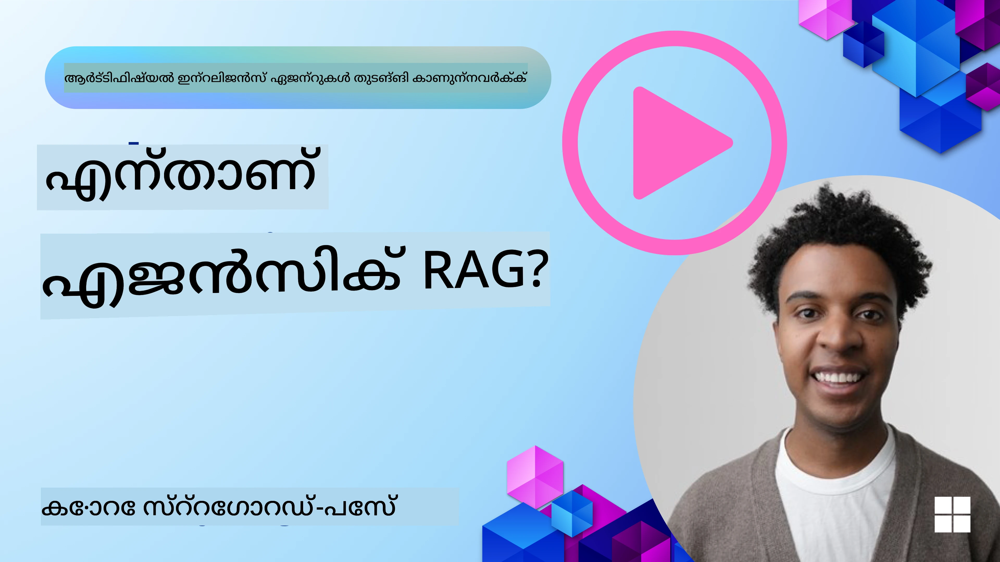
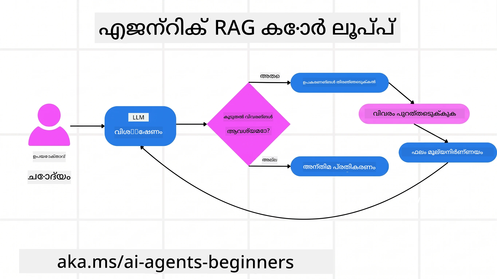
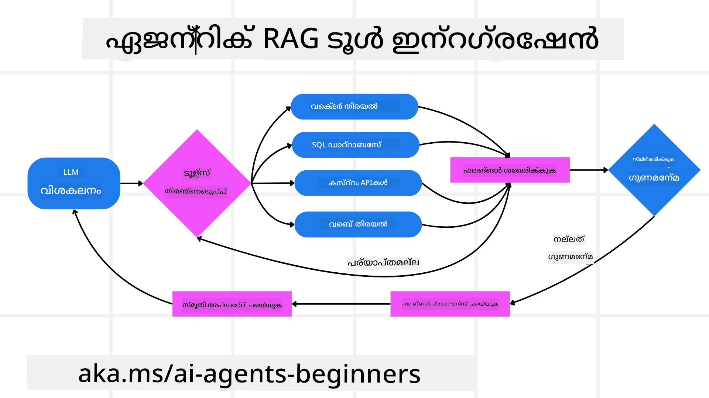
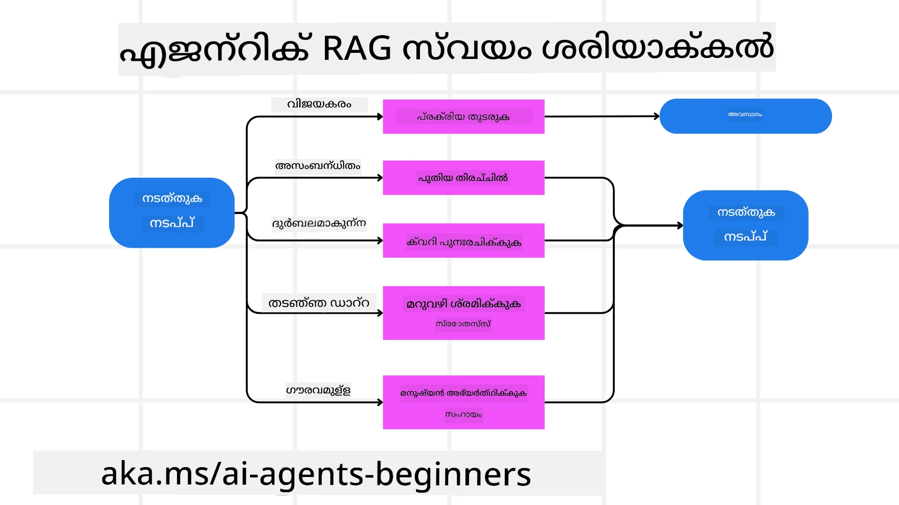
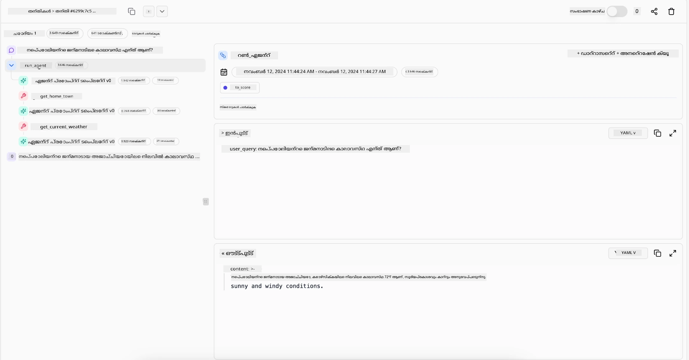

> _(ഈ പാഠത്തിന്റെ വീഡിയൊ കാണാൻ മുകളിൽ ചിത്രത്തിൽ ക്ലിക്ക് ചെയ്യുക)_

# ഏജന്റിക് RAG

ഈ പാഠം ഏജന്റിക് റിട്രീവൽ-ഓഗ്മെന്റഡ് ജനറേഷൻ (Agentic RAG) എന്ന ഉയരുന്ന AI പാരഡൈം പൂർണമായും അവലോകനം നൽകുന്നു, ഈ പാരഡൈമിൽ വലിയ ഭാഷ മോഡലുകൾ (LLMs) ബാഹ്യ സ്രോതസ്സുകളിൽ നിന്നുള്ള വിവരങ്ങൾ പിടിച്ചുالتالي തന്റെ അടുത്ത ചുവടു സ്വയം പദ്ധതിയിടുന്നു. സ്റ്റാറ്റിക് റിട്രീവൽ-തെൻ-രീഡ് പാറ്റേണുകളേക്കാൾ വ്യത്യസ്തമായി, ഏജന്റിക് RAG എല്‍എല്‍എമ്മിലേക്ക് ആവർത്തന കോളുകൾ ഉൾക്കൊള്ളുന്നു, ടൂൾ അല്ലെങ്കിൽ ഫംഗ്ഷൻ കോളുകള്‍ ഇടവേളകളായി ചേരുന്നു, കൂടാതെ ഘടിത ഫലങ്ങൾ നൽകുന്നു. സിസ്റ്റം ഫലങ്ങൾ വിലയിരുത്തുകയും, ക്വെറികൾ പുനഃസംസ്‌ക്കരിക്കുകയും, ആവശ്യമായ പറ്റ ടൂളുകൾ വിളിക്കുകയും, ഈ ചക്രം വർഷിക്കുമ്പോൾ തൃപ്പ്തികരമായ പരിഹാരം നേടുന്നത് വരെ തുടരുകയും ചെയ്യുന്നു.

## പരിചയം

ഈ പാഠം ഉൾകൊള്ളുന്നത്

- **ഏജന്റിക് RAG മനസ്സിലാക്കുക:** വലിയ ഭാഷ മോഡലുകൾ (LLMs) ബാഹ്യ ഡാറ്റ സ്രോതസ്സുകളിൽ നിന്നുള്ള വിവരങ്ങൾ സ്വയം ആസ്വദിച്ച് സ്വന്തം അടുത്ത ഘട്ടങ്ങൾ ആസൂത്രണം ചെയ്യുന്നു എന്ന AIയിലെ ഉയരുന്ന പാരഡൈം.
- **ആവർത്തന Maker-Checker ശൈലി പിടിക്കുക:** LLM-ലേക്ക് ആവർത്തന കോളുകൾ, ടൂൾ അല്ലെങ്കിൽ ഫങ്ഷൻ കോളുകൾ, ഘടിത ഔട്ട്‌പുട്ടുകൾ എന്നിവയുമായി ചേർത്ത് കൃത്യത മെച്ചപ്പെടുത്തിയും തെറ്റായ ക്വേറികളുടെ നിയന്ത്രണം കൈകാര്യം ചെയ്തും പ്രവർത്തിക്കുന്ന ഒരു ലൂപ്പ്.
- **പ്രായോഗിക ഉപയോഗങ്ങൾ പഠിക്കുക:** കൃത്യത-പ്രഥമ പരിസ്ഥിതികൾ, സങ്കീർണ്ണ ഡാറ്റാബേസ് ഇടപെടലുകൾ, നീണ്ടവനെ നടത്തിപ്പുകൾ എന്നിവിടങ്ങളിൽ ഏജന്റിക് RAG പ്രഭാഷിക്കുന്ന സാഹചര്യം കണ്ടെത്തുക.

## പഠന ലക്ഷ്യങ്ങൾ

ഈ പാഠം പൂർത്തിയാക്കിയ ശേഷമുള്ള അറിവുകൾ / മനസ്സിലാക്കലുകൾ:

- **ഏജന്റിക് RAG മനസ്സിലാക്കൽ:** വലിയ ഭാഷ മോഡലുകൾ (LLMs) ബാഹ്യ ഡാറ്റാ സ്രോതസ്സുകളിൽ നിന്ന് സ്വയം വിവരം കൈകാര്യം ചെയ്ത് അടുത്ത ഘട്ടങ്ങൾ സ്വയം ആസൂത്രണം ചെയ്യുന്ന AI പാരഡൈം.
- **ആവർത്തന Maker-Checker ശൈലി:** LLM-ലേക്ക് ആവർത്തന കോളുകൾ, ടൂൾ അല്ലെങ്കിൽ ഫങ്ഷൻ കോളുകൾ, ഘടിത ഔട്ട്‌പുട്ടുകൾ എന്നിവയോട് ചേർത്ത് കൃത്യത മെച്ചപ്പെടുത്താനും തെറ്റായ ക്വേറിയെ കൈകാര്യം ചെയ്യാനുമായുള്ള ആശയം പിടിക്കുക.
- **തർക്കശേഷി നിയന്ത്രണം:** പ്രശ്നങ്ങളോടു സമീപിക്കുന്ന വിധം സ്വയം തീരുമാനിക്കുന്ന സിസ്റ്റത്തിന്റെ സാധ്യത മനസ്സിലാക്കുക, മുൻകൂട്ടി നിർണയിച്ച വഴികളിൽ ആശ്രയിക്കാതെ.
- **വർക്ക്‌ഫ്ലോ:** ഒരു ഏജന്റിക് മോഡൽ സ്വയം മാർക്കറ്റ് ട്രെൻറ് റിപ്പോർട്ടുകൾ പിടിച്ചെടുക്കുക, മത്സര കാരകാങ്ങളുടെ വിവരങ്ങൾ കണ്ടെത്തുക, ആന്തരിക വിൽപ്പന മെട്രിക്‌സ് തമ്മിൽ ബന്ധിപ്പിക്കുക, കണ്ടെത്തലുകൾ സംയോജിപ്പിക്കുക, തന്ത്രം വിലയിരുത്തുക എങ്ങനെ എന്നത് മനസ്സിലാക്കുക.
- **ആവർത്തന ലൂപ്പുകൾ, ടൂൾ സംയോജനം, മെമ്മറി:** ആവർത്തന സമ്പർക്ക മാതൃകയിൽ ആശ്രയിച്ചുള്ള സിസ്റ്റത്തിന്റെ പ്രവർത്തനം, ഓരോ ഘട്ടത്തിലും നിലയും മെമ്മറിയും സൂക്ഷിച്ച നിലനിർത്തൽ, ആവർത്തനങ്ങൾ ഒഴിവാക്കുകയും വിവരപരമായി തീരുമാനങ്ങൾ എടുക്കുകയും ചെയ്യുന്നു.
- **വിഫലതാ രീതികളും സ്വയം പരിഹാരവും:** പ്രതിഫലം തെറ്റുകൾക്ക് മുമ്പിൽ നിന്നുപറഞ്ഞു തിരുത്തൽ സംവിധാനങ്ങൾ, ഡയഗ്നോസ്റ്റിക് ഉപകരണങ്ങൾ ഉപയോഗിച്ച് എറിയർ കണ്ടെത്തലുകൾ, മനുഷ്യ മേൽനോട്ടത്തിലേക്ക് തിരിച്ചുപോകൽ.
- **ഏജൻസി പരിധികൾ:** ഏജന്റിക് RAG ന്റെ പരിമിതികൾ, ഡോമൈൻ-സ്പെസിഫിക് സ്വാതന്ത്ര്യം, ഇൻഫ്രാസ്ട്രക്ചർ ആശ്രിതത്വം, ഗാർഡ്‌റെയിലിനോട് ബഹുമാനം എന്നിവ മനസ്സിലാക്കുക.
- **പ്രായോഗിക ഉപയോഗങ്ങൾ, മൂല്യം:** കൃത്യത പ്രഥമ പരിസ്ഥിതികൾ, സങ്കീർണ്ണ ഡാറ്റാബേസ് ഇടപെടലുകൾ, നീണ്ടവനെ പ്രവർത്തനം തുടങ്ങിയ സ്ഥലങ്ങളിൽ ഏജന്റിക് RAG പ്രഭാഷിക്കുന്നു.
- **ആധിപത്യം, വ്യക്തമാക്കൽ, വിശ്വാസം:** അവബോധം, വിവരണം, ബയസ് നിയന്ത്രണം, മനുഷ്യ മേൽനോട്ടം ഉൾപ്പെടെ ആധിപത്യവും ഭേദഗതിയും പ്രാധാന്യത്തോടെ പഠിക്കുക.

## ഏജന്റിക് RAG എന്നത് എന്താണ്?

ഏജന്റിക് റിട്രീവൽ-ഓഗ്മെന്റഡ് ജനറേഷൻ (Agentic RAG) ഒരു ഉയരുന്ന AI പാരഡൈമാണ്, അതിൽ വലിയ ഭാഷ മോഡലുകൾ (LLMs) ബാഹ്യ സ്രോതസ്സുകളിൽ നിന്ന് വിവരങ്ങൾ സ്വയം ആസ്വദിക്കുകയും അതോടൊപ്പം തന്നെ അടുത്ത നീക്കങ്ങൾ സ്വയം പദ്ധതിയിടുകയും ചെയ്യുന്നു. സ്റ്റാറ്റിക് റിട്രീവൽ-തെൻ-രീഡ് മാതൃകകളിൽ നിന്ന് വ്യത്യസ്തമായി, ഏജന്റിക് RAG എല്‍എല്‍എമ്മിലേക്ക് ആവർത്തന കോളുകൾ ഉൾപ്പെടുന്നു, ടൂൾ അല്ലെങ്കിൽ ഫംഗ്ഷൻ കോളുകൾ ഇടപ്പെടുന്നു, ഘടിത ഫലങ്ങൾ നൽകുന്നു. സിസ്റ്റം ഫലങ്ങൾ വിലയിരുത്തുകയും, ക്വെറികൾ പുനഃസംസ്‌ക്കരിക്കുകയും, കൂടുതൽ ടൂളുകൾ വിളിക്കയും ആവശ്യപ്പെട്ടാൽ, ഈ ചക്രം ഏറ്റവുമോ അറിയപ്പെടുന്ന പരിഹാരം ലഭിക്കും വരെ തുടരും. ഈ ആവർത്തനമായ “മേക്കർ-ചെക്കർ” ശൈലി കൃത്യത മെച്ചപ്പെടുത്തുകയും തെറ്റായ ക്വേറികളെ കൈകാര്യം ചെയ്യുകയും അതിലൂന്നിയ ഫലങ്ങൾ ഉറപ്പാക്കുകയും ചെയ്യുന്നു.

സിസ്റ്റം താൻ തുടരുന്ന തർക്കശേഷി പ്രക്രിയയിലൊരുക്കുന്നുണ്ട്, പരാജയപ്പെട്ട ക്വേറികൾ പുനരാഖ്യാനം ചെയ്യുകയും, വ്യത്യസ്ത റിട്രീവൽ രീതികൾ തിരഞ്ഞെടുക്കുകയും, ഒടുവിൽ മറുപടി തീർച്ചപ്പെടുത്തുന്നതിനു മുമ്പ് ഒട്ടനവധി ഉപകരണങ്ങൾ (ഉദാഹരണത്തിന് Azure AI Search ലെ വെക്ടർ سرچ്, SQL ഡാറ്റാബേസുകൾ, അല്ലെങ്കിൽ കസ്റ്റം APIകൾ) സംയോജിപ്പിക്കുകയും ചെയ്യുന്നു. ഏജന്റിക് സിസ്റ്റത്തിനുള്ള വേറിട്ട ഗുണം അതിന്റെ തർക്കശേഷി പ്രക്രിയ തനിയെ കൈകാര്യം ചെയ്യാനുള്ള കഴിവാണ്. പരമ്പരാഗത RAG നടപ്പാക്കലുകൾ മുൻകൂട്ടി നിർണയിച്ച പാത്തുകളിൽ ആശ്രയിക്കുന്നു, പക്ഷേ ഏജന്റിക് സിസ്റ്റം കണ്ടെത്തിയ വിവരങ്ങളുടെ ഗുണനിലവാരത്തിന്റെ അടിസ്ഥാനത്തിൽ ചുവടുകൾ എങ്ങനെ ക്രമീകരിക്കേണ്ടതാണെന്ന് സ്വയം നിർണം ചെയ്യുന്നു.

## ഏജന്റിക് റിട്രീവ്-ഓഗ്മെന്റഡ് ജനറേഷൻ (Agentic RAG) നിർവചനം

ഏജന്റിക് റിട്രീവൽ-ഓഗ്മെന്റഡ് ജനറേഷൻ (Agentic RAG) એ AI വികസനത്തിലെ ഒരു ഉയരുന്ന പാരഡൈമാണ്, LLMs ബാഹ്യ ഡാറ്റ സ്രോതസ്സുകളിൽ നിന്ന് മാത്രം വിവരങ്ങൾ സ്വയം ആസ്വദിക്കാതെ, അടുത്ത നീക്കങ്ങൾ സ്വയം ആസൂത്രണം ചെയ്യുന്നു. സ്റ്റാറ്റിക് റിട്രീവൽ-തെൻ-രീഡ് പാറ്റേണുകളോ ശ്രദ്ധയോടെ എഴുതിയ പ്രോംപ്റ്റ് ലയങ്ങളോ അല്ല, ഏജന്റിക് RAG LLM-ലേക്ക് ആവർത്തന കോളുകളുടെ ഒരു ചക്രവും, ടൂൾ അല്ലെങ്കിൽ ഫംഗ്ഷൻ കോളുകളും ഘടിത ഔട്ട്‌പുട്ടുകളും ചേർന്ന സെറ്റായി പ്രവർത്തിക്കുന്നു. ഓരോ ഘട്ടത്തിലും സിസ്റ്റം ലഭിച്ച ഫലങ്ങൾ മത് വിലയിരുത്തുകയും, ക്വെറികൾ പുനരുമാകുകയും, കൂടുതൽ ടൂളുകൾ ആവശ്യപ്പെട്ടാൽ വിളിക്കുകയും ചെയ്ത്, ഉപകാരപ്രദമായ പരിഹാരമെത്തിയുവരേം ഈ ചക്രം തുടരും.

ഈ ആവർത്തന “മേക്കർ-ചെക്കർ” പ്രവര്‍ത്തന രീതി കൃത്യത മെച്ചപ്പെടുത്താൻ, ഘടിത ഡാറ്റാബേസുകളിലേക്ക് തെറ്റായ ക്വേറികളെ കൈകാര്യം ചെയ്‌തെടുക്കാനും, സമതുലിതവും ഉയർന്ന നിലവാരമുള്ള ഫലങ്ങൾ നൽകാനുമുള്ളതാണ്. മുൻകൂട്ടി പ്രോംപ്റ്റ് സങ്കീർണ്ണമായ കാഴ്ചപ്പാടിൽ ആശ്രയിക്കാതെയാണ് സിസ്റ്റം തന്ത്രം കൈക്കൊള്ളുന്നത്. പരാജയപ്പെട്ട ക്വേറികൾ പുനഃപരിഭാഷപ്പെടുത്താനും, വ്യത്യസ്ത റിട്രീവൽ രീതികൾ തിരഞ്ഞെടുക്കാനും, Azure AI Search ലെ വെക്ടർ സെർച്ച്, SQL ഡാറ്റാബേസുകൾ, കസ്റ്റം APIകൾ പോലുള്ള പല ഉപകരണങ്ങളും സംയോജിപ്പിക്കാനും ഇത് കഴിയും. ഇതുകൊണ്ട് ഒരു സാങ്കീർണ്ണ ഓർക്കസ്ട്രേഷൻ ഘടകത്തിന്റെ ആവശ്യം ഇല്ലാതാവുന്നു. പകരം, "LLM കോൾ → ടൂൾ ഉപയോഗം → LLM കോൾ → ..." പോലുള്ള ലൂപ്പ് സങ്കീർണ്ണവും സുസ്ഥിരവുമായ ഫലങ്ങൾ നൽകാൻ കഴിയും.

## തർക്കശേഷി പ്രക്രിയയുടേയും ഉടമസ്ഥത

ഒരു സിസ്റ്റം "ഏജന്റിക്" ആക്കുന്നത് അതിന്റെ തർക്കശേഷി പ്രക്രിയയുടെ ഉടമസ്ഥതയാണ്. പരമ്പരാഗത RAG നടപ്പാക്കലുകൾ മാതൃകയ്ക്ക് ഒരു പാത ആദ്യമായിട്ടാണ് മനുഷ്യർ നിർവചിക്കുന്നത്: എന്ത് വിക്ഷേപിക്കണമെന്നതും അത് എപ്പോഴാണെന്നതും ഒപ്പം ചിന്തയുടെ ശൃംഖല.
എന്നാൽ സിസ്റ്റം സത്യത്തിൽ ഏജന്റിക് ആയാൽ, അത internally തന്നെ പ്രശ്നം എങ്ങനെ സമീപിക്കുമെന്ന് തീരുമാനിക്കുന്നു. സ്‌ക്രിപ്റ്റ് നടപ്പിലാക്കുന്നത് മാത്രമല്ല; കണ്ടെത്തിയ വിവരങ്ങളുടെ ഗുണമേൻമയുടെ അടിസ്ഥാനത്തിൽ ചുവടുകൾ സ്വയം നിശ്ചയിക്കുന്നു.
ഉദാ: ഉൽപ്പന്ന ലോഞ്ച് തന്ത്രം സൃഷ്ടിക്കാൻ ആവശ്യപ്പെട്ടാൽ, മുഴുവൻ ഗവേഷണവും തീരുമാനമെടുക്കൽ പ്രവൃത്തികളും വിപുലമായി വിശദീകരിക്കുന്ന പ്രോംപ്റ്റിൽ മാത്രമായി ആശ്രയിക്കരുത്. പകരം, ഏജന്റിക് മോഡൽ സ്വതന്ത്രമായി തീരുമാനിക്കുന്നു:

1. Bing വെബ് ഗ്രൗണ്ടിംഗിലൂടെ നിലവിലെ മാർക്കറ്റ് ട്രെൻഡ് റിപ്പോർട്ടുകൾ നേടുക
2. Azure AI Search ഉപയോഗിച്ച് ബന്ധപ്പെട്ട മത്സരം ഡാറ്റ കണ്ടെത്തുക
3. Azure SQL ഡാറ്റാബേസ് ഉപയോഗിച്ച് പഴയ ആസ്ഥാന വിപണി വിൽപ്പന മെട്രിക്‌സ് ബന്ധിപ്പിക്കുക
4. Azure OpenAI സർവീസ് വഴിയുള്ള ഏകീകൃത തന്ത്രത്തിൽ കണ്ടെത്തലുകൾ സംയോജിപ്പിക്കുക
5. തന്ത്രം ഗാപുകൾക്ക് അല്ലെങ്കിൽ അശാസ്ത്രതകൾക്ക് വിലയിരുത്തുക, ആവശ്യമായെങ്കിൽ മറ്റൊരു റിട്രീവൽ റൗണ്ട് പ്രോംപ്റ്റ് ചെയ്യുക
ഈ എല്ലാ ഘട്ടങ്ങളും, ക്വേറികൾ പുനഃസംസ്‌ക്കരിക്കൽ, സ്രോതസ്സുകൾ തിരഞ്ഞെടുക്കൽ, “തൃപ്തി” വരെയാണ് മറുപടി വരെ ആവർത്തിക്കൽ, മനുഷ്യൻ മുൻകൂട്ടി ഇല്ലാതെയുള്ളതാണ്.

## ആവർത്തന ലൂപ്പുകൾ, ടൂൾ സംയോജനം, മെമ്മറി

ഏജന്റിക് സിസ്റ്റം ഒരു ആവർത്തന സമ്പർക്ക മാതൃകയിൽ ആശ്രയിച്ചിരിക്കുന്നു:

- **ആദ്യ കോൾ:** ഉപയോക്താവിന്റെ ലക്ഷ്യം (ഉപയോക്തൃ പ്രോംപ്റ്റ്) LLM-ലേക്ക് വയ്ക്കുന്നു.
- **ടൂൾ വിളിക്കൽ:** മോഡൽ കാണുന്നില്ലാത്ത വിവരങ്ങൾ അല്ലെങ്കിൽ অস্পഷ്ട നിർദ്ദേശങ്ങൾ കണ്ടെത്തുകയാണെങ്കിൽ, കൊാഴ്ച ടൂൾ അല്ലെങ്കിൽ റിട്രീവൽ രീതി തെരഞ്ഞെടുക്കുന്നു — ഉദാഹരണത്തിന് വെക്ടർ ഡേറ്റാബേസ് ക്വറി (Azure AI Search Hybrid വാര്യപ്രൈവ് ഡാറ്റയുടെ മുകളിലൂടെ) അല്ലെങ്കിൽ ഘടിത SQL കോൾ.
- **അന്വേഷണവും പുനഃസംസ്‌കരണവും:** തിരികെ ലഭിച്ച ഡാറ്റ പരിശോധിച്ച് മോഡൽ ആ വിവരങ്ങൾ മതിയാണോ എന്ന് തീരുമാനിക്കുന്നു. മതിയല്ലെങ്കിൽ, ക്വേരി പുനഃസംസ്‌കരിക്കും, മറ്റൊരു ടൂൾ പരീക്ഷിക്കും അല്ലെങ്കിൽ ശ്രമരീതി മാറ്റും.
- **തൃപ്തി വരെയ്‌ക്ക് ആവർത്തിക്കണം:** മോഡൽ പോരായ്മകൾ ഇല്ലാതാക്കി തീർന്നും അറിഞ്ഞും ഒരു ഫൈനൽ, നന്നായി വിചാരിച്ച മറുപടി നൽകുമ്പോൾ ഈ ചക്രം അവസാനിക്കുന്നു.
- **മെമ്മറി & സ്ഥിതി:** സിസ്റ്റം ഓരോ ഘട്ടത്തിലും അവസ്ഥയും മെമ്മറിയും സൂക്ഷിക്കുന്നു, മുമ്പത്തെ ശ്രമങ്ങളും ഫലങ്ങളും ഓർത്തുസൂക്ഷിച്ച് ആവർത്തനങ്ങൾ ഒഴിവാക്കുകയും കൂടുതൽ അറിയിച്ച തീരുമാനങ്ങൾ എടുക്കുകയും ചെയ്യുന്നു.

അധികമായി ഇത് ഒരു വളർച്ചേറിയ അറിവിന്റെ അനുഭവം സൃഷ്ടിക്കുന്നു, എന്തുകൊണ്ട് മോഡൽ സങ്കീർണ്ണ, പല ഘട്ടങ്ങളുള്ള കാര്യങ്ങളെ കൈകാര്യം ചെയ്യുമ്പോഴും മനുഷ്യ ഇടപെടലുകൾ എന്നും ആവശ്യമില്ലാ.

## പരാജയ രീതി കൈകാര്യം ചെയ്യൽ, സ്വയം പരിഹാരം

ഏജന്റിക് RAG-ന്റെ സ്വാതന്ത്ര്യം ശക്തമായ സ്വയംപരിഷ്‌ക്കരണ സംവിധാനം ഉൾക്കൊള്ളുന്നു. സിസ്റ്റം അനാവശ്യ രേഖകൾ പിടിച്ചെടുക്കുകയോ തെറ്റായ ക്വേറികൾ നേരിടുകയോ ചെയ്താൽ, അത് ചെയ്യുന്നു:

- **ആവർത്തിച്ചു വീണ്ടും ചോദിക്കുക:** താഴ്ന്ന മൂല്യമുള്ള മറുപടികൾ കിട്ടാതെ, മോഡൽ പുതിയ തിരച്ചിൽ രീതികൾ പരീക്ഷിക്കും, ഡാറ്റാബേസ് ക്വേറികൾ പുനഃരചയിക്കും, അല്ലെങ്കിൽ മറ്റ് ഡാറ്റാസെറ്റുകൾ പരിശോധിക്കും.
- **ഡയഗ്നോസ്റ്റിക് ടൂളുകൾ ഉപയോഗിക്കുക:** തർക്കശേഷി പടികൾ ഡീബഗ് ചെയ്യാനും സന്ധി വിവരങ്ങളുടെ കൃത്യത സ്ഥിരീകരിക്കാനും സഹായിക്കുന്ന അധിക ഫംഗ്ഷനുകൾ സിസ്റ്റം വിളിക്കാം. Azure AI Tracing പോലുള്ള ടൂളുകൾ ആവശ്യമായ അവലോകനം, നിരീക്ഷണം പ്രാപ്തമാക്കാൻ പ്രധാനമാണ്.
- **മാനവ മേൽനോട്ടത്തിൽ തിരിച്ചുപോകൽ:** ഉയർന്ന പ്രാധാന്യമുള്ള അല്ലെങ്കിൽ ആവർത്തിച്ച് പരാജയപ്പെടുന്ന സന്ദർഭങ്ങൾക്കായി, മോഡൽ അനിശ്ചിതത്വം സൂചിപ്പിച്ച് മനുഷ്യ മാർഗ നിർദ്ദേശം അഭ്യർത്ഥിക്കും. മനുഷ്യൻ ശരിയാക്കൽ പ്രതികരണം നൽകുമ്പോൾ, മോഡൽ ഭാവിയിലെ പാഠമായി ഉൾക്കൊള്ളിക്കും.

ഈ ആവർത്തനവും സജീവവുമായ സമീപനം മോഡലിനെ തുടർച്ചയായി മെച്ചപ്പെടുത്താൻ സഹായിക്കുന്നു, ഒറ്റമൂഴയായി പ്രവർത്തിക്കുന്ന ഒരു സിസ്റ്റമല്ല, പകരം ഒരു സെഷനിൽ പിഴവുകളിൽ നിന്നു പഠിക്കുന്നതായി.

## ഏജൻസി പരിധികൾ

ഒരു ടാസ്ക്കിനുള്ളിൽ സ്വാതന്ത്ര്യമുണ്ടാകെങ്കിലും, ഏജന്റിക് RAG യഥാർത്ഥত ആർട്ടിഫിഷ്യൽ ജനറൽ ഇന്റലിജൻസിന് സമാനമല്ല. അതിന്റെ “ഏജന്റിക്” കഴിവുകൾ മനുഷ്യ ഡെവലപ്പർമാർ നൽകിയ ഉപകരണങ്ങൾ, ഡാറ്റാ സ്രോതസ്സുകൾ, നയങ്ങൾ എന്നിവയിലേക്കും പരിമിതമാണ്. അതിന് സ്വന്തം ഉപകരണങ്ങൾ സൃഷ്ടിക്കാനോ നിർണയിച്ച ഡൊമൈൻ പരിധികൾക്കപ്പുറം കടക്കാനോ കഴിയില്ല. പകരം, ഇതിനുള്ളിൽ ഉള്ള വിഭവങ്ങൾ ഡൈനാമിക് ആയും ബുദ്ധിമുട്ടോടെ ഓർക്കസ്ട്രേറ്റ് ചെയ്യുന്നതിൽ കഴിവേറിയതാണ്.
കൂടുതൽ മുന്നേറ്റ AI രൂപങ്ങളിൽ നിന്നും പ്രധാന വ്യതിയാനങ്ങൾ:

1. **ഡൊമൈൻ-സ്പെസിഫിക് സ്വതന്ത്രത:** ഏജന്റിക് RAG സിസ്റ്റങ്ങൾ അറിയപ്പെടുന്ന ഡൊമൈനിനുള്ളിൽ ഉപയോക്താവിന്റെ നിർവചിച്ച ലക്ഷ്യങ്ങൾ നേടുന്നതിൽ ശ്രദ്ധ കേന്ദ്രീകരിക്കുമ്പോൾ, ക്വറി പുനഃരചയിക്കൽ അല്ലെങ്കിൽ ടൂൾ തിരഞ്ഞെടുപ്പ് പോലുള്ള തന്ത്രങ്ങൾ ഉപയോഗിച്ച് ഫലങ്ങൾ മെച്ചപ്പെടുത്തുന്നു.
2. **ഇൻഫ്രാസ്ട്രക്ചർ ആശ്രിതം:** സിസ്റ്റത്തിന്റെ കഴിവുകൾ ഡേവലപ്പർമാർ ചേർത്തടിച്ച ഉപകരണങ്ങളുടെയും ഡാറ്റയുടെയും അടിസ്ഥാനമാണ്. മനുഷ്യ ഇടപെടലില്ലാതെ ഈ പരിധികൾ കടക്കാൻ കഴിയും.
3. **ഗാർഡ്‌റെയിലിനോടുള്ള ബഹുമാനം:** നൈതിക മാർഗ്ഗനിർദ്ദേശങ്ങൾ, പാലന നിയമങ്ങൾ, ബിസിനസ് നയങ്ങൾ വളരെ പ്രധാനമാണ്. ഏജന്റ് സ്വാതന്ത്ര്യം എല്ലായ്പ്പോഴും സുരക്ഷാ നടപടികളാൽ നിയന്ത്രിക്കപ്പെടുന്നു (ആശംസിക്കുന്നു?).

## പ്രായോഗിക ഉപയോഗങ്ങൾ, മൂല്യം

ആവർത്തന സമ്പർക്കം ആവശ്യമായ കൃത്യതയും സൂക്ഷ്മതയും ആവശ്യമായ സാഹചര്യങ്ങളിൽ ഏജന്റിക് RAG മികവുറ്റതാണു:

1. **കൃത്യത-പ്രഥമ പരിസ്ഥിതി:** പാലന പരിശോധനകൾ, നിയമ രൂപകല്പന, നിയമ ഗവേഷണം എന്നിവയിൽ ഏജന്റിക് മോഡൽ വസ്തുതകൾ ആവർത്തിച്ച് പരിശോധിക്കുകയും, നിരവധി ഉറവിടങ്ങൾ പരിശോധിക്കുകയും, ക്വേരി വീണ്ടും എഴുതുകയും, സമഗ്രമായി പരിശോധന ചെയ്ത മറുപടി ലഭ്യമാക്കുകയും ചെയ്യുന്നു.
2. **സങ്കീർണ്ണ ഡാറ്റാബേസ് ഇടപെടലുകൾ:** ഘടിത ഡാറ്റ കൈകഴിവുള്ള സാഹചര്യങ്ങളിൽ, ക്വേരികൾ പലപ്പോഴും പരാജയപ്പെടുകയോ തിരുത്തേണ്ടതുണ്ടോ എങ്കിലും, സിസ്റ്റം സ്വതന്ത്രമായി Azure SQL അല്ലെങ്കിൽ Microsoft Fabric OneLake ഉപയോഗിച്ച് ക്വേരി മെച്ചപ്പെടുത്തുകയും, ഉപയോക്തൃ ഉദ്ദേശ്യാനുസരിച്ചു അന്തിമ റിട്രീവൽ സാധ്യമാക്കുകയും ചെയ്യുന്നു.
3. **നീണ്ടകാല പ്രവണതകൾ:** കൂടുതൽ നാളുകൾ നടക്കുന്ന സെഷനുകളിൽ പുതിയ വിവരങ്ങൾ പുറത്ത് വന്നപ്പോൾ, ഏജന്റിക് RAG തുടർച്ചയായി പുതിയ ഡാറ്റ ഉൾപ്പെടുത്തുകയും, പ്രശ്നമേഖലയെ കുറിച്ച് കൂടുതൽ അറിഞ്ഞ് തന്ത്രങ്ങൾ മാറ്റുകയും ചെയ്യുന്നു.

## ആധിപത്യം, വ്യക്തമാക്കൽ, വിശ്വാസം

ഈ സിസ്റ്റങ്ങൾ കൂടുതൽ സ്വതന്ത്രമായി തർക്കശേഷിയിലായാൽ, ആധിപത്യം, വിവരണം ഇന്നു ഏറെ പ്രാധാന്യമുള്ളതായി മാറുന്നു:

- **വിവരണീയമായ തർക്കശേഷി:** മോഡൽ നിർവചിച്ച ക്വേറികളുടെ ഓഡിറ്റ് ട്രെയിൽ, പരാമർശിച്ച ഉറവിടങ്ങൾ, തർക്കശേഷി കടന്നുവന്ന ഘട്ടങ്ങൾ നൽകാൻ കഴിയും. Azure AI Content Safety, Azure AI Tracing / GenAIOps പോലുള്ള ഉപകരണങ്ങൾ വ്യക്തത നിലനിർത്താൻ, അപ്പോൾ അപകടങ്ങളും കുറയ്ക്കാൻ സഹായിക്കുന്നു.
- **പക്ഷപാത നിയന്ത്രണം, സമതുലിത റിട്രീവൽ:** ഡെവലപ്പർമാർ റിട്രീവൽ തന്ത്രങ്ങൾ പരിഷ്‌ക്കരിച്ച് സമതുലിതവും പ്രതിനിധീകരണ സമ്പന്നമായ ഡാറ്റ ഉറവിടങ്ങൾ പരിഗണിക്കുന്നതായി ഉറപ്പാക്കുകയും, Azure Machine Learning ഉപയോഗിച്ച് ഉയര്‍ന്ന തലത്തിലുള്ള ഡാറ്റ സയൻസ് സംഘടനകൾക്ക് വേണ്ടി കസ്റ്റം മോഡലുകൾ ഉപയോഗിച്ചും ഔട്ട്‌പുട്ടുകൾ സ്ഥിരമായി ഓഡിറ്റ് ചെയ്ത് ബയസ് അല്ലെങ്കിൽ വശം മാറ്റം കണ്ടെത്തുകയും ചെയ്യുന്നു.
- **മാനവ മേൽനോട്ടവും പാലനവും:** സങ്കീർണ്ണമായ, സെൻസിറ്റീവ് പ്രവർത്തനങ്ങളിൽ മനുഷ്യ അവലോകനം അനിവാര്യമാണ്. ഏജന്റിക് RAG മനുഷ്യന്റെ തീരുമാനം മാറ്റുന്നില്ല; അതിന്റെ പരിധിയിൽ അധികം സൂക്ഷ്മതയുള്ള, പരിശോധിച്ച ഓപ്ഷനുകൾ നൽകുന്നതിനാൽ അത് വർദ്ധിപ്പിക്കുന്നു.

ഇടപെടൽ പ്രവർത്തന സംഘത്തിലെ പാട്ഡുകളെ തിരുത്തേണ്ടത് വളരെ ബുദ്ധിമുട്ടാണ്, അതിനാൽ കൃത്യമായ പ്രവർത്തന രേഖകൾ നൽകുന്ന ടൂളുകൾ അനിവാര്യമാണ്. ചൈൻലിറ്റ് കമ്പനിയ്ക്ക് പിന്‍ഗാമിയായ Literal AI നൽകിയ ഉദാഹരണത്തിൽ ഒരു ഏജന്റ് പ്രവർത്തനം കാണുക:

## സംഭാഷണ സംഗ്രഹം

ഏജന്റിക് RAG സങ്കീർണ്ണവും ഡാറ്റ-സമ്പന്നവുമായ കൗശലങ്ങൾ കൈകാര്യം ചെയ്യുന്നതിൽ AI സിസ്റ്റങ്ങളുടെ സ്വാഭാവിക പുരോഗതിയാണ്. ആവർത്തന സമ്പർക്ക മാതൃക സ്വീകരിച്ച്, ഉപകരണങ്ങൾ സ്വയം തെരഞ്ഞെടുത്ത്, ക്വേറികൾ മെച്ചപ്പെടുത്തിയും ഉയർന്ന നിലവാരമുള്ള ഫലം നേടുന്നതുവരെ പ്രവര്‍ത്തിച്ച്, സിസ്റ്റം സ്ഥിരമായ പ്രോംപ്റ്റ് പിന്തുടരൽ കടന്നുപോകുന്ന പ്രാധാന്യ പൂർണ്ണവും പരിസ്ഥിതികളെ മനസ്സിലാക്കുന്ന തീരുമാന നിർമ്മാതാവായി മാറുന്നു. മനുഷ്യ നിർവചിച്ച ഇൻഫ്രാസ്ട്രക്ചറും നൈതിക മാർഗ്ഗനിർദ്ദേശങ്ങളും ഇപ്പോഴും പരിധിമാറാതെ നിലനിൽക്കുന്നെങ്കിലും, ഈ ഏജന്റിക് കഴിവുകൾ സംരംഭങ്ങൾക്കും അന്തിമ ഉപയോക്താക്കൾക്കും സമ്പന്നവും സജീവവുമായ AI സമ്പർക്കം അനുവദിക്കുന്നു.

### ഏജന്റിക് RAG-നെക്കുറിച്ച് കൂടുതൽ ചോദ്യങ്ങളുണ്ടോ?

[Microsoft Foundry Discord](https://discord.com/invite/ATgtXmAS5D) ആക്‌സസ് ചെയ്തു മറ്റ് വിദ്യാർഥികൾക്ക് കൂടെ ചേരാം, ഓഫീസ് മണിക്കൂറുകളിൽ പങ്കെടുക്കാം, നിങ്ങളുടെ AI ഏജന്റ് ചോദ്യങ്ങൾക്ക് ഉത്തരം കണ്ടെത്താം.

## അധിക സ്രോതസ്സുകൾ

- <a href="https://learn.microsoft.com/training/modules/use-own-data-azure-openai" target="_blank">Azure OpenAI Service ഉപയോഗിച്ച് റിട്രീവൽ ഓഗ്മെന്റഡ് ജനറേഷൻ (RAG) നടപ്പാക്കൽ: നിങ്ങളുടെ സ്വന്തം ഡാറ്റ Azure OpenAI Service ഉപയോഗിച്ച് ഉപയോഗിക്കുന്നതിനെക്കുറിച്ചുള്ള പഠനം. ഈ Microsoft Learn മോഡ്യൂൾ RAG നടപ്പാക്കലിന് സമഗ്രമമായ മാർഗ്ഗനിർദ്ദേശം നൽകുന്നു</a>
- <a href="https://learn.microsoft.com/azure/ai-studio/concepts/evaluation-approach-gen-ai" target="_blank">Microsoft Foundry-യുമായി ജനറേറ്റീവ് AI ആപ്ലിക്കേഷനുകൾ വിലയിരുത്തൽ: പൊതുസ്ഥലങ്ങളിൽ ലഭ്യമായ ഡാറ്റാസെറ്റുകളിൽ മോഡലുകളുടെ വിലയിരുത്തൽ, Agentic AI ആപ്ലിക്കേഷനുകൾ, RAG ആർക്കിടെക്ചറുകൾ എന്നിവ ഉൾപ്പെടുന്നു</a>
- <a href="https://weaviate.io/blog/what-is-agentic-rag" target="_blank">Agentic RAG എന്താണെന്ന് | Weaviate</a>
- <a href="https://ragaboutit.com/agentic-rag-a-complete-guide-to-agent-based-retrieval-augmented-generation/" target="_blank">Agentic RAG: ഏജന്റ് അടിസ്ഥാനപ്പെടുത്തിയ റിട്രീവൽ ഓഗ്മെന്റഡ് ജനറേഷൻക്ക് സമഗ്ര മാർഗ്ഗദർശിക | News from generation RAG</a>

- <a href="https://huggingface.co/learn/cookbook/agent_rag" target="_blank">ഏജന്റിക് RAG: നിങ്ങളുടെ RAG ക്വറി പുനരാലോചനയോടെയും സ്വയം-ക്വറിയോടെയും ടർബോചാർജ് ചെയ്യൂ! Hugging Face തുറന്ന ഉറവിട AI കുക്ക്ബുക്ക്</a>
- <a href="https://youtu.be/aQ4yQXeB1Ss?si=2HUqBzHoeB5tR04U" target="_blank">RAG-ലേക്ക് ഏജന്റിക് ലെയറുകൾ ചേർക്കൽ</a>
- <a href="https://www.youtube.com/watch?v=zeAyuLc_f3Q&t=244s" target="_blank">ഗnosisശക സഹായികളിന്റെ ഭാവി: ജെറി ലിയു</a>
- <a href="https://www.youtube.com/watch?v=AOSjiXP1jmQ" target="_blank">ഏജന്റിക് RAG സിസ്റ്റങ്ങൾ എങ്ങനെ നിർമ്മിക്കാം</a>
- <a href="https://ignite.microsoft.com/sessions/BRK102?source=sessions" target="_blank">നിങ്ങളുടെ AI ഏജന്റുകളെ സ്കെയിൽ ചെയ്യാൻ Microsoft Foundry ഏജന്റ് സർവീസ് ഉപയോഗിക്കുക</a>

### അക്കാദമിക് പേപ്പറുകൾ

- <a href="https://arxiv.org/abs/2303.17651" target="_blank">2303.17651 സ്വയം-പരിഷ്‌കരണം: സ്വയം-പ്രതിക്രിയയോടൊപ്പം ആവർത്തിച്ചുള്ള പരിഷ്ക്കരണം</a>
- <a href="https://arxiv.org/abs/2303.11366" target="_blank">2303.11366 റിഫ്ലെക്ഷൻ: വാക്കുപരിശീലനമുള്ള ഭാഷാ ഏജന്റുകൾ</a>
- <a href="https://arxiv.org/abs/2305.11738" target="_blank">2305.11738 CRITIC: വലിയ ഭാഷാ മാതൃകകൾ ഉപകരണ-സംവേദനപരമായ വിമർശനത്തിൽ സ്വയം തിരുത്താം</a>
- <a href="https://arxiv.org/abs/2501.09136" target="_blank">2501.09136 ഏജന്റിക് റിട്ട്രീവൽ-ഓഗ്മെന്റഡ് ജെനറേഷൻ: ഏജന്റിക് RAG-യുടെ സർവ്വേ</a>

## മുൻപത്തെ പാഠം

[ഉപകരണ ഉപയോഗ ഡിസൈൻ പതേൺ](../04-tool-use/README.md)

## അടുത്ത പാഠം

[വിശ്വാസയോഗ്യമായ AI ഏജന്റുകൾ നിർമ്മിക്കുക](../06-building-trustworthy-agents/README.md)

---

<!-- CO-OP TRANSLATOR DISCLAIMER START -->
**അറിയിപ്പ്**:
ഈ രേഖ AI പരിഭാഷാ സേവനം [Co-op Translator](https://github.com/Azure/co-op-translator) ഉപയോഗിച്ച് പരിഭാഷപ്പെടുത്തിയതാണ്. ഞങ്ങൾ കൃത്യതയ്ക്കായി ശ്രമിക്കുന്നുവെങ്കിലും, ഓട്ടോമേറ്റഡ് പരിഭാഷകളിൽ പിഴവുകൾ അല്ലെങ്കിൽ തെറ്റായ വിവരങ്ങൾ ഉണ്ടാകാൻ സാധ്യതയുണ്ട്. അതിന്റെ സ്വാഭാവിക ഭാഷയിലുള്ള അസൽ രേഖയാണ് പ്രാമാണികമായ ഉറവിടമായി പരിഗണിക്കേണ്ടത്. നിർണായകമായ വിവരങ്ങൾക്ക്, പ്രൊഫഷണൽ മനുഷ്യ പരിഭാഷ ശുപാർശ ചെയ്യുന്നു. ഈ പരിഭാഷ ഉപയോഗിച്ച് ഉണ്ടാകുന്ന തെറ്റിദ്ധാരണകൾ അല്ലെങ്കിൽ തെറ്റായ വ്യാഖ്യാനങ്ങൾക്കായി ഞങ്ങൾ ഉത്തരവാദികളല്ല.
<!-- CO-OP TRANSLATOR DISCLAIMER END -->