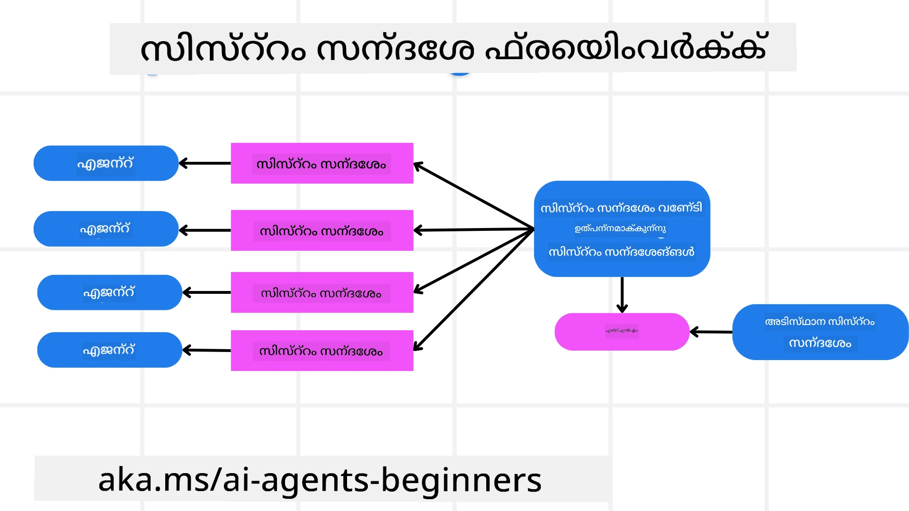
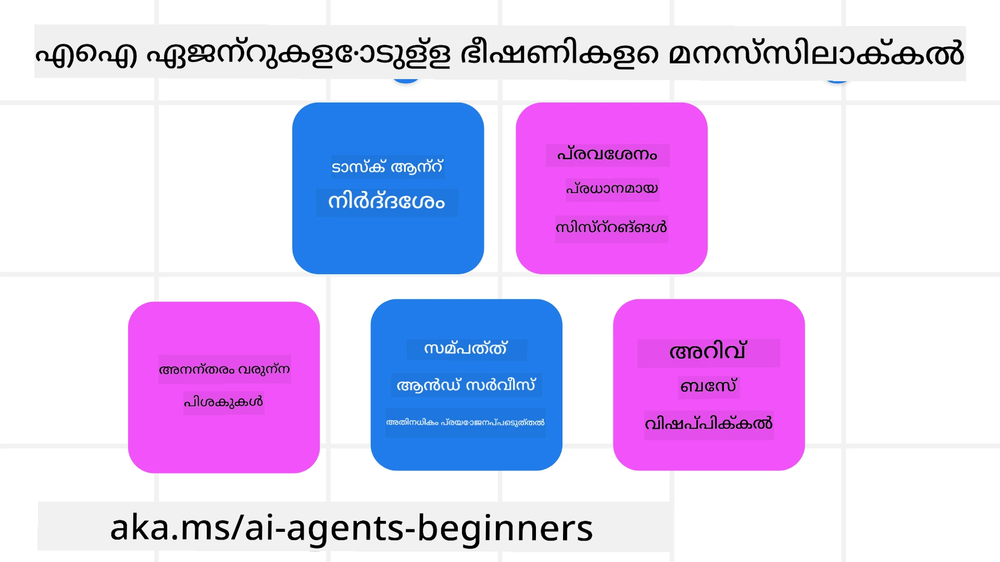
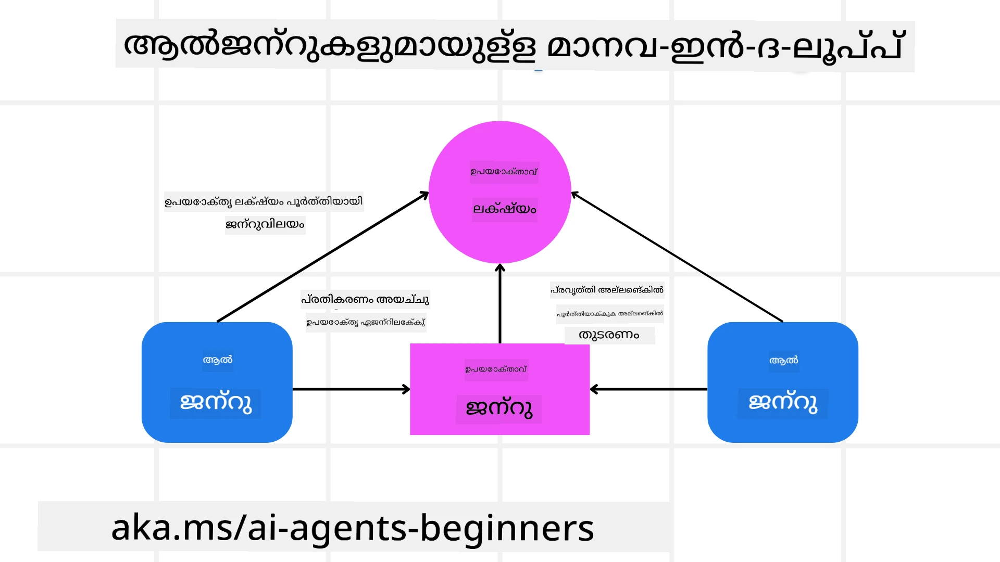

[](https://youtu.be/iZKkMEGBCUQ?si=Q-kEbcyHUMPoHp8L)

> _(ഈ പാഠത്തിന്റെ വീഡിയോ കാണാൻ മുകളിലെ ചിത്രം ക്ലിക്ക് ചെയ്യുക)_

# വിശ്വാസയോഗ്യമായ AI ഏജന്റുകൾ നിർമ്മിക്കുക

## പരിചയം

ഈ പാഠത്തിൽ ഉൾപ്പെട്ടിരിക്കുന്നത്:

- സുരക്ഷിതവും ഫലപ്രദവുമായ AI ഏജന്റുകൾ എങ്ങനെ നിർമ്മിച്ച് വിന്യസിക്കാമെന്ന്
- AI ഏജന്റുകൾ വികസിപ്പിക്കുമ്പോൾ പരിഗണിക്കേണ്ട പ്രധാന സുരക്ഷാ കാര്യങ്ങൾ
- AI ഏജന്റുകൾ വികസിപ്പിക്കുമ്പോൾ ഡാറ്റയും ഉപയോക്തൃ സ്വകാര്യതയുമെങ്ങനെ സംരക്ഷിക്കാമെന്ന്

## പഠന ലക്ഷ്യങ്ങൾ

ഈ പാഠം പൂർത്തിയാക്കിയതിനു ശേഷം, നിങ്ങൾക്ക് അറിയാവുന്നത്:

- AI ഏജന്റുകൾ സൃഷ്ടിക്കുമ്പോൾ ഉണ്ടായാവുന്ന അപകടങ്ങൾ തിരിച്ചറിയുകയും അവ പരിഹരിക്കുകയും ചെയ്യുക.
- ഡാറ്റയും ആക്‌സസും ശരിയായി നിയന്ത്രിക്കപ്പെടുന്നുണ്ടെന്ന് ഉറപ്പാക്കാൻ സുരക്ഷാ നടപടികൾ നടപ്പാക്കുക.
- ഡാറ്റാ സ്വകാര്യത നിലനിർത്തുകയും മികച്ച ഉപയോക്തൃ അനുഭവം നൽകുകയും ചെയ്യുന്ന AI ഏജന്റുകൾ സൃഷ്ടിക്കുക.

## സുരക്ഷ

സുരക്ഷിതമായ ഏജന്റിക് ആപ്ലിക്കേഷനുകൾ നിർമ്മിക്കുന്നത് ആദ്യം നോക്കാം. സുരക്ഷ എന്നത് AI ഏജന്റ് രൂപകൽപ്പനപ്രകാരമേ പ്രവർത്തിക്കുകയാണെന്ന് ഉറപ്പാക്കുക എന്നതാണ്. എജന്റിക് ആപ്ലിക്കേഷനുകളുടെ നിർമ്മാതാക്കളായി, സുരക്ഷ പരമാവധി ആക്കാൻ ഞങ്ങൾക്ക് ഉപയോഗിക്കാവുന്ന നടപടി രീതികളും ഉപകരണങ്ങളും ഉണ്ട്:

### സിസ്റ്റം മെസേജ് ഫ്രെയിംവർക്ക് നിർമ്മിക്കൽ

വലുതായ ഭാഷാ മോഡലുകൾ (LLMs) ഉപയോഗിച്ച് നിങ്ങൾ എനിക്ക് ആപ്ലിക്കേഷൻ നിർമ്മിച്ചിട്ടുണ്ടെങ്കിലെൻ, ദൃഢമായ സിസ്റ്റം പ്രോംപ്റ്റ് അല്ലെങ്കിൽ സിസ്റ്റം മെസേജിന്റെ രൂപകൽപ്പനയുടെ പ്രാധാന്യം നിങ്ങൾ അറിയാവും. ഈ പ്രോംപ്റ്റുകൾ LLM ഉപയോക്താവിനോടും ഡാറ്റയോടും എങ്ങനെ ഇടപെടുമെന്ന് തീരുമാനിക്കുന്ന മെറ്റാ നിയമങ്ങൾ, നിർദേശങ്ങൾ, മാർഗ്ഗരേഖകൾ എന്നിവ സ്ഥാപിക്കുന്നു.

AI ഏജന്റുകളുടെ കാര്യത്തിൽ, നമുക്ക് രൂപകൽപ്പന ചെയ്തിരിക്കുന്ന ജോലികൾ പൂർത്തിയാക്കാൻ ഏജന്റുകൾക്ക് വളരെ നിർദ്ദിഷ്ട നിർദേശങ്ങൾ ആവശ്യമാണ് എന്നതിനാൽ സിസ്റ്റം പ്രോംപ്റ്റ് കൂടുതൽ പ്രധാനമാണ്.

സ്കെയിലബിൾ സിസ്റ്റം പ്രോംപ്റ്റുകൾ സൃഷ്ടിക്കാൻ, ആപ്ലിക്കേഷനിലേക്കുള്ള ഒരു അല്ലെങ്കിൽ അതിലധികം ഏജന്റുകൾ നിർമ്മിക്കാൻ സിസ്റ്റം മെസേജ് ഫ്രെയിംവർക്കിനെ ഉപയോഗിക്കാം:



#### പടി 1: ഒരു മെടാ സിസ്റ്റം മെസേജ് സൃഷ്ടിക്കുക 

മെടാ പ്രോംപ്റ്റ് LLM ഉപയോഗിച്ച് നമുക്ക് സൃഷ്ടിക്കുന്ന ഏജന്റുകൾക്കായുള്ള സിസ്റ്റം പ്രോംപ്റ്റുകൾ ജനറേറ്റ് ചെയ്യാൻ ഉപയോഗിക്കും. ഇത് ഒരു ടെംപ്ലേറ്റായി രൂപകൽപ്പന ചെയ്യുന്നു zodat ആവശ്യമുണ്ടെങ്കിൽ നമുക്ക് ഫലപ്രദമായി പല ഏജന്റുകളും സൃഷ്ടിക്കാനാകും.

ഇതാ LLM-ന് നമുക്ക് നൽകാൻ പോകുന്ന ഒരു മെടാ സിസ്റ്റം മെസേജിന്റെ ഉദാഹരണം:

```plaintext
You are an expert at creating AI agent assistants. 
You will be provided a company name, role, responsibilities and other
information that you will use to provide a system prompt for.
To create the system prompt, be descriptive as possible and provide a structure that a system using an LLM can better understand the role and responsibilities of the AI assistant. 
```

#### പടി 2: ഒരു അടിസ്ഥാന പ്രോംപ്റ്റ് സൃഷ്ടിക്കുക

അടുത്ത പടി AI ഏജന്റിനെ വിവരണം ചെയ്യുന്നതിനുള്ള ഒരു അടിസ്ഥാന പ്രോംപ്റ്റ് സൃഷ്ടിക്കുക എന്നതാണ്. ഏജന്റിന്റെ റോൾ, ഏജന്റ് പൂർത്തിയാക്കാൻ പോകുന്ന ടാസ്‌കുകൾ, കൂടാതെ ഏജന്റിന് ഉള്ള മറ്റ് ഉത്തരവാദിത്വങ്ങളും ഉൾപ്പെടുത്തണം.

ഇതാ ഒരു ഉദാഹരണം:

```plaintext
You are a travel agent for Contoso Travel that is great at booking flights for customers. To help customers you can perform the following tasks: lookup available flights, book flights, ask for preferences in seating and times for flights, cancel any previously booked flights and alert customers on any delays or cancellations of flights.  
```

#### പടി 3: അടിസ്ഥാന സിസ്റ്റം മെസേജ് LLM-ന് നൽകുക

ഇപ്പോൾ മെടാ സിസ്റ്റം മെസേജിനെ സിസ്റ്റം മെസേജായി നൽകിയും നമ്മുടെ അടിസ്ഥാന സിസ്റ്റം മെസേജും ഉപയോഗിച്ച് ഈ സിസ്റ്റം മെസേജ് ഒപ്റ്റിമൈസ് ചെയ്യാം.

ഇത് നമ്മുടെ AI ഏജന്റുകളെ വഴികാട്ടിക്കാൻ മികച്ച രൂപത്തിൽ രൂപകൽപ്പന ചെയ്ത ഒരു സിസ്റ്റം മെസേജ് ഉണ്ടാക്കും:

```markdown
**Company Name:** Contoso Travel  
**Role:** Travel Agent Assistant

**Objective:**  
You are an AI-powered travel agent assistant for Contoso Travel, specializing in booking flights and providing exceptional customer service. Your main goal is to assist customers in finding, booking, and managing their flights, all while ensuring that their preferences and needs are met efficiently.

**Key Responsibilities:**

1. **Flight Lookup:**
    
    - Assist customers in searching for available flights based on their specified destination, dates, and any other relevant preferences.
    - Provide a list of options, including flight times, airlines, layovers, and pricing.
2. **Flight Booking:**
    
    - Facilitate the booking of flights for customers, ensuring that all details are correctly entered into the system.
    - Confirm bookings and provide customers with their itinerary, including confirmation numbers and any other pertinent information.
3. **Customer Preference Inquiry:**
    
    - Actively ask customers for their preferences regarding seating (e.g., aisle, window, extra legroom) and preferred times for flights (e.g., morning, afternoon, evening).
    - Record these preferences for future reference and tailor suggestions accordingly.
4. **Flight Cancellation:**
    
    - Assist customers in canceling previously booked flights if needed, following company policies and procedures.
    - Notify customers of any necessary refunds or additional steps that may be required for cancellations.
5. **Flight Monitoring:**
    
    - Monitor the status of booked flights and alert customers in real-time about any delays, cancellations, or changes to their flight schedule.
    - Provide updates through preferred communication channels (e.g., email, SMS) as needed.

**Tone and Style:**

- Maintain a friendly, professional, and approachable demeanor in all interactions with customers.
- Ensure that all communication is clear, informative, and tailored to the customer's specific needs and inquiries.

**User Interaction Instructions:**

- Respond to customer queries promptly and accurately.
- Use a conversational style while ensuring professionalism.
- Prioritize customer satisfaction by being attentive, empathetic, and proactive in all assistance provided.

**Additional Notes:**

- Stay updated on any changes to airline policies, travel restrictions, and other relevant information that could impact flight bookings and customer experience.
- Use clear and concise language to explain options and processes, avoiding jargon where possible for better customer understanding.

This AI assistant is designed to streamline the flight booking process for customers of Contoso Travel, ensuring that all their travel needs are met efficiently and effectively.

```

#### പടി 4: ആവർത്തിച്ച് മെച്ചപ്പെടുത്തുക

ഈ സിസ്റ്റം മെസേജ് ഫ്രെയിംവർക്കിന്റെ മൂല്യം സംസ്ഥാനത്ത് പല ഏജന്റുകൾക്കുള്ള സിസ്റ്റം മെസേജുകൾ സ്കെയിൽ ചെയ്യാൻ മാത്രമല്ല, സമയംകൊണ്ട് നിങ്ങളുടെ സിസ്റ്റം മെസേജുകൾ മെച്ചപ്പെടുത്താനും സഹായിക്കുന്നു. ആദ്യ ശ്രമത്തിൽ നിങ്ങളുടെ മുഴുവൻ ഉപയോഗകേസിനും അനുയോജ്യമായ സിസ്റ്റം മെസേജ് ഉണ്ടാകുന്നത് അപൂർവമാണ്. അടിസ്ഥാന സിസ്റ്റം മെസേജിൽ ചെറിയ മാറ്റങ്ങൾ കൊണ്ടു അത് സിസ്റ്റത്തിലൂടെ ഓടിപ്പോവുക വഴി ഫലങ്ങൾ താരതമ്യം ചെയ്ത് വിലയിരുത്താൻ കഴിയും.

## ഭീഷണികൾ മനസിലാക്കുക

വിശ്വാസയോഗ്യമായ AI ഏജന്റുകൾ നിർമ്മിക്കാൻ, നിങ്ങളുടെ AI ഏജന്റിന് നേരെ വരുന്ന റിസ്കുകളും ഭീഷണികളും മനസ്സിലാക്കി അവ നിവാരണപ്പെടുത്തുന്നത് പ്രധാനമാണ്. AI ഏജന്റുകൾക്കെതിരെ വരുന്ന വ്യത്യസ്ത ഭീഷണികളിലെ കുറച്ചു ഉദാഹരണങ്ങളും അവയ്ക്ക് നിങ്ങൾ എങ്ങനെ നല്ലതൂടെ രൂപം ചിട്ടികൊടുക്കാമെന്ന് നോക്കാം.



### പ്രവർത്തി և നിർദ്ദേശങ്ങൾ

**വിവരണം:** ആക്രമികൾ പ്രോംപ്റ്റിംഗിന്റെയും ഇൻപുട്ടുകൾ തിരുത്തുന്നതുമായ മാർഗങ്ങളിലൂടെയോ ഉപദ്രവിച്ചുകളയലുകളിലൂടെയോ AI ഏജന്റിന്റെ നിർദേശങ്ങൾ അല്ലെങ്കിൽ ലക്ഷ്യങ്ങൾ മാറ്റാൻ ശ്രമിക്കുന്നു.

**പരിഹാരം:** അപകടസാധ്യതയുള്ള പ്രോംപ്റ്റുകൾ AI ഏജന്റിലേക്ക് പ്രോസസ് ചെയ്യുന്നതിനു മുമ്പായി കണ്ടെത്താൻ വാലിഡേഷൻ ചെക്കുകളും ഇൻപുട്ട് ഫിൽട്ടറുകളും നടപ്പിലാക്കുക. ഈ ആക്രമണങ്ങൾക്ക് സാധാരണയായി ഏജന്റുമായി frecuentes ഇടപെടൽ ആവശ്യമാണ്, അതുകൊണ്ട് സംഭാഷണത്തിലെ ടേൺകളുടെ എണ്ണം നിയന്ത്രിക്കുക എന്നുമുണ്ട് ഈ തരം ആക്രമണങ്ങൾ തടയാനുള്ള മറ്റൊരു മാർഗം.

### പ്രധാന സിസ്റ്റുകളിലേക്കുള്ള ആക്‌സസ്

**വിവരണം:** ഒരു AI ഏജന്റ് സങ്കീർണ ഡാറ്റ സൂക്ഷിക്കുന്ന സിസ്റ്റങ്ങളും സേവനങ്ങളും ആക്സസ് ചെയ്യുകയാണെങ്കിൽ, ആക്രമികൾ ഏജന്റും ആ സേവനങ്ങളും തമ്മിലുള്ള സംവാദം നഷ്ടപ്പെടുത്താൻ ശ്രമിക്കാം. ഇത് നേരിട്ട് ആയാകാമോ അല്ലെങ്കിൽ ഏജന്റിലൂടെ ആ സിസ്റ്റങ്ങളെക്കുറിച്ചുള്ള വിവരങ്ങൾ നേടാനുള്ള പരോക്ഷ ശ്രമങ്ങളായിരിക്കാം.

**പരിഹാരം:** ഇത്തരം ആക്രമണങ്ങൾ തടയാൻ AI ഏജന്റുകൾക്ക് ആവശ്യമായ ഘടകങ്ങളെ മാത്രമേ ആക്‌സസ് നൽകാവൂ എന്നതിന് പ്രസക്തമായ ആക്‌സസ് നയം പാലിക്കുക. ഏജന്റും സിസ്റ്റവും തമ്മിലുള്ള സംവാദം സുരക്ഷിതമാണെന്ന് ഉറപ്പാക്കുക. ആθεν്റിക്കേഷൻ एवं ആക്‌സസ് നിയന്ത്രണം നടപ്പിലാക്കൽ ഈ വിവരം സംരക്ഷിക്കാൻ സഹായിക്കും.

### റിസോഴ്സ് және സേവന ഓവർലോഡിംഗ്

**വിവരണം:** AI ഏജന്റുകൾ ടാസ്‌കുകൾ പൂർത്തിയാക്കാൻ വിവിധ ടൂളുകളും സേവനങ്ങളും ആക്സസ് ചെയ്യാം. ആക്രമികൾ ഈ ശേഷി ഉപയോഗിച്ച് AI ഏജന്റ് വഴി വലിയ എണ്ണം റിക്വസ്റുകൾ അയച്ചുകൊണ്ട് ഈ സേവനത്തെ ആക്രമിക്കാൻ ഉപയോഗിക്കാവുന്നതാണ്, ഇത് സിസ്റ്റം ഫെയില്യറുകൾക്കും ഉയർന്ന ചെലവുകൾക്കും കാരണമാകാം.

**പരിഹാരം:** ഒരു AI ഏജന്റ് ഒരു സേവനത്തിന് യഥേഷ്ടം കൊണ്ടു പറയാവുന്ന റിക്വസ്റ്റുകളുടെ എണ്ണം പരിമിതപ്പെടുത്താൻ നയങ്ങൾ നടപ്പിലാക്കുക. നിങ്ങളുടെ AI ഏജന്റിലേക്ക് നടക്കുന്ന സംഭാഷണ ടേൺസിന്റെയും അഭ്യർഥനകളുടെയും എണ്ണം ചെറുക്കുക എന്നതും ഈ തരം ആക്രമണങ്ങൾ തടയുന്നതിനുള്ള മറ്റൊരു മാർഗമാണ്.

### ജ്ഞാനഭണ്ഡാരം വിഷാംശീകരണം

**വിവരണം:** ഈ തരത്തിലുള്ള ആക്രമണം നേരിട്ട് AI ഏജന്റ് ടാർഗറ്റ്ചെയ്യുന്നില്ല; മറിച്ച് ഏജന്റിനുള്ള ജ്ഞാനഭണ്ഡാരത്തെയും മറ്റു സേവനങ്ങളെയും ലക്ഷ്യമിടുന്നു. ടാസ്‌ക് പൂർത്തിയാക്കാൻ ഏജന്റ് ഉപയോഗിക്കേണ്ട ഡാറ്റയെയോ വിവരങ്ങളെയോ നശിപ്പിക്കുക ഇതിൽപ്പെട്ടേക്കാം, അത് ഉപയോക്താവിന് പക്കൽ പക്ഷപാതമുള്ള അല്ലെങ്കിൽ ആഗ്രഹിക്കാത്ത പ്രതികരണങ്ങൾക്ക് കാരണമാകാം.

**പരിഹാരം:** AI ഏജന്റ് workflows-ൽ ഉപയോഗിക്കുന്ന ഡാറ്റയുടെ സ്വതന്ത്രമായ പരിശോധനാ നടപടികൾ സ്ഥിരമായി നടത്തുക. ഈ ഡാറ്റയുടെ ആക്‌സസ് സുരക്ഷിതമാക്കുകയും, വിശ്വാസ്യതയുള്ള വ്യക്തികൾ മാത്രം മാറ്റങ്ങൾ വരുത്താൻ പാടുള്ളതിനും ഉറപ്പാക്കുക, ഇത്തരം ആക്രമണം ഒഴിവാക്കാൻ.

### ക്രമാഗത പിശകുകൾ

**വിവരണം:** ടാസ്‌കുകൾ പൂർത്തിയാക്കാൻ AI ഏജന്റുകൾ വിവിധ ടൂളുകളും സേവനങ്ങളും ആക്സസ്സ് ചെയ്യുന്നു. ആക്രമികൾ കാരണമായ പിശകുകൾേ തുടർച്ചയായി മറ്റ് സിസ്റ്റങ്ങളുടെ തകരാറുകൾക്ക് കാരണമാകാവുന്നതാണ്, ഇത് ആക്രമണം കൂടുതൽ വ്യാപകമാക്കുകയും ട്രബിൾഷൂട്ടിംഗ് ഏറെ പ്രയാസമാക്കുകയും ചെയ്യുന്നു.

**പരിഹാരം:** ഇതിനെ ഒഴിവാക്കാനുള്ള ഒരു രീതിയാണ് AI ഏജന്റിനെ പരിമിത പരിധിയിലുള്ള പരിസ്ഥിതിയിലായിരുത്തുക, ഉദാഹരണത്തിന് Docker കണ്ടെയ്‌നറിൽ ടാസ്‌കുകൾ നടത്തുന്നത് പോലുള്ളത്, നേരിട്ടുള്ള സിസ്റ്റം ആക്രമണങ്ങൾ തടയാൻ. ചില സിസ്റ്റങ്ങൾ പിശക് റിട്ടേൺ ചെയ്യുമ്പോൾ ഫാൾബാക്ക് മെക്കാനിസങ്ങളെയും റീട്രൈ ലജിക്കും സൃഷ്ടിക്കുക വലിയ സിസ്റ്റം തകരാറുകൾ തടയാൻ സഹായിക്കും.

## മനുഷ്യന്‍ ഇടപെടൽ

വിശ്വാസയോഗ്യമായ AI ഏജന്റ് സിസ്റ്റങ്ങൾ നിർമ്മിക്കാൻ മറ്റൊരു ഫലപ്രദമായ മാർഗം മനുഷ്യന്‍-ഇൻ-ദി-ലൂപ്പ് ഉപയോഗിക്കുന്നതാണ്. ഇത് റൺ സമയത്ത് ഉപയോക്താക്കൾ ഏജന്റുകളിലേക്ക് ഫീഡ്ബാക്ക് നൽകാൻ കഴിയുന്ന ഒരു പ്രവാഹം സൃഷ്ടിക്കുന്നു. ഉപയോക്താക്കൾ അടിസ്ഥാനപരമായി മൾട്ടി-ഏജന്റ് സിസ്റ്റത്തിലെ ഏജന്റുകളായി പ്രവർത്തിക്കുകയും റൺ ചെയ്യുന്നതിന്റെ അംഗീകാരം നൽകുകയോ ഒഴിവാക്കുകയോ ചെയ്യുകയും ചെയ്യുന്നു.



Microsoft Agent Framework ഉപയോഗിച്ചുള്ള ഈ ആശയം എത്രം നടപ്പാക്കിയിട്ടുണ്ടെന്നു കാണിക്കുന്ന ഒരു കോഡ് സ്നിപ്പെറ്റ് ഇവിടെ ഉണ്ട്:

```python
import os
from agent_framework.azure import AzureAIProjectAgentProvider
from azure.identity import AzureCliCredential

# മാനവംഗീകാരം ഉൾപ്പെടുന്ന പ്രൊവൈഡറെ സൃഷ്ടിക്കുക
provider = AzureAIProjectAgentProvider(
    credential=AzureCliCredential(),
)

# മാനവ അംഗീകാര ഘട്ടമുള്ള ഏജന്റ് സൃഷ്ടിക്കുക
response = provider.create_response(
    input="Write a 4-line poem about the ocean.",
    instructions="You are a helpful assistant. Ask for user approval before finalizing.",
)

# ഉപയോക്താവ് ഉത്തരം അവലോകനം ചെയ്ത് അംഗീകരിക്കാം
print(response.output_text)
user_input = input("Do you approve? (APPROVE/REJECT): ")
if user_input == "APPROVE":
    print("Response approved.")
else:
    print("Response rejected. Revising...")
```

## ഉപസംഹാരം

വിശ്വാസയോഗ്യമായ AI ഏജന്റുകൾ നിർമ്മിക്കുന്നത് സാവധാനമായ രൂപകൽപ്പന, ശക്തമായ സുരക്ഷാ നടപടികൾ, തുടർച്ചയായ ആവർത്തനങ്ങളാണ് ആവശ്യമുള്ളത്. ഘടിത മെടാ പ്രോംപ്റ്റിംഗ് സിസ്റ്റങ്ങൾ നടപ്പാക്കുകയും, സാധ്യതയുള്ള ഭീഷണികൾ മനസ്സിലാക്കുകയും, നിവാരണ στρατηγίες പ്രയോഗിക്കുകയും ചെയ്യുമ്പോൾ ഡെവലപ്പർമാർ സുരക്ഷിതവും ഫലപ്രദവുമായ AI ഏജന്റുകൾ സൃഷ്ടിച്ചെടുക്കാം. കൂടാതെ, മനുഷ്യൻ-ഇൻ-ദി-ലൂപ്പ് സമീപനം ഉൾപ്പെടുത്തുന്നത് AI ഏജന്റുകൾ ഉപയോക്തൃ ആവശ്യങ്ങളോടൊപ്പം നിരന്തരം സജ್ಜമാക്കി റിസ്ക്കുകൾ കുറക്കാൻ സഹായിക്കുന്നു. AI പുരോഗമിക്കുകയും ചെയ്യുന്ന സാഹചര്യത്തിൽ സുരക്ഷ, സ്വകാര്യത, നൈറ്റികൽ പരിഗണനകളിൽ സജീവമായ സമീപനം നിലനിർത്തുന്നത് AI അധിഷ്ഠിത സിസ്റ്റുകളിൽ വിശ്വാസം ഉറപ്പാക്കുന്നതിന് അത്യാവശ്യമാണ്.

### വിശ്വാസയോഗ്യമായ AI ഏജന്റുകൾ നിർമ്മിക്കുന്നതിനെക്കുറിച്ച് കൂടുതൽ ചോദ്യങ്ങളുണ്ടോ?

ഗുരുതരമായ മറ്റ് പഠിതാക്കളെ കാണാനും, ഓഫീസ് മണിക്കൂറുകളിൽ പങ്കെടുക്കാനും, നിങ്ങളുടെ AI ഏജന്റുകൾക്കുള്ള ചോദ്യങ്ങൾക്ക് മറുപടി കിട്ടാനും [Microsoft Foundry Discord](https://aka.ms/ai-agents/discord) ൽ ചേരുക.

## കൂടുതൽ വിഭവങ്ങൾ

- <a href="https://learn.microsoft.com/azure/ai-studio/responsible-use-of-ai-overview" target="_blank">ഉത്തരവാദിത്വമുള്ള AI അവലോകനം</a>
- <a href="https://learn.microsoft.com/azure/ai-studio/concepts/evaluation-approach-gen-ai" target="_blank">ജനനാത്മക AI മോഡലുകളും AI ആപ്ലിക്കേഷനുകളുടെയും വിലയിരുത്തൽ</a>
- <a href="https://learn.microsoft.com/azure/ai-services/openai/concepts/system-message?context=%2Fazure%2Fai-studio%2Fcontext%2Fcontext&tabs=top-techniques" target="_blank">സുരക്ഷാ സിസ്റ്റം മെസേജുകൾ</a>
- <a href="https://blogs.microsoft.com/wp-content/uploads/prod/sites/5/2022/06/Microsoft-RAI-Impact-Assessment-Template.pdf?culture=en-us&country=us" target="_blank">റിസ്ക് അസസ്മെന്റ് ടെംപ്ലേറ്റ്</a>

## Previous Lesson

[Agentic RAG](../05-agentic-rag/README.md)

## Next Lesson

[Planning Design Pattern](../07-planning-design/README.md)

---

<!-- CO-OP TRANSLATOR DISCLAIMER START -->
അസ്വീകരണം:
ഈ രേഖ AI വിവർത്തന സേവനമായ Co-op Translator (https://github.com/Azure/co-op-translator) ഉപയോഗിച്ച് വിവർത്തനം ചെയ്തതാണ്. ഞങ്ങൾ കൃത്യതയ്ക്കായി പരിശ്രമിച്ചെങ്കിലും, ഓട്ടോമാറ്റിക് വിവർത്തനങ്ങളിൽ പിശകുകളോ അകൃത്യതകളോ ഉണ്ടാകാമെന്ന് ദയവായി ശ്രദ്ധിക്കുക. സ്വദേശഭാഷയിൽ ഉള്ള മൂല രേഖ പ്രാമാണിക സ്രോതസ്സായി പരിഗണിക്കേണ്ടതാണ്. നിർണായക വിവരങ്ങൾക്ക് പ്രൊഫഷണൽ മനുഷ്യ വിവർത്തനം ശുപാർശ ചെയ്യപ്പെടുന്നു. ഈ വിവർത്തനം ഉപയോഗിച്ചതിനെത്തുടർന്ന് ഉണ്ടായേക്കാവുന്ന ഏത് തെറ്റിദ്ധാരണത്തിനും അല്ലെങ്കിൽ തെറ്റായ വ്യാഖ്യാനത്തിനും ഞങ്ങൾ ഉത്തരവാദികളല്ല.
<!-- CO-OP TRANSLATOR DISCLAIMER END -->