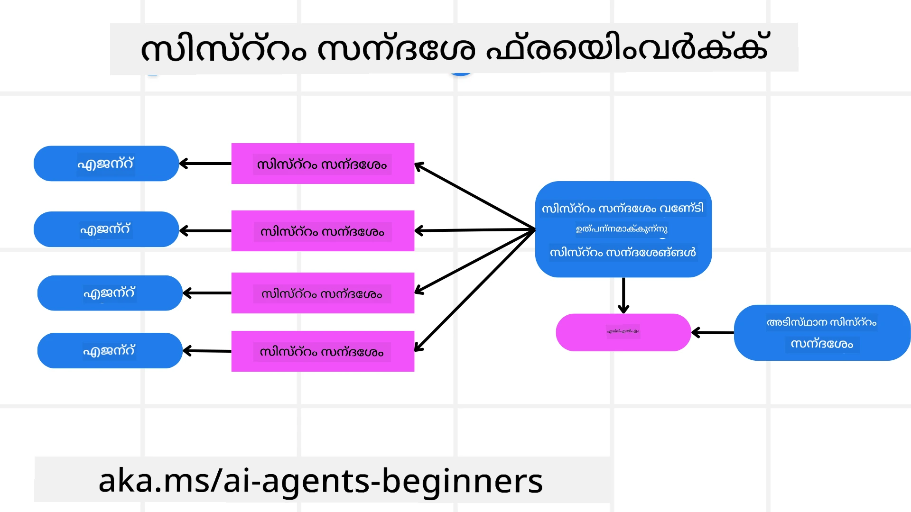
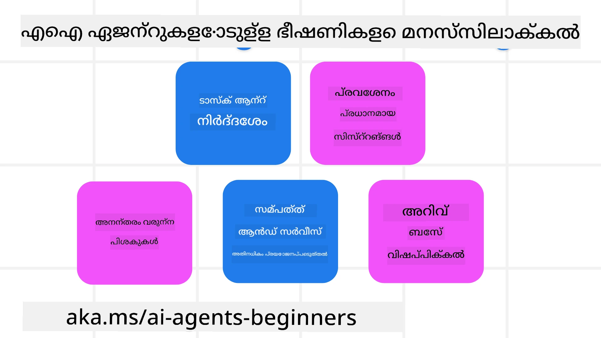
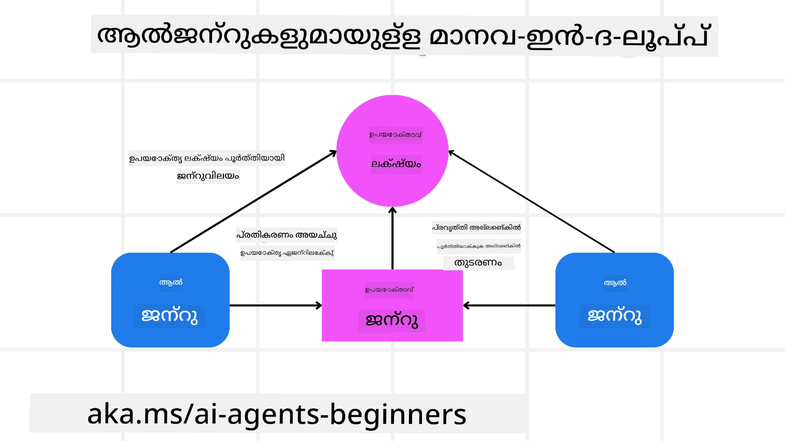

[](https://youtu.be/iZKkMEGBCUQ?si=Q-kEbcyHUMPoHp8L)

> _(ഈ പാഠത്തിന്റെ വീഡിയോ കാണുന്നതിനായി മുകളിൽ ഈ ചിത്രം ക്ലിക്കുചെയ്യുക)_

# വിശ്വസനീയമായ AI ഏജന്റുമാർ നിർമ്മിക്കല്

## പരിചയം

ഈ പാഠത്തിൽ ഉൾക്കൊള്ളുന്നതാണ്:

- സുരക്ഷിതവും ഫലപ്രദവുമായ AI ഏജന്റുമാർ എങ്ങനെ നിർമ്മിക്കാം, വിനിയോഗിക്കാം
- AI ഏജന്റുമാർ വികസിപ്പിക്കുമ്പോൾ ശ്രദ്ധിക്കേണ്ട പ്രധാന സുരക്ഷാ കാര്യങ്ങൾ.
- AI ഏജന്റുമാർ വികസിപ്പിക്കുമ്പോൾ ഡാറ്റയും ഉപയോക്തൃ സ്വകാര്യതയും എങ്ങനെ പരിരക്ഷിക്കാമെന്ന്.

## പഠനലക്ഷ്യങ്ങൾ

ഈ പാഠം പൂർത്തിയാക്കിയശേഷം നിങ്ങൾക്ക് അറിയാമാകുന്നത്:

- AI ഏജന്റുമാർ സൃഷ്ടിക്കുമ്പോൾ ഭീഷണികളും അപകടങ്ങളും തിരിച്ചറിയുകയും കുറയ്ക്കുകയും ചെയ്യുക.
- ഡാറ്റയും ആക്സസും ശരിയായി നിയന്ത്രിക്കുന്നതിന് സുരക്ഷാ നടപടികൾ നടപ്പിലാക്കുക.
- ഡാറ്റ സ്വകാര്യത കാത്തുസൂക്ഷിക്കുകയും ഗുണമേൻമയുള്ള ഉപയോക്തൃ അനുഭവം നൽകുകയും ചെയ്യുന്ന AI ഏജന്റുമാർ സൃഷ്ടിക്കുക.

## സുരക്ഷ

ആദ്യം സുരക്ഷിതമായ ഏജന്റിക് ആപ്ലിക്കേഷനുകൾ നിർമ്മിക്കലിനോടു നോക്കാം. സുരക്ഷ എന്നതിന്റെ അർത്ഥം AI ഏജൻറ് രൂപകൽപ്പനപ്രകാരം പ്രവർത്തിക്കണമെന്നും ആണ്. ഏജന്റിക് ആപ്ലിക്കേഷനുകളുടെ നിർമ്മാതാക്കൾ ആയി സുരക്ഷ വർദ്ധിപ്പിക്കുന്നതിന് വേണ്ട മാർഗങ്ങളും ഉപകരണങ്ങളും നമ്മുക്ക് ഉണ്ടു:

### ഒരു സിസ്റ്റം മെസേജ് ഫ്രെയിംവർക്ക് നിർമ്മിക്കൽ

നിങ്ങൾ വലിയ ഭാഷാ മോഡലുകൾ (LLMs) ഉപയോഗിച്ച് AI ആപ്ലിക്കേഷൻ നിർമ്മിച്ചിട്ടുണ്ടെങ്കിൽ ശക്തമായ സിസ്റ്റം പ്രോംപ്റ്റ് അല്ലെങ്കിൽ സിസ്റ്റം മെസേജ് രൂപകൽപ്പന ചെയ്യുന്നത് എത്ര പ്രധാനമാണെന്ന് അറിയാമാകും. ഈ പ്രോംപ്റ്റുകൾ LLM ഉപയോക്താവിനും ഡാറ്റയോടുമുള്ള ഇടപെടലിനുള്ള മെടാ നിബന്ധനകളും നിർദ്ദേശങ്ങളും മാർഗനിർദേശങ്ങളും നിശ്ചയിക്കുന്നു.

AI ഏജന്റുമാർക്കായി സിസ്റ്റം പ്രോംപ്റ്റ് കൂടുതൽ പ്രധാനമാണു, കാരണം AI ഏജന്റുമാർക്ക് ഞങ്ങൾ രൂപകൽപ്പന ചെയ്ത ജോലി നിർവ്വഹിക്കാൻ പ്രത്യേകമായ നിർദ്ദേശങ്ങൾ ആവശ്യമുണ്ട്.

സ്കേലബിൾ സിസ്റ്റം പ്രോംപ്റ്റുകൾ സൃഷ്ടിക്കാൻ, ഞങ്ങൾ ഒരു സിസ്റ്റം മെസേജ് ഫ്രെയിംവർക്ക് ഉപയോഗിച്ച് നമ്മുടെ ആപ്പ്ലിക്കേഷനിലെ ഒരു അല്ലെങ്കിൽ അധികം ഏജന്റുമാർ നിർമ്മിക്കാം:



#### ചുവടു 1: ഒരു മെടാ സിസ്റ്റം മെസേജ് സൃഷ്ടിക്കുക

മെടാ പ്രോംപ്റ്റ് LLM ഉപയോഗിച്ച് ഞങ്ങൾ സൃഷ്ടിക്കുന്ന ഏജന്റുമാരുടെ സിസ്റ്റം പ്രോംപ്റ്റുകൾ നിർമ്മിക്കാൻ ഉപയോഗിക്കും. ഇത് ഒരു ടെംപ്ലേറ്റായി രൂപകൽപ്പന ചെയ്ത് ആഴ്ച്ചിൽ ഒന്നിലധികം ഏജന്റുമാരെ കാര്യക്ഷമമായി സൃഷ്ടിക്കാൻ കഴിയും.

LLM-ന് നല്കാനുള്ള ഒരു മെടാ സിസ്റ്റം മെസേജിന്റെ ഉദാഹരണം:

```plaintext
You are an expert at creating AI agent assistants. 
You will be provided a company name, role, responsibilities and other
information that you will use to provide a system prompt for.
To create the system prompt, be descriptive as possible and provide a structure that a system using an LLM can better understand the role and responsibilities of the AI assistant. 
```

#### ചുവടു 2: ഒരു അടിസ്ഥാന പ്രോംപ്റ്റ് സൃഷ്ടിക്കുക

അടുത്ത പടി AI ഏജന്റ് വിവരണം ചെയ്യുന്ന ഒരു അടിസ്ഥാന പ്രോംപ്റ്റ് സൃഷ്ടിക്കുക. ഏജന്റിന്റെ സ്ഥാനം, പൂർത്തിയാക്കേണ്ട ജോലി, മറ്റ് ഉത്തരവാദിത്വങ്ങൾ എന്നിവ ഉൾപ്പെടുത്തണം.

ഉദാഹരണമായി:

```plaintext
You are a travel agent for Contoso Travel that is great at booking flights for customers. To help customers you can perform the following tasks: lookup available flights, book flights, ask for preferences in seating and times for flights, cancel any previously booked flights and alert customers on any delays or cancellations of flights.  
```

#### ചുവടു 3: അടിസ്ഥാന സിസ്റ്റം മെസജ് LLM-ന് നൽകുക

ഇപ്പോൾ ഈ സിസ്റ്റം മെസേജ് മെറ്റാ സിസ്റ്റം മെസേജ് എന്നും നമ്മുടെ അടിസ്ഥാന സിസ്റ്റം മെസേജ് എന്നായി നൽകിയാൽ മെച്ചപ്പെട്ട രൂപത്തിൽ ലഭിക്കും.

ഇത് നമുക്ക് AI ഏജന്റുമാരെ നയിക്കാൻ ഉചിതമായ പ്രോംപ്റ്റ് തരുന്ന സിസ്റ്റം മെസേജ് സൃഷ്ടിക്കും:

```markdown
**Company Name:** Contoso Travel  
**Role:** Travel Agent Assistant

**Objective:**  
You are an AI-powered travel agent assistant for Contoso Travel, specializing in booking flights and providing exceptional customer service. Your main goal is to assist customers in finding, booking, and managing their flights, all while ensuring that their preferences and needs are met efficiently.

**Key Responsibilities:**

1. **Flight Lookup:**
    
    - Assist customers in searching for available flights based on their specified destination, dates, and any other relevant preferences.
    - Provide a list of options, including flight times, airlines, layovers, and pricing.
2. **Flight Booking:**
    
    - Facilitate the booking of flights for customers, ensuring that all details are correctly entered into the system.
    - Confirm bookings and provide customers with their itinerary, including confirmation numbers and any other pertinent information.
3. **Customer Preference Inquiry:**
    
    - Actively ask customers for their preferences regarding seating (e.g., aisle, window, extra legroom) and preferred times for flights (e.g., morning, afternoon, evening).
    - Record these preferences for future reference and tailor suggestions accordingly.
4. **Flight Cancellation:**
    
    - Assist customers in canceling previously booked flights if needed, following company policies and procedures.
    - Notify customers of any necessary refunds or additional steps that may be required for cancellations.
5. **Flight Monitoring:**
    
    - Monitor the status of booked flights and alert customers in real-time about any delays, cancellations, or changes to their flight schedule.
    - Provide updates through preferred communication channels (e.g., email, SMS) as needed.

**Tone and Style:**

- Maintain a friendly, professional, and approachable demeanor in all interactions with customers.
- Ensure that all communication is clear, informative, and tailored to the customer's specific needs and inquiries.

**User Interaction Instructions:**

- Respond to customer queries promptly and accurately.
- Use a conversational style while ensuring professionalism.
- Prioritize customer satisfaction by being attentive, empathetic, and proactive in all assistance provided.

**Additional Notes:**

- Stay updated on any changes to airline policies, travel restrictions, and other relevant information that could impact flight bookings and customer experience.
- Use clear and concise language to explain options and processes, avoiding jargon where possible for better customer understanding.

This AI assistant is designed to streamline the flight booking process for customers of Contoso Travel, ensuring that all their travel needs are met efficiently and effectively.

```

#### ചുവടു 4: ആവർത്തിച്ച് മെച്ചപ്പെടുത്തുക

ഈ സിസ്റ്റം മെസേജ് ഫ്രെയിംവർക്ക് മൂല്യം മൾട്ടിപ്പിൾ ഏജന്റുമാരുടെ സിസ്റ്റം മെസേജ് സൃഷ്ടി സ്കേൽ ചെയ്യാനും സമയം കഴിഞ്ഞ് മെച്ചപ്പെടുത്താനും സാധിക്കുന്നതിലാണ്. ആദ്യമായിട്ടൊന്നുമാത്രം നിങ്ങളുടെ മുഴുവൻ ഉപയോഗമുഴുവൻ ക്ക് പ്രവർത്തിക്കത്തക്ക സിസ്റ്റം മെസേജ് ഉണ്ടാകുന്നത് അപൂർവമാണ്. അടിസ്ഥാന സിസ്റ്റം മെസേജ് മാറ്റി സിസ്റ്റത്തിലൂടെ ഓടിച്ച് ചെറിയ മാറ്റങ്ങളും മെച്ചപ്പെടുത്തലുകളും ചെയ്യുന്നത് ഫലങ്ങൾ സ്ഥിരീകരിക്കാനും വിലയിരുത്താനും സഹായിക്കും.

## ഭീഷണികൾ മനസിലാക്കൽ

വിശ്വസനീയമായ AI ഏജന്റുമാർ സൃഷ്ടിക്കാൻ, നിങ്ങളുടെ AI ഏജന്റിന്റെ ഭീഷണികളും അപകടങ്ങളും മനസിലാക്കുകയും കുറയ്ക്കുകയും ചെയ്യുന്നത് വളരെ പ്രധാനമാണ്. AI ഏജന്റുമാരെ ഭീഷണിപ്പെടുത്തുന്ന ചിലാണ് ഭീഷണികൾ, അവ എങ്ങനെ നന്നായി തയാറെടുക്കാനും സംരക്ഷിക്കാനുമുള്ള മാർഗങ്ങൾ.



### ജോലി നിർദ്ദേശവും

**വിവരണം:** ആക്രമണകാരികൾ AI ഏജന്റിന്റെ നിർദ്ദേശങ്ങളോ ലക്ഷ്യങ്ങളോ പ്രോംപ്റ്റിംഗും ഇൻപുട്ടുകളെ നിയന്ത്രിച്ചും മാറ്റാൻ ശ്രമിക്കുന്നു.

**തടയൽ:** AI ഏജന്റ് പ്രോസസ്സ് ചെയ്യുന്നതിന് മുമ്പ് അപകടകാരിയായ പ്രോംപ്റ്റുകൾ കണ്ടെത്താൻ പരിശോധിക്കുന്ന സംവിധാനങ്ങൾ നടപ്പിലാക്കുക. ഈ ആക്രമണങ്ങൾക്ക് ഏജന്റുമായി പലതവണ ഇടപെടലുകൾ വേണ്ടതിനാൽ സംവാദത്തിന്റെ ചുറ്റുപാടുകൾ പരിമിതപ്പെടുത്തുന്നത് മറ്റൊരു തടയൽ മാർഗമാണ്.

### നിർണായക സിസ്റ്റങ്ങളിലേക്ക് ആക്സസ്

**വിവരണം:** സൂക്ഷ്മമായ ഡാറ്റ സൂക്ഷിക്കുന്ന സിസ്റ്റങ്ങൾക്കും സേവനങ്ങൾക്കും AI ഏജന്റ് ആക്സസ് ഉണ്ടെങ്കിൽ, ആക്രമണകാരികൾ ഏജന്റും സേവനങ്ങളും ആശയവിനിമയം തകരാറിലാക്കാം. ഇതൊക്കെ നേരിട്ടുള്ള ആക്രമണങ്ങൾ അല്ലെങ്കിൽ ഏജന്റ് വഴി ഈ സിസ്റ്റങ്ങളേക്കുറിച്ചുള്ള വിവരങ്ങൾ നേടാനുള്ള പൊറുതി ശ്രമങ്ങൾ ആയി ഉണ്ടായിരിക്കും.

**തടയൽ:** ഈ ആക്രമണങ്ങൾ തടയാൻ AI ഏജന്റുകൾക്ക് പ്രയോജനം മാത്രം ആവശ്യമായ സിസ്റ്റങ്ങളിൽ ആക്സസ് അനുവദിക്കുക. ഏജന്റും സിസ്റ്റവും തമ്മിലുള്ള ആശയവിനിമയം സുരക്ഷിതമാകണം. സാക്ഷ്യപ്പെടുത്തിയകന്റроль (authentication and access control) നടപ്പാക്കലും മറ്റൊരു സംരക്ഷണ മാർഗമാണ്.

### വിഭവങ്ങൾക്കും സേവനങ്ങൾക്കും മേൽ ഭാരം

**വിവരണം:** AI ഏജന്റുകൾ ജോലി പൂർത്തിയാക്കാൻ വിവിധ ഉപകരണങ്ങളും സേവനങ്ങളും ആക്‌സസ് ചെയ്യുന്നു. ആക്രമണകാരികൾ ഈ കഴിവ് 이용ിച്ച് AI ഏജന്റ് വഴി requests-ഉം അഭ്യർത്ഥനകളുമുള്ള ഉയർന്ന തോത് നൽകാൻ കഴിയും. ഇതിൽ സിസ്റ്റം പരാജയപ്പെടുക അല്ലെങ്കിൽ ചെലവുകൾ കൂടുക സംഭവിക്കാം.

**തടയൽ:** AI ഏജന്റ് ഒരു സേവനത്തിന് എന്ത് requests അയക്കാൻ കഴിയുമെന്ന് പരിധി നിശ്ചയിക്കുന്ന നയം നടപ്പിൽവക്കും. AI ഏജന്റുമായി സംവാദത്തിന്റെ ചുറ്റുപാടുകളും അഭ്യർത്ഥനകളും പരിധി വയ്ക്കൽ മറ്റൊരു തടയൽ മാർഗമാണ്.

### വിജ്ഞാനശേഖര വിഷാംശം

**വിവരണം:** ഈ ആക്രമണം നേരിട്ട് AI ഏജന്റ് ലക്ഷ്യമാക്കുന്നില്ല, പക്ഷേ AI ഏജന്റ് ഉപയോഗിക്കുന്ന വിജ്ഞാനശേഖരത്തെയും മറ്റ് സേവനങ്ങളെയും ലക്ഷ്യമാക്കുന്നു. ഡാറ്റാ മോഷ്ടിക്കുക അല്ലെങ്കിൽ കേടുവരുത്തുക, ഫലമായി ഉപയോക്താവിന് പക്ഷപാതവും ഉദ്ദേശിക്കാത്ത പ്രതികരണങ്ങളും ഉണ്ടാക്കാം.

**തടയൽ:** AI ഏജന്റ് ഉപയോഗിക്കുന്ന ഡാറ്റയുടെ സ്ഥിരപരിശോധന നടത്തുക. ഈ ഡാറ്റയ്ക്ക് ആക്സസ് സുരക്ഷിതം ആക്കുകയും വിശ്വാസത്തിലുള്ള വ്യക്തികൾ മാത്രമേ മാറ്റങ്ങൾ നടത്തൂ എന്നും ഉറപ്പാക്കുക.

### പരമ്പരാഗത പിഴവ് ശൃംഖലകൾ

**വിവരണം:** AI ഏജന്റുകൾ വിവിധ ഉപകരണങ്ങളും സേവനങ്ങളും ആക്‌സസ് ചെയ്യുന്നു. ആക്രമണകാരികൾ സൃഷ്ടിച്ച പിഴവുകൾ മറ്റ് ബന്ധപ്പെട്ട സിസ്റ്റങ്ങൾ പരാജയപ്പെടുന്നത് ഉണ്ടാക്കും, ഇത് ആക്രമണം വ്യാപകവും നിഗൂഢവുമായാക്കും.

**തടയൽ:** AI ഏജന്റ് ലിമിറ്റഡ് അന്തരീക്ഷത്തിൽ പ്രവർത്തിക്കുന്നതാണ് നല്ലത്. ഉദാഹരണത്തിന്, Docker കൺറ്റെയ്‌നറിൽ പ്രവർത്തനം നടത്തുന്നത് നേരിട്ട് സിസ്റ്റം ആക്രമണങ്ങൾ തടയാം. മാളിന്യങ്ങൾ വരുമ്പോൾ ഫാൾബാക്ക് സംവിധാനങ്ങളും വീണ്ടും ശ്രമിക്കുന്ന ലജിക്കും ഉണ്ടാകുന്നത് വലിയ പരാജയങ്ങൾ തടയാൻ സഹായിക്കും.

## മനുഷ്യൻ-ഇൻ-ദ-ലൂപ്

വിശ്വസനീയമായ AI ഏജന്റുമാർ സിസ്റ്റം നിർമ്മിക്കുന്ന മറ്റൊരു ഫലപ്രദമായ മാർഗം മനുഷ്യൻ-ഇൻ-ദ-ലൂപ് ഉപയോഗിക്കലാണ്. ഇത് ഉപയോഗക്കാർക്ക് റൺ സമയത്ത് ഏജന്റുമാർക്ക് ഫീഡ്ബാക്ക് നൽകാൻ കഴിയുന്ന പ്രവാഹം സൃഷ്ടിക്കുന്നു. ഉപയോക്താക്കൾ മൾട്ടി-ഏജന്റ് സിസ്റ്റത്തിലുമായി ഏജന്റുമാരായി പ്രവർത്തിച്ചുകൊണ്ട് പ്രവർത്തനത്തിന് അംഗീകാരം നൽകുകയോ നിർത്തുകയോ ചെയ്യുന്നു.



മൈക്രോസോഫ്റ്റ് ഏജന്റ് ഫ്രെയിംവർക്ക് ഉപയോഗിച്ച് ഈ ആശയം എങ്ങനെ നടപ്പിലാക്കപ്പെടുന്നുവെന്ന് കാണിക്കുന്ന ഒരു കോഡ് ഉദാഹരണം:

```python
import os
from agent_framework.foundry import FoundryChatClient
from azure.identity import AzureCliCredential

# മനുഷ്യനു ഇടപെടലുള്ള ഓപ്പ്രൂവൽ ഉപയോഗിച്ച് പ്രൊവൈഡർ സൃഷ്ടിക്കുക
provider = FoundryChatClient(
    project_endpoint=os.environ["AZURE_AI_PROJECT_ENDPOINT"],
    model=os.environ["AZURE_AI_MODEL_DEPLOYMENT_NAME"],
    credential=AzureCliCredential(),
)

# മനുഷ്യ അംഗീകാരം ഘട്ടോടുകൂടെ ഏജന്റ് സൃഷ്ടിക്കുക
response = provider.create_response(
    input="Write a 4-line poem about the ocean.",
    instructions="You are a helpful assistant. Ask for user approval before finalizing.",
)

# ഉപയോക്താവ് പ്രതികരണവും അവലംബവും അവലോകനം ചെയ്യാൻ കഴിയും
print(response.output_text)
user_input = input("Do you approve? (APPROVE/REJECT): ")
if user_input == "APPROVE":
    print("Response approved.")
else:
    print("Response rejected. Revising...")
```

## സമാഹാരം

വിശ്വസനീയമായ AI ഏജന്റുമാർ നിർമ്മിക്കൽ സൂക്ഷ്മമായ രൂപകൽപ്പന, ശക്തമായ സുരക്ഷാ നടപടികൾ, തുടർച്ചയായ ആവർത്തനങ്ങൾ എന്നിവ ആവശ്യമുണ്ട്. ഘടനാപരമായ മെടാ പ്രോംപ്റ്റിംഗ് സംവിധാനങ്ങൾ നടപ്പിലാക്കി, സാധ്യതയുള്ള ഭീഷണികൾ മനസിലാക്കി, തടയൽ നയങ്ങൾ പ്രയോഗിച്ച് വികസിപ്പողի ഫലം ഫലപ്രദവും സുരക്ഷിതവുമായ AI ഏജന്റുമാർ സൃഷ്ടിക്കാൻ കഴിയും. കൂടാതെ, മനുഷ്യൻ-ഇൻ-ദ-ലൂപ് സമീപനം ഉൾപ്പെടുത്തി ഉപയോക്തൃ ആവശ്യങ്ങൾക്ക് അനുകൂലമായി, അപകടങ്ങൾ കുറച്ചും AI ഏജന്റുമാർ നിലനിർത്തുന്നത് ഉറപ്പ് വരുത്താം. AI തുടര്ന്ന് പുരോഗമിക്കുമ്പോൾ, സുരക്ഷ, സ്വകാര്യത, ദാർശനിക മാനദണ്ഡങ്ങൾക്ക് മുൻകൈ എടുത്തു മുന്നോട്ട് പോകുന്നത് AI-നിർമ്മിത സിസ്റ്റങ്ങളിൽ വിശ്വാസവും വിശ്വസനീയതയും വളർത്തുന്നതിന് മുഖ്യമാണ്.

## കോഡ് സാമ്പിൾസ്

- [`code_samples/06-system-message-framework.ipynb`](code_samples/06-system-message-framework.ipynb): മെടാ-പ്രോംപ്റ്റ് സിസ്റ്റം-മെസേജ് ഫ്രെയിംവർക്ക് ഘട്ടം ഘട്ടം പ്രദർശനം.
- [`code_samples/06-human-in-the-loop.ipynb`](code_samples/06-human-in-the-loop.ipynb): പ്രീ-ആക്ഷൻ അംഗീകാരം ഗേറ്റ്‌സ്, റിസ്ക് ടിയറിംഗ്, ഓഡിറ്റ് ലോഗിംഗ് വിശ്വസനീയ ഏജന്റുകൾക്കായി.

### വിശ്വസനീയമായ AI ഏജന്റുമാർ നിർമ്മിക്കുമെന്ന് കൂടുതൽ ചോദ്യങ്ങളുണ്ടോ?

[Microsoft Foundry Discord](https://discord.com/invite/ATgtXmAS5D) സദസ്യരായി മറ്റൊരുപാട് പഠിതാക്കളെ കാണാനും ഓഫിസ് আওരുകൾക്കു പങ്കെടുക്കാനും AI ഏജന്റുമാരുടെ ചോദ്യങ്ങൾക്ക് മറുപടി ലഭിക്കാനും.

## അധിക സ്രോതസ്സുകൾ

- <a href="https://learn.microsoft.com/azure/ai-studio/responsible-use-of-ai-overview" target="_blank">ജവാബ്‌സഹിത AI അവലോകനം</a>
- <a href="https://learn.microsoft.com/azure/ai-studio/concepts/evaluation-approach-gen-ai" target="_blank"> ജനറേറ്റീവ് AI മോഡലുകളും AI ആപ്ലിക്കേഷനുകളും വിലയിരുത്തൽ സമീപനം</a>
- <a href="https://learn.microsoft.com/azure/ai-services/openai/concepts/system-message?context=%2Fazure%2Fai-studio%2Fcontext%2Fcontext&tabs=top-techniques" target="_blank">സുരക്ഷാ സിസ്റ്റം മെസേജുകൾ</a>
- <a href="https://blogs.microsoft.com/wp-content/uploads/prod/sites/5/2022/06/Microsoft-RAI-Impact-Assessment-Template.pdf?culture=en-us&country=us" target="_blank">അപകടം വിലയിരുത്തല് തളുടെ</a>

## മുൻപത്തെ പാഠം

[Agentic RAG](../05-agentic-rag/README.md)

## അടുത്ത പാഠം

[പ്ലാനിംഗ് ഡിസൈൻ മാതൃക](../07-planning-design/README.md)

---

<!-- CO-OP TRANSLATOR DISCLAIMER START -->
**അറിയിപ്പ്**:
ഈ രേഖ AI പരിഭാഷാ സേവനം [Co-op Translator](https://github.com/Azure/co-op-translator) ഉപയോഗിച്ച് പരിഭാഷപ്പെടുത്തിയതാണ്. ഞങ്ങൾ കൃത്യതയ്ക്കായി ശ്രമിക്കുന്നുവെങ്കിലും, ഓട്ടോമേറ്റഡ് പരിഭാഷകളിൽ പിഴവുകൾ അല്ലെങ്കിൽ തെറ്റായ വിവരങ്ങൾ ഉണ്ടാകാൻ സാധ്യതയുണ്ട്. അതിന്റെ സ്വാഭാവിക ഭാഷയിലുള്ള അസൽ രേഖയാണ് പ്രാമാണികമായ ഉറവിടമായി പരിഗണിക്കേണ്ടത്. നിർണായകമായ വിവരങ്ങൾക്ക്, പ്രൊഫഷണൽ മനുഷ്യ പരിഭാഷ ശുപാർശ ചെയ്യുന്നു. ഈ പരിഭാഷ ഉപയോഗിച്ച് ഉണ്ടാകുന്ന തെറ്റിദ്ധാരണകൾ അല്ലെങ്കിൽ തെറ്റായ വ്യാഖ്യാനങ്ങൾക്കായി ഞങ്ങൾ ഉത്തരവാദികളല്ല.
<!-- CO-OP TRANSLATOR DISCLAIMER END -->