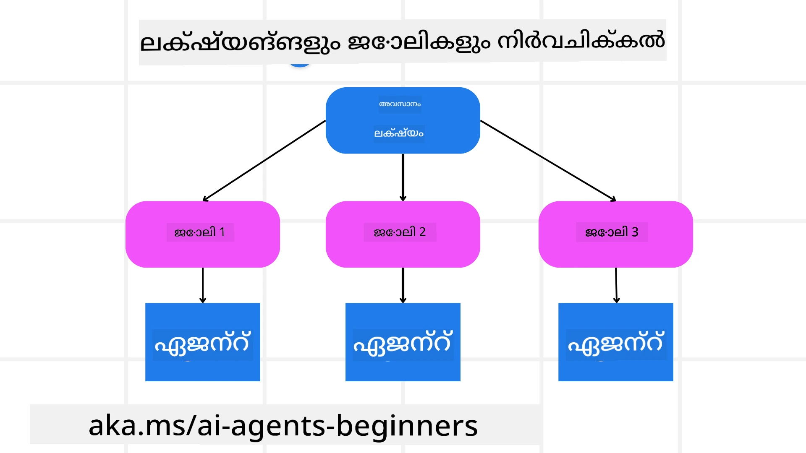

[](https://youtu.be/kPfJ2BrBCMY?si=9pYpPXp0sSbK91Dr)

> _(മുകളിലുള്ള ചിത്രത്തിൽ ക്ലിക് ചെയ്തു ഈ പാഠത്തിന്റെ വീഡിയോ കാണുക)_

# ആസൂത്രണ രൂപകൽപ്പന

## ಪರಿಚയം

ഈ പാഠത്തിൽ ഉൾപ്പെടുന്നതുകൾ:

* ഒരു വ്യക്തമായ സമഗ്ര ലക്ഷ്യം നിർവചിക്കുക և സങ്കീർണമുള്ള ഒരു ജോലി manageable ടാസ്‌കുകളായി വിഭജിക്കുക.
* ഘടനാപരമായ ഔട്ട്‌പുട്ട് ഉപയോഗിച്ച് കൂടുതൽ വിശ്വാസ്യമായും മെഷീൻ-വായിച്ചറിയാവുന്നതുമായ പ്രതികരണങ്ങൾ ലഭ്യമാക്കുക.
* ഡൈനാമിക് ടാസ്‌കുകളും അനിഷ്ട ഇൻപുട്ടുകളും കൈകാര്യം ചെയ്യാൻ ഇവന്റ്-ചാലിത സമീപനം പ്രയോഗിക്കുക.

## പഠന ലക്ഷ്യങ്ങൾ

ഈ പാഠം പൂർത്തിയാക്കിയശേഷം, നിങ്ങൾക്ക് താഴെപ്പറയുന്ന കാര്യങ്ങൾ മനസ്സിലായിരിക്കും:

* AI ഏജന്റിന് എന്താണ് നേടേണ്ടതെന്ന് വ്യക്തമാക്കുന്ന ഒരു സമഗ്ര ലക്ഷ്യം തിരിച്ചറിയുകയും സജ്ജമാക്കുകയും ചെയ്യുക.
* ഒരു സങ്കീർണ്ണ ജോലി നിയന്ത്രണയോഗ്യമായ ഉപജോലികളായി വിഭജിച്ച് അവയെ ലോഗിക്കൽ ക്രമത്തിൽ ക്രമീകരിക്കുക.
* ഏജന്റുകൾക്ക് ശരിയായ ഉപകരണങ്ങൾ (ഉദാ., search tools അല്ലെങ്കിൽ data analytics tools) ലഭ്യമാക്കുക, അവ എപ്പോൾ എങ്ങനെ ഉപയോഗിക്കണമെന്നത് തീരുമാനിക്കുക, കൂടാതെ ഉണ്ടാകുന്ന അപ്രതീക്ഷിത സാഹചര്യങ്ങൾ കൈകാര്യം ചെയ്യുക.
* ഉപജോലികളുടെ ഫലങ്ങൾ വിലയിരുത്തുക, പ്രകടനം അളക്കുക, അന്തിമ ഔട്ട്‌പുട്ട് മെച്ചപ്പെടുത്താൻ നടപടി തിരുത്തലുകൾ നിർവഹിക്കുക.

## സമഗ്ര ലക്ഷ്യം നിർവചിക്കുക 및 ഒരു ജോലി വിഭജിക്കുക



യാഥാർത്ഥ്യത്തിൽ പല ജോലികളും ഒരേ ഘട്ടത്തിൽ പരിഹരിക്കാൻ വളരെ സങ്കീർണ്ണമാണ്. ഒരു AI ഏജന്റിന് തന്റെ ആസൂത്രണവും പ്രവൃത്തികളും നയിക്കാൻ ഒരു സംക്ഷിപ്ത ലക്ഷ്യം ആവശ്യമുണ്ട്. ഉദാഹരണത്തിന്, ലക്ഷ്യം പരിഗണിക്കുക:

    "3-ദിവസ യാത്രാ യാത്രാപദ്ധതി സൃഷ്ടിക്കുക."

ഇത് പറഞ്ഞുകൊണ്ട് എളുപ്പമുള്ളതെങ്കിലും, ഇതിന് കൂടുതൽ നിശ്ചിതത്വം ആവശ്യമുണ്ട്. ലക്ഷ്യം όσο ക്ളിയറായിരിക്കും, ഏജന്റ് (മற்றും ഏതെങ്കിലും മനുഷ്യ സഹപ്രവർത്തകർ) ശരിയായ ഫലത്തിലേക്ക് കേന്ദ്രീകരിക്കാൻ ഓരോ സാധ്യതയുമുണ്ട്, ഉദാഹരണത്തിന് ഫ്ലൈറ്റ് ഓപ്ഷനുകൾ, ഹോട്ടൽ ശുപാർശകൾ, പ്രവർത്തന നിർദ്ദേശങ്ങൾ എന്നിവ ഉൾക്കൊള്ളുന്ന സമഗ്ര യാത്രാപദ്ധതി സൃഷ്ടിക്കുക.

### ടാസ്‍ക് വിഭജിക്കൽ

വലുതോ സങ്കീർണ്ണമോ ആയ ജോലികളെ ചെറുതും ലക്ഷ്യമുഖമായ ഉപജോലികളായി വിഭജിക്കുമ്പോൾ അവ കൈകാര്യം ചെയ്യാൻ എളുപ്പമാകും.
യാത്രാപദ്ധതിയുടെ ഉദാഹരണത്തിന്, നിങ്ങൾ ലക്ഷ്യം ഇങ്ങനെ വിഭജിക്കാൻ കഴിയും:

* ഫ്ലൈറ്റ് ബുക്കിംഗ്
* ഹോട്ടൽ ബുക്കിംഗ്
* കാർ വാടക
* വ്യക്തിഗതത്വീകരണം

പ്രതേകം ഏജന്റുകളോ പ്രോസസ്സുകളോ ഓരോ ഉപജോലിയും കൈകാര്യം ചെയ്യാം. ഒരു ഏജന്റ് മികച്ച ഫ്ലൈറ്റ് ഡീലുകൾ അന്വേഷിക്കലിൽ മുകൾനില സ്ഥാപിക്കാമല്ലോ, മറ്റൊന്ന് ഹോട്ടൽ ബുക്കിംഗിൽ ശ്രദ്ധ കേന്ദ്രീകരിക്കാം, ഇങ്ങനെ. ഒരു കോർഡിനേറ്റിങ് അല്ലെങ്കിൽ "ഡൗൺസ്റ്റ്രീം" ഏജന്റ് പിന്നീട് ഈ ഫലങ്ങൾ ഏകദൃശ്യമായ ഒരു യാത്രാപദ്ധതിയായി ഉപയോക്താവിനായി കമ്പൈൻ ചെയ്യാം.

ഈ മോഡുലർ സമീപനം ക്രമുചെയ്യുന്നതിനും പുരോഗതി നടത്തുന്നതിനും സഹായിക്കുന്നു. ഉദാഹരണത്തിന്, ഭക്ഷണ ശുപാർശകൾക്കോ പ്രാദേശിക പ്രവർത്തന നിർദ്ദേശങ്ങൾക്കോ പ്രത്യേക ഏജന്റുകൾ ചേർക്കുകയും കാലക്രമേണ യാത്രാപദ്ധതി തിരുത്തുകയും ചെയ്യാം.

### ഘടനാപരമായ ഔട്ട്‌പുട്ട്

Large Language Models (LLMs) ഘടനാപരമായ ഔട്ട്‌പുട്ട് (ഉദാ., JSON) ജനറേറ്റ് ചെയ്യാൻ കഴിയും, ഇത് ഡൗൺസ്റ്റ്രീം ഏജന്റുകൾക്കോ സര്‍വീസുകൾക്കോ parse ചെയ്യാനും പ്രോസസ് ചെയ്യാനും എളുപ്പമാകുന്നു._multi-agent context-ൽ ഇത് പ്രത്യേകിച്ച് ഉപയോഗപ്രദമാണ്, നാം പ്ലാനിംഗ് ഔട്ട്‌പുട്ട് സ്വീകരിച്ചതിനുശേഷം ഈ ടാസ്‌കുകൾ ആക്ഷൻ ചെയ്യാം.

താഴെയുള്ള Python സ്നിപ്പറ്റ് ഒരു ലളിതമായ പ്ലാനിംഗ് ഏജന്റ് ഒരു ലക്ഷ്യം ഉപജോലികളായി വിഭജിക്കുകയും ഘടനാപരമായ ഒരു പദ്ധതി ജനറേറ്റ് ചെയ്യുകയും ചെയ്യുന്നതിനെ പ്രത്യക്ഷപ്പെടുത്തുന്നു:

```python
from pydantic import BaseModel
from enum import Enum
from typing import List, Optional, Union
import json
import os
from typing import Optional
from pprint import pprint
from agent_framework.azure import AzureAIProjectAgentProvider
from azure.identity import AzureCliCredential

class AgentEnum(str, Enum):
    FlightBooking = "flight_booking"
    HotelBooking = "hotel_booking"
    CarRental = "car_rental"
    ActivitiesBooking = "activities_booking"
    DestinationInfo = "destination_info"
    DefaultAgent = "default_agent"
    GroupChatManager = "group_chat_manager"

# യാത്ര ഉപകാര്യ മാതൃക
class TravelSubTask(BaseModel):
    task_details: str
    assigned_agent: AgentEnum  # നാം ടാസ്‌ക് ഏജന്റിന് നിയോഗിക്കാൻ ആഗ്രഹിക്കുന്നു

class TravelPlan(BaseModel):
    main_task: str
    subtasks: List[TravelSubTask]
    is_greeting: bool

provider = AzureAIProjectAgentProvider(credential=AzureCliCredential())

# ഉപയോക്തൃ സന്ദേശം നിർവചിക്കുക
system_prompt = """You are a planner agent.
    Your job is to decide which agents to run based on the user's request.
    Provide your response in JSON format with the following structure:
{'main_task': 'Plan a family trip from Singapore to Melbourne.',
 'subtasks': [{'assigned_agent': 'flight_booking',
               'task_details': 'Book round-trip flights from Singapore to '
                               'Melbourne.'}
    Below are the available agents specialised in different tasks:
    - FlightBooking: For booking flights and providing flight information
    - HotelBooking: For booking hotels and providing hotel information
    - CarRental: For booking cars and providing car rental information
    - ActivitiesBooking: For booking activities and providing activity information
    - DestinationInfo: For providing information about destinations
    - DefaultAgent: For handling general requests"""

user_message = "Create a travel plan for a family of 2 kids from Singapore to Melbourne"

response = client.create_response(input=user_message, instructions=system_prompt)

response_content = response.output_text
pprint(json.loads(response_content))
```

### മൾട്ടി-ഏജന്റ് ഓർക്കസ്ട്രേഷനോട് കൂടിയ പ്ലാനിംഗ് ഏജന്റ്

ഈ ഉദാഹരണത്തിൽ, ഒരു Semantic Router Agent ഉപയോക്താവിന്റെ അഭ്യർഥന (ഉദാഹരണം: "എനിക്ക് എന്റെ യാത്രയ്ക്ക് ഹോട്ടൽ പദ്ധതി വേണം.") സ്വീകരിക്കുന്നു.

പ്ലാനർ പിന്നീട്:

* ഹോട്ടൽ പദ്ധതി സ്വീകരിക്കുന്നു: പ്ലാനർ ഉപയോക്താവിന്റെ സന്ദേശം എടുത്ത്, სისტം പ്രോമ്പ്റ്റ് (ലഭ്യമായ ഏജന്റ് വിശദാംശങ്ങൾ ഉൾപ്പെടെ) അടിസ്ഥാനമാക്കി ഘടനാപരമായ യാത്രാപദ്ധതി നിര്‍മ്മിക്കുന്നു.
* ഏജന്റുകളും അവരുടെ ടൂളുകളും പട്ടികപ്പെടുത്തുന്നു: ഏജന്റ് രജിസ്ട്രി ഫ്ലൈറ്റ്, ഹോട്ടൽ, കാർ വാടക, പ്രവർത്തനങ്ങൾ എന്നിവയ്ക്ക് അനുയോജ്യമായ ഏജന്റുകളുടെ പട്ടികയും അവ നൽകുന്ന ഫംഗ്ഷനുകളുടേയും ടൂളുകളുടെ വിവരവും സൂക്ഷിക്കുന്നു.
* പദ്ധതിയെ പ്രാസക്ത ഏജന്റുകളിലേക്ക് റൂട്ടുചെയ്യുന്നു: ഉപജോലികളുടെ എണ്ണം അനുസരിച്ച്, പ്ലാനർ സന്ദേശം നേരിട്ട് ഒരു ഡെഡിക്കേറ്റഡ് ഏജന്റിന് (single-task സാഹചര്യങ്ങൾ) അയയ്ക്കുകയോ അല്ലെങ്കിൽ മൾട്ടി-ഏജന്റ് സഹകരണത്തിനായി ഒരു ഗ്രൂപ്പ് ചാറ്റ് മാനേജറിന്റെ മാധ്യത്തിലൂടെയോ കോഓർഡിനേറ്റ് ചെയ്യുകയോ ചെയ്യാം.
* ഫലം സംക്ഷേപിച്ച് നൽകുന്നു: അവസാനം, പ്ലാനർ സൃഷ്ടിച്ച പദ്ധതിയുടെ സംഗ്രഹം വ്യക്തതക്കായി നൽകുന്നു.
താഴെയുള്ള Python കോഡ് സാമ്പിൾ ഈ ഘട്ടങ്ങൾ വിശദീകരിക്കുന്നു:

```python

from pydantic import BaseModel

from enum import Enum
from typing import List, Optional, Union

class AgentEnum(str, Enum):
    FlightBooking = "flight_booking"
    HotelBooking = "hotel_booking"
    CarRental = "car_rental"
    ActivitiesBooking = "activities_booking"
    DestinationInfo = "destination_info"
    DefaultAgent = "default_agent"
    GroupChatManager = "group_chat_manager"

# യാത്രാ ഉപപ്രവൃത്തി മോഡൽ

class TravelSubTask(BaseModel):
    task_details: str
    assigned_agent: AgentEnum # ഞങ്ങൾ ആ ജോലി ഏജന്റിന് നിയോഗിക്കാനാണ് ആഗ്രഹിക്കുന്നത്

class TravelPlan(BaseModel):
    main_task: str
    subtasks: List[TravelSubTask]
    is_greeting: bool
import json
import os
from typing import Optional

from agent_framework.azure import AzureAIProjectAgentProvider
from azure.identity import AzureCliCredential

# ക്ലയന്റ് സൃഷ്ടിക്കുക

provider = AzureAIProjectAgentProvider(credential=AzureCliCredential())

from pprint import pprint

# ഉപയോക്താവിന്റെ സന്ദേശം നിർവചിക്കുക

system_prompt = """You are a planner agent.
    Your job is to decide which agents to run based on the user's request.
    Below are the available agents specialized in different tasks:
    - FlightBooking: For booking flights and providing flight information
    - HotelBooking: For booking hotels and providing hotel information
    - CarRental: For booking cars and providing car rental information
    - ActivitiesBooking: For booking activities and providing activity information
    - DestinationInfo: For providing information about destinations
    - DefaultAgent: For handling general requests"""

user_message = "Create a travel plan for a family of 2 kids from Singapore to Melbourne"

response = client.create_response(input=user_message, instructions=system_prompt)

response_content = response.output_text

# JSON ആയി ലോഡ് ചെയ്ത ശേഷം പ്രതികരണത്തിന്റെ ഉള്ളടക്കം പ്രിന്റ് ചെയ്യുക

pprint(json.loads(response_content))
```

What follows is the output from the previous code and you can then use this structured output to route to `assigned_agent` and summarize the travel plan to the end user.

```json
{
    "is_greeting": "False",
    "main_task": "Plan a family trip from Singapore to Melbourne.",
    "subtasks": [
        {
            "assigned_agent": "flight_booking",
            "task_details": "Book round-trip flights from Singapore to Melbourne."
        },
        {
            "assigned_agent": "hotel_booking",
            "task_details": "Find family-friendly hotels in Melbourne."
        },
        {
            "assigned_agent": "car_rental",
            "task_details": "Arrange a car rental suitable for a family of four in Melbourne."
        },
        {
            "assigned_agent": "activities_booking",
            "task_details": "List family-friendly activities in Melbourne."
        },
        {
            "assigned_agent": "destination_info",
            "task_details": "Provide information about Melbourne as a travel destination."
        }
    ]
}
```

An example notebook with the previous code sample is available [ഇവിടെ](07-python-agent-framework.ipynb).

### ആവർത്തനാത്മക ആസൂത്രണം

บางงานบางอย่างക്ക് പിറകെ മടങ്ങി നടത്തിയാലോ അല്ലെങ്കിൽ പുനഃആസൂത്രണം ചെയ്താലോ വേണമെന്നാവാം, ഒരു ഉപജോലിയുടെ ഫലം അടുത്ത工作的 സമീപനത്തെ സ്വാധീനിക്കുമ്പോൾ. ഉദാഹരണത്തിന്, ഏജന്റ് ഫ്ലൈറ്റ് ബുക്കിംഗിനിടയിൽ അനിഷ്ട ഡേറ്റാ ഫോർമാറ്റ് കണ്ടെത്തിയാൽ, ഹോട്ടൽ ബുക്കിംഗിനും മുമ്പ് അതിന്റെ തന്ത്രം അനുക്കൂലിക്കേണ്ടി വരാം.

കൂടാതെ, ഉപയോക്താവിന്റെ ഫീഡ്ബാക്ക് (ഉദാ., ഒരാൾക്ക് നേരത്തെ ഒരു ഫ്ലൈറ്റ് ഇഷ്ടമായത്) ഭാഗിക പുനഃപ്ലാനിനെ പ്രേരിപ്പിക്കാം. ഈ ഡൈനാമിക്, ആവർത്തനാത്മക സമീപനം അന്തിമ പരിഹാരം യാഥാർത്ഥ്യത്തിലെ നിയന്ത്രണങ്ങളുമായി ഉപയോക്താവിന്റെ വികസിത മുൻഗണനകൾക്കുമായി പൊരുത്തപ്പെടുന്നതായിരിക്കും.

ഉദാഹരണ കോഡ്

```python
from agent_framework.azure import AzureAIProjectAgentProvider
from azure.identity import AzureCliCredential
#.. മുമ്പത്തെ കോഡിനൊപ്പം, ഉപയോക്താവിന്റെ ചരിത്രവും നിലവിലെ പദ്ധതി കൈമാറുക

system_prompt = """You are a planner agent to optimize the
    Your job is to decide which agents to run based on the user's request.
    Below are the available agents specialized in different tasks:
    - FlightBooking: For booking flights and providing flight information
    - HotelBooking: For booking hotels and providing hotel information
    - CarRental: For booking cars and providing car rental information
    - ActivitiesBooking: For booking activities and providing activity information
    - DestinationInfo: For providing information about destinations
    - DefaultAgent: For handling general requests"""

user_message = "Create a travel plan for a family of 2 kids from Singapore to Melbourne"

response = client.create_response(
    input=user_message,
    instructions=system_prompt,
    context=f"Previous travel plan - {TravelPlan}",
)
# .. വീണ്ടും പദ്ധതി രൂപപ്പെടുത്തിയ ശേഷം ചുമതലകൾ അനുയോജ്യമായ ഏജന്റുകൾക്ക് അയയ്ക്കുക
```

കൂടുതൽ സമഗ്രമായ ആസൂത്രണത്തിനായി ജടിലമായ ടാസ്കുകൾ പരിഹരിക്കാൻ Magnetic One ലെ <a href="https://www.microsoft.com/research/articles/magentic-one-a-generalist-multi-agent-system-for-solving-complex-tasks" target="_blank">ബ്ലോഗ് പോസ്റ്റ്</a> പരിശോധിക്കുക.

## സംഗ്രഹം

ഈ ലേഖനത്തിൽ നാം<dynamic> ഒരു പ്ലാനർ സൃഷ്ടിക്കുന്ന ഒരു ഉദാഹരണം നോക്കിയിട്ടുണ്ട്, ഇത് നിശ്ചിതമായ ലഭ്യമായ ഏജന്റുകൾ ഡൈനാമികായി തിരഞ്ഞെടുക്കാൻ കഴിയും. പ്ലാനറിന്റെ ഔട്ട്‌പുട്ട് ടാസ്‌കുകൾ വിഭജിക്കുകയും അവ നിർവഹിക്കാൻ ഏജന്റുകൾക്ക് നിയുക്തമാക്കുകയും ചെയ്യുന്നു. ഏജന്റുകൾക്ക് ആവശ്യമായ ഫംഗ്ഷനുകളും ടൂളുകളും ആക്സസ് ഉള്ളതായി കരുതപ്പെടുന്നു. ഏജന്റ് കൂടാതെ പ്രതിബിംബനം (reflection), സംഗ്രഹകൻ (summarizer), റൗണ്ട്-റോബിന് ചാറ്റ് പോലുള്ള മറ്റു പാറ്റേണുകളും ഉൾപ്പെടുത്താൻ നിങ്ങൾക്ക് കഴിയും, ഇതിലൂടെ കൂടുതല്‍ വ്യക്തിഗതമാക്കലുകൾ സാധ്യമാകും.

## അധിക സ്രോതസ്സുകൾ

Magentic One - ജടിലമായ ടാസ്കുകൾ പരിഹരിക്കാൻ ഒരു ജനറലിസ്റ്റ് മൾട്ടി-ഏജന്റ് സിസ്റ്റം, متعدد പ്രക്രിയാത്മക ഏജന്റിക് ബഞ്ച്മാർക്കുകളിൽ ശ്രദ്ധേയമായ ഫലങ്ങൾ നേടിയിട്ടുണ്ട്. റഫറൻസ്: <a href="https://www.microsoft.com/research/articles/magentic-one-a-generalist-multi-agent-system-for-solving-complex-tasks" target="_blank">Magentic One</a>. ഈ ഇംപ്ലിമെന്റേഷനിൽ ഓർക്കസ്ട്രേറ്റർ ടാസ്‌ക്-നിർദ്ദിഷ്ടമായ പദ്ധതികൾ സൃഷ്ടിക്കുകയും ഈ ടാസ്‌കുകൾ ലഭ്യമായ ഏജന്റുകൾക്ക് നിയോഗിക്കുകയും ചെയ്യുന്നു. പ്ലാനിംഗിന് പുറമേ, ഓർക്കസ്ട്രേറ്റർ ടാസ്‌കിന്റെ പുരോഗതി നിരീക്ഷിക്കാൻ ട്രാക്കിംഗ് മെക്കാനിസം ഉപയോഗിക്കുകയും ആവശ്യമായപ്പോൾ പുനഃപ്ലാൻ ചെയ്യുകയും ചെയ്യുന്നു.

### പ്ലാനിംഗ് രൂപകൽപ്പന മാതൃകയെക്കുറിച്ച് കൂടുതൽ ചോദ്യങ്ങളുണ്ടോ?

മറ്റു പഠനാർത്ഥികളുമായ് സംവദിക്കാൻ, ഓഫീസ് മണിക്കൂറുകളിൽ പങ്കെടുക്കാൻ, നിങ്ങളുടെ AI ഏജന്റുകൾക്കുള്ള ചോദ്യങ്ങൾക്ക് ഉത്തരം प्राप्तിക്കാൻ [Microsoft Foundry Discord](https://aka.ms/ai-agents/discord)-ലേക്ക് ചേരുക.

## മുൻപത്തെ പാഠം

[വിശ്വാസയോഗ്യമായ AI ഏജന്റുകൾ നിർമ്മിക്കൽ](../06-building-trustworthy-agents/README.md)

## അടുത്ത പാഠം

[മൾട്ടി-ഏജന്റ് രൂപകൽപ്പന മാതൃകം](../08-multi-agent/README.md)

---

<!-- CO-OP TRANSLATOR DISCLAIMER START -->
ഡിസ്‌ക്ലെയിമർ:
ഈ രേഖ AI വിവർത്തന സേവനമായ [Co-op Translator](https://github.com/Azure/co-op-translator) ഉപയോഗിച്ച് 翻訳ിച്ചു. ഞങ്ങൾ കൃത്യതയ്ക്ക് ശ്രമിച്ചിട്ടുണ്ടെങ്കിലും, യാന്ത്രിക വിവർത്തനങ്ങളിൽ പിശകുകൾ അല്ലെങ്കിൽ അപൂർണ്ണതകൾ ഉണ്ടായിരിക്കാമെന്ന് ദയവായി ശ്രദ്ധിക്കുക. അതിന്റെ മാതൃഭാഷയിലുള്ള അസൽ രേഖയാണ് അധികാരപരമായ ഉറവിടം എന്ന് കരുതുക. നിർണ്ണായക വിവരങ്ങൾക്ക് പ്രൊഫഷണൽ മനുഷ്യവിവർത്തനം ശുപാർശിക്കുന്നു. ഈ വിവർത്തനം ഉപയോഗിച്ചതിലൂടെ ഉണ്ടായേക്കാവുന്ന ഏതെങ്കിലും തെറ്റിദ്ധാരണങ്ങൾക്കോ തെറ്റായ് വ്യാഖ്യാനിക്കലുകൾക്കോ ഞങ്ങൾക്ക് ഉത്തരവാദിത്വം ഉണ്ടാകില്ല.
<!-- CO-OP TRANSLATOR DISCLAIMER END -->