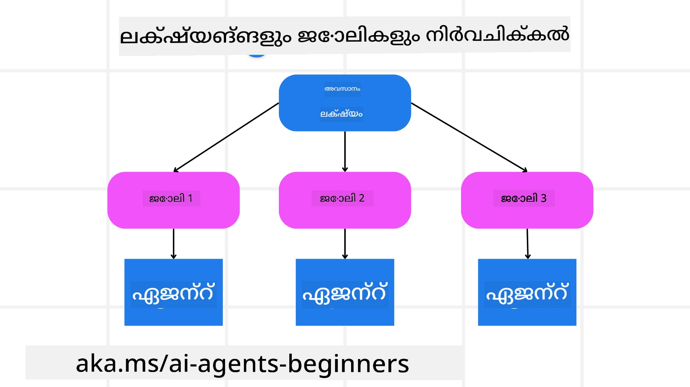

[](https://youtu.be/kPfJ2BrBCMY?si=9pYpPXp0sSbK91Dr)

> _(ഈ പാഠത്തിന്റെ വീഡിയോ കാണാൻ മുകളിൽ ഉള്ള ചിത്രം ക്ലിക്കുചെയ്യുക)_

# പദ്ധതിയിടൽ രൂപകൽപ്പന

## പരിചയം

ഈ പാഠം ഉൾക്കൊള്ളിക്കുന്നതു:

* വ്യക്തമാക്കിയ, മൊത്തത്തിലുള്ള ലക്ഷ്യം നിർവചിക്കുകയും ഒരു സങ്കീർണ്ണമായകാര്യത്തെ നിയന്ത്രിക്കാവുന്ന ചുരുങ്ങിയ പ്രവൃത്തികളായി മാറ്റുകയും ചെയ്യുക.
* കൂടുതൽ വിശ്വസനീയവും യന്ത്രം വായിക്കാവുന്നതുമായ പ്രതികരണങ്ങൾക്ക് ഘടിതമുള്ള ഔട്ട്പുട്ട് ഉപയോഗിക്കൽ.
* ആഗോള ചിട്ടിക്ക് respondingഒള്ള ഇലവിട്ടുകൊണ്ടുള്ള ടാസ്ക്കുകൾക്കും അസാധാരണ ഇൻപുട്ടുകൾക്കും event-driven സമീപനം പ്രയോഗിക്കൽ.

## പഠന ലക്ഷ്യങ്ങൾ

ഈ പാഠം പൂർത്തിയാക്കിയ ശേഷം, നിങ്ങൾക്ക് മനസ്സിലാകും:

* AI ഏജന്റിനു വേണ്ടി മൊത്തം ലക്ഷ്യം തിരിച്ചറിഞ്ഞ് നിശ്ചയിക്കുക, അത് എങ്ങനെ നേടണം മനസ്സിലാക്കുക.
* സങ്കീർണ്ണ ടാസ്ക്ക് നിയമിച്ചുവെച്ച് പ്രവര്‍ത്തനക്ഷമമായ ഉപ-ടാസ്കുകളായി വിഭജിക്കുകയും അവ നിരന്തരമായ ക്രമത്തിൽ ക്രമീകരിക്കുകയും ചെയ്യുക.
* ഏജന്റുകൾക്ക് വേണ്ടതായ ഉപകരണങ്ങൾ (ഉദാ: തിരയൽ ഉപകരണങ്ങൾ അല്ലെങ്കിൽ ഡാറ്റ അനാലിറ്റിക്സ് ഉപകരണങ്ങൾ) ഒരുക്കുക, അവ എപ്പോഴാണ് എങ്ങനെ ഉപയോഗിക്കുക എന്ന് തീരുമാനിക്കുക, വരാനിരിക്കുന്ന അസാധാരണ സാഹചര്യങ്ങൾ കൈകാര്യം ചെയ്യുക.
* ഉപ-ടാസ്കിന്റെ ഫലങ്ങൾ വിലയിരുത്തുക, പ്രവർത്തനക്ഷമത അളക്കുക, ഫൈനല് ഔട്ട്പുട്ട് മെച്ചപ്പെടുത്താൻ നടപടി പുനരാവർത്തിക്കുക.

## മൊത്തം ലക്ഷ്യം നിർവചിക്കുകയും ടാസ്ക് വിഭജിക്കുകയും ചെയ്യൽ



പല വസ്തുതകൾ വളരെ സങ്കീര്ണ്ണമാണു പിടിച്ചു നിര്‍ത്തുക എന്നിട്ടുള്ള ഒരു ഘട്ടത്തിൽ സകലവും ചെയ്യാൻ കഴിയാത്തത്. ഒരു AI ഏജന്‍റ് തന്‍റെ പദ്ധതികളും പ്രവർത്തനങ്ങളും മാർഗ്ഗനിർദ്ദേശിക്കാൻ ഒരു ചുരുക്കി പറഞ്ഞ ലക്ഷ്യം വേണം. उदाहरणത്തിന്, ക്രമീകരിക്കുക:

    "3-ദിവസ യാത്രാ സൗകര്യം സൃഷ്ടിക്കുക."

ഇത് ലളിതമായി പറയ_TOUCH, എങ്കിലും അതിന് എങ്കിലും വിശദീകരണം വേണം. ലക്ഷ്യം എത്ര വ്യക്തമെങ്കില്‍, ഏജന്റിനും (മനുഷ്യ സഹപ്രവർത്തകർക്കും) ശരിയായ ഫലങ്ങൾ നേടുന്നതിൽ കൂടുതൽ ശ്രദ്ധ കേന്ദ്രീകരിക്കാൻ കഴിയും, അവയിൽ പൊതുവായി ഒരു സമഗ്രമായ യാത്രാ പദ്ധതി ഉൾപ്പെടെ വിമാന ഓപ്ഷനുകൾ, ഹോട്ടൽ നിർദ്ദേശങ്ങൾ, പ്രവർത്തന നിർദ്ദേശങ്ങൾ എന്നിവ.

### ടാസ്‌ക്ക് വിഭജനം

വലിയ അല്ലെങ്കിൽ സങ്കീർണ്ണ ടാസ്കുകൾ ചെറിയ, ലക്ഷ്യം ബാധ്യമായ ഉപടാസ്കുകളാക്കുമ്പോൾ നിയന്ത്രിക്കാൻ-ശേഷമുള്ളവയാകുന്നു.
യാത്രാ സൗകര്യം ഉദാഹരണത്തിന്, ലക്ഷ്യം താഴെപ്പറയുന്നവിധം വിഭജിക്കാം:

* വിമാന ബുക്ക് ചെയ്യൽ
* ഹോട്ടൽ ബുക്ക് ചെയ്യൽ
* കാറിന്റെ വാടക
* വ്യക്തിഗതമാക്കിയൽ

ഓരോ ഉപടാസ്കും പ്രത്യേക ഏജന്റുകൾക്കോ പ്രക്രിയകളോ കൈകാര്യം ചെയ്യാം. ഒരു ഏജന്റ് മികച്ച വിമാന ഡീലുകൾ തിരയുന്നതിൽ നിഷ്ണാതനും, മറ്റൊന്ന് ഹോട്ടൽ ബുക്കിംഗിൽ കേന്ദ്രീകരിക്കുകയും ചെയ്യും. കോ-ഓർഡിനേറ്റിംഗ് അല്ലെങ്കിൽ “ഡൗൺസ്റ്റ്രീം” ഏജന്റ് ഈ ഫലങ്ങൾ ഒറ്റ പോലുള്ള ഏകീകൃത യാത്രാ കാര്യമായി അവസാനം ഉപഭോക്താവിന് കൈമാറും.

ഈ ഘടികാര സമീപനം പ്രගതിമാർഗ്ഗ സാദ്ധ്യങ്ങളും അനുവദിക്കുന്നു. ഉദാഹരണത്തിന്, ഭക്ഷണ നിർദ്ദേശങ്ങൾ അല്ലെങ്കിൽ പ്രാദേശിക പ്രവർത്തന നിർദ്ദേശങ്ങൾക്കായി പ്രത്യേക ഏജന്റുകൾ ചേർക്കുകയും, യാത്രാ പദ്ധതി സമയത്തിന്റെയും മെച്ചപ്പെടുത്തുകയും ചെയ്യാം.

### ഘടിത ഔട്ട്പുട്ട്

വലിയ ഭാഷ മോഡലുകൾ (LLMs) ഘടിത ഔട്ട്പുട്ട് (ഉദാ: JSON) സൃഷ്ടിക്കാം, ഇത് ഡൗൺസ്റ്റ്രീം ഏജന്റുകൾക്കും സേവനങ്ങൾക്കും parsing ചെയ്യാനും പ്രോസസ് ചെയ്യാനും എളുപ്പമാണ്. ഇത് പ്രത്യേകിച്ച് പല ഏജന്റുകളുള്ള സാഹചര്യത്തിൽ ഗുണം നൽകും, ഇത് പ്ലാനിംഗ് ഔട്ട്പുട്ട് ലഭിച്ച ശേഷം ടാസ്കുകൾ പ്രവർത്തനക്ഷമമാക്കും.

താഴെ കൊടുത്തിരിക്കുന്ന Python സ്നിപ്പെറ്റ് ഒരു ലളിതമായ പ്ലാനിംഗ് ഏജന്റ് ലക്ഷ്യം ഉപടാസ്കുകളാക്കി ഘടിത പദ്ധതിയെ സൃഷ്ടിക്കുന്നു:

```python
from pydantic import BaseModel
from enum import Enum
from typing import List, Optional, Union
import json
import os
from typing import Optional
from pprint import pprint
from agent_framework.foundry import FoundryChatClient
from azure.identity import AzureCliCredential

class AgentEnum(str, Enum):
    FlightBooking = "flight_booking"
    HotelBooking = "hotel_booking"
    CarRental = "car_rental"
    ActivitiesBooking = "activities_booking"
    DestinationInfo = "destination_info"
    DefaultAgent = "default_agent"
    GroupChatManager = "group_chat_manager"

# യാത്രാ ഉപവിഭാഗ മാതൃക
class TravelSubTask(BaseModel):
    task_details: str
    assigned_agent: AgentEnum  # എജന്റിന് ടാസ്‌ക് ഏൽക്കാൻ ഞങ്ങൾ ആഗ്രഹിക്കുന്നു

class TravelPlan(BaseModel):
    main_task: str
    subtasks: List[TravelSubTask]
    is_greeting: bool

provider = FoundryChatClient(
    project_endpoint=os.environ["AZURE_AI_PROJECT_ENDPOINT"],
    model=os.environ["AZURE_AI_MODEL_DEPLOYMENT_NAME"],
    credential=AzureCliCredential(),
)

# ഉപയോക്തൃ സന്ദേശം നിർവചിക്കുക
system_prompt = """You are a planner agent.
    Your job is to decide which agents to run based on the user's request.
    Provide your response in JSON format with the following structure:
{'main_task': 'Plan a family trip from Singapore to Melbourne.',
 'subtasks': [{'assigned_agent': 'flight_booking',
               'task_details': 'Book round-trip flights from Singapore to '
                               'Melbourne.'}
    Below are the available agents specialised in different tasks:
    - FlightBooking: For booking flights and providing flight information
    - HotelBooking: For booking hotels and providing hotel information
    - CarRental: For booking cars and providing car rental information
    - ActivitiesBooking: For booking activities and providing activity information
    - DestinationInfo: For providing information about destinations
    - DefaultAgent: For handling general requests"""

user_message = "Create a travel plan for a family of 2 kids from Singapore to Melbourne"

response = client.create_response(input=user_message, instructions=system_prompt)

response_content = response.output_text
pprint(json.loads(response_content))
```

### മൾട്ടി-ഏജന്റ് ഓർക്കസ്ട്രേഷൻ ഉള്ള പ്ലാനിംഗ് ഏജന്റ്

ഈ ഉദാഹരണത്തിൽ, ഒരു സെമാന്റിക് റൂട്ടർ ഏജന്റ് ഒരു ഉപയോക്താവിന്റെ അഭ്യർത്ഥന ലഭിക്കുന്നു (ഉദാ: "എന്റെ യാത്രയ്ക്ക് ഹോട്ടൽ പദ്ധതി വേണം.").

പ്ലാനർ തുടർന്ന്:

* ഹോട്ടൽ പ്ലാൻ സ്വീകരിക്കുന്നു: ഉപയോക്താവിന്റെ സന്ദേശം സ്വീകരിച്ച്, സിസ്റ്റം പ്രോംപ്റ്റ് (ഉപയോഗിക്കാവുന്ന ഏജന്റുകളുടെ വിശദാംശങ്ങൾ ഉൾപ്പെടെ) അടിസ്ഥാനമാക്കി, ഘടിത യാത്രാ പദ്ധതി സൃഷ്ടിക്കുന്നു.
* ഏജന്റുകളും അവയുടെ ഉപകരണങ്ങളും പട്ടികപ്പെടുത്തുന്നു: ഏജന്റ് രജിസ്ട്രിയിൽ ഫ്ലൈറ്റ്, ഹോട്ടൽ, കാറിന്റെ വാടക, പ്രവർത്തനങ്ങൾ എന്നിവയ്‌ക്കായുള്ള ഏജന്റുകളുടെ പട്ടികയും അവ നൽകുന്ന ഫംഗ്ഷനുകളും ഉണ്ടായിരിക്കും.
* പദ്ധതിയെ ബന്ധപ്പെട്ട ഏജന്റുകളിലേക്ക് റൂട്ട് ചെയ്യുക: ഉപടാസ്കുകളുടെ എണ്ണം അനുസരിച്ച്, പ്ലാനർ മാനേജർ വഴി മൾട്ടി-ഏജന്റ് സഹകരണത്തിന് മറുവശത്തേക്ക് അയയ്ക്കുക അല്ലെങ്കിൽ ഏക പരീക്ഷണത്തിനായി നേരിട്ടുള്ള സന്ദേശം അയയ്ക്കുക.
* ഫലം സംഗ്രഹിക്കുന്നു: അവസാനം, പ്ലാനർ സൃഷ്ടിച്ച പദ്ധതിയെ വ്യക്തതക്കായി സംഗ്രഹിക്കുന്നു.
താഴെ ഉള്ള Python കോഡ് സാമ്പിൾ ഈ ഘട്ടങ്ങൾ വ്യക്തമാക്കുന്നു:

```python

from pydantic import BaseModel

from enum import Enum
from typing import List, Optional, Union

class AgentEnum(str, Enum):
    FlightBooking = "flight_booking"
    HotelBooking = "hotel_booking"
    CarRental = "car_rental"
    ActivitiesBooking = "activities_booking"
    DestinationInfo = "destination_info"
    DefaultAgent = "default_agent"
    GroupChatManager = "group_chat_manager"

# യാത്ര ഉപകാര്യ മോഡൽ

class TravelSubTask(BaseModel):
    task_details: str
    assigned_agent: AgentEnum # ടാസ്ക് ഏജന്റിന് നിയോഗിക്കാൻ ആഗ്രഹിക്കുന്നു

class TravelPlan(BaseModel):
    main_task: str
    subtasks: List[TravelSubTask]
    is_greeting: bool
import json
import os
from typing import Optional

from agent_framework.foundry import FoundryChatClient
from azure.identity import AzureCliCredential

# ക്ലയന്റ് സൃഷ്ടിക്കുക

provider = FoundryChatClient(
    project_endpoint=os.environ["AZURE_AI_PROJECT_ENDPOINT"],
    model=os.environ["AZURE_AI_MODEL_DEPLOYMENT_NAME"],
    credential=AzureCliCredential(),
)

from pprint import pprint

# ഉപയോക്തൃ സന്ദേശം നിർവചിക്കുക

system_prompt = """You are a planner agent.
    Your job is to decide which agents to run based on the user's request.
    Below are the available agents specialized in different tasks:
    - FlightBooking: For booking flights and providing flight information
    - HotelBooking: For booking hotels and providing hotel information
    - CarRental: For booking cars and providing car rental information
    - ActivitiesBooking: For booking activities and providing activity information
    - DestinationInfo: For providing information about destinations
    - DefaultAgent: For handling general requests"""

user_message = "Create a travel plan for a family of 2 kids from Singapore to Melbourne"

response = client.create_response(input=user_message, instructions=system_prompt)

response_content = response.output_text

# JSON ആയി ലോഡ് ചെയ്തതിന് ശേഷം പ്രതികരണ ഉള്ളടക്കം പ്രിന്റ് ചെയ്യുക

pprint(json.loads(response_content))
```

മുൻവന്ന കോഡിന്റെ ഔട്ട്പുട്ട് താഴെ കൊടുത്തിരിക്കുന്നു, നിങ്ങൾക്ക് ഈ ഘടിത ഔട്ട്പുട്ട് ഉപയോഗിച്ച് `assigned_agent`-ലേക്ക് റൂട്ടുചെയ്യുകയും യാത്രാ പദ്ധതി ഉപയോക്താവിന് സംഗ്രഹിക്കുകയും ചെയ്യാം.

```json
{
    "is_greeting": "False",
    "main_task": "Plan a family trip from Singapore to Melbourne.",
    "subtasks": [
        {
            "assigned_agent": "flight_booking",
            "task_details": "Book round-trip flights from Singapore to Melbourne."
        },
        {
            "assigned_agent": "hotel_booking",
            "task_details": "Find family-friendly hotels in Melbourne."
        },
        {
            "assigned_agent": "car_rental",
            "task_details": "Arrange a car rental suitable for a family of four in Melbourne."
        },
        {
            "assigned_agent": "activities_booking",
            "task_details": "List family-friendly activities in Melbourne."
        },
        {
            "assigned_agent": "destination_info",
            "task_details": "Provide information about Melbourne as a travel destination."
        }
    ]
}
```

മുൻവന്ന കോഡ് സാമ്പിളുള്ള ഒരു ഉദാഹരണ നോട്ട്‌ബുക്ക് [ഇവിടെ](./code_samples/07-python-agent-framework.ipynb) ലഭ്യമാണ്.

### ആവർത്തന ആർജ്ജിത പദ്ധതി

ചില ടാസ്ക്കുകൾ പിന്തുടരുന്ന ഇടയ്ക്കുള്ള സംവാദം അല്ലെങ്കിൽ പുനഃപദ്ധതീകരണം ആവശ്യമുണ്ട്, ഉദാഹരണത്തിന്, ഏകോപിച്ച് ടാസ്ക്ക് ഫലം അടുത്ത ടാസ്ക്കിനെ ബാധിക്കുന്നത്. ഉദാ: ഏജന്റ് വിമാന ബുക്കിംഗിൽ അസാദ് ഡാറ്റ ഫോർമാറ്റ് കണ്ടെത്തിയാൽ, ഹോട്ടൽ ബുക്കിംഗിലേക്ക് പോകുന്നതിന് മുമ്പായി തന്ത്രത്തിനെ പുനരവലംബിക്കേണ്ടി വരാം.

കൂടാതെ, ഉപയോക്താവിന്റെ പ്രതികരണം (ഉദാ: ആളായിരിക്കുഴിക്കുന്ന ഒരു മുമ്പത്തെ വിമാനത്തെ പ്രാധാന്യം നൽകുന്നത്) പുനഃപദ്ധതി ആരംഭിക്കാൻ കാരണമാകാം. ഈ ചാരുതയുള്ള, ആവർത്തനപരമായ സമീപനം അന്ത്യപരിപാടിയുടെ യഥാർത്ഥ പരിധികളും വളർന്നുവരുന്ന ഉപയോക്തൃ ഇഷ്ടങ്ങളും അനുസരിച്ചുള്ളതിനായി ഉറപ്പ് നൽകുന്നു.

ഉദാഹരണ കോഡ്

```python
import os
from agent_framework.foundry import FoundryChatClient
from azure.identity import AzureCliCredential
#.. മുമ്പത്തെ കോഡുപോലെ മാത്രമേയും ഉപയോക്താവിന്റെ ചരിത്രവും നിലവിലെ പദ്ധതി കടത്താനുമുള്ളത്

system_prompt = """You are a planner agent to optimize the
    Your job is to decide which agents to run based on the user's request.
    Below are the available agents specialized in different tasks:
    - FlightBooking: For booking flights and providing flight information
    - HotelBooking: For booking hotels and providing hotel information
    - CarRental: For booking cars and providing car rental information
    - ActivitiesBooking: For booking activities and providing activity information
    - DestinationInfo: For providing information about destinations
    - DefaultAgent: For handling general requests"""

user_message = "Create a travel plan for a family of 2 kids from Singapore to Melbourne"

response = client.create_response(
    input=user_message,
    instructions=system_prompt,
    context=f"Previous travel plan - {TravelPlan}",
)
# .. പുനരായോഗം ചെയ്ത് നടപടികൾ അനുയോജ്യമായ ഏജന്റുകൾക്ക് അയയ്ക്കുക
```

കൂടുതൽ സമഗ്രമായ പദ്ധതിക്ക് Magnetic One <a href="https://www.microsoft.com/research/articles/magentic-one-a-generalist-multi-agent-system-for-solving-complex-tasks" target="_blank">Blogpost</a> പരിശോധിക്കുക സങ്കീർണ്ണ പ്രവർത്തികൾ പരിഹരിക്കുന്നതിനായി.

## സംഗ്രഹം

ഈ ലേഖനത്തിൽ, നാം എങ്ങനെ ഒരു പ്ലാനർ സൃഷ്ടിക്കാമെന്ന് കാണിച്ചു, അത് ലഭ്യമായ ഏജന്റുകൾ ഡൈനാമിക് ആയി തിരഞ്ഞെടുക്കും. പ്ലാനറിന്റെ output ടാസ്കുകൾ ചതുരായി വിഭജിക്കുകയും ഏജന്റുകൾക്ക് നിർദേശിക്കുകയും ചെയ്യും അതു പ്രവർത്തനക്ഷമമാക്കാൻ. ടാസ്ക് നിർവഹിക്കാനുള്ള അനുയോജ്യമായ ഫംഗ്ഷനുകളും ഉപകരണങ്ങളും ഏജന്റുകൾക്കുണ്ട് എന്ന് കരുതപ്പെടുന്നു. ഏജന്റുകൾക്ക് പുറമേ പ്രതിഫലനം, സംഗ്രഹം, റൗണ്ട് റോബിൻ ചാറ്റ് തുടങ്ങിയ മറ്റ് പാറ്റേണുകൾ ഉൾപ്പെടുത്താൻ കഴിയും കൂടുതൽ ഇഷ്‌ടാനുസൃതമാക്കാൻ.

## അധിക റിസോഴ്സുകൾ

Magentic One - സങ്കീർണ്ണ ടാസ്കുകൾ പരിഹരിക്കുന്ന ഒരു ജനറലിസ്റ്റ് മൾട്ടി-ഏജന്റ് സിസ്റ്റവും ബാഹ്യമായ ഏജന്റ് മധുരം വിലയിരുത്തലുകളിൽ മികച്ച ഫലം കൈവരിച്ചു. റഫറൻസ്: <a href="https://www.microsoft.com/research/articles/magentic-one-a-generalist-multi-agent-system-for-solving-complex-tasks" target="_blank">Magentic One</a>. ഈ നടപ്പിലാക്കലിൽ ഓർക്കസ്ട്രേറ്റർ ടാസ്ക് സ്‌പെസിഫിക് പദ്ധതികൾ നിർമ്മിക്കുകയും അവ ലഭ്യമായ ഏജന്റുകൾക്ക് ഏൽപ്പിക്കുകയും ചെയ്യുന്നു. പ്ലാനിങ്ങിനൊപ്പം, ഓർക്കസ്ട്രേറ്റർ ഒരു പ്രവർത്തന നിരീക്ഷണ മേക്ക്‌ദാനം ഉപയോഗിച്ച് ടാസ്ക് പുരോഗതിയെ നിരീക്ഷിക്കുകയും തേടുന്നപ്രകാരം പുനഃപദ്ധതി ചെയ്യുകയും ചെയ്യുന്നു.

### പദ്ധതിയിടൽ രൂപകൽപ്പന പാറ്റേൺ സംബന്ധിച്ച് കൂടുതൽ ചോദിക്കാനുണ്ടോ?

[Microsoft Foundry Discord](https://discord.com/invite/ATgtXmAS5D) ല്‍ ചേർന്ന് മറ്റ് പഠിക്കുന്നവരുമായി കൂടിക്കാഴ്ച നടത്തുക, ഓഫീസർ മണിക്കൂറുകളിൽ പങ്കെടുക്കുക, നിങ്ങളുടെ AI ഏജന്റ് ബന്ധപ്പെട്ട ചോദ്യങ്ങൾക്കു ഉത്തരം ലഭിപ്പിക്കുക.

## മുമ്പത്തെ പാഠം

[വിശ്വാസയോഗ്യമുള്ള AI ഏജന്റുകൾ നിർമ്മിക്കൽ](../06-building-trustworthy-agents/README.md)

## അടുത്ത പാഠം

[മൾട്ടി-ഏജന്റ് രൂപകൽപ്പന പാറ്റേൺ](../08-multi-agent/README.md)

---

<!-- CO-OP TRANSLATOR DISCLAIMER START -->
**അറിയിപ്പ്**:
ഈ രേഖ AI പരിഭാഷാ സേവനം [Co-op Translator](https://github.com/Azure/co-op-translator) ഉപയോഗിച്ച് പരിഭാഷപ്പെടുത്തിയതാണ്. ഞങ്ങൾ കൃത്യതയ്ക്കായി ശ്രമിക്കുന്നുവെങ്കിലും, ഓട്ടോമേറ്റഡ് പരിഭാഷകളിൽ പിഴവുകൾ അല്ലെങ്കിൽ തെറ്റായ വിവരങ്ങൾ ഉണ്ടാകാൻ സാധ്യതയുണ്ട്. അതിന്റെ സ്വാഭാവിക ഭാഷയിലുള്ള അസൽ രേഖയാണ് പ്രാമാണികമായ ഉറവിടമായി പരിഗണിക്കേണ്ടത്. നിർണായകമായ വിവരങ്ങൾക്ക്, പ്രൊഫഷണൽ മനുഷ്യ പരിഭാഷ ശുപാർശ ചെയ്യുന്നു. ഈ പരിഭാഷ ഉപയോഗിച്ച് ഉണ്ടാകുന്ന തെറ്റിദ്ധാരണകൾ അല്ലെങ്കിൽ തെറ്റായ വ്യാഖ്യാനങ്ങൾക്കായി ഞങ്ങൾ ഉത്തരവാദികളല്ല.
<!-- CO-OP TRANSLATOR DISCLAIMER END -->