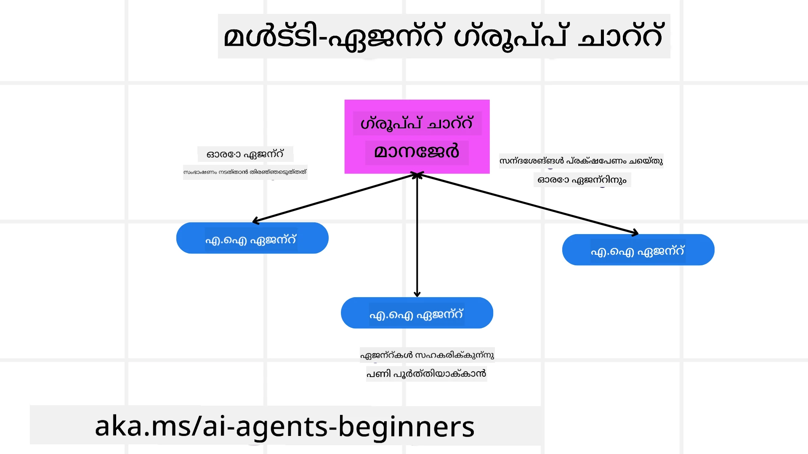
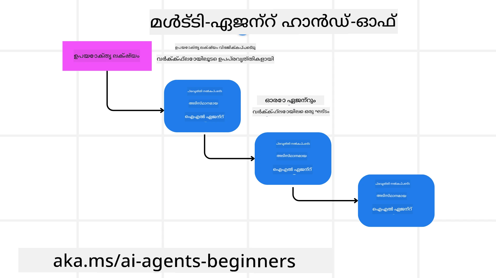
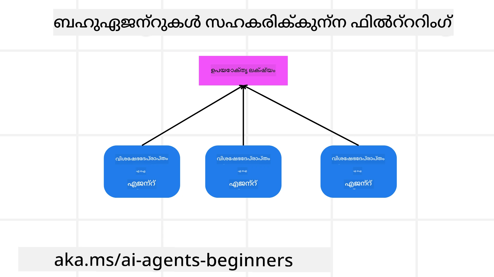

> _(മുകളിൽ കാണിച്ച ചിത്രത്തിൽ ക്ലിക്ക്ചെയ്ത് ഈ പാഠത്തിന്റെ വീഡിയോ കാണുക)_

# മൾട്ടി-ഏജന്റ് ഡിസൈൻ മാതൃകകൾ

ഒരു പ്രോജექტിൽ വിവിധ ഏജൻറുകൾ ഉൾപ്പെടുന്നതു തുടങ്ങി ഉടനടി, മൾട്ടി-ഏജന്റ് ഡിസൈൻ മാതൃക പരിഗണിക്കേണ്ടിവരും. എങ്കിലും, 언제 multi-agent-ഓടേക്ക് മാറണമെന്ന്, അതിന്റെ ആശയപരമായ ലാഭങ്ങൾ എന്തൊക്കെയാണെന്ന് turiykkuka അജ്ഞാതമായിരിക്കാം.

## പരിചയം

ഈ പാഠത്തിൽ, ഞങ്ങൾ താഴെപ്പറയുന്ന ചോദ്യങ്ങൾക്ക് ഉത്തരം കണ്ടെത്താൻ ശ്രദ്ധിക്കുകയാണ്:

- മൾട്ടി-ഏജന്റുകൾ പ്രയോഗിക്കാവുന്ന സാഹചര്യങ്ങൾ എന്തൊക്കെയാണ്?
- ഒന്നുകിൽ ഒരു ഏക ഏജന്റ് പലതും ചെയ്യുന്നത് കൊണ്ടുള്ള പതിവ് രീതിക്ക് ആണ് മൾട്ടി-ഏജന്റുകൾ ഉപയോഗിക്കുമ്പോൾ有哪些 ലാഭങ്ങൾ?
- മൾട്ടി-ഏജന്റ് ഡിസൈൻ മാതൃക നടപ്പിലാക്കാനുള്ള നിർമ്മാണഘടകങ്ങൾ എന്തൊക്കെയാണ്?
- പല ഏജന്റുകളും തമ്മിൽ എങ്ങനെ ഇന്റർആക്ട് ചെയ്യുന്നു എന്ന് എങ്ങനെ കാണാമെന്ന്?

## അഭ്യസ ലക്ഷ്യങ്ങൾ

ഈ പാഠം കഴിഞ്ഞാൽ, നിങ്ങൾക്ക് കഴിയണം:

- മൾട്ടി-ഏജന്റുകൾ ഉപയോഗിക്കേണ്ട സാഹചര്യങ്ങൾ തിരിച്ചറിയാൻ
- ഏക ഏജന്റിനെക്കാളും മൾട്ടി-ഏജന്റുകൾ ഉപയോഗിക്കുമ്പോൾ ലഭിക്കുന്ന ലാഭങ്ങൾ തിരിച്ചറിയാൻ
- മൾട്ടി-ഏജന്റ് ഡീസൈൻ മാതൃക നടപ്പിലാക്കാനുള്ള അടിസ്ഥാന ഘടകങ്ങൾ മനസ്സിലാക്കാൻ

വലുതായ ചിത്രം എന്താണ്?

*മൾട്ടി ഏജന്റുകൾ ഒരേയിടത്തേയ്ക്ക് ഒന്നിച്ച് പ്രവർത്തിച്ച് ഒരു സാധാരണ ലക്ഷ്യം കൈവരിക്കാൻ അനുവദിക്കുന്ന ഒരു ഡിസൈൻ മാതൃകയാണ്.*

ഈ മാതൃക പ്രവർത്തി റോബോട്ടിക്സ്, സ്വയംപരിചാലിത സംവിധാനങ്ങൾ, വിതരിത കമ്പ്യൂട്ടിങ് തുടങ്ങിയ വിവിധ മേഖലകളിൽ വ്യാപകമായി ഉപയോഗിക്കുന്നു.

## മൾട്ടി-ഏജന്റുകൾ പ്രയോഗിക്കാവുന്ന സാഹചര്യങ്ങൾ

മൾട്ടി-ഏജന്റുകൾ ഉപയോഗിക്കാൻ അനുയോജ്യമായ സാഹചര്യങ്ങൾ എന്തൊക്കെയാണെന്ന് നോക്കുമ്പോൾ, പല സാഹചര്യങ്ങളിലും ബഹുഐജന്റുകൾ ഉപയോഗിക്കുന്നത് فائدാകും, പ്രത്യേകിച്ച് താഴെപ്പറയുന്ന സാഹചര്യങ്ങളിൽ:

- **വലിയ ജോലിഭാരം**: വലിയ ജോലികളെ ചെറിയ ജോലികളായി വിഭജിച്ച് വിവിധ ഏജന്റുകൾക്ക് കോർത്ത് നൽകാം, ഇത് സമാന്തര പ്രോസസ്സിംഗ് അനുവദിച്ച് വേഗത്തിൽ പൂർത്തിയാക്കാൻ സഹായിക്കുന്നു. ഉദാഹരണമായി, വലിയ ഡാറ്റാ പ്രോസസ്സിംഗ് ജോബ് ഒരു ഉദാഹരണമാണ്.
- **സങ്കീർണ്ണമായ ജോലികൾ**: വലുതായ ജോലികളിലേതുപോലെ സങ്കീർണ്ണമായ ജോലികളും ചെറിയ ഉപജോലികളായി തകർത്ത് ഓരോ ഏജന്റിനും പ്രത്യേക ഭാഗങ്ങൾ ഏൽപ്പിക്കുവാൻ കഴിയും; ഓരോ ഏജന്റും ഒരു പ്രത്യേക കാര്യത്തിൽ വിദഗ്ധരാകാം. ഉദാഹരണമായി, സ്വയംപരിചാലിത വാഹനങ്ങളിൽ നാവിഗേഷൻ, തടസം കണ്ടെത്തൽ, മറ്റു വാഹനങ്ങളുമായി സമ്പർക്കം എന്നിവ നിയന്ത്രിക്കുന്ന വ്യത്യസ്ത ഏജന്റുകൾ ഉണ്ടാകാം.
- **വിവിധ വിദഗ്ധതകൾ**: വ്യത്യസ്ത ഏജന്റുകൾക്ക് വ്യത്യസ്ത മേഖലകളിൽ വിദഗ്ധത ഉണ്ടാകാം, അതുകൊണ്ട് ഒരു ഏക ഏജന്റിനെക്കാളും ഒരു ജോലിയുടെ വിവിധ ഭാഗങ്ങൾ കൂടുതൽ ഫലപ്രദമായി കൈകാര്യം ചെയ്യാൻ കഴിയും. ആരോഗ്യപരിപാലന രംഗത്ത്, ഡയഗ്നോസ്റ്റിക്‌സ്, ചികിത്സാ പദ്ധതികൾ, രോഗി നിരീക്ഷണം എന്നിവ കൈകാര്യം ചെയ്യാനുള്ള ഏജന്റുകൾ ഉദാഹരണമാണ്.

## ഒരു ഏക ഏജന്റിനെക്കാളും മൾട്ടി-ഏജന്റുകൾ ഉപയോഗിക്കുന്നതിനുള്ള ലാഭങ്ങൾ

സിംപിള്‍ ജോലികൾക്കായി ഒരു ഏക ഏജന്റ് സംവിധാനം നന്നായായിരിക്കാം, പക്ഷേ കൂടുതൽ സങ്കീർണ്ണമായ ജോലികൾക്കായി മൾട്ടി-ഏജന്റുകൾ ഉപയോഗിക്കുന്നത് പല ലാഭങ്ങളും നൽകും:

- **വിദഗ്ധത**: ഓരോ ഏജന്റും ഒരു നിർദ്ദിഷ്ട ജോലിക്ക് വിദഗ്ധമാകാം. ഒരു ഏക ഏജന്റിൽ വിദഗ്ധതയുടെ അഭാവം ഉണ്ടെങ്കിൽ ആ ഏജന്റ് എല്ലാം ചെയ്യാൻ ശ്രമിക്കും, പക്ഷേ സങ്കീർണ്ണമായ ജോലിയിൽ എന്തുചെയ്യണമെന്ന് ഗGames പ്രയാസപ്പെടാം. ഉദാഹരണത്തിന്, അപ്രായോഗികമായ ഒരു ജോലിയാണ് അത്ചെയ്യാൻ തുടങ്ങാവുന്ന സാഹചര്യമുണ്ടാകാം.
- **വ്യാപ്തിവത്കരണം**: ഒരു ഏക ഏജന്റ് അമിതഭാരം നൽകുന്നതിന്റെ പകരം കൂടുതൽ ഏജന്റുകൾ ചേർക്കുന്നത് സംവിധാനത്തെ സ്കെയിൽ ചെയ്യാൻ എളുപ്പമാക്കുന്നു.
- **പിശക് സഹിഷ്ണുത**: ഒരു ഏജന്റ് പൊളിഞ്ഞാലും മറ്റ് ഏജന്റുകൾ പ്രവർത്തി തുടരാം, സിസ്റ്റത്തിന്റെ വിശ്വാസ്യത ഉറപ്പാക്കുന്നു.

ഉദാഹരണമായി, ഒരു ഉപയോക്താവിന് യാത്ര ബുക്ക് ചെയ്യുകയാണെന്ന് കാണുക. ഒരു ഏക ഏജന്റ് സംവിധാനം എല്ലാ യാത്രാ ബുക്കിംഗ് ഘട്ടങ്ങളും കൈകാര്യം ചെയ്യേണ്ടിവരും — വിമാനങ്ങൾ കണ്ടെത്തൽ മുതൽ ഹോട്ടലുകളും വാടകകാർ എന്നിവ ബുക്ക് ചെയ്യുക വരെ. ഇത് ഒരു ഏക ഏജന്റിനെക്കൊണ്ടു നേടുന്നതിനു, ആ ഏജന്റിനായി ഈ എല്ലാ കാര്യങ്ങളും കൈകാര്യം ചെയ്യാനുള്ള ടൂളുകൾ വേണം. ഇതുവരെയേക്ക് ഇത് ഒരു സങ്കീർണ്ണവും മൊണൊളിതിക് സിസ്റ്റവും ആയേക്കാം, നന്നായി പരിപാലനവും സ്കെയിലിംഗും ചെയ്യാൻ ബുദ്ധിമുട്ടാകും. മറുവശത്ത്, മൾട്ടി-ഏജന്റ് സംവിധാനത്തിൽ വിമാനങ്ങൾ കണ്ടെത്തുന്ന ഏജന്റും ഹോട്ടലുകൾ ബുക്ക് ചെയ്യുന്ന ഏജന്റും വാടകക്കാരെ കൈകാര്യം ചെയ്യുന്ന ഏജന്റും വ്യത്യസ്തമായിരിക്കും. ഇത് സിസ്റ്റത്തെ മോഡുലാർ, പരിപാലനത്തിന് എളുപ്പവും, സ്കെയിലബിളും ആക്കും.

ഈ നേരണത്തോട് താരതമ്യം ചെയ്യുക: ഒരു ഒരു കുടുംബം ഓടിക്കുന്ന ട്രാവൽ ബ്യൂറോ (mom-and-pop store) എതിരായി ഒരു ഫ്രാഞ്ചൈസി രീതിയിൽ പ്രവര്‍ത്തിക്കുന്ന ട്രാവൽ ബ്യൂറോ. മോം-ആൻഡ്-പോപ് സ്റ്റോർ ഒരേ ഏജന്റ് എല്ലാ യാത്രാ ബുക്കിംഗ് ഘട്ടങ്ങളും കൈകാര്യം ചെയ്യുന്നതായിരിക്കാം, എങ്കിലും ഫ്രാഞ്ചൈസി പല എജന്റുകൾ വ്യത്യസ്ത ഭാഗങ്ങൾ കൈകാര്യം ചെയ്യുന്നതായിരിക്കും.

## മൾട്ടി-ഏജന്റ് ഡിസൈൻ മാതൃക നടപ്പിലാക്കാനുള്ള അടിസ്ഥാന ഘടകങ്ങൾ

മൾട്ടി-ഏജന്റ് ഡിസൈൻ മാതൃക നടപ്പിലാക്കുന്നതിന് മുമ്പ്, ഈ മാതൃകയെ രൂപപ്പെടുത്തുന്ന അടിസ്ഥാന ഘടകങ്ങൾ മനസ്സിലാക്കണം.

വീണ്ടും ഉപയോക്താവിന്റെ യാത്ര ബുക്കിംഗ് ഉദാഹരണം നോക്കിയാൽ, ഈ ഘടകങ്ങളിൽ ഉൾപ്പെടുന്നതാണ്:

- **ഏജന്റ് ആശയവിനിമയം**: വിമാനങ്ങൾ കണ്ടെത്തുന്ന, ഹോട്ടലുകൾ ബുക്ക് ചെയ്യുന്ന, വാടകകാർ കൈകാര്യം ചെയ്യുന്ന ഏജന്റുകൾ ഉപയോക്താവിന്റെ അഭിരുചികളും നിയന്ത്രണങ്ങളും സംബന്ധിച്ച വിവരങ്ങൾ പങ്കിടുകയും ആശയവിനിമയം ചെയ്യുകയും ചെയ്യണം. ഈ ആശയവിനിമയ്‌ക്കുള്ള പ്രോട്ടോകോളുകളും മാർഗങ്ങളും നിങ്ങൾ തീരുമാനിക്കണം. സാധാരണയായി ഇതിന്റെ അർത്ഥം വിമാനങ്ങൾ കണ്ടെത്തുന്ന ഏജന്റ് ഹോട്ടൽ ബുക്കിങ് ഏജന്റുമായി എപ്പോൾ സംവദിക്കണം എന്ന് ഉറപ്പാക്കുകയാണ് — ഉദാഹരണത്തിന് വിമാനത്തിന്റെയും ഹോട്ടലിന്റെയും തീയതികൾ ഒരേ হওണം. അതിനാൽ ഏജന്റുകൾ ഉപയോക്താവിന്റെ യാത്രാ തീയതികൾ സംബന്ധിച്ച വിവരങ്ങൾ പങ്കിടണം, അതായത് *ഏത് ഏജന്റുകൾ വിവരങ്ങൾ പങ്കിടുന്നുവോ അവ എങ്ങനെ പങ്കിടുന്നുവെന്നതും* തീരുമാനിക്കേണ്ടതുണ്ട്.
- **സമന്വയ ഉപാധികൾ**: ഉപയോക്താവിന്റെ അഭിരുചികളും നിയന്ത്രണങ്ങളും പാലിച്ചു കൊണ്ടിരിക്കാൻ ഏജന്റുകൾ അവരുടെ പ്രവർത്തനങ്ങൾ ഏകോപിപ്പിക്കണം. ഉപയോക്താവിന്റെ അഭിരുചി വിമാനത്താവളം അടുത്തുള്ള ഒരു ഹോട്ടൽ ആകാമെന്നു കാണാം, പക്ഷെ നിയന്ത്രണം വാടകകാറുകൾ മാത്രമേ വിമാനത്താവളത്തിൽ ലഭ്യമാകുന്നുള്ളുവെന്നാവാം. ഇതോടെ ഹോട്ടൽ ബുക്കിംഗ് ഏജന്റ് വാടകകാർ ബുക്കിംഗ് ഏജന്റുമായി സമന്വയം നടത്തേണ്ടതുണ്ടാകും. അതായത് നിങ്ങൾക്ക് *ഏജന്റുകൾ അവരുടെ പ്രവർത്തനങ്ങൾ എങ്ങനെ ഏകോപിപ്പിക്കുന്നുവെന്നതും* തീരുമാനിക്കണം.
- **ഏജന്റ് ഘടന**: ഏജന്റുകൾക്ക് ഉപയോക്താവിനോടുള്ള ഇടപെടലിൽ നിന്നു തീരുമാനങ്ങൾ എടുക്കാനും പഠിക്കാനും ഉള്ള ആഭ്യന്തര ഘടന വേണം. ഉദാഹരണത്തിന്, വിമാനങ്ങൾ കണ്ടെത്തുന്ന ഏജന്റിന് ഉപയോക്താവിന് ഏത് വിമാനങ്ങൾ ശുപാർശ ചെയ്യണമെന്ന് തീരുമാനിക്കാൻ ഉള്ള സംവിധാനമാകണം. അതിനാൽ നിങ്ങൾ *ഏജന്റുകൾ ഉപയോക്താവിനോടുള്ള ഇടപെടലിൽ നിന്ന് എങ്ങനെ തീരുമാനമെടുക്കുകയും പഠിക്കുകയും ചെയ്യുന്നതാണ്* എന്ന് തീരുമാനിക്കണം. ഒരു ഏജന്റ് എങ്ങനെ പഠിക്കുകയും മെച്ചപ്പെടുകയെന്നതിന് ഉദാഹരണമായി, വിമാന നിർദ്ദേശം ഏജന്റ് ഉപയോക്താവിന്റെ മുൻപ്രിയതകളുടെ അടിസ്ഥാനത്തിൽ മെഷീൻ ലേണിംഗ് മോഡൽ ഉപയോഗിച്ചുകൊണ്ട് നിർദ്ദേശങ്ങൾ നൽകാം.
- **മൾട്ടി-ഏജന്റ് ഇടപെടലുകളിൽ ദൃശ്യത**: പല ഏജന്റുകളും തമ്മിലുള്ള ഇടപെടലുകൾ എങ്ങനെ നടക്കുന്നു എന്നു കാണാനുള്ള ദൃശ്യത പ്രധാനമാണ്. അതിനായി ഏജന്റ് പ്രവർത്തനങ്ങളും ഇടപെടലുകളും ട്രാക്ക് ചെയ്യുന്നതിനുള്ള ടൂളുകളും സാങ്കേതിക വിദ്യകളും വേണം. ഇത് ലോഗിംഗ്, നിരീക്ഷണം ഉപകരണങ്ങൾ, ദൃശ്യീകരണ ഉപകരണങ്ങൾ, പ്രകടന മെട്രിക്കുകൾ എന്നിവയുടെ രൂപത്തിൽ ആകാം.
- **മൾട്ടി-ഏജന്റ് മാതൃകകൾ**: സൻട്രലൈസ്ഡ്, ഡിസൻട്രലൈസ്ഡ്, ഹൈബ്രിഡ് ആർക്കിടെക്ചറുകൾ പോലുള്ള വിവിധ മാതൃകകൾ ഉണ്ട്. നിങ്ങളുടെ ഉപയോഗക്കേസിനൊത്ത് യോഗ്യമായ മാതൃകയെയെന്ന് നിങ്ങൾ നിർണ്ണയിക്കണം.
- **മനുഷ്യൻ ലൂപ്പിൽ**: അധികം സാഹചര്യങ്ങളിൽ, നിങ്ങൾക്ക് മനുഷ്യൻ ലൂപ്പിൽ ഉണ്ടായിരിക്കും, എപ്പോഴാണ് ഏജന്റുകൾ മനുഷ്യൻ ഇടപെടൽ ആവശ്യപ്പെടേണ്ടത് എന്ന് നിർദേശം നൽകേണ്ടത് അനിവാര്യമാണ്. ഉപയോക്താവ് പ്രത്യേക ഒരു ഹോട്ടൽ അല്ലെങ്കിൽ വിമാനത്തിനായുള്ള അഭ്യർത്ഥന നൽകുമ്പോൾ ഏജന്റുകൾ അത് ശുപാർശ ചെയ്തിട്ടില്ലെങ്കിൽ അല്ലെങ്കിൽ ബുക്കിംഗ് നടത്തുന്നതിന് മുമ്പ് സ്ഥിരീകരണം ചോദിക്കുമ്പോൾ ഇത് ഉണ്ടാകാം.

## മൾട്ടി-ഏജന്റ് ഇടപെടലുകളിൽ ദൃശ്യത

പല ഏജന്റുകളും തമ്മിലുള്ള ഇടപെടലുകൾ എങ്ങിനെ നടക്കുന്നു എന്ന് നിങ്ങൾക്ക് കാണാൻ കഴിയണം എന്നത് ഡീബഗിംഗിനും, ഒപ്റ്റിമൈസേഷനും, ഏകദേശം സിസ്റ്റത്തിന്റെ കാര്യക്ഷമത ഉറപ്പാക്കുന്നതിനും അനിവാര്യമാണ്. ഇതിന്റെ ഭാഗമായി ഏജന്റ് പ്രവർത്തനങ്ങളും ഇടപെടലുകളും ട്രാക്ക് ചെയ്യാനുള്ള ടൂളുകളും സാങ്കേതിക വിദ്യകളും വേണം. ഇത് ലോഗിംഗ്, നിരീക്ഷണ ഉപകരണങ്ങൾ, ദൃശ്യീകരണ ടൂളുകൾ, പ്രകടന മെട്രിക്കുകൾ തുടങ്ങിയ രൂപങ്ങൾക്കായിരിക്കും.

ഉദാഹരണമായി, ഒരു ഉപയോക്താവിന് യാത്ര ബുക്ക് ചെയ്യുമ്പോൾ, ഓരോ ഏജന്റിന്റെയും നില (status), ഉപയോക്താവിന്റെ അഭിരുചികളും നിയന്ത്രണങ്ങളും, ഏജന്റുകൾ തമ്മിലുള്ള ഇടപെടലുകൾ എന്നിവ കാണിക്കുന്ന ഒരു ഡാഷ്ബോർഡ് ഉണ്ടായിരിക്കാം. ഈ ഡാഷ്ബോർഡ് ഉപയോക്താവിന്റെ യാത്രാ തീയതികളും, വിമാന ഏജന്റ് ശുപാർശ ചെയ്ത വിമാനങ്ങളും, ഹോട്ടൽ ഏജന്റ് ശുപാർശ ചെയ്ത ഹോട്ടലുകളും, വാടക കാർ ഏജന്റ് ശുപാർശ ചെയ്ത വാഹनोंും കാണിക്കാൻ കഴിയും. ഇതിലൂടെ ഏജന്റുകൾ തമ്മിലുള്ള ഇടപെടൽ എങ്ങനെ നടക്കുന്നുവെന്ന്, ഉപയോക്താവിന്റെ അഭിരുചികളും നിയന്ത്രണങ്ങളും പാലിക്കപ്പെടുന്നുണ്ടോ എന്ന് വ്യക്തമായി മനസ്സിലാക്കാം.

ഇതു സംബന്ധിച്ച വിവിധ അംശങ്ങളെ വിശദമായി നോക്കാം.

- **ലോഗിംഗും നിരീക്ഷണ ഉപകരണങ്ങളും**: ഏജന്റ് ചെയ്യുന്ന ഓരോ പ്രവർത്തനത്തിനും ലോഗിംഗ് ഉണ്ടാക്കണമെന്ന് നിങ്ങൾ ആഗ്രഹിക്കും. ഒരു ലോഗ് എൻട്രി ഏജന്റ് ഏതു പ്രവർത്തനം നടത്തി, പ്രവർത്തനം എന്തായിരുന്നു, പ്രവർത്തനം ചെയ്തത് എന്ത് സമയത്തു, പ്രവർത്തനത്തിന്റെ ഫലം എന്തായിരുന്നു തുടങ്ങിയ വിവരങ്ങൾ സൂക്ഷിച്ചേക്കും. പിന്നീട് ഈ വിവരങ്ങൾ ഡീബഗിംഗിനും ഒപ്റ്റിമൈസേഷനും മറ്റും ഉപയോഗിക്കാം.
- **ദൃശ്യവൽക്കരണ ഉപകരണങ്ങൾ**: ദൃശ്യവൽക്കരണ ഉപകരണങ്ങൾ ഏജന്റുകൾ തമ്മിലുള്ള ഇടപെടലുകൾ കൂടുതൽ ബോധഗമ്യമാക്കാൻ സഹായിക്കും. ഉദാഹരണത്തിന്, ഏജന്റുകൾ തമ്മിലുള്ള വിവരപ്രവാഹം കാണിക്കുന്ന ഒരു ഗ്രാഫ് ഉണ്ടാകാം. ഇത് ബോട്ടിൽനെക്കുകൾ, അപര്യാപ്തതകൾ, മറ്റ് പ്രശ്നങ്ങൾ തിരിച്ചറിയാൻ സഹായിക്കും.
- **പ്രകടന മാനദണ്ഡങ്ങൾ**: മൾട്ടി-ഏജന്റ് സിസ്റ്റത്തിന്റെ ഫലപ്രാപ്തി ട്രാക്ക് ചെയ്യാൻ പ്രകടന മാനദണ്ഡങ്ങൾ സഹായിക്കും. ഉദാഹരണത്തിന്, ഒരു ടാസ്‌ക്ക് പൂർത്തിയാക്കാൻ എടുത്ത സമയം, ഒരു യൂണിറ്റ് സമയംിനുള്ളിൽ പൂർത്തിയായ ടാസ്കുകളുടെ എണ്ണം, ഏജന്റുകൾ എണ്ണം നൽകിയ ശുപാർശകളുടെ കൃത്യത തുടങ്ങിയവ ട്രാക്ക് ചെയ്യാവുന്നതാണ്. ഈ വിവരങ്ങൾ മെച്ചപ്പെടുത്താനുള്ള മേഖലകൾ കണ്ടെത്താനും സിസ്റ്റം ഓപ്റ്റിമൈസ് ചെയ്യാനുമുള്ള മറുപടി നൽകും.

## മൾട്ടി-ഏജന്റ് മാതൃകകൾ

മൾട്ടി-ഏജന്റ് ആപ്ലിക്കേഷനുകൾ സൃഷ്ടിക്കാൻ ഉപയോഗിക്കാവുന്ന ചില കേന്ദ്രീകൃത മാതൃകകളിലേക്കു നോക്കാം. ശ്രദ്ധിക്കേണ്ട ചില രസകരമായ മാതൃകകൾ ഇവിടെ:

### ഗ്രൂപ്പ് ചാറ്റ്

ഈ മാതൃക പല ഏജന്റുകളും തമ്മിൽ ആശയവിനിമയം നടത്തേണ്ട ഒരു ഗ്രൂപ്പ് ചാറ്റ് അപ്ലിക്കേഷൻ നിർമ്മിക്കാൻ ഉപകരണമാണ്. സാധാരണ ഉപയോഗകേസുകൾ ടീമിന്റെ സഹകരണത്തിന്, കസ്റ്റമർ സപ്പോർട്ടിനും, സോഷ്യൽ നെറ്റ്വർക്കിംഗിനും ഉൾപ്പെടും.

ഈ മാതൃകയിൽ, ഓരോ ഏജന്റും ഗ്രൂപ്പ് ചാറ്റിലെ ഒരു ഉപയോക്താവിനെ പ്രതിനിധീകരിക്കുന്നു, സന്ദേശങ്ങൾ മെസേജിംഗ് പ്രോട്ടോക്കോൾ ഉപയോഗിച്ച് ഏജന്റുകൾ തമ്മിൽ കൈമാറുന്നു. ഏജന്റുകൾ ഗ്രൂപ്പ് ചാറ്റിൽ സന്ദേശങ്ങൾ അയയ്‌ക്കാം, ഗ്രൂപ്പ് ചാറ്റിൽ നിന്ന് സന്ദേശങ്ങൾ സ്വീകരിക്കാം, മറ്റ് ഏജന്റുകളുടെ സന്ദേശങ്ങൾക്ക് പ്രതികരിക്കാം.

ഈ മാതൃക സന്റ്രലൈസ്ഡ് ആർക്കിടെക്ചർ ഉപയോഗിച്ചാണ് നടപ്പാക്കാവുന്നത്, അതെങ്കിൽ എല്ലാ സന്ദേശങ്ങളും ഒരു സെൻട്രൽ സർവറിലൂടെ റൂട്ടുചെയ്യപ്പെടും, അല്ലെങ്കിൽ ഡിസൻട്രലൈസ്ഡ് ആർക്കിടെക്ചർ ഉപയോഗിച്ചാണ് നേരിട്ട് സന്ദേശം കൈമാറുന്നത്.

### കൈമാറ്റം

ഈ മാതൃക പല ഏജന്റുകൾ പരസ്പരം ടാസ്കുകൾ കൈമാറിക്കൊണ്ടിരിക്കേണ്ട അപ്ലിക്കേഷൻ സൃഷ്ടിക്കാനാണ് ഉദ്ദേശിക്കുന്നത്.

സാധാരണ ഉപയോഗകേസുകൾ കസ്റ്റമർ സപ്പോർട്ട്, ടാസ്‌ക് മാനേജ്മെന്റ്, വർക്ക്‌ഫ്ലോ ഓട്ടോമേഷനുകൾ എന്നിവയാണ്.

ഈ മാതൃകയിൽ, ഓരോ ഏജന്റും ഒരു ടാസ്‌കിനെ അല്ലെങ്കിൽ വർക്ക്‌ഫ്ലോയിലെ ഒരു ഘട്ടത്തെ പ്രതിനിധീകരിക്കുന്നു, മുൻകൂട്ടി നിർവചിച്ച നിയമങ്ങളുടെ അടിസ്ഥാനത്തിൽ ഏജന്റുകൾ ടാസ്‌കുകൾ മറ്റേതെങ്കിലും ഏജന്റിലേക്ക് കൈമാറുന്നത് സാധ്യമാണ്.

### സഹകരിച്ചുള്ള ഫിൽറ്ററിംഗ്

ഈ മാതൃകയിൽ, വിവിധ ഏജന്റുകൾ ഉപയോക്താക്കൾക്ക് ശുപാർശകൾ നൽകുന്നതിന് സഹകരിക്കാനാകും.

ഒരേ സമയം ഭിന്നവിദഗ്ധതയുള്ള പല ഏജന്റുകളും ഒരുമിച്ച് പ്രവർത്തിക്കുമ്പോൾ ശുപാർശ പ്രക്രിയ കൂടുതൽ സമഗ്രമായതായിരിക്കും.

ഉദാഹരണമായി, ഒരു ഉപയോക്താവ് സ്റ്റോക്കിൽ ഏത് ഓഹരി വാങ്ങേണ്ടതാണ് എന്ന് ശുപാർശ വേണമെന്ന് കരുതുക.

- **ഇൻഡസ്ട്രി വിദഗ്ധൻ**: ഒരു ഏജന്റ് ഒരു നിർദ്ദിഷ്ട വ്യവസായത്തിൽ വിദഗ്ധനായി പ്രവർത്തിക്കാം.
- **ടെคนิคൽ അനാലിസിസ്**: മറ്റൊരു ഏജന്റ് ടെคนิคൽ അനാലിസിസ് വിദഗ്ധനാകാം.
- **ഫണ്ടമെന്റൽ അനാലിസിസ്**: മറ്റൊരു ഏജന്റ് ഫണ്ടമെന്റൽ അനാലിസിസിൽ വിദഗ്ധനാകാം. ഈ ഏജന്റുകൾ സഹകരിച്ചാൽ ഉപയോക്താവിന് കൂടുതൽ സമഗ്രമായ ശുപാർശകൾ നൽകാൻ കഴിയും.

## സംഭവം: റീഫണ്ട് പ്രക്രിയ

ഒരു ഉപഭോക്താവ് ഒരു ഉൽപ്പന്നത്തിന് റീഫണ്ട് നേടാൻ ശ്രമിക്കുമ്പോൾ, ഈ പ്രക്രിയയിൽ നിരവധി ഏജന്റുകൾ ഇടപെടാം; എന്നാൽ നമുക്ക് ഈ പ്രക്രിയക്ക് പ്രത്യേകമായ ഏജന്റുകളും മറ്റൊരു ഭേദഗതികളായ പൊതുപയോഗ ഏജന്റുകളും വേർതിരിക്കാം.

**രിഫണ്ട് പ്രക്രിയയ്ക്ക് പ്രത്യേകമായ ഏജന്റുകൾ**:

താഴെ നൽകിയിരിക്കുന്ന ചില ഏജന്റുകൾ റീഫണ്ട് പ്രക്രിയയിൽ ഉൾപ്പെടാം:

- **ഗ്രാഹക ഏജന്റ്**: ഈ ഏജന്റ് ഉപഭോക്താവിനെ പ്രതിനിധീകരിക്കുകയും റീഫണ്ട് പ്രക്രിയ ആരംഭിക്കാനും ബാധ്യതവഹിക്കുന്നു.
- **വിക്രേതാവ് ഏജന്റ്**: ഈ ഏജന്റ് വിറ്റവനെയും റീഫണ്ട് പ്രക്രിയ കൈകാര്യം ചെയ്യുന്നതിലും ബാധ്യസ്ഥയാകും.
- **പേയ്മെന്റ് ഏജന്റ്**: ഈ ഏജന്റ് പേയ്മെന്റ് പ്രക്രിയയെ പ്രതിനിധീകരിക്കുകയും ഉപഭോക്താവിന്റെ പണമടയ്ക്കൽ റീഫണ്ട് ചെയ്യുന്നതിലും ഉത്തരവാദിയാകും.
- **പരിഹാര ഏജന്റ്**: ഈ ഏജന്റ് പരിഹാര പ്രക്രിയയെ പ്രതിനിധീകരിക്കുകയും റീഫണ്ട് പ്രക്രിയയിൽ ഉയരുന്ന പ്രശ്നങ്ങൾ പരിഹരിക്കുന്നതിലും ഉത്തരവാദിയാകും.
- **നിയമാനുസരണ ഏജന്റ്**: ഈ ഏജന്റ് അനുസരണ പ്രക്രിയയെ പ്രതിനിധീകരിക്കുകയും റീഫണ്ട് പ്രക്രിയ നിബന്ധനകളുമായി പൊരുത്തപ്പെടുന്നുണ്ടെന്ന് ഉറപ്പാക്കുന്നതിലും ഉത്തരവാദിയാകും.

**പൊതു ഏജന്റുകൾ**:

ഈ ഏജന്റുകൾ നിങ്ങളുടെ ബിസിനസ്സിന്റെ മറ്റ് ഭാഗങ്ങളിലും ഉപയോഗിക്കാവുന്നതാണ്.

- **ഷിപ്പിംഗ് ഏജന്റ്**: ഈ ഏജന്റ് ഷിപ്പിംഗ് പ്രക്രിയയെ പ്രതിനിധീകരിക്കുകയും ഉൽപ്പന്നം വിറ്റവനായിരിക്കുന്നത് വരെ നൽകുന്ന ജോലികളിൽ ഉത്തരവാദിയാകും. ഒരു റീഫണ്ട് പ്രക്രിയയ്ക്കും സാധാരണ വാങ്ങലിലൂടെ ഉൽപ്പന്നം ഷിപ്പുചെയ്യുന്നതിലും ഈ ഏജന്റ് ഉപയോഗിക്കാനാകും.
- **ഫീഡ്‌ബാക്ക് ഏജന്റ്**: ഉപഭോക്താവിൽ നിന്ന് ഫീഡ്‌ബാക്ക് ശേഖരിക്കുന്ന പ്രക്രിയയെ പ്രതിനിധീകരിക്കുകയും ഇത്തരം ഫോറെങ്സുകൾ നടത്തുന്നതിലും ഉത്തരവാദിയാകും. ഫീഡ്‌ബാക്ക് ഏതെങ്കിലും സമയത്ത് സോഷ്യാലായി ശേഖരിക്കാവുന്നതാണ്, വെറും റീഫണ്ട് സമയമല്ല.
- **എസ്‌കലേഷൻ ഏജന്റ്**: പ്രശ്നങ്ങൾ ഉയർത്തി ഉയർന്ന പിന്തുണ നിലയിലേക്ക് മാറ്റുന്നത് കൈകാര്യം ചെയ്യുന്നു. ഏവിടെ പ്രശ്നം ഈ രീതിയിൽ എസ്കലേറ്റ് ചെയ്യേണ്ടതുണ്ടെന്ന് ഇതുപോലുള്ള ഏജന്റ് ഉപയോഗിക്കാം.
- **അറിയിപ്പ് ഏജന്റ്**: റീഫണ്ട് പ്രക്രിയയിലെ വിവിധ ഘട്ടങ്ങളിലെ ഉപഭോക്താവിന് അറിയിപ്പുകൾ അയയ്ക്കുന്നത് ഈ ഏജന്റ് ചെയ്യുന്നു.
- **അനാലിറ്റിക്സ് ഏജന്റ്**: റീഫണ്ട് പ്രക്രിയയുമായി ബന്ധപ്പെട്ട ഡാറ്റ വിശകലനം ചെയ്യുന്നതിലും ഉത്തരവാദിയാണ്.
- **ഓഡിറ്റ് ഏജന്റ്**: റീഫಂಡ್ പ്രക്രിയ ശരിയായി നടന്നുണ്ടോ എന്ന് ഓഡിറ്റ് ചെയ്ത് ഉറപ്പു വരുത്തുന്നത് ഈ ഏജന്റ് നിർവഹിക്കും.
- **റിപ്പോർട്ടിംഗ് ഏജന്റ്**: റീഫണ്ട് പ്രക്രിയയെ സംബന്ധിച്ച റിപ്പോർട്ടുകൾ സൃഷ്ടിക്കുന്നതിന് ഈ ഏജന്റ് ഉത്തരവാദിയാണ്.
- **ജ്ഞാന ഏജന്റ്**: റീഫണ്ട് പ്രക്രിയയുമായി ബന്ധപ്പെട്ട വിവരങ്ങളുടെ നോളജ് ബേസ് നിലനിർത്തുന്നതിനും ഈ ഏജന്റ് ഉത്തരവാദിയാണ്. ഈ ഏജന്റ് റീഫണ്ടും ബിസിനസ്സ് സംബന്ധിച്ച മറ്റ് ഭാഗങ്ങളും സംബന്ധിച്ച അറിവ് ഉണ്ടായിരിക്കാം.
- **സുരക്ഷാ ഏജന്റ്**: റീഫണ്ട് പ്രക്രിയയുടെ സുരക്ഷ ഉറപ്പ് വരുത്തുന്നതിനും ഈ ഏജന്റ് ഉത്തരവാദിയാണ്.
- **ഗുണനിലവാര ഏജന്റ്**: റീഫണ്ട് പ്രക്രിയയുടെ ഗുണനിലവാരം ഉറപ്പാക്കുന്നതും ഈ ഏജന്റ് നിർവഹിക്കും.

മുകളിൽ റീഫഡ് പ്രക്രിയയ്ക്ക് പ്രത്യേകമായവയും ബിസിനസ് മറ്റ് ഭാഗങ്ങളിലും ഉപയോഗിക്കാവുന്ന പൊതു ഏജന്റുകളും ഉൾപ്പെടെ നിരവധി ഏജന്റുകൾ പട്ടികവേപ്പിയിട്ടുണ്ട്. ഇത് നിങ്ങളെ സഹായിക്കും നിങ്ങളുടെ മൾട്ടി-ഏജന്റ് സംവിധാനത്തിൽ ഏത് ഏജന്റുകൾ ഉപയോഗിക്കേണ്ടെന്ന് തീരുമാനിക്കാൻ.

## അസൈൻമെന്റ്

ഒരു കസ്റ്റമർ സപ്പോർട്ട് പ്രക്രിയയ്ക്ക് വേണ്ടി മൾട്ടി-ഏജന്റ് സിസ്റ്റം ഡിസൈൻ ചെയ്യുക. പ്രക്രിയയിൽ ഉൾപ്പെട്ട ഏജന്റുകൾ, അവയുടെ പങ്കുകൾ, ഉത്തരവാദിത്വങ്ങൾ, പരസ്പര ഇടപെടൽ 방식 എന്നിവ തിരിച്ചറിഞ്ഞ് രേഖപ്പെടുത്തുക. കസ്റ്റമർ സപ്പോർട്ട് പ്രക്രിയയ്ക്ക് പ്രത്യേകമായ ഏജന്റുകൾ കൂടാതെ നിങ്ങളുടെ ബിസിനസ്സിന്റെ മറ്റ് ഭാഗങ്ങളിലും ഉപയോഗിക്കാവുന്ന പൊതു ഏജന്റുകളും പരിഗണിക്കുക.
> താഴെയുള്ള പരിഹാരം വായിക്കുന്നതിന് മുമ്പ് ഒരു നിമിഷം ചിന്തിക്കുക; നിങ്ങൾ കരുതുന്നതിലും കൂടുതൽ ഏജന്റുകൾ ആവശ്യമുണ്ടാകാം.
> ടിപ്പ്: ഉപഭോക്തൃ പിന്തുണാ പ്രക്രിയയിലെ വ്യത്യസ്ത ഘട്ടങ്ങളെ കുറിച്ച് വിചാരിക്കുക, കൂടാതെ ഏതൊരു സിസ്റ്റത്തിനും ആവശ്യമായ ഏജന്റുകളെയും പരിഗണിക്കുക.

## പരിഹാരം

[പരിഹാരം](./solution/solution.md)

## അറിവ് പരിശോധനകൾ

ചോദ്യം: മൾട്ടി-ഏജന്റുകൾ ഉപയോഗിക്കുന്നത് എപ്പോൾ പരിഗണിക്കണം?

- [ ] A1: നിങ്ങളുടെ ജോലിഭാരം 작은തും ടാസ്‌ക് ലളിതവുമാണെങ്കിൽ.
- [ ] A2: നിങ്ങളുടെ ജോലിഭാരം വലിയതായിരിക്കുമ്പോൾ.
- [ ] A3: നിങ്ങളുടെ ഒരു ലളിതമായ ടാസ്‌ക് ഉണ്ടെങ്കിൽ.

[പരിഹാരം ക്വിസ്](./solution/solution-quiz.md)

## സംക്ഷേപം

ഈ പാഠത്തിൽ, നാം മൾട്ടി-ഏജന്റ് ഡിസൈൻ പാറ്റേൺ പരിശോധിച്ചു, മൾട്ടി-ഏജന്റുകൾ പ്രയോഗ پذیرാവുന്ന സാഹചര്യങ്ങൾ, ഏക ഏജന്റിനേക്കാൾ മൾട്ടി-ഏജന്റുകൾ ഉപയോഗിക്കുന്നതിന്റെ നേട്ടങ്ങൾ, മൾട്ടി-ഏജന്റ് ഡിസൈൻ പാറ്റേൺ നടപ്പാക്കാനുള്ള നിർമ്മാണ ഘടകങ്ങൾ, കൂടാതെ ബഹുഏജന്റുകൾ പരസ്പരം എങ്ങനെ ഇടപെടുന്നുവെന്ന് ദൃശ്യമാക്കുന്നതിനുള്ള മാർഗങ്ങൾ എന്നിവ ഉൾപ്പെടുത്തി.

### മൾട്ടി-ഏജന്റ് ഡിസൈൻ പാറ്റേണിനെക്കുറിച്ച് കൂടുതൽ ചോദ്യങ്ങളുണ്ടോ?

മറ്റുള്ള പഠിതാക്കളെ കാണാനും, ഓഫീസ് മണിക്കൂറുകളിൽ പങ്കെടുക്കാനും, നിങ്ങളുടെ AI ഏജന്റുകൾ സംബന്ധിച്ച ചോദ്യങ്ങൾക്ക് മറുപടി ലഭിക്കാനുമുള്ളതിനായി [Microsoft Foundry Discord](https://aka.ms/ai-agents/discord) ൽ ചേരുക.

## അധിക വിഭവങ്ങൾ

- <a href="https://learn.microsoft.com/azure/ai-services/agents/overview" target="_blank">Microsoft Agent Framework ഡോക്യുമെന്റേഷൻ</a>
- <a href="https://www.analyticsvidhya.com/blog/2024/10/agentic-design-patterns/" target="_blank">എജന്റിക് ഡിസൈൻ പാറ്റേണുകൾ</a>

## മുൻപത്തെ പാഠം

[പ്ലാനിംഗ് ഡിസൈൻ](../07-planning-design/README.md)

## അടുത്ത പാഠം

[AI ഏജന്റുകളിലെ മെറ്റാകോഗ്നിഷൻ](../09-metacognition/README.md)

---

<!-- CO-OP TRANSLATOR DISCLAIMER START -->
**ഡിസ്ക്ലെയിമർ**:
ഈ രേഖ AI വിവർത്തന സേവനമായ [Co-op Translator](https://github.com/Azure/co-op-translator) ഉപയോഗിച്ച് വിവർത്തനം ചെയ്തതാണ്. ഞങ്ങള്‍ കൃത്യതയ്ക്ക് ശ്രമിക്കുന്നുണ്ടായിരുന്നാലും, യാന്ത്രിക വിവർത്തനങ്ങളില്‍ പിശകുകളും തെറ്റായ വ്യാഖ്യാനങ്ങളും ഉണ്ടാകാന്‍ സാധ്യതയുണ്ട്. മൂലഭാഷയിലുള്ള യഥാര്‍ത്ഥ രേഖയെ അധികാരപരമായ സ്രോതസ്സായി പരിഗണിക്കേണ്ടതാണ്. നിര്‍ണായക വിവരങ്ങള്‍ സംബന്ധിച്ചുള്ള കാര്യങ്ങള്‍ക്ക് പ്രൊഫഷണല്‍ മനുഷ്യ വിവർത്തനം ശുപാര്‍ശ ചെയ്യപ്പെടുന്നു. ഈ വിവർത്തനം ഉപയോഗിച്ചതിന്‍റെ ഫലമായി ഉണ്ടാകുന്ന ഏതൊരു തെറ്റിദ്ധാരണയ്ക്കോ തെറ്റായ വ്യാഖ്യാനത്തിനോ ഞങ്ങള്‍ ഉത്തരവാദിയല്ല.
<!-- CO-OP TRANSLATOR DISCLAIMER END -->