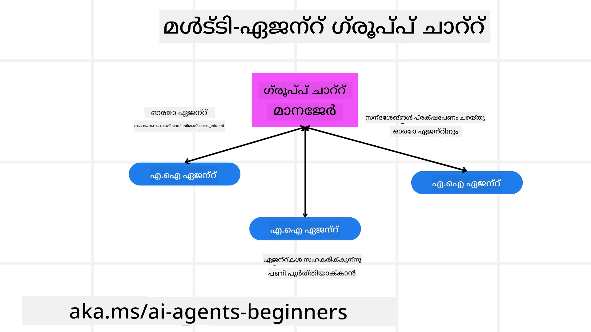
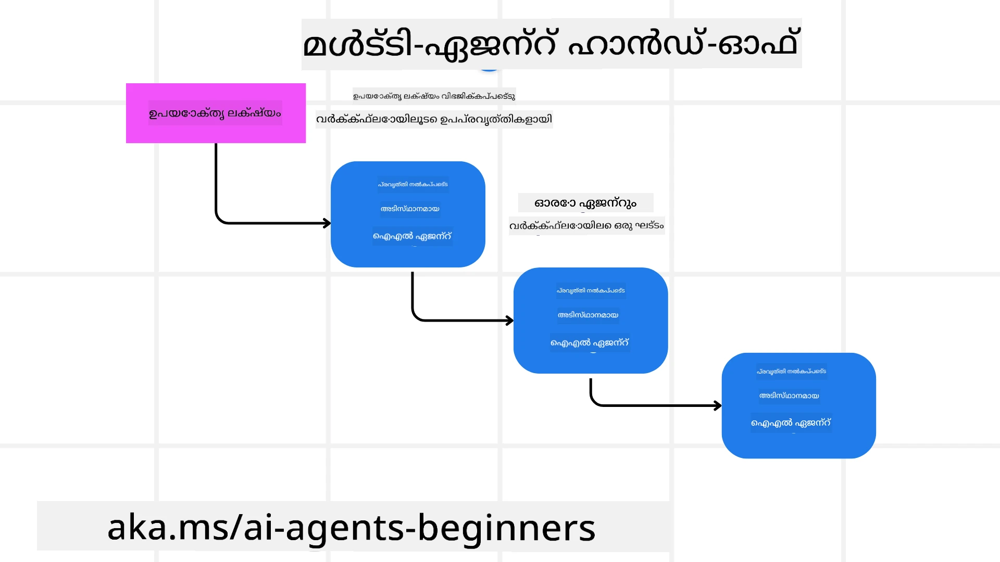
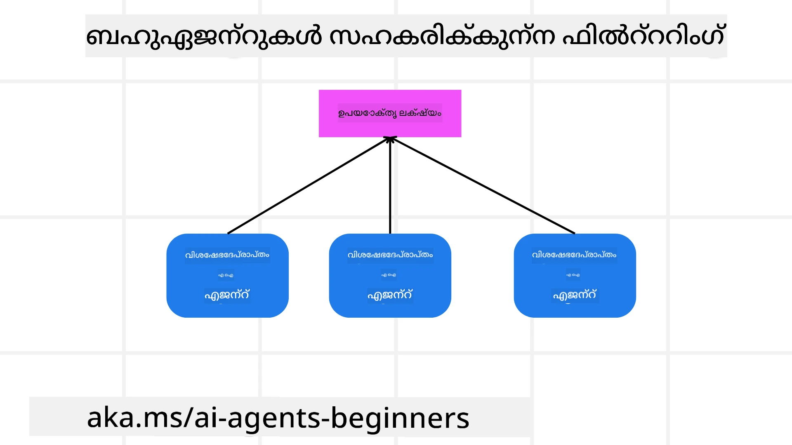

> _(ഈ പാഠത്തിന്റെ വീഡിയോ കാണാൻ മുകളിൽ കാണുന്ന ചിത്രം ക്ലിക്ക് ചെയ്യുക)_

# മൾട്ടി-ഏജന്റ് ഡിസൈൻ പാറ്റേണുകൾ

നിങ്ങൾ മൾട്ടി ഏജന്റുകൾ ഉൾപ്പെടുന്ന ഒരു പ്രോജക്ടിൽ പ്രവർത്തനം തുടങ്ങുന്നതോടെ, മൾട്ടി-ഏജന്റ് ഡിസൈൻ പാറ്റേൺ പരിഗണിക്കേണ്ടിവരും. എന്നാൽ, മൾട്ടി-ഏജന്റുകളിൽ മാറുന്നത് 언제 വേണ്ടതെന്ന്, അതിന്റെ മെച്ചപ്പെട്ട ഗുണങ്ങൾ എന്താണെന്നുമെല്ലാം ഉടനെ വ്യക്തമാകാതിരിക്കാം.

## പരിചയം

ഈ പാഠത്തിൽ, താഴെ കാണുന്ന ചോദ്യങ്ങൾക്ക് ഉത്തരം തേടുകയാണ്:

- മൾട്ടി-ഏജന്റുകൾ പ്രയോഗിക്കാൻ അനുയോജ്യമായ സാഹചര്യങ്ങൾ എന്തൊക്കെയാണ്?
- ഒരൊറ്റ ഏജന്റിന്റെ പകരം മൾട്ടി-ഏജന്റുകൾ ഉപയോഗിക്കുന്നതിന്റെ ഗുണങ്ങൾ എന്തൊക്കെയാണ്?
- മൾട്ടി-ഏജന്റ് ഡിസൈൻ പാറ്റേൺ നടപ്പിലാക്കാനുള്ള ഘടകങ്ങൾ എന്തെല്ലാം?
- ബഹുഏജന്റുകൾ തമ്മിലുള്ള ഇന്ററാക്ഷനുകൾ എങ്ങനെ വ്യക്തമാക്കാം?

## പഠന ലക്ഷ്യങ്ങൾ

ഈ പാഠം കഴിഞ്ഞാൽ, നിങ്ങൾക്ക് കഴിവാകും:

- മൾട്ടി-ഏജന്റുകൾ പ്രയോഗിക്കാൻ അനുയോജ്യമായ സാഹചര്യം തിരിച്ചറിയുക
- ഒറ്റ ഏജന്റിന് പകരം മൾട്ടി-ഏജന്റുകൾ ഉപയോഗിക്കുന്ന ഗുണങ്ങൾ തിരിച്ചറിയുക.
- മൾട്ടി-ഏജന്റ് ഡിസൈൻ പാറ്റേൺ നടപ്പിലാക്കാനുള്ള ഘടകങ്ങൾ മനസിലാക്കുക.

വലിയ ദൃശ്യം എന്താണ്?

*മൾട്ടി-ഏജന്റുകൾ ഒരു സാധാരണ ലക്ഷ്യം നേടാനായി ഒന്നിച്ച് പ്രവർത്തിക്കാൻ അനുവദിക്കുന്ന ഡിസൈൻ പാറ്റേണാണ്.*

ഈ പാറ്റേൺ റോബോട്ടിക്സ്, സ്വയംനിർവഹണ സിസ്റ്റങ്ങൾ, വിതരണ കംപ്യൂട്ടിംഗ് എന്നിവയിൽ വ്യാപകമായി ഉപയോഗിക്കുന്നു.

## മൾട്ടി-ഏജന്റുകൾ അനുയോജ്യമായ സാഹചര്യം

മൾട്ടി-ഏജന്റുകൾ ഉപയോഗിക്കാൻ നല്ല അനുയോജ്യമായ സാഹചര്യങ്ങൾ എന്തൊക്കെയാണ്? ഉത്തരം ഇതാണ്: മൾട്ടി-ഏജന്റുകൾ പ്രയോജനപ്പെടുന്ന നിരവധി സാഹചര്യങ്ങളുണ്ട്, പ്രത്യേകിച്ച് താഴെ പറയുന്ന കേസുകളിൽ:

- **വലുതായ ജോലിബാധ്യതകൾ**: വലിയ ജോലികൾ ചെറിയ ടെൻഷനുകളായി വിഭജിച്ച് വിവിധ ഏജന്റുകൾക്ക് ഏൽക്കാവുന്നതും, സാമ്യമുള്ള പ്രോസസ്സിംഗിലൂടെ വേഗത്തിൽ പൂർത്തിയാക്കാവുന്നതും ആണ്. ഉദാഹരണത്തിന് വലിയ ഡാറ്റ പ്രോസസ്സിംഗ് ജോലിയിലാണ് ഇത്.
- **സങ്കീർണ്ണമായ ജോലികൾ**: വലിയ ജോലികൾപോലെ സങ്കീർണ്ണമായ ജോലികളും ചെറു ഉപജോലികളാക്കി വിഭജിച്ച് ഓരോ ഏജന്റിനും പ്രത്യേക ഒരു മേഖലയിലുള്ള പ്രത്യേകത നൽകാനാവും. ഉദാഹരണത്തിന് സ്വയം ഓടുന്ന വാഹനങ്ങളിലെ വ്യത്യസ്ത ഏജന്റുകൾ നാവിഗേഷൻ, തടസ്സ കണ്ടെത്തൽ, മറ്റു വാഹനങ്ങളുമായുള്ള ആശയവിനിമയം എന്നിവ കൈകാര്യം ചെയ്യുന്നു.
- **വിവിധ പ്രാവീന്യം**: വ്യത്യസ്ത ഏജന്റുകൾ വ്യത്യസ്ത പ്രാവീന്യങ്ങൾ ഉള്ളതാണ്, അതുകൊണ്ട് ഒരു ഏജന്റിനേക്കാൾ നല്ലതായും ഫലപ്രദമായും ജോലിയുടെ പല വശങ്ങളും കൈകാര്യം ചെയ്യാനുള്ള കഴിവ് ഉണ്ടായിരിക്കും. ഉദാഹരണത്തിന് ആരോഗ്യപരിചരണ മേഖലയിലെ ഏജന്റുകൾ രോഗനിർണയം, ചികിത്സാസമയം, രോഗി നിരീക്ഷണം എന്നിവ നിയന്ത്രിക്കും.

## ഒറ്റ ഏജന്റിനേക്കാൾ മൾട്ടി-ഏജന്റുകൾ ഉപയോഗിച്ചുള്ള പ്രയോജനങ്ങൾ

ലളിതമായ ജോലികൾക്ക് ഒറ്റ ഏജന്റ് സിസ്റ്റം പ്രവർത്തിക്കാം, എന്നാൽ സങ്കീർണ്ണ ജോലികൾക് മൾട്ടി ഏജന്റുകൾ ഉപയോഗിക്കുന്നത് താഴെ പറയുന്ന ഗുണങ്ങൾ നൽകുന്നു:

- **വിശിഷ്‌ടത**: ഓരോ ഏജന്റും ഒരു പ്രത്യേക ജോലിക്ക് പ്രത്യേകിച്ചാവും. ഒറ്റ ഏജന്റിൽ specialization ഇല്ലാത്തത് എല്ലാ ജോലികളും ചെയ്യാൻ ശ്രമിച്ചാൽ സങ്കീർണ്ണ ജോലിയിലെ 混乱 സാദ്ധ്യത ഉണ്ട്. എങ്കിൽ അനുയോജ്യമല്ലാത്ത ജോലിയുണ്ടായിരിക്കും.
- **വ്യവസ്ഥിതിവത്കരണം**: ഒരു ഏജന്റിനെ അധികം ഭാരമെടുപ്പിച്ചു കൂടുതൽ പ്രയാസമാകുന്നത് പകരം, കൂടുതൽ ഏജന്റുകൾ ചേർക്കുന്നതിലൂടെ സിസ്റ്റം എളുപ്പത്തിൽ വിപുലീകരിക്കാം.
- **ഫാൽട്ട് ടോളറൻസ്**: ഒരു ഏജന്റ് വീഴുമ്പോഴും മറ്റുള്ളവ പ്രവർത്തനം തുടരുമ്‌ബേലും സിസ്റ്റത്തിന്റെ വിശ്വാസ്യത ഉറപ്പാക്കാം.

ഉദാഹരണമായി, ഒരു ഉപയോക്താവിന് യാത്ര ബുക്ക് ചെയ്യുക. ഒരു ഏകഏജന്റ് സിസ്റ്റം എല്ലാ കാര്യങ്ങളും: എയർഫ്ലൈറ്റ് കണ്ടെത്തൽ, ഹോട്ടൽ ബുക്കിംഗ്, കാർ വാടക തുടങ്ങിയവ കൈകാര്യം ചെയ്‌യണം. ഒറ്റ ഏജന്റ് ഇതൊക്കെയെങ്കിലും കൈകാര്യം ചെയ്യാൻ ഉപകരണങ്ങൾ ഉണ്ടായിരിക്കണം. ഇതോടെ സങ്കീർണ്ണവും പരിപാലിക്കാൻ ബുദ്ധിമുട്ടുള്ള മോണോളിത്തിക്ക് സിസ്റ്റം ഉണ്ടാകും. എന്നാൽ, മൾട്ടി-ഏജന്റ് സിസ്റ്റത്തിലെ വ്യത്യസ്ത ഏജന്റുകൾ ഫ്ലൈറ്റ് കണ്ടെത്തൽ, ഹോട്ടൽ ബുക്കിംഗ്, കാർ വാടക എന്നിവയിൽ പ്രത്യേകമായിരിക്കും. ഇതോടെ സിസ്റ്റം കൂടുതൽ മോഡുലാർ, പരിപാലിക്കാൻ എളുപ്പമുള്ളതും, വ്യവസ്ഥിതിവത്കരിക്കാനുള്ളതുമായിരിക്കും.

ഇത് കൂടാതെ, ഒരു ചെറിയ മാതാപിതൃ കടയായി പ്രവര്‍ത്തിക്കുന്ന ഒരു ടൂറിസ്റ്റ് ഏജൻസിയും ഒരു ഫ്രാഞ്ചൈസി രീതിയിലുള്ള ടൂറിസ്റ്റ് ഏജൻസിയും തമ്മിലുള്ള വ്യത്യാസം പോലെ. മാതാപിതൃ കടയിൽ ഒറ്റ ഏജന്റ് യാത്ര ബുക്കിംഗിന്റെ എല്ലാ ഭാഗങ്ങളും കൈകാര്യം ചെയ്യുക, എന്നാൽ ഫ്രാഞ്ചൈസിയിൽ വ്യത്യസ്ത ഏജന്റുകൾ വിവിധ ഭാഗങ്ങൾ കൈകാര്യം ചെയ്യും.

## മൾട്ടി-ഏജന്റ് ഡിസൈൻ പാറ്റേൺ നടപ്പിലാക്കുന്ന ഘടകങ്ങൾ

മൾട്ടി-ഏജന്റ് ഡിസൈൻ പാറ്റേൺ നടപ്പിലാക്കാൻ മുമ്പ് പാറ്റേൺ രൂപപ്പെടുന്ന ഘടകങ്ങൾ മനസിലാക്കേണ്ടതാണ്.

വീണ്ടും ഒരു ഉപയോക്താവിന് യാത്ര ബുക്ക് ചെയ്യലിന്റെ ഉദാഹരണം എടുത്ത് നോക്കാം. ഈ ഘടകങ്ങളിൽ ഉൾപ്പെടും:

- **ഏജന്റ് ആശയവിനിമയം**: ഫ്ലൈറ്റ് കണ്ടെത്തൽ, ഹോട്ടൽ ബുക്കിംഗ്, കാറിന്റെ റന്റൽ എന്നീ ഏജന്റുകൾ തമ്മിൽ ഉപയോക്തൃ ഇസ്റ്റങ്ങളുടെയും നിയന്ത്രണങ്ങളുടെയും വിവരങ്ങൾ പങ്കുവയ്ക്കണം. ഈ ആശയവിനിമയത്തിനുള്ള പ്രോട്ടോക്കോളുകളും മാർഗങ്ങളും നിശ്ചയിക്കണം. ഉദാഹരണത്തിന്, ഫ്ലൈറ്റ് കണ്ടെത്തുന്ന ഏജന്റ് ഹോട്ടൽ ബുക്കിംഗ് ഏജന്റ് വഴി യാത്ര തീയതികൾ പങ്കുവെച്ച് ഹോട്ടൽ ബുക്ക് ചെയ്യുന്നതിൽ ഏകോപനം ഉറപ്പാക്കണം.
- **ഏജന്റ് സഹകാര്യ സംവിധാനങ്ങൾ**: ഉപയോക്തൃ ഇഷ്ടങ്ങൾക്കും നിയന്ത്രണങ്ങൾക്കും അനുസൃതമായി ഓരോ ഏജന്റിനും പ്രവർത്തനങ്ങൾ ഏകോപിപ്പിക്കണം. ഉപയോക്താവ് വിമാനത്താവളത്തിന് അടുത്തുള്ള ഹോട്ടൽ ആഗ്രഹിക്കുമ്പോൾ, കാറിന്റെ റന്റൽ ഏജന്റ് അതിന് വിപരീതമായി സജ്ജീകരിച്ചേക്കാം. ഇത്തരത്തിൽ, ഹോട്ടൽ ബുക്കിംഗ് ഏജന്റ് റന്റൽ ഏജന്റ് കൊണ്ട് ഒത്തിണക്കണം. *ഏജന്റുകൾ എങ്ങനെ പ്രവർത്തനങ്ങൾ ഏകോപിപ്പിക്കുന്നു* എന്നും നിശ്ചയിക്കണം.
- **ഏജന്റ് ഘടന**: ഏജന്റുകൾ തീരുമാനങ്ങൾ എടുക്കാനും ഉപയോക്താവിനോടുള്ള സംവാദങ്ങളിൽ നിന്നും പഠിക്കാനും ഉള്ള ഉള്ളൂട്ട് ഘടന കുറഞ്ഞിരിക്കണം. ഫ്ലൈറ്റ് കണ്ടെത്തൽ ഏജന്റ് ഉപയോക്താവിന്റെ മുൻ ഇഷ്ടങ്ങൾ അടിസ്ഥാനമാക്കി യന്ത്രപഠന മോഡൽ ഉപയോഗിച്ച് ശുപാർശകൾ നൽകാമെന്ന് ഉദാഹരണത്തിന്. *ഏജന്റ് എങ്ങനെ തീരുമാനങ്ങളെടുക്കുന്നു, എങ്ങനെ പഠിക്കുന്നു* എന്നത് നിർണ്ണയിക്കണം.
- **മൾട്ടി-ഏജന്റ് ഇടപെടലുകളുടെ ദൃശ്യം**: ഏജന്റുകൾ തമ്മിലുള്ള ഇടപെടലുകൾ എങ്ങനെ നടക്കുന്നു എന്ന് കാണാൻ ദൃഷ്ടി വേണം. അതിനായി ലോങ്ങിങ്, മോണിറ്ററിംഗ് ടൂൾസ്, ദൃശ്യീകരണ ഉപകരണങ്ങൾ, പ്രകടന മെട്രിക്‌സ് എന്നിവ വേണം.
- **മൾട്ടി-ഏജന്റ് പാറ്റേണുകൾ**: മൾട്ടി-ഏജന്റ് സിസ്റ്റങ്ങൾ നടപ്പിലാക്കാൻ കേന്ദ്രകൃതം, വികേന്ദ്രിതം, ഹൈബ്രിഡ് തുടങ്ങിയ വ്യത്യസ്ത ആർകിടെക്ചറുകൾ ഉണ്ട്. നിങ്ങൾക്ക് ഏറ്റവും അനുയോജ്യമായ പാറ്റേൺ തിരഞ്ഞെടുക്കണം.
- **മനുഷ്യനെയും ഉൾപ്പെടുത്തൽ**: ബഹുദൂരമായി ഒരു മനുഷ്യനെ ഇടയിൽ ഉൾപ്പെടുത്തേണ്ടതുമുണ്ടാകും, ഏജന്റുകൾക്ക് മനുഷ്യനിൽ നിന്ന് ഇടപെടൽ cuándo ആവശ്യമാണ് എന്ന് നിർദ്ദേശിക്കേണ്ടതും. ഉദാഹരണത്തിന്, ഉപയോക്താവ് പ്രത്യേകം ഒരു ഹോട്ടലിനോ ഫ്ലൈറ്റിനോ അഭ്യർത്ഥിക്കുമ്പോൾ or ബുക്കിംഗ് മുമ്പ് സ്ഥിരീകരണം വേണോയെന്ന് ചോദിക്കുമ്പോൾ.

## മൾട്ടി-ഏജന്റ് ഇടപെടലുകളുടെ ദൃശ്യം

ബഹുഏജന്റുകൾ തമ്മിൽ എങ്ങനെ ഇടപെടുന്നു എന്ന് കാണാനുള്ള കഴിവ് വളരെ പ്രധാനമാണ്. ഇത് തകരാറുകൾ കണ്ടെത്താനും, മെച്ചപ്പെടുത്താനും, സമഗ്ര സിസ്റ്റത്തിന്റെ ഫലപ്രാപ്തി ഉറപ്പാക്കാനും സഹായിക്കുന്നു. അതിനായി പ്രവർത്തനങ്ങളും ഇടപെടലുകളും ട്രാക്ക് ചെയ്യാനുള്ള ഉപകരണങ്ങളും സങ്കേതങ്ങളും വേണം. ഉദാഹരണത്തിന്, ലോങ്ങിങ്, മോണിറ്ററിംഗ്, ദൃശ്യീകരണ ഉപകരണങ്ങൾ, പ്രകടന മെട്രിക്‌സ് എന്നിവ.

ഉദാഹരണത്തിന്, യാത്ര ബുക്ക് ചെയ്യുമ്പോൾ ഓരോ ഏജന്റിന്റേയും സ്ഥിതി, ഉപയോക്തൃ ഇഷ്ടങ്ങൾ, നിയന്ത്രണങ്ങൾ, ഏജന്റുകൾ തമ്മിലുള്ള ഇടപെടലുകൾ ഇങ്ങനെ ഒരു ഡാഷ്‌ബോർഡ് കാണിച്ചു നൽകാം. അതിൽ ഉപയോക്തൃ യാത്ര തീയതികളും, ഫ്ലൈറ്റ് ഏജന്റിന്റെ ശുപാർശകളും, ഹോട്ടൽ ഏജന്റിന്റെ ശുപാർശകളും, കാറിന്റെ റന്റൽ ഏജന്റിന്റെ ശുപാർശകളും കാണാം. ഇതു ഏജന്റുകൾ തമ്മിൽ എങ്ങനെ ഇടപെടുന്നുവെന്ന് വ്യക്തമായി കാണിച്ച് ഉപയോക്തൃ ഇഷ്ടങ്ങളും നിയന്ത്രണങ്ങളും പാലിക്കപ്പെടുന്നുവോ എന്നറിയാൻ സഹായിക്കും.

ഓരോ കാഴ്ചപ്പാട് കൂടുതൽ വിശദമായി പരിശോധിക്കാം.

- **ലോങ്ങിങ്, മോണിറ്ററിങ് ഉപകരണങ്ങൾ**: ഏജന്റ് എടുത്ത ഓരോ പ്രവർത്തനത്തിനും ലോങ്ങിങ് വേണം. ലോങ്ങ് എൻട്രിയിൽ ഏജന്റിന്റെ പേര്, എടുത്ത പ്രവർത്തനം, സമയവും ഫലവും ഉൾപ്പെടുത്താം. ഇതുപോലുള്ള വിവരങ്ങൾ ഡിബഗ്ഗിംഗിനും മെച്ചപ്പെടുത്തലിനും സഹായിക്കും.

- **ദൃശ്യീകരണ ഉപകരണങ്ങൾ**: ഏജന്റുകൾ തമ്മിലുള്ള ഇടപെടലുകൾ ബോധ്യപ്പെട്ട രീതിയിൽ കാണാൻ സഹായിക്കും. ഉദാഹരണത്തിന്, ഏജന്റുകൾ തമ്മിലുള്ള വിവര പ്രവാഹം ഗ്രാഫായി കാണിച്ചു, സിസ്റ്റത്തിലെ തടസ്സങ്ങൾ, പ്രവർത്തനക്ഷമതയുടെ കുറവുകൾ തുടങ്ങിയവ കണ്ടെത്താം.

- **പ്രകടന മെട്രിക്‌സ്**: മൾട്ടി-ഏജന്റ് സിസ്റ്റത്തിന്റെ ഫലപ്രാപ്തി നിരീക്ഷിക്കാൻ സഹായിക്കും. ഒരു ജോലിക്ക് പൂർത്തിയാകാൻ എടുത്ത സമയം, ഓരോ യൂണിറ്റ് സമയത്തിൽ പൂർത്തീകരിച്ച ജോലികളുടെ എണ്ണം, ഏജന്റുകൾ നിർദേശിക്കുന്ന ശുപാർശകളുടെ കൃത്യത തുടങ്ങിയവ ട്രാക്ക് ചെയ്യും. ഇതു മെച്ചപ്പെടുത്തൽ ആവശ്യമായ പ്രദേശങ്ങൾ തിരിച്ചറിയാൻ സഹായിക്കും.

## മൾട്ടി-ഏജന്റ് പാറ്റേണുകൾ

മൾട്ടി-ഏജന്റ് ആപ്ലിക്കേഷനുകൾ സൃഷ്ടിക്കാൻ ഉപയോഗിക്കാവുന്ന ചില Konkrit പാറ്റേണുകൾ പരിശോധിക്കാം. ഇവ പരിഗണിക്കേണ്ട ചില രസകരമായ പാറ്റേണുകൾ ആണ്:

### ഗ്രൂപ്പ് ചാറ്റ്

ഒരേ സമയം ബഹുവിധ ഏജന്റുകൾ തമ്മിൽ ആശയവിനിമയം നടത്തേണ്ട ഗ്രൂപ്പ് ചാറ്റ് ആപ്ലിക്കേഷൻ സൃഷ്ടിക്കാൻ ഇത് അനുയോജ്യമാണ്. ടീം സഹകരണം, ഉപഭോക്തൃ സഹായം, സാമൂഹിക നെറ്റ്വർക്കിംഗ് എന്നിവയിൽ സാധാരണ ഉപയോഗിക്കുന്നു.

ഈ പാറ്റേണിൽ, ഓരോ ഏജന്റും ഗ്രൂപ്പ് ചാറ്റിലെ ഒരു ഉപയോക്താവിനെ പ്രതിനിധീകരിക്കുന്നു, സന്ദേശങ്ങൾ ഏജന്റുകൾ തമ്മിൽ മെസേജിംഗ് പ്രോട്ടോക്കോൾ വഴി കൈമാറുന്നു. ഏജന്റുകൾ ഗ്രൂപ്പ് ചാറ്റിന് സന്ദേശം അയയ്ക്കുകയും സ്വീകരിക്കുകയും മറ്റുള്ള ഏജന്റുകളോട് പ്രതികരിക്കുകയും ചെയ്യുന്നു.

ഇത് കേന്ദ്രകൃതമായ ആർകിടെക്ചറും എല്ലാം സന്ദേശങ്ങൾ ഒരു സെൻട്രൽ സെർവറിൽ വഴി റൂട്ടുചെയ്യപ്പെടുന്നതും അല്ലെങ്കിൽ വികേന്ദ്രിതമായ ആർകിടെക്ചറും നേരിട്ട് സന്ദേശം കൈമാറുന്നതും ഉപയോഗിച്ച് നടപ്പിലാക്കാം.

### ഹാൻഡ്-ഓഫ്

നിരവധി ഏജന്റുകൾ തമ്മിൽ ജോലികൾ കൈമാറുന്ന ഒരു ആപ്ലിക്കേഷൻ സൃഷ്ടിക്കാൻ ഇത് അനുയോജ്യമാണ്.

ഉപഭോക്തൃ സഹായം, ജോലിവ്യവസ്ഥापन, പ്രവൃത്തി ഓട്ടോമേഷൻ എന്നിവയിൽ സാധാരണ ഈ പാറ്റേൺ ഉപയോഗിക്കപ്പെടുന്നു.

ഈ പാറ്റേണിൽ, ഓരോ ഏജന്റും ഒരു ജോലിയോ പ്രവൃത്തി ഘട്ടമോ പ്രതിനിധീകരിക്കുന്നു, വിധിതർമുഖ നിബന്ധനകൾ അടിസ്ഥാനമാക്കി ജോലികൾ മറ്റൊരു ഏജന്റിനോട് കൈമാറുന്നു.

### സഹകരണ ഫിൽട്ടറിങ്

നിരവധി ഏജന്റുകൾ ഉപയോക്താക്കൾക്ക് ശുപാർശകൾ നൽകാൻ ശ്രമിക്കുന്ന ആപ്ലിക്കേഷൻ സൃഷ്ടിക്കാൻ ഇത് ഉപയോഗിക്കുന്നു.

ഏജന്റുകൾ തമ്മിൽ സഹകരിക്കേണ്ടതിന്റെ കാരണം ഓരോ ഏജന്റും വ്യത്യസ്ത മേഖലകളിൽ വിദഗ్ధരായിരിക്കാമെന്നും ശുപാർശ പ്രക്രിയയിൽ വ്യത്യസ്ത രീതിയിൽ സംഭാവന നൽകാനാകുമെന്നും ആണ്.

ഉദാഹരണമായി, ഒരു ഉപയോക്താവിന് ഓഹരി വിപണിയിൽ മികച്ച ഓഹരി വാങ്ങാനുള്ള ശുപാർശ വേണം എന്നു കരുതാം.

- **കയറ്റു നിപുണൻ**: ഒരു ഏജന്റ് ഒരു പ്രത്യേക വ്യവസായത്തിൽ വിദഗ്ധൻ ആകാം.
- **സാങ്കേതിക വിശകലനം**: മറ്റൊരു ഏജന്റ് സാങ്കേതിക വിശകലനത്തിൽ നിപുണൻ ആകാം.
- **അടിസ്ഥാന വിശകലനം**: മറ്റൊരു ഏജന്റ് അടിസ്ഥാന വിശകലനത്തിൽ നിപുണൻ ആകാം. ഇവ പരസ്പരം സഹകരിച്ച് ഉപയോക്താവിനായി കൂടുതൽ സമഗ്രമായ ശുപാർശകൾ നൽകും.

## സാഹചര്യം: റീഫണ്ട് പ്രക്രിയ

ഉപഭോക്താവ് ഒരു ഉൽപ്പന്നത്തിന് റീഫണ്ട് നേടാൻ ശ്രമിക്കുന്ന സാഹചര്യത്തെ പരിഗണിക്കുമ്പോൾ, ഈ പ്രക്രിയയിൽ നിരവധി ഏജന്റുകൾ ഉൾപ്പെടാം. എന്നാൽ, പ്രത്യേക പ്രക്രിയയ്ക്കുള്ള ഏജന്റുകളായും നിങ്ങളുടെ ബിസിനസിന്റെ മറ്റ് ഭാഗങ്ങളിലും ഉപയോഗിക്കാവുന്ന പൊതുവായ ഏജന്റുകളായും ഇവയെ വിഭജിക്കാം.

**രീഫണ്ട് പ്രക്രിയക്ക് പ്രത്യേകിച്ചുള്ള ഏജന്റുകൾ**:

റീഫണ്ട് പ്രക്രിയയിൽ ഉൾപ്പെടാവുന്ന ചില ഏജന്റുകൾ:

- **ഉപഭോക്തൃ ഏജന്റ്**: റീഫണ്ട് പ്രക്രിയ ആരംഭിക്കുന്നതിനുള്ള ഉത്തരവാദിത്തമുള്ള ഉപഭോക്താവിനെ പ്രതിനിധീകരിക്കുന്നു.
- **വിൽപ്പന ഏജന്റ്**: റീഫണ്ട് പ്രക്രിയ നിർവഹിക്കുന്ന വിൽപ്പനക്കാരനെ പ്രകടിപ്പിക്കുന്നു.
- **പേയ്മെന്റ് ഏജന്റ്**: ഉപഭോക്താവിന്റെ പേയ്മെന്റ് റീഫണ്ട് ചെയ്യുന്നതിനുള്ള ഉത്തരവാദിത്തമുള്ള പേയ്മെന്റ് പ്രക്രിയ പ്രതിനിധീകരിക്കുന്നു.
- **പരിഹാര ഏജന്റ്**: റീഫണ്ട് പ്രക്രിയയിൽ സംഭവിച്ച പ്രശ്നങ്ങൾ പരിഹരിക്കുന്നതിനുള്ള ഉത്തരവാദി.
- **നിയമാനുസരണം ഏജന്റ്**: റീഫണ്ട് പ്രക്രിയ നിയമങ്ങളും നിബന്ധനകളും പാലിക്കുന്നതിനു് ശ്രദ്ധಿಸುವ ഏജന്റ്.

**പൊതുവായ ഏജന്റുകൾ**:

നിങ്ങളുടെ ബിസിനസിന്റെ മറ്റ് ഭാഗങ്ങളിലും ഉപയോഗിക്കാവുന്ന ഏജന്റുകൾ.

- **ഷിപ്പിംഗ് ഏജന്റ്**: ഉൽപ്പന്നം വിൽപ്പനക്കാരനിലേക്ക് മടങ്ങിപ്പോകുന്നതിൽ ഉത്തരവാദിത്തമുള്ള ശിപ്പിംഗ് പ്രക്രിയ പ്രതിനിധീകരിക്കുന്നു. ഇത് റീഫണ്ട് പ്രക്രിയക്കും സാധാരണ ഉൽപ്പന്ന ഷിപ്പിംഗിനും ഉപയോഗിക്കാം.
- **പ്രതികരണ ഏജന്റ്**: ഉപഭോക്തൃ പ്രതികരണങ്ങൾ ശേഖരിക്കുന്നപ്രക്രിയ.
- **എസ്കലേഷൻ ഏജന്റ്**: ഉയർന്ന തലത്തിലെ പിന്തുണ പിടിക്കുന്നതിനായി പ്രശ്നങ്ങൾ മുന്നോട്ട് നൽകുന്നു. ഏത് പ്രക്രിയയിലും ഉപയോഗിക്കാവുന്നതാണ്.
- **അറിയിപ്പുകൾ അയക്കുന്ന ഏജന്റ്**: റീഫണ്ട് പ്രക്രിയയിലെ വിവിധ ഘട്ടങ്ങളിൽ ഉപഭോക്താവിന് അറിയിപ്പുകൾ അയയ്ക്കുന്നു.
- **അനലിറ്റിക്സ് ഏജന്റ്**: റീഫണ്ട് പ്രക്രിയയുമായി ബന്ധപ്പെട്ട ഡാറ്റ വിശകലനം ചെയ്യുന്നു.
- **ഓഡിറ്റ് ഏജന്റ്**: റീഫണ്ട് പ്രക്രിയ ശരിയായ രീതിയിൽ നടന്നു കൊണ്ടുണ്ടോ എന്ന് ഓഡിറ്റ് നിയന്ത്രണങ്ങൾ വരുത്തുന്നു.
- **റിപ്പോർട്ടിംഗ് ഏജന്റ്**: റീഫണ്ട് പ്രക്രിയയുടെ റിപ്പോർട്ടുകൾ സൃഷ്ടിക്കുന്നു.
- **ജ്ഞാന ഏജന്റ്**: റീഫണ്ട്-സംബന്ധമായും മറ്റ് ബിസിനസ് മേഖലകളിലുമായി വിവരങ്ങൾ പരിപാലിക്കുന്നു.
- **സുരക്ഷ ഏജന്റ്**: റീഫണ്ട് പ്രക്രിയയുടെ സുരക്ഷ ഉറപ്പാക്കുന്നു.
- **ഗുണനിലവാരം ഏജന്റ്**: റീഫണ്ട് പ്രക്രിയയുടെ ഗുണനിലവാരം ഉറപ്പാക്കുന്നു.

മുകളിൽ പല ഏജന്റുകളും ഉദ്ധരിച്ചിരിക്കുന്നു, പ്രത്യേകിച്ച് റീഫണ്ട് പ്രക്രിയയ്ക്കും സാധാരണ ബിസിനസ് പ്രവർത്തനങ്ങൾക്കും ഉൾപ്പെടുത്താവുന്നതും. ഇത് മൾട്ടി-ഏജന്റ് സിസ്റ്റത്തിൽ ഏജന്റുകൾ എങ്ങനെയായിരിക്കണം എന്ന সম্পর্কে ഒരു ആശയം നൽകുമെന്ന് വിശ്വസിക്കുന്നു.

## നിയോഗം

ഒരു ഉപഭോക്തൃ സഹായ പ്രക്രിയയ്ക്കുള്ള മൾട്ടി-ഏജന്റ് സിസ്റ്റം രൂപകൽപ്പന ചെയ്‌യുക. പ്രക്രിയയിലെ ഏജന്റുകൾ, അവരുടെ പങ്ക്, ഉത്തരവാദിത്വങ്ങൾ, പരസ്പരം എങ്ങനെയാണ് ഇടപെടുന്നത് എന്നിവ തിരിച്ചറിയുക. ഉപഭോക്തൃ സഹായ പ്രക്രിയയ്ക്കു പ്രത്യേകിച്ചുള്ള ഏജന്റുകളെയും മറ്റവിടങ്ങളിലായി ഉപയോഗിക്കാവുന്ന പൊതുഏജന്റുകളെയും പരിഗണിക്കുക.

> താഴെ കൊടുത്ത പരിഹാരം വായിക്കാൻ മുൻപ് നിങ്ങൾക്ക് കരുതിപ്പോവുക, നിങ്ങൾ فکرിക്കുന്നതേക്കാളും കൂടുതൽ ഏജന്റുകൾ ആവശ്യമാകാം.

> TIP: ഉപഭോക്തൃ പിന്തുണാ പ്രക്രിയയുടെ വിവിധ ഘട്ടങ്ങളെ കുറിച്ച് ചിന്തിക്കുക, കൂടാതെ ഏതെങ്കിലും സിസ്റ്റത്തിനായി ആവശ്യമായ ഏജന്റുകളെ കൂടി പരിഗണിക്കുക.

## പരിഹാരം

[Solution](./solution/solution.md)

## അറിവ് പരിശോധികൾ

### ചോദ്യമൊന്ന്

മൾട്ടി-ഏജന്റ് സിസ്റ്റത്തിനായി ഏത് സാഹചര്യമാണ് ഏറ്റവും അനുയോജ്യം?

- [ ] A1: ഒരു സപ്പോർട്ട് ബോട്ട് ഒരു അറിവ് ബേസ് ഉപയോഗിച്ച് സാധാരണ ചോദ്യങ്ങൾക്ക് മറുപടി നൽകുന്നു, ചെറിയ ഉപകരണങ്ങളുടെ ഉപയോഗത്തോടെ.
- [ ] A2: ഒരു റീഫണ്ട് വാർക്ക്‌ഫ്ലോയ്ക്ക് വ്യത്യസ്ത തട്ടിപ്പ്, പേയ്മെന്റ്, കംപ്ലയൻസ് പദവികൾ വേണം, ഓരോന്നിനും സ്വന്തം ഉപകരണങ്ങൾ ഉണ്ട്, അവയുടെ ഫലങ്ങൾ ഏകോപിപ്പിക്കണം.
- [ ] A3: ഒരേ ലളിതമായ വർഗ്ഗീകരണ അഭ്യർത്ഥന ഓരോ മണിക്കൂറിലും ആയിരങ്ങൾക്കാണായി വരുന്നു.

### ചോദ്യരണ്ട്

ഒരേയൊരു ഏജന്റ് സാധാരണയായി നല്ല തിരഞ്ഞെടുപ്പാകുന്നത് എപ്പോഴാണ്?

- [ ] A1: ഒരു സെറ്റ് നിർദ്ദേശങ്ങളും ഉപകരണങ്ങളും ഉപയോഗിച്ച് ഇത് കൈകാര്യം ചെയ്യാവുന്നതാണ്, വിദഗ്ധരെ കൈമാറുന്ന അവശ്യമായ സാഹചര്യമില്ലാതെ.
- [ ] A2: ഏജന്റിന് ഒരു തരത്തിൽ കൂടുതൽ ഉപകരണങ്ങൾ ലഭ്യമുണ്ട്.
- [ ] A3: വാർക്ക്‌ഫ്ലോയ്ക്ക് വ്യത്യസ്ത അവകാശവും സ്വാതന്ത്ര്യ ഓഡിറ്റ് ട്രെയിലുകളും ഉള്ള മാറ്റം തരും പദവികൾ വേണം.

[Solution quiz](./solution/solution-quiz.md)

## സാരാംശം

ഈ പാഠത്തിൽ, മൾട്ടി-ഏജന്റ് ഡിസൈൻ പാറ്റേൺ, മൾട്ടി-ഏജന്റുകൾ പ്രയോഗിക്കാൻ ഉചിതമായ സാഹചര്യങ്ങൾ, ഒറ്റ ഏജന്റിനെ അപേക്ഷിച്ച് മൾട്ടി-ഏജന്റുകൾ ഉപയോഗിക്കുന്നതിന്റെ ഗുണങ്ങൾ, മൾട്ടി-ഏജന്റ് ഡിസൈൻ പാറ്റേൺ നടപ്പാക്കുവാനുള്ള ആധാരഭാഗങ്ങൾ, 여러 ഏജന്റുകൾ എങ്ങനെ പരസ്പരം പ്രത്യയത്തേടുന്നു എന്ന് കാണുന്ന വിധം പരിഗണിച്ചിട്ടുണ്ട്.

### മൾട്ടി-ഏജന്റ് ഡിസൈൻ പാറ്റേണിനെക്കുറിച്ച് കൂടുതൽ ചോദ്യങ്ങളുണ്ടോ?

[Microsoft Foundry Discord](https://discord.com/invite/ATgtXmAS5D) ൽ ജോയിൻ ചെയ്ത് മറ്റ് പഠനാർത്ഥികളുമായി 만나ുക, ഓഫീസ് മണിക്കൂറുകളിൽ പങ്കെടുക്കുക, നിങ്ങളുടെ AI ഏജന്റുകൾക്കുള്ള ചോദ്യങ്ങൾക്കു മറുപടി ലഭിക്കുക.

## കൂടുതൽ സ്രോതസ്സുകൾ

- <a href="https://learn.microsoft.com/azure/ai-services/agents/overview" target="_blank">Microsoft Agent Framework ഡോക്യുമെൻറേഷൻ</a>
- <a href="https://www.analyticsvidhya.com/blog/2024/10/agentic-design-patterns/" target="_blank">Agentic ഡിസൈൻ പാറ്റേണുകൾ</a>

## മുന്‍പത്തെ പാഠം

[Planning Design](../07-planning-design/README.md)

## അടുത്ത പാഠം

[Metacognition in AI Agents](../09-metacognition/README.md)

---

<!-- CO-OP TRANSLATOR DISCLAIMER START -->
**അറിയിപ്പ്**:
ഈ രേഖ AI പരിഭാഷാ സേവനം [Co-op Translator](https://github.com/Azure/co-op-translator) ഉപയോഗിച്ച് പരിഭാഷപ്പെടുത്തിയതാണ്. ഞങ്ങൾ കൃത്യതയ്ക്കായി ശ്രമിക്കുന്നുവെങ്കിലും, ഓട്ടോമേറ്റഡ് പരിഭാഷകളിൽ പിഴവുകൾ അല്ലെങ്കിൽ തെറ്റായ വിവരങ്ങൾ ഉണ്ടാകാൻ സാധ്യതയുണ്ട്. അതിന്റെ സ്വാഭാവിക ഭാഷയിലുള്ള അസൽ രേഖയാണ് പ്രാമാണികമായ ഉറവിടമായി പരിഗണിക്കേണ്ടത്. നിർണായകമായ വിവരങ്ങൾക്ക്, പ്രൊഫഷണൽ മനുഷ്യ പരിഭാഷ ശുപാർശ ചെയ്യുന്നു. ഈ പരിഭാഷ ഉപയോഗിച്ച് ഉണ്ടാകുന്ന തെറ്റിദ്ധാരണകൾ അല്ലെങ്കിൽ തെറ്റായ വ്യാഖ്യാനങ്ങൾക്കായി ഞങ്ങൾ ഉത്തരവാദികളല്ല.
<!-- CO-OP TRANSLATOR DISCLAIMER END -->