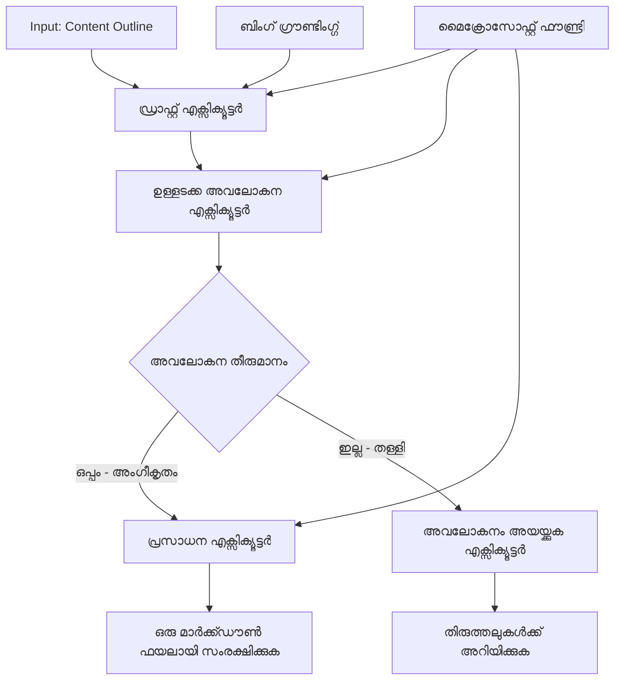

# 🔀 Microsoft Foundry (.NET) ഉപയോഗിച്ച് ശരത്കൃത ഏജന്റ് വർക്‌ഫ്ലോകൾ

## 📋 ബുദ്ധിമത്തയേറിയ തീരുമാനാധിഷ്ഠിത വർക്‌ഫ്ലോ ട്യൂട്ടോറിയൽ

ഈ നോട്ട്‌ബുക്ക് Microsoft Foundryയും Microsoft Agent Framework .NET-നും ഉപയോഗിച്ച് **ശരത്കൃത വർക്‌ഫ്ലോ മാതൃകകൾ** കാണിക്കുന്നു. AI വിശകലനം, ബിസിനസ് നിയമങ്ങൾ, ഡൈനാമിക് വ്യവസ്ഥകൾ എന്നിവയുടെ അടിസ്ഥാനത്തിൽ പ്രോസസിംഗ് ബുദ്ധിമുട്ടോടെയിന്ടർവന്യൂ ചെയ്യുകയും പ്രമുഖ ശ്രേണിയിലെ ഓട്ടോമേഷൻ സാധ്യമാക്കുകയും ചെയ്യുന്ന സങ്കീർണ്ണമായ തീരുമാനാത്മകവർക്‌ഫ്ലോകൾ സൃഷ്ടിക്കാൻ നിങ്ങൾ പഠിക്കും.

## 🎯 പഠന ലക്ഷ്യങ്ങൾ

### 🧠 **ബുദ്ധിമത്തയേറിയ തീരുമാന നിർമ്മിതി**
- **ശരത്കൃത ലജിക്ക് നടപ്പാക്കൽ**: പ്രതിഭാസങ്ങൾ ഉൾപ്പെടുന്ന ഏറെയ്യപ്പെട്ട ബ്രാഞ്ചിംഗ് പോയിന്റുകൾ ഉള്ള സമഗ്ര തീരുമാന വൃക്ഷങ്ങൾ സൃഷ്ടിക്കുക
- **AI ശക്തിയുള്ള റൂട്ടിംഗ്**: ബുദ്ധിമുട്ടിയായ റൂട്ടിംഗ് തീരുമാനങ്ങൾ എടുക്കാൻ Microsoft Foundry മോഡലുകൾ ഉപയോഗിക്കുക
- **ഡൈനാമിക് വർക്‌ഫ്ലോ അനുസരണം**: റൺടൈം വിശകലനവും വ്യവസ്ഥകളും അടിസ്ഥാനമാക്കി വർക്‌ഫ്ലോ പ്രവൃത്തികൾ മാറ്റുക
- **എന്റർപ്രൈസ് നിയമങ്ങളുടെ സംയോജന**: ബിസിനസ് ലജിക്ക്, നിയമാനുസരണം എന്നിവ വർക്‌ഫ്ലോകളിലേക്കു സംയോജിപ്പിക്കുക

### 🔀 **അരീതിയിലുള്ള ശരത്കൃത മാതൃകകൾ**
- **ബഹുവ്യക്തിമാനം അടിസ്ഥാനമാക്കിയുള്ള തീരുമാനമെടുക്കൽ**: റൂട്ടിംഗ് തീരുമാനങ്ങൾക്ക് എങ്ങനെ പല ഘടകങ്ങളും വിലയിരുത്താം
- **സന്ദർഭമനുസരിച്ചുള്ള പ്രോസസിംഗ്**: സമാഹരിച്ച വർക്‌ഫ്ലോ സന്ദർഭവും ചരിത്രവും അടിസ്ഥാനമാക്കി തീരുമാനമെടുക്കുക
- **അനുസരണ വർക്‌ഫ്ലോ മാറ്റം**: യഥാർത്ഥ സമയ വ്യവസ്ഥകൾ അടിസ്ഥാനമാക്കി പ്രോസസിംഗ് പാതകൾ ഡൈനാമിക്കായി ക്രമീകരിക്കുക
- **നിയമ എഞ്ചിൻ സംയോജനം**: നിർവഹണ പ്രവർത്തികളിൽ ബിസിനസ് നിയമ എഞ്ചിനുകൾ നടപ്പാക്കുക

### 🏢 **എന്റർപ്രൈസ് ശരത്കൃത അപ്ലിക്കേഷനുകൾ**
- **ഡോക്യുമെന്റ് വർഗ്ഗീകരണം-റൂട്ടിംഗ്**: സ്വയം ഡോക്യുമെന്റുകൾ വർഗ്ഗീകരിക്കുകയും അനുയോജ്യമായ വർക്‌ഫ്ലോകളിലേക്ക് റൂട്ടുചെയ്യുകയും ചെയ്യുക
- **കസ്റ്റമർ സർവീസ് ട്രീയാജ്**: വിദഗ്ധ പരിഹാര ടീമുകളിലേക്ക് ബുദ്ധിമുട്ടുള്ള കസ്റ്റമർ ചോദ്യങ്ങൾക്കും റൂട്ടിംഗ് നടത്തുക
- **നിയമാനുസരണം & റിസ്ക് പ്രോസസിംഗ്**: റിസ്ക് മೌಲ്യനിർണയം അടിസ്ഥാനമാക്കി വ്യത്യസ്ത പരിശോധനയും അവലോകനവും നടപ്പിലാക്കുക
- **ഗുണനിലവാര ഉറപ്പ് വർക്‌ഫ്ലോകൾ**: ഗുണനിലവാര സൂചകങ്ങളെ അടിസ്ഥാനമാക്കി ഉള്ളടക്കം സరిహദ്ദാക്കിയ അവലോകന പ്രക്രിയകളിലൂടെ റൂട്ടുചെയ്യുക

## ⚙️ മുൻ‌തിരിച്ചലുകളും സജ്ജീകരണവും

### 📦 **അവശ്യപ്പെട്ട NuGet പാക്കേജുകൾ**

ശരത്കൃത വർക്‌ഫ്ലോ പ്രോസസിംഗിനായി പ്രഗത്ഭമായ പാക്കേജുകൾ:

```xml
<!-- Core AI Framework -->
<PackageReference Include="Microsoft.Extensions.AI" Version="9.9.0" />

<!-- Azure AI Agents with Persistent State -->
<PackageReference Include="Azure.AI.Agents.Persistent" Version="1.2.0-beta.5" />

<!-- Azure Identity and Utilities -->
<PackageReference Include="Azure.Identity" Version="1.15.0" />
<PackageReference Include="System.Linq.Async" Version="6.0.3" />
<PackageReference Include="DotNetEnv" Version="3.1.1" />

<!-- Local Workflow Framework References -->
<!-- Microsoft.Agents.Workflows.dll - Advanced workflow orchestration -->
<!-- Microsoft.Agents.AI.AzureAI.dll - Microsoft Foundry integration -->
<!-- Microsoft.Agents.AI.dll - Core agent abstractions -->
```

### 🔑 **Microsoft Foundry കോൺഫിഗറേഷൻ**

**ആവശ്യമായ Azure വിഭവങ്ങൾ:**
- ശരത്കൃത പ്രോസസിംഗ് മോഡലുകളുള്ള Microsoft Foundry വർക്‌സ്പേസ്
- അനുയോജ്യമായ കംപ്യൂട്ട് ഒട്ടുക്കുകളും അനുമതികളും ഉള്ള Azure സബ്‌സ്‌ക്രിപ്ഷൻ
- തീരുമാനമെടുക്കാനും ഉള്ളടക്കം വിശകലനം ചെയ്യാനുമുള്ളिग നടപ്പിലാക്കിയ AI മോഡലുകൾ
- (ഐച്ഛികം) Bing Search API കണക്ഷൻ ഗ്രൗണ്ടിംഗിനായി

**പരിസ്ഥിതി കോൺഫിഗറേഷൻ (.env ഫയൽ):**
```env
# Microsoft Foundry Configuration
AZURE_AI_PROJECT_ENDPOINT=https://your-project.cognitiveservices.azure.com/
BING_CONNECTION_ID=your-bing-connection-id
```

**അധികാരമാനങ്ങൾ സജ്ജീകരിക്കൽ:**
```csharp
// Azure CLI or Managed Identity authentication
using Azure.Identity;
var credential = new AzureCliCredential();

// Load environment configuration
DotNetEnv.Env.Load("../../../.env");
```

### 🏗️ **ശരത്കൃത വർക്‌ഫ്ലോ നിർമ്മിതി**



**പ്രധാന ഘടകങ്ങൾ:**
- **ഡ്രാഫ്റ്റ് എക്സിക്യൂട്ടർ**: ഔട്ട്‌ലൈൻ അടിസ്ഥാനത്തിൽ പ്രാഥമിക ഉള്ളടക്കം ഡ്രാഫ്റ്റുകൾ സൃഷ്ടിക്കുന്ന AI ഏജന്റ്
- **ഉള്ളടക്കം അവലോകന എക്സിക്യൂട്ടർ**: ഡ്രാഫ്റ്റിന്റെ ഗുണനിലവാരവും നിയമാനുസരണവും വിലയിരുത്തുന്ന AI ഏജന്റ്
- **ശരത്കൃത റൂട്ടിംഗ്**: അവലോകന ഫലങ്ങളുടെ അടിസ്ഥാനത്തിൽ റൂട്ടിംഗ് തീരുമാനിക്കുന്ന ലജിക്ക്
- **പ്രസിദ്ധീകരണ/അവലോകന പാതകൾ**: അംഗീകരിക്കപ്പെട്ട ഉള്ളടക്കത്തിനും നിരസിച്ച ഉള്ളടക്കത്തിനും പ്രത്യേകം പ്രക്രിയ പാതകൾ
- **സ്റ്റേറ്റ് മാനേജ്മെന്റ്**: മുഴുവൻ വർക്‌ഫ്ലോയിലെ ഉള്ളടക്കവും അവലോകന സന്ദർഭവും നിലനിർത്തുന്നു

## 🎨 **ശരത്കൃത വർക്‌ഫ്ലോ ഡിസൈൻ മാതൃകകൾ**

### 📋 **ഗുണനിലവാര നിരപ്പുകൾ ഉൾപ്പെട്ട ഉള്ളടക്ക ഉത്പാദനം**
```
Outline → Draft Creation → Quality Review → {Approve: Publish | Reject: Revise}
```

### 🎯 **റിസ്ക് അധിഷ്ഠിത ഡോക്യുമെന്റ് പ്രോസസിംഗ്**
```
Document → Risk Assessment → {Low: Standard | High: Enhanced Review}
```

### 🔍 **ബുദ്ധിമുട്ടുള്ള കസ്റ്റമർ സർവീസ് റൂട്ടിംഗ്**
```
Customer Query → Analysis → {Simple: FAQ Bot | Complex: Human Agent}
```

### 💼 **നിയമാനുസരണം-നിർഭര വർക്‌ഫ്ലോകൾ**
```
Content → Compliance Check → {Pass: Publish | Fail: Legal Review}
```

## 🏢 **എന്റർപ്രൈസ് ശരത്കൃത പ്രയോജനങ്ങൾ**

### 🎯 **ബുദ്ധിമത്തയേറിയ ഓട്ടോമേഷൻ**
- **സ്മാർട്ട് തീരുമാനമെടുക്കൽ**: ഉള്ളടക്ക വിശകലനവും സന്ദർഭവും അടിസ്ഥാനമാക്കിയുള്ള AI-സഹായിത റൂട്ടിംഗ് നടപടികൾ
- **അനുസരിച്ച് പ്രോസസിംഗ്**: മാറുന്ന വ്യവസ്ഥകൾ അനുസരിച്ച് സ്വതോർത്തമാറ്റമുള്ള വർക്‌ഫ്ലോകൾ
- **ബിസിനസ്സ് നിയമം നടപ്പിലാക്കൽ**: സങ്കീർണ്ണമായ ബിസിനസ് നിയമങ്ങളും നയങ്ങളും സ്വതേ പ്രയോഗം ചെയ്യുന്നു
- **സന്ദർഭ-ജ്ഞായി റൂട്ടിംഗ്**: മുഴുവൻ വർക്‌ഫ്ലോ ചരിത്രവും സമാഹരിച്ച സന്ദർഭവും അടിസ്ഥാനമാക്കിയുള്ള തീരുമാനങ്ങൾ

### 📈 **ഓപ്പറേഷണൽ നിർവ്വഹണത്തില്‍ മികവ്**
- **മികച്ച വിഭവ വിനിമയം**: ഏറ്റവും അനുയോജ്യമായ വിദഗ്ധരിലേക്കും പ്രക്രിയകളിലേക്കും ജോലി റൂട്ടുചെയ്യുക
- **കയ്യൊപ്പ് കുറവ്**: സ്വയം പ്രവർത്തിക്കുന്ന തീരുമാനമെടുക്കൽ മനുഷ്യ റൂട്ടിംഗിന്റെ ആവശ്യം കുറയ്ക്കുന്നു
- **വേഗത്തിൽ പരിഹാര സമയങ്ങൾ**: അനുയോജ്യമായ വിദഗ്ധതകളിലേക്കും പ്രോസസിംഗ് കഴിവുകളിലേക്കും നേരിട്ട് റൂട്ടിംഗ്
- **സ്ഥിരമായ പ്രയോഗം**: ബിസിനസ്സ് നിയമങ്ങളും തീരുമാന മാനദണ്ഡങ്ങളും ഏകസന്ദർഭത്തിൽ പ്രയോഗം ചെയ്യുന്നു

### 🛡️ **റിസ്ക് മാനേജ്മെന്റ് & നിയമാനുസരണം**
- **സ്വയം പ്രവർത്തിക്കുന്ന റിസ്ക് വിലയിരുത്തൽ**: ഉള്ളടക്കത്തിന്റെയും സാഹചര്യത്തിന്റെയും റിസ്ക് നിലകൾ AI-ഉപയോഗിച്ച് വിലയിരുത്തൽ
- **നിയമാനുസരണം നടപ്പിലാക്കൽ**: ആവശ്യമായ ആംശ സംവരണങ്ങളിലൂടെയുള്ള സ്വയം പ്രവർത്തിക്കുന്ന റൂട്ടിംഗ്
- **സുരക്ഷാ പ്രോട്ടോകോൾ പ്രയോഗം**: റിസ്ക് വിലയിരുത്തൽ അടിസ്ഥാനത്തിൽ മെച്ചപ്പെട്ട സുരക്ഷാ നടപടികൾ
- **ഓഡിറ്റ് ട്രെയിൽ പരിപാലനം**: റൂട്ടിംഗ് തീരുമാനങ്ങളും അടിസ്ഥാനവുമുള്ള സമഗ്ര രേഖകളുടെ പരിരക്ഷ

### 📊 **വിശകലനവും തുടർച്ചയായ മെച്ചപ്പെടുത്തലും**
- **തീരുമാന വിശകലനം**: റൂട്ടിംഗ് നിർണയങ്ങളുടെ പ്രഭാവവും കൃത്യതയും പിന്തുടരുക
- **മാപ്പ് തിരിച്ചറിവ്**: റൂട്ടിംഗിലെ പ്രവണതകളും മാതൃകകളും തിരിച്ചറിവ്
- **പ്രകടന പരിമിതപ്പെടുത്തൽ**: തീരുമാന മാനദണ്ഡങ്ങളുടെയും റൂട്ടിംഗ് കാര്യക്ഷമതയുടെയും തുടർച്ചയായ മെച്ചപ്പെടുത്തൽ
- **ബിസിനസ് ബുദ്ധിമുട്ടുകൾ**: ഉള്ളടക്ക സവിശേഷതകൾക്കും പ്രോസസിംഗ് ആവശ്യങ്ങൾക്കും洞察ങ്ങൾ

### 🔧 **സാങ്കേതിക മികവ്**
- **സ്ഥിരമായ സ്റ്റേറ്റ് മാനേജ്മെന്റ്**: വർക്‌ഫ്ലോ നടപ്പാക്കലിൽ ജടിലമായ നില നിലനിർത്തുക
- **സ്കെയിലബിൾ ആർകിടെക്ചർ**: ഉയർന്ന വാല്യൂം ശരത്കൃത പ്രോസസിംഗ് ആവശ്യങ്ങൾ കൈകാര്യം ചെയ്യുക
- **ഇന്റഗ്രേഷൻ ശേഷികൾ**: നിലവിലുള്ള ബിസിനസ്സ് സിസ്റ്റങ്ങളും പ്രക്രിയകളും കൂടെ സുഖകരമായി കൂട്ടിച്ചേർക്കുക
- **മോണിറ്ററിംഗും കാണാനാകും വിധവും**: വർക്‌ഫ്ലോ പ്രകടനവും തീരുമാനങ്ങളും സമഗ്രമായി പിന്തുടരുക

.NET ഉപയോഗിച്ച് ബുദ്ധിമത്തയേറിയ, തീരുമാന-ചാലിത എന്റർപ്രൈസ് വർക്‌ഫ്ലോകൾ നിർമ്മിക്കാം! 🚀

## 💻 കോഡ് റൺ ചെയ്യൽ

`04.dotnet-agent-framework-workflow-aifoundry-condition.cs` എന്ന ഈ സംഗ്രഹം **ഗുണനിലവാര നിരപ്പുകളുള്ള ഉള്ളടക്ക നിർമ്മാണ വർക്‌ഫ്ലോ** കാണിക്കുന്നു:

### 🏗️ **വർക്‌ഫ്ലോ ആർകിടെക്ചർ**

```
Content Outline → Draft Creation → Quality Review → Conditional Routing:
                                                      ├─ Approved (>200 words) → Publish
                                                      └─ Rejected (<200 words) → Review Notification
```

**വർക്‌ഫ്ലോയിലെ ഏജന്റുകൾ:**
1. **ഇവാൻജലിസ്റ്റ് ഏജന്റ്**: Bing ഗ്രൗണ്ടിംഗിനൊപ്പം ഔട്ട്‌ലൈൻനിന്നും ട്യൂട്ടോറിയൽ ഡ്രാഫ്റ്റുകൾ സൃഷ്ടിക്കുന്നു
2. **ഉള്ളടക്കം അവലോകന ഏജന്റ്**: ഡ്രാഫ്റ്റ് ഗുണനിലവാരം (വാക്കുകളുടെ എണ്ണം, പൂർണത) മൂല്യനിര്‍ണയം ചെയ്യുന്നു
3. **പബ്ലിഷർ ഏജന്റ്**: അംഗീകൃത ഉള്ളടക്കം ടൈംസ്റ്റാമ്ബുചെയ്ത Markdown ഫയലുകളായി സേവ് ചെയ്യുന്നു

**ചരിത്രകൃത്യ എക്സിക്യൂട്ടറുകൾ:**
1. **DraftExecutor**: ഡ്രാഫ്റ്റ് സൃഷ്ടിക്കൽ പരിപാടികൾ ക്രമീകരിക്കുന്നു
2. **ContentReviewExecutor**: ഗുണനിലവാര പരിശോധന നടത്തുന്നു
3. **PublishExecutor**: അംഗീകൃത ഉള്ളടക്ക പ്രക്ഷേപണം കൈകാര്യം ചെയ്യുന്നു
4. **SendReviewExecutor**: നിരസിച്ച ഉള്ളടക്ക അഭ്യർത്ഥനകൾ കൈകാര്യം ചെയ്യുന്നു

### 🚀 ഉദാഹരണം റൺ ചെയ്യൽ

**ചേരുവകൾ:**
- Microsoft Foundry വർക്‌സ്പേസ് കോൺഫിഗർ ചെയ്തത്
- Azure CLI അധികാരമാനങ്ങൾ (`az login`)
- (ഐച്ഛികം) Bing Search കണക്ഷൻ ഗ്രൗണ്ടിംഗിനായി

```bash
# സ്ക്രിപ്റ്റ് നടപ്പാക്കാവുന്ന വണ്ണം മാറ്റുക (Unix/Linux/macOS)
chmod +x 04.dotnet-agent-framework-workflow-aifoundry-condition.cs

# നിർദ്ദിഷ്ട പ്രവർത്തി പ്രവാഹം നടത്തുക
./04.dotnet-agent-framework-workflow-aifoundry-condition.cs
```

വിൻഡോസിൽ:
```powershell
dotnet run 04.dotnet-agent-framework-workflow-aifoundry-condition.cs
```

### 📝 പ്രതീക്ഷിക്കാവുന്ന ഫലം

വർക്‌ഫ്ലോ ചെയ്യും:
1. **ഏജന്റുകൾ സൃഷ്ടിക്കുക**: പ്രത്യേകമായ മൂന്ന് Microsoft Foundry ഏജന്റുകൾ ആരംഭിക്കുക
2. **ഡ്രാഫ്റ്റ് നിർമ്മിക്കുക**: ഇവാൻജലിസ്റ്റ് ഏജന്റ് ഔട്ട്‌ലൈൻനിന്നു ട്യൂട്ടോറിയൽ ഡ്രാഫ്റ്റ് സൃഷ്ടിക്കുന്നു
3. **ഉള്ളടക്കം അവലോകനം**: ഉള്ളടക്കം അവലോകന ഏജന്റ് ഡ്രാഫ്റ്റിന്റെ ഗുണനിലവാരം വിലയിരുത്തുന്നു
4. **ശരത്കൃത റൂട്ടിംഗ്**:
   - **അംഗീകരിക്കപ്പെട്ടാൽ (>200 വാക്കുകൾ)**: പ്രസിദ്ധീകരണ എക്സിക്യൂട്ടർ Markdown ഫയലായി സംരക്ഷിക്കുന്നു
   - **നിരസിച്ചാൽ (<200 വാക്കുകൾ)**: അവലോകന വിവരം അയയ്ക്കുന്നു
5. **ഫലങ്ങൾ പ്രദർശിപ്പിക്കുക**: അന്തിമ വർക്‌ഫ്ലോ ഫലം കാണിക്കുക

### 🔧 ഇഷ്ടാനുസരണം ക്രമീകരണങ്ങൾ

**അവലോകന മാനദണ്ഡങ്ങൾ മാറ്റുക:**
```csharp
const string ContentReviewerInstructions = @"
You are a content reviewer...
1. Check if content is more than 500 words (instead of 200)
2. Verify technical accuracy
3. Ensure proper formatting
...";
```

**കൂടുതൽ ശരത്കൃത പാതകൾ ചേർക്കുക:**
```csharp
var workflow = new WorkflowBuilder(draftExecutor)
    .AddEdge(draftExecutor, contentReviewerExecutor)
    .AddEdge(contentReviewerExecutor, publishExecutor, condition: GetCondition("Excellent"))
    .AddEdge(contentReviewerExecutor, editExecutor, condition: GetCondition("Good"))
    .AddEdge(contentReviewerExecutor, sendReviewerExecutor, condition: GetCondition("Poor"))
    .Build();
```

**ഉള്ളടക്കം ആവശ്യകതകൾ മാറ്റുക:**
```csharp
string OUTLINE_Content = @"
# Your Custom Topic
## Section 1
https://your-reference-url
## Section 2
...
";
```

### 🎯 യഥാർത്ഥ ലോക പ്രയോഗങ്ങൾ

ഈ ശരത്കൃത വർക്‌ഫ്ലോ മാതൃകയ്ക്ക് അനുയോജ്യം:
- **ഉള്ളടക്കം മാനേജ്മെന്റ് സിസ്റ്റങ്ങൾ**: ഗുണനിലവാര നിരപ്പുകൾ ഉള്ള സ്വയം പ്രവർത്തിക്കുന്ന എഡിറ്റോറിയൽ വർക്‌ഫ്ലോകൾ
- **ഡോക്യുമെന്റ് പ്രോസസിംഗ്**: വർഗ്ഗീകരണവും നിയമാനുസരണവും അടിസ്ഥാനമാക്കി ഡോക്യുമെന്റുകൾ റൂട്ടുചെയ്യുക
- **കസ്റ്റമർ പിന്തുണ**: സങ്കീർണ്ണതയും അടിയന്തരതയും അടിസ്ഥാനമാക്കി ബുദ്ധിമുട്ടുള്ള ടിക്കറ്റ് റൂട്ടിംഗ്
- **നിയമപരിശോധന**: റിസ്ക് വിലയിരുത്തലും മൂല്യനിർണ്ണയവും അടിസ്ഥാനമാക്കി കരാറുകൾ റൂട്ടുചെയ്യുക
- **HR പ്രക്രിയകൾ**: അപേക്ഷകൾ അനുയോജ്യമായ സ്ക്രീനിംഗ് workflows മുഖേന റൂട്ടുചെയ്യുക

### 🔍 ശരത്കൃത ലജിക്ക് മനസ്സിലാക്കൽ

**കണ്ടീഷൻ ഫംഗ്ഷൻ:**
```csharp
public Func<object?, bool> GetCondition(string expectedResult) =>
    reviewResult => reviewResult is ReviewResult review && review.Result == expectedResult;
```

ഈ ഫംഗ്ഷൻ ഒരു പ്രെഡിക്കേറ്റ് സൃഷ്ടിക്കുന്നു, ഇത്:
1. ഫലത്തിന്റെ ടൈപ്പ് `ReviewResult` ആണോ എന്ന് പരിശോധിക്കുന്നു
2. ഫലത്തിന്റെ `Result` പ്രോപ്പർട്ടിയെ പ്രതീക്ഷിച്ച മൂല്യവുമായി താരതമ്യം ചെയ്യുന്നു
3. റൂട്ടിംഗ് തീരുമാനിക്കാൻ true/false നൽകുന്നു

**സാഹചര്യങ്ങളോടെ Workflow എഡ്ഗുകൾ:**
```csharp
.AddEdge(contentReviewerExecutor, publishExecutor, condition: GetCondition("Yes"))
.AddEdge(contentReviewerExecutor, sendReviewerExecutor, condition: GetCondition("No"))
```

### 📊 പ്രഗത്ഭ ഫീച്ചറുകൾ

**JSON സ്കീമ വാലിഡേഷൻ:**
ശരത്കൃത വർക്‌ഫ്ലോ ഘടനാപരമായ മറുപടികൾ ഉറപ്പാക്കാൻ JSON സ്കീമകൾ ഉപയോഗിക്കുന്നു:

```csharp
// Define response structure
public class ReviewResult
{
    [JsonPropertyName("review_result")]
    public string Result { get; set; } = string.Empty;
    
    [JsonPropertyName("reason")]
    public string Reason { get; set; } = string.Empty;
    
    [JsonPropertyName("draft_content")]
    public string DraftContent { get; set; } = string.Empty;
}

// Apply to agent
ResponseFormat = ChatResponseFormat.ForJsonSchema(
    AIJsonUtilities.CreateJsonSchema(typeof(ReviewResult)), 
    "ReviewResult", 
    "Review Result From DraftContent"
)
```

**Bing ഗ്രൗണ്ടിംഗ് സംയോജനം:**
ഇവാൻജലിസ്റ്റ് ഏജന്റ് Bing ഗ്രൗണ്ടിംഗ് ഉപയോഗിച്ച് യാഥാർത്ഥ്യ വിവരങ്ങൾ ആക്‌സസ് ചെയ്യുന്നു:

```csharp
var bingGroundingConfig = new BingGroundingSearchConfiguration(bing_conn_id);
BingGroundingToolDefinition bingGroundingTool = new(
    new BingGroundingSearchToolParameters([bingGroundingConfig])
);
```

ഇത് ഏജന്റിന് ഔട്ട്‌ലൈൻ URLs അനുസരിച്ച് സൈറ്റ് സന്ദർശിച്ച് ഇപ്പോഴത്തെ വിവരങ്ങൾ എടുത്തുപ്രായോഗിക്കാൻ സാധ്യമാക്കുന്നു.

### 🛡️ പിഴവുകളുടെ കൈകാര്യം

ശരത്കൃത വർക്‌ഫ്ലോ നിരസിച്ച ഉള്ളടക്കത്തിന് ശക്തമായ പിഴവു കൈകാര്യം ഉൾക്കൊള്ളുന്നു:
- അവലോകന പരാജയങ്ങൾ വ്യത്യസ്ത പാതയെ ഉന്മൂലമാക്കുന്നു
- അറിയിപ്പുകൾ വ്യക്തമായ നിരസിക്കൽ കാരണം നൽകിയിരിക്കുന്നു
- ഉള്ളടക്കം പുനഃപരിശോധനക്ക് സംരക്ഷിക്കപ്പെട്ടിരിക്കുന്നു

### 🔄 വർക്‌ഫ്ലോ വിപുലീകരിക്കൽ

**പുനഃപരിശോധന ലൂപ്പ് ചേർക്കുക:**
ഉള്ളടക്കം സ്വയം പുനഃരചിക്കുന്ന feedback ലൂപ്പ് സൃഷ്ടിക്കുക:

```csharp
.AddEdge(contentReviewerExecutor, publishExecutor, condition: GetCondition("Yes"))
.AddEdge(contentReviewerExecutor, draftExecutor, condition: GetCondition("No")) // Loop back
```

**ബഹുസ്തര അവലോകനം നടപ്പാക്കുക:**
വ്യത്യസ്ത മാനദണ്ഡങ്ങളോടെ പല അവലോകന ഘട്ടങ്ങളും ചേർക്കുക:

```csharp
.AddEdge(draftExecutor, technicalReviewer)
.AddEdge(technicalReviewer, editorialReviewer, condition: GetCondition("TechPass"))
.AddEdge(editorialReviewer, publishExecutor, condition: GetCondition("EditPass"))
```

ഈ ശരത്കൃത വർക്‌ഫ്ലോ മാതൃക ബുദ്ധിമത്തയേറിയ സമഗ്ര എന്റർപ്രൈസ് ഓട്ടോമേഷൻ സിസ്റ്റങ്ങൾ നിർമ്മിക്കുന്നതിനുള്ള അടിസ്ഥാനങ്ങൾ നൽകുന്നു! 🚀

---

<!-- CO-OP TRANSLATOR DISCLAIMER START -->
**അറിയിപ്പ്**:
ഈ രേഖ AI പരിഭാഷാ സേവനം [Co-op Translator](https://github.com/Azure/co-op-translator) ഉപയോഗിച്ച് പരിഭാഷപ്പെടുത്തിയതാണ്. ഞങ്ങൾ കൃത്യതയ്ക്കായി ശ്രമിക്കുന്നുവെങ്കിലും, ഓട്ടോമേറ്റഡ് പരിഭാഷകളിൽ പിഴവുകൾ അല്ലെങ്കിൽ തെറ്റായ വിവരങ്ങൾ ഉണ്ടാകാൻ സാധ്യതയുണ്ട്. അതിന്റെ സ്വാഭാവിക ഭാഷയിലുള്ള അസൽ രേഖയാണ് പ്രാമാണികമായ ഉറവിടമായി പരിഗണിക്കേണ്ടത്. നിർണായകമായ വിവരങ്ങൾക്ക്, പ്രൊഫഷണൽ മനുഷ്യ പരിഭാഷ ശുപാർശ ചെയ്യുന്നു. ഈ പരിഭാഷ ഉപയോഗിച്ച് ഉണ്ടാകുന്ന തെറ്റിദ്ധാരണകൾ അല്ലെങ്കിൽ തെറ്റായ വ്യാഖ്യാനങ്ങൾക്കായി ഞങ്ങൾ ഉത്തരവാദികളല്ല.
<!-- CO-OP TRANSLATOR DISCLAIMER END -->