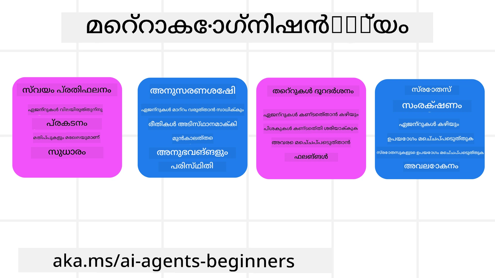
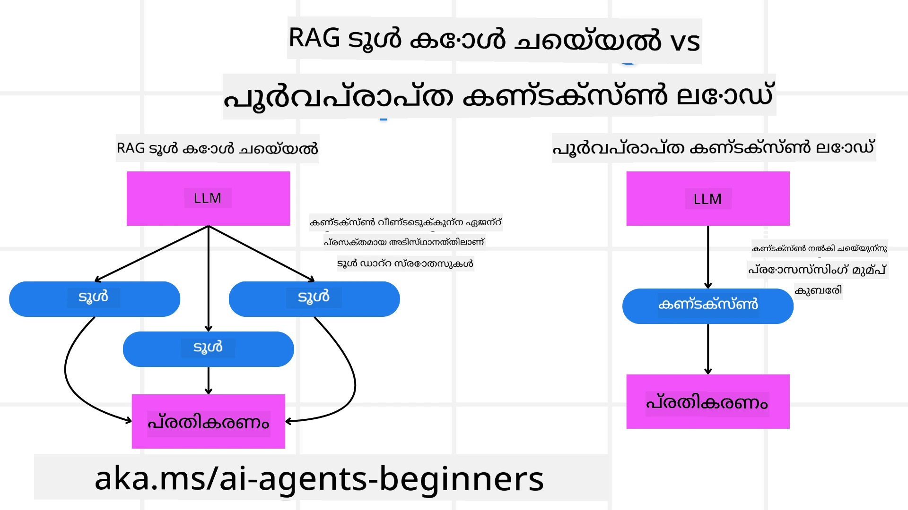

[](https://youtu.be/His9R6gw6Ec?si=3_RMb8VprNvdLRhX)

> _(ഈ പാഠത്തിന്റെ വീഡിയോ കാണാൻ മുകളിൽ ഉള്ള ചിത്രത്തിൽ ക്ലിക്ക് ചെയ്യുക)_
# AI ഏജന്റുകളിലെ മെറ്റാകോഗ്നിഷൻ

## ആമുഖം

AI ഏജന്റുകളിലെ മെറ്റാകോഗ്നിഷനുമായി ബന്ധപ്പെട്ട പാഠത്തിലേക്ക് സ്വാഗതം! സ്വന്തം ചിന്താ പ്രക്രിയകളെക്കുറിച്ച് ഏജന്റുകൾ എങ്ങനെ ചിന്തിക്കുമെന്നിൽ കൗതുകമുള്ള शुरुआtholikർക്കായാണ് ഈ അധ്യായം രൂപകല്പന ചെയ്തിരിക്കുന്നത്. ഈ പാഠം അവസാനം നിങ്ങൾ പ്രധാന ആശയങ്ങൾ മനസ്സിലാക്കി മെറ്റാകോഗ്നിഷൻ AI ഏജന്റ് രൂപകൽപ്പനയിൽ പ്രായോഗിക ഉദാഹരണങ്ങൾ പ്രയോഗിക്കാൻ സജ്ജരായിരിക്കും.

## പഠന ലക്ഷ്യങ്ങൾ

ഈ പാഠം പൂർത്തീകരിച്ചതിന് ശേഷം, നിങ്ങൾക്ക് കഴിയും:

1. ഏജന്റ് നിർവചനങ്ങളിൽ നിരീക്ഷണ ചക്രങ്ങളുടെ പ്രത്യാഘാതങ്ങൾ മനസ്സിലാക്കാൻ.
2. സ്വയംതിരുത്തുന്ന ഏജന്റുകൾക്ക് സഹായകരമായ പദ്ധതിയിടൽ və മൂല്യനിർണയ സാങ്കേതികവിദ്യകൾ ഉപയോഗിക്കാൻ.
3. ടാസ്ക്കുകൾ പൂർത്തിയാക്കാൻ കോഡ് കൈകാര്യം ചെയ്യാൻ സാധിക്കുന്ന നിങ്ങളുടെ സ്വന്തം ഏജന്റുകൾ സൃഷ്ടിക്കാൻ.

## മെറ്റാകോഗ്നിഷനിലേക്കുള്ള പരിചയം

മെറ്റാകോഗ്നിഷൻ എന്നത് ഒരാളുടെ സ്വന്തം ചിന്തയെക്കുറിച്ച് ചിന്തിക്കുന്ന ഉയർന്ന നിർവചനത്തിലുള്ള ബുദ്ധിപ്രക്രിയകളെയാണ് സൂചിപ്പിക്കുന്നത്. AI ഏജന്റുകൾക്കായി ഇത് സ്വയംബോധവും прошл അനുഭവങ്ങളുടെ അടിസ്ഥാനത്തിൽ അവരുടെ പ്രവർത്തനങ്ങൾ വിലമതിക്കുകയും ക്രമീകരിക്കുകയും ചെയ്യാൻ കഴിയുന്ന വസ്തുതയാണ്. "ചിന്തയെക്കുറിച്ച് ചിന്തിക്കുക" എന്നത് ഏജന്റിക് AI സിസ്റ്റങ്ങൾ വികസിപ്പിക്കുമ്പോൾ പ്രധാന ആശയമാണ്. ഇത് AI സിസ്റ്റങ്ങൾക്ക് അവരുടെ ഉള്ളിലുള്ള പ്രക്രിയകളെക്കുറിച്ച് ബോധവാനാകുകയും അവ അവലോകനം ചെയ്യുകയും നിയന്ത്രിക്കുകയും അവഗണിച്ചും അനുസരിച്ച് സ്വഭാവം അളക്കുകയും ചെയ്യുന്നുണ്ട്. നമ്മൾ ഒരു പ്രശ്നം നോക്കുമ്പോഴோ അല്ലെങ്കിൽ ഇരു സാഹചര്യങ്ങൾ വായിക്കുമ്പോൾ ചെയ്യുന്നതുപോലെ. ഈ സ്വയംബോധം AI സിസ്റ്റുകൾക്ക് മെച്ചപ്പെട്ട തീരുമാനങ്ങൾ എടുക്കാനും പിഴവുകൾ തിരിച്ചറിയാനും സമയക്രമത്തിൽ പ്രകടനം മെച്ചപ്പെടുത്താനും സഹായിക്കും — വീണ്ടും ടൂറിംഗ് ടെസ്റ്റ് ഉം AI takeover ന.about ചർച്ചയോട് ബന്ധപ്പെടുന്നു.

ഏജന്റ്-ആധാരമുള്ള AI സിസ്റ്റങ്ങളുടെ സാഹചര്യത്തിൽ, മെറ്റാകോഗ്നിഷൻ താഴെപ്പറയുന്ന ചില വെല്ലുവിളികളെ പൊതുവായി പരിഹരിക്കാൻ സഹായിക്കും:
- പരദർശിത്വം: AI സിസ്റ്റങ്ങൾ അവരുടെ നിർവചനങ്ങളും തീരുമാനങ്ങളും വിശദീകരിക്കാൻ കഴിയುವതി ഉറപ്പുവരുത്തൽ.
- നിരീക്ഷണം (Reasoning): വിവരങ്ങൾ സംയോജിപ്പിക്കുകയും ശബ്ദമായ തീരുമാനങ്ങൾ എടുക്കുകയും ചെയ്യാൻ AI സിസ്റ്റങ്ങളുടെ കഴിവ് മെച്ചപ്പെടുത്തൽ.
- അനുകൂലനം: പുതിയ പരിതസ്ഥിതികളിലും മാറിയ അവസ്ഥകളിലും AI സിസ്റ്റങ്ങൾ ക്രമീകരിക്കാൻ അനുവദിക്കുക.
- ഗ്രഹണം: പരിസ്ഥിതിയിൽ നിന്ന് ലഭിക്കുന്ന ഡാറ്റ തിരിച്ചറിയാനും വ്യാഖ്യാനം ചെയ്യാനുമുള്ള AI സിസ്റ്റങ്ങളുടെ കൃത്യത മെച്ചപ്പെടുത്തൽ.

### മെറ്റാകോഗ്നിഷൻ എന്താണ്?

മെറ്റാകോഗ്നിഷൻ, അല്ലെങ്കിൽ "ചിന്തയെക്കുറിച്ച് ചിന്തിക്കൽ," സ്വയംബോധവും സ്വയംനിയന്ത്രണവും ഉൾപ്പെടുത്തുന്ന ഉയർന്ന നിരക്കിലുള്ള ബുദ്ധിപ്രക്രിയയാണ്. AI മേഖലയിലുളളപ്പോൾ, മെറ്റാകോഗ്നിഷൻ ഏജന്റുകൾക്ക് അവരുടെ തന്ത്രങ്ങളും പ്രവർത്തനങ്ങളും വിലയിരുത്തി അവയെ അനുസരിച്ച് ക്രമീകരിക്കാൻ സാദ്ധ്യമാക്കി കൂടുതൽ മികച്ച പ്രശ്നപരിഹാരവും തീരുമാനമെടുക്കൽ ശേഷിയും നൽകുന്നു. മെറ്റാകോഗ്നിഷൻ മനസ്സിലാക്കിയാണ് നിങ്ങൾക്ക് കൂടുതൽ ബുദ്ധിശീലിയും പക്ഷേ കൂടി കൂടുതൽ അനുയോജ്യവും ഫലപ്രദവും ആയ AI ഏജന്റുകൾ രൂപകൽപ്പന ചെയ്യാൻ സാധിക്കുക. പരിപൂർണ്ണ മെറ്റാകോഗ്നിഷനിൽ, AI അതിന്റെ സ്വന്തമായ നിരീക്ഷണത്തെക്കുറിച്ച് വ്യക്തമായി വിധേയമായി തർക്കിക്കും.

ഉദാഹരണം: “ഞാൻ വിലക്കുറഞ്ഞ വിമാനങ്ങളെ മുൻഗണന ചെയ്തത് കാരണം… സൈധാന്തികമായി നേരിട്ട് പോകുന്ന ഫ്ലൈറ്റുകൾ നഷ്ടപ്പെടാമെന്ന തോന്നിയാണ്; ആകയാൽ ഞാൻ വീണ്ടും പരിശോധിക്കാമെന്ന് കാണിക്കുന്നു.”  
ഏതോ ഒരു മാർഗ്ഗം തിരഞ്ഞെടുക്കുന്നതിന് എങ്ങനെ/എന്തുകൊണ്ടെന്ന് ശ്രദ്ധയിൽ വെക്കുന്നത്.  
- കഴിഞ്ഞ തവണയിലുണ്ടായ ഉപയോക്തൃ മുന്‍ഗണനകളിൽ അതിവിശ്വസ്തത കാണിക്കാമെന്ന് കാരണം പിഴവുകൾ ഉണ്ടാകാമെന്ന് കുറിച്ച് ശ്രദ്ധിച്ച്, അവൾ അന്തിമ ശുപാർശ മാത്രം മാറ്റുന്നില്ലാതെ തന്നെ തീരുമാനം എടുക്കൽ തന്ത്രം മാറ്റുന്നു.  
- “ഉപയോക്താവ് ‘അതിശയകരമായി തിരക്കുള്ളത്’ എന്ന് പറഞ്ഞാൽ, ഞാൻ ചില ആകർഷണങ്ങൾ ഒഴിവാക്കുന്നത് മാത്രമല്ല, എന്നും പ്രശസ്തിപ്രകാരം റാങ്കുചെയ്യുന്ന എന്റെ ‘ശ്രേഷ്‌ഠ ആകർഷണങ്ങൾ തിരഞ്ഞെടുക്കൽ മാർഗ്ഗം’ തെറ്റാണ്” എന്ന പോലെയുള്ള മാതൃകകൾ സ്ഥിരീകരിക്കുന്നത്.

### AI ഏജന്റുകളിൽ മെറ്റാകോഗ്നിഷന്റെ പ്രാധാന്യം

മെറ്റാകോഗ്നിഷൻ AI ഏജന്റ് രൂപകൽപ്പനയിൽ നിരവധി കാരണങ്ങളാൽ നിർണ്ണായക പങ്ക് വഹിക്കുന്നു:



- സ്വയം-പ്രതിഫലനം: ഏജന്റുകൾ അവരുടെ സ്വന്തത്തെ പ്രവർത്തനം വിലയിരുത്തുകയും മെച്ചപ്പെടുത്തേണ്ട മേഖലകൾ കണ്ടെത്തുകയും ചെയ്യുന്നു.
- അനുകൂലത: ഏജന്റുകൾ കഴിഞ്ഞ അനുഭവങ്ങളും മാറുന്ന പരിതസ്ഥിതികളും അടിസ്ഥാനമാക്കി തന്ത്രങ്ങൾ മാറ്റാൻ കഴിയും.
- പിഴവ് പരിഹാരം: ഏജന്റുകൾ സ്വതന്ത്രമായി പിഴവുകൾ കണ്ടെത്തി തിരുത്താൻ കഴിയും, ഇതിലൂടെ കൂടുതൽ കൃത്യമായ ഫലങ്ങൾ കൈവരിക്കും.
- ഭദ്രതാ സ്രോതസ്സ് നയനം: സമയവും കണക്കേറിയ ശേഷിയും പോലുള്ള സ്രോതസ്സ് ഉപയോഗം പദ്ധതി ആലോചിച്ച് വിലയിരുത്തി ഒപ്റ്റിമൈസ് ചെയ്യുക.

## AI ഏജന്റിന്റെ ഘടകങ്ങൾ

മെറ്റാകോഗ്നിഷൻ പ്രക്രിയകളിലേക്ക് കടക്കുന്നതിന് മുൻപ്, AI ഏജന്റിന്റെ അടിസ്ഥാന ഘടകങ്ങൾ മനസ്സിലാക്കുന്നത് ആവശ്യമാണ്. ഒരു AI ഏജന്റ് സാധാരണയായി അടങ്ങിയിരിക്കുന്നു:

- Persona: ഉപയോക്താക്കളുമായി ഏജന്റ് അന്വേഷിക്കുന്ന രീതിയെ നിർവചിക്കുന്ന വ്യക്തിത്വവും ഗണ്യഗുണങ്ങളും.
- Tools: ഏജന്റ് നിർവഹിക്കാവുന്ന ശേഷികളും പ്രവർത്തനങ്ങളും.
- Skills: ഏജന്റിന് ഉള്ള അറിവും വിദഗ്ധതയും.

ഈ ഘടകങ്ങൾ ചേർന്ന് ഓരോ "വിദഗ്ധതാ യൂണിറ്റ്" സൃഷ്ടിക്കുന്നു, പ്രത്യേക ടാസ്ക്കുകൾ നിർവഹിക്കാൻ കഴിവുള്ളതാക്കുന്നു.

**ഉദാഹരണം**:  
വായനാവകാശമുള്ള ഒരു ട്രാവൽ ഏജന്റിനെ പരിഗണിക്കുക — നിങ്ങളുടെ അവധിക്കാല യാത്രാ പദ്ധതിയും യാഥാർത്ഥ്യ സമയ ഡാറ്റയും കഴിഞ്ഞ ഉപയോക്തൃ യാത്രാ അനുഭവങ്ങളും അടിസ്ഥാനമാക്കി തന്റെ വഴികൾ ക്രമീകരിക്കുന്ന സേവനമാണ് ഇത്.

### ഉദാഹരണം: ട്രാവൽ ഏജന്റ് സേവനത്തിൽ മെറ്റാകോഗ്നിഷൻ

നിങ്ങൾ AI-സ്വാധീനിതമായൊരു ട്രാവൽ ഏജന്റ് സേവനം രൂപകൽപ്പന ചെയ്യുകയാണെന്ന് കരുതുക. ഈ "ട്രാവൽ ഏജന്റ്" ഉപയോക്താക്കളെ അവരുടെ യാത്രകൾ പദ്ധതിയിടുന്നതിൽ സഹായിക്കുന്നു. മെറ്റാകോഗ്നിഷൻ ഉൾപ്പെടുത്തുന്നതിന്, ട്രാവൽ ഏജന്റിന് സ്വയംബോധത്തിനും കഴിഞ്ഞ അനുഭവങ്ങൾക്കും അടിസ്ഥാനപ്പെടുത്തി പ്രവർത്തനങ്ങൾ വിലയിരുത്തുകയും ക്രമീകരിക്കുകയും ചെയ്യേണ്ടതുണ്ട്. ഇങ്ങനെയാണ് മെറ്റാകോഗ്നിഷൻ പങ്കു വഹിക്കാവുന്നത്:

#### നിലവിലെ ടാസ്ക്

നിലവിലെ ടാസ്ക് ഒരു ഉപയോക്താവിനെ പാരീസിലേക്ക് ഒരു യാത്ര പദ്ധതി ചെയ്യുന്നതിനാണ് സഹായിക്കുക.

#### ടാസ്ക് പൂർത്തിയാക്കാൻ ചേരേണ്ട ഘടകങ്ങൾ

1. **ഉപയോക്തൃ മുൻഗണനകൾ ശേഖരിക്കുക**: ഉപയോക്താവിനോട് അവരുടെ യാത്രാ തീയതികൾ, ബഡ്ജറ്റ്, താല്പര്യങ്ങൾ (ഉദാ., മ്യൂസിയങ്ങൾ, ഭക്ഷണം, ഷോപ്പിംഗ്) എന്നിവയെയും പ്രത്യേക ആവശ്യങ്ങളേയും ചോദിക്കുക.
2. **വിവരം വീണ്ടെടുക്കുക**: ഉപയോക്തൃ മുൻഗണനകൾക്കനുസൃതമായ ഫ്ലൈറ്റ് ഓപ്ഷനുകൾ, താമസസ്ഥലങ്ങൾ, ആകർഷണങ്ങൾ, റെസ്റ്റോറന്റുകൾ എന്നിവ അന്വേഷിക്കുക.
3. **ശുപാർശകൾ സൃഷ്ടിക്കുക**: ഫ്ലൈറ്റ് വിശദാംശങ്ങൾ, ഹോട്ടൽ ബുക്കിംഗുകൾ, നിർദേശിച്ച പ്രവർത്തനങ്ങൾ എന്നിവ ഉൾപ്പെടുന്ന വ്യക്തിഗത ഐറ്റിനററി നൽകുക.
4. **പ്രതികരണത്തിന്റെ അടിസ്ഥാനത്തിൽ ക്രമോപദേശം**: ശുപാർശകളെക്കുറിച്ച് ഉപയോക്താവിന്റെ പ്രതികരണം തേടുകയും ആവശ്യമായ മാറ്റങ്ങൾ ചെയ്യുകയും ചെയ്യുക.

#### ആവശ്യമായ റിസോഴ്സുകൾ

- ഫ്ലൈറ്റ്, ഹോട്ടൽ ബുക്കിംഗ് ഡാറ്റാബേസുകളിലേക്ക് പ്രവേശനം.
- പാരീസിന്റെ ആകർഷണങ്ങൾക്കും റെസ്റ്റോറന്റുകൾക്കുമുള്ള വിവരങ്ങൾ.
- മുമ്പ്ലത്തെ ഇന്ററാക്ഷനുകളിൽ നിന്നുള്ള ഉപയോക്തൃ പ്രതികരണ ഡാറ്റ.

#### അനുഭവവും സ്വയം-പ്രതിഫലനവും

ട്രാവൽ ഏജന്റ് മെറ്റാകോഗ്നിഷൻ ഉപയോഗിച്ചു തന്റെ പ്രകടനം വിലയിരുത്തുകയും കഴിഞ്ഞ അനുഭവങ്ങളിൽ നിന്ന് പഠിക്കുകയും ചെയ്യുന്നു. ഉദാഹരണത്തിന്:

1. **ഉപയോക്തൃ പ്രതികരണ വിശകലനം**: ട്രാവൽ ഏജന്റ് ഉപയോക്തൃ പ്രതികരണം പരിശോധിച്ച് ഏത് ശുപാർശകൾ സ്വീകരിക്കപ്പെടുകയും ഏത് സ്വീകരിക്കപ്പെടാനില്ലാത്തതെന്നും മനസിലാക്കുന്നു. അതിനനുസരിച്ച് ഭാവിയിലെ നിർദ്ദേശങ്ങൾ ക്രമീകരിക്കുന്നു.
2. **അനുകൂലത**: ഉപയോക്താവ് മുമ്പ് തിരക്കുള്ള സ്ഥലങ്ങൾ ഇഷ്ടമില്ലെന്ന് പറഞ്ഞിട്ടുണ്ടെങ്കിൽ, ട്രാവൽ ഏജന്റ് ഭാവിയിൽ പ്രധാന ടുർസ്റ്റ് സ്പോട്ടുകൾ പീക്ക് മണിക്കൂറുകളിൽ ശുപാർശ ചെയ്യാതിരിക്കും.
3. **പിഴവ് തിരുത്തൽ**: ഒരു പുൽസാഹായിക ബുക്കിംഗിൽ സംഭവിച്ച പോലെ ഒരു പിഴവ് സംഭവിച്ചുനിൽക്കുന്നത് സ്ഥിരീകരിച്ചാൽ, ട്രാവൽ ഏജന്റ് ഭാവിയിൽ ശുപാർശകൾ നിർദേശിക്കുന്ന മുൻപ് ലഭ്യത കൂടുതൽ കൃത്യമായി പരിശോധിക്കാൻ പഠിക്കും.

#### ഡെവലപ്പർക്ക് പ്രായോഗിക ഉദാഹരണം

ട്രാവൽ ഏജന്റിന്റെ കോഡിൽ മെറ്റാകോഗ്നിഷൻ ഉൾപ്പെടുത്തുമ്പോൾ കാണാവുന്ന ലളിതമാക്കിയ ഒരു ഉദാഹരണം:

```python
class Travel_Agent:
    def __init__(self):
        self.user_preferences = {}
        self.experience_data = []

    def gather_preferences(self, preferences):
        self.user_preferences = preferences

    def retrieve_information(self):
        # മുൻഗണനകൾ അടിസ്ഥാനത്തിൽ വിമാനങ്ങൾ, ഹോട്ടലുകൾ, ആകർഷണങ്ങൾ തേടുക
        flights = search_flights(self.user_preferences)
        hotels = search_hotels(self.user_preferences)
        attractions = search_attractions(self.user_preferences)
        return flights, hotels, attractions

    def generate_recommendations(self):
        flights, hotels, attractions = self.retrieve_information()
        itinerary = create_itinerary(flights, hotels, attractions)
        return itinerary

    def adjust_based_on_feedback(self, feedback):
        self.experience_data.append(feedback)
        # ഫീഡ്ബാക്ക് വിശകലനം ചെയ്ത് ഭാവിയിലെ ശുപാർശകൾ ക്രമീകരിക്കുക
        self.user_preferences = adjust_preferences(self.user_preferences, feedback)

# ഉദാഹരണ ഉപയോഗം
travel_agent = Travel_Agent()
preferences = {
    "destination": "Paris",
    "dates": "2025-04-01 to 2025-04-10",
    "budget": "moderate",
    "interests": ["museums", "cuisine"]
}
travel_agent.gather_preferences(preferences)
itinerary = travel_agent.generate_recommendations()
print("Suggested Itinerary:", itinerary)
feedback = {"liked": ["Louvre Museum"], "disliked": ["Eiffel Tower (too crowded)"]}
travel_agent.adjust_based_on_feedback(feedback)
```

#### മെറ്റാകോഗ്നിഷൻ എന്തുകൊണ്ട് പ്രധാനമാണ്

- **സ്വയം-പ്രതിഫലനം**: ഏജന്റുകൾ അവരുടെ പ്രകടനം വിശകലനം ചെയ്ത് മെച്ചപ്പെടുത്തേണ്ട ഭാഗങ്ങൾ തിരിച്ചറിഞ്ഞ് ഉൾപ്പെടുത്തുന്നു.
- **അനുകൂലത**: പ്രതികരണങ്ങളും മാറുന്ന സാഹചര്യങ്ങളും അടിസ്ഥാനമാക്കി തന്ത്രങ്ങൾ മാറ്റാം.
- **പിഴവ് പരിഹാരം**: ഏജന്റുകൾ സ്വയം പിഴവുകൾ കണ്ടെത്തുകയും തിരുത്തുകയും ചെയ്യാം.
- **ഭദ്രതാ സ്രോതസ്സ് നയനം**: സമയവും കണക്കെടുപ്പ് ശേഷിയും പോലുള്ള റിസോഴ്സുകൾ മികച്ച രീതിയിൽ ഉപയോഗിക്കാൻ ഏജന്റുകൾക്ക് കഴിയുന്നു.

മെറ്റാകോഗ്നിഷൻ ഉൾപ്പെടുത്തുമ്പോൾ, ട്രാവൽ ഏജന്റ് കൂടുതൽ വ്യക്തിഗതവും കൃത്യവുമായ യാത്രാ ശുപാർശകൾ നൽകാൻ കഴിയും, ഇത് സമ്പൂർണ്ണ ഉപയോക്തൃ അനുഭവം മെച്ചപ്പെടുത്തും.

---

## 2. ഏജენტുകളിലുളള പദ്ധതി നിർമാണം

നേട്ടലക്ഷ്യത്തെ എത്തിക്കാൻ ആവശ്യമായ പടികളുടെയും നിലവിലുള്ള നിലയുടെയും, റിസോഴ്സുകളുടെയും, ممكن പ്രതിസന്ധികളുടെയും പരിഗണനയോടെയാണ് പദ്ധതി നിർമ്മാണം (Planning) ഒരു നിർണ്ണായക ഘടകം.

###_PLAN_ ഘടകങ്ങൾ

- **നിലവിലെ ടാസ്ക്**: ടാസ്ക് വ്യക്തമായി നിർവചിക്കുക.
- **ടാസ്ക് പൂർത്തിയാക്കാനുള്ള പടികൾ**: ടാസ്ക് കൈകാര്യം ചെയ്യാവുന്ന ചെറുഭാഗങ്ങളായി பிரിഭാജിക്കുക.
- **ആവശ്യമുള്ള റിസോഴ്സുകൾ**: ആവശ്യമായ സ്രോതസുകൾ തിരിച്ചറിയുക.
- **അനുഭവം**: പദ്ധതിയെ നിർണയിക്കാൻ പഴയ അനുഭവങ്ങൾ ഉപയോഗിക്കുക.

**ഉദാഹരണം**:  
ട്രാവൽ ഏജന്റ് ഉപയോക്താവിന്റെ യാത്രാ പദ്ധതിയിൽ സഹായിക്കാൻ എടുക്കേണ്ട പടികൾ ഇവിടെ ആണ്:

### ട്രാവൽ ഏജന്റിന് വേണ്ടുള്ള പടികൾ

1. **ഉപയോക്തൃ മുൻഗണനകൾ ശേഖരിക്കുക**
   - ഉപയോക്താവിന്റെ യാത്രാ തീയതികൾ, ബഡ്ജറ്റ്, താല്പര്യങ്ങൾ, ഏതെങ്കിലും പ്രത്യേകാവശ്യങ്ങൾ എന്നിവയെക്കുറിച്ച് ചോദിക്കുക.
   - ഉദാഹരണങ്ങൾ: "നിങ്ങൾ 언제 യാത്ര ചെയ്യാൻ പദ്ധതി ചെയ്യുന്നു?" "നിങ്ങളുടെ ബഡ്ജറ്റ് പരിധി എന്താണ്?" "നിങ്ങൾ അവധിക്കാലത്തിൽ എന്തെല്ലാം പ്രവർത്തനങ്ങൾ ഇഷ്ടപ്പെടുന്നു?"

2. **വിവരം ശേഖരിക്കുക**
   - ഉപയോക്തൃ മുൻഗണനകൾ അടിസ്ഥാനമാക്കി അനുയോജ്യമായ യാത്രാ കാര്യങ്ങൾ അന്വേഷിക്കുക.
   - **ഫ്ലൈറ്റുകൾ**: ഉപയോക്താവിന്റെ ബഡ്ജറ്റിലും ഇഷ്ടപ്പെടുന്ന യാത്രാ തീയതികളിലും ലഭ്യമായ ഫ്ലൈറ്റുകൾ നോക്കുക.
   - **താമസസ്ഥലങ്ങൾ**: സ്ഥലപരിധി, വില, സൌകര്യങ്ങൾ എന്നിവയ്ക്കനുസൃതമായ ഹോട്ടലുകൾ അല്ലെങ്കിൽ വാടക സ്ഥലങ്ങൾ കണ്ടെത്തുക.
   - **ആകർഷണങ്ങളും റെസ്റ്റോറന്റുകളും**: ഉപയോക്താവിന്റെ താല്പര്യങ്ങളുമായി പൊരുത്തമുള്ള പ്രശസ്ത ആകർഷണങ്ങൾ, പ്രവർത്തനങ്ങൾ, ഭക്ഷ്യസ്ഥലങ്ങൾ തിരിച്ചറියുക.

3. **ശുപാർശകൾ സൃഷ്ടിക്കുക**
   - ശേഖരിച്ച വിവരങ്ങൾ വ്യക്തിഗത ഐറ്റിനററിയായി സമാഹരിക്കുക.
   - ഫ്ലൈറ്റ് ഓപ്ഷനുകൾ, ഹോട്ടൽ ബുക്കിംഗുകൾ, നിർദ്ദേശിച്ച പ്രവർത്തനങ്ങൾ എന്നിവയുടെ വിശദാംശങ്ങൾ നൽകുക, ഉപയോക്തൃ മുൻഗണനകൾക്കനുസരിച്ച് ആ ശുപാർശകൾ അനുയോജ്യമാക്കുക.

4. **ഐറ്റിനറി ഉപയോക്താവിന് അവതരിപ്പിക്കുക**
   - നിർദേശിച്ച ഐറ്റിനറി ഉപയോക്താവിന് അവലോകനത്തിനായി പങ്കിടുക.
   - ഉദാഹരണം: "ഇപ്പോൾ നിങ്ങളെക്കേണ്ടി പാരീസിലേക്കായുള്ള അടങ്ങിയ ശുപാർശയായ ഇത്. ഇതിൽ ഫ്ലൈറ്റ് വിശദാംശങ്ങൾ, ഹോട്ടൽ ബുക്കിംഗുകൾ, ശുപാർശ ചെയ്ത പ്രവർത്തനങ്ങളും റെസ്റ്റോറന്റുകളും ഉൾപ്പെടുന്നു. നിങ്ങളുടെ അഭിപ്രായങ്ങൾ പറയൂ!"

5. **പ്രതികരണം ശേഖരിക്കുക**
   - നിർദേശിച്ച ഐറ്റിനറി குறித்து ഉപയോക്താവിന്റെ പ്രതികരണം ചോദിക്കുക.
   - ഉദാഹരണങ്ങൾ: "നിങ്ങൾക്ക് ഫ്ലൈറ്റ് ഓപ്ഷനുകൾ ഇഷ്ടമാണോ?" "ഹോട്ടൽ നിങ്ങളുടെ ആവശ്യങ്ങൾക്കും അനുയോജ്യമാണോ?" "കൂടാതെ കൂട്ടിച്ചേർക്കാൻ അല്ലെങ്കിൽ ഒഴിവാക്കാൻ നിങ്ങൾക്കുണ്ടോ?"

6. **പ്രതികരണത്തിന്റെ അടിസ്ഥാനത്തിൽ ക്രമീകരിക്കുക**
   - ഉപയോക്തൃ പ്രതികരണത്തിന് അനുസരിച്ച് ഐറ്റിനറി ക്രമീകരിക്കുക.
   - ഉപയോക്തൃദृष्टിക്ക് കൂടുതൽ അനുയോജ്യമായി ഫ്ലൈറ്റ്, താമസം, പ്രവർത്തന ശുപാർശകൾ ആവശ്യമായി മാറ്റുക.

7. **അവസാന സ്ഥിരീകരണം**
   - അപ്‌ഡേറ്റുചെയ്‌ത ഐറ്റിനറി ഉപയോക്താവിന് അവസാന സ്ഥിരീകരണത്തിന് അവതരിപ്പിക്കുക.
   - ഉദാഹരണം: "ഞാൻ നിങ്ങളുടെ അഭിപ്രായങ്ങളുടെ അടിസ്ഥാനത്തിൽ മാറ്റങ്ങൾ ചെയ്തു. ഇതാണ് അപ്‌ഡേറ്റുചെയ്‌ത ഐറ്റിനറി. എല്ലാം ശരിയായിട്ടുണ്ടോ?"

8. **ബുക്ക് ചെയ്യുക һәм സ്ഥിരീകരണം നൽകുക**
   - ഉപയോക്താവ് ഐറ്റിനറി അംഗീകരിക്കുന്നപ്പോൾ, ഫ്ലൈറ്റ്, താമസം, മുൻകൂട്ടി പദ്ധതിയിടപ്പെട്ട ഏതെങ്കിലും പ്രവർത്തനങ്ങൾ എന്നിവ ബുക്ക് ചെയ്യുക.
   - സ്ഥിരീകരണ വിശദാംശങ്ങൾ ഉപയോക്താവിന് അയയ്ക്കുക.

9. **ശേഷവും പിന്തുണ നൽകുക**
   - യാത്രയ്ക്കും മുമ്പും യാത്രക്കിടെ സംഭവിച്ച മാറ്റങ്ങൾ അല്ലെങ്കിൽ അധിക അഭ്യർത്ഥനകൾക്കുമായി സഹായിക്കാൻ tilgjengelig ആയിരിക്കുക.
   - ഉദാഹരണം: "ഞാൻ നിങ്ങൾക്ക് യാത്രക്കാലത്ത് ഏതെങ്കിലും സഹായം വേണമെങ്കിൽ എപ്പോഴെങ്കിലും എനിക്ക് സമീപിക്കാം!"

### ഉദാഹരണ ഇന്ററാക്ഷൻ

```python
class Travel_Agent:
    def __init__(self):
        self.user_preferences = {}
        self.experience_data = []

    def gather_preferences(self, preferences):
        self.user_preferences = preferences

    def retrieve_information(self):
        flights = search_flights(self.user_preferences)
        hotels = search_hotels(self.user_preferences)
        attractions = search_attractions(self.user_preferences)
        return flights, hotels, attractions

    def generate_recommendations(self):
        flights, hotels, attractions = self.retrieve_information()
        itinerary = create_itinerary(flights, hotels, attractions)
        return itinerary

    def adjust_based_on_feedback(self, feedback):
        self.experience_data.append(feedback)
        self.user_preferences = adjust_preferences(self.user_preferences, feedback)

# ബൂയിംഗ് അഭ്യർത്ഥനയിൽ ഉള്ള ഉദാഹരണ ഉപയോഗം
travel_agent = Travel_Agent()
preferences = {
    "destination": "Paris",
    "dates": "2025-04-01 to 2025-04-10",
    "budget": "moderate",
    "interests": ["museums", "cuisine"]
}
travel_agent.gather_preferences(preferences)
itinerary = travel_agent.generate_recommendations()
print("Suggested Itinerary:", itinerary)
feedback = {"liked": ["Louvre Museum"], "disliked": ["Eiffel Tower (too crowded)"]}
travel_agent.adjust_based_on_feedback(feedback)
```

## 3. കരകയറി RAG സിസ്റ്റം (Corrective RAG System)

ആദ്യം RAG Tool എന്നതും Pre-emptive Context Load എന്നതും തമ്മിലുള്ള വ്യത്യാസം മനസ്സിലാക്കാം



### Retrieval-Augmented Generation (RAG)

റീറ്റ്രീവൽ-ഓഗ്മെന്റഡ് ജനറേഷൻ (RAG) ഒരു റീറ്റ്രീവൽ സിസ്റ്റവും ജനറേറ്റീവ് മോഡലും സംയോജിപ്പിക്കുന്നു. ഒരു ചോദ്യം വന്നപ്പോൾ, റീറ്റ്രീവൽ സിസ്റ്റം പുറംമൂലത്തിൽ നിന്നുള്ള ബന്ധപ്പെട്ട രേഖകൾ അല്ലെങ്കിൽ ഡാറ്റ വീണ്ടെടുക്കുന്നു, ആ വീണ്ടെടുത്ത വിവരങ്ങൾ ജനറേറ്റീവ് മോഡലിന്റെ ഇൻപുട്ടിനെ ആഗ്മെന്റ് ചെയ്യാൻ ഉപയോഗിക്കുന്നു. ഇതു മോഡലിന് കൂടുതൽ കൃത്യവും സാഹചര്യപ്രധാനവുമായ പ്രതികരണങ്ങൾ സൃഷ്ടിക്കാൻ സഹായിക്കുന്നു.

ഒരു RAG സിസ്റ്റത്തിൽ, ഏജന്റ് ഒരു നോളജ് ബേസിൽ നിന്നുള്ള ബന്ധപ്പെട്ട വിവരങ്ങൾ വീണ്ടെടുക്കുകയും അത് അനുയോജ്യമായ പ്രതികരണങ്ങൾ അല്ലെങ്കിൽ പ്രവർത്തനങ്ങൾ സൃഷ്ടിക്കാൻ ഉപയോഗിക്കുകയും ചെയ്യുന്നു.

### കരകയറി RAG സമീപനം

Corrective RAG സമീപനം RAG സാങ്കേതികവിദ്യകൾ ഉപയോഗിച്ച് പിഴവുകൾ തിരുത്തുകയും AI ഏജന്റുകളുടെ കൃത്യത മെച്ചപ്പെടുത്തുകയും ചെയ്യുന്നതിൽ കേന്ദ്രീകരിക്കുന്നു. ഇതിൽ ഉൾപ്പെടുന്നു:

1. **പ്രോമ്പ്റ്റിംഗ് സാങ്കേതികം**: ഏജന്റിനെ ബന്ധപ്പെട്ട വിവരങ്ങൾ വീണ്ടെടുക്കാൻ നയിക്കുന്ന പ്രത്യേക പ്രോമ്പ്റ്റുകൾ ഉപയോഗിക്കുക.
2. **ഉപകരണം**: വീണ്ടെടുത്ത വിവരത്തിന്റെ പ്രസക്തത വിലയിരുത്തുന്നതും കൃത്യമായ പ്രതികരണങ്ങൾ സൃഷ്ടിക്കുന്നതുമായ അലഗോറിത്തങ്ങളും സംവിധാനങ്ങളും നടപ്പിലാക്കുക.
3. **മൂല്യനിർണയവും**: ഏജന്റിന്റെ പ്രകടനം തുടർച്ചയായി വിലയിരുത്തിയും അതിന്റെ കൃത്യതയും കാര്യക്ഷമതയും മെച്ചപ്പെടുത്താൻ ക്രമീകരണങ്ങൾ ചെയ്യുക.

#### ഉദാഹരണം: ഒരു സെർച്ച് ഏജന്റിലെ Corrective RAG

വെബിൽ നിന്നുള്ള വിവരങ്ങൾ വീണ്ടെടുക്കുന്ന ഒരു സെർച്ച് ഏജന്റിനെ പരിഗണിക്കുക. Corrective RAG സമീപനത്തിൽ ഉൾപ്പെടാവുന്നവ:

1. **പ്രോമ്പ്റ്റിംഗ് സാങ്കേതികം**: ഉപയോക്തൃ ഇൻപുട്ടിന്റെ അടിസ്ഥാനത്തിൽ സെർച്ച് ക്വെറിയുകൾ രൂപപ്പെടുത്തുക.
2. **ഉപകരണം**: സ്വാഭാവിക ഭാഷ പ്രോസസ്സിംഗ് һәм മെഷീൻ ലേണിങ്ങ് അലഗോറിത്തങ്ങൾ ഉപയോഗിച്ച് സെർച്ച് ഫലങ്ങൾ റാങ്കുചെയ്യുകയും ഫിൽട്ടർ ചെയ്യുകയും ചെയ്യുക.
3. **മൂല്യനിർണയം**: വീണ്ടെടുത്ത വിവരങ്ങളിൽ ഉണ്ടാകുന്ന അശുദ്ധതകൾ തിരിച്ചറിയാനും തിരുത്താനും ഉപയോക്തൃ പ്രതികരണം ദേശീയമായി വിശകലനം ചെയ്യുക.

### ട്രാവൽ ഏജന്റിൽ Corrective RAG

Corrective RAG (Retrieval-Augmented Generation) AI-യുടെ വിവര വീണ്ടെടുക്കൽയും ജനറേഷൻ കഴിവും മെച്ചപ്പെടുത്തുകയും ഏതു അശുദ്ധതകളും തിരുത്താൻ സഹായിക്കുകയും ചെയ്യുന്നു. ട്രാവൽ ഏജന്റ് മെച്ചപ്പെട്ട, കൂടുതൽ പ്രസക്തമാകുന്ന യാത്രാ ശുപാർശകൾ നൽകാൻ Corrective RAG സമീപനം എങ്ങനെ ഉപയോഗിക്കാമെന്ന് നോക്കാം.

ഇതിനുള്ള ഘടകങ്ങൾ:

- **പ്രോമ്പ്റ്റിംഗ് സാങ്കേതികം:** ഏജന്റിനെ ബന്ധപ്പെട്ട വിവരങ്ങൾ വീണ്ടെടുക്കാൻ നയിക്കുന്ന പ്രത്യേക പ്രോമ്പ്റ്റുകൾ ഉപയോഗിക്കുക.
- **ഉപകരണങ്ങൾ:** വീണ്ടെടുത്ത വിവരത്തിന്റെ പ്രസക്തത വിലയിരുത്താൻ ਅਤੇ ശരിയായ പ്രതികരണങ്ങൾ സൃഷ്ടിക്കാൻ ഏജന്റിനെ അനുവദിക്കുന്ന അലഗോറിത്തങ്ങളും സംവിധാനങ്ങളും നടപ്പിലാക്കുക.
- **മൂല്യനിർണയം:** ഏജന്റിന്റെ പ്രകടനം തുടർച്ചയായി വിലയിരുത്തുകയും അതിന്റെ കൃത്യതയും കാര്യക്ഷമതയും മെച്ചപ്പെടുത്താൻ ക്രമീകരണങ്ങൾ ചെയ്യുകയും ചെയ്യുക.

#### ട്രാവൽ ഏജന്റിൽ Corrective RAG നടപ്പാക്കാനുള്ള പടികൾ

1. **ആദ്യം ഉപയോക്തൃ ഇന്ററാക്ഷൻ**
   - ട്രാവൽ ഏജന്റ് ഉപയോക്താവിൽ നിന്ന് ലക്ഷ്യസ്ഥലം, യാത്രാ തീയതികൾ, ബഡ്ജറ്റ്, താല്പര്യങ്ങൾ തുടങ്ങിയ ആദ്യം ഉള്ള മുൻഗണനകൾ ശേഖരിക്കുന്നു.
   - ഉദാഹരണം:

     ```python
     preferences = {
         "destination": "Paris",
         "dates": "2025-04-01 to 2025-04-10",
         "budget": "moderate",
         "interests": ["museums", "cuisine"]
     }
     ```

2. **വിവര വീണ്ടെടുക്കൽ**
   - ട്രാവൽ ഏജന്റ് ഉപയോക്തൃ മുൻഗണനകളുടെ അടിസ്ഥാനത്തിൽ ഫ്ലൈറ്റുകൾ, താമസം, ആകർഷണങ്ങൾ, റെസ്റ്റോറന്റുകൾ എന്നിവയെക്കുറിച്ചുള്ള വിവരങ്ങൾ വീണ്ടെടുക്കുന്നു.
   - ഉദാഹരണം:

     ```python
     flights = search_flights(preferences)
     hotels = search_hotels(preferences)
     attractions = search_attractions(preferences)
     ```

3. **ആദ്യം ശുപാർശകൾ സൃഷ്ടിക്കൽ**
   - ട്രാവൽ ഏജന്റ് വീണ്ടെടുത്ത വിവരങ്ങൾ ഉപയോഗിച്ച് വ്യക്തിഗത ഐറ്റിനറി സൃഷ്ടിക്കുന്നു.
   - ഉദാഹരണം:

     ```python
     itinerary = create_itinerary(flights, hotels, attractions)
     print("Suggested Itinerary:", itinerary)
     ```

4. **ഉപയോക്തൃ പ്രതികരണം ശേഖരിക്കൽ**
   - ആദ്യം ശുപാർശകളെക്കുറിച്ച് ഉപയോക്താവിന്റെ അഭിപ്രായം ചോദിക്കുന്നു.
   - ഉദാഹരണം:

     ```python
     feedback = {
         "liked": ["Louvre Museum"],
         "disliked": ["Eiffel Tower (too crowded)"]
     }
     ```

5. **Corrective RAG പ്രക്രിയ**
   - **പ്രോമ്പ്റ്റിംഗ് സാങ്കേതികം**: ഉപയോക്തൃതിന്റെ പ്രതികരണത്തിന്റെ അടിസ്ഥാനത്തിൽ ട്രാവൽ ഏജന്റ് പുതിയ സെർച്ച് ക്വെറിയുകൾ രൂപപ്പെടുത്തുന്നു.
     - ഉദാഹരണം:

       ```python
       if "disliked" in feedback:
           preferences["avoid"] = feedback["disliked"]
       ```

   - **ഉപകരണം**: ട്രാവൽ ഏജന്റ് പുതിയ സെർച്ച് ഫലങ്ങളെ റാങ്കുചെയ്യുകയും ഫിൽട്ടർ ചെയ്യുകയും ചെയ്യുന്നതിന് അലഗോറിത്തങ്ങൾ ഉപയോഗിക്കുന്നു, ഉപയോക്തൃ പ്രതികരണത്തെ അടിസ്ഥാനമാക്കി പ്രസക്തതയെ ഊന്നിപ്പറയുന്നു.
     - ഉദാഹരണം:

       ```python
       new_attractions = search_attractions(preferences)
       new_itinerary = create_itinerary(flights, hotels, new_attractions)
       print("Updated Itinerary:", new_itinerary)
       ```

   - **മൂല്യനിർണയം**: ട്രാവൽ ഏജന്റ് ഉപയോക്തൃ പ്രതികരണ വിശകലനം ചെയ്ത് തങ്ങളുടെ ശുപാർശകളുടെ പ്രസക്തതയും കൃത്യതയും തുടർച്ചയായി വിലയിരുത്തുകയും ആവശ്യമായ ക്രമീകരണങ്ങൾ ചെയ്യുകയും ചെയ്യുന്നു.
     - ഉദാഹരണം:

       ```python
       def adjust_preferences(preferences, feedback):
           if "liked" in feedback:
               preferences["favorites"] = feedback["liked"]
           if "disliked" in feedback:
               preferences["avoid"] = feedback["disliked"]
           return preferences

       preferences = adjust_preferences(preferences, feedback)
       ```

#### പ്രായോഗിക ഉദാഹരണം

Corrective RAG സമീപനം ട്രാവൽ ഏജന്റിൽ ഉൾപ്പെടുത്തുന്ന ലളിതീകരിച്ച Python കോഡ് ഉദാഹരണം ഇതാ:

```python
class Travel_Agent:
    def __init__(self):
        self.user_preferences = {}
        self.experience_data = []

    def gather_preferences(self, preferences):
        self.user_preferences = preferences

    def retrieve_information(self):
        flights = search_flights(self.user_preferences)
        hotels = search_hotels(self.user_preferences)
        attractions = search_attractions(self.user_preferences)
        return flights, hotels, attractions

    def generate_recommendations(self):
        flights, hotels, attractions = self.retrieve_information()
        itinerary = create_itinerary(flights, hotels, attractions)
        return itinerary

    def adjust_based_on_feedback(self, feedback):
        self.experience_data.append(feedback)
        self.user_preferences = adjust_preferences(self.user_preferences, feedback)
        new_itinerary = self.generate_recommendations()
        return new_itinerary

# ഉദാഹരണ ഉപയോഗം
travel_agent = Travel_Agent()
preferences = {
    "destination": "Paris",
    "dates": "2025-04-01 to 2025-04-10",
    "budget": "moderate",
    "interests": ["museums", "cuisine"]
}
travel_agent.gather_preferences(preferences)
itinerary = travel_agent.generate_recommendations()
print("Suggested Itinerary:", itinerary)
feedback = {"liked": ["Louvre Museum"], "disliked": ["Eiffel Tower (too crowded)"]}
new_itinerary = travel_agent.adjust_based_on_feedback(feedback)
print("Updated Itinerary:", new_itinerary)
```

### Pre-emptive Context Load
മുൻകൂട്ടി കോൺടെക്സ്റ്റ് ലോഡ് ചെയ്യൽ (Pre-emptive Context Load) എന്ന് പറയുന്നത് ഒരു ചോദ്യം പ്രോസസ് ചെയ്യുന്നതിന് മുമ്പ് മോഡലിലേക്ക് ബന്ധപ്പെട്ട കോൺടെക്സ്റ്റ് അല്ലെങ്കിൽ പശ്ചാത്തല വിവരങ്ങൾ ലോഡ് ചെയ്യുന്നതാണ്. ഇത് മോഡലിന് ആരംഭത്തിൽ തന്നെ ഈ വിവരങ്ങളിൽ ആക്സസ് ചെയ്യാൻ അനുവദിക്കുകയും, പ്രക്രിയ دوران അധികം ഡാറ്റ തിരയേണ്ടതില്ലാതെ കൂടുതൽ വിവരപ്രാധാന്യമുള്ള പ്രതികരണങ്ങൾ സൃഷ്ടിക്കാൻ സഹായിക്കുകയും ചെയ്യുന്നു.

ചുവടെയുള്ള ഉദാഹരണം ഒരു ട്രാവൽ ഏജന്റ് ആപ്ലിക്കേഷനിൽ Python ഉപയോഗിച്ച് മുൻകൂട്ടി കോൺടെക്സ്റ്റ് ലോഡ് എങ്ങനെ കാണപ്പെടാൻ സാധ്യതയുള്ളതാണെന്ന് ലളിതമായി കാണിക്കുന്നു:

```python
class TravelAgent:
    def __init__(self):
        # പ്രശിദ്ധ ഗമ്യസ്ഥാനങ്ങളും അവയുടെ വിവരങ്ങളും മുൻകൂട്ടി ലോഡ് ചെയ്യുക
        self.context = {
            "Paris": {"country": "France", "currency": "Euro", "language": "French", "attractions": ["Eiffel Tower", "Louvre Museum"]},
            "Tokyo": {"country": "Japan", "currency": "Yen", "language": "Japanese", "attractions": ["Tokyo Tower", "Shibuya Crossing"]},
            "New York": {"country": "USA", "currency": "Dollar", "language": "English", "attractions": ["Statue of Liberty", "Times Square"]},
            "Sydney": {"country": "Australia", "currency": "Dollar", "language": "English", "attractions": ["Sydney Opera House", "Bondi Beach"]}
        }

    def get_destination_info(self, destination):
        # മുൻകൂട്ടി ലോഡ് ചെയ്ത സന്ദർഭത്തിൽ നിന്ന് ഗമ്യസ്ഥല വിവരങ്ങൾ എടുക്കുക
        info = self.context.get(destination)
        if info:
            return f"{destination}:\nCountry: {info['country']}\nCurrency: {info['currency']}\nLanguage: {info['language']}\nAttractions: {', '.join(info['attractions'])}"
        else:
            return f"Sorry, we don't have information on {destination}."

# ഉദാഹരണ ഉപയോഗം
travel_agent = TravelAgent()
print(travel_agent.get_destination_info("Paris"))
print(travel_agent.get_destination_info("Tokyo"))
```

#### വിശദീകരണം

1. **ആരംഭീകരണം (`__init__` method)**: `TravelAgent` ക്ലാസ് Paris, Tokyo, New York, Sydney എന്നിവയ്‌ക്കുള്ള വിവരങ്ങൾ പോലുള്ള പ്രശസ്ത ഗമ്യസ്ഥലങ്ങളെ കുറിച്ചുള്ള വിവരങ്ങൾ അടങ്ങിയ ഒരു ഡിക്ഷണറി മുൻകൂട്ടി ലോഡ് ചെയ്യുന്നു. ഈ ഡിക്ഷണറിയിൽ ഓരോ ഗമ്യസ്ഥലത്തിനും രാജ്യമെന്താണ്, കറൻസി, ഭാഷ, പ്രധാന ആകർഷണങ്ങൾ തുടങ്ങിയ വിശദാംശങ്ങൾ ഉൾക്കൊള്ളുന്നു.

2. **വിവരം തിരിച്ചെടുക്കൽ (`get_destination_info` method)**: ഉപയോക്താവ് ഒരു നിശ്ചിത ഗമ്യസ്ഥലയെക്കുറിച്ച് ചോദിച്ചാൽ, `get_destination_info` മെത്തഡ് മുൻകൂട്ടി ലോഡ് ചെയ്ത കോൺടെക്സ്റ്റ് ഡിക്ഷണറിയിൽ നിന്ന് ബന്ധപ്പെട്ട വിവരങ്ങൾ എടുക്കുന്നു.

മുൻകൂട്ടി കോൺടെക്സ്റ്റ് ലോഡ് ചെയ്ത് വെച്ചാൽ, ട്രാവൽ ഏജന്റ് ആപ്ലിക്കേഷൻ വരുന്ന ഉപയോക്തൃ ചോദ്യം എളുപ്പത്തിൽ പ്രതികരിക്കാൻ പറ്റുന്നു, ഓൺറീയൽ സമയത്ത് ആ വിവരം തിരയേണ്ട ആവശ്യം ഒഴിവാക്കുന്നു. ഇതിലൂടെ ആപ്ലിക്കേഷൻ കൂടുതൽ കാര്യക്ഷമവും പ്രതിസന്ധികരവുമാണ് ആകുന്നത്.

### ആവർത്തനം നടത്തുന്നതിന് മുമ്പ് ലക്ഷ്യത്തോടെ പദ്ധതി ആരംഭിക്കൽ

ലക്ഷ്യത്തോടെ പദ്ധതിയെ ബൂട്ട്സ്ട്രാപ്പ് ചെയ്യുക എന്നതിൽ ആദ്യത്തേത് ഒരു വ്യക്തമായ ഉദ്ദേശ്യവും ലക്ഷ്യഫലവും നിശ്ചയിക്കലാണ്. ഈ ലക്ഷ്യം മുൻപ് നിശ്ചയിച്ചാൽ, മോഡൽ ആവർത്തനാത്മക പ്രക്രിയയിൽ അതിനെ മാർഗദർശക തത്വമായി ഉപയോഗിക്കാം. ഓരോ ആവർത്തനവും ആ ലക്ഷ്യത്തിലേക്ക് നികത്തപ്പെടുന്നതാണ് ഉറപ്പുവരുത്തുന്നത്, ഇതിലൂടെ പ്രക്രിയ കൂടുതൽ ഫോകസ് ചെയ്‌തതും കാര്യക്ഷമവുമാണ്.

നижെയുള്ള ഉദാഹരണം ട്രാവൽ ഏജന്റിനായി Python-ൽ ലക്ഷ്യത്തോടെ ആരംഭിച്ച് പിന്നീട് ആവർത്തിക്കുന്ന വിധം എങ്ങനെ നടത്താമെന്ന് കാണിക്കുന്നു:

### സന്ദർഭം

ഒരു ട്രാവൽ ഏജന്റ് ഒരു ക്ലയന്റിന് അനുകൂലമായ ഇഷ്‌ടാനുസൃത അവധി പദ്ധതിയൊരുക്കാൻ ആഗ്രഹിക്കുന്നു. ലക്ഷ്യം ക്ലയന്റിന്റെ ഇഷ്ടങ്ങൾക്കും ബജറ്റിനും അനുസരിച്ച് максимально клയന്റിന്റെ സംതൃപ്തി ഉറപ്പാക്കുന്ന ഒരു യാത്രാ പ്രയോഗക്രമം സൃഷ്ടിക്കുന്നത് ആണ്.

### ഘട്ടങ്ങൾ

1. ഉപഭോക്താവിന്റെ മുൻഗണനകളും ബഡ്ജറ്റും നിർവചിക്കുക.
2. ഈ മുൻഗണനകളുടെ അടിസ്ഥാനത്തിൽ പ്രാഥമിക പദ്ധതി ബൂട്ട്സ്ട്രാപ്പ് ചെയ്യുക.
3. പദ്ധതി ആവർത്തനംചെയ்த് മെച്ചപ്പെടുത്തുക, ക്ലയന്റിന്റെ സംതൃപ്തിക്ക് അനുയായമാക്കി ഓപ്റ്റിമൈസ് ചെയ്യുക.

#### Python കോഡ്

```python
class TravelAgent:
    def __init__(self, destinations):
        self.destinations = destinations

    def bootstrap_plan(self, preferences, budget):
        plan = []
        total_cost = 0

        for destination in self.destinations:
            if total_cost + destination['cost'] <= budget and self.match_preferences(destination, preferences):
                plan.append(destination)
                total_cost += destination['cost']

        return plan

    def match_preferences(self, destination, preferences):
        for key, value in preferences.items():
            if destination.get(key) != value:
                return False
        return True

    def iterate_plan(self, plan, preferences, budget):
        for i in range(len(plan)):
            for destination in self.destinations:
                if destination not in plan and self.match_preferences(destination, preferences) and self.calculate_cost(plan, destination) <= budget:
                    plan[i] = destination
                    break
        return plan

    def calculate_cost(self, plan, new_destination):
        return sum(destination['cost'] for destination in plan) + new_destination['cost']

# ഉദാഹരണ ഉപയോഗം
destinations = [
    {"name": "Paris", "cost": 1000, "activity": "sightseeing"},
    {"name": "Tokyo", "cost": 1200, "activity": "shopping"},
    {"name": "New York", "cost": 900, "activity": "sightseeing"},
    {"name": "Sydney", "cost": 1100, "activity": "beach"},
]

preferences = {"activity": "sightseeing"}
budget = 2000

travel_agent = TravelAgent(destinations)
initial_plan = travel_agent.bootstrap_plan(preferences, budget)
print("Initial Plan:", initial_plan)

refined_plan = travel_agent.iterate_plan(initial_plan, preferences, budget)
print("Refined Plan:", refined_plan)
```

#### കോഡ് വിശദീകരണം

1. **ആരംഭീകരണം (`__init__` method)**: `TravelAgent` ക്ലാസ് വിവിധ ഗത്യസ്ഥലങ്ങളുടെ പട്ടിക ഉപയോഗിച്ച് ഇൻഷ്യലൈസ് ചെയ്യുന്നു; ഓരോ ഗത്യസ്ഥാനത്തിനും name, cost, activity type എന്നിവ പോലുള്ള ഗുണങ്ങൾ ഉണ്ട്.

2. **പദ്ധതി ബൂട്ട്സ്ട്രാപ്പ് ചെയ്യൽ (`bootstrap_plan` method)**: ഈ മെത്തഡ് ക്ലയന്റിന്റെ മുൻഗണനകളും ബഡ്ജറ്റും അടിസ്ഥാനമാക്കി ഒരു പ്രാഥമിക യാത്രാപദ്ധതി സൃഷ്ടിക്കുന്നു. ഇത് ഗമ്യസ്ഥലങ്ങളുടെ പട്ടിക വഴി ഓടിച്ചു, ക്ലയന്റിന്റെ മുൻഗണനകൾ കൂടുകയും ബഡ്ജറ്റിനുള്ളിൽ വരുകയും ചെയ്താൽ അവ പദ്ധതിയിൽ ചേർക്കുന്നു.

3. **മുൻഗണനകൾക്ക് പൊരുത്തം പരിശോധിക്കൽ (`match_preferences` method)**: ഒരു ഗമ്യസ്ഥലം ക്ലയന്റിന്റെ മുൻഗണനകൾക്കൊപ്പമാണോ എന്ന് പരിശോധിക്കുന്നത് ഈ മെത്തഡാണ്.

4. **പദ്ധതി ആവർത്തിക്കുക (`iterate_plan` method)**: ഈ മെത്തഡ് പ്രാഥമിക പദ്ധതി മെച്ചപ്പെടുത്തുകയും, ക്ലയന്റിന്റെ മുൻഗണനകളും ബജറ്റ് പരിധികളും പരിഗണിച്ച് പദ്ധതിയിൽ ഉള്ള ഓരോ ഗമ്യസ്ഥലത്തേയും ഒരു മികച്ച പൊരുത്തത്തോടെ മാറ്റാൻ ശ്രമിക്കുകയും ചെയ്യുന്നു.

5. **ച്ചെലവ് കണക്കാക്കൽ (`calculate_cost` method)**: നിലവിലെ പദ്ധതിയുടെ മൊത്തം ചെലവ്, പുതിയ ഗമ്യസ്ഥലം ഉൾപ്പെടുത്തിയാൽ എന്താകും എന്നടക്കം ഈ മെത്തഡ് കണക്കാക്കുന്നു.

#### ഉപയോഗത്തിന്റെ ഉദാഹരണം

- **ആദ്യ പദ്ധതി**: ട്രാവൽ ഏജന്റ് കണ്ടസൈറ്റിംഗ് (sightseeing) ഇഷ്ടപ്പെടുന്നതും $2000 ബഡ്ജറ്റും ഉള്ള ക്ലയന്റിന്റെ മുൻഗണനകൾ അടിസ്ഥാനമാക്കി ഒരു പ്രാഥമിക പദ്ധതി സൃഷ്ടിക്കുന്നു.
- **മൂർത്തമായ പദ്ധതി**: ട്രാവൽ ഏജന്റ് പദ്ധതിയെ ആവർത്തിച്ച് ക്ലയന്റിന്റെ മുൻഗണനകളും ബജറ്റും പാലിച്ച് ഓപ്റ്റിമൈസ് ചെയ്യുന്നു.

ലക്ഷ്യം (ഉദാഹരണം: ക്ലയന്റിന്റെ സംതൃപ്തി максимально ചെയ്യുക) വ്യക്തമാക്കിയുള്ള ബൂട്ട്സ്ട്രാപ്പിംഗ് വഴി ആരംഭിച്ച് ആവർത്തിച്ചുകൊണ്ടു പദ്ധതി മെച്ചപ്പെടുത്തുമ്പോൾ, ട്രാവൽ ഏജന്റ് ക്ലയന്റിന്റെ ഇഷ്ടങ്ങൾക്കും ബജറ്റിനുമായി പൊരുത്തമുള്ള, അനുകൂലമായ യാത്രാപദ്ധതി രൂപപ്പെടുത്താൻ കഴിയും. ഇത് തുടങ്ങുമ്പോഴുതന്നെ പദ്ധതി clientes-ന് അനുയായമാക്കുകയും ഓരോ ആവർത്തനത്തോടും മെച്ചപ്പെടുകയും ചെയ്യുന്നു.

### റീ-റാങ്കിംഗ് നും സ്കോറിംഗിനും LLM-നെ പ്രയോജനപ്പെടുത്തലും

വലുതായ ഭാഷാ മോഡലുകൾ (LLMs) റീ-റാങ്കിംഗിനും സ്കോറിംഗിനും ഉപയോഗിക്കാം; അതിലൂടെ തിരികെ ലഭിച്ച ഡോക്യുമെന്റുകളുടെ അല്ലെങ്കിൽ തയാറാക്കിയ മറുപടികളുടെ പ്രസക്തിയും ഗുണനിലവാരവും മൂല്യനിർണയമാവുന്നു. പ്രവർത്തിക്കുന്ന വിധം ഇങ്ങനെ ആണ്:

**തിരിച്ചു കണ്ടെത്തൽ:** പ്രാഥമിക തിരിവ് ഘട്ടം നിങ്ങൾ നൽകിയ ചോദ്യം അടിസ്ഥാനമാക്കി ഒരു പ്രാർത്ഥനാ ഡോക്യുമെന്റ് സെറ്റ് ഫെച്ച് ചെയ്യുന്നു.

**റീ-റാങ്കിംഗ്:** LLM ഈ സ്ഥാനാർത്ഥികളെ വിലയിരുത്തി അവയെ പ്രസക്തിയുടെയും ഗുണനിലവാരത്തിന്റെയും അടിസ്ഥാനത്തിൽ മുകളിലേക്കു തിരിച്ചു വയ്ക്കുന്നു. ഇത് ഏറ്റവും പ്രസക്തവും ഉയർന്ന നിലവാരമുള്ള വിവരങ്ങൾ ആദ്യം എത്തിക്കുന്നതിൽ സഹായിക്കുന്നു.

**സ്കോറിംഗ്:** LLM ഓരോ സ്ഥാനാർത്ഥിക്കും അവരുടെ പ്രസക്തിയും ഗുണനിലവാരവും പ്രതിഫലിപ്പിക്കുന്ന സ്കോർ നൽകുന്നു. ഇതിലൂടെ ഏറ്റവും നല്ല മറുപടി അല്ലെങ്കിൽ ഡോക്യുമെന്റ് തിരഞ്ഞെടുക്കുന്നതിൽ സഹായമുണ്ടാകുന്നു.

LLM-കളെ റീ-റാങ്കിംഗിനും സ്കോറിംഗിനും ഉപയോഗിക്കുന്നത് സിസ്റ്റം കൂടുതൽ വ്യക്തിഗതവും പ്രാസംഗികവുമായ വിവരങ്ങൾ നൽകാൻ സഹായിക്കുന്നു, ഇങ്ങനെ പൊതുവായി ഉപയോക്തൃ അനുഭവം മെച്ചപ്പെടുത്തുന്നു.

ചുവടെ ഉപയോക്തൃ മുൻഗണനകൾ അടിസ്ഥാനമാക്കി യാത്രാ ഗമ്യസ്ഥലങ്ങൾ റീ-റാങ്ക് ചെയ്ത് സ്കോർ ചെയ്യാൻ ഒരു ട്രാവൽ ഏജന്റ് എങ്ങനെ LLM ഉപയോഗിക്കാമെന്ന് ഒരു ഉദാഹരണം കാണിക്കുന്നു:

#### രംഗം - മുൻഗണനകളുടെ അടിസ്ഥാനത്തിൽ യാത്ര

ട്രാവൽ ഏജന്റ് ഉപയോക്താവിന്റെ മുൻഗണനകൾ അടിസ്ഥാനമാക്കി മികച്ച യാത്രാ ഗമ്യസ്ഥലങ്ങൾ ശുപാർശ ചെയ്യാൻ ആഗ്രഹിക്കുന്നു. LLM ചരതകൾ റീ-റാങ്ക് ചെയ്ത് സ്കോർ ചെയ്യാൻ സഹായിച്ച് ഏറ്റവും പ്രസക്തമായ ഓപ്ഷനുകൾ അവതരിപ്പിക്കപ്പെടും.

#### ഘട്ടങ്ങൾ:

1. ഉപയോക്തൃ മുൻഗണനങ്ങൾ ശേഖരിക്കുക.
2. സാധ്യതയുള്ള യാത്രാ ഗമ്യസ്ഥലങ്ങളുടെ പട്ടിക തിരികെ നേടുക.
3. ഉപയോക്തൃ മുൻഗണനകൾ അടിസ്ഥാനമാക്കി ഗമ്യസ്ഥലങ്ങൾ റീ-റാങ്ക് ചെയ്യാനും സ്കോർ ചെയ്യാനും LLM ഉപയോഗിക്കുക.

Here’s how you can update the previous example to use Azure OpenAI Services:
(Keep this heading in English as a proper noun.)

#### ആവശ്യങ്ങൾ

1. നിങ്ങൾക്ക് ഒരു Azure subscription ആവശ്യമാണ്.
2. ഒരു Azure OpenAI resource സൃഷ്ടിച്ച് നിങ്ങളുടെ API കീ നേടുക.

#### Example Python Code

```python
import requests
import json

class TravelAgent:
    def __init__(self, destinations):
        self.destinations = destinations

    def get_recommendations(self, preferences, api_key, endpoint):
        # Azure OpenAI-നുള്ള ഒരു പ്രോംപ്റ്റ് സൃഷ്ടിക്കുക
        prompt = self.generate_prompt(preferences)
        
        # അഭ്യർഥനയ്ക്കുള്ള ഹെഡറുകളും പേലോഡും നിർവചിക്കുക
        headers = {
            'Content-Type': 'application/json',
            'Authorization': f'Bearer {api_key}'
        }
        payload = {
            "prompt": prompt,
            "max_tokens": 150,
            "temperature": 0.7
        }
        
        # പുനഃക്രമീകരിച്ചും സ്കോർ ചെയ്തതുമായ ലക്ഷ്യസ്ഥാനങ്ങൾ നേടാൻ Azure OpenAI API വിളിക്കുക
        response = requests.post(endpoint, headers=headers, json=payload)
        response_data = response.json()
        
        # ശുപാർശകൾ എടുക്കി തിരികെ നൽകുക
        recommendations = response_data['choices'][0]['text'].strip().split('\n')
        return recommendations

    def generate_prompt(self, preferences):
        prompt = "Here are the travel destinations ranked and scored based on the following user preferences:\n"
        for key, value in preferences.items():
            prompt += f"{key}: {value}\n"
        prompt += "\nDestinations:\n"
        for destination in self.destinations:
            prompt += f"- {destination['name']}: {destination['description']}\n"
        return prompt

# ഉദാഹരണ ഉപയോഗം
destinations = [
    {"name": "Paris", "description": "City of lights, known for its art, fashion, and culture."},
    {"name": "Tokyo", "description": "Vibrant city, famous for its modernity and traditional temples."},
    {"name": "New York", "description": "The city that never sleeps, with iconic landmarks and diverse culture."},
    {"name": "Sydney", "description": "Beautiful harbour city, known for its opera house and stunning beaches."},
]

preferences = {"activity": "sightseeing", "culture": "diverse"}
api_key = 'your_azure_openai_api_key'
endpoint = 'https://your-endpoint.com/openai/deployments/your-deployment-name/completions?api-version=2022-12-01'

travel_agent = TravelAgent(destinations)
recommendations = travel_agent.get_recommendations(preferences, api_key, endpoint)
print("Recommended Destinations:")
for rec in recommendations:
    print(rec)
```

#### കോഡ് വിശദീകരണം - Preference Booker

1. **ആരംഭീകരണം**: `TravelAgent` ക്ലാസ് potential travel destinationsയുടെ പട്ടിക ഉപയോഗിച്ച് ഇൻഷ്യലൈസ് ചെയ്യപ്പെടുന്നു; ഓരോതിലും name, description എന്നിവ പോലുള്ള ഗുണങ്ങൾ ഉണ്ട്.

2. **അനുകൂല ശുപാർശകൾ നേടുന്നത് (`get_recommendations` method)**: ഉപയോക്തൃ മുൻഗണനകൾ അടിസ്ഥാനമാക്കി Azure OpenAI സേവനത്തിന് നൽകുന്ന ഒരു പ്രോംപ്റ്റ് ഉണ്ടാക്കുകയും റീ-റാങ്ക് ചെയ്ത് സ്കോർ ചെയ്ത ഗമ്യസ്ഥലങ്ങൾ ലഭിക്കാനായി Azure OpenAI API-യിലേക്ക് HTTP POST അഭ്യർത്ഥന അയയ്ക്കുകയും ചെയ്യുന്നു.

3. **പ്രോംപ്റ്റ് സൃഷ്ടിക്കൽ (`generate_prompt` method)**: ഉപയോക്തൃ മുൻഗണനകളും ഗമ്യസ്ഥലങ്ങളുടെ പട്ടികയും ഉൾപ്പെടുത്തി Azure OpenAI-യ്ക്ക് പ്രോംപ്റ്റ് നിർമ്മിക്കുന്ന മെത്തഡ് ഇത് ആണ്. പ്രോംപ്റ്റ് നൽകിയ മുൻഗണനകളെ അടിസ്ഥാനമാക്കി മോഡൽ ഗമ്യസ്ഥലങ്ങളെ റീ-റാങ്ക് ചെയ്ത് സ്കോർ ചെയ്യാൻ മാർഗ്ഗം കൊടുക്കുന്നു.

4. **API കോളുകൾ**: `requests` ലൈബ്രറി ഉപയോഗിച്ച് Azure OpenAI API endpoint-ൽ HTTP POST അപേക്ഷകൾ അയക്കുന്നു. പ്രതികരണം റീ-റാങ്ക് ചെയ്തും സ്കോർ ചെയ്തും ഉണ്ടായ ഗമ്യസ്ഥലങ്ങൾ ഉൾക്കൊള്ളുന്നവയാണ്.

5. **ഉപയോഗത്തിന്റെ ഉദാഹരണം**: ട്രാവൽ ഏജന്റ് ഉപയോക്തൃ മുൻഗണനകൾ (ഉദാഹരണം: sightseeing-ൽ താല്പര്യം, വൈവിധ്യമാർന്ന സംസ്കാരം) ശേഖരിച്ച് Azure OpenAI സേവനം ഉപയോഗിച്ച് റീ-റാങ്ക് ചെയ്തും സ്കോർ ചെയ്തും ശുപാർശകൾ നേടുന്നു.

Make sure to replace `your_azure_openai_api_key` with your actual Azure OpenAI API key and `https://your-endpoint.com/...` with the actual endpoint URL of your Azure OpenAI deployment.

LLM-നെ റീ-റാങ്കിംഗിനും സ്കോറിംഗിനും പ്രയോജനപ്പെടുത്തുന്നതിലൂടെ ട്രാവൽ ഏജന്റിന് കൂടുതൽ വ്യക്തിഗതവും പ്രസക്തവുമായ യാത്രാ ശുപാർശകൾ ഉപഭോക്താക്കള്ക്ക് നൽകാൻ കഴിയും, അവരുടെ മൊത്തം അനുഭവം മെച്ചപ്പെടുത്തുന്നത്.

### RAG: പ്രോംപ്റ്റിംഗ് സാങ്കേതികത vs ടൂൾ

Retrieval-Augmented Generation (RAG) പ്രോംപ്ടിങ് സാങ്കേതികതയുടേയും ടൂളിന്റേയും മധ്യേ ഇരുവരും ആയിരിക്കാമെന്നുള്ളതിനെക്കുറിച്ചും AI ഏജന്റുകളുടെ വികസനത്തിൽ RAG യെ എങ്ങനെ ഫലപ്രദമായി ഉപയോഗിക്കാമെന്ന് മനസിലാക്കുക സഹായകമാണ്.

#### RAG പ്രോംപ്റ്റിംഗ് സാങ്കേതികതയായി

**എന്താണ് ഇത്?**

- പ്രോംപ്റ്റിംഗ് സാങ്കേതികതയായി RAG വലിയ കോർപസ് അല്ലെങ്കിൽ ഡാറ്റാബേസിൽ നിന്നുള്ള ബന്ധപ്പെട്ട വിവരങ്ങൾ തിരികെ കൊണ്ടുവരാൻ നിർദ്ദിഷ്ട ചോദ്യങ്ങൾ അല്ലെങ്കിൽ പ്രോംപ്റ്റുകൾ രൂപകൽപ്പന ചെയ്യുന്നതാണ്. പിന്നീട് ഈ വിവരങ്ങൾ ദായറൂപത്തിൽ ഉപയോഗിച്ച് പ്രതികരണങ്ങൾക്കോ പ്രവർത്തനങ്ങൾക്കോ ജനറേറ്റ് ചെയ്യുന്നു.

**എങ്ങനെ പ്രവർത്തിക്കുന്നു:**

1. **പ്രോംപ്റ്റുകൾ രൂപപ്പെടുത്തുക**: കര്യത്തിനോ ഉപയോക്തൃ ഇൻപുട്ടിനോ അനുയായമായ നന്നായി ഘടിപ്പിച്ച പ്രോംപ്റ്റുകൾ ഉണ്ടാക്കുക.
2. **വിവരം തിരികെ കണ്ടെത്തുക**: ഒരുക്കിയ പ്രോംപ്റ്റുകൾ ഉപയോഗിച്ച് മുൻസ്ഥാപിത നോളജ് ബേസിൽ നിന്നോ ഡാറ്റാസജയത്തിൽ നിന്നോ ബന്ധപ്പെട്ട ഡാറ്റ തിരയുക.
3. **പ്രതികരണം ജനറേറ്റ് ചെയ്യുക**: തിരികെ കിട്ടിയ വിവരങ്ങളുമായി ജനറേറ്റീവ് AI മോഡലുകൾ ചേർത്ത് സമഗ്രവും സുസംബന്ധവുമായ പ്രതികരണം തയാറാക്കുക.

**ട്രാവൽ ഏജന്റ്-ലുള്ള ഉദാഹരണം**:

- User Input: "I want to visit museums in Paris."
- Prompt: "Find top museums in Paris."
- Retrieved Information: Details about Louvre Museum, Musée d'Orsay, etc.
- Generated Response: "Here are some top museums in Paris: Louvre Museum, Musée d'Orsay, and Centre Pompidou."

#### RAG ഒരു ടൂളായി

**എന്താണ് ഇത്?**

- ഒരു ടൂളായി RAG ഒരു സമഗ്ര സംവിധാനമായി ഇത് റിട്രീവലും ജനറേഷനും സ്വയം ഓട്ടോമാറ്റിക്കാക്കി വികസനക്കാരെ ഓരോ ചോദ്യംക്കും പ്രോംപ്റ്റുകൾ കൈകൊണ്ടുണ്ടാക്കേണ്ടതിൽ നിന്ന് മോചിപ്പിക്കുന്നു.

**എങ്ങനെ പ്രവർത്തിക്കുന്നു:**

1. **ഇന്‍റഗ്രേഷൻ**: AI ഏജന്റിനുള്ള ആർക്കിടെക്ചറിനുള്ളില്‍ RAG സംയോജിപ്പിച്ച് അത് സ്വയം റിട്രീവൽ-ജനറേഷൻ പ്രവർത്തനങ്ങൾ കൈകാര്യം ചെയ്യട്ടെ.
2. **ഓട്ടോമേഷൻ**: ടൂൾ പൂര്‍ണ്ണ പ്രക്രിയ കൈകാര്യം ചെയ്യുന്നു — ഉപയോക്തൃ ഇൻപുട്ട് സ്വീകരിക്കുന്നത് മുതൽ അന്തിമ പ്രതികരണം നിർമ്മിക്കുന്നതുവരെ, ഓരോ ഘടകത്തിനും പ്രത്യേകം പ്രോംപ്റ്റുകൾ ആവശ്യമില്ലാതെ.
3. **കാര്യക്ഷമത**: റിട്രീവൽ-ജനറേഷൻ പ്രക്രിയയ്ക്ക് സ്ത്രിംലൈന്‍ ചെയ്യൽ മുഖേന മികച്ച പ്രകടനം ഉറപ്പാക്കുന്നു, ഫാസ്റ്ററും കൂടുതൽ നിഷ്ഠയുമായി മറുപടി നൽകുന്നു.

**ട്രാവൽ ഏജന്റ്-ലുള്ള ഉദാഹരണം**:

- User Input: "I want to visit museums in Paris."
- RAG Tool: സ്വയം മ്യൂസിയങ്ങളിൽ 관한 വിവരങ്ങൾ തിരികെ കണ്ടെത്തി മറുപടി ജനറേറ്റ് ചെയ്യുന്നു.
- Generated Response: "Here are some top museums in Paris: Louvre Museum, Musée d'Orsay, and Centre Pompidou."

### താരതമ്യം

| Aspect                 | Prompting Technique                                        | Tool                                                  |
|------------------------|-------------------------------------------------------------|-------------------------------------------------------|
| **Manual vs Automatic**| കൈകാര്യംചെയ്യൽ പ്രോംപ്റ്റുകൾ ഓരോ ചോദ്യംക്കായി കൈമടക്കിയാണ്.               | റിട്രീവൽ-ജനറേഷൻ പ്രക്രിയ ഓട്ടോമേഷന്‍ ചെയ്യുന്നു.       |
| **Control**            | തിരയൽ പ്രക്രിയയുടെ മേൽ കൂടുതൽ നിയന്ത്രണം നൽകുന്നു.             | തിരയലും ജനറേഷനും സ്ട്രിംലൈൻ ചെയ്ത് ഓട്ടോമേറ്റുചെയ്യുന്നു. |
| **Flexibility**        | നിർദ്ദിഷ്ട ആവശ്യങ്ങൾക്കനുസരിച്ച് കസ്റ്റമൈസ് ചെയ്ത പ്രോംപ്റ്റുകൾ അനുവദിക്കുന്നു.      | വിപുലമായ നടപ്പാക്കലുകൾക്കായി കൂടുതൽ കാര്യക്ഷമമാണ്.       |
| **Complexity**         | പ്രോംപ്റ്റുകൾ രൂപകൽപ്പന ചെയ്ത് മികച്ചതാക്കേണ്ടതുണ്ട്.                  | AI ഏജന്റിന്റെ ആർകിടെക്ചറില്‍ എളുപ്പത്തിൽ സംയോജിപ്പിക്കാവുന്നതാണ്. |

### വാസ്തവപരമായ ഉദാഹരണങ്ങൾ

**പ്രോംപ്റ്റിംഗ് സാങ്കേതിക ഉദാഹരണം:**

```python
def search_museums_in_paris():
    prompt = "Find top museums in Paris"
    search_results = search_web(prompt)
    return search_results

museums = search_museums_in_paris()
print("Top Museums in Paris:", museums)
```

**ടൂൾ ഉദാഹരണം:**

```python
class Travel_Agent:
    def __init__(self):
        self.rag_tool = RAGTool()

    def get_museums_in_paris(self):
        user_input = "I want to visit museums in Paris."
        response = self.rag_tool.retrieve_and_generate(user_input)
        return response

travel_agent = Travel_Agent()
museums = travel_agent.get_museums_in_paris()
print("Top Museums in Paris:", museums)
```

### പ്രസക്തി വിലയിരുത്തൽ

പ്രസക്തി വിലയിരുത്തൽ AI ഏജന്റ് പ്രകടനത്തിലെ ഒരു നിർണ്ണായക ഘടകമാണ്. ഇത് ഏജന്റ് തിരികെ കൊണ്ടുവരുന്നതും ജനറേറ്റ് ചെയ്യുന്നതുമായ വിവരങ്ങൾ ഉപയോക്താവിനുയോജ്യമായതും, ശരിവന്നതും, ഉപയോഗശേഷിയുള്ളതുമായതും ആണോ എന്നു ഉറപ്പാക്കാൻ സഹായിക്കുന്നു. പ്രസക്തി എVALUATE ചെയ്യുന്നതിന്റെ പ്രായോഗിക ഉദാഹരണങ്ങളും സാങ്കേതികങ്ങളും നമുക്ക് പരിശോധിക്കാം.

#### പ്രസക്തി വിലയിരുത്തലിലെ പ്രധാന ആശയങ്ങൾ

1. **സന്ദർഭബോധം**:
   - ഉപയോക്താവിന്റെ ചോദ്യത്തിന്റെ സന്ദർഭം ഏജന്റ് മനസ്സിലാക്കണം, അതായത് ബന്ധപ്പെട്ട വിവരങ്ങൾ തിരികെ കൊണ്ടുവരാനും ജനറേറ്റ് ചെയ്യാനും.
   - ഉദാഹരണം: ഉപയോക്താവ് "best restaurants in Paris" ചോദിച്ചാൽ, ഏജന്റ് ഉപയോക്താവിന്റെ മുൻഗണനകൾ (കൂട്ടം: ഭക്ഷണം തരം, ബജറ്റ്) എന്നിവ പരിഗണിക്കണം.

2. **സൂക്ഷ്മത**:
   - ഏജന്റ് നൽകുന്ന വിവരങ്ങൾ സത്യവാങ്മൂലവും עדത്-പ്രാദേശികവുമായിരിക്കണം.
   - ഉദാഹരണം: പഴയതോ അടച്ചിരിക്കാവുന്ന റെസ്റ്റോറന്റുകൾക്ക് പകരം ഇപ്പോൾ തുറന്നിരിക്കുന്ന നല്ല റിവ്യൂ ഉള്ള റസ്റ്റോറന്റുകൾ ശുപാർശ ചെയ്യുക.

3. **ഉപയോക്തൃ ഉദ്ദേശ്യം**:
   - ചോദ്യം πίള്ളിച്ഛുകളുടെ പിന്നിലെ ഉദ്ദേശ്യം കണ്ടെത്തി ഏറ്റവും പ്രസക്തമായ വിവരം നൽകുക.
   - ഉദാഹരണം: "budget-friendly hotels" ചോദിച്ചാൽ കുറവായ ചെലവിലുള്ള ഓപ്ഷനുകൾ പ്രധാന്യമാക്കുക.

4. **പ്രതികരണ ലൂപ്**:
   - ഉപയോക്തൃ പ്രതികരണങ്ങൾ തുടർച്ചയായി ശേഖരിക്കുകയും വിശകലനം ചെയ്യുകയും ചെയ്യുന്നത് ഏജന്റിന്റെ പ്രസക്തി വിലയിരുത്തൽ പ്രക്രിയ മെച്ചപ്പെടുത്താൻ സഹായിക്കുന്നു.
   - ഉദാഹരണം: മുമ്പ് നൽകിയ ശുപാർശകളിൽ ഉപയോക്തൃ റേറ്റിംഗുകളും അഭിപ്രായവും ഉൾപ്പെടുത്തി ഭാവിയിലെ ശുപാർശകൾ മെച്ചപ്പെടുത്തുക.

#### പ്രസക്തി വിലയിരുത്തലിനുള്ള പ്രായോഗിക സാങ്കേതികങ്ങൾ

1. **പ്രസക്തി സ്കോറിംഗ്**:
   - തിരികെ കിട്ടിയ ഓരോ ഐറ്റത്തിനും ഉപയോക്തൃ ചോദ്യത്തിന് എത്രമാത്രം പൊരുത്തമുള്ളതാണ് എന്നതിന്റെ അടിസ്ഥാനത്തിൽ പ്രസക്തി സ്കോർ നൽകുക.
   - ഉദാഹരണം:

     ```python
     def relevance_score(item, query):
         score = 0
         if item['category'] in query['interests']:
             score += 1
         if item['price'] <= query['budget']:
             score += 1
         if item['location'] == query['destination']:
             score += 1
         return score
     ```

2. **ഫിൽട്ടറിങും റാങ്കിംഗും**:
   - പ്രസക്തിയില്ലാത്ത ഐറ്റങ്ങൾ ഫിൽട്ട് ഔട്ട് ചെയ്ത് ശേഷമുള്ളവയെ അവരുടെ പ്രസക്തി സ്കോറുകളുടെ അടിസ്ഥാനത്തിൽ റാങ്ക് ചെയ്യുക.
   - ഉദാഹരണം:

     ```python
     def filter_and_rank(items, query):
         ranked_items = sorted(items, key=lambda item: relevance_score(item, query), reverse=True)
         return ranked_items[:10]  # മുകളിൽ നിന്നുള്ള 10 ഏറ്റവും പ്രാസക്തമായ ഇനങ്ങൾ തിരികെ നൽകുക
     ```

3. **പ്രകൃതി ഭാഷാ പ്രോസസ്സിംഗ് (NLP)**:
   - ഉപയോക്തൃ ചോദ്യം മനസ്സിലാക്കാൻ NLP സാങ്കേതികങ്ങൾ ഉപയോഗിക്കുക, ഉദാഹരണത്തിന് entity recognition, sentiment analysis, query parsing എന്നിവ.
   - ഉദാഹരണം:

     ```python
     def process_query(query):
         # ഉപയോക്താവിന്റെ ചോദ്യത്തിൽ നിന്നുള്ള പ്രധാന വിവരങ്ങൾ പുറത്തെടുക്കാൻ NLP ഉപയോഗിക്കുക
         processed_query = nlp(query)
         return processed_query
     ```

4. **ഉപയോക്തൃ പ്രതികരണം സംയോജിപ്പിക്കൽ**:
   - നൽകിയ ശുപാർശകളിൽ ഉപയോക്തൃ പ്രതികരണം ശേഖരിച്ചു ഭാവിയിലെ പ്രസക്തി വിലയിരുത്തലുകൾക്ക് ഈ ഡാറ്റ ഉപയോഗിക്കുക.
   - ഉദാഹരണം:

     ```python
     def adjust_based_on_feedback(feedback, items):
         for item in items:
             if item['name'] in feedback['liked']:
                 item['relevance'] += 1
             if item['name'] in feedback['disliked']:
                 item['relevance'] -= 1
         return items
     ```

#### ഉദാഹരണം: യാത്രാ ഏജന്റിൽ പ്രസക്തി വിലയിരുത്തൽ

```python
class Travel_Agent:
    def __init__(self):
        self.user_preferences = {}
        self.experience_data = []

    def gather_preferences(self, preferences):
        self.user_preferences = preferences

    def retrieve_information(self):
        flights = search_flights(self.user_preferences)
        hotels = search_hotels(self.user_preferences)
        attractions = search_attractions(self.user_preferences)
        return flights, hotels, attractions

    def generate_recommendations(self):
        flights, hotels, attractions = self.retrieve_information()
        ranked_hotels = self.filter_and_rank(hotels, self.user_preferences)
        itinerary = create_itinerary(flights, ranked_hotels, attractions)
        return itinerary

    def filter_and_rank(self, items, query):
        ranked_items = sorted(items, key=lambda item: self.relevance_score(item, query), reverse=True)
        return ranked_items[:10]  # ടോപ്പ് 10 പ്രസക്തമായ ഇനങ്ങൾ തിരിച്ചുകൊടുക്കുക

    def relevance_score(self, item, query):
        score = 0
        if item['category'] in query['interests']:
            score += 1
        if item['price'] <= query['budget']:
            score += 1
        if item['location'] == query['destination']:
            score += 1
        return score

    def adjust_based_on_feedback(self, feedback, items):
        for item in items:
            if item['name'] in feedback['liked']:
                item['relevance'] += 1
            if item['name'] in feedback['disliked']:
                item['relevance'] -= 1
        return items

# ഉദാഹരണ ഉപയോഗം
travel_agent = Travel_Agent()
preferences = {
    "destination": "Paris",
    "dates": "2025-04-01 to 2025-04-10",
    "budget": "moderate",
    "interests": ["museums", "cuisine"]
}
travel_agent.gather_preferences(preferences)
itinerary = travel_agent.generate_recommendations()
print("Suggested Itinerary:", itinerary)
feedback = {"liked": ["Louvre Museum"], "disliked": ["Eiffel Tower (too crowded)"]}
updated_items = travel_agent.adjust_based_on_feedback(feedback, itinerary['hotels'])
print("Updated Itinerary with Feedback:", updated_items)
```

### ഉദ്ദേശത്തോടെ തിരയൽ

ഉദ്ദേശത്തോടെ തിരയൽ എന്നത് ഉപയോക്താവിന്റെ ചോദ്യം പിന്നിലെ ലക്ഷ്യത്തിനും ഉദ്ദേശ്യത്തിനും പൂർണ്ണമായി മനസ്സിലാക്കുകയും അതേ അനുസരിച്ച് ഏറ്റവും പ്രസക്തവും ഉപയോഗപ്രദവുമായ വിവരങ്ങൾ തിരികെ കൊണ്ടുവരുകയും ജനറേറ്റ് ചെയ്യുകയുമാണ്. ഈ സമീപനം വെറും കീവർഡ് മാച്ചിംഗിനേക്കാൾ മുന്നിലാണ്; ഉപയോക്താവിന്റെ യഥാർത്ഥ ആവശ്യവും സന്ദർഭവും പിടിച്ചുകയറിയും.

#### ഉദ്ദേശ്യത്തോടെ തിരയലിലെ പ്രധാന ആശയങ്ങൾ

1. **ഉപയോക്തൃ ഉദ്ദേശ്യം മനസിലാക്കൽ**:
   - ഉപയോക്തൃ ഉദ്ദേശ്യങ്ങളെ മൂന്ന് പ്രധാന തരം വിഭാഗങ്ങളായി തിരിക്കാം: വിവരാര്ഥക (informational), നാവിഗേഷണൽ (navigational), ട്രാൻസാക്ഷണൽ (transactional).
     - **വിവരണാത്മക ഉദ്ദേശ്യം**: ഉപയോക്താവ് ഒരു വിഷയത്തെക്കുറിച്ച് വിവരം തേടുന്നു (ഉദാഹരണം: "What are the best museums in Paris?").
     - **നാവിഗേഷണൽ ഉദ്ദേശ്യം**: ഉപയോക്താവ് ഒരു നിർദ്ദിഷ്ട വെബ്സൈറ്റ് അല്ലെങ്കിൽ പേജ് സന്ദർശിക്കണമെന്ന് ആഗ്രഹിക്കുന്നു (ഉദാഹരണം: "Louvre Museum official website").
     - **ട്രാൻസാക്ഷണൽ ഉദ്ദേശ്യം**: ഉപയോക്താവ് ഒരു ഇടപാട് നടത്താൻ ലക്ഷ്യമിടുന്നു, ഉദാഹരണം: ടിക്കറ്റ് ബുക്ക് ചെയ്യൽ അല്ലെങ്കിൽ വാങ്ങൽ (ഉദാഹരണം: "Book a flight to Paris").

2. **സന്ദർഭബോധം**:
   - ഉപയോക്തൃ ചോദ്യത്തിന്റെ സന്ദർഭം വിശകലനം ചെയ്ത് അവരുടെ ഉദ്ദേശ്യം ശരിയായി തിരിച്ചറിയുക. ഇതിൽ മുമ്പത്തെ പരസ്പരസംബന്ധങ്ങൾ, ഉപയോക്തൃ മുൻഗണനകൾ, നിലവിലെ ചോദ്യത്തിന്റെ വിശദാംശങ്ങൾ എന്നിവ ഉൾപ്പെടുന്നു.

3. **പ്രകൃതി ഭാഷാ പ്രോസസ്സിംഗ് (NLP)**:
   - ഉപയോക്താക്കളാൽ നൽകിയ പ്രകൃതിബന്ധമായ ഭാഷാന്വേഷണങ്ങൾ മനസ്സിലാക്കാൻ NLP സാങ്കേതികങ്ങൾ ഉപയോഗിക്കുക. ഇതിൽ entity recognition, sentiment analysis, query parsing തുടങ്ങിയവ ഉൾപ്പെടുന്നു.

4. **വ്യക്തിഗതീകരണം**:
   - ഉപയോക്തൃ ചരിത്രം, മുൻഗണനകൾ, പ്രതികരണങ്ങൾ എന്നിവയുടെ അടിസ്ഥാനത്തിൽ തിരയൽ ഫലങ്ങൾ വ്യക്തിഗതമാക്കുക, ഇതിലൂടെ തിരികെ കിട്ടുന്ന വിവരങ്ങളുടെ പ്രസക്തി ഉയരും.

#### പ്രായോഗിക ഉദാഹരണം: യാത്രാ ഏജന്റിൽ ഉദ്ദേശ്യത്തോടെ തിരയൽ

ഇപ്പോൾ ഉദ്ദേശ്യത്തോടെ തിരയൽ എങ്ങനെ നടപ്പാക്കാമെന്ന് കാണാൻ യാത്രാ ഏജന്റ് ഉദാഹരണമെടുക്കാം.

1. **ഉപയോക്തൃ മുൻഗണനകൾ ശേഖരിക്കൽ**

   ```python
   class Travel_Agent:
       def __init__(self):
           self.user_preferences = {}

       def gather_preferences(self, preferences):
           self.user_preferences = preferences
   ```

2. **ഉപയോക്തൃ ഉദ്ദേശ്യം മനസിലാക്കൽ**

   ```python
   def identify_intent(query):
       if "book" in query or "purchase" in query:
           return "transactional"
       elif "website" in query or "official" in query:
           return "navigational"
       else:
           return "informational"
   ```

3. **സന്ദർഭബോധം**
   ```python
   def analyze_context(query, user_history):
       # നിലവിലെ ചോദ്യം ഉപയോക്താവിന്റെ ചരിത്രവുമായി സംയോജിപ്പിച്ച് സന്ദർഭം മനസിലാക്കുക
       context = {
           "current_query": query,
           "user_history": user_history
       }
       return context
   ```

4. **ഫലങ്ങൾ തിരയുകയും വ്യക്തിഗതമാക്കുകയും ചെയ്യുക**

   ```python
   def search_with_intent(query, preferences, user_history):
       intent = identify_intent(query)
       context = analyze_context(query, user_history)
       if intent == "informational":
           search_results = search_information(query, preferences)
       elif intent == "navigational":
           search_results = search_navigation(query)
       elif intent == "transactional":
           search_results = search_transaction(query, preferences)
       personalized_results = personalize_results(search_results, user_history)
       return personalized_results

   def search_information(query, preferences):
       # വിവരലക്ഷ്യമുള്ള ഉദ്ദേശ്യത്തിന് ഉദാഹരണ തിരയൽ ലോജിക്
       results = search_web(f"best {preferences['interests']} in {preferences['destination']}")
       return results

   def search_navigation(query):
       # നാവിഗേഷണൽ ഉദ്ദേശ്യത്തിന് ഉദാഹരണ തിരയൽ ലോജിക്
       results = search_web(query)
       return results

   def search_transaction(query, preferences):
       # വ്യാപാരലക്ഷ്യമുള്ള ഉദ്ദേശ്യത്തിന് ഉദാഹരണ തിരയൽ ലോജിക്
       results = search_web(f"book {query} to {preferences['destination']}")
       return results

   def personalize_results(results, user_history):
       # വ്യക്തിഗതീകരണത്തിനുള്ള ഉദാഹരണ ലോജിക്
       personalized = [result for result in results if result not in user_history]
       return personalized[:10]  # മുകളിൽ ഉള്ള 10 വ്യക്തിഗത ഫലങ്ങൾ മടക്കി നൽകുക
   ```

5. **ഉദാഹരണ ഉപയോഗം**

   ```python
   travel_agent = Travel_Agent()
   preferences = {
       "destination": "Paris",
       "interests": ["museums", "cuisine"]
   }
   travel_agent.gather_preferences(preferences)
   user_history = ["Louvre Museum website", "Book flight to Paris"]
   query = "best museums in Paris"
   results = search_with_intent(query, preferences, user_history)
   print("Search Results:", results)
   ```

---

## 4. ടൂളായി കോഡ് സൃഷ്ടിക്കൽ

കോഡ് സൃഷ്ടിക്കുന്ന ഏജന്റുകൾ കോഡ് എഴുതാനും നടപ്പിലാക്കാനുമുള്ള AI മോഡലുകൾ ഉപയോഗിച്ച് സങ്കീർണ്ണ പ്രശ്നങ്ങൾ പരിഹരിക്കുകയും ടാസ്കുകൾ ഓട്ടോമേറ്റ് ചെയ്യുകയും ചെയ്യുന്നു.

### കോഡ് സൃഷ്ടിക്കുന്ന ഏജന്റുകൾ

കോഡ് സൃഷ്ടിക്കുന്ന ഏജന്റുകൾ ജനറേറ്റീവ് AI മോഡലുകൾ ഉപയോഗിച്ച് കോഡ് എഴുതുകയും നടപ്പിലാക്കുകയും ചെയ്യുന്നു. ഈ ഏജന്റുകൾ സങ്കീർണ്ണ പ്രശ്നങ്ങൾ പരിഹരിക്കാൻ, ടാസ്കുകൾ ഓട്ടോമേറ്റ് ചെയ്യാൻ, വിവിധ പ്രോഗ്രാമിംഗ് ഭാഷകളിൽ കോഡ് ഉത്പാദിപ്പിച്ച് അത് 실행 ചെയ്യാൻ എന്നിവയിലൂടെ മൂല്യവത്തായ洞察ങ്ങൾ നൽകാൻ കഴിയും.

#### പ്രായോഗിക ഉപയോഗങ്ങൾ

1. **സ്വയംക്രമിതമായ കോഡ് സൃഷ്ടി**: ഡാറ്റാ അനാലിസിസ്, വെബ് സ്ക്രാപ്പിംഗ്, മെഷീൻ ലേണിങ് എന്നിവ പോലുള്ള പ്രത്യേക ടാസ്കുകൾക്കായുള്ള കോഡ് സ്നിപ്പറ്റുകൾ സൃഷ്ടിക്കൽ.
2. **SQL as a RAG**: ഡാറ്റാബേസുകളിൽ നിന്ന് ഡാറ്റ തിരയാനും മാനിപുലേറ്റ് ചെയ്യാനും SQL ക്വറികൾ ഉപയോഗിക്കുക.
3. **പ്രശ്നപരിഹാരം**: ആൽഗോരിതങ്ങളുടെ മെച്ചപ്പെടുത്തല്‍ അല്ലെങ്കിൽ ഡാറ്റയുടെ വിശകലന പോലുള്ള പ്രത്യേക പ്രശ്നങ്ങൾ പരിഹരിക്കാൻ കോഡ് സൃഷ്ടിക്കുകയും 실행 ചെയ്യുകയും ചെയ്യുക.

#### ഉദാഹരണം: ഡാറ്റാ വിശകലനത്തിന് കോഡ് ജനറേറ്റ് ചെയ്യുന്ന ഏജന്റ്

നിങ്ങൾ ഒരു കോഡ് സൃഷ്ടിക്കുന്ന ഏജന്റ് രൂപകൽപ്പന ചെയ്യുകയാണെന്ന് ധരിപ്പിക്കുക. ഇത് ഇങ്ങനെ പ്രവർത്തിക്കാം:

1. **ടാസ്‌ക്**: ഒരു ഡാറ്റാസെറ്റ് വിശകലനം ചെയ്ത് ട്രെൻഡുകളും മാതൃകകളും തിരിച്ചറിയുക.
2. **പടികൾ**:
   - ഡാറ്റാസെറ്റ് ഡാറ്റാ വിശകലന ഉപകരണത്തിലേക്ക് ലോഡ് ചെയ്യുക.
   - ഡാറ്റയെ ഫിൽറ്റർ ചെയ്യാനും സമാഹരിക്കാനുമുള്ള SQL ക്വറികൾ സൃഷ്ടിക്കുക.
   - ക്വറികൾ നടത്തി ഫലങ്ങൾ വീണ്ടെടുക്കുക.
   - ഫലങ്ങൾ ഉപയോഗിച്ച് ദൃശ്യവൽകരണങ്ങളും അവബോധങ്ങളും സൃഷ്ടിക്കുക.
3. **ആവശ്യമായ വിഭവങ്ങൾ**: ഡാറ്റാസെറ്റിലേക്കുള്ള ആക്സസ്, ഡാറ്റാ വിശകലന ഉപകരണങ്ങൾ, SQL ശേഷികൾ.
4. **അനുഭവം**: ഭാവിയിലെ വിശകലനങ്ങളുടെ ശരിതർക്കത്വവും പ്രസക്തതയും മെച്ചപ്പെടുത്താൻ മുമ്പുള്ള വിശകലന ഫലങ്ങൾ ഉപയോഗിക്കുക.

### ഉദാഹരണം: ട്രാവൽ ഏജന്റിനുള്ള കോഡ് ജനറേറ്റ് ചെയ്യുന്ന ഏജന്റ്

ഈ ഉദാഹരണത്തിൽ, ഞങ്ങൾ ഉപയോഗക്കാർക്ക് യാത്രാ പദ്ധതി ഒരുക്കുന്നതിൽ സഹായിക്കുന്ന കോഡ് ജനറേറ്റിംഗ് ഏജന്റ് — Travel Agent — രൂപകൽപ്പന ചെയ്യും. ഈ ഏജന്റ് യാത്രാ ഓപ്ഷനുകൾ തിരയൽ, ഫലങ്ങൾ ഫിൽട്ടർ ചെയ്യൽ, ജനറേറ്റീവ് AI ഉപയോഗിച്ച് യാത്രാപദ്ധതി സംയോജിപ്പിക്കൽ എന്നിവ ചെയ്യാൻ കഴിയും.

#### കോഡ് സൃഷ്ടിക്കുന്ന ഏജന്റിന്റെ അവലോകനം

1. **ഉപയോക്തൃprefs ശേഖരണം**: ഗതാഗതസ്ഥലം, യാത്ര തീയതികൾ, ബജറ്റ്, താല്പര്യങ്ങൾ എന്നിവ ശേഖരിക്കുക.
2. **ഡാറ്റ प्राप्तിക്കാൻ കോഡ് സൃഷ്ടിക്കൽ**: ഫ്‌ളൈറ്റുകൾ, ഹോട്ടലുകൾ, ആകർഷണങ്ങൾ എന്നിവയെക്കുറിച്ചുള്ള ഡാറ്റ നേടാൻ കോഡ് സ്നിപ്പറ്റുകൾ സൃഷ്ടിക്കുക.
3. **ജനറേറ്റുചെയ്‌ത കോഡ് 실행 ചെയ്യൽ**: റൂട്ടൈം ഡാറ്റ ലഭ്യമാക്കാൻ ജനറേറ്റുചെയ്‌ത കോഡ് 실행ിക്കുക.
4. **യാത്രാപദ്ധതി ജനറേറ്റ് ചെയ്യൽ**: ശേഖരിച്ച ഡാറ്റ വ്യക്തിപരമായി ഉപയോഗിച്ച് ഒരു യാത്രാപദ്ധതി സംയോജിപ്പിക്കുക.
5. **ഫീഡ്ബാക്ക് അടിസ്ഥാനത്തിൽ തിരുത്തൽ**: ആവശ്യമായെങ്കിൽ ഉപയോക്തൃ ഫീഡ്ബാക്ക് സ്വീകരിച്ച് കോഡ് പുനരുജ്ജീവിപ്പിക്കുകയും ഫലങ്ങൾ മികച്ചതാക്കുകയും ചെയ്യുക.

#### ഘട്ടങ്ങളായി നടപ്പാക്കിൽ

1. **ഉപയോക്തൃ മുൻഗണനകൾ ശേഖരിക്കൽ**

   ```python
   class Travel_Agent:
       def __init__(self):
           self.user_preferences = {}

       def gather_preferences(self, preferences):
           self.user_preferences = preferences
   ```

2. **ഡാറ്റ നേടാൻ കോഡ് ജനറേറ്റ് ചെയ്യൽ**

   ```python
   def generate_code_to_fetch_data(preferences):
       # ഉദാഹരണം: ഉപയോക്താവിന്റെ മുൻഗണനകളുടെ അടിസ്ഥാനത്തിൽ ഫ്ലൈറ്റുകൾ തിരയുന്നതിനുള്ള കോഡ് സൃഷ്ടിക്കുക
       code = f"""
       def search_flights():
           import requests
           response = requests.get('https://api.example.com/flights', params={preferences})
           return response.json()
       """
       return code

   def generate_code_to_fetch_hotels(preferences):
       # ഉദാഹരണം: ഹോട്ടലുകൾ കണ്ടെത്തുന്നതിനുള്ള കോഡ് സൃഷ്ടിക്കുക
       code = f"""
       def search_hotels():
           import requests
           response = requests.get('https://api.example.com/hotels', params={preferences})
           return response.json()
       """
       return code
   ```

3. **ജനറേറ്റുചെയ്‌ത കോഡ് 실행 ചെയ്യൽ**

   ```python
   def execute_code(code):
       # ഉല്പാദിപ്പിച്ച കോഡ് exec ഉപയോഗിച്ച് നിർവഹിക്കുക
       exec(code)
       result = locals()
       return result

   travel_agent = Travel_Agent()
   preferences = {
       "destination": "Paris",
       "dates": "2025-04-01 to 2025-04-10",
       "budget": "moderate",
       "interests": ["museums", "cuisine"]
   }
   travel_agent.gather_preferences(preferences)
   
   flight_code = generate_code_to_fetch_data(preferences)
   hotel_code = generate_code_to_fetch_hotels(preferences)
   
   flights = execute_code(flight_code)
   hotels = execute_code(hotel_code)

   print("Flight Options:", flights)
   print("Hotel Options:", hotels)
   ```

4. **യാത്രാപദ്ധതി സൃഷ്ടിക്കൽ**

   ```python
   def generate_itinerary(flights, hotels, attractions):
       itinerary = {
           "flights": flights,
           "hotels": hotels,
           "attractions": attractions
       }
       return itinerary

   attractions = search_attractions(preferences)
   itinerary = generate_itinerary(flights, hotels, attractions)
   print("Suggested Itinerary:", itinerary)
   ```

5. **ഫീഡ്ബാക്ക് അടിസ്ഥാനത്തിൽ തിരുത്തൽ**

   ```python
   def adjust_based_on_feedback(feedback, preferences):
       # ഉപയോക്തൃ പ്രതികരണത്തിന്റെ അടിസ്ഥാനത്തിൽ മുൻഗണനകൾ ക്രമീകരിക്കുക
       if "liked" in feedback:
           preferences["favorites"] = feedback["liked"]
       if "disliked" in feedback:
           preferences["avoid"] = feedback["disliked"]
       return preferences

   feedback = {"liked": ["Louvre Museum"], "disliked": ["Eiffel Tower (too crowded)"]}
   updated_preferences = adjust_based_on_feedback(feedback, preferences)
   
   # അപ്‌ഡേറ്റ് ചെയ്ത മുൻഗണനകളോടുകൂടി കോഡ് വീണ്ടും സൃഷ്ടിച്ച് നടപ്പിലാക്കുക
   updated_flight_code = generate_code_to_fetch_data(updated_preferences)
   updated_hotel_code = generate_code_to_fetch_hotels(updated_preferences)
   
   updated_flights = execute_code(updated_flight_code)
   updated_hotels = execute_code(updated_hotel_code)
   
   updated_itinerary = generate_itinerary(updated_flights, updated_hotels, attractions)
   print("Updated Itinerary:", updated_itinerary)
   ```

### പരിസ്ഥിതി ബോധവും യുക്തിപ്രയോഗവും ഉപയോഗപ്പെടുത്തൽ

ടേബിളിന്റെ സ്കീമയിലെ അടിസ്ഥാനത്തിന് അനുസരിച്ച് പരിസ്ഥിതി ബോധവും യുക്തിപ്രയോഗവും ഉപയോഗിച്ച് ക്വറി ജനറേഷൻ പ്രക്രിയയെ പരിഷ്കരിക്കാൻ കഴിയും.

ഇത് എങ്ങനെ ചെയ്യാമെന്ന് ഒരു ഉദാഹരണമാണ്:

1. **സ്കീമയെ മനസ്സിലാക്കുക**: സിസ്റ്റം ടേബിളിന്റെ സ്കീമ മനസ്സിലാക്കി ഈ വിവരത്തെ ക്വറി ജനറേഷനിലേക്ക് ഗ്രൗണ്ട് ചെയ്യും.
2. **ഫീഡ്ബാക്ക് അടിസ്ഥാനത്തിൽ ക്രമീകരിക്കൽ**: സിസ്റ്റം ഫീഡ്ബാക്ക് പ്രകാരം ഉപയോക്തൃ മുൻഗണനകൾ ക്രമീകരിക്കുകയും സ്കീമയിലെ ഏത് ഫീൽഡുകൾ പുതുക്കേണ്ടതുണ്ടെന്ന് യുക്തിപരമായി നിർണ്ണയിക്കുകയും ചെയ്യും.
3. **ക്വറികൾ ജനറേറ്റ് ചെയ്ത് 실행ചെയ്യൽ**: പുതുക്കിയ മുൻഗണനകൾപ്രകാരം ഫ്ലൈറ്റ്, ഹോട്ടൽ ഡാറ്റ എന്നിവ നേടാൻ ക്വറികൾ ജനറേറ്റ് ചെയ്ത് 실행ചെയ്യും.

ഈ ആശയങ്ങൾ ഉൾപ്പെടുത്തിയ ഒരു അപ്ഡേറ്റ് ചെയ്ത Python കോഡ് ഉദാഹരണം ഇവിടെ കൊടുക്കുന്നു:

```python
def adjust_based_on_feedback(feedback, preferences, schema):
    # ഉപയോക്താവിന്റെ ഫീഡ്ബാക്ക് അടിസ്ഥാനമാക്കി മുൻഗണനകൾ ക്രമീകരിക്കുക
    if "liked" in feedback:
        preferences["favorites"] = feedback["liked"]
    if "disliked" in feedback:
        preferences["avoid"] = feedback["disliked"]
    # സ്കീമയെ അടിസ്ഥാനമാക്കി മറ്റ് ബന്ധപ്പെട്ട മുൻഗണനകൾ ക്രമീകരിക്കുന്നതിന് ന്യായീകരണം
    for field in schema:
        if field in preferences:
            preferences[field] = adjust_based_on_environment(feedback, field, schema)
    return preferences

def adjust_based_on_environment(feedback, field, schema):
    # സ്കീമയും ഫീഡ്ബാക്കും അടിസ്ഥാനമാക്കി മുൻഗണനകൾ ക്രമീകരിക്കുന്നതിന് കസ്റ്റം ലജിക്
    if field in feedback["liked"]:
        return schema[field]["positive_adjustment"]
    elif field in feedback["disliked"]:
        return schema[field]["negative_adjustment"]
    return schema[field]["default"]

def generate_code_to_fetch_data(preferences):
    # അപ്‌ഡേറ്റ് ചെയ്ത മുൻഗണനകൾ അടിസ്ഥാനമാക്കി വിമാന ഡാറ്റ നേടാനുള്ള കോഡ് സൃഷ്ടിക്കുക
    return f"fetch_flights(preferences={preferences})"

def generate_code_to_fetch_hotels(preferences):
    # അപ്‌ഡേറ്റ് ചെയ്ത മുൻഗണനകൾ അടിസ്ഥാനമാക്കി ഹോട്ടൽ ഡാറ്റ നേടാനുള്ള കോഡ് സൃഷ്ടിക്കുക
    return f"fetch_hotels(preferences={preferences})"

def execute_code(code):
    # കോഡ് നോക്കലിനുള്ള അനുകരണം നടത്തുകയും മോക്ക് ഡാറ്റ തിരിച്ച് നൽകുകയും ചെയ്യുക
    return {"data": f"Executed: {code}"}

def generate_itinerary(flights, hotels, attractions):
    # വിമാനങ്ങൾ, ഹോട്ടലുകൾ, ആകർഷണങ്ങൾ ഐങ്ങനെ അടിസ്ഥാനമാക്കി യാത്രാസൂചിക സൃഷ്ടിക്കുക
    return {"flights": flights, "hotels": hotels, "attractions": attractions}

# ഉദാഹരണ സ്കീമ
schema = {
    "favorites": {"positive_adjustment": "increase", "negative_adjustment": "decrease", "default": "neutral"},
    "avoid": {"positive_adjustment": "decrease", "negative_adjustment": "increase", "default": "neutral"}
}

# ഉദാഹരണ ഉപയോഗം
preferences = {"favorites": "sightseeing", "avoid": "crowded places"}
feedback = {"liked": ["Louvre Museum"], "disliked": ["Eiffel Tower (too crowded)"]}
updated_preferences = adjust_based_on_feedback(feedback, preferences, schema)

# അപ്‌ഡേറ്റ് ചെയ്ത മുൻഗണനകളോടെ കോഡ് പുനർജനിക്കുകയും നടപ്പിലാക്കുകയും ചെയ്യുക
updated_flight_code = generate_code_to_fetch_data(updated_preferences)
updated_hotel_code = generate_code_to_fetch_hotels(updated_preferences)

updated_flights = execute_code(updated_flight_code)
updated_hotels = execute_code(updated_hotel_code)

updated_itinerary = generate_itinerary(updated_flights, updated_hotels, feedback["liked"])
print("Updated Itinerary:", updated_itinerary)
```

#### വിശദീകരണം - ഫീഡ്ബാക്ക് അടിസ്ഥാനമാക്കി ബുക്കിംഗ്

1. **സ്കീമ ബോധം**: `schema` ഡിക്ഷണറി ഫീൽഡുകൾ എങ്ങനെ ഫീഡ്ബാക്ക് അടിസ്ഥാനമാക്കി ക്രമീകരിക്കാമെന്ന് നിർവ്വചിക്കുന്നു. ഇത് `favorites` மற்றும் `avoid` പോലുള്ള ഫീൽഡുകൾ ഉൾക്കൊള്ളുന്നു, കൂടാതെ അനുയോജ്യമായ ക്രമീകരണങ്ങളും.
2. **ഫീഡ്ബാക്ക് അടിസ്ഥാനത്തിൽ മുൻഗണനകൾ ക്രമീകരിക്കൽ (`adjust_based_on_feedback` method)**: ഈ മെത്തഡ് ഉപയോക്തൃ ഫീഡ്ബാക്ക് അടിസ്ഥാനമാക്കി മുൻഗണനകൾ ക്രമീകരിക്കുന്നു.
3. **പരിസ്ഥിതി അടിസ്ഥാനമായ ക്രമീകരണങ്ങൾ (`adjust_based_on_environment` method)**: ഈ മെത്തഡ് സ്കീമയും ഫീഡ്ബാക്കും അടിസ്ഥാനമാക്കി ക്രമീകരണങ്ങൾပ်ഴമായി ആകർഷണീയമാക്കുന്നു.
4. **ക്വറികൾ ജനറേറ്റ് ചെയ്ത് 실행ചെയ്യൽ**: ക്രമീകരിച്ച മുൻഗണനകൾപ്രകാരം ഫ്ലൈറ്റ്, ഹോട്ടൽ ഡാറ്റ എന്നിവ ലഭിക്കാൻ സിസ്റ്റം കോഡ് ജനറേറ്റ് ചെയ്ത് താൽപ്പര്യപ്രകാരം ക്വറികൾ 실행ചെയ്യുന്നതിനെ അനുകരിക്കുന്നു.
5. **യാത്രാപദ്ധതി ജനറേറ്റ് ചെയ്യൽ**: പുതിയ ഫ്ലൈറ്റ്, ഹോട്ടൽ, ആകർഷണ ഡാറ്റ അടിസ്ഥാനമാക്കി അപ്ഡേറ്റുചെയ്‌ത യാത്രാപദ്ധതി സൃഷ്ടിക്കുന്നു.

സിസ്റ്റം പരിസ്ഥിതിജ്ഞാനസമ്മതവും സ്കീമയുടെ അടിസ്ഥാനത്തിൽ യുക്തിപ്രയോഗം ചെയ്യുന്നതുമാണെങ്കിൽ, അത് കൂടുതൽ വ്യക്തമാക്കുന്ന, പ്രസക്തമായ ക്വറികൾ ജനറേറ്റ് ചെയ്യാൻ സഹായിക്കുകയും മെച്ചപ്പെട്ട യാത്രാ ശിപാർശകൾ നൽകുകയും ചെയ്യുന്നു.

### Retrieval-Augmented Generation (RAG) സാങ്കേതികതയായി SQL ഉപയോഗിക്കൽ

SQL (Structured Query Language) ഡാറ്റാബേസുകളുമായി ഇടപെടാൻ ഒരു ശക്തമായ ഉപകരണമാണ്. RAG സമീപനത്തിന്റെ ഭാഗമായാണ് SQL ഉപയോഗിക്കുമ്പോൾ, ഡാറ്റാബേസുകളിൽ നിന്നുള്ള ബന്ധപ്പെട്ട വിവരങ്ങൾ പിൻവലിച്ച് AI ഏജന്റുകളിലെ പ്രതികരണങ്ങളോ നടപടികളോ രൂപപ്പെടുത്താൻ ഉപയോഗിക്കാം. Travel Agent എന്ന സാഹചര്യത്തിൽ SQL ഒരു RAG സാങ്കേതികമായി എങ്ങനെ ഉപയോഗിക്കാമെന്നത് പരിശോധിക്കാം.

#### പ്രധാന ആശയങ്ങൾ

1. **ഡാറ്റാബേസ് ഇന്ററാക്ഷൻ**:
   - ഡാറ്റാബേസുകൾ ചോദിക്കാൻ, ബന്ധപ്പെട്ട വിവരം എടുക്കാൻ, ഡാറ്റ മാനിപുലേറ്റ് ചെയ്യാൻ SQL ഉപയോഗിക്കുന്നു.
   - ഉദാഹരണം: ട്രാവൽ ഡാറ്റാബേസിൽ നിന്ന് ഫ്ലൈറ്റ് വിശദാംശങ്ങൾ, ഹോട്ടൽ വിവരം, ആകർഷണങ്ങൾ എടുക്കൽ.

2. **RAG-യുമായി ഇന്റഗ്രേഷൻ**:
   - ഉപയോക്തൃ ഇൻപുട്ട്, മുൻഗണനകൾ എന്നിവയുടെ അടിസ്ഥാനത്തിൽ SQL ക്വറികൾ ജനറേറ്റ് ചെയ്യപ്പെടുന്നു.
   - ശേഷിച്ച ഡാറ്റ വ്യക്തിഗത ശിപാര്ശകൾ അല്ലെങ്കിൽ പ്രവർത്തനങ്ങൾ ജനറേറ്റ് ചെയ്യാൻ ഉപയോഗിക്കും.

3. **ഡൈനാമിക് ക്വറി ജനറേഷൻ**:
   - AI ഏജന്റ്_CONTEXT അനുസരിച്ചും ഉപയോക്തുടെ ആവശ്യത്തിനനുസരിച്ചും ഡൈനാമിക് SQL ക്വറികൾ ജനറേറ്റ് ചെയ്യുന്നു.
   - ഉദാഹരണം: ബജറ്റ്, തീയതികൾ, താല്പര്യങ്ങൾ എന്നിവയുടെ അടിസ്ഥാനത്തിൽ ഫലങ്ങൾ ഫിൽട്ടർ ചെയ്യാൻ SQL ക്വറികളെ ഇനംമാറൽ.

#### பயன்பനങ്ങൾ

- **ഓട്ടോമേറ്റഡ് കോഡ് ജനറേഷൻ**: പ്രത്യേക ടാസ്കുകൾക്കായി കോഡ് സ്നിപ്പറ്റുകൾ ജനറേറ്റ് ചെയ്യുക.
- **SQL as a RAG**: ഡാറ്റ മാനിപുലേറ്റ് ചെയ്യാൻ SQL ക്വറികൾ ഉപയോഗിക്കുക.
- **പ്രശ്നപരിഹാരം**: പ്രശ്നങ്ങൾ പരിഹരിക്കാൻ കോഡ് സൃഷ്ടിക്കുകയും 실행 ചെയ്യുകയും ചെയ്യുക.

**ഉദാഹരണം**:
ഒരു ഡാറ്റാ അനാലിസിസ് ഏജന്റ്:

1. **ടാസ്‌ക്**: ട്രെൻഡുകൾ കണ്ടെത്താൻ ഒരു ഡാറ്റാസെറ്റ് വിശകലനം ചെയ്യുക.
2. **പടികൾ**:
   - ഡാറ്റാസെറ്റ് ലോഡ് ചെയ്യുക.
   - ഡാറ്റ ഫിൽറ്റർ ചെയ്യാൻ SQL ക്വറികൾ ജനറേറ്റ് ചെയ്യുക.
   - ക്വറികൾ 실행 ചെയ്ത് ഫലങ്ങൾ ലഭ്യമാക്കുക.
   - ദൃശ്യവൽകരണങ്ങളും洞察കളും (അവബോധങ്ങളും) ജനറേറ്റ് ചെയ്യുക.
3. **സമ്പന്നമായ വിഭവങ്ങൾ**: ഡാറ്റാസെറ്റ് ആക്സസ്, SQL ശേഷികൾ.
4. **അനുഭവം**: ഭാവിയിലെ വിശകലനങ്ങൾ മെച്ചപ്പെടുത്താൻ കഴിഞ്ഞ ഫലങ്ങൾ ഉപയോഗിക്കുക.

#### പ്രായോഗിക ഉദാഹരണം: Travel Agent-ൽ SQL ഉപയോഗിക്കൽ

1. **ഉപയോക്തൃ മുൻഗണനകൾ ശേഖരിക്കൽ**

   ```python
   class Travel_Agent:
       def __init__(self):
           self.user_preferences = {}

       def gather_preferences(self, preferences):
           self.user_preferences = preferences
   ```

2. **SQL ക്വറികൾ ജനറേറ്റ് ചെയ്യൽ**

   ```python
   def generate_sql_query(table, preferences):
       query = f"SELECT * FROM {table} WHERE "
       conditions = []
       for key, value in preferences.items():
           conditions.append(f"{key}='{value}'")
       query += " AND ".join(conditions)
       return query
   ```

3. **SQL ക്വറികൾ 실행ചെയ്യൽ**

   ```python
   import sqlite3

   def execute_sql_query(query, database="travel.db"):
       connection = sqlite3.connect(database)
       cursor = connection.cursor()
       cursor.execute(query)
       results = cursor.fetchall()
       connection.close()
       return results
   ```

4. **ശിപാർശകൾ നിർമ്മിക്കൽ**

   ```python
   def generate_recommendations(preferences):
       flight_query = generate_sql_query("flights", preferences)
       hotel_query = generate_sql_query("hotels", preferences)
       attraction_query = generate_sql_query("attractions", preferences)
       
       flights = execute_sql_query(flight_query)
       hotels = execute_sql_query(hotel_query)
       attractions = execute_sql_query(attraction_query)
       
       itinerary = {
           "flights": flights,
           "hotels": hotels,
           "attractions": attractions
       }
       return itinerary

   travel_agent = Travel_Agent()
   preferences = {
       "destination": "Paris",
       "dates": "2025-04-01 to 2025-04-10",
       "budget": "moderate",
       "interests": ["museums", "cuisine"]
   }
   travel_agent.gather_preferences(preferences)
   itinerary = generate_recommendations(preferences)
   print("Suggested Itinerary:", itinerary)
   ```

#### ഉദാഹരണ SQL ക്വറികൾ

1. **Flight Query**

   ```sql
   SELECT * FROM flights WHERE destination='Paris' AND dates='2025-04-01 to 2025-04-10' AND budget='moderate';
   ```

2. **Hotel Query**

   ```sql
   SELECT * FROM hotels WHERE destination='Paris' AND budget='moderate';
   ```

3. **Attraction Query**

   ```sql
   SELECT * FROM attractions WHERE destination='Paris' AND interests='museums, cuisine';
   ```

Retrieval-Augmented Generation (RAG) സാങ്കേതികത്തിന്റെ ഭാഗമായി SQL ഉപയോഗിക്കുമ്പോൾ, Travel Agent പോലെയുള്ള AI ഏജന്റുകൾ പ്രസക്തമായ ഡാറ്റ ഡൈനാമിക്കായി തിരിച്ച് ഉപയോഗിച്ച് കൃത്യവും വ്യക്തിഗതവുമായ ശിപാർശകൾ നൽകാൻ കഴിയും.

### മെറ്റാകോഗ്നിഷന്റെ ഉദാഹരണം

മെറ്റാകോഗ്നിഷൻ (Metacognition) యొక్క ഒരു നടപ്പിലാക്കൽ പ്രദർശിപ്പിക്കാൻ, ഏജന്റ് തന്റെ തീരുമാനമെടുക്കൽ പ്രക്രിയയെ പ്രതിബിംബിച്ച് പ്രശ്നം പരിഹരിക്കുമ്പോൾ സ്വയം വിലയിരുത്തുന്ന ഒരു സാധാരണ എജന്റ് സിസ്റ്റം ഉണ്ടാക്കാം. ഈ ഉദാഹരണത്തിൽ, ഏജന്റ് വിലയും ഗുണമേന്മയുടെയും സംയോജനത്തെ അടിസ്ഥാനമാക്കി ഹോട്ടലുകൾ തിരഞ്ഞെടുക്കുകയും, പിന്നീട് തന്റെ തന്നെ ന്യായീകരണത്തെ പരിശോദിച്ച് പിശകുകൾ അല്ലെങ്കിൽ ഉപോതീർത്ഥമായ തിരഞ്ഞെടുപ്പുകൾ ഉണ്ടെങ്കിൽ തന്ത്രം ക്രമീകരിച്ച് മെച്ചപ്പെടുത്തുകയും ചെയ്യും.

ഞങ്ങൾ ഈ പ്രവർത്തനം ഒരു അടിസ്ഥാന ഉദാഹരണമായി അനുകരിക്കും, ഏജന്റ് വിലയും ഗുണനിലവാരവും കൂടി പരിഗണിച്ച് ഹോട്ടലുകൾ തിരഞ്ഞെടുക്കുന്നു, പക്ഷേ അത് തന്റെ തീരുമാനങ്ങളെ "reflect"ചെയ്യുകയും അനുയോജ്യമായി ക്രമീകരിക്കുകയും ചെയ്യും.

#### ഇതു മെറ്റാകോഗ്നിഷനെ എങ്ങനെилustre ചെയ്യുന്നു:

1. **ആരമ്പിക തീരുമാനമേത്**: ഏജന്റ് ഏറ്റവും കുറഞ്ഞ വിലയുള്ള ഹോട്ടൽ തിരഞ്ഞെടുക്കുന്നു, ഗുണനിലവാരത്തിന്റെ സ്വാധീനം തിരിച്ചറിയാതെ.
2. **പരിശോധനയും വിലയിരുത്തലും**: ആദ്യ തിരഞ്ഞെടുപ്പിനു ശേഷമായി, ഉപയോക്തൃ ഫീഡ്ബാക്ക് ഉപയോഗിച്ച് ഹോട്ടൽ "മിഴിയാത്തതെങ്കിലും" എന്നോ മറ്റ് വീഴ്ചകളുണ്ടോ എന്നോ പരിശോധിക്കുന്നു. ഗുണനിലവാരം താഴ്ന്നു എന്നതായി കണ്ടെത്തിയാൽ, അത് തന്റെ ന്യായീകരണത്തെ പ്രതിബിംബിക്കുന്നു.
3. **തന്ത്രം ക്രമീകരിക്കൽ**: പ്രതിബിംബത്തിന്റെ അടിസ്ഥാനത്തിൽ ഏജന്റ് തന്ത്രം മാറ്റുന്നു — ഉദാഹരണത്തിന് "cheapest" നിന്നു "highest_quality" ആയി മാറുന്നത് — ഇതിലൂടെ ഭാവിയിലെ തീരുമാനങ്ങൾ മെച്ചപ്പെടുത്തുന്നു.

Here's an example:

```python
class HotelRecommendationAgent:
    def __init__(self):
        self.previous_choices = []  # മുൻപ് തിരഞ്ഞെടുക്കപ്പെട്ട ഹോട്ടലുകൾ സംരക്ഷിക്കുന്നു
        self.corrected_choices = []  # തിരുത്തിയ തിരഞ്ഞെടുപ്പുകൾ സംരക്ഷിക്കുന്നു
        self.recommendation_strategies = ['cheapest', 'highest_quality']  # ലഭ്യമായ തന്ത്രങ്ങൾ

    def recommend_hotel(self, hotels, strategy):
        """
        Recommend a hotel based on the chosen strategy.
        The strategy can either be 'cheapest' or 'highest_quality'.
        """
        if strategy == 'cheapest':
            recommended = min(hotels, key=lambda x: x['price'])
        elif strategy == 'highest_quality':
            recommended = max(hotels, key=lambda x: x['quality'])
        else:
            recommended = None
        self.previous_choices.append((strategy, recommended))
        return recommended

    def reflect_on_choice(self):
        """
        Reflect on the last choice made and decide if the agent should adjust its strategy.
        The agent considers if the previous choice led to a poor outcome.
        """
        if not self.previous_choices:
            return "No choices made yet."

        last_choice_strategy, last_choice = self.previous_choices[-1]
        # അവസാന തിരഞ്ഞെടുപ്പ് നല്ലതാണോ എന്ന് പറഞ്ഞുതരുന്ന ഉപയോക്തൃ പ്രതികരണം ഉണ്ടെന്ന് കരുതാം
        user_feedback = self.get_user_feedback(last_choice)

        if user_feedback == "bad":
            # മുൻപ് ചെയ്ത തിരഞ്ഞെടുപ്പ് തൃപ്തികരമല്ലെങ്കിൽ തന്ത്രം ക്രമീകരിക്കുക
            new_strategy = 'highest_quality' if last_choice_strategy == 'cheapest' else 'cheapest'
            self.corrected_choices.append((new_strategy, last_choice))
            return f"Reflecting on choice. Adjusting strategy to {new_strategy}."
        else:
            return "The choice was good. No need to adjust."

    def get_user_feedback(self, hotel):
        """
        Simulate user feedback based on hotel attributes.
        For simplicity, assume if the hotel is too cheap, the feedback is "bad".
        If the hotel has quality less than 7, feedback is "bad".
        """
        if hotel['price'] < 100 or hotel['quality'] < 7:
            return "bad"
        return "good"

# ഹോട്ടലുകളുടെ പട്ടിക (വിലയും ഗുണനിലവാരവും) അനുകരിക്കുക
hotels = [
    {'name': 'Budget Inn', 'price': 80, 'quality': 6},
    {'name': 'Comfort Suites', 'price': 120, 'quality': 8},
    {'name': 'Luxury Stay', 'price': 200, 'quality': 9}
]

# ഏജന്റ് സൃഷ്ടിക്കുക
agent = HotelRecommendationAgent()

# പടി 1: ഏജന്റ് 'ഏറ്റവും വിലക്കുറഞ്ഞ' തന്ത്രം ഉപയോഗിച്ച് ഒരു ഹോട്ടൽ ശുപാർശ ചെയ്യുന്നു
recommended_hotel = agent.recommend_hotel(hotels, 'cheapest')
print(f"Recommended hotel (cheapest): {recommended_hotel['name']}")

# പടി 2: ഏജന്റ് തെരഞ്ഞെടുപ്പിനെ ആലോചിക്കുകയും ആവശ്യമുണ്ടെങ്കിൽ തന്ത്രം ക്രമീകരിക്കുകയും ചെയ്യുന്നു
reflection_result = agent.reflect_on_choice()
print(reflection_result)

# പടി 3: ഏജന്റ് വീണ്ടും ശുപാർശ ചെയ്യുന്നു, ഈ തവണ ക്രമീകരിച്ച തന്ത്രം ഉപയോഗിച്ച്
adjusted_recommendation = agent.recommend_hotel(hotels, 'highest_quality')
print(f"Adjusted hotel recommendation (highest_quality): {adjusted_recommendation['name']}")
```

#### ഏജന്റുകളുടെ മെറ്റാകോഗ്നിഷൻ കഴിവുകൾ

പ്രധാനമായും ഈ സംവിധാനം ചെയ്യുന്നതിൽ ഏജന്റിന് കഴിയുന്നത്:
- മുമ്പത്തെ തെരഞ്ഞെടുപ്പുകളും തീരുമാനമെടുക്കൽ പ്രക്രിയയും വിലയിരുത്തുക.
- ആ പ്രതിബിംബത്തിന്റെ അടിസ്ഥാനത്തിൽ തന്ത്രം ക്രമീകരിക്കുക, അതായത് മെറ്റാകോഗ്നിഷൻ പ്രവർത്തനത്തിൽ കാണിക്കുക.

ഇത് ആന്തരിക ഫീഡ്ബാക്കിനെ അടിസ്ഥാനമാക്കി തന്റെ നിരൂപണപ്രക്രിയ ക്രമീകരിക്കാൻ സിസ്റ്റത്തിന് കഴിയുന്ന ഒരു ലഘു രൂപമാണ്.

### നിഗമനം

മെറ്റാകോഗ്നിഷൻ AI ഏജന്റുകളുടെ ശേഷിയെ വനംമായി വർദ്ധിപ്പിക്കാൻ ശക്തമായ ഉപകരണമാണ്. മെറ്റാകോഗ്നിറ്റീവ് പ്രക്രിയകൾ ഉൾപ്പെടുത്തുന്നതിലൂടെ, നിങ്ങൾ കൂടുതലായി ബുദ്ധിമുട്ടുള്ളതും, അനുയോജ്യവും, നൈപുണ്യമുള്ളതുമായ ഏജന്റുകൾ രൂപകൽപ്പന ചെയ്യാൻ കഴിയും. മെറ്റാകോഗ്നിഷൻ സംബന്ധിച്ച ആകർഷകമായ ലോകം കൂടുതല്‍ പഠിക്കാൻ അധിക വിഭവങ്ങൾ ഉപയോഗിക്കുക.

### മെറ്റാകോഗ്നിഷൻ ഡിസൈൻ മാതൃകയെക്കുറിച്ചു കൂടുതൽ ചോദ്യങ്ങളുണ്ടോ?

അന്യ പഠനക്കാരോടൊപ്പം 만나, ഓഫീസ് മണിക്കൂറുകളിൽ പങ്കെടുക്കാനും നിങ്ങളുടെ AI ഏജന്റ് ചോദ്യങ്ങൾക്ക് ഉത്തരങ്ങൾ ലഭിക്കാൻ [Microsoft Foundry ഡിസ്കോർഡ്](https://aka.ms/ai-agents/discord) ൽ ചേർക്കുക.

## മുൻപത്തെ പാഠം

[ബഹുഎജന്റ് ഡിസൈൻ മാതൃക](../08-multi-agent/README.md)

## അടുത്ത പാഠം

[പ്രൊഡക്ഷനിൽ AI ഏജന്റുകൾ](../10-ai-agents-production/README.md)

---

<!-- CO-OP TRANSLATOR DISCLAIMER START -->
ഡിസ്ക്ലെയിമർ:
ഈ രേഖ AI വിവർത്തന സേവനമായ [Co-op Translator](https://github.com/Azure/co-op-translator) ഉപയോഗിച്ച് വിവർത്തനം ചെയ്തതാണ്. ഞങ്ങൾ കൃത്യതയ്ക്ക് വേണ്ടി പരിശ്രമിച്ചിട്ടുണ്ടെങ്കിലും, ഓട്ടോമേറ്റഡ് വിവർത്തനങ്ങളിൽ തെറ്റുകൾ അല്ലെങ്കിൽ കൃത്യതക്കുറവുകൾ ഉണ്ടാകാമെന്ന് ദയവായി ശ്രദ്ധിക്കുക. സ്വതേജ ഭാഷയിലുള്ള മൗലിക രേഖയാണ് അധികാരപരമായ ഉറവിടമായി പരിഗണിക്കേണ്ടത്. നിർണ്ണായക വിവരംകൾക്കായി പ്രൊഫഷണൽ മനുഷ്യ വിവർത്തനം നിർബന്ധമായി ശുപാർശ ചെയ്യപ്പെടുന്നു. ഈ വിവർത്തനം ഉപയോഗിച്ചതിൽ നിന്നുണ്ടാകുന്ന ഏതു തെറ്റിദ്ധാരണകൾക്കും അല്ലെങ്കിൽ തെറ്റായ വ്യാഖ്യാനങ്ങൾക്കും ഞങ്ങൾ ഉത്തരവാദികളല്ല.
<!-- CO-OP TRANSLATOR DISCLAIMER END -->