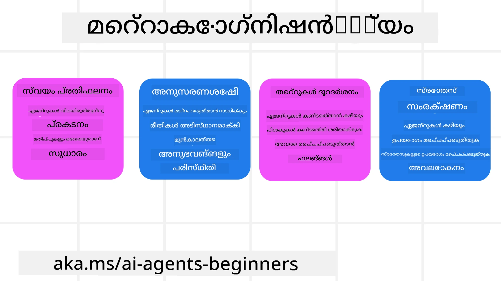
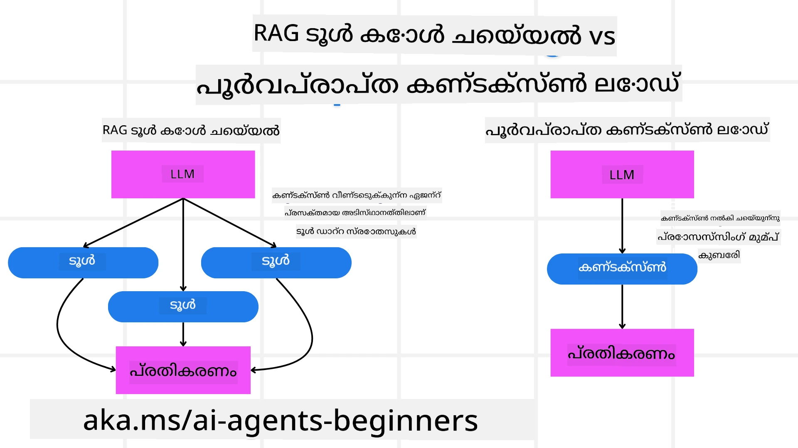

[](https://youtu.be/His9R6gw6Ec?si=3_RMb8VprNvdLRhX)

> _(ഈ പാഠത്തിലെ വീഡിയോ കാണാൻ മുകളിൽ ചിത്രത്തെ ക്ലിക്കുചെയ്യുക)_
# AI ഏജന്റുകളിൽ മെടാകോഗ്നിഷൻ

## ആമുഖം

AI ഏജന്റുകളിൽ മെടാകോഗ്നിഷൻ വിഷയത്തിലുള്ള പാഠത്തിലേക്ക് സ്വാഗതം! മേധാവിത്തമായുള്ള ഈ സെക്ഷൻ, AI ഏജന്റുകൾ അവരുടെ സ്വന്തം ചിന്താ പ്രക്രിയകളെക്കുറിച്ച് എങ്ങനെ ചിന്തിക്കുന്നു എന്നതിൽ താല്‍പ്പര്യമുള്ള പ്രാരംഭക്കാർക്ക് ഉദ്ദേശിച്ചിരിക്കുന്നു. ഈ പാഠം സമാപിക്കുന്നപ്പോൾ, നിങ്ങൾ പ്രധാന ആശയങ്ങൾ മനസിലാക്കുകയും AI ഏജന്റ് ഡിസൈൻ-ലും മെടാകോഗ്നിഷൻ പ്രയോഗിക്കാൻ പ്രായോഗിക ഉദാഹരണങ്ങളേയും നേടുകയും ചെയ്യും.

## പഠന ലക്ഷ്യങ്ങൾ

ഈ പാഠം പൂർത്തിയാക്കിയ ശേഷമുള്ള നിങ്ങള്ക്ക് സാധിക്കുന്നത്:

1. ഏജന്റ് നിർവചനങ്ങളിൽ ഉളള റീസണിംഗ് ലൂപ്പുകളുടെ പ്രസക്തി മനസിലാക്കുക.
2. സ്വയം തിരുത്തുന്ന ഏജന്റുകൾക്കായി പദ്ധതിയിടലും മೌಲ്യനിർണയ സാങ്കേതികതകളും ഉപയോഗപ്പെടുത്തുക.
3.ഗതികേട് സംശോധനം, നിർദ്ദേശങ്ങൾ സൃഷ്ടിച്ച് നിർവഹിക്കുന്ന ഏജന്റുകൾ ഉണ്ടാക്കുക.

## മെടാകോഗ്നിഷന് പരിചയം

മെടാകോഗ്നിഷൻ എന്നാണ് ആത്മചിന്തയിലേക്കുള്ള ഉന്നതമായ ബുദ്ധിപരമായ പ്രക്രിയകൾ അറിയുന്നത്. AI ഏജന്റുകൾക്കായി, തങ്ങൾ നടന്ന പ്രവർത്തനങ്ങളെ സ്വയം ബോധമുള്ളതും മുൻ അനുഭവങ്ങളിൽ നിന്ന് പഠിച്ചും വിലയിരുത്താനുള്ള കഴിവാണ് ഇത്. "ചിന്തയെ കുറിച്ച് ചിന്തിക്കുന്നതും" AI ഏജന്റ് വ്യവസ്ഥകളുടെ വികാസത്തിൽ വളരെ പ്രധാനപ്പെട്ട ആശയം ആണ്. ഇതിൽ AI സംവിധാനങ്ങൾ അവരുടെ അകത്തറിയലുകളെയും പ്രവർത്തനങ്ങളെ നിരീക്ഷിക്കുകയും നിയന്ത്രിക്കുകയും അനുയോജ്യമായി ക്രമീകരിക്കുകയും ചെയ്യാൻ അഭിരമിക്കുന്നു. നമ്മൾ എങ്ങനെയാണ് ഒരു പ്രശ്നം വിലയിരുത്തുമ്പോൾ അങ്ങനെയാണ് ഇതും. ഈ സ്വയം ബോധം AI സംവിധാനങ്ങൾക്ക് മികച്ച തീരുമാനങ്ങൾ എടുക്കാനും പിഴവുകൾ തിരിച്ചറിയാനും സമയം കൊണ്ട് അവരുടെ പ്രകടനം മെച്ചപ്പെടുത്താനും സഹായിക്കുന്നു - ഇത് ട്യൂറിംഗ് പരിശോദനയുമായി ബന്ധപ്പെട്ട് AI takeover-ഉം ചർച്ചയുണ്ട്.

ഏജന്റിംഗ് AI സംവിധാനങ്ങളുടെ സാഹചര്യത്തിൽ, മെടാകോഗ്നിഷൻ വിവിധ വെല്ലുവിളികൾ മറികടക്കാൻ സഹായിക്കുന്നു, ഉദാഹരണങ്ങൾ:
- പാർദർശിത്വം: AI സംവിധാനങ്ങൾ അവരുടെ കാരണം വ്യക്തമാക്കാനും തീരുമാനങ്ങൾ വിശദീകരിക്കാൻ കഴിവുള്ളതിനുള്ള ഉറപ്പ്.
- റീസണിംഗ്: AI സംവിധാനങ്ങൾക്ക് വിവരങ്ങൾ സംയോജിപ്പിച്ച് ഫലപ്രദമായ തീരുമാനങ്ങൾ എടുക്കാനുള്ള കഴിവ് വർദ്ധിപ്പിക്കൽ.
- അനുയോജ്യത: പുതിയ പരിസരങ്ങളേയും വ്യത്യസ്ത സാഹചര്യങ്ങളേയും AI സിസ്റ്റങ്ങൾ ഒരുക്കാൻ കഴിവുള്ളതാക്കൽ.
- ഗ്രഹിക്കൽ: പരിസരം നിന്നുള്ള ഡാറ്റ ആവശ്യമായി തിരിച്ചറിയാനും വിശകലനം ചെയ്യാനും AI സംവിധാനം മെച്ചപ്പെടുത്തുക.

### മെടാകോഗ്നിഷൻ എന്താണ്?

മെടാകോഗ്നിഷൻ, "ചിന്തയെക്കുറിച്ച് ചിന്തിക്കൽ", ആത്മബോധവും ആത്മനിയന്ത്രണവുമുള്ള ഉന്നത മനഃസംവേദന പ്രക്രിയയാണ്. AI മേഖലയിൽ, മെടാകോഗ്നിഷൻ ഏജന്റുകൾക്ക് അവരുടെ തന്ത്രികളും പ്രവർത്തനങ്ങളും വിലയിരുത്തി അനുസരിച്ചെതിരെ ക്രമീകരിക്കുന്നത് സാധ്യമാക്കുന്നു, പ്രശ്ന പരിഹാരവും തീരുമാന ലയനവും മെച്ചപ്പെടുത്തുന്നു. മെടാകോഗ്നിഷൻ മനസിലാക്കുന്നത് വഴി, നിങ്ങൾ മികവുറ്റതും അനുസരിക്കുന്നതുമായ AI ഏജന്റുകൾ രൂപകൽപ്പന ചെയ്യാൻ കഴിയും. യഥാർത്ഥ മെടാകോഗ്നിഷൻ അവസ്ഥയിൽ AI സ്വയം അവരുടെ റീസണിംഗ് നിർവചിക്കുന്നത് കാണാം.

ഉദാഹരണം: “ഞാൻ വിലക്കുറഞ്ഞ വിമാനങ്ങളിൽ മുൻഗണന നൽകി കാരണം… ഞാൻ നേരിട്ടുള്ള വിമാനങ്ങൾ കാണാതാകാമെന്ന് ചിന്തിച്ച് ഞാൻ വീണ്ടും പരിശോധിക്കും.”
തിരഞ്ഞെടുക്കുന്ന മാർഗ്ഗം എങ്ങനെ അല്ലെങ്കിൽ എന്ത് കാരണം വശം ശ്രദ്ധിക്കുക.
- കഴിഞ്ഞ തവണ ഉപഭോക്തൃ മുൻഗണനകളെ അമിതമായി ആശ്രയിച്ചതിനാൽ പിഴവ് നടന്നതായി ശ്രദ്ധിച്ച്, അവസാന നിർദേശമല്ല മറിച്ച് തീരുമാനമെടുക്കൽ തന്ത്രം സജ്ജമാക്കുക.
- “ഉപയോക്താവ് ‘വളരെ തിരക്കുള്ളത്’ എന്ന് പറഞ്ഞാൽ ഞാൻ ചില ആകർഷണങ്ങൾ ഒഴിവാക്കണം മാത്രമല്ല, എന്റെ ‘മികച്ച ആകർഷണങ്ങൾ’ തിരഞ്ഞെടുക്കൽ രീതികൾ പ്രശ്‌നത്തിലാണ്, എപ്പോഴും ജനപ്രിയതഅപ്രകാരം റാങ്കുചെയ്യുന്നത്” എന്ന് പാറ്റേണുകൾ തിരിച്ചറിയുക.

### AI ഏജന്റുകളിൽ മെടാകോഗ്നിഷന്റെ പ്രാധാന്യം

മെടാകോഗ്നിഷൻ AI ഏജന്റ് രൂപകൽപ്പനയിൽ അത്യന്താപേക്ഷിതമായ ഭാഗമാണ് കാരണം:



- ആത്മപരിശീലനം: ഏജന്റുകൾക്ക് അവരുടെ പ്രകടനം വിലയിരുത്താനും മെച്ചപ്പെടുത്തേണ്ട സ്ഥലങ്ങൾ തിരിച്ചറിയാനും സാധിക്കും.
- അനുയോജ്യത: മുൻ അനുഭവങ്ങളും വ്യത്യസ്തമായ പരിസരങ്ങളും അടിസ്ഥാനമാക്കി തന്ത്രങ്ങൾ മാറ്റം വരുത്താം.
- പിഴവ് പരിഹാരം: സ്വയം പിഴവുകൾ കണ്ടെത്തി ശരിയാക്കാൻ കഴിയും, കൂടുതൽ കൃത്യമായ ഫലങ്ങൾ ഉറപ്പ്.
- വനംകാലകാര്യനിർവ്വഹണം: സമയം, കണക്കു ശേഷി മുതലായ വൻവിഭവങ്ങൾ കരുത്തുറ്റ തന്ത്രങ്ങൾ കൊണ്ടു ഉപയോഗിക്കുക.

## AI ഏജന്റിന്റെ ഘടകങ്ങൾ

മെടാകോഗ്നിറ്റീവ് പ്രക്രിയകൾക്ക് മുൻപ്, AI ഏജന്റിന്റെ അടിസ്ഥാന ഘടകങ്ങൾ മനസിലാക്കുന്നത് അത്യാവശ്യമാണ്. ഒരു AI ഏജന്റ് സാധാരണയായി ഉൾക്കൊള്ളുന്നത്:

- വ്യക്തിത്വം: ഏജന്റിന്റെ വ്യക്തിത്വവും ലക്ഷണങ്ങളും, ഉപയോക്താക്കളുമായി എങ്ങനെയാണ് ഇടപെടുന്നത് എന്നതും നിർവ്വചിക്കുന്നു.
- ഉപകരണങ്ങൾ: ഏജന്റ് നിർവ്വഹിക്കാവുന്ന ശേഷികളും പ്രവർത്തനങ്ങളും.
- കഴിവുകൾ: ഏജന്റ് ഉള്ള അറിവും വിദഗ്ധതയും.

ഈ ഘടകങ്ങൾ ചേർന്ന് ഒരു "വിദഗ്ധता യൂണിറ്റ്" സൃഷ്ടിക്കുന്നു, പ്രത്യേക പ്രവർത്തനങ്ങൾ നിർവ്വഹിക്കാൻ കഴിവുള്ളത്.

**ഉദാഹരണം**:
യാത്രാ ഏജന്റു പരിഗണിക്കുക, നിങ്ങളുടെ അവധി പദ്ധതി മാത്രം തയ്യാറാക്കുന്നതല്ല, മറിച്ച് യാഥാർത്ഥ്യ ഡാറ്റയും മുൻ ഉപയോക്തൃ യാത്രാനുഭവങ്ങളും അടിസ്ഥാനമാക്കി പാത ക്രമീകരിക്കുന്നു.

### ഉദാഹരണം: യാത്രാ ഏജന്റ് സേവനത്തിൽ മെടാകോഗ്നിഷൻ

നിങ്ങൾ AI എന്നിവ ചേർന്ന ഒരു യാത്രാ ഏജന്റ് സേവനം രൂപകൽപ്പന ചെയ്യുകയാണെന്ന് കരുതുക. ഈ ഏജന്റ് ഉപയോക്താക്കളെ അവധിക്കാലം സജ്ജമാക്കുന്നതിൽ സഹായിക്കുന്നു. മെടാകോഗ്നിഷൻ ഉൾപ്പെടുത്താൻ വേണ്ടി, 'യാത്രാ ഏജന്റ്' സ്വയം ബോധവും മുൻ അനുഭവങ്ങളും അടിസ്ഥാനമാക്കി പ്രവർത്തനങ്ങളെ വിലയിരുത്തുകയും ക്രമീകരിക്കുകയും വേണം. മെടാകോഗ്നിഷൻ എങ്ങനെ പ്രവർത്തിക്കാം:

#### നിലവിലെ ജോലി

ഒരു ഉപയോക്താവിന് പാരിസിലേക്ക് ട്രിപ്പ് പദ്ധതി നിരൂപണം ചെയ്യുക.

#### ജോലി പൂർത്തിയാക്കാനുള്ള ഘട്ടങ്ങൾ

1. **ഉപയോക്തൃ മുൻഗണനകൾ ശേഖരിക്കുക**: യാത്രാ തീയതികൾ, ബഡ്ജറ്റ്, താല്പര്യങ്ങൾ (ഉദാ: മ്യൂസിയങ്ങളും ഭക്ഷണവും ഷോപ്പിംഗും) എന്നിവയെ കുറിച്ച് uporab-ന് ചോദിക്കുക.
2. **വിവരം ശേഖരിക്കുക**: ഉപയോക്തൃ മുൻഗണനകൾക്ക് അനുയോജ്യമായ വിമാനങ്ങളുടെയും താമസസംവിധാനങ്ങളുടെയും ആകർഷണങ്ങളുടെയും റസ്റ്റോറന്റുകളുടെയും വിവരങ്ങൾ അന്വേഷിക്കുക.
3. **ശുപാർശകൾ സൃഷ്ടിക്കുക**: വിമാനത്തിന്റെ വിശദാംശങ്ങളും ഹോട്ടൽ ബുക്കിങ്ങുകളും നിർദ്ദേശിച്ച പ്രവർത്തനങ്ങളും ഉള്‍പ്പെടുന്ന വ്യക്തിഗത യാത്രാപദ്ധതി നൽകുക.
4. **പ്രതികരണത്തെ അടിസ്ഥാനമാക്കി ക്രമീകരിക്കുക**: ശുപാർശകൾക്ക് ഉപയോക്താവിന്റെ പ്രതികരണങ്ങൾ ചോദിച്ച് ആവശ്യമായ മാറ്റങ്ങൾ ചെയ്യുക.

#### ആവശ്യമായ വിഭവങ്ങൾ

- വിമാനവും ഹോട്ടൽ ബുക്കിംഗ് ഡാറ്റാബേസുകളിലേക്കും ആക്‌സസ്.
- പാരിസ് ആകർഷണങ്ങളെയും റസ്റ്റോറന്റുകളേയും സംബന്ധിച്ച വിവരങ്ങൾ.
- മുൻ ഇടപെടലുകളിൽ നിന്നുള്ള ഉപയോക്തൃ പ്രതികരണ ഡാറ്റ.

#### അനുഭവവും ആത്മപരിശ്ചയവും

യാത്രാ ഏജന്റ് മെടാകോഗ്നിഷൻ ഉപയോഗിച്ചു തങ്ങളുടെ പ്രകടനം വിലയിരുത്തുകയും മുൻ അനുഭവങ്ങളിൽ നിന്നും പഠിക്കുകയും ചെയ്യുന്നു. ഉദാഹരണങ്ങൾ:

1. **ഉപയോക്തൃ പ്രതികരണം വിശകലനം**: ഏജന്റ് ഉപയോക്തൃ പ്രതികരണം പരിശോധിച്ച് ഏത് ശുപാർശകൾ അംഗീകരിച്ചു, ഏത് അംഗീകരിച്ചില്ലന്നതുന്നു തിരിച്ചറിയുന്നു. അങ്ങനെ ഭാവിയിലെ നിർദേശങ്ങൾ ക്രമീകരിക്കുന്നു.
2. **അനുവർത്തനക്ഷമത**: ഉപയോക്താവ് മുമ്പ് തിരക്ക് കൂടുതൽ സ്ഥലങ്ങൾ ഇഷ്ടപെടുന്നില്ലെങ്കില്‍, ഏജന്റ് ഫ്യൂച്ചർ-ലും പൊതു വിനോദസഞ്ചാര സ്ഥലങ്ങൾ ഒഴിവാക്കും.
3. **പിഴവ് പരിഹാരം**: മുമ്പ് താൽക്കാലികമായി പിഴവ് സംഭവിച്ച ഹോട്ടൽ ബുക്കിംഗ് പ്രശ്നം പോലുള്ള പിഴവ് കണ്ടെത്തി ശരിയാക്കാൻ സ്വകാര്യമായ സംവിധാനങ്ങൾ ഉപയോഗിക്കുന്നു.

#### പ്രായോഗിക ഡെവലപ്പർ ഉദാഹരണം

മെടാകോഗ്നിഷൻ ഉൾപ്പെടുത്തിയപ്പോഴുള്ള ട്രാവൽ ഏജന്റിന്റെ കോഡ് എങ്ങനെ കാണാമെന്ന് ഇവിടെ ഒരു ലളിതമായ ഉദാഹരണം:

```python
class Travel_Agent:
    def __init__(self):
        self.user_preferences = {}
        self.experience_data = []

    def gather_preferences(self, preferences):
        self.user_preferences = preferences

    def retrieve_information(self):
        # ഇഷ്ടാനുസരണം വിമാനങ്ങൾ, ഹോട്ടലുകൾ, ആകർഷണങ്ങൾ എന്നിവ തിരയുക
        flights = search_flights(self.user_preferences)
        hotels = search_hotels(self.user_preferences)
        attractions = search_attractions(self.user_preferences)
        return flights, hotels, attractions

    def generate_recommendations(self):
        flights, hotels, attractions = self.retrieve_information()
        itinerary = create_itinerary(flights, hotels, attractions)
        return itinerary

    def adjust_based_on_feedback(self, feedback):
        self.experience_data.append(feedback)
        # അഭിപ്രായങ്ങൾ വിശകലനം ചെയ്ത് ഭാവി ശിപാർശകൾ ക്രമീകരിക്കുക
        self.user_preferences = adjust_preferences(self.user_preferences, feedback)

# ഉദാഹരണ ব্যৱഹാരം
travel_agent = Travel_Agent()
preferences = {
    "destination": "Paris",
    "dates": "2025-04-01 to 2025-04-10",
    "budget": "moderate",
    "interests": ["museums", "cuisine"]
}
travel_agent.gather_preferences(preferences)
itinerary = travel_agent.generate_recommendations()
print("Suggested Itinerary:", itinerary)
feedback = {"liked": ["Louvre Museum"], "disliked": ["Eiffel Tower (too crowded)"]}
travel_agent.adjust_based_on_feedback(feedback)
```

#### മെടാകോഗ്നിഷന്റെ പ്രാധാന്യം

- **ആത്മപരിശോധനം**: ഏജന്റുകൾ അവരുടെ പ്രകടനം വിശ്ലേഷിക്കുകയും മെച്ചത്തിനുള്ള ഇടങ്ങൾ തിരിച്ചറിയുകയും ചെയ്യുന്നു.
- **അനുവർത്തനക്ഷമത**: ഫീഡ്ബാക്കും വ്യത്യസ്ത സാഹചര്യങ്ങളും അടിസ്ഥാനമാക്കി തന്ത്രങ്ങൾ മാറ്റവും മെഡാക്കുന്നു.
- **പിഴവ് പരിഹാരം**: സ്വയം പിഴവുകൾ കണ്ടെത്തി ശരിയാക്കണം.
- **വനംകാലകാര്യനിർവ്വഹണം**: സമയം, കണക്കു ശേഷി മുതലായ വിഭവങ്ങൾ ശരിയായി ഉപയോഗപ്പെടുത്തുന്നു.

മെടാകോഗ്നിഷൻ ഉള്‍ക്കൊണ്ട് യാത്രാ ഏജന്റ് കൂടുതൽ വ്യക്തിഗതവും കൃത്യവുമായ യാത്രാ ശുപാർശകൾ നൽകാനും ഉപയോക്തൃ അനുഭവം മെച്ചപ്പെടുത്താനും സാധിക്കും.

---

## 2. ഏജന്റുകളിൽ പദ്ധതിയിടൽ

പദ്ധതിയിടൽ AI ഏജന്റിന്റെ പെരുമാറ്റത്തിൽ പ്രധാന ഘടകം ആണ്. ലക്ഷ്യം നേടുന്നതിനുള്ള ഘട്ടങ്ങൾ രൂപരേഖപ്പെടുത്തുന്നത്, നിലവിലെ അവസ്ഥ, വിഭവങ്ങൾ, തടസ്സങ്ങൾ പരിഗണിക്കുക എന്നിവ ഇതിലുണ്ട്.

### പദ്ധതിയിടലിന്റെ ഘടകങ്ങൾ

- **നിലവിലെ ജോലി**: ജോലി വ്യക്തമായി നിർവചിക്കുക.
- **ജോലി പൂർത്തിയാക്കാനുള്ള ഘട്ടങ്ങൾ**: ജോലി കൈകാര്യം ചെയ്യാവുന്ന ഘട്ടങ്ങളാക്കി വിഭജിക്കുക.
- **ആവശ്യ വിഭവങ്ങൾ**: ആവശ്യമായ വിഭലോകങ്ങൾ തിരിച്ചറിയുക.
- **അനുഭവം**: മുമ്പ് ഉണ്ടായ അനുഭവങ്ങൾ പദ്ധതി രൂപപ്പെടുത്തലിൽ ഉപയോഗിക്കുക.

**ഉദാഹരണം**:
ഉപയോക്താവിന്റെ യാത്രാ പദ്ധതി സഹായിക്കാൻ യാത്രാ ഏജന്റ് ചെറുതായി എടുക്കേണ്ട ഘട്ടങ്ങൾ ചുവടെ പ്രകാശിപ്പിക്കുന്നു:

### യാത്രാ ഏജന്റിനുള്ള ഘട്ടങ്ങൾ

1. **ഉപയോക്തൃ മുൻഗണനകൾ ശേഖരിക്കുക**
   - യാത്രാ തീയതികൾ, ബഡ്ജറ്റ്, താല്പര്യങ്ങൾ, പ്രത്യേക ആവശ്യങ്ങൾ എന്നിവ ചോദിക്കുക.
   - ഉദാഹരണം: "നിങ്ങൾ എപ്പോൾ യാത്ര ചെയ്യാനാണ് ആലോചിക്കുന്നത്?" "നിങ്ങളുടെ ബഡ്ജറ്റ് പരിധി എന്താണ്?" "അവധിക്കാലത്ത് ഇഷ്ടപ്പെടുന്ന പ്രവർത്തനങ്ങൾ എന്തൊക്കെ?"

2. **വിവരം ശേഖരിക്കുക**
   - ഉപയോക്തൃ മുൻഗണനകൾ അടിസ്ഥാനത്തിലായ യാത്രാ ഓപ്ഷനുകൾ അന്വേഷിക്കുക.
   - **വിമാനങ്ങൾ**: ഉപയോക്തൃ ബഡ്ജറ്റിൽ അനുയോജ്യമായ വിമാനങ്ങൾ തിരഞ്ഞെടുക്കുക.
   - **താമസ കാര്യങ്ങൾ**: സ്ഥലം, ചെലവ്, സൗകര്യങ്ങൾ എന്നിവ അനുസരിച്ച് ഹോട്ടലുകൾ കണ്ടെത്തുക.
   - **ആകർഷണങ്ങളും ഭക്ഷണാലയങ്ങളും**: ഉപയോക്തൃ താൽപര്യങ്ങൾ പൂർത്തിയാക്കുന്ന വിനോദ, ഭക്ഷണ ഓപ്ഷനുകൾ തിരിച്ചറിയുക.

3. **ശുപാർശകൾ സൃഷ്ടിക്കുക**
   - ശേഖരിച്ച വിവരങ്ങൾ വ്യക്തിഗത യാത്രാ പദ്ധതി ആക്കി ഒത്തുചേർക്കുക.
   - വിമാനവിവരങ്ങൾ, ഹോട്ടൽ ബുക്കിംഗുകൾ, ശുപാർശാ പ്രവർത്തനങ്ങൾ എന്നിവ നൽകിയാണ് ഉപയോക്താവിന് നൽകുക.

4. **യാത്രാപദ്ധതി ഉപയോക്താവിന് മുന്നിൽ അവതരിപ്പിക്കുക**
   - ഉപയോക്താവിന് അവലോകനം ചെയ്യാൻ പദ്ധതി പങ്കിടുക.
   - ഉദാഹരണം: "പാരിസിലെ നിങ്ങളുടെ യാത്രയ്ക്ക് ഇത് ശുപാർശാ പദ്ധതി ആണ്. ഇതിൽ വിമാന വിവരങ്ങൾ, ഹോട്ടൽ ബുക്കിങ്ങുകൾ, നിർദ്ദേശിക്കുന്ന പ്രവർത്തനങ്ങളും ഉൾപ്പെടുന്നു. നിങ്ങളുടെ അഭിപ്രായം അറിയിക്കുക!"

5. **പ്രതികരണം ശേഖരിക്കുക**
   - നിർദ്ദേശങ്ങളിലെ ഉപയോക്തൃ അഭിപ്രായം ചോദിക്കുക.
   - ഉദാഹരണങ്ങൾ: "വിമാന ഓപ്ഷനുകൾ നിങ്ങൾക്ക് ഇഷ്ടമാണോ?" "ഹോട്ടൽ നിങ്ങളുടെ ആവശ്യങ്ങൾക്കനുസരണമാകുന്നുണ്ടോ?" "കൂടുതൽ ചേർക്കുവാൻ എന്തെങ്കിലും പ്രവർത്തനങ്ങളുണ്ടോ?" 

6. **പ്രതികരണത്തിന്റെ അടിസ്ഥാനത്തിൽ ക്രമീകരിക്കുക**
   - ഉപയോക്തൃ അഭിപ്രായം അനുസരിച്ച് പദ്ധതി തിരുത്തുക.
   - വിമാന, താമസ, പ്രവർത്തന ശുപാർശകളിൽ ആവശ്യമായ മാറ്റങ്ങൾ വരുത്തുക.

7. **അവസാന സ്ഥിരീകരണം**
   - പുതുക്കിയ പദ്ധതിയുടെ അവസാന രൂപം ഉപയോക്താവിന് അവതരിപ്പിക്കുക.
   - ഉദാഹരണം: "നിങ്ങളുടെ അഭിപ്രായം പ്രകാരം മാറ്റങ്ങൾ ചെയ്‌തിട്ടുണ്ട്. പുതുക്കിയ പദ്ധതി ഇത്. എല്ലാം ശരിയാണോ നോക്കൂ?"

8. **ബുക്കിംഗ് സാധൂകരിക്കുക**
   - ഉപയോക്താവ് അംഗീകരിച്ചാൽ വിമാനങ്ങൾ, താമസം, നിർദ്ധാരിത പ്രവർത്തനങ്ങൾ ബുക്ക് ചെയ്യുക.
   - സ്ഥിരീകരണ വിവരങ്ങൾ ഉപയോക്താവിന് അയയ്‌ക്കുക.

9. **തുടരുന്ന പിന്തുണ നൽകുക**
   - യാത്ര ആരംഭിക്കുന്നതിനു മുമ്പും യാത്രക്കാലവും ഉപയോക്താവിന്റെ മാറ്റങ്ങളും ആവശ്യങ്ങളും സഹായം സജ്ജമാക്കുക.
   - ഉദാഹരണം: "യാത്രക്കാലത്ത് കൂടുതൽ സഹായം വേണമെങ്കിൽ എപ്പോഴും എന്നോട് ബന്ധപ്പെടൂ!"

### ഉദാഹരണ സംവാചനം

```python
class Travel_Agent:
    def __init__(self):
        self.user_preferences = {}
        self.experience_data = []

    def gather_preferences(self, preferences):
        self.user_preferences = preferences

    def retrieve_information(self):
        flights = search_flights(self.user_preferences)
        hotels = search_hotels(self.user_preferences)
        attractions = search_attractions(self.user_preferences)
        return flights, hotels, attractions

    def generate_recommendations(self):
        flights, hotels, attractions = self.retrieve_information()
        itinerary = create_itinerary(flights, hotels, attractions)
        return itinerary

    def adjust_based_on_feedback(self, feedback):
        self.experience_data.append(feedback)
        self.user_preferences = adjust_preferences(self.user_preferences, feedback)

# ബുക്കിംഗ് അഭ്യര്‍ത്ഥനയില്‍ ഉദാഹരണ ഉപയോഗം
travel_agent = Travel_Agent()
preferences = {
    "destination": "Paris",
    "dates": "2025-04-01 to 2025-04-10",
    "budget": "moderate",
    "interests": ["museums", "cuisine"]
}
travel_agent.gather_preferences(preferences)
itinerary = travel_agent.generate_recommendations()
print("Suggested Itinerary:", itinerary)
feedback = {"liked": ["Louvre Museum"], "disliked": ["Eiffel Tower (too crowded)"]}
travel_agent.adjust_based_on_feedback(feedback)
```

## 3. പരിഹാര RAG സിസ്റ്റം

ആദ്യം RAG ടൂൾയും പ്രീ-എംപ്റ്റീവ് കോൺടെക്സ്‌റ്റ് ലോഡും തമ്മിലുള്ള വ്യത്യാസം മനസിലാക്കാം.



### റിട്രീവൽ-ഓഗ്മെന്റഡ് ജനറേഷൻ (RAG)

RAG ഒരു റിട്രീവൽ സിസ്റ്റവും ജനറേറ്റീവ് മോഡലും ചേർത്ത വ്യവസ്ഥയാണ്. ഒരു ചോദ്യം എത്തിയാൽ, റിട്രീവൽ സിസ്റ്റം ബന്ധപ്പെട്ട രേഖകളും ഡാറ്റയും പുറന്തള്ളുന്നു, ഇത് ജനറേറ്റീവ് മോഡലിന്റെ ഇൻപുട്ട് വർദ്ധിപ്പിക്കാനുപയോഗിക്കുന്നു. മോഡലിന് കൂടുതൽ കൃത്യമായും സാന്ദർഭ്യത്തിൽ അനുയോജ്യമായ മറുപടികൾ ജനറേറ്റ് ചെയ്യാൻ ഇത് സഹായിക്കുന്നു.

RAG സിസ്റ്റത്തിൽ ഏജന്റ് വിവരശേഖരണ ശേഖരത്തിലുമുള്ള പറ്റിയ സൂചനകൾ തിരയുകയും അനുയോജ്യമായ മറുപടികളോ പ്രവർത്തനങ്ങളോ സൃഷ്ടിക്കാൻ ഉപയോഗിക്കുന്നു.

### പരിഹാര RAG സമീപനം

പരിഹാര RAG ഏകദേശമായി പിഴവുകൾ ശരിയാക്കാനും AI ഏജന്റുകളുടെ കൃത്യത മെച്ചപ്പെടുത്താനും RAG സാങ്കേതികതകൾ ഉപയോഗിക്കുന്നതിലാണ്. ഇതിൽ ഉൾപ്പെടുന്നു:

1. **പ്രോംപ്റ്റിംഗ് സാങ്കേതികത**: ഏജന്റ് ബന്ധപ്പെട്ട വിവരങ്ങൾ കണ്ടെത്താൻ പ്രത്യേക പ്രോംപ്റ്റുകൾ ഉപയോഗിക്കുന്നു.
2. **ഉപകരണങ്ങൾ**: ലഭിച്ച വിവരങ്ങളുടെ പ്രസക്തി വിലയിരുത്തി കൃത്യമായ മറുപടികൾ സൃഷ്ടിക്കാൻ ആൽഗോറിതങ്ങളും സംവിധാനങ്ങളും.
3. **മೌಲ്യനിർണയം**: ഏജന്റിന്റെ പ്രകടനം നിരന്തരം വിലയിരുത്തി അതിന്റെ കൃത്യതയും കാര്യക്ഷമതയും മെച്ചപ്പെടുത്തുന്നതിനായി ക്രമീകരണങ്ങൾ.

#### ഉദാഹരണം: ഒരു സെർച്ച് ഏജന്റിനു പരിഹാര RAG

ഉപയോക്തൃ ചോദ്യം മറുപടി നൽകാൻ വെബ്-ഇൻഫർമേഷൻ തിരയുന്ന ഒരു സെർച്ച് ഏജന്റിനെ പരിഗണിക്കുക. പരിഹാര RAG സമീപനം അങ്ങനെയായിരിക്കും:

1. **പ്രോംപ്റ്റിംഗ് സാങ്കേതികത**: ഉപയോക്തൃ ഇൻപുട്ട് അടിസ്ഥാനമാക്കി തിരയൽ ചോദ്യം രൂപപ്പെടുത്തുക.
2. **ഉപകരണങ്ങൾ**: നാച്ചുരൽ ലാംഗ്വേജ് പ്രോസസിങ്, മെഷീൻ ലേണിംഗ് ആൽഗോറിതങ്ങൾ ഉപയോഗിച്ച് തിരയൽ ഫലങ്ങൾ റാങ്ക് ഫിൽറ്റർ ചെയ്യുക.
3. **മേധാവിനിർണയം**: ഉപയോക്തൃ പ്രതികരണം വിശകലനം ചെയ്ത് തിരഞ്ഞെടുത്ത വിവരത്തിൽ പിഴവുകൾ തിരിച്ചറിഞ്ഞ് ശരിയാക്കുക.

### യാത്രാ ഏജന്റിൽ പരിഹാര RAG

പരിഹാര RAG AI-യുടെ വിവരശേഖരണവും സൃഷ്ടിയും മെച്ചപ്പെടുത്തുന്നു, പിഴവുകളും തിരുത്തിയുള്ള കൃത്യതയും ഉറപ്പാക്കുന്നു. യാത്രാ ഏജന്റ് കൂടുതൽ കൃത്യവും പ്രാസംഗികവുമായ ശുപാർശകൾ നൽകാൻ പരിഹാര RAG ഉപയോഗിക്കുന്നത് എങ്ങനെയെന്ന് നോക്കാം.

ഇതിൽ ഉൾപ്പെടുന്നു:

- **പ്രോംപ്റ്റിംഗ് സാങ്കേതികത**: ഏജന്റ് ബന്ധപ്പെട്ട വിവരങ്ങൾ തിരയാൻ പ്രത്യേക പ്രോംപ്റ്റുകൾ ഉപയോഗിക്കുന്നു.
- **ഉപകരണം**: റിട്രീവൽ സമഗ്രതയും കൃത്യതയും വിലയിരുത്താനും ശരിയായ മറുപടി ജനറേറ്റ് ചെയ്യാനുമായി ആൽഗോറിതങ്ങളും മെക്കാനിസങ്ങളും നടപ്പാക്കുന്നു.
- **മേധാവിനിർണയം**: ഏജന്റിന്റെ പ്രകടനം നിരന്തരം പരിശോധിച്ച് കൃത്യതയും കാര്യക്ഷമതയും മെച്ചപ്പെടുത്താൻ ക്രമീകരണങ്ങൾ.

#### യാത്രാ ഏജന്റിൽ പരിഹാര RAG നടപ്പാക്കേണ്ട ഘട്ടങ്ങൾ

1. **ആദ്യ ഉപയോക്തൃ ഇടപെടൽ**
   - യാത്രാ ലക്ഷ്യം, തീയതികൾ, ബഡ്ജറ്റ്, താൽപര്യങ്ങൾ എന്നിവ ശേഖരിക്കുക.
   - ഉദാഹരണം:

     ```python
     preferences = {
         "destination": "Paris",
         "dates": "2025-04-01 to 2025-04-10",
         "budget": "moderate",
         "interests": ["museums", "cuisine"]
     }
     ```

2. **വിവരം ശേഖരിക്കൽ**
   - ഉപഭോക്തൃ മുൻഗണനകളുടെ അടിസ്ഥാനത്തിൽ വിമാനങ്ങൾ, താമസങ്ങൾ, ആകർഷണങ്ങൾ, ഭക്ഷണശാലകൾ എന്നിവയെക്കുറിച്ചുള്ള വിവരങ്ങൾ ശേഖരിക്കുക.
   - ഉദാഹരണം:

     ```python
     flights = search_flights(preferences)
     hotels = search_hotels(preferences)
     attractions = search_attractions(preferences)
     ```

3. **ആദ്യ ശുപാർശകൾ സൃഷ്ടിക്കുക**
   - ശേഖരിച്ച വിവരങ്ങളാൽ വ്യക്തിഗത യാത്രാ പദ്ധതി തയ്യാറാക്കുക.
   - ഉദാഹരണം:

     ```python
     itinerary = create_itinerary(flights, hotels, attractions)
     print("Suggested Itinerary:", itinerary)
     ```

4. **ഉപയോക്തൃ പ്രതികരണം ശേഖരിക്കുക**
   - ആദ്യം നൽകിയ ശുപാർശകൾക്ക് ഉപയോക്താവിന്റെ അഭിപ്രായം ചോദിക്കുക.
   - ഉദാഹരണം:

     ```python
     feedback = {
         "liked": ["Louvre Museum"],
         "disliked": ["Eiffel Tower (too crowded)"]
     }
     ```

5. **പരിഹാര RAG പ്രക്രിയ**
   - **പ്രോംപ്റ്റിംഗ് സാങ്കേതികത**: ഉപയോക്തൃ പ്രതികരണത്തിനനുസരിച്ച് പുതിയ തിരയൽ ചോദ്യം രൂപീകരിക്കുക.
     - ഉദാഹരണം:

       ```python
       if "disliked" in feedback:
           preferences["avoid"] = feedback["disliked"]
       ```

   - **ഉപകരണം**: പുതിയ തിരയൽ ഫലങ്ങളെ റാങ്ക് ചെയ്ത് ഫിൽറ്റർ ചെയ്യുന്നതിനായി ആൽഗോറിതങ്ങൾ ഉപയോഗിക്കുക, ഉപയോക്തൃ പ്രതികരണം പരിഗണിച്ച് പ്രസക്തി ഉയർത്തുന്നു.
     - ഉദാഹരണം:

       ```python
       new_attractions = search_attractions(preferences)
       new_itinerary = create_itinerary(flights, hotels, new_attractions)
       print("Updated Itinerary:", new_itinerary)
       ```

   - **മേധാവിനിർണയം**: ഉപയോക്തൃ പ്രതികരണവും നിർദ്ദേശങ്ങളുടെ കൃത്യതയും വിലയിരുത്തി നിരന്തരം പരിഷ്കരണങ്ങൾ നടത്തുക.
     - ഉദാഹരണം:

       ```python
       def adjust_preferences(preferences, feedback):
           if "liked" in feedback:
               preferences["favorites"] = feedback["liked"]
           if "disliked" in feedback:
               preferences["avoid"] = feedback["disliked"]
           return preferences

       preferences = adjust_preferences(preferences, feedback)
       ```

#### പ്രായോഗിക ഉദാഹരണം

യാത്രാ ഏജന്റിൽ പരിഹാര RAG സമീപനം ഉൾപ്പെടുത്തിയ ലളിതം Python കോഡ് ഉദാഹരണം:

```python
class Travel_Agent:
    def __init__(self):
        self.user_preferences = {}
        self.experience_data = []

    def gather_preferences(self, preferences):
        self.user_preferences = preferences

    def retrieve_information(self):
        flights = search_flights(self.user_preferences)
        hotels = search_hotels(self.user_preferences)
        attractions = search_attractions(self.user_preferences)
        return flights, hotels, attractions

    def generate_recommendations(self):
        flights, hotels, attractions = self.retrieve_information()
        itinerary = create_itinerary(flights, hotels, attractions)
        return itinerary

    def adjust_based_on_feedback(self, feedback):
        self.experience_data.append(feedback)
        self.user_preferences = adjust_preferences(self.user_preferences, feedback)
        new_itinerary = self.generate_recommendations()
        return new_itinerary

# ഉദാഹരണ ഉപയോഗം
travel_agent = Travel_Agent()
preferences = {
    "destination": "Paris",
    "dates": "2025-04-01 to 2025-04-10",
    "budget": "moderate",
    "interests": ["museums", "cuisine"]
}
travel_agent.gather_preferences(preferences)
itinerary = travel_agent.generate_recommendations()
print("Suggested Itinerary:", itinerary)
feedback = {"liked": ["Louvre Museum"], "disliked": ["Eiffel Tower (too crowded)"]}
new_itinerary = travel_agent.adjust_based_on_feedback(feedback)
print("Updated Itinerary:", new_itinerary)
```

### പ്രീ-എംപ്റ്റീവ് കോൺടെക്സ്‌റ്റ് ലോഡ്


മുൻകൂറായി പ്രാസംഗിക പശ്ചാത്തല വിവരംമോ കണ്ടെക്‌സ്‌സ് മോഡലിൽ ഒരു ചോദ്യം സംസ്കരിക്കുന്നതിന് മുമ്പ് ലോഡ് ചെയ്യുന്നതാണ് മുൻകൂറായ കണ്ടെക്‌സ്‌സ് ലോഡ്. ഇതിൽ മോഡലിന് തുടക്കമോയി ഈ വിവരങ്ങൾക്ക് ആക്‌സസ് ലഭിക്കുന്നതാണ്, ഇതുവഴി പ്രക്രിയയ്ക്കിടെ അധികം ഡാറ്റ തിരയാതെ കൂടുതൽ വിവരസമൃദ്ധമായ മറുപടികൾ സൃഷ്ടിക്കാൻ സഹായിക്കും.

യാത്രാ ഏജൻസി ആപ്ലിക്കേഷനിൽ മുൻകൂറായ കണ്ടെക്‌സ്‌സ് ലോഡ് എങ്ങനെ കാണപ്പെടും എന്ന് ഒരു ലളിതമാക്കിയ ഉദാഹരണം:

```python
class TravelAgent:
    def __init__(self):
        # പ്രീ-ലോഡ് ചെയ്ത പ്രശസ്തമായ ഗন্তവസ്ഥകൾക്കും അവയുടെ വിവരങ്ങൾക്കും
        self.context = {
            "Paris": {"country": "France", "currency": "Euro", "language": "French", "attractions": ["Eiffel Tower", "Louvre Museum"]},
            "Tokyo": {"country": "Japan", "currency": "Yen", "language": "Japanese", "attractions": ["Tokyo Tower", "Shibuya Crossing"]},
            "New York": {"country": "USA", "currency": "Dollar", "language": "English", "attractions": ["Statue of Liberty", "Times Square"]},
            "Sydney": {"country": "Australia", "currency": "Dollar", "language": "English", "attractions": ["Sydney Opera House", "Bondi Beach"]}
        }

    def get_destination_info(self, destination):
        # പ്രീ-ലോഡ് ചെയ്ത സാന്ദർഭത്തിൽ നിന്ന് ഗന്തവസ്ഥാ വിവരങ്ങൾ ശേഖരിക്കുക
        info = self.context.get(destination)
        if info:
            return f"{destination}:\nCountry: {info['country']}\nCurrency: {info['currency']}\nLanguage: {info['language']}\nAttractions: {', '.join(info['attractions'])}"
        else:
            return f"Sorry, we don't have information on {destination}."

# ഉദാഹരണ ഉപയോഗം
travel_agent = TravelAgent()
print(travel_agent.get_destination_info("Paris"))
print(travel_agent.get_destination_info("Tokyo"))
```

#### വിശദീകരണം

1. **ആരംഭം (`__init__` മേത്തഡ്)**: `TravelAgent` ക്ലാസ് പാരിസ്, ടോക്കിയോ, ന്യൂയോർക്കു, സിഡ്‌നി തുടങ്ങിയ ജനപ്രിയ സേവനലക്ഷ്യങ്ങളുടെ വിവരങ്ങൾ അടങ്ങിയ ഒരു ഡിക്ഷണറി മുൻകൂറായി ലോഡ് ചെയ്യുന്നു. ഈ ഡിക്ഷണറിയിൽ ഓരോ ലക്ഷ്യത്തെയും സംബന്ധിച്ച് രാജ്യം, കറൻസി, ഭാഷ, പ്രധാന ആകര്‍ഷണങ്ങൾ എന്നിവ ഉൾക്കൊള്ളുന്നു.

2. **വിവരം വരിച്ചെടുത്തൽ (`get_destination_info` മേത്തഡ്)**: ഉപയോക്താവ് ഏതെങ്കിലും ഒരു പ്രത്യേക ലക്ഷ്യത്തെക്കുറിച്ച് ചോദിക്കുമ്പോൾ, `get_destination_info` മേത്തഡ് മുൻകൂറായി ലോഡ് ചെയ്തിരിക്കുന്ന കണ്ടെക്‌സ്‌സ് ഡിക്ഷണറിയിൽ നിന്ന് പ്രാസംഗിക വിവരങ്ങൾ സമാഹരിക്കുന്നു.

മുന്നോടിയായി കണ്ടെക്‌സ്‌സ് ലോഡ് ചെയ്യുന്നതിലൂടെ, യാത്രാ ഏജൻസി അപ്ലിക്കേഷൻ സമയബന്ധിതമായി ഉയർന്ന വേഗതയിൽ ഉപയോക്തൃ ചോദ്യങ്ങൾക്ക് പ്രതികരിക്കാൻ കഴിയും, പുറത്തുള്ള ഉറവിടത്തിൽ നിന്ന് ഈ വിവരങ്ങൾ വീണ്ടെടുക്കേണ്ടതില്ല. ഇത് ആപ്ലിക്കേഷനിന്റെ കാര്യക്ഷമതയും പ്രതികരണക്ഷമതയും മെച്ചപ്പെടുത്തുന്നു.

### ലക്ഷ്യത്തോടെ പദ്ധതി തുടക്കം കാര്യക്ഷമമാക്കൽ

ലക്ഷ്യം വ്യക്തമാക്കിയാണ് പദ്ധതി തുടക്കംവെക്കുന്നത്. ഈ ലക്ഷ്യം നിർവചിക്കുമ്പോൾ, മോഡൽ അത് മാർഗ്ഗനിർദ്ദേശമായി ഉപയോഗിച്ച് ആവർത്തന പ്രക്രിയയിലെ പ്രതി ഘട്ടവും ലക്ഷ്യത്തിനോട് അടുപ്പമുള്ളതാകാൻ സഹായിക്കുന്നു. ഇതുവഴി പ്രക്രിയ കൂടുതൽ കാര്യക്ഷമവും ലക്ഷ്യദിഷ്ടവുമാകും.

യാത്രാ ഏജൻസി ആപ്ലിക്കേഷനിൽ ലക്ഷിക്കുള്ള ഒരു യാത്രാ പദ്ധതി തുടക്കം വെയ്ക്കുകയും പിന്നീട് അവൾ പിടിച്ചുചരിക്കുന്ന ഒരു ഉദാഹരണം:

### ഘട്ടം

ഒരു യാത്രാ ഏജൻസി ഒരു ക്ലയന്റിനായി ഇഷ്ടങ്ങൾക്കും ബജറ്റിനും അനുയോജ്യമായ വ്യക്തിഗത അവധി പദ്ധതി രൂപപ്പെടുത്തുക ഉദ്ദേശിക്കുന്നു.

### ഘടകങ്ങൾ

1. ക്ലയന്റിന്റെ ഇഷ്ടങ്ങളും ബജറ്റും നിർവചിക്കുക.
2. ഇവയെ ആശ്രയിച്ച് ആദ്യത്തെ പദ്ധതി രൂപപ്പെടുത്തുക.
3. ക്ലയന്റിന്റെ സന്തുഷ്ടി മുൻനിർത്തി പദ്ധതിയുടെ മെച്ചപ്പെടുത്തലിനായി ആവർത്തിക്കുക.

#### പൈതൺ കോഡ്

```python
class TravelAgent:
    def __init__(self, destinations):
        self.destinations = destinations

    def bootstrap_plan(self, preferences, budget):
        plan = []
        total_cost = 0

        for destination in self.destinations:
            if total_cost + destination['cost'] <= budget and self.match_preferences(destination, preferences):
                plan.append(destination)
                total_cost += destination['cost']

        return plan

    def match_preferences(self, destination, preferences):
        for key, value in preferences.items():
            if destination.get(key) != value:
                return False
        return True

    def iterate_plan(self, plan, preferences, budget):
        for i in range(len(plan)):
            for destination in self.destinations:
                if destination not in plan and self.match_preferences(destination, preferences) and self.calculate_cost(plan, destination) <= budget:
                    plan[i] = destination
                    break
        return plan

    def calculate_cost(self, plan, new_destination):
        return sum(destination['cost'] for destination in plan) + new_destination['cost']

# ഉദാഹരണ ഉപയോഗം
destinations = [
    {"name": "Paris", "cost": 1000, "activity": "sightseeing"},
    {"name": "Tokyo", "cost": 1200, "activity": "shopping"},
    {"name": "New York", "cost": 900, "activity": "sightseeing"},
    {"name": "Sydney", "cost": 1100, "activity": "beach"},
]

preferences = {"activity": "sightseeing"}
budget = 2000

travel_agent = TravelAgent(destinations)
initial_plan = travel_agent.bootstrap_plan(preferences, budget)
print("Initial Plan:", initial_plan)

refined_plan = travel_agent.iterate_plan(initial_plan, preferences, budget)
print("Refined Plan:", refined_plan)
```

#### കോഡ് വിശദീകരണം

1. **ആരംഭം (`__init__` മേത്തഡ്)**: `TravelAgent` ക്ലാസ് പല ലക്ഷ്യങ്ങളുടെ പട്ടിക ഉപയോഗിച്ച് ആരംഭിക്കുന്നു, ഓരോ ലക്ഷ്യത്തിനും പേര്, ചിലവ്, പ്രവർത്തന തരം പോലുള്ള ഗുണധർമങ്ങൾ ഉണ്ട്.

2. **പദ്ധതി തുടക്കം (`bootstrap_plan` മേത്തഡ്)**: ഈ മേത്തഡ് ഉപയോക്താവിന്റെ ഇഷ്ടങ്ങൾക്കും ബജറ്റിനും അനുസരിച്ച് ആദ്യത്തെ യാത്രാപദ്ധതി സൃഷ്ടിക്കുന്നു. ഈ പദ്ധതിയിൽ ലക്ഷ്യങ്ൾ ആഗ്രഹങ്ങൾക്കും ബജറ്റിനും പൊരുത്തപ്പെടുമ്പോൾ മാത്രം ചേർക്കുന്നു.

3. **ഇഷ്ടങ്ങൾ പൊരുത്തത്തു ചെക്ക് (`match_preferences` മേത്തഡ്)**: ഈ മേത്തഡ് ഒരു ലക്ഷ്യവും ഉപയോക്താവിന്റെ ഇഷ്ടങ്ങളും പൊരുത്തപ്പെടുന്നതാണോയെന്ന് പരിശോധിക്കുന്നു.

4. **പദ്ധതി ആവർത്തനം (`iterate_plan` മേത്തഡ്)**: ക്ലയന്റിന്റെ ഇഷ്ടങ്ങളും ബജറ്റും പരിഗണിച്ചുകൊണ്ട്, പദ്ധതിയിലെ ഓരോ ലക്ഷ്യത്തെയും മെച്ചപ്പെട്ട ലക്ഷ്യത്തിലേക്ക് മാറ്റാൻ ശ്രമിച്ച് പദ്ധതി മെച്ചപ്പെടുത്തുന്നു.

5. **ചിലവ് കണക്കാക്കൽ (`calculate_cost` മേത്തഡ്)**: നിലവിലുള്ള പദ്ധതിയുടെ ആകെ ചിലവും പുതിയ ലക്ഷ്യവുമായി കോൺസിഡർ ചെയ്ത ചിലവും ഈ മേത്തഡ് കണക്കാക്കുന്നു.

#### ഉദാഹരണ ഉപയോഗം

- **ആദ്യ പദ്ധതി**: ക്ലയന്റിന്റെ സൈറ്റ്സീവിങ് ഇഷ്ടത്തിനും 2000 ഡോളർ ബജറ്റിനും അനുയോജ്യമായി തുടക്ക പദ്ധതി സൃഷ്ടിക്കുന്നു.
- **മെച്ചപ്പെടുത്തിയ പദ്ധതി**: ക്ലയന്റിന്റെ ഇഷ്ടങ്ങൾക്കും ബജറ്റിനും അനുയോജ്യമായി പദ്ധതി ആവർത്തിച്ച് മെച്ചപ്പെടുത്തുന്നു.

വ്യക്തമായ ലക്ഷ്യം (ഉദാ: ക്ലയന്റ് സംതൃപ്തി പരമാവധി ആക്കൽ) ഉപയോഗിച്ച് പദ്ധതി തുടക്കം വച്ച്, തുടർന്നു ആവർത്തിച്ച് മെച്ചപ്പെടുത്തുന്നതിനാൽ യാത്രാ ഏജൻസി വ്യക്തിഗതവും കാര്യക്ഷമവുമായ യാത്രാ പദ്ധതി രൂപപ്പെടുത്താൻ കഴിയും. ഈ സമീപനം തുടക്കത്തിൽ ക്ലയന്റിന്റെ ഇഷ്ടങ്ങളും ബജറ്റും പരിഗണിച്ച് പദ്ധതി രൂപപ്പെടുത്തുകയും ഓരോ ആവർത്തനത്തിലും മെച്ചപ്പെടുത്തുകയും ചെയ്യുന്നു.

### നിരൂപണവും സ്കോറിന്റെ കാര്യവും LLM (ലാർജ് ലാംഗ്വേജ് മോഡൽ) പരിപാലനം

LLM-കൾ റീ-റാങ്കിംഗ് (പുനർക്രമീകരണം)ക്കും സ്കോറിംഗിനും ഉപയോഗിക്കാം, വിവരങ്ങൾ/ഉത്തരം പ്രാസംഗികതയും ഗുണനിലവാരവും പരിശോധിച്ചു വിലയിരുത്തുക വഴി. ഇത് ഇങ്ങനെ പ്രവർത്തിക്കുന്നു:

**തിരുവനന്തപുരക്കൽ:** ആദ്യം ഒരു ചോദ്യം അടിസ്ഥാനമാക്കി വിശദീകരണങ്ങളുണ്ടായ ഡോക്യുമെന്റുകൾ/ഉത്തരം സെറ്റ് തിരിച്ചു കൊണ്ടുവരുന്നു.

**റീ-റാങ്കിംഗ്:** LLM ഈ തിരഞ്ഞെടുക്കപ്പെട്ട പ്രാർഥികളിൽ നിന്ന് ഏറ്റവും പ്രാസംഗികവും ഉത്തമവുമായവ അണയുന്നു.

**സ്കോറിംഗ്:** LLM ഏതൊരു പ്രാർഥിക്കും പ്രാസംഗികതയും ഗുണവും പ്രകടിപ്പിക്കുന്ന സ്കോർ നൽകുന്നു.

LLM-കൾ ഉപയോഗിച്ചുള്ള റീ-റാങ്കിംഗും സ്കോറിംഗും കൂടുതൽ ശരിയായ, പ്രാസംഗികമായ വിവരങ്ങൾ നൽകും, ഇത് ഒരു മികച്ച ഉപഭോക്തൃ അനുഭവം ഉറപ്പാക്കുന്നു.

Python-ൽ ഒരു യാത്രാ ഏജൻസി ഉപയോക്തൃ ഇഷ്ടങ്ങൾ അടിസ്ഥാനമാക്കി ലക്ഷ്യങ്ങൾക്ക് റീ-റാങ്കിംഗ്, സ്കോറിംഗ് ചെയ്യാൻ LLM എങ്ങനെ ഉപയോഗിക്കാമെന്ന് ഉദാഹരണം:

#### ഘട്ടം - ഇഷ്ടങ്ങൾ അടിസ്ഥാനമാക്കി യാത്ര

ഒരു യാത്രാ ഏജൻസി ഉപഭോക്താവിന്റെ ഇഷ്ടങ്ങൾ അടിസ്ഥാനമാക്കി മികച്ച യാത്രാ ലക്ഷ്യങ്ങൾ ശിപാർശ ചെയ്യാൻ ആഗ്രഹിക്കുന്നു. LLM ലക്ഷ്യങ്ങളെ റീ-റാങ്ക് ചെയ്ത് സ്കോർ നൽകാൻ സഹായിക്കും.

#### ഘട്ടങ്ങൾ:

1. ഉപയോക്തൃ ഇഷ്ടങ്ങൾ ശേഖരിക്കുക.
2. സാധ്യതയുള്ള യാത്രാ ലക്ഷ്യങ്ങളുടെ പട്ടിക നേടുക.
3. LLM ഉപയോക്തൃ ഇഷ്ടങ്ങൾ അടിസ്ഥാനമാക്കി ലക്ഷ്യങ്ങൾ റീ-റാങ്ക് ചെയ്ത് സ്കോർ ചെയ്യുക.

മുമ്പത്തെ ഉദാഹരണം Azure OpenAI സർവീസുകൾ ഉപയോഗിച്ച് ഇങ്ങനെ അപ്ഡേറ്റ് ചെയ്യാം:

#### ആവശ്യകതകൾ

1. ഒരു Azure സബ്സ്ക്രിപ്ഷൻ ഉണ്ടായിരിക്കണം.
2. Azure OpenAI റിസോഴ്സ് ഉണ്ടാക്കി API കീ ലഭ്യമാക്കുക.

#### Python കോഡ് ഉദാഹരണം

```python
import requests
import json

class TravelAgent:
    def __init__(self, destinations):
        self.destinations = destinations

    def get_recommendations(self, preferences, api_key, endpoint):
        # Azure OpenAI നായി ഒരു പ്രാമ്പ്റ്റ് സൃഷ്ടിക്കുക
        prompt = self.generate_prompt(preferences)
        
        # അഭ്യർത്ഥനയ്ക്ക് ഹെഡറുകൾയും പേലോഡും നിർവചിക്കുക
        headers = {
            'Content-Type': 'application/json',
            'Authorization': f'Bearer {api_key}'
        }
        payload = {
            "prompt": prompt,
            "max_tokens": 150,
            "temperature": 0.7
        }
        
        # റീ-റാങ്കുചെയ്തും സ്കോർചെയ്തും സ്ഥാനങ്ങൾ നേടാൻ Azure OpenAI API വിളിക്കുക
        response = requests.post(endpoint, headers=headers, json=payload)
        response_data = response.json()
        
        # ശുപാർശകൾ എടുത്ത് തിരികെ നൽകുക
        recommendations = response_data['choices'][0]['text'].strip().split('\n')
        return recommendations

    def generate_prompt(self, preferences):
        prompt = "Here are the travel destinations ranked and scored based on the following user preferences:\n"
        for key, value in preferences.items():
            prompt += f"{key}: {value}\n"
        prompt += "\nDestinations:\n"
        for destination in self.destinations:
            prompt += f"- {destination['name']}: {destination['description']}\n"
        return prompt

# ഉദാഹരണ ഉപയോഗം
destinations = [
    {"name": "Paris", "description": "City of lights, known for its art, fashion, and culture."},
    {"name": "Tokyo", "description": "Vibrant city, famous for its modernity and traditional temples."},
    {"name": "New York", "description": "The city that never sleeps, with iconic landmarks and diverse culture."},
    {"name": "Sydney", "description": "Beautiful harbour city, known for its opera house and stunning beaches."},
]

preferences = {"activity": "sightseeing", "culture": "diverse"}
api_key = 'your_azure_openai_api_key'
endpoint = 'https://your-endpoint.com/openai/deployments/your-deployment-name/completions?api-version=2022-12-01'

travel_agent = TravelAgent(destinations)
recommendations = travel_agent.get_recommendations(preferences, api_key, endpoint)
print("Recommended Destinations:")
for rec in recommendations:
    print(rec)
```

#### കോഡ് വിശദീകരണം - ഇഷ്ടം ബുക്കർ

1. **ആരംഭം**: `TravelAgent` ക്ലാസ് വിവിധ ലക്ഷ്യങ്ങളുടെ പട്ടിക ഉപയോഗിച്ച് ആരംഭിക്കുന്നു. ഓരോ ലക്ഷ്യത്തിനും പേര്, വിവരണം തുടങ്ങിയ ഗുണങ്ങൾ ഉണ്ട്.

2. **ശിപാർശകൾ എടുക്കൽ (`get_recommendations` മേത്തഡ്)**: ഉപയോക്തൃത ഇഷ്ടം അടിസ്ഥാനത്തിൽ Azure OpenAI സർവീസിന് പ്രോംപ്റ്റ് സൃഷ്ടിച്ച്, HTTP POST അഭ്യർത്ഥന വഴി റീ-റാങ്ക് ചെയ്ത, സ്കോർ ചെയ്ത ലക്ഷ്യങ്ങൾ നേടുന്നു.

3. **പ്രോംപ്റ്റ് സൃഷ്ടിക്കൽ (`generate_prompt` മേത്തഡ്)**: ഉപയോക്തൃ ഇഷ്ടങ്ങൾക്കും ലക്ഷ്യ പട്ടികക്കും അടിസ്ഥാനമാക്കി Azure OpenAI-യുടെ പ്രോംപ്റ്റ് തയ്യാറാക്കുന്നു; മോഡലിന് റീ-റാങ്കിംഗും സ്കോറിംഗും നടത്താൻ മാർഗ്ഗനിർദ്ദേശം നൽകുന്നു.

4. **API കോൾ**: `requests` ലൈബ്രറി ഉപയോഗിച്ച് Azure OpenAI API-യ്ക്ക് HTTP POST അഭ്യർത്ഥന അയയ്ക്കുന്നു. മറുപടി റീ-റാങ്ക് ചെയ്ത, സ്കോർ ചെയ്ത ലക്ഷ്യങ്ങൾ ഉൾക്കൊള്ളുന്നു.

5. **ഉദാഹരണ ഉപയോഗം**: യാത്രാ ഏജൻസി ഉപയോക്തൃ ഇഷ്ടങ്ങൾ (സൈറ്റ്സീവിങ്, വൈവിധ്യമാർന്ന സംസ്കാരം) ശേഖരിച്ച് Azure OpenAI വഴി റീ-റാങ്ക് ചെയ്ത് സ്കോർ ചെയ്ത ശിപാർശകൾ നേടുന്നു.

`your_azure_openai_api_key` എന്നിടത്ത് നിങ്ങളുടെ യഥാർത്ഥ Azure OpenAI API കിൾ, `https://your-endpoint.com/...` എന്നിടത്ത് നിങ്ങളുടെ Azure OpenAI ഡിപ്ലോയ്‌മെന്റിന്റെ യഥാർത്ഥ എന്റ്പോയിന്റ് URL പ്രതിഷ്ഠിക്കുക.

LLM ഉപയോഗിച്ച് റീ-റാങ്കിംഗും സ്കോറിംഗും ചെയ്തുകൊണ്ട്, യാത്രാ ഏജൻസി കൂടുതൽ വ്യക്തിഗതവും പ്രാസംഗികവുമായ യാത്രാ ശിപാർശകൾ ഉപഭോക്താക്കൾക്ക് നൽകാൻ കഴിയും, ഇത് അവരുടെ ആകെ അനുഭവം മെച്ചപ്പെടുത്തുന്നു.

### RAG: പ്രോംപ്റ്റിംഗ് സാങ്കേതികവും ടൂളും

Retrieval-Augmented Generation (RAG) AI ഏജന്റുകളുടെ വികസനത്തിൽ പ്രോംപ്റ്റിംഗ് സാങ്കേതികവും ടൂളും ആകാം. ഇവയുടെ വ്യത്യാസം ബോധ്യമാക്കുന്നത് RAG-നെ കൂടുതൽ ഫലപ്രദമായി ഉപയോഗിക്കാൻ സഹായിക്കും.

#### RAG പ്രോംപ്റ്റിംഗ് സാങ്കേതികമായി

**എന്താണ്?**

- പ്രോംപ്റ്റിംഗ് സാങ്കേതികമായി, RAG പ്രത്യേക ചോദ്യങ്ങൾ രൂപീകരിച്ച് വലിയ കോർപ്പസ് അല്ലെങ്കിൽ ഡാറ്റാബേസിൽ നിന്ന് പ്രാസംഗിക വിവരങ്ങൾ തിരയാൻ ഉപയോഗിക്കുന്നു. അവയെ തുടർന്ന് മറുപടികൾ അല്ലെങ്കിൽ പ്രവർത്തനങ്ങൾ സൃഷ്ടിക്കാൻ ഉപയോഗിക്കുന്നു.

**എങ്ങനെ പ്രവർത്തിക്കുന്നു:**

1. **പ്രോംപ്റ്റുകൾ രൂപീകരിക്കുക**: പ്രവൃത്തിക്ക് അനുയോജ്യമായ ഫലപ്രദമായ പ്രോംപ്റ്റുകൾ അല്ലെങ്കിൽ ചോദ്യങ്ങൾ തയ്യാറാക്കുക.
2. **വിവരം തിരയുക**: തയ്യാറാക്കിയ പ്രോംപ്റ്റുകൾ ഉപയോഗിച്ച് നിലവിലുള്ള നോളജ് ബേസ്/ഡാറ്റാ സെറ്റിൽ നിന്ന് ദത്തൊരുക്കി തിരയുക.
3. **മറുപടി സൃഷ്ടിക്കുക**: തിരികെ ലഭിച്ച വിവരങ്ങളുമായി ജനറേറ്റീവ് AI മോഡലുകൾ ചേർത്ത് സമഗ്രവും ഏകദേശവുമായ മറുപടി സൃഷ്ടിക്കുക.

**യാത്രാ ഏജൻസിയിൽ ഉദാഹരണം**:

- ഉപയോക്തൃ ഇൻപുട്ട്: "ഞാൻ പാരിസിലെ മ്യൂസിയങ്ങളും കാണാൻ ആഗ്രഹിക്കുന്നു."
- പ്രോംപ്റ്റ്: "പാരിസിലെ മുൻനിര മ്യൂസിയങ്ങൾ കണ്ടെത്തുക."
- തിരികെ ലഭിച്ച വിവരം: ലൂവ്ര് മ്യൂസിയം, മ്യൂസെ ഡി'ഓർഷേ തുടങ്ങിയ വിശദാംശങ്ങൾ.
- സൃഷ്ടിച്ച മറുപടി: "പാരിസിലെ പ്രധാന മ്യൂസിയങ്ങൾ ഇവയാണ്: ലൂവ്ര് മ്യൂസിയം, മ്യൂസെ ഡി'ഓർഷേ, സെൻട്രേ പോംപിഡു."

#### RAG ടൂളായി

**എന്താണ്?**

- ടൂളായി, RAG ഒരു ഏകോപിത സംവിധാനം ആണ്, തിരയലും സൃഷ്ടികളും സ്വയം ഭരിച്ചു വികാസകർക്ക് പ്രാപ്യം ആക്കുന്നു, ഓരോ ചോദ്യത്തിന്റെയും പ്രോംപ്റ്റ് കൈമാറ്റമില്ലാതെ.

**എങ്ങനെ പ്രവർത്തിക്കുന്നു:**

1. **എൻറഗ്രേഷൻ**: AI ഏജന്റിന്റെ ഘടനയിൽ RAG ഉൾപ്പെടുത്തി തിരയും സൃഷ്ടിയും സ്വയം കൈകാര്യം ചെയ്യുന്നു.
2. **സ്വയംഭരണ സംവിധാനം**: ഉപയോക്തൃ ഇൻപുട്ട് സ്വീകരിച്ച് ഫിനൽ മറുപടി സൃഷ്ടിക്കുന്നതുവരെ മുഴുവൻ പ്രക്രിയയും ഓട്ടോമേറ്റുചെയ്യുന്നു.
3. **കാര്യക്ഷമത**: തിരയും സൃഷ്ടിയും സുഖപ്രദമാക്കുകയും വേഗതയുമായി ശരിയാണ് മറുപടികൾ നൽകുകയും ചെയ്യുന്നു.

**യാത്രാ ഏജൻസിയിൽ ഉദാഹരണം**:

- ഉപയോക്തൃ ഇൻപുട്ട്: "ഞാൻ പാരിസിലെ മ്യൂസിയങ്ങൾ കാണാൻ ആഗ്രഹിക്കുന്നു."
- RAG ടൂൾ: മ്യൂസിയങ്ങൾക്കുള്ള വിവരം സ്വയം തിരഞ്ഞെടുത്ത് മറുപടി സൃഷ്ടിക്കുന്നു.
- മാതൃകാ മറുപടി: "പാരിസിലെ മുൻനിര മ്യൂസിയങ്ങൾ ഇതിങ്ങനെയാണ്: ലൂവ്ര് മ്യൂസിയം, മ്യൂസെ ഡി'ഓർഷേ, സെൻട്രേ പോംപിഡു."

### താരതമ്യം

| ഘടകം                 | പ്രോംപ്റ്റിംഗ് സാങ്കേതികം                                         | ടൂൾ                                                  |
|------------------------|-------------------------------------------------------------|-------------------------------------------------------|
| **മാനുവൽ vs ഓട്ടോമാറ്റിക്ക്**| ഓരോ ചോദ്യത്തിനും മാൻവലായി പ്രോംപ്റ്റ് രൂപീകരണം                 | തിരയും സൃഷ്ഠിയും ഓട്ടോമേറ്റുള്ള പ്രക്രിയ                      |
| **നിയന്ത്രണം**            | തിരയൽ സ്വതന്ത്രമായ നിയന്ത്രണം നൽകുന്നു                            | തിരയും സൃഷ്ടിയും ഓട്ടോമേഷനായി സുഖപ്രദമാക്കുന്നു             |
| **ഫ്ലെക്സിബിലിറ്റി**        | പ്രത്യേക ആവശ്യങ്ങൾക്കാവശ്യമായ പ്രോംപ്റ്റ് നിർമാണം                      | വലിയതളത്തിൽ ഫലപ്രദമായ ആകുന്നു                           |
| **സങ്കീർണ്ണത**           | പ്രോംപ്റ്റ് രൂപകൽപ്പനയും നയവും ആവശ്യമാണ്                              | ഒരൊറ്റ ഏജന്റ് ഘടനയിൽ എളുപ്പമേറിയ എൻറഗ്രേഷൻ                   |

### പ്രായോഗിക ഉദാഹരണങ്ങൾ

**പ്രോംപ്റ്റിംഗ് സാങ്കേതിക ഉദാഹരണം:**

```python
def search_museums_in_paris():
    prompt = "Find top museums in Paris"
    search_results = search_web(prompt)
    return search_results

museums = search_museums_in_paris()
print("Top Museums in Paris:", museums)
```

**ടൂൾ ഉദാഹരണം:**

```python
class Travel_Agent:
    def __init__(self):
        self.rag_tool = RAGTool()

    def get_museums_in_paris(self):
        user_input = "I want to visit museums in Paris."
        response = self.rag_tool.retrieve_and_generate(user_input)
        return response

travel_agent = Travel_Agent()
museums = travel_agent.get_museums_in_paris()
print("Top Museums in Paris:", museums)
```

### പ്രാസംഗികത വിലയിരുത്തൽ

പ്രാസംഗികത വിലയിരുത്തൽ AI ഏജന്റിന്റെ പ്രകടനത്തിന് നിർണായകമാണ്. ഉപയോക്താവിന് ആവശ്യമായ, കൃത്യമായ, പ്രയോജനകരമായ വിവരങ്ങൾ ഏജന്റ് നൽകുന്നുണ്ടോ എന്ന് ഉറപ്പാക്കുന്നു. എങ്ങനെ പ്രാസംഗികത വിലയിരുത്താമെന്ന് പ്രായോഗിക ഉദാഹരണങ്ങളോടായി പരിശോധിക്കാം.

#### പ്രാസംഗികത വിലയിരുത്തലിലെ മുഖ്യ ആശയങ്ങൾ

1. **കണ്ടെക്‌സ്‌സ് അവഗാഹനം**:
   - ഉപയോക്തൃ ചോദ്യത്തിന്റെ പശ്ചാത്തലം മനസ്സിലാക്കി പ്രാസംഗിക വിവരങ്ങൾ തിരയുകയും സൃഷ്ടിക്കുകയും ചെയ്യണം.
   - ഉദാ: "പാരിസിലെ മികച്ച റെസ്റ്റോറന്റുകൾ" എന്ന ചോദ്യത്തിൽ, ഉപയോക്താവിന്റെ ഇഷ്ടം (സൂചിക തുടങ്ങിയ) കൂടി പരിഗണിക്കണം.

2. **കൃത്യനിർവഹണം**:
   - ഏജന്റ് നൽകുന്ന വിവരം സത്യസന്ധവും പുതുമയുള്ളതുമായിരിക്കണം.
   - ഉദാ: നിലവിൽ പ്രവർത്തിക്കുന്ന, നല്ല റിവ്യൂ ലഭിച്ച റെസ്റ്റോറന്റുകൾ മാത്രം ശിപാർശ ചെയ്യണം.

3. **ഉപയോക്തൃ ഉദ്ദേശ്യം**:
   - ഉപയോക്തൃ ചോദ്യം പിന്നിലുള്ള ഉദ്ദേശ്യം തിരിച്ചറിയുകയും അതിനനുസരിച്ച് ഏറ്റവും അനുയോജ്യമായ വിവരം നൽകുകയും ചെയ്യണം.
   - ഉദാ: "ബജറ്റ് സൗഹൃദം ഹോട്ടലുകൾ" ചോദ്യത്തിൽ വിലക്കുറവുള്ള ഓഫ്ഷനുകൾ മുൻനിർത്തണം.

4. **പ്രതികരണം ശേഖരണവളയം**:
   - ഉപയോക്തൃ പ്രതികരണങ്ങൾ ശേഖരിച്ച് വിശകലനം ചെയ്തുകൊണ്ട് പ്രാസംഗികത വിലയിരുത്തൽ മെച്ചപ്പെടുത്തണം.
   - ഉദാ: മുമ്പത്തെ ശിപാർശകളിലെ ഉപയോക്തൃ റേറ്റിംഗും പ്രതികരണവും ഉൾപ്പെടുത്തുക.

#### പ്രായോഗിക സാങ്കേതികങ്ങൾ പ്രാസംഗികത വിലയിരുത്താൻ

1. **പ്രാസംഗികത സ്കോറിംഗ്**:
   - കിട്ടിയ ഓരോ വസ്തുവിനും ഉപയോക്തൃ ചോദ്യത്തിനും ഇഷ്ടങ്ങൾക്കും പൊരുത്തമുള്ള വിധം സ്കോർ നൽകുക.
   - ഉദാ:

     ```python
     def relevance_score(item, query):
         score = 0
         if item['category'] in query['interests']:
             score += 1
         if item['price'] <= query['budget']:
             score += 1
         if item['location'] == query['destination']:
             score += 1
         return score
     ```

2. **ഫിൽട്ടറിംഗ്, റാങ്കിംഗ്**:
   - പ്രാസംഗികമല്ലാത്ത സാധനങ്ങൾ ഒഴിച്ച് ബാക്കിയുള്ളവയെ സ്കോർ അടിസ്ഥാനത്തിൽ റാങ്ക് ചെയ്യുക.
   - ഉദാ:

     ```python
     def filter_and_rank(items, query):
         ranked_items = sorted(items, key=lambda item: relevance_score(item, query), reverse=True)
         return ranked_items[:10]  # പടിയിലുള്ള 10 അനുയോജ്യമായ വസ്തുക്കളെ മടക്കുക
     ```

3. **പ്രാകൃത ഭാഷാ പ്രോസസ്സിംഗ് (NLP)**:
   - ഉപയോക്തൃ ചോദ്യങ്ങൾപ്പറഞ്ഞ ഭാഷ കൃത്യമായി മനസ്സിലാക്കി പ്രാസംഗിക വിവരം തിരയാൻ NLP സാങ്കേതികങ്ങൾ ഉപയോഗിക്കുക.
   - ഉദാ:

     ```python
     def process_query(query):
         # ഉപയോക്താവിന്റെ ക്വറിയിൽ നിന്നു പ്രധാന വിവരങ്ങൾ എടുക്കാൻ NLP ഉപയോഗിക്കുക
         processed_query = nlp(query)
         return processed_query
     ```

4. **ഉപയോക്തൃ പ്രതികരണ സംയോജനം**:
   - ശിപാർശകളെക്കുറിച്ചുള്ള ഉപയോക്തൃ പ്രതികരണം ശേഖരിച്ചു ഭാവി പ്രാസംഗികത വിലയിരുത്തലുകൾ സജ്ജമാക്കുക.
   - ഉദാ:

     ```python
     def adjust_based_on_feedback(feedback, items):
         for item in items:
             if item['name'] in feedback['liked']:
                 item['relevance'] += 1
             if item['name'] in feedback['disliked']:
                 item['relevance'] -= 1
         return items
     ```

#### യാഥാർത്ഥ്യ ഉദാഹരണം: യാത്രാ ഏജന്റിലെ പ്രാസംഗികത വിലയിരുത്തൽ

യാത്രാ ശിപാർശകളുടെ പ്രാസംഗികത എങ്ങനെ വിലയിരുത്താമെന്ന് പ്രായോഗിക ഉദാഹരണം:

```python
class Travel_Agent:
    def __init__(self):
        self.user_preferences = {}
        self.experience_data = []

    def gather_preferences(self, preferences):
        self.user_preferences = preferences

    def retrieve_information(self):
        flights = search_flights(self.user_preferences)
        hotels = search_hotels(self.user_preferences)
        attractions = search_attractions(self.user_preferences)
        return flights, hotels, attractions

    def generate_recommendations(self):
        flights, hotels, attractions = self.retrieve_information()
        ranked_hotels = self.filter_and_rank(hotels, self.user_preferences)
        itinerary = create_itinerary(flights, ranked_hotels, attractions)
        return itinerary

    def filter_and_rank(self, items, query):
        ranked_items = sorted(items, key=lambda item: self.relevance_score(item, query), reverse=True)
        return ranked_items[:10]  # ടോപ്പ് 10 ബന്ധപ്പെട്ട വസ്തുക്കൾ മടക്കം ചെയ്യുക

    def relevance_score(self, item, query):
        score = 0
        if item['category'] in query['interests']:
            score += 1
        if item['price'] <= query['budget']:
            score += 1
        if item['location'] == query['destination']:
            score += 1
        return score

    def adjust_based_on_feedback(self, feedback, items):
        for item in items:
            if item['name'] in feedback['liked']:
                item['relevance'] += 1
            if item['name'] in feedback['disliked']:
                item['relevance'] -= 1
        return items

# ഉദാഹരണ ഉപയോഗം
travel_agent = Travel_Agent()
preferences = {
    "destination": "Paris",
    "dates": "2025-04-01 to 2025-04-10",
    "budget": "moderate",
    "interests": ["museums", "cuisine"]
}
travel_agent.gather_preferences(preferences)
itinerary = travel_agent.generate_recommendations()
print("Suggested Itinerary:", itinerary)
feedback = {"liked": ["Louvre Museum"], "disliked": ["Eiffel Tower (too crowded)"]}
updated_items = travel_agent.adjust_based_on_feedback(feedback, itinerary['hotels'])
print("Updated Itinerary with Feedback:", updated_items)
```

### ഉദ്ദേശ്യമുളള തിരയൽ

ഉപയോക്തൃ ചോദ്യം പിന്നിലെ ഉദ്ദേശ്യം മനസ്സിലാക്കി ഏറ്റവും പ്രാസംഗികവും ഉപകാരപ്രദവുമായ വിവരങ്ങൾ തിരയുകയും സൃഷ്ടിക്കുകയും ചെയ്യുന്നതാണ് ഉദ്ദേശ്യമുളള തിരയൽ. ഇത് വാക്കുകൾ ഒപ്പം പൊരുത്തപ്പെടുത്തുന്നതിനെക്കാൾ രംഗംയുടെ അർത്ഥവും ഉപയോക്തൃ ആവശ്യവും പിടികൂടുന്നതിൽ ശ്രദ്ധ കേന്ദ്രീകരിക്കുന്നു.

#### ഉദ്ദേശ്യമുളള തിരയലിലെ മുഖ്യ ആശയങ്ങൾ

1. **ഉപയോക്തൃ ഉദ്ദേശ്യം മനസ്സിലാക്കൽ**:
   - ഉപയോക്തൃ ഉദ്ദേശ്യം പ്രാഥമികമായ മൂന്ന് തരം: വിവരസംഗ്രഹം, നാവിഗേഷന്‍, ഇടപാട്.
     - **വിവരദായക ഉദ്ദേശ്യം**: ഉപയോക്താവ് ഒരു വിഷയം സംബന്ധിച്ച് വിവരങ്ങൾ തേടുന്നു (ഉദാ: "പാരിസിലെ മികച്ച മ്യൂസിയങ്ങൾ എന്തെല്ലാം?").
     - **നാവിഗേഷൻ ഉദ്ദേശ്യം**: ഉപയോക്താവ് ഒരു വെബ്സൈറ്റ് അല്ലെങ്കിൽ പേജ് സന്ദർശിക്കാൻ ആഗ്രഹിക്കുന്നു (ഉദാ: "ലൂവ്ര് മ്യൂസിയം ഔദ്യോഗിക വെബ്സൈറ്റ്").
     - **ഇടപാട് ഉദ്ദേശ്യം**: ഉപയോക്താവ് ഒരു ഇടപാട് നടത്താനാണ് ഉദ്ദേശിക്കുന്നത്, ഉദാഹരണത്തിന് ഒരു വിമാന ടിക്കറ്റ് ബുക്ക് ചെയ്യുക (ഉദാ: "പാരിസിലേക്ക് വിമാന ടിക്കറ്റ് ബുക്ക് ചെയ്യുക").

2. **കണ്ടെക്‌സ്‌സ് അവഗാഹനം**:
   - ഉപയോക്തൃ ചോദ്യത്തിന്റെ പശ്ചാത്തലം വിശകലനം ചെയ്ത് ഉദ്ദേശ്യം കൃത്യമായി തിരിച്ചറിയുക. ഇതിൽ മുൻ തവണുള്ള ഇടപെടലുകൾ, ഉപയോക്തൃ ഇഷ്ടങ്ങൾ, ചോദ്യത്തിന്റെ പ്രത്യേകാംശങ്ങൾ ഉൾപ്പെടുന്നു.

3. **പ്രാകൃത ഭാഷാ പ്രോസസ്സിംഗ് (NLP)**:
   - ഉപയോക്താവ് നൽകിയ സ്വാഭാവിക ഭാഷാ ചോദ്യങ്ങൾ മനസ്സിലാക്കി വ്യാഖ്യാനിക്കാൻ NLP സാങ്കേതികങ്ങൾ പ്രയോഗിക്കുക. ഒരു നിർവചനം, വിവേചനം, ചോദ്യം വിശകലനം തുടങ്ങിയവ.

4. **വ്യക്തിപരിപ്രേക്ഷണം**:
   - ഉപയോക്തൃ ചരിത്രം, ഇഷ്ടങ്ങൾ, പ്രതികരണങ്ങൾ ആശ്രയിച്ച് തിരയലിന്റെ ഫലങ്ങൾ വ്യക്തിഗതമാക്കുക, ഇതോടെ പ്രാസംഗികത മെച്ചപ്പെടും.

#### പ്രായോഗിക ഉദാഹരണം: യാത്രാ ഏജന്റിൽ ഉദ്ദേശ്യമുളള തിരയൽ

യാത്രാ ഏജന്റിന്റെ ഉദാഹരണമായി ഉദ്ദേശ്യമുളള തിരയൽ എങ്ങനെ നടപ്പിലാക്കാമെന്ന് നോക്കാം.

1. **ഉപയോക്തൃ ഇഷ്ടങ്ങൾ ശേഖരണം**

   ```python
   class Travel_Agent:
       def __init__(self):
           self.user_preferences = {}

       def gather_preferences(self, preferences):
           self.user_preferences = preferences
   ```

2. **ഉപയോക്തൃ ഉദ്ദേശ്യം മനസ്സിലാക്കൽ**

   ```python
   def identify_intent(query):
       if "book" in query or "purchase" in query:
           return "transactional"
       elif "website" in query or "official" in query:
           return "navigational"
       else:
           return "informational"
   ```

3. **കണ്ടെക്‌സ്‌സ് അവഗാഹനം**


   ```python
   def analyze_context(query, user_history):
       # നിലവിലെ ചോദ്യം ഉപയോക്തൃ ചരിത്രത്തോടെ സംയോജിപ്പിച്ച് സംഭാവന മനസിലാക്കുക
       context = {
           "current_query": query,
           "user_history": user_history
       }
       return context
   ```

4. **ഫലം തിരയുകയും വ്യക്തിഗതമാക്കുകയും ചെയ്യുക**

   ```python
   def search_with_intent(query, preferences, user_history):
       intent = identify_intent(query)
       context = analyze_context(query, user_history)
       if intent == "informational":
           search_results = search_information(query, preferences)
       elif intent == "navigational":
           search_results = search_navigation(query)
       elif intent == "transactional":
           search_results = search_transaction(query, preferences)
       personalized_results = personalize_results(search_results, user_history)
       return personalized_results

   def search_information(query, preferences):
       # വിവരാത്മക ഉദ്ദേശ്യത്തിനുള്ള ഉദാഹരണ തിരയൽ ലജിക്
       results = search_web(f"best {preferences['interests']} in {preferences['destination']}")
       return results

   def search_navigation(query):
       # നാവിഗേഷണൽ ഉദ്ദേശ്യത്തിനുള്ള ഉദാഹരണ തിരയൽ ലജിക്
       results = search_web(query)
       return results

   def search_transaction(query, preferences):
       # ഇടപാടുപരമായ ഉദ്ദേശ്യത്തിനുള്ള ഉദാഹരണ തിരയൽ ലജിക്
       results = search_web(f"book {query} to {preferences['destination']}")
       return results

   def personalize_results(results, user_history):
       # personalization ലജിക് ഉദാഹരണം
       personalized = [result for result in results if result not in user_history]
       return personalized[:10]  # മുൻതൂക്കം ലഭിച്ച 10 വ്യക്തിഗത ഫലങ്ങൾ തിരികെ നൽകുക
   ```

5. **ഉദാഹരണ ഉപയോഗം**

   ```python
   travel_agent = Travel_Agent()
   preferences = {
       "destination": "Paris",
       "interests": ["museums", "cuisine"]
   }
   travel_agent.gather_preferences(preferences)
   user_history = ["Louvre Museum website", "Book flight to Paris"]
   query = "best museums in Paris"
   results = search_with_intent(query, preferences, user_history)
   print("Search Results:", results)
   ```

---

## 4. ടൂളിനെ തരുമാകുന്ന കോഡ് സൃഷ്ടിക്കല്

കോഡ് സൃഷ്ടിക്കുന്ന ഏജന്റുമാർ എഐ മോഡലുകൾ ഉപയോഗിച്ച് കോഡ് എഴുതുകയും നടപ്പിലാക്കുകയും ചെയ്യുന്നു, സങ്കീർണ്ണ പ്രശ്നങ്ങൾ പരിഹരിക്കുകയും ടാസ്‌കുകൾ ഓട്ടോമേറ്റ് ചെയ്യുകയും ചെയ്യുന്നു.

### കോഡ് സൃഷ്ടിക്കുന്ന ഏജന്റുമാർ

കോഡ് സൃഷ്ടിക്കുന്ന ഏജന്റുമാർ ജനരേറ്റീവ് എഐ മോഡലുകൾ ഉപയോഗിച്ച് കോഡ് എഴുതുകയും നടപ്പിലാക്കുകയും ചെയ്യുന്നു. ഈ ഏജന്റുമാർ സങ്കീർണ്ണ പ്രശ്നങ്ങൾ പരിഹരിക്കാൻ, ടാസ്‌കുകൾ ഓട്ടോമേറ്റ് ചെയ്യാൻ, വിവിധ прог്രാമിംഗ് ലാംഗ്വേജുകളിലുള്ള കോഡ് സൃഷ്ടിച്ച് പ്രവർത്തിപ്പിക്കുന്നതിൽ വിലപിന്തുണ നൽകുന്നു.

#### പ്രായോഗിക അപേക്ഷകൾ

1. **ഓട്ടോമേറ്റഡ് കോഡ് സൃഷ്ടിക്കൽ**: ഡാറ്റ വിശകലനം, വെബ് സ്ക്രാപ്പിങ്, മെഷീൻ ലേണിങ് തുടങ്ങിയ പ്രത്യേക ടാസ്‌കുകൾക്ക് കോഡ് സ്നിപ്പറ്റുകൾ സൃഷ്ടിക്കുക.
2. **RAG ആയി SQL**: ഡാറ്റാബേസിൽ നിന്നുള്ള ഡാറ്റ എടുക്കാനും കൈകാര്യം ചെയ്യാനും SQL ക്വറികൾ ഉപയോഗിക്കുക.
3. **പ്രശ്ന പരിഹാരം**: ആഗോളിതമുകൾ മെച്ചപ്പെടുത്തൽ അല്ലെങ്കിൽ ഡാറ്റ വിശകലനം പോലുള്ള പ്രത്യേക പ്രശ്നങ്ങൾ പരിഹരിക്കാൻ കോഡ് സൃഷ്ടിക്കുകയും നടപ്പിലാക്കുകയും ചെയ്യുക.

#### ഉദാഹരണം: ഡാറ്റാ അനാലസിസിനുള്ള കോഡ് സൃഷ്ടിക്കുന്ന ഏജന്റ്

നിങ്ങൾ ഒരു കോഡ് സൃഷ്ടിക്കുന്ന ഏജന്റ് രൂപകൽപ്പന ചെയ്യുന്നുണ്ട് എന്നു കരുതുക. ഇത് ഇങ്ങനെ പ്രവർത്തിക്കും:

1. **ടാസ്‌ക്**: ഒരു ഡാറ്റാസെറ്റ് ട്രെൻഡുകളും പാറ്റേണുകളും തിരിച്ചറിഞ്ഞ് വിശകലനം ചെയ്യുക.
2. **പടികൾ**:
   - ഡാറ്റാസെറ്റ് ഡാറ്റ അനാലസിസിനുള്ള ടൂളിലേക്ക് ലോഡ് ചെയ്യുക.
   - ഡാറ്റ ഫിൽട്ടർ ചെയ്യാനും സമാഹരിക്കാനുമായി SQL ക്വറി നിർമ്മിക്കുക.
   - ക്വറികൾ നടപ്പിലാക്കി ഫലം എടുക്കുക.
   - ഫലം അടിസ്ഥാനമാക്കി ദൃശ്യവൽക്കരണങ്ങളും ഇൻസൈറ്റുകളും സൃഷ്ടിക്കുക.
3. **ആവശ്യമായ വിഭവങ്ങൾ**: ഡാറ്റാസെറ്റിലേക്കുള്ള ആക്‌സസ്, ഡാറ്റ അനാലസിസിൻ ടൂളുകൾ, SQL കഴിവുകൾ.
4. **അനുഭവം**: തിരിച്ചറിയൽ കൃത്യതയും അനുയോജ്യതയും മെച്ചപ്പെടുത്താൻ മുൻപ് ചെയ്ത വിശകലന ഫലങ്ങൾ ഉപയോഗിക്കുക.

### ഉദാഹരണം: ട്രാവൽ ഏജന്റിനുള്ള കോഡ് സൃഷ്ടിക്കുന്ന ഏജന്റ്

ഈ ഉദാഹരണത്തിൽ, ഉപയോക്താക്കളെ അവരുടെ യാത്രാ പ്ലാനിങ്ങിൽ സഹായിക്കുന്ന ട്രാവൽ ഏജന്റ് എന്ന കോഡ് സൃഷ്ടിക്കുന്ന ഏജന്റ് രൂപകൽപ്പന ചെയ്യും. ജെനറേറ്റീവ് എഐ ഉപയോഗിച്ച് ടിക്കറ്റ് ഓപ്ഷനുകൾ పొందൽ, ഫലം ഫിൽട്ടർ ചെയ്യൽ, യാത്രാ പഥിക നിർമ്മാണം എന്നിവ കൈകാര്യം ചെയ്യാൻ കഴിയും.

#### കോഡ് സൃഷ്ടിക്കുന്ന ഏജന്റിന്റെ അവലോകനം

1. **ഉപയോക്തൃ മുൻഗണന ശേഖരണം**: ദേഷ്യം, യാത്രാ തിയതികൾ, ബജറ്റ്, ഇഷ്ടങ്ങൾ എന്നിവ ശേഖരിക്കുന്നു.
2. **ഡാറ്റ എടുക്കാൻ കോഡ് സൃഷ്ടിക്കല്**: വിമാനങ്ങൾ, ഹോട്ടലുകൾ, ആകർഷണങ്ങൾ സംബന്ധിച്ച ഡാറ്റ നേടാൻ കോഡ് സ്നിപ്പറ്റുകൾ സൃഷ്ടിക്കുന്നു.
3. **സൃഷ്ടിച്ച കോഡ് നടപ്പിലാക്കൽ**: സൃഷ്ടിച്ച കോഡ് റൺ ചെയ്ത് യഥാർത്ഥ സമയ വിവരങ്ങൾ നേടി.
4. **യാത്രാ പദ്ധതിയിടൽ**: ലഭിച്ച ഡാറ്റ വ്യക്തിഗതമായ യാത്രാ പദ്ധതി ആയി സംയോജിപ്പിക്കുന്നു.
5. **ഫീഡ്ബാക്ക് അടിസ്ഥാനമാക്കി ക്രമീകരണം**: ഉപയോക്തൃ പ്രതികരണം സ്വീകരിച്ച് ഫലങ്ങൾ മെച്ചപ്പെടുത്താൻ ആവശ്യമെങ്കിൽ കോഡ് വീണ്ടും സൃഷ്ടിക്കുന്നു.

#### ഘട്ടപ്രതിനിധാനം

1. **ഉപയോക്തൃ മുൻഗണന ശേഖരണം**

   ```python
   class Travel_Agent:
       def __init__(self):
           self.user_preferences = {}

       def gather_preferences(self, preferences):
           self.user_preferences = preferences
   ```

2. **ഡാറ്റ എടുക്കാനുള്ള കോഡ് സൃഷ്ടിക്കൽ**

   ```python
   def generate_code_to_fetch_data(preferences):
       # ഉദാഹരണം: ഉപയോക്തൃ ഇഷ്ടാനുസൃതികൾ അനുസരിച്ച് വിമാന യാത്രകൾ അന്വേഷിക്കാൻ കോഡ് നിർമ്മിക്കുക
       code = f"""
       def search_flights():
           import requests
           response = requests.get('https://api.example.com/flights', params={preferences})
           return response.json()
       """
       return code

   def generate_code_to_fetch_hotels(preferences):
       # ഉദാഹരണം: ഹോട്ടലുകൾ അന്വേഷിക്കാൻ കോഡ് നിർമ്മിക്കുക
       code = f"""
       def search_hotels():
           import requests
           response = requests.get('https://api.example.com/hotels', params={preferences})
           return response.json()
       """
       return code
   ```

3. **സൃഷ്ടിച്ച കോഡ് നടപ്പിലാക്കൽ**

   ```python
   def execute_code(code):
       # exec ഉപയോഗിച്ച് സൃഷ്ടിച്ച കോഡ് പ്രവർത്തിപ്പിക്കുക
       exec(code)
       result = locals()
       return result

   travel_agent = Travel_Agent()
   preferences = {
       "destination": "Paris",
       "dates": "2025-04-01 to 2025-04-10",
       "budget": "moderate",
       "interests": ["museums", "cuisine"]
   }
   travel_agent.gather_preferences(preferences)
   
   flight_code = generate_code_to_fetch_data(preferences)
   hotel_code = generate_code_to_fetch_hotels(preferences)
   
   flights = execute_code(flight_code)
   hotels = execute_code(hotel_code)

   print("Flight Options:", flights)
   print("Hotel Options:", hotels)
   ```

4. **യാത്രാ പദ്ധതി സൃഷ്ടിക്കൽ**

   ```python
   def generate_itinerary(flights, hotels, attractions):
       itinerary = {
           "flights": flights,
           "hotels": hotels,
           "attractions": attractions
       }
       return itinerary

   attractions = search_attractions(preferences)
   itinerary = generate_itinerary(flights, hotels, attractions)
   print("Suggested Itinerary:", itinerary)
   ```

5. **ഫീഡ്ബാക്കിന്റെ അടിസ്ഥാനത്തിൽ ക്രമീകരിക്കൽ**

   ```python
   def adjust_based_on_feedback(feedback, preferences):
       # ഉപയോക്തൃ പ്രതികരണത്തിന്റെ അടിസ്ഥാനത്തിൽ മുൻഗണനകൾ ക്രമീകരിക്കുക
       if "liked" in feedback:
           preferences["favorites"] = feedback["liked"]
       if "disliked" in feedback:
           preferences["avoid"] = feedback["disliked"]
       return preferences

   feedback = {"liked": ["Louvre Museum"], "disliked": ["Eiffel Tower (too crowded)"]}
   updated_preferences = adjust_based_on_feedback(feedback, preferences)
   
   # പുതുക്കിയ മുൻഗണനകളോടെ കോഡ് പുനഃസൃഷ്ടിക്കുകയും പ്രവർത്തിപ്പിക്കുകയും ചെയ്യുക
   updated_flight_code = generate_code_to_fetch_data(updated_preferences)
   updated_hotel_code = generate_code_to_fetch_hotels(updated_preferences)
   
   updated_flights = execute_code(updated_flight_code)
   updated_hotels = execute_code(updated_hotel_code)
   
   updated_itinerary = generate_itinerary(updated_flights, updated_hotels, attractions)
   print("Updated Itinerary:", updated_itinerary)
   ```

### പരിസ്ഥിതിജ്ഞാനം പ്രാപ്തമാക്കൽ - ചിന്താത്മകവായന

ടേബിളിന്റെ സ്കീമ അടിസ്ഥാനമാക്കി ക്വറി സൃഷ്ടിക്കൽ പരിസ്ഥിതിജ്ഞാനവും ചിന്താന്യായവും ഉപയോഗിച്ച് മെച്ചപ്പെടുത്താൻ സാധിക്കും.

ഇതു എങ്ങനെ ചെയ്യാമെന്ന് ഉദാഹരണമായി നോക്കാം:

1. **സ്കീമ മനസിലാക്കൽ**: സിസ്റ്റം ടേബിളിന്റെ സ്കീമ മനസ്സിലാക്കി അതിനെഅടിസ്ഥാനമാക്കി ക്വറി സൃഷ്ടിക്കും.
2. **ഫീഡ്ബാക്കിന്റെ അടിസ്ഥാനത്തിൽ ക്രമീകരണം**: ഫീഡ്ബാക്ക് അടിസ്ഥാനമാക്കി ഉപയോക്തൃ മുൻഗണന ക്രമീകരിക്കുകയും സ്കീമയിലെ ഫീൽഡുകൾ പുതുക്കേണ്ടത് എന്തെന്നു ചിന്തിക്കുകയും ചെയ്യും.
3. **ക്വറി സൃഷ്ടിക്കുകയും നടപ്പിലാക്കുകയും ചെയ്യുക**: പുതുക്കിയ മുൻഗണനകൾ അടിസ്ഥാനമാക്കി വിമാനവും ഹോട്ടലും സംബന്ധിച്ച ഡാറ്റ കിട്ടാൻ ക്വറികൾ സൃഷ്ടിച്ച് നടപ്പിലാക്കും.

ഈ ആശയങ്ങൾ ഉൾപ്പെടുത്തിയ അപ്‌ഡേറ്റുചെയ്‌ത Python കോഡ് ഉദാഹരണം ഇതാ:

```python
def adjust_based_on_feedback(feedback, preferences, schema):
    # ഉപയോക്തൃ പ്രതികരണത്തിന്റെ അടിസ്ഥാനത്തിൽ മുൻഗണനകൾ ക്രമീകരിക്കുക
    if "liked" in feedback:
        preferences["favorites"] = feedback["liked"]
    if "disliked" in feedback:
        preferences["avoid"] = feedback["disliked"]
    # മറ്റു ബന്ധപ്പെട്ട മുൻഗണനകൾ ക്രമീകരിക്കാൻ സ്കീമയുടെ അടിസ്ഥാനത്തിൽ കാരണം നൽ‌കുന്നു
    for field in schema:
        if field in preferences:
            preferences[field] = adjust_based_on_environment(feedback, field, schema)
    return preferences

def adjust_based_on_environment(feedback, field, schema):
    # സ്കീമയും പ്രതികരണവും അടിസ്ഥാനമാക്കി മുൻഗണനകൾ ക്രമീകരിക്കുന്ന പ്രത്യേക തർക്കം
    if field in feedback["liked"]:
        return schema[field]["positive_adjustment"]
    elif field in feedback["disliked"]:
        return schema[field]["negative_adjustment"]
    return schema[field]["default"]

def generate_code_to_fetch_data(preferences):
    # അപ്ഡേറ്റുചെയ്‌ത മുൻഗണനകൾ പിന്തുടർന്ന് ഫ്ലൈറ്റ് ഡാറ്റ നേടുന്നതിനുള്ള കോഡ് രൂപീകരിക്കുക
    return f"fetch_flights(preferences={preferences})"

def generate_code_to_fetch_hotels(preferences):
    # അപ്ഡേറ്റുചെയ്‌ത മുൻഗണനകൾ അടിസ്ഥാനമാക്കി ഹോട്ടൽ ഡാറ്റ നേടുന്നതിനുള്ള കോഡ് രൂപീകരിക്കുക
    return f"fetch_hotels(preferences={preferences})"

def execute_code(code):
    # കോഡ് നടപ്പിലാക്കലു് സിമുലേറ്റ് ചെയ്ത് മോക് ഡാറ്റ തിരിച്ചുകൊടുക്കുക
    return {"data": f"Executed: {code}"}

def generate_itinerary(flights, hotels, attractions):
    # ഫ്ലൈറ്റുകൾ, ഹോട്ടലുകൾ, ആകർഷണങ്ങളെ അടിസ്ഥാനമാക്കി യാത്രാസൂചിക നിർമ്മിക്കുക
    return {"flights": flights, "hotels": hotels, "attractions": attractions}

# ഉദാഹരണ സ്കീമ
schema = {
    "favorites": {"positive_adjustment": "increase", "negative_adjustment": "decrease", "default": "neutral"},
    "avoid": {"positive_adjustment": "decrease", "negative_adjustment": "increase", "default": "neutral"}
}

# ഉദാഹരണ ഉപയോഗം
preferences = {"favorites": "sightseeing", "avoid": "crowded places"}
feedback = {"liked": ["Louvre Museum"], "disliked": ["Eiffel Tower (too crowded)"]}
updated_preferences = adjust_based_on_feedback(feedback, preferences, schema)

# അപ്ഡേറ്റുചെയ്‌ത മുൻഗണനകളോടെ കോഡ് പുനർനിർമ്മിച്ച് നടപ്പിലാക്കുക
updated_flight_code = generate_code_to_fetch_data(updated_preferences)
updated_hotel_code = generate_code_to_fetch_hotels(updated_preferences)

updated_flights = execute_code(updated_flight_code)
updated_hotels = execute_code(updated_hotel_code)

updated_itinerary = generate_itinerary(updated_flights, updated_hotels, feedback["liked"])
print("Updated Itinerary:", updated_itinerary)
```

#### വിശദീകരണം - ഫീഡ്ബാക്ക് അടിസ്ഥാനമാക്കി ബുക്കിംഗ്

1. **സ്കീമാ അവഗാഹനം**: `schema` ഡിക്ഷണറിയിൽ ഫീഡ്ബാക്ക് അടിസ്ഥാനമാക്കി മുൻഗണനകൾ എങ്ങനെ ക്രമീകരിക്കാമെന്നു നിർവചിച്ചിരിക്കുന്നു. ഇതിൽ `favorites`, `avoid` പോലുള്ള ഫീൽഡുകളും അവയ്ക്ക് അനുയോജ്യമായ ക്രമീകരണങ്ങളും ഉൾപ്പെടുന്നു.
2. **മുൻഗണന ക്രമീകരണം (`adjust_based_on_feedback` മെത്തഡ്)**: ഉപയോക്തൃ ഫീഡ്ബാക്ക് അടിസ്ഥാനമാക്കി മുൻഗണനകൾ ക്രമീകരിക്കുന്ന മെത്തഡാണ് ഇത്.
3. **പരിസ്ഥിതി അടിസ്ഥാനത്തിലുള്ള ക്രമീകരണം (`adjust_based_on_environment` മെത്തഡ്)**: സ്കീമയും ഫീഡ്ബാക്കും ആശ്രയിച്ച് ക്രമീകരണങ്ങൾ ഒപ്പം ചിന്തിക്കുകയും ചെയ്യുന്നു.
4. **ക്വറി സൃഷ്ടിക്കൽ, നടപ്പിലാക്കൽ**: ക്രമീകരിച്ച മുൻഗണനകൾ അടിസ്ഥാനമാക്കി അപ്‌ഡേറ്റുചെയ്‌ത വിമാന-ഹോട്ടൽ ഡാറ്റ വാങ്ങാനുള്ള കോഡ് സൃഷ്ടിച്ച് അത് നടപ്പിലാക്കിയാല്‍.
5. **യാത്രാ പദ്ധതി സൃഷ്ടിക്കൽ**: പുതുക്കിയ വിമാന, ഹോട്ടൽ, ആകർഷണം വിവരങ്ങൾ അടിസ്ഥാനമാക്കി അപ്‌ഡേറ്റുചെയ്‌ത യാത്രാ പദ്ധതി സൃഷ്ടിക്കുന്നു.

സിസ്റ്റം പരിസ്ഥിതിജ്ഞാനവും സ്കീമയുടെ അടിസ്ഥാനമായ ചിന്തയും ഉപയോഗിച്ച് കൂടുതൽ കൃത്യവും പ്രസക്തവുമായ ക്വറികൾ സൃഷ്ടിക്കുകയും മികച്ച യാത്രാ ശുപാർശകളും വ്യക്തിഗത അനുഭവവും നൽകുകയും ചെയ്യുന്നു.

### Retrieval-Augmented Generation (RAG) ആയി SQL ഉപയോഗിക്കുന്നത്

SQL (സ്ട്രക്ചേച്ഡ് ക്വറി ലാംഗ്വേജ്) ഡാറ്റാബേസുകളുമായി ഇടപഴകാനുള്ള ശക്തമായ ഒരു ഉപകരണമാണ്. Retrieval-Augmented Generation (RAG) സമീപനത്തിന്റെ ഭാഗമായി ഉപയോഗിക്കുമ്പോൾ, SQL ഡാറ്റാബേസിൽ നിന്ന് അനുയോജ്യമായ ഡാറ്റ ഏറ്റെടുക്കാനായി ഉപയോഗിച്ച് എഐ ഏജന്റുകളിൽ മറുപടികൾ സൃഷ്ടിക്കാനും പ്രവർത്തികൾ നിർവ്വഹിക്കാനുമുള്ള സഹായം നൽകുന്നു. ട്രാവൽ ഏജന്റ് എന്ന സന്ദർഭത്തിൽ SQL RAG ടെക്നിക് ആയി എങ്ങനെ ഉപയോഗിക്കാമെന്ന് പരിശോധിക്കാം.

#### മുഖ്യ ആശയങ്ങൾ

1. **ഡാറ്റാബേസ് ഇടപഴക്കം**:
   - SQL ക്വറികൾ ഉപയോഗിച്ച് ഡാറ്റാബേസുകൾ ഗ്രഹിച്ച് അനുയോജ്യമായ വിവരങ്ങൾ എടുത്ത് ഡാറ്റ കൈകാര്യം ചെയ്യുന്നു.
   - ഉദാഹരണം: ട്രാവൽ ഡാറ്റാബേസിൽ നിന്നുള്ള വിമാന വിവരങ്ങൾ, ഹോട്ടൽ വിവരങ്ങൾ, ആകർഷണങ്ങൾ നേടുക.

2. **RAG ഒത്തുചേർക്കൽ**:
   - ഉപയോക്തൃ ഇൻപുട്ടും മുൻഗണനകളും അടിസ്ഥാനമാക്കി SQL ക്വറി സൃഷ്ടിക്കുന്നു.
   - ലഭിച്ച ഡാറ്റ വ്യക്തിഗത ശുപാർശകൾ സൃഷ്ടിക്കാൻ ഉപയോഗിക്കുന്നു.

3. **ഗതിമാറ്റ SQL ക്വറി സൃഷ്ടിക്കൽ**:
   - ഏജന്റ് സന്ദർഭവും ഉപയോക്തൃ ആവശ്യവും അനുസരിച്ച് ഗതിമാറ്റ SQL ക്വറികൾ സൃഷ്ടിക്കുന്നു.
   - ഉദാഹരണം: ബജറ്റ്, തിയതികൾ, ഇഷ്ടങ്ങൾ പ്രകാരം ഫലങ്ങൾ ഫിൽട്ടർ ചെയ്യുന്നതിന് SQL ക്വറികൾ വ്യത്യസ്തമാക്കുന്നു.

#### വിനിയോഗങ്ങൾ

- **ഓട്ടോമേറ്റഡ് കോഡ് സൃഷ്ടിക്കൽ**: പ്രത്യേക ടാസ്‌കുകൾക്ക് കോഡ് സ്നിപ്പറ്റുകൾ സൃഷ്ടിക്കുക.
- **RAG ആയി SQL**: ഡാറ്റ കൈകാര്യം ചെയ്യാൻ SQL ക്വറികൾ ഉപയോഗിക്കുക.
- **പ്രശ്നപരിഹാരം**: പ്രശ്‌നങ്ങൾ പരിഹരിക്കാൻ കോഡ് സൃഷ്ടിക്കുകയും നടപ്പിൽ വെക്കുകയും ചെയ്യുക.

**ഉദാഹരണം**:
ഒരു ഡാറ്റ അനാലസിസ് ഏജന്റ്:

1. **ടാസ്‌ക്**: ട്രെൻഡുകൾ കണ്ടെത്താൻ ഡാറ്റാസെറ്റ് വിശകലനം ചെയ്യുക.
2. **പടികൾ**:
   - ഡാറ്റാസെറ്റ് ലോഡ് ചെയ്യുക.
   - ഡാറ്റ ഫിൽട്ടർ ചെയ്യാൻ SQL ക്വറികൾ സൃഷ്ടിക്കുക.
   - ക്വറികൾ നടപ്പാക്കി ഫലങ്ങൾ ശേഖരിക്കുക.
   - ദൃശ്യവൽക്കരണങ്ങളും ഇൻസൈറ്റുകളും സൃഷ്ടിക്കുക.
3. **വിഭവങ്ങൾ**: ഡാറ്റാസെറ്റ് ആക്‌സസ്, SQL കഴിവുകൾ.
4. **അനുഭവം**: മുൻഫലങ്ങൾ ഉപയോഗിച്ച് ഭാവിയിൽ വിശകലനം മെച്ചപ്പെടുത്തുക.

#### പ്രായോഗിക ഉദാഹരണം: ട്രാവൽ ഏജന്റിൽ SQL ഉപയോഗിക്കൽ

1. **ഉപയോക്തൃ മുൻഗണന ശേഖരണം**

   ```python
   class Travel_Agent:
       def __init__(self):
           self.user_preferences = {}

       def gather_preferences(self, preferences):
           self.user_preferences = preferences
   ```

2. **SQL ക്വറി സൃഷ്ടിക്കൽ**

   ```python
   def generate_sql_query(table, preferences):
       query = f"SELECT * FROM {table} WHERE "
       conditions = []
       for key, value in preferences.items():
           conditions.append(f"{key}='{value}'")
       query += " AND ".join(conditions)
       return query
   ```

3. **SQL ക്വരി നടപ്പിലാക്കൽ**

   ```python
   import sqlite3

   def execute_sql_query(query, database="travel.db"):
       connection = sqlite3.connect(database)
       cursor = connection.cursor()
       cursor.execute(query)
       results = cursor.fetchall()
       connection.close()
       return results
   ```

4. **ശുപാർശകൾ സൃഷ്ടിക്കൽ**

   ```python
   def generate_recommendations(preferences):
       flight_query = generate_sql_query("flights", preferences)
       hotel_query = generate_sql_query("hotels", preferences)
       attraction_query = generate_sql_query("attractions", preferences)
       
       flights = execute_sql_query(flight_query)
       hotels = execute_sql_query(hotel_query)
       attractions = execute_sql_query(attraction_query)
       
       itinerary = {
           "flights": flights,
           "hotels": hotels,
           "attractions": attractions
       }
       return itinerary

   travel_agent = Travel_Agent()
   preferences = {
       "destination": "Paris",
       "dates": "2025-04-01 to 2025-04-10",
       "budget": "moderate",
       "interests": ["museums", "cuisine"]
   }
   travel_agent.gather_preferences(preferences)
   itinerary = generate_recommendations(preferences)
   print("Suggested Itinerary:", itinerary)
   ```

#### ഉദാഹരണ SQL ക്വറികൾ

1. **വിമാന ക്വറി**

   ```sql
   SELECT * FROM flights WHERE destination='Paris' AND dates='2025-04-01 to 2025-04-10' AND budget='moderate';
   ```

2. **ഹോട്ടൽ ക്വറി**

   ```sql
   SELECT * FROM hotels WHERE destination='Paris' AND budget='moderate';
   ```

3. **ആകർഷണ ക്വറി**

   ```sql
   SELECT * FROM attractions WHERE destination='Paris' AND interests='museums, cuisine';
   ```

Retrieval-Augmented Generation (RAG) ടെക്നിക് ആയി SQL ഉപയോഗിച്ചുകൊണ്ട്, ട്രാവൽ ഏജന്റ് പോലുള്ള എഐ ഏജന്റുകൾ അനുയോജ്യമായ ഡാറ്റ ഡൈനാമിക്കായി ലഭിച്ചു വൈവിധ്യമാർന്ന വ്യക്തിഗത ശുപാർശകൾ നൽകാനാകുന്നു.

### മെറ്റാകോഗ്നിഷന്റെ ഉദാഹരണം

മെറ്റാകോഗ്നിഷന്റെ ഒരു പ്രയോഗം കാണിക്കാൻ, ഒരു അളവിൽ *തെരുമാനമെടുക്കൽ പ്രക്രിയയെ പ്രതിഫലിപ്പിക്കുന്ന* ലളിതമായ ഒരു ഏജენტი സൃഷ്ടിക്കാം. ഈ ഉദാഹരണത്തിൽ, ഹോട്ടൽ തിരഞ്ഞെടുക്കലിലെ ഓപ്റ്റിമൈസേഷൻ ശ്രമിക്കുന്ന, എന്നാൽ പിഴവുകൾ മുഖേന അതിന്റെ ചിന്താശേഷി വിലയിരുത്തി തന്ത്രം ക്രമീകരിക്കുന്ന ഒരു സിസ്റ്റം നിർമ്മിക്കും.

പ്രധാനമായും വിലയും ഗുണനിലവാരവും ചേർന്നുള്ള ആഗ്രഹങ്ങൾ പ്രകാരം ഹോട്ടലുകൾ തിരഞ്ഞെടുക്കുന്ന, തിരഞ്ഞെടുപ്പിന്റെ പ്രതിബിംബനം ചെയ്ത് ക്രമീകരണമെടുക്കുന്ന ലളിത ഉദാഹരണം ആണ് ഇതിൽ സാങ്കേതികമായി സിനിമുലേറ്റ് ചെയ്യുന്നത്.

#### മെറ്റാകോഗ്നിഷനെ ഇത് എങ്ങനെ പ്രകടിപ്പിക്കുന്നു:

1. **ആരമ്പണ തീരുമാനം**: ഏജന്റ് ഏറ്റവും ചാവും വിലയുടെ ഹോട്ടൽ തിരഞ്ഞെടുക്കുന്നു, ഗുണനിലവാരത്തിന്റെ സ്വാധീനം മനസ്സിലാക്കാതെ.
2. **പ്രതിബിംബനവും വിലയിരുത്തലും**: ആദ്യ തിരഞ്ഞെടുപ്പിന് ശേഷം ഉപയോക്തൃ പ്രതികരണം ഉപയോഗിച്ച് ഹോട്ടൽ "മോശം" ആണോയെന്ന് പരിശോധിച്ച്, ഗുണനിലവാരം കുറഞ്ഞുവെന്ന് കണ്ടാൽ തന്റേതായ ചിന്തനം വിലയിരുത്തുന്നു.
3. **തന്ത്രം ക്രമീകരിക്കൽ**: പ്രതിഫലനത്തിന്റെ അടിസ്ഥാനത്തിൽ തന്ത്രം ക്രമീകരിച്ച് "ചാവും" മുതൽ "മികച്ച ഗുണനിലവാരമുള്ള" എന്നിലേക്ക് മാറുന്നു, ഭാവി തീരുമാന ഗതികൾ മെച്ചപ്പെടുത്തുന്നു.

ഇത് ഒരു ഉദാഹരണമാണ്:

```python
class HotelRecommendationAgent:
    def __init__(self):
        self.previous_choices = []  # മുൻപായി തെരഞ്ഞെടുത്ത ഹോട്ടലുകൾ സംഭരിച്ചു വെക്കുന്നു
        self.corrected_choices = []  # ശരിയാക്കപ്പെട്ട തെറഞ്ഞെടുപ്പുകൾ സംഭരിച്ചു വെക്കുന്നു
        self.recommendation_strategies = ['cheapest', 'highest_quality']  # ലഭ്യമായ തന്ത്രങ്ങൾ

    def recommend_hotel(self, hotels, strategy):
        """
        Recommend a hotel based on the chosen strategy.
        The strategy can either be 'cheapest' or 'highest_quality'.
        """
        if strategy == 'cheapest':
            recommended = min(hotels, key=lambda x: x['price'])
        elif strategy == 'highest_quality':
            recommended = max(hotels, key=lambda x: x['quality'])
        else:
            recommended = None
        self.previous_choices.append((strategy, recommended))
        return recommended

    def reflect_on_choice(self):
        """
        Reflect on the last choice made and decide if the agent should adjust its strategy.
        The agent considers if the previous choice led to a poor outcome.
        """
        if not self.previous_choices:
            return "No choices made yet."

        last_choice_strategy, last_choice = self.previous_choices[-1]
        # അവസാന തെറെഞ്ഞെടുപ്പ് നല്ലതായിരുന്നു അല്ലെങ്കിൽ 아니നെ യൂസർ ഫീഡ്ബാക്ക് ഉള്ളതായി നമുക്ക് കരുതാം
        user_feedback = self.get_user_feedback(last_choice)

        if user_feedback == "bad":
            # മുൻത്തെ തെലെഞ്ഞെടുപ്പ് തൃപ്തികരമല്ലെങ്കിൽ തന്ത്രം ക്രമീകരിക്കുക
            new_strategy = 'highest_quality' if last_choice_strategy == 'cheapest' else 'cheapest'
            self.corrected_choices.append((new_strategy, last_choice))
            return f"Reflecting on choice. Adjusting strategy to {new_strategy}."
        else:
            return "The choice was good. No need to adjust."

    def get_user_feedback(self, hotel):
        """
        Simulate user feedback based on hotel attributes.
        For simplicity, assume if the hotel is too cheap, the feedback is "bad".
        If the hotel has quality less than 7, feedback is "bad".
        """
        if hotel['price'] < 100 or hotel['quality'] < 7:
            return "bad"
        return "good"

# ഹോട്ടലുകളുടെ പട്ടിക (വിലയും ഗുണമേൻമയും) സിമുലേറ്റ് ചെയ്യുക
hotels = [
    {'name': 'Budget Inn', 'price': 80, 'quality': 6},
    {'name': 'Comfort Suites', 'price': 120, 'quality': 8},
    {'name': 'Luxury Stay', 'price': 200, 'quality': 9}
]

# ഒരു ഏജന്റ് സൃഷ്ടിക്കുക
agent = HotelRecommendationAgent()

# പടി 1: ഏജന്റ് "ചെലവുകുറഞ്ഞ" തന്ത്രം ഉപയോഗിച്ച് ഒരു ഹോട്ടൽ ശുപാർശ ചെയ്യുന്നു
recommended_hotel = agent.recommend_hotel(hotels, 'cheapest')
print(f"Recommended hotel (cheapest): {recommended_hotel['name']}")

# പടി 2: ഏജന്റ് തെരെഞ്ഞെടുപ്പിനെ തിരിച്ചറിയുകയും ആവശ്യാനുസരണം തന്ത്രം ക്രമീകരിക്കുകയും ചെയ്യുന്നു
reflection_result = agent.reflect_on_choice()
print(reflection_result)

# പടി 3: ഏജന്റ് വീണ്ടും ശുപാർശ ചെയ്യുന്നു, ഈ സമയത്ത് ക്രമീകരിച്ച തന്ത്രം ഉപയോഗിച്ച്
adjusted_recommendation = agent.recommend_hotel(hotels, 'highest_quality')
print(f"Adjusted hotel recommendation (highest_quality): {adjusted_recommendation['name']}")
```

#### ഏജന്റിന്റെ മെറ്റാകോഗ്നിഷൻ കഴിവുകൾ

പ്രധാനമായും ഏജന്റിന്:
- മുൻ തിരഞ്ഞെടുപ്പുകളും തീരുമാന പ്രക്രിയയും വിലയിരുത്താൻ കഴിവുള്ളത്.
- ആ പ്രതിഫലനം അടിസ്ഥാനമാക്കി തന്ത്രം ക്രമീകരിക്കാൻ കഴിവുള്ളത്, അഥവാ പ്രവർത്തനപരമായ മെറ്റാകോഗ്നിഷൻ.

ഇത് ആന്തരിക ഫീഡ്ബാക്ക് ഉപയോഗിച്ച് തന്റേതായ ചിന്താർത്ഥന ക്രമീകരിക്കാൻ കഴിയുന്ന ലളിതമായ ഒരു മെറ്റാകോഗ്നിഷൻ രൂപം ആണ്.

### ഉപസംഹാരം

മെറ്റാകോഗ്നിഷൻ ശക്തമായ ഒരു ഉപകരണമാണ്, എഐ ഏജന്റുകളുടെയും കഴിവുകൾ വളർച്ച ചെയ്യാൻ സഹായിക്കുന്നത്. മെറ്റാകോഗ്നിറ്റീവ് പ്രക്രിയകൾ ഉൾപ്പെടുത്തുന്നതു വഴി, കൂടുതൽ ബുദ്ധിമുട്ടുള്ള, അനുകുല്യമായ, കാര്യക്ഷമമായ ഏജന്റുകൾ രൂപകൽപ്പന ചെയ്യാൻ കഴിയും. മെറ്റാകോഗ്നിഷന്റെ അതിലധികം ലോകം അന്വേഷിക്കാൻ ലഭ്യമായ അധിക വിഭവങ്ങൾ ഉപയോഗിക്കുക.

### മെറ്റാകോഗ്നിഷൻ ഡിസൈൻ പാറ്റേൺ കുറിച്ച് കൂടുതൽ ചോദിക്കണോ?

മറ്റു പഠിതാക്കളുമായി കൂടിക്കാഴ്ച നടത്താൻ, ഓഫീസ് മണിക്കൂറുകളിൽ പങ്കെടുക്കാൻ, നിങ്ങളുടെ AI ഏജന്റ് ചോദ്യങ്ങൾക്കുള്ള മറുപടികൾ നേടാൻ [Microsoft Foundry Discord](https://discord.com/invite/ATgtXmAS5D) ൽ ചേർinji.

## മുമ്പത്തെ പാഠം

[Multi-Agent Design Pattern](../08-multi-agent/README.md)

## അടുത്ത പാഠം

[AI Agents in Production](../10-ai-agents-production/README.md)

---

<!-- CO-OP TRANSLATOR DISCLAIMER START -->
**അറിയിപ്പ്**:
ഈ രേഖ AI പരിഭാഷാ സേവനം [Co-op Translator](https://github.com/Azure/co-op-translator) ഉപയോഗിച്ച് പരിഭാഷപ്പെടുത്തിയതാണ്. ഞങ്ങൾ കൃത്യതയ്ക്കായി ശ്രമിക്കുന്നുവെങ്കിലും, ഓട്ടോമേറ്റഡ് പരിഭാഷകളിൽ പിഴവുകൾ അല്ലെങ്കിൽ തെറ്റായ വിവരങ്ങൾ ഉണ്ടാകാൻ സാധ്യതയുണ്ട്. അതിന്റെ സ്വാഭാവിക ഭാഷയിലുള്ള അസൽ രേഖയാണ് പ്രാമാണികമായ ഉറവിടമായി പരിഗണിക്കേണ്ടത്. നിർണായകമായ വിവരങ്ങൾക്ക്, പ്രൊഫഷണൽ മനുഷ്യ പരിഭാഷ ശുപാർശ ചെയ്യുന്നു. ഈ പരിഭാഷ ഉപയോഗിച്ച് ഉണ്ടാകുന്ന തെറ്റിദ്ധാരണകൾ അല്ലെങ്കിൽ തെറ്റായ വ്യാഖ്യാനങ്ങൾക്കായി ഞങ്ങൾ ഉത്തരവാദികളല്ല.
<!-- CO-OP TRANSLATOR DISCLAIMER END -->