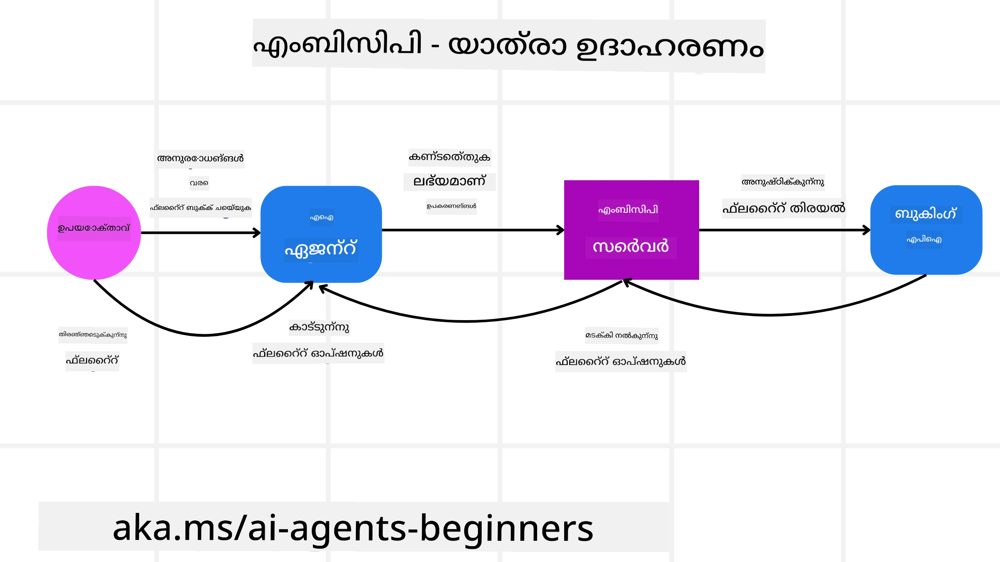
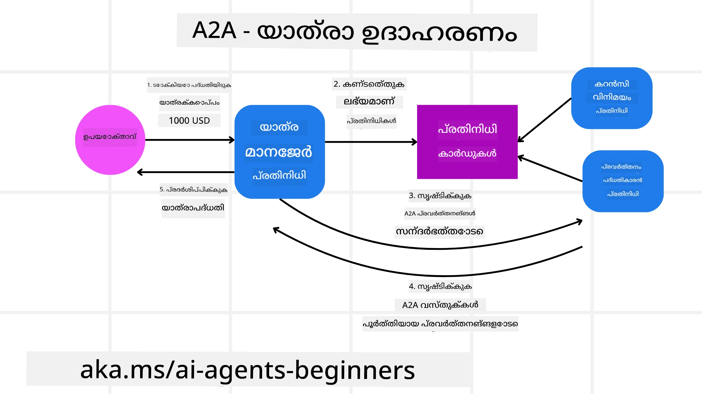
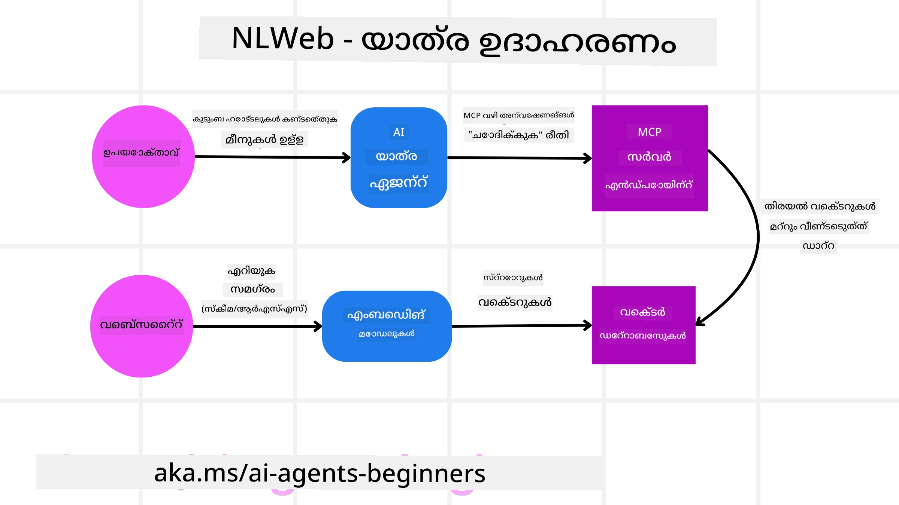

# ഏജന്റിക് പ്രോട്ടോക്കോളുകളുടെ ഉപയോഗം (MCP, A2A, NLWeb)

> _(ഈ ക്ലാസിന്റെ വീഡിയോ കാണാൻ മുകളില്‍ ചിത്രത്തെ ക്ലിക് ചെയ്യുക)_

AI ഏജന്റുകളുടെ ഉപയോഗം വർധിക്കുന്നതോടെയാണ്, സ്റ്റാൻഡേർഡൈസേഷൻ, സുരക്ഷ, തുറന്ന നവീകരണം എന്നിവ ഉറപ്പുവരുത്തുന്ന പ്രോട്ടോക്കോളുകളുടെ ആവശ്യകതയും കൂടുന്നത്. ഈ കുറിപ്പിൽ, ഈ ആവശ്യം നിറവേറ്റാൻ നോക്കുന്ന 3 പ്രോട്ടോക്കോളുകൾ പരിചയപ്പെടും - Model Context Protocol (MCP), Agent to Agent (A2A), Natural Language Web (NLWeb).

## പരിചയം

ഈ ലെസണിൽ നാം പാഠപുസ്തകമാക്കുന്നത്:

• **MCP** എങ്ങനെ AI ഏജന്റുകൾക്ക് ഉപയോക്തൃ ജോലികൾ പൂർത്തിയാക്കാൻ ബാഹ്യ ഉപകരണങ്ങളും ഡാറ്റയും ഉപയോഗിക്കാൻ അനുവദിക്കുന്നു.

• **A2A** എങ്ങനെ വിവിധ AI ഏജന്റുകൾ തമ്മിലുള്ള ആശയവിനിമയവും സഹകരണവും സജ്ജമാക്കുന്നു.

• **NLWeb** എങ്ങനെ ഏജന്റുകൾക്ക് വെബ്‌സൈറ്റിന്റെ ഉള്ളടക്കത്തെ കണ്ടെത്താനും അതിനോട് ഇടപെടാനും സ്വാഭാവിക ഭാഷാ ഇന്റർഫേസുകൾ നൽകുന്നു.

## പഠന ലക്ഷ്യങ്ങൾ

• AI ഏജന്റുകളുടെ രംഗത്ത് MCP, A2A, NLWeb എന്നിവയുടെ പ്രധാന ഉദ്ദേശവും പ്രയോജനങ്ങളും **കണ്ടുപിടിക്കുക**.

• ഓരോ പ്രോട്ടോക്കോളും LLMകൾ, ഉപകരണങ്ങൾ, മറ്റ് ഏജന്റുകൾ എന്നിവയ്ക്ക് ഇടയിലുള്ള ആശയവിനിമയവും ഇടപെടലും എങ്ങനെ സജ്ജമാക്കുന്നു എന്ന് **വ്യക്തമാക്കുക**.

• സങ്കീർണ്ണമായ ഏജന്റിക് സിസ്റ്റങ്ങൾ നിർമിക്കുന്നതിനുള്ള ഓരോ പ്രോട്ടോക്കോളിന്റെയും വ്യത്യസ്ത ഉണ്ടാക്കിയുമാത്രങ്ങളും **ബോധ്യപെടുത്തുക**.

## Model Context Protocol

**Model Context Protocol (MCP)** ഒരു തുറന്ന സ്റ്റാൻഡേർഡ് ആണു്, LLMകൾക്ക് സാങ്കേതിക പശ്ചാത്തലവും ഉപകരണങ്ങളും നൽകുന്നതിനുള്ള സാധാരണവഴി നൽകുന്നത്. ഇത് AI ഏജന്റുകൾക്ക് നിരവധിയായ ഡാറ്റ ഉറവിടങ്ങൾക്കും ഉപകരണങ്ങൾക്കും സ്ഥിരതയുള്ള രീതിയിൽ കണക്റ്റ് ആകാൻ സാധിക്കുന്ന "സാമാന്യ അഡാപ്റ്റർ" ആയി പ്രവർത്തിക്കുന്നു.

MCP യുടെ ഘടകങ്ങൾ, നേരിട്ട API ഉപയോഗത്തോടുളള താരതമ്യവും, AI ഏജന്റുകൾ MCP സെർവറിനെ എങ്ങനെ ഉപയോഗിക്കാമെന്ന് ഒരു ഉദാഹരണവും നോക്കാം.

### MCP അടിസ്ഥാന ഘടകങ്ങൾ

MCP **ക്ലയന്റ്-സെർവർ ആർക്കിടെക്ചർ** അടിസ്ഥാനത്തിലാണ് പ്രവർത്തിക്കുന്നത്. പ്രധാന ഘടകങ്ങൾ:

• **Hosts** LLM അപ്ലിക്കേഷനുകൾ ആണ് (ഉദാ: VSCode പോലൊരു കോഡ് എഡിറ്റർ) MCP സെർവറുമായി കണക്ഷനുകള്‍ ആരംഭിക്കുന്നത്.

• **Clients** ഹോസ്റ്റ് അപ്ലിക്കേഷനിലെ ഘടകങ്ങൾ ആണ്, സെർവറുമായി ഒരെണ്ണം ഒന്നായി കണക്ഷൻ സൂക്ഷിക്കുന്നത്.

• **Servers** പ്രത്യേക ശേഷികൾ വെളിപ്പെടുത്തുന്ന ലഘുവായ പ്രോഗ്രാമുകൾ ആണ്.

പ്രോട്ടോക്കോളിലുള്ള മൂന്ന് പ്രധാന പ്രിമിറ്റീവുകൾ MCP സെർവറിന്റെ കഴിവുകളാണ്:

• **Tools**: AI ഏജന്റുകൾക്ക് ഒരു പ്രവർത്തനം നടത്താൻ വിളിക്കാവുന്ന വ്യത്യസ്ത പ്രവർത്തനങ്ങളോ ഫംഗ്ഷനുകളോ. ഉദാ: ഒരു കാലാവസ്ഥാ സേവനം "get weather" ടൂൾ നൽകാം, അല്ലെങ്കിൽ ഒരു ഇ-കൊമേഴ്സ് സെർവർ "purchase product" ടൂൾ നൽകാം. MCP സെർവറുകൾ ഓരോ ടൂളിന്റെയും പേര്, വിവരണം, ഇൻപുട്ട്/ഔട്ട്പുട്ട് സ്കീമാ അവരുടെ കഴിവുകൾ ലിസ്റ്റിൽ പരസ്യപ്പെടുത്തുന്നു.

• **Resources**: MCP സെർവർ നൽകാവുന്ന വായിക്കാൻ മാത്രമുള്ള ഡാറ്റ ഇനങ്ങളും ഡോക്യുമെന്റുകളും, ക്ലയന്റുകൾ ആവശ്യാനുസരണം അത് വാങ്ങാം. ഫയൽ ഉള്ളടക്കം, ഡേറ്റാബേസ് റെക്കോർഡുകൾ, ലോഗ് ഫയലുകൾ എന്നിവയുടെ ഉദാഹരണങ്ങൾ. Resources ടെക്സ്റ്റ് (കോഡ്, JSON) അല്ലെങ്കിൽ ബൈനറി (ചിത്രങ്ങൾ, PDF) ആകാം.

• **Prompts**: മുൻകൂട്ടി നിർവ്വചിച്ച ടെംപ്ലേറ്റുകൾ, സങ്കീർണ്ണ പ്രവൃത്തി പ്രവാഹങ്ങൾക്ക് നിർദ്ദേശിച്ച പ്രോമ്പ്റ്റുകൾ നൽകുന്നു.

### MCP ന്റെ പ്രയോജനങ്ങൾ

MCP AI ഏജന്റുകൾക്ക് വലിയ സൗകര്യങ്ങൾ നൽകുന്നു:

• **ഡൈനാമിക് ടൂൾ കണ്ടെത്തൽ**: ഏജന്റുകൾക്ക് സെർവറിൽ നിന്നുള്ള ലഭ്യമായ ടൂളുകളുടെ ലിസ്റ്റും അവയുടെ വിവരണവും ഡൈനാമിക് ആയി ലഭിക്കുന്നു. പരമ്പരാഗത APIകൾ ഇൻറഗ്രേഷനുകൾക്കായി സ്റ്റാറ്റിക് കോഡിംഗ് ആവശ്യമായതിനാൽ API യിൽ മാറ്റം വരുമ്പോൾ കോഡ് അപ്‌ഡേറ്റുകൾ ആവശ്യമാണ്. MCP "ഒന്ന് ഇന്റഗ്രേറ്റ് ചെയ്‌ത്" സമീപനം കൊണ്ട് കൂടുതൽ അനുകൂലത നൽകുന്നു.

• **വിഭിന്ന LLMകൾക്കിടയിലുളള ഇന്ററോപ്പറബിലിറ്റി**: MCP വിവിധ LLMകൾക്കിടയിൽ പ്രവർത്തിക്കുന്നു, മികച്ച പ്രകടനത്തിനായി കോർ മോഡലുകൾ മാറ്റാൻ സ്വാതന്ത്യരം.

• **സ്റ്റാൻഡേർഡ് സെക്യൂരിറ്റി**: MCP സാധാരണ ഓഥന്റിക്കേഷൻ രീതിയും ഉൾപ്പെടുത്തിയിട്ടുണ്ട്, ഇത് MCP സെർവറുകൾക്ക് ആക്‌സസ് കൂട്ടുമ്പോൾ സ്കേഡാര്ബിലിറ്റി മെച്ചപ്പെടുത്തുന്നു. വ്യത്യസ്ത API കികൾ, ഓഥന്റിക്കേഷൻ തരം എന്നിവയുമായി ബുദ്ധിമുട്ടാതെ.

### MCP ഉദാഹരണം

ഒരു ഉപയോക്താവ് MCP ഉപയോഗിച്ച് പ്രവർത്തിക്കുന്ന AI അസിസ്റ്റന്റിന്റെ സഹായത്തോടെ ഒരു വിമാന ടിക്കറ്റ് ബുക്ക് ചെയ്യണമെന്ന് കരുതൂ.

1. **കണക്ഷൻ**: AI അസിസ്റ്റന്റ് (MCP ക്ലയന്റ്) ഒരു MCP സെർവറുമായി കണക്ട് ചെയ്യുന്നു, അത് ഒരു എയർലൈൻ നൽകുന്നു.

2. **ടൂൾ കണ്ടെത്തൽ**: ക്ലയന്റ് എയർലൈൻ MCP സെർവറിനോട് ചോദിക്കുന്നു: "നിങ്ങൾക്ക് ലഭ്യമായ ടൂളുകൾ ഏതൊക്കെ?" സെർവർ "search flights" , "book flights" പോലുള്ള ടൂളുകൾ നൽകുന്നു.

3. **ടൂൾ വിളിക്കൽ**: ഉപയോക്താവ് AI അസിസ്റ്റന്റോട് പറയുന്നു: "പോർട്ട്‌ലൻഡ് മുതൽ ഹൊനൊലൂലുവിലേക്ക് ഒരു ഫ്ലൈറ്റ് സേർച്ച് ചെയ്യു." AI അസിസ്റ്റന്റ് അതിനാവശ്യമായ പൊരുത്തമുള്ള പാരാമീറ്ററുകൾ (ഉത്ഭവം, ലക്ഷ്യം) ഉപയോഗിച്ച് "search flights" ടൂൾ MCP സെർവറിനു വിളിക്കുന്നു.

4. **പ്രവർത്തനം, പ്രതികരണം**: MCP സെർവർ, ഒരു റാപ്പർ എന്ന നിലയിൽ, എയർലൈൻയുടെ ബുക്കിംഗ് API യിൽ യഥാർത്ഥ കാൾ നടത്തുന്നു, JSON പോലെ ഫ്ലൈറ്റ് വിവരങ്ങൾ സ്വീകരിച്ച് AI അസിസ്റ്റന്റിലേക്ക് അയയ്ക്കുന്നു.

5. **കൂടുതൽ ഇടപെടലുകൾ**: ഉപയോക്താവ് ഒരു ഫ്ലൈറ്റ് തിരഞ്ഞെടുക്കുമ്പോൾ, അസിസ്റ്റന്റ് ഒരേ MCP സെര്വர் "book flight" ടൂൾ വിളിച്ച് ബുക്കിംഗ് പൂർത്തിയാക്കാം.

## Agent-to-Agent Protocol (A2A)

MCP LLM മെച്ചപ്പെട്ട ഉപകരണങ്ങളോടുളള ബന്ധത്തിലാണു ശ്രദ്ധ കേന്ദ്രീകരിക്കുന്നത്, എന്നാൽ **Agent-to-Agent (A2A) പ്രോട്ടോക്കോൾ** ആഗ്നേമിയായി AI ഏജന്റുകൾ തമ്മിലുള്ള ആശയവിനിമയം, സഹകരണം എന്നിവ സാധ്യമാക്കുന്നു. A2A വ്യത്യസ്ത സംഘടനകളിലെ, പരിസ്ഥിതികളിലെ, ടെക്ക് സ്റ്റാക്കുകളിലുള്ള AI ഏജന്റുകൾ തമ്മിൽ ബന്ധപ്പെടുത്തി ഒരു പൊതു ജോലിയിലെ ആർച്ച്‌വിർക്കുകൾ പൂർത്തിയാക്കാൻ സഹായിക്കുന്നു.

നാം ഇതിന്റെ ഘടകങ്ങളും പ്രയോജനങ്ങളും, നമ്മുടെ യാത്രാ ആപ്ലിക്കേഷനിലെ ഒരു ഉപയോഗ ഉദാഹരണവും പരിശോധിക്കാം.

### A2A അടിസ്ഥാന ഘടകങ്ങൾ

A2A ഉപയോക്താവിന്റെ ഉപജോലി പൂർത്തിയാക്കുന്നതിന് ഏജന്റുകൾ തമ്മിലുള്ള ആശയവിനിമയം, സഹകരണം എന്നിവക്ക് ദৃষ্টি നൽകുന്നു. പ്രോട്ടോക്കോളിന്റെ ഓരോ ഭാഗവും ഇതിന് സഹായിക്കുന്നു:

#### Agent Card

MCP സെർവർ ടൂൾ ലിസ്റ്റ് പങ്കിടുന്നതുപോലെ, Agent Card ഇതുൾപ്പെടുന്നു:

- ഏജന്റിന്റെ പേര്.

- അത് പൂർത്തിയാക്കുന്ന പൊതു ജോലികളുടെ വിവരണം.

- മറ്റേതെങ്കിലും ഏജന്റുകളോ മനുഷ്യ ഉപയോക്താക്കളോ ആ എജന്റ് വിളിക്കുന്നത് എപ്പോൾ, എന്തിനെന്ന് മനസ്സിലാക്കാൻ സഹായിക്കുന്ന പ്രത്യേക നൈപുണ്യങ്ങളുടെ ലിസ്റ്റും വിവരണവുമുണ്ട്.

- ഏജന്റിന്റെ നിലവിലെ Endpoint URL.

- പതിപ്പും സ്റ്റ്രീമിംഗ് പ്രതികരണങ്ങളും പുഷ് അറിയിപ്പുകളും പോലുള്ള എജന്റിന്റെ ശേഷികളും.

#### Agent Executor

Agent Executor ആണ് **ഉപയോക്തൃ ചാറ്റിന്റെ പശ്ചാത്തലം ദൂരഒഴുകുന്ന ഏജന്റിന് കൈമാറുന്നത്**. ദൂരഏജന്റ് പൂർത്തിയാക്കേണ്ട ജോലിയബോധ്യപ്പെടാൻ ഇത് ആവശ്യമാണ്. A2A സെർവറിലേ, ഏജന്റ് സ്വന്തം LLM ഉപയോഗിച്ച് വരുന്ന അഭ്യർത്ഥനകൾ വിശകലനം ചെയ്ത് സ്വന്തം ഉപകരണങ്ങൾ ഉപയോഗിച്ചു ജോലികൾ നിർവ്വഹിക്കുന്നു.

#### Artifact

ദൂരഏജന്റ് ആവശ്യപ്പെട്ട ജോലികൾ പൂർത്തിയാക്കിയശേഷം, അതിന്റെ ഫലം ഒരു ആർട്ടിഫാക്ടായി രൂപപ്പെടുത്തുന്നു. ആർട്ടിഫാക്ട് **ഏജന്റ് ചെയ്ത ജോലിയുടെയും ഫലത്തിന്റെ വിവരണവും** പ്രോട്ടോക്കോൾ വഴി അയച്ച ടെക്സ്റ്റ് പശ്ചാത്തലവും ഉൾക്കൊള്ളുന്നു. ആർട്ടിഫാക്ട് അയച്ചശേഷം, ദൂരഏജന്റുമായി കണക്ഷൻ അടയ്ക്കുന്നു വീണ്ടും ആവശ്യമായപ്പോൾ തുറക്കും.

#### Event Queue

അപ്‌ഡേറ്റുകളും സന്ദേശങ്ങളും കൈകാര്യംചെയ്യാൻ ഉപയോക്ത്യമാണ്. ദീരഘ സമയമുള്ള ജോലികൾ പൂർത്തിയാകുന്നത് വരെ ഏജന്റുകൾ തമ്മിലുള്ള കണക്ഷൻ അടയ്ക്കാതിരിക്കാൻ ഇത് പ്രധാനമാണ്.

### A2A ന്റെ പ്രയോജനങ്ങൾ

• **ഉയർന്ന സഹകരണം**: വ്യത്യസ്ത വിതരണക്കാർ, പ്ലാറ്റ്ഫോമുകൾ എന്നിവരിൽ നിന്നുള്ള ഏജന്റുകൾ തമ്മിൽ ആശയവിനിമയം നടത്തുകയും തൊഴിൽ പങ്കുവെക്കുകയുമായി സൃഷ്ടിവൈറ്റ് ഓട്ടോമേഷൻ സാധ്യമാണ്.

• **മോഡൽ തിരഞ്ഞെടുക്കൽ സ്വാതന്ത്യരം**: ഓരോ A2A ഏജന്റും സ്വന്തം LLM തിരഞ്ഞെടുക്കാൻ കഴിയും, MCP യുടെ ഒറ്റ LLM കണക്ഷനുമായി താരതമ്യിച്ച് ഇവയ്ക്ക് ഓരോ ഏജന്റിനും ഒപ്റ്റിമൈസ് ചെയ്ത മോഡലുകൾ ഉപയോഗിക്കാം.

• **ഇൻബിൽറ്റ് ഓത്തന്റിക്കേഷൻ**: A2A പ്രോട്ടോക്കോളിൽ തന്നെ ഓത്തന്റിക്കേഷൻ സംയുക്തമായിട്ടുണ്ട്, ഏജന്റ് ഇടപെടലുകളിൽ ഉറപ്പുള്ള സുരക്ഷയാണ് നൽകുന്നത്.

### A2A ഉദാഹരണം

നമ്മുടെ യാത്രാ ബുക്കിംഗ് പരിചാരികയും വിസ്തൃതമാക്കാം, ഇത്തവണ A2A ഉപയോഗിച്ച്.

1. **ഉപയോക്താവിന്റെ അഭ്യർത്ഥന മൾട്ടി-ഏജന്റിനു**: ഉപയോക്താവ് "Travel Agent" A2A ക്ലയന്റ്/ഏജന്റുമായി ആശയവിനിമയം നടത്തുന്നു, ഉദാ: "അടുത്ത വാരത്ത് ഹൊനൊലൂലുവിൽ മുഴുവൻ ട്രിപ്പ് ബുക്ക് ചെയ്യുക, വിമാനങ്ങൾ, ഹോട്ടൽ, കാറിന്റെ വാടക ഉൾപ്പെടെ."

2. **യാത്രാ ഏജന്റ് ഏകീകരണം**: Travel Agent ഈ പ്രായാസകരമായ അഭ്യർത്ഥന സ്വീകരിക്കുന്നു. LLM ഉപയോഗിച്ച് വിചാരിച്ച് മറ്റ് സ്പെഷ്യലൈസ്ഡ് ഏജന്റുകളുമായി കൂട്ടുപണിക്ക് തയ്യാറാകുന്നു.

3. **ഏജന്റ് ഇടപെടൽ**: Travel Agent A2A പ്രോട്ടോക്കോൾ ഉപയോഗിച്ച് താഴെയുള്ള ഏജന്റുകളെ (ഇവళ్ళ് വ്യത്യസ്ത കമ്പനികൾ സൃഷ്ടിച്ച "Airline Agent", "Hotel Agent", "Car Rental Agent") ബന്ധിപ്പിക്കുന്നു.

4. **ജോലി ചുമത്തി പൂർത്തിയാക്കൽ**: Travel Agent ആവശ്യമായ ജോലികൾ വിവിധ സ്പെഷ്യലൈസ്ഡ് ഏജന്റുകളിലേക്ക് അയയ്ക്കുന്നു (ഉദാ: "ഹൊനൊലൂലുവിലേക്ക് വിമാനങ്ങൾ കണ്ടുപിടിക്കുക", "ഹോട്ടൽ ബുക്ക് ചെയ്യുക", "കാർ വാടകയ്ക്ക് എടുക്കുക"). ഓരോ ഏജന്റും, സ്വന്തം LLM ഉപയോഗിച്ച്, തങ്ങളുടെ ഉപകരണങ്ങളും MCP സെർവർസും ഉപയോഗിച്ച് ജോലികൾ നിർവ്വഹിക്കുന്നു.

5. **ഫലങ്ങൾ സംയോജനം**: എല്ലാ താഴെയുള്ള ഏജന്റുകളും ജോലികൾ പൂർത്തിയാക്കിയതിന് ശേഷം, Travel Agent ഫലങ്ങൾ (ഫ്ലൈറ്റ് വിശദാംശങ്ങൾ, ഹോട്ടൽ സ്ഥിരീകരണം, കാറിന്റെ ബുക്കിംഗ്) ചുറ്റപ്പെട്ട മറുപടി രൂപപ്പെടുത്തുകയും ഉപയോക്താവിന് അയയ്ക്കുകയും ചെയ്യുന്നു.

## Natural Language Web (NLWeb)

ഇന്റർനെറ്റിലുള്ള വിവരങ്ങളും ഡാറ്റയും ലഭിക്കാൻ വെബ്‌സൈറ്റുകൾ ദീര്‍ഘകാലം പ്രധാന മാർഗം ആയിട്ടുണ്ട്.

NLWeb ന്റെ ഘടകങ്ങൾ, പ്രയോജനങ്ങൾ, നമ്മുടെ യാത്രാ ആപ്ലിക്കേഷന്റെ ഉദാഹരണമായി എങ്ങനെ NLWeb പ്രവർത്തിക്കുന്നു എന്നു നോക്കാം.

### NLWeb ഘടകങ്ങൾ

- **NLWeb അപ്ലിക്കേഷൻ (കോർ സേവർ കോഡ്)**: സ്വാഭാവിക ഭാഷാ ചോദ്യങ്ങൾ സംസ്‌കരിക്കുന്ന സംവിധാനം. പ്ലാറ്റ്ഫോംയുടെ വിവിധ ഭാഗങ്ങളെ ബന്ധിപ്പിച്ച് മറുപടികൾ സൃഷ്ടിക്കുന്നു. വെബ്‌സൈറ്റിന്റെ സ്വാഭാവിക ഭാഷാ ഫീച്ചറുകളെ ചാലിപ്പിക്കുന്ന **ഇഞ്ചിൻ** എന്ന നിലയിൽ ഇതിനെ കരുതാം.

- **NLWeb പ്രോട്ടോക്കോൾ**: വെബ്സൈറ്റുമായി സ്വാഭാവികഭാഷാ ഇടപെടലിനുള്ള **മൂലഭൂത നിബന്ധനകൾ**. JSON ഫോർമാറ്റിൽ (സാധാരണ Schema.org ഉപയോഗിച്ചു) മറുപടി നൽകുന്നു.  HTML പോലെ ഓൺലൈൻ ഡോക്യുമെന്റുകൾ പങ്കിടുന്നതിന് സൌകര്യമനുമതി ചെയ്‌ത പോലെ, ഇത് “AI വെബ്” നു ലളിതമായ അടിസ്ഥാനം സൃഷ്ടിക്കുന്നു.

- **MCP സെർവർ (Model Context Protocol എന്റ്പോയിന്റ്)**: ഓരോ NLWeb സെപ്റ്റപ്പും **MCP സെർവർ** ആയി പ്രവർത്തിക്കുന്നു. അതിലൂടെ മറ്റു AI സിസ്റ്റങ്ങളുമായി ടൂളുകളും ഡാറ്റയും പങ്കുവെക്കാൻ കഴിയും. പ്രായോഗികമായി, ഈ സൈറ്റിന്റെ ഉള്ളടക്കം, കഴിവുകൾ AI ഏജന്റുകൾക്ക് ഉപയോഗിക്കാൻ സാധിക്കുന്നതാണ്, സൈറ്റ് വലതുവശത്തെ “ഏജന്റ് എക്കോസിസ്റ്റം” ഭാഗമാകുന്നു.

- **എംബെഡിങ് മോഡലുകൾ**: വെബ്‌സൈറ്റ് ഉള്ളടക്കം സംഖ്യാത്മക പ്രതിനിധികളായി മാറ്റാൻ ഉപയോഗിക്കുന്ന മോഡലുകൾ (വക്ടർസ്). കമ്പ്യൂട്ടർ താരതമ്യം ചെയ്യാനും തിരയാനും ഇത് സഹായിക്കുന്നു. പ്രത്യേക ഡേറ്റാബേസിൽ സൂക്ഷിക്കുന്നു. ഉപയോക്താക്കൾ സ്വന്തമായി ഏഴ് എംബെഡിങ് മോഡൽ തിരഞ്ഞെടുക്കാം.

- **വക്ടർ ഡേറ്റാബേസ് (തിരയൽ സംവിധാന)**: വെബ്‌സൈറ്റ് ഉള്ളടക്കത്തിന്റെ എംബെഡിങ്ങുകൾ ഈ ഡേറ്റാബേസിൽ സൂക്ഷിക്കുന്നു. ആരെങ്കിലും ചോദ്യം ചോദിക്കുമ്പോൾ NLWeb അതിലെ ഏറ്റവും ബാധകമായ വിവരങ്ങൾ വേഗത്തിൽ കണ്ടെത്താൻ ഇവിടെ തിരയുന്നു. പ്രശ്നങ്ങൾക്ക് ഏറ്റവും ഉൾപ്പെടുന്ന ഉത്തരങ്ങൾ similarity അനുസരിച്ച് ക്രമീകരിച്ചാകും NLWeb ഭിന്ന വക്ടർ സ്റ്റോറേജ് സിസ്റ്റങ്ങൾ (Qdrant, Snowflake, Milvus, Azure AI Search, Elasticsearch) ഉപയോഗിക്കുന്നു.

### NLWeb ഉദാഹരണം

നമ്മുടെ യാത്രാ ബുക്കിംഗ് വെബ്‌സൈറ്റ് വീണ്ടും പരിഗണിക്കാം, ഇത്തവണ NLWeb ഉപയോഗിക്കുന്നു.

1. **ഡാറ്റ ഇൻജെക്ഷൻ**: യാത്രാ വെബ്‌സൈറ്റിലെ നിലവിലുള്ള ഉൽപ്പന്ന പട്ടികകൾ (ഫ്ലൈറ്റ് ലിസ്റ്റിംഗ്, ഹോട്ടൽ വിവരണങ്ങൾ, ടൂർ പാക്കേജുകൾ) Schema.org ഫോർമാറ്റിൽ അല്ലെങ്കിൽ RSS ഫീഡുകൾ വഴി ലോഡ് ചെയ്യുന്നു. NLWeb ടൂളുകൾ ഈ ഘടനാപരമായ ഡാറ്റ സ്വീകരിച്ച് എംബെഡിങ്ങുകൾ സൃഷ്ടിക്കുകയും പ്രാദേശിക അല്ലെങ്കിൽ ദൂരവാസിയായ വക്ടർ ഡേറ്റാബേസിൽ സൂക്ഷിക്കുകയും ചെയ്യുന്നു.

2. **സ്വാഭാവിക ഭാഷാ ക്വറിയ്ക്ക് (മനുഷ്യന്)**: ഉപയോക്താവ് വെബ്‌സൈറ്റ് സന്ദർശിച്ച് മെനുക്കൾ തിരയാതെ ഒരു ചാറ്റ് ഇന്റർഫേസിൽ ടൈപ്പ് ചെയ്യുന്നു: "അടുത്ത വാരത്തേക്ക് ഹൊനൊലൂലുവിലെ ഒരു കുടുംബസൗഹൃദ ഹോട്ടൽ പൂൾ ഉപയോഗ സൗകര്യവുമുണ്ടായിട്ട് കണ്ടുപിടിക്കൂ".

3. **NLWeb പ്രോസസിംഗ്**: NLWeb അപ്ലിക്കേഷൻ ഈ ചോദ്യം സ്വീകരിക്കുന്നു. LLM ന്റെ സഹായത്തോടെ മനസ്സിലാക്കുകയും, ഒപ്പം വക്ടർ ഡേറ്റാബേസിൽ നിന്ന് ബാധകമായ ഹോട്ടൽ പട്ടികകൾ തിരയുകയും ചെയ്യുന്നു.

4. **കൃത്യമായ ഫലങ്ങൾ**: LLM സെർച്ച് ഫലങ്ങൾ വായിച്ച് "കുടുംബസൗഹൃദം", "പൂൾ", "ഹൊനൊലൂലു" എന്നനുസരിച്ച് ഏറ്റവും യോജിച്ച ഹോട്ടലുകൾ കണ്ടെത്തുന്നു, അതിനു ശേഷം സ്വാഭാവിക ഭാഷയിൽ മറുപടി തയ്യാറാക്കുന്നു. നിർമാണാപരമായ വിവരങ്ങൾ ഒഴിവാക്കി വെബ്‌സൈറ്റിലെ യഥാർത്ഥ ഹോട്ടലുകൾ ഉൽപ്പന്ന പട്ടികയിൽ നിന്ന് കാണിച്ചുതരുന്നു.

5. **AI ഏജന്റ് ഇടപെടൽ**: NLWeb MCP സെർവറായി പ്രവർത്തിക്കുന്നതിനാൽ, ഒരു ബാഹ്യ AI യാത്രാ ഏജന്റും ഈ വെബ്‌സൈറ്റ് NLWeb സെഷനുമായി കണക്റ്റ് ചെയ്ത് `ask` MCP മെത്തഡ് ഉപയോഗിച്ച് നേരിട്ട് വെബ്‌സൈറ്റിനോട് ചോദ്യം ചോദിക്കാം: `ask("ഹൊനൊലൂലു പ്രദേശത്തു ഹോട്ടല്‍ ശിപാര്‍ശ ചെയ്യുന്ന വെഗന്‍ സൗഹൃദമായ റെസ്റ്റോറന്റുകളുണ്ടോ?")`. NLWeb ഇത് പ്രോസസ്സ് ചെയ്ത് (ലോഡ് ചെയ്‌തെങ്കിൽ) റെസ്റ്റോറന്റ് വിവരങ്ങളുടെ ഡേറ്റാബേസ് പിന്തുണയ്ക്കും, ഘടനയടങ്ങിയ JSON മറുപടി നൽകും.

### MCP/A2A/NLWeb കുറിച്ചും കൂടുതൽ ചോദിക്കേണ്ടതുണ്ടോ?

[Microsoft Foundry Discord](https://aka.ms/ai-agents/discord) ൽ ചേരൂ, മറ്റ് പഠിതാക്കളെ കാണൂ, ഓഫീസ് വരുത്തൽ സന്ദർശിക്കൂ, AI ഏജന്റുകൾക്ക് ചോദ്യങ്ങൾ ചോദിക്കൂ.

## റിസോഴ്‌സുകൾ

- [ആരംഭകർക്കായ MCP](https://aka.ms/mcp-for-beginners)  
- [MCP ഡോക്യൂമെന്റേഷൻ](https://learn.microsoft.com/python/api/overview/azure/ai-projects-readme)
- [NLWeb Repo](https://github.com/nlweb-ai/NLWeb)
- [Microsoft Agent Framework](https://aka.ms/ai-agents-beginners/agent-framewrok)

---

<!-- CO-OP TRANSLATOR DISCLAIMER START -->
**പരാമർശം**:
ഈ പ്രമാണം എ ഐ വിവർത്തന സേവനമായ [കോ-ഓപ്പ് ട്രാൻസ്‌ലേറ്റർ](https://github.com/Azure/co-op-translator) ഉപയോഗിച്ച് പരിഭാഷപ്പെടുത്തിയതാണ്. നമുക്ക് കൃത്യത ഉറപ്പാക്കാൻ ശ്രമിക്കുന്നുണ്ടെങ്കിലും, സ്വയം പ്രവർത്തിക്കുന്ന വിവർത്തനങ്ങളിൽ പിഴവുകളും അകൃത്യതകളും ഉണ്ടാകാമെന്ന് ശ്രദ്ധിക്കുക. പ്രമാണത്തിന്റെ ഉള്ളത്തെ ഭാഷയിലുള്ള ഓരിജിനൽ പ്രമാണം മൗലിക ഉറവിടമായി കണക്കാക്കപ്പെടണം. നിർണ്ണായക വിവരങ്ങൾക്ക് പ്രൊഫഷണൽ മനുഷ്യ വിവർത്തനം ശിപാർശ ചെയ്യപ്പെടുന്നു. ഈ വിവർത്തനത്തിന്റെ ഉപയോഗം മൂലം ഉണ്ടായേക്കാവുന്ന തെറ്റിദ്ധാരണകൾക്ക് ഞങ്ങൾ ഉത്തരവാദികളല്ല.
<!-- CO-OP TRANSLATOR DISCLAIMER END -->