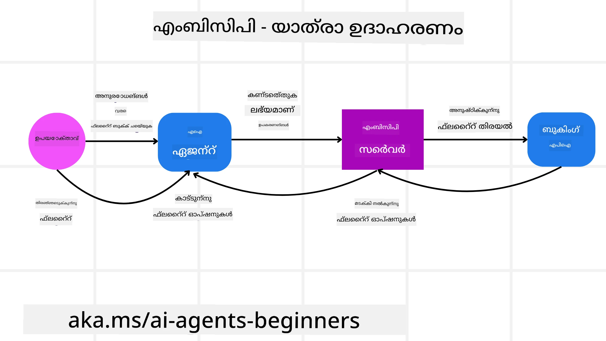
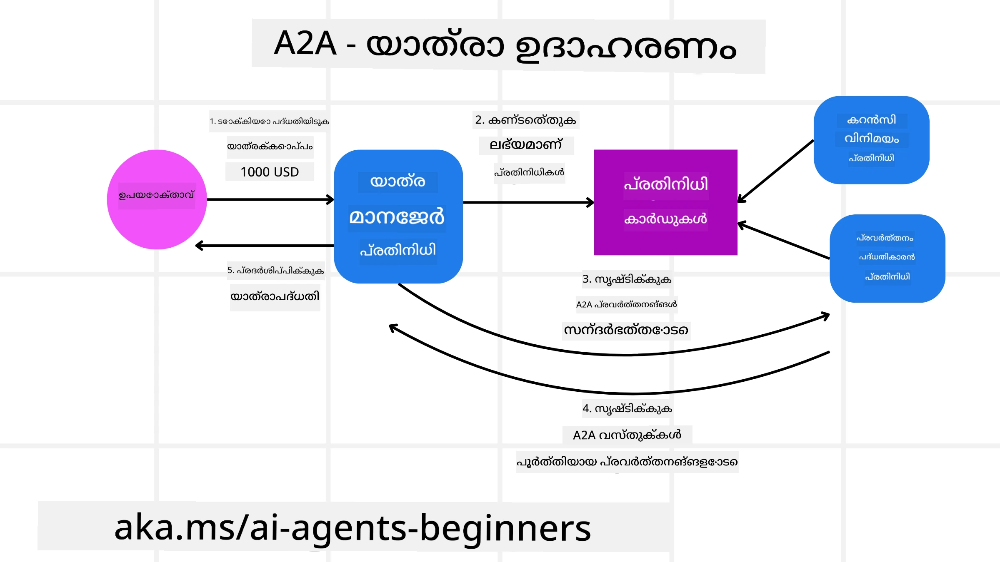
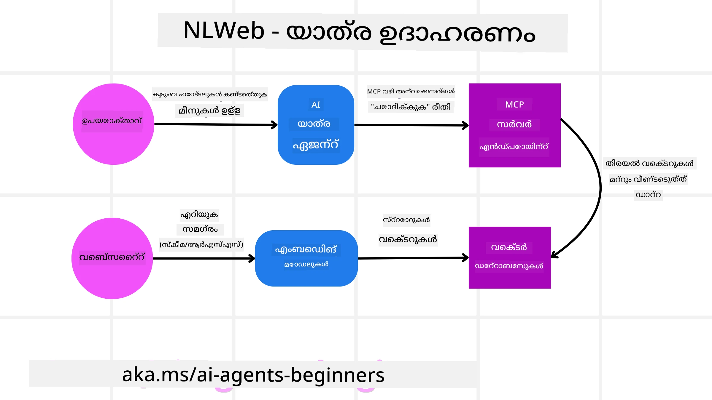

# ഏജന്റിക് പ്രോട്ടോകോളുകൾ ഉപയോഗിക്കുക (MCP, A2A, NLWeb)

> _(ഈ പാഠത്തിന്റെ വീഡിയോ കാണുന്നതിന് മുകളിൽ ഉള്ള ചിത്രം ക്ലിക്ക് ചെയ്യുക)_

AI ഏജന്റുകളെന്നതിന്റെ ഉപയോഗം വര്‍ധിക്കുന്നത് പോലെ പതിവ്, സുരക്ഷ, തുറന്ന പുതുമക്കായി പ്രോട്ടോകോളുകൾ ആവശ്യമാണ്. ഈ പാഠത്തിൽ, ആ ആവശ്യങ്ങൾ നിറവേറ്റാന്‍ ഉദ്ദേശിക്കുന്ന 3 പ്രോട്ടോകോളുകൾ പരിഗണിക്കും - മോഡല്‍ കോൺടെക്സ്റ്റ് പ്രോട്ടോകോൾ (MCP), ഏജന്റ് ടു ഏജന്റ് (A2A) এবং നാചുറൽ ലാംഗ്വേജ് വെബ് (NLWeb).

## പരിചയം

ഈ പാഠത്തിൽ ഞങ്ങൾ പരിശോധിക്കുന്നത്:

• എങ്ങനെ **MCP** AI ഏജന്റുകള്‍ക്ക് ബാഹ്യ ടൂളുകളും ഡാറ്റയും ആക്‌സസ് ചെയ്ത് ഉപയോക്തൃ പ്രവൃത്തികൾ പൂർത്തിയാക്കാന്‍ സഹായിക്കുന്നു.

• എങ്ങനെ **A2A** വ്യത്യസ്ത AI ഏജന്റുകൾ തമ്മില്‍ ആശയവിനിമയം നടത്താനും സഹകരിക്കാനും സഹായിക്കുന്നു.

• എങ്ങനെ **NLWeb** പ്രകൃതിഭാഷാനുപയോഗ ഇന്റർഫേസുകളെ ഏത് വെബ്സൈറ്റിലും കൊണ്ടുവരുന്നു, വഴി AI ഏജന്റുകൾ അവിടുത്തെ ഉള്ളടക്കത്തെ കണ്ടെത്തുകയും യോജിപ്പിക്കുകയും ചെയ്യുന്നു.

## പഠന ലക്ഷ്യങ്ങള്

• AI ഏജന്റുകളുടെ പാരിസ്ഥിതികത്തില്‍ MCP, A2A, NLWeb ന്റെ മുഖ്യ ലക്ഷ്യങ്ങളും ഗുണങ്ങളും **അറിയുക**.

• ഓരോ പ്രോട്ടോകോൾ LLMs, ടൂളുകൾ, മറ്റ് ഏജന്റുകൾ തമ്മിലുള്ള ആശയവിനിമയവും ഇടപെടലും എങ്ങനെ സുഖകരമാക്കുന്നു എന്ന് **വിവരണം ചെയ്യുക**.

• സങ്കീർത്തമായ ഏജന്റിക് സിസ്റ്റങ്ങൾ രൂപപ്പെടുത്തുന്നതില്‍ ഓരോ പ്രോട്ടോകോള്‍ വഹിക്കുന്ന വ്യത്യസ്ത പാത്രങ്ങൾ **ഗണിക്കുക**.

## മോഡല്‍ കോൺടെക്സ്റ്റ് പ്രോട്ടോകോൾ

**മോഡല്‍ കോൺടെക്സ്റ്റ് പ്രോട്ടോകോൾ (MCP)** ഒരു തുറന്ന മാനദണ്ഡമാണ്, അത് ആപ്ലിക്കേഷനുകള്‍ക്ക് LLM ಗಳിലേക്ക് കോൺടെക്സ്റ്റും ടൂളുകളും നൽകാനുള്ള സ്റ്റാൻഡേർഡൈസ്ഡ് മാർഗം സൃഷ്ടിക്കുന്നു. ഇത് AI ഏജന്റുകൾ സ്ഥിരതയോടെ കണക്റ്റ് ചെയ്യാനാകുന്ന വിവിധ ഡാറ്റാ സ്രോതസ്സ്-ടൂളുകൾക്ക് "സാർവ്വത്രിക അഡാപ്റ്റർ" എന്ന രീതിയില്‍ പ്രവർത്തിക്കുന്നു.

MCPയുടെ ഘടകങ്ങൾ, നേരിട്ട് API ഉപയോഗിക്കാനുണ്ടാകുന്ന ഗുണങ്ങൾ, AI ഏജന്റുകൾ MCP സെർവറിനെ എങ്ങനെ ഉപയോഗിക്കാം എന്ന ഉദാഹരണം നോക്കാം.

### MCP കോർ ഘടകങ്ങൾ

MCP ഒരു **ക്ലയന്റ്-സേർവർ ആർക്കിടെക്ചർ** ആയി പ്രവർത്തിക്കുന്നു, പ്രധാന ഘടകങ്ങൾ:

• **ഹോസ്റ്റുകൾ** LLM ആപ്ലിക്കേഷനുകളും (ഉദാഹരണത്തിന് VSCode പോലുള്ള കോഡ് എഡിറ്റർ) MCP സെർവറിലേക്ക് കണക്ഷനുകൾ ആരംഭിക്കുന്നു.

• **ക്ലയന്റുകൾ** ഹോസ്റ്റ് ആപ്ലിക്കേഷനിൽ ഉള്ള ഘടകങ്ങളാണ്, സെർവർകളുമായി ഒന്ന് എൻ ഒന്ന് കണക്ഷനുകൾ നിലനിർത്തുന്നു.

• **സേർവറുകൾ** പ്രത്യേക കഴിവുകൾ പ്രദാനം ചെയ്യുന്ന ലൈറ്റ് വെയിറ്റ് പ്രോഗ്രാമുകളാണ്.

പ്രോട്ടോക്കॉलിൽ മൂന്നു പ്രധാന പ്രിമിറ്റീവ്സ് ഉൾക്കൊള്ളുന്നു, അവ MCP സേർവറിന്റെ കഴിവുകളാണ്:

• **ടൂളുകൾ**: AI ഏജന്റ് ഒരു ഫംഗ്ഷൻ ചെയ്‌യാൻ വിളിക്കാവുന്ന വ്യക്തമായ പ്രവർത്തനങ്ങൾ. ഉദാഹരണത്തിന്, വേതർ സർവീസ് "get weather" ടൂൾ പ്രദാനം ചെയ്തേക്കാം, ഇ-കൊമേഴ്സ് സെർവർ "purchase product" ടൂൾ നൽകും. MCP സേർവറുകൾ ഓരോ ഉപകരണത്തിന്റെ പേര്, വിവരണം, ഇൻപുട്ട്/ഔട്ട്പുട്ട് സ്കീമ എന്നിവ അവരുടെ കഴിവുകളിൽ പ്രഖ്യാപിക്കുന്നു.

• **റിസോഴ്സുകൾ**: MCP സെർവറുകൾ നൽകാൻ കഴിവുള്ള ഓൺ-ഡിമാൻഡ് വായിക്കാൻ മാത്രം കഴിയുന്ന ഡാറ്റാ ഐറ്റങ്ങൾ അല്ലെങ്കിൽ ഡോക്യൂമെന്റുകൾ. ഉദാഹരണങ്ങൾക്ക് ഫയൽ ഉള്ളടക്കം, ഡാറ്റാബേസ് റെക്കോർഡുകൾ, ലോങ് ഫയലുകൾ. റിസോഴ്സുകൾ കൂടി ടക്‌സ് (കോഡ് / JSON) അല്ലെങ്കിൽ ബൈനറി (ഇമേജുകൾ, PDF-കൾ) ആകാം.

• **പ്രോമ്പ്റ്റുകൾ**: മുമ്പ് നിർവചിച്ച ടെംപ്ലേറ്റുകൾ, ഇത് മുന്നറിയിപ്പുകൾ നൽകുന്നു, കൂടുതൽ സങ്കീ断 workflows സൃഷ്ടിക്കാൻ സഹായിക്കുന്നു.

### MCP ന്റെ ഗുണങ്ങൾ

MCP AI ഏജന്റുകൾക്ക് പ്രധാന ഗുണങ്ങൾ:

• **ഡൈനാമിക് ടൂൾ തിരിച്ചറിയല്‍**: ഏജന്റുകൾ ഒരു സെർവറിൽ നിന്നുള്ള ടൂൾ പട്ടികയും അവയുടെ വിശദീകരണവും ലഭിക്കും. പഴയ APIs സ്ഥിരം കോഡിംഗ് ആവശ്യപ്പെടുന്നുണ്ടെങ്കിൽ, MCP "ഒരിക്കൽ ഇൻ‌റ്റഗ്രേറ്റ്" മാർഗം വാഗ്ദാനം ചെയ്യുന്നു, കൂടീൾക്കലും മാറ്റഭേദകനാണ്.

• **LLMs-ഇൻറെ ഇന്റർ ഓപ്പറബിലിറ്റി**: MCP വ്യത്യസ്ത LLMs-നോടൊപ്പം ജോലിചെയ്യുന്നു, നല്ല പ്രകടനത്തിനായി മുകളിൽ നിന്നുള്ള മോഡലുകൾ എളുപ്പത്തിൽ മാറ്റാം.

• **സ്റ്റാൻഡേർഡൈസ്ഡ് സെക്യൂരിറ്റി**: MCP ഒരു സ്റ്റാൻഡേർഡ് ഓത്തൻറിക്കേഷൻ ഫലപ്രദമായ രീതിയാണ്, പുതിയ MCP സെർവറുകൾ ചേർക്കുന്നതിന് സ്കെയിലബിലിറ്റി മെച്ചപ്പെടുത്തുന്നു. അതിവൈവിധ്യമാർന്ന API കീകൾ, ഓത്തൻറിക്കേഷൻ തരം നിയന്ത്രിക്കുന്നതിനേക്കാൾ ഇത് ലളിതമാണ്.

### MCP ഉദാഹരണം

ഒരു ഉപയോക്താവ് MCP-ആധാരിത AI സഹായി ഉപയോഗിച്ച് ഒരു വിമാനം ബുക്ക് ചെയ്യും എന്ന് കരുതുക.

1. **കണക്ഷൻ**: AI അസിസ്റ്റന്റ് (MCP ക്ലയന്റ്) ഒരു എയർലൈൻ നൽകുന്ന MCP സെർവറുമായി കണക്ട് ചെയ്യുന്നു.

2. **ടൂൾ കണ്ടെത്തല്‍**: ക്ലയന്റ് എയർലൈൻ MCP സെർവറോട് ചോദിക്കുന്നു, "നിങ്ങൾക്കുളള ടൂളുകൾ എന്തെല്ലാം?" സെർവർ, "search flights", "book flights" പോലെയുള്ള ടൂളുകൾ തിരിച്ചറിയുന്നു.

3. **ടൂൾ വിളിക്കൽ**: ഉപയോക്താവ് "പോർട്ട്ലാൻഡിൽ നിന്നു ഹൊനുലുലുവിലേക്ക് ഒരു വിമാനം തിരയൂ" എന്ന് AI അസിസ്റ്റന്റിനോട് പറയുന്നതു പോലെ, AI അസിസ്റ്റന്റ് ഇതിനു MCP സെർവറിൽ "search flights" ടൂൾ കോൾ ചെയ്യുന്നു ആവശ്യമായ പാരാമീറ്ററുകൾ (ഓറിയ്ജിൻ, ലക്ഷ്യം) സമർപ്പിച്ച്.

4. **നടപ്പാക്കൽ & പ്രതികരണം**: MCP സെർവർ എയർലൈൻ‌റെ ഇന്റേണൽ ബുക്കിംഗ് API യുമായി ബന്ധം സ്ഥാപിച്ച്, സർവീസ് റിക്ക്വസ്റ്റ് പൂർത്തിയാക്കി ഫ്ലൈറ്റ് ഡാറ്റ (JSON) AI അസിസ്റ്റന്റിലേയ്ക്ക് അയയ്ക്കുന്നു.

5. **കൂടുതൽ ഇടപെടൽ**: AI അസിസ്റ്റന്റ് വ്യത്യസ്ത വിമാന ഓപ്ഷനുകൾ പ്രദർശിപ്പിക്കുന്നു. ഉപയോക്താവ് ഒരു ഹെഡ് തിരഞ്ഞെടുക്കുമ്പോൾ, AI "book flight" ടൂൾ വിളിച്ചുകൊണ്ട് ബുക്കിംഗ് പൂർത്തിയാക്കും.

## ഏജന്റ് ടു ഏജന്റ് പ്രോട്ടോക്കോൾ (A2A)

MCP LLMs-നെ ടൂളുകളുമായി ബന്ധിപ്പിക്കുന്നതിൽ മേധാവിത്വം വഹിക്കുന്നു, എന്നാൽ **Agent-to-Agent (A2A) പ്രോട്ടോക്കോൾ** വ്യത്യസ്ത AI ഏജന്റുകൾ തമ്മിലുള്ള ആശയവിനിമയവും സഹകരണവും സജീവമാക്കുന്നു. A2A വ്യത്യസ്ത സംഘടനകളിലും പരിസരങ്ങളിലും ടെക് സ്റ്റാക്കിലും AI ഏജന്റുകൾ ബന്ധിപ്പിച്ച് കൂട്ടായ്മ സാധ്യമാക്കുന്നു.

A2Aയുടെ ഘടകങ്ങളും ഗുണങ്ങളും, നമ്മുടെ യാത്രാ ആപ്ലിക്കേഷനിലെ ഒരു ഉദാഹരണം പരിശോധിക്കാം.

### A2A കോർ ഘടകങ്ങൾ

A2A ഏജന്റുകൾ തമ്മിൽ ആശയവിനിമയവും ഉപയോക്താവിന്റെ ഉപപ്രവൃത്തികൾ പൂർത്തിയാക്കുന്നതിലും ശ്രദ്ധ കേന്ദ്രീകരിക്കുന്നു. പ്രോട്ടോക്കോളിലെ ഓരോ ഘടകവും ഇതില്‍ സംഭാവന വഹിക്കുന്നു:

#### ഏജന്റ് കാർഡ്

MCP സെർവർ ടൂളുകൾ പങ്കുവെക്കുന്ന പോലെ, ഏജന്റ് കാർഡ് യിൽ:
- ഏജന്റിന്റെ പേര്.
- സാധാരണ പ്രവർത്തനങ്ങള്‍ **വിവരണം**.
- മറ്റ് ഏജന്റുകൾ (അഥവാ മനുഷ്യ ഉപയോക്താക്കൾ) ഏജന്റിനെ വിളിക്കേണ്ട കാരണങ്ങൾ മനസ്സിലാക്കാൻ സഹായിക്കുന്ന **വിശദമായ കഴിവുകൾ** ഉള്ള പട്ടിക.
- ഏജന്റിന്റെ ഇപ്പോഴത്തെ **എൻഡ്‌പോയിന്റ് URL**.
- ഏജന്റിന്റെ **വർഷൻ** , സ്ട്രീമിംഗ് പ്രതികരണങ്ങളും പുഷ് അറിയിപ്പുകളും പോലുള്ള **കഴിവുകൾ**.

#### ഏജന്റ് എക്സിക്യൂട്ടർ

ഉപയോക്തൃ ചാറ്റിന്റെ കോൺടെക്സ്റ്റ് ദൂരെത്തേക്ക് നൽകല്‍ക്കൊണ്ട് ഏജന്റ് എക്സിക്യൂട്ടർ ഉത്തരവാദിയാണ്, ദൂരെത്തെയുള്ള ഏജന്റിന് ഇത് ട്രസ്സിയായ പ്രവൃത്തി മനസ്സിലാക്കാൻ ആവശ്യമാണ്. A2A സർവറിൽ ഏജന്റ് തന്റെ തന്നെ LLM ഉപയോഗിച്ച് വരുന്നതും നട്ടുങ്ങളുടെ ആവശ്യങ്ങൾ വ്യാഖ്യാനിക്കുകയും പിന്തുടരുകയും ചെയ്യും.

#### ആർട്ടിഫാക്റ്റ്

ഒരു ദൂരെത്തെയുള്ള ഏജന്റ് ആവശ്യപ്പെട്ട പ്രവൃത്തി പൂർത്തിയാക്കുമ്പോൾ, ആ പ്രവൃത്തി ഫലം ആർട്ടിഫാക്റ്റായി സൃഷ്ടിക്കും. ആർട്ടിഫാക്റ്റിൽ ഏജന്റിന്റെ പ്രവൃത്തി ഫലം, പൂർത്തിയാക്കിയതിന്റെ വിവരണം, പ്രോട്ടോക്കോളിലൂടെ അയച്ച ടെക്സ്റ്റ് കോൺടെക്സ്റ്റ് എന്നിവ ഉൾപ്പെടുന്നു. ആർട്ടിഫാക്റ്റ് അയച്ചു കഴിഞ്ഞാൽ, സ്വാഭാവികമായി അപ്പോഴിതുവരെ ആവശ്യമുള്ളതു വരെ കണക്ഷൻ അടച്ചിടുന്നു.

#### ഈവന്റ് ക്യൂ

പുതുക്കലുകൾ കൈകാര്യംചെയ്യാനും മെസേജുകൾ കൈമാറാനുമായി ഈ ഘടകം ഉപയോഗിക്കുന്നു. ഒരു ടാസ്‌ക് പൂർത്തിയാകുന്നതിനു മുൻപ് ഏജന്റുകൾ തമ്മിലുള്ള കോൺ‌เนക്ഷൻ അടയ്ക്കുന്നത് തടയാൻ ഉല്‍പ്പാദന സാഹചര്യങ്ങളിൽ ഇത് സുപ്രധാനമാണ്, പ്രത്യേകിച്ചും ടാസ്‌ക് പൂർത്തിയാക്കാൻ കൂടുതൽ സമയം എടുക്കുമ്പോൾ.

### A2A ന്റെ ഗുണങ്ങൾ

• **വളർത്തിയ സഹകരണം**: വ്യത്യസ്ത വENDORസ്, പ്ലാറ്റ്ഫോമുകളിൽ നിന്നുള്ള ഏജന്റുകൾ ആശയവിനിമയം, കോൺടെക്സ്റ്റ് പങ്കുവെയ്ക്കല്‍, ചേർന്ന പ്രവർത്തനം എന്നിവയ്ക്ക് സാധിക്കും, പരമ്പരാഗതമായി വേർതിരിച്ചിട്ടുള്ള സിസ്റ്റങ്ങൾ തമ്മിൽ സുഖപ്രദമായ ഓട്ടോമേഷൻ സാധ്യമാക്കുന്നു.

• **മോഡൽ തിരഞ്ഞെടുക്കാനുള്ള സുഗമത**: എല്ലാ A2A ഏജന്റുകളും ആവശ്യത്തിനു വേണ്ടി LLM തിരഞ്ഞെടുക്കാം, അതിനാൽ ഓരോ ഏജന്റിനും ഏറ്റവും അനുയോജ്യമായ മോഡലുകൾ ഉപയോഗിക്കാം, MCP ചില സാഹചര്യങ്ങളിൽ ഉള്ള ഏക LLM കണക്ഷനിൽ നിന്നും വ്യത്യസ്തം.

• **എംബിഡ്ഡ് ഓത്തൻറിക്കേഷൻ**: ഓത്തൻറിക്കേഷൻ നേരിട്ട് A2A പ്രോട്ടോക്കോളിൽ ഉൾക്കൊള്ളിച്ചിരിക്കുന്നു, ഏജന്റ് ഇടപാടുകൾക്കായി ശക്തമായ സുരക്ഷാ ചട്ടം നൽകുന്നു.

### A2A ഉദാഹരണം

നമ്മുടെ യാത്രാ ബുക്കിംഗ് പരിഭവ പരിഗണിക്കാം, ഈ പ്രാവശ്യം A2A ഉപയോഗിച്ച്.

1. **ഉപയോക്തൃ അഭ്യർത്ഥന മള്‍ട്ടി-ഏജന്റിന്**: ഉപയോക്താവ് "അടുത്ത ആഴ്ച ഹൊനുലുലുവിലേക്ക് ഒരു മുഴുവൻ യാത്ര ബുക്ക് ചെയ്യൂ, ഫ്ലൈറ്റുകളും ഹോട്ടലും വാടക കാറും ഉൾപ്പെടെ" എന്ന് Travel Agent A2A ക്ലയന്റിനോട് സംസാരിക്കുന്നു.

2. **ട്രാവൽ ഏജന്റിന്റെ ഓർക്കസ്ട്രേഷൻ**: Travel Agent ഈ സങ്കീര്‍ണ അഭ്യർത്ഥനം സ്വീകരിക്കുന്നു. താൻ LLM ഉപയോഗിച്ച് പ്രവർത്തനം വിശകലനം ചെയ്ത് മറ്റ് പ്രത്യേക ഏജന്റുകളുമായി ഇടപെടണമെന്ന് განსയിക്കുന്നു.

3. **ഏജന്റുകൾ തമ്മിലുള്ള ആശയവിനിമയം**: Travel Agent A2A പ്രോട്ടോക്കോൾ ഉപയോഗിച്ച് downstream ഏജന്റുകൾക്ക് - "എയർലൈൻ ഏജന്റ്", "ഹോട്ടൽ ഏജന്റ്", "കാർ വാടക ഏജന്റ്" യുമായി കണക്ട് ചെയ്യുന്നു, ഇവ വ്യത്യസ്ത കമ്പനികൾ സൃഷ്ടിച്ചിട്ടുണ്ട്.

4. **പ്രവൃത്തി ചുമതല പ്രേഷണം**: Travel Agent ഇവയ്ക്ക് പ്രത്യേക ചുമതലകൾ അയയ്ക്കുന്നു (ഓർമ്മിക്കുക: "ഹൊനുലു സമ്മുഖം ഫ്ലൈറ്റ് കണ്ടെത്തുക", "ഹോട്ടൽ ബുക്ക് ചെയ്യുക", "കാർ വാടകയ്‌ക്കെടുക്കുക"). ഓരോ ഏജന്റും സ്വന്തം LLMs ഉപയോഗിച്ച്, അവരുടെ സ്വന്തം ടൂളുകൾ കൊണ്ട് (ഇവ MCP സെർവറുകളായിരിക്കാം) അവരുടെ ഭാഗം പൂർത്തിയാക്കുന്നു.

5. **ഏകദൃഷ്ടി പ്രതികരണം**: എലിയെെ downstream ഏജന്റുകള്‍ പ്രവർത്തി പൂർത്തിയാക്കിയാൽ, Travel Agent ഫ്ലൈറ്റ് ഡീറ്റെയ്ലുകൾ, ഹോട്ടൽ സ്ഥിരീകരണം, കാർ വാടക ബുക്കിംഗ് എന്നിവ സംയോജിപ്പിച്ച് ഉപയോക്താവിലേക്ക് സമഗ്രമായ ചാറ്റ്-ശൈലി പ്രതികരണം അയയ്ക്കുന്നു.

## നാചുറൽ ലാംഗ്വേജ് വെബ് (NLWeb)

വെബ്സൈറ്റുകൾ ഏറെ നാളായി ഉപഭോക്താക്കൾക്ക് ഇന്റർനെറ്റിൽ വിവരം ആക്‌സസ് ചെയ്യാനുള്ള പ്രധാന മാർഗമാണ്.

NLWeb ന്റെ വിവിധ ഘടകങ്ങൾ, ഗുണങ്ങൾ, നമ്മുടെ യാത്രാ ആപ്ലിക്കേഷനിലെ NLWeb എങ്ങനെ പ്രവർത്തിക്കുന്നുവെന്നു നോക്കാം.

### NLWeb ഘടകങ്ങൾ

- **NLWeb ആപ്ലിക്കേഷൻ (കോర్ സർവീസ് കോഡ്)**: സ്വാഭാവിക ഭാഷ ചോദ്യങ്ങൾ പ്രോസസ്സ് ചെയ്യുന്ന സിസ്റ്റം. പ്ലാറ്റ്ഫോമിൻറെ വിവിധ ഭാഗങ്ങൾ ബന്ധിപ്പിച്ചു, പ്രതികരണങ്ങൾ സൃഷ്ടിക്കുന്നു. വെബ്സൈറ്റിന്റെ സ്വാഭാവിക ഭാഷ ഫീച്ചറുകൾക്ക് ഇഞ്ചിൻ.

- **NLWeb പ്രോട്ടോക്കോൾ**: വെബ്സൈറ്റുമായുള്ള സ്വഭാവഭാഷയിൽ ആന്തരാന്തരം സാധ്യമാക്കുന്ന അടിസ്ഥാന ചട്ടങ്ങൾ. JSON ഫോർമാറ്റിൽ പ്രതികരണം അയയ്ക്കുന്നു (പലപ്പോഴും Schema.org ഉപയോഗിക്കുന്നു). HTML ഓൺലൈൻ ഡോക്യൂമെന്റുകൾ പങ്കുവെക്കുന്നതുപോലെ “AI വെബ്”ക്ക് എന്ന ലളിതമായ അടിസ്ഥാനം സൃഷ്ടിക്കുന്നു.

- **MCP സെർവർ (മോഡല്‍ കോൺടെക്സ്റ്റ് പ്രോട്ടോക്കോൾ എൻഡ്‌പോയിന്റ്)**: എല്ലാ NLWeb സജ്ജീകരണങ്ങളും MCP സെർവറായി പ്രവർത്തിക്കുന്നു. ഇതോടൊപ്പം മറ്റേതെങ്കിലും AI സിസ്റ്റങ്ങളുമായി ടൂൾസ് (ഉദാ., “ask” മെത്തഡ്) ഡാറ്റ പങ്കുവെക്കുന്നു. വെബ്സൈറ്റ് ഉള്ളടക്കവും കഴിവുകളും AI ഏജന്റുകൾ ഉപയോഗിക്കാൻ പറ്റുന്നതാകുന്നു, ഇത് “ഏജന്റ് ഇക്കോസിസ്റ്റം” എന്റർ‌ഗ്രേറ്റു ചെയ്യുന്നു.

- **എംബെഡ്ഡിങ് മോഡലുകൾ**: വെബ്സൈറ്റ് ഉള്ളടക്കം സംഖ്യാതത്വ പ്രതിനിധികൾ ആയി (വെക്ടറുകൾ) മാറാനുള്ള മോഡലുകൾ. ആ വെക്ടറുകൾഐർപ്പിർറും തുറഞ്ഞു തിരയാനും സഹായിക്കുന്നു. അവ ഒരു പ്രത്യേക ഡാറ്റാബേസിൽ സൂക്ഷിക്കുന്നു, ഉപയോക്താക്കൾ ആ ഉപയോഗിക്കാവുന്ന എം്ബെഡ്ഡിങ് മോഡൽ തിരഞ്ഞെടുക്കാം.

- **വെക്ടർ ഡാറ്റാബേസ് (തിരവൽ സംവിധാന‌ം)**: വെബ്സൈറ്റ് ഉള്ളടക്കത്തിന്‍റെ എംബെഡ്ഡിങ്ങുകൾ സൂക്ഷിക്കുന്ന ഡാറ്റാബേസ്. ആരേയും ചോദിച്ചാൽ NLWeb ഏറ്റവും ബന്ധപ്പെട്ട വിവരങ്ങൾ കണ്ടെത്താനായി ഈ ഡാറ്റാബേസ് പരിശോധിക്കുന്നു. ഞെട്ടുംവിധം ഉത്തരം നൽകുന്നു, സമാനത അടിസ്ഥാനമാക്കി റാങ്ക് ചെയ്യുന്ന പുള്ളി ഉത്തരം നൽകുന്നു. NLWeb Qdrant, Snowflake, Milvus, Azure AI Search, Elasticsearch പോലെയുള്ള വെക്ടർ സ്റ്റോറേജുകളുമായി ജോലി ചെയ്യുന്നു.

### NLWeb ഉദാഹരണമായി

നമ്മുടെ യാത്രാ ബുക്കിംഗ് വെബ്സൈറ്റ് വീണ്ടും പരിഗണിക്കാം, എന്നാൽ ഇപ്പൊഴിതു NLWeb ഉപയോഗിച്ചാണ് പ്രവർത്തിക്കുന്നത്.

1. **ഡാറ്റ ഇൻജെക്ഷൻ**: യാത്രാ വെബ്സൈറ്റുകളുടെ നിലവിലുള്ള പ്രൊഡക്റ്റ് കാറ്റലോഗുകൾ (ഉദാ, ഫ്ലൈറ്റ് ലിസ്റ്റിംഗ്, ഹോട്ടൽ വിവരണങ്ങൾ, ടൂർ പാക്കേജുകൾ) Schema.org ഉപയോഗിച്ചോ RSS ഫീഡ് വഴി ലോഡ് ചെയ്തോ പ്ലാറ്റ്ഫോമിലേക്ക് കയറ്റപ്പെടുന്നു. NLWeb യന്ത്രം ഈ ഘടിത ഡാറ്റ ഇൻജെഷൻ ചെയ്ത് എംബെഡ്ഡിങ്ങുകൾ ഉണ്ടാക്കി, പ്രാദേശിക അല്ലെങ്കിൽ ദൂരസ്ഥ വെക്ടർ ഡാറ്റാബേസിൽ സൂക്ഷിക്കുന്നു.

2. **പ്രകൃതിഭാഷ ചോദ്യമിടൽ (മനുഷ്യൻ)**: ഉപയോക്താവ് വെബ്സൈറ്റിൽ പ്രവേശിച്ച് മെനുകൾ നാവിഗേറ്റ് ചെയ്യാതിരിച്ച് ഒരു ചാറ്റ് ഇന്റർഫേസിൽ "അടുത്ത ആഴ്ച ഹൊനുലുലുവിൽ ഫണ്ട് ഉള്ള കുടുംബസുന്ദരമായ ഹോട്ടൽ കണ്ടെത്തുക" എന്നു ടൈപ് ചെയ്യുന്നു.

3. **NLWeb പ്രോസസ്സിംഗ്**: NLWeb ആപ്ലിക്കേഷൻ ഈ ചോദ്യഇടുക്കുന്നു. അത് ഒരു LLM എന്നതിന് അയച്ച് മനസ്സിലാക്കുകയും താള്വശ്രിതി ഡാറ്റാബേസ് പരിശോധിച്ച് ബന്ധപ്പെട്ട ഹോട്ടൽ ലിസ്റ്റിങ്ങുകൾ കണ്ടെത്തുകയും ചെയ്യുന്നു.

4. **കൃത്യമായ ഫലം**: LLM തിരയൽ ഫലങ്ങൾ വ്യാഖ്യാനിച്ച് "കുടുംബ സുഖപ്രദം", "പൂൾ", "ഹൊനുലു" മാനദണ്ഡങ്ങളിൽ ഏറ്റവും ഉചിതമായവ കണ്ടെത്തുന്നു, പിന്നെ സ്വാഭാവിക ഭാഷയിൽ പ്രകടിപ്പിക്കുന്നു. പ്രധാനമായത്, വെബ്സൈറ്റ് കാറ്റലോഗിൽ നിന്നുള്ള യഥാർത്ഥ ഹോട്ടൽ വിവരങ്ങളെ മാത്രമേ ഉൾപ്പെടുത്തയുള്ളൂ; തെറ്റായ വിവരങ്ങൾ ഒഴിവാക്കുന്നു.

5. **AI ഏജന്റ് ഇടപെടൽ**: NLWeb MCP സെർവറായതിനാൽ, ഒരു ബാഹ്യ AI യാത്രാ ഏജന്റ് വെബ്‌സൈറ്റ് NLWeb ഇൻസ്റ്റൻസുമായി ചേർന്ന് ഈ വെബ്സൈറ്റ് നേരിട്ട് ചോദിക്കാം: `ask("ഹൊനുലു മേഖലയിലെ ഹോട്ടൽ ശുപാർശ ചെയ്യുന്ന വേഗൻ ഫുഡ് റസ്റ്റോറന്റുകൾ ഉണ്ടോ?")`. NLWeb ഇത് പ്രോസസ്സുചെയ്ത്, റസ്റ്റോറന്റ് വിവരങ്ങളുടെ ഡാറ്റാബേസ് (ലോഡ് ചെയ്തിട്ടുണ്ട് എങ്കിൽ) ഉപയോഗിച്ച് ഘടിത JSON പ്രതികരണം നൽകും.

### MCP/A2A/NLWeb സംബന്ധിച്ച കൂടുതൽ ചോദ്യമുണ്ടോ?

[Microsoft Foundry Discord](https://discord.com/invite/ATgtXmAS5D)ൽ ചേരുക, മറ്റ് പഠനാര്‍ത്ഥികളുമായി ബന്ധപ്പെടുക, ഓഫീസ് മണിക്കൂറുകളിൽ പങ്കുചേരുക, AI ഏജന്റുകളുടെ ചോദ്യങ്ങൾക്കും ഉത്തരം കണ്ടെത്തുക.

## റിസോഴ്‌സുകൾ

- [MCP for Beginners](https://aka.ms/mcp-for-beginners)  
- [MCP Documentation](https://learn.microsoft.com/python/api/overview/azure/ai-projects-readme)
- [NLWeb Repo](https://github.com/nlweb-ai/NLWeb)
- [Microsoft Agent Framework](https://aka.ms/ai-agents-beginners/agent-framework)

---

<!-- CO-OP TRANSLATOR DISCLAIMER START -->
**അറിയിപ്പ്**:
ഈ രേഖ AI പരിഭാഷാ സേവനം [Co-op Translator](https://github.com/Azure/co-op-translator) ഉപയോഗിച്ച് പരിഭാഷപ്പെടുത്തിയതാണ്. ഞങ്ങൾ കൃത്യതയ്ക്കായി ശ്രമിക്കുന്നുവെങ്കിലും, ഓട്ടോമേറ്റഡ് പരിഭാഷകളിൽ പിഴവുകൾ അല്ലെങ്കിൽ തെറ്റായ വിവരങ്ങൾ ഉണ്ടാകാൻ സാധ്യതയുണ്ട്. അതിന്റെ സ്വാഭാവിക ഭാഷയിലുള്ള അസൽ രേഖയാണ് പ്രാമാണികമായ ഉറവിടമായി പരിഗണിക്കേണ്ടത്. നിർണായകമായ വിവരങ്ങൾക്ക്, പ്രൊഫഷണൽ മനുഷ്യ പരിഭാഷ ശുപാർശ ചെയ്യുന്നു. ഈ പരിഭാഷ ഉപയോഗിച്ച് ഉണ്ടാകുന്ന തെറ്റിദ്ധാരണകൾ അല്ലെങ്കിൽ തെറ്റായ വ്യാഖ്യാനങ്ങൾക്കായി ഞങ്ങൾ ഉത്തരവാദികളല്ല.
<!-- CO-OP TRANSLATOR DISCLAIMER END -->