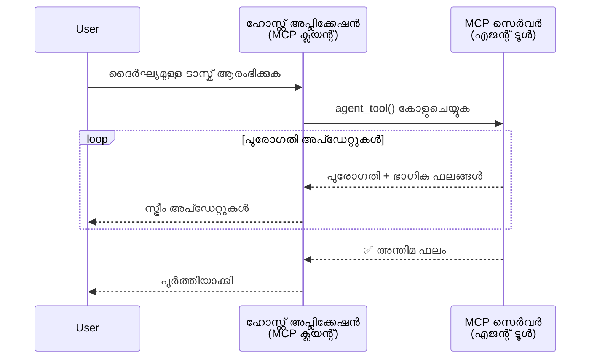
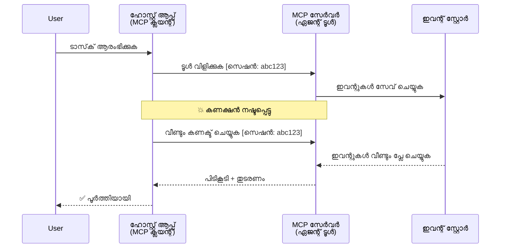
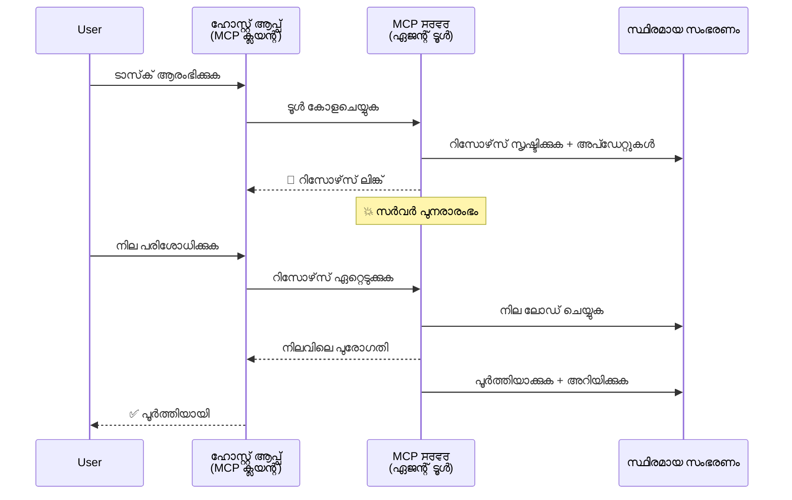
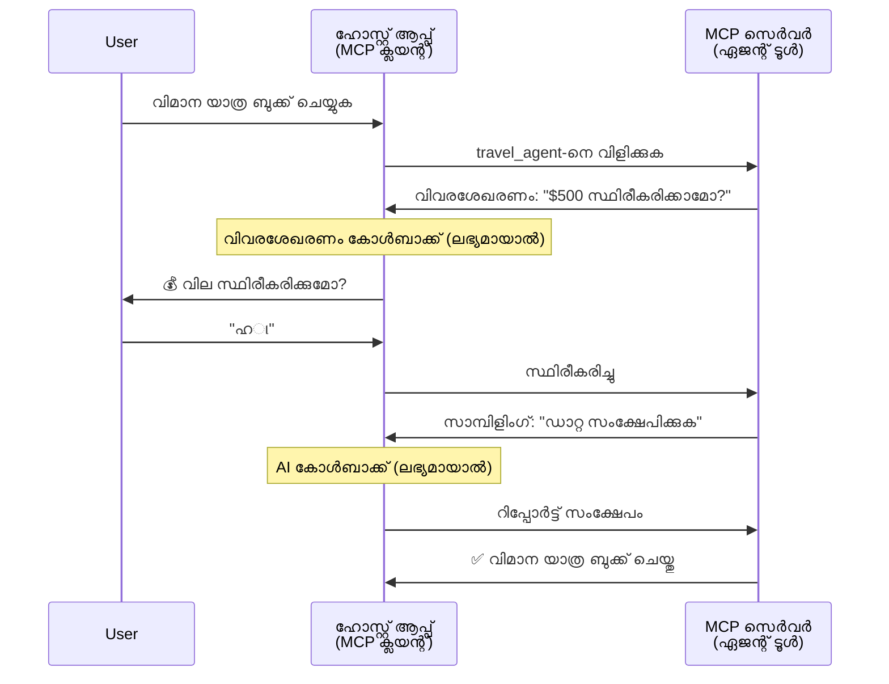
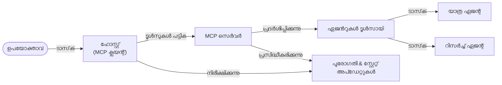

# MCP ഉപയോഗിച്ചു ഏജന്റ്-ടു-ഏജന്റ് കമ്മ്യൂണിക്കേഷൻ സിസ്റ്റങ്ങൾ നിർമ്മിക്കുക

> ലഘുസംഗ്രഹം - MCP-ൽ ഏജന്റ്2ഏജന്റ് കമ്മ്യൂണിക്കേഷൻ നിർമ്മിക്കാമോ? സാധ്യമാണ്!

MCP അവതാരകമായ "LLMs-ന് കോൺടെക്‌സ്‌റ്റ് നൽകുക" എന്ന പ്രാരംഭ ലക്ഷ്യത്തെക്കാള്‍ വളരെ മുന്നോട്ടു വികസിച്ചു. കഴിഞ്ഞ ദിവസങ്ങളിൽ [പുനരാരംഭിക്കാവുന്ന സ്ട്രീമുകൾ](https://modelcontextprotocol.io/docs/concepts/transports#resumability-and-redelivery), [ഉത്തേജനം](https://modelcontextprotocol.io/specification/2025-06-18/client/elicitation), [സംഭരണിയിടുക](https://modelcontextprotocol.io/specification/2025-06-18/client/sampling), ജൂം അറിയിപ്പുകൾ ([പ്രോഗ്രസ്](https://modelcontextprotocol.io/specification/2025-06-18/basic/utilities/progress) மற்றும் [സമ്പത്ത്](https://modelcontextprotocol.io/specification/2025-06-18/schema#resourceupdatednotification) ഉൾപ്പെടെ) എന്നിവയുടെ പുരോഗതി കൂടെ, MCP ഇപ്പോൾ സങ്കീർണ്ണമായ ഏജന്റ്-ടു-ഏജന്റ് കമ്മ്യൂണിക്കേഷൻ സിസ്റ്റങ്ങൾ നിർമ്മിക്കാൻ ശക്തമായ അടിസ്ഥാനം നൽകുന്നു.

## ഏജന്റ്/ടൂൾ ആശയം തെറ്റിദ്ധാരണ

ഏജൻറ്റിക് പെരുമാറ്റമുള്ള (നിരന്തരമായി പ്രവര്‍ത്തിക്കുക, നടപ്പുവരുത്തലിലെ ഇടയിൽ അധിക ഇൻപുട്ട് ആവശ്യപ്പെട്ടേക്കാം തുടങ്ങിയവ) ഉപകരണങ്ങളെ പറ്റി കൂടുതൽ ഡെവലപ്പർമാർ അന്വേഷിക്കുമ്പോൾ, MCP അനുയോജ്യമല്ലെന്ന ഒരു പൊതു തെറ്റിദ്ധാരണ ഉണ്ട്, കാരണം അതിന്റെ പ്രാരംഭ ഉദാഹരണമലയാളം ആവശ്യങ്ങൾ വളരെ ലളിതമായ റിക്വസ്റ്റ്-റിസ്പോൺസ് മാത്രികിലായിരുന്നു.

ഈ കണക്കുകൂട്ടല്‍ പഴയതാണ്. MCP സ്പെസിഫിക്കേഷൻ കഴിഞ്ഞ മാസങ്ങളിലായി പ്രധാനമായും വിപുലീകരിച്ചിരിക്കുന്നു, ദീർഘകാല ഏജന്റിക് പെരുമാറ്റം നിർമ്മിക്കുന്നതിന് ആവശ്യമായ കഴിവുകളോടെ:

- **സ്ട്രീമിംഗ് & ഭാഗിക ഫലങ്ങൾ**: പ്രവർത്തനസമയത്ത് യഥാർത്ഥ-സമയം പുരോഗതി അപ്‌ഡേറ്റുകൾ
- **പുനരാരംഭശേഷി**: ക്ലൈന്റുകൾ ബന്ധം നഷ്ടമാക്കിയശേഷം പുന:കണക്ഷൻ സാധ്യമായി തുടരം മുടക്കാതെ തുടരുക
- **ദൃഢത**: ഫലങ്ങൾ സെർവർ റീസ്റ്റാർട്ടുകൾക്കപ്പുറം തുടരും (ഉദാഹരണത്തിന്, റിസോഴ്സ് ലിങ്കുകൾ വഴി)
- **മൾട്ടി-ടേൺ**: ഇടയിൽ കുത്തിവയ്പ്പും സാമ്പിളിംഗ് വഴി ഇന്ററാക്ടീവ് ഇൻപുട്ട്

ഈ സവിശേഷതകൾ സംയോജിപ്പിച്ച് സങ്കീർണ്ണമായ ഏജന്റിക്, മൾട്ടി-എജന്റ് ആപ്ലിക്കേഷനുകൾ സാധ്യമാകുന്നു, എല്ലാം MCP പ്രോട്ടോക്കോൾ അടിസ്ഥാനമാക്കി.

ഉപമമായി, ഏജന്റ് ഒരു MCP സെർവറിൽ ലഭ്യമായ "ടൂൾ" എന്നറിയിക്കും. ഇതിന്റെ അർത്ഥം MCP സെർവറുമായി സെഷൻ സ്ഥാപിക്കുന്ന MCP ക്ലയന്റ് സംരക്ഷിക്കുന്ന ഹോസ്റ്റ് അപ്ലിക്കേഷന്റെ നിലപാടുള്ളതും, ഏജന്റിനെ വിളിക്കുമെന്നുമാണു.

## MCP ടൂൾ "ഏജന്റിക്" ആകുന്നത് എന്തിന്?

നടപ്പിലാക്കുന്നതിന് മുൻപ്, ദീർഘകാല പ്രവർത്തന ഏജന്റുകൾക്ക് ആവശ്യമായ അടിസ്ഥാന സൗകര്യ കഴിവുകൾ എന്തൊക്കെയാണെന്ന് നിശ്ചയിക്കാം.

> ദീർഘകാലം സ്വതന്ത്രമായി പ്രവർത്തിക്കാൻ കഴിവുള്ള, ബഹുവിധ ഇടപെടലുകൾ അല്ലെങ്കിൽ യഥാർത്ഥ-സമയം പ്രതികരണത്തെ ആശ്രയിച്ച ഭേദഗതികൾ കൈകാര്യം ചെയ്യാൻ കഴിവുള്ള ഒറ്റപ്പെട്ട സত্ত്വം എന്ന രീതിയിൽ ഏജന്റ് നിർവചിക്കാം.

### 1. സ്ട്രീമിംഗ് & ഭാഗിക ഫലങ്ങൾ

പരമ്പരാഗത റിക്വസ്റ്റ്-റിസ്പോൺസ് മാതൃകകൾ ദീർഘകാല ടാസ്കുകൾക്ക് അനുയോജ്യമല്ല. ഏജന്റുകൾ താഴെ വാഗ്ദാനം ചെയ്യേണ്ടതാണ്:

- യഥാർത്ഥ-സമയം പുരോഗതി അപ്‌ഡേറ്റുകൾ
- ഇടനില ഫലങ്ങൾ

**MCP പിന്തുണ**: റിസോഴ്സ് അപ്ഡേറ്റ് അറിയിപ്പുകൾ ഭാഗിക ഫലങ്ങൾ സ്ട്രീം ചെയ്യാൻ സഹായിക്കുന്നു, എങ്കിലും ഇത് JSON-RPC -യുടെ 1:1 റിക്വസ്റ്റ്/റിസ്‌പോൺസ് മാതൃകയുമായി പൊരുത്തക്കേട് ഒഴിവാക്കുന്നതിന് ശ്രദ്ധാപൂർവ്വം രൂപകല്‍പന ആവശ്യമാണ്.

| സവിശേഷത                | ഉപയോഗ കേസ്                                                                                                                                                               | MCP പിന്തുണ                                                                                  |
| -------------------------- | ---------------------------------------------------------------------------------------------------------------------------------------------------------------------- | -------------------------------------------------------------------------------------------- |
| യഥാർത്ഥ-സമയം പുരോഗതി അപ്‌ഡേറ്റുകൾ | ഉപയോക്താവ് കോഡ്ബേസ് മൈഗ്രേഷൻ ടാസ്ക് അഭ്യർത്ഥിക്കുന്നു. ഏജന്റ് പുരോഗതി സ്ട്രീം ചെയ്യുന്നു: "10% - ആശ്രിത ബിന്ദുക്കൾ വിശകലനം ചെയ്യുന്നു... 25% - ടൈപ്പ്‌സ്‌ക്രിപ്റ്റ് ഫയലുകൾ മാറ്റുന്നു... 50% - ഇമ്പോർട്ടുകൾ അപ്‌ഡേറ്റ് ചെയ്യുന്നു..." | ✅ പ്രോഗ്രസ് അറിയിപ്പുകൾ                                                                        |
| ഭാഗിക ഫലങ്ങൾ              | "ഒരു പുസ്തകം സൃഷ്ടിക്കുക" ടാസ്‌ക് ഭാഗിക ഫലങ്ങൾ സ്ട്രീം ചെയ്യുന്നു, ഉദാ: 1) കഥാരേഖാ ഉടലുകൾ, 2) അദ്ധ്യായ പട്ടിക, 3) പൂര്‍ത്തിയാക്കിയ ഓരോ അധ്യായവും. ഹോസ്റ്റ് ഇതു പഠിച്ച്, റദ്ദാക്കുകയോ പുനർദ്ദിശയോ ചെയ്യാം. | ✅ അറിയിപ്പുകൾ "വികസിപ്പിക്കാൻ" കഴിയും, ഭാഗിക ഫലങ്ങൾ ഉൾപ്പെടുന്നതിന് PR 383, 776ൽ പരിപാടികൾ കാണുക                     |

<div align="center" style="font-style: italic; font-size: 0.95em; margin-bottom: 0.5em;">
<strong>ചിത്രം 1:</strong> ദീർഘകാല പ്രവർത്തനത്തിലെ MCP ഏജന്റ് യഥാർത്ഥ-സമയം പുരോഗതി അപ്‌ഡേറ്റുകളും ഭാഗിക ഫലങ്ങളും ഹോസ്റ്റ് അപ്ലിക്കേഷനിലേക്ക് സ്ട്രീം ചെയ്ത് ഉപയോക്താവിന് പ്രവർത്തനസമയം പിന്‍തുടരാൻ സഹായിക്കുന്ന വിധം കാണിക്കുന്നു.
</div>



### 2. പുനരാരംഭശേഷി

ഏജന്റുകൾ നെറ്റ്വർക്കു തടസങ്ങൾ സുതാര്യമായി കൈകാര്യം ചെയ്യണം:

- (ക്ലയന്റ്) ബന്ധം നഷ്ടപ്പെടുന്നതിന് ശേഷം പുന:കണക്ഷൻ
- മുമ്പ് നിർത്തിയത് തുടരുക (സന്ദേശം പുനർ വിതരണത്തോട്)

**MCP പിന്തുണ**: MCP StreamableHTTP ട്രാൻസ്പോർട്ട് ഇന്ന് സെഷൻ പുനരാരംഭവും സന്ദേശ പുനരന്തരണവും സെഷൻ ഐഡിയുകളും അവസാന ഇവന്റ് ഐഡിയുകളും ഉപയോഗിച്ച് പിന്തുണയ്ക്കുന്നു. പ്രധാനമാകുന്നത് സെർവർ ഒരു ഇവന്റ്‌സ്റ്റോർ നടപ്പാക്കണം, ഇത് ക്ലയന്റ് പുന:കണക്ഷനിൽ ഇവന്റ് പുനരാവൃത്തി സാധ്യമാക്കുന്നു.  
ഇവിടെ ഒരു കമ്മ്യൂണിറ്റി നിർദ്ദേശം(PR #975) ട്രാൻസ്പോർട്ട്-സ്വതന്ത്രമായി പുനരാരംഭാവാസ്ഥാ സ്ട്രീംകൾ പരിശോധിക്കുന്നു.

| സവിശേഷത     | ഉപയോഗ കേസ്                                                                                                                                               | MCP പിന്തുണ                                                              |
| ------------ | -------------------------------------------------------------------------------------------------------------------------------------------------------- | ------------------------------------------------------------------------ |
| പുനരാരംഭശേഷി | ദീർഘകാല ടാസ്ക് നടക്കുമ്പോൾ ക്ലയന്റ് ബന്ധം നഷ്ടപ്പെടുന്നു. പുന:കണക്ഷനിൽ, സെഷൻ തുടരും, നഷ്ടമായ ഇവന്റുകൾ സ്‌പഷ്ടമായിരിക്കും, അതേ സ്ഥാനത്ത് തുടരും. | ✅ StreamableHTTP ട്രാൻസ്പോർട്ട് സെഷൻ ഐഡികൾ, ഇവന്റ് പുനർവായന, ഇവന്റ്‌സ്റ്റോർ എന്നിവയോടുകൂടി ഓപ്പറേറ്റ് ചെയ്യുന്നു |

<div align="center" style="font-style: italic; font-size: 0.95em; margin-bottom: 0.5em;">
<strong>ചിത്രം 2:</strong> MCP-യുടെ StreamableHTTP ട്രാൻസ്പോർട്ടും ഇവന്റ് സ്റ്റോറും സെഷൻ പുനരാരംഭം എങ്ങനെ സുതാര്യമായി പ്രവർത്തിക്കുന്നുവെന്ന് കാണിക്കുന്നു: ക്ലയന്റ് ബന്ധം വിച്ഛേദിക്കുന്ന പക്ഷം, പുന:കണക്ഷനിൽ നഷ്ടമായ ഇവന്റുകൾ പുനരവകാസം ചെയ്യപ്പെടുകയും പണികൾ തുടരും.
</div>



### 3. ദൃഢത

ദീർഘകാല ഏജന്റുകൾ സ്ഥിരമായ സ്റ്റേറ്റ് ആവശ്യമുണ്ട്:

- ഫലങ്ങൾ സെർവർ റീസ്റ്റാർട്ടുകൾ മറികടക്കും
- സ്റ്റാറ്റസ് ബാഹ്യമായി ലഭ്യമാകാം
- സെഷനുകൾക്കിടയിൽ പുരോഗതി ട്രാക്ക് ചെയ്യാം

**MCP പിന്തുണ**: MCP ഇപ്പോൾ ടൂൾ കോളിനായി റിസോഴ്സ് ലിങ്ക് റിട്ടേൺ ടൈപ്പ് പിന്തുണയ്ക്കുന്നു. സാധാരണ മൂഡൽ: ടൂൾ ഒരു റിസോഴ്സ് സൃഷ്ടിച്ച് ഉടൻ റിസോഴ്സ് ലിങ്ക് തിരികെ നൽകുന്നു. ടൂൾ പടിയിലുണ്ടാകുന്ന ടാസ്‌ക്കിനെ പിന്തുടരുകയും റിസോഴ്സ് അപ്‌ഡേറ്റ് ചെയ്യുകയും ചെയ്യാം. ക്ലയന്റ് റിസോഴ്സ് സ്റ്റേറ്റ് പോൾ ചെയ്ത് ഭാഗികമോ മുഴുവൻ ഫലങ്ങളോ ലഭിക്കും (സെർവർ എത്ര റിസോഴ്സ് അപ്‌ഡേറ്റുകൾ നൽകുന്നുമനുസരിച്ചും) അല്ലെങ്കിൽ അപ്‌ഡേറ്റ് അറിയിപ്പുകൾക്കായി സബ്സ്ക്രൈബ് ചെയ്യാം.

ഒരു പരിമിതിയാണ്: റിസോഴ്സ് പോളിംഗ് അല്ലെങ്കിൽ സബ്‌സ്‌ക്രിപ്ഷൻ വൻ തോതിൽ റിസോഴ്സ് ചിലവ് ഉണ്ടാക്കാം. വെബ്‌ഹുക്കുകൾ അല്ലെങ്കിൽ ട്രിഗർകൾ ഉൾപ്പെടുത്തുകയെന്നതിന് (#992 ഉൾപ്പെടെ) ഒരു തുറന്ന കമ്മ്യൂണിറ്റി നിർദ്ദേശം അന്വേഷിക്കുന്നു, ഇതിലൂടെ സെർവർ ക്ലയന്റ്/ഹോസ്റ്റിന് അപ്‌ഡേറ്റുകൾ അറിയിക്കും.

| സവിശേഷത     | ഉപയോഗ കേസ്                                                                                                                                       | MCP പിന്തുണ                                                      |
| ---------- | ------------------------------------------------------------------------------------------------------------------------------------------------ | ---------------------------------------------------------------- |
| ദൃഢത       | ഡാറ്റ മൈഗ്രേഷൻ ടാസ്‌ക് നടക്കുന്നതിനിടെ സെർവർ ക്രാഷ്. ഫലങ്ങളും പുരോഗതിയും റീസ്റ്റാർട്ടിന് ശേഷവും നിലനിൽക്കും, ക്ലയന്റ് സ്റ്റാറ്റസ് പരിശോധിച്ച് ദീർഘകാല റിസോഴ്സിൽ നിന്നു തുടരും. | ✅ സ്ഥിര ശേഖരം, സ്റ്റാറ്റസ് അറിയിപ്പുകളുള്ള റിസോഴ്‌സ് ലിങ്കുകൾ     |

ഇപ്പോൾ സാധാരണ സവിശേഷത ഒരു ടൂളിന് റിസോഴ്‌സ് സൃഷ്ടിച്ച് ഉടൻ റിസോഴ്‌സ് ലിങ്ക് തിരിച്ചുകിട്ടുക എന്നതാണ്. ടൂൾ പിന്നണിയിൽ ടാസ്‌ക് കൈകാര്യം ചെയ്ത് പുരോഗതി അപ്‌ഡേറ്റുകളും ഭാഗിക ഫലങ്ങളും ഉൾപ്പെടുന്ന റിസോഴ്‌സ് അറിയിപ്പുകൾ നൽകുകയും ആവശ്യാനുസരണം റിസോഴ്‌സ് ഉള്ളടക്കം പുതുക്കുകയും ചെയ്യുന്നു.

<div align="center" style="font-style: italic; font-size: 0.95em; margin-bottom: 0.5em;">
<strong>ചിത്രം 3:</strong> MCP ഏജൻറുകൾ സ്ഥിരമായ റിസോഴ്സുകളും സ്റ്റാറ്റസ് അറിയിപ്പുകളും ഉപയോഗിച്ച് ദീർഘകാല ടാസ്കുകൾ സെർവർ റീസ്റ്റാർട്ടുകളും തരണം ചെയ്യുന്നതിനും ക്ലയന്റുകൾക്ക് പുരോഗതി പരിശോധിക്കാനും ഫലങ്ങൾ പുനരുദ്ധരിക്കാനും കഴിവുണ്ടെന്ന് നടപ്പിലാക്കുന്ന സമർഥത കാണിക്കുന്നു.
</div>



### 4. മൾട്ടി-ടേൺ ഇടപെടലുകൾ

ഏജന്റുകൾ പലപ്പോഴും നടപ്പാകുമ്പോൾ അധിക ഇൻപുട്ട് വേണം:

- മനുഷ്യ വ്യക്തീകരണം അല്ലെങ്കിൽ അംഗീകാരം
- അതിവിശിഷ്ടമായ തീരുമാനങ്ങൾക്കായി AI സഹായം
- ഗുണരഹിതമായ പാരാമീറ്റർ ക്രമീകരണം

**MCP പിന്തുണ**: സാമ്പിളിംഗ് (AI ഇൻപുട്ടിനും) ഉത്തേജനം (മനുഷ്യ ഇൻപുട്ടിനും) വഴി പൂർണ്ണ പിന്തുണ.

| സവിശേഷത               | ഉപയോഗ കേസ്                                                                                                                                       | MCP പിന്തുണ                                           |
| ----------------------- | ------------------------------------------------------------------------------------------------------------------------------------------------ | ----------------------------------------------------- |
| മൾട്ടി-ടേൺ ഇടപെടലുകൾ | യാത്ര ബുക്കിംഗ് ഏജന്റ് ഉപയോക്താവിൽ നിന്നു വില സ്ഥിരീകരണം തേടുകയും തുടർന്ന് AIയുടെ സഹായത്തോടെ യാത്ര ഡാറ്റ സംഗ്രഹിച്ച് ബുക്കിംഗ് പൂർത്തിയാക്കുന്നു. | ✅ മനുഷ്യ ഇൻപുട്ടിന് ഉത്തേജനം, AI ഇൻപുട്ടിന് സാമ്പിളിംഗ്          |

<div align="center" style="font-style: italic; font-size: 0.95em; margin-bottom: 0.5em;">
<strong>ചിത്രം 4:</strong> MCP ഏജന്റുകൾ ഇന്ററാക്ടീവ് ഹ്യൂമൻ ഇൻപുട്ട് ഉത്തേജിക്കുകയോ AI സഹായം അഭ്യർത്ഥിക്കുകയോ ചെയ്തുതുടർന്ന്, സ്ഥിരീകരണങ്ങളും സങ്കീർണ്ണമായ ധാരണകളും ഉള്‍പ്പെടുന്ന മൾട്ടി-ടേൺ പ്രവൃത്തി ഫ്‌ളോകൾ പിന്തുണയ്ക്കുന്നതായി കാണിക്കുന്നു.
</div>



## MCP-ൽ ദീർഘകാല ഏജന്റുകൾ നടപ്പാക്കൽ - കോഡ് അവലോകനം

ഈ ലേഖനത്തിന്റെ ഭാഗമായാണ് ഞങ്ങൾ നൽകുന്നത് ഒരു [കോഡ് റിപോസിറ്ററി](https://github.com/victordibia/ai-tutorials/tree/main/MCP%20Agents), ഇത് MCP Python SDK ഉപയോഗിച്ച് StreamableHTTP ട്രാൻസ്പോർട്ടിലൂടെ സെഷൻ പുനരാരംഭവും സന്ദേശ പുനർവിതരണവും സജ്ജമാക്കി ദീർഘകാല ഏജന്റുകൾ പൂർണ്ണമായി നടപ്പിലാക്കുന്നു. ഈ നടപ്പാക്കൽ MCP കഴിവുകൾ എങ്ങനെ സങ്കീർണ്ണമായ ഏജന്റിക് പെരുമാറ്റങ്ങൾ സാധ്യമാക്കുന്നതെന്ന് കാണിക്കുന്നു.

പ്രത്യേകിച്ച്, രണ്ടു പ്രധാന ഏജന്റ് ടൂളുകളോടെ ഒരു സെർവർ നടപ്പിലാക്കുന്നു:

- **ട്രാവൽ ഏജന്റ്** - ഉത്തേജനം വഴി വില സ്ഥിരീകരണം സഹിതം യാത്ര ബുക്കിംഗ് സേവനം അനുകരിക്കുന്നു
- **റിസർച്ച് ഏജന്റ്** - സാമ്പിളിംഗ് വഴി AI സഹായത്തോടെ റിസർച്ച് ടാസ്കുകൾ ചെയ്യുന്നു

ഇരട്ടി ഏജന്റുകളും യഥാർത്ഥ-സമയം പുരോഗതി അപ്‌ഡേറ്റുകൾ, ഇന്ററാക്ടീവ് സ്ഥിരീകരണങ്ങൾ, സെഷൻ പുനരാരംഭ ശേഷി എന്നിവ കാണിക്കുന്നു.

### പ്രധാന നടപ്പാക്കൽ ആശയങ്ങൾ

ഓരോ കഴിവിനും സെർവർ-സൈഡ് ഏജന്റ് നടപ്പിലാക്കലും ക്ലൈന്റ്-സൈഡ് ഹോസ്റ്റ് കൈകാര്യം ചെയ്യലും താഴെ കാണിക്കുന്നു:

#### സ്ട്രീമിംഗ് & പുരോഗതി അപ്‌ഡേറ്റുകൾ - യഥാർത്ഥ-സമയം ടാസ്‌ക് സ്റ്റാറ്റസ്

സ്ട്രീമിംഗ് ദീർഘകാല പ്രവർത്തന ദൈർഘ്യമുള്ള ടാസ്കുകളിൽ യഥാർത്ഥ-സമയം പുരോഗതി അപ്‌ഡേറ്റുകൾ നൽകാൻ സഹായിക്കുന്നു, ഉപയോക്താക്കളെ ടാസ്ക് സ്റ്റാറ്റസിനും ഇടനില ഫലങ്ങൾക്കുമായി അറിയിച്ച്‌ വയ്ക്കുന്നു.

**സർവർ നടപ്പിലാക്കൽ (എജന്റ് പുരോഗതി അറിയിപ്പുകൾ അയയ്ക്കുന്നു):**

```python
# സർവർ/server.py - യാത്രാ ഏജന്റ് പുരോഗതി അപ്‌ഡേറ്റുകൾ അയക്കുന്നു
for i, step in enumerate(steps):
    await ctx.session.send_progress_notification(
        progress_token=ctx.request_id,
        progress=i * 25,
        total=100,
        message=step,
        related_request_id=str(ctx.request_id)
    )
    await anyio.sleep(2)  # ജോലി അനുകരണമേൽപ്പിക്കുക

# മാറ്റമായി: വിശദമായ ഘട്ടം-ഘട്ടം അപ്‌ഡേറ്റുകൾക്കായി ലോഗ് സന്ദേശങ്ങൾ
await ctx.session.send_log_message(
    level="info",
    data=f"Processing step {current_step}/{steps} ({progress_percent}%)",
    logger="long_running_agent",
    related_request_id=ctx.request_id,
)
```

**ക്ലയന്റ് നടപ്പിലാക്കൽ (ഹോസ്റ്റ് പുരോഗതി അപ്‌ഡേറ്റുകൾ സ്വീകരിക്കുന്നു):**

```python
# client/client.py ൽ നിന്നും - ക്ലയന്റ് യഥാർഥ സമയ അറിയിപ്പുകൾ കൈകാര്യം ചെയ്യുന്നു
async def message_handler(message) -> None:
    if isinstance(message, types.ServerNotification):
        if isinstance(message.root, types.LoggingMessageNotification):
            console.print(f"📡 [dim]{message.root.params.data}[/dim]")
        elif isinstance(message.root, types.ProgressNotification):
            progress = message.root.params
            console.print(f"🔄 [yellow]{progress.message} ({progress.progress}/{progress.total})[/yellow]")

# സെഷൻ സൃഷ്ടിക്കുന്നപ്പോൾ സന്ദേശ ഹാൻഡ്ലർ രജിസ്റ്റർ ചെയ്യുക
async with ClientSession(
    read_stream, write_stream,
    message_handler=message_handler
) as session:
```

#### ഉത്തേജനം - ഉപയോക്തൃ ഇൻപുട്ട് അഭ്യർത്ഥിക്കുന്നു

ഉത്തേജനം ഏജന്റുകൾക്ക് നടപ്പുവരുത്തലിനിടയിൽ ഉപയോക്തൃ ഇൻപുട്ട് അപേക്ഷിക്കാൻ സഹായിക്കുന്നു. ഇത് ദീർഘകാല ടാസ്കുകളിൽ സ്ഥിരീകരണങ്ങൾക്കും വ്യക്തീകരണങ്ങൾക്കും അംഗീകാരങ്ങൾക്കും അസംഭവം.

**സർവർ നടപ്പിലാക്കൽ (എജന്റ് സ്ഥിരീകരണം അഭ്യര്‍ഥിക്കുന്നു):**

```python
# സെർവർ/server.py മുതൽ - യാത്രാ ഏജന്റിന്റെ വില സ്ഥിരീകരണം അഭ്യർത്ഥിക്കുന്നു
elicit_result = await ctx.session.elicit(
    message=f"Please confirm the estimated price of $1200 for your trip to {destination}",
    requestedSchema=PriceConfirmationSchema.model_json_schema(),
    related_request_id=ctx.request_id,
)

if elicit_result and elicit_result.action == "accept":
    # ബുക്കിംഗ് തുടരുക
    logger.info(f"User confirmed price: {elicit_result.content}")
elif elicit_result and elicit_result.action == "decline":
    # ബുക്കിംഗ് റദ്ദാക്കുക
    booking_cancelled = True
```

**ക്ലയന്റ് നടപ്പിലാക്കൽ (ഹോസ്റ്റ് ഉത്തേജനം കോൾബാക്ക് നൽകുന്നു):**

```python
# client/client.py-ൽ നിന്നുള്ള - ക്ലയന്റ് ഹാൻഡിലിങ് elicitation അപേക്ഷകൾ
async def elicitation_callback(context, params):
    console.print(f"💬 Server is asking for confirmation:")
    console.print(f"   {params.message}")

    response = console.input("Do you accept? (y/n): ").strip().lower()

    if response in ['y', 'yes']:
        return types.ElicitResult(
            action="accept",
            content={"confirm": True, "notes": "Confirmed by user"}
        )
    else:
        return types.ElicitResult(
            action="decline",
            content={"confirm": False, "notes": "Declined by user"}
        )

# സെഷൻ സൃഷ്ടിക്കുമ്പോൾ കോൾബാക്ക് രജിസ്റ്റർ ചെയ്യുക
async with ClientSession(
    read_stream, write_stream,
    elicitation_callback=elicitation_callback
) as session:
```

#### സാമ്പിളിംഗ് - AI സഹായം അഭ്യര്‍ഥിക്കുന്നു

സാമ്പിളിംഗ് എജന്റുകൾക്ക് നിർവഹണത്തിനിടയിൽ സങ്കീർണ്ണമായ തീരുമാനങ്ങൾക്കായി LLM സഹായം അഭ്യര്‍ഥിക്കാനാകും. ഇത് മിശ്ര മനുഷ്യ-എഐ പ്രവൃത്തി പ്രക്രിയകൾക്ക് സാധ്യമാണ്.

**സർവർ നടപ്പിലാക്കൽ (എജന്റ് AI സഹായം അഭ്യര്ഥിക്കുന്നു):**

```python
# server/server.py-ൽ നിന്ന് - ഗവേഷണ ഏജന്റ് AI സംഗ്രഹം അഭ്യർത്ഥിക്കുന്നു
sampling_result = await ctx.session.create_message(
    messages=[
        SamplingMessage(
            role="user",
            content=TextContent(type="text", text=f"Please summarize the key findings for research on: {topic}")
        )
    ],
    max_tokens=100,
    related_request_id=ctx.request_id,
)

if sampling_result and sampling_result.content:
    if sampling_result.content.type == "text":
        sampling_summary = sampling_result.content.text
        logger.info(f"Received sampling summary: {sampling_summary}")
```

**ക്ലയന്റ് നടപ്പിലാക്കൽ (ഹോസ്റ്റ് സാമ്പിൾ കോൾബാക്ക് നൽകുന്നു):**

```python
# client/client.pyൽ നിന്ന് - ക്ലയന്റ് സാമ്പിള്‍ അപേക്ഷകള്‍ കൈകാര്യം ചെയ്യുന്നു
async def sampling_callback(context, params):
    message_text = params.messages[0].content.text if params.messages else 'No message'
    console.print(f"🧠 Server requested sampling: {message_text}")

    # യഥാര്‍ഥ ആപ്ലിക്കേഷനില്‍, ഇത് ഒരു LLM API കേള്‍ക്കാം
    # ഡെമോ ആവശ്യങ്ങള്‍ക്കായി, ഞങ്ങള്‍ ഒരു മോക് പ്രതികരണം നല്‍കുന്നു
    mock_response = "Based on current research, MCP has evolved significantly..."

    return types.CreateMessageResult(
        role="assistant",
        content=types.TextContent(type="text", text=mock_response),
        model="interactive-client",
        stopReason="endTurn"
    )

# സെഷന്‍ സൃഷ്ടിക്കുമ്പോള്‍ കോള്‍ബാക്ക് രജിസ്റ്റര്‍ ചെയ്യുക
async with ClientSession(
    read_stream, write_stream,
    sampling_callback=sampling_callback,
    elicitation_callback=elicitation_callback
) as session:
```

#### പുനരാരംഭശേഷി - ഒഴിവായി പോകൽ ഇടവേളകളിൽ സെഷൻ തുടർച്ച

പുനരാരംഭശേഷി ദീർഘകാല ഏജന്റ് ടാസ്കുകൾ ക്ലയന്റ് ഒഴിവായി പോകൽ അതിജീവിക്കുകയും പുന: കണക്ഷനിൽ പ്രശ്നമില്ലാതെ തുടരും. ഇത് ഇവന്റ് സ്റ്റോറുകളും പുനരാരംഭ ടോക്കണുകളും വഴി നടപ്പാക്കുന്നു.

**ഇവന്റ് സ്റ്റോർ നടപ്പിലാക്കൽ (സെർവർ സെഷൻ സ്റ്റേറ്റ് കൈവരിക്കുന്നു):**

```python
# server/event_store.py ൽ നിന്നുള്ളത് - ലളിതമായ ഇൻ-മെമ്മറി ഇവന്റ് സ്റ്റോർ
class SimpleEventStore(EventStore):
    def __init__(self):
        self._events: list[tuple[StreamId, EventId, JSONRPCMessage]] = []
        self._event_id_counter = 0

    async def store_event(self, stream_id: StreamId, message: JSONRPCMessage) -> EventId:
        """Store an event and return its ID."""
        self._event_id_counter += 1
        event_id = str(self._event_id_counter)
        self._events.append((stream_id, event_id, message))
        return event_id

    async def replay_events_after(self, last_event_id: EventId, send_callback: EventCallback) -> StreamId | None:
        """Replay events after the specified ID for resumption."""
        start_index = None
        stream_id = None
        for index, (event_stream_id, event_id, _) in enumerate(self._events):
            if event_id == last_event_id:
                start_index = index + 1
                stream_id = event_stream_id
                break

        if start_index is None:
            return None

        # സെഷന്റെ യഥാർത്ഥ സ്ട്രീമിൽ നിന്നുള്ള മാത്രം പിന്നീട് സംഭവങ്ങൾ പുനരവതരിപ്പിക്കുക.
        for event_stream_id, event_id, message in self._events[start_index:]:
            if event_stream_id != stream_id:
                continue
            await send_callback(EventMessage(message, event_id))

        return stream_id

# server/server.py ൽ നിന്നുള്ളത് - ഇവന്റ് സ്റ്റോർ സെഷൻ മാനേജറിലേക്ക് നൽകുന്നു
def create_server_app(event_store: Optional[EventStore] = None) -> Starlette:
    server = ResumableServer()

    # പുനരാരംഭനത്തിനായി ഇവന്റ് സ്റ്റോർ ഉപയോഗിച്ച് സെഷൻ മാനേജർ സൃഷ്ടിക്കുക
    session_manager = StreamableHTTPSessionManager(
        app=server,
        event_store=event_store,  # ഇവന്റ് സ്റ്റോർ സെഷൻ പുനരാരംഭനം സജ്ജമാക്കുന്നു
        json_response=False,
        security_settings=security_settings,
    )

    return Starlette(routes=[Mount("/mcp", app=session_manager.handle_request)])

# ഉപയോഗം: ഇവന്റ് സ്റ്റോർ ഉപയോഗിച്ച് ആരംഭിക്കുക
event_store = SimpleEventStore()
app = create_server_app(event_store)
```

**ക്ലയന്റ് മെറ്റാഡാറ്റാ പുനരാരംഭ ടോക്കൺ ഉപയോഗിച്ച് (ക്ളയന്റ് സൂക്ഷിച്ച സ്റ്റേറ്റ് ഉപയോഗിച്ച് പുന:കണക്ഷൻ):**

```python
# client/client.py-യില് നിന്ന് - മെടഡാറ്റയോടുകൂടിയ ക്ലയന്റ് പുനരാരംഭം
if existing_tokens and existing_tokens.get("resumption_token"):
    # നാം അവസാനിച്ചിടത്തോട് തുടരാൻ നിലവിലുള്ള പുനരാരംഭ ടോകൺ ഉപയോഗിക്കുക
    metadata = ClientMessageMetadata(
        resumption_token=existing_tokens["resumption_token"],
    )
else:
    # ലഭിക്കുമ്പോൾ പുനരാരംഭ ടോകൺ സേവ് ചെയ്യാനുള്ള കോള്ബാക്ക് സൃഷ്ടിക്കുക
    def enhanced_callback(token: str):
        protocol_version = getattr(session, 'protocol_version', None)
        token_manager.save_tokens(session_id, token, protocol_version, command, args)

    metadata = ClientMessageMetadata(
        on_resumption_token_update=enhanced_callback,
    )

# പുനരാരംഭ മെടഡാറ്റയോടൊപ്പം അഭ്യർത്ഥന അയയ്ക്കുക
result = await session.send_request(
    types.ClientRequest(
        types.CallToolRequest(
            method="tools/call",
            params=types.CallToolRequestParams(name=command, arguments=args)
        )
    ),
    types.CallToolResult,
    metadata=metadata,
)
```

ഹോസ്റ്റ് അപ്‌ളിക്കേഷൻ സെഷൻ ഐഡികളും പുനരാരംഭ ടോക്കണുകളും ലൊക്കലായി സൂക്ഷിക്കുന്നു, ഇത് നിലവിലെ സെഷനുകളിലേക്ക് പുന:കണക്ഷൻ സാധ്യമാക്കുന്നു, പുരോഗതി നഷ്ടപ്പെടാതെ.

### കോഡ് ഓർഗനൈസേഷൻ

<div align="center" style="font-style: italic; font-size: 0.95em; margin-bottom: 0.5em;">
<strong>ചിത്രം 5:</strong> MCP അടിസ്ഥാനമാക്കിയ ഏജന്റ് സിസ്റ്റം ആർക്കിടെക്ചർ
</div>



**പ്രധാന ഫയലുകൾ:**

- **`server/server.py`** - പുനരാരംഭശേഷിയുള്ള MCP സെർവർ, യാത്ര, ഗവേഷണ ഏജന്റ്, ഉത്തേജനം-സാമ്പിളിംഗ്, പുരോഗതി അപ്‌ഡേറ്റുകൾ ഉൾക്കൊള്ളുന്നു
- **`client/client.py`** - ഇടപെടൽഹോസ്റ്റ് അപ്ലിക്കേഷൻ, പുനരാരംഭം പിന്തുണ, കോൾബാക്ക് ഹാൻഡ്ലറുകൾ, ടോക്കൺ മാനേജ്മെന്റ്
- **`server/event_store.py`** - സെഷൻ പുനരാരംഭവും സന്ദേശ പുനർവിതരണവും അനുവദിക്കുന്ന ഇവന്റ് സ്റ്റോർ നടപ്പിലാക്കൽ

## MCP- ല്‍ മൾട്ടി-ഏജന്റ് കമ്മ്യൂണിക്കേഷൻ വരെ വിപുലീകരിക്കല്‍

മുകളിൽ പറഞ്ഞ നടപ്പാക്കൽ ഹോസ്റ്റ് അപ്ലിക്കേഷന്റെ ബുദ്ധി, പരിധി എന്നിവ വളർത്തി മൾട്ടി-ഏജന്റ് സിസ്റ്റങ്ങളിലേക്ക് വിപുലീകരിക്കാം:

- **ബുദ്ധിഗ്രാഹി ടാസ്‌ക്ക് വിഭജന**: ഹോസ്റ്റ് സങ്കീർണ്ണ ഉപയോക്തൃ ആവശ്യങ്ങൾ വിശകലനം ചെയ്ത് വ്യത്യസ്ത പ്രത്യേകതയുള്ള ഏജന്റുകൾക്ക് സബ്-ടാസ്കുകൾ വിഭജിക്കുന്നു
- **മൾട്ടി-സെർവർ സഖ്യം**: ഹോസ്റ്റ് വിവിധ MCP സെർവറുകളോടുള്ള ബന്ധം നിലനിർത്തുന്നു, ഓരോ സെർവർ വ്യത്യസ്ത ഏജന്റ് കഴിവുകൾ പ്രദർശിപ്പിക്കുന്നു
- **ടാസ്‌ക് സ്റ്റേറ്റ് മാനേജ്മെന്റ്**: ഹോസ്റ്റ് നിരവധി ഏജന്റ് ടാസ്‌കുകളുടെയും പുരോഗതിയെ ട്രാക്ക് ചെയ്യുന്നു, ആശ്രയത്വങ്ങളും ക്രമനിർണയവുമുള്ള പ്രവർത്തനം കൈകാര്യം ചെയ്യുന്നു
- **സഹിഷ്ണുത & വീണ്ടെടുക്കല്‍**: ഹോസ്റ്റ് പരാജയങ്ങൾ കൈകാര്യം ചെയ്യുകയും വീണ്ടും ശ്രമിക്കുന്ന ലാജിക് നടപ്പാക്കുകയും ഉപാകരണമില്ലായ്മയിൽ ടാസ്കുകൾ പുന:ദിശാനിർദ്ദേശം ചെയ്യുകയും ചെയ്യും
- **ഫലം സംയോജനം**: ഹോസ്റ്റ് വ്യത്യസ്ത ഏജന്റുകളിൽ നിന്നുള്ള ഫലങ്ങൾ ഏകീകൃത അന്തിമ ഫലമായി സംയോജിപ്പിക്കുന്നു

ഹോസ്റ്റ് ലളിതമായ ക്ലയന്റിൽ നിന്നും ബുദ്ധിവാനായ ഏകോപകനായി മാറും, വിതരണ ഏജന്റ് കഴിവുകൾ ഏകോപിപ്പിച്ച് അതേ MCP പ്രോട്ടോക്കോൾ അടിസ്ഥാനം നിലനിർത്തും.

## സമാപനം

MCPയുടെ വികസിച്ച ശേഷികൾ - റിസോഴ്‌സ് അറിയിപ്പുകൾ, ഉത്തേജനം/സാമ്പിളിംഗ്, പുനരാരംഭിക്കാവുന്ന സ്ട്രീമുകൾ, സ്ഥിരമായ റിസോഴ്‌സുകൾ - സങ്കീർണ്ണമായ ഏജന്റ്-വ്യവഹാരങ്ങൾ എളുപ്പത്തിൽ നടത്താനും പ്രോട്ടോക്കോൾ ലളിതത്വം സംരക്ഷിക്കാനും സഹായിക്കുന്നു.

## ആരംഭിക്കാൻ

നിങ്ങളുടെ സ്വന്തം ഏജന്റ്2ഏജന്റ് സിസ്റ്റം നിർമ്മിക്കാൻ തയ്യാറാണോ? ഈ ഘട്ടങ്ങൾ പിന്തുടരുക:

### 1. ഡെമോ നടത്തുക

```bash
# പുനരാരംഭത്തിനായി ഇവന്റ് സ്റ്റോർ ഉപയോഗിച്ച് സെർവർ ആരംഭിക്കുക
python -m server.server --port 8006

# മറ്റൊരു ടെർമിനലിൽ ഇന്ററാക്ടീവ് ക്ലയന്റ് പ്രവർത്തിപ്പിക്കുക
python -m client.client --url http://127.0.0.1:8006/mcp
```

**ഇന്ററാക്ടീവ് മോഡിൽ ലഭ്യമായ കമാൻഡുകൾ:**

- `travel_agent` - ഉത്തേജനം വഴി വില സ്ഥിരീകരണത്തോടെ യാത്ര ബുക്ക് ചെയ്യുക
- `research_agent` - സാമ്പിളിംഗ് വഴി AI സഹായം ലഭിച്ച റിസർച്ച് വിഷങ്ങൾ പരിശോധിക്കുക
- `list` - എല്ലാ ലഭ്യമായ ടൂളുകളും കാണിക്കുക
- `clean-tokens` - പുനരാരംഭ ടോക്കണുകൾ ഒഴിവാക്കുക
- `help` - വിശദമായ കമാൻഡ് സഹായം കാണിക്കുക
- `quit` - ക്ലയന്റ് പുറത്ത് ഇറങ്ങുക

### 2. പുനരാരംഭ സഹായങ്ങൾ പരീക്ഷിക്കുക

- ദീർഘകാല ഏജന്റ് (ഉദാ., `travel_agent`) ആരംഭിക്കുക
- നടപ്പുവരുത്തലിന്റെ ഇടയിൽ ക്ലയന്റ് തടസ്സമാകുക (Ctrl+C)
- ക്ലയന്റ് പുനരാരംഭിക്കൂ - മുമ്പ് നിർത്തിയിടത്ത് നിന്ന് സ്വയം തുടരുന്നു

### 3. പരീക്ഷിക്കുക & വിപുലീകരിക്കുക

- **ഉദാഹരണങ്ങൾ പരിശോധിക്കുക**: ഈ [mcp-agents](https://github.com/victordibia/ai-tutorials/tree/main/MCP%20Agents) കാണുക
- **കമ്മ്യൂണിറ്റിയിൽ ചേരുക**: MCP GitHub ചർച്ചകളിൽ പങ്കുചേരുക
- ** പരീക്ഷണങ്ങൾ നടത്തുക**: ലളിതമായ ദീർഘകാല ടാസ്‌ക് തുടങ്ങുക, തുടർന്ന് സ്ട്രീമിംഗ്, പുനരാരംഭശേഷി, മൾട്ടി-ഏജന്റ് ഏകീകരണം എന്നിവ ഇത് കൂടിയാവുന്നതായി വികസിപ്പിക്കുക

ഇത് MCP എങ്ങനെ ബുദ്ധിമാനായ ഏജന്റ് പെരുമാറ്റങ്ങൾ സജ്ജീകരിക്കുന്നതും ടൂൾ അടിസ്ഥാന ലളിതത്വം നിലനിർത്തുന്നതും കാണിക്കുന്നു.

മൊത്തത്തിൽ MCP പ്രോട്ടോക്കോൾ സ്പെക് വേഗത്തിൽ മെച്ചപ്പെടുത്തിയുകൊണ്ടിരിക്കുന്നു; ഏറ്റവും പുതിയ അപ്‌ഡേറ്റുകൾക്കായി ഔദ്യോഗിക ഡോക്യുമെന്റേഷൻ വെബ്സൈറ്റ് പരിശോധിക്കാൻ വായനക്കാർക്ക് ശുപാർശ ചെയ്യപ്പെടുന്നു - https://modelcontextprotocol.io/introduction

---

<!-- CO-OP TRANSLATOR DISCLAIMER START -->
**അറിയിപ്പ്**:
ഈ രേഖ AI പരിഭാഷാ സേവനം [Co-op Translator](https://github.com/Azure/co-op-translator) ഉപയോഗിച്ച് പരിഭാഷപ്പെടുത്തിയതാണ്. ഞങ്ങൾ കൃത്യതയ്ക്കായി ശ്രമിക്കുന്നുവെങ്കിലും, ഓട്ടോമേറ്റഡ് പരിഭാഷകളിൽ പിഴവുകൾ അല്ലെങ്കിൽ തെറ്റായ വിവരങ്ങൾ ഉണ്ടാകാൻ സാധ്യതയുണ്ട്. അതിന്റെ സ്വാഭാവിക ഭാഷയിലുള്ള അസൽ രേഖയാണ് പ്രാമാണികമായ ഉറവിടമായി പരിഗണിക്കേണ്ടത്. നിർണായകമായ വിവരങ്ങൾക്ക്, പ്രൊഫഷണൽ മനുഷ്യ പരിഭാഷ ശുപാർശ ചെയ്യുന്നു. ഈ പരിഭാഷ ഉപയോഗിച്ച് ഉണ്ടാകുന്ന തെറ്റിദ്ധാരണകൾ അല്ലെങ്കിൽ തെറ്റായ വ്യാഖ്യാനങ്ങൾക്കായി ഞങ്ങൾ ഉത്തരവാദികളല്ല.
<!-- CO-OP TRANSLATOR DISCLAIMER END -->