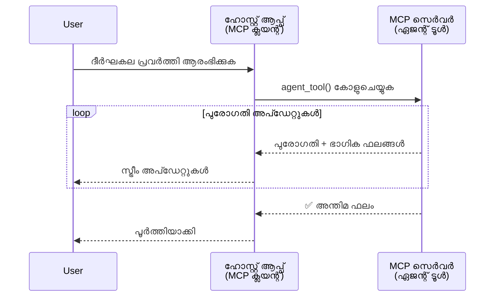
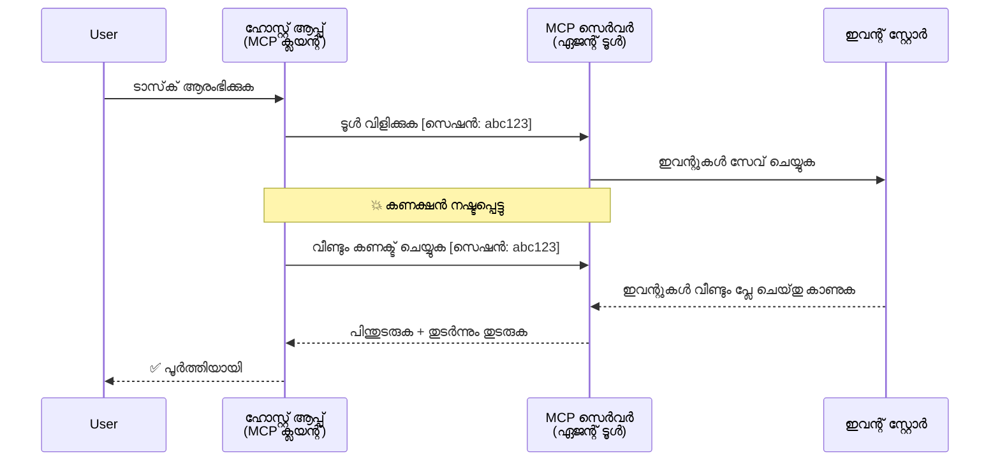
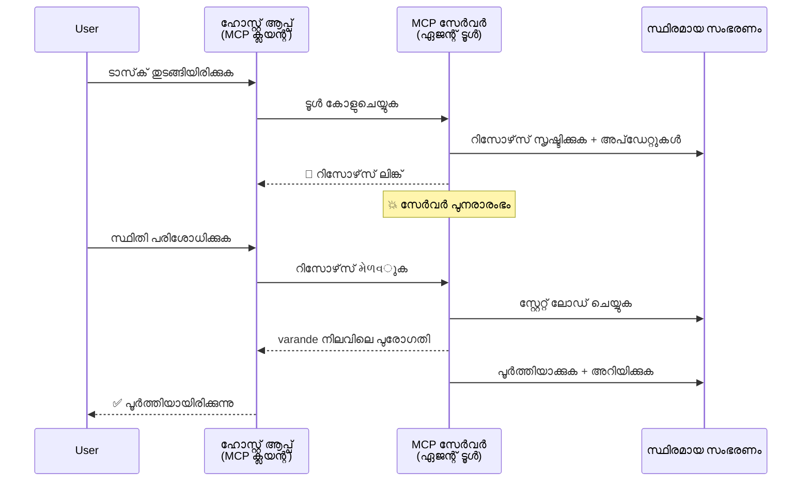
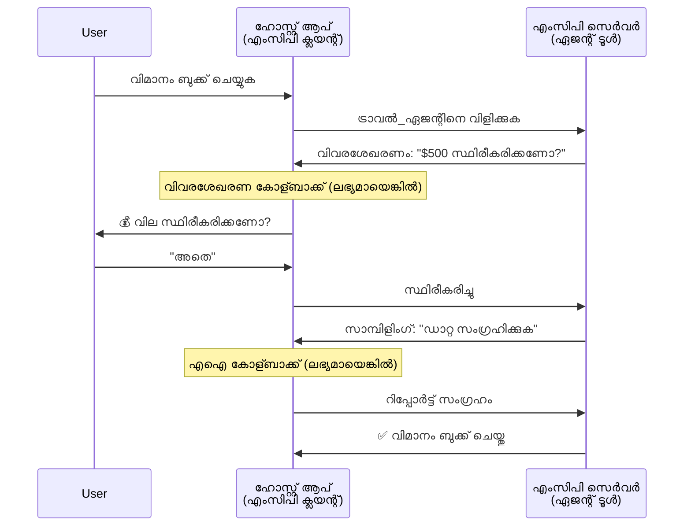
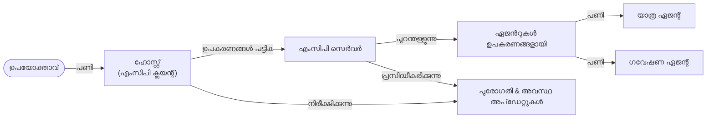

# MCP ഉപയോഗിച്ച് ഏജന്റ്-ടു-ഏജന്റ് കമ്മ്യൂണിക്കേഷൻ സിസ്റ്റങ്ങൾ നിർമ്മിക്കൽ

> TL;DR - MCP-യിൽ ഏജന്റ്2ഏജന്റ് കമ്മ്യൂണിക്കേഷൻ നിർമ്മിക്കാമോ? അതേ!

"LLM-കൾക്ക് കോൺടെക്സ്റ്റ് നൽകുക" എന്ന MCP യുടെ ആദ്യ ലക്ഷ്യത്തെ ചെയ്തു കഴിഞ്ഞ് MCP വലിയ മാറ്റങ്ങൾ ആണു കൈവരിച്ചത്. [പുനരാരംഭിക്കാൻ കഴിയുന്ന സ്ട്രീമുകൾ](https://modelcontextprotocol.io/docs/concepts/transports#resumability-and-redelivery), [ഇളകൽ](https://modelcontextprotocol.io/specification/2025-06-18/client/elicitation), [സാമ്പിളിംഗ്](https://modelcontextprotocol.io/specification/2025-06-18/client/sampling), അറിയിപ്പുകൾ ([പ്രോഗ്രസ്](https://modelcontextprotocol.io/specification/2025-06-18/basic/utilities/progress) & [റിസോഴ്‌സുകൾ](https://modelcontextprotocol.io/specification/2025-06-18/schema#resourceupdatednotification) എന്നിവ ഉൾപ്പടെ സമകാലീന മെച്ചപ്പെടുത്തലുകൾ കൊണ്ട് MCP ഇപ്പോൾ സങ്കീർണ്ണമായ ഏജന്റ്-ടു-ഏജന്റ് കമ്മ്യൂണിക്കേഷൻ സിസ്റ്റങ്ങൾ നിർമ്മിക്കാൻ ഒരു ഉറച്ച അടിസ്ഥാനമാണ് നൽകുന്നത്.

## ഏജന്റ്/ടൂൾ തെറ്റിദ്ധാരണ

ലോംഗ്-റണ്ണിംഗ് കരങ്ങളിൽ ഏജന്റ് പോലുള്ള പെരുമാറ്റങ്ങൾ ഉള്ള ഉപകരണങ്ങൾ പരീക്ഷിക്കുന്ന വികസകർക്കിടയിൽ, MCP ഉചിതമല്ലെന്ന ഒരു പൊതു തെറ്റിദ്ധാരണ കാണപ്പെടുന്നു, കാരണം തുടക്കത്തിലെ സരളമായ അഭ്യർത്ഥന-പ്രതികരണ മാതൃകകളിൽ കേന്ദ്രീകൃതമായ ഉപകരണങ്ങളുടെ ഉദാഹരണങ്ങൾ ആയിരുന്നു.

ഈ കാഴ്ചപ്പാട് പഴനാണ്. കഴിഞ്ഞ ചില മാസങ്ങളായി MCP സ്പെസിഫിക്കേഷൻ വളരെ മെച്ചപ്പെടുത്തിയിട്ടുണ്ട്, അതിലൂടെ ലോംഗ്-റണ്ണിംഗ് ഏജന്റ് പെരുമാറ്റങ്ങൾ നിർമ്മിക്കാനുള്ള ഇടം അടഞ്ഞു:

- **സ്ട്രീമിംഗ് & ഭാഗിക ഫലങ്ങൾ**: പ്രവർത്തന സമയത്ത് റിയൽ-ടൈം പുരോഗതി അപ്‌ഡേറ്റുകൾ
- **പുനരാരംഭം**: ക്ലയന്റുകൾ അസംബന്ധം കഴിഞ്ഞു കൂടി പുനഃകണക്ട് ചെയ്ത് തുടരെക്കുന്നു
- **ദീർഘീകരിച്ച സ്ഥിരത**: ഫലങ്ങൾ സെർവർ റിസ്റ്റാർട്ടുകൾക്ക് ശേഷവും നിലനിർത്തുന്നു (ഉദാ: റിസോഴ്‌സ് ലിങ്കുകൾ വഴി)
- **മൾട്ടി-ടേൺ**: പ്രവർത്തനത്തിനിടയിൽ ഇടക്കാലത്തിൽ ഇൻപുട്ട് കൈകാര്യം ചെയ്യൽ elicitation & sampling വഴിത്തിരിവുകൾ

ഈ ഫർച്ചറുകൾ ചേർത്ത് സങ്കീർണ്ണമായ ഏജന്റ്, മൾട്ടി-ഏജന്റ് അപ്ലിക്കേഷനുകൾ MCP പ്രോട്ടോകോൾ ഉപയോഗിച്ച് നിർമ്മിക്കാനാകും.

ഉദാഹരണത്തിനായി, MCP സെർവറിൽ ലഭ്യമാകുന്ന "ടൂൾ" എന്നുള്ളതിനെ ഏജന്റായി പരിഗണിക്കാം. അതായത് MCP ക്ലയന്റ് പരീക്ഷണം നടത്തുന്ന ഹോസ്റ്റ് ആപ്ലിക്കേഷൻ ഉണ്ടായിരിക്കണം, അത് സെഷൻ സജ്ജീകരിച്ച് ഏജന്റിനെ വിളിക്കാനാകും.

## MCP ടൂൾ "ഏജന്റിക്" ആകുന്നത് എന്തുകൊണ്ടാണ്?

നടപ്പാക്കലിലേക്ക് കടക്കുന്നതിന് മുമ്പ്, ലോംഗ്-റണ്ണിംഗ് ഏജന്റുകളെ പിന്തുണയ്ക്കാനാണ് വേണ്ടുള്ള അടിസ്ഥാന സൗകര്യങ്ങൾ എന്തൊക്കെയെന്ന് നമുക്ക് നിശ്ചയിക്കാം.

> ഏജന്റ് എന്ന് പറയുന്നത്, ദീർഘകാലം സ്വയം പ്രവർത്തിക്കാനും, യാഥാർഥ്യ ഫീഡ്‌ബാക്ക് അടിസ്ഥാനമാക്കി ബഹുസ്വര ആശയവിനിമയങ്ങൾക്കോ ക്രമീകരണങ്ങൾക്കോ സാധിക്കാനുള്ള കമ്പനിയാണ്.

### 1. സ്ട്രീമിംഗ് & ഭാഗിക ഫലങ്ങൾ

പരമ്പരാഗത അഭ്യർത്ഥന-പ്രതികരണ മാതൃകകൾ ലോംഗ്-റണ്ണിംഗ് ടാസ്കുകൾക്ക് ഉചിതമല്ല. ഏജന്റുകൾക്കു നൽകണം:

- റിയൽ-ടൈം പുരോഗതി അപ്ഡേറ്റുകൾ
- ഇടക്കാല ഫലങ്ങൾ

**MCP പിന്തുണ**: റിസോഴ്‌സ് അപ്‌ഡേറ്റ് അറിയിപ്പുകൾ ഭാഗിക ഫലങ്ങൾ സ്ട്രീം ചെയ്യാൻ സാധിക്കുന്നു, എന്നാൽ JSON-RPCയുടെ 1:1 അഭ്യർത്ഥന/പ്രതികരണ മാതൃകയുമായി സംഘർഷം ഒഴിവാക്കുന്നതിന് ഉത്തരവാദിത്വമുള്ള രൂപകൽപ്പന ആവശ്യമാണ്.

| ഫീച്ചർ                    | ഉപയോഗം                                                                                                                                                         | MCP പിന്തുണ                                                                             |
| -------------------------- | -------------------------------------------------------------------------------------------------------------------------------------------------------------- | --------------------------------------------------------------------------------------- |
| റിയൽ-ടൈം പുരോഗതി അപ്‌ഡേറ്റുകൾ | യൂസർ ഒരു കോഡ്‌బേസ് മൈഗ്രേഷൻ ടാസ്‌ക്ക് അഭ്യർത്ഥിക്കുന്നു. ഏജెంట్ പുരോഗതി സ്ട്രീം ചെയ്യുന്നു: "10% -ഡിപ്പെൻഡൻസികൾ വിശകലനം ചെയ്യുന്നു... 25% - ടൈപ്പ്സ്ക്രിപ്റ്റ് ഫയലുകൾ മാറ്റുന്നു... 50% - ഇൻ‌പോർട്ടുകൾ അപ്‌ഡേറ്റ് ചെയ്യുന്നു..." | ✅ പുരോഗതി അറിയിപ്പുകൾ                                                               |
| ഭാഗിക ഫലങ്ങൾ            | "ഒരു പുസ്തകം ഉണ്ടാക്കൂ" ടാസ്‌ക്ക് ഭാഗിക ഫലങ്ങൾ സ്ട്രീം ചെയ്യുന്നു, ഉദാ: 1) സ്‌റ്റോറി രൂപരേഖ, 2) അധ്യായ പട്ടിക, 3) ഓരോ അധ്യായവും പൂർത്തിയായെന്ന്. ഹോസ്റ്റ് പരിശോധന, റദ്ദാക്കൽ, തിരുത്തൽ ചെയാം. | ✅ അറിയിപ്പുകൾ "വ്യക്തിപര controlled partial results PR 383, 776 പ്രോപ്പോസലുകൾ കാണുക"   |

<div align="center" style="font-style: italic; font-size: 0.95em; margin-bottom: 0.5em;">
<strong>ഫിഗർ 1:</strong> ഈ ചിത്രീകരണം MCP ഏജന്റ് ലോംഗ്-റണ്ണിംഗ് ടാസ്‌ക്കിൽ ഹോസ്റ്റ് ആപ്‌ളിക്കേഷനിലേക്ക് റിയൽ-ടൈം പുരോഗതി അപ്‌ഡേറ്റുകളും ഭാഗിക ഫലങ്ങളും എങ്ങനെ സ്ട്രീം ചെയ്യുന്നു എന്നു കാണിക്കുന്നു, ഉപയോക്താവിന് പ്രവർത്തനം നേരത്തെ നിരീക്ഷിക്കാൻ കഴിയും.
</div>



### 2. പുനരാരംഭം

ഏജന്റുകൾ നെറ്റ്‌വർക്ക് ഇടപാടുകൾ ഞാൻിതം കൈകാര്യം ചെയ്യണം:

- (ക്ലയന്റ്) അകലം വന്നാലും പുനഃകണക്ട് ചെയ്യുക
- അവിടെ നിന്നുതന്നെ തുടരണം (മെസേജ് പുനഃവിതരണം)

**MCP പിന്തുണ**: ഇന്നത്തെ MCP StreamableHTTP ട്രാൻസ്പോർട്ട് സെഷൻ പുനരാരംഭവും മെസേജ് പുനഃവിതരണവും session IDകൾക്കും അവസാന ഇവന്റ് IDകൾക്കും ഉപയോഗിച്ച് പിന്തുണയ്ക്കുന്നു. സെർവർ ഒരു EventStore നടപ്പിലാക്കേണ്ടതാണ്, അത് ക്ലയന്റ് പുനഃകണക്ട് ചെയ്യുമ്പോൾ ഇവന്റ് പുനരവലംബം അനുവദിക്കുന്നു.  
ഒരു കമ്മ്യൂണിറ്റി പ്രോപ്പോസൽ (PR #975) ട്രാൻസ്പോർട്ട്-അഗ്നോസ്റ്റിക് പുനരാരംഭ്യമായ സ്ട്രീമുകൾ പരിശോധിക്കുന്നു.

| ഫീച്ചർ      | ഉപയോഗം                                                                                                                                                   | MCP പിന്തുണ                                                                |
| ------------ | ---------------------------------------------------------------------------------------------------------------------------------------------------------- | -------------------------------------------------------------------------- |
| പുനരാരംഭം | ലോംഗ്-റണ്ണിംഗ് ടാസ്‌ക്കിൽ ക്ലയന്റ് അകലം വരുന്നു. പുനഃകണക്ട് ചെയ്യുമ്പോൾ സെഷൻ പുനരാരംഭിച്ച് നഷ്ടപ്പെട്ട ഇവന്റുകൾ വീണ്ടും പ്ലേ ചെയ്യുന്നു, പ്രവർത്തനം മാറാതെ തുടരുന്നു. | ✅ StreamableHTTP ട്രാൻസ്പോർട്ട് session ID, Event replay, EventStore ഉള്ളത്     |

<div align="center" style="font-style: italic; font-size: 0.95em; margin-bottom: 0.5em;">
<strong>ഫിഗർ 2:</strong> ഈ ഡയഗ്രാം MCP StreamableHTTP ട്രാൻസ്പോർട്ടും ഇവന്റ് സ്റ്റോറും എങ്ങനെ seamless സെഷൻ പുനരാരംഭം ആകൃഷ്ഠമാക്കുന്നുവെന്ന് കാണിക്കുന്നു: ക്ലയന്റ് അകലം വന്നാലും പുനഃകണക്ട് ചെയ്ത് നഷ്ടപ്പെട്ട ഇവന്റുകൾ വീണ്ടും പ്ലേ ചെയ്യുന്നു, ബുദ്ധിമുട്ട് കൂടാതെ ടാസ്‌ക്ക് തുടരുന്നു.
</div>



### 3. ദീർഘകാല സ്ഥിരത

ലോംഗ്-റണ്ണിംഗ് ഏജന്റുകൾക്ക് സ്ഥിരമായ സ്റ്റേറ്റ് ആവശ്യമുണ്ട്:

- ഫലങ്ങൾ സെർവർ റിസ്റ്റാർട്ട് കഴിഞ്ഞും നിലനിർത്തണം
- സ്റ്റാറ്റസ് പുറമെ നിന്നും ലഭിക്കണം
- സെഷനുകൾക്കിടയിൽ പുരോഗതി ട്രാക്ക് ചെയ്യണം

**MCP പിന്തുണ**: തുണ്ടു റിസോഴ്‌സ് ലിങ്ക് റിട്ടേൺ ടൈപ്പ് ടൂൾ കോളുകൾക്ക് MCP യിൽ ഇപ്പോൾ പിന്തുണയുണ്ട്. സാധാരണ മാതൃകയായി, ഒരു ഉപകരണം റിസോഴ്‌സ് സൃഷ്ടിച്ച് ഉടനെ ഒരു റിസോഴ്‌സ് ലിങ്ക് തിരികെ നൽകുന്നു. ടൂൾ അതിന് പിന്‍ബലത്തിൽ ടാസ്‌ക്ക് കൈകാര്യം ചെയ്യും, റിസോഴ്‌സ് അപ്‌ഡേറ്റുകൾ നൽകും. ക്ലയന്റ് ഈ റിസോഴ്‌സ് നില കണ്ടുപിടിച്ചു ഭാഗികം/പൂർണ്ണ ഫലങ്ങൾ അല്ലെങ്കിൽ അറിയിപ്പുകൾക്ക് സബ്സ്ക്രൈബ് ചെയ്യാം.

ഇതിന്റെ പരിമിതിയാകും, റിസോഴ്‌സ് പോളിംഗ് അല്ലെങ്കിൽ സബ്സ്ക്രിപ്ഷൻ വലിയതാളത്തിൽ റിസോഴ്‌സുകൾ ചെറുക്കാം. ഒരു തുറന്ന കമ്മ്യൂണിറ്റി പ്രോപ്പോസൽ (ഉൾപ്പെടെ #992) വെബ്‌ഹുക്ക് അല്ലെങ്കിൽ ട്രിഗറുകളാൽ അപ്‌ഡേറ്റുകൾ നൽകുന്നതിന് സെർവർ വിളിക്കാനുള്ള സാധ്യത പരിശോധിക്കുന്നു.

| ഫീച്ചർ    | ഉപയോഗം                                                                                                                                        | MCP പിന്തുണ                                                        |
| ---------- | ----------------------------------------------------------------------------------------------------------------------------------------------- | ------------------------------------------------------------------ |
| ദീർഘകാല സ്ഥിരത | ഡാറ്റ മൈഗ്രേഷൻ ടാസ്‌ക്കിൽ സെർവർ ക്രാഷ് വരുന്നു. ഫലങ്ങൾ, പുരോഗതി സെർവർ റിസ്റ്റാർട്ടിന് ശേഷവും നിലനിർത്തുന്നു, ക്ലയന്റ് സ്റ്റാറ്റസ് പരിശോധിച്ച് തുടരം നടത്താം. | ✅ റിസോഴ്‌സ് ലിങ്കുകൾ സ്ഥിരമായ സൂക്ഷ്മതയോട് കൂടിയതും സ്റ്റാറ്റസ് അറിയിപ്പ് നൽകുന്നതും |

ഇന്നു സാധാരണ മാതൃക ഒരുപകടം, ടൂൾ റിസോഴ്‌സ് സൃഷ്ടിച്ച് ഉടനെ റിസോഴ്‌സ് ലിങ്ക് തിരിച്ചറിയിക്കുന്നു. ടൂൾ പിന്‍ബലത്തിൽ ടാസ്‌ക്ക് തുടരുന്നു, റിസോഴ്‌സ് അറിയിപ്പുകൾ നൽകി പുരോഗതി അപ്‌ഡേറ് ചെയ്യുന്നു അല്ലെങ്കിൽ ഭാഗിക ഫലങ്ങൾ ഉൾപ്പെടുത്തുന്നു.

<div align="center" style="font-style: italic; font-size: 0.95em; margin-bottom: 0.5em;">
<strong>ഫിഗർ 3:</strong> MCP ഏജന്റുകൾ ദീർഘകാല ടാസ്‌കുകൾ സെർവർ റിസ്റ്റാർട്ടുകൾക്ക് ശേഷവും നിലനിർത്താൻ സ്ഥിരമായ റിസോഴ്‌സുകളും സ്റ്റാറ്റസ് അറിയിപ്പുകളും എങ്ങനെ ഉപയോഗിക്കുന്നു എന്നത് ഈ ചിത്രീകരണം കാണിക്കുന്നു, ക്ലയന്റ് പുരോഗതി പരിശോധിച്ച് ഫലങ്ങൾ വീണ്ടെടുക്കാം.
</div>



### 4. മൾട്ടി-ടേൺ ഇടപെടലുകൾ

ഏജന്റുകൾക്ക് പ്രവർത്തനത്തിനിടയിൽ അധിക ഇൻപുട്ട് ആവശ്യമുള്ള കാര്യങ്ങൾ:

- മനുഷ്യനോട് വ്യക്തതയോ അംഗീകാരമോ
- AI സഹായം സങ്കീർണ്ണ തീരുമാനങ്ങൾക്ക്
- ഡൈനാമിക് പാരാമീറ്റർ ക്രമീകരണം

**MCP പിന്തുണ**: sampling (AI ഇൻപുട്ടിനായി) & elicitation (മനുഷ്‌യ ഇൻപുട്ടിനായി) വഴി പൂർണ്ണ പിന്തുണ നൽകിയിരിക്കുന്നു.

| ഫീച്ചർ                 | ഉപയോഗം                                                                                                                                        | MCP പിന്തുണ                                           |
| ----------------------- | -------------------------------------------------------------------------------------------------------------------------------------------- | ----------------------------------------------------- |
| മൾട്ടി-ടേൺ ഇടപെടലുകൾ | ട്രാവൽ ബുക്കിംഗ് ഏജന്റ് ഉപയോക്താവിൽ നിന്നും വില സ്ഥിരീകരണം ചോദിക്കുന്നു, തുടർന്ന് AI സാന്ദ്രമായി യാത്രാ ഡേറ്റ സംഗ്രഹിക്കുന്നു, ബുക്കിംഗ് പൂർത്തിയാക്കുന്നതിന് മുമ്പ്. | ✅ elicitation മനുഷ്യൻ ഇൻപുട്ടിനും, sampling AI ഇൻപുട്ടിനും |

<div align="center" style="font-style: italic; font-size: 0.95em; margin-bottom: 0.5em;">
<strong>ഫിഗർ 4:</strong> MCP ഏജന്റുകൾ പ്രവർത്തനത്തിനിടയിൽ മനുഷ്യ ഇൻപുട്ട് എlicit ചെയ്യുന്നതിനോ AI സഹായം അഭ്യർത്ഥിക്കുന്നതിനോ എങ്ങിനെ ഇടപെടുമ്പോൾ പ്രവർത്തിക്കുന്നുവെന്ന് കാണിക്കുന്നത്, സങ്കീർണ്ണവും മൾട്ടി-ടേൺ പ്രവൃത്തികളുള്ള പ്രവൃത്തികൾക്ക് പിന്തുണ നൽകുന്നു.
</div>



## MCP-യിൽ ലോംഗ്-റണ്ണിംഗ് ഏജന്റുകൾ നടപ്പാക്കൽ - കോഡ് അവലോകനം

ഈ ലേഖനത്തിന്റെ ഭാഗമായ olaraq, MCP Python SDK ഉപയോഗിച്ച് StreamableHTTP ട്രാൻസ്പോർട്ടിനോട് കൂടിയ സെഷൻ പുനരാരംഭം, മെസേജ് പുനഃവിതരണം ഉള്ള ലോംഗ്-റണ്ണിംഗ് ഏജന്റുകൾ പൂർണമായി നടപ്പാക്കുന്ന [code repository](https://github.com/victordibia/ai-tutorials/tree/main/MCP%20Agents) നൽകുന്നു. ഇതിലൂടെ MCP പ്രാപ്തികൾ എങ്ങനെ സങ്കീർണ്ണമായ ഏജന്റ് പോലുള്ള പെരുമാറ്റങ്ങൾ സഹായിക്കുന്നുവെന്ന് കാണിച്ചിരിക്കുന്നു.

പ്രത്യേകിച്ച് രണ്ട് പ്രധാന ഏജന്റ് ടൂളുകൾ ഒരേ സെർവറിൽ നടപ്പിലാക്കുന്നു:

- **ട്രാവൽ ഏജന്റ്** - elicitation വഴി വില സ്ഥിരീകരിക്കുന്ന യാത്രാ ബുക്കിംഗ് സേവനം സിമുലേറ്റ് ചെയ്യുന്നു
- **റിസർച്ച് ഏജന്റ്** - sampling വഴി AI സഹായത്തോടെ ഗവേഷണ ജോലികൾ നടത്തുന്നു

രണ്ടു ഏജന്റുകളും റിയൽ-ടൈം പുരോഗതി അപ്‌ഡേറ്റുകളും ഇടപെടൽ സ്ഥിരീകരണങ്ങളും പൂർണ്ണ സെഷൻ പുനരാരംഭ ശേഷിയും കാണിക്കുന്നു.

### പ്രധാന നടപ്പാക്കൽ ആശയങ്ങൾ

ഓരോ കഴിവിനും സെർവർ-സൈഡ് ഏജന്റ് നടപ്പാക്കലും ക്ലയന്റ്-സൈഡ് ഹോസ്റ്റ് കൈകാര്യം ചെയ്യലും വിശദീകരിക്കുന്ന ഭാഗങ്ങൾ:

#### സ്ട്രീമിംഗ് & പുരോഗതി അപ്‌ഡേറ്റുകൾ - റിയൽ-ടൈം ടാസ്‌ക് സ്റ്റാറ്റസ്

ലോങ്-റണ്ണിംഗ് ടാസ്‌കുകളിൽ ഏജന്റുകൾക്ക് റിയൽ-ടൈം പുരോഗതി അപ്‌ഡേറ്റുകൾ നൽകാനുള്ള സ്ട്രീമിംഗ് സഹായിക്കുന്നു, ഉപയോക്താക്കൾ പ്രവർത്തനത്തിന്റെ പ്രഗതി അറിയാനാകും.

**സെർവർ നടപ്പാക്കൽ (ഏജന്റ് പുരോഗതി അറിയിപ്പുകൾ അയക്കുന്നു):**

```python
# server/server.py-ൽ നിന്നാണ് - യാത്രാ ഏജന്റ് പുരോഗതിവിവരക്കണക്കുകൾ അയയ്ക്കുന്നു
for i, step in enumerate(steps):
    await ctx.session.send_progress_notification(
        progress_token=ctx.request_id,
        progress=i * 25,
        total=100,
        message=step,
        related_request_id=str(ctx.request_id)
    )
    await anyio.sleep(2)  # ജോലി അനുകരിക്കുക

# പകരം: വിശദമായ ചുവടു ചുവടായി അപ്ഡേറ്റുകൾക്കുള്ള ലോഗ് സന്ദേശങ്ങൾ
await ctx.session.send_log_message(
    level="info",
    data=f"Processing step {current_step}/{steps} ({progress_percent}%)",
    logger="long_running_agent",
    related_request_id=ctx.request_id,
)
```

**ക്ലയന്റ് നടപ്പാക്കൽ (ഹോസ്റ്റ് പുരോഗതി അപ്‌ഡേറ്റുകൾ സ്വീകരിക്കുന്നു):**

```python
# client/client.py ൽ നിന്നും - ക്ലയന്റ് റിയൽ-ടൈം അറിയിപ്പുകൾ കൈകാര്യം ചെയ്യുന്നു
async def message_handler(message) -> None:
    if isinstance(message, types.ServerNotification):
        if isinstance(message.root, types.LoggingMessageNotification):
            console.print(f"📡 [dim]{message.root.params.data}[/dim]")
        elif isinstance(message.root, types.ProgressNotification):
            progress = message.root.params
            console.print(f"🔄 [yellow]{progress.message} ({progress.progress}/{progress.total})[/yellow]")

# സെഷൻ സൃഷ്ടിക്കുമ്പോൾ സന്ദേശ ഹാൻഡ്ലർ രജിസ്റ്റർ ചെയ്യുക
async with ClientSession(
    read_stream, write_stream,
    message_handler=message_handler
) as session:
```

#### ഇളകൽ - ഉപയോക്തൃ ഇൻപുട്ട് അഭ്യർ‍ത്ഥിക്കുന്നു

ഇളകൽ വഴി ഏജന്റുകൾ പ്രവർത്തനത്തിനിടയിൽ ഉപയോക്തൃ ഇൻപുട്ട് അഭ്യർത്ഥിക്കാം. ദീർഘകാല ടാസ്‌കുകളിൽ സ്ഥിരീകരണങ്ങൾ, വ്യക്തതകൾ, അംഗീകാരങ്ങൾക്കായി ഇത് അനിവാര്യമാണ്.

**സെർവർ നടപ്പാക്കൽ (ഏജന്റ് സ്ഥിരീകരണം അഭ്യർത്ഥിക്കുന്നു):**

```python
# സെർവർ/സെർവർ.py ൽ നിന്ന് - യാത്ര ഏജൻറ് വില സ്ഥിരീകരണം അഭ്യർത്ഥിക്കുന്നു
elicit_result = await ctx.session.elicit(
    message=f"Please confirm the estimated price of $1200 for your trip to {destination}",
    requestedSchema=PriceConfirmationSchema.model_json_schema(),
    related_request_id=ctx.request_id,
)

if elicit_result and elicit_result.action == "accept":
    # ബുക്കിംഗ് തുടര്‍ന്നുകൊണ്ട്
    logger.info(f"User confirmed price: {elicit_result.content}")
elif elicit_result and elicit_result.action == "decline":
    # ബുക്കിംഗ് റദ്ദാക്കുക
    booking_cancelled = True
```

**ക്ലയന്റ് നടപ്പാക്കൽ (ഹോസ്റ്റ് elicitation callback നൽകുന്നു):**

```python
# client/client.py നിന്ന് - ക്ലയന്റ് ഹാൺഡ്ലിംഗ് എലിസിറ്റേഷൻ അഭ്യർത്ഥനകൾ
async def elicitation_callback(context, params):
    console.print(f"💬 Server is asking for confirmation:")
    console.print(f"   {params.message}")

    response = console.input("Do you accept? (y/n): ").strip().lower()

    if response in ['y', 'yes']:
        return types.ElicitResult(
            action="accept",
            content={"confirm": True, "notes": "Confirmed by user"}
        )
    else:
        return types.ElicitResult(
            action="decline",
            content={"confirm": False, "notes": "Declined by user"}
        )

# സെഷൻ നിർമ്മിക്കുമ്പോൾ കോള്ബാക്ക് രജിസ്റ്റർ ചെയ്യുക
async with ClientSession(
    read_stream, write_stream,
    elicitation_callback=elicitation_callback
) as session:
```

#### സാമ്പിളിംഗ് - AI സഹായം അഭ്യർത്ഥിക്കുന്നു

sampling വഴി ഏജന്റുകൾ ച complexണപ്പെട്ട തീരുമാനത്തിന് ലാംഗ്വേജ് മോഡൽ സഹായം അപേക്ഷിക്കാം, എക്‌സിക്യൂഷൻ സമയത്ത് ഉള്ളടക്കം സൃഷ്ടിക്കും. ഇത് സംയുക്ത മനുഷ്യ-AI പ്രവൃത്തികൾക്ക് സഹായകമാണ്.

**സെർവർ നടപ്പാക്കൽ (ഏജന്റ് AI സഹായം അഭ്യർത്ഥിക്കുന്നു):**

```python
# സര്‍വര്‍/server.py-യില്‍ നിന്നുള്ള - ഗവേഷണ ഏജന്റ് AI സംഗ്രഹം അഭ്യര്‍ത്ഥിക്കുന്നു
sampling_result = await ctx.session.create_message(
    messages=[
        SamplingMessage(
            role="user",
            content=TextContent(type="text", text=f"Please summarize the key findings for research on: {topic}")
        )
    ],
    max_tokens=100,
    related_request_id=ctx.request_id,
)

if sampling_result and sampling_result.content:
    if sampling_result.content.type == "text":
        sampling_summary = sampling_result.content.text
        logger.info(f"Received sampling summary: {sampling_summary}")
```

**ക്ലയന്റ് നടപ്പാക്കൽ (ഹോസ്റ്റ് sampling callback നൽകുന്നു):**

```python
# client/client.py മുതൽ - ക്ലയന്റ് സാമ്പ്ലിംഗ് അഭ്യർത്ഥനകൾ കൈകാര്യം ചെയ്യുന്നു
async def sampling_callback(context, params):
    message_text = params.messages[0].content.text if params.messages else 'No message'
    console.print(f"🧠 Server requested sampling: {message_text}")

    # യാഥാർത്ഥ്യ ആപ്ലിക്കേഷനിൽ, ഇത് ഒരു LLM API വിളിക്കാം
    # ഡെമോ ആവശ്യങ്ങൾക്ക്, നാം ഒരു മോക്ക് പ്രതികരണം നൽകുന്നു
    mock_response = "Based on current research, MCP has evolved significantly..."

    return types.CreateMessageResult(
        role="assistant",
        content=types.TextContent(type="text", text=mock_response),
        model="interactive-client",
        stopReason="endTurn"
    )

# സെഷനു സൃഷ്ടിക്കുന്നപ്പോൾ callback രജിസ്റ്റർ ചെയ്യുക
async with ClientSession(
    read_stream, write_stream,
    sampling_callback=sampling_callback,
    elicitation_callback=elicitation_callback
) as session:
```

#### പുനരാരംഭം - ബന്ധം നഷ്ടപെട്ട് വീണ്ടും തുടർച്ച

പുനരാരംഭം ഉറപ്പാക്കുന്നത് ഏജന്റ് ടാസ്‌കുകൾ ക്ലയന്റ് അകലം വന്നാലും നഷ്ടമില്ലാതെ പുനഃകണക്ട് ചെയ്ത് തുടരണം. ഇവന്റ് സ്റ്റോറുകളും പുനരാരംഭ ടോക്കണുകളും ഇതിനായി ഉപയോഗിക്കുന്നു.

**ഇവന്റ് സ്റ്റോർ നടപ്പാക്കൽ (സെർവർ സെഷൻ സ്റ്റേറ്റ് സൂക്ഷിക്കുന്നു):**

```python
# server/event_store.py ൽ നിന്നു - ലളിതമായ ഇൻ-മെമ്മറി ഇവന്റ് സ്റ്റോർ
class SimpleEventStore(EventStore):
    def __init__(self):
        self._events: list[tuple[StreamId, EventId, JSONRPCMessage]] = []
        self._event_id_counter = 0

    async def store_event(self, stream_id: StreamId, message: JSONRPCMessage) -> EventId:
        """Store an event and return its ID."""
        self._event_id_counter += 1
        event_id = str(self._event_id_counter)
        self._events.append((stream_id, event_id, message))
        return event_id

    async def replay_events_after(self, last_event_id: EventId, send_callback: EventCallback) -> StreamId | None:
        """Replay events after the specified ID for resumption."""
        # അവസാന അറിയപ്പെട്ട ഇവന്റിന് ശേഷം ഇവന്റുകൾ കണ്ടെത്തി അതിനുശേഷം റിപ്ലേ ചെയ്യുക
        for _, event_id, message in self._events[start_index:]:
            await send_callback(EventMessage(message, event_id))

# server/server.py ൽ നിന്നു - ഇവന്റ് സ്റ്റോർ സഷൻ മാനേജറിലേക്കു പാസ്സ് ചെയ്യുന്നു
def create_server_app(event_store: Optional[EventStore] = None) -> Starlette:
    server = ResumableServer()

    # റിസംപ്ഷനിന് ഇവന്റ് സ്റ്റോർ ഉപയോഗിച്ച് സഷൻ മാനേജർ സൃഷ്ടിക്കുക
    session_manager = StreamableHTTPSessionManager(
        app=server,
        event_store=event_store,  # ഇവന്റ് സ്റ്റോർ സഷൻ റിസംപ്ഷൻ സാധ്യമാക്കുന്നു
        json_response=False,
        security_settings=security_settings,
    )

    return Starlette(routes=[Mount("/mcp", app=session_manager.handle_request)])

# ഉപയോഗം: ഇവന്റ് സ്റ്റോർ ഉപയോഗിച്ച് ഇനിഷ്യലൈസ് ചെയ്യുക
event_store = SimpleEventStore()
app = create_server_app(event_store)
```

**ക്ലയന്റ് മെറ്റാഡേറ്റ ML ടോക്കണുകൾ ഉപയോഗിച്ച് (ക്ലയന്റ് സൂക്ഷിച്ച സ്റ്റേറ്റ് ഉപയോഗിച്ച് പുനഃകണക്ട് ചെയ്യുന്നു):**

```python
# client/client.py നിന്നുള്ള -മെറ്റാഡേറ്റával കൂടിയ ക്ലയന്റ് റീസംപ്ഷൻ
if existing_tokens and existing_tokens.get("resumption_token"):
    # നമുക്ക് നഷ്ടപ്പെട്ടിടത്ത് നിന്നുതുടര موجود റീസംപ്ഷൻ ടോക്കൺ ഉപയോഗിക്കുക
    metadata = ClientMessageMetadata(
        resumption_token=existing_tokens["resumption_token"],
    )
else:
    # റീസംപ്ഷൻ ടോക്കൺ സ്വീകരിക്കുമ്പോൾ സേവ് ചെയ്യുന്നതിനുള്ള കോൾബാക്ക് നിർമ്മിക്കുക
    def enhanced_callback(token: str):
        protocol_version = getattr(session, 'protocol_version', None)
        token_manager.save_tokens(session_id, token, protocol_version, command, args)

    metadata = ClientMessageMetadata(
        on_resumption_token_update=enhanced_callback,
    )

# റീസംപ്ഷൻ മെറ്റാഡേറ്റാ ഉപയോഗിച്ച് അഭ്യർത്ഥന അയയ്ക്കുക
result = await session.send_request(
    types.ClientRequest(
        types.CallToolRequest(
            method="tools/call",
            params=types.CallToolRequestParams(name=command, arguments=args)
        )
    ),
    types.CallToolResult,
    metadata=metadata,
)
```

ഹോസ്റ്റ് ആപ്ലിക്കേഷൻ സെഷൻ IDകളും പുനരാരംഭ ടോക്കണുകളും നാട്ടിലായി സൂക്ഷിക്കുന്നു, അതുവഴി പിന്നീടുള്ള സെഷനുകളിലേക്ക് നഷ്ടമില്ലാതെ ബന്ധപ്പെടാൻ കഴിയും.

### കോഡ് ഓർഗനൈസേഷൻ

<div align="center" style="font-style: italic; font-size: 0.95em; margin-bottom: 0.5em;">
<strong>ഫിഗർ 5:</strong> MCP അടിസ്ഥാനക്കാരനായ ഏജന്റ് സിസ്റ്റം ആർക്കിടെക്ടർ
</div>



**പ്രധാന ഫയലുകൾ:**

- **`server/server.py`** - elicitation, sampling, പുരോഗതി അപ്‌ഡേറ്റുകൾ കാണിക്കുന്ന, പുനരാരംഭം പിന്തുണയുള്ള ട്രാവൽ & റിസർച്ച് ഏജന്റ് പോലുള്ള MCP സെർവർ
- **`client/client.py`** - പുനരാരംഭം, callback ഹാൻडलർ, ടോക്കൺ മാനേജ്മെന്റ് ഉള്ള അന്തർക്രിയാത്മക ഹോസ്റ്റ് ആപ്ലിക്കേഷൻ
- **`server/event_store.py`** - സെഷൻ പുനരാരംഭവും മെസേജ് പുനഃവിതരണവും അനുവദിക്കുന്ന ഇവന്റ് സ്റ്റോർ നടപ്പാക്കൽ

## MCP-യിൽ മൾട്ടി-ഏജന്റ് കമ്മ്യൂണിക്കേഷൻ വിപുലീകരണം

മുകളിലുള്ള നടപ്പാക്കലിനെ മൾട്ടി-ഏജന്റ് സിസ്റ്റങ്ങളായി വികസിപ്പിക്കാൻ ഹോസ്റ്റ് ആപ്ലിക്കേഷന്റെ ബുദ്ധി, വ്യാപ്തി വർദ്ധിപ്പിക്കാം:

- **ബുദ്ധിമുട്ടുള്ള ടാസ്‌ക് വിഭജന:** ഹോസ്റ്റ് സങ്കീർണ്ണ ഉപയോക്തൃ അഭ്യർത്ഥനകൾ വിശകലനം ചെയ്ത് വിവിധ പ്രത്യേകഏജന്റ്‌കൾക്ക് ഉപടാസ്‌കുകൾ ആയി വിഭജിക്കുന്നു
- **മൾട്ടി-സെർവർ കോർഡിനേഷൻ:** വിവിധ MCP സെർമറുകളോട് ഹോസ്റ്റ് ബന്ധം നിലനിർത്തുന്നു, ഓരോ സെർവർ വ്യത്യസ്ത ഏജന്റ് കഴിവുകൾ വെളിപ്പെടുത്തുന്നു
- **ടാസ്‌ക് സ്റ്റേറ്റ് മാനേജ്‌മെന്റ്:** ഹോസ്റ്റ് പല ഏജന്റ് ടാസ്‌കുകൾ ഒരേസമയം പ്രതേകനായി ട്രാക്ക് ചെയ്യുന്നു, ആശ്രിതത്വങ്ങളും ക്രമീകരണങ്ങളും കൈകാര്യം ചെയ്യുന്നു 
- **പ്രതിരോധശേഷിയും റിട്രൈപും:** ഹോസ്റ്റ് ബുദ്ധിമുട്ടുകൾ കൈകാര്യം ചെയ്യുന്നു, റിട്രൈ മാനങ്ങൾ നടപ്പാക്കുന്നു, ഏജന്റ് ഉപയോഗവിരസ്യമായാൽ ടാസ്‌കുകൾ വീണ്ടും ഹാന്‍ഡ്‌ലിംഗ്
- **ഫലം സമാഹരണം:** ഹോസ്റ്റ് പല ഏജന്റുകളുടെ ഔട്ട്‌പുട്ടുകൾ സംയോജിപ്പിച്ച് ഒറ്റത്തവണ ഫലങ്ങളായി രൂപപ്പെടുത്തുന്നു

ലളിത ക്ലയന്റിൽ നിന്നിത്തന്നെ ഹോസ്റ്റ് ബുദ്ധിമത്തുള്ള ഒർക്കസ്ട്രേറ്ററായി മാറുന്നു, MCP പ്രോട്ടോകോൾ അടിസ്ഥാനവുമായിട്ടാണ്.

## ഉപസംഹാരം

MCP-യുടെ മെച്ചപ്പെട്ട കഴിവുകൾ —resource notifications, elicitation/sampling, resumable streams, persistent resources —സങ്കീർണ്ണമായ ഏജന്റ്-ടു-ഏജന്റ് ഇടപെടലുകൾ സാധ്യമാക്കുന്നു, എന്നാൽ പ്രോട്ടോക്കോൾ ലളിതത്വവും നിലനിർത്തുന്നു.

## ആരംഭിക്കുന്നത്

നിങ്ങളുടെ സ്വന്തം ഏജന്റ്2ഏജന്റ് സിസ്റ്റം നിർമ്മിക്കാൻ തയാറാണോ? ഇവ ഡെൻ പെരുകുക:

### 1. ഡെമോ ഓടിക്കുക

```bash
# തുടർച്ചയ്ക്കായി ഇവന്റ് സ്റ്റോർ ഉപയോഗിച്ച് സർവർ ആരംഭിക്കുക
python -m server.server --port 8006

# മറ്റൊരു ടർമിനലിൽ, സംവദിക്കുന്ന ക്ലയന്റ് ആരംഭിക്കുക
python -m client.client --url http://127.0.0.1:8006/mcp
```

**ഇന്ററാക്ടീവ് മോഡിൽ ലഭ്യമായ കമാൻഡുകൾ:**

- `travel_agent` - elicitation വഴി വില സ്ഥിരീകരിച്ചതോടെ യാത്ര ബുക്ക് ചെയ്യുക
- `research_agent` - sampling വഴി AI-സഹായത്തോടെ വിഷയങ്ങൾ ഗവേഷിക്കുക
- `list` - എല്ലാ ലഭ്യമായ ടൂളുകളും കാണിക്കുക
- `clean-tokens` - പുനരാരംഭ ടോക്കണുകൾ നീക്കം ചെയ്യുക
- `help` - കമാൻഡ് സഹായം വിശദമായി കാണിക്കുക
- `quit` - ക്ലയന്റ് നിന്നും പുറത്തുകടക്കുക

### 2. പുനരാരംഭ ശേഷികൾ പരിശോധിക്കുക

- ഒരു ലോങ്-റണ്ണിംഗ് ഏജന്റ് ആരംഭിക്കുക (ഉദാ `travel_agent`)
- പ്രവർത്തിക്കുന്നതിനിടെ ക്ലയന്റ് തടയുക (Ctrl+C)
- ക്ലയന്റ് പുനരാരംഭിക്കുക - തുടർച്ചയായി തന്നെ തുറക്കുന്നതോടെ തുടരും

### 3. പരീക്ഷിച്ച് വിപുലീകരിക്കുക

- **ഉദാഹരണങ്ങൾ പരിശോധിക്കുക**: [mcp-agents](https://github.com/victordibia/ai-tutorials/tree/main/MCP%20Agents)
- **കമ്മ്യൂണിറ്റിയിൽ ചേരുക**: GitHub-ൽ MCP ചര്‍ച്ചകളിൽ പങ്കെടുക്കുക
- ** പരീക്ഷിക്കുക**: ലളിതമായ ലോംഗ്-റണ്ണിംഗ് ടാസ്‌ക്കുമായി തുടങ്ങി സ്ട്രീമിംഗ്, പുനരാരംഭം, മൾട്ടി-ഏജന്റ് സഹകരണങ്ങൾ ഒടുവിൽ ചേർക്കുക

ഇത് MCP എങ്ങനെ ലളിതമായ ടൂൾ-നിർമ്മിത ബുദ്ധിമത്തുള്ള ഏജന്റ് പെരുമാറ്റങ്ങൾ അനുവദിക്കുന്നുവെന്ന് കാണിക്കുന്നു.

മൊത്തത്തിൽ MCP പ്രോട്ടോക്കോൾ സ്പെക് വേഗത്തിൽ വികസിക്കുന്നു; ഏറ്റവും പുതിയ അപ്ഡേറ്റുകൾക്കായി ഔദ്യോഗിക ഡോക്യുമെന്റേഷൻ വെബ്സൈറ്റ് സന്ദർശിക്കാൻ വായനക്കാരെ നിർദ്ദേശിക്കുന്നു - https://modelcontextprotocol.io/introduction

---

<!-- CO-OP TRANSLATOR DISCLAIMER START -->
**അറിയിപ്പ്**:
ഈ രേഖ AI പരിഭാഷാ സേവനം [Co-op Translator](https://github.com/Azure/co-op-translator) ഉപയോഗിച്ച് പരിഭാഷപ്പെടുത്തിയതാണ്. ഞങ്ങൾ കൃത്യതയ്ക്കായി ശ്രമിക്കുന്നുവെങ്കിലും, ഓട്ടോമേറ്റഡ് പരിഭാഷകളിൽ പിഴവുകൾ അല്ലെങ്കിൽ തെറ്റായ വിവരങ്ങൾ ഉണ്ടാകാൻ സാധ്യതയുണ്ട്. അതിന്റെ സ്വാഭാവിക ഭാഷയിലുള്ള അസൽ രേഖയാണ് പ്രാമാണികമായ ഉറവിടമായി പരിഗണിക്കേണ്ടത്. നിർണായകമായ വിവരങ്ങൾക്ക്, പ്രൊഫഷണൽ മനുഷ്യ പരിഭാഷ ശുപാർശ ചെയ്യുന്നു. ഈ പരിഭാഷ ഉപയോഗിച്ച് ഉണ്ടാകുന്ന തെറ്റിദ്ധാരണകൾ അല്ലെങ്കിൽ തെറ്റായ വ്യാഖ്യാനങ്ങൾക്കായി ഞങ്ങൾ ഉത്തരവാദികളല്ല.
<!-- CO-OP TRANSLATOR DISCLAIMER END -->