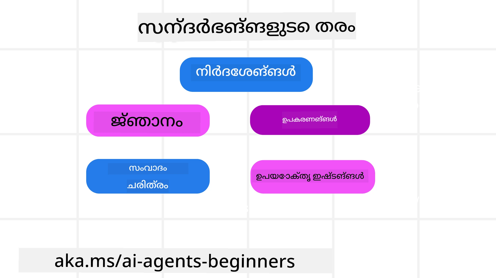
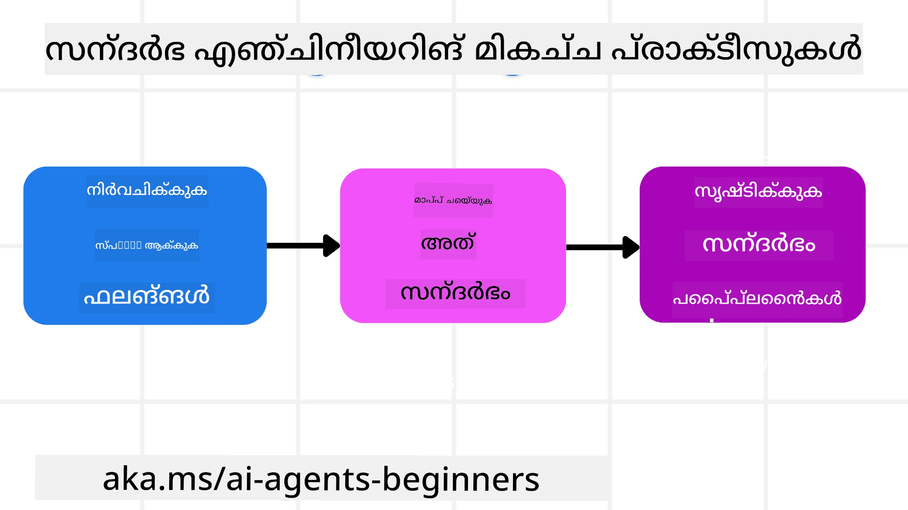

# AI ഏജന്റുകൾക്കായുള്ള കോൺടെക്സ്‌റ് എഞ്ചിനീയറിങ്

> _(ഈ പാഠത്തിന്റെ വീഡിയോ കാണാനായി മുകളിൽ ചിത്രത്തിൽ ക്ലിക്ക് ചെയ്യുക)_

നിങ്ങൾ നിർമ്മിക്കാനിരിക്കുന്ന AI ഏജന്റിനുവേണ്ടി ഉള്ള ആപ്ലിക്കേഷന്റെ സങ്കീർണ്ണത മനസിലാക്കുന്നത് വിശ്വസനീയമായ ഏജന്റ് നിർമ്മിക്കുന്നതിന് പ്രധാനമാണ്. പ്രാപ്ത പ്രോമ്പ്റ്റ് എഞ്ചിനീയറിങ്ങിനപ്പുറം സങ്കീർണ്ണ ആവശ്യങ്ങൾ കൈകാര്യം ചെയ്യാൻ ഫലപ്രദമായി വിവരങ്ങൾ നിയന്ത്രിക്കുന്ന AI ഏജന്റുകൾ ഞങ്ങൾ നിർമ്മിക്കേണ്ടതാണ്.

ഈ പാഠത്തിൽ, കോൺടെക്സ്‌റ് എഞ്ചിനീയറിങ്ങ് എന്നതെന്താണെന്ന്, AI ഏജന്റുകൾ നിർമ്മിക്കുന്നതിലുള്ള അതിന്റെ പങ്ക് എന്നിവയെക്കുറിച്ച് നോക്കാം.

## പരിചയം

ഈ പാഠത്തിൽ ചർച്ച ചെയ്യുന്നത്:

• **കോൺടെക്സ്‌റ് എഞ്ചിനീയറിങ്ങ് എന്താണെന്നും** അത് പ്രോമ്പ്റ്റ് എഞ്ചിനീയറിങ്ങിൽ നിന്നെന്തുകൊണ്ടാണ് വ്യത്യസ്തം എന്നുമാണ്.

• **ഫലപ്രദമായ കോൺടെക്സ്‌റ് എഞ്ചിനീയറിങ്ങിന് സമീപനങ്ങൾ**, എഴുതൽ, തിരഞ്ഞെടുക്കൽ, സംക്ഷേപിക്കൽ, വേർതിരിക്കൽ എന്നിവയും ഉൾപ്പെടുന്നു.

• **സাধാരണ കോൺടെക്സ്‌റ് തകരാറുകൾ** ഏജന്റിനെ തടസ്സപ്പെടുത്തുന്നതും അവ പരിഹരിക്കാനുള്ള മാർഗങ്ങളും.

## പഠന ലക്ഷ്യങ്ങൾ

ഈ പാഠം പൂർത്തിയാക്കിയതിന് ശേഷം നിങ്ങൾക്ക് അറിയാം:

• **കോൺടെക്സ്‌റ് എഞ്ചിനീയറിങ്ങിനെ നിർവചിക്കുകയും അതിനെ പ്രോമ്പ്റ്റ് എഞ്ചിനീയറിങ്ങിൽ നിന്ന് വേർതിരിക്കുകയും ചെയ്യാൻ.**

• **വലുതും വിവരങ്ങൾ ഉൾക്കൊള്ളുന്ന ഭാഷാ മോഡൽ (LLM) ആപ്ലിക്കേഷനുകളിൽ കോൺടെക്സ്‌റിന്റെ പ്രധാന ഘടകങ്ങൾ തിരിച്ചറിയുക.**

• **എജന്റിന്റെ പ്രകടനം മെച്ചപ്പെടുത്താൻ കോൺടെക്സ്‌റിന്റെ എഴുത്ത്, തിരഞ്ഞെടുപ്പ്, സംക്ഷേപണം, വേർതിരിക്കൽ തന്ത്രങ്ങൾ പ്രയോഗിക്കുക.**

• **പോയിസണിങ്, ക്ഷീണം, குழപ്പ്, സംഘർഷം പോലുള്ള സാധാരണ കോൺടെക്സ്‌റ് തകരാർ തിരിച്ചറിയുകയും ലഘൂകരിക്കൽ സാങ്കേതികങ്ങളും നടപ്പിലാക്കുകയും ചെയ്യുക.**

## കോൺടെക്സ്‌റ് എഞ്ചിനീയറിങ്ങ് എന്താണ്?

AI ഏജന്റുകൾക്കായി, കോൺടെക്സ്‌റ് ഏജന്റ് ഒരു വഴിതെളിവ് സ്വീകരിക്കാൻ ആകാംക്ഷ ചെയ്യുന്ന പ്രവർത്തനങ്ങളുടെ ആസൂത്രണത്തെ നിയന്ത്രിക്കുന്നതാണ്. അടുത്ത പ്രവർത്തനം പൂർത്തിയാക്കാൻ AI ഏജന്റിന് യോജിച്ച വിവരം ഉറപ്പുവരുത്തുന്നതാണ് കോൺടെക്സ്‌റ് എഞ്ചിനീയറിങ്ങ്. കോൺടെക്സ്‌റ് വിൻഡോയുടെ വലുപ്പം പരിധിയുള്ളതിനാൽ, ഏജന്റ് നിർമാതാക്കളായി നാം കോൺടെക്സ്‌റ് വിൻഡോയിലേക്ക് വിവരങ്ങൾ ചേർക്കൽ, നീക്കം എന്നിവ നിയന്ത്രിക്കുന്ന സംവിധാനങ്ങളും പ്രക്രിയകളും നിർമ്മിക്കേണ്ടതാണ്.

### പ്രോമ്പ്റ്റ് എഞ്ചിനീയറിങ്ങും കോൺടെക്സ്‌റ് എഞ്ചിനീയറിങ്ങും

പ്രോമ്പ്റ്റ് എഞ്ചിനീയറിങ് ഒരു നിശ്ചിത നിബന്ധനകൾ അടങ്ങിയ ഒരു സ്റ്റാറ്റിക് നിർദ്ദേശവുമായി AI ഏജന്റുകളെ സമർത്ഥമായി നയിക്കുന്നതിലാണ് കേന്ദ്രീകൃതമാകുന്നത്. കോൺടെക്സ്‌റ് എഞ്ചിനീയറിങ്ങും പ്രാരംഭ പ്രോമ്പ്റ്റും ഉൾപ്പെടുത്തിപറഞ്ഞാൽ, സമയംകൂടെ ഏജന്റിന് വേണ്ടത് ഉറപ്പാക്കുന്നതിനുള്ള ഇനത്തെയും വിവരങ്ങൾ മാനേജുചെയ്യുന്നതാണ്. കോൺടെക്സ്‌റ് എഞ്ചിനീയറിങ്ങിന്റെ പ്രധാന ആശയം ഈ പ്രക്രിയ ആവർത്തനയോഗ്യമാക്കി വിശ്വസനീയമാക്കുകയാണ്.

### കോൺടെക്സ്‌റിന്റെ തരംകൾ

കോൺടെക്സ്‌റിനു ഒരു കാര്യമാണെന്ന് മാത്രം ഓർത്തുകൂടാ. AI ഏജന്റിന് വേണ്ട വിവരം വിവിധ ഉത്ഭവങ്ങളിൽ നിന്ന് വരാം, ഏജന്റിന് ആ സാധനങ്ങളിൽ പ്രവേശനം ഉണ്ടാക്കുക നമ്മുടെ ബാധ്യതയാണ്:

AI ഏജന്റിന് മേൽനോട്ടം വഹിക്കേണ്ട കോൺടെക്സ്‌റിന്റെ തരംകൾ:

• **നിർദ്ദേശങ്ങൾ:** ഇത് ഏജന്റിന്റെ “നിയമങ്ങൾ” പോലെയാണ് – പ്രോമ്പ്റ്റുകൾ, സിസ്റ്റം സന്ദേശങ്ങൾ, കുറച്ച് ഉദാഹരണങ്ങൾ (ഏജന്റിന് എന്താണ് ചെയ്യേണ്ടതെന്ന് കാണിക്കുന്നത്), ഉപയോഗിക്കാവുന്ന ഉപകരണങ്ങളുടെ വിവരണങ്ങൾ. ഇവിടെ പ്രോമ്പ്റ്റ് എഞ്ചിനീയറിങ്ങും കോൺടെക്സ്‌റ് എഞ്ചനീയറിങ്ങും ചേർന്ന് പ്രവർത്തിക്കുന്നു.

• **ജ്ഞാനം:** വാസ്തവങ്ങൾ, ഡാറ്റാബേസുകളിൽ നിന്ന് ലഭിച്ച വിവരങ്ങൾ, അല്ലെങ്കിൽ ഏജന്റ് സമാഹരിച്ച ദീർഘകാല ഓർമ്മകൾ. റിട്രീവൽ ഓഗ്മെന്റ് ജെനറേഷൻ (RAG) സിസ്റ്റം ഉൾപ്പെടുത്തൽ ഇതിലേക്ക് ഉള്ളതായി, ഏജന്റിന് വ്യത്യസ്ത ജ്ഞാന സംഭരണികളും ഡാറ്റാബേസുകളും പ്രവേശിക്കാൻ കഴിയണം.

• **ഉപകരണങ്ങൾ:** ഏജന്റ് വിളിക്കാവുന്ന പുറത്തുള്ള ഫംഗ്ഷനുകളുടെ, API-കളുടെയും MCP സെർവറുകളുടെ നിർവചനം, അവ ഉപയോഗിച്ച് ലഭിക്കുന്ന ഫീഡ്‌ബാക്ക് (ഫലങ്ങൾ) ഉൾപ്പെടുന്നതും.

• **സംഭാഷണ ചരിത്രം:** ഉപയോക്താവുമായുള്ള തുടർച്ചയായ സംവാദം. സമയം കടന്നുപോകുമ്പോൾ ഇതു കൂടുതൽ നീളവും സങ്കീർണ്ണവുമാകും, അതിനാൽ കോൺടെക്സ്‌റ് വിൻഡോയിലുള്ള സ്ഥലം അധിഷ്ഠിതമാക്കും.

• **ഉപയോക്തൃ ഇഷ്ടങ്ങൾ:** ഉപയോക്തൃ ഇഷ്ടങ്ങളും നിരസനങ്ങളും സമയത്തോടൊപ്പം പഠിക്കപ്പെട്ടത്. പ്രധാന നിർണ്ണയങ്ങളിൽ സഹായിക്കുന്നതിന് ഇവ സൂക്ഷിക്കുകയും ഉപയോഗിക്കുകയും ചെയ്യാം.

## ഫലപ്രദമായ കോൺടെക്സ്‌റ് എഞ്ചിനീയറിങ്ങിന് തന്ത്രങ്ങൾ

### ആസൂത്രണ തന്ത്രങ്ങൾ

നല്ല കോൺടെക്സ്‌റ് എഞ്ചിനീയറിങ്ങിന് നല്ല ആസൂത്രണം തുടക്കമാണ്. കോൺടെക്സ്‌റ് എഞ്ചിനീയറിങ് ആശയം പ്രയോഗിക്കാൻ ഇതാ ഒരു സമീപനം:

1. **സ്പഷ്ടമായ ഫലം നിർവചിക്കുക** – AI ഏജന്റുകൾക്ക് നൽകപ്പെടേണ്ട ടൊസ്കുകളുടെ ഫലങ്ങൾ വ്യക്തമായി നിർവചിക്കപ്പെടണം. “AI ഏജന്റ് പ്രവർത്തനം പൂർത്തിയാക്കിയപ്പോള്‍ ലോകം എങ്ങിനെ കാണപ്പെടും?” എന്ന ചോദ്യം അനുസരിച്ച്, ഉപയോക്താവിന് എങ്ങനെ മാറ്റം, വിവരം, പ്രതികരണം ലഭിക്കണം എന്ന് നിർവചിക്കുക.

2. **കോൺടെക്സ്‌റ് മാഫ് ചെയ്യുക** – ഫലം നിർവചിച്ചതിനുശേഷം, “ഈ ടാസ്ക് പൂർത്തിയാക്കാൻ ഏജന്റ് എന്ത് വിവരങ്ങൾ വേണം?” എന്ന ചോദ്യം ഉത്തരം പറയണം. ഇതിലൂടെ ആ വിവരങ്ങൾ എവിടെയാണ് എന്ന കോൺടെക്സ്‌റിന്റെ മാപ്പ് തുടങ്ങാവുന്നതാണ്.

3. **കോൺടെക്സ്‌റ് പൈപ്പ്‌ലൈൻ സൃഷ്ടിക്കുക** – വിവരം എവിടെയാണ് എന്ന് അറിയുമ്പോൾ, “ഏജന്റ് ആ വിവരം എങ്ങനെ നേടും?” എന്നും ചോദിക്കണം. RAG, MCP സർവർ, മറ്റ് ഉപകരണങ്ങളും ഇതിൽ ഉൾപ്പെടാം.

### പ്രായോഗിക തന്ത്രങ്ങൾ

ആസൂത്രണം പ്രധാനമാണ്, എന്നാൽ വിവരങ്ങൾ ഏജന്റിന്റെ കോൺടെക്സ്‌റ് വിൻഡോയിലേക്ക് വരുമ്പോൾ, അനുഭവപരിചയ തന്ത്രങ്ങൾ വേണ്ടിവരും:

#### കോൺടെക്സ്‌റ് നിയന്ത്രണം

ചില വിവരങ്ങൾ സ്വയം കോൺടെക്സ്‌റ് വിൻഡോയിലേക്ക് ചേർന്നുപോകും എങ്കിലും, കോൺടെക്സ്‌റ് എഞ്ചിനീയറിങ് ഈ വിവരങ്ങളെ കൂടുതൽ സജീവമായി കൈകാര്യം ചെയ്യാനുള്ളതാണ്, ചില സമീപനങ്ങൾ:

 1. **ഏജന്റ് സ്ക്രാച്ച്പാഡ്**  
 ഒരു AI ഏജന്റ് ഒരു സെഷനിൽ പ്രയാസപ്പെട്ട കാര്യങ്ങളും ഉപയോക്തൃ ഇടപെടലുകളും കുറിക്കാനായി ഇത് ഉപയോഗിക്കാം. ഇത് കോൺടെക്സ്‌റ് വിൻഡോയിന് പുറത്ത് ഫയലോ റൺടൈം ഒബ്ജക്റ്റോ ആയി നിലനിർത്തപ്പെടണം; പിന്നീട് സെഷനിൽ ആവശ്യമായപ്പോൾ എജന്റ് അത് ലഭിക്കണം.

 2. **ഓർമ്മകൾ**  
 സ്ക്രാച്ച്പാഡുകൾ ഒരൊറ്റ സെഷന്റെ പുറത്ത് വിവരങ്ങൾ കൈകാര്യം ചെയ്യാൻ നല്ലതാണ്. ഓർമ്മകൾ ഏജന്റുകൾക്ക് പല സെഷനുകളിലും അനുബന്ധ വിവരം സൂക്ഷിക്കുകയും തിരിച്ചെടുക്കുകയും ചെയ്യാൻ സഹായിക്കുന്നു. ഇതിൽ സംഗ്രഹങ്ങൾ, ഉപയോക്തൃ ഇഷ്ടങ്ങൾ, ഭാവിയിലെ മെച്ചപ്പെടുത്തലിനുള്ള ഫീഡ്‌ബാക്ക് എന്നിവ ഉണ്ടായിരിക്കും.

 3. **കോൺടെക്സ്‌റ് സമ്മർദ്ദം കുറിക്കൽ**  
  കോൺടെക്സ്‌റ് വിൻഡോ വളരുന്നതും പരിധിയിലേക്കെത്തുന്നതും ആകുമ്പോൾ, സംഗ്രഹണവും ട്രിമിംഗ് (തുറക്കൽ) ഉം പോലുള്ള സാങ്കേതികങ്ങൾ ഉപയോഗിക്കാം. ഏറ്റവും പ്രാസക്തമായ വിവരങ്ങൾ മാത്രം സൂക്ഷിക്കുകയോ പഴയ സന്ദേശങ്ങൾ നീക്കംചെയ്യുകയോ ചെയ്യും.

 4. **മൾട്ടി-ഏജന്റ് സിസ്റ്റങ്ങൾ**  
  ഓരോ ഏജന്റിനും സ്വന്തം കോൺടെക്സ്‌റ് വിൻഡോ ഉണ്ടാകുന്നതിനാൽ, മൾട്ടി-ഏജന്റ് സിസ്റ്റം വികസിപ്പിക്കൽ ഒരു തരം കോൺടെക്സ്‌റ് എഞ്ചിനീയറിങ്ങാണ്. കോൺടെക്സ്‌റുകൾ എങ്ങനെ പങ്കുവെച്ചു നല്‍കാമെന്ന് പദ്ധതി തയ്യാറാക്കണം.

 5. **സാൻഡ്‌ബോക്സ് പരിസ്ഥിതികൾ**  
  ഏജന്റ് ചില കോഡ് ഓടിക്കേണ്ടതോ വലുതും വിവരവുമായി ഡോക്യുമെന്റ് പ്രോസസ്സ് ചെയ്യേണ്ടതോ ഉള്ളപ്പോഴാണ് ഇത് ഉപയോഗുന്നത്. ഇത് ടോക്കൺ വളരെയധികം ഉപയോഗിക്കാം. എന്നാൽ എല്ലാം കോൺടെക്സ്‌റ് വിൻഡോയിലല്ല സൂക്ഷിക്കാതിരുക്കാൻ, സാൻഡ്‌ബോക്‌സ് പരിസരം ഉപയോഗിച്ച് കോഡ് ഓടിക്കാം; ഫലങ്ങളും മറ്റു പ്രാസക്തമായ വിവരങ്ങളും മാത്രം കോൺടെക്സ്‌റിലേക്ക് കൊണ്ടുവരാം.

 6. **റൺടൈം സ്റ്റേറ്റ് ഒബ്ജക്റ്റുകൾ**  
  ഏജന്റ് പ്രത്യേക വിവരങ്ങൾക്ക് പ്രവേശനം വേണമെന്ന് ഉള്ളപ്പോൾ അവ നിയന്ത്രിക്കാൻ വിവരങ്ങളുടെ കന്റെയിനറുകൾ സൃഷ്ടിക്കുന്നതാണ്. സങ്കീർണ്ണ ടാസ്കിൽ, ഓരോ സബ്ടാസ്‌കിന്റെ ഫലങ്ങൾ പടി പടിയായി സൂക്ഷിക്കാൻ ഇത് സഹായിക്കും, കോൺടെക്സ്‌റിനെ ആ സബ്ടാസ്‌കിനോടേ ബന്ധിപ്പിച്ച് വിടാം.

### കോൺടെക്സ്‌റ് എഞ്ചിനീയറിങ്ങിന്റെ ഉദാഹരണം

നമുക്ക് ഒരു AI ഏജന്റിനെ **"പാരിസിലേക്ക് ഒരു യാത്ര ബുക്ക് ചെയ്യാമോ"** എന്ന് പറഞ്ഞുവെന്ന് എങ്കിൽ,

• പ്രോമ്പ്റ്റ് എഞ്ചിനീയറിങ്ങ് മാത്രമാണ് ഉപയോഗിക്കുന്നത് എളുപ്പം: **"ശരി, നിങ്ങൾക്ക് പാരിസിലേക്ക് പോകാൻ എപ്പോൾ ആഗ്രഹമാണ്?"** – ഉപയോക്താവിന്റെ നേരിട്ട് ചോദ്യം വേഗം കൈകാര്യം ചെയ്തു.

• കോൺടെക്സ്‌റ് എഞ്ചിനീയറിങ് തന്ത്രങ്ങൾ ഉപയോഗിക്കുന്ന ഏജന്റ് ഇതിലേതും കൂടുതൽ ചെയ്യും. മറുപടി നൽകിയതിന് മുമ്പ്, സിസ്റ്റം:

  ◦ **നിങ്ങളുടെ കലണ്ടർ പരിശോധിക്കുക** (വാസ്തവ സമയത്തിൽ ഡാറ്റ റിട്ട്രീവ് ചെയ്ത്).

  ◦ **മുമ്പത്തെ യാത്ര ഇഷ്ടങ്ങൾ ഓർക്കുക** (ദീർഘകാല ഓർമ്മയിൽ നിന്ന്) - നിങ്ങളുടെ ഇഷ്ടപ്പെട്ട എയർലൈൻ, ബജറ്റ്, നേരിട്ടുള്ള ഫ്ലൈറ്റുകൾക്കുള്ള മുൻഗണന എന്നിവ.

  ◦ **ഫ്ലൈറ്റും ഹോട്ടലും ബുക്ക് ചെയ്യാനുള്ള ഉപകരണങ്ങൾ തിരിച്ചറിയുക**.

- തുടർന്ന് ഒരു ഉദാഹരണ മറുപടി: "ഹേയ് [നിങ്ങളുടെ പേര്]! ഒക്റ്റോബർ ആദ്യ ആഴ്ച നിങ്ങൾക്ക് സ്വതന്ത്രമാണ്. സാധാരണ ബജറ്റിനുള്ളിൽ [ഇഷ്ടപ്പെട്ട എയർലൈൻ] ന്റെ നേരിട്ടുള്ള ഫ്ലൈറ്റുകൾ അന്വേഷിക്കാമോ?". ഈ സമൃദ്ധമായ, കോൺടെക്സ്‌റ് അറിഞ്ഞ മറുപടി കോൺടെക്സ്‌റ് എഞ്ചിനീയറിങ്ങിന്റെ ശക്തി കാണിക്കുന്നു.

## സാധാരണ കോൺടെക്സ്‌റ് തകരാർ

### കോൺടെക്സ്‌റ് പൊയിസണിങ്

**എന്താണ്:** ഹോള്യൂസിനേഷൻ (LLM സൃഷ്ടിച്ച തെറ്റായ വിവരം) അല്ലെങ്കിൽ ഒരു പിശക് കോൺടെക്സ്‌റിലേക്ക് കടന്നുപോയി ആവർത്തിക്കണമെന്നുവരുമ്പോൾ ഏജന്റ് അസാധ്യമായ ലക്ഷ്യങ്ങളിലേക്ക് പോവുകയോ അർത്ഥരഹിതമായ തന്ത്രങ്ങൾ വികസിപ്പിക്കുകയോ ചെയ്യുന്നു.

**ചെയ്യേണ്ട പണി:** **കോൺടെക്സ്‌റ് സാധുത പരിശോധന**യും **ക്വാറന്റൈൻ** പ്രവർത്തനവും നടപ്പിലാക്കുക. ദീർഘകാല ഓർമ്മയിൽ ചേർക്കുന്നതിനു മുൻപ് വിവരങ്ങൾ പരിശോധന നടത്തുക. ദോഷകരമായ വിവരങ്ങൾ കണ്ടെത്തിയാൽ പുതിയ കോൺടെക്സ്‌റ് തന്ത്രങ്ങൾ തുടങ്ങുക.

**യാത്ര ബുക്കിംഗ് ഉദാഹരണം:** നിങ്ങളുടെ ഏജന്റ് ഒരു **ചെറിയ പ്രാദേശിക വിമാനത്താവളത്തിൽ നിന്നുള്ള ഒരു ദൂരസ്ഥ അന്താരാഷ്ട്ര നഗരത്തിലേക്കുള്ള നേരിട്ടുള്ള ഫ്‌ളൈറ്റ്** ഉള്ളതായി ഭ്രമിക്കുന്നു, പക്ഷേ ആ വിമാനത്താവളം അന്താരാഷ്ട്ര ഫ്ലൈറ്റുകൾ നൽകുന്നില്ല. ഈ ഉള്ളുപോലുള്ള വിവരങ്ങൾ കോൺടെക്സ്‌റിലേക്ക് സൂക്ഷിക്കുന്നതോടെ, പിന്നീട് ടിക്കറ്റ് ബുക്ക് ചെയ്യാൻ ശ്രമിക്കുമ്പോൾ ഏജന്റ് ആ അസാധ്യമായ രൂട്ട് ഉണ്ടെന്ന് കരുതി പിഴവുകൾ ആവർത്തിക്കുന്നുമുണ്ട്.

**പരിഹാരം:** ഫ്‌ളൈറ്റ് നിലവാരണവും മാർഗങ്ങളും ഒരു വാസ്തവകാല API ഉപയോഗിച്ച് പരിശോധന നടത്തുക, അത് സുഖകരമായിരിക്കുമ്പോൾ മാത്രമേ ഏജന്റിന്റെ പ്രവർത്തന കോൺടെക്സ്‌റിലേക്ക് ചേർക്കുക. പരിശോധന പരാജയപ്പെട്ടാൽ തെറ്റായ വിവരം ക്വാറന്റൈൻ ചെയ്‌തുകൊണ്ടു മുന്നോട്ട് മുന്നേറരുത്.

### കോൺടെക്സ്‌റ് ക്ഷീണം

**എന്താണ്:** കോൺടെക്സ്‌റ് വളരെ വലുതായി മോഡൽ പരിശീലനത്തിൽ നിന്ന് പഠിച്ചത് ഒഴിവാക്കി കൂട്ടിച്ചേർത്ത ചരിത്രത്തിൽ മാത്രം ശ്രദ്ധ കേന്ദ്രീകരിച്ച് ആവർത്തനപരമായ അല്ലെങ്കിൽ മറ്റ് പ്രയോജനങ്ങളില്ലാത്ത നടപടി സ്വീകരിക്കുകയും ചെയ്യുന്നു. കോൺടെക്സ്‌റ് വിൻഡോ പൂർണ്ണമാകുന്നതിന് മുൻപ് പിഴവുകൾ സംഭവിക്കാം.

**ചെയ്യേണ്ടത്:** **കോൺടെക്സ്‌റ് സംഗ്രഹിക്കൽ** ഉപയോഗിക്കുക. പതിമൂന്നും ഒപ്പം ലഭിച്ച വിവരങ്ങൾ ചുരുക്കം ചെയ്‌തു പ്രധാന സവിശേഷതകൾ സൂക്ഷിക്കുക; ആവർത്തനപരമായ ചരിത്രം ഒഴിവാക്കുക. ഇത് ശ്രദ്ധ പുനഃസജ്ജമാക്കാൻ സഹായിക്കും.

**യാത്ര ബുക്കിംഗ് ഉദാഹരണം:** നീണ്ടകാലം നിങ്ങളുടെ സ്വപ്‌ന യാത്രാ സ്ഥലങ്ങളെക്കുറിച്ച് സംസാരിക്കുന്നുണ്ടായിരിക്കുന്നു, രണ്ടു വർഷം മുമ്പുള്ള ഒരു ബാക്ക് പാക്കിംഗ് യാത്രയുടെ വിശദം വിശദവിവരണവും ഉൾപ്പെടുന്നു. പിന്നീട് നിങ്ങൾ **"അടുത്ത മാസം ارزانമുള്ള ഒരു ഫ്ലൈറ്റ് കണ്ടെത്തൂ"** എന്ന് പറഞ്ഞപ്പോൾ, ഏജന്റ് പഴയ പ്രാസക്തമല്ലാത്ത വിവരങ്ങളിൽ കുടുങ്ങി ബാക്ക് പാക്കിംഗ് സാമഗ്രികൾക്കോ മുൻകാല യാത്രാമുറികളും സംബന്ധിച്ച ചോദ്യങ്ങൾ തുടരുന്നു, നിലവിലെ അഭ്യര്‍ത്ഥനയെ അവഗണിച്ചു.

**പരിഹാരം:** ചില തവണകൾ കഴിഞ്ഞാൽ അല്ലെങ്കിൽ കോൺടെക്സ്‌റ് വലുതാകുമ്പോൾ, ഏജന്റ് ഏറ്റവും പുതിയ പ്രസക്തമായ സംഭാഷണ ഭാഗങ്ങൾ സാരാംശമാക്കുകയും നിലവിലെ യാത്രാ തീയതികളും ഭാഗ്യസ്ഥലവും മുൻനിർത്തി അത് ഉപയോഗിച്ച് അടുത്ത LLM കോൾ നടത്തുകയും ചെയ്യണം; കുറവ് പ്രാസക്തരായ ചരിത്ര ചാറ്റ് ഒഴിവാക്കണം.

### കോൺടെക്സ്‌റ് குழപ്പം

**എന്താണ്:** അനാവശ്യമായ കോൺടെക്സ്‌റ്, സാധാരണയായി നിരവധി ലഭ്യമായ ഉപകരണങ്ങളുടെ രൂപത്തിലാണ് മോഡൽ തെറ്റായ മറുപടികൾ സൃഷ്ടിച്ചത് അല്ലെങ്കിൽ അനിർദ്ദിഷ്ട ഉപകരണങ്ങൾ വിളിച്ചതാണ്. ചെറിയ മോഡലുകൾക്ക് ഇത് പ്രത്യേകിച്ച് പ്രാബല്യമാണ്.

**ചെയ്യേണ്ടത്:** RAG സാങ്കേതികങ്ങൾ ഉപയോഗിച്ച് **ഉപകരണ ലോഡ്ഔട്ട് മാനേജ്മെന്റ്** നടപ്പിലാക്കുക. ഉപകരണ വിവരണങ്ങൾ വെക്ടർ ഡാറ്റാബേസിൽ സൂക്ഷിക്കുക, എല്ലാ ആവശ്യത്തിനും ഏറ്റവും പ്രാസക്തമായ ഉപകരണങ്ങൾ മാത്രം തിരഞ്ഞെടുക്കുക. 30-ൽ കുറവായ ഉപകരണങ്ങൾ തിരഞ്ഞെടുക്കുന്നത് മാർഗ്ഗനിർദ്ദേശമാണ്.

**യാത്ര ബുക്കിംഗ് ഉദാഹരണം:** നിങ്ങളുടെ ഏജന്റിന് നിരവധി ഉപകരണങ്ങൾ ഉണ്ട്: `book_flight`, `book_hotel`, `rent_car`, `find_tours`, `currency_converter`, `weather_forecast`, `restaurant_reservations` എന്നിവ. നിങ്ങൾ **"പാരിസിൽ ചുറ്റുമടക്കാനുള്ള ഉത്തമ മാർഗം എന്താണ്?"** എന്ന് ചോദിച്ചപ്പോൾ, ഉപകരണങ്ങളുടെ വലിയ എണ്ണം കാരണം ഏജന്റ് പാരിസിനുള്ളിൽ തന്നെ `book_flight` വിളിക്കാനും `rent_car` വിളിക്കാനും ശ്രമിക്കുന്നു, നിങ്ങൾ പബ്ലിക് ട്രാൻസ്പോർട്ട് ഇഷ്ടപ്പെട്ടിട്ടും, ഉപകരണ വിവരണങ്ങൾ ഒതുക്കം ചേര്‍ന്നതായോ ഏറ്റവും ഉചിതമായത് തിരിച്ചറിയാൻ കഴിയാതെയോ കൊണ്ടാണ് ഈ പ്രശ്നം.

**പരിഹാരം:** ഉപകരണ വിവരണങ്ങൾക്ക് മുകളിൽ RAG ഉപയോഗിക്കുക. പാരിസിൽ ചുറ്റുമടക്കാനുള്ള വിവരങ്ങൾ ചോദിച്ചപ്പോൾ, സിസ്റ്റം നിങ്ങളുടെ ചോദ്യത്തിന് ഏറ്റവും അനുയോജ്യമായ ഉപകരണങ്ങൾ മാത്രം (ഉദാ: `rent_car`, `public_transport_info`) തിരിച്ചു നൽകി LLM-ൽ വൈകാരികമായ ഉപകരണങ്ങളുടെ "ലോഡ്ഔട്ട്" സജ്ജമാക്കുന്നു.

### കോൺടെക്സ്‌റ് സംഘർഷം

**എന്താണ്:** കോൺടെക്സ്‌റിനുള്ളിൽ പരസ്പരം വിരുദ്ധമായ വിവരങ്ങൾ ഉണ്ടായപ്പോൾ, അസംയോജിതമായ ചിന്തനയോ തെറ്റായ അന്തിമ മറുപടികളോ ഉണ്ടാകുന്നു. ഇത് സാധാരണയായി വിവരങ്ങൾ പടിമുടി പടിയായി എത്തുമ്പോഴാണ് സംഭവിക്കുന്നത്, ആദ്യത്തെ തെറ്റായ സൂചനകൾ കോൺടെക്സ്‌റിന്റെ ഭാഗമായിരിക്കാം.

**ചെയ്യേണ്ടത്:** **കോൺടെക്സ്‌റ് പ്രൂണിംഗ്**യും **ഓഫ്‌ലോഡിംഗ്**ഉം വുപയോഗിക്കുക. പുതിയ വിവരങ്ങൾ വന്നപ്പോൾ പഴയതോ വിരുദ്ധവുമായ വിവരങ്ങൾ നീക്കംചെയ്യുക. പ്രധാന കോൺടെക്സ്‌ർ അലാത് എടുക്കാതെ തനിക്ക് പ്രത്യേകമായ "സ്ക്രാച്ച്‌പാഡ്" വർക്ക്സ്പേസ് നൽകിയിട്ടുള്ള മോടൽ പ്രോസസ്സ് നടത്താനാകും.

**യാത്ര ബുക്കിംഗ് ഉദാഹരണം:** ആദ്യം, നിങ്ങൾ ഏജന്റിനോട് **"എക്കണോമി ക്ലാസിൽ ഞാനുo പറക്കും"** എന്ന് പറഞ്ഞു. സംഭാഷണത്തിന്റെicial റിലോക്ക് ചെയ്തപ്പോൾ നിങ്ങൾ **"ഇത് യാത്രയ്ക്ക് ബിസിനസ് ക്ലാസിൽ പോയി"** എന്ന് മാറ്റിവച്ചു. രണ്ടാമത്തെ നിർദ്ദേശവും മുൻതിനടിയില്‍ ഉണ്ടായാൽ ഏജന്റ് വിരുദ്ധമായ തിരച്ചിൽ ഫലങ്ങൾ ലഭിക്കുകയോ ഏത് മുൻഗണന മുൻതൂക്കം നൽകണമെന്നറിയാതെ ആശയക്കുഴപ്പം വന്നു.

**പരിഹാരം:** **കോൺടെക്സ്‌റ് പ്രൂണിംഗ് നടപ്പാക്കുക.** പുതിയ നിർദ്ദേശം പഴയത് വിരുദ്ധമാണെങ്കിൽ പഴയ നിർദേശം നീക്കം ചെയ്യുകയോ കോൺടെക്സ്‌റിൽ വ്യക്തമായി അയക്കുകയോ ചെയ്യുക. അല്ലെങ്കിൽ, ഏജന്റ് ഒരു **സ്ക്രാച്ച്‌പാഡ്** ഉപയോഗിച്ച് വർഗ്ഗീകരിച്ച് വിരോധിക്കുന്ന ഇഷ്ടങ്ങൾ ഒത്തുചേർക്കുകയും ഒടുവിൽ പരസ്പരം ഐക്യപ്പെടുത്തിയ നിർദ്ദേശത്തെ ആകർഷണീയമാക്കി പ്രവർത്തിക്കുക.

## കോൺടെക്സ്‌റ് എഞ്ചിനീയറിങ്ങിനെ കുറിച്ച് കൂടുതൽ സംശയങ്ങളുണ്ടോ?

മറ്റു പഠനാർത്ഥികളുമായി കൂടിക്കാഴ്ച ചെയ്യാനും, ഓഫീസ് ആവരണങ്ങളിൽ പങ്കെടുക്കാനും, നിങ്ങളുടെ AI ഏജന്റ് ചോദ്യങ്ങൾക്കുള്ള ഉത്തരം ലഭിക്കാനും [Microsoft Foundry Discord](https://aka.ms/ai-agents/discord) ൽ ചേർക്കുക.

---

<!-- CO-OP TRANSLATOR DISCLAIMER START -->
**അസൂയ കുറിപ്പ്**:  
ഈ പത്രം AI വിവർത്തന സേവനം [Co-op Translator](https://github.com/Azure/co-op-translator) ഉപയോഗിച്ച് വിവർത്തനം ചെയ്തതാണ്. നാം ശുദ്ധീകരണത്തിനായി പരിശ്രമിച്ചിട്ടും, സ്വയം ഉപയോഗിക്കുന്ന വിവർത്തനങ്ങളിൽ പിഴവുകളും തെറ്റുകളും ഉണ്ടായേക്കാമെന്ന് ദയവായി ശ്രദ്ധിക്കുക. അതിന്റെ സ്വാഭാവിക ഭാഷയിലെ അച്ചടിതവണ പ്രമാണം പ്രധാന מקורമായി പരിഗണിക്കേണ്ടതാണ്. പ്രാധാന്യമുള്ള വിവരങ്ങൾക്ക്, പ്രൊഫഷണൽ മനുഷ്യ വിവർത്തനം ശുപാർശ ചെയ്യുന്നു. ഈ വിവർത്തനത്തിന്റെ ഉപയോഗത്തിൽ നിന്നുണ്ടാകുന്ന ഏതെങ്കിലും പിശകുകൾക്കും തെറ്റിദ്ധാരണകൾക്കും നാം ഉത്തരവാദികളല്ല.
<!-- CO-OP TRANSLATOR DISCLAIMER END -->