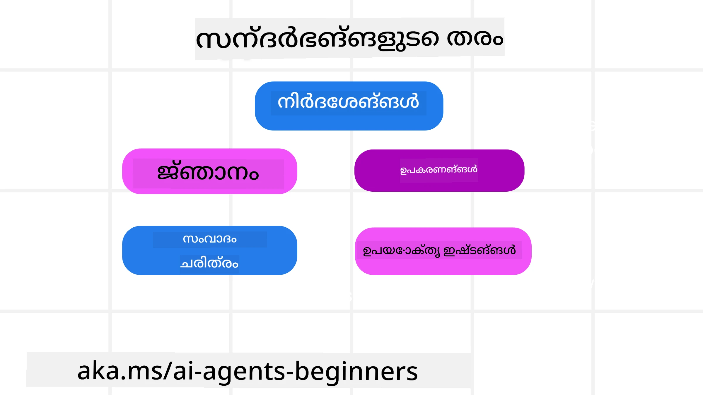
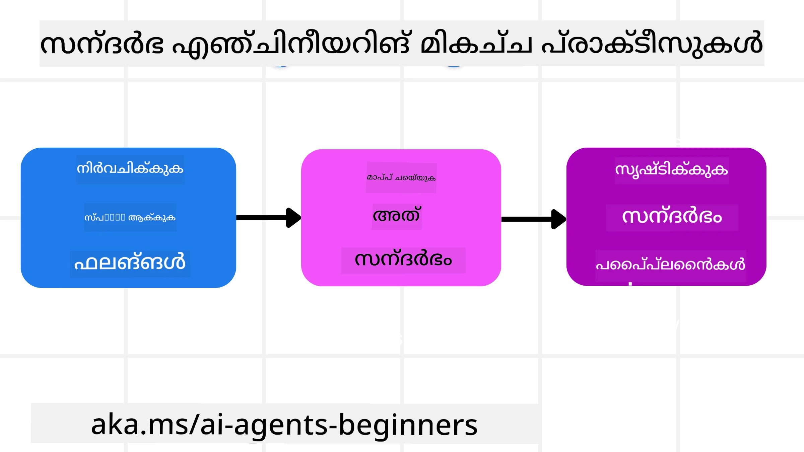

# എഐ ഏജന്റുകള്‍ക്കുള്ള കോൺടക്സ് എൻജിനീയറിംഗ്

> _(ഈ പാഠത്തിന്റെ വീഡിയോ കാണാൻ മേൽ ചിത്രത്തിൽ ക്ലിക്ക് ചെയ്യുക)_

നിങ്ങൾ നിർമ്മിക്കുന്ന എഐ ഏജന്റിന് വേണ്ടി ആപ്‌ളിക്കേഷൻ അതിന്റെ സങ്കീർണത മനസ്സിലാക്കുന്നത് വിശ്വസനീയമായ ഒരു എഐ ഏജന്റ് ഉണ്ടാക്കുന്നതിനും പ്രധാനമാണ്. പ്രോംപ്റ്റ് എൻജിനീയറിംഗ് കടത്തി കിടക്കുന്ന സങ്കീർണ ആവശ്യങ്ങൾക്ക് മറുപടി നൽകാൻ വിവരങ്ങൾ ഫലപ്രദമായി കൈകാര്യം ചെയ്യുന്ന എഐ ഏജന്റുകൾ നിർമ്മിക്കേണ്ടതാണ്.

ഈ പാഠത്തിൽ, കോൺടക്സ് എൻജിനീയറിംഗ് എന്താണെന്ന് അതിന്റെ എഐ ഏജന്റുകൾ നിർമ്മിക്കുന്നതിൽ വഹിക്കുന്ന പങ്ക് എന്നിവ നാം നോക്കിപ്പിടിക്കും.

## പരിചയപ്പെടുത്തൽ

ഈ പാഠത്തിൽ കൈകാര്യം ചെയ്യുന്നത്:

• **കോൺടക്സ് എൻജിനീയറിംഗ് എന്താണെന്ന്** പ്രോംപ്റ്റ് എൻജിനീയറിംഗിൽ നിന്ന് വ്യത്യസ്തമാണ് എന്തുകൊണ്ടെന്ന്.

• **ഫലപ്രദമായ കോൺടക്സ് എൻജിനീയറിംഗിനുള്ള തന്ത്രങ്ങൾ**, വിവരങ്ങൾ എഴുതുന്നതിനും, തിരഞ്ഞെടുക്കുന്നതിനും, സംഹരിക്കാനും, വേർതിരിക്കാനുമുള്ള മാർഗങ്ങൾ ഉൾപ്പെടെ.

• നിങ്ങളുടെ എഐ ഏജന്റ് പക്കണക്കാക്കാവുന്ന **സാധാരണ കോൺടക്സ് പരാജയങ്ങൾ** എന്തൊക്കെയാണ് എന്നും അവ പരിഹരിക്കുന്ന മാര്‍ഗങ്ങൾ.

## പഠന ലക്ഷ്യങ്ങൾ

ഈ പാഠം പൂർത്തിയാക്കിയതിനുശേഷം, നിങ്ങൾ അറിയുന്നതും മനസ്സിലാക്കുന്നതും:

• **കോൺടക്സ് എൻജിനീയറിംഗ് നിർവചിക്കുകയും** പ്രോംപ്റ്റ് എൻജിനീയറിംഗിൽനിന്നു വ്യത്യാസം തിരിച്ചറിയുകയും ചെയ്യുക.

• വലിയ ഭാഷാ മോഡൽ (LLM) ആപ്ലിക്കേഷനുകളിൽ കോൺടക്സ് ഉള്ള പ്രധാന ഘടകങ്ങൾ തിരിച്ചറിയുക.

• ഏജന്റ് പ്രകടനം മെച്ചപ്പെടുത്താൻ കോൺടക്സ് എഴുതുന്നതിനുള്ള, തിരഞ്ഞെടുക്കുന്നതിനുള്ള, സംഹരിക്കുന്നതിനുള്ള, വേർതിരിക്കുന്നതിനുള്ള തന്ത്രങ്ങൾ പ്രയോഗിക്കുക.

• വിഷാക്രീഡ, വാർത്താതെ, ആശയക്കുഴപ്പം, സംഘർഷം പോലുള്ള സാധാരണ കോൺടക്സ് പരാജയങ്ങൾ തിരിച്ചറിയുക, അവ തടയാൻ മാർഗങ്ങൾ പ്രയോഗിക്കുക.

## കോൺടക്സ് എൻജിനീയറിംഗ് എന്ന് എന്ത്?

എഐ ഏജന്റുകൾക്ക്, കോൺടക്സ് ആ ഏജന്റെ പ്രത്യേക പ്രവര്‍ത്തനങ്ങൾ കടപ്പാട് വച്ച പദ്ധതികളിലാണ്. കോൺടക്സ് എൻജിനീയറിംഗ് എന്ന് വെച്ചാൽ അതായത്, അടുത്ത പടിയിലേക്കുള്ള ടാസ്‌ക് പൂർത്തിയാക്കാൻ ആവശ്യമായ ശരിയായ വിവരങ്ങളുണ്ടാക്കുന്ന പ്രക്രിയയാണ്. കോൺടക്സ് വിൻഡോ വലുതല്ലാത്തതിനാൽ, ഏജന്റ് നിർമ്മാതാക്കളായ നമ്മൾ ഈ വിൻഡോയിലേക്ക് വിവരങ്ങൾ ചേർക്കുകയും നീക്കം ചെയ്യുകയും സംഹരിക്കുകയും ചെയ്യാനുള്ള സംവിധാനങ്ങൾ രൂപകൽപ്പന ചെയ്യണം.

### പ്രോംപ്റ്റ് എൻജിനീയറിങ്ങും കോൺടക്സ് എൻജിനീയറിങ്ങും തമ്മിലുള്ള വ്യത്യാസം

പ്രോംപ്റ്റ് എൻജിനീയറിംഗ് എഐ ഏജന്റുകളെ ഫലപ്രദമായി മാർഗനിർദേശമാർഗംനൽകുന്നതിനുള്ള ഒരു സ്ഥിരമായ നിർദ്ദേശങ്ങളുടെ സെറ്റിനെ കുറിച്ചാണ് ആലോചിക്കുന്നത്. കോൺടക്സ് എൻജിനീയറിംഗ് ഒരു സജീവവും ദൃശ്യവും ഉള്ള വിവരങ്ങളുടെ സെറ്റ് കൈകാര്യം ചെയ്യാനുള്ള രീതിയാണ്. ഇത് എഐ ഏജന്റിന് വേണമെന്നുള്ളതിനനുസൃതമായ സമയത്തിനെ തിരക്കി നൽകാൻ ഉറപ്പുവരുത്തുന്നു. കോൺടക്സ് എൻജിനീയറിങ്ങിന്റെ പ്രധാന ആശയം ഈ പ്രക്രിയ ആവർത്തനയോഗ്യമാക്കുകയും വിശ്വാസയോഗ്യമാക്കുകയും ചെയ്യുക എന്നതാണ്.

### കോൺടക്സ് നിലകൾ

കോൺടക്സ് ഒരു ഏകതരം വസ്തുവല്ല എന്ന് ഓർക്കുന്നത് നിർണ്ണായകം. എഐ ഏജന്റിന് ആവശ്യമായ വിവരങ്ങൾ വ്യത്യസ്ത സ്രോതസ്സുകളിൽ നിന്നാകാം വരിക, ആ സ്രോതസ്സുകളിലേക്ക് ഏജന്റിന് ആക്സസ് ഉറപ്പാക്കുക നമ്മുടെയതിനെയാണ്.

എഐ ഏജന്റ് കൈകാര്യം ചെയ്യേണ്ടത് ഈ തരത്തിലുള്ള കോൺടക്‌സുകൾ ആണ്:

• **നിർദ്ദേശങ്ങൾ:** ഏജന്റിന്റെ "നിയമങ്ങളായി" പ്രവർത്തിക്കുന്ന പ്രോംപ്റ്റുകൾ, സിസ്റ്റം സന്ദേശങ്ങൾ, കുറച്ച് തെളിവുകൾ (എഐയെ എന്തെങ്കിലും ചെയ്യാൻ എങ്ങനെ പഠിപ്പിക്കാമെന്ന് കാണിക്കുന്നത്), ഉപകരണങ്ങളുടെ വിവരണങ്ങൾ ഇവ ഉള്‍പ്പെടുന്നു. ഇത് പ്രോംപ്റ്റ് എൻജിനീയറിംഗ് കോൺടക്സ് എൻജിനീയറിംഗുമായി ചേർന്ന് പ്രവർത്തിക്കുന്നു.

• **ജ്ഞാനം:** വസ്തുതകൾ, ഡാറ്റാബേസുകളിൽ നിന്നുളള വിവരങ്ങൾ, അല്ലെങ്കിൽ ഏജന്റിന് സമ്പാദ്യമായ ദീർഘകാല ഓർമകൾ എന്നിവ ഉൾപ്പെടുന്നു. എഐ ഏജന്റിന് വ്യത്യസ്ത ജ്ഞാന സംഭരണങ്ങളും ഡാറ്റാബേസുകളുമായി ആക്സസ് വേണമെങ്കിൽ റിട്രീവൽ ഓഗ്‌മെന്റഡ് ജനറേഷൻ (RAG) സിസ്റ്റം സംയോജിപ്പിക്കലും ഇതിന്റെ ഭാഗമാണ്.

• **ഉപകരണങ്ങൾ:** ഏജന്റ് വിളിക്കാൻ കഴിയുന്ന ബാഹ്യ ഫംഗ്ഷനുകൾ, API-കൾ, MCP സെർവറുകൾ എന്നിവയുടെ നിർവചനങ്ങൾ, അവ ഉപയോഗിച്ച് ലഭിക്കുന്ന ഫീഡ്ബാക്കും നിവർത്തിക്കും ഇവ ഇവിടെ ഉൾപ്പെടുന്നു.

• **സംവാദ ചരിത്രം:** ഉപയോക്താവുമായുള്ള നടക്കുന്ന സംഭാഷണം. സമയം കടന്നുപോകുന്നത് കൂടെ, ഈ സംഭാഷണങ്ങൾ കൂടുതൽ ദൈർഘ്യമേറിയും സങ്കീർണവുമാകുന്നു, അതിനാൽ കോൺടക്സ് വിൻഡോയിൽ സ്ഥലം ആവശ്യമാണ്.

• **ഉപയോക്തൃ ഇഷ്ടങ്ങൾ:** ഒരു ഉപയോക്താവിന്റെ ഇഷ്ടങ്ങൾക്കും അവിഷ്കാരങ്ങൾക്കും കാലക്രമേണ പഠിച്ച വിവരങ്ങൾ. പ്രധാന തീരുമാനം എടുക്കുമ്പോൾ ഉപയോക്താവിന് സഹായം നൽകാൻ ഇവ സൂക്ഷിക്കാനും ആവശ്യമായപ്പോൾ വിളിക്കാനും കഴിയും.

## ഫലപ്രദമായ കോൺടക്സ് എൻജിനീയറിംഗിനുള്ള തന്ത്രങ്ങൾ

### പദ്ധതിയിടൽ തന്ത്രങ്ങൾ

നല്ല കോൺടക്സ് എൻജിനീയറിംഗ് നല്ല പദ്ധതിയിടലിൽ നിന്നാണ് തുടങ്ങുന്നത്. കോൺടക്സ് എൻജിനീയറിങ്ങിന്റെ ആശയം പ്രയോഗിക്കാൻ സഹായിക്കുന്ന ഒരു സമീപനം ഇതാ:

1. **സ്പഷ്ടമായ ഫലങ്ങൾ നിർവചിക്കുക** - എഐ ഏജന്റുകൾക്ക് നല്കുന്ന ടാസ്‌കുകളുടെ ഫലങ്ങൾ വ്യക്തമായി നിർവചിക്കണം. "എഐ ഏജന്റ് ടാസ്‌ക് പൂർത്തിയാക്കിയതിന് ശേഷം ലോകം എങ്ങിനെയാകും?" എന്ന ചോദ്യത്തിന് ഉത്തരം നൽകുക. മറ്റൊരു വഴിയിലുള്ള വ്യത്യാസം, വിവരം, അല്ലെങ്കിൽ പ്രതികരണം ഉപയോക്തയ്ക്കുണ്ടാകണം.
2. **കോൺടക്സ് മാപ്പ് ചെയ്യുക** - എഐ ഏജന്റിന്റെ ഫലങ്ങൾ നിർവചിച്ചതിനുശേഷം, "എഐ ഏജന്റ് ഈ ടാസ്‌ക് പൂർത്തിയാക്കാൻ എന്ത് വിവരങ്ങൾ ആവശ്യമുണ്ട്?" എന്ന ചോദ്യത്തിന് ഉത്തരമിടണം. ഇങ്ങനെ വാർത്ത കിട്ടുന്ന സ്ഥലങ്ങളെ മാപ്പ് ചെയ്യാം.
3. **കോൺടക്സ് പൈപ്പ്‌ലൈൻസ് സൃഷ്ടിക്കുക** - വിവരങ്ങൾ ലഭ്യമെന്ന കാര്യം മനസ്സിലായപ്പോള്‍ "എങ്ങനെ ഏജന്റ് ഈ വിവരം കരസ്ഥമാക്കും?" എന്ന ചോദ്യത്തിന് ഉത്തരമിടുക. RAG, MCP സെർവറുകൾ തുടങ്ങിയ ഉപകരണങ്ങളുടെ ഉപയോഗവും ഇതിനായി ഉൾപ്പെടും.

### പ്രായോഗിക തന്ത്രങ്ങൾ

പദ്ധതി നിർമാണം പ്രധാനമാണ്, എന്നാൽ ഒരു പ്രാരംഭ വിൻഡോയിലേക്ക് വിവരങ്ങൾ വരാനാരംഭിക്കുമ്പോൾ അവ കൈകാര്യം ചെയ്യാൻ പ്രായോഗിക തന്ത്രങ്ങൾ വേണം:

#### കോൺടക്സ് കൈകാര്യം ചെയ്യൽ

ചില വിവരങ്ങൾ കോൺടക്സ് വിൻഡോയിലേക്ക് സ്വയം ചേർക്കപ്പെടും, പക്ഷേ കോൺടക്സ് എൻജിനീയറിംഗ് ഈ വിവരങ്ങളെ കുറിച്ച് കൂടുതൽ സജീവ പങ്കാളിത്തമാണ് ആവശ്യപ്പെടുന്നത്, ഇതിനായി ചില തന്ത്രങ്ങൾ ഇങ്ങനെ കാണാം:

 1. **ഏജന്റ് സ്രാച്ച്‌പാഡ്**  
 ഒരു സെഷനിൽ പ്രാസംഗികമായ വിവരങ്ങൾ കുറിക്കാൻ എഐ ഏജന്റ് ഈ സ്രാച്ച്‌പാഡ് ഉപയോഗിക്കുന്നു. കോൺടക്സ് വിൻഡോയിലല്ലാതെ ഒരു ഫയൽ അല്ലെങ്കിൽ റൺടൈം ഒബ്ജക്റ്റിൽ ഇത് സൂക്ഷിക്കണം, ശേഷം ഈ സെഷനിൽ ആവശ്യമായപ്പോൾ ഉണ്ടാക്കാൻ കഴിയുമെന്നുണ്ട്.

 2. **ഓർമ്മകൾ**  
 സ്രാച്ച്‌പാഡ് ഒരു സെഷനിൽ മാത്രമാണ് വിവരങ്ങൾ കൈകാര്യം ചെയ്യുന്നത്; ഓർമ്മകൾ ഏജന്റുകൾക്ക് നിരവധി സെഷനുകളിൽ പ്രാസംഗിക വിവരങ്ങൾ സേവ് ചെയ്ത് പിന്നീട് റീട്രീവൽ നൽകാൻ സഹായിക്കുന്നു. ഇതിൽ സംഗ്രഹങ്ങൾ, ഉപയോക്തൃ ഇഷ്ടങ്ങൾ, ഭവिष्यത്തിൽ മെച്ചപ്പെടുത്തലുകൾക്കുള്ള ഫീഡ്ബാക്കുകൾ എന്നിവ ഉൾപ്പെടാം.

 3. **കോൺടക്സ് ചുരുക്കൽ**  
  കോൺടക്സ് വിൻഡോ വളർന്നു അതിന്റെ പരിധിയിൽ എത്തുമ്പോൾ സാരമായ വിവരങ്ങൾ മാത്രം സൂക്ഷിക്കാൻ സംഗ്രഹിക്കൽ, വെട്ടിക്കൽ മുതലായ സാങ്കേതിക വിദ്യകൾ ഉപയോഗിക്കാം.
  
 4. **മൾട്ടി-ഏജന്റ് സിസ്റ്റങ്ങൾ**  
  ഓരോ ഏജന്റിനും സ്വന്തം കോൺടക്സ് വിൻഡോ ഉണ്ടാകുന്നതിനാൽ, വിവരങ്ങൾ എങ്ങനെ പങ്കുവെക്കുകയും കൈമാറുകയും ചെയ്യാൻ ഉണ്ടാകുന്ന പദ്ധതിയിടലാണ് ഇത്.
  
 5. **സാൻഡ്ബോക്സ് പരിതസ്ഥിതി**  
  ഏജന്റ് കോഡ് ഓടിക്കുകയോ വലിയ ഡോക്യുമെന്റിലെ വിവരങ്ങൾ പ്രോസസ് ചെയ്യുകയോ ചെയ്യേണ്ടിവന്നാൽ, വലിയ ടോക്കണുകൾക്ക് ആവശ്യമായപ്പോൾ, കോൺടക്സ് വിൻഡോയിലല്ലാതെ സാൻഡ്ബോക്സ് പരിതസ്ഥിതി ഉപയോഗിച്ച് ഇത് ഓടിക്കുകയും ഫലം മാത്രം വായിക്കുകയും ചെയ്‌താൽ കൂടുതൽ ഫലപ്രദമാണ്.
  
 6. **റൺടൈം സ്റ്റേറ്റ് ഒബ്ജക്റ്റുകൾ**  
   ഏജന്റിന് ചില പ്രത്യേക വിവരങ്ങൾക്ക് ആക്സസ് വേണം വگاهی, അതിനായി വിവരങ്ങളുടെ കണ്ടെയ്‌നറുകൾ സൃഷ്ടിക്കുന്നതാണ്. സങ്കീർണ ടാസ്‌കുകളിൽ ഓരോ ഉപടാസ്‌കിനും ഫലം സൂക്ഷിക്കുന്നതാണ്, കോൺടക്സ് അതിനോടൊത്ത് മാത്രം ബന്ധിപ്പിക്കപ്പെടുന്നു.

#### കോൺടക്സ് പരിശോധന

ഈ തന്ത്രങ്ങളിലൊന്നും പ്രയോഗിച്ച ശേഷം, അടുത്ത മോഡൽ കോൾ ദൃശ്യമാവുന്നതെന്താണ് എന്ന് പരിശോധിക്കുന്നത് ഉചിതമാണ്. ഒരു സഹായകരമായ ഡീബഗ് ചോദ്യമെന്നാൽ:

> ഏജന്റ് അനാവശ്യമായി വളരെ കോൺടക്സ് ലോഡ് ചെയ്‌തോ, തെറ്റായ കോൺടക്സ് ഉപയോഗിച്ചോ, ആവശ്യമുള്ള കോൺടക്സ് വേണ്ടത്ര കിട്ടാത്തോ?

ആ ചോദ്യത്തിന് ഉത്തരം അറിയാനായി rå പ്രോംപ്റ്റുകൾ, ടൂൾ ഔട്ട്പുട്ടുകൾ, ഓർമ്മ ഉള്ളടക്കങ്ങൾ ലോഗ് ചെയ്യേണ്ടതില്ല. പ്രൊഡക്ഷനിൽ, എണ്ണം, ഐഡികൾ, ഹാഷുകൾ, പോളിസി ലേബലുകൾ സൂക്ഷിക്കുന്ന ചെറിയ കോൺടക്സ് പരിശോധന രേഖകൾ മുൻഗણനയോടെ ഉപയോഗിക്കുക.

- **തിരഞ്ഞെടുപ്പ്:** തെരഞ്ഞെടുക്കപ്പെട്ട കൺഡിഡേറ്റ് ചങ്കുകൾ, ടൂളുകൾ, ഓർമ്മകൾ എത്രയുടെ കണക്കെ, എത്ര തെരഞ്ഞെടുക്കപ്പെട്ടുവെന്ന്, മറ്റ് ഒന്നുങ്ങൾ ഫിൽട്ടർ ചെയ്യപ്പെട്ടത് ഏത് നിയമവും സ്‌കോറും കൊണ്ട് തുടങ്ങിയവ ട്രാക്ക് ചെയ്യുക.
- **സംഹരണം:** ഉറവിട പരിധി അല്ലെങ്കിൽ ട്രെയ്‌സ് ഐഡി, സംഗ്രഹ ഐഡി, സംഹരണത്തിനു മുമ്പും ശേഷമുള്ള ടോക്കൺ കണക്കുകൂട്ടൽ, റാ കൺറന്റ് അടുത്ത കോൾനിന്ന് ഒഴിവാക്കപ്പെട്ടോ എന്ന വിവരം രേഖപ്പെടുത്തുക.
- **വേതരണം:** ഏത് ഉപടാസ്‌ക് വേറെ ഏജന്റ്, സെഷൻ, സാൻഡ്ബോക്സിൽ ഓടിച്ചു, എന്ത് പരിധിയുള്ള സംഗ്രഹം തിരികെ കിട്ടി, വലിയ ടൂൾ ഔട്ട്പുട്ട് മാതൃ ഏജന്റ് കോൺടക്സ് വിൻഡോയിലല്ലാതെയുണ്ടായിരുന്നോ എന്ന എണ്ണം രേഖപ്പെടുത്തണം.
- **ഓർമ്മയും RAGയും:** റിട്രീവൽ ഡോക്യുമെന്റ് ഐഡികൾ, ഓർമ്മ ഐഡികൾ, സ്‌കോറുകൾ, തെരഞ്ഞെടുത്ത ഐഡികൾ, റെഡക്ഷൻ സ്ഥിതിവിവരക്കണക്കുകൾ മുഴുവൻ റിട്രീവ്ചെയ്ത ടെക്സ്റ്റ് പകരം സൂക്ഷിക്കുക.
- **സുരക്ഷയും സ്വകാര്യതയും:** വ്യക്തമാകാത്ത പ്രോംപ്റ്റ് ടെക്സ്റ്റ്, ടൂൾ ართ്‌മെന്റ്‌സ്, ഫലം, ഉപയോക്തൃ ഓർമ്മ ബോഡികൾ എന്നിവയ്‌ക്കു പകരം ഹാഷുകൾ, ഐഡികൾ, ടോക്കൺ ബക്കറ്റുകൾ, പോളിസി ലേബലുകൾ മുൻഗണന നൽകുക.

ലക്ഷ്യം കൂടുതൽ കോൺടക്സ് സൂക്ഷിക്കലല്ല. ഏത് കോൺടക്സ് തന്ത്രം പ്രവർത്തിച്ചു എന്നത് ഒരു ഡെവലപ്പർ തിരിച്ചറിയാനും അതിന്റെ ഫലമായി അടുത്ത മോഡൽ കോൾ നിർദ്ദേശിച്ച വിധത്തിൽ മാറിയോയെന്ന് ഉറപ്പാക്കാനുമാണ് മതിയത്രം തെളിവുകൾ ശേഷിക്കുന്നത്.

### കോൺടക്സ് എൻജിനീയറിങ്ങിന്റെ ഉദാഹരണം

ഞങ്ങൾ എങ്ങനെ എഐ ഏജന്റിനോട് **"എനിക്ക് പാരീസിലേക്ക് ഒരു യാത്ര ബുക്ക് ചെയ്‌ത് തരൂ."** എന്ന് പറയാമെന്ന് تصورിക്കാം.

• വെറും പ്രോംപ്റ്റ് എൻജിനീയറിംഗ് ഉപയോഗിക്കുന്ന എളുപ്പമുള്ള ഏജന്റ് ഇങ്ങനെ പറയാം: **"ശരി, പാരീസിലേക്ക് പോകാൻ നിങ്ങൾക്ക് വേണ്ടത് ഏതെല്ലാം തീയതികളാണ്?"** ഉപയോക്താവ് ചോദിച്ച സമയത്ത് മാത്രം നിങ്ങൾ നേരിട്ട് ചോദിച്ച ചോദ്യത്തെ പ്രോസസ് ചെയ്തു.

• കോൺടക്സ് എൻജിനീയറിംഗ് തന്ത്രങ്ങൾ ഉപയോഗിക്കുന്ന ഏജന്റ് നിർവചിച്ച ദേശങ്ങളിൽ നിന്നും വളരെ കൂടുതൽ ചെയ്യും. പ്രതികരിക്കുന്നതിനുമുമ്പ്:

  ◦ **നിങ്ങളുടെ കലണ്ടർ പരിശോധിക്കും** (ലൈവ് ഡാറ്റ റിട്രീവ് ചെയ്യുന്നു).

 ◦ **മുമ്പത്തെ യാത്ര ഇഷ്ടങ്ങൾ ഓർമ്മവേൾത്ത് നിന്ന്** തിരിച്ചറിയും, ഉദാ: ഇഷ്ട авиലൈൻ, ബഡ്ജറ്റ്, നേരിട്ടുള്ള ഫ്‌ളൈറ്റുകൾ ഇഷ്ടമുള്ളോ എന്ന്.

 ◦ **ഫ്ലൈറ്റ്, ഹോട്ടൽ ബുക്കിങ്ങിനുള്ള ഉപകരണങ്ങൾ** തിരിച്ചറിയുക.

- ശേഷം, ഒരു ഉദാഹരണ പ്രതികരണം: "ഹേയ് [നിങ്ങളുടെ പേര്]! ഒക്ടോബറിന്റെ ആദ്യ ആഴ്ച നിങ്ങൾക്ക് ഒഴിവുള്ളതായി കാണുന്നു. നിങ്ങളുടെ ഇഷ്ട авиലൈൻല്‍ നേർപ്പാതയുള്ള ഫ്ലൈറ്റുകൾ നമുക്ക് പരിശോധിക്കാമോ, നിങ്ങളുടെ സാധാരണ ബഡ്ജറ്റിനുള്ളിൽ?" എന്നതാണ്. ഇത്തരം കൂടുതൽ സാംഗചര്യവും കോൺടക്സ്-ജ്ഞാനവും നിറഞ്ഞ പ്രതികരണം കോൺടക്സ് എൻജിനീയറിംഗിന്റെ ശക്തി കാണിക്കുന്നു.

## സാധാരണ കോൺടക്സ് പരാജയങ്ങൾ

### കോൺടക്സ് വിഷാകൃതീകരണം (Context Poisoning)

**എന്താണിത്:** LLM-എൽ നിന്നുളള ഹല്ലുസിനേഷൻ (തെറ്റായ വിവരം) അല്ലെങ്കിൽ പിഴവ് കോൺടക്സിലേക്ക് ചേർന്നു ആവർത്തിച്ച് പരാമർശിച്ചാൽ, ഏജന്റ് അസാധ്യമായ ലക്ഷ്യങ്ങൾ പിന്തുടരുകയും അർത്ഥരഹിത തന്ത്രങ്ങൾ വികസിപ്പിക്കുകയുമാകും.

**എന്ത് ചെയ്യണം:** **കോൺടക്സ് സാധുത പരിശോധിക്കൽ**്നും **ക്വാറന്റൈൻ**്നും നടപ്പിലാക്കുക. വിവരങ്ങൾ ദീർഘകാല ഓർത്തുക്കൾ പോലുള്ള സംഭരണിയിൽ ചേർക്കുന്നതിന് മുമ്പ് പരിശോധിക്കുക. വിഷാകൃതീകരണ സാധ്യത കണ്ടാൽ പുതിയ കോൺടക്സ് ത്രെഡുകൾ ആരംഭിച്ച് തകരം വരാതിരിക്കുക.

**യാത്ര ബുക്കിങ് ഉദാഹരണം:** ഏജന്റ് ചെറിയ പ്രാദേശിക വിമാനത്താവളത്തിൽ നിന്നും ദൂരസ്ഥ അന്താരാഷ്ട്രങ്ങാഡ് നഗരത്തിലേക്കുള്ള നേരിട്ട്‌ ഫ്ലൈറ്റ് ഉള്ളതായി ഹല്ലുസിനേറ്റ് ചെയ്യുന്നു. പക്ഷേ, ആ വിമാനം അന്താരാഷ്ട്ര ഫ്ലൈറ്റുകൾ നടത്തുന്നില്ല. ഈ തെറ്റായ വിവരങ്ങൾ കോൺടക്സിൽ സേവ് ചെയ്യുന്നു. പിന്നീട് ബുക്ക് ചെയ്യാൻ പറഞ്ഞപ്പോഴ്, ഈ അസാധ്യമായ റൂട്ടിന്റെ ടിക്കറ്റ് കണ്ടെത്താൻ വീണ്ടും വീണ്ടും ശ്രമിച്ച് പിഴവുകൾ ഉണ്ടാക്കുന്നു.

**പരിഹാരം:** **ആസൂത്രിത റിയൽ-ടൈം API ഉപയോഗിച്ച് വിമാനവും റൂട്ടും സാധ്യമാണെന്ന് പരിശോധന നടത്തുക**്, പിന്നീട് മാത്രം അവ ഉപയോഗിച്ച് ഏജന്റിന്റെ കോൺടക്സ് അപ്ഡേറ്റ് ചെയ്യുക. പരിശോധന പരാജയപ്പെട്ടാൽ തെറ്റായ വിവരം ക്വാറന്റൈൻ ചെയ്തു, കൂടുതൽ ഉപയോഗം തടയുക.

### കോൺടക്സ് വ്യത്യാസം (Context Distraction)

**എന്താണിത്:** കോൺടക്സ് വിൻഡോ വളരെ വലുത് ആകുമ്പോൾ മോഡൽ ശിക്ഷണ സമയത്ത് പഠിച്ചതിൽ നിന്ന് ഉപയോഗിക്കാൻ പകരം സമാഹരിച്ച ചരിത്രത്തിൽ കൂടുതൽ ശ്രദ്ധ കേന്ദ്രീകൃതമാകുന്നു, ഈ നിലസ്ഥിതി ആവർത്തിക്കുന്ന അല്ലെങ്കിൽ ഉപകാരമില്ലാത്ത പ്രവർത്തനങ്ങൾക്ക് വഴി വയ്ക്കും. കോൺടക്സ് വിൻഡോ പൂരിതമാകുന്നതിന് മുമ്പ് പിഴവുകൾ ഉണ്ടാകാം.

**എന്ത് ചെയ്യണം:** **കോൺടക്സ് സംഗ്രഹിക്കൽ** പ്രയോഗിക്കുക. സമാഹരിച്ച വിവരം കാലക്രമത്തിൽ കുറച്ചു വളുപ്പുള്ള സംഗ്രഹങ്ങളായി മാറ്റുക, പ്രധാനപ്പെട്ട വിവരങ്ങൾ സൂക്ഷിക്കുകയും ആവർത്തിത വിശദാംശങ്ങൾ നീക്കുകയും ചെയ്യുക. ഇത് ശ്രദ്ധ പുനഃക്രമീകരിക്കാൻ സഹായിക്കും.

**യാത്ര ബുക്കിങ് ഉദാഹരണം:** നിങ്ങൾ വളരെകാലമായി സ്വപ്നാവകാശ യാത്രഗമികളുടെ വിവരം അവതരിപ്പിച്ചിട്ടുണ്ട്, രണ്ടു വർഷം മുമ്പുള്ള ബാക്ക്പാക്കിങ് യാത്രയുടെയും വെള്ളംവരിക്കുന്ന വിശദവിവരങ്ങളോടുകൂടിയതാണ്. നിങ്ങൾക്ക് **"അടുത്ത മാസം ചുരുങ്ങിയ വിലയ്ക്ക് ഒരു ഫ്ലൈറ്റ് കണ്ടെത്താം"** എന്ന് ചോദിക്കുമ്പോൾ, ഏജന്റ് പഴയപ്രസംഗങ്ങളിലും ഉപകരണങ്ങളിലും കുടുങ്ങി നിങ്ങൾക്ക് ആവശ്യമായ കാര്യങ്ങളെ മറക്കുകയും പഴയ വിവരങ്ങൾ ചോദിക്കുകയും ചെയ്യുന്നു.

**പരിഹാരം:** കുറച്ചുസമയത്തെ പ്രതിവാരിയിടലിൽ ക്രമേണ വർദ്ധിക്കുന്ന കോൺടക്സ് വിൻഡോയ്ക്ക് തുല്യമായി ഏറ്റവും പ്രാസംഗികവും അടുത്തകാലീനവുമായ ഭാഗങ്ങൾ സംഗ്രഹിച്ച് അടുത്ത LLM കോൾക്ക് ഉപയോഗിക്കുക, പാരമ്പര്യേതരമായ ചരിത്ര സംഭാഷണം ഒഴിവാക്കുക.

### കോൺടക്സ് ആശയക്കുഴപ്പം (Context Confusion)

**എന്താണ്:** ആവശ്യമായതിലധികം ഉപകരണങ്ങൾ ഉണ്ടായാൽ മോഡൽ തെറ്റായ മറുപടികൾ നൽകിയേക്കും അല്ലെങ്കിൽ പ്രസക്തമല്ലാത്ത ഉപകരണങ്ങൾ വിളിച്ചതായേക്കും. ചെറുതായ മോഡലുകൾ ഇതിനുവേണ്ടിയുള്ള പ്രയാസം കൂടുതലാണ്.

**എന്ത് ചെയ്യണം:** RAG സാങ്കേതിക വിദ്യകൾ ഉപയോഗിച്ച് **ഉപകരണ ലോഡ്ഔട്ട് മാനേജ്മെന്റ്** പ്രയോഗിക്കുക. ഉപകരണ വിവരണങ്ങൾ വെക്റ്റർ ഡാറ്റാബേസിൽ സൂക്ഷിച്ച്, എന്നെത്താണുള്ളത് ഏറ്റവും ബന്ധപ്പെട്ട ഉപകരണങ്ങൾ മാത്രമാണ് ഓരോ ടാസ്‌കിനും തെരഞ്ഞെടുത്തത്. ഗവേഷണങ്ങൾ കാണിക്കുന്നത് 30-ലധികം ഉപകരണങ്ങൾ തിരഞ്ഞെടുക്കാൻ വേണ്ട കാര്യമില്ല.

**യാത്ര ബുക്കിങ് ഉദാഹരണം:** ഏജന്റിന് നിരവധി ഉപകരണങ്ങൾ ഉണ്ട്: `book_flight`, `book_hotel`, `rent_car`, `find_tours`, `currency_converter`, `weather_forecast`, `restaurant_reservations` എന്നീ അടക്കം. നിങ്ങൾ "പാരീസിൽ ചുറ്റിപ്പറ്റാൻ ഏറ്റവും മികച്ച മാർഗം എന്ത്?" എന്ന ചോദ്യമുണർത്തുമ്പോൾ, ഉപകരണങ്ങളുടെ വൻസംഖ്യ മൂലം ഏജന്റ് ഗ(Re)പ്ലെയ്സ് ചെയ്ത്, പാരീസിനുള്ളിൽ `book_flight` വിളിക്കാൻ ശ്രമിക്കും, അല്ലെങ്കിൽ നിങ്ങൾ പബ്ലിക് ട്രാൻസ്‌പോർട്ട് ഇഷ്ടപ്പെടുന്നിട്ടും `rent_car` ആക്‌സസ് ചെയ്യും, കാരണം ഉപകരണങ്ങളുടെ വിവരണങ്ങൾ മറിമറിയുകയും ഏറ്റവും മികച്ചത് തിരിച്ചറിയാൻ സാധിക്കാതിരിക്കുകയും ചെയ്യാം.

**പരിഹാരം:** ഉപകരണ വിവരണങ്ങളിൽ RAG പ്രയോഗിക്കുക. നിങ്ങൾ പാരീസിൽ ചുറ്റിപ്പ് നിഴലുള്ള കാര്യങ്ങൾ ചോദിക്കുമ്പോൾ, സിസ്റ്റം നിങ്ങളുടെ ചോദ്യം അടിസ്ഥാനമാക്കി, `rent_car` അല്ലെങ്കിൽ `public_transport_info` പോലുള്ള ഏറ്റവും പ്രസക്തമായ ഉപകരണങ്ങൾ മാത്രം തിരികെ നൽകും, LLM-നായി കേന്ദ്രീകൃതമായ “ലോഡ്ഔട്ട്” ഒരുക്കുക.

### കോൺടക്സ് സംഘർഷം (Context Clash)

**എന്താണ്:** കോൺടക്സ് ഉള്ളിൽ വിരുദ്ധമായ വിഷയങ്ങൾ ഉണ്ടായപ്പോൾ,module തെറ്റായ കാരണനിർണയത്തിലേക്ക് കലക്കി,വിചാരാധീനമായ തെറ്റുകൾ സൃഷ്ടിക്കുകയും അവസാനം തെറ്റായ ഉത്തരങ്ങൾ നൽകുകയും ചെയ്യും. പലപ്പോഴും വിവരങ്ങൾ ഘട്ടങ്ങളായി എത്തുമ്പോൾ പഴയ തെറ്റായ അടിസ്ഥാന eliminado നിലനിർത്തുന്നു.

**എന്ത് ചെയ്യണം:** **കോൺടക്സ് ശേഖരണം** (pruning)നും **ഓഫ്‌ലോഡിംഗും** പ്രയോഗിക്കുക. പഴക്കം പോയ, വിരോധാഭാസപരമായ വിവരങ്ങൾ നീക്കുക; പുതിയ വിവരം വന്നപ്പോൾ പഴയ ദത സിസ്റ്റത്തിലെ "scratchpad" ഉപയോഗിച്ച് മുഖ്യ കോൺടക്സ് വ്യവസ്ഥയിലേക്ക് മാറ്റാതെ പ്രോസസ് ചെയ്യുക.

**യാത്ര ബുക്കിംഗ് ഉദാഹരണം:** തുടങ്ങുമ്പോൾ നിങ്ങൾ ഏജന്റിനോട് പറയുന്നു, **"എനിക്ക് എക്കണമി ക്ലാസ് വിമാനത്തിൽ യാത്ര ചെയ്യണം."** പിന്നീട് സംഭാഷണത്തിൽ നിങ്ങൾ മനസ്സ് മാറ്റി പറയുന്നു, **"വാസ്തവത്തിൽ, ഇത്തവണ ബിസിനസ് ക്ലാസിൽ പോകാം."** ഈ രണ്ട് നിർദ്ദേശങ്ങളും സമ്പ്രദായത്തിൽ ഉണ്ടെങ്കിൽ, ഏജന്റിന് വിരോധമായ തിരച്ചിൽ ഫലങ്ങൾ ലഭിക്കുകയോ ഏത് മുൻഗണന പ്രധാനം ചെയ്യണമെന്ന് പറ്റിയുള്ള ആശയക്കുഴപ്പം ഉണ്ടാകുമ്പോഴോ സംഭവിക്ക് സാധ്യതയുണ്ട്.

**പരിഹാരം:** **context pruning** നടപ്പിലാക്കുക. പുതിയ നിർദ്ദേശം പഴയതിനെ വിരോധിക്കുമ്പോൾ, പഴയ നിർദ്ദേശം നീക്കം ചെയ്യുകയോ സമ്പ്രദായത്തിൽ വ്യക്തമായി മറികടക്കുകയോ ചെയ്യണം. അല്ലെങ്കിൽ, ഏജന്റ് *scratchpad* ഉപയോഗിച്ച് വിരോധമുള്ള മുൻഗണനകള്‍ ഏകീകൃതമാക്കുകയും ആകെ അന്തിമവും സുസंगതവുമായ നിർദ്ദേശം മാത്രമാണ് പ്രവർത്തനത്തിന് മാർഗ്ഗനിർദേശമാകുന്നത് ഉറപ്പാക്കുകയും ചെയ്യാം.

## Context Engineering-നെപ്പറ്റിയുള്ള മറ്റു ചോദ്യങ്ങളുണ്ടോ?

മറ്റുള്ള പഠികാരുമായി കൂടിക്കാഴ്ച നടത്താനും, ഓഫീസ് മണിക്കൂറുകളിൽ പങ്കെടുക്കാനും, നിങ്ങളുടെ AI ഏജന്റുകളുടെ ചോദ്യങ്ങൾക്കു മറുപടികൾ സ്വീകരിക്കാനും [Microsoft Foundry Discord](https://discord.com/invite/ATgtXmAS5D) ലേക്ക് ചേർന്നു കൂടൂ.

---

<!-- CO-OP TRANSLATOR DISCLAIMER START -->
**അറിയിപ്പ്**:
ഈ രേഖ AI പരിഭാഷാ സേവനം [Co-op Translator](https://github.com/Azure/co-op-translator) ഉപയോഗിച്ച് പരിഭാഷപ്പെടുത്തിയതാണ്. ഞങ്ങൾ കൃത്യതയ്ക്കായി ശ്രമിക്കുന്നുവെങ്കിലും, ഓട്ടോമേറ്റഡ് പരിഭാഷകളിൽ പിഴവുകൾ അല്ലെങ്കിൽ തെറ്റായ വിവരങ്ങൾ ഉണ്ടാകാൻ സാധ്യതയുണ്ട്. അതിന്റെ സ്വാഭാവിക ഭാഷയിലുള്ള അസൽ രേഖയാണ് പ്രാമാണികമായ ഉറവിടമായി പരിഗണിക്കേണ്ടത്. നിർണായകമായ വിവരങ്ങൾക്ക്, പ്രൊഫഷണൽ മനുഷ്യ പരിഭാഷ ശുപാർശ ചെയ്യുന്നു. ഈ പരിഭാഷ ഉപയോഗിച്ച് ഉണ്ടാകുന്ന തെറ്റിദ്ധാരണകൾ അല്ലെങ്കിൽ തെറ്റായ വ്യാഖ്യാനങ്ങൾക്കായി ഞങ്ങൾ ഉത്തരവാദികളല്ല.
<!-- CO-OP TRANSLATOR DISCLAIMER END -->