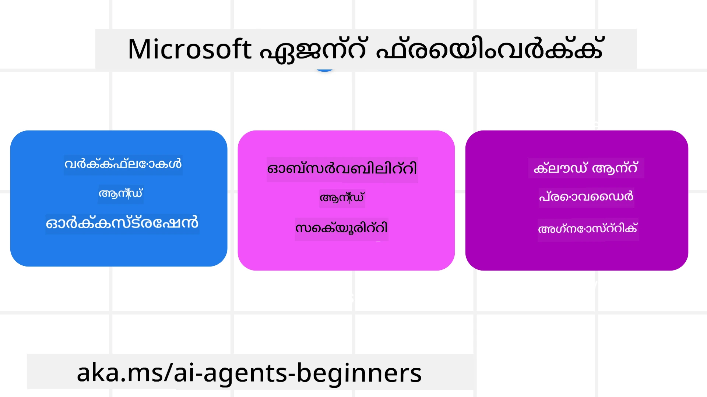
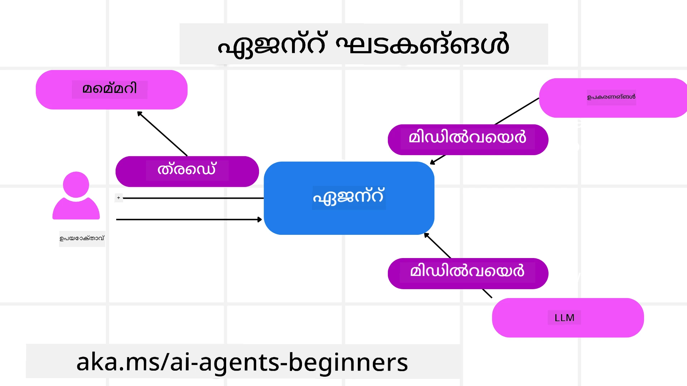

# Microsoft Agent Framework എക്സ്‌പ്ലോർ ചെയ്യുന്നു


### പരിചയം

ഈ പാഠം ഉൾക്കൊള്ളുന്നു:

- Microsoft Agent Framework മനസ്സിലാക്കൽ: പ്രധാന ഫീച്ചറുകളും മൂല്യവും  
- Microsoft Agent Framework ന്റെ പ്രധാന ആശയങ്ങൾ പരീക്ഷണമാക്കൽ
- ഉയർന്ന നിലവാരമുള്ള MAF മാതൃകകൾ: വേർക്ക്ഫ്‌ളോകൾ, മിഡിൽവെയർ, മെമ്മറി

## പഠന ലക്ഷ്യങ്ങൾ

ഈ പാഠം പൂർത്തിയാക്കിയ ശേഷം, നിങ്ങൾക്ക് അറിയാവുന്നതാണ്:

- Microsoft Agent Framework ഉപയോഗിച്ച് പ്രൊഡക്ഷൻ റെഡിയ്ക്കുള്ള AI ഏജന്റുകൾ നിർമ്മിക്കാനുള്ള വിധം
- Microsoft Agent Framework ന്റെ കോർ ഫീച്ചറുകൾ നിങ്ങളുടെ ഏജന്റിക് ഉപയോഗ കേസുകളിൽ പ്രയോഗിക്കുന്നത്
- വേർക്ക്ഫ്‌ളോകൾ, മിഡിൽവെയർ, ഒബ്സർവബിലിറ്റി എന്നിവ ഉൾപ്പെടുന്ന പ്രഗത്ഭമായ മാതൃകകൾ ഉപയോഗിക്കുക

## കോഡ് സാമ്പിൾസ് 

[Microsoft Agent Framework (MAF)](https://aka.ms/ai-agents-beginners/agent-framewrok) നുള്ള കോഡ് സാമ്പിൾസ് ഈ റിപോസിറ്ററിയിലെ `xx-python-agent-framework` ഉം `xx-dotnet-agent-framework` ഫയലുകളിലും കാണാം.

## Microsoft Agent Framework മനസ്സിലാക്കൽ



[Microsoft Agent Framework (MAF)](https://aka.ms/ai-agents-beginners/agent-framewrok) എന്നത് AI ഏജന്റുകൾ നിർമ്മിക്കുന്നതിന് മൈക്രോസോഫ്റ്റിന്റെ ഐക്യഫ്രെയിംവർക്ക് ആണ്. പ്രൊഡക്ഷനും ഗവേഷണ പരിസരങ്ങളിലും കാണപ്പെടുന്ന വിപുലമായ ഏജന്റിക് ഉപയോഗ കേസുകൾ നേരിടാൻ ഇത് അനുയോജ്യമായ സൗകര്യങ്ങൾ നൽകുന്നു, ഉദാ:

- ക്രമാനുസൃത ഏജന്റ് ഓർക്കസ്ട്രേഷൻ (Sequential Agent orchestration) — ഘട്ടങ്ങളുടെ അനുക്രമത്തിൽ പ്രവർത്തനങ്ങൾ ആവശ്യമുള്ള സാഹചര്യങ്ങൾ.
- സമകാലിക ഓർക്കസ്ട്രേഷൻ (Concurrent orchestration) — ഏജന്റുകൾ ഒരേ സമയം കാര്യങ്ങൾ പൂർത്തീകരിക്കേണ്ട സാഹചര്യങ്ങൾ.
- ഗ്രൂപ്പ് ചാറ്റ് ഓർക്കസ്ട്രേഷൻ — ഏജന്റുകൾ ഒരേ ടാസ്കിൽ ചേർന്ന് സഹകരിക്കാവുന്ന സാഹചര്യങ്ങൾ.
- ഹാൻഡോഫ് ഓർക്കസ്ട്രേഷൻ — ഉപതാസ്കുകൾ പൂർത്തിയായാൽ ഏജന്റുകൾ ടാസ്‌ക് കൈമാറുന്നത്.
- മാഗ്നറ്റിക് ഓർക്കസ്ട്രേഷൻ — ഒരു മാനേജർ ഏജന്റ് ടാസ്‌കുകൾ സൃഷ്ടിക്കുകയും മാറ്റിയിടുകയും ഉപഏജന്റുകളെ ഏകോപിപ്പിച്ച് ടാസ്‌ക് പൂർത്തീകരിക്കാൻ കൈകാര്യം ചെയ്യുകയും ചെയ്യുന്നത്.

പ്രൊഡക്ഷനിൽ AI ഏജന്റുകൾ നൽകാൻ MAF ഇതു മുതൽ ഉൾപ്പെടുത്തിയിട്ടുണ്ട്:

- ഓബ്സർവബിലിറ്റി (Observability) — OpenTelemetry ഉപയോഗിച്ച് ഏജന്റ് പ്രവർത്തിയുടെ ഓരോ നടപടി കൂടെ ടൂൾ കോളുകൾ, ഓർക്കസ്ട്രേഷൻ ഘട്ടങ്ങൾ, റീസണിംഗ് ഫ്ലോകൾ എന്നിവ ഉൾപ്പെടെ Microsoft Foundry ഡാഷ്ബോർഡുകൾ വഴി പ്രവർത്തനപരിശോധനക്കും മോണിറ്ററിംഗിനും ഉപയോഗിക്കും.
- സുരക്ഷ (Security) — ഏജന്റുകൾ Microsoft Foundry-യിൽ നേറ്റീവ് ആയി ഹോസ്റ്റ് ചെയ്യുമ്പോൾ role-based access, സ്വകാര്യ ഡാറ്റ കൈകാര്യം ചെയ്യൽ, ബിൽറ്റ്-ഇൻ കണ്ടന്റ് സേഫ്റ്റി പോലുള്ള സുരക്ഷാ നിയന്ത്രണങ്ങൾ ഉൾപ്പെടുന്നു.
- ദൈർഘ്യം (Durability) — ഏജന്റ് ത്രെഡുകളും വേർക്ക്ഫ്ലോകളും പause ചെയ്യുകയും റീസം ചെയ്യുകയും തെറ്റുകളിൽ നിന്നും പുനരധിവാസം നടത്തുകയും ചെയ്യുന്നത് നീണ്ട കാലം പ്രവർത്തിക്കുക കഴിവുകൾ സജ്ജമാക്കുന്നു.
- നിയന്ത്രണം (Control) — മനുഷ്യൻ ലൂപിൽ ഉൾപ്പെടുന്ന വേർക്ക്ഫ്ലോകൾ പിന്തുണയ്ക്കപ്പെടുന്നു, ടാസ്കുകൾ മനുഷ്യ അംഗീകാരമുണ്ടാവേണ്ടതായതായി മാർക്ക് ചെയ്യാവുന്നതാണ്.

Microsoft Agent Framework ഇന്ററോപ്പറബിൾ ആകാൻ മേധാവിത്വം നൽകുന്നു:

- ക്ലൗഡ്-നിരപേക്ഷം (Being Cloud-agnostic) — ഏജന്റുകൾ കണ്ടെയ്‌നറുകളിൽ, ഓൺ-പ്രെം എന്നിവയിലും മൾട്ടി ക്ലൗഡുകളിൽ പ്രവർത്തിക്കാവുന്നതാണ്.
- പ്രൊവൈഡർ-നിരപേക്ഷം (Being Provider-agnostic) — ഏജന്റുകൾ നിങ്ങളുടെ ഇഷ്ടത്തെ അനുസരിച്ച് വിവിധ SDK-കളിലൂടെ സൃഷ്ടിക്കാവുന്നതാണ്, ഉദാ., Azure OpenAI, OpenAI എന്നിവ.
- ഓപ്പൺ സ്റ്റാൻഡേർഡുകൾക്ക് אינtegretto (Integrating Open Standards) — Agent-to-Agent (A2A) എന്നത് പോലുള്ള പ്രോട്ടോക്കോളുകളും Model Context Protocol (MCP) പോലുള്ള പ്രോട്ടോക്കോളുകളും മറ്റ് ഏജന്റുകളും ടൂളുകളും കണ്ടെത്താനും ഉപയോഗിക്കാനും ഏജന്റുകൾക്ക് സാധ്യത നൽകുന്നു.
- പ്ലഗിൻസും കണക്റ്റേഴ്‌സും (Plugins and Connectors) — Microsoft Fabric, SharePoint, Pinecone, Qdrant പോലെയുള്ള ഡാറ്റയും മെമ്മറി സർവീസുകളുമായി കണക്ഷനുകൾ സജ്ജമാക്കാവുന്നതാണ്.

ഇപ്പോൾ ഈ ഫീച്ചറുകൾ Microsoft Agent Framework ന്റെ ചില കേർ കോൺസെപ്റ്റുകളിലേക്ക് എങ്ങനെ ബാധകമാണെന്ന് നോക്കാം.

## Microsoft Agent Framework ന്റെ പ്രധാന ആശയങ്ങൾ

### ഏജന്റുകൾ



**ഏജന്റുകൾ സൃഷ്ടിക്കൽ**

ഏജന്റ് സൃഷ്ടിക്കൽ സാധാരണയായി inference service (LLM Provider), ഏജന്റ് പാലിക്കേണ്ട നിർദ്ദേശങ്ങളുടെ ഒരു സെറ്റ്, അതോടൊപ്പം `name` എന്നൊരു നാമം നിർദ്ദേശിക്കുന്നുവെന്ന് നിർവചിച്ചുകൊണ്ടാണ് ചെയ്യുന്നത്:

```python
agent = AzureOpenAIChatClient(credential=AzureCliCredential()).create_agent( instructions="You are good at recommending trips to customers based on their preferences.", name="TripRecommender" )
```

മുകളിലുള്ള ഉദാഹരണം `Azure OpenAI` ഉപയോഗിക്കുന്നതാണ്, പക്ഷേ വിവിധ സേവനങ്ങൾ ഉപയോഗിച്ച് ഏജന്റുകൾ സൃഷ്ടിക്കാവുന്നതാണ്, ഉദാ., `Microsoft Foundry Agent Service`:

```python
AzureAIAgentClient(async_credential=credential).create_agent( name="HelperAgent", instructions="You are a helpful assistant." ) as agent
```

OpenAI `Responses`, `ChatCompletion` APIs

```python
agent = OpenAIResponsesClient().create_agent( name="WeatherBot", instructions="You are a helpful weather assistant.", )
```

```python
agent = OpenAIChatClient().create_agent( name="HelpfulAssistant", instructions="You are a helpful assistant.", )
```

അല്ലെങ്കിൽ A2A പ്രോട്ടോക്കോൾ ഉപയോഗിച്ച് റിമോട്ട് ഏജന്റുകൾ:

```python
agent = A2AAgent( name=agent_card.name, description=agent_card.description, agent_card=agent_card, url="https://your-a2a-agent-host" )
```

**ഏജന്റുകൾ പ്രവർത്തിപ്പിക്കൽ**

ഏജന്റുകൾ non-streaming അല്ലെങ്കിൽ streaming പ്രതികരണങ്ങൾക്കായി `.run` അല്ലെങ്കിൽ `.run_stream` മെത്തഡുകൾ ഉപയോഗിച്ച് പ്രവർത്തിപ്പിക്കും.

```python
result = await agent.run("What are good places to visit in Amsterdam?")
print(result.text)
```

```python
async for update in agent.run_stream("What are the good places to visit in Amsterdam?"):
    if update.text:
        print(update.text, end="", flush=True)

```

ഓരോ ഏജന്റ് റണിനും аген്റ് ഉപയോഗിക്കുന്ന `max_tokens`, ഏജന്റ് കോളുചെയ്യാവുന്ന `tools`, ഏജന്റിനുവേണ്ടി ഉപയോഗിക്കപ്പെടുന്ന `model` എന്നിവ പോലുള്ള പാരാമീറ്ററുകൾ കസ്റ്റമൈസ് ചെയ്യാനുള്ള ഓപ്ഷനുകൾ ഉണ്ടാകാം.

ഉപയോക്താവിന്റെ ടാസ്ക് പൂർത്തീകരിക്കാൻ പ്രത്യേക മോഡലുകളും ടൂളുകളും ആവശ്യമായ സാഹചര്യങ്ങളില് ഇത് ഉപകരിക്കുന്നു.

**ടൂളുകൾ**

ടൂളുകൾ ഏജന്റ് നിർവചിക്കുമ്പോഴും നിർവചിക്കാവുന്നതാണ്:

```python
def get_attractions( location: Annotated[str, Field(description="The location to get the top tourist attractions for")], ) -> str: """Get the top tourist attractions for a given location.""" return f"The top attractions for {location} are." 


# ഒരു ChatAgent നേരിട്ട് സൃഷ്‌ടിക്കുമ്പോൾ

agent = ChatAgent( chat_client=OpenAIChatClient(), instructions="You are a helpful assistant", tools=[get_attractions]

```

അല്ലെങ്കിൽ ഏജന്റ് റൺ ചെയ്യുമ്പോഴേയും:

```python

result1 = await agent.run( "What's the best place to visit in Seattle?", tools=[get_attractions] # ഈ പ്രവർത്തനത്തിനായി മാത്രം ഉപകരണം നൽകിയിരിക്കുന്നു )
```

**ഏജന്റ് ത്രെഡുകൾ**

മൾട്ടീ-ടേൺ സംഭാഷണങ്ങൾ കൈകാര്യം ചെയ്യാൻ ഏജന്റ് ത്രെഡുകൾ ഉപയോഗിക്കുന്നു. ത്രെഡുകൾ രണ്ട് വിധത്തിൽ സൃഷ്ടിക്കാം:

- `get_new_thread()` ഉപയോഗിച്ച് ത്രെഡ് സമയംനാൾ സേവ് ചെയ്യാൻ സാധിക്കുന്നതാവും
- ഏജന്റ് ഓടുമ്പോൾ ഓട്ടോമാറ്റിക്കായി ഒരു ത്രെഡ് സൃഷ്ടിച്ച് അത് current run-നേക്കാൾക്കുറച്ചുദിവസം മാത്രമേ നിലനിൽക്കൂ എന്ന രീതിയും

ത്രെഡ് സൃഷ്ടിക്കാൻ കോഡ് ഇതുപോലെയാണ്:

```python
# ഒരു പുതിയ ത്രെഡ് സൃഷ്ടിക്കുക.
thread = agent.get_new_thread() # ത്രെഡുമായി ഏജന്റിനെ ഓടിക്കുക.
response = await agent.run("Hello, I am here to help you book travel. Where would you like to go?", thread=thread)

```

നിരന്തര ഉപയോഗത്തിനായി ത്രെഡ് സീരിയലൈസ് ചെയ്യാം:

```python
# ഒരു പുതിയ ത്രീഡ് സൃഷ്ടിക്കുക.
thread = agent.get_new_thread() 

# ത്രീഡുമായി ആജന്റ് പ്രവർത്തിപ്പിക്കുക.

response = await agent.run("Hello, how are you?", thread=thread) 

# സംഭരണത്തിനായി ത്രീഡ് സീരിയലൈസ് ചെയ്യുക.

serialized_thread = await thread.serialize() 

# സംഭരണത്തിൽ നിന്ന് ലോഡ് ചെയ്ത ശേഷം ത്രീഡിന്റെ നില ഡീസീരിയലൈസ് ചെയ്യുക.

resumed_thread = await agent.deserialize_thread(serialized_thread)
```

**ഏജന്റ് മിഡിൽവെയർ**

ഏജന്റുകൾ ഉപയോക്താവിന്റെ ടാസ്ക് പൂർത്തീകരിക്കാൻ ടൂളുകളുമായി LLM-കളുമായി ഇടപഴകുന്നു. ചില സാഹചര്യങ്ങളിൽ, ഈ ഇടപെടലുകൾക്കിടയിൽ എന്ത് നടത്തണം എന്ന് പ്രവർത്തിപ്പിക്കാൻ അല്ലെങ്കിൽ ട്രാക്ക് ചെയ്യാൻ ഞങ്ങൾ ആഗ്രഹിക്കുന്നു. ഏജന്റ് മിഡിൽവെയർ ഇത് സാധ്യമായി ചെയ്യുന്നു:

*ഫങ്ഷൻ മിഡിൽവെയർ*

ഈ മിഡിൽവെയർ ഏജന്റും ഒരു ഫങ്ഷനും/ടൂളും തമ്മിലുള്ള കോളിന് മുമ്പ് ഒരു പ്രവർത്തനം ചെയ്യാനോ ലോഗ് ചെയ്യാനോ അനുവദിക്കുന്നു. ഉദാഹരണമായി, ഫങ്ഷൻ കോളിൽ ലോഗിംഗ് ചെയ്യാൻ നിങ്ങൾ ആഗ്രഹിക്കുമ്പോൾ ഇത് ഉപയോഗിക്കാം.

താഴെ കൊടുത്തിരിക്കുന്ന കോഡിൽ `next` നിർദ്ദേശിക്കുന്നത് അടുത്ത മിഡിൽവെയർ ആണോ യഥാർത്ഥ ഫങ്ഷൻ ആണോ എന്നതു നിർവചിക്കുന്നു.

```python
async def logging_function_middleware(
    context: FunctionInvocationContext,
    next: Callable[[FunctionInvocationContext], Awaitable[None]],
) -> None:
    """Function middleware that logs function execution."""
    # മുൻ-പ്രോസസ്സിംഗ്: ഫംഗ്ഷൻ നിർവഹിക്കുന്നതിന് മുമ്പ് ലോഗ് ചെയ്യുക
    print(f"[Function] Calling {context.function.name}")

    # അടുത്ത മിഡിൽവെയറിലേക്കോ ഫംഗ്ഷൻ നിർവഹണത്തിലേക്കോ തുടരുക
    await next(context)

    # പോസ്റ്റ്-പ്രോസസ്സിംഗ്: ഫംഗ്ഷൻ നിർവഹിച്ചതിന് ശേഷം ലോഗ് ചെയ്യുക
    print(f"[Function] {context.function.name} completed")
```

*ചാറ്റ് മിഡിൽവെയർ*

ഈ മിഡിൽവെയർ LLM-നുള്ള അഭ്യർത്ഥനകൾക്കിടയിൽ ഒരു പ്രവർത്തനം നടത്താനോ ലോഗ് ചെയ്യാനോ അനുവദിക്കുന്നു.

ഇത് AI സേവനത്തിന് അയക്കുന്ന `messages` പോലുള്ള അത്യന്താപേക്ഷിത വിവരങ്ങൾ ഉൾക്കൊള്ളുന്നു.

```python
async def logging_chat_middleware(
    context: ChatContext,
    next: Callable[[ChatContext], Awaitable[None]],
) -> None:
    """Chat middleware that logs AI interactions."""
    # പ്രീ-പ്രോസസ്സിംഗ്: AI കോൾ ചെയ്യുന്നതിന് മുമ്പ് ലോഗ് ചെയ്യുക
    print(f"[Chat] Sending {len(context.messages)} messages to AI")

    # അടുത്ത മിഡിൽവെയർ അല്ലെങ്കിൽ AI സേവനത്തിലേക്ക് തുടരുക
    await next(context)

    # പോസ്റ്റ്-പ്രോസസ്സിംഗ്: AI പ്രതികരണം ലഭിച്ചതിന് ശേഷം ലോഗ് ചെയ്യുക
    print("[Chat] AI response received")

```

**ഏജന്റ് മെമ്മറി**

`Agentic Memory` പാഠത്തിൽ ചർച്ചചെയ്തതുപോലെ, മെമ്മറി ഏജന്റ് വിവിധ_Context_കളിൽ പ്രവർത്തിക്കാൻ സഹായിക്കുന്ന ഒരു പ്രധാന ഘടകമാണ്. MAF വിവിധ തരത്തിലുള്ള മെമ്മറികൾ നൽകുന്നു:

*In-Memory Storage*

അപ്ലിക്കേഷൻ റണ്ണിംഗിന്റെ സമയത്ത് ത്രെഡുകളിൽ സംഭരിക്കുന്ന മെമ്മറിയാണ് ഇത്.

```python
# ഒരു പുതിയ ത്രീഡ് സൃഷ്ടിക്കുക.
thread = agent.get_new_thread() # ത്രീഡ് ഉപയോഗിച്ച് ഏജന്റ് ഓടിക്കുക.
response = await agent.run("Hello, I am here to help you book travel. Where would you like to go?", thread=thread)
```

*Persistent Messages*

വിവിധ സെഷനുകൾക്കിടയിൽ സംഭാഷണ ചരിത്രം സേവ് ചെയ്യുമ്പോൾ ഈ മെമ്മറി ഉപയോഗിക്കുന്നു. ഇത് `chat_message_store_factory` ഉപയോഗിച്ച് നിർവചിക്കുന്നു:

```python
from agent_framework import ChatMessageStore

# ഒരു പ്രത്യേക സന്ദേശ സംഭരണശേഖരം സൃഷ്ടിക്കുക
def create_message_store():
    return ChatMessageStore()

agent = ChatAgent(
    chat_client=OpenAIChatClient(),
    instructions="You are a Travel assistant.",
    chat_message_store_factory=create_message_store
)

```

*ഡൈനാമിക് മെമ്മറി*

ഏജന്റ് ഓടിക്കുന്നതിന് മുൻപ് കോൺടക്‌സ്റ്റിലേക്ക് ഈ മെമ്മറികൾ ചേർക്കപ്പെടുന്നു. ഈ മെമ്മറികൾ mem0 പോലുള്ള എക്സ്റ്റേണൽ സർവീസുകളിൽ സൂക്ഷിക്കാവുന്നതാണ്:

```python
from agent_framework.mem0 import Mem0Provider

# ഉന്നത മെമ്മറി ശേഷികൾക്കായി Mem0 ഉപയോഗിക്കുന്നു
memory_provider = Mem0Provider(
    api_key="your-mem0-api-key",
    user_id="user_123",
    application_id="my_app"
)

agent = ChatAgent(
    chat_client=OpenAIChatClient(),
    instructions="You are a helpful assistant with memory.",
    context_providers=memory_provider
)

```

**ഏജന്റ് ഒബ്സർവബിലിറ്റി**

ഒബ്സർവബിലിറ്റി ഏജന്റിക് സിസ്റ്റങ്ങൾ വിശ്വസനീയവും പരിപാലിക്കാവുന്നതുമായവവുമാക്കാൻ അത്യാവശ്യമാണ്. MAF ട്രേസിംഗിനും മീറ്ററുകൾക്കും OpenTelemetry-യുമായി ഇന്റഗ്രേറ്റ് ചെയ്യുന്നു, മികച്ച ഒബ്സർവബിലിറ്റി ഉറപ്പാക്കാൻ.

```python
from agent_framework.observability import get_tracer, get_meter

tracer = get_tracer()
meter = get_meter()
with tracer.start_as_current_span("my_custom_span"):
    # എന്തെങ്കിലും ചെയ്യുക
    pass
counter = meter.create_counter("my_custom_counter")
counter.add(1, {"key": "value"})
```

### വേർക്ക്ഫ്‌ളോകൾ

MAF നിശ്ചിത ഘട്ടങ്ങളിലൂടെ ടാസ്ക് പൂർത്തിയാക്കുന്നതിനുള്ള Pre-defined വേർക്ക്ഫ്‌ളോകൾ നൽകുന്നു, അവിടെ AI ഏജന്റുകൾ ആ ഘട്ടങ്ങളിലെ ഘടകങ്ങളായി ഉൾപ്പെടുന്നു.

വേർക്ക്ഫ്‌ളോകൾ മെസ്സേജ് ഫ്ലോയിലൂടെ നല്ല നിയന്ത്രണം നൽകുന്ന വിവിധ ഘടകങ്ങളിൽ നിന്നാണ് നിർമ്മിക്കപ്പെടുന്നത്. വേർക്ക്ഫ്‌ളോകൾ കൂടാതെ **മൾട്ടി-ഏജന്റ് ഓർക്കസ്ട്രേഷൻ**ക്കും **ചെക്ക്പോയിന്റിംഗ്** വഴി വേർക്ക്ഫ്‌ലോ സ്റ്റേറ്റുകൾ സേവ് ചെയ്യുന്നതിന് പിന്തുണ നൽകുന്നു.

വേർക്ക്ഫ്‌ലോയുടെ കോർ ഘടകങ്ങൾ:

**എക്സിക്യൂട്ടറുകൾ**

എക്സിക്യൂട്ടറുകൾ ഇൻപുട്ട് മെസ്സേജുകൾ സ്വീകരിക്കുന്നു, നിയോജിത ടാസ്‌കുകൾ നിർവഹിക്കുന്നു, പിന്നെ ഒരു ഔട്ട്പുട്ട് മെസ്സേജ് ഉൽപ്പാദിപ്പിക്കുന്നു. ഇത് വലിയ ടാസ്കിന്റെ പൂർത്തീകരണത്തിലേക്ക് വേർക്ക്ഫ്‌ലോ മുന്നോട്ട് നയിക്കുന്നു. എക്സിക്യൂട്ടറുകൾ AI ഏജന്റോ കസ്റ്റം ലജിക്കോ ആയിരിക്കാം.

**എഡ്ജുകൾ**

വേർക്ക്ഫ്‌ലോയിൽ മെസ്സേജുകളുടെ പ്രവാഹം നിർവചിക്കാൻ എഡ്ജുകൾ ഉപയോഗിക്കുന്നു. ഇവക്ക് പലവിധങ്ങൾ ഉണ്ടായിരിക്കുന്നു:

*ഡൈരക്ട് എഡ്ജുകൾ* - എക്സിക്യൂട്ടറുകൾക്കിടയിൽ ലളിതമായ ഒന്ന്-തൊന്ന് കണക്ഷനുകൾ:

```python
from agent_framework import WorkflowBuilder

builder = WorkflowBuilder()
builder.add_edge(source_executor, target_executor)
builder.set_start_executor(source_executor)
workflow = builder.build()
```

*കണ്ടീഷണൽ എഡ്ജുകൾ* - നിശ്ചിത നിബന്ധനകൾ പൂർത്തിയായ ശേഷം പ്രവർത്തിക്കുന്നവ. ഉദാഹരണത്തിന്, ഹോട്ടൽ റൂമുകൾ ഉള്ളതല്ലെങ്കിൽ, ഒരു എക്സിക്യൂട്ടർ മറ്റു ഓപ്പ്ഷനുകൾ സജസ്റ്റുചെയ്യാം.

*സ്വിച്ച്-കേസ് എഡ്ജുകൾ* - നിർവചിച്ച നിബന്ധനകളുടെ അടിസ്ഥാനത്തിൽ മെസ്സേജുകൾ വ്യത്യസ്ത എക്സിക്യൂട്ടറുകളിലേക്ക് റൂട്ടുചെയ്യുന്നു. ഉദാഹരണത്തിന്, യാത്രക്കാരന്റത് പ്രയോരിറ്റി ആക്സസ് ഉണ്ടെങ്കിൽ അവരുടെ ടാസ്കുകൾ മറ്റൊരു വേർക്ക്ഫ്‌ലോ വഴിക്ക് കൈകാര്യം ചെയ്യപ്പെടാം.

*ഫാൻ-ഔട്ട് എഡ്ജുകൾ* - ഒരു മെസ്സേജ് പല ലക്ഷ്യങ്ങളിലേക്കും അയക്കുക.

*ഫാൻ-ഇൻ എഡ്ജുകൾ* - വ്യത്യസ്ത എക്സിക്യൂട്ടറുകളിൽ നിന്നുള്ള നിരവധി മെസ്സേജുകൾ സംഭരിച്ച് ഒരൊറ്റ ലക്ഷ്യത്തിലേക്ക് അയക്കുക.

**ഇവന്റുകൾ**

വേർക്ക്ഫ്‌ലോകളിൽ മികച്ച ഒബ്സർവബിലിറ്റി നൽകാൻ, MAF എക്സിക്യൂഷൻ സംബന്ധിച്ച് ബിൽറ്റ്-ഇൻ ഇവന്റുകൾ നൽകുന്നു, ഉദാ:

- `WorkflowStartedEvent`  - വേർക്ക്ഫ്‌ലോ എക്സിക്യൂഷൻ ആരംഭിക്കുന്നു
- `WorkflowOutputEvent` - വേർക്ക്ഫ്‌ലോ ഒരു ഔട്ട്പുട്ട് ഉൽപ്പാദിപ്പിക്കുന്നു
- `WorkflowErrorEvent` - വേർക്ക്ഫ്‌ലോ ഒരു പിശക് കണ്ടുപിടിക്കുന്നു
- `ExecutorInvokeEvent`  - എക്സിക്യൂട്ടർ പ്രോസസ്സിംഗ് ആരംഭിക്കുന്നു
- `ExecutorCompleteEvent`  -  എക്സിക്യൂട്ടർ പ്രോസസ്സിംഗ് പൂർത്തീകരിക്കുന്നു
- `RequestInfoEvent` - ഒരു അഭ്യർത്ഥന ഇഷ്യു ചെയ്യപ്പെട്ടു

## ഉയർന്ന നിലയിലെ MAF മാതൃകകൾ

മുകളിൽ നൽകിയ വിഭാഗങ്ങൾ Microsoft Agent Framework ന്റെ പ്രധാന ആശയങ്ങൾ ആയിരുന്നു. നിങ്ങൾ കൂടുതൽ സങ്കീർണമായ ഏജന്റുകൾ നിർമ്മിക്കുമ്പോൾ പരിഗണിക്കേണ്ട ചില പ്രഗത്ഭ മാതൃകകൾ ഇുമെന്ന്:

- **മിഡിൽവെയർ സംയോജനം**: ഫങ്ഷൻ மற்றும் ചാറ്റ് മിഡിൽവെയർ ഉപയോഗിച്ച് ലോഗിംഗ്, ഓത്ത്, റേറ്റ്-ലിമിറ്റിംഗ് പോലുള്ള ബഹുമുഖ മിഡിൽവെയർ ഹാൻഡ്ലറുകൾ ബന്ധിപ്പിക്കുക, ഏജന്റെ പെരുമാറ്റത്തെ നുറുങ്ങുവിപുലീകരിച്ച നിയന്ത്രണത്തിൽ നിയന്ത്രിക്കാൻ.
- **വേർക്ക്ഫ്ലോ ചെക്ക്പോയിന്റിംഗ്**: വേർക്ക്ഫ്ലോ ഇവന്റുകളും സീരിയലൈസേഷനും ഉപയോഗിച്ച് നീണ്ടകാല പ്രവർത്തനങ്ങളുള്ള ഏജന്റ് പ്രോകസുകൾ സേവ് ചെയ്ത് റീസം ചെയ്യുക.
- **ഡൈനാമിക് ടൂൾ തിരഞ്ഞെടുപ്പ്**: ടൂൾ വിവരണങ്ങളിലൂടെയുള്ള RAG-നെ MAF-യുടെ ടൂൾ രജിസ്ട്രേഷനോട് സംയോജിപ്പിച്ച്, ഓരോ ക്വെറിയാകെ സമ്പർക്കമുള്ള ടൂളുകൾ മാത്രമേ അവതരിപ്പിക്കുകയുള്ളൂ എന്ന തരത്തിൽ സംവേദിക്കുക.
- **മൾട്ടി-ഏജന്റ് ഹാൻഡോഫ്**: പ്രത്യേകതയുള്ള ഏജന്റുകൾക്കിടയിലെ ഹാൻഡോഫുകൾ ഓർക്കസ്ട്രേറ്റ് ചെയ്യാൻ വേർക്ക്ഫ്‌ലോ എഡ്ജുകളും കണ്ടീഷണൽ റൂട്ടിംഗും ഉപയോഗിക്കുക.

## കോഡ് സാമ്പിൾസ് 

Microsoft Agent Framework നുള്ള കോഡ് സാമ്പിൾസ് ഈ റിപോസിറ്ററിയിലെ `xx-python-agent-framework` ഉം `xx-dotnet-agent-framework` ഫയലുകളിലുമാണ് കാണാൻ ലഭിക്കുന്നത്.

## Microsoft Agent Framework സംബന്ധിച്ച് കൂടുതൽ ചോദിക്കാൻ ആഗ്രഹമാണോ?

മറ്റു പഠനാർത്ഥികളുമായി ചേരാൻ, ഓഫീസ് മണിക്കൂറുകളിൽ പങ്കെടുക്കാൻ, നിങ്ങളുടെ AI ഏജന്റുകളെ സംബന്ധിച്ച ചോദ്യങ്ങൾക്ക് മറുപടി ലഭിക്കാൻ [Microsoft Foundry Discord](https://aka.ms/ai-agents/discord)യിൽ ചേർക്കുക.

---

<!-- CO-OP TRANSLATOR DISCLAIMER START -->
ഡിസ്‌ക്ലെയിമർ:
ഈ രേഖ AI തർജുമാ സേവനം Co‑op Translator (https://github.com/Azure/co-op-translator) ഉപയോഗിച്ച് തർജ്മ ചെയ്തതാണ്. ഞങ്ങൾ കൃത്യതയ്ക്കായി ശ്രമിച്ചിട്ടുണ്ടെങ്കിലും, യാന്ത്രിക തർജുമകളിൽ തെറ്റുകളും പിഴവുകളുണ്ടാവാൻ സാധ്യതയുണ്ടെന്ന് ദയവായി ശ്രദ്ധിക്കുക. യഥാർത്ഥ രേഖ അതിന്റെ സ്വന്തം ഭാഷയിൽ പ്രാമാണിക ഉറവിടമായി പരിഗണിക്കപ്പെടണം. നിർണ്ണായകമായ വിവരങ്ങൾക്ക് പ്രൊഫഷണൽ മനുഷ്യൻ നടത്തുന്ന തർജുമ ശുപാർശ ചെയ്യുന്നു. ഈ തർജുമ ഉപയോഗിച്ചതിനാൽ ഉണ്ടാകുന്ന ഏതെങ്കിലും തെറ്റിദ്ധാരണകളോ വ്യാഖ്യാന പിശകുകളോ സംബന്ധിച്ചുള്ള ഉത്തരവാദിത്വം ഞങ്ങൾക്ക് ബാധകമാകില്ല.
<!-- CO-OP TRANSLATOR DISCLAIMER END -->