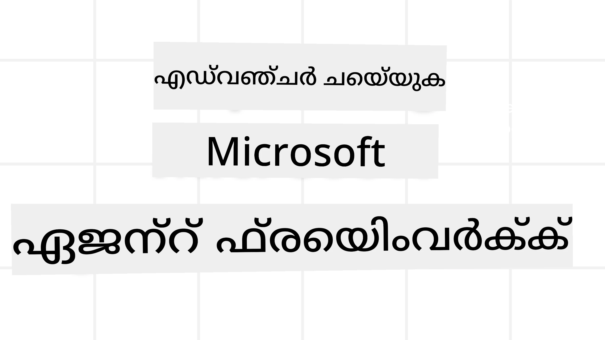
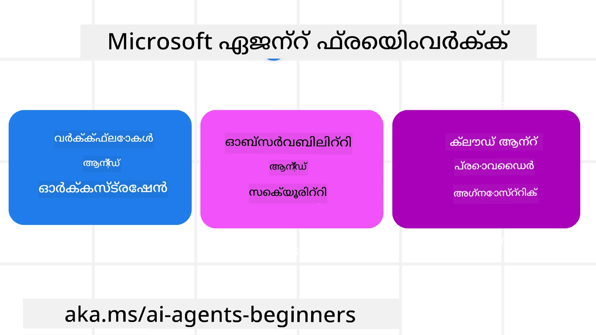
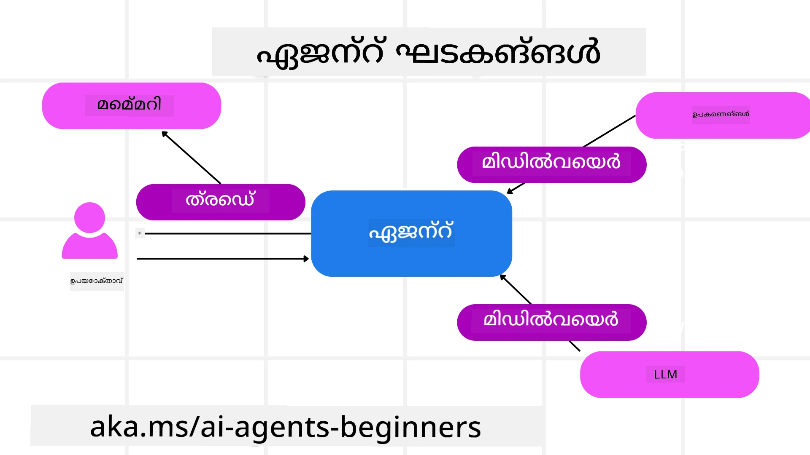

# Microsoft ഏജന്റ് ഫ്രെയിംവർക്കിനെ കണ്ടെത്തൽ



### പരിചയം

ഈ പാഠം ഉൾക്കൊള്ളുന്നത്:

- Microsoft ഏജന്റ് ഫ്രെയിംവർക്കിന്റെ അടിസ്ഥാന സവിശേഷതകൾക്കും മൂല്യങ്ങൾക്കും അവധാനം  
- Microsoft ഏജന്റ് ഫ്രെയിംവർക്കിന്റെ മുഖ്യ ആശയങ്ങൾ കണക്കാക്കൽ
- ന്-തരംമുഖ്യമുള്ള MAF മാതൃകകൾ: വർക്ക്‌ഫ്ലോകൾ, മിഡിൽവെയർ, മെമ്മറി

## പഠന ലക്ഷ്യങ്ങൾ

ഈ പാഠം പൂർത്തിയാക്കുന്നതിന് ശേഷമേ നിങ്ങൾക്ക് കീഴെ പറയുന്നവ അറിയാവൂ:

- Microsoft ഏജന്റ് ഫ്രെയിംവർക്കുപയോഗിച്ച് പ്രൊഡക്ഷന്‍ റെഡി AI ഏജന്റുകൾ നിർമ്മിക്കുക
- Microsoft ഏജന്റ് ഫ്രെയിംവർക്കിന്റെ പ്രധാന സവിശേഷതകൾ ഏജന്റിക് ഉപയോഗ കേസുകളിലേക്ക് പ്രയോഗിക്കുക
- വർക്ക്‌ഫ്ലോകൾ, മിഡിൽവെയർ, നിരീക്ഷണത എന്നിവ ഉൾപ്പെടെയുള്ള ഉന്നത മാതൃകകൾ ഉപയോഗിക്കുക

## കോഡ് സാമ്പിളുകൾ 

[Microsoft Agent Framework (MAF)](https://aka.ms/ai-agents-beginners/agent-framework)യുടെ കോഡ് സാമ്പിളുകൾ ഈ റീപോസിറ്ററിയിൽ `xx-python-agent-framework` ഒപ്പം `xx-dotnet-agent-framework` ഫയലുകളിൽ ലഭ്യമാണ്.

## Microsoft Agent Framework മനസിലാക്കൽ



[Microsoft Agent Framework (MAF)](https://aka.ms/ai-agents-beginners/agent-framework) Microsoft-ന്റെ ഐക്യമായ AI ഏജന്റ് നിർമ്മാണ ഫ്രെയിംവർക്കാണ്. ഇത് പ്രൊഡക്ഷൻ ഉല്പന്നങ്ങളിലും ഗവേഷണ മേഖലയിലും കാണുന്ന വ്യത്യസ്ത ഏജന്റിക് ഉപയോഗ കേസുകൾക്ക് അനുയോജ്യമായ ഘട്ടങ്ങളാണ് ഇത് കവിഞ്ഞു പോകുന്നതിനുള്ള സൗകര്യം നൽകുന്നത്:

- **ക്രമഭദ്രതയുള്ള ഏജന്റ് ഓർക്കസ്ട്രേഷൻ** ഘട്ടം നിശ്ചിതമായ വർക്ക്‌ഫ്ലോകൾ ആവശ്യമായ സാഹചര്യങ്ങളിൽ.
- **തുല്യകാല ഓർക്കസ്ട്രേഷൻ** ഘട്ടത്തിൽ ഏജന്റുകൾ ഒരേസമയം ടാസ്‌കുകൾ പൂർത്തിയാക്കേണ്ട സ്ഥിതികളിൽ.
- **മണ്ഡല ചാറ്റ് ഓർക്കസ്ട്രേഷൻ** ഒന്നിലധികം ഏജന്റുകൾ സമന്വയിച്ച് ഒരേ ടാസ്‌കിൽ സഹകരിക്കേണ്ട അവസരങ്ങളിൽ.
- **ഹാൻഡ്‌ഓഫ് ഓർക്കസ്ട്രേഷൻ** ഉപടാസ്‌കുകൾ പൂർത്തിയായപ്പോൾ ഏജന്റുകൾ ടാസ്‌ക് കൈമാറിവരേണ്ട സാഹചര്യങ്ങളിൽ.
- **മാഗ്നറ്റിക് ഓർക്കസ്ട്രേഷൻ** മാനേജർ ഏജന്റ് ടാസ്‌ക് പട്ടിക സൃഷ്ടിക്കുകയും മാറ്റിസ്ഥാപിക്കുകയും ഉപ ഏജന്റുകളുടെ കോർഡിനേഷൻ നടത്തുകയും ചെയ്യുന്ന ഘട്ടങ്ങളിൽ.

പ്രൊഡക്ഷനിൽ AI ഏജന്റുകൾ നൽകുന്നതിനായി, MAF ഇതിലുമായി സവിശേഷതകളും ഉൾപ്പെടുത്തുന്നു:

- **നിരീക്ഷണത** OpenTelemetry ഉപയോഗിച്ച്, AI ഏജന്റിന്റെ ഓരോ ക്രിയയും, ഉപകരണ ആഹ്വാനം, ഓർക്കസ്ട്രേഷൻ ഘട്ടങ്ങൾ, തർക്കരഹിതമായ പ്രവാഹങ്ങൾ, Microsoft Foundry ഡാഷ്ബോർഡ് വഴി പെർഫോമൻസ് നിരീക്ഷണം എന്നിവയുടെ ഉപയോഗം.
- **സുരക്ഷ** Microsoft Foundry-ൽ നേറ്റീവ് ആയി ഏജന്റുകൾ ഹോസ്റ്റ് ചെയ്ത്, റോളിന്റെ അടിസ്ഥാനത്തിൽ ആക്‌സസ് നിയന്ത്രണം, സ്വകാര്യ ഡേറ്റാ കൈകാര്യം, നിർമ്മിത ഉള്ളടക്ക സുരക്ഷ തുടങ്ങിയ സുരക്ഷാ നിയന്ത്രണങ്ങൾ ഉൾപ്പെടെ.
- **ദീർഘായുസ്യത** ഏജന്റ് ത്രെഡ്‌സ്, വർക്ക്‌ഫ്ലോകൾ ഇടവഴി പാപസ്‌, പുനർആരംഭം, പിശക് തള്ളി കരുതൽ എന്നിവ പിന്തുണയ്ക്കുന്നു, ഇത് ദൈർഘ്യമേറിയ പ്രക്രിയകൾക്ക് സഹായകരമാണ്.
- **നിയന്ത്രണം** മനുഷ്യന്റെ ഇടപെടൽ ആവശ്യമായ തിരിച്ചറിയൽ ടാസ്ക്കുകൾ അവബോധിപ്പിക്കുന്ന മനുഷ്യനായി പ്രവർത്തനം വിവിധ ഘട്ടങ്ങളിൽ ധന്യമാകും.

Microsoft Agent Framework തമ്മിൽ ബന്ധിപ്പിക്കാൻ ശ്രദ്ധ കേന്ദ്രീകരിച്ചിരിക്കുന്നു:

- **മേഘം-സ്വതന്ത്രമാണ്** - ഏജന്റുകൾ കണ്ടെയ്‌നറുകളിൽ, പ്രാദേശികത്തിൽ, വിവിധ മേഘങ്ങളിൽ ഓടാൻ കഴിയും.
- **സേവനദാതാവ്-സ്വതന്ത്രമാണ്** - Azure OpenAI, OpenAI ഉൾപ്പെടെ നിങ്ങളുടെ ഇഷ്ടമുള്ള SDK ഉപയോഗിച്ച് ഏജന്റുകൾ സൃഷ്ടിക്കാം.
- **ഓപ്പൺ സ്റ്റാൻഡേർഡുകൾ വിന്യസിക്കൽ** - Agent-to-Agent (A2A), Model Context Protocol (MCP) പോലുള്ള പ്രോട്ടോക്കോളുകൾ ഉപയോഗിച്ച് മറ്റു ഏജന്റുകളും ഉപകരണങ്ങളും കണ്ടെത്തി ഉപയോഗപ്പെടുത്താം.
- **പ്ലഗിനുകളും കണക്ടറുകളും** - Microsoft Fabric, SharePoint, Pinecone, Qdrant പോലുള്ള ഡേറ്റാ, മെമ്മറി സേവനങ്ങളുമായി ബന്ധിപ്പിക്കാവുന്നതാണ്.

ഈ സവിശേഷതകൾ Microsoft Agent Framework-ന്റെ ചില പ്രധാന ആശയങ്ങൾ എങ്ങനെ പ്രയോഗിക്കുന്നു എന്ന് നോക്കാം.

## Microsoft Agent Framework-ന്റെ മുഖ്യ ആശയങ്ങൾ

### ഏജന്റുകൾ



**ഏജന്റ് നിർമ്മാണം**

ഏജന്റ് നിർമ്മാണം ചെയ്യുന്നത് ഇൻഫറൻസ് സർവീസ് (LLM പ്രൊവൈഡർ), AI ഏജന്റ് പാലിക്കേണ്ട നിർദ്ദേശങ്ങൾ, ഒപ്പം ഒരു നിശ്ചിത `name` നിർവചിച്ച് ചെയ്യപ്പെടുന്നു:


```python
agent = AzureOpenAIChatClient(credential=AzureCliCredential()).create_agent( instructions="You are good at recommending trips to customers based on their preferences.", name="TripRecommender" )
```

മുകളിൽ `Azure OpenAI` ഉപയോഗിച്ചിരിക്കുന്നു എങ്കിലും, `Microsoft Foundry Agent Service` ഉൾപ്പെടെ വിവിധ സേവനങ്ങൾ ഉപയോഗിച്ച് ഏജന്റുകൾ സൃഷ്ടിക്കാം:

```python
AzureAIAgentClient(async_credential=credential).create_agent( name="HelperAgent", instructions="You are a helpful assistant." ) as agent
```

OpenAI `Responses`, `ChatCompletion` APIകൾ

```python
agent = OpenAIResponsesClient().create_agent( name="WeatherBot", instructions="You are a helpful weather assistant.", )
```

```python
agent = OpenAIChatClient().create_agent( name="HelpfulAssistant", instructions="You are a helpful assistant.", )
```

അല്ലെങ്കിൽ [MiniMax](https://platform.minimaxi.com/) ഉപയോഗിച്ച്, വലിയ കോൺടെക്സ്‌റ്റ് വിൻഡോകൾ (204K ടോക്കണുകൾ വരെ) ഉള്ള OpenAI-സാധിയ API നൽകുന്നു:

```python
agent = OpenAIChatClient(base_url="https://api.minimax.io/v1", api_key=os.environ["MINIMAX_API_KEY"], model_id="MiniMax-M3").create_agent( name="HelpfulAssistant", instructions="You are a helpful assistant.", )
```

അല്ലെങ്കിൽ A2A പ്രോട്ടോക്കോൾ ഉപയോഗിക്കുന്ന റിമോട്ട് ഏജന്റുകൾ:

```python
agent = A2AAgent( name=agent_card.name, description=agent_card.description, agent_card=agent_card, url="https://your-a2a-agent-host" )
```

**ഏജന്റുകൾ പ്രവർത്തിപ്പിക്കൽ**

ഏജന്റുകൾ `.run` അല്ലെങ്കിൽ `.run_stream` മെഥഡുകൾ വഴി, സ്ട്രീമിംഗ് അല്ലാത്ത അല്ലെങ്കിൽ സ്ട്രീമിംഗ് മറുപടികൾക്ക് ഓടുന്നു.

```python
result = await agent.run("What are good places to visit in Amsterdam?")
print(result.text)
```

```python
async for update in agent.run_stream("What are the good places to visit in Amsterdam?"):
    if update.text:
        print(update.text, end="", flush=True)

```

ഓരോ ഏജന്റ് ഓടലിനും, ഏജന്റ് ഉപയോഗിക്കുന്ന `max_tokens`, ഏജന്റ് വിളിക്കാൻ കഴിയുന്ന `tools`, മഡൽ സ്വയം ഉൾപ്പെടെയുള്ള ഓപ്ഷനുകൾ ഇഷ്‌ടാനുസൃതമായി ക്രമീകരിക്കാൻ കഴിയും.

ഇത് ഒരു ഉപയോക്താവിന്റെ ടാസ്ക് പൂർത്തിയാക്കുന്നതിനുള്ള പ്രത്യേക മോഡലുകൾ അല്ലെങ്കിൽ ഉപകരണങ്ങൾ ആവശ്യമായ സാഹചര്യങ്ങളിൽ സഹായകരമാണ്.

**ഉപകരണങ്ങൾ**

ഏജന്റ് നിർവചിക്കുന്ന സമയത്തു ഉപകരണങ്ങൾ നിർവചിക്കാവുന്നതാണ്:

```python
def get_attractions( location: Annotated[str, Field(description="The location to get the top tourist attractions for")], ) -> str: """Get the top tourist attractions for a given location.""" return f"The top attractions for {location} are." 


# നേരിട്ട് ഒരു ChatAgent സൃഷ്ടിക്കുമ്പോൾ

agent = ChatAgent( chat_client=OpenAIChatClient(), instructions="You are a helpful assistant", tools=[get_attractions]

```

കൂടാതെ ഏജന്റ് പ്രവർത്തിപ്പിക്കുമ്പോഴും:

```python

result1 = await agent.run( "What's the best place to visit in Seattle?", tools=[get_attractions] # ഈ റൺ සඳහා മാത്രമായുള്ള ടൂൾ നൽകിയിരിക്കുന്നു )
```

**ഏജന്റ് ത്രെഡ്‌സ്**

ഓൺലൈൻ സംഭാഷണങ്ങൾ കൈകാര്യം ചെയ്യാൻ ഏജന്റ് ത്രെഡ്‌സ് ഉപയോഗിക്കുന്നു. ത്രെഡ്‌സ് ഉണ്ടാക്കുന്നത്:

- `get_new_thread()` ഉപയോഗിച്ച്, ത്രെഡ് സമയംക്രമത്തിൽ സേവ് ചെയ്യാനാകും
- ഏജന്റ് ഓടുമ്പോൾ ത്രെഡ് സ്വയം സൃഷ്ടിച്ച്, ആ ഓടൽ സമയത്ത് മാത്രമേ അതിന്റെ നില നിലനിർത്തുന്നുവെന്നനിലയിൽ.

ത്രെഡ് സൃഷ്ടിക്കാനുള്ള കോഡ് ഇങ്ങനെ കാണാം:

```python
# പുതിയ ത്രെഡ് ഉണ്ടാക്കുക.
thread = agent.get_new_thread() # ത്രെഡിനൊപ്പം ഏജന്റിനെ ഓടിക്കുക.
response = await agent.run("Hello, I am here to help you book travel. Where would you like to go?", thread=thread)

```

തുടർന്ന് ത്രെഡ് സീരിയലൈസ് ചെയ്തു പിന്നീട് ഉപയോഗിക്കാൻ സൂക്ഷിക്കാവുന്നതാണ്:

```python
# ഒരു പുതിയ ത്രെഡ് സൃഷ്ടിക്കുക.
thread = agent.get_new_thread() 

# ത്രെഡിനോടൊപ്പം ഏജന്റ് പ്രവർത്തിപ്പിക്കുക.

response = await agent.run("Hello, how are you?", thread=thread) 

# സംഭരണത്തിനായി ത്രെഡ് സീരിയലൈസ് ചെയ്യുക.

serialized_thread = await thread.serialize() 

# സംഭരണത്തിൽ നിന്ന് ലോഡ് ചെയ്തതിന് ശേഷം ത്രെഡ് നില ഡീസീരിയലൈസ് ചെയ്യുക.

resumed_thread = await agent.deserialize_thread(serialized_thread)
```

**ഏജന്റ് മിഡിൽവെയർ**

ഉപകരണങ്ങൾക്കും LLM-കൾക്കും ഇടയിൽ ഏജന്റുകൾ ഉപയോക്തൃ ടാസ്‌കുകൾ പൂർത്തിയാക്കാൻ ഇടപെടുന്നു. ചില സാഹചര്യങ്ങളിൽ, ഈ ഇടപെടലുകൾ ഇടയ്ക്ക് നിർവഹിക്കാനും ട്രാക്ക് ചെയ്യാനും ഞങ്ങൾ ആഗ്രഹിക്കുന്നു. ഏജന്റ് മിഡിൽവെയർ ഇതിനെ സാധ്യമാക്കുന്നു:

*ഫംഗ്ഷൻ മിഡിൽവെയർ*

ഏജന്റും ഫംഗ്ഷനും/ഉപകരണവും തമ്മിൽ നടക്കേണ്ട പ്രവർത്തനങ്ങൾ നടപ്പിലാക്കാനോ ലോഗ് ചെയ്യാനോ ഈ മിഡിൽവെയർ സഹായിക്കുന്നു. ഉദാഹരണത്തിന്, ഫംഗ്ഷൻ കോൾ ലോഗിംഗ് ഉണ്ടാക്കേണ്ടത്.

താഴെ കൊടുത്തിരിക്കുന്ന കോഡിൽ `next` അടുത്ത മിഡിൽവെയറോ യഥാർത്ഥ ഫംഗ്ഷനോ വിളിക്കണം എന്നു നിർവ്വചിക്കുന്നു.

```python
async def logging_function_middleware(
    context: FunctionInvocationContext,
    next: Callable[[FunctionInvocationContext], Awaitable[None]],
) -> None:
    """Function middleware that logs function execution."""
    # മുൻപ്രോസസ്സിംഗ്: ഫംഗ്ഷൻ പ്രവർത്തനത്തിനു മുൻപിൽ ലോഗ് ചെയ്യുക
    print(f"[Function] Calling {context.function.name}")

    # അടുത്ത മിഡിൽവെയർ അല്ലെങ്കിൽ ഫംഗ്ഷൻ പ്രവർത്തനത്തിലേക്ക് തുടരുക
    await next(context)

    # പോസ്‌റ്റ്-പ്രൊസസ്സിംഗ്: ഫംഗ്ഷൻ പ്രവർത്തനം കഴിഞ്ഞ് ലോഗ് ചെയ്യുക
    print(f"[Function] {context.function.name} completed")
```

*ചാറ്റ് മിഡിൽവെയർ*

LLM-യ്ക്കും ഏജന്റിനും ഇടയിൽ നടക്കുന്ന അഭ്യർത്ഥനകളുടെ ഇടയിലായി പ്രവർത്തനങ്ങൾ നടപ്പിലാക്കുകയും ലോഗ് ചെയ്യുകയും ചെയ്യാൻ ഈ മിഡിൽവെയർ സഹായിക്കുന്നു.

ഇത് AI സർവീസിന് അയക്കുന്ന `messages` പോലുള്ള പ്രധാനപ്പെട്ട വിവരങ്ങൾ ഉൾക്കൊള്ളുന്നു.

```python
async def logging_chat_middleware(
    context: ChatContext,
    next: Callable[[ChatContext], Awaitable[None]],
) -> None:
    """Chat middleware that logs AI interactions."""
    # മുൻ‌പ്രോസസ്സിംഗ്: AI അഭ്യർത്ഥനയ്ക്കുമുന്നിൽ ലോഗ് ചെയ്യുക
    print(f"[Chat] Sending {len(context.messages)} messages to AI")

    # അടുത്ത മിഡില്വെയർ അല്ലെങ്കിൽ AI സർവ്വീസ് തുടരുക
    await next(context)

    # പോസ്റ്റ്പ്രോസസ്സിംഗ്: AI പ്രതികരണത്തിന് ശേഷമുള്ള ലോഗ്
    print("[Chat] AI response received")

```

**ഏജന്റ് മെമ്മറി**

`Agentic Memory` പാഠത്തിൽ പഠിച്ചതുപോലെ, മെമ്മറി ഏജന്റിന് വ്യത്യസ്ത കോൺടെക്സ്‌റ്റുകളിൽ പ്രവർത്തിക്കാൻ അനിവാര്യമാണ്. MAF വിവിധ തരത്തിലുള്ള മെമ്മറികൾ നൽകുന്നു:

*ഇൻ-മെമ്മറി സ്റ്റോറേജ്*

ആപ്ലിക്കേഷൻ റൺടൈമിൽ ത്രെഡ്‌സിൽ സൂക്ഷിക്കുന്ന മെമ്മറി.

```python
# ഒരു പുതിയ ത്രെഡ് സൃഷ്ടിക്കുക.
thread = agent.get_new_thread() # ആജന്റിനെ ത്രെഡോടുകൂടെ ഓടിക്കുക.
response = await agent.run("Hello, I am here to help you book travel. Where would you like to go?", thread=thread)
```

*സ്ഥിരം സന്ദേശങ്ങൾ*

വ്യത്യസ്ത സെഷനുകളിൽ സംഭാഷണ ചരിത്രം സൂക്ഷിക്കാനായി ഈ മെമ്മറി ഉപയോഗിക്കുന്നു. ഇത് `chat_message_store_factory` ഉപയോഗിച്ച് നിർവചിക്കുന്നു:

```python
from agent_framework import ChatMessageStore

# ഒരു സ്റ്റോറിൻറെ പ്രത്യേക സന്ദേശം സൃഷ്ടിക്കുക
def create_message_store():
    return ChatMessageStore()

agent = ChatAgent(
    chat_client=OpenAIChatClient(),
    instructions="You are a Travel assistant.",
    chat_message_store_factory=create_message_store
)

```

*ഡൈനാമിക് മെമ്മറി*

ഏജന്റുകൾ ഓടിക്കുന്നതിനുമുമ്പ് കോൺടെക്സ്‌റ്റിൽ ഈ മെമ്മറികൾ ചേർക്കുന്നു..mem0 പോലുള്ള ബാഹ്യ സേവനങ്ങളിൽ ഇത് സൂക്ഷിക്കാം:

```python
from agent_framework.mem0 import Mem0Provider

# മെം0 പ്രയോഗിച്ച് ആധുനിക സ്മരണാ കഴിവുകൾ
memory_provider = Mem0Provider(
    api_key="your-mem0-api-key",
    user_id="user_123",
    application_id="my_app"
)

agent = ChatAgent(
    chat_client=OpenAIChatClient(),
    instructions="You are a helpful assistant with memory.",
    context_providers=memory_provider
)

```

**ഏജന്റ് നിരീക്ഷണത**


വിശകലനക്ഷമത വിശ്വസനീയവും പരിപാലനക്ഷമവുമായ ഏജൻറ്റിക് സിസ്റ്റങ്ങൾ നിർമ്മിക്കാൻ വളരെ പ്രധാനമാണ്. മെഫ് (MAF) മെച്ചപ്പെട്ട വിശകലനക്ഷമതയ്ക്ക് ട്രേസിങ് കൂടാതെ മീറ്ററുകൾ നൽകുന്നതിനായി ഓപ്പൺടെലിമെട്രിയുമായി സംയോജിപ്പിക്കപ്പെട്ടിരിക്കുന്നു.

```python
from agent_framework.observability import get_tracer, get_meter

tracer = get_tracer()
meter = get_meter()
with tracer.start_as_current_span("my_custom_span"):
    # എന്തെങ്കിലും ചെയ്യുക
    pass
counter = meter.create_counter("my_custom_counter")
counter.add(1, {"key": "value"})
```

### പ്രവൃത്തി മുറികൾ

മെഫ് പൂർത്തിയാക്കാനുള്ള മുൻനിർദ്ദിഷ്ട ഘട്ടങ്ങളായ പ്രവൃത്തി മുറികൾ വാഗ്ദാനം ചെയ്യുന്നു, കൂടാതെ ആ ഘട്ടങ്ങളിൽ AI ഏജൻറുകൾ ഘടകങ്ങളായി ഉൾക്കൊള്ളുന്നു.

പ്രവൃത്തി മുറികൾ മികച്ച നിയന്ത്രണ പ്രവാഹത്തിന് വിവിധ ഘടകങ്ങൾ ഉൾക്കൊള്ളുന്നു. പ്രവൃത്തി മുറികൾ **മൾട്ടി-ഏജൻറ് ഒർക്കസ്ട്രേഷൻ**-ക്കും **ചെക്ക്പോയിന്റിംഗ്**-ക്കും സാധ്യമാക്കുന്നു, workflows നിലകൾ സംരക്ഷിക്കാൻ.

ഒരു പ്രവൃത്തി മുറിയിലഭ്യന്തര പ്രധാന ഘടകങ്ങൾ:

**എക്‌സിക്യൂട്ടേഴ്‌സ്**

ಎക്್ಸಿಕ്യുട്ടേഴ്‌സ് ഇൻಪುട്ട് മെസ്സേജുകൾ സ്വീകരിച്ച് നിർദ്ദേശിക്കപ്പെട്ട കാര്യങ്ങൾ നിർവ്വഹിക്കുകയും അതിനു ശേഷമേ ഔട്ട്പുട്ട് മെസ്സേജ് നിർമ്മിച്ച് പ്രവൃത്തി മുറി മുന്നോട്ട് നയിക്കുകയുമാണ്. এটি workflow-യുടെ വലിയ ടാസ്‌ക് പൂർത്തിയാക്കാനുള്ള ദിശയിലാകുന്നു. എക്‌സിക്യൂട്ടേഴ്‌സ് AI ഏജൻറോ കസ്റ്റം ലജിക് ആകാം.

**എഡ്ജസുകൾ**

പ്രവൃത്തി മുറിയിലുള്ള മെസ്സേജുകളുടെ പ്രവാഹത്തെ നിർവചിക്കാൻ എഡ്ജുകൾ ഉപയോഗിക്കുന്നു. ഇവ ആയിരിക്കാം:

*ഡയറക്ട് എഡ്ജസ്* - എക്‌സിക്യൂട്ടേഴ്‌സും തമ്മിലുള്ള ലളിതമായ ഒറ്റ തോഴിലുള്ള ബന്ധങ്ങൾ:

```python
from agent_framework import WorkflowBuilder

builder = WorkflowBuilder()
builder.add_edge(source_executor, target_executor)
builder.set_start_executor(source_executor)
workflow = builder.build()
```

*ഷരതുവരെയുള്ള എഡ്ജുകൾ* - ഒരു നിശ്ചിത സാഹചര്യമെത്തുമ്പോൾ സജീവമാകും. ഉദാഹരണത്തിന്, ഹോട്ടലുകളിലെ മുറികൾ ലഭ്യമല്ലെങ്കിൽ, ഏജൻറർ മറ്റു ഓപ്ഷനുകൾ നിർദ്ദേശിക്കാം.

*സ്വിച്ച്-കേസ് എഡ്ജുകൾ* - നിർവ്വചിച്ച സാഹചര്യങ്ങൾ അടിസ്ഥാനമാക്കി സന്ദേശങ്ങൾ വ്യത്യസ്ത എക്‌സിക്യൂട്ടേഴ്‌സിലേക്ക് റൂട്ടുചെയ്യുന്നു. ഉദാഹരണത്തിന്, യാത്രാ ഉപഭോക്താവിന് മുൻഗണനാ ആക്‌സസ് ഉണ്ടെങ്കിൽ, അവരുടെ ജോലികൾ മറ്റൊരു workflow വഴി കൈകാര്യം ചെയ്യും.

*ഫാൻ-ഔട്ട് എഡ്ജുകൾ* - ഒരേ സന്ദേശം ബഹുഭൂരിഭാഗം ലക്ഷ്യങ്ങളിലേക്ക് അയയ്ക്കുന്നു.

*ഫാൻ-ഇൻ എഡ്ജുകൾ* - വ്യത്യസ്ത എക്‌സിക്യൂട്ടേഴ്‌സിൽ നിന്നുള്ള വിവിധ സന്ദേശങ്ങൾ ശേഖരിച്ചു ഒരേ ഒരു ലക്ഷ്യത്തിലേക്ക് അയയ്ക്കുന്നു.

**ഇവന്റുകൾ**

പ്രവൃത്തി മുറികളിൽ മെച്ചപ്പെട്ട വിശകലനക്ഷമത നൽകാൻ, മെഫ് നിർവ്വഹണത്തിനായുള്ള നിർമിത ഇവന്റുകൾ നൽകുന്നു:

- `WorkflowStartedEvent`  - പ്രവൃത്തി മുറി നിർവ്വഹണം ആരംഭിക്കുന്നു
- `WorkflowOutputEvent` - പ്രവൃത്തി മുറി ഒരു ഔട്ട്പുട്ട് നൽകുന്നു
- `WorkflowErrorEvent` - പ്രവൃത്തി മുറി പിശക് നേരിടുന്നു
- `ExecutorInvokeEvent`  - എക്‌സിക്യൂട്ടർ പ്രോസസിംഗ് ആരംഭിക്കുന്നു
- `ExecutorCompleteEvent`  -  എക്‌സിക്യൂട്ടർ പ്രോസസിംഗ് പൂർത്തിയാക്കുന്നു
- `RequestInfoEvent` - ഒരു അഭ്യർത്ഥന പുറപ്പെടുവിക്കുന്നു

## ആധുനിക MAF മാതൃകകൾ

മുകളിൽ പറയപ്പെട്ട ഭാഗങ്ങൾ മൈക്രോസോഫ്റ്റ് ഏജൻറ് ഫ്രെയിംവർക്കിന്റെ പ്രധാന ആശയങ്ങൾ ഉൾക്കൊള്ളുന്നു. നിങ്ങൾ കൂടുതൽ സങ്കീർണ്ണമായ ഏജൻറുകൾ നിർമ്മിച്ചുകൊണ്ടിരിക്കുമ്പോൾ പരിഗണിക്കാനുള്ള ചില ആധുനിക മാതൃകകൾ:

- **മിഡിൽവെയർ സംയോജനം**: ഫംഗ്ഷൻ മിഡിൽവെയർ, ചാറ്റ് മിഡിൽവെയർ എന്നിവ ഉപയോഗിച്ച് ഒന്നിലധികം മിഡിൽവെയർ ഹാൻഡ്ലറുകൾ (ലോഗിംഗ്, ഓത്ത്, റേറ്റ്-ലിമിറ്റിങ്ങ്) കണക്റ്റ് ചെയ്ത് ഏജൻറ് പെരുമാറ്റത്തെ സൂക്ഷ്മമായി നിയന്ത്രിക്കുക.
- **പ്രവൃത്തി മുറി ചെക്ക്പോയിന്റിംഗ്**: ദീർഘകാലം നടത്തപ്പെടുന്ന ഏജൻറ് പ്രക്രിയകൾ സംരക്ഷിച്ച് തുടർന്നു പ്രവർത്തിക്കുന്നതിനായി പ്രവൃത്തി മുറി ഇവന്റുകളും സീരിയലൈസേഷനും ഉപയോഗിക്കുക.
- **ഗതിസഞ്ചാര ഉപകരണ തിരഞ്ഞെടുപ്പ്**: RAG ഉപകരണ വിവരണങ്ങളിലൂടെയുള്ള സംയോജനം ഉപയോഗിച്ച് മാഫിന്റെ ഉപകരണ രജിസ്‌ട്രേഷനോട് ചേർത്ത് ഓരോ ചോദ്യത്തിനും ബന്ധപ്പെട്ട ഉപകരണങ്ങൾ മാത്രം പ്രദർശിപ്പിക്കുക.
- **മൾട്ടി-ഏജൻറ് കൈമാറ്റം**: പ്രവൃത്തി മുറി എഡ്ജുകളും ഷരത്വരെതിക്കുന്ന റൂട്ടിംഗ് ഉപയോഗിച്ച് വിദഗ്ധ ഏജൻറുകൾക്കിടയിലെ കൈമാറ്റങ്ങൾ ഒർക്കസ്ട്രേറ്റ് ചെയ്യുക.

## മൈക്രോസോഫ്റ്റ് ഫൗൺഡ്രിയിൽ LangChain / LangGraph ഏജൻറുകൾ ഹോസ്റ്റ് ചെയ്യൽ

മൈക്രോസോഫ്റ്റ് ഏജൻറ് ഫ്രെയിംവർക് **ഫ്രെയിംവർക്ക്-ഇന്റർഓപ്പറബിൾ** ആണ് — നിങ്ങൾക്ക് MAF ഉപയോഗിച്ചാണ് ഏജൻറുകൾ എഴുതേണ്ടതില്ല. നിങ്ങൾക്ക് **LangChain** അല്ലെങ്കിൽ **LangGraph** ഉപയോഗിച്ച് ഇതിനകം ഉണ്ടാക്കിയ ഏജൻറുണ്ടെങ്കിൽ, അത് **Microsoft Foundry hosted agent** ആയി ഓടിക്കാം, അതിനുFoundry റൺടൈം, സെഷനുകൾ, സ്കെയിലിംഗ്, ഐഡന്റിറ്റി, പ്രോട്ടോക്കോൾ എണ്ട്പോയിന്റുകൾ എന്നിവ നിയന്ത്രിക്കുന്നു, നിങ്ങളുടെ ഏജൻറ് ലജിക് LangGraph-ൽ തന്നെ നിലനിൽക്കുന്നു.

ഇത് `langchain_azure_ai.agents.hosting` പാക്കേജ് ഉപയോഗിച്ച് ചെയ്യുന്നു, ഇത് ഏതാനും പ്രോട്ടോക്കോളുകൾ വഴി ചേർക്കപ്പെട്ട കംപൈൽ ചെയ്ത LangGraph ഗ്രാഫ് എക്സ്പോസ് ചെയ്യുന്നു, Foundry-hosted agent-കൾ ഉപയോഗിക്കുന്നവയോ.

**1. ഹോസ്റ്റിങ്ങ് എക്സ്ട്ര ഇൻസ്റ്റാൾ ചെയ്യുക:**

```bash
pip install -U "langchain-azure-ai[hosting]>=1.2.4" azure-identity
```

`hosting` എക്സ്ട്ര ഇൻസ്റ്റാൾ ചെയ്യുന്നത് Foundry പ്രോട്ടോക്കോൾ ലൈബ്രറികൾ ആണ്: `azure-ai-agentserver-responses` (OpenAI-അനുകൂല `/responses` എന്റ്പോയിന്റ്) കൂടാതെ `azure-ai-agentserver-invocations` (സാധാരണ `/invocations` എന്റ്പോയിന്റ്).

**2. ഹോസ്റ്റിങ് പ്രോട്ടോക്കോൾ തിരഞ്ഞെടുക്കുക:**

| പ്രോട്ടോക്കോൾ | ഹോസ്റ്റ് ക്ലാസ് | എന്റ്പോയിന്റ് | ഉപയോഗിക്കേണ്ട സ്ഥിതികൾ |
|----------|-----------|----------|----------|
| **Responses** | `ResponsesHostServer` | `/responses` | OpenAI-അനുകൂല ചാറ്റ്, സ്ട്രീമിംഗും, പ്രതികരണ ചരിത്രം, സംവാദ തന്തുതിൽപം ആവശ്യമാണ് — സംഭാഷണ ഏജൻറുകൾക്കായുള്ള ശുപാർശ ചെയ്ത് ഡിഫോൾട്ട്. |
| **Invocations** | `InvocationsHostServer` | `/invocations` | നിങ്ങളുടെ പ്രത്യേക JSON രൂപഭേദം വേണ്ടതാണെങ്കിൽ, വെബ്‌ഹുക്ക് സ്റ്റൈൽ എൻഡ്പോയിന്റ് അല്ലെങ്കിൽ അസംവാദ പ്രോസസ്സിംഗ് ആവശ്യമെങ്കിൽ. |

**Responses API Foundry-യിൽ ഏജൻറ്-ശൈലിയിലുള്ള വികസനത്തിന് പ്രധാനം ആയ API ആണെന്ന്** കണക്കിലെടുത്ത്, പ്രധാനം ആയ ഏജൻറുകൾക്ക് `ResponsesHostServer` ഉപയോഗിച്ച് തുടങ്ങുക.

**3. പരിസ്ഥിതി മാറ്ററികൾ ക്രമീകരിക്കുക** (`az login` ആദ്യം നടത്തുക, അങ്ങനെ `DefaultAzureCredential` അംഗീകാരം നേടും):

```bash
export FOUNDRY_PROJECT_ENDPOINT="https://<resource>.services.ai.azure.com/api/projects/<project>"
export FOUNDRY_MODEL_NAME="gpt-4.1"
```

ഏജൻറ് പിന്നീട് Foundry-ൽ ഒരു ഹോസ്റ്റഡ് ഏജൻറായി ഓടുമ്പോൾ പ്ലാറ്റ്ഫോം `FOUNDRY_PROJECT_ENDPOINT` സ്വയം ഇജക്ട് ചെയ്യും.

**4. Responses പ്രോട്ടോക്കോൾ വഴി LangGraph ഏജൻറ് എക്സ്പോസ് ചെയ്യുക:**

```python
import os

from azure.ai.projects import AIProjectClient
from azure.identity import DefaultAzureCredential, get_bearer_token_provider
from langchain.agents import create_agent
from langchain_openai import ChatOpenAI
from langchain_azure_ai.agents.hosting import ResponsesHostServer

_AZURE_AI_SCOPE = "https://ai.azure.com/.default"


def build_chat_model() -> ChatOpenAI:
    project_endpoint = os.environ["FOUNDRY_PROJECT_ENDPOINT"].rstrip("/")
    deployment = os.environ.get("FOUNDRY_MODEL_NAME", "gpt-4.1")
    credential = DefaultAzureCredential()
    project = AIProjectClient(endpoint=project_endpoint, credential=credential)
    openai_client = project.get_openai_client()
    token_provider = get_bearer_token_provider(credential, _AZURE_AI_SCOPE)

    # ChatOpenAI ഇവിടെ Foundry പ്രോജക്റ്റിന്റെ OpenAI-അനുകൂല (Responses) എൻഡ്പോയിന്റ് ലക്ഷ്യമിടുന്നു.
    return ChatOpenAI(
        model=deployment,
        base_url=str(openai_client.base_url),
        api_key=token_provider,
    )


def main() -> None:
    graph = create_agent(build_chat_model(), tools=[])
    port = int(os.environ.get("PORT", "8088"))
    ResponsesHostServer(graph).run(port=port)


if __name__ == "__main__":
    main()
```

ഇതെൻറെ പരിസരത്ത് `python main.py` ഉപയോഗിച്ച് ഓടിക്കുക, ശേഷം `http://localhost:8088/responses`-ൽ Responses അഭ്യർത്ഥന അയയ്ക്കുക.

**പ്രധാന പെരുമാറ്റങ്ങൾ:**

- **സംഭാഷണങ്ങൾ**: ക്ലയന്റുകൾ മുൻ `previous_response_id` അല്ലെങ്കിൽ `conversation` ഐഡി നൽകി സംഭാഷണം തുടരുന്നു. നിങ്ങളുടെ ഗ്രാഫ് LangGraph ചെക്ക്പോയിൻററുമായി കംപൈൽ ചെയ്തതെങ്കിൽ, Foundry സംഭാഷണ നില നിലനിർത്താൻ ചെക്ക്പോയിന്റിലേക്ക് കീ ആയി ഉപയോഗിക്കുന്നു (ഉൽപാദനത്തിൽ ദ്യൂറബൽ ചെക്ക്പോയിന്റർ; പ്രാദേശിക പരിശോധനയ്ക്ക് `MemorySaver` മതിയാകും).
- **മനുഷ്യൻ-ഇൻ-ദി-ലൂപ്പ്**: നിങ്ങളുടെ ഗ്രാഫ് LangGraph `interrupt()` ഉപയോഗിച്ചാൽ, `ResponsesHostServer` പെന്നിംഗ് ഇൻറർറപ്റ്റ് ഒരു Responses `function_call` / `mcp_approval_request` ഇനമായി പ്രദർശിപ്പിക്കുന്നു, ക്ലയന്റുകൾ പൊരുത്തമുള്ള `function_call_output` / `mcp_approval_response`-നൊപ്പം തുടരും.
- **Foundry-ൽ വിന്യസിക്കുക**: Azure Developer CLI ഉപയോഗിക്കുക — `azd ext install azure.ai.agents`, `azd ai agent init -m <manifest>`, `azd ai agent run` (പ്രാദേശിക, Docker ആവശ്യമാണ്), ശേഷം `azd provision` ഒപ്പം `azd deploy`. ഹോസ്റ്റ് ചെയ്ത ഏജൻ്റ് വിന്യാസത്തിന് **Foundry Project Manager** റോളും ആവശ്യമാണ്.

ഈ ഉദാഹരണത്തിന്റെ പ്രവർത്തനക്ഷമ പതിപ്പ് [code-samples/14-langchain-hosted-agent.py](../../../14-microsoft-agent-framework/code-samples/14-langchain-hosted-agent.py) ഈ റിപ്പോസിറ്ററിയിൽ ലഭ്യമാണ്. പൂർണ്ണ വാക്ക്‌ത്രൂ (Invocations പ്രോട്ടോക്കോൾ, കസ്റ്റം അഭ്യർത്ഥന സ്കീമകൾ, പ്രശ്നപരിഹാരം തുടങ്ങിയവ) കാണാൻ [Host LangGraph agents as Foundry hosted agents](https://learn.microsoft.com/azure/foundry/how-to/develop/langchain-hosted-agents) കാണുക.

## കോഡ് സാമ്പിളുകൾ 

മൈക്രോസോഫ്റ്റ് ഏജൻറ് ഫ്രെയിംവർക്കിന്റെ കോഡ് സാമ്പിളുകൾ ഈ റിപ്പോസിറ്ററിയിൽ `xx-python-agent-framework` மற்றும் `xx-dotnet-agent-framework` ഫയലുകളിൽ ലഭ്യമാണ്.

## മൈക്രോസോഫ്റ്റ് ഏജൻറ് ഫ്രെയിംവർക്കിനെക്കുറിച്ച് കൂടുതൽ ചോദിക്കണമോ?

കൂടെ ചേരുക [Microsoft Foundry Discord](https://discord.com/invite/ATgtXmAS5D) — മറ്റ് പഠനാർഥികളുമായി കൂടിക്കാഴ്ച്ച നടത്താനും, ഓഫീസ് മണിക്കൂറുകളിൽ പങ്കെടുക്കാനും, നിങ്ങളുടെ AI ഏജൻറുകൾ സംബന്ധിച്ച ചോദ്യങ്ങൾക്കു ഉത്തരം നേടാനും.

---

<!-- CO-OP TRANSLATOR DISCLAIMER START -->
**അറിയിപ്പ്**:
ഈ രേഖ AI പരിഭാഷാ സേവനം [Co-op Translator](https://github.com/Azure/co-op-translator) ഉപയോഗിച്ച് പരിഭാഷപ്പെടുത്തിയതാണ്. ഞങ്ങൾ കൃത്യതയ്ക്കായി ശ്രമിക്കുന്നുവെങ്കിലും, ഓട്ടോമേറ്റഡ് പരിഭാഷകളിൽ പിഴവുകൾ അല്ലെങ്കിൽ തെറ്റായ വിവരങ്ങൾ ഉണ്ടാകാൻ സാധ്യതയുണ്ട്. അതിന്റെ സ്വാഭാവിക ഭാഷയിലുള്ള അസൽ രേഖയാണ് പ്രാമാണികമായ ഉറവിടമായി പരിഗണിക്കേണ്ടത്. നിർണായകമായ വിവരങ്ങൾക്ക്, പ്രൊഫഷണൽ മനുഷ്യ പരിഭാഷ ശുപാർശ ചെയ്യുന്നു. ഈ പരിഭാഷ ഉപയോഗിച്ച് ഉണ്ടാകുന്ന തെറ്റിദ്ധാരണകൾ അല്ലെങ്കിൽ തെറ്റായ വ്യാഖ്യാനങ്ങൾക്കായി ഞങ്ങൾ ഉത്തരവാദികളല്ല.
<!-- CO-OP TRANSLATOR DISCLAIMER END -->