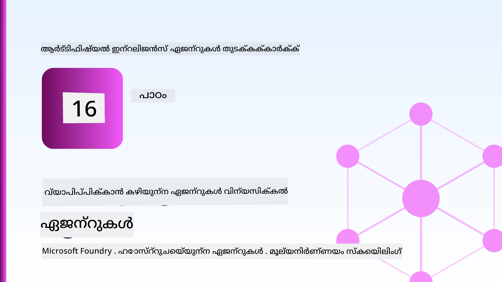
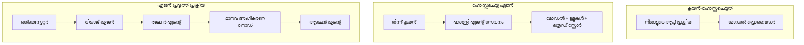
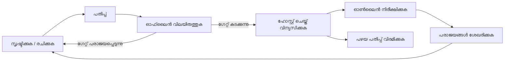
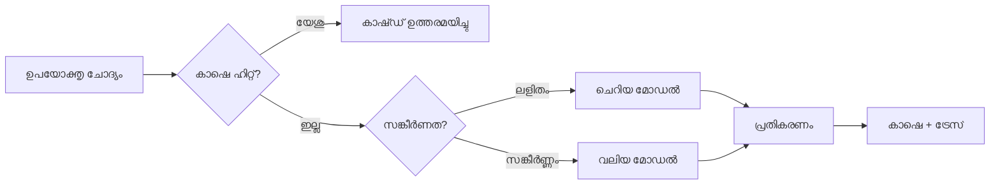
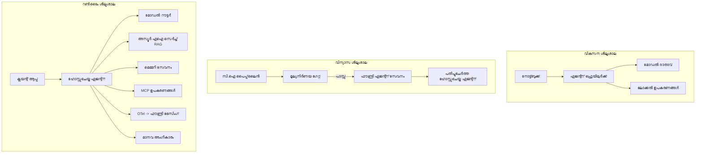

# Microsoft Foundry ഉപയോഗിച്ച് സ്കെയിലബിൾ ഏജന്റുകൾ വിന്യസിക്കൽ



ഇതുവരെ ക course ോഴ്സിൽ നിങ്ങൾ ലാപ്‌ടോപ്പിൽ, ഒരു नोट്ബുക്കിൽ, `az login` ഉപയോഗിച്ച് നിയന്ത്രിക്കപ്പെട്ട് ഒട്ടനവധി പരിസ്ഥിതി വേരിയബിള്‍ ഉപയോഗിച്ച് പ്രവർത്തിക്കുന്ന ഏജന്റുകൾ നിർമ്മിച്ചിട്ടുണ്ട്. പഠിക്കാനുള്ള കൃത്യമായ മാർഗമാണ് അത്. അന്ന്, ആയിരക്കണക്കിന് ഉപഭോക്താക്കൾ ആശ്രയിക്കുന്ന ഏജന്റിനെ രാവിലെ 3 മണിക്ക് ഓടിക്കാൻ അത് ശരിയായ മാർഗമല്ല.

ഈ പാഠം "എന്റെ യന്ത്രത്തിൽ ഇത് പ്രവർത്തിക്കുന്നു" എന്നതും "ഉത്പാദനത്തിൽ വിശ്വസനീയവും ചെലവുകുറഞ്ഞതുമായ പ്രവർത്തനശേഷിയുള്ളതും ആണ്" എന്നതുമായ ഇടവേളയെക്കുറിച്ചാണ്. നാം ആ ഇടവേള Microsoft Foundry-ഉം Microsoft Foundry Agent Service-ഉം ഉപയോഗിച്ച് അടയ്ക്കുന്നു, കൂടാതെ ഉപകരണങ്ങൾ, പുനരുദ്ധരം, മെമ്മറി, മൂല്യനിർമ്മാണം, നിരീക്ഷണം എന്നിവയുള്ള യഥാർത്ഥ ഉപഭോക്തൃ പിന്തുണ ഏജന്റ് നിർമ്മിച്ച് നടപ്പിലാക്കുന്നു.

## പരിചയം

ഈ പാഠം കൊള്ളുന്നുള്ളത്:

- **പ്രോട്ടോട്ടൈപ്പ് ഏജന്റ്** ഉം **വിനിമയIED ഏജന്റ്** ഉം തമ്മിലുള്ള വ്യത്യാസം, കൊണ്ടുതന്നെ മാറ്റം ആദ്യം വരുന്നത് മോഡലിന്റെ ചുറ്റുപാടിൽ മാത്രമാണ്.
- ഏജന്റുകൾക്കുള്ള **വിനിമയ മാതൃകകൾ**: ക്ലയന്റ്-ഹോസ്റ്റഡ്, സർവീസ്-ഹോസ്റ്റഡ് (ഹോസ്റ്റഡ് ഏജന്റുകൾ), വർക്ക്‌ഫ്ലോ-ഓർച്ചസ്‌ട്രേറ്റഡ്.
- Microsoft Foundry-യിലെ **ഏജന്റ് ലൈഫ്‌സൈക്കിൾ** — സൃഷ്‌ടിക്കൽ, പതിപ്പ്, വിന്യസിക്കൽ, മൂല്യനിർണ്ണയം, നിരീക്ഷണം, വിരമിക്കൽ.
- **സ്കെയ്ലിംഗ് തന്ത്രങ്ങൾ**: മോഡൽ റൂട്ടിംഗ്, കാഷിംഗ്, സമകാലിക പ്രവർത്തനം, സ്റ്റേറ്റ്‌ലസ് ഡിസൈൻ.
- OpenTelemetry-ഉം Foundry ട്രേസിംഗും ഉൾപ്പെടുന്ന **നിരീക്ഷണക്ഷമത**.
- മോഡൽ തിരഞ്ഞെടുപ്പ്, റൂട്ടിംഗ്, മൂല്യനിർണ്ണയം വഴി **ചെലവ് മിതിവേട്ടം**.
- **എന്റർപ്രൈസ് പരിഗണനകൾ**: ഭരണഘടനം, മനുഷ്യ അംഗീകാരം, MCP സർവർസുകളുടെ നിർമ്മിത സുരക്ഷിത പ്രവർത്തനം.

## പഠനലക്ഷ്യങ്ങൾ

ഈ പാഠം പൂർത്തിയാക്കിയശേഷം നിങ്ങൾ അറിയും:

- ഏജന്റിന്റെ വർക്ക്‌ലോഡ് അനുസരിച്ച് ശരിയായ വിന്യസ മാതൃക തിരഞ്ഞെടുക്കുക.
- ഏജന്റിനെ Microsoft Foundry Agent Service-ലേക്ക് വിന്യസിക്കുക, അതിനാൽ അതിന് പതിപ്പ്, ഭരണഘടന, നിരീക്ഷണം പ്രാപ്തമാകും.
- ട്രേസിംഗിനും പുറത്തിറക്കത്തിനു മുമ്പ് ഓടുന്ന മൂല്യനിർദ്ദേശ പൈപ്പ്ലൈന്‍ സജ്ജമാക്കാനും ഓടാനായി ഏജന്റ് ഇൻസ്ട്രുമെന്റുചെയ്യുക.
- സ്കെയിൽ ചെയ്യുമ്പോൾ വൈകിപ്പിക്കൽയും ചെലവും നിയന്ത്രിക്കാൻ മോഡൽ റൂട്ടിംഗ്, കാഷിംഗ് പ്രയോഗിക്കുക.
- ഉയർന്ന സുരക്ഷാ പ്രവർത്തനങ്ങൾക്ക് മനുഷ്യ അംഗീകാരം അനുമതി നൽകുന്ന ഗേറ്റ് ചേർക്കുക, MCP സർവർ ഉത്പാദന സുരക്ഷിത മാർഗത്തിൽ സംയോജിപ്പിക്കുക.

## മുൻനിബന്ധനകൾ

ഈ പാഠം മുമ്പെ പൂർത്തിയായി എന്നാണുസംഭവം, നിങ്ങൾക്ക് അറിവുണ്ടാകും:

- [Microsoft Agent Framework](../14-microsoft-agent-framework/README.md) ഉപയോഗിച്ച് ഏജന്റുകള്‍ നിർമ്മിക്കുന്നതിനുള്ള പരിജ്ഞാനം (പാഠം 14).
- [ഉപകരണം ഉപയോഗം](../04-tool-use/README.md) (പാഠം 4) һәм [Agentic RAG](../05-agentic-rag/README.md) (പാഠം 5).
- [ഏജന്റ് മെമ്മറി](../13-agent-memory/README.md) (പാഠം 13) и [Agentic പ്രോട്ടോകോളുകൾ / MCP](../11-agentic-protocols/README.md) (പാഠം 11).
- [നിരീക്ഷണക്ഷമതയും മൂല്യനിർണ്ണയവും](../10-ai-agents-production/README.md) (പാഠം 10) — ഈ പാഠം അതിന് നേരിട്ടുള്ള വികസനമാണ്.

അനുബന്ധമായി നിങ്ങൾക്ക് വേണം:

- ഒരു **Azure subscription**യും, കുറഞ്ഞത് ഒരു വിന്യസിച്ച ചാറ്റ് മോഡലോടുകൂടിയ **Microsoft Foundry പ്രോജക്ട്** ഉം.
- **Azure CLI** ഓതന്റിക്കേറ്റ് ചെയ്ത (az login).
- Python 3.12+ һәм റെപ്പോസിറ്ററിയിലെ പാക്കേജുകൾ ഉൾപ്പെടുന്ന [`requirements.txt`](../../../requirements.txt).

## പ്രോട്ടോട്ടൈപ്പിൽ നിന്നു ഉത്പാദനത്തിലേക്ക്: എന്താണ് യഥാർത്ഥത്തിൽ മാറുന്നത്

ഒരു പ്രോട്ടോട്ടൈപ്പ് ഏജന്റിനും ഉത്പാദന ഏജന്റിനും അടിസ്ഥാന ലൂപ് - ചിന്തിക്കുക, ഉപകരണം വിളിക്കുക, പ്രതികരിക്കുക - ഒരുപോലെയാണ്. വിവേകം കാലത്തെ ചുറ്റിപ്പറ്റി ഉള്ള കാര്യമാണ് മാറുന്നത്. മോഡൽ ഉത്പാദന ഏജന്റിന്റെ ഏകദേശം 20% ആണ്; മറ്റു 80% പ്രവർത്തന യന്ത്രരേഖ.

| വിഷയം | പ്രോട്ടോട്ടൈപ്പ് | ഉത്പാദനം |
| --- | --- | --- |
| **ഹോസ്റ്റിംഗ്** | നിങ്ങളുടെ നോട്ട്‌ബുക്കിൽ പ്രവർത്തിക്കുന്നു | ഹോസ്റ്റുചെയ്ത സർവീസായി പ്രവർത്തിക്കുന്നു, പതിപ്പിക്കുകയും നിലനിർത്തുകയും ചെയ്യുന്നു |
| **അടയാളം** | നിങ്ങളുടെ `az login` ടോക്കൺ | സ്കോപ്പുചെയ്ത RBAC-യുള്ള മാനേജു ചെയ്ത ഐഡന്റിറ്റി |
| **സ്റ്റേറ്റ്** | ഇൻ-മെമ്മറിയിൽ, പുനരാരംഭിച്ചാൽ നഷ്ടം | ബാഹ്യവത്കൃതം (ത്രെഡ് സ്റ്റോർ, മെമ്മറി സർവീസ്) |
| **പരാജയം** | നിങ്ങൾ ട്രേസ്‌ബാക്ക് കാണും | പുനരנסים, ഫെൽബാക്കുകൾ, ഡെഡ്-ലെറ്റർ, അലർട്ടുകൾ |
| ** ചെലവ്** | "അത് ചില സെന്റുകൾ മാത്രം" | ഓരോ അഭ്യർത്ഥനയ്ക്കും വേറെ പണമാണ് രേഖപ്പെടുത്തുന്നത്, റൂട്ടിംഗ്, കാഷിംഗ്, ബജറ്റ് |
| **ഗുണനിലവാരം** | നിങ്ങൾ ഔട്ട്പുട്ട് നോക്കുന്നു | ഓരോ റിലീസ് മുൻപും സ്വയം മൂല്യനിർണ്ണയം നടത്തി |
| **വിശ്വാസം** | നിങ്ങൾ ഓരോ പ്രവർത്തനവും അംഗീകരിക്കുന്നു | നയം + അപകടകരമായ പ്രവർത്തനങ്ങൾക്ക് മനുഷ്യ നിയമനിരീക്ഷണം |

ഈ പട്ടിക മനസ്സിൽ വയ്ക്കുക. താഴെ കൊടുത്തിരിക്കുന്ന ഓരോ വകുപ്പ് ഈ വരികളിൽ ഏതെങ്കിലുമൊന്നുമായി ബന്ധപ്പെട്ടതാണ്.

## ഏജന്റ് വിന്യസ മാതൃകകൾ

നിങ്ങൾ ഉപയോഗിക്കുന്ന മൂന്ന് മാതൃകകളുണ്ട്, പലപ്പോഴും സംയുക്തമായി.

### 1. ക്ലയന്റ്-ഹോസ്റ്റഡ് ഏജന്റുകൾ

ഏജന്റ് ഒബ്ജക്ട് *നിങ്ങളുടെ* ആപ്ലിക്കേഷൻ പ്രോസസ്സിനുള്ളിൽ ജീവിക്കുന്നു. നിങ്ങളുടെ കോഡ് മോഡൽ പ്രൊവൈഡറെ നേരിട്ട് വിളിക്കുന്നു; ചിന്തന ലൂപ് നിങ്ങളുടെ സർവീസിൽ പ്രവർത്തിക്കുന്നു. ഇത് മുമ്പത്തെ ഓരോ പാഠവും ചെയ്തിട്ടുള്ളതാണ്.

- **ഉപയോഗിക്കുക** നിങ്ങൾക്ക് പൂർണ്ണ നിയന്ത്രണവും കസ്റ്റം മിഡിൽവെയറുമായി ലൂപിന് ആവശ്യമാണെങ്കിൽ അല്ലെങ്കിൽ നിങ്ങൾ ഇതിനകം ഉള്ള ബാക്ക്എൻഡിൽ ഏജന്റ് എम्बെഡ് ചെയ്യുകയാണ്.
- **ട്രേഡ്-ഓഫ്**: സ്കെയ്ലിംഗ്, സ്റ്റേറ്റ്, മറ്റ് പ്രതിരോധങ്ങൾ നിങ്ങൾ തന്നെ കൈകാര്യം ചെയ്യണം.

### 2. ഹോസ്റ്റഡ് ഏജന്റുകൾ (Foundry Agent Service)

ഏജന്റ് Microsoft Foundry-ലെ ഒരു വിഭവമായി *രജിസ്റ്റർ* ചെയ്യപ്പെട്ടിരിക്കുന്നു. Foundry ചിന്തന ലൂപ് ഹോസ്റ്റ് ചെയ്യുന്നു, ത്രെഡുകൾ അരക്ഷിക്കുന്നു, ഉള്ളടക്ക സുരക്ഷയും RBACയും നടപ്പാക്കുന്നു,യും ഏജന്റിനെ Foundry പോർട്ടലിൽ സാന്നിധ്യമാക്കുന്നു. നിങ്ങളുടെ ആപ്പ് വThin പ്പിണ്ടായത് ആണ്, ആണ് വൈർ ചെയ്ത് ത്രെഡുകൾ നിർമ്മിക്കുകയും പ്രതികരണങ്ങൾ വായിക്കുകയും ചെയ്യുക.

- **ഉപയോഗിക്കുക** ദൃഢത, നിലവിൽ കാണൽ, ഭരണഘടന, ചെറുതായ പ്രവര്‍ത്തന വൃത്തം ആവശ്യമുള്ളപ്പോൾ.
- **ട്രേഡ്-ഓഫ്**: കുറവ് താഴ്ന്ന നിയന്ത്രണം, മാനേജുചെയ്ത റൺടൈം.

### 3. ഏജന്റ് വർക്ക്‌ഫ്ലോകൾ

പല ഏജന്റുകൾ (ഉപകരണങ്ങളിലും) ഒരു ഗ്രാഫിൽ സംയോജിപ്പിച്ചിരിക്കുന്നു സെയ്‌ളൻഷ്യൽ ഘട്ടങ്ങൾ, ശാഖീകരണം, മനുഷ്യ അംഗീകാരം നോഡുകൾ, സ്ഥിരമായ ചെക്ക്‌പോയിന്റുകൾ എന്നിവയോടെ, പോസും റീസ്യൂം ചെയ്യാൻ കഴിയും. ഇത് Microsoft Agent Framework-ന്റെ **Workflows** ഫീച്ചർ വിന്യസ തളവിൽ പ്രയോഗിക്കുന്നു.

- **ഉപയോഗിക്കുക** ഒറ്റ ടാസ്കിനായി നിരവധി പ്രത്യേകതയുള്ള ഏജന്റുകൾ ആവശ്യമായാൽ അല്ലെങ്കിൽ ഇടയിലെ അംഗീകാരം ആവശ്യമുള്ളപ്പോൾ.
- **ട്രേഡ്-ഓഫ്**: കൂടുതൽ കണ്ടുപിടിയ്ക്കലുകൾ; ഓർക്കെസ്ട്രേഷൻ തല നിരീക്ഷണം.



## Microsoft Foundry-യിലെ ഏജന്റ് ലൈഫ്‌സൈക്കിൾ

ഏജന്റ് വിന്യസിക്കൽ ഒറ്റ തവണ `push` ചെയ്യുന്നത് അല്ല. അത് പുനരാവർത്തനമാണ്, സോഫ്റ്റ്‌വെയർ റിലീസ് ചക്രം പോലെയാണ്.



പ്രധാന ആശയം, [Lesson 10](../10-ai-agents-production/README.md) മുതൽ കൈമാറിയതാണ്: **ഓഫ്ലൈൻ മൂല്യനിർണ്ണയം ഒരു ഗേറ്റ് ആണ്, ഒരു പരിഗണനക്കപ്പുറം അല്ല.** പുതിയ ഏജന്റ് പതിപ്പിന് നിങ്ങളുടെ മൂല്യനിർണ്ണയ ക്ഷമതകൾ പാലിക്കാൻ വേണം, ഓൺലൈൻ നിരീക്ഷണം യഥാർത്ഥ പരാജയങ്ങൾ നിങ്ങളുടെ ഓഫ്‌ലൈന ടെസ്റ്റ് സെറ്റിലേക്ക് നൽകുന്നു. ആ ആണ് മുഴുവൻ ചക്രം.

## സ്കെയ്ലിംഗ് തന്ത്രങ്ങൾ

ഏജന്റ് സ്കെയ്ല് ചെയ്യുന്നത് സ്റ്റേറ്റ്‌ലസ് വെബ് API-യെ അപേക്ഷിച്ച് വ്യത്യസ്ഥമാണ്, കാരണം ഓരോ അഭ്യർത്ഥനയും മൾട്ടിപ്പിൾ ചെലവേറിയ മോഡൽ, ഉപകരണ വിളികൾ ഉണ്ടാക്കാം. നാല് സാങ്കേതികതകളും ഭാരം കൂടുതലായി കൈക്കൊള്ളുന്നു.

**സ്റ്റേറ്റ്‌ലസ് അഭ്യർത്ഥന കൈകാര്യം.** പ്രോസസ്സ് മെമ്മറിയിൽ ഓരോ ഉപയോക്താവിനും സ്റ്റേറ്റ് വെയ്ക്കാൻ പാടില്ല. സംവദിക്കുന്ന ത്രെഡുകൾ Foundry ത്രെഡ് സ്റ്റോറിൽ അല്ലെങ്കിൽ മെമ്മറി സർവീസിൽ നിലനിർത്തുക, ആകെയുള്ള ഉദാഹരണം ഏതെങ്കിലും അഭ്യർത്ഥന കൈകാര്യം ചെയ്യാൻ കഴിയും. ഇങ്ങനെ കഴിവുകളും അളവ് കൂട്ടാൻ കഴിയും — ഉദാഹരണങ്ങൾ കൂട്ടുക, സSticky സെഷനുകൾ ഇല്ല.

**മോഡൽ റൂട്ടിംഗ്.** എല്ലാ അഭ്യർത്ഥനക്കും നിങ്ങളുടെ ഏറ്റവും ശക്തമായ (അതിനും ചെലവേറിയ) മോഡലും വേണ്ടതല്ല. ലളിതമായ അഭ്യർത്ഥനകൾ — ഉദ്ദേശം തിരിച്ചറിയൽ, സ്കേത factual ഉത്തരം - ചെറിയ, വേഗത്തിലുള്ള മോഡലിലേക്ക് റൂട്ട് ചെയ്യുക, വലിയ മോഡൽ യഥാർത്ഥ ചിന്തനത്തിന് മാത്രം സംഗ്രഹിക്കുക. Foundry-ന്റെ **Model Router** ഇത് ചെയ്യാം, അല്ലെങ്കിൽ നിങ്ങളുടെ തന്നെ ലഘു ക്ലാസിഫയർ നിർമ്മിക്കാം. നിങ്ങൾ അഭ്യാസത്തിലുള്ള DIY പതിപ്പ് ഉണ്ടാക്കും.

**പ്രതികരണ കാഷിംഗ്.** പല പിന്തുണ ചോദ്യങ്ങൾ ഏകദേശം സമാനമാണ് ("എന്താണ് പാസ്‌വേർഡ് റീസറ്റ് ചെയ്യാൻ?"). സാധാരണ ചോദ്യങ്ങൾക്ക് ഉത്തരം കാഷിൽ വച്ചു മോഡൽ വിളിക്കാതെ സേവനം നൽകുക. ചെറിയ കാഷിംഗ് ഹിറ്റ് നിരക്കും ചെലവും വൈകിപ്പിക്കലും കുറക്കാൻ അനുയോജ്യമാണ്.

**സമകാലികതയും പിന്‍പ്രഷറും.** മോഡൽ പ്രൊവൈഡർമാരിന് നിരക്കു സീമകൾ ഉണ്ട്. നിങ്ങളുടെ സമകാലികത നിയന്ത്രിക്കുക, exponentail backoff ഉപയോഗിച്ച് പുനരנסות നടത്തുക, സൗമ്യമായി പരാജയം ഉണ്ടാകണം (ക്യൂ ചെയ്‌ത "നാം ഇതിൽആണ്" പ്രതികരണം 500-നെക്കാൾ നല്ലത്).



## ഉത്പാദനത്തിൽ നിരീക്ഷണക്ഷമത

നിങ്ങൾ കാണാത്തതിനെ പ്രവർത്തിപ്പിക്കാൻ കഴിയില്ല. പാഠം 10-ൽ പേറി, Microsoft Agent Framework സ്വാഭാവികമായും **OpenTelemetry** ട്രേസുകൾ പുറപ്പെടുവിക്കുന്നു — എല്ലാ മോഡൽ വിളിയും ഉപകരണ വികലനവും ഓർക്കസ്ട്രേഷൻ ഘട്ടവും സ്പാനായി മാറുന്നു. ഉത്പാദനത്തിൽ ആ സ്പാനുകൾ Microsoft Foundry-യ്ക്ക് (അല്ലെങ്കിൽ ഏതെങ്കിലും OTel-അനുകൂല ബാക്ക്എൻഡിനും) എക്സ്പോർട്ട് ചെയ്യാം:

- ഒരു ഉപഭോക്താവിന്റെ പരാതിയെല്ലാ മോഡലും ഉപകരണ വിളിയും മുഴുവനായി ട്രേസ് ചെയ്യുക.
- സമയാനുസരിച്ച് p50/p95 വൈകിപ്പിക്കൽയും ചെലവും നിരീക്ഷിക്കുക.
- പിശകിന്റെ നിരക്കിലെ വർധനവുകളും ചെലവിലുള്ള അസാധാരണതകളും ഉപയോക്താക്കള്‍ക്കും (അല്ലെങ്കിൽ നിങ്ങളുടെ ഫിനാൻസ് ടീമിനും) മുൻപ് മുന്നറിയിപ്പ് നൽകുക.

```python
from agent_framework.observability import get_tracer

tracer = get_tracer()

with tracer.start_as_current_span("support_request") as span:
    span.set_attribute("customer.tier", "enterprise")
    span.set_attribute("routed.model", "gpt-5-nano")
    # ഈ സ്‌പാനിനുള്ളിൽ ഏജന്റ് പ്രവർത്തനം സ്വയം പിന്വറ്റപ്പെടുന്നു
```

`customer.tier` һәм `routed.model` പോലുള്ള ഘടകങ്ങൾ ട്രേസുകളുടെ ഭിത്തിയെ ഉത്തരം പറയാവുന്ന ചോദ്യങ്ങളാകുന്നു ("എന്റർപ്രൈസ് ഉപഭോക്താക്കൾ ചെറിയ മോഡലിലേക്ക് അത്യധിക്കമായി റൂട്ടു ചെയ്യപ്പെടുന്നതാണോ?").

## ചെലവ് മിതിവേട്ടം

ഉത്പാദന ഏജന്റുകളിൽ ചെലവ് ടോക്കണുകൾ ആണ് വഹിക്കുന്നത്. മൂന്നു കൈമാറുകൾ, പ്രഭാവകമായ ഓർഡറിൽ:

1. **മോഡൽ ശരിയായ വലുപ്പം.** നിങ്ങളുടെ മൂല്യനിർണ്ണയ ഗേറ്റ് കടത്തുന്ന ചെറുഞ് മോഡൽ വലിയ മോഡലേക്കാൾ സാധാരണയായി ചെലവുകുറഞ്ഞതാണ്. മുൻകൂർ ജാഗ്രതയായി ഏറ്റവും വലിയ മോഡലിന് പകരം ചെറുഞ് മോഡൽ മതിയെന്ന് തെളിയിക്കാൻ മൂല്യനിർണ്ണയം ഉപയോഗിക്കുക.
2. **സങ്കീർണത അനുസരിച്ച് റൂട്ടുചെയ്യുക.** മുകളിൽ പറഞ്ഞത് പോലെ, വെറും വലിയ മോഡൽ ഗ്രഹിക്കേണ്ട അഭ്യർത്ഥനകൾക്ക് മാത്രം വലിയ മോഡലിന് പണം കൊടുക്കുക.
3. **ആക്രമകമായി കാഷ് ചെയ്യുക.** ഏറ്റവും വിലകുറഞ്ഞ മോഡൽ വിളി നിങ്ങൾ ഒരിക്കലും നടത്താത്തതാണ്.

മൂല്യനിർണ്ണയ ഗേറ്റുകളും ചെലവ് നിയന്ത്രണവും ഒരേ ശാസ്ത്രമാണ്, രണ്ടും വ്യത്യസ്ത കാഴ്ചകളിൽ: മൂല്യനിർണ്ണയം നിങ്ങൾക്ക് *ഗുണമേന്മയുടെ നിലം* പറയുന്നു, റൂട്ടിംഗ്, കാഷിംഗ് നിങ്ങൾക്ക് ആ നിലത്തിൽ *ചെലവ്* όσο തളിക്കും.

## എന്റർപ്രൈസ് വിന്യസ പരിഗണനകൾ

**ഭരണഘടനം.** ഹോസ്റ്റഡ് ഏജന്റുകൾ Foundry-യുടെ RBAC, ഉള്ളടക്ക സുരക്ഷ, ഓഡിറ്റ് ലോസ്റ്റിംഗ് ഉൾക്കൊള്ളുന്നു. ഓരോ ഏജന്റിനും അത് പ്രയോജനം പരമാവധി കുറഞ്ഞ മാനേജുചെയ്‌ത ഐഡന്റിറ്റി നൽകുക — അറിവ് അടിസ്ഥാനത്തിലെ വായിക്കുവാനുള്ള ആക്‌സസ്, ടിക്കറ്റിംഗ് API-യുടെ സ്കോപ്പ്ഡ് ആക്‌സസ്, അതിൽ കൂടുതൽ ഒന്നും അല്ല.

**മനുഷ്യൻ-ഇൻ-ദി-ലൂപ്പ്.** ചില പ്രവർത്തനങ്ങൾ സ്വയം പ്രവർത്തിപ്പിക്കാൻ അത്യത്രവത്തമായതാണ് — പണം തിരികെ നൽകൽ, അക്കൗണ്ട് നീക്കം, നിയമ സംവാദം escalate ചെയ്യുക. Microsoft Agent Framework **അംഗീകാരം ആവശ്യമായ** ടൂളുകൾ പിന്തുണയ്ക്കുന്നു: ഏജന്റ് പ്രവർത്തി നിർദ്ദേശിക്കുന്നു, പ്രവർത്തനം നിർത്തുന്നു, മനുഷ്യൻ അംഗീകരിക്കുകയോ നിരസിക്കുകയോ ചെയ്യുന്നു, വർക്ക്‌ഫ്ലോ വീണ്ടും ആരംഭിക്കുന്നു. നിങ്ങൾ [Lesson 6](../06-building-trustworthy-agents/README.md) ൽ ഇതിന്റെ പ്രാഥമിക രൂപം കണ്ടിട്ടുണ്ട്; ഇവിടെ അത് വിന്യസിക്കുന്നു.

**ഉത്ഭവ MCP.** [MCP](../11-agentic-protocols/README.md) നിങ്ങളുടെ ഏജന്റ് ഒരു സ്റ്റാൻഡേർഡ് ഇന്റർ‌ഫേസ് വഴി ബാഹ്യ ഉപകരണങ്ങൾ ഉപഭോഗിക്കാൻ അനുവദിക്കുന്നു. ഉത്പാദനത്തിൽ, ഓരോ MCP സർവരും വിശ്വസനീയമല്ലാത്ത അതിരു ആയി കാണുക: സർവർ പതിപ്പ് പിന്ഹിരിക്കുക, സ്കോപ്പ് ചെയ്ത ഐഡന്റിറ്റിയോടെയുള്ള പ്രവർത്തനം നടത്തുക, പുറത്തിറക്കുകൾ പരിശോദിക്കുക, അതിന് രഹസ്യങ്ങൾ കാണിക്കരുത്. MCP സർവർ ഒരു ആശ്രിതമാണ്, ആശ്രിതങ്ങൾ പാച്ച് ചെയ്യപ്പെടുന്നു, ഓഡിറ്റ് ചെയ്യപ്പെടുന്നു, നിരക്ക് നിയന്ത്രണം ഉണ്ടാകുന്നു.



ആ മൂന്ന് ചിത്രണങ്ങൾ — വികസനം, വിന്യസിക്കൽ, റൺടൈം — ഒരു ഏജന്റിന്റെ ജീവിതത്തിലെ മൂന്ന് ഘട്ടങ്ങളാണ്. താഴെ വരുന്ന ലാബ് നിങ്ങളെ അതു നിർമ്മിക്കുന്ന തരത്തിൽ നയിക്കുന്നു.

## പ്രായോഗിക ലാബ്: ഉത്പാദനത്തിന് സജ്ജമായ ഉപഭോക്തൃ പിന്തുണ ഏജന്റ്

തുറക്കുക [`code_samples/16-python-agent-framework.ipynb`](./code_samples/16-python-agent-framework.ipynb) അതിന്റെ എടുക്കുന്ന ഓരോ ഭാഗവും പൂർണ്ണമായും പ്രവർത്തിക്കുക. നിങ്ങൾ ഒരു **Contoso ഉപഭോക്തൃ പിന്തുണ ഏജന്റ്** സമാഹരിക്കും, എല്ലാ ഉത്പാദന പരിഗണനകളും ഉൾക്കൊള്ളിച്ച്:

1. **ഉപകരണം വിളിക്കൽ** — ഓർഡർ സ്ഥിതിയും തുറന്ന പിന്തുണ ടിക്കറ്റുകളും കണ്ടെത്തുക.
2. **RAG** — അറിവ് അടിസ്ഥാനത്തിൽ നയം ചോദ്യങ്ങൾക്ക് ഉത്തരം നൽകുക (Azure AI Search, ഇൻ-മെമ്മറി ഫാൽബാക്ക് ഉപയോഗിച്ച്, നോട്ട്‌ബുക്ക് സെർച്ച് റിസോഴ്‌സ് ഇല്ലാതെ ഓടും).
3. **മെമ്മറി** — സംഭാഷണത്തിന്റെ വഴിയിലൂടെ ഉപഭോക്താവിനെ ഓർക്കുക.
4. **മോഡൽ റൂട്ടിംഗ്** — സങ്കീർണത ക്ലാസിഫയർ ഓരോ അഭ്യർത്ഥനയും ചെറിയ അല്ലെങ്കിൽ വലിയ മോഡലിലേക്ക് റൂട്ടു ചെയ്യുന്നു.
5. **പ്രതികരണ കാഷിംഗ്** — ആവർത്തിച്ച ചോദ്യങ്ങൾ കാഷിൽ നിന്നും സേവനം ലഭിക്കുന്നു.
6. **മനുഷ്യ അംഗീകാരം** — നിശ്ചിത പരിധിയിലേക്ക് മുകളിൽ വരുന്ന റീഫണ്ടും മനുഷ്യ അംഗീകാരത്തിനായി നിർത്തുന്നു.
7. **മൂല്യനിർണ്ണയം പൈപ്പ്‌ലൈൻ** — ചെറിയ ഓഫ്‌ലൈൻ ടെസ്റ്റ് സെറ്റ് ഏജന്റിനെ സ്കോർ ചെയ്യുകയും റിലീസ് ഗേറ്റ് ആയി പ്രവർത്തിക്കുകയും ചെയ്യുന്നു.
8. **നിരീക്ഷണക്ഷമത** — ഓരോ അപേക്ഷയ്ക്കും ചുറ്റുമുള്ള OpenTelemetry ട്രേസിംഗ്.

### ദৰ্শനം

നോട്ട്‌ബുക്ക് സജ്ജീകരിച്ചിരിക്കുന്നത് എന്നിങ്ങനെ ഓരോ ഉത്പാദന പരിഗണനയും സ്വതന്ത്രമായ, പ്രവർത്തനക്ഷമമായ വിഭാഗമാണ്. അതിന്റെ ഹൃദയം റൂട്ടിംഗ്-കാഷിംഗ് സംയുക്ത അഭ്യർത്ഥന ഹാൻഡ്ഡ്ലറാണ്:

```python
async def handle_support_request(query: str, customer_id: str) -> str:
    # 1. കഴിവുള്ളപ്പോൾ കാഷെ നിന്നും സേവനം നൽകുക.
    cached = response_cache.get(normalize(query))
    if cached:
        return cached

    # 2. ചെലവ് നിയന്ത്രിക്കാൻ സങ്കീർണ്ണതയുടെ അടിസ്ഥാനത്തിൽ റൂട്ടുചെയ്യുക.
    model = "gpt-5-nano" if is_simple(query) else "gpt-5-mini"

    # 3. നിരീക്ഷണത്തിന് ഏജന്റിനെ ട്രേസ് സ്‌പാനിനു പുറത്തു നടക്കിക്കുക.
    with tracer.start_as_current_span("support_request") as span:
        span.set_attribute("routed.model", model)
        span.set_attribute("customer.id", customer_id)
        response = await support_agent.run(query, model=model)

    # 4. കാഷെ ചെയ്യുകയും തിരികെ നല്‍കുകയും ചെയ്യുക.
    response_cache.set(normalize(query), response.text)
    return response.text
```

റിലീസ് പരിരക്ഷിക്കുന്ന മൂല്യനിർദ്ദേശ ഗേറ്റ് ഇങ്ങനെ കാണപ്പെടുന്നു:

```python
async def evaluation_gate(agent, test_cases, threshold: float = 0.8) -> bool:
    passed = 0
    for case in test_cases:
        result = await agent.run(case["input"])
        if score_response(result.text, case["expected"]) >= 0.8:
            passed += 1
    pass_rate = passed / len(test_cases)
    print(f"Evaluation pass rate: {pass_rate:.0%} (gate: {threshold:.0%})")
    return pass_rate >= threshold  # ഗേറ്റ് പാസായാൽ മാത്രം വിന്യസിക്കുക
```

ഓരോ ലൈനും വായിക്കുക — നോട്ട്‌ബുക്ക് പ്രാഥമിക ഘടകങ്ങൾ ചെറിയവയാക്കുന്നു, അതിനാൽ ഏതാനും കേന്ദ്രീകൃത കോൾസിന് പിൻവശം ഒന്നും മറച്ചുവെക്കപ്പെട്ടിട്ടില്ല.

## വിന്യസിച്ച ഏജന്റ് സ്മോക്ക് ടെസ്റ്റുകളിലൂടെ സാധുത പരിശോധന

മേൽ കൊടുത്ത മൂല്യനിർദ്ദേശ ഗേറ്റ് *ഓഫ്ലൈനായി* നിങ്ങളുടെ ഏജന്റ് ഒബ്ജക്ടിനെതിരെ പ്രവർത്തിക്കുന്നു. സേതുവായി ഹോസ്റ്റഡ് ഏജന്റായി വിന്യസിച്ചശേഷം, നിങ്ങൾക്ക് മറ്റൊരു, കൂടുതൽ പൂവണ്ണമായ പരിശോധന വേണം: **വിന്യസിച്ച എന്റ്പോയിന്റ് വരച്ചതു പ്രവർത്തിക്കുമോ?**

"വിജയകരമായി" വിന്യസിക്കൽ മാത്രമാണ് കണ്ടുതാനും, നിയന്ത്രണ പ്ലെയ്ൻ നിർവചന കൌശലം സ്വീകരിച്ചത് മാത്രമാണ് തെളിയിക്കുന്നത് — ഏജന്റ് പ്രതികരിക്കുമെന്ന് ഉറപ്പില്ല. ഒരു ആശ്രിതം ഇല്ലതായിരിക്കാം, മോഡൽ റൂട്ടിംഗ് തെറ്റായിരിക്കാം, ബന്ധം കാലഹരണപ്പെട്ടിരിക്കാം — ഇങ്ങനെ ഒരു പൂർത്തിയായ ഹരിത വിന്യസിക്കൽ ഒരു പ്രതികരണം ഒന്നും നൽകാതെ കഴിയാം. ഒരു **സ്മോക്ക് ടെസ്റ്റ്** അത് സെക്കൻഡുകളിൽ പിടിക്കും, ഓരോ വിന്യസത്തിലും, മുഴുവൻ മൂല്യനിർണ്ണയ ചെലവ് കൂടാതെ.

ഈ റെപ്പോസിറ്ററി ഉപയോഗത്തിന് തയ്യാറാക്കിയ സ്മോക്ക്-ടെസ്റ്റ് പൈപ്പ്ലൈന് GitHub Action [AI Smoke Test](https://github.com/marketplace/actions/ai-smoke-test) ഉപയോഗിച്ച് കൊടുക്കുന്നു:

- **കാറ്റലോഗ്** — [`tests/lesson-16-smoke-tests.json`](../../../tests/lesson-16-smoke-tests.json) Contoso പിന്തുണ ഏജന്റിനുള്ള പ്രോമ്പ്റ്റുകളും ഉറപ്പുകളും ഉൾക്കൊള്ളുന്നു (അടിസ്ഥിത നയം ഉത്തരങ്ങൾ, ഓർഡർ പരിശോധിക്കൽ, വിഷയം പാലിക്കൽ, ബഹുസംവാദ ത്രെഡ് തുടർച്ച). മറ്റു പാഠങ്ങളുടെ ഏജന്റുകളുടെ കാറ്റലോഗുകളും അതിന്റെ കൂടെ ഉണ്ട് — [tests/README.md](../tests/README.md) കാണുക.
- **വർക്ക്‌ഫ്ലോ** — [`.github/workflows/smoke-test.yml`](../../../.github/workflows/smoke-test.yml) Azure OIDC ഉപയോഗിച്ച് ലോഗിൻ ചെയ്യുന്നു, ഓരോ പ്രോമ്പ്റ്റും ഏജന്റിന്റെ Responses എൻഡ്‌പോയിന്റിലേക്ക് POST ചെയ്യുന്നു, ഒരുവിധേയാന്വേഷണം പരാജയപ്പെട്ടാൽ ജോബ് പരാജയപ്പെടുത്തുന്നു.

```yaml
- name: Smoke-test hosted agent
  uses: JFolberth/ai-smoketest@v1
  with:
    project_endpoint: ${{ inputs.project_endpoint }}
    agent_name: ContosoSupportAgent
    tests_file: tests/lesson-16-smoke-tests.json
```


നിങ്ങളുടെ ഏജൻറ് വിന്യസിച്ചതിനുശേഷം, നിങ്ങളുടെ Foundry പ്രോജക്ട് എന്റ്പോയിന്റും ഏജന്റ് പേരും നൽകിയാണ് **Actions** ടാബിൽ നിന്ന് ഇത് പ്രവർത്തിപ്പിക്കുക. ഫെഡറേറ്റഡ് ഐഡന്റിറ്റി Foundry പ്രോജക്ട് സ്കോപ്പിൽ **Azure AI User** റോളുകൾ വേണം. ലയറുകൾ ഒരു പിറമിഡ് പോലെ പരിഗണിക്കുക: സ്‍മോക്ക് ടെസ്റ്റുകൾ (പ്രാപിച്ചും പ്രതികരിക്കുന്നതും ആണോ?) ഓരോ വിന്യാസത്തിലും നടത്തുന്നു, ഓഫ്‌ലೈನ್ വിലയിരുത്തൽ (കപ്പലെടുക്കുന്നതിനായി ചീത്തമല്ലാത്തതാണോ?) പ്രമോഷനിൽ മുൻപ് നടക്കുന്നു, ഓൺലൈൻ വിലയിരുത്തൽ (പ്രവൃത്തിയിൽ എങ്ങനെ പോകുന്നു?) തുടർച്ചയായി നടക്കുന്നു.

## അറിവ് പരിശോധന

അസൈൻമെന്റിലേക്ക് പോകരുതിന് മുൻപ് നിങ്ങളുടെ മനസിലാക്കിയതിനിമിഷ്ടം പരിശോധിക്കുക.

**1. ഒരു പ്രൊഡക്ഷൻ ഏജന്റിന്റെ "മോഡൽ" എത്ര വിശാലമാണ്, ബാക്കി എന്താണ്?**

<details>
<summary>ഉത്തരം</summary>

മോഡൽ സിസ്റ്റത്തിന്റെ ചെറിയൊരു ഭാഗമാണ് — സാധാരണയായി ഏകദേശം 20% ആണ് പറയുന്നത്. ബാക്കി ഓപ്പറേഷണൽ ഘടനയാണ്: ഹോസ്റ്റിംഗ്, വേർഷനിംഗ്, ഐഡന്റിറ്റി, RBAC, എക്സ്റ്റേണലൈസ്ഡ് സ്റ്റേറ്റ്, പരാജയ കൈകാര്യം, ചെലവ് ട്രാക്കിങ്, വിലയിരുത്തൽ, മനുഷ്യൻ ഇടപെടുന്ന നിയന്ത്രണങ്ങൾ. പ്രൊഡക്ഷനിലേക്ക് പോവുന്നത് പ്രധാനമായും ഈ വാണിജ്യ ചക്രത്തിനുചുറ്റും എല്ലാം നിർമ്മിക്കുന്നതിൽ ആണ്.
</details>

**2. ക്ലയന്റ്-ഹോസ്റ്റഡ് ഏജന്റിനേക്കാൾ ഹോസ്റ്റഡ് ഏജന്റ് നിങ്ങൾ തിരഞ്ഞെടുക്കേണ്ടത് എപ്പോൾ?**

<details>
<summary>ഉത്തരം</summary>

നിങ്ങൾ താല്പര്യമുള്ളതായി മാനേജുചെയ്ത റൺടൈം ആവശ്യമാണ്, നിർമ്മിത ദീർഘായുസ്സ് (തിരഡുകൾ തുടരുകയും പുനരാരംഭിക്കുകയും ചെയ്യാൻ കഴിയും), ദൃശ്യമാനത, ഉള്ളടക്ക സുരക്ഷ, RBAC എന്നിവയാണ്; reasoning loop ൽ നിന്നുള്ള കുറച്ച് താഴത്തെ നിയന്ത്രണം ഓപ്പറേഷണൽ വിസ്തീർച്ചയുമായി ബദൽ വിവർത്തനത്തിനു തയ്യാറാണെങ്കിലും. reasoning ലൂപിൽ പൂര്‍ണ നിയന്ത്രണം ആവശ്യമുള്ളപ്പോൾ അല്ലെങ്കിൽ ഏജന്റ് നിലവിലുള്ള ബാക്ക്‌എൻഡിൽ ഇമ്പെഡ് ചെയ്യപ്പെടുമ്പോൾ ക്ലയന്റ്-ഹോസ്റ്റഡ് ആകാംഷയുള്ളതാണ്.
</details>

**3. സ്കെയിലബിള്‍ ഏജന്റ് തന്റെ പ്രോസസ് മെമ്മറിയിൽ സ്റ്റേറ്റ്‌ലസ് ആകേണ്ടതാകുന്ന കാരണമെന്ത്?**

<details>
<summary>ഉത്തരം</summary>

ഏത് ഇൻസ്റ്റൻസും ഏത് അഭ്യർത്ഥനയും കൈകാര്യം ചെയ്യാൻ കഴിയണം, ഇത് സ്റ്റിക്കി സെഷൻമാർ ഇല്ലാതെ ഹൊറീസോണ്ടൽ സ്കെയിലിംഗ് അനുവദിക്കുന്നതാണ്. ഓരോ ഉപയോക്താവിന്റെ സംഭാഷണ അവസ്ഥ അഭാഷണ സ്റ്റോറിൻ അല്ലെങ്കിൽ മെമ്മറി സർവീസിലേക്ക് പുറത്താക്കപ്പെട്ടിരിക്കുന്നു. സ്റ്റേറ്റ് പ്രോസസ് മെമ്മറിയിൽ ഉണ്ടായിരുന്നെങ്കിൽ, അത് റീസ്റ്റാര്‍ട്ടിൽ നഷ്ടപ്പെടും, ലോഡ് സ്വതന്ത്രമായി വിതരണം ചെയ്യാൻ കഴിയില്ല.
</details>

**4. മോഡൽ റൂട്ടിങ് പരിഹരിക്കുന്ന പ്രശ്നം എന്തും ഇത് വിലയിരുത്തലുമായി എങ്ങനെ ബന്ധപ്പെട്ടിരിക്കുന്നു?**

<details>
<summary>ഉത്തരം</summary>

റൂട്ടിങ് ലളിതമായ അഭ്യർത്ഥനകൾ ചെറുതും വിലക്കുറഞ്ഞതുമാണ് മോഡലിലേക്ക് അയയ്ക്കുകയും വലിയ മോഡൽ യഥാർത്ഥ reasoning നു സംരക്ഷിക്കുകയും latencyയും ചിലവ് നിയന്ത്രിക്കുകയും ചെയ്യുന്നു. ഇത് വിലയിരുത്തലുമായി ബന്ധപ്പെട്ടിരിക്കുന്നു, കാരണം വിലയിരുത്തലാണ് ചെറു മോഡൽ ഒരു ക്ലാസ് അഭ്യർത്ഥനകൾക്കു വേണ്ടത്ര നല്ലതാണെന്ന് തെളിയിക്കുന്നത് — വിലയിരുത്തൽ ഇല്ലാത്ത റൂട്ടിങ് അർത്ഥമില്ലാത്താണ്.
</details>

**5. "വിലയിരുത്തൽ ഗേറ്റ്" എന്താണു, അത് ലൈഫ്‌സൈക്കിളിൽ എവിടെയാണ്?**

<details>
<summary>ഉത്തരം</summary>

ഒരു പുതിയ ഏജന്റ് വേർഷനിൽ ഒരു ഓഫ്‌ലൈനായുള്ള ടെസ്റ്റ് സെറ്റ് ഓടിച്ച് മയം പരിധി കടന്നാൽ മാത്രം വിന്യാസം അനുവദിക്കുന്നുവെന്ന് തടയുന്നു. അത് "വർഷൻ"നും "വിന്യാസ"ത്തിനുമിടയിൽ ലൈഫ് സൈക്കിളിൽ ഇരിക്കുന്നു, പ്രസിദ്ധീകരണത്തിന് മുൻപുള്ള ഗുണനിലവാര ശ്രമം അല്ലെങ്കില്‍ ഷിപ്പിങ്ങിന്നു ശേഷമുള്ള പരിശോധനയല്ല.
</details>

**6. MCP സെർവർ പ്രൊഡക്ഷനിൽ അപ്രത്യക്ഷമായ ഒരു അതിര്‍ത്തിയായി പരിഗണിക്കേണ്ടത് എന്തുകൊണ്ടാ?**

<details>
<summary>ഉത്തരം</summary>

ഇത് നിങ്ങളുടെ ഏജന്റ് വിളിക്കുന്ന ഒരു പുറം ഇടപെടലാണ്. അതിന്റെ വേർഷൻ പിണ്ണാക്കണം, സ്കോപ്പുള്ള ഐഡന്റിറ്റിയില്‍ അത് പ്രവർത്തിപ്പിക്കുക, അതിന്റെ ഔട്ട്പുട്ടുകൾ പരിശോധിക്കുക, നിരക്ക നിയന്ത്രിക്കുക, അതിൽ രഹസ്യങ്ങൾ വെളിപ്പെടുത്തരുത് — മൂന്നാം കക്ഷി സ്വാധീനങ്ങളിൽ കാണുന്ന അതേ പരിഗണന ഉപയോഗിക്കുക. അതിന്റെ ഔട്ട്പുട്ടുകൾ ഏജന്റെ reasoning ലേക്ക് പോകുന്നു, അതിനാൽ ശരിയല്ലാത്ത വിശ്വാസം സുരക്ഷാ അപകടകാരിയാണ്.
</details>

**7. പ്രൊഡക്ഷൻ ഏജന്റ് ചെലവിൽ ഏറ്റവും വലിയ ഫലം കാണിക്കുന്ന ഏക മാറ്റം ഏത്, അതിൻറെ കാരണം എന്ത്?**

<details>
<summary>ഉത്തരം</summary>

ശരിയായ മോഡൽ വലുപ്പം തിരഞ്ഞെടുത്തതാണ് — നിങ്ങളുടെ വിലയിരുത്തൽ ഗേറ്റ് കടന്നുകിടക്കുന്ന ഏറ്റവും ചെറിയ മോഡൽ ഉപയോഗിക്കുക. ചെലവ് ടോകണുകൾ ഉപേക്ഷിച്ചാണ് നേർച്ച വരുന്നത്, ചെറുതായും ഗുണനിലവാരത്തിന്റെ അതിരിൽ എത്തിയ മോഡലുകൾ വലിയ മോഡലിനേക്കാൾ സാധാരണയായി കുറഞ്ഞ ചെലവാണ്. കാഷിംഗ്, റൂട്ടിങ്ങ് പിന്നിൽ ചെലവ് കുറയ്‌ക്കുന്നു, പക്ഷേ അടിസ്ഥാന മോഡൽ തിരഞ്ഞെടുപ്പ് ആദ്യത്തെ വലിയ സ്വാധീനം സാധിക്കും.
</details>

**8. `customer.tier` and `routed.model` പോലുള്ള സ്പാൻ ആട്രിബ്യൂട്ടുകൾ ദൃശ്യമാനതയിൽ എന്ത് പങ്ക് വഹിക്കുന്നു?**

<details>
<summary>ഉത്തരം</summary>

അവ കച്ചിതമായ ട്രേസുകളെ ഉത്തരം നൽകാൻ കഴിയുന്ന ബിസിനസ് ചോദ്യങ്ങളാക്കി മാറ്റുന്നു. ആട്രിബ്യൂട്ടുകൾ ഇല്ലെങ്കിൽ നിങ്ങൾക്ക് സ്പാൻ മതിൽ മാത്രമാണ്; ആട്രിബ്യൂട്ടുകൾ ഉപയോഗിച്ച് "എന്റർപ്രൈസ് ഉപഭോക്താക്കൾ ചെറുതുള്ള മോഡലിലേക്ക് അധികം റൂട്ടുചെയ്യപ്പെടുന്നുണ്ടോ?" അഥവാ "ഏതെത്ര മോഡൽ ഞങ്ങളുടെ മന്ദഗതിയുള്ള അഭ്യർത്ഥനകൾ കൈകാര്യം ചെയ്യുന്നു?" എന്ന് ചോദിക്കാവുന്നതാണ്. ആട്രിബ്യൂട്ടുകൾ ആയിരിക്കും നിങ്ങളുടെ ടെലിമെട്രി എങ്ങനെ ഓപ്പറേഷനുമായി ബന്ധപ്പെട്ട പ്രാഥമിക അളവിൽ എടുത്തു കാണിക്കുന്നതെന്നതിന് വഴികാട്ടി.
</details>

## അസൈൻമെന്റ്

ലാബിൽ നിന്നുള്ള കസ്റ്റമർ സപ്പോർട്ട് ഏജന്റിനെ ഒരു പ്രത്യേക സ്ഥിതിക്ക് ശക്തിപ്പെടുത്തുക: **ഒരു SaaS കമ്പനിയുടെ സബ്സ്ക്രിപ്ഷന്‍ ബില്ലിങ് സഹായ ഏജന്റ്.**

നിങ്ങളുടെ സമർപ്പണം ഇതൊക്കെ ഉൾക്കൊള്ളട്ടെ:

1. ഭിന്നമായി വിലക്കുറഞ്ഞ ഉപകരണങ്ങൾ മാറ്റുക: `get_subscription_status`, `get_invoice`, `issue_credit` (ക്രെഡിറ്റുകൾ $50 മീതിയാണ് മനുഷ്യ അംഗീകാരം ആവശ്യമായിരിക്കുന്നത്).
2. കമ്പനിയുടെ റിഫണ്ട് നയം, ബില്ലിങ് സൈക്കിൾ, റദ്ദാക്കൽ നയം എന്നിവ ഉൾപ്പെടുന്ന മൂന്ന് RAG ഡോക്യുമെന്റുകൾ ചേർക്കുക.
3. വിലയിരുത്തൽ സെറ്റ് കൂടുതൽ കാര്യക്ഷമമാക്കുക: കുറഞ്ഞത് എട്ട് കേസുകൾ, അവയിൽ രണ്ട് മനുഷ്യ അംഗീകാരം വേണം പുരോഗമിപ്പിക്കുന്നവയായിരിക്കണം, വിലയിരുത്തൽ ഗേറ്റ് ശരിയായി പാസായോ ഫെയിലായോ എന്നത് സ്ഥിരീകരിക്കുക.
4. ഒരു ചെലവ് റിപ്പോർട്ട് ചേർക്കുക: വിവിധ 10 ക്വെറി ഏജന്റിന് വഴി നടത്തിപിന്നെ, എത്ര ചെറിയ മോഡലിലേക്ക്, എത്ര വലിയ മോഡലിലേക്ക്, എത്ര കാഷേയിൽ നിന്നായി സേവനമനുഭവിച്ചു എന്ന് പ്രിന്റ് ചെയ്യുക.

നിങ്ങളുടെ മോഡൽ റൂട്ടിങ് നിയമം ഏതായിരുന്നു എന്ന് വിശദമാക്കുന്ന ഒന്നു വരുന്ന പാരഗ്രാഫ് (markdown സെല്ലിൽ) എഴുതുക, യഥാർത്ഥ ട്രാഫിക്കിലൂടെ നിങ്ങൾ അത് എങ്ങനെ പരിശോദിക്കും എന്നും വ്യക്തമാക്കുക. ഏക ശരിയായ ഉത്തരം ഇല്ല; പ്രൊഡക്ഷൻ ആശങ്കകൾ coherently ഇടപെടുന്നു എന്ന് മൊത്തത്തിൽ നിങ്ങൾ വിലയിരുത്തപ്പെടുന്നു.

## സംഗ്രഹം

ഈ പാഠത്തിൽ നിങ്ങൾ Microsoft Foundry ഉപയോഗിച്ച് ഏജന്റ് പ്രോട്ടോടൈപ്പിൽ നിന്നും പ്രൊഡക്ഷനിലേക്ക് മാറ്റി:

- പ്രൊഡക്ഷനിലേക്ക് കടക്കുന്നത് പ്രധാനമായും മോഡലിനടുത്തുള്ള **ഓപ്പറേഷണൽ ഘടന** — ഹോസ്റ്റിംഗ്, ഐഡന്റിറ്റി, സ്റ്റേറ്റ്, പരാജയ കൈകാര്യം, ചെലവ്, ഗുണമേന്മ, വിശ്വാസം എന്നിവയാണ്.
- நீங்கள் അര്‍ത്ഥം ചെയ്ത മൂന്ന് **ഡിപ്ലോയ്‌മെന്റ് മാതൃകകൾ** — ക്ലയന്റ്-ഹോസ്റ്റഡ്, ഹോസ്റ്റഡ് ഏജന്റ്സ്, ഏജന്റ് വർക്ക്‌ഫ്ലോസ് — ഓരോത് എപ്പോൾ അനുയോജ്യമാണ്.
- നിങ്ങൾ അനുഭവിച്ചത് **ഏജന്റ് ലയ്ഫ്സൈക്കിൾ** — ഓഫ്ലൈൻ **വിലയിരുത്തൽ റിലീസ് ഗേറ്റായി പ്രവർത്തിക്കുന്നു** , ഓൺലൈൻ ദൃശ്യമാനത പരാജയങ്ങളെ ടെസ്റ്റ് സെറ്റിലേക്കു തിരിച്ചുകൊണ്ടിരിക്കുന്നു.
- നിങ്ങൾ നടപ്പാക്കിയ **സ്കെയിലിംഗ് തന്ത്രങ്ങൾ** — സ്റ്റേറ്റ്‌ലസ് ഡിസൈൻ, മോഡൽ റൂട്ടിങ്, കാഷിംഗ്, വരയ്‌ക്കപ്പെട്ട സങ്കീർണത — അവ **ചെലവ് ലാഭം**-നടത്തുന്നേരം ബന്ധിപ്പിച്ചു.
- നിങ്ങൾ ചേര്ത്തത് **എന്റർപ്രൈസ് നിയന്ത്രണങ്ങൾ**: RBAC, മനുഷ്യ അംഗീകാരം, പ്രൊഡക്ഷൻ സുരക്ഷിത MCP സംയോജനം.
- നിങ്ങള്‍ നിര്‍മ്മിച്ചതിൻറെ **പ്രൊഡക്ഷൻ തയ്യാറായ കസ്റ്റമർ സപ്പോർട്ട് ഏജന്റ്** എല്ലാ ആശങ്കകളും runnable കോഡിൽ ചേർത്തതാണ്.

അടുത്ത പാഠം മറുഭാഗത്തിലേക്ക് നീങ്ങുന്നു: ഏജന്റുകൾ ക്ലൗഡിലേക്ക് സ്‌കെയിൽ ചെയ്യുന്നതിന് പകരം, നിങ്ങള്‍ അവയെ *ഒരു ഡവലപ്പർ യന്ത്രത്തിലേക്ക്* ഇറക്കുകയും പൂർണ്ണമായും ലോകലായി പ്രവർത്തിക്കാനും വച്ചേക്കും.

## അധിക സ്രോതസുകൾ

- <a href="https://learn.microsoft.com/azure/ai-foundry/what-is-azure-ai-foundry" target="_blank">Microsoft Foundry ഡോക്യുമെന്റേഷൻ</a>
- <a href="https://learn.microsoft.com/azure/ai-foundry/agents/overview" target="_blank">Microsoft Foundry ഏജന്റ് സർവീസ് അവലോകനം</a>
- <a href="https://learn.microsoft.com/en-us/agent-framework/overview/?wt.mc_id=youtube_26688_organicsocial_reactor&pivots=programming-language-python" target="_blank">Microsoft ഏജന്റ് ഫ്രെയിമ്വർക്ക്</a>
- <a href="https://learn.microsoft.com/azure/ai-foundry/concepts/model-router" target="_blank">Microsoft Foundry ലെ മോഡല്‍ റൂട്ടര്‍</a>
- <a href="https://learn.microsoft.com/azure/search/search-what-is-azure-search" target="_blank">Azure AI Search</a>
- <a href="https://opentelemetry.io/" target="_blank">OpenTelemetry</a>
- <a href="https://github.com/marketplace/actions/ai-smoke-test" target="_blank">AI Smoke Test GitHub Action</a>
- <a href="https://modelcontextprotocol.io/" target="_blank">Model Context Protocol (MCP)</a>

## മുൻപത്തെ പാഠം

[കമ്പ്യൂട്ടർ ഉപയോക്തൃ ഏജന്റുകൾ (CUA) നിർമ്മിക്കൽ](../15-browser-use/README.md)

## അടുത്ത പാഠം

[ലോകൽ AI ഏജന്റുകൾ സൃഷ്ടിക്കൽ](../17-creating-local-ai-agents/README.md)

---

<!-- CO-OP TRANSLATOR DISCLAIMER START -->
**അറിയിപ്പ്**:
ഈ രേഖ AI പരിഭാഷാ സേവനം [Co-op Translator](https://github.com/Azure/co-op-translator) ഉപയോഗിച്ച് പരിഭാഷപ്പെടുത്തിയതാണ്. ഞങ്ങൾ കൃത്യതയ്ക്കായി ശ്രമിക്കുന്നുവെങ്കിലും, ഓട്ടോമേറ്റഡ് പരിഭാഷകളിൽ പിഴവുകൾ അല്ലെങ്കിൽ തെറ്റായ വിവരങ്ങൾ ഉണ്ടാകാൻ സാധ്യതയുണ്ട്. അതിന്റെ സ്വാഭാവിക ഭാഷയിലുള്ള അസൽ രേഖയാണ് പ്രാമാണികമായ ഉറവിടമായി പരിഗണിക്കേണ്ടത്. നിർണായകമായ വിവരങ്ങൾക്ക്, പ്രൊഫഷണൽ മനുഷ്യ പരിഭാഷ ശുപാർശ ചെയ്യുന്നു. ഈ പരിഭാഷ ഉപയോഗിച്ച് ഉണ്ടാകുന്ന തെറ്റിദ്ധാരണകൾ അല്ലെങ്കിൽ തെറ്റായ വ്യാഖ്യാനങ്ങൾക്കായി ഞങ്ങൾ ഉത്തരവാദികളല്ല.
<!-- CO-OP TRANSLATOR DISCLAIMER END -->