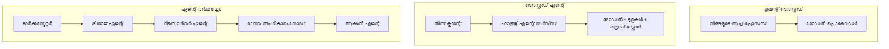
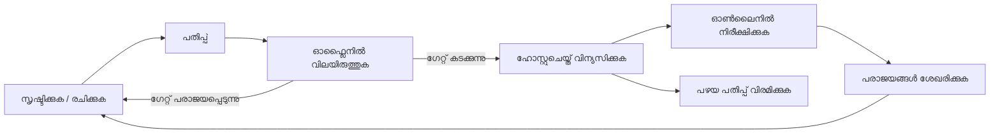
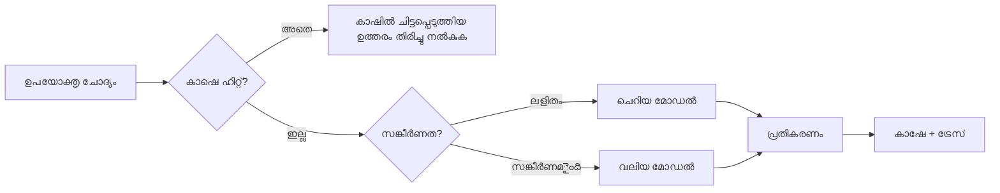
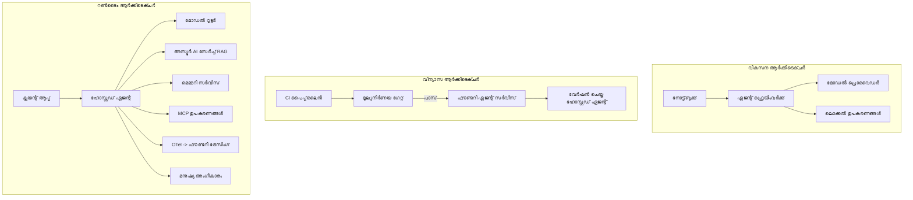

# മൈക്രോസോഫ്റ്റ് ഫൗൺഡറിയുമായി സ്കേലബിൾ ഏജന്റുകൾ വിന്യസിക്കൽ


അടിയന്തരമായി, കോഴ്സിന്റെ ഇതുവരെയുള്ള ഭാഗങ്ങളിൽ നിങ്ങൾ ലൈപ്‌ടോപ്പിലും, നോക്ക്ബുക്കിനുള്ളിൽ നിന്നും, `az login` എന്നതും ചില എൻവയോൺമെന്റ് വേരിയബിൾസും ഉപയോഗിച്ച് ഓടുന്ന ഏജന്റുകൾ നിർമ്മിച്ചിട്ടുണ്ട്. ഇവ പഠിക്കാൻ ശരിയായ മാർഗമാണ്. ആൺ ആക്രമണകാലത്ത് ആയിരക്കണക്കിന് ഉപഭോക്താക്കൾ ആശ്രയിക്കുന്ന ഏജന്റിനെ ഓടിക്കുന്നത് ഇതല്ല ശരിയായ മാർഗം.

"എന്റെ മെഷീൻ ആശ്രയിച്ചാൽ പ്രവർത്തിക്കുന്നു" എന്നതും "ഉത്പാദനത്തിൽ വിശ്വസനീയമായി, ചെലവു കുറഞ്ഞതായും പ്രവർത്തിക്കുന്നു" എന്നതുമായിടയിലുള്ള വ്യത്യാസത്തെക്കുറിച്ചാണ് ഈ പಾಠം. ഇത് **Microsoft Foundry**-ഉം **Microsoft Foundry Agent Service**-ഉം ഉപയോഗിച്ച് അനുഭവവേദിയാക്കുന്നു, ഉപകരണങ്ങൾ, തിരികെപിടിക്കൽ, ഓർമ്മ, മൂല്യനിർണ്ണയം, നിരീക്ഷണം എന്നിവ ഉള്ള യഥാർത്ഥ ഉപഭോക്തൃ സഹായ ഏജენტი നിർമ്മിക്കാനാണ് നമ്മൾ ശ്രമിക്കുന്നത്.

## പരിചയം

ഈ പാഠം ഉൾപ്പെടുന്നതും:

- ഒരു **പ്രോട്ടോടൈപ്പ് ഏജന്റ്** ഒപ്പം ഒരു **വിന്യസിച്ച ഏജന്റ്** തമ്മിലുള്ള വ്യത്യാസം, കൂടാതെ അത് മോദലിന്റെ ചുറ്റുമുള്ള കാര്യങ്ങളിൽ കൂടുതലാണ് എന്നും.
- ഏജന്റുകളുടേയും **വിന്യാസ മാതൃകകൾ**: ക്ലയന്റ്-ഹോസ്റ്റുചെയ്‌തത്, സർവീസ്-ഹോസ്റ്റുചെയ്‌തത് (ഹോസ്റ്റുചെയ്ത ഏജന്റുകൾ), വർക്ക്‌ഫ്ലോ-ഓർകസ്ട്രേറ്റഡ്.
- **മൈക്രോസോഫ്റ്റ് ഫൗൺഡറിയിൽ ഏജന്റ് ജീവിതചക്രം** — സൃഷ്ടിക്കുക, വേർഷൻ ചെയ്യുക, വിന്യസിക്കുക, മൂല്യനിർണ്ണയം ചെയ്യുക, നിരീക്ഷിക്കുക, വിരമിക്കുക.
- **സ്കെയ്ലിങ് തന്ത്രങ്ങൾ**: മോഡൽ റൂട്ടിംഗ്, കാഷിംഗ്, സമകാലികം, സ്റ്റേറ്റ്‌ലസ് ഡിസൈൻ.
- OpenTelemetryഉം ഫൗൺഡറി ട്രേസിംഗും ഉൾപ്പെടുന്ന **നിരീക്ഷണ ശേഷി**.
- മോഡൽ തിരഞ്ഞെടുപ്പ്, റൂട്ടിംഗ്, മൂല്യനിർണ്ണയ ഗേറ്റുകൾ എന്നിവ വഴി **ചിലവു കുറയ്ക്കൽ**.
- **എന്റർപ്രൈസ് പരിഗണനകൾ**: ഗവർണൻസ്, മനുഷ്യ അംഗീകാരം, ഉത്പാദനത്തിൽ MCP സേർവറുകൾ സുരക്ഷിതമായി ഓടിക്കൽ.

## പഠന ലക്ഷ്യങ്ങൾ

ഈ പാഠം പൂർത്തിയാക്കിയ ശേഷം നിങ്ങൾക്ക് അറിയാം:

- ഒരു ഏജന്റ് പ്രവർത്തനഭാരത്തിനായുള്ള ശരിയായ വിന്യാസ മാതൃക തിരഞ്ഞെടുക്കുക.
- മൈക്രോസോഫ്റ്റ് ഫൗൺഡറി ഏജന്റ് സർവീസിൽ ഒരു ഏജന്റ് വിന്യസിക്കുക, അത് വേർഷനുചെയ്തതും, ഗവർണൻസുള്ളതും, നിരീക്ഷണശേഷിയുള്ളതുമാകാൻ.
- ട്രേസിംഗിനും, പുറപ്പെടുവിച്ചതിന് മുമ്പെ ഓടുന്ന മൂല്യനിർണ്ണയ പൈപ്പ്‌ലൈൻ വേണ്ടി ഏജന്റിനെ ഇൻസ്ട്രുമെൻറ് ചെയ്യുക.
- മൊഡൽ റൂട്ടിംഗും കാഷിംഗും പ്രയോഗിച്ച് സ്കെയ്ലിൽ ദൈർഘ്യവും ചിലവും നിയന്ത്രിക്കുക.
- ഉയർന്ന അപകടമുള്ള പ്രവർത്തനങ്ങൾക്ക് മനുഷ്യ അംഗീകാരം ചേർക്കുക, MCP സേർവറെ ഉത്പാദന-സുരക്ഷിതമായി സംയോജിപ്പിക്കുക.

## മുൻപരിഗണനകൾ

മുൻപുള്ള പാഠങ്ങൾ നിങ്ങൾ പൂർത്തിയാക്കിയിട്ടുണ്ട്, അതിനോടൊപ്പം നിങ്ങൾക്ക് സുഖകരമാണ്:

- [Microsoft Agent Framework](../14-microsoft-agent-framework/README.md) ഉപയോഗിച്ച് ഏജന്റുകൾ നിർമ്മിക്കുന്നത് (പാഠം 14).
- [ടൂൾ ഉപയോഗം](../04-tool-use/README.md) (പാഠം 4) ഉം [Agentic RAG](../05-agentic-rag/README.md) (പാഠം 5) ഉം.
- [Agent Memory](../13-agent-memory/README.md) (പാഠം 13) ഉം [Agentic Protocols / MCP](../11-agentic-protocols/README.md) (പാഠം 11) ഉം.
- [നിരീക്ഷണവും മൂല്യനിർണ്ണയവും](../10-ai-agents-production/README.md) (പാഠം 10) — ഈ പാഠം അതിന്റെ മുകളിലാണ്.

നിങ്ങള്‍ക്ക് താഴെപ്പറയുന്നവയും വേണം:

- ഒരു **Azure സബ്സ്ക്രിപ്ഷൻ** ഉം കുറഞ്ഞത് ഒരു വിന്യസിച്ച ചാറ്റ് മോഡൽ ഉള്ള **Microsoft Foundry പ്രോജക്റ്റ്** ഉം.
- അംഗീകൃത **Azure CLI** (`az login`).
- Python 3.12+ ഉം റിപോസിറ്ററിയിലെ പൊതു പാക്കേജുകൾ [`requirements.txt`](../../../requirements.txt).

## പ്രോട്ടോടൈപ്പിൽ നിന്ന് ഉത്പാദനത്തിലേക്ക്: യഥാർത്ഥ മാറ്റങ്ങൾ എന്തെല്ലാം

ഒരു പ്രോട്ടോടൈപ്പ് ഏജന്റും ഉത്പാദന ഏജന്റും ഒരേ കോർ ലൂപ്പ് പങ്കിടുന്നു—കാരണം കണ്ടെത്തൽ, ടൂൾസ് വിളിക്കൽ, പ്രതികരണം. മാറ്റം വരുന്നത് ആ ലൂപ്പിന്റെ ചുറ്റുമുള്ള എല്ലാ കാര്യങ്ങളിലും ആണ്. ഒരു മോഡൽ ഉത്പാദന ഏജന്റിന്റെ ഏകദേശം 20% ആണെന്ന് കരുതുക; ബാക്കി 80% ഓപ്പറേഷണൽ സ്കെലിറ്റൺ (സഞ്ചാര ഘടന).

| വിഷയം | പ്രോട്ടോടൈപ്പ് | ഉത്പാദനം |
| --- | --- | --- |
| **ഹോസ്റ്റിംഗ്** | നിങ്ങളുടെ നോക്ക്ബുക്കിൽ ഓടുന്നു | ഹോസ്റ്റുചെയ്ത സർവീസായി ഓടുന്നു, വേർഷൻ ചെയ്തും റോളൗട്ടും ചെയ്യപ്പെടുന്നു |
| **ഐഡൻറിറ്റി** | നിങ്ങളുടെ `az login` ടോക്കൺ | സ്കോപ്പ്ഡ് RBAC ഉള്ള മാനേജുചെയ്ത ഐഡൻറിറ്റി |
| **സ്റ്റേറ്റ്** | മെമ്മറിയിൽ, പുനരാരംഭിക്കുമ്പോൾ നഷ്ടപ്പെടുന്നു | ബാഹ്യമായി ഹാൻഡിൽ ചെയ്യുന്നു (ത്രീഡ് സ്റ്റോർ, മെമ്മറി സർവീസ്) |
| **ഫെയില്യർ** | ട്രെയ്‌സ്‌ബാക്ക് കാണുന്നു | റീട്രൈകൾ, ഫാൾബാക്കുകൾ, ഡെഡ്-ലറ്റർ, അലർട്ടുകൾ |
| **ചിലവ്** | "റോ few സെന്റുകൾ മാത്രം" | ഓരോ അഭ്യർത്ഥനയ്ക്കും ട്രാക്കുചെയ്യുന്നു, റൂട്ട് ചെയ്യുന്നു, കാഷ് ചെയ്യുന്നു, ബജറ്റ് ചെയ്യുന്നു |
| **ഗുണമേന്മ** | നിങ്ങൾ നേർക്കാഴിക്കുന്നു | ഓരോ റിലീസിന് മുമ്പും സ്വയം മൂല്യനിർണ്ണയം ചെയ്യുന്നു |
| **വിശ്വാസം** | നിങ്ങൾ എല്ലാ പ്രവർത്തനവും അംഗീകരിക്കുന്നു | പോളിസിയും മനുഷ്യ-ഇൻ-ദ-ലൂപ്പും ഉണ്ട് അപകടകരമായ പ്രവർത്തനങ്ങൾക്ക് |

ഈ പട്ടിക മനസിലാക്കി വെക്കുക. താഴെ വരുന്ന ഓരോ വിഭാഗവും ഇവയിൽ ഒന്നിനോടോ അതിനോട് സമാനമായ ഒന്നിനോടോ അനുബന്ധമാണ്.

## ഏജന്റ് വിന്യാസ മാതൃകകൾ

നിങ്ങൾ ഉപയോഗിക്കാൻ പോകുന്ന മൂന്ന് മാതൃകകളാണ് പ്രധാനമായും.

### 1. ക്ലയന്റ്-ഹോസ്റ്റുചെയ്‌ത ഏജന്റുകൾ

ഏജന്റ് ഒബ്ജക്റ്റ് നിങ്ങളുടെ ആപ്ലിക്കേഷൻ പ്രോസസ്സിനുള്ളിൽ ജീവിക്കുന്നു. നിങ്ങളുടെ കോഡ് നേരിട്ട് മോഡൽ പ്രൊവൈഡറെ വിളിക്കുന്നു; രീസണിംഗ് ലൂപ്പ് നിങ്ങളുടെ സർവീസിനുള്ളിൽ ഓടുന്നു. ഇതിനകം പൃഥ്വി പൂര്‍വ്വ പാഠങ്ങൾ നടത്തിയതാണ്.

- **ഉപയോഗിക്കുക എപ്പോൾ** നിങ്ങൾക്ക് ലൂപ്പിന്മേൽ പൂർണ്ണ നിയന്ത്രണം വേണം, കസ്റ്റം മിഡിൽവെയർ വേണം, അല്ലെങ്കിൽ നിലവിലുള്ള ബാക്ക്‌എണ്ടിനുള്ളിൽ ഏജന്റിനെ ഉൾപ്പെടുത്തുന്നു.
- **വ്യാപാരം**: സ്കെയ്ലിങ്ങ്, സ്റ്റേറ്റ്, ലെടീസ് എന്നിവ നിങ്ങൾ തന്നെ കൈകാര്യം ചെയ്യണം.

### 2. ഹോസ്റ്റുചെയ്‌ത ഏജന്റുകൾ (Foundry Agent Service)

ഏജന്റ് *Microsoft Foundry-യിൽ ഒരു റിസോഴ്‌സായി രജിസ്റ്റര്* ചെയ്യും. ഫൗൺഡറി രീസണിംഗ് ലൂപ്പ് ഹോസ്റ്റ് ചെയ്യുകയും, ത്രീഡുകൾ സൂക്ഷിക്കുകയും, ഉള്ളടക്ക സുരക്ഷയും RBAC ഉറപ്പാക്കുകയും, ഫൗൺഡറി പോർട്ടലിൽ ഏജന്റ് ദൃശ്യമായി കാണിക്കുകയും ചെയ്യും. നിങ്ങളുടെ ആപ്പ് ഒരു തിന് ക്ലയന്റ് ആയി മാറുകയും ത്രീഡുകൾ സൃഷ്ടിക്കുകയും പ്രതികരണങ്ങൾ വായിക്കുകയും ചെയ്യും.

- **ഉപയോഗിക്കുക എപ്പോൾ** സ്ഥിരത, ബിൽഡ്-ഇൻ നിരീക്ഷണശേഷി, ഗവർണൻസ്, കുറവ് ഓപ്പറേഷൻ മേഖല എന്നിവ നിങ്ങൾക്കാവശ്യമുള്ളപ്പോൾ.
- **വ്യാപാരം**: മാനേജുചെയ്‌ത റൺടൈം സേവനം ഒരുക്കിയതിനാൽ താഴ്ന്ന തലത്തിലുളള നിയന്ത്രണം കുറയുന്നു.

### 3. ഏജന്റ് വർക്ക്‌ഫ്ലോകൾ

നിരവധി ഏജന്റുകൾ (മറ്റും ടൂളുകളും) നിയന്ത്രണ പ്രവാഹം വ്യക്തമാക്കുന്ന ഗ്രാഫിൽ ചേർക്കുന്നു — പരമ്പരാഗത ഘട്ടങ്ങൾ, ശാഖീകരണം, മനുഷ്യ അംഗീകാരം നോട്ടുകൾ, പാസും റിസ്യൂം ചെയ്യാവുന്ന ദൃഢമായ ചെക്ക്‌പോയിന്റുകൾ. ഇതാണ് Microsoft Agent Framework **വർക്ക്‌ഫ്ലോകൾ** കഴിവ് വിന്യാസ സ്കെയ്ലിൽ പ്രയോഗിക്കുന്നത്.

- **ഉപയോഗിക്കുക എപ്പോൾ** ഒരു ഒറ്റ ജോലിയിലായി പല പ്രത്യേക ഏജന്റുകളും വേണ്ടുകയും ഇടയിൽ അംഗീകാര ഘട്ടം ആവശ്യമായിരിക്കുകയും ചെയ്യുമ്പോൾ.
- **വ്യാപാരം**: കൂടുതൽ സങ്കീർണ്ണഘടകങ്ങൾ; ഓർക്കസ്ട്രേഷൻ തല നിരീക്ഷണശേഷി ആവശ്യമാണ്.



## മൈക്രോസോഫ്റ്റ് ഫൗൺഡറിയിലെ ഏജന്റ് ജീവിതചക്രം

ഒരു ഏജന്റ് വിന്യസിക്കൽ ഒറ്റത്തവണ `push` അല്ല. ഇത് ഒരു ലൂപ്പാണ്; സോഫ്റ്റ്വെയർ റിലീസ് ചക്രത്തിനുപോലെ തന്നെ കാണപ്പെടുന്നു.



പ്രധാന ആശയം, [പാഠം 10](../10-ai-agents-production/README.md) നിന്നാണ് എടുത്തത്: **ഓഫ്ലൈൻ മൂല്യനിർണ്ണയം ഒരു ഗേറ്റ് ആണ്, ഒരു അപൂർവചിന്ത അല്ല.** പുതിയ ഏജന്റ് വേർഷൻ നിങ്ങളുടെ മൂല്യനിർണ്ണയ കളമ്പുകൾ കടത്തിക്കാത്തപക്ഷം പുറത്തിറങ്ങാൻ പോവുകയില്ല. ഓൺലൈൻ നിരീക്ഷണം യാഥാർത്ഥ ലോകത്തിലെ പരാജയങ്ങളെ നിങ്ങളുടെ ഓഫ്ലൈൻ ടെസ്റ്റ് സെറ്റിലേക്ക് ഫീഡ് ചെയ്യുന്നു. ഇതാണ് മുഴുവൻ ലൂപ്പ്.

## സ്കെയ്ലിങ് തന്ത്രങ്ങൾ

ഏജന്റ് സ്കെയിൽ ചെയ്യുന്നത് സ്റ്റേറ്റ്‌ലസ് വെബ് API സ്കെയിലിങ്ങിൽ നിന്ന് വ്യത്യസ്തമാണ്, കാരണം ഓരോ അഭ്യർത്ഥനയും നാനാർത്ഥകമായ മോഡൽ-ടൂൾ വിളികൾ ഉണ്ടാക്കാം. പ്രധാനമായും നാല് സാങ്കേതിക വിദ്യകൾ മുഖ്യഭാരമേற்கുന്നു.

**സ്റ്റേറ്റ് ഇല്ലാത്ത അഭ്യർത്ഥന കൈകാര്യം.** നിങ്ങളുടെ പ്രോസസ്സ് മെമ്മറിയിൽ ഓരോ ഉപയോക്താവിനും സ്റ്റേറ്റ് സൂക്ഷിക്കരുത്. സംഭാഷണ ത്രീഡുകൾ ഫൗൺഡറി ത്രീഡ് സ്റ്റോർ അല്ലെങ്കിൽ മെമ്മറി സർവീസ് ഉപയോഗിച്ച് പാഴ്‌സിസ്റ്റ് ചെയ്യുക, അങ്ങിങ്ങനെ ഏതൊരു ഇൻസ്റൻസും ഏതു അഭ്യർത്ഥനയും കൈകാര്യം ചെയ്യാം. ഇത് നിങ്ങൾക്ക് പക്കൽനിരായി സ്കെയിൽ ചെയ്യാൻ സഹായിക്കുന്നു — ഇൻസ്റൻസുകൾ കൂട്ടിച്ചേർക്കാം, സ്റ്റിക്കി സെഷനുകൾ ഇല്ല.

**മോഡൽ റൂട്ടിംഗ്.** എല്ലാം അഭ്യർത്ഥനകളും നിങ്ങളുടെ ഏറ്റവും ശേഷിയുള്ള (അതും ചെലവുയർന്ന) മോഡലിൽ പോകേണ്ടതില്ല. ലഘുവായ അഭ്യർത്ഥനകൾ — ഉദ്ദേശ്യവർഗ്ഗീകരണം, ചുരുങ്ങിയ സത്യസന്ധ ഉത്തരങ്ങൾ — ചെറിയ വേഗത്തിൽ പ്രവർത്തിക്കുന്ന ഒരു മോഡലിലേക്ക് റൂട്ടുചെയ്യുക; വളരെയധികം കണക്കുകൂട്ടലുകൾക്ക് വലിയ മോഡൽ നിലനിർത്തുക. ഫൗൺഡറിയുടെ **Model Router** ഇത് ചെയ്യാം, അല്ലെങ്കില് നിങ്ങൾക്ക് ചെറുതായി ക്ലാസിഫയർ നിർമ്മിക്കാം. ലാബ് ചെയ്യുമ്പോൾ ഇത് നിങ്ങൾ തന്നെ നിർമ്മിക്കും.

**പ്രതികരണ കാഷിംഗ്.** പല സഹായ ചോദ്യങ്ങളും സാമാന്യ സാമ്യപൂർണ്ണ ("എങ്ങനെ ഞാൻ പാസ്സ്‌വേഡ് റീസെറ്റ് ചെയ്യാം?"). പൊതുവായ ചോദ്യങ്ങൾക്ക് ഉത്തരങ്ങൾ കാഷ് ചെയ്ത്, മോഡലിനെ പ്രയോഗിക്കാതെ തന്നെ ലഭ്യമാക്കാം. ചെറിയ തോതിലുള്ള കാഷ് ഹിറ്റ് നിരക്കും ചെലവിലും വൈകിയും കുറയ്ക്കുന്നു.

**സമകാലികതയും പശ്ചാത്തല സമ്മർദ്ദവും.** മോഡൽ പ്രൊവൈഡർമാർക്ക് നിരക്ക് പരിമിതികൾ ഉണ്ട്. നിങ്ങളുടെ സമകാലികത പരിധി നിശ്ചയിക്കുക, എക്സ്‌പോനൻഷ്യൽ ബാക്കോഫ് ഉള്ള റീട്രൈകൾ ഉപയോഗിക്കുക, ദയനീയമായി പരാജയം വരുത്തുക (ക്യുബിലെ "നാം അതിൽ പ്രവർത്തിക്കുന്നു" പ്രതികരണം 500 ഉത്തരം നൽകുന്നത് നല്ലതായിരിക്കും).



## ഉത്പാദനത്തിൽ നിരീക്ഷണ ശേഷി

നിങ്ങൾ കാണാത്തത് പ്രവർത്തിപ്പിക്കാൻ കഴിയില്ല. പാഠം 10-ൽ ഉൾപ്പെടുത്തിയതുപോലെ, Microsoft Agent Framework സ്വാഭാവികമായി **OpenTelemetry** ട്രേസുകൾ സൃഷ്ടിക്കുന്നു — ഓരോ മോഡൽ വിളിയും, ടൂൾ ഇൻവൊക്കേഷനും, ഓർക്കസ്ട്രേഷൻ ഘട്ടവും ഒരു സ്പാൻ ആകുന്നു. ഉത്പാദനത്തിൽ ഈ സ്പാനുകൾ Microsoft Foundry-ൽ (അല്ലെങ്കിൽ ഏതെങ്കിലും OTel-സമർത്ഥിത ബേക്ക്എൻഡിൽ) ഇറക്കുമതി ചെയ്യാം, അതിലൂടെ നിങ്ങൾക്ക്:

- ഒരേ ഉപഭോക്തൃ പരാതി അവസാനമായി വരെ എല്ലാ മോഡലിലും ടൂളിലും ട്രെയ്സ് ചെയ്യുക.
- പ50/പ95 വീഴ്ചയും നടപടിയുടെ ചിലവും സമയാനുസൃതമായി നിരീക്ഷിക്കുക.
- ഉപയോക്താക്കളോ ധനസമൂഹമോ ശ്രദ്ധിക്കുന്നത് മുന്നേ നെError റേറ്റിന്റെയും ചിലവിന്റെ അപസംഖ്യകളിൽ അലർട്ട് സൂക്ഷിക്കുക.

```python
from agent_framework.observability import get_tracer

tracer = get_tracer()

with tracer.start_as_current_span("support_request") as span:
    span.set_attribute("customer.tier", "enterprise")
    span.set_attribute("routed.model", "gpt-5-nano")
    # ഏജന്റ് നിർവഹണം സ്വയം ഈ സ്‌പാനിനുള്ളിൽ ട്രേസ് ചെയ്യപ്പെടുന്നു
```

`customer.tier` ഉം `routed.model` ഉം പോലുള്ള അമേരിക്കകൾ ട്രേസുകളുടെ മതിൽ മറികടന്ന് ഉത്തരം കിട്ടാനുള്ള ചോദ്യങ്ങളാക്കുന്നു ("ഏറ്റവും ചെറിയ മോഡലിലേക്ക് എന്റർപ്രൈസ് ഉപഭോക്താക്കൾ കൂടിയായുള്ള റൂട്ടിംഗ് തവണകൾ കൂടുതലോ?").

## ചിലവ് കുറച്ചൽ

ഉത്പാദന ഏജന്റുകളുടെ ചിലവ് ടോക്കണുകൾ നിയന്ത്രിക്കുന്നു. മുന്നിൽ മൂന്നു കൈമാറ്റങ്ങൾ:

1. **മോഡലിന്റെ ശരിയായ വലിപ്പം.** നിങ്ങളുടെ മൂല്യനിർണ്ണയ ഗേറ്റ് കടന്നുകൊണ്ടിരിക്കുന്ന ചെറിയ മോഡൽ, കള്ളത്തിൽ വലിയ മോഡലാണ് എല്ലായ്‌പ്പോഴും ചിലവ് കുറവുള്ളത്. വലിയ മോഡലിലേക്കു എക്കാലത്തും മുന്നോട്ട് പോകുന്നതിന് പകരം ചെറിയ മോഡൽ മതിയായതാണെന്ന് മൂല്യനിർണ്ണയത്തിലൂടെ തെളിയിക്കുക.
2. **സങ്കീർണ്ണത പ്രകാരം റൂട്ടിംഗ്.** മുൻപുള്ളതു പോലെ — മാത്രം വലിയ മോഡൽ കണക്കാക്കേണ്ട അഭ്യർത്ഥനകൾക്ക് മാത്രം വലിയ മോഡലിന്റെ ചിലവ് നൽകുക.
3. **കടുത്ത കാഷിംഗ്.** നിങ്ങൾ ഒരിക്കലും നടത്താതെ പോവുന്ന മോഡൽ വിളിയാണ് ഏറ്റവും ചിലവ് ലാഭകരമായത്.

മൂല്യനിർണ്ണയ ഗേറ്റുകളും ചിലവ് നിയന്ത്രണവും രണ്ട് ദിശകളിൽ നിന്നുള്ള ഏകയൂജിതമായ ശാസ്ത്രവും കൂടിയാണ്: മൂല്യനിർണ്ണയം നിങ്ങൾക്ക് *ഗുണനിലവാര പാത* കാണിക്കുന്നു, റൂട്ടിംഗ് ഉം കാഷിംഗ് ഉം ആ പാതയുടെ *ചിലവ്* കുറവാക്കുന്നു.

## എന്റർപ്രൈസ് വിന്യാസ പരിഗണനകൾ

**ഗവർണൻസ്.** ഹോസ്റ്റുചെയ്‌ത ഏജന്റുകൾ ഫൗൺഡറിയുടെ RBAC, ഉള്ളടക്ക സുരക്ഷ, ഓഡിറ്റ് ലോഗിംഗ് എന്നിവ ഏറ്റെടുക്കുന്നു. ഓരോ ഏജന്റിനും ഏറ്റവും കുറഞ്ഞ അധികാരമുള്ള മാനേജുചെയ്‌ത ഐഡൻറിറ്റി നൽകുക—കോണ അറിവിന്റെ വായനയ്ക്കുള്ള ആക്‌സസ്, ടിക്കറ്റ് API-യുടെ സ്കോപ്പ്ഡ് ആക്‌സസ്സ്, മറ്റ് ഒന്നും തന്നെ വേണ്ട.

**മനുഷ്യൻ-ഇൻ-ദ-ലൂപ്പ്.** ചില പ്രവർത്തനങ്ങൾ സ്വന്തം സ്വവ്യാപാര നടപടികളാൽ ആക്കാൻ കഴിയുന്നില്ല — പണം തിരികെ നൽകൽ, അക്കൗണ്ട് ഇല്ലാതാക്കൽ, നിയമസംഘത്തോട് escalatiion. Microsoft Agent Framework **approval-required** ടൂളുകൾ പിന്തുണയ്ക്കുന്നു: ഏജന്റ് പ്രവർത്തനം നിർദേശിക്കുന്നു, നിർവഹണം നിർത്തുന്നു, മനുഷ്യൻ അംഗീകരിക്കുകയും നിരസിക്കുകയും ചെയ്യുന്നു, ഉൾപ്പെടുത്തൽ വീണ്ടും ആരംഭിക്കുന്നു. നിങ്ങൾ [പാഠം 6](../06-building-trustworthy-agents/README.md) ൽ ഇത് കണ്ടു; ഇവിടെ തീർച്ചയായും വിന്യസിക്കുന്നു.

**ഉത്പാദനത്തിൽ MCP.** [MCP](../11-agentic-protocols/README.md) നിങ്ങളുടെ ഏജന്റ് ഒരു സ്റ്റാൻഡേർഡ് ഇന്റർഫേസ് വഴി പുറം ടൂളുകൾ ഉപയോഗിക്കാൻ അനുവദിക്കുന്നു. ഉത്പാദനത്തിൽ എല്ലാ MCP സേർവറുകളെയും വിശ്വസനീയമല്ലാത്ത പരിധികളായി കാണുക: സേർവർ വേർഷൻ പിന്യിട്ടുക, സ്കോപ്പ്ഡ് ഐഡന്റിറ്റിയോടുകൂടെ ഓടിക്കുക, ഔട്ട്പുട്ടുകൾ സ്ഥിരീകരിക്കുക, രഹസ്യങ്ങൾ ചിത്രീകരിക്കരുത്. MCP സേർവർ ഒരു ആശ്രിതമാണ്, ആശ്രിതങ്ങൾക്ക് പാച്ച്, ഓഡിറ്റ്, നിരക്ക് നിയന്ത്രണം ഉണ്ടായിരിക്കും.



ആ മൂന്ന് രൂപരേഖകൾ — വികസനം, വിന്യാസം, റൺടൈം — ഒരേ ഏജന്റിനെയാണ് അതിന്റെ ജീവിതത്തിന്റെ മൂന്ന് ഘട്ടങ്ങളിൽ കാണിക്കുന്നത്. തുടർന്ന് വരുന്ന ലാബ് ഇത് നിർമ്മിക്കാൻ വഴി കാണിക്കും.

## ഹാൻഡ്‌സ്-ഓൺ ലാബ്: ഉത്പാദന-സജ്ജമായ ഒരു ഉപഭോക്തൃ സഹായ ഏജന്റ്

തുറക്കുക [`code_samples/16-python-agent-framework.ipynb`](./code_samples/16-python-agent-framework.ipynb) തുടങ്ങിയുള്ളത് മുഴുവൻ പ്രവർത്തിപ്പിക്കുക. നിങ്ങൾ ഒരു **Contoso ഉപഭോക്തൃ സഹായ ഏജന്റ്** അണിയിച്ചൊരുക്കും, ഓരോ ഉത്പാദന പ്രശ്നവും പരിഗണിച്ചുകൊണ്ട്:

1. **ഉപകരണം വിളിക്കൽ** — ഓർഡർ നില പരിശോധിക്കുകയും സഹായ ടിക്കറ്റുകൾ തുറക്കുകയും ചെയ്യുക.
2. **RAG** — അറിവ് അടിസ്ഥാനമായ നയ ചോദ്യങ്ങൾക്കു ഉത്തരമാക്കുക (Azure AI Search ഉപയോഗിച്ച്, ഒരു ഇൻ-മെമ്മറി ഫാൾബാക്ക് ഉപയോഗിച്ച് നോക്ക്ബുക്ക് സേർച്ച_RESOURCE ഇല്ലാതെ പ്രവർത്തിക്കാൻ).
3. **ഓർമ്മ** — സംഭാഷണത്തിന്റെ യാതൊരു ഘട്ടത്തിലും ഉപഭോക്താവിനെ ഓർക്കുക.
4. **മോഡൽ റൂട്ടിംഗ്** — ഒരു സങ്കീർണ്ണതാ ക്ലാസിഫയർ ഓരോ അഭ്യർത്ഥനയും ചെറിയതോ വലിയതോ മോഡലിലേക്കോ റൂട്ടുചെയ്യുന്നു.
5. **പ്രതികരണ കാഷിംഗ്** — ആവർത്തിച്ച ചോദികൾ കാഷിൽ നിന്ന് നൽകുന്നു.
6. **മനുഷ്യ അംഗീകാരം** — ഒരു പരിധിയിലധികം ഫണ്ട് തിരിച്ചടവുകൾ മനുഷ്യ അംഗീകാരത്തിനായി താൽക്കാലികമായി നിർത്തുന്നു.
7. **മൂല്യനിർണ്ണയ പൈപ്പ്‌ലൈൻ** — ചെറിയ ഒരു ഓഫ്ലൈൻ ടെസ്റ്റ് സെറ്റു ഏജന്റിനെ സ്കോർ ചെയ്യുന്നു, റിലീസ് ഗേറ്റ് ആയി പ്രവർത്തിക്കുന്നു.
8. **നിരീക്ഷണ ശേഷി** — ഓരോ അഭ്യർത്ഥനയ്ക്കും ചുറ്റും OpenTelemetry ട്രേസിംഗ്.

### വഴി ചുറ്റുന്നു

നോക്ക്ബുക്ക് ഓരോ ഉത്പാദന പ്രശ്നവും സ്വയം സാമർത്ഥ്യമുള്ള, ഓടാനാവുന്ന വിഭാഗങ്ങളായി ക്രമീകരിച്ചു. ഇതിന്റെ ഹൃദയം റൂട്ടിംഗ്-പ്ലസ്-കാഷിംഗ് അഭ്യർത്ഥന കൈകാര്യംചെയ്യുന്ന ഹാൻഡ്ലറാണ്:

```python
async def handle_support_request(query: str, customer_id: str) -> str:
    # 1. കഴിവുള്ളപ്പോൾ കാഷെയിൽ നിന്ന് സേവനം നൽകുക.
    cached = response_cache.get(normalize(query))
    if cached:
        return cached

    # 2. ചെലവ് നിയന്ത്രിക്കാൻ സങ്കീർണ്ണത പ്രകാരം മാർഗ്ഗനിർദ്ദേശം നൽകുക.
    model = "gpt-5-nano" if is_simple(query) else "gpt-5-mini"

    # 3. കാണാൻ കഴിയുന്ന വിധം ട്രേസ് സ്പാനിനുള്ളിൽ ഏജന്റ് ഓടിക്കുക.
    with tracer.start_as_current_span("support_request") as span:
        span.set_attribute("routed.model", model)
        span.set_attribute("customer.id", customer_id)
        response = await support_agent.run(query, model=model)

    # 4. കാഷെ ചെയ്യുകയും തിരിച്ചയയ്ക്കുകയും ചെയ്യുക.
    response_cache.set(normalize(query), response.text)
    return response.text
```

റിലീസ് സംരക്ഷിക്കുന്ന മൂല്യനിർണ്ണയ ഗേറ്റ് ഇങ്ങനെ കാണപ്പെടുന്നു:

```python
async def evaluation_gate(agent, test_cases, threshold: float = 0.8) -> bool:
    passed = 0
    for case in test_cases:
        result = await agent.run(case["input"])
        if score_response(result.text, case["expected"]) >= 0.8:
            passed += 1
    pass_rate = passed / len(test_cases)
    print(f"Evaluation pass rate: {pass_rate:.0%} (gate: {threshold:.0%})")
    return pass_rate >= threshold  # ഗേറ്റ് തെറ്റ് ചെയ്യാതിരുന്നാൽ മാത്രം വിന്യസിക്കുക
```

ഓരോ വരിയും വായിക്കുക — നോക്ക്ബുക്ക് പ്രിചേസുകൾ ചെറിയവയുടെ ഗോപുരം സൂക്ഷിച്ചുകൊണ്ട്, ഫ്രെയിമ്വർക്കിന്റെ അടയാളത്തിന് പിറകിൽ ഒന്നും മറയ്ക്കുന്നില്ല.

## വിന്യസിച്ച ഏജന്റിനെ പുക പരിശോധനകളോടെ പരിശോധിക്കൽ

മുകളിലുള്ള മൂല്യനിർണ്ണയ ഗേറ്റ് നിങ്ങളുടെ ഏജന്റ് ഒബ്ജക്റ്റിന്റെ മേൽ *ഓഫ്ലൈൻ* ഓടുന്നു. ഹോസ്റ്റുചെയ്ത ഏജന്റ് ആയി വിന്യസിച്ചതിനുശേഷം നിങ്ങള്ക്ക് മറ്റൊരു ചെലവ് കുറഞ്ഞ പരിശോധന വേണം: **വിന്യാസം ചെയ്ത എൻഡ്‌പോയിന്റ് യഥാർത്ഥത്തിൽ മറുപടി നൽകുന്നുണ്ടോ?**

"വിജയകരമായി" വിന്യസിക്കൽ മാത്രം നിർവാഹ മാനദണ്ഡം അംഗീകരിച്ചതായി തെളിയിക്കുന്നു — ഏജന്റ് മറുപടി നൽകുമോ എന്നതല്ല. നഷ്ടപ്പെട്ട ആശ്രിതം, മോഡൽ റൂട്ടിംഗ് തെറ്റായത്, എക്സ്പയർ ചെയ്ത കണക്ഷൻ ഇവ മുഴുവൻ ഒന്നും കാണിക്കുന്നില്ലാത്ത വിതരണങ്ങൾ സൃഷ്ടിക്കാം. **പുക പരിശോധന** ഇതിനായി സെക്കൻഡുകൾക്കകം ഓരോ വിന്യാസത്തിലും പ്രവർത്തിക്കുന്നു, പൂർണ്ണ മൂല്യനിർണ്ണയ ചിലവുണർത്താതെ.

ഈ റിപോസിറ്ററി ഉപയോഗത്തിനർഹമായ ഒരു പുക-ചെക്കിങ് പൈപ്പ്‌ലൈനും കൊണ്ടുവരുന്നു, [AI Smoke Test](https://github.com/marketplace/actions/ai-smoke-test) GitHub പ്രവർത്തനം അടിസ്ഥാനമാക്കി:

- **കാറ്റലോഗ്** — [`tests/lesson-16-smoke-tests.json`](../../../tests/lesson-16-smoke-tests.json) Contoso സഹായ ഏജന്റിന് പ്രോമ്പ്റ്റുകളും സ്ഥിരീകരണങ്ങളുമാണ് ഉൾക്കൊള്ളുന്നത് (ഇടത് നയം ഉത്തരങ്ങൾ, ഓർഡർ പരിശോധിക്കൽ, വിഷയത്തിൽ തുടരൽ, മൾട്ടി-ടേൺ സംഭാഷണ തുടർച്ച). മറ്റ് പാഠങ്ങളുടെ ഏജന്റുകൾക്കുള്ള കാറ്റലോഗുകളും ഇത് കൂടെയുണ്ട് — കാണുക [`tests/README.md`](../tests/README.md).
- **വർക്‌ഫ്ലോ** — [`.github/workflows/smoke-test.yml`](../../../.github/workflows/smoke-test.yml) Azure OIDC ഉപയോഗിച്ച് ലോഗിൻ ചെയ്യുകയും, ഓരോ പ്രോമ്പ്റ്റും ഏജന്റിന്റെ Responses എൻഡ്‌പോയിന്റിലേക്ക് POST ചെയ്യുകയും, ഏതെങ്കിലും പരിശോധന വിജയം ഇല്ലെങ്കിൽ ജോബ് പരാജയപ്പെടുത്തുകയും ചെയ്യുന്നു.

```yaml
- name: Smoke-test hosted agent
  uses: JFolberth/ai-smoketest@v1
  with:
    project_endpoint: ${{ inputs.project_endpoint }}
    agent_name: ContosoSupportAgent
    tests_file: tests/lesson-16-smoke-tests.json
```


നിങ്ങളുടെ ഏജന്റ് ഡിപ്ലോയ് ചെയ്തശേഷം, **Actions** ടാബിൽ നിന്നു പ്രവർത്തിപ്പിക്കുക, നിങ്ങളുടെ Foundry പ്രോജക്ട് എൻഡ്‌പോയിന്റും ഏജന്റിന്റെ പേരും നൽകി. ഫെഡറേറ്റഡ് ഐഡന്റിറ്റിക്ക് Foundry പ്രോജക്ട് സ്‌കോപ്പിൽ **Azure AI User** റോളുണ്ടാകണം. ലെയറുകൾ പിരമിഡ് പോലെ ചിന്തിക്കൂ: പ്രധാനമായ ടെസ്റ്റ് (ലഭ്യമാണോ, പ്രതികരിക്കുകയാണോ?) എല്ലാ ഡിപ്ലോയിലും നടത്തപ്പെടും, ഓഫ്‌ലൈൻ മൂല്യനിർണ്ണയം (പാക്കേജുക്കും പോകുന്നതിന് മതിയാകുമോ?) പ്രമോഷനിന് മുമ്പ് നടന്നു, ഒൺലൈൻ മൂല്യനിർണ്ണയം (വൈൽഡിൽ എങ്ങനെ പ്രവർത്തിക്കുന്നു?) തുടർച്ചയായി നടക്കുന്നു.

## അറിവ് പരിശോധിക്കൽ

അസൈൻമെന്റിലേക്ക് പോകുന്നതിനുമുമ്പ് നിങ്ങളുടെ മനസിലാക്കൽ പരിശോധിക്കുക.

**1. ഉത്പാദന ഏജന്റിന്റെ "മോഡൽ" എത്രത്തോളം ആണ്, ബാക്കിയുള്ളത് എന്ത്?**

<details>
<summary>ഉത്തരം</summary>

മോഡൽ സമ്പൂർണ സിസ്റ്റത്തിന്റെ വളരെ ചെറിയ ഭാഗമാണ് — സാധാരണയായി ഏകദേശം 20% എന്നു പറയുന്നു. ബാക്കി ഭാഗം ഓപ്പറേഷണൽ സ്ട്രക്ചർ ആണ്: ഹോസ്റ്റിംഗ്, വേർഷനിംഗ്, ഐഡന്റിറ്റി, RBAC, പുറത്തുള്ള സ്റ്റേറ്റ്, പരാജയ കൈകാര്യം, ചെലവ് ട്രാക്കിംഗ്, മൂല്യനിർണ്ണയം, ഹ്യൂമൻ-ഇൻ-ദി-ലൂപ്പ് നിയന്ത്രണങ്ങൾ. ഉത്പാദനത്തിലേക്ക് നീക്കം ചെയ്യുന്നത് പ്രധാനമായും റീസണിംഗ് ലൂപിന് ചുറ്റും എല്ലാം നിർമ്മിക്കേണ്ടത് ആണ്.
</details>

**2. ക്ലയന്റ്-ഹോസ്റ്റുചെയ്യുന്ന ഏജന്റിന് പകരം ഹോസ്റ്റുചെയ്യുന്ന ഏജന്റ് തിരഞ്ഞെടുക്കുന്നത് എപ്പോൾ?**

<details>
<summary>ഉത്തരം</summary>

മെയിന്റെയിൻ ചെയ്ത റൺടൈം, നിർമിത ത്രേഡുകൾ സൂക്ഷിക്കാൻ കഴിയലും പുനരാരംഭിക്കലും, ഓബ്സർവബിലിറ്റി, ഉള്ളടക്കത്തിന്റെ സുരക്ഷ, RBAC എന്നിവ വേണമെങ്കിൽ, ചെറിയ നിയന്ത്രണം നല്കി ചുറ്റുപാടിന്റെ ഓപ്പറേഷണൽ ഭാഗം കുറയ്ക്കാനും ആഗ്രഹിക്കുന്നപ്പോൾ Hosted Agent ആണ് അനുയോജ്യം. റീസണിംഗ് ലൂപിൽ പൂർണ്ണ നിയന്ത്രണം ആവശ്യമായതായി തോന്നിയാൽ അല്ലെങ്കിൽ ഏജന്റ് നിലവിലുള്ളBackendൽ ഉൾപ്പെടുത്തുമ്പോൾ Client-hosted ആണ് നല്ലത്.
</details>

**3. സ്കെയിലബിള്‍ ഏജന്റ് അതിന്റെ പ്രോസസ് മെമ്മറിയിൽ സ്റ്റേറ്റ്ലെസ്സായിരിക്കേണ്ടത് എന്തുകൊണ്ടാണ്?**

<details>
<summary>ഉത്തരം</summary>

ഏതൊരു ഇന്‍സ്റ്റന്‍സും ഏതൊരു അപേക്ഷകളും കൈകാര്യം ചെയ്യാനാകണം, അത് സ്റ്റിക്കി സെഷനുകളില്ലാതെ ഹോരിസോണ്ടൽ സ്കേലിങ് അനുവദിക്കുന്നു. ഓരോ ഉപയോക്താവിന്റെയും സംഭാഷണ സ്റ്റേറ്റിനെ ത്രഡ് സ്റ്റോരോ മെമ്മറി സർവീസിനോ പുറത്തെടുത്തു വയ്ക്കണം. പ്രോസസ് മെമ്മറിയിൽ സ്റ്റേറ്റ് ഇരിക്കുകയാണെങ്കിൽ, റീസ്റ്റാർട്ട് ചെയ്യുമ്പോൾ അത് നഷ്ടപ്പെടും, ലോഡ് സ്വതന്ത്രമായി വിതരണം ചെയ്യാനാകില്ല.
</details>

**4. മോഡൽ റൂട്ടിംഗ് ഏത് പ്രശ്നം പരിഹരിക്കുന്നു, ഇത് മൂല്യനിർണ്ണയവുമായി എങ്ങനെ ബന്ധപ്പെട്ടിരിക്കുന്നു?**

<details>
<summary>ഉത്തരം</summary>

ലളിതമായ അഭ്യർത്ഥനകൾ ചെറിയ, സസ്യമുള്ള, വേഗത്തിലുള്ള മോഡലിലേക്ക് അയയ്ക്കുന്നു, വലിയ മോഡൽ യഥാർത്ഥ റീസണിംഗിന് സംരക്ഷിക്കുന്നു, ലാറ്റൻസിയും ചെലവും നിയന്ത്രിക്കുന്നു. ഇത് മൂല്യനിർണ്ണയവുമായി ബന്ധപ്പെട്ടത്, മൂല്യനിർണ്ണയം ചെറിയ മോഡൽ കൃത്യമായ ക്ലാസ്സുകൾക്കു മതി എന്നു തെളിയിക്കുക എന്നതാണ് — മൂല്യനിർണ്ണയമില്ലാത്ത റൂട്ടിംഗ് വിരൽപ്പിടിത്തമാണ്.
</details>

**5. "മൂല്യനിർണ്ണയ ഗേറ്റ്" എന്താണ്, അത് വേൾഡ്‌സൈക്കിളിൽ എവിടെയാണ്?**

<details>
<summary>ഉത്തരം</summary>

പുതിയ ഏജന്റ് വേർഷനിൽ ഓഫ്‌ലൈൻ ടെസ്റ്റ് സെറ്റ് നടത്തുന്നു, മാർക്ക് തികച്ചില്ലെങ്കിൽ ഡിപ്ലോയ്‌മെന്റ് തടയുന്നു. ഇത് വേർഷനും ഡിപ്ലോയും ഇടയിലായി ഇരിക്കുന്നു, ഗുണമേന്മ പുറത്തേക്ക് വിടുക മുമ്പും ശരിയാണെന്ന് ഉറപ്പാക്കുകയാണ്.
</details>

**6. MCP സർവർ ഉത്പാദനത്തിൽ വിശ്വസിക്കാനാകാത്ത പരിധിയായി പരിഗണിക്കേണ്ടത് എന്തുകൊണ്ടാണ്?**

<details>
<summary>ഉത്തരം</summary>

അത് നിങ്ങളുടെ ഏജന്റ് വിളിക്കുന്ന ഒരു പുറത്തുള്ള ആശ്രിതമാണ്. അതിന്റെ വേർഷൻ പിന്മൊഴുക്കണം, സ്കോപ്പുചെയ്ത ഐഡന്റിറ്റി ഉപയോഗിച്ച് ഓടിക്കണം, ഔട്ട്‌പുട്ടുകൾ പരിശോധന ചെയ്യണം, നിരക്കു നിയന്ത്രണം വേണം, അതിനോർക്കും രഹസ്യങ്ങൾ പുറത്തുകൊടുക്കാൻ പാടില്ല — മൂന്നാം കക്ഷി ആശ്രിതങ്ങൾക്കും ബാധകമായ കാര്യമാണിത്. ഔട്ട്‌പുട്ടുകൾ ഏജന്റിന്റെ തർക്കസഹിത വ്യക്തതയിലേക്ക് പോകുന്നു, അതിനാൽ സ്ഥിരീകരിക്കാത്ത വിശ്വാസം സുരക്ഷാ പ്രശ്നമാണ്.
</details>

**7. സാധാരണയായി ഉത്പാദന ഏജന്റിന്റെ ചെലവിൽ ഏറ്റവും വലിയ ഫലപ്രാപ്തി ഏത് മാറ്റമാണുള്ളത്, അതെന്തുകൊണ്ടാണ്?**

<details>
<summary>ഉത്തരം</summary>

മോഡൽ ശരിയായി തിരഞ്ഞെടുക്കുക — നിങ്ങളുടെ മൂല്യനിർണ്ണയ ഗേറ്റ് കടന്നുപോകുന്ന ഏറ്റവും ചെറിയ മോഡൽ ഉപയോഗിക്കുക. ചെലവ് ടോക്കണുകൾകൊണ്ട് നിർണയിക്കും, ഗുണമേന്മ പാലിക്കുന്ന ചെറിയ മോഡൽ സാധാരണയായി വലിയ മോഡലിനേക്കാൾ വില കുറവാണ്. കാഷിംഗ്, റൂട്ടിംഗ് ചെലവ് കുറയ്ക്കുന്നു, പക്ഷെ ശരിയായ അടിസ്ഥാന മോഡൽ തിരഞ്ഞെടുക്കലാണു ഏറ്റവും വലിയ ഫലപ്രാപ്തി.
</details>

**8. `customer.tier` , `routed.model` പോലുള്ള സ്പാൻ ഗുണങ്ങൾ ഓബ്സർവബിലിറ്റിയിൽ എന്ത് പങ്ക് വഹിക്കുന്നു?**

<details>
<summary>ഉത്തരം</summary>

അവ മുകളിൽ നിന്നുള്ള ട്രേസുകളെ ഉത്തരം കൊടുക്കാവുന്ന ബിസിനസ്സ് ചോദ്യം ആക്കി മാറ്റുന്നു. ഗുണങ്ങൾ ഇല്ലാതിരുന്നാൽ സ്പാനുകളുടെ ചുമർച്ചയാകും; അവ ഉണ്ടെങ്കിൽ "എന്റർപ്രൈസ് ഉപഭോക്താക്കൾ ചെറിയ മോഡലിലേക്ക് അധികം സമയം റൂട്ടിംഗിലാകുന്നോ?" അല്ലെങ്കിൽ "ഏത് മോഡൽ ഞങ്ങളുടെ ഏറ്റവും മന്ദഗതിയുള്ള അഭ്യർത്ഥന കൈകാര്യം ചെയ്യുന്നു?" എന്നിങ്ങനെ ചോദിക്കാം. ഗുണങ്ങൾ ഓപ്പറേഷനുമായി ബന്ധപ്പെട്ട വ്യത്യാസങ്ങൾ തിരുകാനുള്ള മാർഗമാണ്.
</details>

## അസൈൻമെന്റ്

ലാബിൽ നിന്നുള്ള കസ്റ്റമർ പിന്തുണ ഏജന്റിനെ എടുത്ത് ഒരു പ്രത്യേക സാഹചര്യത്തിന് ശക്തിപ്പെടുത്തുക: **ഒരു സാസ് കമ്പനിയ്ക്കുള്ള സബ്സ്ക്രിപ്ഷൻ ബില്ലിംഗ് പിന്തുണ ഏജന്റ്.**

നിങ്ങളുടെ സമർപ്പണം:

1. ബില്ലിംഗ്-പ്രസക്തമായ ടൂളുകൾക്ക് **ഉപകരണങ്ങൾ മാറ്റുക**: `get_subscription_status`, `get_invoice`, `issue_credit` (50 ഡോളറിൽമേൽ ക്രെഡിറ്റ് സാധനം മനുഷ്യ അംഗീകാരമാകണം).
2. കമ്പനിയുടെ റീഫണ്ട് നയം, ബില്ലിംഗ് സൈക്കിൾ, ക്യാൻസലേഷൻ നയം ഉൾപ്പടെ **മൂന്ന് RAG രേഖകൾ ചേർക്കുക**.
3. **മൂല്യനിർണ്ണയ സെറ്റ്** കുറഞ്ഞത് എട്ട് കേസ് വരെ വീതം കൂട്ടി, അതിൽ രണ്ടുമൂന്ന് മനുഷ്യ അംഗീകാര പാതയിൽ പ്രവർത്തിക്കുമെന്നു ഉറപ്പ് വരുത്തി, നിങ്ങളുടെ മൂല്യനിർണ്ണയ ഗേറ്റ് ശരിയായി പാസോ തകരാറോ കാണിക്കുക.
4. **ഒരു ചെലവ് റിപ്പോർട്ട് ചേർക്കുക**: ഏജന്റിന് 10 മിശ്ര അഭ്യർത്ഥനകൾ കയറ്റി, എത്ര അഭ്യർത്ഥനകൾ ചെറിയ മോഡലിലേക്കും എത്ര വലിയ മോഡലിലേക്കും പോയി, എത്ര കാഷെ വഴി നൽകിയതിനെപ്പറ്റിയും പ്രിന്റ് ചെയ്യുക.

നിങ്ങൾ തിരഞ്ഞെടുക്കുന്ന മോഡൽ-റൂട്ടിംഗ് നിയമവും അതിനെ യഥാർത്ഥ ട്രാഫിക്കുമായി എങ്ങനെ പരിശോധന ചെയ്യുമെന്ന് അഞ്ച് വാക്കുകളിൽ (markdown സെല്ലിൽ) ചെറിയ പാരഗ്രാഫ് എഴുതുക. ഏകദേശ ശരിയാകുന്ന ഉത്തരം ഒന്നുമില്ല — ഉത്പാദന ആശങ്കകൾ എല്ലാം സംയോജിപ്പിച്ചിട്ടുണ്ടോ എന്ന് വിലയിരുത്തുകയാണ്.

## കാര്യസംക്ഷേപം

ഈ പാഠത്തിൽ, മൈക്രോസോഫ്റ്റ് ഫൗണ്ടറിയിലൂടെ ഒരു ഏജന്റ് പ്രൊട്ടോടൈപ്പ് മുതൽ ഉത്പാദനത്തിലേക്ക് മാറ്റി:

- ഉത്പാദനത്തിലേക്ക് പോകുന്നത് മോഡലിനടുത്തുള്ള **ഓപ്പറേഷണൽ സ്ട്രക്ചർ** — ഹോസ്റ്റിംഗ്, ഐഡന്റിറ്റി, സ്റ്റേറ്റ്, പരാജയ കൈകാര്യം, ചെലവ്, ഗുണനിലവാരം, വിശ്വാസം എന്നിവയുമായിരിക്കുന്നു.
- നിങ്ങൾ പഠിച്ചത് മൂന്ന് **ഡിപ്ലോയ്മെന്റ് മാതൃകകൾ** — ക്ലയന്റ്-ഹോസ്റ്റുചെയ്യുന്ന, ഹോസ്റ്റുചെയ്യുന്ന ഏജന്റ്സ്, ഏജന്റ് വർക്ക്ഫ്‌ലോകൾ — എന്നിവയും അവ എന്ത് സമയങ്ങളിൽ അനുയോജ്യമാണെന്നും.
- നിങ്ങൾ **ഏജന്റ് ലൈഫ്‌സൈക്കിൾ** പടിയായി നടന്നു, ഓഫ്‌ലൈൻ **മൂല്യനിർണ്ണയം റിലീസ് ഗേറ്റായി** പ്രവർത്തിക്കുന്നു, ഓൺലൈൻ ഓബ്സർവബിലിറ്റി പരാജയങ്ങൾ ടെസ്റ്റുതലത്തിൽ തിരിച്ചുകൊടുക്കുന്നു.
- നിങ്ങൾ **സ്കെയിലിംഗ് തന്ത്രങ്ങൾ** — സ്റ്റേറ്റ്ലെസ് ഡിസൈൻ, മോഡൽ റൂട്ടിംഗ്, കാഷിംഗ്, ബൗണ്ടഡ് കോൺകറൻസി — പ്രയോഗിച്ച് **ചെലവ് ഒപ്ടിമൈസേഷൻ**-ന് കൂട്ടമായിരിക്കുന്നു.
- നിങ്ങൾ **എന്റർപ്രൈസ് നിയന്ത്രണങ്ങൾ** ഏർപ്പെടുത്തി: RBAC, ഹ്യൂമൻ-ഇൻ-ദി-ലൂപ്പ് അംഗീകാരം, ഉത്പാദന-സുരക്ഷിത MCP ഇന്റഗ്രേഷൻ.
- നിങ്ങൾ ഒരു **ഉത്പാദന-സജ്ജ കസ്റ്റമർ പിന്തുണ ഏജന്റ്** നിർമ്മിച്ചു, എല്ലാ ആശങ്കകളും runnable കോഡിൽ ചേർത്തു.

അടുത്ത പാഠം വിപരീത യാത്രയാണ്: ഏജന്റുകൾ മേഘത്തിലേക്ക് സ്കെയിൽ ചെയ്യാതെ, അവയെ ഒരു ഡെവലപ്പർ മെഷീൻ വരെ കുറച്ച് പൂർണമായി ലൊക്കലായി പ്രവർത്തിപ്പിക്കുകയായിരിക്കും.

## അധിക സ്രോതസുകൾ

- <a href="https://learn.microsoft.com/azure/ai-foundry/what-is-azure-ai-foundry" target="_blank">Microsoft Foundry ഡോക്യുമെന്റേഷൻ</a>
- <a href="https://learn.microsoft.com/azure/ai-foundry/agents/overview" target="_blank">Microsoft Foundry Agent Service അവലോകനം</a>
- <a href="https://learn.microsoft.com/en-us/agent-framework/overview/?wt.mc_id=youtube_26688_organicsocial_reactor&pivots=programming-language-python" target="_blank">Microsoft Agent Framework</a>
- <a href="https://learn.microsoft.com/azure/ai-foundry/concepts/model-router" target="_blank">Microsoft Foundry മോഡൽ റൂട്ടർ</a>
- <a href="https://learn.microsoft.com/azure/search/search-what-is-azure-search" target="_blank">Azure AI Search</a>
- <a href="https://opentelemetry.io/" target="_blank">OpenTelemetry</a>
- <a href="https://github.com/marketplace/actions/ai-smoke-test" target="_blank">AI Smoke Test GitHub Action</a>
- <a href="https://modelcontextprotocol.io/" target="_blank">Model Context Protocol (MCP)</a>

## മുൻപത്തെ പാഠം

[Building Computer Use Agents (CUA)](../15-browser-use/README.md)

## അടുത്ത പാഠം

[Creating Local AI Agents](../17-creating-local-ai-agents/README.md)

---

<!-- CO-OP TRANSLATOR DISCLAIMER START -->
**അറിയിപ്പ്**:
ഈ രേഖ AI പരിഭാഷാ സേവനം [Co-op Translator](https://github.com/Azure/co-op-translator) ഉപയോഗിച്ച് പരിഭാഷപ്പെടുത്തിയതാണ്. ഞങ്ങൾ കൃത്യതയ്ക്കായി ശ്രമിക്കുന്നുവെങ്കിലും, ഓട്ടോമേറ്റഡ് പരിഭാഷകളിൽ പിഴവുകൾ അല്ലെങ്കിൽ തെറ്റായ വിവരങ്ങൾ ഉണ്ടാകാൻ സാധ്യതയുണ്ട്. അതിന്റെ സ്വാഭാവിക ഭാഷയിലുള്ള അസൽ രേഖയാണ് പ്രാമാണികമായ ഉറവിടമായി പരിഗണിക്കേണ്ടത്. നിർണായകമായ വിവരങ്ങൾക്ക്, പ്രൊഫഷണൽ മനുഷ്യ പരിഭാഷ ശുപാർശ ചെയ്യുന്നു. ഈ പരിഭാഷ ഉപയോഗിച്ച് ഉണ്ടാകുന്ന തെറ്റിദ്ധാരണകൾ അല്ലെങ്കിൽ തെറ്റായ വ്യാഖ്യാനങ്ങൾക്കായി ഞങ്ങൾ ഉത്തരവാദികളല്ല.
<!-- CO-OP TRANSLATOR DISCLAIMER END -->