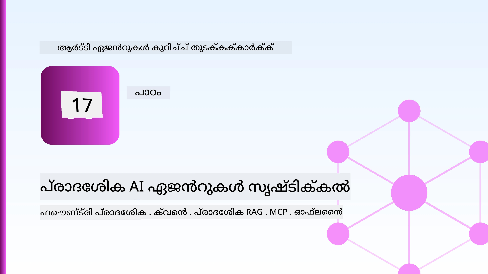
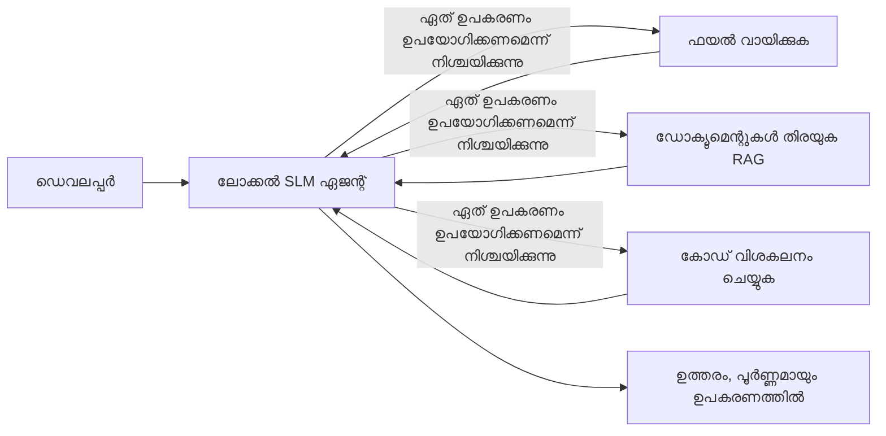
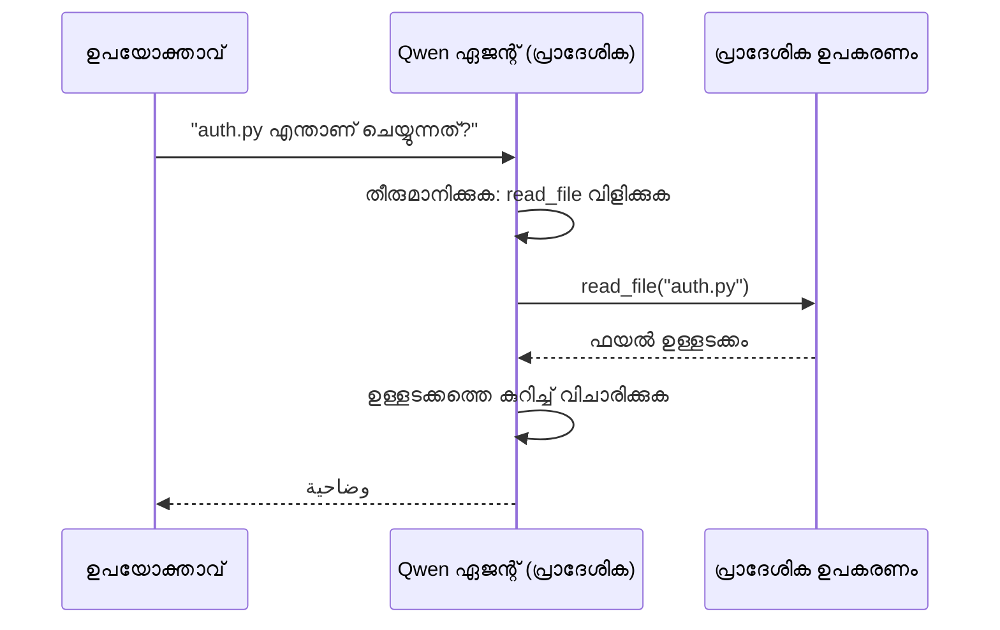
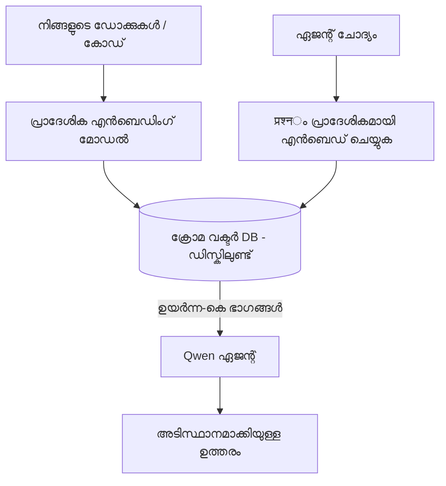
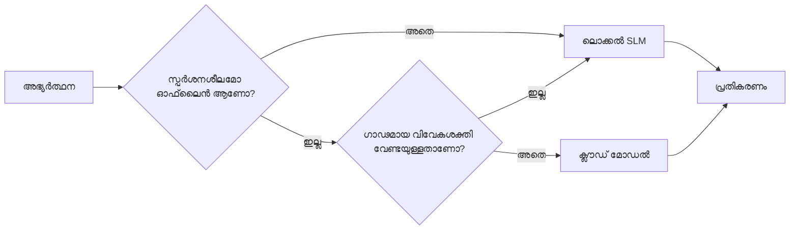

# Microsoft Foundry Local-ഉം Qwen-ഉം ഉപയോഗിച്ചുള്ള ലോക്കൽ AI ഏജന്റുകൾ സൃഷ്ടിക്കല്‍  

  

മുമ്പത്തെ പാഠം ഏജന്റുകളെ ക്ലൗഡിലേക്ക് *ഉയർത്തിയ*. ഈ പാഠം അവരെ ഒരു ഏക യന്ത്രത്തിലേക്ക് *താഴ്‌ത്തെത്തിക്കുന്നു*. അവസാനം നിങ്ങൾക്ക് പ്രവർത്തനക്ഷമമായ ഒരു എഞ്ചിനീയറിംഗ് അസിസ്റ്റന്റ് ഉണ്ടാകും, അത് മുന്നോട്ടുള്ള തീരുമാനങ്ങൾ എടുക്കും, ഉപകരണങ്ങൾ വിളിക്കും, നിങ്ങളുടെ ഫയലുകൾ വായിക്കും, നിങ്ങളുടെ ഡോക്യുമെന്റേഷൻ തിരയുകയും ചെയ്യും — **ഒരു മേഘത്തിൽ നിന്നുള്ള അനുമാന വിളിയുമില്ലാതെ.**  

ഇത് നിങ്ങൾക്ക് എന്തുകൊണ്ടാണ് വേണമെന്ന്? യാഥാർത്ഥ 工gerichte çalışmalarında തുടർച്ചയായി വന്നുകൊണ്ടിരിക്കുന്ന മൂന്ന് കാരണം:  

- **സ്വകാര്യത.** കോഡ് અને ഡോക്യുമെന്റുകൾ യന്ത്രം വിട്ടു പോകാറില്ല. പ്രോമ്പ്റ്റും സ്നിപ്പറ്റും ഉപഭോക്തൃ ഡേറ്റയും നെറ്റ്‌വർക്കിന്റെ അതിർത്തി കവിഞ്ഞു പോകാറില്ല.  
- **ചെലവ്.** ലോക്കൽ അനുമാനം ഒരിടത്തും പേഴ്-ടോക്കൺ ബിൽ ഇല്ല. വൈദ്യുതി ചെലവിനായി മുഴുവൻ ദിവസം ആവർത്തിക്കാം.  
- **ഓഫ്‌ലൈൻ.** ഒരു വിമാനത്തിൽ, സുരക്ഷിത സംവിധാനത്തിൽ, അല്ലെങ്കിൽ പവർ ഓഫ് സമയത്ത് ഏജന്റ് പ്രവർത്തിക്കാറുണ്ടാകും.  

കയിപ്പ് എന്നത് നിങ്ങൾ വനംമേഖലാ ക്ലൗഡ് മോഡലിനെ **Small Language Model (SLM)** എന്നതുമായി വിനിമയം ചെയ്യുകയാണ്, അത് നിങ്ങളുടെ CPU, GPU അല്ലെങ്കിൽ NPU-യിൽ പ്രവർത്തിക്കുന്നു. ഈ പാഠം ആ പരിധി ഉള്ളിൽ *നല്ല* ഏജന്റുകൾ ഉണ്ടാക്കുന്നതിനെക്കുറിച്ചാണ് സംസാരിക്കുന്നത്, ആ പരിധി ഇല്ലാത്തത് അപ്രത്യക്ഷമാക്കാനല്ല.  

## പരിചയം  

ഈ പാഠത്തിൽ ചർച്ച ചെയ്യുന്നത്:  

- **Small Language Models (SLMs)** — അവ എന്താണെന്ന്, എവിടെ മെച്ചമാണ്, എവിടെ കുറഞ്ഞൂ വലുത്.  
- **Microsoft Foundry Local** — ഒരു റൺടൈം, മോഡലുകൾ ഉപകരണത്തിൽ ഡൗൺലോഡ് ചെയ്യുകയും സേവനം നൽകുകയും ചെയ്യുന്നു, **OpenAI-സംബന്ധമായ API-യിലൂടെ**.  
- **Qwen ഫങ്ഷൻ-കാലിംഗ് മോഡലുകൾ** — SLM-കൾ വിശ്വാസയോഗ്യമായ ഉപകരണ വിളികൾ നൽകുന്നു, ഇത് ലോക്കൽ *ഏജന്റുകൾ* സാധ്യമാക്കുന്നു (സാധാരണ ലോക്കൽ ചാറ്റ് അല്ല).  
- **ലോക്കൽ ഉപകരണങ്ങൾ, ലോക്കൽ RAG, ലോക്കൽ MCP** — ക്ലൗഡ് ഇല്ലാതെ ഏജന്റിന് കഴിവ് നൽകുന്നു.  
- **ഹൈബ്രിഡ് മാതൃകകൾ** — എപ്പോൾ കാര്യങ്ങൾ ലോക്കലിൽ നിലനിർത്താം, എപ്പോൾ ക്ലൗഡ് ഉപയോഗിക്കാം എന്നത്.  

## പഠന ലക്ഷ്യങ്ങൾ  

ഈ പാഠം പൂർത്തീകരിച്ചതിൻ ശേഷമേ നിങ്ങൾ അറിയുക:  

- SLM-കളുടെ ഇടപാടുകൾ വിശദീകരിക്കുകയും അനുയോജ്യമായ ലോക്കൽ ഏജന്റ് ഉപയോഗമുറകൾ തിരഞ്ഞെടുക്കുകയും ചെയ്യുക.  
- Foundry Local-ഉം OpenAI-നുമായി പൊരുത്തമുള്ള എൻഡ്‌പോയിന്റും ഉപയോഗിച്ച് Qwen മോഡലിനെ ലോക്കലിൽ സേവനം നൽകുക.  
- നിങ്ങളുടെ വാർക്ക്‌സ്റ്റേഷനിൽ പൂർണ്ണമായും പ്രവർത്തിക്കുന്ന ടൂൾ-കാലിംഗ് ഏജന്റ് നിർമ്മിക്കുക.  
- നിങ്ങളുടെ സ്വന്തം ഡോക്യുമെന്റുകളിലേയ്ക്ക് ലോക്കൽ RAG ചേർക്കുക, ലോക്കൽ വെക്റ്റർ ഡാറ്റാബേസ് (Chroma) ഉപയോഗിച്ച്.  
- ഏജന്റിനെ ലോക്കൽ MCP സെർവറിന് കണക്ട് ചെയ്ത് ഹൈബ്രിഡ് ലോക്കൽ/ക്ലൗഡ് രൂപകൽപ്പനകളെ കുറിച്ച് വിവേകം ചെയ്യുക.  

## മുൻവൈദഗ്ധ്യം  

ഈ പാഠം മുൻപത്തെ പാഠങ്ങളിൽ നിന്ന് തുടങ്ങണമെന്നും താഴെ പറയുന്ന കാര്യങ്ങളിൽ പ്രാവീണ്യം ഉണ്ടായിരിക്കണമെന്നും കരുതുന്നു:  

- [Tool Use](../04-tool-use/README.md) (പാഠം 4) എന്നും [Agentic RAG](../05-agentic-rag/README.md) (പാഠം 5).  
- [Agentic Protocols / MCP](../11-agentic-protocols/README.md) (പാഠം 11).  
- [Microsoft Agent Framework](../14-microsoft-agent-framework/README.md) (പാഠം 14).  

നിങ്ങള്ക്ക് താഴെ പറയുന്നവയും വേണം:  

- ഒരു ഡെവലപ്പർ വാർക്ക്‌സ്റ്റേഷൻ. **8 GB RAM യാഥാർത്ഥ്യമുള്ള കുറഞ്ഞത്; 16 GB+ സൗകര്യമുള്ള**. GPU അല്ലെങ്കിൽ NPU സഹായമാകും പക്ഷേ ആവശ്യമില്ല.  
- **Microsoft Foundry Local** ഇൻസ്റ്റാൾ ചെയ്തിട്ടുള്ളത് (ഇനിപ്പറയുന്ന സെറ്റപ്പ് സെക്ഷൻ കാണുക).  
- Python 3.12+, പാക്കേജ് `requirements.txt` ലിസ്റ്റിലുള്ളത്, കൂടാതെ ഈ പാഠത്തിനായി `foundry-local-sdk`, `openai`, `chromadb`.  

## Small Language Models: ലൊക്കൽ ജോലിക്ക് അനുയോജ്യമായ ഉപകരണം  

ഒരു വനംമേഖലാ ക്ലൗഡ് മോഡലിന് നൂറുകണക്കിന് ബില്യൺ പാരാമീറ്ററുകളും ഒരു ഡാറ്റാ സെന്ററും ഉണ്ട്. SLM-ക്ക് കുറച്ച് ബില്യൺ പാരാമീറ്ററുകൾ മാത്രം ഉണ്ടു, അത് നിങ്ങളുടെ ലാപ്‌ടോപ്പിന്റെ RAM-ലിൽ ഫിറ്റ് ആകണം. ആ വ്യത്യാസം വ്യക്തമായ പ്രതീക്ഷകൾ സൃഷ്ടിക്കുന്നു.  

**SLM-കൾക്ക് മികച്ചത്:**  

- ഘടനാപരമായ, നിയന്ത്രിത ജോലി — തിരിച്ചറിവ്, നിർവചനമാറ്റം, അറിയപ്പെട്ട ഒരു ഡോക്യുമെന്റിന്റെ സംഗ്രഹം.  
- **ഉപകരണ വിളിക്കൽ** — ഏതു ഫംഗ്ഷൻ വിളിക്കണം, എത്ര_ARGUMENTS-ഉം തീരുമാനിക്കൽ.  
- പെട്ടെന്ന്, ചെലവിലില്ലാതെ, സ്വകാര്യമായി നിങ്ങളുടെ സ്വന്തം ഡാറ്റയിൽ ആവർത്തിക്കൽ.  

**SLM-കൾക്ക് കുറവുള്ളത്:**  

- തുറന്ന-അവസാനമോകം, വലിയ സാഹചര്യങ്ങളിൽ പുകയാട്ട മൾട്ടി-ഹോപ്പ് വിചാരണം.  
- വ്യാപക ലോകജ്ഞാനം (അവൾക്കു കുറവു, മറക്കലും കൂടുതലാണ്).  

ഇൻലോക്കൽ ഏജന്റുകൾക്കുള്ള വിജയ സ്ട്രാറ്റജിയാണ്: **SLM ഓർക്കസ്ട്രേറ്റ് ചെയ്യുക, ഉപകരണങ്ങൾ ഭാരമുള്ള പ്രവൃത്തികൾ ചെയ്യട്ടെ.** മോഡലിന് നിങ്ങളുടെ കോഡ് ബേസ് *അറിയാൻ* ആവശ്യമില്ല — അതിനു പകരം `read_file`-ഉം `search_docs`-ഉം എപ്പോഴെന്ന് അറിയണം. ഇത് SLM-യുടെ ശക്തികൾക്ക് നേരിട്ടുള്ള ഉത്തരം ആണ്.  


  
## Microsoft Foundry Local  

**Microsoft Foundry Local** നിങ്ങളുടെ യന്ത്രത്തിൽ പൂർണ്ണമായും മോഡലുകൾ ഡൗൺലോഡ് ചെയ്ത് പ്രയോജനപ്പെടുത്തുന്ന ഒരു ലഘു റൺടൈം ആണ്. നമ്മുടെ ദൃഷ്ടിക്കായി അതിന്റെ പ്രധാന സവിശേഷത ഒരു **OpenAI-സമёрത്ഥമായ HTTP എൻഡ്‌പോയിന്റ്** തുറക്കുക എന്നതാണ് — അതായത് OpenAI SDK-വും Microsoft Agent Framework-ന്റെ OpenAI ക്ലയന്റും അതിനോടൊപ്പം `base_url` മാത്രം മാറ്റി പ്രവർത്തിക്കും. ഏജന്റ് നിർമ്മാണത്തിൽ പഠിച്ച എല്ലാ കാര്യങ്ങളും ഒഴിച്ച് മാറാതെ തന്നെ ഉണ്ടാകും; എൻഡ്‌പോയിന്റ് മാത്രം ക്ലൗഡിൽ നിന്നു `localhost`-ലേക്കാണ് മാറുന്നത്.  

Foundry Local നിങ്ങളുടെ ഹാർഡ്‌വെയറിനുള്ള ഏറ്റവും നല്ല മോഡൽ ബിൽഡ് സ്വയം തിരഞ്ഞെടുത്ത് നൽകും — CPU, CUDA/GPU, NPU — നിങ്ങൾക്ക് യന്ത്രത്തിലേറ്റുവരെ മേധാവിത്വം ചെയ്യേണ്ടതില്ല.  

### സെറ്റപ്പ്  

Foundry Local ഇൻസ്റ്റാൾ ചെയ്യുക (നിങ്ങളുടെ OS-ന് [ഡോക്യുമെന്റേഷൻ](https://learn.microsoft.com/azure/ai-foundry/foundry-local/) കാണുക), ശേഷം പ്രവർത്തിക്കുന്നതായി ഉറപ്പാക്കുക:  

```bash
# ഇൻസ്റ്റാൾ ചെയ്യുക (ഉദാഹരണം; നിങ്ങളുടെ പ്ലാറ്റ്ഫോമിന്റെ ഡോക്യുമെന്റേഷൻ പിന്തുടരുക)
winget install Microsoft.FoundryLocal      # വിൻഡോസ്
# brew install microsoft/foundrylocal/foundrylocal   # മാക്‌ഓഎസ്

# ഒരു Qwen മോഡൽ ഡൗൺലോഡ് ചെയ്ത് പ്രവർത്തിപ്പിക്കുക, പിന്നെ ലോക്കൽ സേവനം ആരംഭിക്കുക
foundry model run qwen2.5-7b-instruct
foundry service status
```
  
സർവീസ് പ്രവർത്തിക്കാൻ തുടങ്ങിയാൽ നിങ്ങൾക്കുണ്ട് ഒരു ലോക്കൽ, OpenAI-പോലുള്ള എൻഡ്ഫോയിന്റ് (സാധാരണയായി `http://localhost:PORT/v1`). നോട്ട്‌ബുക്ക് `foundry-local-sdk` ഉപയോഗിച്ച് അതു സ്വയം കണ്ടെത്തും, അതിനാൽ പോർട്ട് ഹാർഡ്‌കോഡ് ചെയ്യേണ്ടതില്ല.  

## Qwen Function Calling: അത് എന്തിനു പ്രാധാന്യമുള്ളതാണ്  

ഒരു ഏജന്റ് ഫങ്ഷനുകൾ വിളിക്കാൻ കഴിയണം എങ്കിൽ മാത്രമേ ഏജന്റ് ആയി നിലനിൽക്കൂ. പല SLM-കൾ ചാറ്റ് ചെയ്യാമെങ്കിലും വിശ്വാസയോഗ്യമല്ലാത്ത, തെറ്റായ ഉപകരണ വിളികൾ ഉള്പാദിപ്പിക്കുന്നു. **Qwen** മോഡലുകൾ ഫംഗ്ഷൻ കോളിങ് പരിശീലനം നേടി വിശ്വാസയോഗ്യമായ ടൂൾ കോളുകൾ ക്രമത്തിലാക്കുന്നു — അത് ഇന്ത്യീഡിയോ-അർത്ഥത്തിനുള്ള ലോക്കൽ ചാറ്റ് മോഡൽ ഒരു പ്രവർത്തനക്ഷമമായ ലോക്കൽ *ഏജന്റായി* മാറ്റുന്ന കാര്യം ആണ്.  

പ്രവാഹം നിങ്ങൾ അറിയാവുന്ന സാധാരണ ടൂൾ-കാലിങ് ലൂപ്പ് തന്നെയാണ്, ഇവിടെ ആദ്യം ഉപകരണത്തിൽ പ്രവർത്തിക്കുന്നത് മാത്രം വേർതിരിക്കുന്നു:  


  
## ലോക്കൽ RAG  

ഡോക്യുമെന്റേഷൻ തിരയൽ ആണ് ലോക്കൽ ഏജന്റുകളുടെ വസ്തുത. SLM-എനിക്ക് നിങ്ങളുടെ ഫ്രെയിമ്വർക്കിന്റെ ഡോക്യുമെന്റുകൾ ദീർഘകാലം ഓർമ്മിച്ചിട്ടുണ്ടെന്ന പ്രതീക്ഷ കുറയ്ക്കാതെ, നിങ്ങൾ ആ ഡോക്യുമെന്റുകൾ **ലോക്കൽ വെക്റ്റർ ഡാറ്റാബേസിൽ** ഉൾപ്പെടുത്തി ഏജന്റ് ആവശ്യാനുസരണം ടുക്സ് തിരികെ കൊണ്ടുവരുമ്പോൾ.  

നാം ഉപയോഗിക്കുന്നത് **Chroma**, ഒരു എംബെഡഡ് വെക്റ്റർ സ്റ്റോർ. സങ്കേതം പൂർണ്ണമായും ലോക്കലാണ്: ലോക്കൽ എംബെഡിങ്ങ് മോഡൽ → ലോക്കൽ വെക്റ്ററുകൾ → ലോക്കൽ റിട്രീവൽ → ലോക്കൽ SLM.  


  
ഇത് പാഠം 5-ലെ Agentic RAG മാതൃക തന്നെയാണ് — മാറ്റം വെറും എല്ലാം യന്ത്രത്തിലാണ് പ്രവർത്തിക്കുന്നത് എന്നതിൽ മാത്രം.  

## ലോക്കൽ MCP സെർവറുകൾ  

[MCP](../11-agentic-protocols/README.md) ഒരു ട്രാൻസ്പോർട്ടാണ്, ക്ലൗഡ് സർവീസ് അല്ല. ഒരു MCP സെർവർ `stdio` പ്രത്യക്ഷമായും പ്രാദേശിക പ്രക്രിയയായി പ്രവർത്തിക്കാം, സ്റ്റാന്റേർഡ് പ്രോട്ടോക്കിൾ വഴി ഉപകരണങ്ങൾ നിങ്ങളുടെ ഏജന്റിന് ലഭ്യമാക്കാം. ഇതിലൂടെ MCP സെർവറുകളുടെ മുഴുവൻ ഇക്കോസിസ്റ്റവും ഉപയോഗപ്പെടുത്താം — ഫയൽ സിസ്റ്റം ആക്‌സസ്, git പ്രവർത്തനങ്ങൾ, ഡാറ്റാബേസ് ചോദ്യംങ്ങൾ — പൂർണ്ണമായും ഓഫ്‌ലൈൻ.  

സുരക്ഷാവസ്ഥ ക്ലൗഡിൽ നിന്നും വ്യത്യസ്തമാണ്, ഇല്ലാതെ ഇല്ല: ലോക്കൽ MCP സെർവർ ഇപ്പോഴും നിങ്ങളുടെ യൂസർ അനുമതികളോടെ പ്രവർത്തിക്കുന്നതിനാൽ അത് എത്താനുള്ള കാര്യങ്ങളിൽ പരിധി നിശ്ചയിക്കുക (ഒരു പ്രോജക്ട് ഡയറക്ടറി, മുഴുവൻ ഹോം ഫോൾഡർ അല്ല) എല്ലാ പുറപ്പെടുന്ന ഫലങ്ങളും ഇൻപുട്ടുകളായി പരിഗണിച്ച് പരിശോധന നടത്തുക.  

## ഹൈബ്രിഡ് ക്ലൗഡ്-നും ലോക്കൽ മാതൃകകൾ  

ലോക്കൽ ആദ്യം എന്നാൽ മാത്രം ലോക്കൽ അല്ല. പരിപੱਕ്ത സംവിധാനങ്ങൾ സങ്കേതവും ബുദ്ധിമുട്ടും അടിസ്ഥാനമാക്കി രക്ഷാമാർഗ്ഗങ്ങൾ തിരഞ്ഞെടുക്കുന്നു:  

| സ്ഥിതി | എവിടെയാണ് പ്രവർത്തിക്കുന്നത് |  
| --- | --- |  
| സംവേദനശീലമായ കോഡ് / ഡാറ്റ, അല്ലെങ്കിൽ ഓഫ്ലൈൻ | **ലോക്കൽ SLM** |  
| ലളിതവും നിയന്ത്രിതമായ ജോലി | **ലോക്കൽ SLM** (സാവ്, വേഗം) |  
| ബുദ്ധിയുള്ള മൾട്ടി-ഹോപ്പ് വിചാരണം സെൻസിറ്റീവ്-മറ്റുള്ള ഡാറ്റയിൽ | **ക്ലൗഡ് മോഡൽ** |  
| എല്ലാമും, പവർ ഓഫ് സമയത്ത് | **ലോക്കൽ SLM** (സൗകര്യപ്രദമായ ഇടിവ്) |  

ഈ സംവിധാനം പാഠം 16-ലെ **മോഡൽ റൂട്ടിങ്** ആശയത്തെ അനുകരിക്കുന്നു — കൂടാതെ "മോഡലുകളിൽ" ഒന്നു ഇനി നിങ്ങളുടെ യന്ത്രമാണ്. ഒരു ശക്തമായ രൂപകൽപ്പന ക്ലൗഡ് ലഭ്യമല്ലാത്തപ്പോൾ ലോക്കലിലേക്ക് തിരിയുകയും ഏജന്റ് ഗുണനിലവാരത്തിൽ ഇടിവ് മൂല്യമുള്ള തരം തിരിയുകയും ചെയ്യുന്നു.  


  
## പ്രായോഗിക പരീക്ഷണശാല: ഒരു ലോക്കൽ എഞ്ചിനീയറിംഗ് അസിസ്റ്റന്റ്  

ടെക്‌സ്‌റ്റ് തുറക്കുക [`code_samples/17-local-agent-foundry-local.ipynb`](./code_samples/17-local-agent-foundry-local.ipynb) ഒപ്പം പ്രവർത്തിക്കുക. നിങ്ങൾ ഒരു **ലോക്കൽ എഞ്ചിനീയറിംഗ് അസിസ്റ്റന്റ്** നിർമ്മിക്കും, അത് മുഴുവനായി നിങ്ങളുടെ വാർക്ക്‌സ്റ്റേഷനിൽ പ്രവർത്തിക്കും, താഴെ പറയുന്നവ ചെയ്യും:  

1. **ഉപകരണങ്ങൾ വിളിക്കുക** — Foundry Local മുഖേന Qwen ഫങ്ഷൻ-കാലിംഗ് ഉപയോഗിച്ച്.  
2. **ലോക്കൽ ഫയൽ പ്രവർത്തനങ്ങൾ നടത്തുക** — ഒരു പ്രോജക്റ്റ് ഡയറക്ടറിയിലെ ഫയലുകൾ പട്ടികപ്പെടുത്തുകയും വായിക്കുകയും ചെയ്യുക.  
3. **കോഡ് വിശകലനം ചെയ്യുക** — സോഴ്‌സ് ഫയലിന്റെ അടിസ്ഥാന മാനദണ്ഡങ്ങൾ റിപ്പോർട്ട് ചെയ്യുക.  
4. **ഡോക്യുമെന്റേഷൻ തിരയുക** — Chroma ഉപയോഗിച്ച് ഡോക്യുമെന്റ് ഫോൾഡർ വഴി ലോക്കൽ RAG.  
5. **MCP ഉപയോഗിക്കുക** — ഒരോ MCP സെർവർക്ക് കണക്ടുചെയ്യുക (അനുകൂലമല്ലെങ്കിൽ സൗമ്യമായി ഒഴിവാക്കുക).  

ഏതെങ്കിലും സമയത്തു ക്ലൗഡ് അനുമാനം ഉപയോഗിക്കുന്നില്ല.  

### വഴി തെളിയൽ  

അസിസ്റ്റന്റ് Foundry Local-നെ OpenAI പകരം നൽകുന്ന എൻഡ്‌പോയിന്റിലൂടെ കണക്ടു ചെയ്യും, അതിനാൽ ഏജന്റ് കോഡ് ക്ലൗഡ് പാഠങ്ങളോട് അനുരൂപമാണ് — ക്ലയന്റ് മാത്രം മാറുന്നു:  

```python
from foundry_local import FoundryLocalManager
from openai import OpenAI

# ഫൗണ്ട്രി ലോക്കൽ മോഡൽ കണ്ടെത്തുന്നു/ഡൗൺലോഡ് ചെയ്യുന്നു കൂടാതെ നമുക്ക് ഒരു ലോക്കൽ എൻഡ്‌പോയിന്റ് നൽകുന്നു.
manager = FoundryLocalManager(\"qwen2.5-7b-instruct\")
client = OpenAI(base_url=manager.endpoint, api_key=manager.api_key)  # api_key ഒരു ലോക്കൽ പ്ലേസ്ഹോൾഡറാണ്.
```
  
ഉപകരണങ്ങൾ സാധാരണ Python ഫംഗ്ഷനുകളാണ്, പ്രോജക്റ്റ് ഡയറക്ടറിയിലേക്കു മാത്രം പരിധികളോടെ:  

```python
def read_file(path: str) -> str:
    \"\"\"Read a file, but only inside the sandboxed project directory.\"\"\"
    full = (PROJECT_ROOT / path).resolve()
    if PROJECT_ROOT not in full.parents and full != PROJECT_ROOT:
        return \"Access denied: path is outside the project directory.\"
    return full.read_text(encoding=\"utf-8\")
```
  
സാൻഡ്‌ബോക്സ് പരിശോധന ശ്രദ്ധിക്കുക — ലൊക്കലായാലും, അനധികൃത പാതകൾ വായിക്കുന്ന ഒരു ഉപകരണം ബാധ്യതയാണ്. നോട്ട്‌ബുക്ക് എല്ലാ ഉപകരണങ്ങളും ഒറ്റ പ്രോജക്റ്റ് റൂട്ടിനുള്ളിൽ നിയന്ത്രിക്കുന്നു.  

## അറിവ് പരിശോധിക്കല്‍  

അസൈൻമെന്റിലേക്ക് നീങ്ങുന്നതിന് മുമ്പ് നിങ്ങളുടെ അയഞ്ഞ മനസ്സിന്റെ ഭക്ഷണം പരിശോധിക്കുക.  

**1. ഏജന്റ് ക്ലൗഡിൽ എന്നതിനേക്കാൾ ലോക്കലിൽ പ്രവർത്തിപ്പിക്കുന്നതിന് രണ്ട് കൺക്രീറ്റ് കാരണങ്ങൾ പറയുക.**  

<details>  
<summary>ഉത്തരം</summary>  

ഏതൊരു രണ്ട്: **സ്വകാര്യता** (കോഡ് ഡാറ്റ യന്ത്രം വിട്ടു പോവാറില്ല), **ചെലവ്** (പേര് ടോക്കൺ അനുമാനത്തിനൊരു ബിൽ ഇല്ല), **ഓഫ്‌ലൈൻ ശേഷി** (നെറ്റ്‌വർക്ക് ഇല്ലാത്തതിനാൽ പ്രവർത്തിക്കുന്നു — വിമാനത്തിൽ, സുരക്ഷിത സംവിധാനത്തിൽ, പവർ ഓഫ് ആകുമ്പോൾ). ഡാറ്റ ഓഫ്ഡിവൈസിൽ അയയ്ക്കാൻ വിലക്കുള്ള ആധികാര/കമ്പ്‌ളയൻസ് നിയന്ത്രണങ്ങൾ സ്വകാര്യതക്ക് പ്രധാന കാരണം.  
</details>  

**2. ഒരു ലോക്കൽ ഏജന്റിൽ SLM-നും അതിന്റെ ഉപകരണങ്ങൾക്കും തമ്മിലുള്ള ശുചിതലമായ ചുമതല വേർതിരിവ് എന്താണ്, എന്തിനായി?**  

<details>  
<summary>ഉത്തരം</summary>  

SLM-ൻറെ **ഓർക്കസ്ട്രേഷൻ** അനുവദിക്കുക (ഏത് ടൂൾ വിളിക്കണം, എത്ര_ARGUMENTS ക്കൊപ്പം തീരുമാനിക്കുക), **ഉപകരണങ്ങൾക്ക് ഭാരമുള്ള പ്രവർത്തനങ്ങൾ ചെയ്യട്ടെ** (ഫയലുകൾ വായിക്കുക, ഡോക്യുമെന്റുകൾ തിരിക്കുക, ഫലങ്ങൾ കണക്കാക്കുക). ടൂൾ തെരഞ്ഞെടുപ്പ് പോലുള്ള നിയന്ത്രിത തീരുമാനങ്ങളിൽ SLM-കൾ ശക്തരാണ്, വ്യാപക അറിവിലും ദീർഘ മൾട്ടി-ഹോപ്പ് റീസണിംഗിലും തക്കമല്ല, അതിനാൽ ഉപകരണങ്ങളിൽ ആശ്രയം അവരുടെ ശക്തികൾക്ക് തൊടുന്നു.  
</details>  

**3. Foundry Local-ഉം ക്ലൗഡ് ഏജന്റ് കോഡും പിന്നിലെയാക്കാൻ എന്താണ് സാധ്യമാക്കുന്നത്?**  

<details>  
<summary>ഉത്തരം</summary>  

Foundry Local ഒരു **OpenAI-സംബന്ധമായ HTTP എൻഡ്‌പോയിന്റ്** തുറക്കുന്നു. OpenAI SDK-വും Agent Framework-നുള്ള OpenAI ക്ലയന്റും `base_url` മാത്രം മാറ്റി (ലോക്കൽ പ്ലേസ്ഹോൾഡർ API കീ ഉപയോഗിച്ച്) അത് ഉപയോഗിക്കുന്നു. ഏജന്റ് കോഡിന്റെ മറ്റു എല്ലാ ഭാഗങ്ങളും അതേപീടി തന്നെ തുടരുന്നു.  
</details>  

**4. എന്തിനാണ് നമ്മൾ പ്രത്യേകിച്ച് Qwen ഫങ്ഷൻ-കാലിംഗ് മോഡൽ ഉപയോഗിക്കുന്നത് മറ്റേതെങ്കിലും SLM-ൽ പകരം?**  

<details>  
<summary>ഉത്തരം</summary>  

ഏജന്റ് വിശ്വാസയോഗ്യമായ, ശരിയായ **ടൂൾ കോളുകൾ** ഉല്പാദിപ്പിക്കണം. പല SLM-കൾ ചാറ്റ് ചെയ്യാറുണ്ട്, പക്ഷേ തെറ്റായ അല്ലെങ്കിൽ സ്ഥിരമല്ലാത്ത ടൂൾ-കോൾ ഘടനകൾ ഉൽപ്പാദിപ്പിക്കുന്നു. Qwen മോഡലുകൾ ഫങ്ഷൻ-കാലിംഗിൽ പരിശീലനം നേടിയവയും സ്ഥിരമായ ടൂൾ-കോൾ സ്ട്രക്ചറുകൾ നൽകുന്നവയുമാണ്, അതുകൊണ്ടാണ് ഒരു ലോക്കൽ ചാറ്റ് മോഡൽ പ്രവർത്തനക്ഷമമായ ലോക്കൽ ഏജന്റായി മാറുന്നത്.  
</details>  

**5. ലോക്കൽ RAG പൈപ്പ്ലൈനിൽ, ഏതാണ് യന്ത്രത്തിൽ പ്രവർത്തിക്കുന്നത്?**  

<details>  
<summary>ഉത്തരം</summary>  

എല്ലാം: എംബെഡിങ്ങ് മോഡൽ, വെക്റ്റർ ഡാറ്റാബേസ് (Chroma, ഡിസ്കിലുള്ളത്), റിട്രീവ് പടി, SLM. ഡോക്യുമെന്റുകൾ ലോക്കലായിട്ട് ഉൾപ്പെടുത്തിയിരിക്കുന്നു, ലൊക്കലായി സൂക്ഷിച്ചിരിക്കുന്നു, ലോക്കലായി തിരിച്ചു കൊണ്ടുവരുന്നു, ലോക്കൽ മോഡലിലൂടെ ചിന്തിക്കുന്നു — ആകെയുള്ള ഘടകവും ക്ലൗഡിനെ തൊടുന്നില്ല.  
</details>  

**6. ഒരു ലോക്കൽ MCP സെർവർ നിങ്ങളുടെ യന്ത്രത്തിൽ പ്രവർത്തിക്കുന്നു. അതു തന്നെ സുരക്ഷിതമാക്കുമോ? എന്ത് മുൻകരുതലുകൾ സ്വീകരിക്കണം?**  

<details>  
<summary>ഉത്തരം</summary>  

ഇല്ല. ലോക്കൽ MCP സെർവർ നിങ്ങളുടെ ഉപയോ​ഗർത്താവിന്റെ അനുമതികളോടെ പ്രവർത്തിക്കുന്നു, അതിനാൽ നിങ്ങൾക്ക് ലഭിക്കുന്നതെല്ലാം താനും ലഭിക്കും. അതിനാൽ അത് പരിമിതപ്പെടുത്തുക (ഉദാഹരണത്തിന് ഒരു പ്രോജക്റ്റ് ഡയറക്ടറി മാത്രം, മുഴുവൻ ഹോം ഫോൾഡർ അല്ല) പിന്നെ അതിന്റെ ഔട്ട്പുട്ടുകൾ ഇൻപുട്ടുകളായി പരിഗണിച്ച് പരിശോദിക്കുക.  
</details>  

**7. ഒരു ബുദ്ധിമുട്ടു കൂട്ടിച്ചേർത്ത ഹൈബ്രിഡ് റൂട്ടിങ് നിയമം ലോക്കൽ മോഡൽ ഉൾപ്പെടുത്തിയിട്ടുണ്ട് എന്ന് വിവരിക്കുക.**  

<details>  
<summary>ഉത്തരം</summary>  

സംവേദനശീലമോ ഓഫ്ലൈനായോ ഉള്ള അഭ്യർത്ഥനകൾ ലോക്കൽ SLM-യിലേക്ക് അയയ്ക്കുക; ലളിതവും നിയന്ത്രിതമായ ജോലികൾ വേഗത്തിലും ചെലവിലും ലോക്കൽ SLM-യിലേക്ക് അയയ്ക്കുക; ബുദ്ധിയുള്ള മൾട്ടി-ഹോപ്പ് റീസണിംഗ് നാന്സെൻസിറ്റീവ് ഡാറ്റയിൽ ക്ലൗഡ് മോഡലിലേക്ക് കൈമാറുക; ക്ലൗഡ് ലഭ്യമല്ലെങ്കിൽ ലോക്കൽ SLM-യിലേക്ക് തിരിച്ചുപോകുക അതിനാൽ ഏജന്റ് ഗുണനിലവാരത്തിൽ ക്രമവിധേയമായി ഇടിവു വരുത്താറായിരിക്കും, പരാജയപ്പെടാറില്ല. ഇത് പാഠം 16-ലെ മോഡൽ റൂട്ടിങിന്റെ രൂപമാണ്, പോകെ ലോക്കൽ യന്ത്രം "മോഡലുകളിൽ" ഒന്ന് ആയി.  
</details>  

**8. ഈ പാഠത്തിലെ ലോക്കൽ ഏജന്റ് എക്കാലത്തെയും ഓടാനുള്ള യഥാർത്ഥ സാധ്യതയുള്ള കുറഞ്ഞ RAM എത്ര ആണ്, കൂടിയ RAM നിങ്ങൾക്കു നൽകുന്നത് എന്ത്?**  

<details>  
<summary>ഉത്തരം</summary>  

ഏകദേശം **8 GB** യഥാർത്ഥ ശേഷയിലാണ് കുറഞ്ഞത്; 16 GB+ കൂടുതല്‍ സൗകര്യപ്രദമാണ്. കൂടുതൽ RAM നിങ്ങളുടെ കൂടുതൽ വലിയ, യുക്തിമാനായ മോഡലുകൾ ഓടിക്കാനും കൂടുതൽ കോൺടെക്‌സ്‌റ്റ് മെമ്മറിയിൽ സൂക്ഷിക്കാനും സഹായിക്കും. GPU അല്ലെങ്കിൽ NPU അനുമാനം വേഗത്തിലാക്കുന്നു പക്ഷേ ആവശ്യമായില്ല — Foundry Local ലഭ്യമല്ലാത്തപ്പോൾ CPU ബിൽഡ് തെരഞ്ഞെടുത്തു നൽകും.  
</details>  

## അസൈൻമെന്റ്  

ഒരു ലോക്കൽ എഞ്ചിനീയറിംഗ് അസിസ്റ്റന്റിനെ **ലോക്കൽ ഡോക്യുമെന്റേഷൻ റിവ്യൂവർ** ആയി വികസിപ്പിക്കുക, നിങ്ങളുടെ ഇഷ്ടപ്രകാരമുള്ള ഒരു ചെറിയ പ്രോജക്റ്റിൽ (ഈ റീപോസിറ്ററിയുടെ പാഠഫോള്ഡറുകൾ ഉപയോഗിക്കാം).  

നിങ്ങളുടെ സമർപ്പണം താഴെ പറയുന്നതും പാടെണം:  

1. ഒരു യഥാർത്ഥ ഡോക്‌സ്/കോഡ് ഫോൾഡറെ Chroma-യിൽ ഇൻഡക്സ് ചെയ്യുക (കമപക്ഷം അഞ്ച് ഫയലുകള്‍).  
2. പ്രോജക്റ്റ് റിപ്പോർട്ട് കണ്ടെത്തുന്നതിനായി `find_todos` എന്ന ടൂൾ ചേർക്കുക, അത് `TODO`/`FIXME` കമന്റുകൾ സ്കാൻ ചെയ്ത് ഫയലും ലൈൻ നമ്പറും പറയുന്നു — `read_file`-ലുള്ള സാൻഡ്‌ബോക്സ് ചെക്ക് പാലിച്ചു.  

3. **എജന്റിനോട് മൂന്ന് ചോദ്യങ്ങൾ ചോദിക്കുക** എന്നത് ഉപകരണങ്ങൾ സംയോജിപ്പിക്കാൻ നിർബന്ധപ്പെടുത്തുന്നത്: ഒരു ശുദ്ധ RAG ചോദ്യവും, ഒരു പ്രത്യേക ഫയൽ വായിക്കാൻ ആവശ്യപ്പെടുന്നവയും, TODOs കണ്ടെത്താൻ ആവശ്യപ്പെടുന്നവയും.
4. **അളവുക**: മൂന്ന് പ്രതികരണങ്ങളും സമയപ്പെടുത്തി ഒരു മാർക്ക്‌ഡൗൺ സെല്ലിൽ രേഖപ്പെടുത്തുക. നിങ്ങളുടെ ഉദ്ദേശിച്ച തൊഴിലൈപിലുള്ള വേഗത സ്വീകരണയോഗ്യമാണോ എന്ന് കുറിപ്പിടുക.

തുടർന്ന് ഈ റിവ്യുവറിന് വേണ്ടിയുള്ള **ക്ലൗഡിലേക്ക് നീക്കുന്നതും ലോക്കലായി സൂക്ഷിക്കേണ്ടതും എന്താണെന്ന്** കുറച്ച് വിവരണം എഴുതുക, അതിനാൽ എന്തുകൊണ്ടാണെന്ന്. ലൊക്കൽ ഘടകങ്ങൾ ശരിയായി ബന്ധിപ്പിച്ചിട്ടുണ്ടോ എന്നും നിങ്ങളുടെ ഹൈബ്രിഡ് നിരൂപണം ശരിയാണോ എന്നും പരിശോധിക്കുന്നു — മോഡൽ ഗുണമേന്മയെക്കുറിച്ച് അല്ല.

## സംക്ഷേപം

ഈ പാഠത്തിൽ നിങ്ങൾ ഒരു എജന്റ് നിർമ്മിച്ചു, അത് പൂർണമായും നിങ്ങളുടെ സ്വന്തം യന്ത്രത്തിൽ പ്രവർത്തിക്കുന്നു:

- **SLMs** വ്യാപ്തി സ്വകാര്യത, ചെലവ്, ഒഫ്‌ലൈൻ പ്രവർത്തനം എന്നിവയ്‌ക്കായി വ്യാപിപ്പിച്ച് — തങ്ങൾക്കുള്ള എല്ലാ അറിവും കൈകാര്യം ചെയ്യുന്നതിന്റെ പകരം **ഉപകരണങ്ങൾ ഓർക്കസ്ട്രേറ്റ് ചെയ്യുമ്പോൾ** പ്രകാശിക്കുന്നു.
- **Foundry Local** മോഡലുകൾ ഉപകരണത്തിൽ തന്നെ ഒരു **OpenAI-സമരൂപ എन्ड്‌പോയിന്റ്** പിന്നിൽ സേവനമനുഷ്ഠിക്കുന്നു, അതിനാൽ നിങ്ങളുടെ ക്ലൗഡ് എജന്റ് കോഡ് ഒരു വരിയിലൊരു മാറ്റത്തോടെ കൈമാറാം.
- **Qwen ഫങ്ക്ഷൻ-കൊള്ലിങ് മോഡലുകൾ** ലോക്കൽ ഉപകരണ കോൾ വിശ്വസനീയമാക്കുന്നു — അതിനാൽ ലോക്കൽ *എജന്റുമാർ* യും സാധ്യമാണ്.
- **ലോക്കൽ RAG** (Chroma) ഒപ്പം **ലോക്കൽ MCP** യന്ത്രം വിടാതെ എജന്റിനെ ശേഷിയുള്ളവനാക്കുന്നു.
- **ഹൈബ്രിഡ് മാതൃകകൾ** സേൻസിറ്റിവിറ്റിയും ബുദ്ധിമുട്ടും അനുസരിച്ച് വഴികാട്ടുന്നു, ലോക്കൽ ഒരു മൃദുവായ ബാക്കപ്പ് ആയി.

ഇത് വിന്യാസം പൂർത്തിയാക്കുന്നു: പാഠം 16 മൈക്രോസോഫ്റ്റ് ഫൗണ്ടറിയിലേക്ക് വിലയിരുത്തിയ എജന്റുകളെ വർദ്ധിപ്പിച്ചു, ഈ പാഠം അവരെ ഒരു ഏകദേശം വർക്ക്‌സ്റ്റേഷനിലേക്ക് കുറച്ചു. അടുത്ത പാഠം വിന്യസിച്ച എജന്റുകൾ സുരക്ഷിതമാക്കുന്നതിനോടെയാണ്.

## അധിക സ്രോതസ്സുകൾ

- <a href="https://learn.microsoft.com/azure/ai-foundry/foundry-local/" target="_blank">Microsoft Foundry Local ഡോക്യൂമെന്റേഷൻ</a>
- <a href="https://learn.microsoft.com/azure/ai-foundry/what-is-azure-ai-foundry" target="_blank">Microsoft Foundry ഡോക്യുമെന്റേഷൻ</a>
- <a href="https://learn.microsoft.com/en-us/agent-framework/overview/?wt.mc_id=youtube_26688_organicsocial_reactor&pivots=programming-language-python" target="_blank">Microsoft ഏജന്റ് ഫ്രെയിംവർക്ക്</a>
- <a href="https://qwen.readthedocs.io/en/latest/framework/function_call.html" target="_blank">Qwen ഫംഗ്ഷൻ കോള്ലിങ് ഡോക്യൂമെന്റേഷൻ</a>
- <a href="https://modelcontextprotocol.io/" target="_blank">മോഡൽ കോൺടക്സ്റ്റ് പ്രോട്ടോക്കോൾ (MCP)</a>
- <a href="https://docs.trychroma.com/" target="_blank">Chroma വെക്റ്റർ ഡേറ്റാബേസ്</a>

## മുൻപത്തെ പാഠം

[Deploying Scalable Agents](../16-deploying-scalable-agents/README.md)

## അടുത്ത പാഠം

[Securing AI Agents](../18-securing-ai-agents/README.md)

---

<!-- CO-OP TRANSLATOR DISCLAIMER START -->
**അറിയിപ്പ്**:
ഈ രേഖ AI പരിഭാഷാ സേവനം [Co-op Translator](https://github.com/Azure/co-op-translator) ഉപയോഗിച്ച് പരിഭാഷപ്പെടുത്തിയതാണ്. ഞങ്ങൾ കൃത്യതയ്ക്കായി ശ്രമിക്കുന്നുവെങ്കിലും, ഓട്ടോമേറ്റഡ് പരിഭാഷകളിൽ പിഴവുകൾ അല്ലെങ്കിൽ തെറ്റായ വിവരങ്ങൾ ഉണ്ടാകാൻ സാധ്യതയുണ്ട്. അതിന്റെ സ്വാഭാവിക ഭാഷയിലുള്ള അസൽ രേഖയാണ് പ്രാമാണികമായ ഉറവിടമായി പരിഗണിക്കേണ്ടത്. നിർണായകമായ വിവരങ്ങൾക്ക്, പ്രൊഫഷണൽ മനുഷ്യ പരിഭാഷ ശുപാർശ ചെയ്യുന്നു. ഈ പരിഭാഷ ഉപയോഗിച്ച് ഉണ്ടാകുന്ന തെറ്റിദ്ധാരണകൾ അല്ലെങ്കിൽ തെറ്റായ വ്യാഖ്യാനങ്ങൾക്കായി ഞങ്ങൾ ഉത്തരവാദികളല്ല.
<!-- CO-OP TRANSLATOR DISCLAIMER END -->