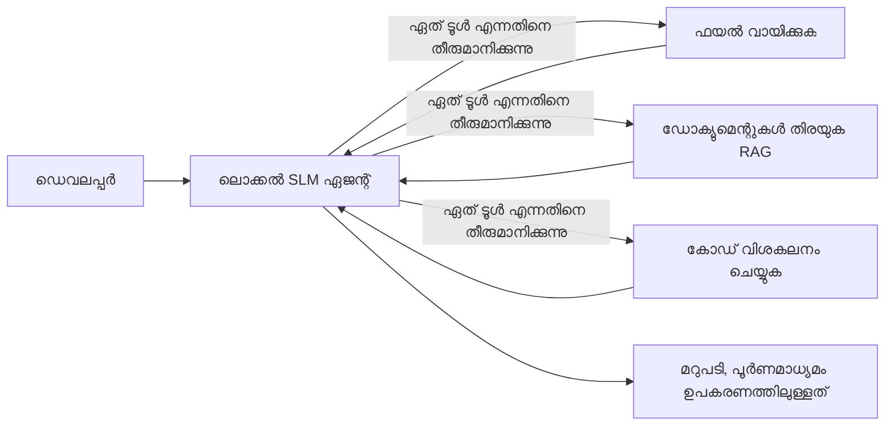
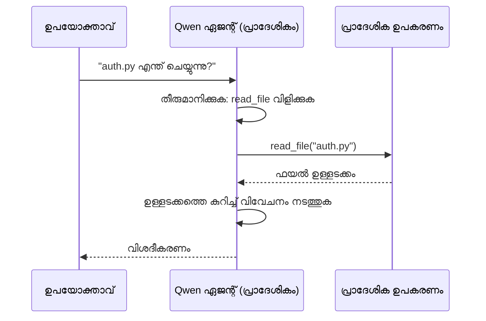
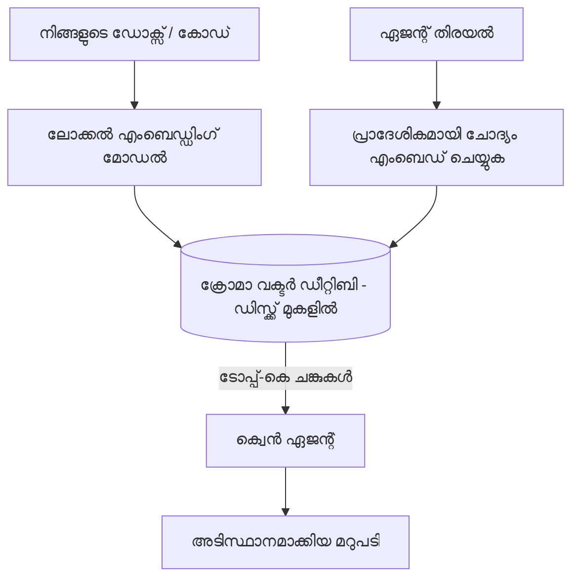
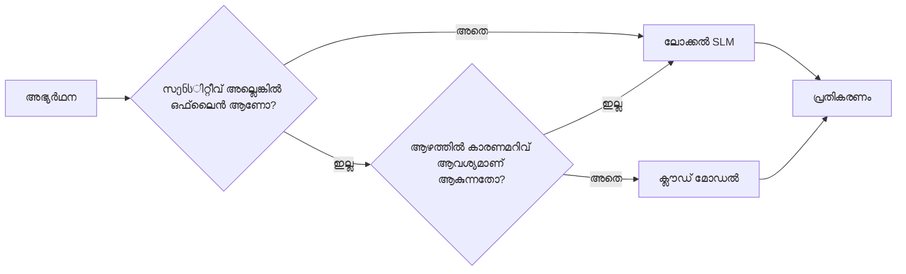

# Microsoft Foundry Local ഉം Qwen ഉം ഉപയോഗിച്ച് ലോക്കൽ AI ഏജന്റുകൾ സൃഷ്ടിക്കൽ


മുൻപത്തെ പാഠം ഏജന്റുകളെ *ക്ലൗഡിലേക്ക്* ഉയർത്തി. ഇത് അവയെ ഒരു ഏകകാല മെഷീനിലേക്ക് *താഴെ* കൊണ്ടുവന്ന് വരുന്നു. അവസാനം നിങ്ങൾക്ക് ഒരു പ്രവർത്തനം ചെയ്യുന്ന എഞ്ചിനീയറിംഗ് സഹായി ഉണ്ടാകും, അത് കാരണംചെയ്യുന്നു, ഉപകരണങ്ങള് വിളിക്കുന്നു, നിങ്ങളുടെ ഫയലുകൾ വായിക്കുന്നു, നിങ്ങളുടെ ഡോക്യുമെന്റേഷൻ തിരയുന്നു — **ഒരു പോലും ക്ലൗഡ് ഇൻഫെറെൻസ് കോൾ ഇല്ലാതെ.**

നിങ്ങൾക്ക് അത് வேண்டാകാൻ കാരണം എന്താണ്? യാഥാർഥ എഞ്ചിനീയറിംഗ് ജോലിയിൽ സ്ഥിരമായി കാണപ്പെടുന്ന മൂന്ന് കാരണങ്ങൾ:

- **സ്വകാര്യത.** കോഡ്, ഡോക്യുമെന്റുകൾ പോയി മെഷീൻ വിട്ടുകൊണ്ടു പോകില്ല. ഒരു പ്രോംപ്, ഒന്നും സ്നിപ്പറ്റ്, ഉപഭോക്തൃ ഡാറ്റ നെറ്റ്‌വർക്ക് ബൗണ്ടറിയെ കത്തി പോകാതെ.
- **ചെലവ്.** ലോക്കൽ ഇൻഫെറെൻസ് പ്രമാണം ടോക്കൺ അടക്കമുള്ള ബിൽ ഇല്ല. നിങ്ങൾക്ക് മുഴുവൻ ദിവസവും വൈദ്യുതി ചെലവിന് സഞ്ചരിക്കാം.
- **ഓഫ്‌ലൈനിൽ.** വിമാനത്തിൽ, സുരക്ഷിത സംവിധാനത്തിൽ, അല്ലെങ്കിൽ ഔട്ടേജ് സമയത്ത്, ഏജന്റ് ഇപ്പോഴും പ്രവർത്തിക്കുന്നു.

എന്നാൽ നിങ്ങൾ ഒരു ഫ്രണ്ടിയർ ക്ലൗഡ് മോഡലിനെ **സ്മാൾ ലാംഗ്വേജ് മോഡൽ (SLM)** യുമായി സ്ഥലംകൽപ്പിക്കുന്നു, നിങ്ങളുടെ CPU, GPU, അല്ലെങ്കിൽ NPU-യിൽ പ്രവർത്തിപ്പിച്ചുകൊണ്ട്. ഈ പാഠം അതിലെ പരിധിക്ക് ഉള്ളിൽ *നല്ല* ഏജന്റുകൾ സൃഷ്ടിക്കുന്നത് സംബന്ധിച്ചാണ്, പരിധി ഇല്ലാതെന്ന് അഭിന്നമാക്കുന്നതല്ല.

## പരിചയം

ഈ പാഠത്തില് ഉൾപ്പെടുന്നവ:

- **സ്മാൾ ലാംഗ്വേജ് മോഡലുകൾ (SLMs)** — അവ എന്താണെന്ന്, എവിടെ മികച്ചതാണ്, എവിടെ പലതും ഇല്ല.
- **Microsoft Foundry Local** — ഒരു റൺടൈം, മോഡലുകൾ ഓൺ-ഡിവൈസിലാണ് ഡൗൺലോഡ് ചെയ്ത് സർവ് ചെയ്യുന്നത്, ഒരു **OpenAI-സിøതമായ API** വഴി.
- **Qwen ഫംഗ്‌ഷൻ കോളിങ് മോഡലുകൾ** — SLM-കൾ വിശ്വാസ്യമായ ടൂൾ കോൾ ഉൽപ്പാദിപ്പിക്കുന്നു, ഇത് ലൊക്കൽ *ഏജന്റുകൾ* (ലോക്കൽ ചാറ്റ് മാത്രമല്ല) സാദ്ധ്യമാക്കുന്നു.
- **ലോക്കൽ ടൂളുകൾ, ലോക്കൽ RAG, ലോക്കൽ MCP** — ഏജന്റിന് ക്ലൗഡ് ഇല്ലാതെ ശേഷി നൽകുന്നു.
- **ഹൈബ്രിഡ് പാറ്റേണുകൾ** — എന്ത് സമയത്തു കാര്യങ്ങൾ ലോക്കലാക്കി വെക്കാം, ഏതു സമയത്ത് ക്ലൗഡ് ഉപയോഗിക്കാം.

## പഠന ലക്ഷ്യങ്ങൾ

ഈ പാഠം പൂർത്തിയാക്കുന്നതിനു ശേഷം നിങ്ങൾക്ക് അറിയാം:

- SLM-കളുടെ ട്രേഡ്-ഓഫുകൾ വിശദീകരിച്ച് യോഗ്യമായ ലോക്കൽ ഏജന്റ് ഉപയോഗം തിരഞ്ഞെടുക്കുക.
- Foundry Local ഉപയോഗിച്ച് Qwen മോഡലിനെ ലോക്കലായി സർവ് ചെയ്ത് OpenAI-സംഗതി ചേക്കയിലൂടെ ബന്ധിപ്പിക്കുക.
- നിങ്ങളുടെ വർക്‌സ്റ്റേഷനിൽ പൂർണമായും പ്രവർത്തിക്കുന്ന ടൂൾ കോളിങ് ഏജന്റ് നിർമ്മിക്കുക.
- ഒരു ലോക്കൽ വെക്ടർ ഡാറ്റാബേസ് (Chroma) ഉപയോഗിച്ച് നിങ്ങളുടെ സ്വന്തം ഡോക്യുമെന്റുകളുടെ മേൽ ലോക്കൽ RAG ചേർക്കുക.
- ഏജന്റിനെ ഒരു ലോക്കൽ MCP സർവറിനോട് ബന്ധിപ്പിച്ച് ഹൈബ്രിഡ് ലോക്കൽ/ക്ലൗഡ് രൂപകൽപ്പനകളെക്കുറിച്ചു ചിന്തിക്കുക.

## മുൻപരിചാരം

ഈ പാഠം പൂർത്തിയാക്കിയിരിക്കുന്ന മുൻപത്തെ പാഠങ്ങൾ പൂർത്തിയാക്കിയിട്ടുണ്ടെന്ന് കണക്കിലെടുക്കുന്നു, കൂടാതെ നിങ്ങള്ക്ക് പരിചയമുണ്ട്:

- [ടൂൾ ഉപയോഗം](../04-tool-use/README.md) (പാഠം 4)യും [ഏജന്റിക്ക RAG](../05-agentic-rag/README.md) (പാഠം 5)യും.
- [ഏജന്റിക്ക പ്രോട്ടോകോളുകൾ / MCP](../11-agentic-protocols/README.md) (പാഠം 11).
- [Microsoft Agent Framework](../14-microsoft-agent-framework/README.md) (പാഠം 14).

കൂടാതെ നിങ്ങൾക്ക് ആവശ്യമാണ്:

- ഒരു ഡെവലപ്പർ വർക്‌സ്റ്റേഷൻ. **8 GB RAM യാഥാർഥമായ പാതിവഴി; 16 GB+ സൗകര്യപ്രദം. GPU അല്ലെങ്കിൽ NPU സഹായിക്കും, എന്നാൽ ആവശ്യമായിട്ടില്ല.**
- **Microsoft Foundry Local** ഇൻസ്റ്റാൾ ചെയ്തിട്ടുണ്ടെന്ന് (താഴെ സജ്ജീകരണ വിഭാഗം കാണുക).
- പൈಥൺ 3.12+ കൂടാതെ റിപോസിറ്ററിയിലെ പാക്കേജുകൾ [`requirements.txt`](../../../requirements.txt), കൂടാതെ ഈ പാഠത്തിൽ `foundry-local-sdk`, `openai`, `chromadb`.

## സ്മാൾ ലാംഗ്വേജ് മോഡലുകൾ: ലോക്കൽ ജോലിക്ക് ശരിയായ ഉപകരണം

ഒരു ഫ്രണ്ടിയർ ക്ലൗഡ് മോഡലിന് നൂറുകണക്കിനായി പാരാമീറ്ററുകളുണ്ട്, കൂടാതെ ഒരു ഡാറ്റ സെന്റർ. ഒരു SLM-ന് കുറച്ച് ബില്ല്യൺ പാരാമീറ്ററുകളുണ്ട്, നിങ്ങളുടെ ലാപ്‌ടോപ്പിന്റെ RAM-ൽ ജോലിയിൽ വരണം. ഈ വ്യത്യാസം വ്യക്തമായ പ്രതീക്ഷകൾ നിശ്ചയിക്കുന്നു.

**SLM-കൾ മികച്ചതായുള്ളത്:**

- ഘടനയുള്ള, പരിധിയുള്ള ജോലികൾ — ക്ലാസിഫിക്കേഷൻ, നിക്‌ഷേപണം, അറിയപ്പെടുന്ന ഡോക്യുമെന്റിന്റെ സംഗ്രഹം.
- **ടൂൾ കോളിങ്** — ഏത് ഫംഗ്ഷൻ വിളിക്കണം, എന്ത് പറഞ്ഞ_argumentsഉം ഉപയോഗിച്ച് എന്നത് തീരുമാനിക്കൽ.
- നിങ്ങളുടെ സ്വന്തം ഡാറ്റയിൽ വേഗം, കുറഞ്ഞ ചെലവിൽ, സ്വകാര്യ സംശോധനം.

**SLM-കൾ പിന്നീട് കുറവുള്ളത്:**

- തുറന്ന, മൾട്ടിഹോപ്പ് കാരണം വലിയ കോൺടെക്‌സ്‌റ്റിൽ.
- വിശാല ലോക വിജ്ഞാനം (അവർ കാണുന്നത് കുറവ്, മറക്കുന്നത് കൂടുതലും).

ലോക്കൽ ഏജന്റുകൾക്കായുള്ള വിജയകരമായ തന്ത്രം: **SLM ഓർക്കസ്ട്രേറ്റ് ചെയ്യട്ടെ, ടൂൾകൾ കഷ്ടപ്പാട് ചെയ്യട്ടെ.** മോഡലിന് നിങ്ങളുടെ കോഡ്‌ബേസ് *അറിയേണ്ട*തില്ല — `read_file` ക്ഷണിക്കേണ്ട സമയവും `search_docs` എപ്പോഴും അറിയണം. ഇത് SLM-യുടെ ശക്തികളിലേക്ക് നേരിട്ട് പറ്റും.



## Microsoft Foundry Local

**Microsoft Foundry Local** ഒരു ലളിതമായ റൺടൈമാണ്, നിങ്ങളുടെ മെഷീનમાં മോഡലുകൾ ഡൗൺലോഡ് ചെയ്ത് മാനേജു ചെയ്ത് പൂർണമായും സർവ് ചെയ്യുന്നു. നമുക്ക് ഏറ്റവും പ്രധാനപ്പെട്ട പ്രത്യേകത അത് ഒരു **OpenAI-സംഗതമായ HTTP എൻഡ്‌പോയിന്റ്** നൽകുക എന്നതാണ് — അതായത് OpenAI SDK-യും Microsoft Agent Framework-ന്റെ OpenAI ക്ലയന്റും അതിൽ `base_url` മാറ്റം മാത്രം ചെയ്ത് പ്രവർത്തിക്കും. ഏജന്റ് നിർമ്മാണത്തിൽ നിങ്ങൾ പഠിച്ച അവ രോഗാസീനമാകുന്നു; എൻഡ്‌പ്പോയിന്റ് മാത്രം ക്ലൗഡിൽ നിന്നും `localhost` ആയി മാറുന്നു.

Foundry Local നിങ്ങള്ക്ക് യന്ത്രത്തിനനുസരിച്ച് മോഡലിന്റെ മികച്ച ബിൽഡ് തിരഞ്ഞെടുത്തുകൊടുക്കുന്നു — CPU ബിൽഡ്, CUDA/GPU ബിൽഡ്, അല്ലെങ്കിൽ NPU ബിൽഡ് — അതിനാൽ നിങ്ങൾക്ക് ഓരോ മെഷീനിലും കസ്റ്റം ഓപ്റ്റിമൈസ് ചെയ്യേണ്ടതില്ല.

### സജ്ജീകരണം

Foundry Local ഇൻസ്റ്റാൾ ചെയ്യുക (നിങ്ങളുടെ ഓഎസിന് [ഡോക്യുമെന്റേഷൻ](https://learn.microsoft.com/azure/ai-foundry/foundry-local/) കാണുക), പിന്നീട് പ്രവർത്തിക്കുന്നത് സ്ഥിരീകരിക്കുക:

```bash
# ഇൻസ്റ്റാൾ ചെയ്യുക (ഉദാഹരണം; നിങ്ങളുടെ പ്ലാറ്റ്‌ഫോമിനുള്ള ഡോക്യൂമെന്റേഷൻ പിന്തുടരുക)
winget install Microsoft.FoundryLocal      # വിൻഡോസ്
# brew install microsoft/foundrylocal/foundrylocal   # മാക്ഒഎസ്

# Qwen മോഡൽ ഡൗൺലോഡ് ചെയ്ത് റൺ ചെയ്യുക, തുടർന്ന് ലൊക്കൽ സർവീസ് ആരംഭിക്കുക
foundry model run qwen2.5-7b-instruct
foundry service status
```

സർവീസ് പ്രവർത്തനക്ഷമമായ ശേഷം നിങ്ങൾക്ക് ഒരു ലോക്കൽ, OpenAI-പരിഗണനാനുസരിയായ എൻഡ്‌പോയിന്റ് (സാധാരണയായി `http://localhost:PORT/v1`) ലഭിക്കും. നോട്ട്‌ബുക്ക് `foundry-local-sdk` ഉപയോഗിച്ച് എൻഡ്‌പോയിന്റ് സ്വയമേവ കണ്ടെത്തുന്നു, അതിനാൽ നിങ്ങൾക്ക് പോർട്ട് ഹാർഡ്‌കോഡ് ചെയ്യേണ്ടതില്ല.

## Qwen ഫംഗ്‌ഷൻ കോളിങ്: എന്തിന് അതിന്നു പ്രാധാന്യം

ഒരു ഏജന്റ് ഉപയോഗിക്കുന്ന പ്രത്യക്ഷമാണ്, അത് ടൂൾ വിളിച്ചുകൂടി. പല സ്മാൾ ലാംഗ്വേജ് മോഡലുകളും ചാറ്റ് ചെയ്യാം, പക്ഷേ അസ്ഥിരമായ, തകരാറുള്ള ടൂൾ കോൾ ഉൽപ്പാദിപ്പിക്കുന്നു. **Qwen** മോഡലുകൾ ഫംഗ്‌ഷൻ കോളിങ് എന്നതിന് പരിശീലിച്ചിരിക്കുന്നത്, ക്ഷണവായി സുവ്യവസ്ഥാപിതമായ ടൂൾ കോൾ ഘടനകൾ നൽകുന്നു — ഇത് ഒരു ലേഓക്കൽ ചാറ്റ് മോഡലിനെ ലേഓക്കൽ *ഏജന്റായി* മാറ്റുന്നുണ്ട്.

പ്രവാഹം നിങ്ങൾക്ക് പരിചിതമായ സ്റ്റാൻഡേർഡ് ടൂൾ കോളിങ് ലൂപ്പാണ്, പക്ഷേ ഹാർഡ്‌വെയറിൽ പ്രവർത്തിക്കുന്നു:



## ലോക്കൽ RAG

ഡോക്യുമെന്റേഷൻ തിരയൽ ആണ് ലോക്കൽ ഏജന്റുകൾ തങ്ങളുടെ സ്റ്റൈൽ നേടുന്ന സ്ഥലം. SLM നിങ്ങളുടെ ഫ്രെയിംവർക്ക് ഡോക്‌സ് ഓർമ്മിച്ചിരിക്കുമെന്ന് ആശ്രയിക്കുന്നതിന് പകരം, നിങ്ങൾ ആ ഡോക്സ് **ലോക്കൽ വെക്ടർ ഡാറ്റാബേസ്** ആയി ചേർത്തുവെക്കുന്നു, ഏജന്റ് ആവശ്യത്തിനു ബന്ധപ്പെട്ട ഭാഗങ്ങൾ തിരികെയെടുക്കുന്നു.

നാം **Chroma** ഉപയോഗിക്കുന്നു, സെർവർ ആവശ്യപ്പെടാതെ ഇൻപ്രോസസിൽ പ്രവർത്തിക്കുന്ന ഒരു এমബെഡഡ് വെക്ടർ സ്റ്റോർ. പൈപ്പ്‌ലൈൻ പൂർണമായി ലോക്കൽ ആണ്: ലോക്കൽ എംബെഡിംഗ്മോഡൽ → ലോക്കൽ വെക്ടറുകൾ → ലോക്കൽ റിട്രീവൽ → ലോക്കൽ SLM.



ഇത് പാഠം 5 ൽ പഠിച്ച Agentic RAG പാറ്റേണിന്റെ സമാനമായതാണ് — മാറ്റം മാത്രം, എല്ലാ ഘടകങ്ങളും നിങ്ങളുടെ മെഷീനിൽ പ്രവർത്തിക്കുന്നു.

## ലോക്കൽ MCP സർവർസ്

[MCP](../11-agentic-protocols/README.md) ഒരു ട്രാൻസ്പോർട്ട് ആണ്, ക്ലൗഡ് സർവീസ് അല്ല. ഒരു MCP സർവർ `stdio` എന്ന ലോക്കൽ പ്രോസസ്സ് ആയി പ്രവർത്തിക്കാം, സ്റ്റാൻഡേർഡ് പ്രോട്ടോകോൾ വഴി നിങ്ങളുടെ ഏജന്റിന് ടൂളുകൾ നൽകുന്നു. ഇത് MCP സർവർസിന്റെ വർദ്ധിച്ചുകൊണ്ടിരിക്കുന്ന ഇക്കോസിസ്റ്റം പുനരുപയോഗിക്കാൻ നൽകുന്നു — ഫയൽ സിസ്റ്റം ആക്‌സസ്, git പ്രവർത്തനങ്ങൾ, ഡാറ്റാബേസ്ക്വെറികൾ — പൂർണമായും ഓഫ്‌ലൈൻ.

സുരക്ഷാ സമീപനം ക്ലൗഡിൽ നിന്ന വ്യത്യസ്തമാണ്, എന്നാൽ ഇല്ലാതെയല്ല: ഒരു ലോക്കൽ MCP സർവർ നിങ്ങൾയുടെ ഉപയോക്തൃ അനുമതികളോടെ പ്രവർത്തിക്കുന്നതിനാൽ, അത് എന്ത് ആക്‌സസ് ചെയ്യുമെന്ന് പരിധി നിശ്ചയിക്കുക (ഒരു പ്രോജക്ട് ഡയറക്ടറി, നിങ്ങളുടെ മുഴുവൻ ഹോം ഫോൾഡർ അല്ല), അതിന്റെ ഔട്ട്പുട്ടുകൾ ഇൻപുട്ടുകളായി കൈകാര്യം ചെയ്ത് যাচയിക്കുക.

## ഹൈബ്രിഡ് ക്ലൗഡ്-ലോക്കൽ പാറ്റേണുകൾ

ലോക്കൽ-ആദ്യമെന്ന് പറഞ്ഞാൽ പൂർണമായും ലോക്കൽ മാത്രമല്ല. പരിണിത സിസ്റ്റങ്ങൾ വികൃത്യയും ബുദ്ധിമുട്ടും അനുസരിച്ച് മാർഗ്ഗീകരിക്കുന്നു:

| സ്ഥിതി | എവിടെ പ്രവർത്തിക്കും |
| --- | --- |
| വിലയേറിയ കോഡ്/ഡാറ്റ, അല്ലെങ്കിൽ ഓഫ്‌ലൈനിൽ | **ലോക്കൽ SLM** |
| ലളിതമായ, പരിധിയുള്ള ജോലികൾ | **ലോക്കൽ SLM** (ചെലവ് കുറഞ്ഞ, വേഗതയുള്ളത്) |
| ബുദ്ധിമുട്ടുള്ള മൾട്ടിഹോപ്പ് കാരണം വൈകാരിക ഡാറ്റയിൽ | **ക്ലൗഡ് മോഡൽ** |
| എല്ലാം, ഔട്ടേജ് സമയത്ത് | **ലോക്കൽ SLM** (സൗമ്യമായ ദുർബലപ്പെടുത്തൽ) |

ഇത് പാഠം 16 ൽ പഠിച്ച **മോഡൽ റൂട്ടിംഗ്** ആശയത്തെ അനുകരിക്കുന്നു — വേറൊരു "മോഡൽ" ഇനി നിങ്ങളുടെ സ്വന്തം മെഷീൻ ആണ്. പ്രതിരോധം ലഭ്യമല്ലാത്തപ്പോഴുള്ള ക്ലൗഡിന്റെ കുറവുകളിൽ ലോക്കലിലേക്ക് തിരിച്ചുവരിക, ഇവൻ്റെ നിലവാരം തകരാറിലായിട്ടാണ്, പരാജയപ്പെടുന്നതല്ല.



## പ്രായോഗിക ലാബ്: ഒരു ലോക്കൽ എൻജിനീയറിംഗ് സഹായി

[`code_samples/17-local-agent-foundry-local.ipynb`](./code_samples/17-local-agent-foundry-local.ipynb) തുറക്കുക, അത് കൊണ്ട് പ്രവർത്തിക്കുക. നിങ്ങൾ ഒരു **ലോക്കൽ എൻജിനീയറിംഗ് സഹായി** സൃഷ്ടിക്കും, അത് പൂർണ്ണമായും നിങ്ങളുടെ വർക്‌സ്റ്റേഷനിൽ പ്രവർത്തിക്കുകയും ചെയ്യുകയും ചെയ്യും:

1. **ടൂളുകൾ വിളിക്കുക** — Foundry Local മുഖേന Qwen ഫംഗ്ഷൻ കോളിങ് വഴി.
2. **ലോക്കൽ ഫയൽ ഓപ്പറേഷൻസ് നിർവ്വഹിക്കുക** — ഒരു പ്രോജക്ട് ഡയറക്ടറിയിൽ ഫയലുകൾ ലിസ്റ്റ് ചെയ്യുക, വായിക്കുക.
3. **കോഡ് വിശകലനം ചെയ്യുക** — ഒരു സോഴ്‌സ് ഫയലിന്റെ അടിസ്ഥാന മെട്രിക്സ് റിപ്പോർട്ട് ചെയ്യുക.
4. **ഡോക്യുമെന്റേഷൻ തിരയുക** — Chroma ഉപയോഗിച്ച് ഡോക്‌സ് ഫോൾഡറിൽ ലോക്കൽ RAG.
5. **MCP ഉപയോഗിക്കുക** — ഒരു ലോക്കൽ MCP സർവറുമായി ബന്ധിപ്പിക്കുക (ഒന്നും കോൺഫിഗർ ചെയ്തില്ലെങ്കിൽ സൗമ്യമായി ഒഴിവാക്കുക).

ഒരു സമയത്തും ക്ലൗഡ് ഇൻഫെറൻസ് ഉപയോഗിക്കില്ല.

### വിശദീകരണം

സഹായി OpenAI-സംഗതമായ എൻഡ്‌പോയിന്റ് വഴി Foundry Local-ലോട് ബന്ധിപ്പിക്കുന്നു, അതിനാൽ ഏജന്റ് കോഡ് ക്ലൗഡ് പാഠങ്ങളുമായ ഭൂരിഭാഗം സാധാരണ തന്നെയാണ് — മാത്രമല്ല ക്ലയന്റ് മാത്രമാണ് മാറുന്നത്:

```python
from foundry_local import FoundryLocalManager
from openai import OpenAI

# ഫോൺഡ്രി ലോക്കൽ മോഡൽ കണ്ടെത്തുകയും ഡൗൺലോഡ് ചെയ്യുകയും ചെയ്തു, ഇത് ഞങ്ങൾക്ക് ഒരു ലോക്കൽ എന്റ്പോയിൻറ് നൽകുന്നു.
manager = FoundryLocalManager(\"qwen2.5-7b-instruct\")
client = OpenAI(base_url=manager.endpoint, api_key=manager.api_key)  # api_key ഒരു ലോക്കൽ പ്ലേസ്‌ഹോൾഡറാണ്.
```

ടൂളുകൾ സാധാരണ പൈഥൺ ഫംഗ്ഷനുകളാണ്, ഒരു പ്രോജക്ട് ഡയറക്ടറിയിലേക്ക് പരിധിക്കപ്പെടുത്തിയിരിക്കുന്നു:

```python
def read_file(path: str) -> str:
    \"\"\"Read a file, but only inside the sandboxed project directory.\"\"\"
    full = (PROJECT_ROOT / path).resolve()
    if PROJECT_ROOT not in full.parents and full != PROJECT_ROOT:
        return \"Access denied: path is outside the project directory.\"
    return full.read_text(encoding=\"utf-8\")
```

സാൻഡ്‌ബോക്സ് പരിശോധന ശ്രദ്ധിക്കുക — ലോക്കലായിട്ടും, എവിടെ നിന്നും അറഞ്ഞ പാതകൾ വായിക്കുന്ന ടൂൾ ഒരു അപകടമാണ്. നോട്ട്‌ബുക്ക് എല്ലാ ടൂളുകളും ഒരു പ്രോജക്ട് റൂട്ട് ഓഫീസിൽ പരിധിയ്ക്കുന്നു.

## അറിവ് പരിശോധന

അസൈൻമെന്റിലേക്കുമുന്പ് നിങ്ങളുടെ ബോധ്യ പദ്ധതി പരിശോധിക്കുക.

**1. ക്ലൗഡിൽ നിന്നും ഇന്ത്യൻ ഏജന്റ് വിളിക്കുന്നത് ക്കാൾ ഏജന്റ് ലോക്കലായി പ്രവർത്തിക്കുന്നതിന് രണ്ട് ദൃഢമായ കാരണങ്ങൾ പറഞ്ഞുതരൂ.**

<details>
<summary>ഉത്തരം</summary>

ഏതൊരു രണ്ടു: **സ്വകാര്യത** (കോഡ്, ഡാറ്റ മെഷീൻ വിട്ടു പോകാറില്ല), **ചെലവ്** (ടോക്കൺ ഒന്ന് ഇന്ഫെറെൻസ് ബിൽ ഇല്ല), **ഓഫ്‌ലൈനാകാനുള്ള കഴിവ്** (വിമാനത്തിൽ, സുരക്ഷിത സംവിധാനത്തിൽ അല്ലെങ്കിൽ ഔട്ടേജിൽ പ്രവർത്തിക്കുന്നു). ഡാറ്റ ഉപകരണമൊഴിഞ്ഞ് അയക്കാൻ അനുവദിക്കാത്ത നിയമങ്ങൾ ഈ സ്വകാര്യത കാരണത്തെ നയിക്കുന്നു.
</details>

**2. ഒരു SLM-നും അതിന്റെ ടൂളുകൾക്കും ലോക്കൽ ഏജന്റിൽ നിർദ്ദേശിക്കപ്പെട്ട ജോലി വിഭജനം എന്താണ്, എന്തിനാണത്?**

<details>
<summary>ഉത്തരം</summary>

SLM **ഓർക്കസ്ട്രേറ്റ്** ചെയ്യട്ടെ (ഏത് ടൂൾ വിളിക്കണമെന്ന് എന്നും അതിന്റെ Arguments-ഉം തീരുമാനിക്കുക), **ടൂൾകൾ കഠിന ജോലികൾ നിർവഹിക്കട്ടെ** (ഫയലുകൾ വായിക്കൽ, ഡോകുകൾ തിരയൽ, ഫലങ്ങൾ കണക്കാക്കൽ). SLM-കൾ ടൂൾ തിരഞ്ഞെടുപ്പിൽ മികവ് കാണിക്കുന്നുവെങ്കിലും വ്യാപക വിജ്ഞാനത്തിലും ദീർഘ മൾട്ടിഹോപ്പ് കാരണം ചിന്തയിലും ശക്തരല്ല, അതിനാൽ ടൂളുകളിൽ ആശ്രയിക്കുന്നത് അവരുടെ ശക്തികൾക്ക് വഴിയൊരുക്കുന്നു.
</details>

**3. Foundry Local ഉം ക്ലൗഡ് ഏജന്റ് കോഡും പുനരുപയോഗിക്കാൻ എന്താണ് സാധ്യമാകുന്നത്?**

<details>
<summary>ഉത്തരം</summary>

Foundry Local ഒരു **OpenAI-സംഗതമായ HTTP എൻഡ്‌പോയിന്റ്** തുറക്കുന്നു. OpenAI SDK-യും Agent Framework OpenAI ക്ലയന്റും `base_url` മാറ്റം മാത്രമാണ് ചെയ്യേണ്ടത്, മറ്റെല്ലാം ഏജന്റ് കോഡിൽ അദൃശ്യമായും സമാനം.
</details>

**4. ഏതിനാണ് ഏതൊരുതരം SLM-യെക്കാൾ Qwen ഫംഗ്ഷൻ കോളിങ് മോഡലിനെ നാം പ്രത്യേകിച്ച് ഉപയോഗിക്കുന്നത്?**

<details>
<summary>ഉത്തരം</summary>

ഒരു ഏജന്റ് വിശ്വാസ്യമായ, ഉത്തമ രൂപത്തിലുള്ള **ടൂൾ കോൾ** ഉൽപാദിപ്പിക്കണം. പല SLM-കളും ചാറ്റ് ചെയ്യാം, പക്ഷേ തെറ്റായോ അസ്ഥിരമായോ ടൂൾ കോൾ നിർമ്മിക്കുന്നുണ്ടോ. Qwen മോഡുകൾ ഫംഗ്ഷൻ കോളിങ് ശിക്ഷണം നേടിയിട്ടുള്ളതും സ്ഥിരതയുള്ള ടൂൾ കോൾ നൽകുന്നതുമാണ്, അത് ഒരു ലോക്കൽ ചാറ്റ് മോഡലിനെ പ്രവർത്തനക്ഷമമായ ഏജന്റാക്കി മാറ്റുന്നു.
</details>

**5. ലോക്കൽ RAG പൈപ്പ്‌ലൈൻ ഏത് ഘടകങ്ങൾ മെഷീനിൽ പ്രവർത്തിക്കുന്നു?**

<details>
<summary>ഉത്തരം</summary>

എല്ലാ ഘടകങ്ങളും: എംബെഡിംഗ് മോഡൽ, വെക്ടർ ഡാറ്റാബേസ് (Chroma, ഡിസ്കിൽ), റിട്രീവൽ ഘടകം, SLM. ഡോക്യുമെന്റുകൾ ലോക്കലായി എംബെഡ് ചെയ്യപ്പെടുന്നു, സ്റ്റോർ ചെയ്യപ്പെടുന്നു, വായിക്കുന്നു, ലോക്കൽ മോഡലിലൂടെ കാരണം ചെയ്യുന്നു — ഒരു ഘടകവും ക്ലൗഡ് സ്പർശിക്കുന്നില്ല.
</details>

**6. ഒരു ലോക്കൽ MCP സർവർ നിങ്ങളുടെ മെഷീനിൽ പ്രവർത്തിക്കുന്നു. അത് യാന്ത്രികമായി സുരക്ഷിതമാകുമോ? നിങ്ങൾ എങ്ങനെയെങ്കിലും മുൻകരുതലെടുത്തിരിക്കണം?**

<details>
<summary>ഉത്തരം</summary>

ഇല്ല. ലോക്കൽ MCP സർവർ നിങ്ങളുടെ ഉപയോക്തൃ അനുമതികളിൽ പ്രവർത്തിക്കുന്നു, അതിനാൽ നിങ്ങൾക്ക് ആക്‌സസ് ഉള്ള എല്ലാം സ്പർശിക്കാവുന്നതാണ്. അതിനാൽ അതിന്റെ പ്രവർത്തനം അതിന്റെ ആവശ്യത്തിനു പരിധിയിടുക (ഉദാ., ഒരു പ്രോജക്ട് ഡയറക്ടറി, മുഴുവൻ ഹോം ഫോൾഡർ അല്ല) കൂടാതെ അതിന്റെ ഔട്ട്പുട്ടുകൾ ഇൻപുട്ടുകൾ പോലെ പരിഗണിച്ച് പരിശോധിക്കണം.
</details>

**7. ലോക്കൽ മോഡൽ ഉൾപ്പെടുന്ന ഒരു ബുദ്ധിമുട്ടുള്ള ഹൈബ്രിഡ് റൂട്ടിംഗ് നിയമം വിവരിക്കുക.**

<details>
<summary>ഉത്തരം</summary>

വിലയേറിയ അല്ലെങ്കിൽ ഓഫ്ലൈൻ അഭ്യർത്ഥനകൾ ലോക്കൽ SLM-നു മാർഗ്ഗനിർദ്ദേശിക്കുക; ലളിതവും പരിധിയുള്ള ജോലികൾ ലോക്കൽ SLM-നു വേഗത്തിനും ചെലവിന് വേണ്ടി; ബുദ്ധിമുട്ടുള്ള മൾട്ടിഹോപ്പ് കാരണം വിവേക നിഷേധമല്ലാത്ത ഡാറ്റയ്ക്ക് ക്ലൗഡ് മോഡലിലേക്കു; ക്ലൗഡ് ലഭ്യമല്ലെങ്കിൽ സുഖപ്രദമായി സുരക്ഷിതമായി ലോക്കൽ SLM-നിലേക്കു തിരിച്ചുവരിക. ഇത് പാഠം 16 ൽ പഠിച്ച മോഡൽ റൂട്ടിംഗ് ആണ്, ഇവിടെ ലോക്കൽ മെഷീൻ അത് ഒരു മോഡലാണ്.
</details>

**8. ഈ പാഠത്തിൽ ലോക്കൽ ഏജന്റ് പ്രവർത്തിപ്പിക്കാൻ യാഥാർഥമായ കുറഞ്ഞ RAM എത്ര? കൂടുതൽ RAM എന്ത് നൽകുന്നു?**

<details>
<summary>ഉത്തരം</summary>

ഏകദേശം **8 GB** യാഥാർഥമായ കുറഞ്ഞത്; 16 GB+ സൗകര്യപ്രദം. കൂടുതൽ RAM ഉപയോഗിച്ച് വലിയ, കൂടുതൽ കഴിവുള്ള മോഡലുകൾ ഓടിക്കാനും കൂടുതൽ കോൺടെക്സ്റ്റ് മെമ്മറിയിൽ സൂക്ഷിക്കാനും കഴിയും. GPU അല്ലെങ്കിൽ NPU ഇൻഫെറൻസ് വേഗതയിൽ സഹായിക്കും, പക്ഷേ ആവശ്യകതയില്ല — Foundry Local സിഡിപിയു ബിൽഡ് തിരഞ്ഞെടുക്കും ആക്സിലറേറ്റർ ഇല്ലാത്തപ്പോൾ.
</details>

## അസൈൻമെന്റ്

ലോക്കൽ എഞ്ചിനീയറിംഗ് സഹായിയെ ഒരു **ലോക്കൽ ഡോക്യുമെന്റേഷൻ റിവ്യൂവറാക്കി** വികസിപ്പിക്കുക, നിങ്ങളുടെ തിരഞ്ഞെടുപ്പിലുള്ള ഒരു ചെറിയ പ്രോജക്റ്റിന് (ഈ റിപോസിറ്ററിയിലെ പാഠം ഫോൾഡറുകളിൽ ഒന്നുപയോഗിക്കാം).

നിങ്ങളുടെ സമർപ്പണം താഴെപറയുന്ന ഘടകങ്ങൾ ഉൾക്കൊള്ളണം:

1. ശരിയായ ഡോക്‌സ്/കോഡ് ഫോൾഡർ Chroma-യിൽ സൂചികപ്പെടുത്തുക (കുറഞ്ഞത് അഞ്ച് ഫയലുകൾ).
2. `find_todos` എന്ന ടൂൾ ചേർക്കുക, പ്രോജക്ടിലെ `TODO`/`FIXME` കമന്റുകൾ സ്കാൻ ചെയ്ത് ഫയൽ, വരി നമ്പറുകൾക്കൊപ്പം തിരിച്ചു നൽകുന്നു — `read_file` പോലെ സാൻഡ്‌ബോക്സ് കണക്ഷൻ ഉണ്ടാകണം.

3. ഉപകരണങ്ങൾ സംയോജിപ്പിക്കാൻ നിർബന്ധിതമാക്കുന്ന മൂന്ന് ചോദ്യങ്ങൾ ഏജന്റിന് ചോദിക്കുക: ഒരു പൂർണ്ണമായ RAG ചോദ്യവും, ഒരു പ്രത്യേക ഫയൽ വായിക്കാൻ ആവശ്യമായ ചോദ്യവും, TODO കളെ കണ്ടെത്താൻ ആവശ്യമായ ചോദ്യവും.
4. **ഇതിന് സമയം അളക്കുക**: മൂന്ന് പ്രതികരണങ്ങളുടെയും സമയം അളന്ന് markdown സെല്ലിൽ കുറിക്കുക. നിങ്ങളുടെ ഉദ്ദേശിക്കപ്പെട്ട പ്രവർത്തനക്രമത്തിന് ഈ വൈകി സമ്മതിക്കാവുന്നതാണോ എന്നതിൽ അഭിപ്രായം രേഖപ്പെടുത്തുക.

തുടർന്ന്, ഈ റിവ്യൂവറിനായി **എന്ത് ക്ലൗഡിലേക്ക് മാറ്റും, എന്ത് ലൊക്കലായി കൈവളർത്തും** എന്നതിനെക്കുറിച്ച് ഒരു ചെറിയ പാരഗ്രാഫ് എഴുതുക, കാരണം എന്തെന്നും വിശദീകരിക്കുക. ലൊക്കൽ ഘടകങ്ങൾ ശരിയായി ബന്ധിപ്പിക്കപ്പെട്ടിട്ടുണ്ടോ എന്നും നിങ്ങളുടെ ഹൈബ്രിഡ് ചിന്തനം ബോധ്യമായി ఉందോ എന്നും ഇനം എണ്ണപ്പെടും — മാതൃകയുടെ ഗുണമേന്മയിൽ അല്ല.

## സംഗ്രഹം

ഈ പാഠത്തിൽ, നിങ്ങൾ പൂർണ്ണമായും നിങ്ങളുടെ സ്വന്തം യന്ത്രത്തിൽ പ്രവർത്തിക്കുന്ന ഒരു ഏജന്റ് നിർമ്മിച്ചു:

- **SLMs** സ്വകാര്യത, ചെലവ്, ഓഫ്ലൈൻ പ്രവർത്തനം എന്നിവയ്ക്കായി വിപുലത കുറയ്ക്കുന്നു — അവർ സ്വന്തമായി എല്ലാ വിജ്ഞാനം കൈകാര്യം ചെയ്യുന്നതിന് പകരം ഉപകരണങ്ങൾ **ഓർക്കസ്ട്രേറ്റ്** ചെയ്യുമ്പോൾ അവർ മികച്ചത് ആണ്.
- **Foundry Local** മോഡലുകൾ **OpenAI-സമന്വയപെടുന്ന എൻഡ്‌പ്പോയിന്റിന്റെ** പിന്നിൽ ഡിവൈസിൽ സർവ്വ് ചെയ്യുന്നു, അതുകൊണ്ട് നിങ്ങളുടെ ക്ലൗഡ് ഏജന്റ് കോഡ് ഒരേ ലൈനിൽ മാറ്റം വരുത്തി കൈമാറാം.
- **Qwen ഫംഗ്ഷൻ-കോൾ ചെയ്യൽ മോഡലുകൾ** വിശ്വസനീയമായ ലൊക്കൽ ഉപകരണ കോൾ ചെയ്യലും അതുകൊണ്ടുതന്നെ ലൊക്കൽ *ഏജന്റുമാരും* സാധ്യമാക്കുന്നു.
- **ലൊക്കൽ RAG** (Chroma) ഉം **ലൊക്കൽ MCP** ഉം യന്ത്രം വിട്ടുകടക്കാതെ ഏജന്റിന് കഴിവ് നൽകുന്നു.
- **ഹൈബ്രിഡ് മാതൃകകൾ** സൻവോദനക്ഷമതയും ബുദ്ധിമുട്ടും അനുസരിച്ച് വഴിതിരിച്ചുവിടാൻ അനുവദിക്കുന്നു, ലൊക്കൽ കൈവരികൾ ഏറ്റെടുത്താൽ സുഖപ്രദമാണ്.

ഇത് വിന്യാസ ചക്രം പൂർത്തിയാക്കുന്നു: പാഠം 16 മൈക്രോസോഫ്റ്റ് ഫൗണ്ട്രിയിലേക്ക് ഏജന്റുമാരെ വ്യാപിപ്പിച്ചു, ഈ പാഠം അവരെ ഒരു യന്ത്രത്തിലേക്ക് കുറച്ചു. അടുത്ത പാഠം വിന്യസിച്ച ഏജന്റുകളെ സുരക്ഷിതമാക്കുന്നതിലേക്ക് തിരിയുന്നു.

## കൂടുന്ന വിഭവങ്ങൾ

- <a href="https://learn.microsoft.com/azure/ai-foundry/foundry-local/" target="_blank">Microsoft Foundry Local രേഖാമൂലം</a>
- <a href="https://learn.microsoft.com/azure/ai-foundry/what-is-azure-ai-foundry" target="_blank">Microsoft Foundry രേഖാമൂലം</a>
- <a href="https://learn.microsoft.com/en-us/agent-framework/overview/?wt.mc_id=youtube_26688_organicsocial_reactor&pivots=programming-language-python" target="_blank">Microsoft Agent Framework</a>
- <a href="https://qwen.readthedocs.io/en/latest/framework/function_call.html" target="_blank">Qwen ഫംഗ്ഷൻ കോൾ ചെയ്യൽ രേഖാമൂലം</a>
- <a href="https://modelcontextprotocol.io/" target="_blank">Model Context Protocol (MCP)</a>
- <a href="https://docs.trychroma.com/" target="_blank">Chroma വെക്ടർ ഡാറ്റാബേസ്</a>

## മുൻപത്തെ പാഠം

[സ്കെയിലബിൾ ഏജന്റുമാർ വിന്യസിക്കൽ](../16-deploying-scalable-agents/README.md)

## അടുത്ത പാഠം

[എ.ഐ. ഏജന്റുമാരെ സുരക്ഷിതമാക്കൽ](../18-securing-ai-agents/README.md)

---

<!-- CO-OP TRANSLATOR DISCLAIMER START -->
**അറിയിപ്പ്**:
ഈ രേഖ AI പരിഭാഷാ സേവനം [Co-op Translator](https://github.com/Azure/co-op-translator) ഉപയോഗിച്ച് പരിഭാഷപ്പെടുത്തിയതാണ്. ഞങ്ങൾ കൃത്യതയ്ക്കായി ശ്രമിക്കുന്നുവെങ്കിലും, ഓട്ടോമേറ്റഡ് പരിഭാഷകളിൽ പിഴവുകൾ അല്ലെങ്കിൽ തെറ്റായ വിവരങ്ങൾ ഉണ്ടാകാൻ സാധ്യതയുണ്ട്. അതിന്റെ സ്വാഭാവിക ഭാഷയിലുള്ള അസൽ രേഖയാണ് പ്രാമാണികമായ ഉറവിടമായി പരിഗണിക്കേണ്ടത്. നിർണായകമായ വിവരങ്ങൾക്ക്, പ്രൊഫഷണൽ മനുഷ്യ പരിഭാഷ ശുപാർശ ചെയ്യുന്നു. ഈ പരിഭാഷ ഉപയോഗിച്ച് ഉണ്ടാകുന്ന തെറ്റിദ്ധാരണകൾ അല്ലെങ്കിൽ തെറ്റായ വ്യാഖ്യാനങ്ങൾക്കായി ഞങ്ങൾ ഉത്തരവാദികളല്ല.
<!-- CO-OP TRANSLATOR DISCLAIMER END -->