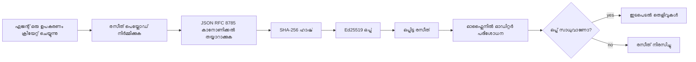
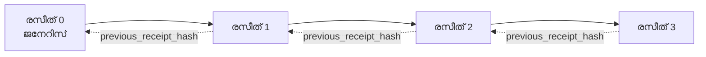

[പാഠം വീഡിയോ കാണുക: ക്രിപ്‌റോഗ്രാഫിക്‌ റസിറ്റുകളുള്ള AI ഏജന്റുകൾ സുരക്ഷിതമാക്കൽ](https://youtu.be/PLACEHOLDER_VIDEO_ID)

> _(പാഠം വീഡിയോയും തുമ്പ്നെയിൽ Microsoft ഉള്ളടക്ക സംഘമാണ് മേഴ്ജിന് ശേഷം ചേർക്കുക, പാഠം 14 / 15 മാതൃകയെ അനുഗമിക്കുന്നതാണിത്.)_

# ക്രിപ്‌റോഗ്രാഫിക്‌ റസിറ്റുകളോടെ AI ഏജന്റുകൾ സുരക്ഷിതമാക്കൽ

## പരിചയം

ഈ പാഠത്തിൽ കിവറി നടക്കുക:

- AI ഏജന്റുകൾക്ക് ഓഡിറ്റ് ട്രയലുകൾ പാലനത്തിനും ഡിബഗിങ്ങിനും വിശ്വാസത്തിനും എന്തുകൊണ്ട് പ്രാധാന്യമുള്ളതാണെന്ന്.
- ക്രിപ്‌റോഗ്രാഫിക്‌ റസീറ്റ് എന്താണെന്നും അത് ഒപ്പിടാത്ത ലോഗ് ലൈൻ നിന്ന് എങ്ങനെ വ്യത്യസ്തമാണെന്നും.
- ഒരേ പൈത്തൺ ഉപയോഗിച്ച് ഏജന്റിന്റെ ടൂൾ കോൾക്ക് ഒപ്പിട്ട റസീറ്റ് എങ്ങനെ തയാറാക്കാമെന്ന്.
- മൊഴിവാളിർപ്പും തകരാറും കണ്ടെത്താൻ ഒഫ്ലൈനായി റസീറ്റ് എങ്ങനെ പരിശോധിക്കാമെന്ന്.
- റസിറ്റുകൾ ഒരു ചങ്ങല പോലെ എങ്ങനെ ബന്ധിപ്പിക്കാമെന്ന്, ഒപ്പം ഒരു റസീറ്റ് നീക്കം ചെയ്യുകയോ ക്രമം മാറ്റുകയോ ചെയ്താൽ ആ ചങ്ങല വിളംബരം ചെയ്യുന്നത്.
- റസിറ്റുകൾ തെളിയിക്കുന്ന കാര്യങ്ങളും അവർ വ്യക്തമാക്കിയില്ലാത്ത കാര്യങ്ങളും എന്താണെന്ന്.

## പഠന ലക്ഷ്യങ്ങൾ

ഈ പാഠം പൂർത്തിയാക്കിയ ശേഷം, നിങ്ങൾക്ക് അറിയാം:

- ഏജന്റ് പ്രവർത്തനങ്ങൾക്ക് ക്രിപ്‌റോഗ്രഫിക് പ്രോവനൻസിന്റെ പ്രേരിപ്പിക്കുന്ന പരാജയ മോഡുകൾ തിരിച്ചറിയുന്നത്.
- കാനോണിക്കൽ JSON പേലോഡിന്റെ മേൽ Ed25519 ഒപ്പിട്ട റസീറ്റ് നിർമ്മിക്കുന്നത്.
- ഒപ്പിട്ടവന്റെ പൊതുചാവിയ ഉപയോഗിച്ച് സ്വതന്ത്രമായി റസീറ്റ് പരിശോധിക്കുന്നതിനെക്കുറിച്ച്.
- മാറ്റം സംഭവിച്ച റസീറ്റ് പരിശോധന വീണ്ടും നടത്തിക്കൊണ്ട് തകരാറു കണ്ടെത്തൽ.
- ഹാഷ്-ചെയിൻ ചെയ്ത റസിറ്റുകളുടെ പരമ്പര നിർമ്മിച്ച് ചങ്ങലയുടെ പ്രാധാന്യം വിശദീകരിക്കുക.
- റസിറ്റുകൾ തെളിയിക്കുന്ന കാര്യമൂല്യങ്ങൾ (അട്രിബ്യൂഷൻ, ഇന്റഗ്രിറ്റി, ഓർഡറിംഗ്) രേഖപ്പെടുത്തുകയും അവ ചെയ്യാത്ത കാര്യങ്ങൾ (പ്രവൃത്തി ശരിയാണെന്ന്, നയത്തിന്റെ ശബ്ദത) തിരിച്ചറിയുക.

## പ്രശ്നം: നിങ്ങളുടെ ഏജന്റിന്റെ ഓഡിറ്റ് ട്രയൽ

Contoso Travel ന്റെ വേണ്ടി നിങ്ങൾ ഒരു AI ഏജന്റ് വിന്യസിച്ചിരിക്കുന്നു അനുസരിച്ച് കരുതുക. ഏജന്റ് ഉപഭോക്തൃ അഭ്യർത്ഥനകൾ വായിച്ച്, ഫ്‌ളൈറ്റ്സ് API വിളിച്ച് ഓപ്ഷനുകൾ പരിശോധിക്കുന്നു, ഉപഭോക്താവിന് സീറ്റുകൾ ബുക്ക് ചെയ്യുന്നു. കഴിഞ്ഞ പാദത്തിൽ ഏജന്റ് 50,000 ബുക്കിങ്ങുകൾ പ്രക്രിയ ചെയ്തു.

ഇന്നസ്റ്റ് ഒരു ഓഡിറ്റർ എത്തുന്നു. അവർ ഒരു ലളിതമായ ചോദ്യം ചോദിക്കുന്നു: "നിങ്ങളുടെ ഏജന്റ് എന്തു ചെയ്തു എന്നും കാണിക്കൂ."

നിങ്ങൾ ലോഗ് ഫയലുകൾ കൈമാറുന്നു. ഓഡിറ്റർ അവ നോക്കി ചോദിക്കുന്നു: "ഇവ എഡിറ്റുചെയ്തതല്ലെന്ന് എങ്ങനെ ഉറപ്പാകണം?"

ഇതാണ് ഓഡിറ്റ്-ട്രെയിൽ പ്രശ്നം. പല ഏജന്റ് വിന്യാസങ്ങളും ഇപ്പോൾ ആശ്രയിക്കുന്നു:

- **അപ്ലിക്കേഷൻ ലോഗുകൾ**: ഏജന്റിന്റെ സ്വന്തമായുള്ളത്, ഫയൽ-സിസ്റ്റം പ്രവേശനം ഉള്ള ആരും എഡിറ്റ് ചെയ്യാവുന്നതാണ്.
- **ക്ലൗഡ് ലോഗിംഗ് സർവീസുകൾ**: പ്ലാറ്റ്ഫോം തലത്തിൽ തകരാറുകൾ തെളിവ് കാണിക്കുന്നതാണ്, പക്ഷേ ഓഡിറ്റർ പ്ലാറ്റ്ഫോം പ്രവർത്തകനെ വിശ്വസിച്ചിരിക്കണം.
- **ഡേറ്റാബേസ് ട്രാൻസാക്ഷൻ ലോഗുകൾ**: ഡേറ്റാബേസിലെ മാറ്റങ്ങൾക്ക് അനുയോജ്യം, എന്നാൽ യാതൊരു ടൂൾ കോൾസിനുംയോഗ്യമല്ല.

ഓഡിറ്ററുടെ ചോദ്യം മറുപടി നൽകാതെ നിശ്ചയിച്ചുള്ള വിശ്വാസം (നിങ്ങൾ, ക്ലൗഡ് പ്രൊവൈഡർ, ഡേറ്റാബേസ് വിൽപ്പനക്കാരൻ) ആവശ്യമാണ്. ആഭ്യന്തര ഉപയോഗത്തിനായി ഇത് സാധ്യമാണ്.നിയന്ത്രിത ജോലി (ഫിനാൻസ്, ഹെൽത്ത്‌കെയർ, EU AI നിയമം ബാധിക്കുന്ന കാര്യങ്ങൾ) ആണെങ്കിൽ, അനുവദനീയമല്ല.

ക്രിപ്‌റോഗ്രാഫിക് റസിറ്റുകൾ ഏജന്റിന്റെ ഓരോ പ്രവർത്തനവും സ്വതന്ത്രമായി പരിശോദിക്കാൻ സഹായിക്കുകയും ഓഡിറ്റർ നിങ്ങളുടെ വിശ്വാസം ആവശ്യമില്ലാതെ പൊതു ചാവിയും റസീറ്റ് സ്വയം മാത്രം ആവശ്യപ്പെടുകയും ചെയ്യുന്നു.

## ക്രിപ്‌റോഗ്രാഫിക് റസീറ്റ് എന്നത് എന്താണു?

ഒരു റസീറ്റ് ഒരു JSON ഒബ്ജക്റ്റാണ്, ഏജന്റ് എന്തു ചെയ്തു എന്നതിന്റെ രേഖപ്പെടുത്തൽ, ഡിജിറ്റൽ ഒപ്പുമായി ഒപ്പിട്ടത്.



ഒരു ഏറ്റവും ലളിതമായ റസീറ്റ് ഇപ്രകാരമാണ്:

```json
{
  "type": "agent.tool_call.v1",
  "agent_id": "contoso-travel-bot",
  "tool_name": "lookup_flights",
  "tool_args_hash": "sha256:a3f9c1...",
  "result_hash": "sha256:7b2e1d...",
  "policy_id": "contoso-travel-policy-v3",
  "timestamp": "2026-04-25T14:30:00Z",
  "sequence": 47,
  "previous_receipt_hash": "sha256:9d4e6a...",
  "signature": {
    "alg": "EdDSA",
    "sig": "c5af83...",
    "public_key": "8f3b2c..."
  }
}
```

മൂന്ന് ഗുണങ്ങൾ പ്രവർത്തനം നടത്തുന്നു:

1. **ഒപ്പ്**. ഏജന്റിന്റെ ഗേറ്റ്‌വേ Ed25519 സ്വകാര്യകീ ഉപയോഗിച്ച് റസീറ്റ് ഒപ്പ് വെയ്ക്കുന്നു. പൊതു കീ ഉപയോഗിക്കുന്ന ഏത് ആൾക്കും ഒപ്പ് ഓഫ്ലൈനിൽ പരിശോധിക്കാവുന്നതാണ്. ഏത് ഫീൽഡും തകരാറു വരുത്തുകയാണെങ്കിൽ ഒപ്പ് അസാധുവാകും.

2. **കാനോണിക്കൽ എൻകോഡിങ്**. ഒപ്പ് വെച്ചതിന് മുമ്പ്, JSON കാനോണിക്കൽസേഷൻ സ്‌കീം (JCS, RFC 8785) ഉപയോഗിച്ച് റസീറ്റ് സീരിയലൈസ് ചെയ്യുന്നു. ഇത് ഒരേ ലജിക്കൽ റസീറ്റ് നിർമ്മിക്കുന്ന രണ്ട് നടപ്പാക്കലുകളും ബൈറ്റ്-ഐഡന്റിക്കൽ പുറംപ്പുല്ല് ഉണ്ടാക്കും. കാനോണലൈസേഷൻ ഇല്ലാത്തപക്ഷം വ്യത്യസ്ത JSON സീരിയലൈസറുകൾ ഒന്നിന്റെ ഉള്ളടക്കം ഒപ്പിടുമ്പോൾ വ്യത്യസ്ത ഒപ്പുകൾ നിർമ്മിക്കുമെന്ന് വരും.

3. **ഹാഷ്‌ ചെയിനിംഗ്**. `previous_receipt_hash` ഫീൽഡ് ഓരോ റസിറ്റിനെയും മുൻപുള്ള റസിറ്റുമായി ബന്ധിപ്പിക്കുന്നു. ഒരു റസീറ്റ് നീക്കം ചെയ്‌താൽ അല്ലെങ്കിൽ ക്രമം മാറ്റിയാൽ അന്നാത്ത അവയിലുള്ള എല്ലാ റസിറ്റുകളും തകരും. തകരാറ് സാഞ്ചൽ തലത്തിൽ തന്നെ ദൃശ്യമായിരിക്കും, ഒരു ഒറ്റ ഒപ്പ് മറികടക്കിയും.

ഈ ഗുണങ്ങൾ ചേർന്ന് മൂന്ന് ഉറപ്പുകൾ നൽകുന്നു:

- **അട്രിബ്യൂഷൻ**: ഈ കീ ഈ ഉള്ളടക്കം ഒപ്പിട്ടതാണ്.
- **ഇന്റഗ്രിറ്റി**: ഒപ്പ് വെച്ച ശേഷം ഉള്ളടക്കം മാറ്റപ്പെട്ടിട്ടില്ല.
- **ഓർഡറിംഗ്**: ഈ റസീറ്റ് ആ റസിറ്റിന് ശേഷം വന്നതാണ്.

## Python ൽ റസീറ്റ് എങ്ങനെ നിർമ്മിക്കാം

റസീറ്റ് നിർമ്മിക്കാൻ പ്രത്യേക ലൈബ്രറി ആവശ്യമില്ല. ക്രിപ്‌റോഗ്രാഫിക് പ്രിമിറ്റീവുകൾ വ്യാപകമായി ലഭ്യവും ലജിക് കുറച്ച് പൈത്തൺ ലൈനുകൾ മാത്രം ആണ്.

`code_samples/18-signed-receipts.ipynb` എന്ന ഹൈബ്രിഡ് പരിശീലനങ്ങളിൽ മുഴുവൻ പ്രവൃത്തി വിശദമായി കാണാം. സാരാംശം:

```python
import json
import hashlib
import base64
from nacl import signing
from jcs import canonicalize  # RFC 8785 കാനോണിക്കൽ JSON

def b64url_nopad(data: bytes) -> str:
    return base64.urlsafe_b64encode(data).decode("ascii").rstrip("=")

def sha256_canonical(obj) -> str:
    """SHA-256 of a Python object's JCS-canonical JSON form."""
    return f"sha256:{hashlib.sha256(canonicalize(obj)).hexdigest()}"

# ഒപ്പിടാനുള്ള കീ സൃഷ്ടിക്കുക അല്ലെങ്കിൽ ലോഡ് ചെയ്യുക (പ്രൊഡക്ഷനിൽ, കീ വോൾട്ടിൽ സൂക്ഷിക്കുക)
signing_key = signing.SigningKey.generate()
verify_key = signing_key.verify_key

# രസീത് പേലോഡ് നിർമ്മിക്കുക (ഇതുവരെ ഒപ്പില്ല)
tool_args = {"origin": "SYD", "destination": "LAX"}
tool_result = [{"flight": "QF11", "price": 1850, "stops": 0}]

payload = {
    "type": "agent.tool_call.v1",
    "agent_id": "contoso-travel-bot",
    "tool_name": "lookup_flights",
    "tool_args_hash": sha256_canonical(tool_args),
    "result_hash": sha256_canonical(tool_result),
    "policy_id": "contoso-travel-policy-v3",
    "timestamp": "2026-04-25T14:30:00Z",
    "sequence": 0,
    "previous_receipt_hash": None,
}

# കാനോണിക്കൽ രൂപം നൽകി, ഹാഷ് ചെയ്ത്, ഒപ്പ് വെയ്ക്കുക.
canonical_bytes = canonicalize(payload)
message_hash = hashlib.sha256(canonical_bytes).digest()
signature_bytes = signing_key.sign(message_hash).signature

# ഘടനയിലുള്ള ഒപ്പ് объജക്റ്റ് ചേർക്കുക.
receipt = {
    **payload,
    "signature": {
        "alg": "EdDSA",
        "sig": b64url_nopad(signature_bytes),
        "public_key": b64url_nopad(bytes(verify_key)),
    },
}
```

ഇതായിരുന്നു ഒപ്പിടൽ പൈപ്പ്ലൈൻ മുഴുവൻ. നോട്ട്ബുക്ക് പ്രമാണത്തിലെ വ്യായാമങ്ങൾ ഓരോ ഘട്ടവും വിശദീകരിക്കുന്നു.

## റസീറ്റ് പരിശോധിക്കുകയും തകരാറ് കണ്ടെത്തലും

പരിശോധന ഒരു വിപരീത പ്രവർത്തനം ആണ്:

```python
import base64
import hashlib
from nacl import signing
from nacl.exceptions import BadSignatureError
from jcs import canonicalize

def b64url_decode(s: str) -> bytes:
    padding = "=" * ((4 - len(s) % 4) % 4)
    return base64.urlsafe_b64decode(s + padding)

def verify_receipt(receipt: dict) -> bool:
    # സിഗ്നേചർ ഒരു ഘടനാപരമായ വസ്തുവാണ്: {"alg", "sig", "public_key"}.
    sig_obj = receipt.get("signature")
    if not sig_obj or sig_obj.get("alg") != "EdDSA":
        return False

    # യഥാർത്ഥത്തിൽ ഒപ്പിട്ട പെയ്ലോഡ് പുനരുദ്ധരിക്കുക (സിഗ്നേചർ ഒഴികെയുള്ള എല്ലാം).
    payload = {k: v for k, v in receipt.items() if k != "signature"}

    canonical_bytes = canonicalize(payload)
    message_hash = hashlib.sha256(canonical_bytes).digest()

    try:
        verify_key = signing.VerifyKey(b64url_decode(sig_obj["public_key"]))
        verify_key.verify(message_hash, b64url_decode(sig_obj["sig"]))
        return True
    except BadSignatureError:
        return False
```

ഈ ഫങ്ഷൻ റസീറ്റ് സ്വീകരിച്ചും ഒപ്പ് ശരിയെങ്കിൽ `True` മടങ്ങിയും അല്ലെങ്കിൽ `False`. നെറ്റ്‌വർക്ക് കോൾ ഇല്ല, സർവീസ് ആശ്രയം ഇല്ല, മൂന്നാംപാർട്ടി വിശ്വാസം ആവശ്യമില്ല.

തകരാറ് കണ്ടെത്തൽ പ്രവർത്തനത്തിൽ കാണാൻ, നോട്ട്ബുക്ക് കാണിക്കുന്നു:

1. സാധുവായ ഒരു റസീറ്റ് ഉണ്ടാക്കി പരിശോധിക്കും.
2. `tool_args_hash` ഫീൽഡിലെ ഒറ്റ ബൈറ്റ് മാറ്റി.
3. വീണ്ടും പരിശോധിച്ച് പരാജയപ്പെടുന്നത് കാണും.

ഇതു പ്രയോഗ പ്രകാശനം നൽകുന്നു, റസിറ്റുകൾ തകരാറില്ലാത്തത് തെളിയിക്കുന്നു: ചെറുതോ വലുതോ ഉള്ള മാറ്റം ഒപ്പിനെ തകരാറാക്കും.

## ഒന്നിലധികം ഘട്ടങ്ങളുള്ള ഏജന്റിന് റസിറ്റുകൾ ബന്ധിപ്പിക്കൽ

ഒരു ഒറ്റ ഒപ്പിട്ട റസീറ്റ് ഒറ്റ പ്രവർത്തനം സംരക്ഷിക്കുന്നു. റസിറ്റുകളുടെ ചങ്ങല ഒരു പരമ്പര സംരക്ഷിക്കുന്നു.



ഒരൊറ്റ റസീറ്റ് മുൻപുള്ള റസിറ്റിന്റെ ഹാഷ് രേഖപ്പെടുത്തുന്നു. രണ്ടാം റസീറ്റ് ചുരുക്കാതെ നീക്കംചെയ്യാൻ ആക്രമി താഴെ ചേരേണ്ടതാണ്:

- റസീറ്റ് 3-ന്റെ `previous_receipt_hash` ഫീൽഡ് ആണ് മാറാൻ (റസീറ്റ് 3-ന്റെ ഒപ്പ് തകരും), അല്ലെങ്കിൽ
- മാറ്റം വന്ന റസീറ്റ് 3-ൽ പുതിയ ഒപ്പ് കെട്ടിപ്പടുക്കുക (ഏജന്റിന്റെ സ്വകാര്യ കീ ആവശ്യമാണ്).

സ്വകാര്യ കീ ഹാർഡ്‌വെയർ കീ വോൾട്ടിൽ സ്റ്റോർ ചെയ്‌തിട്ടും പൊതുചാവി ഓരോ റസിറ്റിലും പ്രസിദ്ധീകരിച്ചാലും, ഈ ആക്രമണങ്ങൾ കണ്ടുപിടിക്കാതെ നടക്കാനാകില്ല.

നോട്ട്പുക്കിൽ കാണിക്കുക:

1. മൂന്ന് റസിറ്റുകളുള്ള ഒരു ചങ്ങല നിർമ്മിക്കുക.
2. ഓരോ റസിറ്റിന്റെയും `previous_receipt_hash` മുൻപുള്ള റസിറ്റിന്റെ യഥാർത്ഥ ഹാഷുമായി പൊരുത്തപ്പെടുന്നത് പരിശോധിക്കുക.
3. ഇടയ്ക്കുള്ള ഒരു റസീറ്റ് തകരാറടിക്കുക, ചങ്ങല thatzelfde  സ്ഥാനത്ത് തകരുന്നൂ കാണുക.

ഇതാണ് ഒരു ബാഹ്യ ഓഡിറ്റർ നിങ്ങളിൽ വിശ്വാസം വെക്കാതെ ഓഡിറ്റ് ട്രയൽ പരിശോധിക്കാനും സാധിക്കുന്ന വിധം.

## റസിറ്റുകൾ തെളിയിക്കുന്നതും (തൊഴയുണ്ടാകാത്തതും)

ഇതാണ് പാഠത്തിലെ ഏറ്റവും പ്രധാന അവസ്ഥ. റസിറ്റുകളുടെ ശക്തി ഉണ്ട്, എന്നാൽ അതിന് അതി സ്വന്തമാണ്.

**റസിറ്റുകൾ തെളിയിക്കുന്നത് മൂന്ന് കാര്യങ്ങൾ ആണ്:**

1. **അട്രിബ്യൂഷൻ**: ഒരു പ്രത്യേക കീ വ്യക്തമായി ഒപ്പിട്ടപേലോഡ്.
2. **ഇന്റഗ്രിറ്റി**: ഒപ്പിട്ട ശേഷം പെയ്ലോഡിൽ മാറ്റം വന്നിട്ടില്ല.
3. **ഓർഡറിംഗ്**: ഈ റസീറ്റ് ആ റസിറ്റിന് ശേഷം ഹാഷ് ചങ്ങലയിൽ വന്നു.

**റസിറ്റുകൾ തെളിയിക്കാത്തത്:**

1. **ശരിയായ പ്രവർത്തനം**: ഏജന്റിന്റെയോ പ്രവർത്തനം ശരിയാണെന്ന് അല്ലാതെയോ. തെറ്റായ ഉത്തരം പോലും ശരിയായതു പോലെ ഒപ്പിട്ട് കഴിയാം.
2. **നയം പാലിക്കൽ**: `policy_id` ൽ സൂചിപ്പിച്ച നയം വിലയിരുത്തപ്പെട്ടു എന്നു അല്ലെങ്കിൽ ഒരു പ്രവൃത്തി അനുവദിക്കുമെന്ന് ഉറപ്പില്ല. റസീറ്റ് രേഖപ്പെടുത്തുന്നത് തെറ്റായ അവകാശവാദം ആയിരിക്കും, നിർബന്ധമല്ല.
3. **കീയ്ക്ക് മുകളിൽ തിരിച്ചറിയൽ**: "ഈ കീ ഈ ഉള്ളടക്കം ഒപ്പിട്ടു" എന്നു മാത്രമാണ്. "ഈ മനുഷ്യൻ ഇതിനു അനുമതി നൽകി" എന്ന് കുറിച്ചുമാണ്. വ്യക്തിയോ സംഘടനയോടുള്ള കീ ബന്ധിപ്പിക്കൽ വേറൊരു തിരിച്ചറിയൽ സംവിധാനമാണ് ആവശ്യമായതെന്ന് (ഡയറക്ടറി, പൊതു കീ രജിസ്റ്ററി).
4. **ഇൻപുട്ടുകളുടെ സത്യസന്ധത**: ഏജന്റ് ചോദ്യം പോലും നിയന്ത്രണം ചെയ്യപ്പെട്ട പ്രോംപ്റ്റ് നെ ഏറ്റെടുക്കുകയും പ്രവർത്തിക്കുകയും ചെയ്താൽ, റസീറ്റ് പ്രവർത്തനം വിശ്വസ്തമായി രേഖപ്പെടുത്തും. റസിറ്റുകൾ ഇൻപുട്ട് പൂർവ്വപരിശോധനയുടെ താഴ്വാരത്തിലെ വരുത്തുക, അതിന്റെ പകരം അല്ല.

ഈ അതിരുവിവരം രണ്ട് കാരണങ്ങൾ കൊണ്ട് പ്രധാനമാണ്:

- റസിറ്റുകൾ എന്തിന് ഉദ്ദേശിച്ചോതുള്ളത് (ഏജന്റ് പെരുമാറ്റം ഓഡിറ്റ് ചെയ്യാവുന്നതും തകരാറില്ലാത്തതും, സംഘടനാതല പരിധികൾ കടക്കുമ്പോഴും) വെളിപ്പെടുത്തുന്നു.
- നിങ്ങൾക്ക് കൂടി ആവശ്യമുള്ള മറ്റ് ഘട്ടങ്ങൾ (ഇൻപുട്ട് പരിശോധന - പാഠം 6, നയം നടപ്പാക്കൽ - താഴെ പ്രതിപാദിച്ചത്, തിരിച്ചറിയൽ സംവിധാനം - ഈ പാഠത്തിന്റെ പരിധിയിലല്ല) വ്യക്തമാകുന്നു.

ഏകദേശം തെറ്റായി കരുതാറുണ്ട് "റസിറ്റുകൾ ഉണ്ട്" എന്നത് "നാം നിയന്ത്രണത്തിലുള്ളവരാണ്" എന്നാണെന്ന്. അത് അല്ല. റസിറ്റുകൾ ഒരു അടിസ്ഥാനം മാത്രമാണ്. നിയന്ത്രണം നിങ്ങൾ നിർമ്മിക്കുന്ന സംവിധാനമാണ്.

## പ്രൊഡക്ഷൻ റഫറൻസുകൾ

ഈ പാഠത്തിലെ പൈത്തൺ കോഡ് അതിന്റേതായി ലളിതമാണ്, ഓരോ വരിയും വായിച്ചും എന്താണെന്ന് മനസ്സിലാക്കാൻ. പ്രൊഡക്ഷനിൽ നിങ്ങളുടെ രണ്ട് ഓപ്ഷനുകൾ ഉണ്ട്:

1. **ക്രിപ്‌റോഗ്രാഫിക് പ്രിമിറ്റീവ് നേരിട്ട് ഉപയോഗിക്കുക.** മുകളിൽ കാണിച്ച 50 വരികൾ പല ഉപയോഗത്തിനും മതിയാകും. PyNaCl (Ed25519) ഉം `jcs` പാക്കേജ് (കാനോണിക്കൽ JSON) ഉം നന്നായി പരിപാലിതവും ഓഡിറ്റ് ചെയ്ത ലൈബ്രറികളും.

2. **പ്രൊഡക്ഷൻ റസീറ്റ് ലൈബ്രറി ഉപയോഗിക്കുക.** ചില ഓപ്പൺ സോഴ്‌സ് പ്രോജക്റ്റുകൾ ചേർത്ത്Key rotation, ബാച്ച് പരിശോധന, JWK സെറ്റ് വിതരണം, നയ എഞ്ചിനുമായി സംയോജനം പോലുള്ള അധിക ഫീച്ചറുകൾ നൽകുന്നു:
   - ഈ പാഠം വഴി ഉപയോഗിക്കുന്ന റസീറ്റ് ഫോർമാറ്റ് IETF Internet-Draft (`draft-farley-acta-signed-receipts`) ആണ്, നിലവിൽ സ്റ്റാൻഡേർഡ്സ് പ്രക്രിയയിൽ.
   - Microsoft Agent Governance Toolkit Cedar അടിസ്ഥാന നയ തീരുമാനങ്ങൾ ഉൾപ്പെടുത്തിയൊടു റസിറ്റുകൾ സൃഷ്ടിക്കുന്നു; ആ റെപ്പോസിറ്ററിയിലെ ട്യൂട്ടോറിയൽ 33 മുഴുവൻ ഉദാഹരണം.
   - `protect-mcp` (npm) & `@veritasacta/verify` (npm) പാക്കേജുകൾ Node അടിസ്ഥാന റസീറ്റ് ഒപ്പ് വയ്ക്കലും ഒഫ്ലൈൻ പരിശോധനയും നടത്തുന്നു, MCP സർവർ തകർപ്പനിരോധിത ഓഡിറ്റ് ട്രെയിൽ നൽകുന്നതിന്.
   - **[nobulex](https://github.com/arian-gogani/nobulex)** Python SDK (`pip install nobulex`) Ed25519 + JCS ഒപ്പ് നമൂനകൾ LangChain & CrewAI ഇന്റഗ്രേഷനുകളും പുറത്തുവിട്ട ക്രോസ്-വാലിഡേഷൻ ടെസ്റ്റ് വെക്ടറുകളും OWASP PR #2210 വഴി നൽകിയ പാലന മാപ്പിംഗും ഉൾപ്പെടുന്നു.

സ്വന്തമായി ലൈബ്രറി എഴുതി ഉപയോഗിക്കുന്നതും പരീക്ഷിച്ച JWT ലൈബ്രറി ഉപയോഗിക്കുന്നതുമായ താളങ്ങൾ തമ്മിലുള്ള വ്യത്യാനം അനുരൂപമാണ്: രണ്ടും നീതിയാണ്; ലൈബ്രറി സമയം ലാഭിക്കുകയും ഓഡിറ്റ് വിസ്തൃതി കുറയ്ക്കുകയും ചെയ്യുന്നു; നേരിട്ട് നിര്‍മിക്കുന്നത് എല്ലാ പ്രിമിറ്റീവുകൾ മനസ്സിലാക്കുന്നത് ആവശ്യമാകുമല്ലോ. ഈ പാഠം നിങ്ങളെ പ്രയാസമില്ലാതെയല്ലാതെ യഥാർത്ഥമായി ഫൗണ്ടേഷൻ ഉറപ്പാക്കാൻ അനുവദിക്കുന്നു.

## അറിവ് പരിശോധന

പ്രായോഗിക വ്യായാമത്തിലേക്ക് മുന്നോട്ട് പോകുന്നതിനു മുൻപ് നിങ്ങളുടെ മനസ്സ് പരീക്ഷിക്കുക.

**1. ഒരു റസീറ്റ് ഏജന്റിന്റെ സ്വകാര്യ Ed25519 കീ ഉപയോഗിച്ച് ഒപ്പിട്ടതാണ്. ഓഡിറ്ററിന് പൊതു കീ മാത്രമേ ഉണ്ടാകൂ. ഓഡിറ്റർ റസീറ്റ് ഓഫ്‌ലൈൻ പരിശോധിക്കാനാകുമോ?**

<details>
<summary>ഉത്തരം</summary>

ഉം. Ed25519 പരിശോധനയ്ക്ക് പൊതു കീയും ഒപ്പിട്ട ബൈറ്റ്സും മാത്രം ആവശ്യമാണ്. നെറ്റ്‌വർക്ക് ആവശ്യകതയില്ല, സേവന ആശ്രയം ഇല്ല. ഇത് റസിറ്റുകൾ എയർ-ഗ്യാപ് ചെയ്ത, ബഹുസംഘടന, കുറഞ്ഞ വിശ്വാസമുള്ള ഓഡിറ്റ് പരിസരങ്ങളിൽ ഉപയോഗപ്രദമാക്കുന്നു.
</details>

**2. ഒരു ആക്രമി ഒരു റസീറ്റിന്റെ `policy_id` ഫീൽഡ് മാറ്റിയാണ് കൂടുതൽ അനുമതিপ്രദമായ നയം ആരോപിക്കാൻ. ഒപ്പിട്ടവൻ യഥാർത്ഥ പേലോഡിനാണ്. പരിശോധനയിൽ എന്താകും സംഭവിക്കുക?**

<details>
<summary>ഉത്തരം</summary>

പരിശോധന പരാജയപ്പെടും. ഒപ്പ് യഥാർത്ഥ പേലോഡിന്റെ കാനോണിക്കൽ ബൈറ്റ്സിനെ അടിസ്ഥാനമാക്കിയാണ്. ഏത് ഫീൽഡും മാറ്റിയാൽ കാനോണിക്കൽ ബൈറ്റ്സ് മാറും, അതോടെ SHA-256 ഹാഷും മാറും, ഒപ്പ് അസാധുവാകും. പുതിയ സാധുവായ ഒപ്പ് നിർമ്മിക്കാൻ സ്വകാര്യ കീ ആവശ്യമാണ്, അത് ആക്രമിക്ക് ലഭ്യമല്ല.
</details>

**3. raw arguments & results-നു പകരം `tool_args_hash` & `result_hash` ഉൾപ്പെട്ടതിനു കാരണം എന്ത്?**

<details>
<summary>ഉത്തരം</summary>

രണ്ടു കാരണം. ആദ്യമായി, റസീറ്റ് സാങ്കേതികമായി സൂക്ഷിക്കുകയോ പരിവഹിക്കാൻ പറ്റിയതോ ആയതിനാൽ കയറ്റുമതി ചെയ്യുമ്പോൾ പരസ്യം കൃത്യമായ വിവരങ്ങൾ (PII, ബിസിനസ് ഡാറ്റ) പുറത്ത് പോകുന്നതായി പരിമിതപ്പെടുത്താനാകും. ഹാഷ് ഉപയോഗിക്കുന്നതുകൊണ്ട് റസീറ്റ് ചെറിയതും ഉള്ളടക്കം സ്വകാര്യവുമാകുന്നു; ഓഡിറ്റർ ഹാഷ് യഥാർത്ഥ ഉള്ളടക്കം സൂക്ഷിച്ച കോപ്പിയുമായി പൊരുത്തപ്പെടുത്തുന്നു. രണ്ടാമത്, ഹാഷുകൾ സ്ഥിര തരം വലുപ്പത്തിലുള്ളവയാണ്; ഹാഷുകൾ ഉള്ള റസീറ്റ് സൈസ് എത്ര വലിയ തരത്തിലാണ് arguments & result ഉള്ളാലും നിയന്ത്രിക്കപ്പെട്ടതാകുന്നു.
</details>

**4. `previous_receipt_hash` ഫീൽഡ് ഏതു റസീറ്റും മുൻപ് വന്ന റസീറ്റ്‌ ബന്ധിപ്പിക്കുന്നു. ഒരു ആക്രമി ഒരു റസീറ്റ് മധ്യേ നിന്ന് മറവിയോടെ നീക്കം ചെയ്യുമെങ്കിൽ ഏതു റസീറ്റ് അസാധുവാകും?**

<details>
<summary>ഉത്തരം</summary>

ഇടക്കുള്ള റസീറ്റ് നീക്കം ചെയ്തതിനു ശേഷമുള്ള എല്ലാ റസിറ്റുകളും അസാധുവാകും. അവരുടെ `previous_receipt_hash` ഫീൽഡുകൾ യഥാർത്ഥ ചങ്ങലക്ക് പൊരുത്തപ്പെട്ടിരിക്കില്ല (അവ കാണിച്ചിരുന്ന റസീറ്റ് ഇനി ഇല്ല, അല്ലെങ്കിൽ ചങ്ങല වෙනൊരു മുൻപ് വന്നിടത്തെക്കു പോയി). നീക്കം മറയ്ക്കാൻ ആക്രമിക്ക് എല്ലാ പുതിയ റസിറ്റുകളും വീണ്ടും ഒപ്പിടേണ്ടി വരും, അതിന് സ്വകാര്യ കീ വേണം.
</details>

**5. ഒരു റസീറ്റ് നല്ലവിധം പരിശോധന കഴിഞ്ഞു. അത് ഏജന്റിന്റെ പ്രവർത്തനം ശരിയാണെന്ന്, ശബ്ദമാണെന്ന്, നയം പാലിച്ചിട്ടുണ്ടെന്ന് തെളിയിക്കുന്നുവോ?**

<details>
<summary>ഉത്തരം</summary>

അതല്ല. ഒരു സാധുവായ റസീറ്റ് മൂന്ന് കാര്യങ്ങൾ തെളിയിക്കുന്നു: അട്രിബ്യൂഷൻ (ഈ കീ ഈ ഉള്ളടക്കം ഒപ്പിട്ടു), ഇന്റഗ്രിറ്റി (ഉള്ളടക്കം മാറ്റപ്പെട്ടിട്ടില്ല), ഓർഡറിംഗ് (ഈ റസീറ്റ് ആ റസിറ്റിന് ശേഷം ഹാഷ് ചങ്ങലയിൽ വന്നു). പ്രവർത്തനം ശരിയാണെന്ന്, `policy_id` ൽ സൂചിപ്പിച്ച നയം വിലയിരുത്തപ്പെട്ടതോ, ഏജന്റ് എല്ലാ നിയമങ്ങളും പാലിച്ചതോ യാതൊരു തെളിവും ഇത് നൽകുന്നില്ല. റസിറ്റുകൾ ഏജന്റ് പെരുമാറ്റം ഓഡിറ്റ് ചെയ്യാവുന്നതാക്കുന്നു, ശരിയാക്കുന്നില്ല. പാഠത്തിലെ ഏറ്റവും പ്രധാനമാകുന്ന അതിരുവിവരം ഇത് ആണ്.
</details>

## പ്രാക്ടീസ് വ്യായാമം

`code_samples/18-signed-receipts.ipynb` തുറന്ന് എല്ലാ നാല് വിഭാഗങ്ങളും പൂർത്തിയാക്കുക:

1. **വിഭാഗം 1**: ആദ്യ റസീറ്റ് ഒപ്പിട്ടും പരിശോധിക്കുകയും ചെയ്യുക.
2. **വിഭാഗം 2**: റസീറ്റ് തകരാറടച്ചും പരിശോധിക്കൽ പരാജയം സാക്ഷാത്കരിക്കുക.
3. **വിഭാഗം 3**: മൂന്നു റസിറ്റുകളുടെ ചങ്ങല നിർമ്മിച്ച് ചങ്ങൽ ഇന്റഗ്രിറ്റി പരിശോധിക്കുക.
4. **വിഭാഗം 4**: Microsoft Agent Framework ഉപയോഗിച്ച് നിർമ്മിച്ച ഏജന്റിനായി ഈ മാതൃക പ്രയോഗിക്കുക: ഒരു ടൂൾ കോൾ റസീറ്റ് ഒപ്പിട്ടവയിൽ ഇടുക, തുടർന്ന് റസീറ്റ് സ്വതന്ത്രമായി പരിശോധിക്കുക.
**സ്റ്റ്രെച്ച് ചലഞ്ച് 1:** ഒരു റിസിറ്റിൽ നിങ്ങളുടെ തങ്ങളുടെ ഒരു അധിക ഫീൽഡ് (ഉദാഹരണംക്ക്, ട്രേസിംഗിനായി ഒരു റിക്വസ്റ്റ് ഐഡി) ചേർക്കുക, കാനോണിക്കൽ സൈൻ ചെയ്യൽ ലോജിക് അതിൽ ഉൾപ്പെടുത്തുന്നതിനായി അപ്ഡേറ്റ് ചെയ്യുക, റിസീറ്റ് ഇപ്പോഴും വേറിഫിക്കേഷൻ വഴി റൗണ്ട്-ട്രിപ്പ് ചെയ്യുന്നുണ്ടെന്ന് സ്ഥിരീകരിക്കുക. ശേഷം സൈൻ ചെയ്തതിനു ശേഷം ഫീൽഡ് മോദിഫൈ ചെയ്ത് വേറിഫിക്കേഷൻ പരാജയപ്പെടുന്നതായി സ്ഥിരീകരിക്കുക. കാനോണിക്കൽ എങ്കോഡിംഗിന്റെ ഓരോ ബൈറ്റും സിഗ്നേചറിന് എങ്ങനെ സംഭാവന ചെയ്യുന്നുവെന്ന് മനസിലാക്കാൻ ഇത് സഹായിക്കുന്നു.

**സ്റ്റ്രെച്ച് ചലഞ്ച് 2:** നിങ്ങളുടെ രണ്ട് റിസിറ്റുകൾ SHA-256 ചെരിയ്ക്കുക (അവയുടെ കാനോണിക്കൽ ബൈറ്റുകൾ നിർണ്ണായകമായ ക്രമത്തിൽ ബന്ധിപ്പിക്കുക) ഒപ്പം ചൊറിയുന്ന ഡൈജസ്റ്റ് മൂന്നാമത്തെ റിസീറ്റിൽ ഒരു പുതിയ ഫീൽഡായി സെറ്റ് ചെയ്യുക, പിന്നീട് സൈൻ ചെയ്യുക. മൂന്ന് റിസിറ്റുകളും ഇപ്പോഴും റൗണ്ട്-ട്രിപ്പ് ചെയ്യുന്നതായി സ്ഥിരീകരിക്കുക. നിങ്ങൾ ഒരുപടി ഉൾപ്പെടുത്തൽ പ്രൂഫ് നിർമ്മിച്ചിട്ടുണ്ട്: മൂന്നാമത്തെ റിസീറ്റ് കൈവശമുള്ളവർ സൈൻ ചെയ്ത സമയത്ത് ആദ്യ രണ്ട് റിസിറ്റുകൾ നിലവിൽ ഉണ്ടായിരുന്നു എന്ന് തെളിയിക്കാം, അവയുടെ ഉള്ളടക്കം വെളിപ്പെടുത്തേണ്ടതില്ല. ഇങ്ങെയാണ് ന്യൂനമാത്ര തുറമുഖം ഉപയോഗിക്കുന്ന സെലക്റ്റീവ്-ഡിസ്ക്ലോഷർ റിസിറ്റുകൾ വലിയ തോതിൽ പ്രവർത്തിക്കുന്നത് (Merkle കമിറ്റ്മെന്റുകൾ, RFC 6962).

## നിഗമനം

ക്രിപ്റ്റോഗ്രാഫിക് റിസിറ്റുകൾ AI ഏജന്റുകൾക്ക് ഒരു ഓഡിറ്റ് ട്രെയിൽ നൽകുന്നു:

- **സ്വതന്ത്രമായി പരിശോധിക്കാവുന്നതാണ്**: പൊതു കി ഉള്ള ആരും ഇത് പരിശോധിക്കാം, സേവന ആശ്രിതത്വമില്ലാതെ.
- **തട്ടിപ്പു കാണിക്കുന്നതാണ**: മെയിന്‍ഴിയല്‍ വീഴ്ചകളെല്ലാം സിഗ്നേച്ചർ അസാധുവാക്കുന്നു.
- **പോർട്ടബിൾ**: രിസീറ്റ് ഒരു ചെറിയ JSON ഫയൽ ആണ്; അത് സ്റ്റോർ ചെയ്യാനും, ട്രാൻസ്മിറ്റ് ചെയ്യാനും, എവിടെയും പരിശോധിക്കാനും കഴിയും.
- **സ്റ്റാൻഡേർഡുകളുമായി ചേർന്നിരിക്കുന്നത്**: എഡ്25519 (RFC 8032), JCS (RFC 8785), SHA-256 എന്നിവ ഉപയോഗിച്ചാണ് നിർമ്മിച്ചത്, എല്ലാം വ്യാപകമായി പ്രയോഗിക്കപ്പെടുന്ന പ്രിമിറ്റീവുകൾ.

ഇവ ഇൻപുട്ട് വാലിഡേഷൻ, പോളിസി പ്രാവർത്തനം, അല്ലെങ്കിൽ ഐഡന്റിറ്റി ഇൻഫ്രാസ്ട്രക്ചറിന് പകരം വരില്ല. അവ ആ ഫലകങ്ങളുടെ അടിസ്ഥാനമാണ്. നിങ്ങൾ നിയന്ത്രിത പ്രവൃത്തി ഭരിക്കുന്ന ഏജന്റുകളെ വിന്യസിക്കുമ്പോൾ, മൾട്ടി-ഓർഗനൈസേഷൻ വർക്ക്‌ഫ്ലോകളിൽ, അല്ലെങ്കിൽ ഒരു ഭാവിയിലെ ഓഡിറ്റർ നിങ്ങൾക്ക് വിശ്വാസമുണ്ടെന്ന് കരുതാൻ കഴിയാത്ത സാഹചര്യങ്ങളിൽ, റിസിറ്റുകൾ ഓഡിറ്റ് ട്രെയിൽ സത്യസന്ധമാക്കാൻ ഉപയോഗിക്കുന്നു.

മികച്ച നിർദ്ദേശം: റിസിറ്റുകൾ ആരാണ്, എന്ത് പറഞ്ഞു, 언제 എന്ന് തെളിയിക്കുന്നു. പറയുന്ന കാര്യത്തിന്റെ സത്യസന്ധതയോ ശരിയാനോ അല്ല. ആ വ്യത്യാസം കയ്യിലിടുക. അത് ഒരു സത്യസന്ധമായ പ്രൊവനൻസ് സിസ്റ്റവും തെറ്റിദ്ധരിപ്പിക്കുന്നതുമായ ഒറ്റക്കെട്ടിനുള്ള വ്യത്യാസമാണ്.

## പ്രൊഡക്ഷൻ ചെക്ക്ലിസ്റ്റ്

ഈ പാഠത്തിൽ നിന്നു ശരിയായ പാരിസ്ഥിതികത്തിലും റിസീറ്റ്-സൈൻ ചെയ്ത ഏജന്റുകളെ വിന്യസിക്കാൻ നിങ്ങൾ തയ്യാറായാൽ:

- [ ] **ഡവലപ്പർ ലാപ്ടോപ്പിൽ നിന്ന് സൈൻ ചെയ്യൽ കീ നീക്കുക.** Azure Key Vault, AWS KMS, അല്ലെങ്കിൽ ഒരു ഹാർഡ്‌വെയർ സിക്യൂരിറ്റി മോഡ്യൂൾ ഉപയോഗിക്കുക. റിസിറ്റുകൾക്ക് സൈൻ ചെയ്യുന്ന പ്രൈവറ്റ് കീ സോഴ്‌സ് കൺട്രോളിൽ അല്ലെങ്കിൽ ആപ്ലിക്കേഷൻ യന്ത്രങ്ങളിൽ പ്ലെയിൻടെക്സ്‌റ്റിൽ ഒരിക്കലും സൂക്ഷിക്കരുത്.
- [ ] **വെറിഫിക്കേഷൻ പൊതു കീ പ്രസിദ്ധീകരിക്കുക.** ഓഡിറ്റർമാർക്ക് ഓഫ്‌ലൈൻ പരിശോധിക്കാൻ അതിന്റെ ആവശ്യം ഉണ്ട്. സാധാരണ പാറ്റേൺ JWK സെറ്റ് ഒരു അറിയപ്പെട്ട URL-ൽ (RFC 7517), ഉദാഹരണം: `https://your-org.example.com/.well-known/agent-keys.json`.
- [ ] **ചെയിൻ ബാഹ്യമായി ആങ്കർ ചെയ്യുക.** പതിവായി പുതിയ ചെയിൻ ഹെഡ് ഹാഷ് ഒരു ട്രാൻസ്പറൻസി ലോഗിൽ എഴുതുക (Sigstore Rekor, RFC 3161 ടൈംസ്റാമ്പ് അവഥോറിറ്റി, അല്ലെങ്കിൽ ഒരു രണ്ടാം ആഭ്യന്തര സിസ്റ്റം) ഇവിടെ ഒരു ബാഹ്യ പാർട്ടി "ഈ ചെയിൻ ഈ സമയത്ത് ഉണ്ടായിരുന്നു" എന്ന് സ്ഥിരീകരിക്കാനാകും.
- [ ] **റിസിറ്റുകൾ മാറ്റംമുടക്കാതെ സംഭരിക്കുക.** Append-only ബ്ലോബ് സ്റ്റോറേജ് (Azure Storage immutable പോളിസികളോടെ, AWS S3 ഒബ്ജെക്ട് ലോക്ക്) സ്റ്റോറേജ് ലെയറിൽ ഉള്ളിൽക്കാരന് ചരിത്രം പുന:രചിക്കാൻ തടയുന്നു.
- [ ] **റെറ്റൻഷൻ തീരുമാനിക്കുക.** നിരവധി അനുമതികളുള്ള സംവിധാനങ്ങൾക്ക് വിപുലമായ വർഷങ്ങൾക്ക് സൂക്ഷിക്കൽ ആവശ്യമാണ്. റിസീറ്റ് വളർച്ചയ്ക്ക് പദ്ധതിയിടുക (ഒരു റിസീറ്റ് ~500 ബൈറ്റുകൾ എടുക്കുന്നു; ഒരു ഏജന്റ് ദിവസം 10,000 കോൾസ് ചെയ്താൽ വർഷംകിട്ടി ~1.8 ജിബി ഉത്പാദിപ്പിക്കും).
- [ ] **റിസിറ്റുകൾ എന്തെല്ലാം ഉൾക്കൊള്ളുന്നില്ല എന്ന് രേഖപ്പെടുത്തുക.** റിസിറ്റുകൾ തിരിച്ചറിയൽ, ഐണ്ടഗ്രിറ്റി, ഓർഡറിങ് തെളിയിക്കുന്നു. നിങ്ങളുടെ റൺബുക്കിൽ explícit ആയി ലിസ്റ്റ് ചെയ്യുക കൂടാതെ എന്തെല്ലാം നിയന്ത്രണങ്ങൾ (ഇൻപുട്ട് വാലിഡേഷൻ, പോളിസി പ്രാവർത്തനം, റേറ്റ് ലിമിറ്റിങ്, ഐഡന്റിറ്റി ഇൻഫ്രാസ്ട്രക്ചർ) റിസിറ്റുകളിൽ സഹപ്രവർത്തിക്കുന്നു എങ്ങനെ അതിന്റെ നിയന്ത്രണ ഘടകങ്ങളായി.

### AI ഏജന്റുകൾ സുരക്ഷിതമാക്കുന്നതിനെ സംബന്ധിച്ച കൂടുതൽ ചോദ്യങ്ങളുണ്ടോ?

[Microsoft Foundry Discord](https://aka.ms/ai-agents/discord) ൽ ചേർന്നു മറ്റ് വിദ്യാർത്ഥികളുമായി കൂടിക്കാഴ്ച നടത്തൂ, ഓഫീസ് മണിക്കൂറുകളിൽ പങ്കെടുക്കൂ, AI ഏജന്റുകളെ സംബന്ധിച്ച നിങ്ങളുടെ ചോദ്യങ്ങൾക്കെത്തഴ് പറഞ്ഞു വാങ്ങൂ.

## ഈ പാഠത്തിന് മുകളിൽ

ഈ പാഠം സിംഗിൾ-റിസീറ്റ് സൈയ്നിംഗ്, ഹാഷ്-ചെയിൻ സീരീസ് മുക്തമായി ഉൾക്കൊള്ളുന്നു. അതേ പ്രിമിറ്റീവുകൾ അനേകം കൂടുതൽ പുരോഗമന സാമൂഹ്യങ്ങൾ തയാറാക്കുന്നു, നിങ്ങളുടെ ഗവേർണൻസ് ഘടന വളരുമ്പോൾ നിങ്ങൾ കാണാനാകും:

- **സെലക്റ്റീവ് ഡിസ്ക്ലോഷർ.** ഒരു റിസീറ്റിന്റെ ഫീൽഡുകൾ സ്വതന്ത്രമായി കമിറ്റുചെയ്‌തിരിക്കുന്നപ്പോൾ (RFC 6962-Style Merkle ട്രീ), നിങ്ങള് ചില നിർദ്ദിഷ്ട ഫീൽഡുകൾ ആഡിറ്റർമാർക്ക് കാണിച്ചുതരാനും മറ്റുള്ളവകൾ മാറ്റമില്ലാതെ തെളിയിക്കാനും കഴിയും. ഉപയോഗപ്രദം ഒരു സമഗ്ര ഓഡിറ്റ് (പൂർത്തിയാക്കണം) വേണ്ടി റിസീറ്റ് ആവശ്യമുള്ളപ്പോൾ കൂടാതെ GDPR പോലെയുള്ള ഡാറ്റ മിനിമൈസേഷൻ നിയമങ്ങൾ പാലിക്കുമ്പോൾ (ഓഡിറ്റർ എത്രയും കുറച്ച് കാണണം).
- **റിസീറ്റ് റദ്ദാക്കൽ.** സൈൻ ചെയ്യൽ കീ കംപ്രോമൈസ് ആയാൽ അതു ഉപയോഗിച്ച് സൈൺ ചെയ്ത എല്ലാ റിസീറ്റുകളും ഒരു നിശ്ചിത സമയത്ത് നിന്ന് വിശ്വസിക്കരുതെന്നു അടയാളപ്പെടുത്തേണ്ടതാണ്. സാധാരണ പാറ്റേണുകൾ: ചുരുങ്ങിയ കാലാവധിയുള്ള സൈൻ കീകൾ + പ്രസിദ്ധീകരിച്ച റദ്ദാക്കൽ പട്ടിക, അല്ലെങ്കിൽ റദ്ദാക്കൽ എൻട്രികൾ ഉള്ള ട്രാൻസ്പറൻസി ലോഗ്.
- **ബൈലാറ്ററൽ / സ്പ്ലിറ്റ്-സിഗ്നേച്ചർ റിസിറ്റുകൾ.** ചില നടപ്പിലാക്കലുകളിൽ പ്രീ-എക്സിക്യൂഷൻ (`authorization_*`) ആൻഡ് പോസ്റ്റ്-എക്സിക്യൂഷൻ (`result_*`) പെയ്ലോഡ് ഘടകങ്ങൾ പരസ്പരം വിവേചനം അടങ്ങിയ സിഗ്നേച്ചറുകൾ ആയി വേചിക്കുക, ഇത് സിഗ്നേച്ചർ രണ്ട് വ്യത്യസ്ത നടപ്പാക്കൽ സമയത്ത് അല്ലെങ്കിൽ പ്രവർത്തകരിൽ നിന്നു ലഭിക്കുന്നപ്പോൾ ഉപയോഗപ്രദം. ഈ പാഠത്തിൽ പഠിച്ച റിസീറ്റ് ഫോർമാറ്റിനോടു കൂടിയ സൗകര്യപ്രദമായൊരു കൂട്ടിക്കും.
- **പെയ്ലോഡ് കോമ്പോസിഷൻ.** `result_hash` എന്നതിന് നിങ്ങൾ നൽകുന്ന ബൈറ്റുകൾ മൊത്തം ഒരു റിസീറ്റ് മുദ്രവയ്ക്കുന്നു. യഥാർത്ഥ പെയ്ലോഡുകൾ ഒറ്റ ടൂൾ കോൾ ഫലത്തിൽ നിന്നും കൂടുതലായിരിക്കും: മുൻ-നിർണയ reasoning (മോഡൽ പ്രവചനം, പരിഗണിച്ച ഓപ്ഷനുകൾ, തെളിവും പൂർണതയും, അപകട അസൂത്രണം, ഉത്തരവാദിത്വം, ഗേറ്റ് ഫലം) എല്ലാം ഒരു പെയ്ലോഡിലുണ്ട്, ഒറ്റ റസീറ്റ് വഴി മുദ്രവച്ചിരിക്കുന്നു. ഇത് റിസീറ്റ് ഫോർമാറ്റ് പരിമിതമാക്കി പെയ്ലോഡ് സ്‌കീമകൾ പ്രവൃത്തിദായകമായ രൂപത്തിൽ തവണയിലൂടെ ഊർജ്ജസ്വലമാക്കുന്നു.
- **ക്രോസ്-ഇംപ്ലിമെന്റേഷൻ കോൺഫോർമൻസ്.** ഒരേ റിസീറ്റ് ഫോർമാറ്റിന്റെ വിവിധ സ്വതന്ത്ര നടപ്പികൾ (Python, TypeScript, Rust, Go) പരസ്പരം ടെസ്റ്റ് വെക്ടറുകൾ ഉപയോഗിച്ചു പരിശോധിക്കുന്നു. നിങ്ങളുടെ സ്വന്തം നടപ്പ് ഉണ്ടാക്കിയാൽ പ്രസിദ്ധീകരിച്ച വെക്ടറുകളുമായി താരതമ്യം നടത്തുന്നത് വയർ അനുയോജ്യത സ്ഥിരീകരിക്കുന്നതാണ്.
- **പോസ്റ്റ്-ക്വാണ്ടം പരിവർത്തനം.** Ed25519 ഇന്ന് വ്യാപകവുമായിരുന്നാലും ക്വാണ്ടം-പ്രതിരോധകമല്ല. റിസീറ്റ് ഫോർമാറ്റ് ആൽഗോർഥം-സജ്ജമാണ്: പ്രയാസമുണ്ടാകാറുള്ളപ്പോൾ `signature.alg` ഫീൽഡിൽ `ML-DSA-65` (NIST പോസ്റ്റ്-ക്വാണ്ടം സൈൻ സ്റ്റാൻഡേർഡ്) അടുക്കാം. ഒരു ട്രാൻസിഷൻ കാലയളവ് പ്ലാൻ ചെയ്ത് റിസിറ്റുകൾ ഡുവൽ-സൈൻ ചെയ്തിരിക്കാമെന്ന് ഉറപ്പാക്കുക.

## അധിക വിഭവങ്ങൾ

- <a href="https://datatracker.ietf.org/doc/draft-farley-acta-signed-receipts/" target="_blank">IETF Internet-Draft: Signed Decision Receipts for Machine-to-Machine Access Control</a>
- <a href="https://learn.microsoft.com/azure/ai-studio/responsible-use-of-ai-overview" target="_blank">Responsible AI overview (Azure AI)</a>
- <a href="https://datatracker.ietf.org/doc/html/rfc8032" target="_blank">RFC 8032: Edwards-Curve Digital Signature Algorithm (EdDSA)</a>
- <a href="https://datatracker.ietf.org/doc/html/rfc8785" target="_blank">RFC 8785: JSON Canonicalization Scheme (JCS)</a>
- <a href="https://datatracker.ietf.org/doc/html/rfc6962" target="_blank">RFC 6962: Certificate Transparency</a> (Merkle-tree construction used by selective-disclosure receipts)
- <a href="https://github.com/microsoft/agent-governance-toolkit/blob/main/docs/tutorials/33-offline-verifiable-receipts.md" target="_blank">Microsoft Agent Governance Toolkit, Tutorial 33: Offline-Verifiable Decision Receipts</a>
- <a href="https://github.com/ScopeBlind/agent-governance-testvectors" target="_blank">Cross-implementation conformance test vectors</a> for the receipt format used in this lesson (Apache-2.0)
- <a href="https://pynacl.readthedocs.io/" target="_blank">PyNaCl documentation</a> (Ed25519 in Python)

## മുമ്പത്തെ പാഠം

[Building Computer Use Agents (CUA)](../15-browser-use/README.md)

## അടുത്ത പാഠം

_(കോഴ്സു പരിപാലകരാൽ നിർണ്ണയിക്കും)_

---

<!-- CO-OP TRANSLATOR DISCLAIMER START -->
**അറിയിപ്പ്**:
ഈ രേഖ AI പരിഭാഷാ സേവനം [Co-op Translator](https://github.com/Azure/co-op-translator) ഉപയോഗിച്ച് പരിഭാഷപ്പെടുത്തിയതാണ്. ഞങ്ങൾ കൃത്യതയ്ക്കായി ശ്രമിക്കുന്നുവെങ്കിലും, ഓട്ടോമേറ്റഡ് പരിഭാഷകളിൽ പിഴവുകൾ അല്ലെങ്കിൽ തെറ്റായ വിവരങ്ങൾ ഉണ്ടാകാൻ സാധ്യതയുണ്ട്. അതിന്റെ സ്വാഭാവിക ഭാഷയിലുള്ള അസൽ രേഖയാണ് പ്രാമാണികമായ ഉറവിടമായി പരിഗണിക്കേണ്ടത്. നിർണായകമായ വിവരങ്ങൾക്ക്, പ്രൊഫഷണൽ മനുഷ്യ പരിഭാഷ ശുപാർശ ചെയ്യുന്നു. ഈ പരിഭാഷ ഉപയോഗിച്ച് ഉണ്ടാകുന്ന തെറ്റിദ്ധാരണകൾ അല്ലെങ്കിൽ തെറ്റായ വ്യാഖ്യാനങ്ങൾക്കായി ഞങ്ങൾ ഉത്തരവാദികളല്ല.
<!-- CO-OP TRANSLATOR DISCLAIMER END -->