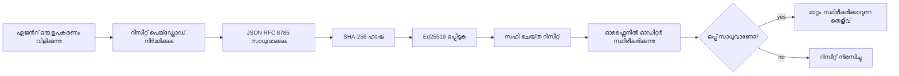
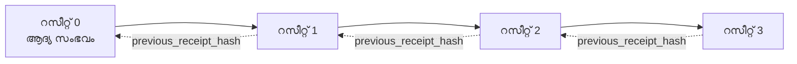

[പാഠ വീഡിയോ കാണുക: ക്രിപ്‌ടോഗ്രാഫിക് രസീറ്റുകളിലൂടെ AI ഏജന്റുകള്‍ സുരക്ഷിതമാക്കല്‍](https://youtu.be/PLACEHOLDER_VIDEO_ID)

> _(പാഠ വീഡിയോയും ചെറിയ ചിത്രം മൈക്രോസോഫ്‌റ്റ് ഉള്ളടക്ക സംഘത്തിനു് മേഞ്ഞ് ചേര്‍ക്കുന്നതിന്‌ പാഠം 14 / 15 മാതൃകക്കനുസരിച്ച്.)_

# ക്രിപ്‌ടോഗ്രാഫിക് രസീറ്റുകളിലൂടെ AI ഏജന്റുകള്‍ സുരക്ഷിതമാക്കൽ

## പരിചയം

ഈ പാഠം ഇതു് ഉൾക്കൊള്ളുന്നു:

- AI ഏജന്റുകള്‍ക്കുള്ള ഓഡിറ്റ് ട്രെയിലുകൾ പാലനത്തിനും ഡീബഗിംഗിനും നിശ്ചിത വിശ്വാസത്തിനുമായി എങ്ങനെയാണ് പ്രധാനമാണെന്ന്.
- ക്രിപ്‌ടോഗ്രാഫിക് രസീറ്റ് എന്താണെന്നും അവ കൈയേഷമില്ലാത്ത പാഠ രേഖകളിൽനിന്ന് എങ്ങനെ വ്യത്യസ്തമാണെന്നും.
- സാധാരണ പൈതണ്‍ ഉപയോഗിച്ച് ഏജന്റിന്റെ ടൂൾ കോളിനു വേണ്ടി ഒരു ഒപ്പിട്ട രസീറ്റ് എങ്ങനെയാണ് ഉണ്ടാക്കുന്നത്.
- ഒരു രസീറ്റ് ഓഫ്‌ലൈന്‍ ആയി എങ്ങനെ പരിശോധിക്കാമെന്നും തട്ടിപ്പ് കണ്ടെത്താമെന്നും.
- ഓരോ രസീറ്റ് ഒഴിവാക്കുകയോ പുനഃക്രമീകരിക്കുകയോ ചെയ്യുന്നത് സങ്കേതം തകർക്കുന്ന തരത്തിൽ എങ്ങനെ ബന്ധിപ്പിക്കാമെന്നുമുള്ള മാർഗ്ഗം.
- രസീറ്റുകൾ എന്തെല്ലാം തെളിയിക്കുന്നു, പക്ഷെ അവ വ്യക്തമായും എത് തെളിയിക്കുന്നില്ല.

## പഠന ലക്ഷ്യങ്ങള്‍

ഈ പാഠം പൂർത്തിയാക്കിയപ്പോള്‍ നിങ്ങൾ അറിയേണ്ടതൊക്കെ:

- ഏജന്റുകളുടെ പ്രവർത്തനങ്ങൾക്ക് ക്രിപ്‌ടോഗ്രാഫിക് പ്രൊവനന്‍സ് ആവശ്യപ്പെടുന്ന പരാജയ മൂലകങ്ങൾ തിരിച്ചറിയുക.
- കാനോണിക്കല്‍ JSON പേൽലോഡ് ഉപയോഗിച്ച് Ed25519 ഒപ്പിട്ട ഒരു രസീറ്റ് ഉണ്ടാക്കുക.
- ഒപ്പിട്ടവന്റെ പബ്ലിക്ക് കീ മാത്രം ഉപയോഗിച്ച് രസീറ്റ് സ്വതന്ത്രമായി പരിശോധിക്കുക.
- സംസ്കരണത്തിലുള്ള തട്ടിപ്പുകൾ തിരിച്ചറിയാൻ തിരുത്തിയ രസീറ്റിൽ പരിശോധന വീണ്ടും നടത്തുക.
- രസീറ്റുകളുടെ ഹാഷ്-ചെയിൻ ചെയിൻ ശൃംഖല ഉണ്ടാക്കി ഈ ശൃംഖലയുടെ പ്രാധാന്യം വിശദീകരിക്കുക.
- രസീറ്റുകൾ എന്തെല്ലാം തെളിയിക്കുന്നു (അറ്റ്രിബ്യൂഷൻ, ബന്ധു, ഓർഡറിംഗ്) എന്നും എന്തെല്ലാം തെളിയിക്കുന്നില്ല (പ്രവർത്തിയുടെ ശരക്കെടുത്ത്, നയം ശബ്ദഗണം).

## പ്രശ്നം: നിങ്ങളുടെ ഏജന്റിന്റെ ഓഡിറ്റ് ട്രെയിൽ

നിങ്ങൾ ഒരു AI ഏജന്റ് Contoso Travel-ന് വേണ്ടി വിന്യസിച്ചിരിക്കുന്നു എന്ന് കരുതി. ഈ ഏജന്റ് ഉപഭോക്താക്കളുടെ അഭ്യർത്ഥനകൾ വായിച്ച്, ഫ്ലൈറ്റുകൾ API-യെ വിളിച്ച് ഓപ്ഷനുകൾ സന്ദർശിച്ച്, ഉപഭോക്താവിന് വേണ്ടി സീറ്റുകൾ ബുക്ക് ചെയ്യുന്നു. കഴിഞ്ഞ പാദത്തിൽ, ഏജന്റ് 50,000 ബുക്കിംഗുകൾ പ്രോസസ്സ് ചെയ്തു.

ഇന്ന് ഒരു ഓഡിറ്റർ വരുകയാണ്. അവൻ ഒരു ലളിതമായ ചോദ്യം ചോദിക്കുന്നു: "നിങ്ങളുടെ ഏജന്റ് എന്ത് ചെയ്തു എന്ന് കാണിക്കൂ."

നിങ്ങൾ നിങ്ങളുടെ ലോഗ് ഫയലുകൾ കൈമാറുന്നു. ഓഡിറ്റർ അവ പരിശോധിച്ച് അഥവാ കടുപ്പമുള്ള ചോദ്യം ചോദിക്കുന്നു: "ഈ ലോഗുകൾ തിരുത്തപ്പെട്ടിട്ടില്ലെന്ന് എങ്ങനെ അറിയാം?"

ഇതാണ് ഓഡിറ്റ് ട്രെയിൽ പ്രശ്നം. ഇന്നത്തെ പല ഏജന്റ് വിന്യാസങ്ങളും ആശ്രയിക്കുന്നു:

- **അപ്ലിക്കേഷൻ ലോഗുകൾ**: ഏജന്റ് സ്വയം എഴുതിയുള്ളവ, ഫയൽ സിസ്റ്റം ആക്സസ് ഉള്ള ആരും തിരുത്താവുന്നവ.
- **ക്ലൗഡ് ലോഗിംഗ് സേവനങ്ങൾ**: പ്ലാറ്റ്‌ഫോം നിലവാരത്തിൽ തട്ടിപ്പ് തെളിവുള്ളത്, പക്ഷെ ഓഡിറ്റർ പ്ലാറ്റ്ഫോം ഓപ്പറേറ്ററിനെ വിശ്വസിക്കുന്നപ്പോൾ മാത്രം.
- **ഡാറ്റാബേസ് ട്രാൻസാക്ഷൻ ലോഗുകൾ**: ഡാറ്റാബേസ് മാറ്റങ്ങൾക്കു് അനുയോജ്യമായത്, പക്ഷെ സ്വതന്ത്ര ടൂളുകൾ വിളിക്കാൻ പറ്റാത്തത്.

ഓഡിറ്ററിന്റെ ചോദ്യം ഉത്തരം നൽകാൻ ഈവയെല്ലാം ഒരാളെ (നിങ്ങളെയോ, നിങ്ങളുടെ ക്ലൗഡ് പ്രൊവൈഡറിനെയോ, നിങ്ങളുടെ ഡാറ്റാബേസ് വിൽപ്പനക്കാരനെയോ) വിശ്വസിക്കാൻ നിർബന്ധിക്കുന്നു. ആന്തരിക ഉപയോഗത്തിനായി ഈ വിശ്വാസം സാധാരണ ആയി അംഗീകരിക്കാം. നിയമാനുസൃത ലോഡുകൾക്കായി (ഫിനാൻസ്, ആരോഗ്യ പരിപാലനം, EU AI ആക്റ്റ് സംബന്ധിച്ച കാര്യങ്ങൾ) വിശ്വാസം പോര.

ക്രിപ്‌ടോഗ്രാഫിക് രസീറ്റുകൾ ഓരോ ഏജന്റ് പ്രവർത്തനവും സ്വതന്ത്രമായി പരിശോധിക്കാൻ കഴിയും വിധത്തിൽ പ്രശ്നം പരിഹരിക്കുന്നു. ഓഡിറ്റർ നിങ്ങൾക്കു വിശ്വാസം വേണമെന്നില്ല. അവർക്കു് നീയുടേ പബ്ലിക്ക് കീയും രസീറ്റും മാത്രം വേണ്ടത്.

## ക്രിപ്‌ടോഗ്രാഫിക് രസീറ്റ് എന്താണ്?

ഒരു രസീറ്റ് ഒരു JSON ഒബ്ജക്റ്റ് ആണ്, ഏജന്റ് എന്ത് చేశെന്ന് രേഖപ്പെടുത്തുക, ഡിജിറ്റൽ ഒപ്പിട്ടു ചേർത്ത്.



ഒരു കുറഞ്ഞ രൂപത്തിലുള്ള രസീറ്റ് ഇങ്ങിനെ കാണാം:

```json
{
  "type": "agent.tool_call.v1",
  "agent_id": "contoso-travel-bot",
  "tool_name": "lookup_flights",
  "tool_args_hash": "sha256:a3f9c1...",
  "result_hash": "sha256:7b2e1d...",
  "policy_id": "contoso-travel-policy-v3",
  "timestamp": "2026-04-25T14:30:00Z",
  "sequence": 47,
  "previous_receipt_hash": "sha256:9d4e6a...",
  "signature": {
    "alg": "EdDSA",
    "sig": "c5af83...",
    "public_key": "8f3b2c..."
  }
}
```

മൂന്ന് പ്രധാനഗുണങ്ങൾ പ്രവർത്തിക്കുന്നു:

1. **ഒപ്പ്**. രസീറ്റ് ഏജന്റിന്റെ ഗവേട്വേയിലൂടെ Ed25519 സ്വകാര്യ കീ ഉപയോഗിച്ച് ഒപ്പിട്ടതാണ്. അനുയോജ്യമായ പബ്ലിക് കീയുള്ള ആരും ഒപ്പ് ഓഫ്‌ലൈന്‍ ആയി പരിശോധിക്കാം. ഏതെങ്കിലും ഫീൽഡ് മാറ്റുന്നത് ഒപ്പ് അസാധുവാക്കും.

2. **കാനോണിക്കൽ എന്‍കോഡിംഗ്**. ഒപ്പിട്ട മുൻപ്, രസീറ്റ് JSON കാനോണിക്കൽസേഷൻ സ്‌കീം (JCS, RFC 8785) ഉപയോഗിച്ച് സീരിയലൈസ് ചെയ്യുന്നു. ഇത് രണ്ട് വ്യത്യസ്‌ത ഇംപ്ലിമെന്റേഷനുകൾ ഒരേ ലജിക്കൽ രസീറ്റ് ബൈറ്റുകളിൽ തുല്യമായി സൃഷ്ടിക്കുമെന്ന് ഉറപ്പാക്കുന്നു. കാനോണ ലീസേഷൻ ഇല്ലാത്തത് JSON സീരിയലൈസറുകൾ നമുക്ക് ഒരേ ഉള്ളടക്കത്തിന് വ്യത്യസ്ത ഒപ്പുകൾ സൃഷ്ടിക്കുമെന്നാണ്.

3. **ഹാഷ്‌ ചെയിനിംഗ്**. `previous_receipt_hash` ഫീൽഡ് ഓരോ രസീറ്റിനെയും മുന്‍ രസീറ്റുമായി ബന്ധിപ്പിക്കുന്നു. ഒരു രസീറ്റ് ഒഴിവാക്കുകയോ പുനഃക്രമീകരിക്കുകയോ ചെയ്യുന്നത് പിന്നീട് വരുന്ന എല്ലാ രസീറ്റുകളും തകർത്ത് നൽകും. തട്ടിപ്പ് സംഖ്യാത്മകമായി ചെയിനില്‍ കാണപ്പെടും, വ്യക്തിഗത ഒപ്പുകള്‍ ഒഴിവാക്കിയാലും.

ഈ മൂന്നു ഗുണങ്ങൾ ചേർന്ന് മൂന്ന് ഉറപ്പുകൾ നൽകുന്നു:

- **അറ്റ്രിബ്യൂഷൻ**: ഈ കീ ഈ ഉള്ളടക്കം ഒപ്പിട്ടു.
- **സമഗ്രത**: ഒപ്പ് വീതിയ്ക്കപ്പൊഴുള്ള ഉള്ളടക്കം മാറ്റം വന്നിട്ടില്ല.
- **ഓർഡറിംഗ്**: ഈ രസീറ്റ് ആ രസീറ്റ് കൂടെ സങ്കേതത്തിൽ വരുന്നു.

## Python-ൽ ഒരു രസീറ്റ് ഉണ്ടാക്കല്‍

രസീറ്റ് ഉണ്ടാക്കാൻ പ്രത്യേക ലൈബ്രറി ആവശ്യമില്ല. ക്രിപ്‌ടോഗ്രാഫിക് പ്രിമിറ്റീവ് പ്രയോജനപ്രദമായി ലഭ്യമാണ്, ലജിക് പൈതണിലെ കുറച്ചു വരികളാണ്.

`code_samples/18-signed-receipts.ipynb` എന്ന ഹാൻഡ്‌സ്-ഓൺ പരിശീലനങ്ങളിൽ മുഴുവൻ വഴികാട്ടുന്നു. സാരാംശം:

```python
import json
import hashlib
import base64
from nacl import signing
from jcs import canonicalize  # RFC 8785 കാനോണിക്കൽ JSON

def b64url_nopad(data: bytes) -> str:
    return base64.urlsafe_b64encode(data).decode("ascii").rstrip("=")

def sha256_canonical(obj) -> str:
    """SHA-256 of a Python object's JCS-canonical JSON form."""
    return f"sha256:{hashlib.sha256(canonicalize(obj)).hexdigest()}"

# ഒപ്പ് വയ്ക്കുന്നതിനുള്ള ഒരു കീ സൃഷ്ടിക്കുക അല്ലെങ്കിൽ ലോഡ് ചെയ്യുക ( ഉത്പന്നത്തിൽ, കീ വാൾട്ടിൽ സൂക്ഷിക്കുക)
signing_key = signing.SigningKey.generate()
verify_key = signing_key.verify_key

# റിസീറ്റ് പേയ്‌ളോഡ് നിർമ്മിക്കുക (ഇനിയും ഒപ്പ് ഇല്ല)
tool_args = {"origin": "SYD", "destination": "LAX"}
tool_result = [{"flight": "QF11", "price": 1850, "stops": 0}]

payload = {
    "type": "agent.tool_call.v1",
    "agent_id": "contoso-travel-bot",
    "tool_name": "lookup_flights",
    "tool_args_hash": sha256_canonical(tool_args),
    "result_hash": sha256_canonical(tool_result),
    "policy_id": "contoso-travel-policy-v3",
    "timestamp": "2026-04-25T14:30:00Z",
    "sequence": 0,
    "previous_receipt_hash": None,
}

# കാനോണിക്കൽ ആക്കുക, ഹാഷ് ചെയ്യുക, ഒപ്പ് വയ്ക്കുക.
canonical_bytes = canonicalize(payload)
message_hash = hashlib.sha256(canonical_bytes).digest()
signature_bytes = signing_key.sign(message_hash).signature

# ഘടിപ്പിച്ച ഓബ്രജക്ട് ഒപ്പായി ചേർക്കുക.
receipt = {
    **payload,
    "signature": {
        "alg": "EdDSA",
        "sig": b64url_nopad(signature_bytes),
        "public_key": b64url_nopad(bytes(verify_key)),
    },
}
```

ഇതാണ് മുഴുവൻ ഒപ്പ് പ്രക്രിയ. നോട്ട്‌ബുക്കിലെ പരീക്ഷണങ്ങൾ ഓരോ ഘട്ടവും വിശദീകരിക്കുന്നു.

## രസീറ്റ് പരിശോധിക്കൽ, തട്ടിപ്പ് കണ്ടെത്തല്‍

പരിശോധന രണ്ടാം നടപടിയാണ്:

```python
import base64
import hashlib
from nacl import signing
from nacl.exceptions import BadSignatureError
from jcs import canonicalize

def b64url_decode(s: str) -> bytes:
    padding = "=" * ((4 - len(s) % 4) % 4)
    return base64.urlsafe_b64decode(s + padding)

def verify_receipt(receipt: dict) -> bool:
    # ഒപ്പിട്ട് ഒരു ഘടനയുക്തമായ വസ്തുവാണ്: {"alg", "sig", "public_key"}.
    sig_obj = receipt.get("signature")
    if not sig_obj or sig_obj.get("alg") != "EdDSA":
        return False

    # യാഥാർത്ഥ്യത്തിൽ ഒപ്പിട്ട പെയ്ലോഡ് പുനർനിർമാണം ചെയ്യുക (ഒപ്പ് ഒഴികെയുള്ള എല്ലാം).
    payload = {k: v for k, v in receipt.items() if k != "signature"}

    canonical_bytes = canonicalize(payload)
    message_hash = hashlib.sha256(canonical_bytes).digest()

    try:
        verify_key = signing.VerifyKey(b64url_decode(sig_obj["public_key"]))
        verify_key.verify(message_hash, b64url_decode(sig_obj["sig"]))
        return True
    except BadSignatureError:
        return False
```

ഈ ഫംഗ്ഷൻ ഒരു രസീറ്റ് സ്വീകരിച്ച് ഒപ്പ് ശരിയെങ്കിൽ `True`, അല്ലെങ്കിൽ `False` തിരികെ തരുന്നു. ഒരു നെറ്റ്‌വർക്ക് കോൾ വേണ്ട, സേവന ആശ്രയം വേണ്ട, മൂന്നാം പക്ഷത്തിൽ വിശ്വാസം വേണ്ട.

തട്ടിപ്പ് കണ്ടെത്തൽ കാണുന്നതിന് നോട്ട്‌ബുക്ക് നടന്നു കാണിക്കുന്നു:

1. സാധുവായ ഒരു രസീറ്റ് ഉണ്ടാക്കുക, പരിശോധിക്കൽ സ്ഥിരീകരിക്കുക.
2. `tool_args_hash` ഫീൽഡിന്റെ ഒരു ബിറ്റ് മാറ്റുക.
3. വീണ്ടും പരിശോധന നടത്തുക, പരാജയമാകുന്നത് കാണുക.

ഇതാണ് രസീറ്റുകൾ തട്ടിപ്പ് തെളിവുള്ളവയാണ് എന്ന പ്രായോഗിക തെളിവ്: ഏതും ചെറിയ മാറ്റവും ഒപ്പ് തകരുകയും ചെയ്യും.

## ബഹു-ഘട്ട ഏജന്റുകള്ക്ക് രസീറ്റ് ദുര്‍മുഖീകരണം

ഒരു ഒറ്റ ഒപ്പ് ഒരു പ്രവർത്തനത്തെ സംരക്ഷിക്കുന്നു. രസീറ്റുകളുടെ ശൃംഖലം ഒരു കൃത്യമായ വിവിധ പ്രവർത്തനങ്ങളുടേയും സംരക്ഷണം.



ഓരോ രസീറ്റ് മുമ്പത്തെ രസീറ്റിന്റെ ഹാഷ് രേഖപ്പെടുത്തുന്നു. 2-ആം രസീറ്റ് നിശബ്ദമായി ഒഴിവാക്കാൻ ഒരു ആക്രമകന്‌ ആവശ്യമുള്ളത്:

- 3-ആം രസീറ്റിന്റെ `previous_receipt_hash` ഫീൽഡ് മാറ്റുക (അതിന്റെ ഒപ്പ് തകർക്കുന്നു), അല്ലെങ്കിൽ
- മാറ്റിയ 3-ആം രസീറ്റിൽ പുതിയ ഒപ്പ് നിർമ്മിക്കുക (ഏജന്റിന്റെ സ്വകാര്യ കീ ആവശ്യമാണ്).

സ്വകാര്യ കീ ഹാർഡ്‌വെയർ കീ വാൾറ്റ്-ഇൽ ഉണ്ടെങ്കിൽ, നിങ്ങൾ每 രസീറ്റ് ആവശ്യുള്ള പബ്ലിക്ക് കീ പ്രസിദ്ധീകരിച്ചാൽ, ഈ ആക്രമണങ്ങളിൽ ഒന്നും കണ്ടെത്താതെ സാധ്യമല്ല.

നോട്ട്‌ബുക്ക് പൂർത്തിയാക്കുന്നത്:

1. മൂന്നു രസീറ്റിന്റെ ശൃംഖല നിർമ്മിക്കുക.
2. ഓരോ രസീറ്റിന്റെയും `previous_receipt_hash` മുൻ രസിറ്റിന്റെ ഹാഷിനോടു പൊരുത്തപ്പെടുന്നത് പരിശോധിക്കുക.
3. ശരിയായ ഇടയിൽ ഒരോ രസീറ്റ് തിരുത്തി, ശൃംഖലം തകരുന്നതു കാണുക.

ഇങ്ങനെ, പുറത്തുള്ള ഒരു ഓഡിറ്റർ നിങ്ങളോട് വിശ്വാസമില്ലാതെ ഓഡിറ്റ് ട്രെയിൽ പരിശോധിക്കാൻ കഴിയും.

## രസീറ്റുകൾ എന്ത് തെളിയിക്കുന്നു (എന്നാൽ എന്ത് തെളിയിക്കുന്നില്ല)

ഈ പാഠത്തിലെ ഏറ്റവും പ്രധാന ഭാഗം. രസീറ്റുകൾ ശക്തിയാണ്, പക്ഷേ ആ ശക്തിക്ക് പരിധി ഉണ്ട്.

**രസീറ്റുകൾ മൂന്നു കാര്യങ്ങൾ തെളിയിക്കുന്നു:**

1. **അറ്റ്രിബ്യൂഷൻ**: ഒരു പ്രത്യേക കീ ഒരു പേലോഡ് ഒപ്പിട്ടതാണ്.
2. **സമഗ്രത**: ആവർത്തനത്തിനു ശേഷം പേലോഡ് മാറിയിട്ടില്ല.
3. **ഓർഡറിംഗ്**: ഈ രസീറ്റ് ആ രസീറ്റിന് ശേഷം ശൃംഖലയിൽ വന്നതാണ്.

**രസീറ്റുകൾ തെളിയിക്കുന്നില്ല:**

1. **ശരക്കെടുത്ത്**: ഏജന്റിന്റെ പ്രവർത്തനം ശരിയാണെന്ന്. ഒരു തെറ്റായ മറുപടിക്ക് പോലും രസീറ്റ് ഒപ്പിടാൻ സാധിക്കും.
2. **നയ പാലനത്തെ**: `policy_id`യിൽ പരാമർശിച്ച നയം യഥാർത്ഥത്തിൽ പരിശോധിച്ചതോ അതു അനുവദിച്ചോ ആണെന്ന് തെളിയിക്കില്ല. രസീറ്റ് പറയുന്നത് അവകാശപ്പെട്ടതാണു്, നിർബന്ധപ്പട്ടത് 아닙니다.
3. **കീയുടെ പുറമെ തിരിച്ചറിയൽ**: രസീറ്റ് പറയുന്നു "ഈ കീ ഈ ഉള്ളടക്കം ഒപ്പിട്ടു". ഇത് പറയുന്നില്ല "ഈ മനുഷ്യൻ അനുമോദിച്ചു". വ്യക്തിയെ സ്വതന്ത്ര തിരിച്ചറിയൽ സംവിധാനത്തിലൂടെ മാത്രമേ കീയ്ക്ക് ബന്ധിപ്പിക്കാനാവൂ.
4. **ഇൻപുട്ടുകളുടെ വിശ്വാസ്യത**: ഏജന്റ് വ്യാജ പ്രോംപ്റ്റ് അവതരിപ്പിച്ച് കൈകാര്യം ചെയ്താലും, രസീറ്റ് പ്രവർത്തനം വിശ്വസനീയമായി രേഖപ്പെടുത്തും. രസീറ്റുകൾ ഇൻപുട്ട് പരിശോധനയ്ക്ക് പകരം അല്ല, അവ ഉപരിതലം മാത്രമാണ്.

ഈ പരിധി രണ്ട് കാരണങ്ങൾക്ക് പ്രധാനമാണ്:

- രസീറ്റുകൾ ഏജന്റ് പെരുമാറ്റം ഓഡിറ്റ് ചെയ്യാനും തട്ടിപ്പ് ഇല്ലാതാക്കാനും ഉപയോഗപ്പെടുത്താവുന്നതെന്താണെന്ന് വ്യക്തമാക്കുന്നു.
- ഇതിനു പുറമെ നിങ്ങൾക്ക് ആവശ്യമുള്ള അധിക പിന്തുണകൾ: ഇൻപുട്ട് പരിശോധന (പാഠം 6), നയപ്രവർത്തന (അടിസ്ഥാനമായി താഴെ പരാമർശിച്ചതു്), തിരിച്ചറിയൽ സംവിധാനം (ഈ പാഠത്തിന് പരിധി പുറത്താണ്).

സാധാരണ തെറ്റിദ്ധാരണ: "നമുക്ക് രസീറ്റുകൾ ഉണ്ടെന്നു് അര്‍ത്ഥം നമുക്ക് ഗവേർണൻസ് ഉണ്ട്". അല്ല. രസീറ്റുകൾ അടിസ്ഥാനമാണ്. ഗവേർണൻസ് തലത്തിലുള്ളിരിക്കുന്ന സംവിധാനമാണ്.

## നിർമ്മാണ റഫറൻസുകൾ

ഈ പാഠത്തിലെ പൈതൺ കോഡ് ശ്രദ്ധാപൂർവ്വം കുറഞ്ഞതാണ്, ഓരോ വരിയും പൂർണ്ണമായി മനസ്സിലാക്കാൻ കഴിയുംവിധം. പ്രൊഡക്ഷനിൽ നിങ്ങൾക്ക് രണ്ട് തിരഞ്ഞെടുക്കലുണ്ട്:

1. **ക്രിപ്‌ടോഗ്രാഫിക് പ്രിമിറ്റീവുകളെ നേരിട്ട് ഉപയോഗിക്കുക.** മുകളിൽ കാണുന്ന 50 വരികൾ പലവ്യവഹാരത്തിനും മതിയാകും. PyNaCl (Ed25519) ഉം `jcs` പാക്കേജ് (കാനോണിക്കൽ JSON) ഉം നന്നായി പരിപാലിക്കപ്പെടുന്ന ലൈബ്രറികളാണ്.

2. **ഉത്പാദന രസീറ്റ് ലൈബ്രറി ഉപയോഗിക്കുക.** പല ഓപ്പൺ-സോഴ്‌സ് പ്രൊജക്ടുകളും സമാന രീതിയിൽ അധിക സവിശേഷതകളുമായി (കീ റോട്ടേഷൻ, ബാച്ച് പരിശോധന, JWK സെറ്റ് വിതരണം, നയ എഞ്ചിനുകളുമായി സംയോജനം):
   - ഈ പാഠത്തിൽ ഉപയോഗിക്കുന്ന രസീറ്റ് ഫോർമാറ്റ് ഒരു IETF ഇന്റർനെറ്റ്-ഡ്രാഫ്റ്റ് (`draft-farley-acta-signed-receipts`) ആണ്, നിലവിൽ സ്റ്റാൻഡേർഡുകൾ പ്രക്രിയയിൽ.
   - മൈക്രോസോഫ്റ്റ് ഏജന്റ് ഗവണൻസ് ടൂൾകിറ്റ് സി‍ഡർ ആധാരിത നയം തീരുമാനങ്ങളുമായി രസീറ്റ് വീക്ഷിക്കുന്നു; ആ റിപോസിറ്ററിയിലെ ടUTORIAL 33-ൽ മുഴുവൻ ഉദാഹരണമാണ്.
   - `protect-mcp` (npm) ഉം `@veritasacta/verify` (npm) പാക്കേജുകളും രസീറ്റ് ഒപ്പ് സൈൻ ചെയ്യലും ഓഫ്‌‌ലൈൻ പരിശോധനയും നടപ്പിലാക്കിയിട്ടുള്ളവയാണ്, മള്‍ട്ടി-ക്ലയന്റ് MCP സെർവറിനു തട്ടിപ്പ് തെളിവുള്ള ഓഡിറ്റ് ട്രെയിൽ നൽകാൻ ഉപയോഗിക്കപ്പെടുന്നു.

സ്വയം JWT ലൈബ്രറി എഴുതൽ Vs പരീക്ഷിക്കപ്പെട്ട ലൈബ്രറി ഉപയോഗിക്കൽ പോലുള്ള തീരുമാനം ഇത് തന്നെയാണ്: ഇരുവരും സാധുവാണ്; ലൈബ്രറി സമയം സംരക്ഷിക്കുന്നു, ഓഡിറ്റ് പാളി കുറയ്ക്കുന്നു; സ്വയം എഴുതുന്നത് ప్రతి പ്രിമിറ്റീവ് മനസ്സിലാക്കാൻ സഹായിക്കുന്നു. ഈ പാഠം സ്വയം എഴുതൽ വഴികാട്ടിയാണ്.

## അറിവ് പരിശോധിക്കൽ

പ്രായോഗിക അഭ്യാസത്തിലേക്കു് പോകുന്നതിനു മുമ്പ് നിങ്ങളുടെ മനസ്സിലാക്കൽ പരീക്ഷിക്കുക.

**1. രസീറ്റ് ഏജന്റിന്റെ സ്വകാര്യ Ed25519 കീ ഉപയോഗിച്ച് ഒപ്പിട്ടതാണ്. ഓഡിറ്റർക്കു് അനുവദിച്ചിരിക്കുന്നത് വെറും പബ്ലിക്ക് കീ മാത്രം. ഓഫ്ലൈനായി രസീറ്റ് പരിശോധിക്കാനായിട്ടുണ്ടോ?**

<details>
<summary>ഉത്തരം</summary>

അതെ. Ed25519 പരിശോധനയ്ക്ക് വെറും പബ്ലിക് കീയും ഒപ്പ് എടുത്ത ബൈറ്റുകളും മാത്രമാണ് വേണ്ടത്. നെറ്റ്‌വർക്ക് കോൾ, സേവന ആശ്രയം വേണ്ട. ഈ സ്വഭാവം രസീറ്റുകൾ എയർ-ഗാപ്പ്, ബഹുഭാഗം സംഘടനസഹിതം, കുറഞ്ഞ വിശ്വാസമുള്ള ഓഡിറ്റ് പരിസ്ഥിതികളിൽ ഉപയോഗപ്രദമാക്കുന്നു.
</details>

**2. ഒരു ആക്രമകന്‍ രസീറ്റിലെ `policy_id` ഫീൽഡ് മാറ്റി അതിന് കൂടുതൽ മനക്കാറ്റുള്ള ഒരു നയം നിയന്ത്രിക്കുന്നതെന്ന് അവകാശപ്പെട്ടപ്പോൾ ഒപ്പ് യഥാർഥ പേലോഡ് ഓവറായിരുന്നു. പരിശോധനയിൽ എന്ത് സംഭവിക്കും?**

<details>
<summary>ഉത്തരം</summary>

പരിശോധന പരാജയപ്പെടും. ഒപ്പ് കാനോണിക്കൽ ബൈറ്റുകളിൽ ഹാജരാക്കിയതിനാൽ ഏതെങ്കിലും ഫീൽഡ് മാറ്റം കാനോണിക്കൽ ബൈറ്റുകൾ മാറ്റും, അത് SHA-256 ഹാഷ് മാറുകയും ഒപ്പ് അസാധുവാകുകയും ചെയ്യും. ആക്രമകന് പുതിയ ഒപ്പ് നിർമ്മിക്കാൻ സ്വകാര്യ കീ വേണം, അവനെക്സില്ല.
</details>

**3. രസീറ്റ് തിളക്കത്തിലുള്ള വാദങ്ങൾക്കും ഫലത്തിനും പകരം `tool_args_hash`വും `result_hash`ഉം ഉൾക്കൊള്ളുന്നതെന്തുകൊണ്ടാണ്?**

<details>
<summary>ഉത്തരം</summary>

രണ്ടു കാരണങ്ങൾ. ആദ്യതെ, രസീറ്റ് ആർക്കൈവിംഗിനോ സംപ്രേഷണത്തിന് പ്രൈവസി ആവശ്യമായ സാഹചര്യങ്ങളിൽ (PII, ബിസിനസ്സ് ഡാറ്റ) വ്യാപകമായ ഉള്ളടക്ക വെളിപ്പെടുത്തൽ ഒഴിവാക്കാൻ. ഹാഷിംഗ് രസീറ്റിനെ ചെറുതും ലഘുവുമാക്കുന്നു; ഓഡിറ്റർ ഹാഷും തിരഞ്ഞെടുത്ത പൈൻ ഉള്ളടക്കവുമായ പൊരുത്തം പരിശോധിക്കുന്നു. രണ്ടാമതു്, ഹാഷുകളുടെയും സ്ഥിരം വലുപ്പമുണ്ട്; ഹാഷുകളുള്ള രസീറ്റ് വലുപ്പപരമായും നിയന്ത്രിതമാണു്, ഇൻപുട്ട് ഔട്ട്‌പുട്ട് വലുതായാലും.
</details>

**4. `previous_receipt_hash` ഫീൽഡ് ഓരോ രസീറ്റിനെയും മുൻപുള്ളതിനോട് ബന്ധിപ്പിക്കുന്നു. ഒരു ആക്രമകന് ഒരു ശൃംഖലയിൽ ഇടത്തരം രസീറ്റ് മൗനമായി ഇല്ലാതാക്കിയാൽ എന്ത്കൂടി അസാധുവാകും?**

<details>
<summary>ഉത്തരം</summary>

ഇല്ലാതാക്കിയ രസീറ്റിനുശേഷം ഓരോ രസീറ്റ് അതിന്റെ `previous_receipt_hash` മുൻ ശൃംഖലയ്ക്ക് പൊരുത്തപ്പെടുകയില്ല (ആ രസീറ്റ് ഇപ്പോൾ ഏതിനേയും സൂചിപ്പിക്കുന്നില്ല, അല്ലെങ്കിൽ ശൃംഖലം പുതിയ മുൻപുള്ളതിന് കണ്ടും). ഇല്ലാതാക്കൽ മറയ്ക്കാനായി ആക്രമകന് പ്രതേകമായി ഓരോ പിന്നീട് വരുന്ന രസീറ്റും വീണ്ടും ഒപ്പ് വെക്കേണ്ടതുണ്ട്, അത് സ്വകാര്യ കീ ആവശ്യമാണ്.
</details>

**5. രസീറ്റ് പൂർണമായി പരിശോധനക്ക് പതിവ്. ഇത് ഏജന്റിന്റെ പ്രവർത്തനം ശരിയായതായി, ശബ്ദമായതായി, നയ പാലനമായെന്നാണ് തെളിയിക്കുമോ?**

<details>
<summary>ഉത്തരം</summary>

ഇല്ല. സാധുവായ രസീറ്റ് മൂന്നു കാര്യങ്ങൾ തെളിയിക്കുന്നു: അറ്റ്രിബ്യൂഷൻ (ഈ കീ ഈ ഉള്ളടക്കം ഒപ്പിട്ടത്), സമഗ്രത (ഉള്ളടക്കം മാറായിട്ടില്ല), ഓർഡറിംഗ് (ഈ രസീറ്റ് ആ രസീറ്റിനു ശേഷം ശൃംഖലയിൽ). ഇത് പ്രവർത്തനം ശരിയാണെന്ന്, `policy_id`യിൽ പറഞ്ഞ നയം പരിശോധിച്ചതോ ഏജന്റ് എല്ലാ നയങ്ങളും പാലിച്ചതോ തെളിയിക്കുന്നില്ല. രസീറ്റുകൾ ഏജന്റ് പെരുമാറ്റം ഓഡിറ്റ് ചെയ്യുന്നു, ശരിയാക്കുന്നില്ല. പാഠത്തിലെ ഏറ്റവും പ്രധാന പരിധിയാണ്.
</details>

## പ്രായോഗിക അഭ്യാസം

`code_samples/18-signed-receipts.ipynb` തുറന്ന് നാല് വിഭാഗവും പൂർത്തിയാക്കുക:

1. **വിഭാഗം 1**: നിങ്ങളുടെ ആദ്യ രസീറ്റ് ഒപ്പിട്ടും പരിശോധനയും ചെയ്യുക.
2. **വിഭാഗം 2**: രസീറ്റ് തിരുത്തി പരിശോധന പരാജയം കാണുക.
3. **വിഭാഗം 3**: മൂന്ന് രസീറ്റുള്ള ശൃംഖല ഉണ്ടാക്കി ശൃംഖല സമഗ്രത പരിശോധന നടത്തുക.
4. **വിഭാഗം 4**: മൈക്രോസോഫ്റ്റ് ഏജന്റ് ഫ്രെയിംവർക്കിൽ നിർമ്മിച്ച ഏജന്റിനു ഈ മാതൃക പ്രയോഗിക്കുക: ടൂൾ കോൾ റിലീസിനൊപ്പിട്ട്, പിന്നീട് രസീറ്റ് സ്വതന്ത്രമായി പരിശോധിക്കുക.

**വിപുലീകരണ ചതുര്‍മുഖം 1:** രസീറ്റ് സ്കീമയിൽ താങ്കളുടെ ഇഷ്ടാനുസൃതമായ ഒരു ഫീൽഡ് ചേർക്കുക (ഉദാഹരണത്തിന് ട്രേസിംഗിന് റിക്വസ്റ്റ് ഐഡി), അത് അടങ്ങിയിട്ടുള്ള കാനോണിക്കല്‍ ഒപ്പിടൽ ലജിക് നവീകരിച്ച്, രസീറ്റ് ഒപ്പം പരിശോധന നടത്തുമ്പോഴും നിലനിർത്തുന്നുവെന്ന് സ്ഥിരീകരിക്കുക. ഒപ്പിട്ടതിന് ശേഷം ഫീൽഡ് മാറ്റിയാൽ പരിശോധന പരാജയപ്പെടുന്നുവെന്നും കാണിക്കുക. ഇതിലൂടെ കാനോണിക്കൽ എൻകോഡിംഗിലെ ഓരോ ബൈറ്റും ഒപ്പിനായി എങ്ങനെ സംഭാവന ചെയ്യുന്നതെന്നു മനസ്സിലാകും.
**സ്റ്റ്രെച്ച് ചാലഞ്ച് 2:** നിങ്ങളുടെ രണ്ട് റെസിപികളെ SHA-256 ഹാഷ് ചെയ്യുക (അവയുടെ കാനോണിക്കൽ ബൈറ്റുകൾ ഒരു നിർണ്ണായക ക്രമത്തിൽ കണക്കാക്കി ഒന്നിച്ച് ചേര്ക്കുക) പിന്നെ അതിന്റെ ഫലം മൂന്നത്തെ ഒരു റെസിപ്പിയിലെ പുതിയ ഫീൽഡായി ഉൾപ്പെടുത്തുക, അതിന് മുമ്പ് ഒപ്പുവെയ്ക്കുക. മൂന്ന് റെസിപ്പുകളും ഇപ്പോഴും റൗണ്ട്-ട്രീപ്പ് ചെയ്യുന്നതായിട്ടുള്ളതെന്ന് പരിശോധന നടത്തുക. നിങ്ങൾ ഇപ്പോൾ ഒരു ഒന്ന്-പടി ഉൾപ്പെടുത്തൽ തെളിവ് നിർമ്മിച്ചു: മൂന്നത്തെ റെസിപ്പി കൈയ്യിലുളള ആരും ഒപ്പുവെയ്ക്കപ്പെട്ട സമയത്ത് ആദ്യ രണ്ട് റെസിപികളുണ്ടായിരുന്നു എന്ന് അവയുടെ ഉള്ളടക്കം തുറന്നുവെക്കാതിരിക്കുക കൊണ്ട് തെളിയിക്കാം. ഇത് സെലക്ടീവ്-ഡിസ്‌ക്ലോഷർ റെസിപികൾ സ്കെയിൽ ചെയ്യുമ്പോൾ ഉപയോഗിക്കുന്ന മാതൃകയാണ് (Merkle commitments, RFC 6962).

## സമാപനം

ക്രിപ്‌ٽو ഗ്രാഫിക് റെസിപികൾ എളുപ്പത്തിൽ അവിടെയുള്ളവയെ പരിശോധിക്കാനാകുന്ന ഒരു ഓഡിറ്റ് ട്രെയിൽ AI ഏജന്റുകൾക്ക് നൽകുന്നു:

- **സ്വതന്ത്രമായി പരിശോധിക്കാവുന്നതു**: പൊതു കീ ഉണ്ടായ ഏത് പാർട്ടിയും പരിശോധിക്കാവുന്നതാണ്, സേവന ആശ്രിതത്വം ഇല്ലാതെ.
- **ടാമ്പർ തെളിവുള്ളത്**: ഏതെങ്കിലും മാറ്റം ഒപ്പുവയ്ക്കൽ അസാധുവാക്കും.
- **പോർട്ടബിൾ**: ഒരു റെസിപ്പ് ചെറിയ JSON ഫയലാണ്അത്, അത് ഫയൽ അർച്ചീവ് ചെയ്യാനും കൈമാറാനും എവിടെയും പരിശോധിക്കാനും കഴിയും.
- **സ്റ്റാൻഡേർഡുകളുമായി ക്രമീകരിച്ചിരിക്കുന്നത്**: Ed25519 (RFC 8032), JCS (RFC 8785), SHA-256 എന്നിവയിൽ പണിതതാണ്, എല്ലാം വ്യാപകമായി ഉപയോഗിക്കപ്പെടുന്ന പ്രിമിറ്റീവുകൾ.

വ്യവസ്ഥാപിത ഇൻപുട്ട് പരിശോധന, പോളിസി നടപ്പാക്കൽ അല്ലെങ്കിൽ ഐ덴റിറ്റി സാങ്കേതികതയ്ക്ക് പകരം ഇത് അല്ല; അവയുടെ അടിസ്ഥാന രൂപമാണ്. നിയന്ത്രിത ജോലി ഭാരങ്ങൾ, ബഹുരാഷ്ട്ര workflowകൾ, അല്ലെങ്കിൽ ഒരു ഭാവി ഓഡിറ്ററിന് നിങ്ങൾക്കു വിശ്വാസം ഇല്ലെന്ന് കരുതേണ്ടിടങ്ങളിൽ, റെസിപ്പികൾ ഓഡിറ്റ് ട്രെയിൽ ശരിയായിരിക്കാനുള്ള മാർഗമാണ്.

ഏറ്റവും പ്രധാനപ്പെട്ട takeway: റെസിപ്പികൾ ആരും നീന്തു ചെയ്തത്, എപ്പോഴെന്ന് തെളിയിക്കുന്നു. അവർ പറഞ്ഞതിന്റെ സത്യമോ ശരിയോ എന്ന് തെളിയിക്കുന്നത് അല്ല. ഈ വ്യത്യാസം കൃത്യമായി സൂക്ഷിക്കുക. ഇത് ഒരു ദൈവവിശ്വാസക്കുറഞ്ഞ provenance സംവിധാനത്തിനും തെറ്റിദ്ധരിക്കൽ സിസ്റ്റത്തിനും ഇടയിലുള്ള വ്യത്യാസമാണ്.

## ഉത്പാദന ചെക്ക്ലിസ്റ്റ്

ഈ പാഠത്തിൽ നിന്ന് സാക്ഷാൽപാടുള്ള ഏജന്റുകൾ വരുന്ന യാഥാർത്ഥ്യവാതാവിൽ വിനിയോഗിക്കാൻ തയ്യാറായി:

- [ ] **ഒപ്പുവയ്ക്കൽ കീ ഡെവലപ്പർ ലാപ്ടോപ്പിൽനിന്ന് മാറ്റുക.** Azure Key Vault, AWS KMS അല്ലെങ്കിൽ ഹാർഡ്‌വെയർ സുരക്ഷാ ഘടകം ഉപയോഗിക്കുക. നിങ്ങളുടെ റെസിപ്പികൾ ഒപ്പുവെയ്ക്കുന്ന സ്വകാര്യ കീ സോഴ്‌സ് നിയന്ത്രണത്തിലോ plaintext ആപ്ലിക്കേഷൻ മെഷീനുകളിൽ ആയിരിക്കരുത്.
- [ ] **വെരിഫിക്കേഷൻ പൊതു കീ പ്രസിദ്ധീകരിക്കുക.** ഓഡിറ്റർമാർ ഓഫ്ലൈൻ പരിശോധിക്കാൻ ആവശ്യമാണ്. സ്റ്റാൻഡേർഡ് മാതൃക JWK സെറ്റ് ഒരു നന്നായി അറിയപ്പെട്ട URL-ൽ (RFC 7517), ഉദാ: `https://your-org.example.com/.well-known/agent-keys.json`.
- [ ] **ചെയിൻ ബാഹ്യമായി ആഛരണം ചെയ്യുക.** ഇടയ്ക്കിടെ ലേറ്റസ്റ്റ് ചെയിൻ ഹെഡ് ഹാഷ് ഒരു transparency log-ലേക്ക് എഴുതുക (Sigstore Rekor, RFC 3161 timestamp authority, അല്ലെങ്കിൽ രണ്ടാം ആഭ്യന്തര സംവിധാനം), അങ്ങനെ ബാഹ്യ പാർട്ടി "ഈ ചെയിൻ ഈ സമയത്ത് ഉണ്ടായിരുന്നു" എന്ന് സ്ഥിരീകരിക്കാം.
- [ ] **റെസിപ്പികൾ മാറ്റം വരുത്താൻ കഴിയാതെ സൂക്ഷിക്കുക.** append-only blob സ്റ്റോറേജ് (Azure Storage-ഇലെ അനശ്വരത നയങ്ങളോടും AWS S3 Object Lock-ഉം) ഈ ചരിത്രം സ്റ്റോറേജ് ലെയറിൽ നിന്ന് തിരുത്തുന്നതിൽ നിന്ന് ഒരു ഇൻസൈഡർനെ തടയും.
- [ ] **സംരക്ഷണ കാലയളവ് തീരുമാനിക്കുക.** പല പാലന വ്യവസ്ഥകളും ബഹുച്ചാത്രകാലം സംരക്ഷണം ആവശ്യപ്പെടുന്നു. റെസിപ്പികളുടെ വർദ്ധനവ് (ഒരു റെസിപ്പ് ~500 ബൈറ്റ്സ്; ഒരു ഏജന്റ് ദിവസം 10K കോൾസ് ചെയ്തത് വർഷം 1.8 GBഏ) കരുതുക.
- [ ] **റെസിപ്പുകൾ ഉൾക്കൊള്ളാത്തതെന്തെന്താണെന്ന് രേഖപ്പെടുത്തുക.** റെസിപ്പുകൾ അവകാശവ്യക്തം, സമഗ്രത, ഓർഡറിംഗ് എല്ലാം തെളിയിക്കുന്നു. നിങ്ങളുടെ റൺബുക്കിൽ ഇൻപുട്ട് പരിശോധന, പോളിസി നടപ്പാക്കൽ, നിരക്ക് പരിധിയിടൽ, ഐ덴റിറ്റി ഇൻഫ്രാസ്ട്രക്ചർ എന്നിവ റെസിപ്പുകളുടെ governance നിലയിലേക്ക് പാട് ചേർക്കേണ്ടതിനായി വ്യക്തമായി ചേർക്കുക.

### AI ഏജന്റുകൾ സുരക്ഷിതമാക്കുന്നതിനെക്കുറിച്ച് കൂടുതൽ ചോദ്യങ്ങൾ ഉണ്ടോ?

[Microsoft Foundry Discord](https://aka.ms/ai-agents/discord) ൽ ചേരുക, മറ്റ് പഠനക്കാരെ കണ്ടുമുട്ടുക, ഓഫിസ് മണിക്കൂറുകളിൽ പങ്കെടുക്കുക, നിങ്ങളുടെ AI ഏജന്റ് ചോദ്യങ്ങൾക്ക് ഉത്തരം നേടുക.

## ഈ പാഠത്തിന് പുറത്ത്

ഈ പാഠം ഒറ്റ റെസിപ്പ് ഒപ്പുവെയ്ക്കലും ഹാഷ് ചെയിൻ ചെയ്ത ശ്രേണികളും ഉൾക്കൊള്ളുന്നു. അവ തന്നെ അവതരിപ്പിക്കുന്ന പ്രിമിറ്റീവുകൾ മറ്റും പുരോഗമന മാതൃകകളിലേക്ക് ചേർത്ത് നിങ്ങളുടെ ഗവർണൻസ് നില മെച്ചപ്പെടുത്തുമ്പോൾ കാണാവുന്നവയാണ്:

- **തിരഞ്ഞെടുത്ത വെളിപ്പെടുത്തൽ:** റെസിപ്പിന്റെ ഫീൽഡുകൾ സ്വതന്ത്രമായി കമ്മിറ്റ് ചെയ്താൽ (RFC 6962-സ്റ്റൈൽ മെർകിൾ ട്രി), പ്രത്യേക ഓഡിറ്റർമാർക്ക് പ്രത്യേക ഫീൽഡുകൾ വെളിപ്പെടുത്തുകയും ബാക്കിയെ മാറ്റമില്ലാതെയെന്ന് തെളിയിക്കാൻ കഴിയും. ഇത് സമഗ്ര ഓഡിറ്റ് (പൂർണ്ണത ആവശ്യപ്പെടുന്ന) ഒപ്പം GDPR പോലെയുള്ള ഡാറ്റ-മിനിമൈസേഷൻ നിയമങ്ങൾക്കുള്ള റെസിപ്പുകൾ ഒരുപോലെ പൂർണ്ണമാക്കേണ്ടപ്പോൾ സഹായകരമാണ്.
- **റെസിപ്പ് റദ്ദാക്കൽ:** ഒപ്പുവയ്ക്കൽ കീ компрോമൈസ് ചെയ്താൽ, ആ കീ കൊണ്ട് ഒപ്പുവെച്ച എല്ലാ റെസിപ്പുകളും ഒരു നിശ്ചിത സമയത്തിൽനിന്നും വിശ്വാസരഹിതമാണെന്ന് ചൂണ്ടിക്കാട്ടേണ്ടതാണ്. സ്റ്റാൻഡേർഡ് മാതൃകകൾ: ചുരുങ്ങിയ കാലം ഉള്ള ഒപ്പുവയ്ക്കൽ കീകൾയും പ്രസിദ്ധീകരിച്ച റദ്ദാക്കൽ പട്ടികയും, അല്ലെങ്കിൽ റദ്ദാക്കൽ എൻട്രികൾ അടങ്ങിയ ഒരു transparency log.
- **ബൈലാറ്ററൽ / സ്പ്ലിറ്റ്- ഒപ്പുവയ്ക്കൽ റെസിപ്പുകൾ:** ചില നടപ്പാക്കലുകൾ ഒപ്പുവെച്ച പേലോഡ്‌ ഉപയോഗം മുൻവും ഫലം പിന്നീട് ഭാഗങ്ങളായി വിഭജിച്ച് (authorization_*, result_*) സ്വതന്ത്ര ഒപ്പുകളുമായി സൃഷ്ടിക്കുന്നു,.authorization തീരുമാനം , പരിരക്ഷിച്ചത് ഫലം വ്യത്യസ്ത ചലനങ്ങൾക്കോ സമയത്തോ സൃഷ്ടിക്കുമ്പോൾ ഉപയോഗപ്രദമാണ്. ഇത് ഈ പാഠത്തിൽ പഠിപ്പിച്ച റെസിപ്പ് ഫോർമാറ്റിന്റെ മുകളിൽ കൂട്ടിച്ചേർക്കാം.
- **പേലോഡ് ഘടന:** `result_hash`-ൽ നിങ്ങൾ ചേർക്കുന്ന നീണ്ട ബൈറ്റുകൾ ഒക്കെ റെസിപ്പിൽ സീലുചെയ്യുന്നു. യഥാർത്ഥ ഇനത്തിൽ ഉള്ള result പോസിറ്റീവ്‌ വിവരങ്ങൾ ഇനിപ്പറയുന്നവ തന്നെ: മുൻനിരീക്ഷണം (മോഡൽ പ്രവചന, പരിഗണിച്ച ഓപ്ഷനുകൾ, തെളിവും അതിന്റെ പൂർണ്ണതയും, അപകട സാഹചര്യം, ഉത്തരവാദിത്വ ശൃംഖല, ഗോപി ഫലം) എല്ലാം ഒറ്റ റെസിപ്പിൽ സീലുചെയ്യാം. ഇത് റെസിപ്പ് ഫോർമാറ്റ് ചെറിയതായിട്ട് വിടുതലാക്കുമ്പോൾ തോന്ന হয় ഡൊമേൻ അനുസരിച്ചു പേലോഡ് സ്കീമുകൾ വളരാനും.
- **ക്രോസ്-ഇംപ്ലിമെന്റേഷൻ പൊരുത്തക്കേട്:** ഒരേ റെസിപ്പ് ഫോർമാറ്റിന്റെ ബഹുനിരപക്ഷ നടപ്പാക്കലുകൾ (Python, TypeScript, Rust, Go) പരസ്പരം ടെസ്റ്റ് വെക്ടറുകളുമായി പരിശോധിക്കുന്നു. നിങ്ങൾ സ്വന്തം നടപ്പാക്കൽ നിർമ്മിക്കുമ്പോൾ പ്രസിദ്ധീകരിച്ച ടെസ്റ്റ് വെക്ടറുകളുമായി പരിശോധിക്കുക വയർ പൊരുത്തം ഉറപ്പാക്കുന്നു.
- **പോസ്റ്റ്-ക്വാണ്ടം മാറ്റം:** Ed25519 ഇന്ന് വ്യാപകമാണ്, എന്നാൽ ക്വാണ്ടം-പ്രതിരോധിയായിട്ടില്ല. റെസിപ്പ് ഫോർമാറ്റ് ആൽഗോരിതം-അജൈൽ ആണ്: `signature.alg` ഫീൽഡ് `ML-DSA-65` (NIST പോസ്റ്റ്-ക്വാന്തം ഒപ്പുവയ്ക്കൽ സ്റ്റാൻഡേർഡ്) കൈവശം വയ്ക്കാം, മാറ്റം ആവശ്യമായപ്പോൾ. റസിപ്പുകൾ ഇരട്ട ഒപ്പുള്ള അവസ്ഥയിൽ മൈഗ്രേഷൻ കാലഘട്ടം ലളിതമാക്കുന്നതിന് പദ്ധതിയിടുക.

## അധിക വിഭവങ്ങൾ

- <a href="https://datatracker.ietf.org/doc/draft-farley-acta-signed-receipts/" target="_blank">IETF Internet-Draft: Signed Decision Receipts for Machine-to-Machine Access Control</a>
- <a href="https://learn.microsoft.com/azure/ai-studio/responsible-use-of-ai-overview" target="_blank">Responsible AI overview (Azure AI)</a>
- <a href="https://datatracker.ietf.org/doc/html/rfc8032" target="_blank">RFC 8032: Edwards-Curve Digital Signature Algorithm (EdDSA)</a>
- <a href="https://datatracker.ietf.org/doc/html/rfc8785" target="_blank">RFC 8785: JSON Canonicalization Scheme (JCS)</a>
- <a href="https://datatracker.ietf.org/doc/html/rfc6962" target="_blank">RFC 6962: Certificate Transparency</a> (Merkle-tree നിർമാണം സെലക്ടീവ്-ഡിസ്‌ക്ലോഷർ റെസിപ്പികൾ ഉപയോഗിക്കുന്നത്)
- <a href="https://github.com/microsoft/agent-governance-toolkit/blob/main/docs/tutorials/33-offline-verifiable-receipts.md" target="_blank">Microsoft Agent Governance Toolkit, Tutorial 33: Offline-Verifiable Decision Receipts</a>
- <a href="https://github.com/ScopeBlind/agent-governance-testvectors" target="_blank">Cross-implementation conformance test vectors</a> ഈ പാഠത്തിൽ ഉപയോഗിച്ച റെസിപ്പ് ഫോർമാറ്റ് (Apache-2.0)
- <a href="https://pynacl.readthedocs.io/" target="_blank">PyNaCl documentation</a> (Python-ൽ Ed25519)

## മുമ്പത്തെ പാഠം

[കമ്പ്യൂട്ടർ യൂസ് ഏജന്റുകൾ നിർമ്മിക്കൽ (CUA)](../15-browser-use/README.md)

## അടുത്ത പാഠം

_(പരിപാടി പരിപാലകർ നിർണ്ണയിക്കും)_

---

<!-- CO-OP TRANSLATOR DISCLAIMER START -->
**അറിയിപ്പ്**:
ഈ രേഖ AI പരിഭാഷാ സേവനം [Co-op Translator](https://github.com/Azure/co-op-translator) ഉപയോഗിച്ച് പരിഭാഷപ്പെടുത്തിയതാണ്. ഞങ്ങൾ കൃത്യതയ്ക്കായി ശ്രമിക്കുന്നുവെങ്കിലും, ഓട്ടോമേറ്റഡ് പരിഭാഷകളിൽ പിഴവുകൾ അല്ലെങ്കിൽ തെറ്റായ വിവരങ്ങൾ ഉണ്ടാകാൻ സാധ്യതയുണ്ട്. അതിന്റെ സ്വാഭാവിക ഭാഷയിലുള്ള അസൽ രേഖയാണ് പ്രാമാണികമായ ഉറവിടമായി പരിഗണിക്കേണ്ടത്. നിർണായകമായ വിവരങ്ങൾക്ക്, പ്രൊഫഷണൽ മനുഷ്യ പരിഭാഷ ശുപാർശ ചെയ്യുന്നു. ഈ പരിഭാഷ ഉപയോഗിച്ച് ഉണ്ടാകുന്ന തെറ്റിദ്ധാരണകൾ അല്ലെങ്കിൽ തെറ്റായ വ്യാഖ്യാനങ്ങൾക്കായി ഞങ്ങൾ ഉത്തരവാദികളല്ല.
<!-- CO-OP TRANSLATOR DISCLAIMER END -->