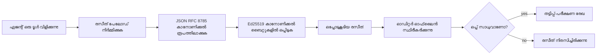
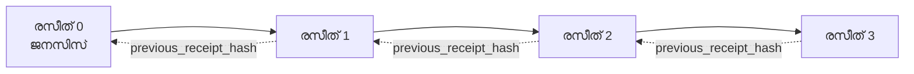

[പാഠം വീഡിയോ കാണുക: ക്രിപ്റ്റോഗ്രാഫിക് റസീട്ട്‌ളുമായി AI ഏജന്റുകൾ സുരക്ഷിതമാക്കൽ](https://youtu.be/PLACEHOLDER_VIDEO_ID)

> _(പാഠ വീഡിയോയും തമ്പ്‌നെയിൽുമicrosoft ഉള്ളടക്ക സംഘം മർജ് ചെയ്തതിന് ശേഷം ചേർക്കും, പാഠം 14 / 15 പാറ്റേർണിനോടനുസരിച്ച്.)_

# ക്രിപ്റ്റോഗ്രാഫിക് റസീറ്റ്‌ളുമായി AI ഏജന്റുകൾ സുരക്ഷിതമാക്കൽ

## പരിചയം

ഈ പാഠം ഇത് മാറ് ആഢ്രസിക്കും:

- എത് എയ്ഐ ഏജന്റുകൾക്കുള്ള ഓഡിറ്റ് ട്രെയിലുകൾ പാലനത്തിന്, ഡീബഗ്ഗിംഗിനും വിശ്വാസത്തിനും പ്രധാനമാണ്.
- ക്രിപ്റ്റോഗ്രാഫിക് റസീറ്റ് എന്താണെന്നും ഒപ്പ് വെച്ചിട്ടില്ലാത്ത ലോഗ് ലൈനിൽ നിന്നുള്ള വ്യത്യാസം എന്ത്.
- Plain Python-ൽ ഏജന്റിന്റെ ടൂൾ കാൾക്ക് ഒപ്പ് വെച്ചിട്ടുള്ള റസീറ്റ് എങ്ങനെ നിർമ്മിക്കുക.
- റസീറ്റ് ഓൺലൈനിൽ പരിശോധിച്ച് മുടക്കങ്ങൾ കണ്ടെത്തുന്നത് എങ്ങനെ.
- ഒന്ന് നീക്കുകയോ പുനർക്രമീകരിക്കുകയോ ചെയ്‌താൽ ചെയിൻ തകർന്നുപോകുന്നതും എങ്ങനെ റസീറ്റ്‌ളെ ബന്ധിപ്പിക്കുക.
- റസീറ്റ് എന്താണ് തെളിയിക്കുന്നത്, എന്താണ് വ്യക്തമായി തെളിയിക്കാത്തത്.

## ലേണിംഗ് ലക്ഷ്യങ്ങൾ

ഈ പാഠം പൂർത്തിയാക്കിയശേഷം, നിങ്ങൾക്ക് അറിയാം:

- ഏജന്റിന്റെ പ്രവർത്തനങ്ങൾക്ക് ക്രിപ്റ്റോഗ്രാഫിക് പ്രൊവനൻസ് ആവശ്യമാകുന്നത് പ്രേരിപ്പിക്കുന്ന പരാജയ മോഡുകൾ തിരിച്ചറിയുക.
- കാനോണിക്കൽ JSON പേలోഡിന് മേൽ ഒരു Ed25519 ഒപ്പിട്ട റസീറ്റ് നിർമ്മിക്കുക.
- ഒപ്പിട്ട വ്യക്തിയുടെ പബ്ലിക് കീ മാത്രം ഉപയോഗിച്ച് സ്വതന്ത്രമായി ഒരു റസീറ്റ് പരിശോധിക്കുക.
- ഒരു തിരുത്തിയ റസീറ്റ് ക്രമീകരിച്ചു പരിശോധിച്ച് മുറിപ്പാടുകൾ കണ്ടെത്തുക.
- റസീറ്റ്‌ളെ ഹാഷ് ചെയിൻ ചെയ്‌ത് സെക്രട്ടറി ഒരുക്കി ചെയിൻ പ്രാധാന്യം വിശദമായും.
- റസീറ്റ് തെളിയിക്കുന്നതും (അട്രിബ്യൂഷൻ, അഖണ്ഡത, ഓർഡറിങ്) തെളിയിക്കാത്തതും (പ്രവർത്തനത്തിന്റെ ശരിത്വം, നയത്തിന്റെ ശുദ്ധി) തിരിച്ചറിയുക.

## പ്രശ്നം: നിങ്ങളുടെ ഏജന്റിന്റെ ഓഡിറ്റ് ട്രെയിൽ

നിങ്ങൾ contoso ട്രാവലിനായി AI ഏജന്റ് വിന്യസിച്ചു എന്ന് കണക്കാക്കുക. ഏജന്റ് ഉപഭോക്തൃ അഭ്യർത്ഥനകൾ വായിച്ച്, ഫ്‌ലൈറ്റ് API-െใช്้ കാണുകയും, ഉപഭോ‌ക്താവിന്റെ പേരിൽ സീറ്റുകൾ ബുക്ക് ചെയ്യുകയും ചെയ്യുന്നു. കഴിഞ്ഞ പാദത്തിൽ ഏജന്റ് 50,000 ബുക്കിംഗുകൾ പ്രോസസ്സ് ചെയ്തു.

ഈ ദിവസം ഒരു ഓഡിറ്റർ എത്തുന്നു. അവർ ഒരു വളരെ ലളിതമായ ചോദ്യം ചോദിക്കുന്നു: "നിങ്ങളുടെ ഏജന്റ് എന്ത് ചെയ്തു എന്ന് കാണിക്കൂ."

നിങ്ങൾ നിങ്ങളുടെ ലോഗ് ഫയലുകൾ കൈമാറുന്നു. ഓഡിറ്റർ അവ നോക്കുന്നു, പിന്നെ കൂടുതൽ ബുദ്ധിമുട്ടുള്ള ചോദ്യം ചോദിക്കുന്നു: "ഈ ലോഗുകൾ തിരുത്തിയില്ലെന്ന് എങ്ങനെ എന്‍റെ ഉറപ്പ്..."

ഇത് ഓഡിറ്റ് ട്രെയിലിന്റെ പ്രശ്നമാണ്. ഇന്ന് പല ഏജന്റ് വിന്യാസങ്ങളും ശ്രദ്ധിക്കുന്നത്:

- **അപ്ലിക്കേഷൻ ലോഗുകൾ**: ഏജന്റ് തന്നെ എഴുതുന്നു, ഫയൽ സിസ്റ്റം ആക്സസ് ഉള്ളാരും തിരുത്താമാകുന്നു.
- **ക്ലൗഡ് ലോഗിംഗ് സേവനങ്ങൾ**: പ്ലാറ്റ്ഫോം തലത്തിൽ മുടക്ക തെളിവ് ലഭ്യമാക്കുന്നു, പക്ഷേ ഓഡിറ്റർ പ്ലാറ്റ്ഫോം ഓപ്പറേറ്റർ വിശ്വസിക്കണം.
- **ഡേറ്റാബേസ് ട്രാൻസാക്ഷൻ ലോഗുകൾ**: ഡാറ്റാബേസ് മാറ്റങ്ങളിൽ യോജിച്ചത്, എങ്കിലും സ്വതന്ത്ര ടൂൾ കാൾസിന് അനുയോജ്യമല്ല.

ഇവയിൽ ഒന്നും ഓഡിറ്ററുടെ ചോദ്യം ഉത്തരം പറയാനാകില്ല ഒരു മൂല്യഗുണമുള്ള വിശ്വാസം ഇല്ലാതെ (നിങ്ങൾ, ക്ലൗഡ് ദാതാവ്, ഡേറ്റാബേസ് വിൽപ്പനക്കാരൻ). ആഭ്യന്തര ഉപയോഗത്തിന് അത് സാധാരണമായി അനുവദനീയമാണ്. നിയമാനുസൃത പ്രവൃത്തികൾ (ഫിനാൻസ്, ഹെൽത്ത് കെയർ, യൂറോപ്യൻ AI സാക്ഷ്യപത്രം വിധികൾ) വേണ്ടത് അല്ല.

ക്രിപ്റ്റോഗ്രാഫിക് റസീറ്റ്‌ളിലൂടെ ഓരോ ഏജന്റ് പ്രവർത്തനവും സ്വതന്ത്രമായി പരിശോധിക്കാൻ കഴിയുന്ന വിധത്തിൽ ഈ പ്രശ്നം പരിഹരിക്കുന്നു. ഓഡിറ്റര് നിങ്ങളെ വിശ്വസിക്കാൻ ആവശ്യമായില്ല. അവർക്ക് പബ്ലിക് കീയും റസീറ്റ് തന്നെ മതിക്കും.

## ക്രിപ്റ്റോഗ്രാഫിക് റസീറ്റ് എന്ത്?

ഒരു റസീറ്റ് ഏജന്റ് ചെയ്‌തത് രേഖപ്പെടുത്തുന്ന JSON ഓബ്ജക്ട് ആണ്, ഡിജിറ്റൽ ഒപ്പിനോടുകൂടി ഒപ്പിട്ടത്.


```mermaid
flowchart LR
    A[ഏജന്റ് ഒരു ടൂൾ വിളിക്കുന്നു] --> B[രസീത് പേലോഡ് നിർമ്മിക്കുക]
    B --> C[JSON RFC 8785 കാനോണിക്കൽ രൂപത്തിലാക്കുക]
    C --> E[Ed25519 കാനോണിക്കൽ ബൈറ്റുകളിൽ ഒപ്പിടുക]
    E --> F[ഒപ്പോടുകൂടിയ രസീത്]
    F --> G[ഓഡിറ്റർ ഓഫ്‌ലൈൻ സ്ഥിരീകരിക്കുന്നു]
    G --> H{ഒപ്പ് സാധുവാണോ?}
    H -- yes --> I[തട്ടിപ്പ്-പരീക്ഷണ രേഖ]
    H -- no --> J[രസീത് നിരസിച്ചിരിക്കുന്നു]
```

ഒരു മിനിമൽ റസീറ്റ് ഇത്തരം കാണപ്പെടും:

```json
{
  "type": "agent.tool_call.v1",
  "agent_id": "contoso-travel-bot",
  "tool_name": "lookup_flights",
  "tool_args_hash": "sha256:a3f9c1...",
  "result_hash": "sha256:7b2e1d...",
  "policy_id": "contoso-travel-policy-v3",
  "timestamp": "2026-04-25T14:30:00Z",
  "sequence": 47,
  "previous_receipt_hash": "sha256:9d4e6a...",
  "signature": {
    "alg": "EdDSA",
    "sig": "c5af83...",
    "public_key": "8f3b2c..."
  }
}
```

മൂന്ന് വിശേഷതകൾ ഈ പ്രവർത്തി ചെയ്യുന്നുണ്ട്:

1. **ഒപ്പ്**. റസീറ്റ് ഏജന്റിന്റെ ഗേറ്റ്വെയിലൂടെ Ed25519 സ്വകാര്യ കീ ഉപയോഗിച്ച് ഒപ്പ് വെച്ചിരിക്കുന്നു. പൊതു കീയോടെ എല്ലാവരും ഒപ്പ് ഓൺലൈനിൽ പരിശോധിക്കാം. ഏതെന്തെങ്കിലും ഫീൽഡ് മാറ്റിയാൽ ഒപ്പ് അസാധുവാകും.

2. **കാനോണിക്കൽ എൻകോഡിംഗ്**. ഒപ്പ് വെക്കുന്നതിന് മുമ്പ്, റസീറ്റ് JSON Canonicalization Scheme (JCS, RFC 8785) ഉപയോഗിച്ച് ശ്രൃംഖലമായി പരാമർശിക്കുന്നു. ഇത് ഒരേ കാര്യമായ രണ്ട് സംയോജഗ്രഹണങ്ങൾ ബൈറ്റ് തന്നെയുള്ള ഔട്ട്‌പുട്ട് നൽകുന്നത് ഉറപ്പാക്കുന്നു. കാനോണിക്കൽ അല്ലെങ്കിൽ വ്യത്യസ്ത JSON സീരിയലൈസറുകൾ ഒരേ ഉള്ളടക്കത്തിനായി വ്യത്യസ്ത ഒപ്പുകൾ നൽകും.

3. **ഹാഷ് ചെയിനിംഗ്**. `previous_receipt_hash` ഫീൽഡ് ഓരോ റസീറ്റിനെയും മുൻപ് വന്ന റസീട്ടുമായി ബന്ധിപ്പിക്കുന്നു. ഒരു റസീറ്റ് നീക്കുകയോ പുനർക്രമപ്പെടുത്തുകയോ ചെയ്‌താൽ അതിന്റെ പിന്നിൽ ഉണ്ടായ എല്ലാ റസീറ്റ്‌ളും തകരും. സ്വതന്ത്ര ഒപ്പുകൾ മറികടന്നാലും ചെയിനിൽ സ്വാധീനങ്ങൾ ദൃശ്യമായി വരും.

മുക്യമായ ഈ മൂന്ന് ഉറപ്പുകൾ നൽകുന്നു:

- **അട്രിബ്യൂഷൻ**: ഈ കീ ഈ ഉള്ളടക്കം ഒപ്പിട്ടിരിക്കുന്നു.
- **അഖണ്ഡത**: ഒപ്പിട്ട ശേഷം ഉള്ളടക്കം മാറിയിട്ടില്ല.
- **ഓർഡറിങ്**: ഈ റസീറ്റ് അതിലെത്തുന്നതിനുശേഷം വന്നതാണ്.

## പൈത്തണിൽ ഒരു റസീറ്റ് നിർമ്മിക്കുന്നത്

റസീറ്റ് നിർമ്മിക്കാൻ പ്രത്യേക ലൈബ്രറിയോ ആവശ്യമില്ല. ക്രിപ്റ്റോഗ്രാഫിക് പ്രിമിറ്റീവുകൾ വളരെ ലഭ്യമാണ്, ലജിക്ക് കുറച്ച് പൈത്തൺ ലൈൻസിലാണ്.

`code_samples/18-signed-receipts.ipynb`-ഇൽ ഉള്ള ഹൈണ്ട്സ്-ഓൺ അഭ്യാസങ്ങൾ മുഴുവൻ പ്രവൃത്തിയിലൂടെ നടത്തുന്നു. സംക്ഷിപ്തം ഇങ്ങനെ:

```python
import json
import hashlib
import base64
from nacl import signing
from jcs import canonicalize  # RFC 8785 കാനോണിക്കൽ JSON

def b64url_nopad(data: bytes) -> str:
    return base64.urlsafe_b64encode(data).decode("ascii").rstrip("=")

def sha256_canonical(obj) -> str:
    """SHA-256 of a Python object's JCS-canonical JSON form."""
    return f"sha256:{hashlib.sha256(canonicalize(obj)).hexdigest()}"

# സൈൻ ചെയ്യാനുള്ള കീ ഉണ്ടാക്കുക അല്ലെങ്കിൽ ലോഡ് ചെയ്യുക (പ്രോഡക്ഷനിൽ, ഒരു കീ വോൾട്ടിൽ സൂക്ഷിക്കുക)
signing_key = signing.SigningKey.generate()
verify_key = signing_key.verify_key

# റെസീപ്്റ്റ് പെയ്ലോഡ് നിർമ്മിക്കുക (ഇതിനകം സിഗ്നേച്ചർ ഇല്ല)
tool_args = {"origin": "SYD", "destination": "LAX"}
tool_result = [{"flight": "QF11", "price": 1850, "stops": 0}]

payload = {
    "type": "agent.tool_call.v1",
    "agent_id": "contoso-travel-bot",
    "tool_name": "lookup_flights",
    "tool_args_hash": sha256_canonical(tool_args),
    "result_hash": sha256_canonical(tool_result),
    "policy_id": "contoso-travel-policy-v3",
    "timestamp": "2026-04-25T14:30:00Z",
    "sequence": 0,
    "previous_receipt_hash": None,
}

# JCS ബൈറ്റുകൾ നേരിട്ട് കാനോണിക്കൽ ആക്കിയും സൈൻ ചെയ്യുകയും ചെയ്യുക. PureEdDSA ഉള്ളിൽ ഹാഷ് ചെയ്യുന്നു.
canonical_bytes = canonicalize(payload)
signature_bytes = signing_key.sign(canonical_bytes).signature

# ഘടിത സിഗ്നേച്ചർ ഒബ്ജക്റ്റ് ചേർക്കുക.
receipt = {
    **payload,
    "signature": {
        "alg": "EdDSA",
        "sig": b64url_nopad(signature_bytes),
        "public_key": b64url_nopad(bytes(verify_key)),
    },
}
```

അത് മുഴുവൻ ഒപ്പ് വെക്കൽ പ്രക്രിയയാണ്. നോട്ട്‌ബുക്ക് ലാജികിന്റെ ഓരോ ഘട്ടവും വിശദീകരിക്കുന്നു.

## റസീറ്റ് പരിശോധനയും മുടക്കങ്ങൾ കണ്ടെത്തലും

പരിശോധന എന്നാൽ പ്രത്യക്ഷപ്രവൃത്തിയുടെ വിപരീതമാണ്:

```python
import base64
import hashlib
from nacl import signing
from nacl.exceptions import BadSignatureError
from jcs import canonicalize

def b64url_decode(s: str) -> bytes:
    padding = "=" * ((4 - len(s) % 4) % 4)
    return base64.urlsafe_b64decode(s + padding)

def verify_receipt(receipt: dict) -> bool:
    # ഒപ്പിടൽ ഒരു ഘടനാപരമായ ഒബ്ജക്ട് ആണ്: {"alg", "sig", "public_key"}.
    sig_obj = receipt.get("signature")
    if not sig_obj or sig_obj.get("alg") != "EdDSA":
        return False

    # യാഥാർത്ഥ്യത്തില് ഒപ്പിട്ട പേയ്ലോഡ് പുനരുഗ്രഹിക്കുക (ഒപ്പിനെ ഒഴികെ എല്ലാം).
    payload = {k: v for k, v in receipt.items() if k != "signature"}

    canonical_bytes = canonicalize(payload)

    try:
        verify_key = signing.VerifyKey(b64url_decode(sig_obj["public_key"]))
        verify_key.verify(canonical_bytes, b64url_decode(sig_obj["sig"]))
        return True
    except BadSignatureError:
        return False
```

ഈ ഫങ്‌ഷൻ ഒരു റസീറ്റ് സ്വീകരിച്ച് ഒപ്പ് സാധുവായെങ്കിൽ `True`, അല്ലെങ്കിൽ `False` സ്തുത്യർഹമാക്കുന്നു. നെറ്റ്‌വർക്ക് കോൾ, സേവന ആശ്രയം, എഴുന്നേറ്റ അല്ലാതെയുള്ള വിശ്വസനം ആവശ്യമില്ല.

മുടക്കങ്ങൾ തിരിച്ചറിയലിന്റെ പ്രായോഗിക സാക്ഷ്യത്തിനായി, നോട്ട്‌ബുക്ക് ചുവടെയുള്ള ഘട്ടങ്ങൾ നടത്തുന്നു:

1. സാധുവായ ഒരു റസീറ്റ് നിർമ്മിച്ച് പരിശോധന സന്തോഷിപ്പിക്കുക.
2. `tool_args_hash` ഫീൽഡിന്റെ ഒരു ബൈറ്റ് മാറ്റുക.
3. വീണ്ടും പരിശോധന നടത്തുക, ഫെയിൽ ആകുന്നത് കാണുക.

ഇത് റസീറ്റ്‌ളെ മുടക്ക തെളിവുള്ളതാക്കി കാണിക്കുന്ന പ്രായോഗിക സാക്ഷ്യമാണ്: ഏതുതന്നെയെങ്കിലും ചെറുതായോ വലുതോയേമാറ്റം ഒപ്പ് തകർമാണ്.

## മൾട്ടി-സ്റ്റെപ് ഏജൻറുകൾക്കായുള്ള റസീറ്റ് ചെയിനിംഗ്

ഒറ്റ ഒപ്പ് വെച്ച റസീറ്റ് ഒരു പ്രവർത്തനം സംരക്ഷിക്കുന്നു. ചെയിൻ റസീറ്റ്‌ൾ ഒരുപാടു പ്രവർത്തനങ്ങളെ സംരക്ഷിക്കുന്നു.


```mermaid
flowchart LR
    R0[രസീത് 0<br/>ജനസിസ്] --> R1[രസീത് 1]
    R1 --> R2[രസീത് 2]
    R2 --> R3[രസീത് 3]
    R1 -. previous_receipt_hash .-> R0
    R2 -. previous_receipt_hash .-> R1
    R3 -. previous_receipt_hash .-> R2
```

ഓരോ റസീറ്റ് മുൻപ് ഉണ്ടായ റസീറിന്റെ ഹാഷ് രേഖപ്പെടുത്തുന്നു. രഹസ്യമായും റസീറ്റ് 2 നീക്കം ചെയ്യാനായി, ആക്രമകൻ:

- റസീറ്റ് 3-ന്റെ `previous_receipt_hash` ഫീൽഡ് മാറ്റണം (റസീറ്റ് 3-ന്റെ ഒപ്പ് തകർന്നു), അല്ലെങ്കിൽ
- ഒരു പുതിയ ഒപ്പ് ചതിക്കപ്പെട്ട റസീറ്റ് 3-നു നൽകണം (ഏജന്റിന്റെ സ്വകാര്യകീ ആവശ്യമാണ്).

സ്വകാര്യ കീ ഒരു ഹാർഡ്‌വെയർ കീ വാൾട്ടിൽ നിർത്തിപ്പോയാൽ കൂടാതെ, ഓരോ റസീട്ടിനും പബ്ലിക് കീ പുറത്തുവിട്ടാൽ, ഈ ആക്രമണങ്ങൾ കണ്ടെത്താതെ സാധ്യമല്ല.

നോട്ട്‌ബുക്ക് ചുവടെയുള്ള ഘട്ടങ്ങൾ നടത്തുന്നു:

1. മൂന്ന് റസീറ്റ് ചെയിൻ നിർമ്മിക്കുന്നു.
2. ഓരോ റസീറ്റിന്റെ `previous_receipt_hash` മുൻറസീട്ടിന്റെ യഥാർത്ഥ ഹാഷുമായി പൊരുത്തപ്പെടുന്നു എന്നത് പരിശോധിക്കുന്നു.
3. ഇടത്തരം ഒരു റസീറ്റ് മുടക്കുകയും ചെയിൻ തകർന്ന് അത് സാന്ദർശിക്കുകയും.

നിങ്ങൾക്ക് വിശ്വസിക്കാതെ ഒരു ബാഹ്യ ഓഡിറ്റർ പരിശോധിക്കാൻ പറ്റിയ ഓഡിറ്റ് ട്രെയിൽ നിർമ്മിക്കുന്നതിനുള്ള മാർഗം ഇത്.

## റസീറ്റ് തെളിയിക്കുന്നത് (മറ്റ് എന്ത് അല്ലെങ്കിൽ)

ഈ പാഠത്തിലെ ഏറ്റവും പ്രധാനപ്പെട്ട ഭാഗം ഇതാണ്. റസീറ്റ് ശക്തമുള്ളതെങ്കിലും അതിന്റെ ശക്തി പരിമിതപ്പെട്ടതാണ്.

**റസീറ്റ് ചൊല്ലുന്നത് മൂന്ന് കാര്യങ്ങൾ ആണ്:**

1. **അട്രിബ്യൂഷൻ**: ഒരു പ്രത്യേക കീ ഒരു പ്രത്യേക പേലോഡ് ഒപ്പിട്ടു.
2. **അഖണ്ഡത**: ഒപ്പിട്ട ശേഷം പേലോഡ് മാറിയിട്ടില്ല.
3. **ഓർഡറിങ്**: ഈ റസീറ്റ് ആ ഹാഷ് ചെയിനിൽ ആ റസീറ്റിനുശേഷം വന്നതാണ്.

**റസീറ്റ് തെളിയിക്കാത്തത്:**

1. **ശരിത്വം**: ഏജന്റിന്റെ പ്രവർത്തനം ശരിയാണ് എന്ന്. ഒപ്പ് പിഴച്ചു ഉത്തരം ലഭിക്കുന്നതിന് പോലും ഒപ്പിടാൻ സാധിക്കും.
2. **നയബന്ധിത പാലനം**: `policy_id`-ൽ പരാമർശിച്ച നയം നിര്‍വഹിച്ചതാണോ, അല്ലെങ്കിൽ പരിശോധിച്ചെങ്കിൽ ഈ പ്രവർത്തനം അനുവദിച്ചേനെ എന്ന കാര്യം. റസീറ്റ് പറയുന്നത് അവകാശപ്പെട്ടത് മാത്രമാണ്, നിര്‍വ്വഹിച്ചതല്ല.
3. **കീ-വെട്ടു മീതെ തിരിച്ചറിയൽ**: റസീറ്റ് പറയുന്നു "ഈ കീ ഇതു ഒപ്പിട്ടു." "ഈ മനുഷ്യൻ ഇത് അംഗീകരിച്ചു" എന്നു അല്ല. കീ ഒരാളിന് അല്ലെങ്കിൽ സംഘടനയ്ക്കും ബന്ധിപ്പിക്കാൻ വേറെ തിരിച്ചറിയൽ സംവിധാനങ്ങൾ വേണം (ഡైరക്ടറി, പബ്ലിക് കീ രജിസ്ട്രി മുതലായവ).
4. **ഇൻപുട്ടിന്റെ സത്യസന്ധത**: ഏജന്റ് ഒരു മൂടിച്ച നഷ്ടം ഉള്ള പ്രോംപ്റ്റ് നേടുകയും അത് അടിസ്ഥാനമാക്കി പ്രവർത്തിക്കയും ചെയ്താൽ, റസീറ്റ് പ്രവർത്തനം വിശ്വസനീയമായി രേഖപ്പെടുത്തും. ഇൻപുട്ട് പരിശോധനയ്ക്ക് പകരം ഇത് അല്ല.

ഈ അതിരുകൾ രണ്ടുതരം കാരണങ്ങൾക്ക് ആവശ്യമാണ്:

- റസീറ്റ് എന്തിന് ഉപയോഗം: ഏജന്റിന്റെ പ്രവർത്തനം ഓഡിറ്റബിൾ ആയും മുടക്ക തെളിവുള്ളതുമാക്കാൻ, സംഘടനാത്മക അതിരുകൾ കടന്നുപോകുമ്പോഴും.
- നിങ്ങൾക്ക് മാറ്റി പൂർത്തിയാക്കേണ്ട മറ്റ് പാളികൾ: ഇൻപുട്ട് പരിശോധന (പാഠം 6), നയ നിർവഹണം (താഴെ ചുരുക്കി), തിരിച്ചറിയൽ സംവിധാനങ്ങൾ (ഈ പാഠത്തിനുതിരെ പുറമേ).

സാധാരണ പിഴവ് "നമുക്ക് റസീറ്റ് ഉണ്ട്" എന്നത് "നാം നിയന്ത്രണത്തിലുണ്ടെന്നു" കരുതുക ആണ്. അതല്ല. റസീറ്റ് ഒരു അടിത്തറയാണ്. നിയന്ത്രണം നിങ്ങൾ അതിന്റെ മുകളിൽ നിർമ്മിക്കുന്ന സിസ്റ്റമാണ്.

## മനുഷ്യൻ ശരിയായ പ്രവർത്തനം അംഗീകരിച്ചതെന്ന് തെളിയിക്കൽ

മുകളിൽ പറയപ്പെട്ട 3-ാം വസ്തു പ്രത്യേകം ഭാഗം മാത്രമാണ്: ഒരു പ്രവർത്തന റസീറ്റ് "ഈ കീ ഈ ഉള്ളടക്കം ഒപ്പിട്ടു" പറയുന്നു, "ഒരു മനുഷ്യൻ ഇതിനായി അനുമതി നൽകി" എന്നു അല്ല. ഉയർന്ന അപകടം ഉള്ള പ്രവർത്തനങ്ങൾക്ക് (റിഫണ്ട്, ലേഖനം, വയർ ട്രാൻസ്ഫർ) നിർവഹിക്കുന്ന മാനേജ്‌മെന്റ് സംവിധാനം ആകുന്നു ഈ അഭാവം പൂർത്തിയാക്കേണ്ടത് ആവശ്യപ്പെടുന്നത്, ഇത് നിങ്ങൾ ഇതിനകം ഈ പാഠത്തിൽ നിർമ്മിച്ച പ്രിമിറ്റീവുകളോടെ ഉത്പാദിപ്പിക്കാനാകും.

പിന്നെയുള്ള നോട്ട്‌ബുക്ക് `code_samples/human-authorization-receipts.ipynb` മറ്റൊരു റസീറ്റ് തരം, `human.approval.v1`, ചേർക്കുന്നു, പാഠത്തിലെ റസീറ്റ് ഷെയ്പിൽ (Ed25519 ഉപയോഗിച്ച് കാനോണിക്കൽ JCS ബൈറ്റുകളിൽ ഒപ്പിട്ട, ഒപ്പുള്ള ബൈറ്റുകൾക്ക് പുറത്ത് `signature` ഓബ്ജക്ട്). ഒന്ന് പേര് നൽകിയ അംഗീകർത്താവ് പ്രവർത്തനത്തിന്റെ പൂർണ കാനോണിക്കൽ ആക്ഷനും ദൈജസ്റ്റ് ഓപ്പറേഷനും ഒപ്പിടുന്നു; ഏജന്റിന്റെ പ്രവർത്തന റസീറ്റ് അതേ പ്രവർത്തന ദൈജസ്റ്റ് കൈവരിക്കുകയും ഒരു `parent_approval_ref` ഉണ്ട്, അംഗീകാരം നൽകുന്ന റസീറ്റ് ഹാഷിന്റെ സാന്ദർശനം, ആവശ്യമായ തനത് നിബന്ധന `previous_receipt_hash` ചെയിനിൽപ്പോലെ. ഒരു `verify_chain` ഇരുവരുടെയും ആർട്ടിഫാക്ടുകൾ പരിശോധിക്കുന്നു (**പിന്നി കീ രജിസ്ട്രികളിൽ**) കുഴപ്പമില്ലാതെ, കോഡ് പാത പകർന്ന് അവൻറെ അധികൃതർ ഒരിക്കലും.

ഈ സ്വഭാവം വിശദീകരിക്കുന്നത് ശുദ്ധമായും: * മനുഷ്യൻ ഈ അക്ഷരം അംഗീകരിച്ചു, ഏജന്റ് എങ്കിൽ അതేగം കൃത്യമായ പ്രവർത്തനം നടത്തി.* നോട്ട്‌ബുക്കിലെ  നിരസിക്കൽ ഫിക്സ്ചറുകൾ ഈ സ്വഭാവം ഒരുമിച്ച് സത്യമാണ് എന്നു കാണിക്കുന്നു:

- ക്ലാസിക് സജ്ജി: മുടക്കൽ, കൺഫ്യൂസ്ഡ് ഡെപ്യുട്ടി, പുനരാവൃത്തി, ചതിയുള്ള കീകൾ, തെറ്റായ ഇൻപുട്ട്;
- **സ്റ്റെയ്ൽ അധികാരം**: ഒപ്പ് ശരിയായി പരിശോധിക്കുമ്പോഴും, നയം പതിപ്പ് മാറിയതിനാൽ, അംഗീകർത്താവിന്റെ കീ പിറകിലായത്, അംഗീകാരം കാലഹരണപ്പെട്ടത് മുൻപരിഗണനയിൽ ഒഴിവാക്കുക;
- **ദൈജസ്റ്റ് സ്ഥലംപകരം വയ്ക്കൽ**: ഒരു സത്യ വെരിഫൈഡ് പ്രവർത്തന റസീറ്റ് മറ്റൊരു കാനോനിക്കൽ പ്രവർത്തനത്തെ അദ്ദേഹം ബന്ധിപ്പിക്കുന്ന അംഗീകാരം.

ഓരോ പരാജയം വ്യത്യസ്ത കാരണം കൊണ്ട് നിരസിക്കുന്നു, അതുകൊണ്ടു ഒരു ഓഡിറ്റർ നിരസിക്കൽ വായിക്കുന്നപ്പോൾ അധികാരം സ്റ്റെയ്‌ലായോ പ്രവർത്തനം മാറിയോ എന്ന് മനസ്സിലാകും. നോട്ട്‌ബുക്ക് പാഠം പറയുന്നത്: ഒപ്പിട്ട അംഗീകാരം സ്വയം അധികാരമല്ല. അധികാരം നിലനിൽക്കുന്നത് രണ്ട് റസീറ്റുകളും നിർവ്വാഹ സമയത്ത് ഒരേ കാനോണിക്കൽ പ്രവർത്തനത്തോടൊപ്പം ബന്ധപ്പെട്ടു നിന്നാൽ മാത്രമാണ്. മനുഷ്യ അംഗീകാരം റസീറ്റ് educative composition ആണ്, `draft-farley-acta-signed-receipts`-ൽ നിർവ്വചിച്ച റസീറ്റ് തരം അല്ല.

## ഉല്പാദന റഫറൻസുകൾ

ഈ പാഠത്തിലെ പൈത്തൺ കോഡ് ഉദ്ദേശ്യപൂർവം കുറഞ്ഞതാണ്, ഓരോ പിൻവലിയുകയും അതിനുള്ളത് എന്തെന്ന് മനസ്സിലാക്കാൻ. ഉല്പാദനത്തിൽ നിങ്ങൾക്ക് രണ്ട് ഓപ്ഷനുകൾ ഉണ്ട്:

1. **ക്രിപ്റ്റോഗ്രാഫിക് പ്രിമിറ്റീവുകളിൽ നേരിട്ട് നിർമ്മിക്കുക.** മുകളിൽ കാണിച്ച 50 ലൈൻ പല ഉപയോഗങ്ങൾക്കും മതി. PyNaCl (Ed25519) ആൻഡ് `jcs` പാക്കേജ് (കാനോണിക്കൽ JSON) നല്ല നിലയിൽ പരിപാലിച്ചും ഓഡിറ്റ് ചെയ്തും ഉള്ള ലൈബ്രറികൾ.

2. **ഉല്പാദന റസീറ്റ് ലൈബ്രറി ഉപയോഗിക്കുക.** പല ഓപ്പൺ സോഴ്സ് പ്രോജക്ടുകൾ സമാന പാറ്റേണിൽ അധിക സൗകര്യങ്ങളും (കീ റൊട്ടേഷൻ, ബാച്ച് പരിശോധന, JWK സെറ്റ് വിതരണം, നയ എഞ്ചിനുമായി ഇന്റഗ്രേഷൻ) നടപ്പിലാക്കുന്നു:
   - ഒപ്പ് വയ്ക്കൽ പ്രക്രിയ IETF ഇന്റർനെറ്റ് ഡ്രാഫ്റ്റിൽ യുക്തസംബന്ധിത നിയമനങ്ങൾ ഉപയോഗിക്കുന്നു ([`draft-farley-acta-signed-receipts`](https://datatracker.ietf.org/doc/draft-farley-acta-signed-receipts/), നവീകരണം 02). ഈ പാഠത്തിലെ എഡ്യൂക്കേഷന് റസീറ്റ് ഡ്രാഫ്റ്റിന്റെ `{payload, signature}` റൂപത്തോട് വ്യത്യസ്തമാണ്, അനുകൂലമായ നടപ്പിലാക്കലായി കാണിക്കുന്നില്ല. ഡ്രാഫ്റ്റ് പങ്കുവെക്കുന്ന ഓർമ്മപ്പെടുത്തൽ സ്യൂട്ട് ([agent-governance-testvectors](https://github.com/ScopeBlind/agent-governance-testvectors)) സാധ്യതയുള്ളവയ്ക്കായി.
   - Microsoft Agent Governance Toolkit Cedar നീപാലത്തിലുള്ള നയ ഫലിതങ്ങളുമായി റസീറുകൾ ചേർക്കുന്നു; അവിടെയുള്ള ട്യൂട്ടോറിയൽ 33-ൽ സമ്പൂർണ്ണ ഉദാഹരണം കാണുക.
   - `protect-mcp` (npm) ആൻഡ് `@veritasacta/verify` (npm) പാക്കേജുകൾ നോട് അധിഷ്ഠിതമായ റസീറ്റ് ഒപ്പ് വരുത്തലും ഓൺലൈൻ പരിശോധനയും നൽകുന്നു, MCP സർവർ എല്ലാ ഭാഗത്തും മുടക്കി തെളിവുള്ള ഓഡിറ്റ് ട്രെയിലിൽ ബംറപ്പെടുത്താൻ, ഹോൾഡ് ചെയ്യപ്പെട്ട കോ-സൈൻ ഫ്ലോ ഉൾപ്പെടെ, അവിടെ നിർവഹിക്കുന്ന പ്രവർത്തനം അംഗീകാരം റസീറ്റ് പുറപ്പെടുവിക്കും (ഡെസ്‌ക്ടോപ്പ് ഫ്ലോയിൽ WebAuthn പിന്തുണയോടെ), മനുഷ്യ അംഗീകാരം നോട്ട്‌ബുക്കിലെ പോലെ തന്ന.
   - **[nobulex](https://github.com/arian-gogani/nobulex)** Python SDK (`pip install nobulex`) Python-ൽ Ed25519 + JCS ഒപ്പിട്ട പാറ്റേൺ നൽകുന്നു LangChain, CrewAI ഇന്റഗ്രേഷനോടുമൊപ്പം, പുറപ്പെടുവിച്ച ക്രോസ്-വാലിഡേഷൻ ടെസ്റ്റ് വെക്ടറുകൾ, [OWASP PR #2210](https://github.com/OWASP/CheatSheetSeries/pull/2210) വഴി കംപ്ലയൻസ് മാപ്പിംഗ് സംഭാവന.

സ്വയം സൃഷ്ടിച്ചതും ലൈബ്രറി ഉപയോഗിച്ചതുമായ തിരഞ്ഞെടുപ്പ് ഒരു JWT ലൈബ്രറി എഴുതി പരീക്ഷിച്ച ഒന്നും തമ്മിലുള്ള തെരഞ്ഞെടുപ്പ് പോലെ തന്നാണ്: രണ്ടും സാധുനമാണ്; ലൈബ്രറി സമയം ലാഭിക്കുകയും ഓഡിറ്റ് പരിധി കുറക്കുകയും ചെയ്യുന്നു; സ്വയം തുടങ്ങൽ എല്ലാ പ്രിമിറ്റീവുകളും മനസ്സിലാക്കേണ്ടതായിരിക്കും. ഈ പാഠം സ്വയം തുടങ്ങൽ വഴി പഠിപ്പിക്കുന്നു, രണ്ടിലേതിനും അടിത്തറ നൽകാൻ.

## അറിവ് പരിശോധന

പരിശീലന അഭ്യാസത്തിലേക്ക് മാറുന്നതിന് മുൻപായി നിങ്ങളുടെ മനസിലാക്കൽ പരീക്ഷിക്കുക.

**1. ഒരു റസീറ്റ് ഏജന്റിന്‍റെ സ്വകാര്യ Ed25519 കീ ഉപയോഗിച്ച് ഒപ്പ് വെച്ചതാണ്. ഓഡിറ്ററിന് പൊതു കീ മാത്രമേ ഉണ്ടാകൂ. ഓഡിറ്റർ റസീറ്റ് സ്വതന്ത്രമായി പരിശോധിക്കാമോ?**

<details>
<summary>ഉത്തരം</summary>

അതെ. Ed25519 പരിശോധനയ്ക്ക് പൊതു കീയും ഒപ്പിട്ട ബൈറ്റുകളും മാത്രം ആവശ്യമാണ്. നെറ്റ്‌വർക്ക് വിളി, സേവന ആശ്രയം വേണ്ട. ഈ സ്വഭാവമാണ് റസീറ്റ് എയർ-ഗാപ്പ്, ബഹുഭാഗീകരിച്ച, കുറഞ്ഞ വിശ്വാസം ആവശ്യമായ ഓഡിറ്റ് സാഹചര്യമുകളിൽ പ്രയോജനം നൽകുന്നത്.
</details>

**2. ഒരു ആക്രമകൻ ഒരു റസീറ്റിന്റെ `policy_id` ഫീൽഡ് മാറ്റിയാൽ, കൂടുതൽ അയവുള്ള നയം ആയതിനായി ഉവാഖ്യാനം ചെയ്യാൻ. ഒപ്പ് അതിന്റെ ആദ്യ പേലോഡിൽ മാത്രമേ ഉണ്ടായിരുന്നുള്ളൂ. പരിശോധിക്കുമ്പോൾ എന്ത് സംഭവിക്കും?**

<details>
<summary>ഉത്തരം</summary>


പരിശോദനം പരാജയപ്പെട്ടു. ഒറിജിനൽ പെയ്ലോഡിന്റെ കാനോണിക്കൽ ബൈറ്റുകൾക്കു മേൽ സിഗ്നേച്ചർ കംപ്യൂട്ട് ചെയ്തു; ഏതെങ്കിലും ഫീൽഡ് മാറ്റിയാൽ ആ ബൈറ്റുകൾ മാറും, അതുകൊണ്ട് സിഗ്നേഷർ അസാധുവായിരിക്കും. ഒരു ആക്രമി ഒരു പുതിയത് സാധുവായ സിഗ്നേച്ചർ ഉണ്ടാക്കാൻ പ്രൈവറ്റ് കീ വേണം, അത് അവർക്ക് ഇല്ല.
</details>

**3. receipts ല് `tool_args_hash` ഉം `result_hash` ഉം_RAW arguments_ ഉം result_ഉം പകരം ഉൾപ്പെടുത്തുന്നത് എന്തുകൊണ്ടാണ്?**

<details>
<summary>ഉത്തരം</summary>

രണ്ട് കാരണങ്ങൾ. ഒന്ന്, receipt സംരക്ഷിക്കുകയോ പ്രക്ഷേപണപരമായ പരിതസ്ഥിതികളിലോ (PII, ബിസിനസ് ഡാറ്റ) കച്ചവടം പോകരുതെന്ന സാഹചര്യങ്ങളിലോ ഉപയോഗിക്കേണ്ട ആവശ്യം ഉണ്ടായേക്കാം. ഹാഷിംഗ് receipts ചെറുതും ഉള്ളടക്കം സ്വകാര്യവുമാക്കും; ഓഡിറ്റർ ഹാഷ് വ്യത്യസ്തമായി സൂക്ഷിച്ച യഥാർത്ഥ ഉള്ളടക്കത്തിന്റെ പകർപ്പുമായി പൊരുത്തപ്പെടുന്നുണ്ടെന്ന് സ്ഥിരീകരിക്കും. രണ്ടാമതായി, ഹാഷുകൾ സ്ഥിര размерം അളവിലാണ്; ഹാഷുകളുള്ള receipt ഉൾപ്പെടുന്ന ഇന്പുട്ടുകളും ഔട്ട്പുട്ടുകളും എത്ര വലിയതായാലും receipt വലുപ്പം നിയന്ത്രിതമാണ്.
</details>

**4. `previous_receipt_hash` ഫീൽഡ് ഓരോ receipt നും തങ്ങളുടെ മുൻപുള്ള receipts നോട് ബന്ധം നൽകുന്നു. ഒരു പിടിമുറുക്കുകാരൻ ഒരു ഫ്രെയിൻ ചൈൻ ൽ നിന്നൊരുReceipt നിഷ്‌ക്രിയമായി ഇല്ലാതാക്കുന്നത് എന്താണ് അസാധുവാകുന്നത്?**

<details>
<summary>ഉത്തരം</summary>

ഇല്ലാതാക്കിയ receipt ക്ക് ശേഷമുള്ള receipts എല്ലാം. അവരുടെ `previous_receipt_hash` ഫീൽഡുകൾ യഥാർത്ഥ ചൈനുമായി പൊരുത്തപ്പെടുന്നതില്ല (അവർ പരാമർശിച്ച receipt ഇപ്പോൾ ഇല്ല, അല്ലെങ്കിൽ ചെയിൻ നമീരുന്ന മുൻപ് receipts വ്യത്യസ്തമാക്കിയിരിക്കുന്നു). മായിച്ചുവെന്നു മറയ്ക്കാൻ, എട്ടാക്കർ എല്ലാ പിന്നീട് വരുന്ന receipts വീണ്ടും സിഗ്ന് ചെയ്യണം, അതിന് പ്രൈവറ്റ് കീ വേണം.
</details>

**5. ഒരു receipt സ്ഥിരീകരിച്ച് പതിർത്തു. അങ്ങനെ ഏജന്റ് നടത്തിയ പ്രവർത്തനം ശരിയാണോ, ശബ്ദമാണോയെന്നും, നയത്തിനു അനുസരണയാണോയെന്നും സ്ഥിരീകരിക്കാമോ?**

<details>
<summary>ഉത്തരം</summary>

ഇല്ല. ഒരു സാധുവായ receipt മൂന്നു കാര്യങ്ങൾ തെളിയിക്കുന്നു: attribution (ഈ കീ ഈ ഉള്ളടക്കം സൈൻ ചെയ്തു), സമഗ്രത (ഉള്ളടക്കം മാറ്റപ്പെട്ടിട്ടില്ല), ഒർഡറിംഗ് (ഈ receipt ആ receipt ന് ശേഷം വന്നതാണ്). ഇത് പ്രവർത്തനം ശരിയാണെന്ന്, `policy_id` യിൽ പറയുന്ന നയം വിലയിരുത്തിയതായി, അല്ലെങ്കിൽ ഏജന്റ് എല്ലാ നിയമങ്ങളും പാലിച്ചിട്ടുണ്ടെന്ന് തെളിയിക്കുകയുമല്ല. receipts ഏജന്റിൻ്റെ പെരുമാറ്റം ഓഡിറ്റബിൾ ആക്കുന്നു, എന്നാൽ ആവശ്യമായല്ല കൃത്യം. ഇത് പാഠത്തിലെ ഏറ്റവും പ്രധാനമായ തിരിച്ചറിയലാണ്.
</details>

## പ്രാക്ടീസ് എക്സേഴ്സൈസ്

`code_samples/18-signed-receipts.ipynb` തുറന്നും എല്ലാ നാല് വിഭാഗങ്ങളും പൂർത്തിയാക്കുക:

1. **വിഭാഗം 1**: നിങ്ങൾ ആദ്യ receipts സൈൻ ചെയ്തു പരിശോധിക്കുക.
2. **വിഭാഗം 2**: receipt യിൽ മാറ്റം വരുത്തി പരിശോധന പരാജയപ്പെടുന്നത് കാണുക.
3. **വിഭാഗം 3**: മൂന്ന് receipts ഉള്ള ഒരു ചെയിൻ നിർമ്മിച്ച് ചെയിൻ സമഗ്രത പരിശോധിക്കുക.
4. **വിഭാഗം 4**: Microsoft Agent Framework ഉപയോഗിച്ച് നിർമ്മിച്ച ഏജൻറിൽ ഈ മാതൃക ഉപയോഗിക്കുക: ടൂൾ കോൾ receipt-സൈൻ ചെയ്യലിൽ പൊതിയുക, ശേഷം receipt സ്വതന്ത്രമായി പരിശോധന നടത്തുക.

**ഊർജിത വെല്ലുവിളി 1:** നിങ്ങളുടെ തിരഞ്ഞെടുത്ത ഒരു അധിക ഫീൽഡുകൾ receipt സ്കീമയിൽ ചേർത്ത് (ഉദാഹരണത്തിന് ട്രേസിംഗിനായുള്ള റിക്വസ്റ്റ് ഐഡി), കാനോണിക്കൽ സൈൻ ലൈജിക്ക് ആ ഉൾപ്പെടുത്തി, ആ receipt പരിശോധന വഴി പൂർണ്ണമായും കാലാനുസൃതമായി തിരിച്ചടക്കം സാധ്യമാണെന്ന് ഉറപ്പാക്കുക. തുടർന്ന് സൈൻ ചെയ്തതിന് ശേഷം ആ ഫീൽഡ് മാറ്റി പരിശോധന പരാജയപ്പെടുന്നുവെന്ന് ഉറപ്പാക്കുക. ഇതിലൂടെ കാനോണിക്കൽ എൻകോഡിങ്ങിന്റെ ഓരോ ബൈറ്റും സിഗ്നേച്ചറിലേക്കുള്ള സംഭാവന എങ്ങനെ എന്നത് മനസ്സിലാക്കാൻ കഴിയും.

**ഊർജിത വെല്ലുവിളി 2:** നിങ്ങളുടെ receipts ലെ രണ്ട് receipts SHA-256 ഉപയോഗിച്ച് ഹാഷ് ചെയ്യുക (അവയുടെ കാനോണിക്കൽ ബൈറ്റുകൾ നിർണായകമായി ചേർക്കുക) അതിലെ ഫലമായ ഡൈജസ്റ്റ് പുതിയ receipts ലെ മൂന്നാം receipt ലേക്ക് ഒരു ഫീൽഡ് ആയി ഉൾപ്പടുത്ത്, പിന്നീട് receipts എല്ലാം തിരിച്ചടക്കം സാധ്യമാണെന്ന് പരിശോധിക്കുക. നിങ്ങൾ ഇവിടെ ഒരു ഘട്ടം ഇൻക്ലൂഷൻ സാക്ഷ്യപ്പത്രം നിർമ്മിച്ചു: മൂന്നാം receipt എളുപ്പത്തിൽ ആദ്യ രണ്ട് receipts സൈൻ ചെയ്ത സമയത്ത് ഉണ്ടെന്ന് തെളിയിക്കും, ഉള്ളടക്കങ്ങൾ വെളിപ്പെടുത്താതെ. ഇത് selective-disclosure receipts വൻതോതിൽ ഉപയോഗിക്കുന്ന മാതൃകയാണ് (Merkle commitments, RFC 6962).

## സമാപനം

ക്രിപ്‌റ്റോഗ്രഫിക് receipts AI ഏജന്റുകൾക്ക് പിന്തുടരാനുള്ള ഓഡിറ്റ് ട്രെയിൽ നൽകുന്നു:

- **സ്വതന്ത്രമായി പരിശോധിക്കാവുന്നത്**: പൊതു കീയുള്ള ഏതുകാര്യസ്ഥനും പരിശോധിക്കാം, സേവന ആശ്രിതനല്ല.
- **ടാമ്പർ-സാക്ഷ്യപ്രദം**: ഏതെങ്കിലും മാറ്റം സിഗ്നേച്ചർ അസാധുവാക്കുന്നു.
- **പോർട്ടബിൾ**: receipt ഒരു ചെറുകിട ജേസൺ ഫയലാണ്; അത് സംരക്ഷിക്കാനും പ്രക്ഷേപിക്കാനും എവിടെയും പരിശോധിക്കാനും സാധിക്കും.
- **സ്റ്റാൻഡേർഡ്-അനുസൃതം**: Ed25519 (RFC 8032), JCS (RFC 8785), SHA-256 എന്നിവയുടെ അടിസ്ഥാനത്തിലാണ്, എല്ലാം വ്യാപകമായി ഉപയോഗിക്കുന്ന പ്രിമിറ്റീവുകൾ.

അത് ഇൻപുട്ട് മെച്ചപ്പെടുത്തൽ, നയം പ്രാബല്യം, അല്ലെങ്കിൽ ഐഡന്റിറ്റി ഇൻഫ്രാസ്ട്രക്ചറിന് പകരം അല്ല. അതിന്റെ അടിസ്ഥാനം മാത്രമാണ്. നിങ്ങൾ ഏജന്റുകളെ നിയന്ത്രിത ജോലിസ്ഥലങ്ങളിലേക്കോ, ബഹുദിനസംഘടന പ്രവൃത്തികളിലേക്കോ, അല്ലെങ്കിൽ ഭാവിയിലെ ഓഡിറ്റർ നിങ്ങളെ വിശ്വസിക്കുമെന്ന് കരുതാനാകാത്ത സ്ഥാനങ്ങളിലേക്കോ വിന്യസിക്കുന്നപ്പോൾ, receipts ആണ് ഓഡിറ്റ് ട്രെയിൽ സത്യസന്ധമാക്കുന്നത്.

ഏറ്റവും പ്രധാനപ്പെട്ട പാഠം: receipts തെളിയിക്കുന്നത് ആരാണ് എന്തു പറയുന്നു, എപ്പോൾ എന്ന് മാത്രം. പറയപ്പെട്ടത് സത്യമോ ശരിയോ ആണെന്ന് receipts തെളിയിക്കാറില്ല. ഈ വ്യത്യാസം നന്നായി പിടിച്ചിരിക്കുക. അത് സത്യസന്ധമായ സ്വീകരണ സംവിധാനത്തിനും തെറ്റിദ്ധരിപ്പിക്കുന്നതിനുമിടയിലെ വ്യത്യാസമാണ്.

## പ്രൊഡക്ഷൻ ചെക്ലിസ്റ്റ്

ഈ പാഠം കഴിഞ്ഞ്_RECEIPT-SIGNED_AGENTS യഥാർത്ഥ ആവിഷ്‌ക്കരണത്തിലേക്ക് എത്തുമ്പോൾ_:

- [ ] **ഡെവലപ്പർ ലാപ്ടോപ്പിൽ നിന്നുള്ള സൈൻ കീ മാറ്റുക.** Azure Key Vault, AWS KMS, അല്ലെങ്കിൽ ഹാർഡ്‌വെയർ സുരക്ഷാ മോടൂൾ ഉപയോഗിക്കുക. നിന്റെ receipts സൈൻ ചെയ്യുന്ന പ്രൈവറ്റ് കീ ഉറവിട നിയന്ത്രണത്തിലോ plaintext ആകുത്തലിലോ വച്ചിരിക്കരുത്.
- [ ] **വെരിഫിക്കേഷൻ പബ്ലിക് കീ പ്രസിദ്ധീകരിക്കുക.** ഓഡിറ്റർമാർക്ക് ഓഫ്‌ലൈൻ പരിശോധനയ്ക്ക് അത് വേണം. സ്റ്റാൻഡേർഡ് മാതൃക JWK സെറ്റ് ഒരു നടപ്പിലുള്ള URL ൽ (RFC 7517), ഉദാഹരണത്തിന് `https://your-org.example.com/.well-known/agent-keys.json`.
- [ ] **ചെയിൻ ബാഹ്യമായി ആങ്കർ ചെയ്യുക.** കാലാകാലങ്ങളിൽ ഏറ്റവും പുതിയ ചൈന്ഹെഡ് ഹാഷ് ട്രാൻസ്പറൻസി ലോഗിലേക്ക് എഴുതുക (Sigstore Rekor, RFC 3161 ടൈംസ്റ്റാംപ് അഥോറിറ്റി, അല്ലെങ്കിൽ രണ്ടാമത് ആഭ്യന്തര സംവിധാനം) ഇതിലൂടെ ബാഹ്യ പാർട്ടി "ഈ ചെയിൻ ഈ സമയത്ത് ഉണ്ടായിരുന്നു" എന്ന് സ്ഥിരീകരിക്കാവുന്നതാണ്.
- [ ] **Receipts മാറ്റം വരുത്താനാകാത്തത്ര സൂക്ഷിക്കുക.** only-append ബ്ളോബ്സ്റ്റോറേജ് (Azure Storage with immutability policies, AWS S3 Object Lock) ഇൻസൈഡറുകൾക്ക് സൂക്ഷിക്കലിൽ ചരിത്രം തിരുത്തുന്നത് തടയും.
- [ ] **സംരക്ഷണ നയം തീരുമാനിക്കുക.** പല അനുസരണ സംവിധാനം വർഷങ്ങളോളം സൂക്ഷിച്ചിരിക്കണം. receipts വർദ്ധനതയ്ക്കായി പദ്ധതി രൂപപ്പെടുത്തുക (ഒരു receipt ഏകദേശം 500 ബൈറ്റാണ്; 10K കോൾസ് ദിവസേന നിർവഹിക്കുന്ന ഒരു ഏജന്റ് വർഷത്തിൽ ഏകദേശം 1.8GB ഉത്പാദിപ്പിക്കും).
- [ ] **Receipts ക്ക് ഉൾപ്പെടാത്ത കാര്യങ്ങൾ രേഖപ്പെടുത്തുക.** receipts attribution, സമഗ്രത, ഒർഡറിംഗ് തെളിയിക്കുന്നു. നിങ്ങളുടെ റൺബുക്കിൽ ഇന്പുട്ട് പരിശോധന, നയം പ്രാബല്യം, നിരക്ക് പരിധിവെക്കൽ, ഐഡന്റിറ്റി ഇൻഫ്രാസ്ട്രക്ചർ പോലുള്ള നിയന്ത്രണമായ വിഷയങ്ങൾ receipts governance പൊസ്റ്ററിൽ എവിടെയാണ് എന്ന് വ്യക്തമായി രേഖപ്പെടുത്തണം.

### AI ഏജന്റുകൾ സുരക്ഷിതമാക്കുന്നതിനുള്ള കൂടുതൽ ചോദ്യങ്ങളുണ്ടോ?

മറ്റ് പഠിതാക്കളുമായി കൂടിയാലോചിക്കാനും ഓഫിസ് ആവർസിൽ പങ്കെടുക്കാനും AI ഏജന്റ്സിനെ കുറിച്ചുള്ള നിങ്ങളുടെ ചോദ്യങ്ങൾക്കും മറുപടികൾക്കുമായി [Microsoft Foundry Discord](https://aka.ms/ai-agents/discord) ൽ ചേരുക.

## ഈ പാഠം കഴിഞ്ഞുള്ള പാത

ഈ പാഠം സിംഗിൾ-Receipt സൈൻ ചെയ്യലും ഹാഷ്-ചെയിൻ ചെയിനും കൈകാര്യം ചെയ്യുന്നു. ഒരേ പ്രിമിറ്റീവുകൾ governance പോസ്റ്റർ വളരുമ്പോൾ നിങ്ങൾ നേരിടാവുന്ന കൂടുതലുതായ മറ്റു നൂതന മാതൃകകൾ ചേർന്നുണ്ടാകും:

- **Selective disclosure:** ഒര(receipt) ലെ ഫീൽഡുകൾ സ്വതന്ത്രമായി സമർപ്പിച്ചാൽ (RFC 6962-ശൈലി Merkle മരട്), നിങ്ങളുടെ പ്രത്യേക ഫീൽഡുകൾ പ്രത്യേക ഓഡിറ്റർമാർക്ക് വെളിപ്പെടുത്താനും കാണപ്പെടാതെ മറ്റ് ഫീല്ഡുകൾ മാറ്റമില്ലെന്നുവെളിപ്പെടുത്താനും കഴിയും. വിശാലമായ ഓഡിറ്റ് (പൂർണ്ണത ആവശ്യപ്പെട്ടത്)ക്കും GDPR പോലുള്ള ഡാറ്റ-കുറയ്ക്കൽ നിർത്തിപ്പാലനങ്ങൾക്കും ഒര(receipt) തൃപ്തിപ്പെടുത്തുമ്പോൾ ഉപകാരപ്രദം.
- **Receipt റദ്ദാക്കൽ:** സൈൻ ചെയ്യപ്പെടുന്ന കീ compromet ചെയ്താൽ, ആ കീ ഉപയോഗിച്ച് സൈൻ ചെയ്‌ത receipts എല്ലാം ഒരു പ്രത്യേക നിമിഷം മുതൽ വിശ്വസനീയമല്ലെന്നു അടയാളപ്പെടുത്താനുള്ള മാർഗ്ഗം വേണം. സാധാരണ മാതൃകകൾ: ചെറു കാലക്കാലം ഉള്ള സൈൻ കീകൾ കൂടാതെ പ്രസിദ്ധീകരിച്ച റദ്ദാക്കലിന്റെ പട്ടിക, അല്ലെങ്കിൽ transparency log ൽ റദ്ദാക്കൽ എൻട്രികൾ.
- **Bilateral / split-signature receipts:** ചില നടപ്പാക്കൽ signed payload മുൻ-നിർവഹണത്തിനും (`authorization_*`) പിന്നീടുള്ള (`result_*`) അവയർക്കു വേറെ സിഗ്നേച്ചറുകളുള്ളവായി വിഭജിക്കുന്നു, ഞുയെന്താണ് - അഥോറൈസേഷൻ തീരുമാനം നും കണ്ടുകൂടിയ ഫലത്തിലും വ്യത്യസ്ത നടപ്പാക്കൾക്കോ സമയങ്ങളിലോ ഉണ്ടായിരിക്കുമ്പോൾ. ഇത് ഈ പാഠത്തിൽ പഠിപ്പിച്ച receipts ഫോർമാറ്റിൽ കൂട്ടിച്ചേർക്കാം.
- **Payload കൂട്ടിച്ചേർക്കൽ:** ഒരു(receipt) seals result_hash യിൽ നിങ്ങൾ ഉൾപ്പെടുത്തിയ ഏതൊരു ബൈറ്റും. യഥാർത്ഥ പെയ്ലോഡുകൾ ഏക ടൂൾ കോൾ ഫലത്തേക്കാള് സമൃദ്ധങ്ങളായിരിക്കും: മുൻ‌നിർത്തൽ നിരീക്ഷണം (മോഡൽ പ്രവചനം, പരിഗണിച്ച ഓപ്ഷനുകൾ, തെളിവും തങ്ങളുടെ പൂർണ്ണതയും, അപകടം നില, ഉത്തരവാദിത്ത ചൈൻ, ഗേറ്റ് ഔട്ട്‌കം) എല്ലാം പെയ്ലോഡിനുള്ളിൽ ഉണ്ടാകാം, ഒറ്റ receipt seals ചെയ്തതാണ്. ഇത് receipt ഫോർമാറ്റിനെ ലഘുവായിരിക്കാമാകുന്നു, കൂടാതെ പെയ്ലോഡ് സ്കീമകൾ മേഖലാനുസരിച്ച് വളരുന്നതിനും അനുവദിക്കുന്നു.
- **കരാര് നടപ്പാക്കലുകള്‍ക്കിടയില് പൊരുത്തമുണ്ടാക്കല്:** ഒര(receipt) ഫോർമാറ്റിന്റെ പല സ്വതന്ത്ര നടപ്പാക്കലുകൾ (Python, TypeScript, Rust, Go) പങ്കുവെയ്ക്കുന്ന ടെസ്റ്റ് വെക്ടറുകൾക്കെതിരെ ചേർക്കും. നിങ്ങളുടെ സ്വന്തം നടപ്പാക്കൽ നിർമ്മിക്കുമ്പോൾ പ്രസിദ്ധീകരിച്ച വെക്ടറുകളുടെ പരിശോധന വയർ പൊരുത്തം സ്ഥിരീകരിക്കുന്നു.
- **പോസ്റ്റ്-ക്വാണ്ടം മൈഗ്രേഷൻ:** Ed25519 ഇന്ന് വ്യാപകമായി പ്രസിദ്ധമാണ് എന്നാൽ ക്വാണ്ടം-പ്രതിരോധികളല്ല. receipt ഫോർമാറ്റ് ആല്ഗോരിതം-ചാലകമാണ്: `signature.alg` ഫീൽഡിൽ `ML-DSA-65` (NIST പോസ്റ്റ്-ക്വാണ്ടം സിഗ്നേച്ചർ സ്റ്റാൻഡേർഡ്) വഹിക്കാം, മൈഗ്രേഷൻ ആവശ്യമായി വന്നാൽ. ഒരു ഇടവേള പദ്ധതി receipts ഇരട്ട സിഗ്നിംഗ് വഴി.

## അധിക ഊർജ്ജം

- <a href="https://datatracker.ietf.org/doc/draft-farley-acta-signed-receipts/" target="_blank">IETF Internet-Draft: Signed Decision Receipts for Machine-to-Machine Access Control</a>
- <a href="https://learn.microsoft.com/azure/ai-studio/responsible-use-of-ai-overview" target="_blank">Responsible AI overview (Azure AI)</a>
- <a href="https://datatracker.ietf.org/doc/html/rfc8032" target="_blank">RFC 8032: Edwards-Curve Digital Signature Algorithm (EdDSA)</a>
- <a href="https://datatracker.ietf.org/doc/html/rfc8785" target="_blank">RFC 8785: JSON Canonicalization Scheme (JCS)</a>
- <a href="https://datatracker.ietf.org/doc/html/rfc6962" target="_blank">RFC 6962: Certificate Transparency</a> (Merkle-tree construction used by selective-disclosure receipts)
- <a href="https://github.com/microsoft/agent-governance-toolkit/blob/main/docs/tutorials/33-offline-verifiable-receipts.md" target="_blank">Microsoft Agent Governance Toolkit, Tutorial 33: Offline-Verifiable Decision Receipts</a>
- <a href="https://github.com/ScopeBlind/agent-governance-testvectors" target="_blank">Cross-implementation conformance test vectors</a> for the receipt format used in this lesson (Apache-2.0)
- <a href="https://pynacl.readthedocs.io/" target="_blank">PyNaCl documentation</a> (Ed25519 in Python)

## മുൻപത്തെ പാഠം

[Local AI Agents സൃഷ്ടിക്കൽ](../17-creating-local-ai-agents/README.md)

---

<!-- CO-OP TRANSLATOR DISCLAIMER START -->
**അറിയിപ്പ്**:
ഈ രേഖ AI പരിഭാഷാ സേവനം [Co-op Translator](https://github.com/Azure/co-op-translator) ഉപയോഗിച്ച് പരിഭാഷപ്പെടുത്തിയതാണ്. ഞങ്ങൾ കൃത്യതയ്ക്കായി ശ്രമിക്കുന്നുവെങ്കിലും, ഓട്ടോമേറ്റഡ് പരിഭാഷകളിൽ പിഴവുകൾ അല്ലെങ്കിൽ തെറ്റായ വിവരങ്ങൾ ഉണ്ടാകാൻ സാധ്യതയുണ്ട്. അതിന്റെ സ്വാഭാവിക ഭാഷയിലുള്ള അസൽ രേഖയാണ് പ്രാമാണികമായ ഉറവിടമായി പരിഗണിക്കേണ്ടത്. നിർണായകമായ വിവരങ്ങൾക്ക്, പ്രൊഫഷണൽ മനുഷ്യ പരിഭാഷ ശുപാർശ ചെയ്യുന്നു. ഈ പരിഭാഷ ഉപയോഗിച്ച് ഉണ്ടാകുന്ന തെറ്റിദ്ധാരണകൾ അല്ലെങ്കിൽ തെറ്റായ വ്യാഖ്യാനങ്ങൾക്കായി ഞങ്ങൾ ഉത്തരവാദികളല്ല.
<!-- CO-OP TRANSLATOR DISCLAIMER END -->