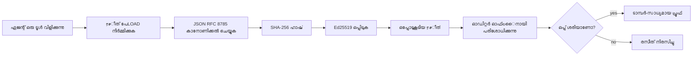
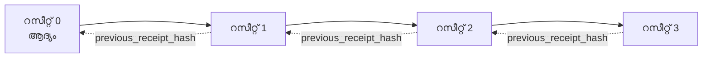

[പാഠ വീഡിയോ് കാണുക: ക്രിപ്‌റ്റോഗ്രാഫിക് റസീപ്പ്റ്റുകളിലൂടെ AI ഏജന്റുകൾ സുരക്ഷിതമാക്കൽ](https://youtu.be/PLACEHOLDER_VIDEO_ID)

> _(പാഠ വീഡിയോയും തംബ്‌നെയിൽയും Microsoft ഉള്ളടക്ക ടീമിന് മർജ് ചെയ്യുന്നതിനു ശേഷം ചേർക്കപ്പെടും, പാഠം 14 / 15 നെയുടെ മാതൃക അനുസരിച്ച്.)_

# ക്രിപ്‌റ്റോഗ്രാഫിക് റസീപ്പ്റ്റുകളിലൂടെ AI ഏജന്റുകൾ സുരക്ഷിതമാക്കൽ

## പരിചയം

ഈ പാഠത്തിൽ ഉൾപ്പെടുന്നത്:

- എം.പാത്രകൾ, ഡീബഗ്ഗിംഗ്, വിശ്വാസം എന്നിവയ്ക്കായുള്ള AI ഏജന്റുകളുടെ ഓഡിറ്റ് ട്രെയിലുകൾ എന്തിനുവേണ്ടിയാണ് പ്രധാനമായത്.
- ക്രിപ്‌റ്റോഗ്രാഫിക് റസീപ്പ്റ്റ് എന്താണെന്ന്, ഒപ്പില്ലാത്ത ലോഗ് ലൈനിൽ നിന്നുള്ള വ്യത്യാസങ്ങൾ.
- Plain Python-ൽ ഏജന്റിന്റെ ടൂൾ കോൾക്ക് ഒപ്പ് അടങ്ങിയ റസീപ്പ്റ്റ് എങ്ങനെ നിർമ്മിക്കാമെന്ന്.
- റസീപ്പ്റ്റ് ഓഫ്‌ലൈൻ പരിശോധിച്ച് ടാംപറിങ് കണ്ടെത്തൽ എങ്ങനെ നടത്താമെന്ന്.
- റസീപ്പ്റ്റുകൾ ചൈൻ ചെയ്‌തുകൊണ്ട് ഒരാളെ നീക്കംചെയ്യുകയോ പുനഃക്രമപ്പെടുത്തുകയോ ചെയ്താൽ ചൈൻ അടിക്കിടക്കുന്നത് എങ്ങനെയാണെന്ന്.
- റസീപ്പ്റ്റുകൾ എന്തെല്ലാം തെളിയിക്കുന്നു എന്നും അവ വ്യക്തമായി എന്തു തെളിയിക്കുന്നില്ല എന്നും.

## പഠനലക്ഷ്യങ്ങൾ

ഈ പാഠം പൂർത്തിയാക്കിയ ശേഷം, നിങ്ങൾക്ക് അറിയാൻ സാധിക്കും:

- ഏജന്റ് പ്രവർത്തനങ്ങൾക്ക് ക്രിപ്‌റ്റോഗ്രാഫിക് പ്രാവൈനൻസ് ആവശ്യപ്പെടുന്ന വിഫലതാ നിലകൾ തിരിച്ചറിയുക.
- സാമാന്യ JSON പേവ്ലോഡിന് മുകളിൽ Ed25519 ഒപ്പിട്ട റസീപ്പ്റ്റ് നിർമ്മിക്കുക.
- ഒപ്പിട്ട റസീപ്പ്റ്റ് സ്വതന്ത്രമായി സൈഗ്നറിന്റെ പബ്ലിക് കീ ഉപയോഗിച്ച് സ്ഥിരീകരിക്കുക.
- മാറ്റം കണ്ടെത്തൽ: സുഷിരിച്ച റസീപ്പ്റ്റിൽ പരിശോധന വീണ്ടും നടത്തിയും മാറ്റം കണ്ടെത്തുക.
- ഹാഷ് ചൈൻ ചെയ്ത റസീപ്പ്റ്റുകളുടെ അനുക്രമം നിർമ്മിച്ച് ചൈൻ പ്രാധാന്യം വിവരിക്കുക.
- റസീപ്പ്റ്റുകൾ തെളിയിക്കുന്നത് (അറ്റ്രിബ്യൂഷൻ, ഇൻറ്റഗ്രിറ്റി, ഓർഡറിംഗ്) എന്താണെന്നും അവ തെളിയിക്കാതിരിക്കുന്ന (പ്രവർത്തനത്തിന്റെ ശരിവിശ്വാസം, നയത്തിന്റെ_soundness_) എന്താണെന്നും തിരിച്ചറിയുക.

## പ്രശ്നം: നിങ്ങളുടെ ഏജന്റിന്റെ ഓഡിറ്റ് ട്രെയിൽ

Contoso Travel-നുവേണ്ടി നിങ്ങൾ ഒരു AI ഏജന്റ് വിനിയോഗിച്ചതായി تصور ചെയ്യുക. ഏജენტი ഉപഭോക്തൃ അഭ്യർത്ഥനകൾ വായിച്ച്, ഫ്‌ളൈറ്റുകൾ API-നെ വിളിച്ച് ഓപ്ഷനുകൾ പരിശോധിച്ചു, ഉപഭോക്താവിന് സീറ്റുകൾ ബുക്ക് ചെയ്യുന്നു. കഴിഞ്ഞ പാദത്തിൽ, ഏജന്റ് 50,000 ബുക്കിങ്ങുകൾ ശരിയായി പ്രോസസ് ചെയ്തു.

ഇന്ന് ഒരു ഓഡിറ്റർ എത്തുന്നു. അവൻ ചോദിക്കുന്നു: "നിങ്ങളുടെ ഏജന്റ് എന്ത് ചെയ്തത് എന്നതാണ് കാണിക്കൂ."

നിങ്ങൾ ലോഗ് ഫയലുകൾ കൈമാറുന്നു. ഓഡിറ്റർ അവ പരിശോധിച്ച് കൂടുതൽ കടുത്ത ചോദ്യം ചോദിക്കുന്നു: "ഈ ലോഗുകൾ എഡിറ്റ് ചെയ്‌തിട്ടില്ല എന്ന് എങ്ങനെ ഉറപ്പാക്കാം?"

ഇതാണ് ഓഡിറ്റ് ട്രെയിൽ പ്രശ്നം. ഇന്നത്തെ ഏജന്റ് വിനിയോഗങ്ങൾ മുഖ്യമായി ആശ്രയിക്കുന്നത്:

- **ആപ്ലിക്കേഷൻ ലോഗുകൾ**: ഏജന്റാണ് തനത് എഴുതി, ഫയൽ-സിസ്റ്റം ആക്സസ് ഉള്ള എല്ലാവരും എഡിറ്റ് ചെയ്യാൻ പറ്റും.
- **ക്ലൗഡ് ലോഗിംഗ് സേവനങ്ങൾ**: പ്ലാറ്റ്ഫോം നിലയിൽ ടാംപർ-ഇവെഡന്റ് ആണെങ്കിലും ഓഡിറ്റർ പ്ലാറ്റ്ഫോം ഓപ്പറേറ്ററെ വിശ്വാസിക്കണം.
- **ഡേറ്റാബേസ് ട്രാൻസാക്ഷൻ ലോഗുകൾ**: ഡേറ്റാബേസ് മാറ്റങ്ങൾക്ക് അനുയോജ്യം, എങ്കിലും സ്വതന്ത്ര ടൂൾ കോൾസിനല്ല.

ഓഡിറ്റർ ആരെയും വിശ്വസിക്കേണ്ടി വരാതെ ചോദ്യം മറുപടിയാക്കാൻ ഈ ഏരിയയിൽ ഒന്നുമില്ല (നിങ്ങളോ, ക്ലൗഡ് പ്രൊവൈഡറോ, ഡേറ്റാബേസ്റ്റ_VENDOR_). ആഭ്യന്തര ഉപയോഗത്തിന് ഈ വിശ്വാസം ഗൗരവമായി കാണാം. നിയമാനുസൃത ജോലി ഭാരം (ഫിനാൻസ്, ഹെൽത്ത്‌കെയർ, EU AI ക്‌ളോസ് ആയ മേഖലയിൾ) എന്നിവയ്ക്ക് ഇത് യോജ്യമല്ല.

ക്രിപ്‌റ്റോഗ്രാഫിക് റസീപ്പ്റ്റുകൾ ഓരോ ഏജന്റ് പ്രവർത്തനവും സ്വതന്ത്രമായി പരിശോധന നടത്താവുന്നതാക്കും. ഓഡിറ്റർ നിങ്ങൾക്ക് മാത്രം അല്ലാതെ നിങ്ങളുടെ പബ്ലിക് കീയും റസീപ്പ്റ്റും ആവശ്യമുള്ളതാണ്.

## ക്രിപ്‌റ്റോഗ്രാഫിക് റസീപ്പ്റ്റ് എന്ത്?

ഒരു റസീപ്പ്റ്റ് ഒരു JSON ഒബ്‌ജക്റ്റാണ്, ഏജന്റ് എന്ത് ചെയ്തത് രേഖപ്പെടുത്തുന്നു, ഡിജിറ്റൽ ഒപ്പുമായി ഒപ്പിട്ട്.


```mermaid
flowchart LR
    A[ഏജന്റ് ഒരു ടൂൾ വിളിക്കുന്നു] --> B[ரசീത് പേLOAD നിർമ്മിക്കുക]
    B --> C[JSON RFC 8785 കാനോണിക്കൽ ചെയ്യുക]
    C --> D[SHA-256 ഹാഷ്]
    D --> E[Ed25519 ഒപ്പിടുക]
    E --> F[ഒപ്പോടുകൂടിയ ரசീത്]
    F --> G[ഓഡിറ്റർ ഓഫ്‌లൈനായി പരിശോധിക്കുന്നു]
    G --> H{ഒപ്പ് ശരിയാണോ?}
    H -- yes --> I[ടാമ്പർ-സാധ്യമായ പ്രൂഫ്]
    H -- no --> J[രസീത് നിരസിച്ചു]
```

കുറഞ്ഞപക്ഷം റസീപ്പ്റ്റ് ഇങ്ങനെ കാണാം:

```json
{
  "type": "agent.tool_call.v1",
  "agent_id": "contoso-travel-bot",
  "tool_name": "lookup_flights",
  "tool_args_hash": "sha256:a3f9c1...",
  "result_hash": "sha256:7b2e1d...",
  "policy_id": "contoso-travel-policy-v3",
  "timestamp": "2026-04-25T14:30:00Z",
  "sequence": 47,
  "previous_receipt_hash": "sha256:9d4e6a...",
  "signature": {
    "alg": "EdDSA",
    "sig": "c5af83...",
    "public_key": "8f3b2c..."
  }
}
```

മൂന്ന് ഗുണങ്ങളാണ് ഇത് സാധ്യമാക്കുന്നത്:

1. **ഒപ്പ്**. റസീപ്പ്റ്റ് ഏജന്റിന്റെ ഗേറ്റ്‌വേ ഉപയോഗിച്ച് Ed25519 സ്വകാര്യ കീ ഉപയോഗിച്ച് ഒപ്പിട്ടതാണ്. പൊരുത്തമുള്ള പബ്ലിക് കീ ഉള്ള ആരും ഒപ്പു പരിശോധിച്ച് സാധുത കാണാം. ഏതെങ്കിലും ഫീൽഡ്‌ മാറ്റം ഒപ്പിന്റെ സാധുത നശിപ്പിക്കും.

2. **കാനോനിക്കൽ എൻകോഡിംഗ്**. ഒപ്പു വെയ്ക്കുന്നതിനു മുമ്പ് റസീപ്പ്റ്റ് JSON Canonicalization Scheme (JCS, RFC 8785) ഉപയോഗിച്ച് സീരിയലൈസ് ചെയ്യുന്നു. ഇതിലൂടെ രണ്ട് అమലാക്കലുകൾ ഒരേ ലൊജിക്കൽ റസീപ്പ്റ്റ് ഉണ്ടാക്കിയാൽ ബൈറ്റ്-ഇഡന്റിക്കൽ ഔട്ട്പുട്ട് ഉണ്ടാകുന്നു. canonicalization ഇല്ലെങ്കിൽ, വ്യത്യസ്ത JSON serializer-കൾ ഒരേ ഉള്ളടക്കത്തിന് വ്യത്യസ്ത ഒപ്പുകൾ ഉണ്ടാക്കും.

3. **ഹാഷ് ചൈനിങ്**. `previous_receipt_hash` ഫീൽഡ് ഓരോ റസീപ്പ്റ്റിനെയും കഴിഞ്ഞ റസീപ്പ്റ്റിന് ബന്ധിപ്പിക്കുന്നു. ഒരു റസീപ്പ്റ്റ് നീക്കംചെയ്യുകയോ പുനഃക്രമം ചെയ്യുകയോ ചെയ്താൽ പിന്നീട് വരുന്ന എല്ലാ റസീപ്പ്റ്റുകളും validity നഷ്ടപ്പെടും. ടാംപറിങ് ചൈനിൽ സൂക്ഷ്മമായി കാണാൻ കഴിയും, ഒപ്പം ഓരോ സിഗ്‌നേച്ചറിനും വിരുദ്ധമായി കഴിഞ്ഞാലും.

ഇവ കൂടി നൽകുന്ന മൂന്ന് വാഗ്ദാനങ്ങളാണ്:

- **അറ്റ്രിബ്യൂഷൻ**: ഈ കീ ഈ ഉള്ളടക്കം ഒപ്പിട്ടതാണ്.
- **ഇൻറ്റഗ്രിറ്റി**: ഒപ്പിട്ടതിനു ശേഷം ഉള്ളടക്കം മാറ്റപ്പെട്ടിട്ടില്ല.
- **ഓർഡറിംഗ്**: ഈ റസീപ്പ്റ്റ് ചൈനിൽ ആ റസീപ്പ്റ്റിന് ശേഷം വന്നതാണ്.

## Python-ൽ റസീപ്പ്റ്റ് നിർമ്മിക്കൽ

റസീപ്പ്റ്റ് നിർമ്മിക്കാൻ നിഷ്‌പ്രയാസമായ പ്രത്യേക ലൈബ്രറി ആവശ്യമില്ല. ക്രിപ്‌റ്റോഗ്രാഫിക് പ്രിമിറ്റിവുകൾ വ്യാപകമായി ലഭ്യമാണ്, ലോജിക്ക് ഒരു ചെറിയ Python കോഡ് മാത്രം.

`code_samples/18-signed-receipts.ipynb`-ഇൽ হাতে കഴിക്കുന്ന വ്യായാമങ്ങൾ മുഴുവൻ നടപടിക്രമവും വിശദമാക്കുന്നു. സംക്ഷിപ്തം:

```python
import json
import hashlib
import base64
from nacl import signing
from jcs import canonicalize  # RFC 8785 കാനോണിക്കൽ JSON

def b64url_nopad(data: bytes) -> str:
    return base64.urlsafe_b64encode(data).decode("ascii").rstrip("=")

def sha256_canonical(obj) -> str:
    """SHA-256 of a Python object's JCS-canonical JSON form."""
    return f"sha256:{hashlib.sha256(canonicalize(obj)).hexdigest()}"

# ഒരു സൈയ്നിംഗ് കീ സൃഷ്ടിക്കുക അല്ലെങ്കിൽ ലോഡ് ചെയ്യുക (പ്രൊഡക്ഷനിലായി, കീ വോൾട്ടിൽ സംഭരിച്ചു വയ്ക്കുക)
signing_key = signing.SigningKey.generate()
verify_key = signing_key.verify_key

# റസീപ്പ് payload നിർമ്മിക്കുക (ഇപ്പോൾ വരെ ഒപ്പിടൽ ഇല്ല)
tool_args = {"origin": "SYD", "destination": "LAX"}
tool_result = [{"flight": "QF11", "price": 1850, "stops": 0}]

payload = {
    "type": "agent.tool_call.v1",
    "agent_id": "contoso-travel-bot",
    "tool_name": "lookup_flights",
    "tool_args_hash": sha256_canonical(tool_args),
    "result_hash": sha256_canonical(tool_result),
    "policy_id": "contoso-travel-policy-v3",
    "timestamp": "2026-04-25T14:30:00Z",
    "sequence": 0,
    "previous_receipt_hash": None,
}

# കാനോണിക്കൽ ചെയ്യുക, ഹാഷ് ചെയ്യുക, ഒപ്പ് വെക്കുക.
canonical_bytes = canonicalize(payload)
message_hash = hashlib.sha256(canonical_bytes).digest()
signature_bytes = signing_key.sign(message_hash).signature

# ഒരു ഘടനാപരമായ ഒപ്പ് വസ്തു ബന്ധിപ്പിക്കുക.
receipt = {
    **payload,
    "signature": {
        "alg": "EdDSA",
        "sig": b64url_nopad(signature_bytes),
        "public_key": b64url_nopad(bytes(verify_key)),
    },
}
```

ഇതുവരെ ഒപ്പിടലിന്റെ മുഴുവൻ പൈപ്പ്‌ലൈൻ ഇതാണു. നോബുക്കിൽ ഓരോ ഘട്ടവും വിശദമായി പടിപടിയായി കാണിക്കുന്നു.

## റസീപ്പ്റ്റ് പരിശോധനയും ടാംപറിങ് കണ്ടെത്തലും

പരിശോധന അത് വിപരീതമാണ്:

```python
import base64
import hashlib
from nacl import signing
from nacl.exceptions import BadSignatureError
from jcs import canonicalize

def b64url_decode(s: str) -> bytes:
    padding = "=" * ((4 - len(s) % 4) % 4)
    return base64.urlsafe_b64decode(s + padding)

def verify_receipt(receipt: dict) -> bool:
    # ഒപ്പ് ഒരു ഘടനാപരമായ വസ്തുവാണ്: {"alg", "sig", "public_key"}.
    sig_obj = receipt.get("signature")
    if not sig_obj or sig_obj.get("alg") != "EdDSA":
        return False

    # യാഥാർത്ഥ്യത്തിൽ ഒപ്പിട്ട പേലോഡ് പുനർനിർമിക്കുക (ഒപ്പിനെ ഒഴികെയുള്ള എല്ലാം).
    payload = {k: v for k, v in receipt.items() if k != "signature"}

    canonical_bytes = canonicalize(payload)
    message_hash = hashlib.sha256(canonical_bytes).digest()

    try:
        verify_key = signing.VerifyKey(b64url_decode(sig_obj["public_key"]))
        verify_key.verify(message_hash, b64url_decode(sig_obj["sig"]))
        return True
    except BadSignatureError:
        return False
```

ഈ ഫംഗ്ഷൻ ഒരു റസീപ്പ്റ്റ് വാങ്ങി ഒപ്പ് സാധുതയുള്ളെങ്കിൽ `True` കാണിക്കും, ഇല്ലെങ്കിൽ `False`. നേത്വർക്ക് വിളി, സേവന ആശ്രയം ഒന്നും ഇല്ലാതെ. മൂന്നാം പക്കയുടെ വിശ്വാസവും ഒഴിവ്.

ടാംപറിങ് കണ്ടെത്തൽ പ്രവർത്തനം കാണാൻ നോബുക്ക് നടത്തുന്നത്:

1. സാധുവായ ഒരു റസീപ്പ്റ്റ് നിർമ്മിച്ച് പരിശോധിക്കുക.
2. `tool_args_hash` ഫീൽഡിലെ ഒരു ബൈറ്റ്ങ്ങൾ മാറ്റുക.
3. വീണ്ടും പരിശോധന ഓടിച്ച് പരാജയം കാണുക.

റസീപ്പ്റ്റുകൾ ടാംപർ-ഇവെഡന്റ് ആയിരിക്കാനുള്ള പ്രായോഗിക തെളിവാണ് ഇത്: ചെറിയ നടപടമായാലും ഒപ്പിന്റെ സാധുത തകരും.

## ബഹു ഘട്ട ഏജന്റുകൾക്ക് റസീപ്പ്റ്റുകൾ ചൈനിൽ ബന്ധിപ്പിക്കൽ

ഒറ്റ ഒപ്പിട്ട റസീപ്പ്റ്റ് ഒരു പ്രവർത്തനം സംരക്ഷിക്കും. റസീപ്പ്റ്റുകളുടെ ചൈനു ഒരു തുടരെയുള്ള പ്രവർത്തന ക്രമം സംരക്ഷിക്കും.


```mermaid
flowchart LR
    R0[റസീറ്റ് 0<br/>ആദ്യം] --> R1[റസീറ്റ് 1]
    R1 --> R2[റസീറ്റ് 2]
    R2 --> R3[റസീറ്റ് 3]
    R1 -. previous_receipt_hash .-> R0
    R2 -. previous_receipt_hash .-> R1
    R3 -. previous_receipt_hash .-> R2
```

ഓരോ റസീപ്പ്റ്റും മുൻവന്ന റസീപ്പ്റ്റിന്റെ ഹാഷ് രേഖപ്പെടുത്തുന്നു. 2-ആമത്തെ റസീപ്പ്റ്റ് മിസ്റ്റായി നീക്കം ചെയ്യാൻ ആക്രമി ചെയ്തത് ആവശ്യമാകും:

- 3-ആമത്തെ റസീപ്പ്റ്റിലെ `previous_receipt_hash` മാറ്റി ഒപ്പിന്റെ നാശം വരുത്തുക, അല്ലെങ്കിൽ
- തെറ്റിദ്ധരിച്ച റസീപ്പ്റ്റ് 3 ന് പുതിയ ഒപ്പ് തിരക്കുക (ഏജന്റിന്റെ സ്വകാര്യ കീ ആവശ്യം).

സ്വകാര്യ കീ ഒരു ഹാർഡ്‌വെയർ കീ വോൾട്ടിൽ സൂക്ഷിച്ചിരിക്കുകയാണെങ്കിൽ, നിങ്ങളുടെ ഓരോ റസീപ്പ്റ്റിനും പബ്ലിക് കീ പ്രസിദ്ധീകരിച്ചതും ആയിരിക്കുകയാണെങ്കിൽ, ഈ ആക്രമികൾ കണ്ടെത്താതെ നടക്കാനാകില്ല.

നോബുക്ക് വഴി:

1. മൂന്ന് റസീപ്പ്റ്റുകളുടെ ചൈനുചെയ്യൽ.
2. ഓരോ റസീപ്റ്റിന്റെയും `previous_receipt_hash` മുമ്പത്തെ റസീപ്പ്റ്റിന്റെ യഥാർത്ഥ ഹാഷുമായി പൊരുത്തപ്പെടുന്നത് പരിശോധിക്കൽ.
3. മധ്യത്തിലുള്ള റസീപ്പ്റ്റിൽ ടാംപർചെയ്ത് ചൈൻ തകരുന്നത് കാണുക.

ഇത് എങ്ങനെ നിങ്ങളെന്നു വ്യക്തമാക്കുന്ന ഒരു ഓഡിറ്റ് ട്രെയിൽ നിർമ്മിക്കുന്നത്, അത് പുറത്തുള്ള ഓഡിറ്റർ വിശ്വസിക്കാതെ തന്നെ പരിശോധിക്കാനാകും.

## റസീപ്പ്റ്റുകൾ തെളിയിക്കുന്നത് (എന്തും പ്രതിപാദിക്കാത്തത്)

ഈ പാഠത്തിലെ ഏറ്റവും പ്രധാനം ഭാഗം. റസീപ്പ്റ്റുകൾ ശക്തമാണ്, എന്നാൽ അതിന്റെ ശക്തി പരിമിതമാണ്.

**റസീപ്പ്റ്റുകൾ മൂന്ന് കാര്യം തെളിയിക്കുന്നു:**

1. **അറ്റ്രിബ്യൂഷൻ**: ഒരു പ്രത്യേക കീ ഒരു പ്രത്യേക പേവ്ലോഡ് ഒപ്പിട്ടത്.
2. **ഇൻറ്റഗ്രിറ്റി**: ഒപ്പിട്ടതിനു ശേഷം പേവ്ലോഡ് മാറിയിട്ടില്ല.
3. **ഓർഡറിംഗ്**: ഈ റസീപ്പ്റ്റ് ഹാഷ് ചൈനിൽ ആ റസീപ്പ്റ്റ്‌ക്ക് ശേഷം വന്നു.

**റസീപ്പ്റ്റുകൾ തെളിയിക്കുന്നില്ല:**

1. **ശരിയായ പ്രവർത്തനം**: ഏജന്റിന്റെ പ്രവർത്തനം ശരിയായിരുന്നുവെന്ന്. തെറ്റ് ഉള്ള ഉത്തരം പോലും ഒപ്പിട്ടു നൽകാമായിരുന്നു.
2. **നയാനുസരണം**: `policy_id` ൽ കാണിച്ച നയം വിലയിരുത്തപ്പെട്ടതായി അല്ലെങ്കിൽ അത് പ്രവർത്തിക്കും പോലെ നോക്കുകയായിരുന്നെന്ന്. റസീപ്പ്റ്റ് ആവശ്യപ്പെട്ടതും നിർവഹിച്ചതും തമ്മിൽ വ്യത്യാസമുള്ളതാണ്.
3. **കീയുടെ മുന്നിലുമുള്ള വ്യക്തി/സംഘടന തിരിച്ചറിയൽ**: "ഈ കീ ഈ ഉള്ളടക്കം ഒപ്പിട്ടു" മാത്രമാണ് പറയുന്നത്. "ഈ മനുഷ്യൻ അധികാര നൽകിയിരിക്കുന്നു" എന്നല്ല. വ്യക്തി ബന്ധിപ്പിക്കൽ വ്യത്യസ്ഥ തിരിച്ചറിയൽ ഘടന ആവശ്യമാണ്.
4. **ഇൻപുട്ടുകളുടെ സത്യസന്ധത**: ഏജന്റ് മാറ്റം വരുത്തിയ പ്രോംപ്റ്റ് സ്വീകരിക്കുകയും പ്രവർത്തിക്കുകയുമായിരുന്നെങ്കിൽ, റസീപ്പ്റ്റ് പ്രവർത്തനം വിശ്വസനീയമായി രേഖപ്പെടുത്തും. എംപുട്ട് സ്ഥിരീകരണത്തിന്റെ ഉപകാരം, അതിന്റെ പകരം അല്ല.

ഈ പരിധി രണ്ട് കാരണങ്ങൾക്ക് പ്രധാനമാണ്:

- റസീപ്പ്റ്റുകൾ ഏത് കാര്യങ്ങൾക്ക് ഉപയോഗപ്രദമാണെന്ന് വ്യക്തമാക്കുന്നു: ഏജന്റ് പ്രവർത്തനം ഓഡിറ്റബിൾ, ടാംപർ-ഇവെഡന്റ് ആക്കുന്നത് സ്ഥാപിക്കുന്നത്, സംഘടനാതിടക്കുകൾ കടന്നുപോകുമ്ബോൾ പോലും.
- നിങ്ങൾക്ക് എന്ത് അധിക ഘടകങ്ങൾ ആവശ്യമുള്ളതെന്ന് പറയുന്നു: ഇൻപുട്ട് സ്ഥിരീകരണം (പാഠം 6), നയം പ്രാബല്യത്തിൽ വരുത്തൽ (താഴെ ചെറിയ പരിചയം), തിരിച്ചറിയൽ ഘടന (ഈ പാഠത്തിനപുറത്ത്).

പൊതുവായി തെറ്റ്: "നമുക്കു റസീപ്പ്റ്റ്സ് ഉണ്ട്" എന്നത് "നാം നിയന്ത്രിതരാണ്" എന്നു കരുതുന്നത്. അത് ശരിയല്ല. റസീപ്പ്റ്റുകൾ ഒരു അടിസ്ഥാനം മാത്രമാണ്. ഗവർണൻസ് നിങ്ങൾ നിർമ്മിക്കുന്ന സംവിധാനം ആണു.

## പ്രൊഡക്ഷൻ റഫറൻസുകൾ

ഈ പാഠത്തിലെ Python കോഡ് സൂക്ഷ്മമാക്കപ്പെട്ടതാണ്; ഓരോ വരിയും വായിച്ച് പ്രശ്‌നമറ്റത്ത മനസ്സിലാക്കാം. പ്രൊഡക്ഷനിൽ, രണ്ട് മാർഗ്ഗങ്ങൾ ഉണ്ട്:

1. **ക്രിപ്‌റ്റോഗ്രാഫിക് പ്രിമിറ്റിവുകൾ നേരിട്ട് ഉപയോഗിക്കുക.** മുകളിൽ കാണിച്ച 50 വരികൾ പല ഉപയോഗങ്ങൾക്കും മതി. PyNaCl (Ed25519)യും `jcs` പാക്കേജും (കാനോനിക്കൽ JSON) നന്നായി പരിപാലിച്ചും ഓഡിറ്റ് ചെയ്തും ഉള്ളവയാണ്.

2. **പ്രൊഡക്ഷൻ റസീപ്പ്റ്റ് ലൈബ്രറി ഉപയോഗിക്കുക.** നിരവധി ഓപ്പൺ‌സ്‌ോഴ്‌സ് പ്രോജക്ടുകൾ ഇതേ മാതൃക പ്രയോഗിക്കുന്നു, അധിക ഫീച്ചറുകൾ (കീ റോട്ടേഷൻ, ബാച്ച് വെരിഫിക്കേഷൻ, JWK സെറ്റ് വിതരണം, നയ എൻജിനുകളുമായി ഐക്യപ്പെടുത്തൽ) എന്നിവയടക്കം:
   - ഈ പാഠത്തിൽ ഉപയോഗിക്കുന്ന റസീപ്പ്റ്റ് ഫോർമാറ്റ് ഒരു IETF Internet-Draft (`draft-farley-acta-signed-receipts`) ആണ് ഇപ്പോൾ സ്റ്റാൻഡേർഡ്സ് പ്രക്രിയയിൽ.
   - Microsoft Agent Governance Toolkit സീഡാർ അധിഷ്ഠിത നയ തീരുമാനം ചേര്ത്ത് റസീപ്പ്റ്റുകൾ നിർമിക്കുന്നു; ആ റെപ്പോസിറ്ററിയിലെ ട്യൂട്ടോറിയൽ 33-ൽ എറ്റവും മുഴുവൻ ഉദാഹരണം കാണാം.
   - `protect-mcp` (npm)യും `@veritasacta/verify`(npm)യും നോട് അടിസ്ഥാനത്തിലുള്ള റസീപ്പ്റ്റ് ഒപ്പിടലും ഓഫ്‌ലൈൻ വെരിഫിക്കേഷനും പ്രദാനം ചെയ്യുന്ന പാക്കേജുകൾ, ഏത് MCP സർവറും ടാംപർ-ഇവെഡന്റ് ഓഡിറ്റ് ട്രെയിൽ വഴി പൊതിഞ്ഞ് നൽകാനുള്ള ഉദ്ദേശ്യത്തോടെ.
   - **[nobulex](https://github.com/arian-gogani/nobulex)** Python SDK (`pip install nobulex`) Python ൽ തന്നെ Ed25519 + JCS ഒപ്പിടൽ മാതൃക LangChain-ും CrewAI-ഉം സജ്ജീകരണങ്ങളും ഉൾപ്പെടുത്തി നൽകുന്നു, പ്രസിദ്ധീകരിച്ച ക്രോസ്-വാലിഡേഷൻ ടെസ്റ്റ് വെക്ടറുകളും [OWASP PR #2210](https://github.com/OWASP/CheatSheetSeries/pull/2210) വഴി സംഭാവനചെയ്‌ത കേമ്ലയൻസ് മാപ്പിംഗ് ഉൾപ്പെടെ.

സ്വയം രചിക്കുന്നതും ലൈബ്രറി ഉപയോഗിക്കുന്നതുമായ തീരുമാനത്തിൽ JWT ലൈബ്രറി രചനയും പരീക്ഷിച്ച ലൈബ്രറിയും തമ്മിലുള്ള തീരുമാനം പോലെ തന്നെയാണ്: രണ്ടും സുതാര്യമാണ്; ലൈബ്രറി സമയം ലാഭിക്കും, ഓഡിറ്റ് പരിധി കുറക്കും; സ്വയം രചിക്കുന്നത് എല്ലാ പ്രിമിറ്റിവും മനസ്സിലാക്കാൻ നിർബന്ധിക്കുന്നു. ഈ പാഠം സ്വയം രചനയുടെ വഴിയാണ് പഠിപ്പിക്കുന്നത്, അതിനാൽ നിങ്ങൾക്ക് രണ്ട് വഴികാഴ്ചകൾക്കും പാടവമുണ്ടാവും.

## അറിവ് പരീക്ഷണം

പ്രായോഗിക ഉപദേശം തുടങ്ങുന്നതിനു മുമ്പ് നിങ്ങളുടെ അറിവ് പരീക്ഷിക്കൂ.

**1. റസീപ്പ്റ്റ് ഏജന്റിന്റെ സ്വകാര്യ Ed25519 കീ ഉപയോഗിച്ച് ഒപ്പിട്ടിരിക്കുന്നു. ഓഡിറ്റർക്ക് മാത്രമാണ് പൊതുഗീ. ഓഫ്ലൈനിൽ റസീപ്പ്റ്റ് ഓഡിറ്റർ സ്ഥിരീകരിക്കുമോ?**

<details>
<summary>ഉത്തരം</summary>

അതെ. Ed25519 പരിശോധനയ്ക്ക് മാത്രം പബ്ലിക് കീയും ഒപ്പിട്ട ബൈറ്റുകളും ആവശ്യമാണ്. നെറ്റ്‌വർക്ക് കോളും, സേവന ആശ്രയവുമില്ല. ഇത് റസീപ്പ്റ്റുകൾ എയർ-ഗ്യാപ്ഡ്, ബഹുസംഘടന പരിമിത പ്രദേശങ്ങളിൽ ഫലപ്രദമാക്കുന്ന ഘടകമാണ്.
</details>

**2. ഒരു ആക്രമി റസീപ്പ്റ്റിലെ `policy_id` ഫീൽഡ് മാറ്റി കൂടുതൽ അനുകൂല നയം ആയിട്ടാണ് അവകാശപ്പെടുന്നത്. ഒപ്പ് യഥാർത്ഥ പേവ്ലോഡിനു മീതെയാണ്. പരിശോധനയിൽ എന്താകും സംഭവിക്കുന്നത്?**

<details>
<summary>ഉത്തരം</summary>

പരിശോധന പരാജയപ്പെടും. ഒപ്പ് യഥാര്‍ത്ഥ പേവ്ലോഡിന്റെ കാനോനിക്കൽ ബൈറ്റുകളിൽ കണക്കാക്കിയതാണ്; ഫീൽഡ് മാറ്റുന്നത് ബൈറ്റുകൾ മാറ്റാനും SHA-256 ഹാഷ് മാറ്റാനും ഒപ്പ് അസാധുവാക്കാൻ ബുദ്ധിമുട്ടില്ല. ആക്രമകന് സ്വകാര്യ കീ ഇല്ലാത്തതിനാൽ പുതിയ സാധുവായ ഒപ്പ് ഉണ്ടാക്കുക സാധ്യമല്ല.
</details>

**3. `tool_args_hash` ഉം `result_hash` ഉം മൂല_ARGUMENTS_ ഫീൽഡുകൾക്ക് പകരം ഉപയോഗിക്കുന്നത് എന്തുകൊണ്ട്?**

<details>
<summary>ഉത്തരം</summary>

രണ്ടാണ് കാരണമുള്ളത്. ആദ്യം, റസീപ്പ്റ്റ് സംഭരിക്കേണ്ടതോ അയയ്ക്കേണ്ടതോ ചെയ്യുന്ന ഇടങ്ങളിൽ ആ ഉള്ളടക്കം (PII, ബിസിനസ് ഡാറ്റ) പുറത്തേക്ക് ചോർന്നാൽ പ്രശ്നമുണ്ട്. ഹാഷ് ഉപയോഗിക്കുന്നത് റസീപ്പ്റ്റ് ചെറുതും ഉള്ളടക്കം സ്വകാര്യവുമാക്കുന്നു; ഓഡിറ്റർ ഹാഷ് വേറിട്ടുള്ള അസലിൽ ഉള്ളടക്കത്തുമായി പൊരുത്തപ്പെടുത്തുന്നു. രണ്ടാം, ഹാഷുകൾ സ്ഥിരമാനമുള്ള വലിപ്പമുള്ളതാണ്; ഇൻപുട്ട് ഔട്ട്പുട്ട് എത്ര വലിയത് ആയാലും ഹാഷ് ഉള്ള റസീപ്പ്റ്റ് വലുപ്പം നിയന്ത്രിതമാണ്.
</details>

**4. `previous_receipt_hash` ഫീൽഡ് ഓരോ റസീപ്പ്റ്റിനെയും മുൻവന്നതിന് ബന്ധിപ്പിക്കുന്നു. ചൈനിൽ മദ്ധ്യത്തിൽ നിന്ന് ഒരാൾ രഹസ്യമായി ഒരു റസീപ്പ്റ്റ് നീക്കംചെയ്താൽ എന്ത് അസാധുവാകും?**

<details>
<summary>ഉത്തരം</summary>

നീക്കംചെയ്ത റസീപ്പ്റ്റിന് ശേഷം വന്ന എല്ലാ റസീപ്പ്റ്റുകളും. അവയുടെ `previous_receipt_hash` യഥാർത്ഥ ചൈനുമായി പൊരുത്തപ്പെടില്ല (എന്തെന്നാൽ സൂചിപ്പിച്ച റസീപ്പ്റ്റ് ഇപ്പോൾ ഇല്ലാതായതിനാലോ അല്ലെങ്കിൽ ചൈൻ മറ്റൊരു മുൻവന്നക്കയിലേക്ക് പോയപ്പോൾ). നീക്ക മറയ്ക്കാൻ, ആക്രമി എല്ലാ‌ ശേഷമുള്ള റസീപ്പ്റ്റുകളും വീണ്ടും ഒപ്പ് വെക്കണം, അവർക്കു സാധുവാനുള്ള സ്വകാര്യ കീ വേണം.
</details>

**5. റസീപ്പ്റ്റ് ശരിയായി പരിശോധിച്ചു. അതു ഏജന്റിന്റെ പ്രവർത്തനം ശരിയാണെന്ന്, ശബ്ദമാണെന്ന്, നയ നിബന്ധനകൾ പാലിച്ചതാണെന്ന് തെളിയിക്കുമോ?**

<details>
<summary>ഉത്തരം</summary>

ഇല്ല. സാധുവായ ഒരു റസീപ്പ്റ്റ് മൂന്നു കാര്യങ്ങൾ തെളിയിക്കുന്നു: അറ്റ്രിബ്യൂഷൻ (ഈ കീ ഈ ഉള്ളടക്കം ഒപ്പിട്ടു), ഇൻറ്റഗ്രിറ്റി (ഉള്ളടക്കം മാറിയിട്ടില്ല), ഓർഡറിംഗ് (ഈ റസീപ്പ്റ്റ് ആ റസീപ്പ്റ്റിന് ശേഷം). ഇത് പ്രവർത്തനം ശരിയാണെന്ന്, `policy_id`-ൽ പറയുന്ന നയം യാഥാർത്ഥ്യത്തിൽ പരിശോധിക്കപ്പെട്ടെന്നും, ഏജന്റ് എല്ലാ നിയമങ്ങളും പാലിച്ചതിനും തെളിവ് അല്ല. റസീപ്പ്റ്റുകൾ ഏജന്റ് പെരുമാറ്റം ഓഡിറ്റബിൾ ആക്കുന്നു, ശരിയായതല്ല. പാഠത്തിലെ ഏറ്റവും പ്രധാന പരിധിയാണ് ഇത്.
</details>

## പ്രായോഗിക വ്യായാമം

`code_samples/18-signed-receipts.ipynb` തുറക്കൂ, എല്ലാ നാല് വിഭാഗങ്ങൾക്കും പൂർത്തിയാക്കൂ:

1. **വിഭാഗം 1**: ആദ്യ റസീപ്പ്റ്റിൽ ഒപ്പ് വെച്ച് പരിശോധിക്കൂ.
2. **വിഭാഗം 2**: റസീപ്പ്റ്റിൽ ടാംപർചെയ്ത് പരിശോധന പരാജയം കാണൂ.
3. **വിഭാഗം 3**: മൂന്ന് റസീപ്പ്റ്റ് ചൈനു നിർമ്മിച്ച് എടുക്കൂ, ചൈനിന്റെ സംഭാവന പരിശോധിക്കുക.
4. **വിഭാഗം 4**: Microsoft Agent Framework ഉപയോഗിച്ചുള്ള ഏജന്റിന് ടൂൾ കോൾ റസീപ്പ്റ്റ് ഒപ്പിടലുമായി പൊതിച്ച്, റസീപ്പ്റ്റ് സ്വതന്ത്രമായി പരിശോധന നടത്തുക.


**സ്റ്റ്രെച്ച് ചലഞ്ച് 1:** നിങ്ങളുടേതായി തിരഞ്ഞെടുക്കുന്ന ഒരു അധിക ഫീൽഡോടെ രസീത് സ്കീമ വಿಸ್ತരിക്കുക (ഉദാഹരണത്തിന്, ട്രേസിംഗിനുള്ള അഭ്യർത്ഥന ഐഡി), അതിൽ ഉൾപ്പെടുത്തുന്നതിന് കാനോണിക്കൽ സൈൻ ചെയ്യൽ ലോഗിക് അപ്ഡേറ്റ് ചെയ്യുക, രസീത് സ്ഥിരീകരണത്തിലൂടെ മുമ്പും ശേഷം ഒരു വട്ടം സഞ്ചരിക്കുന്നുവെന്ന് സ്ഥിരീകരിക്കുക. തുടർന്ന് സൈൻ ചെയ്യുന്നതിനു ശേഷം ഫീൽഡ് മാറ്റി സ്ഥിരീകരണം പരാജയപ്പെടുന്നത് സ്ഥിരീകരിക്കുക. ഇത് കാനോണിക്കൽ എൻകോഡിങ്ങിന്റെ ഓരോ ബൈറ്റും സിഗ്നേച്ചറിൽ എങ്ങനെ സംഭാവന നൽകുന്നുവെന്ന് മനസ്സിലാക്കാൻ നിർബന്ധിക്കുന്നു.

**സ്റ്റ്രെച്ച് ചലഞ്ച് 2:** നിങ്ങളുടെ രണ്ടു രസീതുകൾ SHA-256-ഹാഷ് ചെയ്യുക (അവയുടെ കാനോണിക്കൽ ബൈറ്റുകൾ ഒരു നിർണ്ണിത ക്രമത്തിൽ ചേർക്കുക) മൂവാ രസീതിൽ പുതിയ ഫീൽഡായി ഈ ഡൈജസ്റ്റ് ഉൾപ്പെടുത്തുക, പിന്നീട് സൈൻ ചെയ്യുക. മൂന്ന് രസീതുകൾ എല്ലാം വട്ടം സഞ്ചരിക്കുന്നതായി പരിശോധിക്കുക. നിങ്ങൾ ഇപ്പോൾ ഒറ്റ ഘട്ട ഇൻക്ലൂഷൻ പ്രൂഫ് നിർമ്മിച്ചിട്ടുണ്ട്: മൂന്നാമത്തെ രസീത് കൈവശം വെച്ച ഏതെങ്കിലും ആളും ആദ്യ രണ്ടു രസീതുകൾ സൈൻ ചെയ്ത സമയത്ത് ഉണ്ടായിരുന്നുവെന്ന് തെളിയിക്കാം, അവയുടെ ഉള്ളടക്കങ്ങൾ മറുപടിയാക്കാതെ. ഇത് സെലക്ടീവ്-ഡിസ്ക്ലോഷർ രസിതുകളിൽ വലിയ തോതിൽ ഉപയോഗിക്കുന്ന മാതൃകയാണ് (മെർക്കിൽ കമ്മിറ്റ്മെന്റുകൾ, RFC 6962).

## 결론്

ക്രിപ്‌റ്റോഗ്രഫിക് രസീതുകൾ AI ഏജന്റുകൾക്ക്Audit ട്രെയിൽ നൽകുന്നു അത്:

- **സ്വതന്ത്രമായി സ്ഥിരീകരിക്കാവുന്നതാണ്**: പബ്ലിക് കീ ഉള്ള ഏത് പാർട്ടിക്കുമെല്ലാം സ്ഥിരീകരിക്കാൻ കഴിയും, സേവന ആശ്രിതത്വമില്ലാതെ.
- **ട്രാങ്ക്ഷൻ മുൻകൂട്ടി തെളിയിക്കുന്നതാണ്**: ഏതെങ്കിലും മാറ്റം സിഗ്നേച്ചർ അസാധുവാക്കും.
- **പോര്‌ടബിള്‍**: രസീത് ഒരു ചെറിയ JSON ഫയലാണ്; ഇത് സൂക്ഷിക്കാനും അയയ്ക്കാനും വൺലോകരായി പരിശോധിക്കാനും കഴിയും.
- **സ്റ്റാൻഡേർഡ്-അളവിൽ:** Ed25519 (RFC 8032), JCS (RFC 8785), SHA-256 എന്നിവയുടെ അടിസ്ഥാനത്തിൽ നിർമ്മിച്ചതാണ്, എല്ലാം വ്യാപകമായി ഉപയോഗിക്കുന്ന പ്രിമിറ്റിവുകൾ.

ഇത് ഇൻപുട്ട് വെരിഫിക്കേഷൻ, పాలസി നടപ്പാക്കൽ, അല്ലെങ്കിൽ ഐഡന്റിറ്റി ഇൻഫ്രാസ്ട്രക്ച്ചർ വേണ്ടി പകരം വരുന്നില്ല. ഇത് ആ ലേയർസിന് അടിസ്ഥാനവുമായി പ്രവർത്തിക്കുന്നു. റെഗുലേറ്റുചെയ്‌ത ജോലിത്തുടർച്ചയിലോ, ബഹുഒർഗനൈസേഷൻ വർക്ക്‌ഫ്ലോയിൽഒ, അല്ലെങ്കിൽ ഭാവിയിലെ ഓഡിറ്റർ നിങ്ങളെ വിശ്വസിക്കില്ലെന്ന് കരുതേണ്ട സാഹചര്യങ്ങളിൽനിന്നും ആയിന്ദ ഗുണമേന്മയുള്ള ഓഡിറ്റ് ട്രെയിൽ ഉറപ്പാക്കാൻ രസീതുകൾ ഉപയോഗിക്കുന്നു.

ഏറ്റവും പ്രധാനപ്പെട്ട സൂത്രവാക്യം: രസീതുകൾ ആരാണെന്ന്, എന്ത് പറഞ്ഞു, എപ്പോൾ എന്നു തെളിയിക്കുന്നു. എന്ത് പറഞ്ഞുവെന്നും അതു ശരിയാണെന്ന് അല്ല. ആ വ്യത്യാസം നന്നായി മനസ്സിലാക്കുക. അത് ഒരു അവിഭാജ്യ പ്രൊവനൻസ് സിസ്റ്റവും തിരുസൂചനയില്ലാത്തവുമായ വ്യത്യാസമാണ്.

## ഉത്പാദന ചെക്ലിസ്റ്റ്

ഈ പാഠത്തിൽ നിന്നു വന്നു ആക്റ്റുയൽ എൻവയരൺമെന്റിൽ receipt-സിംഗ്നുചെയ്‌ത ഏജന്റുകൾ പ്രയോഗിക്കുന്നത് തുടങ്ങാൻ തയ്യാറാകുമ്പോൾ:

- [ ] **ഡെവലപ്പർ ലാപ്ടോപ്പിൽ നിന്നു സൈൻ ചെയ്‌യുന്ന കീ നീക്കം ചെയ്യുക.** Azure Key Vault, AWS KMS, അല്ലെങ്കിൽ ഹാർഡ്‌വെയർ സെക്യൂരിറ്റി മോഡ്യൂൾ ഉപയോഗിക്കുക. നിങ്ങളുടെ രസീതുകൾ സൈൻ ചെയ്യുന്നതിന് സ്വകാര്യ കീ സോഴ്‌സ് കൺട്രോളിൽ അല്ലെങ്കിൽ ഉപയോക്തൃ യന്ത്രങ്ങളിൽ പ്ലെയിൻടെക്സ്റ്റിൽ നിലനിൽക്കരുത്.
- [ ] **പബ്ലിക് കീ പ്രൊഫീൽ പ്രസിദ്ധീകരിക്കുക.** ഓഡിറ്റർമാർക്ക് അത് ഒഫ്‌ലൈൻ പരിശോധിക്കാൻ ആവശ്യമുണ്ട്. സ്റ്റാൻഡേർഡ് മാതൃക ഒരു JWK സെറ്റ് അറിയപ്പെട്ട URL ലെ (RFC 7517) സ്ഥിതിചെയ്യുന്നു, ഉദാഹരണം `https://your-org.example.com/.well-known/agent-keys.json`.
- [ ] **ചെയിൻ ബാഹ്യമായി ആങ്കർ ചെയ്യുക.** സമയക്രമം ആയി ഏറ്റവും പുതിയ ചെയിൻ ഹെഡ് ഹാഷ് ഒരു ട്രാൻസ്പരൻസി ലോഗിൽ (Sigstore Rekor, RFC 3161 ടൈംസ്റ്റാമ്പ് അധികൃത, അല്ലെങ്കിൽ രണ്ടാമത്തെ ആഭ്യന്തര സിസ്റ്റം) എഴുതി വെക്കുക, ബാഹ്യ പാർട്ടി "ഈ ചെയിൻ ഈ സമയത്ത് ഉണ്ടായിരുന്നു" എന്ന് സ്ഥിരീകരിക്കാൻ കഴിയുന്നുവെന്ന് ഉറപ്പാക്കാൻ.
- [ ] **രസീതുകൾ മാറ്റം വരുത്താതെ സൂക്ഷിക്കുക.** Append-only ബ്‌ളോബ് സ്റ്റോറേജ് (Azure Storage with immutability policies, AWS S3 Object Lock) സ്റോറെജ് ലെയറിൽ ഉള്ളിലെ ആളുകൾ ചരിത്രം തിരുത്തുന്നത് തടയുന്നു.
- [ ] **അടച്ചുപൊക്കാൻ തീരുമാനം എടുക്കുക.** അനേകം അളവിൽ പാലന വ്യവസ്ഥകൾ ബഹുസംഖ്യ വാർഷിക അണവിച്ചിതരണം ആവശ്യപ്പെടുന്നു. രസീത് വളർച്ചയ്ക്ക് പദ്ധതിയിടുക (ഓരോ രസീത് ഏകദേശം ~500 ബൈറ്റ്സ് ആണ്; ഒരു ഏജന്റ് ദിവസേന 10,000 കോളുകൾ ചെയ്താൽ വർഷം ~1.8 GB ഡാറ്റ സൃഷ്ടിക്കുന്നു).
- [ ] **രസീതുകൾ എന്ത് ഉൾക്കൊള്ളുന്നില്ലെന്ന് രേഖപ്പെടുത്തുക.** രസീതുകൾ പ്രതിബന്ധനം, ഐക്യസ്ഥിതി, ഓർഡറിംഗ് തെളിയിക്കുന്നു. നിങ്ങളുടെ റൺബുക്ക് വ്യക്തമാകും എന്ത് അധിക നിയന്ത്രണങ്ങൾ (ഇൻപുട്ട് വെരിഫിക്കേഷൻ, പോളിസി നടപ്പാക്കൽ, നിരക്ക് പരിധി, ഐഡന്റിറ്റി ഇൻഫ്രാസ്ട്രക്ച്ചർ) Governance നിലയിൽ രസീതുകളോട് കൂടെ പ്രവർത്തിക്കുന്നു.

### AI ഏജന്റുകൾ സുരക്ഷിതമാക്കൽ സംബന്ധിച്ച കൂടുതലുള്ള ചോദ്യങ്ങൾ ഉണ്ടോ?

മറ്റ് പഠനാർത്ഥികളുമായി ചേർന്ന് ആശയവിനിമയം നടത്താൻ, ഓഫീസർ മണിക്കൂറുകളിൽ പങ്കെടുക്കാൻ, നിങ്ങളുടെ AI ഏജന്റുകൾ സംബന്ധിച്ച ചോദ്യങ്ങൾക്ക് ഉത്തരങ്ങൾ ലഭിക്കാൻ [Microsoft Foundry Discord](https://aka.ms/ai-agents/discord) ൽ ചേരുക.

## ഈ പാഠത്തിന് ശേഷം

ഈ പാഠം ഏക രസീത് സൈൻिंगയും ഹാഷ്ചെയിൻ ചെയ്ത ക്രമങ്ങളും ഉൾക്കൊള്ളുന്നു. Governance നില മെച്ചപ്പെടുമ്പോൾ നിങ്ങൾ കാണാൻ കഴിയുന്ന കൂടുതൽ അനുഷ്ഠാനങ്ങൾ ഇതിന് മെറ്റീരിയൽ ആയി ഉൾപ്പെടുന്നു:

- **സെലക്ടീവ് ഡിസ്ക്ലോഷർ.** ഒരു രസീതിന്റെ ഫീൽഡുകൾ സ്വതന്ത്രമായി കമ്മിറ്റ് ചെയ്തിരിക്കുമ്പോൾ (RFC 6962 രീതിയിൽ മെർക്കിൾ ട്രീ), നിങ്ങൾ പ്രത്യേക ഫീൽഡുകൾ പ്രത്യേക ഓഡിറ്റർമാർക്ക് വെളിപ്പെടുത്തി ബാക്കിയുള്ളവ өзгерിക്കാനായിട്ടില്ല എന്ന് തെളിയിക്കാം, അവ വെളിപ്പെടുത്താതെ. സമഗ്ര ഓഡിറ്റിനും (പരിപൂർണता ഉറപ്പാക്കേണ്ടത്) GDPR പോലുള്ള ഡേറ്റാ-മിനിമൈസേഷൻ നിയമങ്ങൾക്കും (ഓഡിറ്റർ കണ്ടു പിടിക്കേണ്ടത് വേണ്ടത്ര കുറഞ്ഞത് മാത്രമാകണം) ഒരേ രസീത് ഉപയോഗിക്കുമ്പോൾ ഇത് സഹായകരമാണ്.
- **രസീത് റിവോക്കേഷൻ.** ഒരു സൈൻ ചെയ്യുന്ന കി ലംഘിച്ചതായാൽ, ആ കി ഉപയോഗിച്ച് സൈൻ ചെയ്ത എല്ലാ രസീതുകളും വിശ്വസനീയമല്ലാതാക്കാനായി മാർക്ക് ചെയ്യേണ്ടത് ആവശ്യമാണ്. സാധാരണ മാതൃകകൾ: കുറഞ്ഞ കാലാവധി ഉള്ള സൈൻ കീകൾ കൂടാതെ പ്രസിദ്ധീകരിച്ച റിവോക്കേഷൻ ലിസ്റ്റ്, അല്ലെങ്കിൽ റിവോക്കേഷൻ എൻട്രികൾ ഉള്ള ട്രാൻസ്പരൻസി ലോഗ്.
- **ബൈലാറ്ററൽ / സ്പ്ലിറ്റ്-സിഗ്നേചർ രസീതുകൾ.** ചില പ്രയോഗങ്ങൾ സൈൻ ചെയ്‌ത പേലോഡ് മുൻ-എക്സിക്യൂഷൻ (`authorization_*`) ഡാറ്റയും പോസ്റ്റ്-എക്സിക്യൂഷൻ (`result_*`) ഡാറ്റയും അവരുടെ സ്വതന്ത്ര സിഗ്നേച്ചറുകൾ കൊണ്ട് വേർതിരിക്കുന്നു; ഇത് പ്രാസംഗികമാണ് അഥോറൈസേഷൻ തീരുമാനവും നിരീക്ഷിച്ച ഫലവും വ്യത്യസ്ത സമയത്തും വ്യത്യസ്ഥ ആക്ടേഴ്‌സും ഉത്പാദിപ്പിച്ചപ്പോൾ. ഇത് ഈ പാഠത്തിൽ പഠിപ്പിച്ച രസീത ഫോർമാറ്റിൽ മേൽക്കൂരയായി കൂട്ടിച്ചേർക്കാവുന്നതാണ്.
- **പേയ്ലോഡ് സംയോജനം.** രസീത് `result_hash` ൽ പ്രദർശിപ്പിക്കുന്ന ബൈറ്റുകൾ എന്നെന്തായിരുന്നു സീലുചെയ്യുന്നു. യഥാർത്ഥ പേയ്ലോഡുകൾ സാധാരണയായി ഒരു ടൂൾ കോളിന്റെ ഫലത്തിൽ നിന്ന് സമ്പന്നമാകാം: മുൻ-നിര്ണയണം ശക്തീകരിക്കാൻ (മോഡൽ പ്രവചന, പരിഗണിച്ച ഓപ്ഷനുകൾ, പ്രമാണം, അതിന്റെ സമഗ്രത, റിസ്ക് നില, ഉത്തരവാദിത്വ ശൃംഖല, ഗേറ്റ് ഫലം) എല്ലാം പേയ്ലോഡിൽ ഉള്ളതായി നിന്ന് ഒരൊറ്റ രസീതിൽ സീലുചെയ്യാം. ഇത് രസീത ഫോർമാറ്റ് ലളിതമാക്കുകയും ഡൊമെയ്ന് പ്രകാരം പേയ്ലോഡ് സ്കീമകൾ വികസിപ്പിക്കാനും അനുവദിക്കുന്നു.
- **ക്രോസ്-ഇംപ്ലിമെന്റേഷൻ പൊരുത്തം.** ഒരേ രസീത് ഫോർമാറ്റിന്റെ പല സ്വതന്ത്ര ഇംപ്ലിമെന്റേഷൻസ് (Python, TypeScript, Rust, Go) പങ്കിട്ട ടെസ്റ്റ് വെക്ടറുകളെ അടിസ്ഥാനമാക്കി ക്രോസ്-പരിശോധന നടത്തുന്നു. നിങ്ങൾ സ്വന്തം ഇംപ്ലിമെന്റേഷൻ നിർമ്മിക്കുമ്പോൾ പ്രസിദ്ധീകരിച്ച വെക്ടറുകളെതിരെയാണ് സാധുത പരിശോധിക്കുന്നത് വയർ പൊരുത്തം ഉറപ്പാക്കുന്നത്.
- **പോസ്റ്റ്-ക്വാണ്ടം മൈഗ്രേഷൻ.** ഇന്ന് Ed25519 വ്യാപകമായി ഉപയോഗിക്കപ്പെടുന്നു, പക്ഷേ ക്വാണ്ടം-പ്രതിരോധമല്ല. രസീത് ഫോർമാറ്റ് الگോരിതം-മാർപ്പാടിന് തയ്യാറാണ്: നിങ്ങൾ മാറ്റം കൊണ്ടുവരേണ്ടപ്പോൾ `signature.alg` ഫീൽഡ് `ML-DSA-65` (NIST പോസ്റ്റ്-ക്വാണ്ടം സിഗ്നേച്ചർ സ്റ്റാൻഡേർഡ്) എടുക്കാം. ഒരു ഇടക്കാലം രസീതുകൾ ഡ്യുവൽ-സൈൻ ചെയ്തും ഉള്ള മാറ്റം പദ്ധതി തയ്യാറാക്കുക.

## അധിക സ്രോതസ്സുകൾ

- <a href="https://datatracker.ietf.org/doc/draft-farley-acta-signed-receipts/" target="_blank">IETF Internet-Draft: Signed Decision Receipts for Machine-to-Machine Access Control</a>
- <a href="https://learn.microsoft.com/azure/ai-studio/responsible-use-of-ai-overview" target="_blank">Responsible AI overview (Azure AI)</a>
- <a href="https://datatracker.ietf.org/doc/html/rfc8032" target="_blank">RFC 8032: Edwards-Curve Digital Signature Algorithm (EdDSA)</a>
- <a href="https://datatracker.ietf.org/doc/html/rfc8785" target="_blank">RFC 8785: JSON Canonicalization Scheme (JCS)</a>
- <a href="https://datatracker.ietf.org/doc/html/rfc6962" target="_blank">RFC 6962: Certificate Transparency</a> (Merkle-tree construction used by selective-disclosure receipts)
- <a href="https://github.com/microsoft/agent-governance-toolkit/blob/main/docs/tutorials/33-offline-verifiable-receipts.md" target="_blank">Microsoft Agent Governance Toolkit, Tutorial 33: Offline-Verifiable Decision Receipts</a>
- <a href="https://github.com/ScopeBlind/agent-governance-testvectors" target="_blank">Cross-implementation conformance test vectors</a> for the receipt format used in this lesson (Apache-2.0)
- <a href="https://pynacl.readthedocs.io/" target="_blank">PyNaCl documentation</a> (Ed25519 in Python)

## മുൻ പാഠം

[Building Computer Use Agents (CUA)](../15-browser-use/README.md)

---

<!-- CO-OP TRANSLATOR DISCLAIMER START -->
**അറിയിപ്പ്**:
ഈ രേഖ AI പരിഭാഷാ സേവനം [Co-op Translator](https://github.com/Azure/co-op-translator) ഉപയോഗിച്ച് പരിഭാഷപ്പെടുത്തിയതാണ്. ഞങ്ങൾ കൃത്യതയ്ക്കായി ശ്രമിക്കുന്നുവെങ്കിലും, ഓട്ടോമേറ്റഡ് പരിഭാഷകളിൽ പിഴവുകൾ അല്ലെങ്കിൽ തെറ്റായ വിവരങ്ങൾ ഉണ്ടാകാൻ സാധ്യതയുണ്ട്. അതിന്റെ സ്വാഭാവിക ഭാഷയിലുള്ള അസൽ രേഖയാണ് പ്രാമാണികമായ ഉറവിടമായി പരിഗണിക്കേണ്ടത്. നിർണായകമായ വിവരങ്ങൾക്ക്, പ്രൊഫഷണൽ മനുഷ്യ പരിഭാഷ ശുപാർശ ചെയ്യുന്നു. ഈ പരിഭാഷ ഉപയോഗിച്ച് ഉണ്ടാകുന്ന തെറ്റിദ്ധാരണകൾ അല്ലെങ്കിൽ തെറ്റായ വ്യാഖ്യാനങ്ങൾക്കായി ഞങ്ങൾ ഉത്തരവാദികളല്ല.
<!-- CO-OP TRANSLATOR DISCLAIMER END -->