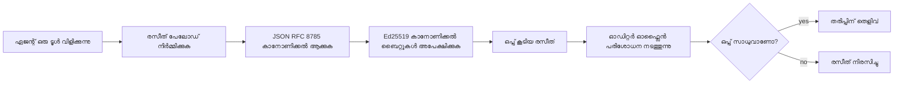
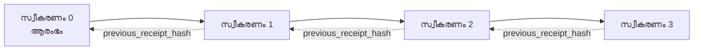

[പാഠം വീഡിയോ കാണുക: ക്രിപ്റ്റോഗ്രാഫിക് റസീപ്പ്റ്റുകളിലൂടെ AI ഏജന്റുകളെ സുരക്ഷിതമാക്കൽ](https://youtu.be/PLACEHOLDER_VIDEO_ID)

> _(പാഠം വീഡിയോയും തംബ്നെയിലും മൈക്രോസോഫ്റ്റ് ഉള്ളടക്കം സംഘത്തെഴുതിയതായി ലയിപ്പിച്ചതിന് ശേഷം കൂട്ടിച്ചേർക്കും, പാഠം 14 / 15 മാതൃകയോട് പൊരുത്തപ്പെടുന്ന വിധം.)_

# ക്രിപ്റ്റോഗ്രാഫിക് റസീപ്പ്റ്റുകളിലൂടെ AI ഏജന്റുകളെ സുരക്ഷിതമാക്കൽ

## പരിചയം

ഈ പാഠം ഉൾക്കൊള്ളുന്നതാണ്:

- AI ഏജന്റുകളுக்கുള്ള ഓഡിറ്റ് ട്രെയിലുകൾ അനുശാസനത്തിനും ഡീബഗിംഗിനും വിശ്വാസത്തിനും വലിയ പ്രാധാന്യമുള്ളത് എന്തിനു.
- ക്രിപ്റ്റോഗ്രാഫിക് റസീപ്പ് എന്താണെന്നും ഒപ്പില്ലാത്ത ലോഗ് ലൈന്‍ നിന്ന് അത് എങ്ങനെ വ്യത്യസ്തമാണ് എന്നും.
- Plain Python-ൽ ഏജന്റിന്റെ ടൂൾ കോളിനുള്ള ഒപ്പിട്ട റസീപ്പ് എങ്ങനെ ഉത്പാദിപ്പിക്കാം എന്നതു.
- റസീപ്പ് ഓഫ്‌ലൈൻ പരിശോധന എങ്ങനെ നടപ്പാക്കണം, തിരിച്ചടവ് കണ്ടെത്താൻ എങ്ങനെ കഴിയും എന്നും.
- റസീപ്പ്റ്റുകൾ എങ്ങനെ ചൈൻ ചെയ്ത് ഒരൊറ്റ റസീപ്പ് നീക്കം ചെയ്യുകയോ പുനഃക്രമീകരിക്കുകയോ ചെയ്‌താൽ ചെയിൻ തകരാൻ സാധ്യത ഉണ്ടെന്ന്.
- റസീപ്പ്റ്റുകൾ എന്തെല്ലാം തെളിയിക്കുന്നു, അത് കടപ്പാട് നൽകാത്ത കാര്യങ്ങൾ എന്തെല്ലാമാണ് എന്നത്.

## പഠന ലക്ഷ്യങ്ങൾ

ഈ പാഠം പൂർത്തിയാക്കിയ ശേഷം, നിങ്ങൾ അറിയുകയും ചെയ്യുകയും ചെയ്യുക:

- ഏജന്റ് പ്രവർത്തനങ്ങൾക്ക് ക്രിപ്റ്റോഗ്രാഫിക് പ്രോവനൻസ് ആവശ്യമായ പരാജയ മോഡുകൾ തിരിച്ചറിയുക.
- ഒരു കാനോണിക്കൽ JSON പെയ്‌ലോഡിലെ Ed25519 ഒപ്പിട്ട റസീപ്പ് സൃഷ്‌ടിക്കുക.
- ഒപ്പിട്ടയാൾക്ക് പബ്ലിക് കീ ഉപയോഗിച്ച് സ്വതന്ത്രമായി റസീപ്പ് പരിശോധിക്കുക.
- രണ്ട് സമയം പരിശോധന വീണ്ടും നടത്തി മാറ്റങ്ങൾ കണ്ടെത്തുക.
- ഹാഷ്-ചെയിൻ ചെയ്ത റസീപ്പിൾ സൃഷ്‌ടിച്ച് ചെയിനിന്റെ പ്രാധാന്യം വിശദീകരിക്കുക.
- റസീപ്പ്റ്റുകൾ തെളിയിക്കുന്ന കാര്യങ്ങൾ (അട്രിബ്യൂഷൻ, ഇന്റഗ്രിറ്റി, ഓർഡറിംഗ്) തിരിച്ചറിയുകയും, അവ തെളിയിക്കാത്ത കാര്യങ്ങളും തിരിച്ചറിയുക (പ്രവർത്തിയുടെ ശരിതത്വം, നയം ശരിയാണ് എന്നതു).

## പ്രശ്നം: നിങ്ങളുടെ ഏജന്റിന്റെ ഓഡിറ്റ് ട്രെയിൽ

ഉപമ ചെയ്യുക നിങ്ങൾ കണ്ടോസോ ട്രാവലിനു വേണ്ടി ഒരു AI ഏജന്റ് വിന്യസിച്ചു. ഏജന്റ് ഉപഭോക്തൃ അഭ്യർഥനകൾ വായിച്ചും, ഫ്‌ലൈറ്റ് API-ൽ കോളുകൾ നടത്തിയും, ഉപഭോക്താവിന് വേണ്ടി സീറ്റുകൾ ബുക്ക് ചെയ്യുന്നതും ചെയ്യുന്നു. കഴിഞ്ഞ കോളിഫോറിനിടെ ഏജന്റ് 50,000 ബുക്കിംഗുകൾ പ്രോസസ്സ് ചെയ്തു.

ഇന്ന് ഒരാൾ ഓഡിറ്ററായെത്തുന്നു. അവർ ഒരു ലളിതമായ ചോദ്യം ചോദിക്കുന്നു: "നിങ്ങളുടെ ഏജന്റ് എന്തു ചെയ്തത് കാണിക്കുമോ?"

നിങ്ങൾ ലോഗ് ഫയലുകൾ കൈമാറുന്നു. ഓഡിറ്റർ അവ പരിശോധിക്കുകയും ഒരു ബുദ്ധിമുട്ടുള്ള ചോദ്യം ചോദിക്കുകയും ചെയ്യുന്നു: "ഈ ലോഗുകൾ തിരുത്തപ്പെട്ടതല്ലെന്ന് എങ്ങിനെ എനിക്ക് അറിയാം?"

ഇത് ഓഡിറ്റ്-ട്രെയിൽ പ്രശ്നമാണ്. ഇന്ന് വ്യാപകമായി ഏജന്റ് വിന്യാസങ്ങൾ അടിസ്ഥാനമാക്കുന്നത്:

- **അപ്ലിക്കേഷൻ ലോഗുകൾ**: ഏജന്റ് തന്നെ എഴുതിയതു, ഫയൽ സിസ്റ്റം ആക്‌സസ് ഉള്ളവർക്കു എഡിറ്റ് ചെയ്യാം.
- **ക്ലൗഡ് ലോഗിംഗ് സേവനങ്ങൾ**: പ്ലാറ്റ്‌ഫോം തലത്തിലുള്ള ട്യാംപർ-ഒളിഞ്ഞതാണെങ്കിലും ഓഡിറ്റർ പ്ലാറ്റ്‌ഫോം ഓപ്പറേറ്ററിനെ വിശ്വസിച്ചാൽ മാത്രം.
- **ഡേറ്റാബേസ് ട്രാൻസാക്ഷൻ ലോഗുകൾ**: ഡേറ്റാബേസ് മാറ്റങ്ങൾക്ക് അനുയോജ്യമാണ്, എന്നാൽ ആർക്കൊതാണ് ടൂൾ കോളുകൾക്കായുള്ളത്.

ഇവയിൽ ഒന്നും ഓഡിറ്ററുടെ ചോദ്യം മറുപടി നൽകാൻ കഴിയില്ല അതിനായി ഓഡിറ്റർ ആരെയോ വിശ്വസിക്കണം (നിങ്ങളോ, ക്ലൗഡ് പ്രൊവൈഡറോ, ഡാറ്റാബേസ് വിൽപ്പനക്കാരോ). ആന്തരിക ഉപയോഗത്തിന് അത് അനുവദനീയമാണ്. നിയമാനുസൃത ജോലികൾക്ക് (ഫിനാൻസ്, ഹെൽത്ത്‌കെയർ, EU AI നിയമം ബാധിക്കുന്ന ഏതെങ്കിലും) അത് ബാധകമല്ല.

ക്രിപ്റ്റോഗ്രാഫിക് റസീപ്പ്റ്റുകൾ ഓരോ ഏജന്റ് പ്രവർത്തനവും സ്വതന്ത്രമായി പരിശോധിക്കാനാകുന്ന വിധം പരിഹരിക്കുന്നു. ഓഡിറ്റർ നിങ്ങളെ വിശ്വസിക്കേണ്ടതില്ല. അവർത്തീ ലീ പബ്ലിക് കീയും റസീപ്പ് ഒറ്റപ്പെട്ടും ആവശ്യമാണ്.

## ഒരു ക്രിപ്റ്റോഗ്രാഫിക് റസീപ്പ് എന്താണ്?

റസീപ്പ് AEജന്റ് എന്തു ചെയ്തു എന്നതിന്റെ രേഖപ്പെടുത്തുന്ന JSON ഒബ്ജക്ടാണ്, ഡിജിറ്റൽ ഒപ്പുമായി ഒപ്പ് വെച്ചതും.


```mermaid
flowchart LR
    A[ഏജന്റ് ഒരു ടൂൾ വിളിക്കുന്നു] --> B[രസീത് പേലോഡ് നിർമ്മിക്കുക]
    B --> C[JSON RFC 8785 കാനോണിക്കൽ ആക്കുക]
    C --> E[Ed25519 കാനോണിക്കൽ ബൈറ്റുകൾ അപേക്ഷിക്കുക]
    E --> F[ഒപ്പ് കൂടിയ രസീത്]
    F --> G[ഓഡിറ്റർ ഓഫ്ലൈൻ പരിശോധന നടത്തുന്നു]
    G --> H{ഒപ്പ് സാധുവാണോ?}
    H -- yes --> I[തരിപ്പിന് തെളിവ്]
    H -- no --> J[രസീത് നിരസിച്ചു]
```

ഏറ്റവും ലഘുവായ ഒരു റസീപ്പ് ഇപ്രകാരമാണ്:

```json
{
  "type": "agent.tool_call.v1",
  "agent_id": "contoso-travel-bot",
  "tool_name": "lookup_flights",
  "tool_args_hash": "sha256:a3f9c1...",
  "result_hash": "sha256:7b2e1d...",
  "policy_id": "contoso-travel-policy-v3",
  "timestamp": "2026-04-25T14:30:00Z",
  "sequence": 47,
  "previous_receipt_hash": "sha256:9d4e6a...",
  "signature": {
    "alg": "EdDSA",
    "sig": "c5af83...",
    "public_key": "8f3b2c..."
  }
}
```

മൂന്ന് സവിശേഷതകൾ പ്രവർത്തനത്തിനായി ഉണ്ട്:

1. **ഒപ്പ്**. റസീപ്പ് ഏജന്റിന്റെ ഗേറ്റ്വേ Ed25519 പ്രൈവറ്റ് കീ ഉപയോഗിച്ചാണ് ഒപ്പിടുന്നത്. പൊതു കീ കൈവശമുള്ളവരിൽ ആരും ഒപ്പ് ഓഫ്‌ലൈൻ പരിശോധിക്കാം. ഏതെങ്കിലും ഫീൽഡ് തിരുത്തിയാൽ ഒപ്പ് അസാധുവാകും.

2. **കാനോണിക്കൽ എൻകോഡിംഗ്**. ഒപ്പിടുന്നതിനു മുമ്പായി റസീപ്പ് JSON Canonicalization Scheme (JCS, RFC 8785) ഉപയോഗിച്ച് സീരിയലൈസ് ചെയ്യുന്നു. ഇതു മൂലം രണ്ട് സാദൃശ്യമായ റസീപ്പുകൾ ബൈനറി സമാനമായി ഉണ്ടാകും. കാനോണിക്കൽ ചെയ്യാതിരുന്നാൽ വിവിധ JSON സീരിയലൈസറുകൾക്ക് വ്യത്യസ്ത ഒപ്പുകൾ ഉണ്ടാകുമായിരുന്നു.

3. **ഹാഷ്-ചെയിനിംഗ്**. `previous_receipt_hash` ഫീൽഡ് ഓരോ റസീപ്പിനെയും മുൻവരെയുമായി ബന്ധിപ്പിക്കുന്നു. ഒരു റസീപ്പ് നീക്കം ചെയ്യുകയോ ക്രമം മാറ്റുകയോ ചെയ്താൽ അതിനുശേഷമുള്ള എല്ലാ റസീപ്പുകളും അസാധുവാകും. വ്യക്തിഗത ഒപ്പുകൾ മറികടന്നാലും അത്യന്ത ചെറിയവിവരങ്ങൾ പോലും ചെയിൻ തലത്തിലേക്ക് എളുപ്പത്തിൽ ശ്രദ്ധിക്കപ്പെടും.

ഈ ലക്‌ഷണങ്ങൾ ചേർന്ന് മൂന്ന് ഉറപ്പുകൾ നൽകുന്നു:

- **അട്രിബ്യൂഷൻ**: ഈ കീ ഈ ഉള്ളടക്കം ഒപ്പിട്ടിരിക്കുന്നു.
- **ഇന്റഗ്രിറ്റി**: ഒപ്പിട്ടതിന് ശേഷം ഉള്ളടക്കം മാറിയിട്ടില്ല.
- **ഓർഡറിംഗ്**: ഈ റസീപ്പ് ചെയിനിൽ ആ റസീപ്പിൻ ശേഷം ഉണ്ടായി.

## Python-ൽ റസീപ്പ് സൃഷ്‌ടിക്കൽ

റസീപ്പ് സൃഷ്‌ടിക്കാൻ പ്രത്യേക ലൈബ്രറി ആവശ്യമില്ല. ക്രിപ്റ്റോഗ്രാഫിക് പ്രിമിറ്റിവുകൾ ലഭ്യമാണ്, ലജിക് Python-ന്റെ കുറച്ചു വരികളിൽ തീർക്കാം.

`code_samples/18-signed-receipts.ipynb` യിലെ ഹാൻഡ്‌സ്-ഓൺ വ്യായാമങ്ങൾ സമ്പൂർണ്ണ ഫ്ളോ വിശദീകരിക്കുന്നു. സംഗ്രഹം ഇപ്രകാരം:

```python
import json
import hashlib
import base64
from nacl import signing
from jcs import canonicalize  # RFC 8785 കാനോണിക്കൽ JSON

def b64url_nopad(data: bytes) -> str:
    return base64.urlsafe_b64encode(data).decode("ascii").rstrip("=")

def sha256_canonical(obj) -> str:
    """SHA-256 of a Python object's JCS-canonical JSON form."""
    return f"sha256:{hashlib.sha256(canonicalize(obj)).hexdigest()}"

# സൈൻ ചെയ്യാനുള്ള കീ സൃഷ്ടിക്കുക അല്ലെങ്കിൽ ലോഡ് ചെയ്യുക (പ്രൊഡക്ഷനിൽ, കീ വാൾട്ടിൽ സൂക്ഷിക്കുക)
signing_key = signing.SigningKey.generate()
verify_key = signing_key.verify_key

# ലഭിപ്പ് പേലോഡ് നിർമ്മിക്കുക (ഇപ്പോൾ സൈൻ ചെയ്യണം)
tool_args = {"origin": "SYD", "destination": "LAX"}
tool_result = [{"flight": "QF11", "price": 1850, "stops": 0}]

payload = {
    "type": "agent.tool_call.v1",
    "agent_id": "contoso-travel-bot",
    "tool_name": "lookup_flights",
    "tool_args_hash": sha256_canonical(tool_args),
    "result_hash": sha256_canonical(tool_result),
    "policy_id": "contoso-travel-policy-v3",
    "timestamp": "2026-04-25T14:30:00Z",
    "sequence": 0,
    "previous_receipt_hash": None,
}

# JCS ബൈറ്റുകൾ നേരിട്ട് കാനോണീകലൈസ് ചെയ്ത് സൈൻ ചെയ്യുക. PureEdDSA ആന്തരികമായി ഹാഷുകൾ ചെയ്യുന്നു.
canonical_bytes = canonicalize(payload)
signature_bytes = signing_key.sign(canonical_bytes).signature

# ഘടിത സൈൻചെയ്യലിന്റെ ഓബ്ജക്ട് ചേർക്കുക.
receipt = {
    **payload,
    "signature": {
        "alg": "EdDSA",
        "sig": b64url_nopad(signature_bytes),
        "public_key": b64url_nopad(bytes(verify_key)),
    },
}
```

ഇതാണ് ഒപ്പിടൽ പൈപ്പ്‌ലൈനിന്റെ മുഴുവൻ കോഡ്. നോട്ട്‌ബുക്കിലെ വ്യായാമങ്ങൾ ഓരോ ഘട്ടവും കൈവരിക്കുന്നു.

## റസീപ്പ് പരിശോധനയും മാറ്റം കണ്ടെത്തലും

പരിശോധന പ്രത പിൾക്കൽ പ്രവർത്തനമാണ്:

```python
import base64
import hashlib
from nacl import signing
from nacl.exceptions import BadSignatureError
from jcs import canonicalize

def b64url_decode(s: str) -> bytes:
    padding = "=" * ((4 - len(s) % 4) % 4)
    return base64.urlsafe_b64decode(s + padding)

def verify_receipt(receipt: dict) -> bool:
    # ഒപ്പു ഒരു ഘടനാത്മക ഇനമാണ്: {"alg", "sig", "public_key"}.
    sig_obj = receipt.get("signature")
    if not sig_obj or sig_obj.get("alg") != "EdDSA":
        return False

    # യഥാർത്ഥത്തിൽ ഒപ്പിട്ട പേയ്ലോഡ് പുനരേധരിപ്പിക്കുക (ഒപ്പു ഒഴികെയുള്ള എല്ലാം).
    payload = {k: v for k, v in receipt.items() if k != "signature"}

    canonical_bytes = canonicalize(payload)

    try:
        verify_key = signing.VerifyKey(b64url_decode(sig_obj["public_key"]))
        verify_key.verify(canonical_bytes, b64url_decode(sig_obj["sig"]))
        return True
    except BadSignatureError:
        return False
```

ഈ ഫംഗ്ഷൻ ഒരു റസീപ്പ് സ്വീകരിക്കുകയും ഒപ്പു സാധുവാണെങ്കിൽ `True` മടങ്ങിക്കും, അല്ലെങ്കിൽ `False`. ന്െറ്റ്‌വർക്ക് കോളോ സേവന ആശ്രിതത്വമോ ഇല്ല. മൂന്നാംകക്ഷി വിശ്വാസത്തിനും ആവശ്യമില്ല.

മാറ്റം കണ്ടെത്തൽ പ്രദർശിപ്പിക്കാൻ നോട്ട്‌ബുക്ക് നിർദേശിക്കുന്നത്:

1. ഒരു സാധു റസീപ്പ് ഉത്പാദിപ്പിച്ച് പരിശോധിച്ചു സാധൂകരിക്കുക.
2. `tool_args_hash` ഫീൽഡിലെ ഒരു ബൈറ്റ് മാറ്റുക.
3. വീണ്ടും പരിശോധന നടത്തുമ്പോൾ പരാജയപ്പെടുന്നുവെന്ന് കാണുക.

ഇത് പ്രായോഗികമായി തെളിയിക്കുന്നത് റസീപ്റ്റുകൾ ട്യാംപർ-ഒളിഞ്ഞതാണ്: ഏതെങ്കിലും ചെറിയ മാറ്റവും ഒപ്പു തകർക്കും.

## മൾട്ടി-സ്റ്റെപ്പ് ഏജന്റുകൾക്ക് റസീപ്പിൾ ചെയിനിംഗ്

ഏകദേശം ഒപ്പ് വെച്ച റസീപ്പ് ഒരേ പ്രവർത്തനത്തെ സംരക്ഷിക്കുന്നു. റസീപ്പുകളുടെ ഒരു ചെയിൻ പരമ്പരയെ സംരക്ഷിക്കുന്നു.


```mermaid
flowchart LR
    R0[സ്വീകരണം 0<br/>ആരംഭം] --> R1[സ്വീകരണം 1]
    R1 --> R2[സ്വീകരണം 2]
    R2 --> R3[സ്വീകരണം 3]
    R1 -. previous_receipt_hash .-> R0
    R2 -. previous_receipt_hash .-> R1
    R3 -. previous_receipt_hash .-> R2
```

ഓരോ റസീപ്പും മുൻവരെയുള്ള റസീപ്പിന്റെ ഹാഷ് രേഖപ്പെടുത്തുന്നു. റസീപ്പ് 2 സൈലന്റായി ആപേക്ഷിച്ച് നീക്കം ചെയ്യുന്നതിനുവേണ്ടി ആക്രമകന് ഡോ രണ്ടു വഴികളിലൊന്നിലോ ആയിരിക്കും ശ്രമിക്കുക:

- റസീപ്പ് 3ന്‍റെ `previous_receipt_hash` ഫീൽഡ് മാറ്റുക (റസീപ്പ് 3 ഒപ്പിന് അപാകത വരും), അല്ലെങ്കിൽ
- തിരുത്തപ്പെട്ട റസീപ്പ് 3 ന് പുതിയ ഒപ്പ് നിർമ്മിക്കുക (ഏജന്റിന്റെ പ്രൈവറ്റ് കീ ആവശ്യം).

പ്രൈവറ്റ് കീ ഹാർഡ്‌വയർ കീ വാൾട്ടിൽ സൂക്ഷിക്കുന്നുവെങ്കിൽ, നിങ്ങൾ ഓരോ റസീപ്പിനും പബ്ലിക് കീ പ്രസിദ്ധീകരിച്ചാൽ, ഈ ആക്രമണങ്ങളിൽ ഒന്നും കണ്ടെത്തപ്പെടാതെ നടത്താനാവില്ല.

നോട്ട്‌ബുക്ക് വിശദീകരിക്കുന്നത്:

1. മൂന്ന് റസീപ്പുകളുടെ ഒരു ചെയിൻ നിർമ്മിക്കുക.
2. ഓരോ റസീപ്പിന്റെയും `previous_receipt_hash` മുൻവരെയുള്ള റസീപ്പിന്റെ യഥാർത്ഥ ഹാഷ് ആയി യോജിച്ചതാണോ എന്ന് പരിശോധിക്കുക.
3. മദ്ധ്യേ ഒരു റസീപ്പ് തീറ്റപ്പെടുത്തുകയും ചെയിൻ ആ സമയത്ത് തന്നെ തകരുക കാണുക.

ഇതു പുറത്തുള്ള ഒരു ഓഡിറ്റർ നിങ്ങൾ വിശ്വസിക്കാതെയും ഇതു പരിശോധിക്കാനാകും വിധത്തിലുളള ഓഡിറ്റ് ട്രെയിൽ തയ്യാറാക്കലാണ്.

## റസീപ്പുകൾ തെളിയിക്കുന്നതു (മറ്റും അത്യാഥരിക്കാത്തതു)

ഇതു ഈ പാഠത്തിലെ ഏറ്റവും പ്രധാനപ്പെട്ട ഭാഗമാണ്. റസീപ്പുകൾ ശക്തിയുള്ളവയാണ്, എന്നാൽ അവയുടെ ശക്തിക്ക് പരിധിയുണ്ട്.

**റസീപ്പുകൾ മൂന്ന് കാര്യങ്ങൾ തെളിയിക്കുന്നു:**

1. **അട്രിബ്യൂഷൻ**: ഒരു പ്രത്യേക കീ ഒരു പ്രത്യേക പെയ്‌ലോഡ് ഒപ്പിട്ടു.
2. **ഇന്റഗ്രിറ്റി**: ഒപ്പിടുന്നതിനു ശേഷം പെയ്‌ലോഡിന് മാറ്റം ഉണ്ടായിട്ടില്ല.
3. **ഓർഡറിംഗ്**: ഈ റസീപ്പ് ആ റസീപ്പിനൊപ്പം ഹാഷ് ചെയിനിൽ ഇതിന് ശേഷമായിരിക്കുന്നു.

**റസീപ്പുകൾ തെളിയിക്കാത്ത കാര്യങ്ങൾ:**

1. **ശരിത്വം**: ഏജന്റിന്റെ നടപടി ശരിയായ നടപടിയാണെന്ന്. തെറ്റായ ഉത്തരത്തിനും റസീപ്പ് ഒപ്പിടാം.
2. **നയം പാലിക്കൽ**: `policy_id`-ൽ നൽകിയ നയം വിലയിരുത്തിയതോ, നീലവയ്പ്പുമുണ്ടായിരുന്നുവോ എന്ന കാര്യങ്ങൾ. റസീപ്പ് കണ്ടത് നൽകുന്നു, നടപ്പിലാക്കിയത് അല്ല.
3. **കീയ്‌ക്ക് പുറമേയുള്ള ഐഡന്റിറ്റി**: റസീപ്പ് പറയുന്നു "ഈ കീ ഈ ഉള്ളടക്കം ഒപ്പിട്ടു." അല്ല, "ഈ മനുഷ്യൻ ഇത് അംഗീകരിച്ചു." കീ ഒരു വ്യക്തിയിലോ സ്ഥാപനത്തിലോ ബന്ധിപ്പിക്കുന്നത് വേറെ ഐഡന്റിറ്റി അടിത്തറ ആവശ്യമാണ് (ഡയറക്ടറി, പബ്ലിക് കീ രജിസ്ട്രി തുടങ്ങിയവ).
4. **ഇൻപുട്ടിന്റെ സത്യസന്ധത**: ഏജന്റ് വ്യവഹാരിച്ചത് തിരുത്തപ്പെട്ട പ്രോംപ്റ്റിനെ അടിസ്ഥിതമാണ് എങ്കിൽ, റസീപ്പ് faithful ആയി രേഖപ്പെടുത്തും. റസീപ്പുകൾ ഇൻപുട്ട് വെരിഫിക്കേഷന്റെ താഴെയുള്ള പടിയാണ്, അതിന്റെ പകരം അല്ല.

ഈ അതിരുകൾ രണ്ട് കാരണങ്ങൾക്കു പ്രധാനമാണ്:

- എന്തിന് റസീപ്പുകൾ ഉപകാരപ്പെടുന്നു എന്നു നിങ്ങളെ അറിയിക്കുന്നു: ഏජന്റ് പെരുമാറ്റം ഓഡിറ്റബിളും ട്യാംപർ-ഒളിഞ്ഞതും ആക്കുക, സംസഥാനങ്ങളുടെ അതിരുകൾ കടക്കുമ്പോഴും.
- ఇంకా വേറെ പടികൾ ആവശ്യമാണ് എന്ന് പറയുന്നു: ഇൻപുട്ട് വെരിഫിക്കേഷൻ (പാഠം 6), നയം പ്രാബല്യത്തിൽ വരുത്തൽ (താഴെ ലഘുവായി സമ്ബന്ധിച്ച്), ഐഡന്റിറ്റി അടിത്തറ (ഈ പാഠത്തിൽ പുറത്തുള്ള).

സാധാരണ പിഴവ് "നമുക്ക് റസീപ്പുകൾ ഉണ്ട്" എന്നതിന്റെ അർത്ഥം "നാം ഭരണഘടനയാൽ നിയന്ത്രിക്കപ്പെടുന്നു" എന്നാക്കി കരുതലാണ്. അത്തരം കാര്യങ്ങളല്ല. റസീപ്പുകള്‍ അടിസ്ഥാനം മാത്രമാണ്. ഭരണത്തിന് മേൽനോട്ട സ്ഥാപനമാണ്.

## മനുഷ്യൻ സിദ്ധീകരിച്ചെന്നത് തെളിയിക്കൽ

മുകളിൽപ്പെട്ട ഇനം 3 സ്വന്തം ഒരു വിഭാഗമായി വർക്കു: ഒരു പ്രവർത്തന റസീപ്പ് പറയുന്നു "ഈ കീ ഈ ഉള്ളടക്കം ഒപ്പിട്ടു", "ഒരു മനുഷ്യൻ അത് അംഗീകരിച്ചു" അല്ല. ഉയർന്ന അപകട പ്രവർത്തനങ്ങൾക്കു (റീഫണ്ടുകൾ, മുളയൽ, വൈർ ട്രാൻസ്‌ഫറുകൾ) ഭരണം ചട്ടങ്ങൾ ഇതു വേണമെന്ന ആവശ്യങ്ങൾ വർധിക്കുകയും, ഇതേ സങ്കേതങ്ങൾ ഉപയോഗിച്ച് നിർമ്മിക്കാം.

തുടർന്നുള്ള നോട്ട്‌ബുക്ക് `code_samples/human-authorization-receipts.ipynb` രണ്ടാമത്തെ റസീപ്പ് തരമായ `human.approval.v1` സെറ്റ് ചെയ്യുന്നു, പാഠത്തിലെ റസീപ്പുകൾപോലെ സാംമുഖ്യ പേരിലുള്ള പെയ്‌ലോഡ് Ed25519 ഒപ്പിട്ട, canonical JCS ബൈറ്റുകൾക്ക് പുറത്ത് `signature` ഓബ്‌ജക്റ്റുള്ളത്. ഒരു പേരിട്ട അംഗീകർത്താവ് **സമ്പൂർണ്ണ കാനോണിക്കൽ പ്രവർത്തനം അതിന്റെ ഡൈജസ്റ്റ്** ഒപ്പിടുന്നു മുൻകൂട്ടി; ഏജന്റിന്റെ പ്രവർത്തന റസീപ്പ് അതേ **പ്രവർത്തന ഡൈജസ്റ്റ്** കരുതുന്നു, `parent_approval_ref` കൂടാതെ, അംഗീകത്തിന്റെ `receipt_hash` ആണ്, മുകളിൽനിര്‍മ്മിച്ച ചെയിനിലെ `previous_receipt_hash` പോലെ. `verify_chain` ഒരേ സമയം ഇരട്ട ആർ‌ടി‌ഫാക്ടുകൾ വ്യത്യസ്ത കീ രജിസ്ട്രിയിലും ഉറപ്പുവരുത്തുന്നു (അംഗീകർത്താക്കളുടെ കീകൾ എങ്കിലും ഏജന്റ് കീകൾ എങ്കിലും), കോഡ് വഴിയും പൊതുവായതാണ്, അധികാരങ്ങൾ പങ്കിടുന്നില്ല.

ഈ സ്വഭാവം സൂക്ഷ്മമായി പറയുന്നത്: *മനുഷ്യൻ ഈ സമയത്തെ പ്രവർത്തനം അംഗീകരിച്ചു, ഏജന്റ് അങ്ങനെ അംഗീകരിക്കപ്പെട്ട പ്രവർത്തനം തന്നെ നടപ്പാക്കി.* നോട്ട്‌ബുക്കിന്റെ നിരാകരണ ഘടകങ്ങൾ ഈ സ്വഭാവം സത്യസന്ധമാക്കുന്നു:

- ക്ലാസിക് സെറ്റ്: ട്യാംപർ, കഫ്യൂസ്ഡ് ഡിപ്പ്യൂട്ടി, റിപ്ലേ, എതിര്‍ ഭാഗങ്ങളിലുള്ള നിഴൽ കീകൾ, തെറ്റായ ഇൻപുട്ട്;
- **തെളിഞ്ഞ അധികാരം**: ഒപ്പ് ഇപ്പോഴും പരിശോധനയ്ക്കുറ്റമായെങ്കിലും നിരസിക്കപ്പെട്ടതു, നയ പതിപ്പ് മാറി, അംഗീകർത്താവിന്റെ കീ പിന്‍വലിക്കപ്പെട്ടതിനു മുമ്പോ പ്രവർത്തനത്തിനു മുമ്പോ കാലഹരണപ്പെട്ടത്;
- **ഡൈജസ്റ്റ് അവലംബം**: സാധുവായ ഒപ്പിട്ട പ്രവർത്തന റസീപ്പ് മറ്റൊരു കാനോണിക്കൽ പ്രവർത്തനത്തെ അന്യമാക്കുന്നു.

ഓരോ പരാജയവും വ്യത്യസ്ത കാരണം നൽകി മാറ്റുന്നു, അതുകൊണ്ട് ഓഡിറ്റര്‍ നിരാകരണം വായിക്കുമ്പോള്‍ അധികാരം കാലഹരണപ്പെട്ടോ പ്രവർത്തനം മാറിയോ എന്ന് മനസ്സിലാക്കാം. നോട്ട്‌ബുക്ക് പഠിപ്പിക്കുന്നത്: ഒപ്പ് വെച്ച അംഗീകാരം അതേ രീതിയില്‍ അധികാരമല്ല. രണ്ട് റസീപ്പുകൾ ഒരേ കാനോണിക്കൽ പ്രവർത്തനത്തിൽ ചേരുമ്പോഴേ अधिकारം ഉണ്ടാകൂ. മനുഷ്യ അംഗീകാരം റസീപ്പ് ഈ പാഠം നിർവചിച്ച ഒരു വിദ്യാഭ്യാസ സമാഹാരമാണു്, `draft-farley-acta-signed-receipts` നിർവചിച്ച റസീപ്പ് തരം അല്ല.

## ഉൽപ്പാദന റഫറൻസുകൾ

ഈ പാഠത്തിലെ Python കോഡ് ഉദ്ദേശം കുറഞ്ഞതായതിനാൽ ഓരോ വരിയിൽനിന്നും നിങ്ങൾ മനസ്സിലാക്കണം. നിർമ്മാണംവേള, നിങ്ങൾക്കുള്ള രണ്ട് തിരഞ്ഞെടുപ്പുകൾ ഉണ്ട്:

1. **ക്രിപ്റ്റോഗ്രാഫിക് പ്രിമിറ്റിവുകളിൽ നേരിട്ട് നിർമ്മിക്കുക.** മുകളിൽ കാണിച്ച 50 വരികൾ പലഉപയോഗങ്ങൾക്കു മതിയാകും. PyNaCl (Ed25519)യും `jcs` പാക്കേജും (കാനോണിക്കൽ JSON) നന്നായി പരിപാലിക്കപ്പെടുന്ന ലൈബ്രറികളാണ്.

2. **ഉൽപ്പാദന റസീപ്പ് ലൈബ്രറി ഉപയോഗിക്കുക.** പല ഓപ്പൺ-സോഴ്സ് പ്രോജക്റ്റുകളും ഈ സാദൃശ്യവും കൂട്ടിച്ചേർക്കലുകൾ (കീ റോട്ടേഷൻ, ബാച്ച് പരിശോധന, JWK സജ്ജീകരണം, നയ എൻജിൻ ഇന്റഗ്രേഷൻ) നടപ്പിലാക്കുന്നു:
   - സൈൻ പൈപ്പ്‌ലൈനിൽ JCS, ഒപ്പ്-സ്പേസ് രൂപകൽ‌പന IETF ഇന്റർനെറ്റ്-ഡ്രാഫ്റ്റിൽ ([`draft-farley-acta-signed-receipts`](https://datatracker.ietf.org/doc/draft-farley-acta-signed-receipts/), പതിപ്പ് 02) ഉപയോഗിക്കുന്നു. ഈ പാഠത്തിലെ ലളിത പഠന റസീപ്പ് ഡ്രാഫ്റ്റിലെ `{payload, signature}` കവചത്തിൽ നിന്ന് വ്യത്യസ്തമാണ്, ഒരു പൊരുത്തപ്പെടുന്ന നടപ്പാക്കലായി നിരൂപിക്കാറില്ല. ഡ്രാഫ്റ്റ് പങ്കുവെക്കുന്നു പൊതു പൊരുത്തം പരിശോധനാ സ്യൂട്ട് ([agent-governance-testvectors](https://github.com/ScopeBlind/agent-governance-testvectors)) വയർ ഫോർമാറ്റ് ലക്ഷ്യമിട്ടുള്ള നടപ്പുകൾക്കായി.
   - Microsoft Agent Governance Toolkit Cedar അടിസ്ഥാന നയ തീരുമാനങ്ങളുമായി റസീപ്പുകൾ സംയോജിപ്പിക്കുന്നു; ആ സമ്പ്രദായത്തിലെ Tutorial 33-ൽ സമ്പൂർണ്ണ ഉദാഹരണം കാണുക.
   - `protect-mcp` (npm) ന്റെയും `@veritasacta/verify` (npm) പാക്കേജുകളും Node ബേസ്ഡ് റസീപ്പ് ഒപ്പ് വെക്കലും ഓഫ്‌ലൈൻ പരിശോധനയും നടപ്പിലാക്കുന്നു, MCP സെർവർ ട്രെയിൽ സുരക്ഷിതമാക്കുക, കൂടാതെ human-authorization സമാനമായ കൂടക്കണ്ടിച്ചെയ്യലുള്ള ഹോൾഡ്-ഫോർ-കോ-സൈൻ പ്രവർത്തനത്തിനും.
   - **[nobulex](https://github.com/arian-gogani/nobulex)** Python SDK (`pip install nobulex`) Python-ში Ed25519 + JCS ഒപ്പ് ശൈലി LangChain, CrewAI സംയോജനങ്ങളോടും വാണിജ്യപരമായ മാപ്പിങ്ങും OWASP PR #2210 വഴി സംഭാവനകളും ഉൾപ്പെടെ.

സ്വയം നിർമ്മിക്കയിലെ തിരഞ്ഞെടുപ്പ് ഒരു JWT ലൈബ്രറി എഴുതുന്നതുമായ സമാനമാണ്: ഇരaduതും സാക്ഷരമാണ്; ലൈബ്രറി സമയവും പരിശോധന ഭീതിയും കുറയ്ക്കുന്നു; സ്വയം തുടങ്ങുന്നത് എല്ലാ പ്രാഥമികവസ്തുക്കൾ മനസ്സിലാക്കണം. ഈ പാഠം സ്വതന്ത്ര മാർഗ്ഗം പഠിപ്പിക്കുന്നു അതിനാൽ നിങ്ങൾക്ക് ഏതു തിരഞ്ഞെടുപ്പ് വരും.

## അറിവ് പരിശോധന

പ്രായോഗിക വ്യായാമത്തിലേക്ക് പോകുന്നതിന് മുമ്പ് നിങ്ങളുടെ മനസ്സിലാക്കൽ ടെസ്റ്റ് ചെയ്യുക.

**1. റസീപ്പ് ഏജന്റിന്റെ സ്വകാര്യ Ed25519 കീ ഉപയോഗിച്ച് ഒപ്പിട്ടിരിക്കുന്നു. ഓഡിറ്ററിന് പൊതുഭവകീ മാത്രമേ ഉണ്ടാകൂ. ഓഡിറ്റർ റസീപ്പ് ഓഫ്‌ലൈൻ പരിശോധിക്കാനാകുമോ?**

<details>
<summary>ഉത്തരം</summary>

അതെ. Ed25519 പരിശോധനയ്ക്ക് പൊതുഭവകീയും ഒപ്പിട്ട ബൈറ്റുകളും മാത്രം ആവശ്യമുണ്ട്. എൻെറ്റ്‌വർക്ക് കോൾ, സേവന ആശ്രിതത്വം ഒന്നും ഇല്ല. ഇത് റസീപ്പുകൾ ഓർ-ഗാപ്പ്, ബഹുസംസ്ഥാന, കുറഞ്ഞ വിശ്വാസ ഓഡിറ്റ് സാഹചര്യങ്ങളിൽ പ്രയോജനപ്രദമാക്കുന്നത്.
</details>

**2. ഒരു ആക്രമകൻ റസീപ്പിൻറെ `policy_id` ഫീൽഡ് മാറ്റി കൂടുതലാണ് അനുവാദമുള്ള നയം പറഞ്ഞതായി വ്യാജമാക്കി. ഒപ്പ് ആദ്യ പെയ്‌ലോഡിൽ നിർമ്മിക്കപ്പെട്ടതാണ്. പരിശോധന സമയത്ത് സംഭവിക്കുന്നത് എന്ത്?**

<details>
<summary>ഉത്തരം</summary>


സ്ഥിരീകരണം പരാജയപ്പെട്ടു. ഒറിജിനൽ പേലോഡിന്റെ കാനോണിക്കൽ ബൈറ്റുകൾക്കു മേൽ സിഗ്നേച്ചർ കണക്കാക്കപ്പെട്ടതാണ്; ഏതെങ്കിലും ഫീൽഡ് മാറുമ്പോൾ ആ ബൈറ്റുകളും മാറുന്നു, ഇത് സിഗ്നേച്ചർ അസാധുവാക്കുന്നു. ഒരു ആക്രമകൻ പുതിയ സാധുവായ സിഗ്നേച്ചർ ഉണ്ടാക്കാൻ സ്വകാര്യ കീ ആവശ്യമാണ്, അത് അവർക്കില്ല.
</details>

**3. അസംയോജ്യമായ (raw) ആർമാനുകളും ഫലവും പകരം, റെസിപ്പിയിൽ `tool_args_hash` ഉം `result_hash` ഉം ഉൾ‍പ്പെടുത്തുന്നത് എന്തുകൊണ്ട്?**

<details>
<summary>ഉത്തരം</summary>

രണ്ട് കാരണങ്ങൾ. ഒന്നാമത്, റെസിപ്പ്‌ архив് ചെയ്യേണ്ടതോ പകർന്നു നൽകേണ്ടതോ ഉള്ള സാഹചര്യങ്ങളിൽ അസംയോജ്യമായ ഉള്ളടക്കം (PII, ബിസിനസ് ഡാറ്റ) വെളിപ്പെടുത്തുന്നത് ഒരു പ്രശ്നമാണ്. ഹാഷിംഗിന് റെസിപ്പ് ചെറിയതാക്കുകയും ഉള്ളടക്കം സ്വകാര്യമായി സൂക്ഷിക്കുകയും ചെയ്യുന്നു; ഓഡിറ്റർ ഹാഷ് ഒരു വേർതിരിച്ചുള്ള കൈകാര്യം ചെയ്യുന്ന കലക്ട് ചെയ്ത ഉള്ളടക്കത്തിന് ഒത്തിരിക്കുന്നു എന്ന് പരിശോധിക്കുന്നു. രണ്ടാമതായി, ഹാഷുകളുടെ വിധേയ വലുപ്പം സ്ഥിരമാണ്; എല്ലാ ഇൻപുട്ടുകളും ഔട്ട്പുട്ടുകളും എത്ര വലിയതായാലും ഹാഷുകളുള്ള റെസിപ്പ് വലുപ്പം പരിധിയുള്ളതാണ്.
</details>

**4. `previous_receipt_hash` ഫീൽഡ് ഓരോ റെസിപ്പിനെയും മുൻതലമുറയിലേക്ക് ബന്ധിപ്പിക്കുന്നു. ഒരു ചൈനിൽ മധ്യേ നിന്ന് ഒരു റെസിപ്പ് പതിവായി ഇല്ലാതാക്കുകയാണെങ്കിൽ എന്ത് അസാധുവാകും?**

<details>
<summary>ഉത്തരം</summary>

ഇല്ലാതാക്കിയ റെസിപ്പിനു ശേഷം വന്ന എല്ലാ റെസിപികളും. അവയുടെ `previous_receipt_hash` ഫീൽഡ് യഥാർത്ഥ ചൈനുമായി പൊരുത്തപ്പെടാറില്ല (അവയാണ് സൂചിപ്പിച്ച റെസിപ്പ് നിലവിൽ ഇല്ല, അല്ലെങ്കിൽ ചൈന ഇപ്പോൾ ഒരു വ്യത്യസ്ത മുൻതലമുറയിലേക്ക് പൊയി). ഇല്ലാതാക്കൽ മറയ്ക്കാൻ, ആക്രമകൻ ഓരോ കാര്യമായ റെസിപ്പും വീണ്ടും ഒപ്പിടേണ്ടി വരും, ഇത് സ്വകാര്യ കീ ആവശ്യമാണ്.
</details>

**5. ഒരു റെസിപ്പ് ക്ലീനായി സ്ഥിരീകരിക്കുന്നു. അതിനാൽ ഏജന്റിന്റെ പ്രവർത്തനം ശരിയാണെന്ന്, സംശേധനരഹിതമാണെന്ന്, അല്ലെങ്കിൽ നയവുമായി അനുഗമിക്കുന്നുണ്ടെന്ന് തെളിയിക്കുമോ?**

<details>
<summary>ഉത്തരം</summary>

ഇല്ല. ഒരു സാധുവായ റെസിപ്പ് മൂന്ന് കാര്യങ്ങൾ തെളിയിക്കുന്നു: ആധാരം (ഈ കീ ഈ ഉള്ളടക്കം ഒപ്പിട്ടതാണ്), ഇന്റഗ്രിറ്റി (ഉള്ളടക്കം മാറ്റപ്പെട്ടിട്ടില്ല), ഓർഡറിംഗ് (ഈ റെസിപ്പ് ആ റെസിപ്പിന് ശേഷമാണ്). ഇത് പ്രവർത്തനം ശരിയെന്ന്, `policy_id`യിൽ പേരിട്ട നയം ശരിയായി മൂല്യനിർണയം ചെയ്തതെന്ന്, അല്ലെങ്കിൽ ഏജന്റ് എല്ലാ നയങ്ങൾ പാലിച്ചുവെന്ന് തെളിയിക്കുന്നില്ല. റെസിപ്പുകൾ ഏജന്റിന്റെ പെരുമാറ്റം ഓഡിറ്റ് ചെയ്യാൻ സഹായിക്കുന്നു, അവ ശരിയായവ എന്ന് ഏതാണ്ട് ഉറപ്പ് നൽകുന്നില്ല. പാഠത്തിലെ ഏറ്റവും പ്രധാനപ്പെട്ട അതിരാണ് ഇത്.
</details>

## അഭ്യാസം

`code_samples/18-signed-receipts.ipynb` തുറന്ന് എല്ലാ നാല് വിഭാഗങ്ങളും പൂര്‍ത്തിയാക്കുക:

1. **വിഭാഗം 1**: നിങ്ങളുടെ ആദ്യ റെസിപ്പ് ഒപ്പിട്ടു അതിന്റെ സ്ഥിരീകരണം നടത്തുക.
2. **വിഭാഗം 2**: റെസിപ്പ് തട്ടിക്കകയും സ്ഥിരീകരണ പരാജയം കാണുക.
3. **വിഭാഗം 3**: മൂന്ന് റെസിപ്പുകൾ അടങ്ങിയ ഒരു ചൈന ഉണ്ടാക്കി ചൈനയുടെ ഇന്റഗ്രിറ്റി സ്ഥിരീകരിക്കുക.
4. **വിഭാഗം 4**: Microsoft Agent Framework ഉപയോഗിച്ച് നിർമ്മിച്ച ഏജന്റിൽ പാറ്റേൺ ഉപയോഗിക്കുക: ഒരു ഉപകരണം വിളിക്കൽ റെസിപ്പ്-ഒപ്പിടലിൽ പാക്കു ചെയ്തു പിന്നീട് സ്വതന്ത്രമായി റെസിപ്പ് സ്ഥിരീകരിക്കുക.

**ബാഹ്യ പരീക്ഷണം 1:** നിങ്ങളുടെ ഇഷ്ടാനുസൃതമായ ഒരു ഫീൽഡ് ചേർത്ത് റെസിപ്പ് സ്കീമ വിസ്തരിച്ചു (ഉദാ: ട്രേസിംഗ് jaoks रिक്വസ്റ്റ് ഐഡി), കാനോണിക്കൽ ഒപ്പിടലിന്റെ ലജിക് അപ്ഡേറ്റ് ചെയ്ത് അത് ഉൾപ്പെടുത്തുക, പിന്നീട് റെസിപ്പ് സ്ഥിതി ശരിയാണെന്ന് പരിശോധന നടത്തുക. ഒപ്പിടലിനുശേഷം ഫീൽഡ് മാറ്റുകയും സ്ഥിരീകരണം പരാജയപ്പെടുന്നത് ഉറപ്പാക്കുകയും ചെയ്യുക. ഇതിലൂടെ കാനോണിക്കൽ എൻകോഡിങ്ങിന്റെ ഓരോ ബাইটും സിഗ്നേച്ചറിന്റെ ഭാഗമാണെന്ന് മനസ്സിലാക്കണം.

**ബാഹ്യ പരീക്ഷണം 2:** നിങ്ങളുടെ രണ്ട് റെസിപ്പുകളുടെ കാനോണിക്കൽ ബൈറ്റുകൾ ക്രമത്തിൽ ചേർത്ത് SHA-256 ഹാഷ് നിർമ്മിച്ച്, ഫലമായ ഡൈജസ്റ്റ് മൂന്നാം റെസിപ്പിൽ പുതിയ ഫീൽഡ് ആയി ഉൾപ്പെടുത്തുക, അത് ഒപ്പിടുക. മൂന്ന് റെസിപ്പുകൾ മുഴുവനും ശുദ്ധമായ തിരിച്ചറിയൽ കടന്നുപോകുന്നത് പരിശോധിക്കുക. ഇത് ഒരു ഘട്ടത്തെ ഉൾക്കൊള്ളൽ സാക്ഷ്യപത്രം ആണ്: മൂന്നാം റെസിപ്പ് കൈവശമുള്ളയാൾ ആദ്യ രണ്ട് റെസിപ്പുകൾ ഒപ്പിട്ട സമയത്തെ തെളിയിക്കാം, അവരുടെ ഉള്ളടക്കം വെളിപ്പെടുത്താതെ. ഇത് ചെറിയ വിവര പരസ്യങ്ങൾ ഉള്ള റെസിപ്പുകൾ വലുതായി പ്രയോഗിക്കുന്ന പാറ്റേണാണ് (Merkle commitments, RFC 6962).

## സംഹാരം

ക്രിപ്‌റ്റോഗ്രാഫിക് റെസിപ്പുകൾ AI ഏജന്റുകൾക്ക് നൽകുന്നു ഒരു ഓഡിറ്റ് ട്രെയിൽ:

- **സ്വതന്ത്രമായി പരിശോധിക്കാൻ കഴിയുന്നതും**: പൊതു കീയ്ക്കുള്ളവരിൽ ആർക്കും പരിശോധിക്കാം, സേവന ആശ്രിതത്വമില്ലാതെ.
- **തട്ടുന്നതിനു അതീവ തെളിവുള്ളതും**: ഏതെങ്കിലും മാറ്റം സിഗ്നേചർ അസാധുവാക്കും.
- **പോർത്തബിൾ**: ഒരു റെസിപ്പ് ഒരു ചെറിയ JSON ഫയൽ ആണ്; ഇത് ആറ്കൈവ് ചെയ്ത് എവിടെയും അയച്ചും പരിശോധിച്ചും കഴിയും.
- **സ്റ്റാൻഡേർഡുകൾ അനുസരിച്ചുള്ളവ**: Ed25519 (RFC 8032), JCS (RFC 8785), SHA-256 എന്നിവയുമായി നിർമ്മിച്ചത്, എല്ലാം വ്യാപകമായ ഉപയോഗത്തിലുള്ള പ്രിമിറ്റീവുകൾ.

അവ ഇൻപുട്ട് സാധുവാക്കൽ, നയം നടപ്പാക്കൽ, അല്ലെങ്കിൽ ഐഡന്റിറ്റി ഇൻഫ്രാസ്ട്രക്ചർ ഇനങ്ങൾക്ക് പകരം വയ്ക്കുന്നവയല്ല. അവ അവ കെട്ടിടം നിർമ്മിക്കുന്ന അടിസ്ഥാനം മാത്രമാണ്. നിയമിതമായ ജോലി, ബഹുസംഘടന പ്രവർത്തനങ്ങൾ, അല്ലെങ്കിൽ ഭാവിയിലെ ഓഡിറ്റർ നിങ്ങൾക്കു വിശ്വാസമില്ലാത്ത സാഹചര്യങ്ങളിൽ ഏജന്റുകൾ വിന്യസിക്കുമ്പോൾ, റെസിപ്പുകൾ ഓഡിറ്റ് ട്രെയിൽ വിശ്വസ്തമാക്കുന്നത് ആണ്.

ഏറ്റവും പ്രധാനപ്പെട്ട കാര്യമാണ്: റെസിപ്പുകൾ വിജയിച്ച കീ ആ 사람이 എന്ത് പറഞ്ഞുവെന്ന്, എപ്പോൾ എന്നതിനെ തെളിയിക്കുന്നു. പറയപ്പെട്ടത് ശരിയാണോ അല്ലയോ എന്ന് തെളിയിക്കുന്നില്ല. ആ വ്യത്യാസം ശക്തമായി പിടിച്ച് നിർത്തുക. അത് സത്യസന്ധമായ ഒരു പ്രൊവനൻസ് സിസ്റ്റവും തെറ്റിദ്ധരിപ്പിക്കുന്ന സിസ്റ്റവും തമ്മിലുള്ള വ്യത്യാസമാണ്.

## ഉത്പാദന പരിശോധന പട്ടിക

ഈ പാഠം അവസാനിപ്പിച്ച് യാഥാർത്ഥ്യപരമായ വാതവരണത്തിൽ റെസിപ്പ് ഒപ്പിട്ട ഏജന്റുകൾ വിന്യസിക്കാൻ തയ്യാറാകുമ്പോൾ:

- [ ] **ഒപ്പിടലുമായി ബന്ധപ്പെട്ട കീ ഡെവലപ്പർ ലാപ്ടോപ്പിൽ നിന്നും മാറ്റുക.** Azure Key Vault, AWS KMS, അല്ലെങ്കിൽ ഹാർഡ്വയർ സുരക്ഷാ ഉപകരണം ഉപയോഗിക്കുക. നിങ്ങളുടെ റെസിപ്പുകൾ ഒപ്പിടുന്ന സ്വകാര്യ കീ ഉറവിട നിയന്ത്രണത്തിലോ, പ്ലെയിൻടെക്സ്റ്റിലോ ഒരിക്കലും സൂക്ഷിക്കരുത്.
- [ ] **സാധുവാക്കാനുള്ള പൊതു കീ പ്രസിദ്ധീകരിക്കുക.** ഓഡിറ്റർമാർ ഓഫ്ലൈനിൽ പരിശോധിക്കാൻ ഇത് ആവശ്യമാണ്. സാധാരണ പാറ്റേൺ ഒരു JWK സെറ്റ് ആണ് അറിയപ്പെട്ട URL-ൽ (RFC 7517), ഉദാ: `https://your-org.example.com/.well-known/agent-keys.json`.
- [ ] **ചൈന ബാഹ്യമായി നൃപിക്കുക.** സമയം സമയത്ത് ഏറ്റവും പുതിയ ചൈന തല ഹെഡ് ഹാഷ് ഒരു ട്രാൻസ്‌പാരൻസി ലോഗിൽ എഴുതുക (Sigstore Rekor, RFC 3161 ടൈംസ്റാമ്പ് അധികൃതർ, അല്ലെങ്കിൽ ഒരു രണ്ടാമത്തെ ആന്തരിക സംവിധാനം) അതിലൂടെ പുറത്തുള്ള ഒരു പാർട്ടി ഈ ചൈന ഈ സമയം നിലനിന്നുവെന്ന് സ്ഥിരീകരിക്കാം.
- [ ] **റെസിപ്പുകൾ മാറ്റാനാകാത്ത രീതിയിൽ സൂക്ഷിക്കുക.** ആപെൻഡ്-ഓൺലി ബ്ലോബ് സ്റ്റോറെജ് (Azure Storage with immutability policies, AWS S3 Object Lock) ഒരു ഇൻസൈഡർ സ്റ്റോറേജ് നിലയിൽ ചരിത്രം പുനർലിഖിക്കാൻ തടയുന്നു.
- [ ] **നിക്ഷേപ നയം തീരുമാനിക്കുക.** പല അനുസരണ നിയമങ്ങളും പല വർഷങ്ങളോളം നിക്ഷേപം ആവശ്യപ്പെടുന്നു. റെസിപ്പുകളുടെ വർധനയ്ക്ക് പദ്ധതി തയ്യാറാക്കുക (ഓരോ റെസിപ്പും ~500 ബൈറ്റുകൾ; ഒരു ഏജന്റ് ഒരു ദിവസം 10K കോൾസ് ഉണ്ടാക്കുമ്പോൾ പ്രതിവർഷം ~1.8 GB ഉത്പാദിപ്പിക്കും).
- [ ] **റെസിപ്പുകൾ നൂവിവരമാക്കാത്ത കാര്യങ്ങൾ രേഖപ്പെടുത്തുക.** റെസിപ്പുകൾ ആധാരം, ഇന്റഗ്രിറ്റി, ഓർഡറിംഗ് തെളിയിക്കുന്നു. നിങ്ങളുടെ പ്രവർത്തനരേഖയിൽ ഇൻപുട്ട് സാധൂകരണം, നയം നടപ്പാക്കൽ, നിരക്ക് നിയന്ത്രണം, ഐഡന്റിറ്റി ഇൻഫ്രാസ്ട്രക്ചർ തുടങ്ങിയ നിയന്ത്രണങ്ങൾ റെസിപ്പുകളോടൊപ്പം ഗവർണൻസിൽ എവിടെയാണെന്ന് വ്യക്തമായി പറയുക.

### AI ഏജന്റുകൾ സുരക്ഷിതമാക്കുന്നത് സംബന്ധിച്ച കൂടുതൽ ചോദ്യങ്ങളുണ്ടോ?

മറ്റ് പഠനാർത്ഥികളുമായി കൂടാൻ, ഓഫീസ് മണിക്കൂറുകളിൽ പങ്കെടുക്കാൻ, AI ഏജന്റുകളുടെ ചോദ്യങ്ങൾക്കുള്ള മറുപടി നേടാൻ [Microsoft Foundry Discord](https://aka.ms/ai-agents/discord) ചേർക്കുക.

## ഈ പാഠത്തിന് ശേഷം

ഈ പാഠം ഏക റെസിപ്പ് ഒപ്പിടലും ഹാഷ്-ചെയിനുചെയ്യലുകളും ഉൾക്കൊള്ളുന്നു. അവ യഥാർത്ഥത്തിൽ നിരവധി മികവുറ്റ പാറ്റേണുകളിൽ നിർമിക്കപ്പെടുന്നു, നിങ്ങളുടെ ഗവർണൻസ് വളരുന്നതിനൊപ്പം നിങ്ങൾ കാണാം:

- **തിരഞ്ഞെടുത്ത വെളിപ്പെടുത്തൽ.** റെസിപ്പിലെ ഫീൽഡുകൾ സ്വതന്ത്രമായി സമർപ്പിക്കപ്പെട്ടപ്പോൾ (RFC 6962-ശൈലിയിലുള്ള Merkle വൃക്ഷം), പ്രത്യേക ഓഡിറ്റർമാർക്ക് ചില ഫീൽഡുകൾ മാത്രം വെളിപ്പെടുത്താൻ കഴിയും, ബാക്കിയുള്ളവ മാറ്റമില്ലെന്ന് തെളിയിക്കാം. സമഗ്ര ഓഡിറ്റ് (പൂർണത ആവശ്യപ്പെടുന്നു) ഗുണം, GDPR പോലുള്ള ഡാറ്റ-കുറച്ചന നിയമങ്ങളും (ഓഡിറ്റർക്ക് വളരെ കുറച്ച് കാണണം) ഒന്നു പോലെ നിറവേറ്റേണ്ടത്.
- **റെസിപ്പ് റദ്ദാക്കൽ.** ഒപ്പിടൽ കീ ചീത്തപെടുകയാണെങ്കിൽ, ആ കിയിൽ ഒപ്പിട്ട എല്ലാ റെസിപ്പുകളും ഒരു സമയത്തുനിന്ന് പരാജയപ്രാപ്തമാക്കാൻ മാർഗ്ഗം ആവശ്യമാണ്. സാധാരണ പാറ്റേണുകൾ: ചെറുചാലുള്ള ഒപ്പിടൽ കീകൾ, പ്രസിദ്ധീകരിച്ച റദ്ദാക്കൽ പട്ടിക, അല്ലെങ്കിൽ റദ്ദാക്കലുകൾ ഉള്ള ട്രാൻസ്പാരൻസി ലോഗ്.
- **രണ്ടുകെട്ട് / വിഭജിത ഒപ്പിടൽ റെസിപ്പുകൾ.** ചില നടപ്പാക്കലുകൾ ഒപ്പിട്ട പേലോഡിനെ മുൻകൂർ പ്രവർത്തനം (`authorization_*`) എങ്കിലും ശേഷീകൃത പ്രവർത്തനം (`result_*`) എന്നിങ്ങനെ വിഭജിച്ചും സ്വതന്ത്ര ഒപ്പുകളായും സമയം വ്യത്യാസം ഉള്ളവയായി നിലനിൽക്കുന്നു. ഇതേ പാഠത്തിൽ പഠിച്ച റെസിപ്പ് ഫോർമാറ്റിനു മുകളിൽ കൂട്ടിച്ചേർക്കാം.
- **പേലോഡിന്റെ ഘടനം.** `result_hash`-ൽ ഉൾപ്പെടുത്തിയ ബൈറ്റുകളെല്ലാം ഒരു റെസിപ്പ് മുദ്രസ്സുചെയ്യുന്നു. യഥാർത്ഥ ലോകം പലതു നന്നായി സമൃദ്ധമാണ് ഒറ്റ ഉപകരണം വിളിപ്പലഫലം ഇനത്തിൽ പെടാത്തവ: മുൻ നിഗമന ചിന്തന (മോഡൽ പ്രവചനം, പരിഗണിച്ച ഓപ്ഷനുകൾ, തെളിവും അതിന്റെ പൂർണ്ണതയും, റിസ്‌ക് നില, ഉത്തരവാദിത്വം, ഗേറ്റ് ഫലം) എല്ലാം ബൈറ്റുകളായി ഒറ്റ റെസിപ്പിൽ അടച്ചുപൂട്ടാം. ഇത് റെസിപ്പ് ഫോർമാറ്റ് ലഘുവാക്കി ഡൊമെയ്ൻ അനുസരിച്ച് പേലോഡ് സ്കീമുകൾ വികസിപ്പിക്കാം.
- **ക്രമീകരണാന്തരമായ അനുസൃതിയും.** Python, TypeScript, Rust, Go പോലുള്ള സ്വതന്ത്ര നടപ്പാക്കലുകൾ പരസ്പരം പരസ്പരം പരിശോധന നടത്തുന്നു. സ്വന്തമായി ഒരു നടപ്പാക്കൽ നിർമ്മിച്ചാൽ പ്രസിദ്ധീകരിച്ച വ്യാകരണങ്ങളുമായി പരിശോധന നടത്തുന്നത് വയർ പൊരുത്തം ഉറപ്പാക്കും.
- **പൊസ്റ്റ്-ക്വാണ്ടം കുടിവെളുപ്പം.** Ed25519 ഇന്ന് വ്യാപകമായി ഉപയോഗിക്കുന്നവയാണ്, പക്ഷേ ക്വാണ്ടം പ്രതിരോധം ഇല്ല. റെസിപ്പ് ഫോർമാറ്റ് ആൽഗോരിത്‌ം-ചാലകമാണ്: `signature.alg` ഫീൽഡിൽ `ML-DSA-65` (NIST പോസ്റ്റ്-ക്വാണ്ടം ഒപ്പിടൽ സ്റ്റാൻഡേഡ്) വയ്ക്കാം, മാറ്റിസ്ഥാപിക്കേണ്ടപ്പോൾ. ഇരട്ട ഒപ്പിടൽ ഉപയോഗിച്ച് മാറ്റക്കാലം ആസൂത്രണം ചെയ്യുക.

## അധികം സഹായകമായ ഉറവിടങ്ങൾ

- <a href="https://datatracker.ietf.org/doc/draft-farley-acta-signed-receipts/" target="_blank">IETF ഇന്റർനെറ്റ്-ഡ്രാഫ്റ്റ്: മെഷീൻ-ടു-മെഷീൻ ആക്സസ് നിയന്ത്രണത്തിനുള്ള ഒപ്പിടൽ സ്വീകരണങ്ങൾ</a>
- <a href="https://learn.microsoft.com/azure/ai-studio/responsible-use-of-ai-overview" target="_blank">ഉത്തരവാദിത്തമുള്ള AI അവലോകനം (Azure AI)</a>
- <a href="https://datatracker.ietf.org/doc/html/rfc8032" target="_blank">RFC 8032: Edwards-Curve ഡിജിറ്റൽ ഒപ്പിടൽ ആൽഗോരിതം (EdDSA)</a>
- <a href="https://datatracker.ietf.org/doc/html/rfc8785" target="_blank">RFC 8785: JSON കാനോണിക്കൽ സ്കീം (JCS)</a>
- <a href="https://datatracker.ietf.org/doc/html/rfc6962" target="_blank">RFC 6962: സർട്ടിഫിക്കറ്റ് ട്രാൻസ്‌പാരൻസി</a> (Merkle വൃക്ഷ നിർമ്മാണം തിരഞ്ഞെടുക്കപ്പെട്ട വെളിപ്പെടുത്തൽ റെസിപ്പുകളിൽ ഉപയോഗിക്കുന്നു)
- <a href="https://github.com/microsoft/agent-governance-toolkit/blob/main/docs/tutorials/33-offline-verifiable-receipts.md" target="_blank">Microsoft Agent Governance Toolkit, Tutorial 33: ഓഫ്ലൈൻ പരിശോധന സാധ്യമാകുന്ന തീരുമാനം സ്വീകരണങ്ങൾ</a>
- <a href="https://github.com/ScopeBlind/agent-governance-testvectors" target="_blank">ഈ പാഠത്തിൽ ഉപയോഗിച്ച റെസിപ്പ് ഫോർമാറ്റിന്റെ ക്രോസ്-ഇംപ്ലിമെന്റേഷൻ പൊരുത്തക്കൂടി ടെസ്റ്റ് വെക്ടറുകൾ</a> (Apache-2.0)
- <a href="https://pynacl.readthedocs.io/" target="_blank">PyNaCl ഡോക്യൂമെന്റേഷൻ</a> (Python-ൽ Ed25519)

## മുൻകാല പാഠം

[ലോകൽ AI ഏജന്റുകൾ സൃഷ്ടിക്കൽ](../17-creating-local-ai-agents/README.md)

---

<!-- CO-OP TRANSLATOR DISCLAIMER START -->
**അറിയിപ്പ്**:
ഈ രേഖ AI പരിഭാഷാ സേവനം [Co-op Translator](https://github.com/Azure/co-op-translator) ഉപയോഗിച്ച് പരിഭാഷപ്പെടുത്തിയതാണ്. ഞങ്ങൾ കൃത്യതയ്ക്കായി ശ്രമിക്കുന്നുവെങ്കിലും, ഓട്ടോമേറ്റഡ് പരിഭാഷകളിൽ പിഴവുകൾ അല്ലെങ്കിൽ തെറ്റായ വിവരങ്ങൾ ഉണ്ടാകാൻ സാധ്യതയുണ്ട്. അതിന്റെ സ്വാഭാവിക ഭാഷയിലുള്ള അസൽ രേഖയാണ് പ്രാമാണികമായ ഉറവിടമായി പരിഗണിക്കേണ്ടത്. നിർണായകമായ വിവരങ്ങൾക്ക്, പ്രൊഫഷണൽ മനുഷ്യ പരിഭാഷ ശുപാർശ ചെയ്യുന്നു. ഈ പരിഭാഷ ഉപയോഗിച്ച് ഉണ്ടാകുന്ന തെറ്റിദ്ധാരണകൾ അല്ലെങ്കിൽ തെറ്റായ വ്യാഖ്യാനങ്ങൾക്കായി ഞങ്ങൾ ഉത്തരവാദികളല്ല.
<!-- CO-OP TRANSLATOR DISCLAIMER END -->