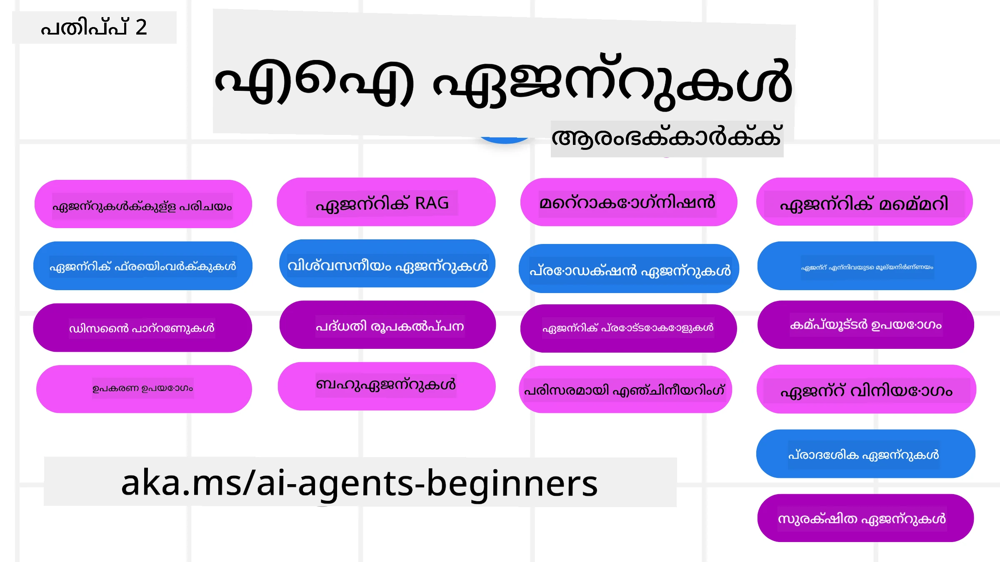

# AI ഏജന്റുകൾ ആരംഭക്കാർക്ക് - ഒരു കോഴ്‌സ്



## AI ഏജന്റുകൾ നിർമ്മിക്കാൻ തുടങ്ങാൻ അറിയേണ്ട എല്ലാ കാര്യങ്ങളും പഠിപ്പിക്കുന്ന ഒരു കോഴ്‌സ്

[](https://github.com/microsoft/ai-agents-for-beginners/blob/master/LICENSE?WT.mc_id=academic-105485-koreyst)
[](https://GitHub.com/microsoft/ai-agents-for-beginners/graphs/contributors/?WT.mc_id=academic-105485-koreyst)
[](https://GitHub.com/microsoft/ai-agents-for-beginners/issues/?WT.mc_id=academic-105485-koreyst)
[](https://GitHub.com/microsoft/ai-agents-for-beginners/pulls/?WT.mc_id=academic-105485-koreyst)
[](http://makeapullrequest.com?WT.mc_id=academic-105485-koreyst)

### 🌐 ബഹുവിഭാഷ പിന്തുണ

#### GitHub Action മുഖേന പിന്തുണ (സ്വയം പ്രവർത്തിക്കുന്നതും എപ്പോഴും പുതുക്കപ്പെട്ടതുമായത്)

<!-- CO-OP TRANSLATOR LANGUAGES TABLE START -->
[അറബി](../ar/README.md) | [ബംഗാളി](../bn/README.md) | [ബുൾഗേറിയൻ](../bg/README.md) | [ബർമീസ് (മ്യാൻമാർ)](../my/README.md) | [ചൈനീസ് (ലളിതരൂപം)](../zh-CN/README.md) | [ചൈനീസ് (പരമ്പരാഗതം, ഹോങ്കോങ്)](../zh-HK/README.md) | [ചൈനീസ് (പരമ്പരാഗതം, മാകാവോ)](../zh-MO/README.md) | [ചൈനീസ് (പരമ്പരാഗതം, തായ്‌വാൻ)](../zh-TW/README.md) | [ക്രൊയേഷ്യൻ](../hr/README.md) | [ചെക്ക്](../cs/README.md) | [ഡാനിഷ്](../da/README.md) | [ഡച്ച്](../nl/README.md) | [എസ്റ്റോണിയൻ](../et/README.md) | [ഫിന്നിഷ്](../fi/README.md) | [ഫ്രഞ്ച്](../fr/README.md) | [ജർമ്മൻ](../de/README.md) | [ഗ്രീക്ക്](../el/README.md) | [ഹെബ്രു](../he/README.md) | [ഹിന്ദി](../hi/README.md) | [ഹംഗേറിയൻ](../hu/README.md) | [ഇന്തോനേഷ്യൻ](../id/README.md) | [ഇറ്റാലിയൻ](../it/README.md) | [ജപ്പാനീസ്](../ja/README.md) | [ಕನ್ನಡ](../kn/README.md) | [കൊറിയൻ](../ko/README.md) | [ലിത്വാനിയൻ](../lt/README.md) | [മലായ്](../ms/README.md) | [മലയാളം](./README.md) | [മരാത്തി](../mr/README.md) | [നെപ്പാളി](../ne/README.md) | [നൈജീരിയൻ പിഡ്ജിൻ](../pcm/README.md) | [നോർവീജിയൻ](../no/README.md) | [ഫാർസി (പെർഷ്യൻ)](../fa/README.md) | [പോളിഷ്](../pl/README.md) | [പോർച്ചുഗീസ് (ബ്രസീൽ)](../pt-BR/README.md) | [പോർച്ചുഗീസ് (പോർച്ചുഗൽ)](../pt-PT/README.md) | [പഞ്ചാബി (ഗുരുമ്പുഖി)](../pa/README.md) | [റൊമേനിയൻ](../ro/README.md) | [റഷ്യൻ](../ru/README.md) | [സെർബിയൻ (സിറിലിക്)](../sr/README.md) | [സ്ലോവാക്](../sk/README.md) | [സ്ലോവേനിയൻ](../sl/README.md) | [സ്പാനിഷ്](../es/README.md) | [സ്വാഹിലി](../sw/README.md) | [സ്വീഡിഷ്](../sv/README.md) | [തഗാലോഗ് (ഫിലിപ്പീനോ)](../tl/README.md) | [തമിഴ്](../ta/README.md) | [తెలుగు](../te/README.md) | [തായ്](../th/README.md) | [തുർക്കിഷ്](../tr/README.md) | [യുക്രെയ്നിയൻ](../uk/README.md) | [ഉർദു](../ur/README.md) | [വിയറ്റ്നാമീസ്](../vi/README.md)

> **പ്രാദേശികമായി ക്ലോൺ ചെയ്യണമെന്തങ്കിൽ?**
>
> ഈ റിപോസിറ്ററിയിൽ 50+ ഭാഷാ വിവർത്തനങ്ങൾ ഉൾക്കൊള്ളുന്നു, അതിനാൽ ഡൗൺലോഡ് വലുതാണ്. വിവർത്തനങ്ങൾ ഒഴിവാക്കി ക്ലോൺ ചെയ്യാൻ sparse checkout ഉപയോഗിക്കുക:
>
> **Bash / macOS / Linux:**
> ```bash
> git clone --filter=blob:none --sparse https://github.com/microsoft/ai-agents-for-beginners.git
> cd ai-agents-for-beginners
> git sparse-checkout set --no-cone '/*' '!translations' '!translated_images'
> ```
>
> **CMD (Windows):**
> ```cmd
> git clone --filter=blob:none --sparse https://github.com/microsoft/ai-agents-for-beginners.git
> cd ai-agents-for-beginners
> git sparse-checkout set --no-cone "/*" "!translations" "!translated_images"
> ```
>
> ഇത് കോഴ്‌സ് പൂർത്തിയാക്കാൻ നിങ്ങൾക്കാവശ്യമുള്ളതെല്ലാം കുറഞ്ഞ ഡൗൺലോഡ് സമയത്തോടുകൂടി നൽകും.
<!-- CO-OP TRANSLATOR LANGUAGES TABLE END -->

**നിങ്ങൾക്ക് കൂടുതൽ വിവർത്തനഭാഷകൾ താല്പര്യമുണ്ടെങ്കിൽ അവ ഇവിടെ പട്ടികപ്പെടുത്തിയിട്ടുണ്ട്: [here](https://github.com/Azure/co-op-translator/blob/main/getting_started/supported-languages.md)**

[](https://GitHub.com/microsoft/ai-agents-for-beginners/watchers/?WT.mc_id=academic-105485-koreyst)
[](https://GitHub.com/microsoft/ai-agents-for-beginners/network/?WT.mc_id=academic-105485-koreyst)
[](https://GitHub.com/microsoft/ai-agents-for-beginners/stargazers/?WT.mc_id=academic-105485-koreyst)

[](https://discord.gg/nTYy5BXMWG)


## 🌱 ആരംഭിക്കുക

ഈ കോഴ്‌സിൽ AI ഏജന്റുകൾ നിർമ്മിക്കുന്നതിന്റെ അടിസ്ഥാനങ്ങൾ ഉൾക്കൊള്ളുന്ന പാഠങ്ങൾ ഉണ്ട്. ഓരോ പാഠവും അതിന്റെ പ്രത്യേക വിഷയത്തെക്കുറിച്ച് დაფർക്കും, അതിനാൽ നിങ്ങൾക്ക് ഇഷ്ടമുള്ളിടത്ത് നിന്ന് ആരംഭിക്കാം!

ഈ കോഴ്‌സിന് വിവിധ ഭാഷകളിൽ പിന്തുണ ലഭ്യമാണ്. ലഭ്യമായ ഭാഷകൾക്കായി ഞങ്ങളുടെ [available languages here](../..) എന്ന വിഭാഗത്തിലേക്ക് പോയി.

ഇത് generating AI മോഡലുകൾ ഉപയോഗിച്ച് ആദ്യമായാണെങ്കിൽ, ഞങ്ങളുടെ [Generative AI For Beginners](https://aka.ms/genai-beginners) കോഴ്‌സ് പരിശോധിക്കുക, അത് GenAI ഉപയോഗിച്ച് നിർമ്മിക്കാനുള്ള 21 പാഠങ്ങൾ ഉൾക്കൊള്ളുന്നു.

ഈ റിപോസ്‌റ്ററി [star (🌟) ചെയ്യാനും](https://docs.github.com/en/get-started/exploring-projects-on-github/saving-repositories-with-stars?WT.mc_id=academic-105485-koreyst) കോഡ് റൺ ചെയ്യാൻ ഈ റിപോ [fork ചെയ്യാനും](https://github.com/microsoft/ai-agents-for-beginners/fork) മറക്കരുത്.

### മറ്റ് പഠിതാക്കളെ കാണുക, നിങ്ങളുടെ ചോദ്യങ്ങൾക്ക് മറുപടി നേടുക

AI ഏജന്റുകൾ നിർമ്മിക്കുമ്പോൾ നിങ്ങൾക്ക് തടസ്സം ഏറെയോ ചോദ്യങ്ങളുണ്ടോ എങ്കിൽ, നമുക്ക് സമർപ്പിത Discord ചാനലിൽ ചേരുക: [Microsoft Foundry Discord](https://aka.ms/ai-agents/discord).

### നിങ്ങൾക്കാവശ്യമായത്

ഈ കോഴ്‌സിലെ ഓരോ പാഠത്തിനും README-യിൽ സ്ഥിതി ചെയ്യുന്ന കോഡ് ഉദാഹരണങ്ങൾ ഉണ്ട്; അവ code_samples ഫോൾഡറിൽ കണ്ടെത്താൻ കഴിയും. നിങ്ങളുടെ സ്വന്തം കോപ്പി സൃഷ്ടിക്കാൻ നിങ്ങൾക്ക് ഈ റിപോ [fork ചെയ്യാം](https://github.com/microsoft/ai-agents-for-beginners/fork).  

ഈ അനുഭവപരീക്ഷണങ്ങളിലെ കോഡ് ഉദാഹരണങ്ങൾ Microsoft Agent Framework ഉപയോഗിച്ച് Azure AI Foundry Agent Service V2 പ്രയോജനപ്പെടുത്തുന്നു:

- [Microsoft Foundry](https://aka.ms/ai-agents-beginners/ai-foundry) - Azure Account ആവശ്യമാണ്

ഈ കോഴ്‌സ് Microsoft യുടെ താഴെ പറയുന്ന AI ഏജന്റ് ഫ്രെയിംവർക്കും സേവനങ്ങൾക്കും ആശ്രയിച്ചിരിക്കുന്നു:

- [Microsoft Agent Framework (MAF)](https://aka.ms/ai-agents-beginners/agent-framewrok)
- [Azure AI Foundry Agent Service V2](https://aka.ms/ai-agents-beginners/ai-agent-service)


കോഴ്സ് കോഡ് റൺ ചെയ്യൽ സംബന്ധിച്ച കൂടുതൽ വിവരങ്ങൾക്ക് [Course Setup](./00-course-setup/README.md) കാണുക.

## 🙏 സഹായിക്കണോ?

നിന്നെന്തെങ്കിലും നിർദ്ദേശങ്ങളുണ്ടോ, അല്ലെങ്കിൽ മുറിക്കൽ അല്ലെങ്കിൽ കോഡ് സംബന്ധമായ പിശകുകൾ കണ്ടെത്തിയോ? [ഒരു ഇഷ്യൂ ഉയർത്തുക](https://github.com/microsoft/ai-agents-for-beginners/issues?WT.mc_id=academic-105485-koreyst) അല്ലെങ്കിൽ [ഒരു пул റിക്വസ്റ്റ് സൃഷ്‌ടിക്കുക](https://github.com/microsoft/ai-agents-for-beginners/pulls?WT.mc_id=academic-105485-koreyst)


## 📂 ഓരോ പാഠത്തിലും ഉൾപ്പെടുന്നത്

- README-ൽ സ്ഥിതിചെയ്യുന്ന എഴുത്തുപാഠവും ഒരു ചുരുക്ക വീഡിയോയും
- Microsoft Agent Framework ഉപയോഗിച്ച് Azure AI Foundry ഉപയോഗിക്കുന്ന Python കോഡ് സാമ്പിളുകൾ
- നിങ്ങളുടെ പഠനം തുടരാൻ ചേര്‍ക്കാനുള്ള അധിക وسائل-ലിങ്കുകൾ


## 🗃️ പാഠങ്ങൾ

| **പാഠം**                                   | **വാചകവും കോഡും**                                    | **വീഡിയോ**                                                  | **കൂടുതൽ പഠനം**                                                                     |
|----------------------------------------------|----------------------------------------------------|------------------------------------------------------------|----------------------------------------------------------------------------------------|
| AI ഏജന്റുകളിലേക്ക് പരിചയം மற்றும் ഏജന്റ് ഉപയോഗ കേസുകൾ       | [ലിങ്ക്](./01-intro-to-ai-agents/README.md)          | [വീഡിയോ](https://youtu.be/3zgm60bXmQk?si=z8QygFvYQv-9WtO1)  | [ലിങ്ക്](https://aka.ms/ai-agents-beginners/collection?WT.mc_id=academic-105485-koreyst) |
| AI ഏജന്റിക് ഫ്രെയിംവർക്കുകൾ നോക്കുക              | [ലിങ്ക്](./02-explore-agentic-frameworks/README.md)  | [വീഡിയോ](https://youtu.be/ODwF-EZo_O8?si=Vawth4hzVaHv-u0H)  | [ലിങ്ക്](https://aka.ms/ai-agents-beginners/collection?WT.mc_id=academic-105485-koreyst) |
| AI ഏജന്റിക് ഡിസൈൻ പാറ്റേണുകൾ മനസ്സിലാക്കൽ     | [ലിങ്ക്](./03-agentic-design-patterns/README.md)     | [വീഡിയോ](https://youtu.be/m9lM8qqoOEA?si=BIzHwzstTPL8o9GF)  | [ലിങ്ക്](https://aka.ms/ai-agents-beginners/collection?WT.mc_id=academic-105485-koreyst) |
| ടൂൾ ഉപയോഗ ഡിസൈൻ പാറ്റേൺ                      | [ലിങ്ക്](./04-tool-use/README.md)                    | [വീഡിയോ](https://youtu.be/vieRiPRx-gI?si=2z6O2Xu2cu_Jz46N)  | [ലിങ്ക്](https://aka.ms/ai-agents-beginners/collection?WT.mc_id=academic-105485-koreyst) |
| എജന്റിക് RAG                                  | [ലിങ്ക്](./05-agentic-rag/README.md)                 | [വീഡിയോ](https://youtu.be/WcjAARvdL7I?si=gKPWsQpKiIlDH9A3)  | [ലിങ്ക്](https://aka.ms/ai-agents-beginners/collection?WT.mc_id=academic-105485-koreyst) |
| വിശ്വസനീയമായ AI ഏജന്റുകൾ നിർമ്മിക്കൽ               | [ലിങ്ക്](./06-building-trustworthy-agents/README.md) | [വീഡിയോ](https://youtu.be/iZKkMEGBCUQ?si=jZjpiMnGFOE9L8OK ) | [ലിങ്ക്](https://aka.ms/ai-agents-beginners/collection?WT.mc_id=academic-105485-koreyst) |
| പ്ലാനിംഗ് ഡിസൈൻ പാറ്റേൺ                      | [ലിങ്ക്](./07-planning-design/README.md)             | [വീഡിയോ](https://youtu.be/kPfJ2BrBCMY?si=6SC_iv_E5-mzucnC)  | [ലിങ്ക്](https://aka.ms/ai-agents-beginners/collection?WT.mc_id=academic-105485-koreyst) |
| മൾട്ടി-ഏജന്റ് ഡിസൈൻ പാറ്റേൺ                   | [ലിങ്ക്](./08-multi-agent/README.md)                 | [വീഡിയോ](https://youtu.be/V6HpE9hZEx0?si=rMgDhEu7wXo2uo6g)  | [ലിങ്ക്](https://aka.ms/ai-agents-beginners/collection?WT.mc_id=academic-105485-koreyst) |
| മെറ്റകോഗ്നിഷൻ ഡിസൈൻ പാറ്റേൺ                 | [ലിങ്ക്](./09-metacognition/README.md)               | [വീഡിയോ](https://youtu.be/His9R6gw6Ec?si=8gck6vvdSNCt6OcF)  | [ലിങ്ക്](https://aka.ms/ai-agents-beginners/collection?WT.mc_id=academic-105485-koreyst) |
| ഉത്പാദനത്തിലുള്ള AI ഏജന്റുകൾ                      | [ലിങ്ക്](./10-ai-agents-production/README.md)        | [വീഡിയോ](https://youtu.be/l4TP6IyJxmQ?si=31dnhexRo6yLRJDl)  | [ലിങ്ക്](https://aka.ms/ai-agents-beginners/collection?WT.mc_id=academic-105485-koreyst) |
| Using Agentic Protocols (MCP, A2A and NLWeb) | [ലിങ്ക്](./11-agentic-protocols/README.md)           | [വീഡിയോ](https://youtu.be/X-Dh9R3Opn8)                                 | [ലിങ്ക്](https://aka.ms/ai-agents-beginners/collection?WT.mc_id=academic-105485-koreyst) |
| AI ഏജന്റുകൾക്കുള്ള സന്ദർഭ എൻജിനീയറിംഗ്            | [ലിങ്ക്](./12-context-engineering/README.md)         | [വീഡിയോ](https://youtu.be/F5zqRV7gEag)                                 | [ലിങ്ക്](https://aka.ms/ai-agents-beginners/collection?WT.mc_id=academic-105485-koreyst) |
| എജന്റിക് സ്മൃതി മാനേജ്മെന്റ്                      | [ലിങ്ക്](./13-agent-memory/README.md)     |      [വീഡിയോ](https://youtu.be/QrYbHesIxpw?si=vZkVwKrQ4ieCcIPx)                                                      |                                                                                        |
| Microsoft Agent Framework പഠനം                         | [ലിങ്ക്](./14-microsoft-agent-framework/README.md)                            |                                                            |                                                                                        |
| കമ്പ്യൂട്ടர் ഉപയോഗ ഏജന്റുകൾ (CUA) നിർമ്മിക്കൽ           | വരാനിരിക്കുകയാണ്                            |                                                            |                                                                                        |
| സ്കേലബിൾ ഏജന്റുകൾ വിന്യസിക്കൽ                    | വരാനിരിക്കുകയാണ്                            |                                                            |                                                                                        |
| പ്രാദേശിക AI ഏജന്റുകൾ സൃഷ്ടിക്കൽ                     | വരാനിരിക്കുകയാണ്                               |                                                            |                                                                                        |
| AI ഏജന്റുകൾ സുരക്ഷിതമാക്കൽ                           | വരാനിരിക്കുകയാണ്                               |                                                            |                                                                                        |

## 🎒 മറ്റ് കോഴ്സുകൾ

ഞങ്ങളുടെ ടീം മറ്റ് കോഴ്സുകൾ ഒരുക്കുന്നു! ഇവ കണ്ടു നോക്കൂ:

<!-- CO-OP TRANSLATOR OTHER COURSES START -->
### LangChain
[](https://aka.ms/langchain4j-for-beginners)
[](https://aka.ms/langchainjs-for-beginners?WT.mc_id=m365-94501-dwahlin)
[](https://github.com/microsoft/langchain-for-beginners?WT.mc_id=m365-94501-dwahlin)
---

### Azure / Edge / MCP / ഏജന്റുകൾ
[](https://github.com/microsoft/AZD-for-beginners?WT.mc_id=academic-105485-koreyst)
[](https://github.com/microsoft/edgeai-for-beginners?WT.mc_id=academic-105485-koreyst)
[](https://github.com/microsoft/mcp-for-beginners?WT.mc_id=academic-105485-koreyst)
[](https://github.com/microsoft/ai-agents-for-beginners?WT.mc_id=academic-105485-koreyst)

---
 
### Generative AI Series
[](https://github.com/microsoft/generative-ai-for-beginners?WT.mc_id=academic-105485-koreyst)
[-9333EA?style=for-the-badge&labelColor=E5E7EB&color=9333EA)](https://github.com/microsoft/Generative-AI-for-beginners-dotnet?WT.mc_id=academic-105485-koreyst)
[-C084FC?style=for-the-badge&labelColor=E5E7EB&color=C084FC)](https://github.com/microsoft/generative-ai-for-beginners-java?WT.mc_id=academic-105485-koreyst)
[-E879F9?style=for-the-badge&labelColor=E5E7EB&color=E879F9)](https://github.com/microsoft/generative-ai-with-javascript?WT.mc_id=academic-105485-koreyst)

---
 
### കോർ പഠനങ്ങൾ
[](https://aka.ms/ml-beginners?WT.mc_id=academic-105485-koreyst)
[](https://aka.ms/datascience-beginners?WT.mc_id=academic-105485-koreyst)
[](https://aka.ms/ai-beginners?WT.mc_id=academic-105485-koreyst)
[](https://github.com/microsoft/Security-101?WT.mc_id=academic-96948-sayoung)
[](https://aka.ms/webdev-beginners?WT.mc_id=academic-105485-koreyst)
[](https://aka.ms/iot-beginners?WT.mc_id=academic-105485-koreyst)
[](https://github.com/microsoft/xr-development-for-beginners?WT.mc_id=academic-105485-koreyst)

---
 
### കോപൈലറ്റ് പരമ്പര
[](https://aka.ms/GitHubCopilotAI?WT.mc_id=academic-105485-koreyst)
[](https://github.com/microsoft/mastering-github-copilot-for-dotnet-csharp-developers?WT.mc_id=academic-105485-koreyst)
[](https://github.com/microsoft/CopilotAdventures?WT.mc_id=academic-105485-koreyst)
<!-- CO-OP TRANSLATOR OTHER COURSES END -->

## 🌟 സമുദായ നന്ദി

Agentic RAG കാണിക്കുന്ന പ്രധാന കോഡ് സാമ്പിളുകൾ നൽകിയതിന് [Shivam Goyal](https://www.linkedin.com/in/shivam2003/) ന് നന്ദി. 

## സംഭാവന

ഈ പ്രോജക്റ്റിന് സംഭാവനകളും നിർദ്ദേശങ്ങളും സ്വാഗതം ചെയ്യുന്നു. മിക്ക സംഭാവനകളും Contributor License Agreement (CLA) അംഗീകരിക്കണമെന്ന് ആവശ്യപ്പെടും, ഇത് നിങ്ങൾക്ക് നിങ്ങളുടെ സംഭാവന ഉപയോഗിക്കാനുള്ള അവകാശം ഉണ്ടെന്ന് এবং യാഥാർത്ഥത്തിൽ അതിനുള്ള അവകാശങ്ങൾ ഞങ്ങൾക്ക് നല്കുന്നുവെന്ന് പ്രഖ്യാപിക്കുന്നു. വിവരങ്ങൾക്ക് സന്ദർശിക്കുക <https://cla.opensource.microsoft.com>.

നിങ്ങൾ ഒരു pull request സമർപ്പിക്കുമ്പോൾ, CLA ബോട്ട് സ്വയം നിർണയിക്കും നിങ്ങൾക്ക് CLA നൽകേണ്ടതുണ്ടോ എന്നതും PR യെ അനുയോജ്യമായി അടയാളപ്പെടുത്തും (ഉദാ., സ്റ്റാറ്റസ് ചെക്ക്, കമന്റ്). ബോട്ട് നൽകുന്ന നിർദേശങ്ങൾ പാലിക്കുക. ഞങ്ങളുടെ CLA ഉപയോഗിക്കുന്ന എല്ലാ റിപ്പോസിറ്ററികളിലുമായി ഇത് ഒന്നു മാത്രമേ ചെയ്യേണ്ടതുള്ളുവുള്ളൂ.

ഈ പ്രോജക്റ്റ് [Microsoft ഓപ്പൺ സോഴ്‌സ് പെരുമാറ്റ നയം](https://opensource.microsoft.com/codeofconduct/) സ്വീകരിച്ചിട്ടുണ്ട്.
കൂടുതൽ വിവരങ്ങൾക്ക് [പെരുമാറ്റ നയം FAQ](https://opensource.microsoft.com/codeofconduct/faq/) കാണുക അല്ലെങ്കിൽ അധിക ചോദ്യങ്ങൾക്കും टिप्पണികൾക്കും [opencode@microsoft.com](mailto:opencode@microsoft.com) എന്നതിലൂടെയോ ബന്ധപ്പെടുക.

## ട്രേഡ്മാർക്കുകൾ

ഈ പ്രോജക്റ്റിൽ പ്രോജക്റ്റുകൾ, ഉല്്പന്നങ്ങൾ, അല്ലെങ്കിൽ സേവനങ്ങൾക്കുള്ള ട്രേഡ്മാർക്കുകൾ അല്ലെങ്കിൽ ലോഗോകൾ ഉൾപ്പെടാം. Microsoft ട്രേഡ്മാർക്കുകൾ അല്ലെങ്കിൽ ലോഗോകളുടെ അധികൃത ഉപയോഗം [Microsoft ന്റെ ട്രേഡ്മാർക്ക് & ബ്രാൻഡ് മാർഗനിർദ്ദേശങ്ങൾ](https://www.microsoft.com/legal/intellectualproperty/trademarks/usage/general) അനുസരിച്ചിരിക്കണം. ഈ പ്രോജക്റ്റിന്റെ മാറ്റിയ പതിപ്പുകളിൽ Microsoft ട്രേഡ്മാർക്കുകൾ അല്ലെങ്കിൽ ലോഗോകൾ ഉപയോഗിക്കുന്നത് തെറ്റിദ്ധാരണ ഉണ്ടാക്കരുത് അല്ലെങ്കിൽ Microsoft ന്റെ സ്‌പോൺസർഷിപ്പ് സൂചിപ്പിക്കരുത്. മൂന്നാം കക്ഷി ട്രേഡ്മാർക്കുകൾ അല്ലെങ്കിൽ ലോഗോകളുടെ ഏതെങ്കിലും ഉപയോഗം həmin മൂന്നാം കക്ഷികളുടെ നയങ്ങൾക്ക് വിധേയമായിരിക്കും.

## സഹായം നേടുക


If you get stuck or have any questions about building AI apps, join:

[](https://aka.ms/foundry/discord)

If you have product feedback or errors while building visit:

[](https://aka.ms/foundry/forum)

---

<!-- CO-OP TRANSLATOR DISCLAIMER START -->
ഡിസ്‌ക്ലെയിമർ:
ഈ രേഖ AI പരിഭാഷാ സേവനമായ Co-op Translator (https://github.com/Azure/co-op-translator) ഉപയോഗിച്ച് വിവർത്തനം ചെയ്‌തതാണ്. ഞങ്ങൾ കൃത്യതയ്ക്ക് ശ്രമിച്ചുവെങ്കിലും, ഓട്ടോമേറ്റഡ് വിവർത്തനങ്ങളിൽ പിശകുകൾ അല്ലെങ്കിൽ അ正確മല്ലാത്ത വശങ്ങൾ ഉണ്ടാകാവുന്നതാണ് എന്ന് ദയവായി മനസിലാക്കുക. യഥാർത്ഥ ഭാഷയിലുള്ള ആ ദസ്താവേജെയാണ് അധികൃത സ്രോതസ്സായി പരിഗണിക്കേണ്ടത്. നിർണ്ണായകമായ വിവരങ്ങൾക്ക്, പ്രൊഫഷണൽ മനുഷ്യ വിവർത്തനം ശുപാർശിക്കുന്നു. ഈ വിവർത്തനം ഉപയോഗിച്ചതിലൂടെ ഉണ്ടായ任何 തെറ്റിഅവബോധങ്ങളോ തെറ്റായ വ്യാഖ്യാനങ്ങളോ സംബന്ധിച്ചുള്ള ഉത്തരവാദിത്വം ഞങ്ങള്ക്ക് ഇല്ല.
<!-- CO-OP TRANSLATOR DISCLAIMER END -->