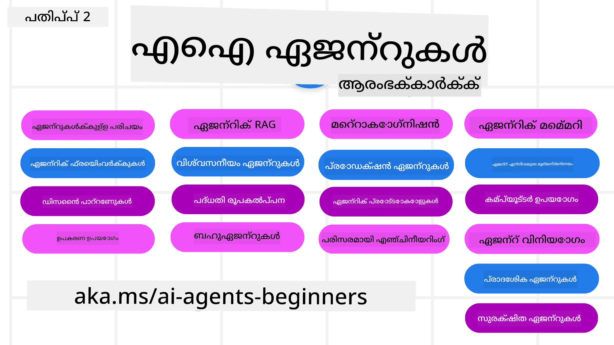

# ആരംഭിക്കുന്നവർക്കായുള്ള AI ഏജന്റുകൾ - ഒരു കോഴ്സ്



## AI ഏജന്റുകൾ നിർമിക്കാൻ തുടങ്ങാൻ നിങ്ങൾ അറിയേണ്ടതെല്ലാം പഠിപ്പിക്കുന്ന ഒരു കോഴ്‌സ്

[](https://github.com/microsoft/ai-agents-for-beginners/blob/master/LICENSE?WT.mc_id=academic-105485-koreyst)
[](https://GitHub.com/microsoft/ai-agents-for-beginners/graphs/contributors/?WT.mc_id=academic-105485-koreyst)
[](https://GitHub.com/microsoft/ai-agents-for-beginners/issues/?WT.mc_id=academic-105485-koreyst)
[](https://GitHub.com/microsoft/ai-agents-for-beginners/pulls/?WT.mc_id=academic-105485-koreyst)
[](http://makeapullrequest.com?WT.mc_id=academic-105485-koreyst)

### 🌐 ബഹുഭാഷാ പിന്തുണ

#### GitHub ആക്ഷൻ മുഖേന പിന്തുണ (സ്വയമേവ പുതുക്കപ്പെടുന്നു & എപ്പോഴും അപ്-ടു-ഡേറ്റ്)

<!-- CO-OP TRANSLATOR LANGUAGES TABLE START -->
[Arabic](../ar/README.md) | [Bengali](../bn/README.md) | [Bulgarian](../bg/README.md) | [Burmese (Myanmar)](../my/README.md) | [Chinese (Simplified)](../zh-CN/README.md) | [Chinese (Traditional, Hong Kong)](../zh-HK/README.md) | [Chinese (Traditional, Macau)](../zh-MO/README.md) | [Chinese (Traditional, Taiwan)](../zh-TW/README.md) | [Croatian](../hr/README.md) | [Czech](../cs/README.md) | [Danish](../da/README.md) | [Dutch](../nl/README.md) | [Estonian](../et/README.md) | [Finnish](../fi/README.md) | [French](../fr/README.md) | [German](../de/README.md) | [Greek](../el/README.md) | [Hebrew](../he/README.md) | [Hindi](../hi/README.md) | [Hungarian](../hu/README.md) | [Indonesian](../id/README.md) | [Italian](../it/README.md) | [Japanese](../ja/README.md) | [Kannada](../kn/README.md) | [Khmer](../km/README.md) | [Korean](../ko/README.md) | [Lithuanian](../lt/README.md) | [Malay](../ms/README.md) | [Malayalam](./README.md) | [Marathi](../mr/README.md) | [Nepali](../ne/README.md) | [Nigerian Pidgin](../pcm/README.md) | [Norwegian](../no/README.md) | [Persian (Farsi)](../fa/README.md) | [Polish](../pl/README.md) | [Portuguese (Brazil)](../pt-BR/README.md) | [Portuguese (Portugal)](../pt-PT/README.md) | [Punjabi (Gurmukhi)](../pa/README.md) | [Romanian](../ro/README.md) | [Russian](../ru/README.md) | [Serbian (Cyrillic)](../sr/README.md) | [Slovak](../sk/README.md) | [Slovenian](../sl/README.md) | [Spanish](../es/README.md) | [Swahili](../sw/README.md) | [Swedish](../sv/README.md) | [Tagalog (Filipino)](../tl/README.md) | [Tamil](../ta/README.md) | [Telugu](../te/README.md) | [Thai](../th/README.md) | [Turkish](../tr/README.md) | [Ukrainian](../uk/README.md) | [Urdu](../ur/README.md) | [Vietnamese](../vi/README.md)

> **പ്രത്യക്ഷത്തിലേക്ക്ക്ലോൺ ചെയ്യണമെന്ന് ആഗ്രഹിക്കുന്നുണ്ടോ?**
>
> ഈ റെപ്പോസിറ്ററിയിൽ 50-ലധികം ഭാഷാ അനുവാദങ്ങൾ ഉൾക്കൊള്ളിച്ചിരിക്കുന്നു, ഇത് ഡൗൺലോഡ് വലുപ്പം വലുതാകും. ഭാഷാ അനുവാദങ്ങൾ ഇല്ലാതെ ക്ലോൺ ചെയ്യാൻ sparse checkout ഉപയോഗിക്കുക:
>
> **Bash / macOS / Linux:**
> ```bash
> git clone --filter=blob:none --sparse https://github.com/microsoft/ai-agents-for-beginners.git
> cd ai-agents-for-beginners
> git sparse-checkout set --no-cone '/*' '!translations' '!translated_images'
> ```
>
> **CMD (Windows):**
> ```cmd
> git clone --filter=blob:none --sparse https://github.com/microsoft/ai-agents-for-beginners.git
> cd ai-agents-for-beginners
> git sparse-checkout set --no-cone "/*" "!translations" "!translated_images"
> ```
>
> ഇതിലൂടെ നിങ്ങൾക്ക് കോഴ്സ് പൂർത്തിയാക്കാൻ കഴിയുന്ന എല്ലാ ആവശ്യവുമുള്ള ഫയലുകൾ വേഗത്തിലും ലഭിക്കും.
<!-- CO-OP TRANSLATOR LANGUAGES TABLE END -->

**കൂടുതൽ ട്രാൻസലേഷൻ ഭാഷകൾ ആവശ്യമായെങ്കിൽ, അവ ഇവിടെ ലിസ്റ്റ് ചെയ്തിരിക്കുന്നു [here](https://github.com/Azure/co-op-translator/blob/main/getting_started/supported-languages.md).**

[](https://GitHub.com/microsoft/ai-agents-for-beginners/watchers/?WT.mc_id=academic-105485-koreyst)
[](https://GitHub.com/microsoft/ai-agents-for-beginners/network/?WT.mc_id=academic-105485-koreyst)
[](https://GitHub.com/microsoft/ai-agents-for-beginners/stargazers/?WT.mc_id=academic-105485-koreyst)

[](https://discord.com/invite/ATgtXmAS5D)


## 🌱 ആരംഭിക്കുന്നത്

ഈ കോഴ്സിൽ AI ഏജന്റുകൾ നിർമ്മിക്കുന്ന അടിസ്ഥാനപരമായ പാഠങ്ങൾ ഉൾക്കൊള്ളിച്ചിരിക്കുന്നു. ഓരോ പാഠവും തങ്ങളുടെ വിഷയം ഉൾക്കൊള്ളുന്നുവെന്ന് നിങ്ങള് ഇഷ്ടപ്പെട്ടിടത്ത് ആരംഭിക്കാം!

ഈ കോഴ്‌സിനായി ബഹുഭാഷാ പിന്തുണ ലഭ്യമാണ്. ഞങ്ങളുടെ [ലഭ്യമായ ഭാഷകൾ ഇവിടെ കാണുക](#-multi-language-support). 

ഇത് നിങ്ങളുടെ ആദ്യത്തെ സൃഷ്ടಿ Generative AI മോഡലുകളുമായി ജോലി ചെയ്യുന്നതിനായെങ്കിൽ, ഞങ്ങളുടെ [Generative AI For Beginners](https://aka.ms/genai-beginners) കോഴ്സ് പരിശോധിക്കുക, ഇതിൽ GenAI ഉപയോഗിച്ച് നിർമിക്കുന്ന 21 പാഠങ്ങൾ ഉൾക്കൊള്ളിച്ചിരിക്കുന്നു.

ഈ റെപ്പോയെ [നക്ഷത്രം (🌟)](https://docs.github.com/en/get-started/exploring-projects-on-github/saving-repositories-with-stars?WT.mc_id=academic-105485-koreyst) നൽകാനും [ഫോർക്ക്](https://github.com/microsoft/ai-agents-for-beginners/fork) ചെയ്ത് കോഡ് റൺ ചെയ്യാനും മറക്കേണ്ട.

### മറ്റ് പഠനാർത്ഥികളെ പരിചയപ്പെടുക, നിങ്ങളുടെ ചോദ്യങ്ങൾക്ക് മറുപടി നേടുക

നിങ്ങൾ കുടുങ്ങുകയോ AI ഏജന്റുകൾ നിർമ്മിക്കുന്നതിനെക്കുറിച്ച് ചോദ്യങ്ങളുണ്ടെങ്കിൽ, [Microsoft Foundry Discord](https://aka.ms/ai-agents/discord) ലെ നമുടെ സമർപ്പിത Discord ചാനലിൽ ചേരുക.

### നിങ്ങൾക്കുള്ളവ

ഈ കോഴ്‌സിലെ ഓരോ പാഠത്തിലും കോഡ് ഉദാഹരണങ്ങൾ ഉൾക്കൊള്ളിച്ചിരിക്കുന്നു, അവ code_samples ഫോൾഡറിൽ കണ്ടെത്താവുന്നതാണ്. നിങ്ങൾക്ക് [ഫോർക്ക്](https://github.com/microsoft/ai-agents-for-beginners/fork) ചെയ്‌തു നിങ്ങളുടെ സ്വന്തം കോപി സൃഷ്ടിക്കാം.  

ഈ അഭ്യാസങ്ങളിലെ കോഡ് ഉദാഹരണങ്ങൾ Microsoft Agent Framework ഉപയോഗിച്ച് Microsoft Foundry Agent Service V2 ഉപയോഗിക്കുന്നു:

- [Microsoft Foundry](https://aka.ms/ai-agents-beginners/ai-foundry) - Azure അക്കൗണ്ട് ആവശ്യമുണ്ട്

ഈ കോഴ്‌സ് Microsoft നും Aganet Framework നും സേവനങ്ങൾ ഉപയോഗിക്കുന്നു:

- [Microsoft Agent Framework (MAF)](https://aka.ms/ai-agents-beginners/agent-framework)
- [Microsoft Foundry Agent Service V2](https://aka.ms/ai-agents-beginners/ai-agent-service)

ചില കോഡ് സാമ്പിൾسുകൾ [MiniMax](https://platform.minimaxi.com/) പോലുള്ള OpenAI-സാന്ദ്രമായ മറ്റു പ്രൊവൈഡറുകളെ പിന്തുണയ്ക്കുന്നു, ഇത് വലിയ (204K ടോക്കൺ വരെ) കണക്കുകളും മോഡലുകളും നൽകുന്നു. സംയോജന വിവരങ്ങൾക്ക് [Course Setup](./00-course-setup/README.md) കാണുക.

ഈ കോഴ്സ് കോഡ് ഓടിക്കുന്നതിനായി കൂടുതൽ വിവരങ്ങൾക്ക് [Course Setup](./00-course-setup/README.md) കാണുക.

## 🙏 സഹായിക്കണമെന്ന് ആഗ്രഹിക്കുന്നുണ്ടോ?

നിർദേശം ഉണ്ടോ അല്ലെങ്കിൽ സ്‌പെല്ലിംഗ് അല്ലെങ്കിൽ കോഡ് പിശകുകൾ കണ്ടെത്തിയോ? [പ്രശ്നം ഉയർത്തുക](https://github.com/microsoft/ai-agents-for-beginners/issues?WT.mc_id=academic-105485-koreyst) അല്ലെങ്കിൽ [പുൾ റിക്വസ്റ്റ് സൃഷ്ടിക്കുക](https://github.com/microsoft/ai-agents-for-beginners/pulls?WT.mc_id=academic-105485-koreyst)


## 📂 ഓരോ പാഠത്തിനും ഉൾപ്പെടുന്നു

- READMEയിൽ ഉള്ള എഴുതിയ പാഠവും ഒരു ചെറു വീഡിയോയും
- Microsoft Agent Framework ഉപയോഗിച്ച് Python കോഡ് സാമ്പിളുകൾ Microsoft Foundry ഉപയോഗിച്ച്
- നിങ്ങളുടെ പഠനം തുടരാൻ അധിക വിഭവങ്ങളിലേക്കുള്ള ലിങ്കുകൾ


## 🗃️ പാഠങ്ങൾ

| **പാഠം**                                   | **വാചകം & കോഡ്**                                    | **വീഡിയോ**                                                  | **അധിക പഠനം**                                                                     |
|----------------------------------------------|----------------------------------------------------|------------------------------------------------------------|----------------------------------------------------------------------------------------|
| AI ഏജന്റുകളുടെ പരിചയവും ഏജന്റ് ഉപയോഗ കേസുകളും       | [ലിങ്ക്](./01-intro-to-ai-agents/README.md)          | [വീഡിയോ](https://youtu.be/3zgm60bXmQk?si=z8QygFvYQv-9WtO1)  | [ലിങ്ക്](https://aka.ms/ai-agents-beginners/collection?WT.mc_id=academic-105485-koreyst) |
| AI ഏജന്റ് ഫ്രെയിംവർക്ക് പരിശോധിക്കൽ              | [ലിങ്ക്](./02-explore-agentic-frameworks/README.md)  | [വീഡിയോ](https://youtu.be/ODwF-EZo_O8?si=Vawth4hzVaHv-u0H)  | [ലിങ്ക്](https://aka.ms/ai-agents-beginners/collection?WT.mc_id=academic-105485-koreyst) |
| AI ഏജന്റ് ഡിസൈൻ പാറ്റേണുകൾ മനസ്സിലാക്കുക     | [ലിങ്ക്](./03-agentic-design-patterns/README.md)     | [വീഡിയോ](https://youtu.be/m9lM8qqoOEA?si=BIzHwzstTPL8o9GF)  | [ലിങ്ക്](https://aka.ms/ai-agents-beginners/collection?WT.mc_id=academic-105485-koreyst) |
| ഉപകരണ ഉപയോഗ ഡിസൈൻ പാറ്റേൺ                      | [ലിങ്ക്](./04-tool-use/README.md)                    | [വീഡിയോ](https://youtu.be/vieRiPRx-gI?si=2z6O2Xu2cu_Jz46N)  | [ലിങ്ക്](https://aka.ms/ai-agents-beginners/collection?WT.mc_id=academic-105485-koreyst) |
| ഏജന്റിക് RAG                                  | [ലിങ്ക്](./05-agentic-rag/README.md)                 | [വീഡിയോ](https://youtu.be/WcjAARvdL7I?si=gKPWsQpKiIlDH9A3)  | [ലിങ്ക്](https://aka.ms/ai-agents-beginners/collection?WT.mc_id=academic-105485-koreyst) |
| വിശ്വാസയോഗ്യമായ AI ഏജന്റുകൾ നിർമ്മിക്കൽ               | [ലിങ്ക്](./06-building-trustworthy-agents/README.md) | [വീഡിയോ](https://youtu.be/iZKkMEGBCUQ?si=jZjpiMnGFOE9L8OK ) | [ലിങ്ക്](https://aka.ms/ai-agents-beginners/collection?WT.mc_id=academic-105485-koreyst) |
| പദ്ധതിയിടൽ ഡിസൈൻ പാറ്റേൺ                      | [ലിങ്ക്](./07-planning-design/README.md)             | [വീഡിയോ](https://youtu.be/kPfJ2BrBCMY?si=6SC_iv_E5-mzucnC)  | [ലിങ്ക്](https://aka.ms/ai-agents-beginners/collection?WT.mc_id=academic-105485-koreyst) |
| ബഹു-ഏജന്റ് ഡിസൈൻ പാറ്റേൺ                   | [ലിങ്ക്](./08-multi-agent/README.md)                 | [വീഡിയോ](https://youtu.be/V6HpE9hZEx0?si=rMgDhEu7wXo2uo6g)  | [ലിങ്ക്](https://aka.ms/ai-agents-beginners/collection?WT.mc_id=academic-105485-koreyst) |

| മെറ്റാകോഗ്നിഷൻ ഡിസൈൻ പാറ്റേൺ                 | [லിങ്ക്](./09-metacognition/README.md)               | [വിഡിയോ](https://youtu.be/His9R6gw6Ec?si=8gck6vvdSNCt6OcF)  | [ലിങ്ക്](https://aka.ms/ai-agents-beginners/collection?WT.mc_id=academic-105485-koreyst) |
| പ്രൊഡക്ഷനിൽ AI ഏജന്റുകൾ                      | [ലിങ്ക്](./10-ai-agents-production/README.md)        | [വിഡിയോ](https://youtu.be/l4TP6IyJxmQ?si=31dnhexRo6yLRJDl)  | [ലിങ്ക്](https://aka.ms/ai-agents-beginners/collection?WT.mc_id=academic-105485-koreyst) |
| ഏജന്റിക് പ്രോട്ടോകോളുകൾ ഉപയോഗിക്കൽ (MCP, A2A, NLWeb) | [ലിങ്ക്](./11-agentic-protocols/README.md)           | [വിഡിയോ](https://youtu.be/X-Dh9R3Opn8)                                 | [ലിങ്ക്](https://aka.ms/ai-agents-beginners/collection?WT.mc_id=academic-105485-koreyst) |
| AI ഏജന്റുകൾക്കായുള്ള കോൺടെക്സ്റ്റ് എഞ്ചിനീയറിംഗ്            | [ലിങ്ക്](./12-context-engineering/README.md)         | [വിഡിയോ](https://youtu.be/F5zqRV7gEag)                                 | [ലിങ്ക്](https://aka.ms/ai-agents-beginners/collection?WT.mc_id=academic-105485-koreyst) |
| ഏജന്റിക് മെമ്മറി മാനേജ്‌മെന്റ്                       | [ലിങ്ക്](./13-agent-memory/README.md)     |      [വിഡിയോ](https://youtu.be/QrYbHesIxpw?si=vZkVwKrQ4ieCcIPx)                                                      |                                                                                        |
| മൈക്രോസോഫ്റ്റ് ഏജന്റ് ഫ്രെയിംവർക്ക് എക്സ്‌പ്ലോറിംഗ്                         | [ലിങ്ക്](./14-microsoft-agent-framework/README.md)                            |                                                            |                                                                                        |
| കമ്പ്യൂട്ടർ ഉപയോഗ ഏജന്റുകൾ നിർമ്മിക്കൽ (CUA)           | [ലിങ്ക്](./15-browser-use/README.md)     |                                                            | [ലിങ്ക്](https://docs.browser-use.com/examples/templates/playwright-integration)         |
| സ്കെയിലബിൾ ഏജന്റുകൾ ഡിപ്ലോയ് ചെയ്യുന്നു                    | ഉടൻ വരുന്നു                            |                                                            |                                                                                        |
| ലോക്കൽ AI ഏജന്റുകൾ സൃഷ്ടിക്കുന്നു                     | ഉടൻ വരുന്നു                               |                                                            |                                                                                        |
| AI ഏജന്റുകൾ സുരക്ഷിതമാക്കൽ                           | [ലിങ്ക്](./18-securing-ai-agents/README.md)  |                                                            | [ലിങ്ക്](https://aka.ms/ai-agents-beginners/collection?WT.mc_id=academic-105485-koreyst) |

## 🎒 മറ്റ് കോഴ്സുകൾ

ഞങ്ങളുടെ ടീം മറ്റ് കോഴ്സുകളും ഉത്പാദിപ്പിക്കുന്നു! പരിശോധിക്കുക:

<!-- CO-OP TRANSLATOR OTHER COURSES START -->
### LangChain
[](https://aka.ms/langchain4j-for-beginners)
[](https://aka.ms/langchainjs-for-beginners?WT.mc_id=m365-94501-dwahlin)
[](https://github.com/microsoft/langchain-for-beginners?WT.mc_id=m365-94501-dwahlin)
---

### Azure / എഡ്ജ് / MCP / ഏജന്റുകൾ
[](https://github.com/microsoft/AZD-for-beginners?WT.mc_id=academic-105485-koreyst)
[](https://github.com/microsoft/edgeai-for-beginners?WT.mc_id=academic-105485-koreyst)
[](https://github.com/microsoft/mcp-for-beginners?WT.mc_id=academic-105485-koreyst)
[](https://github.com/microsoft/ai-agents-for-beginners?WT.mc_id=academic-105485-koreyst)

---
 
### ജനറേറ്റീവ് AI সিরീസ്
[](https://github.com/microsoft/generative-ai-for-beginners?WT.mc_id=academic-105485-koreyst)
[-9333EA?style=for-the-badge&labelColor=E5E7EB&color=9333EA)](https://github.com/microsoft/Generative-AI-for-beginners-dotnet?WT.mc_id=academic-105485-koreyst)
[-C084FC?style=for-the-badge&labelColor=E5E7EB&color=C084FC)](https://github.com/microsoft/generative-ai-for-beginners-java?WT.mc_id=academic-105485-koreyst)

[-E879F9?style=for-the-badge&labelColor=E5E7EB&color=E879F9)](https://github.com/microsoft/generative-ai-with-javascript?WT.mc_id=academic-105485-koreyst)

---
 
### കോര്‍ പഠനം
[](https://aka.ms/ml-beginners?WT.mc_id=academic-105485-koreyst)
[](https://aka.ms/datascience-beginners?WT.mc_id=academic-105485-koreyst)
[](https://aka.ms/ai-beginners?WT.mc_id=academic-105485-koreyst)
[](https://github.com/microsoft/Security-101?WT.mc_id=academic-96948-sayoung)
[](https://aka.ms/webdev-beginners?WT.mc_id=academic-105485-koreyst)
[](https://aka.ms/iot-beginners?WT.mc_id=academic-105485-koreyst)
[](https://github.com/microsoft/xr-development-for-beginners?WT.mc_id=academic-105485-koreyst)

---
 
### കോപൈലറ്റ് പരമ്പര
[](https://aka.ms/GitHubCopilotAI?WT.mc_id=academic-105485-koreyst)
[](https://github.com/microsoft/mastering-github-copilot-for-dotnet-csharp-developers?WT.mc_id=academic-105485-koreyst)
[](https://github.com/microsoft/CopilotAdventures?WT.mc_id=academic-105485-koreyst)
<!-- CO-OP TRANSLATOR OTHER COURSES END -->

## 🌟 കമ്മ്യൂണിറ്റി നന്ദി

ഏജന്റിക് RAG പ്രദർശിപ്പിക്കുന്ന പ്രധാന കോഡ് സാമ്പിളുകൾ സംഭാവന നൽകിയതിന് [Shivam Goyal](https://www.linkedin.com/in/shivam2003/) നന്ദി.

## സംഭാവന ചെയ്യല്‍

ഈ പ്രോജക്ട് സംഭാവനകളും നിർദ്ദേശങ്ങളും സ്വാഗതം ചെയ്യുന്നു. ഏറ്റവും അധികം സംഭാവനകൾ നിങ്ങൾക്ക്
Contributor License Agreement (CLA) യെ അംഗീകരിക്കേണ്ടതാണ്, അതിൽ നിങ്ങൾക്ക് അവകാശം ഉള്ളതായി, ഫലപ്രദമായി നിങ്ങളാണ്
നിങ്ങളുടെ സംഭാവന ഉപയോഗിക്കാൻ അവകാശം നൽകുന്നത് എന്ന് പ്രഖ്യാപിക്കുന്നത് ആവശ്യമാണ്. വിശദാംശങ്ങൾക്ക് <https://cla.opensource.microsoft.com> സന്ദർശിക്കുക.

നിങ്ങൾ ഒരു പുൾ അഭ്യർത്ഥന സമർപ്പിക്കുമ്പോൾ, CLA ബോട്ട് സ്വയം നിർണ്ണയിക്കും നിങ്ങൾ CLA നൽകേണ്ടതുണ്ടോ എന്നു
മാറ്റ് ചെയ്യുകയും PR യെ അനുയോജ്യമായി അലങ്കരിക്കുകയും ചെയ്യും (ഉദാഹരണത്തിന്, സ്റ്റാറ്റസ് ചെക്ക്, കമന്റുകൾ). ബോട്ട് നൽകുന്ന
നിർദേശങ്ങൾ പിന്തുടരുക. ഞങ്ങളുടെ CLA ഉപയോഗിക്കുന്ന എല്ലാ റെപ്പോസിറ്ററികളിലും ഇത് ഒരിക്കൽ മാത്രമാണ് ചെയ്യേണ്ടത്.

ഈ പ്രോജക്ട് [Microsoft Open Source Code of Conduct](https://opensource.microsoft.com/codeofconduct/) സ്വീകരിച്ചിട്ടുണ്ട്.
കൂടുതല്‍ വിവരങ്ങൾക്ക് [Code of Conduct FAQ](https://opensource.microsoft.com/codeofconduct/faq/) കാണുക അല്ലെങ്കിൽ
[opencode@microsoft.com](mailto:opencode@microsoft.com) എന്ന വിലാസം സന്ദർശിച്ച് ഏതെങ്കിലും ചോദ്യങ്ങൾക്കോ അഭിപ്രായങ്ങൾക്കോ ബന്ധപ്പെടുക.

## ട്രേഡ്‌മാർക്ക്

ഈ പ്രോജക്ടിൽ പ്രോജക്ടുകൾ, ഉൽപ്പന്നങ്ങൾ, സേവനങ്ങൾ എന്നിവയുടെ ട്രേഡ്‌മാർക്ക് അല്ലെങ്കിൽ ലോഗോ ഉൾക്കൊണ്ടിരിക്കാം. മൈക്രോസോഫ്റ്റിന്റെ
ട്രേഡ്‌മുക്കുകൾ അല്ലെങ്കിൽ ലോഗോകളുടെ അനുമോദിത ഉപയോഗം [Microsoft's Trademark & Brand Guidelines](https://www.microsoft.com/legal/intellectualproperty/trademarks/usage/general) അനുസരിച്ചിരിക്കണം.
ഈ പ്രോജക്ടിന്റെ മാറിയ പതിപ്പുകളിൽ മൈക്രോസോഫ്റ്റ് ട്രേഡ്‌മാർക്കും ലോഗോകൾക്കും ഉപയോഗം അസ്മ്ബന്ധത ഉണ്ടാക്കരുത് അല്ലെങ്കിൽ മൈക്രോസോഫ്റ്റിന്റെ സ്പോൺസർഷിപ്പ് സൂചിപ്പിക്കരുത്.

മൂന്നാം കക്ഷി ട്രേഡ്‌മാർക്കുകൾ അല്ലെങ്കിൽ ലോഗോകൾ ഉപയോഗിക്കുന്നത് ആ മൂന്നാം കക്ഷികളുടെ നയം അനുസരിച്ചിരിക്കണം.

## സഹായം ലഭിക്കാന്‍


നിങ്ങൾ വഴിവയ്ക്കപ്പെടുകയോ AI ആപ്പുകൾ നിർമ്മിക്കുന്നതിൽ ഏതെങ്കിലും ചോദ്യം ഉണ്ടായിരുന്നാലോ, ചേരുക:

[](https://aka.ms/foundry/discord)

ഉൽപ്പന്ന പ്രതികരണങ്ങൾ അല്ലെങ്കിൽ പ്രശ്നങ്ങൾ ഉണ്ടെങ്കിൽ സന്ദർശിക്കുക:

[](https://aka.ms/foundry/forum)

---

<!-- CO-OP TRANSLATOR DISCLAIMER START -->
**അറിയിപ്പ്**:
ഈ രേഖ AI പരിഭാഷാ സേവനം [Co-op Translator](https://github.com/Azure/co-op-translator) ഉപയോഗിച്ച് പരിഭാഷപ്പെടുത്തിയതാണ്. ഞങ്ങൾ കൃത്യതയ്ക്കായി ശ്രമിക്കുന്നുവെങ്കിലും, ഓട്ടോമേറ്റഡ് പരിഭാഷകളിൽ പിഴവുകൾ അല്ലെങ്കിൽ തെറ്റായ വിവരങ്ങൾ ഉണ്ടാകാൻ സാധ്യതയുണ്ട്. അതിന്റെ സ്വാഭാവിക ഭാഷയിലുള്ള അസൽ രേഖയാണ് പ്രാമാണികമായ ഉറവിടമായി പരിഗണിക്കേണ്ടത്. നിർണായകമായ വിവരങ്ങൾക്ക്, പ്രൊഫഷണൽ മനുഷ്യ പരിഭാഷ ശുപാർശ ചെയ്യുന്നു. ഈ പരിഭാഷ ഉപയോഗിച്ച് ഉണ്ടാകുന്ന തെറ്റിദ്ധാരണകൾ അല്ലെങ്കിൽ തെറ്റായ വ്യാഖ്യാനങ്ങൾക്കായി ഞങ്ങൾ ഉത്തരവാദികളല്ല.
<!-- CO-OP TRANSLATOR DISCLAIMER END -->