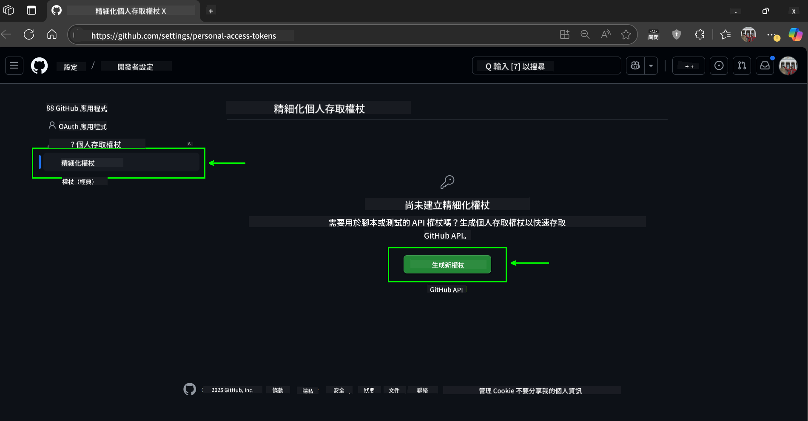
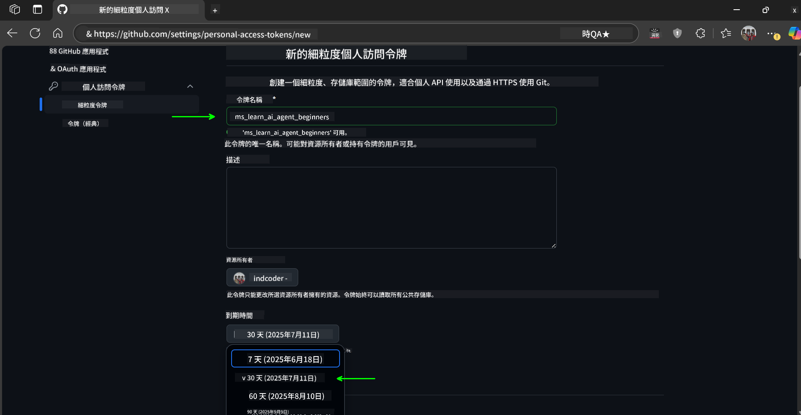
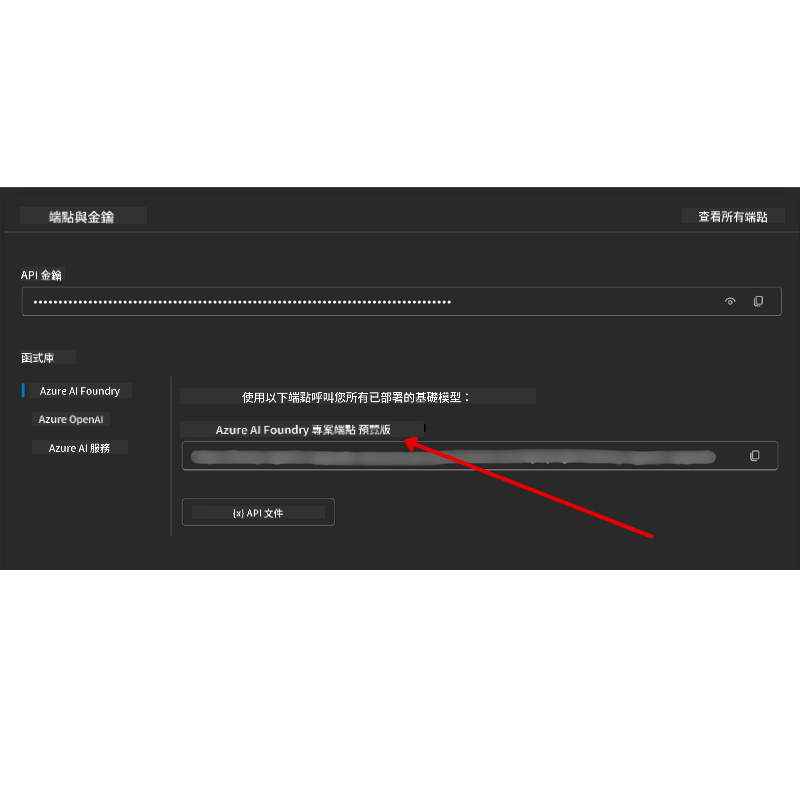

<!--
CO_OP_TRANSLATOR_METADATA:
{
  "original_hash": "c6a79c8f2b56a80370ff7e447765524f",
  "translation_date": "2025-07-24T07:48:07+00:00",
  "source_file": "00-course-setup/README.md",
  "language_code": "mo"
}
-->
# 課程設定

## 簡介

本課程將教您如何執行課程中的程式碼範例。

## 複製或分叉此存儲庫

首先，請複製或分叉 GitHub 存儲庫。這樣您就可以擁有課程材料的自己的版本，方便執行、測試和調整程式碼！

您可以通過點擊以下連結完成操作：


## 執行程式碼

本課程提供一系列 Jupyter Notebook，讓您能夠親自操作並學習如何構建 AI Agents。

程式碼範例使用以下方式：

**需要 GitHub 帳戶 - 免費**：

1) Semantic Kernel Agent Framework + GitHub Models Marketplace，標記為 (semantic-kernel.ipynb)
2) AutoGen Framework + GitHub Models Marketplace，標記為 (autogen.ipynb)

**需要 Azure 訂閱**：
3) Azure AI Foundry + Azure AI Agent Service，標記為 (azureaiagent.ipynb)

我們鼓勵您嘗試所有三種範例，看看哪一種最適合您。

無論您選擇哪種方式，都將決定您需要遵循以下的設定步驟：

## 必要條件

- Python 3.12+
  - **注意**：如果您尚未安裝 Python 3.12，請確保安裝它。然後使用 python3.12 創建虛擬環境，以確保從 requirements.txt 文件中安裝正確的版本。
- GitHub 帳戶 - 用於訪問 GitHub Models Marketplace
- Azure 訂閱 - 用於訪問 Azure AI Foundry
- Azure AI Foundry 帳戶 - 用於訪問 Azure AI Agent Service

我們在存儲庫的根目錄中包含了一個 `requirements.txt` 文件，其中列出了執行程式碼範例所需的所有 Python 套件。

您可以在存儲庫的根目錄中打開終端並執行以下命令來安裝它們：

```bash
pip install -r requirements.txt
```
我們建議創建一個 Python 虛擬環境，以避免任何衝突和問題。

## 設定 VSCode
確保您在 VSCode 中使用正確版本的 Python。


## 使用 GitHub Models 的範例設定 

### 步驟 1：獲取您的 GitHub 個人訪問令牌 (PAT)

本課程利用 GitHub Models Marketplace，提供免費訪問大型語言模型 (LLMs)，您將使用它們來構建 AI Agents。

要使用 GitHub Models，您需要創建一個 [GitHub 個人訪問令牌](https://docs.github.com/en/authentication/keeping-your-account-and-data-secure/managing-your-personal-access-tokens)。

您可以通過進入您的 GitHub 帳戶完成此操作。

請遵循 [最小權限原則](https://docs.github.com/en/get-started/learning-to-code/storing-your-secrets-safely) 創建令牌。這意味著您應僅授予令牌執行本課程程式碼範例所需的權限。

1. 在螢幕左側選擇 `Fine-grained tokens` 選項。

    然後選擇 `Generate new token`。

    

1. 為您的令牌輸入一個描述性名稱，反映其用途，方便日後識別。設置過期日期（建議：30 天；如果您希望更安全，可以選擇更短的期限，例如 7 天）。

    

1. 將令牌的範圍限制在您分叉的存儲庫。

    

1. 限制令牌的權限：在 **Permissions** 下，切換 **Account Permissions**，找到 **Models** 並僅啟用 GitHub Models 所需的讀取權限。

    

    

複製您剛剛創建的新令牌。接下來，您需要將此令牌添加到課程中包含的 `.env` 文件中。

### 步驟 2：創建您的 `.env` 文件

要創建 `.env` 文件，請在終端中執行以下命令：

```bash
cp .env.example .env
```

這將複製示例文件並在您的目錄中創建 `.env` 文件，您需要在其中填寫環境變數的值。

複製您的令牌後，打開您喜歡的文字編輯器，將令牌粘貼到 `.env` 文件中的 `GITHUB_TOKEN` 欄位。

現在您應該可以執行本課程的程式碼範例。

## 使用 Azure AI Foundry 和 Azure AI Agent Service 的範例設定

### 步驟 1：獲取您的 Azure 項目端點

按照以下步驟在 Azure AI Foundry 中創建 Hub 和項目：[Hub 資源概述](https://learn.microsoft.com/en-us/azure/ai-foundry/concepts/ai-resources)

創建項目後，您需要獲取項目的連接字串。

您可以通過進入 Azure AI Foundry 入口網站中項目的 **概述** 頁面完成此操作。



### 步驟 2：創建您的 `.env` 文件

要創建 `.env` 文件，請在終端中執行以下命令：

```bash
cp .env.example .env
```

這將複製示例文件並在您的目錄中創建 `.env` 文件，您需要在其中填寫環境變數的值。

複製您的令牌後，打開您喜歡的文字編輯器，將令牌粘貼到 `.env` 文件中的 `PROJECT_ENDPOINT` 欄位。

### 步驟 3：登錄 Azure

作為安全最佳實踐，我們將使用 [無密鑰身份驗證](https://learn.microsoft.com/azure/developer/ai/keyless-connections?tabs=csharp%2Cazure-cli?WT.mc_id=academic-105485-koreyst) 通過 Microsoft Entra ID 驗證到 Azure OpenAI。

接下來，打開終端並執行 `az login --use-device-code` 登錄到您的 Azure 帳戶。

登錄後，在終端中選擇您的訂閱。

## 額外的環境變數 - Azure Search 和 Azure OpenAI 

在第 5 課 - Agentic RAG Lesson 中，有一些範例使用 Azure Search 和 Azure OpenAI。

如果您希望執行這些範例，您需要在 `.env` 文件中添加以下環境變數：

### 概述頁面（項目）

- `AZURE_SUBSCRIPTION_ID` - 在項目 **概述** 頁面的 **項目詳情** 中檢查。
- `AZURE_AI_PROJECT_NAME` - 在項目 **概述** 頁面頂部查看。
- `AZURE_OPENAI_SERVICE` - 在 **概述** 頁面的 **包含的功能** 標籤中找到 **Azure OpenAI Service**。

### 管理中心

- `AZURE_OPENAI_RESOURCE_GROUP` - 在 **管理中心** 的 **概述** 頁面中，進入 **項目屬性**。
- `GLOBAL_LLM_SERVICE` - 在 **連接的資源** 下找到 **Azure AI Services** 的連接名稱。如果未列出，請檢查 **Azure 入口網站** 中資源組的 AI Services 資源名稱。

### 模型 + 端點頁面

- `AZURE_OPENAI_EMBEDDING_DEPLOYMENT_NAME` - 選擇您的嵌入模型（例如 `text-embedding-ada-002`），並記下模型詳情中的 **部署名稱**。
- `AZURE_OPENAI_CHAT_DEPLOYMENT_NAME` - 選擇您的聊天模型（例如 `gpt-4o-mini`），並記下模型詳情中的 **部署名稱**。

### Azure 入口網站

- `AZURE_OPENAI_ENDPOINT` - 找到 **Azure AI Services**，點擊它，然後進入 **資源管理**，選擇 **密鑰和端點**，向下滾動到 "Azure OpenAI endpoints"，複製標記為 "Language APIs" 的端點。
- `AZURE_OPENAI_API_KEY` - 在同一頁面中，複製密鑰 1 或密鑰 2。
- `AZURE_SEARCH_SERVICE_ENDPOINT` - 找到您的 **Azure AI Search** 資源，點擊它，然後查看 **概述**。
- `AZURE_SEARCH_API_KEY` - 然後進入 **設置**，選擇 **密鑰**，複製主要或次要管理密鑰。

### 外部網頁

- `AZURE_OPENAI_API_VERSION` - 訪問 [API 版本生命週期](https://learn.microsoft.com/en-us/azure/ai-services/openai/api-version-deprecation#latest-ga-api-release) 頁面，查看 **最新 GA API 發佈**。

### 設定無密鑰身份驗證

為避免硬編碼您的憑證，我們將使用 Azure OpenAI 的無密鑰連接。為此，我們將導入 `DefaultAzureCredential`，稍後調用 `DefaultAzureCredential` 函數以獲取憑證。

```python
from azure.identity import DefaultAzureCredential, InteractiveBrowserCredential
```

## 遇到問題？

如果您在執行此設定時遇到任何問題，請加入我們的。

## 下一課程

您現在已準備好執行本課程的程式碼。祝您在 AI Agents 的世界中學習愉快！

[AI Agents 簡介及其應用案例](../01-intro-to-ai-agents/README.md)

**免責聲明**：  
本文件已使用 AI 翻譯服務 [Co-op Translator](https://github.com/Azure/co-op-translator) 進行翻譯。我們致力於提供準確的翻譯，但請注意，自動翻譯可能包含錯誤或不準確之處。應以原文文件作為權威來源。對於關鍵資訊，建議尋求專業人工翻譯。我們對因使用此翻譯而引起的任何誤解或誤讀概不負責。