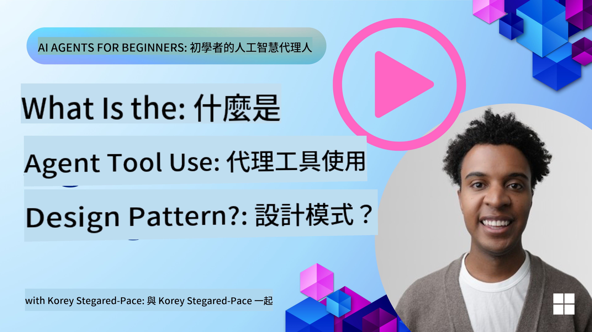
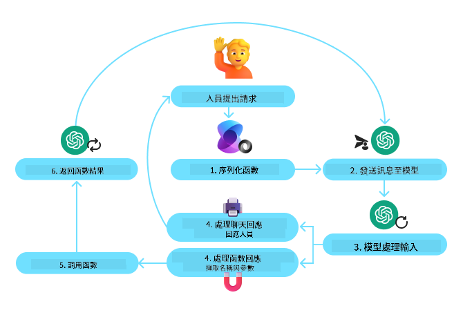
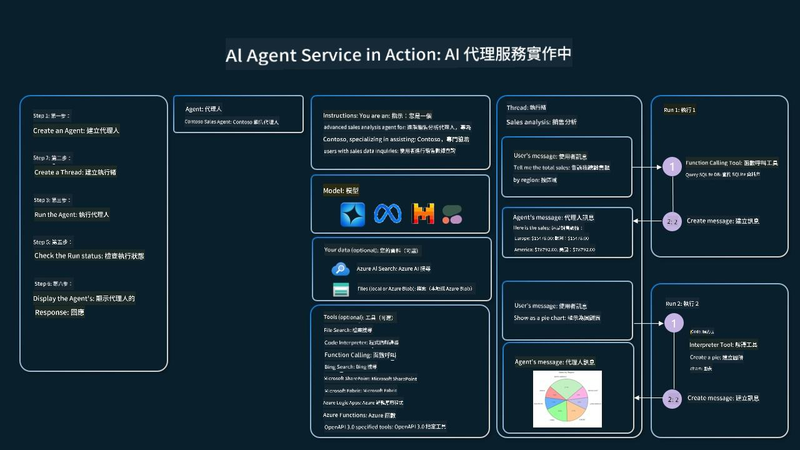

<!--
CO_OP_TRANSLATOR_METADATA:
{
  "original_hash": "e056335d729ba6e49571db7a6533825d",
  "translation_date": "2025-09-30T06:27:43+00:00",
  "source_file": "04-tool-use/README.md",
  "language_code": "mo"
}
-->
[](https://youtu.be/vieRiPRx-gI?si=cEZ8ApnT6Sus9rhn)

> _(點擊上方圖片觀看本課程影片)_

# 工具使用設計模式

工具之所以有趣，是因為它們能讓 AI 代理擁有更廣泛的能力範圍。透過添加工具，代理不再僅限於執行有限的動作，而是能執行多種操作。在本章中，我們將探討工具使用設計模式，該模式描述了 AI 代理如何使用特定工具來達成目標。

## 簡介

在本課程中，我們希望回答以下問題：

- 什麼是工具使用設計模式？
- 它可以應用於哪些使用案例？
- 實現該設計模式需要哪些元素/構建模塊？
- 使用工具使用設計模式構建可信賴的 AI 代理需要注意哪些特殊事項？

## 學習目標

完成本課程後，您將能夠：

- 定義工具使用設計模式及其目的。
- 識別工具使用設計模式適用的使用案例。
- 理解實現該設計模式所需的關鍵元素。
- 認識使用該設計模式構建可信賴 AI 代理的注意事項。

## 什麼是工具使用設計模式？

**工具使用設計模式**專注於賦予大型語言模型 (LLMs) 與外部工具互動的能力，以達成特定目標。工具是代理可以執行操作的程式碼。工具可以是簡單的函數，例如計算器，或是第三方服務的 API 調用，例如股票價格查詢或天氣預報。在 AI 代理的背景下，工具被設計為代理在**模型生成的函數調用**中執行。

## 它可以應用於哪些使用案例？

AI 代理可以利用工具完成複雜任務、檢索資訊或做出決策。工具使用設計模式通常用於需要與外部系統動態互動的場景，例如資料庫、網路服務或程式碼解釋器。這種能力適用於多種使用案例，包括：

- **動態資訊檢索**：代理可以查詢外部 API 或資料庫以獲取最新數據（例如，查詢 SQLite 資料庫進行數據分析、獲取股票價格或天氣資訊）。
- **程式碼執行與解釋**：代理可以執行程式碼或腳本以解決數學問題、生成報告或進行模擬。
- **工作流程自動化**：透過整合工具（如任務排程器、電子郵件服務或數據管道）來自動化重複或多步驟的工作流程。
- **客戶支持**：代理可以與 CRM 系統、工單平台或知識庫互動以解決用戶問題。
- **內容生成與編輯**：代理可以利用工具（如語法檢查器、文本摘要器或內容安全評估器）協助完成內容創作任務。

## 實現工具使用設計模式需要哪些元素/構建模塊？

這些構建模塊使 AI 代理能夠執行多種任務。以下是實現工具使用設計模式所需的關鍵元素：

- **函數/工具架構**：詳細定義可用工具，包括函數名稱、用途、所需參數和預期輸出。這些架構使 LLM 能夠理解可用工具及如何構建有效請求。

- **函數執行邏輯**：管理工具根據用戶意圖和對話上下文的調用方式和時機。這可能包括規劃模塊、路由機制或動態決定工具使用的條件流程。

- **消息處理系統**：管理用戶輸入、LLM 回應、工具調用和工具輸出的對話流程的組件。

- **工具整合框架**：連接代理與各種工具的基礎設施，無論是簡單函數還是複雜的外部服務。

- **錯誤處理與驗證**：處理工具執行失敗、驗證參數及管理意外回應的機制。

- **狀態管理**：追蹤對話上下文、先前的工具交互及持久數據，以確保多輪交互的一致性。

接下來，我們將更詳細地探討函數/工具調用。

### 函數/工具調用

函數調用是使大型語言模型 (LLMs) 與工具互動的主要方式。您會經常看到「函數」和「工具」交替使用，因為「函數」（可重用的程式碼塊）是代理用來執行任務的「工具」。為了調用函數的程式碼，LLM 必須將用戶的請求與函數的描述進行比較。為此，包含所有可用函數描述的架構會被發送到 LLM。LLM 然後選擇最適合任務的函數並返回其名稱和參數。選定的函數被調用，其回應被發送回 LLM，LLM 使用該資訊回應用戶的請求。

開發者要為代理實現函數調用，需要：

1. 支援函數調用的 LLM 模型
2. 包含函數描述的架構
3. 每個描述函數的程式碼

以下用獲取城市當前時間的例子來說明：

1. **初始化支援函數調用的 LLM：**

    並非所有模型都支援函數調用，因此確認您使用的 LLM 是否支援非常重要。<a href="https://learn.microsoft.com/azure/ai-services/openai/how-to/function-calling" target="_blank">Azure OpenAI</a> 支援函數調用。我們可以從初始化 Azure OpenAI 客戶端開始。

    ```python
    # Initialize the Azure OpenAI client
    client = AzureOpenAI(
        azure_endpoint = os.getenv("AZURE_OPENAI_ENDPOINT"), 
        api_key=os.getenv("AZURE_OPENAI_API_KEY"),  
        api_version="2024-05-01-preview"
    )
    ```

1. **創建函數架構**：

    接下來，我們將定義一個 JSON 架構，其中包含函數名稱、函數用途的描述，以及函數參數的名稱和描述。
    然後，我們將此架構與用戶的請求（例如查詢舊金山的時間）一起傳遞給之前創建的客戶端。需要注意的是，返回的是**工具調用**，而**不是**問題的最終答案。如前所述，LLM 返回其為任務選擇的函數名稱及其參數。

    ```python
    # Function description for the model to read
    tools = [
        {
            "type": "function",
            "function": {
                "name": "get_current_time",
                "description": "Get the current time in a given location",
                "parameters": {
                    "type": "object",
                    "properties": {
                        "location": {
                            "type": "string",
                            "description": "The city name, e.g. San Francisco",
                        },
                    },
                    "required": ["location"],
                },
            }
        }
    ]
    ```
   
    ```python
  
    # Initial user message
    messages = [{"role": "user", "content": "What's the current time in San Francisco"}] 
  
    # First API call: Ask the model to use the function
      response = client.chat.completions.create(
          model=deployment_name,
          messages=messages,
          tools=tools,
          tool_choice="auto",
      )
  
      # Process the model's response
      response_message = response.choices[0].message
      messages.append(response_message)
  
      print("Model's response:")  

      print(response_message)
  
    ```

    ```bash
    Model's response:
    ChatCompletionMessage(content=None, role='assistant', function_call=None, tool_calls=[ChatCompletionMessageToolCall(id='call_pOsKdUlqvdyttYB67MOj434b', function=Function(arguments='{"location":"San Francisco"}', name='get_current_time'), type='function')])
    ```
  
1. **執行任務所需的函數程式碼：**

    現在 LLM 已選擇需要運行的函數，接下來需要實現並執行執行任務的程式碼。
    我們可以用 Python 實現獲取當前時間的程式碼。我們還需要編寫程式碼以從 response_message 中提取函數名稱和參數以獲得最終結果。

    ```python
      def get_current_time(location):
        """Get the current time for a given location"""
        print(f"get_current_time called with location: {location}")  
        location_lower = location.lower()
        
        for key, timezone in TIMEZONE_DATA.items():
            if key in location_lower:
                print(f"Timezone found for {key}")  
                current_time = datetime.now(ZoneInfo(timezone)).strftime("%I:%M %p")
                return json.dumps({
                    "location": location,
                    "current_time": current_time
                })
      
        print(f"No timezone data found for {location_lower}")  
        return json.dumps({"location": location, "current_time": "unknown"})
    ```

     ```python
     # Handle function calls
      if response_message.tool_calls:
          for tool_call in response_message.tool_calls:
              if tool_call.function.name == "get_current_time":
     
                  function_args = json.loads(tool_call.function.arguments)
     
                  time_response = get_current_time(
                      location=function_args.get("location")
                  )
     
                  messages.append({
                      "tool_call_id": tool_call.id,
                      "role": "tool",
                      "name": "get_current_time",
                      "content": time_response,
                  })
      else:
          print("No tool calls were made by the model.")  
  
      # Second API call: Get the final response from the model
      final_response = client.chat.completions.create(
          model=deployment_name,
          messages=messages,
      )
  
      return final_response.choices[0].message.content
     ```

     ```bash
      get_current_time called with location: San Francisco
      Timezone found for san francisco
      The current time in San Francisco is 09:24 AM.
     ```

函數調用是大多數代理工具使用設計的核心，然而從零開始實現它有時可能具有挑戰性。
正如我們在[第 2 課](../../../02-explore-agentic-frameworks)中學到的，代理框架為我們提供了實現工具使用的預構建模塊。

## 使用代理框架的工具使用範例

以下是使用不同代理框架實現工具使用設計模式的一些範例：

### Semantic Kernel

<a href="https://learn.microsoft.com/azure/ai-services/agents/overview" target="_blank">Semantic Kernel</a> 是一個開源 AI 框架，適用於使用大型語言模型 (LLMs) 的 .NET、Python 和 Java 開發者。它透過一個稱為<a href="https://learn.microsoft.com/semantic-kernel/concepts/ai-services/chat-completion/function-calling/?pivots=programming-language-python#1-serializing-the-functions" target="_blank">序列化</a>的過程，簡化了函數調用的使用，並自動向模型描述您的函數及其參數。它還處理模型與您的程式碼之間的來回通信。使用像 Semantic Kernel 這樣的代理框架的另一個優勢是，它允許您訪問預構建工具，例如<a href="https://github.com/microsoft/semantic-kernel/blob/main/python/samples/getting_started_with_agents/openai_assistant/step4_assistant_tool_file_search.py" target="_blank">文件搜索</a>和<a href="https://github.com/microsoft/semantic-kernel/blob/main/python/samples/getting_started_with_agents/openai_assistant/step3_assistant_tool_code_interpreter.py" target="_blank">程式碼解釋器</a>。

以下圖表展示了使用 Semantic Kernel 進行函數調用的過程：



在 Semantic Kernel 中，函數/工具被稱為<a href="https://learn.microsoft.com/semantic-kernel/concepts/plugins/?pivots=programming-language-python" target="_blank">插件</a>。我們可以將之前看到的 `get_current_time` 函數轉換為插件，方法是將其轉換為包含該函數的類。我們還可以導入 `kernel_function` 裝飾器，該裝飾器接受函數的描述。當您使用 GetCurrentTimePlugin 創建內核時，內核會自動序列化函數及其參數，並在此過程中創建要發送到 LLM 的架構。

```python
from semantic_kernel.functions import kernel_function

class GetCurrentTimePlugin:
    async def __init__(self, location):
        self.location = location

    @kernel_function(
        description="Get the current time for a given location"
    )
    def get_current_time(location: str = ""):
        ...

```

```python 
from semantic_kernel import Kernel

# Create the kernel
kernel = Kernel()

# Create the plugin
get_current_time_plugin = GetCurrentTimePlugin(location)

# Add the plugin to the kernel
kernel.add_plugin(get_current_time_plugin)
```
  
### Azure AI Agent Service

<a href="https://learn.microsoft.com/azure/ai-services/agents/overview" target="_blank">Azure AI Agent Service</a> 是一個較新的代理框架，旨在幫助開發者安全地構建、部署和擴展高質量且可擴展的 AI 代理，而無需管理底層的計算和存儲資源。它特別適用於企業應用，因為它是一個具有企業級安全性的完全托管服務。

與直接使用 LLM API 開發相比，Azure AI Agent Service 提供了一些優勢，包括：

- 自動工具調用——無需解析工具調用、調用工具並處理回應；所有這些現在都在伺服器端完成。
- 安全管理數據——您可以依賴線程存儲所需的所有資訊，而無需自己管理對話狀態。
- 開箱即用的工具——可用於與數據源互動的工具，例如 Bing、Azure AI 搜索和 Azure 函數。

Azure AI Agent Service 中可用的工具分為兩類：

1. 知識工具：
    - <a href="https://learn.microsoft.com/azure/ai-services/agents/how-to/tools/bing-grounding?tabs=python&pivots=overview" target="_blank">使用 Bing 搜索進行基礎化</a>
    - <a href="https://learn.microsoft.com/azure/ai-services/agents/how-to/tools/file-search?tabs=python&pivots=overview" target="_blank">文件搜索</a>
    - <a href="https://learn.microsoft.com/azure/ai-services/agents/how-to/tools/azure-ai-search?tabs=azurecli%2Cpython&pivots=overview-azure-ai-search" target="_blank">Azure AI 搜索</a>

2. 行動工具：
    - <a href="https://learn.microsoft.com/azure/ai-services/agents/how-to/tools/function-calling?tabs=python&pivots=overview" target="_blank">函數調用</a>
    - <a href="https://learn.microsoft.com/azure/ai-services/agents/how-to/tools/code-interpreter?tabs=python&pivots=overview" target="_blank">程式碼解釋器</a>
    - <a href="https://learn.microsoft.com/azure/ai-services/agents/how-to/tools/openapi-spec?tabs=python&pivots=overview" target="_blank">基於 OpenAPI 的工具</a>
    - <a href="https://learn.microsoft.com/azure/ai-services/agents/how-to/tools/azure-functions?pivots=overview" target="_blank">Azure 函數</a>

Agent Service 允許我們將這些工具一起使用作為 `toolset`。它還利用 `threads` 來追蹤特定對話的消息歷史。

假設您是 Contoso 公司的一名銷售代理，您希望開發一個能回答銷售數據問題的對話代理。

以下圖片展示了如何使用 Azure AI Agent Service 分析您的銷售數據：



要使用服務中的任何工具，我們可以創建一個客戶端並定義一個工具或工具集。實際實現時，我們可以使用以下 Python 程式碼。LLM 將能夠查看工具集並根據用戶請求決定使用用戶創建的函數 `fetch_sales_data_using_sqlite_query` 或預構建的程式碼解釋器。

```python 
import os
from azure.ai.projects import AIProjectClient
from azure.identity import DefaultAzureCredential
from fetch_sales_data_functions import fetch_sales_data_using_sqlite_query # fetch_sales_data_using_sqlite_query function which can be found in a fetch_sales_data_functions.py file.
from azure.ai.projects.models import ToolSet, FunctionTool, CodeInterpreterTool

project_client = AIProjectClient.from_connection_string(
    credential=DefaultAzureCredential(),
    conn_str=os.environ["PROJECT_CONNECTION_STRING"],
)

# Initialize function calling agent with the fetch_sales_data_using_sqlite_query function and adding it to the toolset
fetch_data_function = FunctionTool(fetch_sales_data_using_sqlite_query)
toolset = ToolSet()
toolset.add(fetch_data_function)

# Initialize Code Interpreter tool and adding it to the toolset. 
code_interpreter = code_interpreter = CodeInterpreterTool()
toolset = ToolSet()
toolset.add(code_interpreter)

agent = project_client.agents.create_agent(
    model="gpt-4o-mini", name="my-agent", instructions="You are helpful agent", 
    toolset=toolset
)
```

## 使用工具使用設計模式構建可信賴 AI 代理需要注意哪些特殊事項？

LLM 動態生成的 SQL 的常見擔憂是安全性，特別是 SQL 注入或惡意操作（例如刪除或篡改資料庫）的風險。雖然這些擔憂是合理的，但可以通過正確配置資料庫訪問權限有效減輕。對於大多數資料庫，這涉及將資料庫配置為只讀。對於像 PostgreSQL 或 Azure SQL 這樣的資料庫服務，應為應用程式分配只讀（SELECT）角色。
在安全環境中運行應用程式可以進一步增強保護。在企業場景中，數據通常從操作系統中提取並轉換為只讀的資料庫或數據倉庫，並採用易於使用的結構。這種方法確保了數據的安全性、性能和可訪問性得到優化，同時應用程式僅具有受限的只讀訪問權限。

### 對工具使用設計模式有更多疑問？

加入 [Azure AI Foundry Discord](https://aka.ms/ai-agents/discord)，與其他學習者交流，參加辦公時間，並解答您對 AI Agents 的疑問。

## 其他資源

- <a href="https://microsoft.github.io/build-your-first-agent-with-azure-ai-agent-service-workshop/" target="_blank">Azure AI Agents Service Workshop</a>
- <a href="https://github.com/Azure-Samples/contoso-creative-writer/tree/main/docs/workshop" target="_blank">Contoso Creative Writer Multi-Agent Workshop</a>
- <a href="https://learn.microsoft.com/semantic-kernel/concepts/ai-services/chat-completion/function-calling/?pivots=programming-language-python#1-serializing-the-functions" target="_blank">Semantic Kernel Function Calling Tutorial</a>
- <a href="https://github.com/microsoft/semantic-kernel/blob/main/python/samples/getting_started_with_agents/openai_assistant/step3_assistant_tool_code_interpreter.py" target="_blank">Semantic Kernel Code Interpreter</a>
- <a href="https://microsoft.github.io/autogen/dev/user-guide/core-user-guide/components/tools.html" target="_blank">Autogen Tools</a>

## 上一課

[理解代理設計模式](../03-agentic-design-patterns/README.md)

## 下一課

[代理 RAG](../05-agentic-rag/README.md)

---

**免責聲明**：  
本文件已使用 AI 翻譯服務 [Co-op Translator](https://github.com/Azure/co-op-translator) 進行翻譯。儘管我們努力確保準確性，但請注意，自動翻譯可能包含錯誤或不準確之處。原始文件的母語版本應被視為權威來源。對於關鍵資訊，建議使用專業人工翻譯。我們對因使用此翻譯而引起的任何誤解或誤釋不承擔責任。