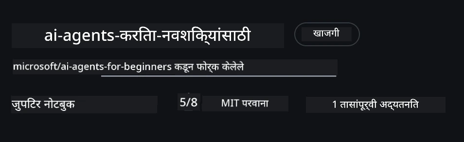
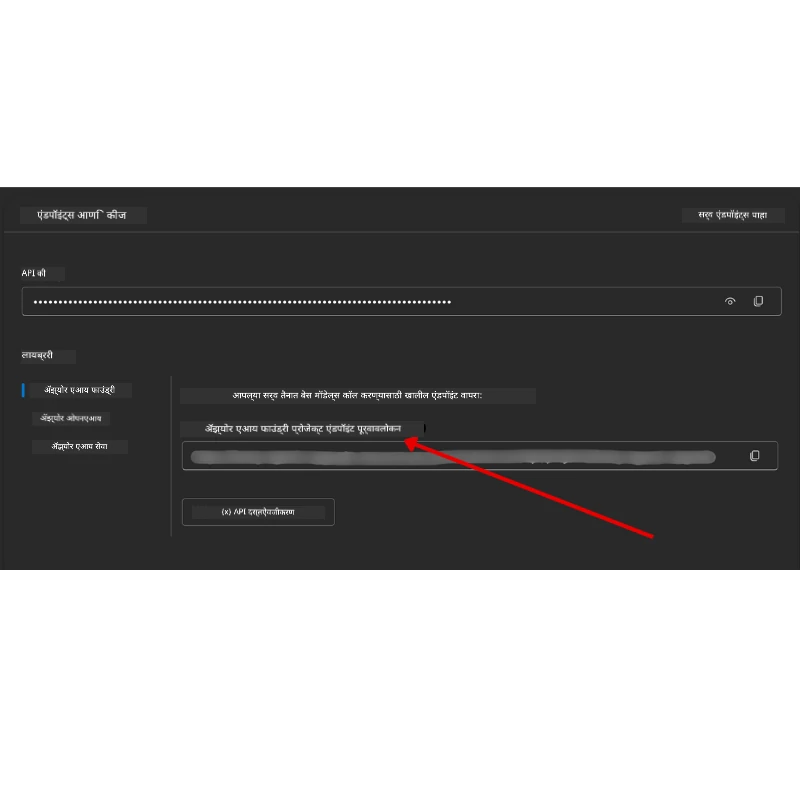

# कोर्स सेटअप

## परिचय

हा धडा या कोर्सच्या कोड नमुन्यांना कसे चालवायचे हे कव्हर करेल.

## इतर शिका-या बरोबर जुळा आणि मदत मिळवा

तुमचा रिपॉजिटरी क्लोन करण्यापूर्वी, सेटअपसाठी कोणतीही मदत, कोर्सविषयी कोणतेही प्रश्न विचारण्यासाठी, किंवा इतर शिका-यांशी जोडण्यासाठी [AI Agents For Beginners Discord चॅनेल](https://aka.ms/ai-agents/discord) मध्ये सहभागी व्हा.

## हा रिपॉजिटरी क्लोन करा किंवा फोर्क करा

सुरू करण्यासाठी, कृपया GitHub रिपॉजिटरी क्लोन करा किंवा फोर्क करा. यामुळे तुमची स्वतःची कोर्स सामग्रीची आवृत्ती तयार होईल ज्यामुळे तुम्ही कोड चालवू, तपासू आणि सुधारणा करू शकता!

हे करण्यासाठी <a href="https://github.com/microsoft/ai-agents-for-beginners/fork" target="_blank">रिपॉजिटरी फोर्क करा</a> या दुव्यावर क्लिक करा

तुमच्याकडे आता या कोर्सची तुमची स्वतःची फोर्केड आवृत्ती खालील लिंकवर असावी:



### शॅलो क्लोन (वर्कशॉप / Codespaces साठी शिफारस केली)

  >पूर्ण रिपॉजिटरी डाउनलोड करताना (पूर्ण इतिहास आणि सर्व फायली) मोठी (सुमारे 3 GB) असू शकते. जर तुम्ही फक्त वर्कशॉपमध्ये सहभागी असाल किंवा फक्त काही धड्यांचे फोल्डर पाहिजे असतील, तर शॅलो क्लोन (किंवा sparse clone) इतिहास कमी करून आणि/किंवा blobs सोडून बहुतेक डाउनलोड टाळतो.

#### झटपट शॅलो क्लोन — किमान इतिहास, सर्व फायली

खालील कमांडमध्ये `<your-username>` या जागी तुमच्या फोर्क URL (किंवा जर तुम्हाला प्राधान्य असेल तर अपस्ट्रीम URL) टाका.

नवीनतम कमिट इतिहास फक्त क्लोन करण्यासाठी (लहान डाउनलोड):

```bash|powershell
git clone --depth 1 https://github.com/<your-username>/ai-agents-for-beginners.git
```

विशिष्ट ब्रँच क्लोन करण्यासाठी:

```bash|powershell
git clone --depth 1 --branch <branch-name> https://github.com/<your-username>/ai-agents-for-beginners.git
```

#### आंशिक (स्पार्स) क्लोन — किमान blobs + फक्त निवडलेले फोल्डर्स

हे आंशिक क्लोन आणि sparse-checkout वापरते (Git 2.25+ आवश्यक आणि partial clone समर्थन असलेला आधुनिक Git शिफारस केली):

```bash|powershell
git clone --depth 1 --filter=blob:none --sparse https://github.com/<your-username>/ai-agents-for-beginners.git
```

रिपॉजिटरी फोल्डरमध्ये जा:

```bash|powershell
cd ai-agents-for-beginners
```

नंतर तुम्हाला हवे असलेले फोल्डर निर्दिष्ट करा (खाली उदाहरण दोन फोल्डर्स दाखवले आहेत):

```bash|powershell
git sparse-checkout set 00-course-setup 01-intro-to-ai-agents
```

क्लोन केल्यानंतर आणि फायली तपासल्यानंतर, जर तुम्हाला फक्त फायली पाहिजे असतील आणि जागा मोकळी करायची असेल (कोणताही git इतिहास नको असेल), तर कृपया रिपॉजिटरी मेटाडेटा काढून टाका (💀परत येणं नाही — तुम्ही सर्व Git कार्यक्षमता गमावाल: कोणतेही कमिट, पुल, पुश किंवा इतिहास प्रवेश नाही).

```bash
# zsh/bash
rm -rf .git
```

```powershell
# पॉवरशेल
Remove-Item -Recurse -Force .git
```

#### GitHub Codespaces वापरणे (स्थानिक मोठे डाउनलोड टाळण्यासाठी शिफारस केली)

- या रिपॉजिटरीसाठी नवीन Codespace तयार करा [GitHub UI](https://github.com/codespaces) द्वारे.

- नव्याने तयार झालेले codespace टर्मिनलमधून वरील शॅलो/स्पार्स क्लोनचे कोणतेही कमांड चालवा जेणेकरून तुम्हाला केवळ आवश्यक असलेले धड्यांचे फोल्डर्स Codespace कार्यक्षेत्रात आणता येतील.
- ऐच्छिक: Codespaces मध्ये क्लोन केल्यानंतर, अतिरिक्त जागा मोकळी करण्यासाठी .git काढू शकता (वरील काढा कमांड पहा).
- टीप: जर तुम्हाला Codespaces मध्ये रिपॉजिटरी थेट (अतिरिक्त क्लोन न करता) उघडायचा असेल, तर लक्षात ठेवा कि Codespaces Devcontainer एन्व्हायर्नमेंट तयार करेल आणि कदाचित तुम्हाला जास्त संसाधने पुरवेल. नवीन Codespace च्या आत शॅलो कॉपी क्लोन केल्याने डिस्क वापरावर अधिक नियंत्रण मिळते.

#### टिपा

- नेहमी क्लोन URL आपल्या फोर्कसह बदला जर तुम्हाला संपादित किंवा कमिट करायचे असेल.
- नंतर तुम्हाला अधिक इतिहास किंवा फायली हवी असल्यास, तुम्ही त्या fetch करू शकता किंवा sparse-checkout मध्ये आवश्यक फोल्डर्स समाविष्ट करू शकता.

## कोड चालविणे

हा कोर्स तुम्हाला AI एजंट्स तयार करण्याचा हाताने अनुभव देणारे Jupyter Notebooksची मालिका ऑफर करतो.

कोड नमुने **Microsoft Agent Framework (MAF)** वापरतात ज्यामध्ये `AzureAIProjectAgentProvider` आहे, जो **Microsoft Foundry** मार्फत **Azure AI Agent Service V2** (Responses API) शी जोडला जातो.

सर्व Python नोटबुक `*-python-agent-framework.ipynb` असे लेबल केलेले आहेत.

## आवश्यकताः

- Python 3.12+
  - **टीप**: तुमच्याकडे Python3.12 स्थापित नसेल, तर ते नक्की स्थापित करा. त्यानंतर requirements.txt फाइलमधील योग्य आवृत्त्या स्थापित करण्यासाठी python3.12 वापरून तुमचा venv तयार करा.
  
    >उदाहरण

    Python वर्च्युअल एन्व्हायर्नमेंट डिरेक्टरी तयार करा:

    ```bash|powershell
    python -m venv venv
    ```

    नंतर venv एन्व्हायर्नमेंट सक्रिय करा:

    ```bash
    # zsh/bash
    source venv/bin/activate
    ```
  
    ```dos
    # Command Prompt for Windows
    venv\Scripts\activate
    ```

- .NET 10+: .NET वापरून नमुना कोडसाठी, [.NET 10 SDK](https://dotnet.microsoft.com/download/dotnet/10.0) किंवा त्यानंतरची आवृत्ती स्थापित आहे याची खात्री करा. नंतर तुमची स्थापित .NET SDK आवृत्ती तपासा:

    ```bash|powershell
    dotnet --list-sdks
    ```

- **Azure CLI** — प्रमाणपत्रासाठी आवश्यक. [aka.ms/installazurecli](https://aka.ms/installazurecli) वरून स्थापित करा.
- **Azure Subscription** — Microsoft Foundry आणि Azure AI Agent Service कडे प्रवेशासाठी.
- **Microsoft Foundry Project** — मॉडल डिप्लॉय केलेली प्रोजेक्ट (उदा. `gpt-4o`). खालील [Step 1](../../../00-course-setup) पहा.

या रिपॉजिटरीच्या मूळ फोल्डरमध्ये `requirements.txt` फाइल समाविष्ट आहे ज्यात कोड नमुने चालवण्यासाठी आवश्यक Python पॅकेज आहेत.

तुम्ही या कमांडद्वारे ते टर्मिनलमध्ये मूळ फोल्डरमध्ये चालवून स्थापित करू शकता:

```bash|powershell
pip install -r requirements.txt
```

कोणत्याही संघर्ष आणि समस्या टाळण्यासाठी Python वर्च्युअल एन्व्हायर्नमेंट तयार करण्याची आम्ही शिफारस करतो.

## VSCode सेटअप करा

VSCode मध्ये योग्य Python आवृत्ती वापरत आहात याची खात्री करा.


## Microsoft Foundry आणि Azure AI Agent Service सेटअप करा

### पाऊल 1: Microsoft Foundry प्रोजेक्ट तयार करा

तुम्हाला नोटबुक्स चालवण्यासाठी Azure AI Foundry **hub** आणि **project** आवश्यक आहेत ज्यात तैनात (deployed) मॉडल असतो.

1. [ai.azure.com](https://ai.azure.com) येथे जा आणि तुमच्या Azure खात्याने साइन इन करा.
2. एक **hub** तयार करा (किंवा आधीचा वापरा). पाहा: [Hub resources overview](https://learn.microsoft.com/azure/ai-foundry/concepts/ai-resources).
3. hub मध्ये एक **project** तयार करा.
4. **Models + Endpoints** → **Deploy model** मधून मॉडल (उदा. `gpt-4o`) डिप्लॉय करा.

### पाऊल 2: तुमचा प्रोजेक्ट एंडपॉइंट आणि मॉडल डिप्लॉयमेंट नाव मिळवा

Microsoft Foundry पोर्टलमधून:

- **Project Endpoint** — **Overview** पानावर जा आणि एंडपॉइंट URL कॉपी करा.



- **Model Deployment Name** — **Models + Endpoints** मध्ये जा, तुमचे डिप्लॉय केलेले मॉडल निवडा, आणि **Deployment name** लक्षात ठेवा (उदा. `gpt-4o`).

### पाऊल 3: `az login` वापरून Azure मध्ये साइन इन करा

सर्व नोटबुक्स** `AzureCliCredential`** वापरून प्रमाणीकरण करतात — कोणतेही API की व्यवस्थापित करण्याची गरज नाही. त्यासाठी तुम्हाला Azure CLI द्वारे साइन इन करणे आवश्यक आहे.

1. जर अजून Azure CLI स्थापित नसेल तर: [aka.ms/installazurecli](https://aka.ms/installazurecli)

2. खालील कमांड चालवून साइन इन करा:

    ```bash|powershell
    az login
    ```

    किंवा जर तुम्ही ब्राउझरशिवाय दूरस्थ/Codespace वातावरणात असाल:

    ```bash|powershell
    az login --use-device-code
    ```

3. विचारल्यास तुमची सुरक्षितता निवडा — तुमच्या Foundry प्रोजेक्ट असलेल्या सबस्क्रिप्शनची निवड करा.

4. तुम्ही साइन इन केले असल्याची खात्री करा:

    ```bash|powershell
    az account show
    ```

> **`az login` का?** नोटबुक्स `azure-identity` पॅकेजमधील `AzureCliCredential` वापरून प्रमाणीकरण करतात. याचा अर्थ तुमचा Azure CLI सत्र क्रेडेन्शियल्स देतो — कोणतेही API की किंवा गोपनीयता `.env` फाइलमध्ये नाहीत. हे एक [सुरक्षितता सर्वोत्तम सराव](https://learn.microsoft.com/azure/developer/ai/keyless-connections) आहे.

### पाऊल 4: तुमची `.env` फाइल तयार करा

उदाहरण फाइल कॉपी करा:

```bash
# zsh/bash
cp .env.example .env
```

```powershell
# पॉवरशेल
Copy-Item .env.example .env
```

`.env` उघडा आणि खालील दोन मूल्ये भरा:

```env
AZURE_AI_PROJECT_ENDPOINT=https://<your-project>.services.ai.azure.com/api/projects/<your-project-id>
AZURE_AI_MODEL_DEPLOYMENT_NAME=gpt-4o
```

| व्हेरिएबल | कुठे शोधायचे |
|----------|--------------|
| `AZURE_AI_PROJECT_ENDPOINT` | Foundry पोर्टल → तुमचा प्रोजेक्ट → **Overview** पान |
| `AZURE_AI_MODEL_DEPLOYMENT_NAME` | Foundry पोर्टल → **Models + Endpoints** → तैनात केलेले मॉडलचे नाव |

अधिकांश धड्यासाठी एवढेच! नोटबुक्स आपोआप तुमच्या `az login` सत्राद्वारे प्रमाणीकरण करतात.

### पाऊल 5: Python Dependencies इन्स्टॉल करा

```bash|powershell
pip install -r requirements.txt
```

आम्ही शिफारस करतो की तुम्ही हे तुमच्या आधी तयार केलेल्या वर्च्युअल एन्व्हायर्नमेंटमध्ये चालवा.

## धडा 5 (Agentic RAG) साठी अतिरिक्त सेटअप

धडा 5 मध्ये **Azure AI Search** वापरले आहे retrieval-augmented generation साठी. तो धडा चालवणार असाल तर या व्हेरिएबल `.env` फाइलमध्ये जोडा:

| व्हेरिएबल | कुठे शोधायचे |
|----------|--------------|
| `AZURE_SEARCH_SERVICE_ENDPOINT` | Azure पोर्टल → तुमचा **Azure AI Search** रिसोर्स → **Overview** → URL |
| `AZURE_SEARCH_API_KEY` | Azure पोर्टल → तुमचा **Azure AI Search** रिसोर्स → **Settings** → **Keys** → प्राथमिक ऍडमिन की |

## धडा 6 आणि धडा 8 (GitHub Models) साठी अतिरिक्त सेटअप

धडा 6 आणि 8 मधील काही नोटबुक्स Azure AI Foundry ऐवजी **GitHub Models** वापरतात. त्या नमुन्यांना चालवणार असाल तर या व्हेरिएबल `.env` मध्ये जोडा:

| व्हेरिएबल | कुठे शोधायचे |
|----------|--------------|
| `GITHUB_TOKEN` | GitHub → **Settings** → **Developer settings** → **Personal access tokens** |
| `GITHUB_ENDPOINT` | वापरा `https://models.inference.ai.azure.com` (मूल्यमान) |
| `GITHUB_MODEL_ID` | वापरायचा मॉडल नाव (उदा. `gpt-4o-mini`) |

## धडा 8 (Bing Grounding Workflow) साठी अतिरिक्त सेटअप

धडा 8 च्या conditional workflow नोटबुकमध्ये Azure AI Foundry मार्फत **Bing grounding** वापरले आहे. तो धडा चालवणार असाल तर या व्हेरिएबल `.env` मध्ये जोडा:

| व्हेरिएबल | कुठे शोधायचे |
|----------|--------------|
| `BING_CONNECTION_ID` | Azure AI Foundry पोर्टल → तुमचा प्रोजेक्ट → **Management** → **Connected resources** → तुमचा Bing कनेक्शन → कनेक्शन ID कॉपी करा |

## समस्या सोडवणे

### macOS वर SSL प्रमाणपत्र पडताळणी त्रुटी

जर तुम्ही macOS वर असाल आणि खालील प्रमाणे त्रुटी येत असेल:

```plaintext
ssl.SSLCertVerificationError: [SSL: CERTIFICATE_VERIFY_FAILED] certificate verify failed: self-signed certificate in certificate chain
```

ही macOS वर Python चे ज्ञात समस्या आहे जिथे सिस्टम SSL प्रमाणपत्रे आपोआप विश्वसनीय मानली जात नाहीत. खालील उपाय क्रमाने वापरून पाहा:

**पर्याय 1: Python चा Install Certificates स्क्रिप्ट चालवा (शिफारस केली)**

```bash
# 3.XX च्या ठिकाणी तुमचा स्थापित केलेला Python आवृत्ती (उदा., 3.12 किंवा 3.13) भरा:
/Applications/Python\ 3.XX/Install\ Certificates.command
```

**पर्याय 2: तुमच्या नोटबुकमध्ये `connection_verify=False` वापरा (फक्त GitHub Models नोटबुक्ससाठी)**

धडा 6 च्या नोटबुकमध्ये (`06-building-trustworthy-agents/code_samples/06-system-message-framework.ipynb`) आधीच एक कमेंट केलेली workaround आहे. क्लायंट तयार करताना `connection_verify=False` अनकमेंट करा:

```python
client = ChatCompletionsClient(
    endpoint=endpoint,
    credential=AzureKeyCredential(token),
    connection_verify=False,  # प्रमाणपत्र त्रुटी आल्यास SSL पडताळणी अक्षम करा
)
```

> **⚠️ इशारा:** SSL पडताळणी काढणे (`connection_verify=False`) सुरक्षा कमी करते कारण प्रमाणपत्र पडताळणी वगळते. हे फक्त विकासातील तात्पुरत्या उपायासाठी वापरा, उत्पादनात कधीही वापरू नका.

**पर्याय 3: `truststore` इन्स्टॉल करा आणि वापरा**

```bash
pip install truststore
```

त्यानंतर तुमच्या नोटबुक किंवा स्क्रिप्टच्या सुरुवातीस हे जोडा जेणेकरून कोणतेही नेटवर्क कॉल करण्यापूर्वी लोड होईल:

```python
import truststore
truststore.inject_into_ssl()
```

## कुठेतरी अडकलात?

जर तुम्हाला सेटअप चालवण्यात अडचण येत असेल, तर आमच्या <a href="https://discord.gg/kzRShWzttr" target="_blank">Azure AI Community Discord</a> मध्ये सहभागी व्हा किंवा <a href="https://github.com/microsoft/ai-agents-for-beginners/issues?WT.mc_id=academic-105485-koreyst" target="_blank">इश्यू तयार करा</a>.

## पुढील धडा

तुम्ही आता या कोर्ससाठी कोड चालवायला तयार आहात. AI एजंट्सच्या जगाबद्दल अधिक शिकण्याचा आनंद घ्या!

[AI Agents आणि Agent वापर केसची ओळख](../01-intro-to-ai-agents/README.md)

---

<!-- CO-OP TRANSLATOR DISCLAIMER START -->
**अस्वीकरण**:
हा दस्तऐवज AI अनुवाद सेवा [Co-op Translator](https://github.com/Azure/co-op-translator) वापरून अनुवादित केला आहे. आपण अचूकतेसाठी प्रयत्न करत असलो तरी, कृपया लक्षात घ्या की स्वयंचलित अनुवादांमध्ये चुका किंवा अचूकतेचे अपूर्णता असू शकतात. मूळ दस्तऐवज त्याच्या स्थानिक भाषेत अधिकृत स्रोत मानला जावा. महत्त्वाच्या माहितीकरिता, व्यावसायिक मानवी अनुवादाची शिफारस केली जाते. या अनुवादाच्या वापरामुळे उद्भवलेल्या कोणत्याही गैरसमजुती किंवा चुकीच्या अर्थलाव्यासाठी आम्ही जबाबदार नाही.
<!-- CO-OP TRANSLATOR DISCLAIMER END -->