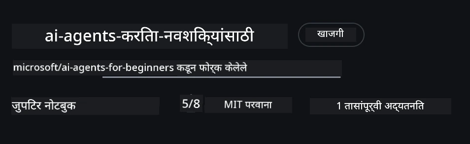
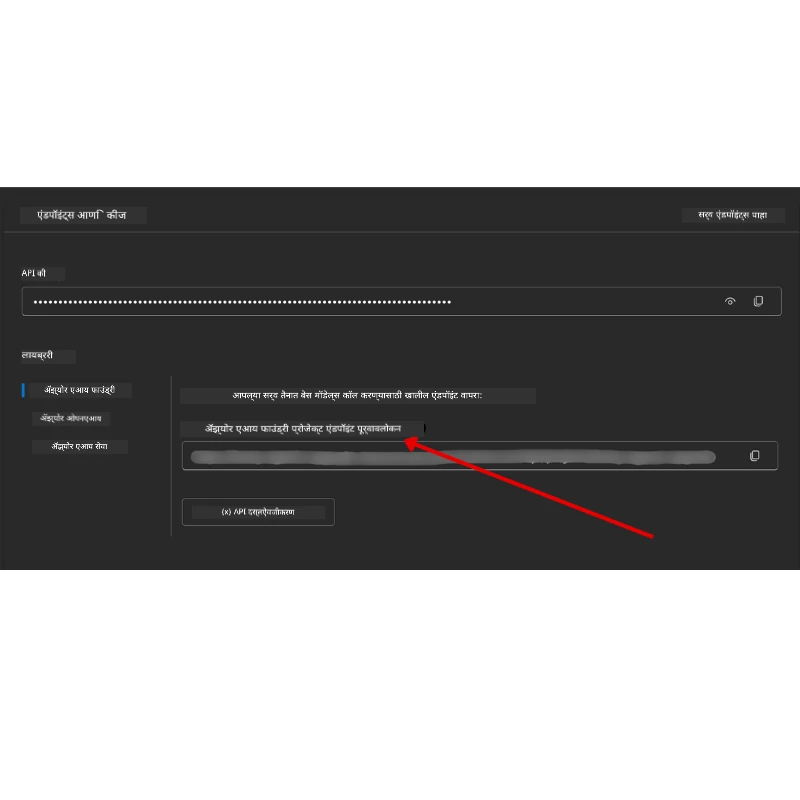

# कोर्स सेटअप

## परिचय

हा धडा या कोर्सचे कोड नमुने कसे चालवायचे हे सांगेल.

## इतर विद्यार्थी आणि मदत मिळवा

आपले रेपो क्लोन करण्यापूर्वी, सेटअपसाठी कोणतीही मदत, कोर्सबाबत कोणतेही प्रश्न किंवा इतर विद्यार्थ्यांशी जोडण्यासाठी [AI Agents For Beginners Discord channel](https://aka.ms/ai-agents/discord) मध्ये सहभागी व्हा.

## हे रेपो क्लोन करा किंवा फोर्क करा

सुरुवात करण्यासाठी, कृपया GitHub रिपॉझिटरी क्लोन किंवा फोर्क करा. यामुळे आपली स्वतःची कोर्स सामग्रीची आवृत्ती तयार होईल ज्यामुळे आपण कोड चालवू, चाचणी करू आणि सुधारणा करू शकता!

हे <a href="https://github.com/microsoft/ai-agents-for-beginners/fork" target="_blank">रेपो फोर्क करा</a> या लिंकवर क्लिक करून करता येईल.

तुम्हाला आता खालील लिंकवर या कोर्सची तुमची स्वतःची फोर्क केलेली आवृत्ती असावी:



### हलक्या क्लोन (कार्यशाळा / कोडस्पेसेससाठी शिफारसीय)

  > पूर्ण रिपॉझिटरी पूर्ण इतिहास आणि सर्व फायली डाउनलोड केल्यावर फार मोठी (~3 GB) होऊ शकते. जर तुम्ही फक्त कार्यशाळा अटेंड करत असाल किंवा फक्त काही धड्यांचे फोल्डर हवे असतील, तर हलका क्लोन (किंवा sparse clone) फारच कमी डाउनलोड करतो.

#### जलद हलका क्लोन — किमान इतिहास, सर्व फायली

खालील आज्ञांमध्ये `<your-username>` तुमच्या फोर्क URL (किंवा अपस्ट्रीम URL) ने बदला.

नवीनतम कमिट इतिहास फक्त क्लोन करण्यासाठी (लहान डाउनलोड):

```bash
git clone --depth 1 https://github.com/<your-username>/ai-agents-for-beginners.git
```

विशिष्ट शाखा क्लोन करण्यासाठी:

```bash
git clone --depth 1 --branch <branch-name> https://github.com/<your-username>/ai-agents-for-beginners.git
```

#### आंशिक (sparse) क्लोन — किमान ब्लॉब आणि फक्त निवडलेले फोल्डर्स

हे आंशिक क्लोन आणि sparse-checkout वापरते (Git 2.25+ आवश्यक आणि आंशिक क्लोन सपोर्टसह आधुनिक Git शिफारसीय):

```bash
git clone --depth 1 --filter=blob:none --sparse https://github.com/<your-username>/ai-agents-for-beginners.git
```

रेपो फोल्डरमध्ये जा:

```bash
cd ai-agents-for-beginners
```

नंतर तुम्हाला हव्या असलेल्या फोल्डर्स निर्दिष्ट करा (खाली उदाहरण दोन फोल्डर्स दाखवते):

```bash
git sparse-checkout set 00-course-setup 01-intro-to-ai-agents
```

क्लोनिंग व फायली पडताळल्यानंतर, तुम्हाला फक्त फायली हवी असतील आणि जागा मोकळी करायची असेल (कोणताही Git इतिहास नसणे), तर कृपया रिपॉझिटरी मेटाडेटा हटवा (💀परत येण्याजोग नाही — सर्व Git फंक्शनॅलिटी गमावाल):

```bash
# zsh/bash
rm -rf .git
```

```powershell
# पॉवरशेल
Remove-Item -Recurse -Force .git
```

#### GitHub Codespaces वापरणे (स्थानिक मोठ्या डाउनलोड टाळण्यासाठी शिफारसीय)

- या रेपो साठी [GitHub UI](https://github.com/codespaces) वापरून नवीन Codespace तयार करा.  

- नव्या तयार Codespace च्या टर्मिनलमध्ये वरील हलक्या/आंशिक क्लोन कमांडपैकी एक चालवा ज्यामुळे फक्त आवश्यक धडा फोल्डर्स Codespace वर्कस्पेस मध्ये येतील.
- पर्यायी: क्लोन केल्यावर Codespaces मध्ये, जास्त जागा मोकळी करण्यासाठी .git हटवा (वरील हटवण्याच्या कमांड पहा).
- लक्षात ठेवा: जर तुम्हाला रेपो थेट Codespaces मध्ये उघडायचा असेल (अतिरिक्त क्लोन न करता), तर Codespaces डेव्ह कंटेनर एन्व्हायर्नमेंट तयार करेल आणि कदाचित अपेक्षेपेक्षा जास्त provisioning होऊ शकतो.

#### टिपा

- जर तुम्हाला एडिट/कमिट करायचा असेल तर नेहमी क्लोन URL तुमच्या फोर्कने बदला.
- नंतर तुम्हाला अधिक इतिहास किंवा फायली हवे असल्यास, तुम्ही त्यांना fetch करू शकता किंवा sparse-checkout सुधारू शकता.

## कोड चालवणे

हा कोर्स एक मालिकेतील Jupyter Notebook वापरतो ज्याला वापरून तुम्ही AI Agents बनवण्याचा व्यावहारिक अनुभव घेऊ शकता.

कोड नमुने **Microsoft Agent Framework (MAF)** वापरतात `FoundryChatClient` च्या मदतीने, जे **Microsoft Foundry Agent Service V2** (Responses API) द्वारे **Microsoft Foundry** शी कनेक्ट होते.

सर्व Python नोटबुक `*-python-agent-framework.ipynb` असे लेबल केलेले आहेत.

## आवश्यकताः

- Python 3.12+
  - **टीप**: जर तुमच्याकडे Python3.12 स्थापित नसेल, तर ते इंस्टॉल करा. त्यानंतर python3.12 वापरून तुमचे venv तयार करा जेणेकरून requirements.txt मधील योग्य आवृत्त्या इंस्टॉल होतील.
  
    >उदाहरण

    Python venv डिरेक्टरी तयार करा:

    ```bash
    python -m venv venv
    ```

    नंतर venv वातावरण साठी सक्रिय करा:

    ```bash
    # झेडश/बॅश
    source venv/bin/activate
    ```
  
    ```dos
    # Command Prompt for Windows
    venv\Scripts\activate
    ```

- .NET 10+: .NET वापरून नमुना कोडसाठी, [.NET 10 SDK](https://dotnet.microsoft.com/download/dotnet/10.0) किंवा त्यानंतरचे आवृत्ती इंस्टॉल करा. मग तुमची .NET SDK आवृत्ती तपासा:

    ```bash
    dotnet --list-sdks
    ```

- **Azure CLI** — प्रमाणीकरणासाठी आवश्यक. [aka.ms/installazurecli](https://aka.ms/installazurecli) वरून इंस्टॉल करा.
- **Azure सबस्क्रिप्शन** — Microsoft Foundry आणि Microsoft Foundry Agent Service साठी प्रवेशासाठी.
- **Microsoft Foundry प्रोजेक्ट** — एक प्रोजेक्ट ज्यात विकसित मॉडेल आहे (उदा. `gpt-5-mini`). पाहा [पाऊल 1](#पाऊल-1-microsoft-foundry-प्रोजेक्ट-तयार-करा).

या रिपॉझिटरीच्या मूळात `requirements.txt` फाइल समाविष्ट केली आहे ज्यात कोड नमुने चालवण्यासाठी आवश्यक सर्व Python पॅकेजेस आहेत.

तुम्ही हे टर्मिनलमध्ये खालील कमांड चालवून इंस्टॉल करू शकता:

```bash
pip install -r requirements.txt
```

आम्ही शिफारस करतो की कोणत्याही संघर्ष आणि समस्या टाळण्यासाठी Python वर्चुअल एन्व्हायर्नमेंट तयार करा.

## VSCode सेटअप

VSCode मध्ये योग्य Python आवृत्ती वापरत आहात याची खात्री करा.


## Microsoft Foundry आणि Microsoft Foundry Agent Service सेटअप करा

### पाऊल 1: Microsoft Foundry प्रोजेक्ट तयार करा

Jupyter नोटबुक चालवण्यासाठी Microsoft Foundry **hub** आणि **प्रोजेक्ट** लागेल ज्यात तयार केलेले मॉडेल असेल.

1. [ai.azure.com](https://ai.azure.com) वर जा आणि तुमच्या Azure खात्याने साइन इन करा.
2. **hub** तयार करा (किंवा विद्यमान वापरा). पाहा: [Hub resources overview](https://learn.microsoft.com/azure/ai-foundry/concepts/ai-resources).
3. हबमध्ये **प्रोजेक्ट** तयार करा.
4. **Models + Endpoints** → **Deploy model** मधून मॉडेल विकसित करा (उदा., `gpt-5-mini`).

### पाऊल 2: तुमचा प्रोजेक्ट एंडपॉइंट आणि मॉडेल डिप्लॉयमेंट नाव मिळवा

Microsoft Foundry पोर्टलमधील तुमच्या प्रोजेक्टमधून:

- **Project Endpoint** — **Overview** पेजवर जा आणि एंडपॉइंट URL कॉपी करा.



- **Model Deployment Name** — **Models + Endpoints** मध्ये जा, आपले डिप्लॉय केलेले मॉडेल निवडा आणि **Deployment name** लक्षात ठेवा (उदा., `gpt-5-mini`).

### पाऊल 3: Azure मध्ये `az login` करून साइन इन करा

अधिकतर नोटबुक्स तुमच्या **Azure CLI साइन-इन** द्वारे प्रमाणीकरण करतात - `AzureCliCredential` किंवा `DefaultAzureCredential` वापरून (जे दोन्ही `az login` सत्र घेतात) `azure-identity` पॅकेजमधून - त्यामुळे API कळीची गरज नाही. काही धडे आणि पर्यायी इंटिग्रेशन्स API कळी वापरतात; प्रत्येक धड्याच्या पूर्व-आवश्यकतांची तपासणी करा. हे करण्यासाठी तुम्हाला Azure CLI वापरून साइन इन करणे आवश्यक आहे.

1. **Azure CLI इंस्टॉल करा** जर आधी केले नसेल तर: [aka.ms/installazurecli](https://aka.ms/installazurecli)

2. **साइन इन करा** खालीलप्रमाणे:

    ```bash
    az login
    ```

    किंवा जर तुम्ही रिमोट/कोडस्पेस वातावरणात ब्राउझरशिवाय असाल तर:

    ```bash
    az login --use-device-code
    ```

3. **जर विचारले तर तुमचा सबस्क्रिप्शन निवडा** — तुमच्या Foundry प्रोजेक्ट असलेला सबस्क्रिप्शन निवडा.

4. **तुमचं साइन इन झालं आहे का ते तपासा:**

    ```bash
    az account show
    ```

> **का `az login`?** नोटबुक्स `AzureCliCredential` (किंवा `DefaultAzureCredential`, जे तुमच्या Azure CLI साइन-इनवर अवलंबून आहे) वापरून प्रमाणीकरण करतात, त्यामुळे तुमच्या Azure CLI सत्रात क्रेडेन्शियल्स आहेत — `.env` फाइलमध्ये API कळ्या किंवा रहस्ये नाहीत. ही [सुरक्षितता सर्वोत्तम पद्धत](https://learn.microsoft.com/azure/developer/ai/keyless-connections) आहे.

### पाऊल 4: तुमची `.env` फाइल तयार करा

उदाहरण फाइल कॉपी करा:

```bash
# झेडश/बॅश
cp .env.example .env
```

```powershell
# पॉवरशेल
Copy-Item .env.example .env
```

`.env` उघडा आणि खालील दोन मूल्ये भरा:

```env
AZURE_AI_PROJECT_ENDPOINT=https://<your-project>.services.ai.azure.com/api/projects/<your-project-id>
AZURE_AI_MODEL_DEPLOYMENT_NAME=gpt-5-mini
```

| बदलणारा | कुठे सापडेल |
|----------|-----------------|
| `AZURE_AI_PROJECT_ENDPOINT` | Foundry पोर्टल → तुमचा प्रोजेक्ट → **Overview** पेज |
| `AZURE_AI_MODEL_DEPLOYMENT_NAME` | Foundry पोर्टल → **Models + Endpoints** → तुमच्या डिप्लॉय केलेल्या मॉडेलचे नाव |

हेच अनेक धड्यांसाठी पुरेसे आहे! नोटबुक्स तुमच्या `az login` सत्राद्वारे आपोआप प्रमाणीकरण करतील.

### पाऊल 5: Python अवलंबित्वे इंस्टॉल करा

```bash
pip install -r requirements.txt
```

हे आत तयार केलेल्या वर्चुअल एन्व्हायर्नमेंटमध्ये चालवण्याची आम्ही शिफारस करतो.

## पर्यायी सेटअप: Azure AI Search (धडे 5 आणि 16)

धडा 5 (Agentic RAG) आणि धडा 16 नोटबुक्समध्ये **इन-मेमरी नॉलेज बेस** आहे — अतिरिक्त Azure संसाधनांची गरज नाही. जर तुम्हाला हे खऱ्या **Azure AI Search** निर्देशांकासह मागे ठेवायचे असेल, तर लक्षात ठेवा की धडा 16 नोटबुक सध्या की-आधारित प्रमाणीकरण वापरतो: तो इन-मेमरी सर्च वरून Azure AI Search कडे फक्त तेव्हा जातो जेव्हा **दोन्ही** `AZURE_SEARCH_SERVICE_ENDPOINT` आणि `AZURE_SEARCH_API_KEY` सेट केलेली असतात, अन्यथा तो इन-मेमरी सर्चवर राहतो — म्हणून खऱ्या निर्देशांकावर तपासणीसाठी अ‍ॅडमिन की देखील सेट करणे आवश्यक आहे. कीलेस प्रमाणपत्रासाठी Microsoft Entra ID (RBAC) ही शिफारस केलेली पद्धत आहे, जी कोर्समध्ये वापरल्या जाणाऱ्या `az login` शैलीशी सुसंगत आहे.

खालील RBAC पावले सेटअप-गाइड नमुन्यांसाठी आणि तुमच्या स्वतःच्या कोडसाठी लागू आहेत. ती धडा 16 नोटबुकमध्ये कीलेस प्रमाणीकरण सक्षम करत नाही; धडा 16 अजूनही Azure AI Search वापरण्यासाठी एंडपॉइंट आणि अ‍ॅडमिन की दोन्ही आवश्यक आहे.

1. तुमच्या सर्च सेवेमध्ये **भूमिका-आधारित प्रवेश सक्षम करा**:

    ```bash
    az search service update --name <service-name> --resource-group <resource-group> --auth-options aadOrApiKey
    ```

2. स्वतःला आवश्यक भूमिका (निर्देशांक तयार/लोड करणे आणि क्वेरी करणे) द्या:

    ```bash
    az role assignment create --assignee <your-user-or-principal-id> --role "Search Service Contributor" --scope $(az search service show -g <resource-group> -n <service-name> --query id -o tsv)
    az role assignment create --assignee <your-user-or-principal-id> --role "Search Index Data Contributor" --scope $(az search service show -g <resource-group> -n <service-name> --query id -o tsv)
    ```

3. `.env` फाइलमध्ये एंडपॉइंट जोडा:

| बदलणारा | कुठे सापडेल |
|----------|-----------------|
| `AZURE_SEARCH_SERVICE_ENDPOINT` | Azure पोर्टल → तुमचा **Azure AI Search** संसाधन → **Overview** → URL |
| `AZURE_SEARCH_API_KEY` | आवश्यक (एंडपॉइंटसह) Azure AI Search वापरण्यासाठी धडा 16 नोटबुकमध्ये, जो की-आधारित प्रमाणीकरण वापरतो. Azure पोर्टल → **Settings** → **Keys** → प्रमुख अ‍ॅडमिन की |

> **का कीलेस?** अ‍ॅडमिन कळ्या तुमच्या सर्च सेवेवर पूर्ण लेखन प्रवेश देतात आणि `.env` फाइलमधून गळती होऊ शकते. RBAC सह, तुमचा `az login` ओळख वापरली जाते — कोर्स नोटबुक्स वापरत असलेलीच कीलेस Entra ID पद्धत (`AzureCliCredential` / `DefaultAzureCredential` द्वारे). पहा [भूमिका वापरून Azure AI Search कनेक्ट करा](https://learn.microsoft.com/azure/search/search-security-rbac).

पूर्ण निर्देशांक तयार करण्यासाठी Python आणि .NET नमुन्यांसाठी [Azure AI Search setup guide](./AzureSearch.md) पहा.

## अतिरिक्त सेटअप धडे जे Azure OpenAI थेट कॉल करतात (धडे 6 आणि 8)

काही नोटबुक्स धडे 6 आणि 8 मध्ये **Azure OpenAI** थेट (Responses API वापरून) कॉल करतात; त्यासाठी Microsoft Foundry प्रोजेक्ट वापरत नाहीत. हे नमुने पूर्वी GitHub मॉडेल्स वापरत होते, जे आता जुने झाले आहेत आणि Responses API समर्थित नाहीत. तुमच्या `.env` फाइलमध्ये हे बदलणारे जोडा:

| बदलणारा | कुठे सापडेल |
|----------|-----------------|
| `AZURE_OPENAI_ENDPOINT` | Azure पोर्टल → तुमचा **Azure OpenAI** संसाधन → **Keys and Endpoint** → एंडपॉइंट (उदा., `https://<your-resource>.openai.azure.com`) |
| `AZURE_OPENAI_DEPLOYMENT` | तुमच्या डिप्लॉय केलेल्या मॉडेलचे नाव (उदा., `gpt-5-mini`) जे Responses API समर्थित आहे |
| `AZURE_OPENAI_API_KEY` | पर्यायी — फक्त जर तुम्ही की-आधारित प्रमाणीकरण `az login` / Entra ID ऐवजी वापरत असाल |

> Responses API स्थिर `/openai/v1/` एंडपॉइंट वापरतो, त्यामुळे `api-version` आवश्यक नाही. कीलेस Entra ID प्रमाणीकरण वापरण्यासाठी `az login` करा.

## पर्यायी प्रदाता: MiniMax (OpenAI-सुसंगत)

[MiniMax](https://platform.minimaxi.com/) मोठ्या संदर्भाच्या मॉडेल्स (जास्तीतजास्त 204K टोकन्स) OpenAI-सुसंगत API द्वारे प्रदान करतो. Microsoft Agent Framework चा `OpenAIChatClient` कोणत्याही OpenAI-सुसंगत एंडपॉइंटसह काम करतो, त्यामुळे MiniMax ला `OpenAIChatClient` वापराअसलेल्या धड्यांसाठी पर्यायी म्हणून वापरता येतो.

हे बदलणारे तुमच्या `.env` फाइलमध्ये जोडा:

| बदलणारा | कुठे सापडेल |
|----------|-----------------|
| `MINIMAX_API_KEY` | [MiniMax Platform](https://platform.minimaxi.com/) → API कळ्या |
| `MINIMAX_BASE_URL` | `https://api.minimax.io/v1` वापरा (मूळ मूल्य) |
| `MINIMAX_MODEL_ID` | वापरण्याचे मॉडेल नाव (उदा., `MiniMax-M3`) |

**उदाहरण मॉडेल्स**: `MiniMax-M3` (शिफारसीय), `MiniMax-M2.7`, `MiniMax-M2.7-highspeed` (वेगवान प्रतिसाद). मॉडेल नावे आणि उपलब्धता काळानुसार बदलू शकते आणि विशिष्ट मॉडेल प्रवेश तुमच्या खात्यावर अवलंबून असतो.

`OpenAIChatClient` वापरणारे कोड नमुने (उदा., धडा 14 हॉटेल बुकिंग वर्कफ्लो) `MINIMAX_API_KEY` सेट असल्यास आपोआप तुमचा MiniMax कॉन्फिगरशन ओळखून वापरतील.


## पर्यायी प्रदाता: Foundry स्थानिक (डिव्हाइसमध्ये मॉडेल चालवा)

[Foundry Local](https://foundrylocal.ai) हा एक हलका रनटाइम आहे जो भाषा मॉडेल्स डाउनलोड करतो, व्यवस्थापित करतो आणि OpenAI-सुसंगत API द्वारे **पूर्णपणे आपल्या स्वतःच्या मशीनवर** सेवा प्रदान करतो — कोणताही क्लाउड आवश्यक नाही.

कारण Microsoft Agent Framework चे `OpenAIChatClient` कोणत्याही OpenAI-सुसंगत एंडपॉइंटसह काम करते, Foundry Local Azure OpenAI साठी एक स्थानिक ड्रॉप-इन पर्याय आहे.

**1. Foundry Local स्थापित करा**

```bash
# विंडोज
winget install Microsoft.FoundryLocal

# मॅकओएस
brew install foundrylocal
```

**2. मॉडेल डाउनलोड करा आणि चालू करा** (ही प्रक्रिया स्थानिक सेवा देखील सुरू करते):

```bash
foundry model list          # उपलब्ध मॉडेल पाहा
foundry model run phi-4-mini
```

**3. स्थानिक एंडपॉइंट शोधण्यासाठी वापरलेले Python SDK स्थापित करा:**

```bash
pip install foundry-local-sdk
```

**4. Microsoft Agent Framework ला तुमच्या स्थानिक मॉडेलकडे निर्देशित करा:**

```python
from foundry_local import FoundryLocalManager
from agent_framework.openai import OpenAIChatClient

# आवश्यक असल्यास डाउनलोड करते आणि स्थानिक पातळीवर मॉडेल सेवा पुरविते, नंतर एंडपॉइंट/पोर्ट शोधते.
manager = FoundryLocalManager("phi-4-mini")

chat_client = OpenAIChatClient(
    base_url=manager.endpoint,      # उदाहरणार्थ http://localhost:<port>/v1
    api_key=manager.api_key,        # Foundry Local साठी नेहमी "not-required"
    model_id=manager.get_model_info("phi-4-mini").id,
)

agent = chat_client.as_agent(
    name="LocalAgent",
    instructions="You are a helpful assistant running fully on-device.",
)
```

> **टीप:** Foundry Local OpenAI-सुसंगत **Chat Completions** एंडपॉइंट उघड करते. स्थानिक विकास आणि ऑफलाइन परिस्थितीसाठी याचा वापर करा. संपूर्ण **Responses API** फीचर सेटसाठी (स्थितिजन्य संभाषणे इत्यादी), Azure OpenAI किंवा Microsoft Foundry प्रोजेक्ट वापरा.

## धडा 8 (Bing Grounding Workflow) साठी अतिरिक्त सेटअप

धडा 8 मधील सशर्त वर्कफ्लो नोटबुक Microsoft Foundry द्वारे **Bing grounding** वापरतो. तुम्ही हा सॅम्पल चालवण्याची योजना आखत असाल, तर तुमच्या `.env` फाईलमध्ये हा व्हेरिएबल जोडा:

| व्हेरिएबल | कुठे सापडेल |
|----------|-----------------|
| `BING_CONNECTION_ID` | Microsoft Foundry पोर्टल → तुमचा प्रोजेक्ट → **Management** → **Connected resources** → तुमचा Bing कनेक्शन → कनेक्शन आयडी कॉपी करा |

## समस्या निवारण

### macOS वर SSL प्रमाणपत्र पडताळणी त्रुटी

जर तुम्ही macOS वापरत असाल आणि अशी त्रुटी आली:

```plaintext
ssl.SSLCertVerificationError: [SSL: CERTIFICATE_VERIFY_FAILED] certificate verify failed: self-signed certificate in certificate chain
```

ही macOS वर Python शी संबंधित एक ज्ञात समस्या आहे जेथे सिस्टम SSL प्रमाणपत्रे आपोआप विश्वसनीय नाहीत. पुढील उपाय क्रमाने प्रयत्न करा:

**पर्याय 1: Python चा Install Certificates स्क्रिप्ट चालवा (शिफारस केलेले)**

```bash
# 3.XX आपल्या स्थापित Python आवृत्तीने बदला (उदा., 3.12 किंवा 3.13):
/Applications/Python\ 3.XX/Install\ Certificates.command
```

**पर्याय 2: तुमच्या नोटबुकमध्ये `connection_verify=False` वापरा (फक्त GitHub Models नोटबुकसाठी)**

धडा 6 च्या नोटबुकमध्ये (`06-building-trustworthy-agents/code_samples/06-system-message-framework.ipynb`) एक कॉमेंट केलेला उपाय आधीच समाविष्ट आहे. प्रमाणपत्र त्रुटी आल्यावर `connection_verify=False` अनकॉमेंट करा:

```python
client = ChatCompletionsClient(
    endpoint=endpoint,
    credential=AzureKeyCredential(token),
    connection_verify=False,  # प्रमाणपत्राच्या त्रुटी आल्यास SSL सत्यापन अक्षम करा
)
```

> **⚠️ इशारा:** SSL पडताळणी अक्षम करणे (`connection_verify=False`) प्रमाणपत्र पडताळणी टाळून सुरक्षा कमी करते. हे फक्त विकास वातावरणात तात्पुरत्या उपाय म्हणून वापरा. उत्पादनात कधीही वापरू नका.

**पर्याय 3: `truststore` स्थापित करा आणि वापरा**

```bash
pip install truststore
```

मग तुमच्या नोटबुक किंवा स्क्रिप्टच्या सुरुवातीला पुढील जोडाः

```python
import truststore
truststore.inject_into_ssl()
```

## कुठे अडकलात का?

जर तुम्हाला हा सेटअप चालवण्यात काही समस्या येत असतील, तर आमच्या <a href="https://discord.gg/kzRShWzttr" target="_blank">Azure AI Community Discord</a> मध्ये सामील व्हा किंवा <a href="https://github.com/microsoft/ai-agents-for-beginners/issues?WT.mc_id=academic-105485-koreyst" target="_blank">इश्यू तयार करा</a>.

## पुढील धडा

आता तुम्ही या कोर्ससाठी कोड चालवायला तयार आहात. AI एजंट्सच्या जगाबद्दल अधिक शिकण्यास आनंदी व्हा!

[AI एजंट्स आणि एजंट वापर प्रकरणांची ओळख](../01-intro-to-ai-agents/README.md)

---

<!-- CO-OP TRANSLATOR DISCLAIMER START -->
**अस्वीकरण**:
हा दस्तऐवज AI भाषांतर सेवा [Co-op Translator](https://github.com/Azure/co-op-translator) चा वापर करून अनुवादित केला आहे. जरी आम्ही अचूकतेसाठी प्रयत्न करतो, तरी कृपया लक्षात घ्या की स्वयंचलित भाषांतरांमध्ये त्रुटी किंवा अचूकतेची कमतरता असू शकते. मूळ दस्तऐवज त्याच्या मूळ भाषेत अधिकृत स्रोत मानला पाहिजे. महत्त्वाची माहिती असल्यास, व्यावसायिक मानवी भाषांतराची शिफारस केली जाते. या भाषांतराच्या वापरामुळे उद्भवणाऱ्या कोणत्याही गैरसमज किंवा चुकीच्या अर्थलावणीसाठी आम्ही जबाबदार नाही.
<!-- CO-OP TRANSLATOR DISCLAIMER END -->