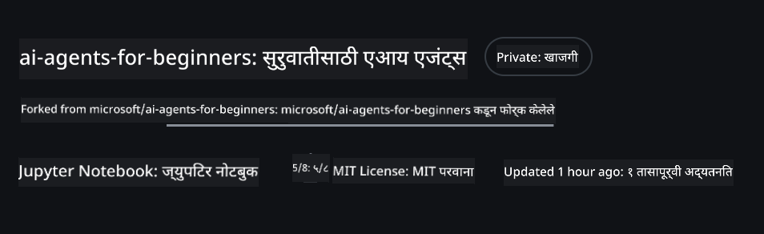
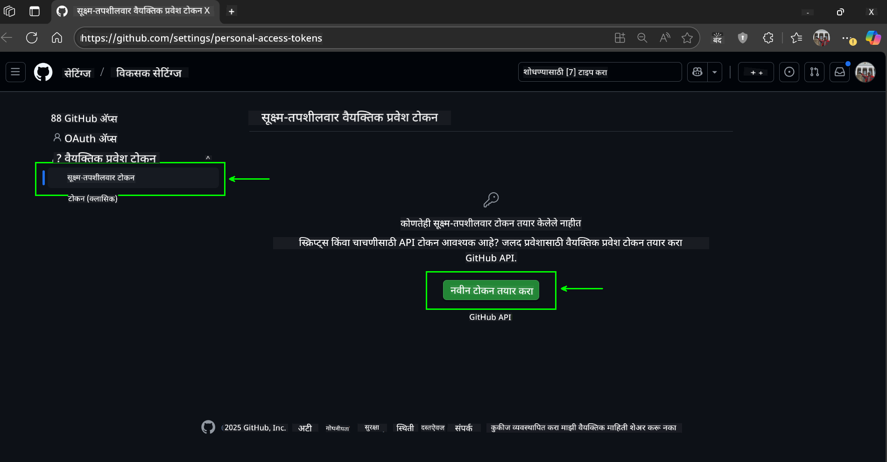
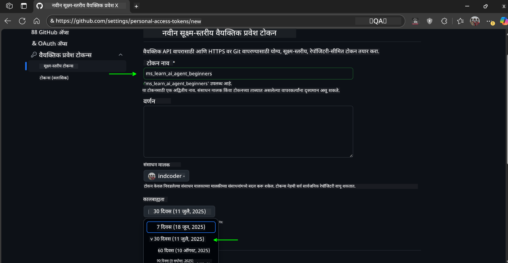
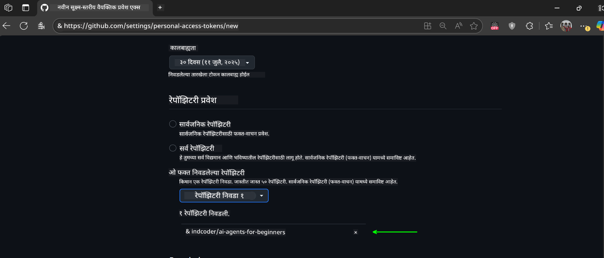
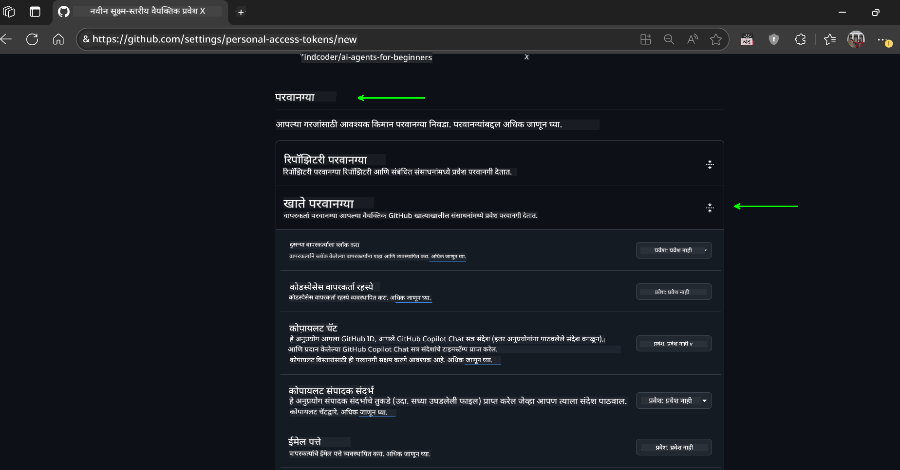
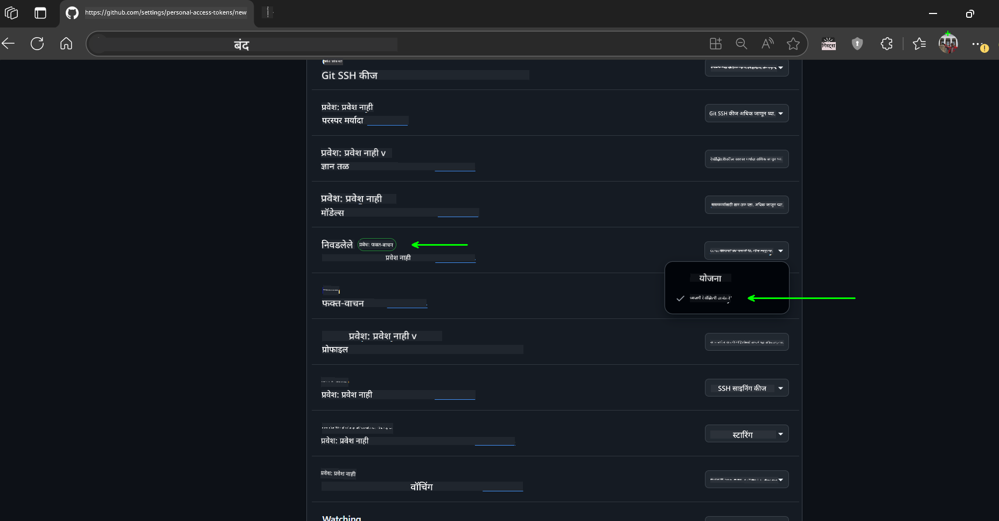
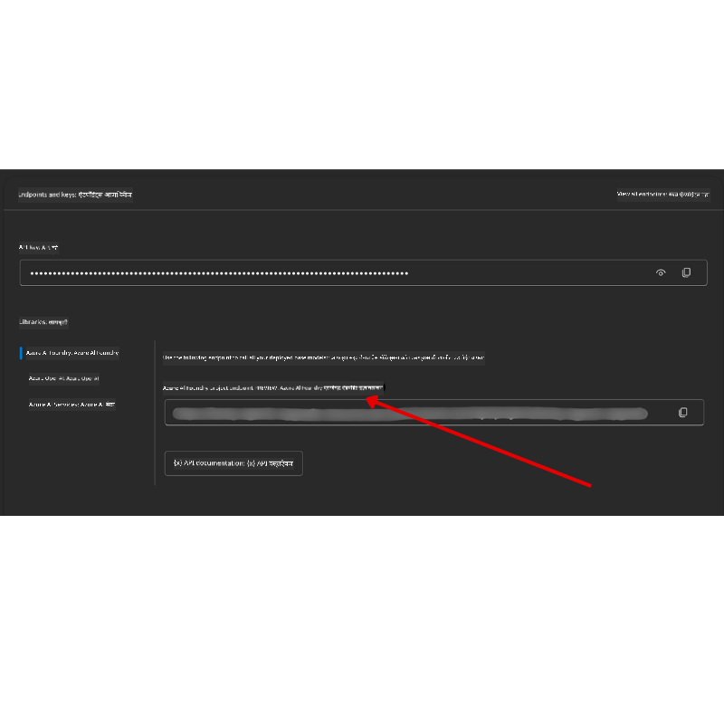

<!--
CO_OP_TRANSLATOR_METADATA:
{
  "original_hash": "c6a79c8f2b56a80370ff7e447765524f",
  "translation_date": "2025-07-24T08:03:44+00:00",
  "source_file": "00-course-setup/README.md",
  "language_code": "mr"
}
-->
# कोर्स सेटअप

## परिचय

या धड्यात आपण या कोर्समधील कोड नमुने कसे चालवायचे ते शिकणार आहोत.

## हे रिपॉजिटरी क्लोन किंवा फोर्क करा

सुरुवातीस, कृपया GitHub रिपॉजिटरी क्लोन किंवा फोर्क करा. यामुळे तुम्हाला कोर्स मटेरियलची स्वतःची आवृत्ती मिळेल, ज्यामुळे तुम्ही कोड चालवू, तपासू आणि बदल करू शकाल!

हे करण्यासाठी खालील लिंकवर क्लिक करा:



## कोड चालवणे

या कोर्समध्ये Jupyter Notebooks चा संच दिला आहे, ज्यामुळे तुम्हाला AI एजंट्स तयार करण्याचा प्रत्यक्ष अनुभव मिळेल.

कोड नमुने खालीलपैकी कोणत्याही प्रकारे चालवले जाऊ शकतात:

**GitHub खाते आवश्यक - मोफत**:

1) Semantic Kernel Agent Framework + GitHub Models Marketplace. (semantic-kernel.ipynb) म्हणून लेबल केलेले.
2) AutoGen Framework + GitHub Models Marketplace. (autogen.ipynb) म्हणून लेबल केलेले.

**Azure सदस्यता आवश्यक**:
3) Azure AI Foundry + Azure AI Agent Service. (azureaiagent.ipynb) म्हणून लेबल केलेले.

तुम्हाला कोणता पर्याय चांगला वाटतो ते पाहण्यासाठी सर्व तीन प्रकारांचे उदाहरण वापरण्याचा आम्ही सल्ला देतो.

तुम्ही कोणताही पर्याय निवडला तरी, खालील सेटअप चरणांचे पालन करणे आवश्यक आहे:

## आवश्यकताः

- Python 3.12+
  - **टीप**: जर तुमच्याकडे Python 3.12 स्थापित नसेल, तर ते स्थापित करा. नंतर, requirements.txt फाइलमधून योग्य आवृत्त्या स्थापित करण्यासाठी python3.12 वापरून तुमचे venv तयार करा.
- GitHub खाते - GitHub Models Marketplace चा प्रवेश मिळवण्यासाठी.
- Azure सदस्यता - Azure AI Foundry चा प्रवेश मिळवण्यासाठी.
- Azure AI Foundry खाते - Azure AI Agent Service चा प्रवेश मिळवण्यासाठी.

या रिपॉजिटरीच्या मूळ फोल्डरमध्ये `requirements.txt` फाइल समाविष्ट आहे, ज्यामध्ये कोड नमुने चालवण्यासाठी आवश्यक असलेल्या सर्व Python पॅकेजेस आहेत.

तुम्ही ती फाइल खालील आदेशाने स्थापित करू शकता:

```bash
pip install -r requirements.txt
```
संघर्ष आणि समस्या टाळण्यासाठी Python वर्च्युअल एन्व्हायर्नमेंट तयार करण्याची शिफारस केली जाते.

## VSCode सेटअप करा
VSCode मध्ये योग्य Python आवृत्ती वापरत असल्याची खात्री करा.


## GitHub Models वापरण्यासाठी नमुन्यांचे सेटअप

### चरण 1: तुमचा GitHub Personal Access Token (PAT) मिळवा

हा कोर्स GitHub Models Marketplace चा उपयोग करतो, जो मोठ्या भाषिक मॉडेल्स (LLMs) साठी मोफत प्रवेश प्रदान करतो, ज्याचा उपयोग तुम्ही AI एजंट्स तयार करण्यासाठी करू शकता.

GitHub Models वापरण्यासाठी, तुम्हाला [GitHub Personal Access Token](https://docs.github.com/en/authentication/keeping-your-account-and-data-secure/managing-your-personal-access-tokens) तयार करणे आवश्यक आहे.

हे तुमच्या GitHub खात्यात जाऊन करता येईल.

कृपया [Principle of Least Privilege](https://docs.github.com/en/get-started/learning-to-code/storing-your-secrets-safely) चे पालन करा. याचा अर्थ, टोकनला फक्त कोड नमुने चालवण्यासाठी आवश्यक असलेल्या परवानग्या द्या.

1. डाव्या बाजूला `Fine-grained tokens` पर्याय निवडा.

    नंतर `Generate new token` निवडा.

    

1. टोकनसाठी त्याच्या उद्देशाचे वर्णन करणारे नाव प्रविष्ट करा, जेणेकरून नंतर ते ओळखणे सोपे होईल. समाप्ती तारीख सेट करा (शिफारस: 30 दिवस; तुम्हाला अधिक सुरक्षितता हवी असल्यास 7 दिवस निवडू शकता.)

    

1. टोकनचा स्कोप तुमच्या या रिपॉजिटरीच्या फोर्कपुरता मर्यादित करा.

    

1. टोकनच्या परवानग्या मर्यादित करा: **Permissions** अंतर्गत, **Account Permissions** निवडा, **Models** पर्यंत जा आणि GitHub Models साठी आवश्यक असलेला फक्त वाचन-अनुमती सक्षम करा.

    

    

तुम्ही तयार केलेला नवीन टोकन कॉपी करा. आता तुम्ही तो या कोर्समध्ये समाविष्ट असलेल्या `.env` फाइलमध्ये जोडाल.

### चरण 2: तुमची `.env` फाइल तयार करा

तुमच्या टर्मिनलमध्ये खालील आदेश चालवून `.env` फाइल तयार करा.

```bash
cp .env.example .env
```

हे उदाहरण फाइल कॉपी करेल आणि तुमच्या डिरेक्टरीमध्ये `.env` तयार करेल, जिथे तुम्ही पर्यावरणीय चलांचे मूल्य भरा.

तुमचा टोकन कॉपी केल्यानंतर, तुमच्या आवडत्या टेक्स्ट एडिटरमध्ये `.env` फाइल उघडा आणि `GITHUB_TOKEN` फील्डमध्ये तुमचा टोकन पेस्ट करा.

आता तुम्ही या कोर्सचे कोड नमुने चालवू शकता.

## Azure AI Foundry आणि Azure AI Agent Service वापरण्यासाठी नमुन्यांचे सेटअप

### चरण 1: तुमचा Azure प्रोजेक्ट एंडपॉइंट मिळवा

Azure AI Foundry मध्ये हब आणि प्रोजेक्ट तयार करण्यासाठी [Hub resources overview](https://learn.microsoft.com/en-us/azure/ai-foundry/concepts/ai-resources) येथे दिलेल्या चरणांचे अनुसरण करा.

तुमचा प्रोजेक्ट तयार केल्यानंतर, तुम्हाला तुमच्या प्रोजेक्टसाठी कनेक्शन स्ट्रिंग मिळवणे आवश्यक आहे.

हे Azure AI Foundry पोर्टलमधील तुमच्या प्रोजेक्टच्या **Overview** पृष्ठावर जाऊन करता येईल.



### चरण 2: तुमची `.env` फाइल तयार करा

तुमच्या टर्मिनलमध्ये खालील आदेश चालवून `.env` फाइल तयार करा.

```bash
cp .env.example .env
```

हे उदाहरण फाइल कॉपी करेल आणि तुमच्या डिरेक्टरीमध्ये `.env` तयार करेल, जिथे तुम्ही पर्यावरणीय चलांचे मूल्य भरा.

तुमचा टोकन कॉपी केल्यानंतर, तुमच्या आवडत्या टेक्स्ट एडिटरमध्ये `.env` फाइल उघडा आणि `PROJECT_ENDPOINT` फील्डमध्ये तुमचा टोकन पेस्ट करा.

### चरण 3: Azure मध्ये साइन इन करा

सुरक्षिततेसाठी, आपण [keyless authentication](https://learn.microsoft.com/azure/developer/ai/keyless-connections?tabs=csharp%2Cazure-cli?WT.mc_id=academic-105485-koreyst) वापरून Microsoft Entra ID सह Azure OpenAI मध्ये प्रमाणीकरण करू.

पुढे, टर्मिनल उघडा आणि `az login --use-device-code` चालवून तुमच्या Azure खात्यात साइन इन करा.

साइन इन केल्यानंतर, टर्मिनलमध्ये तुमची सदस्यता निवडा.

## अतिरिक्त पर्यावरणीय चल - Azure Search आणि Azure OpenAI

Agentic RAG धडा - धडा 5 - मध्ये Azure Search आणि Azure OpenAI वापरणारे नमुने आहेत.

जर तुम्हाला हे नमुने चालवायचे असतील, तर तुम्हाला तुमच्या `.env` फाइलमध्ये खालील पर्यावरणीय चल जोडावे लागतील:

### प्रोजेक्टचे **Overview Page**

- `AZURE_SUBSCRIPTION_ID` - **Overview** पृष्ठावरील **Project details** तपासा.
- `AZURE_AI_PROJECT_NAME` - **Overview** पृष्ठाच्या शीर्षस्थानी प्रोजेक्टचे नाव पहा.
- `AZURE_OPENAI_SERVICE` - **Overview** पृष्ठावरील **Included capabilities** टॅबमध्ये Azure OpenAI Service तपासा.

### व्यवस्थापन केंद्र

- `AZURE_OPENAI_RESOURCE_GROUP` - **Management Center** च्या **Overview** पृष्ठावरील **Project properties** मध्ये जा.
- `GLOBAL_LLM_SERVICE` - **Connected resources** अंतर्गत Azure AI Services कनेक्शन नाव शोधा.

### मॉडेल्स + एंडपॉइंट्स पृष्ठ

- `AZURE_OPENAI_EMBEDDING_DEPLOYMENT_NAME` - तुमच्या एम्बेडिंग मॉडेलचे नाव (उदा. `text-embedding-ada-002`) निवडा.
- `AZURE_OPENAI_CHAT_DEPLOYMENT_NAME` - तुमच्या चॅट मॉडेलचे नाव (उदा. `gpt-4o-mini`) निवडा.

### Azure पोर्टल

- `AZURE_OPENAI_ENDPOINT` - Azure AI Services मध्ये जा, **Keys and Endpoint** मध्ये स्क्रोल करा.
- `AZURE_OPENAI_API_KEY` - त्याच स्क्रीनवरून KEY 1 किंवा KEY 2 कॉपी करा.
- `AZURE_SEARCH_SERVICE_ENDPOINT` - Azure AI Search संसाधन शोधा.
- `AZURE_SEARCH_API_KEY` - **Settings** मध्ये जा आणि **Keys** मध्ये प्राथमिक किंवा दुय्यम प्रशासकीय की कॉपी करा.

### बाह्य वेबपृष्ठ

- `AZURE_OPENAI_API_VERSION` - [API version lifecycle](https://learn.microsoft.com/en-us/azure/ai-services/openai/api-version-deprecation#latest-ga-api-release) पृष्ठावर जा.

### कीलेस प्रमाणीकरण सेटअप करा

तुमचे क्रेडेन्शियल्स हार्डकोड करण्याऐवजी, Azure OpenAI सह कीलेस कनेक्शन वापरू. यासाठी, `DefaultAzureCredential` आयात करू आणि नंतर `DefaultAzureCredential` फंक्शन कॉल करू.

```python
from azure.identity import DefaultAzureCredential, InteractiveBrowserCredential
```

## कुठे अडकलात?

जर तुम्हाला या सेटअपमध्ये कोणतीही अडचण आली, तर आमच्या...

## पुढील धडा

आता तुम्ही या कोर्सचा कोड चालवण्यासाठी तयार आहात. AI एजंट्सच्या जगाबद्दल अधिक जाणून घेण्यासाठी शुभेच्छा!

[AI एजंट्स आणि एजंट वापर प्रकरणांची ओळख](../01-intro-to-ai-agents/README.md)

**अस्वीकरण**:  
हा दस्तऐवज AI भाषांतर सेवा [Co-op Translator](https://github.com/Azure/co-op-translator) वापरून भाषांतरित करण्यात आला आहे. आम्ही अचूकतेसाठी प्रयत्नशील असलो तरी कृपया लक्षात ठेवा की स्वयंचलित भाषांतरांमध्ये त्रुटी किंवा अचूकतेचा अभाव असू शकतो. मूळ भाषेतील दस्तऐवज हा अधिकृत स्रोत मानला जावा. महत्त्वाच्या माहितीसाठी व्यावसायिक मानवी भाषांतराची शिफारस केली जाते. या भाषांतराचा वापर करून निर्माण होणाऱ्या कोणत्याही गैरसमज किंवा चुकीच्या अर्थासाठी आम्ही जबाबदार राहणार नाही.