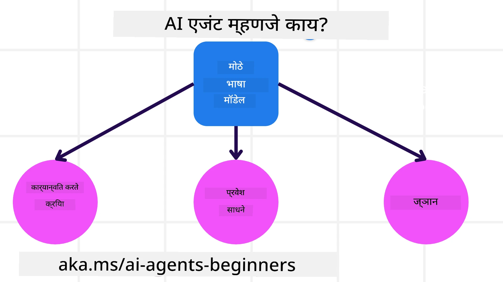
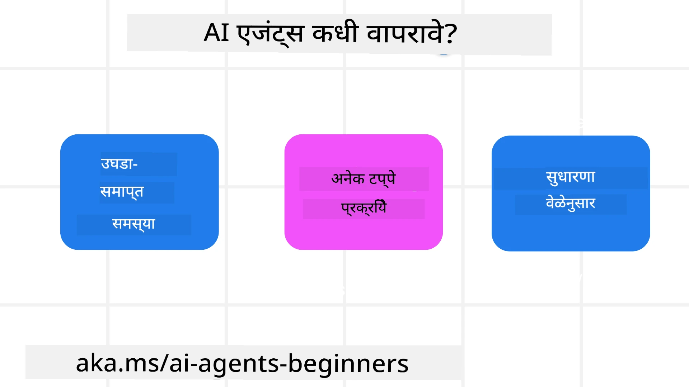

> _(या धड्याचा व्हिडिओ पहाण्यासाठी वरच्या प्रतिमेला क्लिक करा)_

# AI एजंट्स आणि एजंट वापर प्रकरणांची ओळख

"AI Agents for Beginners" कोर्समध्ये आपले स्वागत आहे! हा कोर्स AI एजंट्स तयार करण्यासाठी मूलभूत ज्ञान आणि लागू नमुने प्रदान करतो.

इतर शिकणाऱ्यांशी आणि AI एजंट निर्मात्यांशी भेटण्यासाठी आणि या कोर्सबाबत आपले प्रश्न विचारण्यासाठी <a href="https://discord.gg/kzRShWzttr" target="_blank">Azure AI डिस्कॉर्ड समुदाय</a> मध्ये सामील व्हा.

हा कोर्स सुरू करण्यासाठी, आपण प्रथम AI एजंट्स काय आहेत आणि आपण त्यांचा वापर आपण तयार करणाऱ्या अॅप्लिकेशन्स आणि कार्यप्रवाहांमध्ये कसा करू शकतो हे चांगल्या प्रकारे समजून घेऊया.

## ओळख

हा धडा समाविष्ट करतो:

- AI एजंट्स काय आहेत आणि एजंट्सचे वेगवेगळे प्रकार कोणते आहेत?
- कोणती वापर प्रकरणे AI एजंट्ससाठी सर्वोत्तम आहेत आणि ते आपल्याला कसे मदत करू शकतात?
- एजंटिक सोल्यूशन्स डिझाइन करताना काही मूलभूत बांधकाम ब्लॉक्स कोणते आहेत?

## शिक्षणाचे उद्दिष्टे
हा धडा पूर्ण केल्यावर, आपण सक्षम असाल:

- AI एजंट संकल्पना समजून घेणे आणि इतर AI सोल्यूशन्सपासून ते कसे वेगळे आहेत हे समजावून घेणे.
- AI एजंट्स अधिक कार्यक्षमतेने लागू करण्यासाठी.
- वापरकर्ते आणि ग्राहक दोघांसाठी एजंटिक सोल्यूशन्स उत्पादकतेने डिझाइन करण्यासाठी.

## AI एजंट्सची व्याख्या आणि AI एजंट्सचे प्रकार

### AI एजंट्स काय आहेत?

AI एजंट्स हे **सिस्टम** आहेत जे **Large Language Models(LLMs)** ना त्यांची क्षमता वाढवून **क्रिया करण्यास** सक्षम करतात, जे LLMs ना **साधनांमध्ये प्रवेश** आणि **ज्ञान प्रदान करतात**.

चला ही व्याख्या लहान भागांमध्ये विभागूया:

- **सिस्टम** - एजंट्स हा एकच घटक नसून अनेक घटकांचा एक प्रणाली म्हणून विचार करणे महत्त्वाचे आहे. मूलभूत स्तरावर, AI एजंटचे घटक हे:
  - **परिसर (Environment)** - ज्या ठिकाणी AI एजंट काम करत आहे, त्या ठरवलेल्या जागा. उदाहरणार्थ, जर आमच्याकडे ट्रॅव्हल बुकिंग AI एजंट असेल, तर परिसर हा ट्रॅव्हल बुकिंग सिस्टम असू शकतो ज्याचा AI एजंट कार्ये पूर्ण करण्यासाठी वापर करतो.
  - **सेन्सर्स** - परिसराकडे माहिती असते आणि तो फीडबॅक प्रदान करतो. AI एजंट्स सेन्सर्स वापरून परिसराची सद्यस्थितीची माहिती गोळा करतात आणि समजून घेतात. ट्रॅव्हल बुकिंग एजंट उदाहरणात, ट्रॅव्हल बुकिंग सिस्टम हा हॉटेल उपलब्धता किंवा फ्लाइटच्या किमतीबाबत माहिती देऊ शकतो.
  - **एक्च्युएटर्स** - एकदा AI एजंटला परिसराची सद्यस्थिती प्राप्त झाली की, त्या कार्यासाठी एजंट ठरवतो की परिसरात बदल करण्यासाठी कोणती क्रिया करायची आहे. ट्रॅव्हल बुकिंग एजंटसाठी, उपलब्ध खोल्ये बुक करणे हे असू शकते.

**Large Language Models** - एजंट्सची संकल्पना LLMsच्या तयार होण्यापूर्वीपासून अस्तित्वात आहे. LLMs सह AI एजंट तयार करण्याचा फायदा म्हणजे त्यांच्या मनुष्यभाषा आणि डेटा समजण्याच्या क्षमतेत आहे. ही क्षमता LLMs ना पर्यावरणीय माहिती समजून घेण्यास आणि परिसर बदलण्यासाठी योजना तयार करण्यास सक्षम करते.

**क्रिया करणे** - AI एजंट सिस्टम्स बाहेर, LLMs केवळ वापरकर्त्याच्या सूचना आणि मागणीनुसार कंटेंट किंवा माहिती तयार करण्यात मर्यादित असतात. AI एजंट सिस्टम्समध्ये, LLMs वापरकर्त्याच्या विनंतीचे अर्थ लावून उपलब्ध साधने वापरून कार्ये पूर्ण करू शकतात.

**साधनांमध्ये प्रवेश** - LLMs कडे कोणती साधने असतील हे ठरवते 1) परिसर ज्यामध्ये ते कार्यरत आहेत आणि 2) AI एजंट तयार करणारा विकसक. आमच्या ट्रॅव्हल एजंट उदाहरणात, एजंटची साधने बुकिंग सिस्टममध्ये उपलब्ध ऑपरेशन्स ने मर्यादित असतात, आणि/किंवा विकसक एजंटच्या फ्लाइट साधनांवर प्रवेश मर्यादित करू शकतो.

**स्मृती+ज्ञान** - स्मृती ही संभाषणाच्या संदर्भात थोडक्यावेळची असू शकते, वापरकर्ता आणि एजंट यांच्यातील संवादात. दीर्घकालीन, परिसराद्वारे प्रदान केलेल्या माहितीव्यतिरिक्त, AI एजंट्स इतर सिस्टम्स, सेवा, साधने आणि अगदी इतर एजंट्सकडून ज्ञान पुनर्प्राप्त करू शकतात. ट्रॅव्हल एजंट उदाहरणात, हे ज्ञान वापरकर्त्याच्या प्रवास प्राधान्यांबाबत माहिती असू शकते जी ग्राहक डेटाबेसमध्ये आहे.

### वेगवेगळ्या प्रकारचे एजंट्स

आता आपल्याकडे AI एजंट्सची सामान्य व्याख्या आहे, तर काही विशिष्ट एजंट प्रकार पाहूया आणि ती कशी ट्रॅव्हल बुकिंग AI एजंटला लागू करता येतील ते पाहूया.

| **एजंट प्रकार**                 | **वर्णन**                                                                                                                            | **उदाहरण**                                                                                                                                                                                                                  |
| ----------------------------- | ---------------------------------------------------------------------------------------------------------------------------------- | ---------------------------------------------------------------------------------------------------------------------------------------------------------------------------------------------------------------------------- |
| **सिंपल रिफ्लेक्स एजंट्स**       | पूर्वनिर्धारित नियमांवरून त्वरित क्रिया करतात.                                                                                        | ट्रॅव्हल एजंट ईमेलच्या संदर्भाचे अर्थ लावतो आणि प्रवास तक्रारी ग्राहक सेवा विभागाला पाठवतो.                                                                                                                               |
| **मॉडेल-आधारित रिफ्लेक्स एजंट्स** | जगाच्या मॉडेलवर आणि त्या मॉडेलमध्ये झालेल्या बदलांवर आधारित क्रिया करतात.                                                           | ट्रॅव्हल एजंट महत्त्वपूर्ण किंमत बदलांसह मार्गांना प्राधान्य देतो ज्याचा ऐतिहासिक किंमत डेटा मिळवून केला जातो.                                                                                                            |
| **गोल-आधारित एजंट्स**            | विशिष्ट लक्ष्य साध्य करण्यासाठी योजना तयार करतात, लक्ष्य समजून कार्यांची निवड करतात.                                                | ट्रॅव्हल एजंट प्रवास बुक करतो, चालू स्थानापासून गंतव्यापर्यंत (कार, सार्वजनिक वाहतूक, फ्लाइट्स) आवश्यक प्रवास व्यवस्था ठरवून.                                                                                                |
| **युटिलिटी-आधारित एजंट्स**      | प्राधान्ये विचारात घेतात आणि लक्ष्य साधण्यासाठी व्यापार-बदलांची गणितीपणे तुलना करतात.                                               | ट्रॅव्हल एजंट प्रवास बुक करताना सोय आणि खर्च यांचा तुलनात्मक विचार करून उपयोगिता जास्तीत जास्त करतो.                                                                                                                      |
| **लर्निंग एजंट्स**               | फीडबॅकवर प्रतिक्रिया देऊन आणि क्रिया समायोजित करून काळानुसार सुधारतात.                                                           | ट्रॅव्हल एजंट प्रवासानंतरच्या सर्व्हे फीडबॅकचा वापर करून भाड्यांमध्ये सुधारणा करतो.                                                                                                                                       |
| **हायरेरार्किकल एजंट्स**         | टियर केलेल्या प्रणालीमध्ये अनेक एजंट्स आहेत, उच्च-स्तरीय एजंट्स कार्यांना उपकार्यात विभागून त्यांना पूर्ण करतात.                      | ट्रॅव्हल एजंट विशिष्ट बुकिंग रद्द करण्यासाठी कार्य उपकार्यात विभागतो आणि खालील स्तरांतील एजंट त्यांना पूर्ण करून उच्च-स्तरीय एजंटला अहवाल देतात.                                                                           |
| **मल्टी-एजंट सिस्टम्स (MAS)**     | एजंट्स स्वतंत्रपणे कार्य पूर्ण करतात, सहयोगी किंवा स्पर्धात्मक पद्धतीने.                                                              | सहयोगी: अनेक एजंट्स विशिष्ट सेवा जसे की हॉटेल, फ्लाइट्स, मनोरंजन बुक करतात. स्पर्धात्मक: अनेक एजंट्स समान हॉटेल बुकिंग कॅलेंडरवर ग्राहकांसाठी हॉटेल बुक करण्यासाठी स्पर्धा करतात.                                           |

## AI एजंट्स कधी वापरायचे

मागील विभागात, आम्ही ट्रॅव्हल एजंट वापर प्रकरण वापरले ज्याद्वारे एजंट प्रकार आणि प्रवास बुकिंगच्या वेगवेगळ्या परिस्थितींमध्ये त्यांचा कसा वापर होतो हे स्पष्ट केले. आपण हा अॅप्लिकेशन संपूर्ण कोर्समध्ये वापरत राहू.

AI एजंट्ससाठी सर्वोत्तम वापर प्रकरणांचे प्रकार पाहूया:

- **मोकळ्या-प्रकारचे प्रश्न** - LLM ला कार्य पूर्ण करण्यासाठी आवश्यक टप्पे ठरविण्याची मुभा देणे कारण ते सदैव वर्कफ्लोमध्ये हार्डकोड केलेले नसू शकतात.
- **अनेक टप्प्यांचे प्रक्रिया** - अशा कार्यांमध्ये जिथे AI एजंटला साधने किंवा माहिती अनेक टप्प्यांमध्ये वापरावी लागते, केवळ एकदा माहिती घेण्यापेक्षा अधिक गुंतागुंतीचे असते.  
- **काळानुसार सुधारणा** - अशा कार्यांमध्ये जिथे एजंट समयोचित फीडबॅक मिळवून स्वतःला सुधारू शकतो, व्हापरकर्त्यांकडून किंवा त्यांच्या परिसराकडून फीडबॅक घेऊन अधिक चांगली उपयुक्तता प्रदान करण्यासाठी.

आम्ही अधिक विचार करतो AI एजंट वापराच्या इतर बाबतीत “विश्वसनीय AI एजंट तयार करणे” या धड्यात.

## एजंटिक सोल्यूशन्सच्या मूलभूत गोष्टी

### एजंट विकास

AI एजंट सिस्टम डिझाइन करण्याचा पहिला टप्पा म्हणजे साधने, क्रिया आणि वर्तन निश्चित करणे. या कोर्समध्ये, आम्ही **Azure AI Agent Service** वापरून आमचे एजंट्स निश्चित करण्यावर लक्ष केंद्रित करतो. त्यात खालील सुविधा आहेत:

- OpenAI, Mistral, आणि Llama सारख्या Open मॉडेल्सची निवड
- Tripadvisor सारख्या पुरवठादारांकडून परवाना प्राप्त डेटा वापरणे
- मानकीकृत OpenAPI 3.0 टूल्स वापरणे

### एजंटिक पॅटर्न्स

LLM सह संवाद प्रॉम्प्ट्सद्वारे होतो. AI एजंट्सचे अर्ध-स्वायत्त (semi-autonomous) स्वभावामुळे, परिसरातील बदलानंतर LLM ला मॅन्युअली पुनःप्रॉम्प्ट करणे नेहमी शक्य किंवा आवश्यक नसते. आम्ही **एजंटिक पॅटर्न्स** वापरतो जे LLM ला अनेक टप्प्यांमध्ये अधिक स्केलेबल मार्गाने प्रॉम्प्ट करण्यास अनुमती देतात.

हा कोर्स सध्याच्या लोकप्रिय काही एजंटिक पॅटर्न्समध्ये विभागलेला आहे.

### एजंटिक फ्रेमवर्क्स

एजंटिक फ्रेमवर्क्स विकसकांना कोडद्वारे एजंटिक पॅटर्न्स लागू करण्याची परवानगी देतात. हे फ्रेमवर्क्स टेम्प्लेट्स, प्लगइन्स, आणि साधने ऑफर करतात ज्यामुळे AI एजंट सहकार्य सुधारते. या सुविधांमुळे AI एजंट सिस्टम्सचे निरीक्षण आणि त्रुटी शोधणे अधिक सोपे होते.

या कोर्समध्ये, आम्ही उत्पादनासाठी तयार AI एजंट्स तयार करण्यासाठी Microsoft Agent Framework (MAF) याचा अभ्यास करू.

## नमुना कोड

- Python: [Agent Framework](./code_samples/01-python-agent-framework.ipynb)
- .NET: [Agent Framework](./code_samples/01-dotnet-agent-framework.md)

## AI एजंट्सबाबत आणखी प्रश्न आहेत का?

इतर शिकणाऱ्यांशी भेटण्यासाठी, कार्यालयीन वेळांमध्ये सहभागी होण्यासाठी आणि आपल्या AI एजंट्सच्या प्रश्नांची उत्तरे मिळवण्यासाठी [Microsoft Foundry Discord](https://aka.ms/ai-agents/discord) मध्ये सामील व्हा.

## मागील धडा

[Course Setup](../00-course-setup/README.md)

## पुढील धडा

[Exploring Agentic Frameworks](../02-explore-agentic-frameworks/README.md)

---

<!-- CO-OP TRANSLATOR DISCLAIMER START -->
**अस्वीकरण**:  
हा दस्तऐवज AI अनुवाद सेवा [Co-op Translator](https://github.com/Azure/co-op-translator) वापरून अनुवादित केला आहे. आम्ही अचूकतेसाठी प्रयत्न करतो, तरी कृपया लक्षात घ्या की स्वयंचलित अनुवादांमध्ये चुका किंवा अचूकतेच्या त्रुटी असू शकतात. मूळ दस्तऐवज त्याच्या मातृभाषेत अधिकृत स्रोत समजला पाहिजे. महत्वाच्या माहितीसाठी व्यावसायिक मानवी अनुवाद करण्याची शिफारस केली जाते. या अनुवादाच्या वापरामुळे उद्भवलेल्या कोणत्याही गैरसमज किंवा चुका याबाबतीत आम्ही जबाबदार नाही.
<!-- CO-OP TRANSLATOR DISCLAIMER END -->