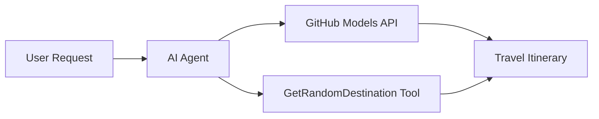

# 🌍 Microsoft Agent Framework (.NET) सह AI प्रवास एजंट

## 📋 परिस्थितीचा आढावा

ही नोटबुक Microsoft Agent Framework for .NET वापरून बुद्धिमान प्रवास नियोजन एजंट तयार करण्याची प्रक्रिया दाखवते. हा एजंट जगभरातील यादृच्छिक स्थळांसाठी वैयक्तिकृत दिवस-यात्रा कार्यक्रम आपोआप तयार करू शकतो.

**मुख्य क्षमता:**
- 🎲 **यादृच्छिक स्थळ निवड**: सुट्टीच्या ठिकाणांची निवड करण्यासाठी सानुकूल साधन वापरते
- 🗺️ **बुद्धिमान प्रवास नियोजन**: तपशीलवार दिवस-वार कार्यक्रम तयार करते
- 🔄 **रिअल-टाइम स्ट्रीमिंग**: त्वरित आणि स्ट्रीमिंग प्रतिसादांना समर्थन देते
- 🛠️ **सानुकूल साधन एकत्रीकरण**: एजंटच्या क्षमतांचा विस्तार कसा करायचा हे दाखवते

## 🔧 तांत्रिक आर्किटेक्चर

### मुख्य तंत्रज्ञान
- **Microsoft Agent Framework**: AI एजंट विकासासाठी नवीनतम .NET अंमलबजावणी
- **GitHub Models Integration**: GitHub च्या AI मॉडेल अनुमान सेवांचा वापर करते
- **OpenAI API Compatibility**: सानुकूल एंडपॉइंटसह OpenAI क्लायंट लायब्ररींचा लाभ घेते
- **सुरक्षित कॉन्फिगरेशन**: API की व्यवस्थापनासाठी पर्यावरण-आधारित पद्धत

### मुख्य घटक
1. **AIAgent**: मुख्य एजंट ऑर्केस्ट्रेटर जो संभाषणाचा प्रवाह हाताळतो
2. **सानुकूल साधने**: `GetRandomDestination()` फंक्शन एजंटसाठी उपलब्ध
3. **चॅट क्लायंट**: GitHub Models-समर्थित संभाषण इंटरफेस
4. **स्ट्रीमिंग समर्थन**: रिअल-टाइम प्रतिसाद निर्मिती क्षमता

### एकत्रीकरण नमुना


## 🚀 सुरुवात कशी करावी

**पूर्वापेक्षित गोष्टी:**
- .NET 9.0 किंवा त्याहून अधिक
- GitHub Models API प्रवेश टोकन
- `.env` फाइलमध्ये कॉन्फिगर केलेले पर्यावरणीय व्हेरिएबल्स

**आवश्यक पर्यावरणीय व्हेरिएबल्स:**
```env
GITHUB_TOKEN=your_github_token
GITHUB_ENDPOINT=https://models.inference.ai.azure.com
GITHUB_MODEL_ID=gpt-4o-mini
```

खालील सेल्स क्रमाने चालवा आणि प्रवास एजंटची कार्यक्षमता पाहा!

---

## .NET Single File App: AI Travel Agent Example

See `01-dotnet-agent-framework.cs` for the complete runnable code sample.

खालील कोड नमुना चालवा:

```bash
dotnet run 01-dotnet-agent-framework.cs
```

### Sample Code

```csharp
static string GetRandomDestination()
{
    var destinations = new List<string>
    {
        "Paris, France",
        "Tokyo, Japan",
        "New York City, USA",
        "Sydney, Australia",
        "Rome, Italy",
        "Barcelona, Spain",
        "Cape Town, South Africa",
        "Rio de Janeiro, Brazil",
        "Bangkok, Thailand",
        "Vancouver, Canada"
    };
    var random = new Random();
    int index = random.Next(destinations.Count);
    return destinations[index];
}

// Extract configuration from environment variables
var github_endpoint = Environment.GetEnvironmentVariable("GITHUB_ENDPOINT") ?? throw new InvalidOperationException("GITHUB_ENDPOINT is not set.");
var github_model_id = Environment.GetEnvironmentVariable("GITHUB_MODEL_ID") ?? "gpt-4o-mini";
var github_token = Environment.GetEnvironmentVariable("GITHUB_TOKEN") ?? throw new InvalidOperationException("GITHUB_TOKEN is not set.");

// Configure OpenAI Client Options
var openAIOptions = new OpenAIClientOptions()
{
    Endpoint = new Uri(github_endpoint)
};

// Initialize OpenAI Client with GitHub Models Configuration
var openAIClient = new OpenAIClient(new ApiKeyCredential(github_token), openAIOptions);

// Create AI Agent with Travel Planning Capabilities
AIAgent agent = openAIClient
    .GetChatClient(github_model_id)
    .CreateAIAgent(
        instructions: "You are a helpful AI Agent that can help plan vacations for customers at random destinations",
        tools: [AIFunctionFactory.Create(GetRandomDestination)]
    );

// Execute Agent: Plan a Day Trip (Non-Streaming)
Console.WriteLine(await agent.RunAsync("Plan me a day trip"));

// Execute Agent: Plan a Day Trip (Streaming Response)
await foreach (var update in agent.RunStreamingAsync("Plan me a day trip"))
{
    Console.Write(update);
}
```
