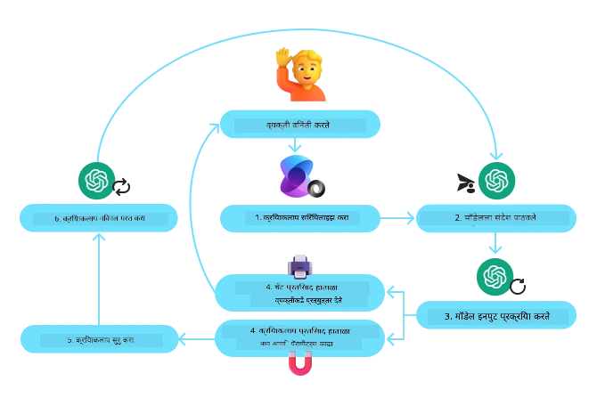
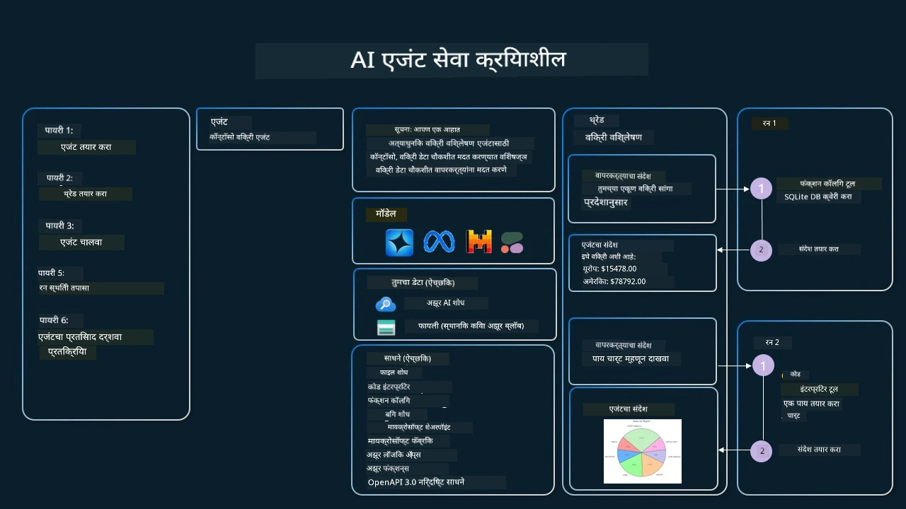

[](https://youtu.be/vieRiPRx-gI?si=cEZ8ApnT6Sus9rhn)

> _(वरील प्रतिमा क्लिक करून या धड्याचा व्हिडिओ पाहा)_

# टूल वापर डिझाइन पॅटर्न

टूल्स मनोरंजक आहेत कारण ते एआय एजंट्सना अधिक व्यापक कार्यक्षमता देतात. एजंटकडे मर्यादित क्रियांची सेट असण्याऐवजी, टूल जोडल्याने एजंट आता अनेक प्रकारच्या क्रिया करू शकतो. या अध्यायात, आपण टूल वापर डिझाइन पॅटर्न पाहणार आहोत, जे वर्णन करते की एआय एजंट्स त्यांच्या उद्दिष्टे साध्य करण्यासाठी विशिष्ट टूल्स कसे वापरू शकतात.

## परिचय

या धड्यात, आम्ही खालील प्रश्नांची उत्तरे शोधत आहोत:

- टूल वापर डिझाइन पॅटर्न म्हणजे काय?
- हे कोणत्या उपयोगप्रकरणांवर लागू केले जाऊ शकते?
- डिझाइन पॅटर्न अंमलबजावणी करण्यासाठी कोणते घटक/बिल्डिंग ब्लॉक्स आवश्यक आहेत?
- विश्वासार्ह एआय एजंट तयार करण्यासाठी टूल वापर डिझाइन पॅटर्न वापरताना कोणती विशेष विचारधारा असावी?

## शिक्षणाच्या उद्दिष्टे

हा धडा पूर्ण केल्यानंतर, आपण सक्षम असाल:

- टूल वापर डिझाइन पॅटर्न आणि त्याचा हेतू परिभाषित करणे.
- ज्या उपयोगप्रकरणांवर टूल वापर डिझाइन पॅटर्न लागू होऊ शकते ते ओळखणे.
- डिझाइन पॅटर्न अंमलबजावणी करण्यासाठी आवश्यक मुख्य घटक समजणे.
- या डिझाइन पॅटर्नचा वापर करणाऱ्या एआय एजंट्समध्ये विश्वासार्हता सुनिश्चित करण्यासाठी विचारात घेण्याजोग्या बाबी ओळखणे.

## टूल वापर डिझाइन पॅटर्न म्हणजे काय?

**टूल वापर डिझाइन पॅटर्न** हे LLMs ना बाह्य टूल्सशी संवाद साधण्याची क्षमता देण्यावर लक्ष केंद्रित करते ज्याद्वारे विशिष्ट उद्दिष्टे साध्य केली जातात. टूल्स म्हणजे एजंटद्वारे एक्झिक्यूट केले जाऊ शकणारा कोड जो क्रिया पार पाडतो. एखादे टूल साधी फंक्शन असू शकते जसे कॅलक्युलेटर, किंवा तृतीय-पक्ष सेवेचा API कॉल असू शकतो जसे स्टॉक प्राइस शोधणे किंवा हवामान अंदाज. एआय एजंट्सच्या संदर्भात, टूल्स एजंटद्वारे **मॉडेल-निर्मित फंक्शन कॉल्स** च्या प्रतिसादात चालविण्यासाठी डिझाइन केलेले असतात.

## हे कोणत्या उपयोगप्रकरणांवर लागू होते?

एआय एजंट्स जटिल कार्य पूर्ण करण्यासाठी, माहिती पुनर्प्राप्त करण्यासाठी, किंवा निर्णय घेण्यासाठी टूल्सचा उपयोग करू शकतात. टूल वापर डिझाइन पॅटर्न सामान्यतः असे परिमंडल असलेल्या परिस्थितींमध्ये वापरला जातो जिथे बाह्य प्रणालींसह डायनॅमिक संवाद आवश्यक असतो, जसे डेटाबेस, वेब सेवां किंवा कोड इंटरप्रेटर. ही क्षमता अनेक विविध उपयोगप्रकरणांसाठी उपयुक्त आहे ज्यात समाविष्ट आहे:

- **डायनॅमिक माहिती पुनर्प्राप्ति:** एजंट्स बाह्य API किंवा डेटाबेस क्वेरी करून अद्ययावत डेटा मिळवू शकतात (उदा., डेटा विश्लेषणासाठी SQLite डेटाबेस क्वेरी करणे, स्टॉक किमती किंवा हवामान माहिती आणणे).
- **कोड अंमलबजावणी आणि इंटरप्रिटेशन:** गणिती समस्या सोडवण्यासाठी, अहवाल तयार करण्यासाठी, किंवा सिम्युलेशन्स चालविण्यासाठी एजंट्स कोड किंवा स्क्रिप्ट्स चालवू शकतात.
- **वर्कफ्लो ऑटोमेशन:** कार्य शेड्युलर, ईमेल सेवा, किंवा डेटा पाइपलाइन सारखी टूल्स एकत्र करून पुनरावृत्ती किंवा बहु-स्टेप वर्कफ्लो स्वयंचलित करणे.
- **कस्टमर सपोर्ट:** एजंट्स CRM सिस्टम्स, टिकटिंग प्लॅटफॉर्म्स, किंवा नॉलेज बेसेसशी संवाद साधून वापरकर्त्यांच्या प्रश्नांचे निराकरण करू शकतात.
- **कंटेंट जनरेशन आणि एडिटिंग:** व्याकरण तपासक, टेक्स्ट सारांश करणारे, किंवा कंटेंट सुरक्षा मूल्यांकन करणारे टूल्स वापरून कंटेंट निर्मितीमध्ये सहाय्य करणे.

## टूल वापर डिझाइन पॅटर्न अंमलबजावणीसाठी कोणते घटक/बिल्डिंग ब्लॉक्स आवश्यक आहेत?

हे बिल्डिंग ब्लॉक्स एआय एजंटला विस्तृत कार्ये पार पाडण्याची परवानगी देतात. टूल वापर डिझाइन पॅटर्न अंमलात आणण्यासाठी आवश्यक मुख्य घटक पाहूया:

- **फंक्शन/टूल स्कीमा:** उपलब्ध टूल्सची सविस्तर व्याख्या, ज्यात फंक्शनचे नाव, उद्देश, आवश्यक पॅरामीटर्स आणि अपेक्षित आउटपुट समाविष्ट असतात. ही स्कीमा LLM ला काय टूल्स उपलब्ध आहेत आणि वैध विनंत्या कशा तयार कराव्यात हे समजण्यास सक्षम करतात.

- **फंक्शन अंमलबजावणी लॉजिक:** वापरकर्त्याच्या हेतू आणि संभाषणाच्या संदर्भावर आधारित टूल्स कधी आणि कशा प्रकारे कॉल करावेत हे नियंत्रित करते. यात प्लॅनर मॉड्यूल्स, राउटिंग मेकॅनिझम्स, किंवा टूल वापर डायनॅमिकली ठरवणारे शर्तीचे फ्लोज असू शकतात.

- **मेसेज हँडलिंग सिस्टम:** वापरकर्त्याच्या इनपुट्स, LLM प्रतिसाद, टूल कॉल्स आणि टूल आउटपुट्स यांच्यातील संभाषण प्रवाह व्यवस्थापित करणारे घटक.

- **टूल इंटिग्रेशन फ्रेमवर्क:** एजंटला विविध टूल्सशी कनेक्ट करणारे इन्फ्रास्ट्रक्चर, मग ती साधी फंक्शन असो किंवा क्लिष्ट बाह्य सेवा असोत.

- **एरर हँडलिंग आणि व्हॅलिडेशन:** टूल अंमलबजावणीत अपयश हाताळण्यासाठी, पॅरामीटर्सची वैधता तपासण्यासाठी, आणि अनपेक्षित प्रतिसाद व्यवस्थापित करण्यासाठी मेकॅनिझम्स.

- **स्टेट मॅनेजमेंट:** संभाषणाचा संदर्भ, मागील टूल इंटरॅक्शन्स आणि सततच्या डेटाचे ट्रॅकिंग करणे जे मल्टी-टर्न इंटरॅक्शन्समध्ये सुसंगती सुनिश्चित करते.

आता, फंक्शन/टूल कॉलिंगचा सविस्तर आढावा घेऊया.
 
### फंक्शन/टूल कॉलिंग

फंक्शन कॉलिंग ही मोठ्या भाषा मॉडेल्सना (LLMs) टूल्सशी संवाद साधण्याची प्राथमिक पद्धत आहे. आपण अनेकदा 'Function' आणि 'Tool' यांचा परस्परवापर पाहाल कारण 'फंक्शन्स' (पुन्हा वापरता येणाऱ्या कोडचे ब्लॉक्स) हे एजंट्स वापरत असलेले 'टूल्स' आहेत. एखाद्या फंक्शनचा कोड चालविण्यासाठी, LLM ला वापरकर्त्याची विनंती फंक्शन्सच्या वर्णनाशी तुलना करावी लागते. हे करण्यासाठी सर्व उपलब्ध फंक्शन्सचे वर्णन असलेली एक स्कीमा LLM कडे पाठवली जाते. LLM नंतर कामासाठी सर्वात योग्य फंक्शन निवडते आणि त्याचे नाव आणि आर्ग्युमेंट्स परत करते. निवडलेले फंक्शन कॉल केले जाते, त्याचा प्रतिसाद LLM कडे परत पाठविला जातो, जे वापरकर्त्याच्या विनंतीला उत्तर देण्यासाठी त्या माहितीस वापर करते.

डेव्हलपर्सनी एजंटसाठी फंक्शन कॉलिंग अंमलात आणण्यासाठी, आपल्याला हवे असेल:

1. फंक्शन कॉलिंगला समर्थन देणारे एक LLM मॉडेल
2. फंक्शन वर्णन असलेली एक स्कीमा
3. वर्णन केलेल्या प्रत्येक फंक्शनसाठी कोड

सध्याच्या वेळेतील शहरातील वेळ मिळवण्याच्या उदाहरणाचा वापर करून समजावून घेऊया:

1. **फंक्शन कॉलिंगला समर्थन देणारे LLM प्रारंभ करा:**

    सर्व मॉडेल्स फंक्शन कॉलिंगला समर्थन करत नाहीत, त्यामुळे आपण वापरत असलेले LLM हे समर्थन करते की नाही याची तपासणी करणे महत्त्वाचे आहे.     <a href="https://learn.microsoft.com/azure/ai-services/openai/how-to/function-calling" target="_blank">Azure OpenAI</a> फंक्शन कॉलिंगला समर्थन करते. आपण Azure OpenAI क्लायंट सुरू करून सुरुवात करू शकतो. 

    ```python
    # Azure OpenAI क्लायंट प्रारंभ करा
    client = AzureOpenAI(
        azure_endpoint = os.getenv("AZURE_AI_PROJECT_ENDPOINT"), 
        api_key=os.getenv("AZURE_OPENAI_API_KEY"),  
        api_version="2024-05-01-preview"
    )
    ```

1. **फंक्शन स्कीमा तयार करा**:

    पुढे आपण एक JSON स्कीमा परिभाषित करू जे फंक्शनचे नाव, फंक्शन काय करते याचे वर्णन, आणि फंक्शन पॅरामीटर्सची नावे व वर्णने यांचा समावेश करत असेल.
    नंतर आपण ही स्कीमा पूर्वी तयार केलेल्या क्लायंटला वापरकर्त्याची विनंती (उदा., सॅन फ्रान्सिस्कोमधील वेळ शोधणे) सह पाठवू. महत्त्वाची गोष्ट म्हणजे **टूल कॉल** हा परत येणारा परिणाम असतो, प्रश्नाचे अंतिम उत्तर नाही. पूर्वी नमूद केलेप्रमाणे, LLM कामासाठी निवडलेल्या फंक्शनचे नाव आणि त्यास दिले जाणारे आर्ग्युमेंट्स परत करते.

    ```python
    # मॉडेल वाचण्यासाठी फंक्शनचे वर्णन
    tools = [
        {
            "type": "function",
            "function": {
                "name": "get_current_time",
                "description": "Get the current time in a given location",
                "parameters": {
                    "type": "object",
                    "properties": {
                        "location": {
                            "type": "string",
                            "description": "The city name, e.g. San Francisco",
                        },
                    },
                    "required": ["location"],
                },
            }
        }
    ]
    ```
   
    ```python
  
    # प्रारंभिक वापरकर्त्याचा संदेश
    messages = [{"role": "user", "content": "What's the current time in San Francisco"}] 
  
    # पहिला API कॉल: मॉडेलला फंक्शन वापरण्यास सांगणे
      response = client.chat.completions.create(
          model=deployment_name,
          messages=messages,
          tools=tools,
          tool_choice="auto",
      )
  
      # मॉडेलच्या प्रतिसादाची प्रक्रिया करा
      response_message = response.choices[0].message
      messages.append(response_message)
  
      print("Model's response:")  

      print(response_message)
  
    ```

    ```bash
    Model's response:
    ChatCompletionMessage(content=None, role='assistant', function_call=None, tool_calls=[ChatCompletionMessageToolCall(id='call_pOsKdUlqvdyttYB67MOj434b', function=Function(arguments='{"location":"San Francisco"}', name='get_current_time'), type='function')])
    ```
  
1. **कार्य पूर्ण करण्यासाठी आवश्यक फंक्शन कोड:**

    आता जेव्हा LLM ने कोणते फंक्शन चालवायचे ते निवडले आहे, तेव्हा त्या कार्यास चालवणारा कोड अंमलात आणावा लागतो आणि चालवला पाहिजे.
    आपण Python मध्ये सध्याची वेळ मिळवण्यासाठी कोड अंमलात आणू शकतो. तसेच response_message मधून नाव आणि आर्ग्युमेंट्स काढून अंतिम निकाल मिळवण्यासाठी कोड लिहिण्याची आवश्यकता असेल.

    ```python
      def get_current_time(location):
        """Get the current time for a given location"""
        print(f"get_current_time called with location: {location}")  
        location_lower = location.lower()
        
        for key, timezone in TIMEZONE_DATA.items():
            if key in location_lower:
                print(f"Timezone found for {key}")  
                current_time = datetime.now(ZoneInfo(timezone)).strftime("%I:%M %p")
                return json.dumps({
                    "location": location,
                    "current_time": current_time
                })
      
        print(f"No timezone data found for {location_lower}")  
        return json.dumps({"location": location, "current_time": "unknown"})
    ```

     ```python
     # फंक्शन कॉल्स हाताळा
      if response_message.tool_calls:
          for tool_call in response_message.tool_calls:
              if tool_call.function.name == "get_current_time":
     
                  function_args = json.loads(tool_call.function.arguments)
     
                  time_response = get_current_time(
                      location=function_args.get("location")
                  )
     
                  messages.append({
                      "tool_call_id": tool_call.id,
                      "role": "tool",
                      "name": "get_current_time",
                      "content": time_response,
                  })
      else:
          print("No tool calls were made by the model.")  
  
      # दुसरा API कॉल: मॉडेलकडून अंतिम प्रतिसाद मिळवा
      final_response = client.chat.completions.create(
          model=deployment_name,
          messages=messages,
      )
  
      return final_response.choices[0].message.content
     ```

     ```bash
      get_current_time called with location: San Francisco
      Timezone found for san francisco
      The current time in San Francisco is 09:24 AM.
     ```

फंक्शन कॉलिंग हे बहुतेक, जर सर्व नसेल तर सर्व एजंट टूल वापर डिझाइनचे केंद्रस्थानी असते, तथापि ते शून्यापासून अंमलात आणणे कधी कधी आव्हानात्मक असू शकते.
जसे आपण [धडा 2](../../../02-explore-agentic-frameworks) मध्ये शिकलो, एजेंटिक फ्रेमवर्क्स आम्हाला टूल वापर अंमलबजावणीसाठी पूर्व-निर्मित बिल्डिंग ब्लॉक्स प्रदान करतात.
 
## एजेंटिक फ्रेमवर्क्ससह टूल वापर उदाहरणे

खाली काही उदाहरणे आहेत ज्यात विविध एजेंटिक फ्रेमवर्क्सचा वापर करून टूल वापर डिझाइन पॅटर्न कसा अंमलात आणता येतो ते दाखवले आहे:

### Microsoft Agent Framework

<a href="https://learn.microsoft.com/azure/ai-services/agents/overview" target="_blank">Microsoft Agent Framework</a> हा AI एजंट्स तयार करण्यासाठीचा एक ओपन-सोर्स फ्रेमवर्क आहे. हे फंक्शन कॉलिंग वापरण्याची प्रक्रिया सुलभ करते कारण आपण `@tool` डेकोरेटरसह Python फंक्शन्स म्हणून टूल्स परिभाषित करू शकता. फ्रेमवर्क मॉडेल आणि आपल्या कोडमधील परस्परसंवाद हाताळते. तसेच ते `AzureAIProjectAgentProvider` द्वारे File Search आणि Code Interpreter सारखे पूर्व-निर्मित टूल्स उपलब्ध करून देते.

खालील आकृती Microsoft Agent Framework सह फंक्शन कॉलिंगची प्रक्रिया दर्शवते:



Microsoft Agent Framework मध्ये, टूल्स डेकोरेट केलेल्या फंक्शन्स म्हणून परिभाषित केले जातात. आपण पूर्वी पाहिलेल्या `get_current_time` फंक्शनला `@tool` डेकोरेटर वापरून टूलमध्ये रूपांतरित करू शकतो. फ्रेमवर्क आपोआप फंक्शन आणि त्याचे पॅरामीटर्स सीरिअलाइझ करेल, आणि LLM कडे पाठविण्यासाठी स्कीमा तयार करेल.

```python
from agent_framework import tool
from agent_framework.azure import AzureAIProjectAgentProvider
from azure.identity import AzureCliCredential

@tool
def get_current_time(location: str) -> str:
    """Get the current time for a given location"""
    ...

# क्लायंट तयार करा
provider = AzureAIProjectAgentProvider(credential=AzureCliCredential())

# एजंट तयार करा आणि साधनासह चालवा
agent = await provider.create_agent(name="TimeAgent", instructions="Use available tools to answer questions.", tools=get_current_time)
response = await agent.run("What time is it?")
```
  
### Azure AI Agent Service

<a href="https://learn.microsoft.com/azure/ai-services/agents/overview" target="_blank">Azure AI Agent Service</a> हा एक नवीन एजेंटिक फ्रेमवर्क आहे जो विकसकांना सुरक्षितरीत्या उच्च-गुणवत्तेचे आणि विस्तारणीय एआय एजंट तयार, तैनात आणि स्केल करण्यास सक्षम करतो, ज्यासाठी खालील इन्फ्रास्ट्रक्चरचे व्यवस्थापन करण्याची आवश्यकता नाही. हा खास करून एंटरप्राइझ अप्लिकेशन्ससाठी उपयुक्त आहे कारण तो पूर्णपणे व्यवस्थापित सेवा आहे ज्यात एंटरप्राइझ-ग्रेड सुरक्षा आहे.

थेट LLM API वापरून विकसित करण्याच्या तुलनेत, Azure AI Agent Service काही फायदे देते, ज्यात समाविष्ट आहे:

- स्वयंचलित टूल कॉलिंग – टूल कॉल पार्स करण्याची, टूल invoke करण्याची, आणि प्रतिसाद हाताळण्याची गरज नाही; हे सर्व आता सर्व्हर-साइडवर केले जाते
- सुरक्षितरीत्या व्यवस्थापित डेटा – आपल्या स्वतःच्या संभाषण स्टेटचे व्यवस्थापन करण्याऐवजी, आपण थ्रेड्सवर अवलंबून राहू शकता जे सर्व आवश्यक माहिती संग्रहित करतात
- बाहेरून साधने – Bing, Azure AI Search, आणि Azure Functions सारख्या डेटा स्रोतांसोबत संवाद साधण्यासाठी वापरता येणारी टूल्स

Azure AI Agent Service मधील उपलब्ध टूल्स दोन कॅटेगरीजमध्ये विभागले जाऊ शकतात:

1. ज्ञान साधने:
    - <a href="https://learn.microsoft.com/azure/ai-services/agents/how-to/tools/bing-grounding?tabs=python&pivots=overview" target="_blank">Bing शोधासह ग्राउंडिंग</a>
    - <a href="https://learn.microsoft.com/azure/ai-services/agents/how-to/tools/file-search?tabs=python&pivots=overview" target="_blank">फाईल शोध</a>
    - <a href="https://learn.microsoft.com/azure/ai-services/agents/how-to/tools/azure-ai-search?tabs=azurecli%2Cpython&pivots=overview-azure-ai-search" target="_blank">Azure AI Search</a>

2. क्रिया साधने:
    - <a href="https://learn.microsoft.com/azure/ai-services/agents/how-to/tools/function-calling?tabs=python&pivots=overview" target="_blank">फंक्शन कॉलिंग</a>
    - <a href="https://learn.microsoft.com/azure/ai-services/agents/how-to/tools/code-interpreter?tabs=python&pivots=overview" target="_blank">कोड इंटरप्रिटर</a>
    - <a href="https://learn.microsoft.com/azure/ai-services/agents/how-to/tools/openapi-spec?tabs=python&pivots=overview" target="_blank">OpenAPI द्वारा परिभाषित टूल्स</a>
    - <a href="https://learn.microsoft.com/azure/ai-services/agents/how-to/tools/azure-functions?pivots=overview" target="_blank">Azure Functions</a>

एजंट सर्व्हिस आम्हाला हे टूल्स `toolset` म्हणून एकत्र वापरण्याची परवानगी देते. तसेच हे `threads` वापरते जे विशिष्ट संभाषणाच्या संदेश इतिहासाचा मागोवा ठेवतात.

कल्पना करा की आपण Contoso नावाच्या कंपनीतील सेल्स एजंट आहात. आपण असा संभाषणात्मक एजंट तयार करू इच्छिता जो आपल्या विक्री डेटाबद्दल प्रश्नांची उत्तरे देऊ शकेल.

खालील प्रतिमा दाखवते की आपण Azure AI Agent Service वापरून आपल्या विक्री डेटाचे विश्लेषण कसे करू शकता:



सेवेबरोबर कोणतेही टूल वापरण्यासाठी आपण क्लायंट तयार करून टूल किंवा टूलसेट परिभाषित करू शकतो. हे प्रत्यक्षात अंमलात आणण्यासाठी आपण खालील Python कोड वापरू शकतो. LLM टूलसेट पाहून ठरवू शकेल की वापरकर्त्याने तयार केलेला फंक्शन `fetch_sales_data_using_sqlite_query` वापरायचा की पूर्व-निर्मित Code Interpreter वापरायचा, हे वापरकर्त्याच्या विनंतीवर अवलंबून असेल.

```python 
import os
from azure.ai.projects import AIProjectClient
from azure.identity import DefaultAzureCredential
from fetch_sales_data_functions import fetch_sales_data_using_sqlite_query # fetch_sales_data_functions.py फाइलमध्ये आढळणारी fetch_sales_data_using_sqlite_query फंक्शन.
from azure.ai.projects.models import ToolSet, FunctionTool, CodeInterpreterTool

project_client = AIProjectClient.from_connection_string(
    credential=DefaultAzureCredential(),
    conn_str=os.environ["PROJECT_CONNECTION_STRING"],
)

# टूलसेट प्रारंभ करा
toolset = ToolSet()

# fetch_sales_data_using_sqlite_query फंक्शनसह फंक्शन कॉल करणारा एजंट प्रारंभ करा आणि तो टूलसेटमध्ये जोडा
fetch_data_function = FunctionTool(fetch_sales_data_using_sqlite_query)
toolset.add(fetch_data_function)

# Code Interpreter टूल प्रारंभ करा आणि ते टूलसेटमध्ये जोडा
code_interpreter = code_interpreter = CodeInterpreterTool()
toolset.add(code_interpreter)

agent = project_client.agents.create_agent(
    model="gpt-4o-mini", name="my-agent", instructions="You are helpful agent", 
    toolset=toolset
)
```

## टूल वापर डिझाइन पॅटर्न वापरून विश्वासार्ह एआय एजंट तयार करताना कोणत्या विशेष विचारांची आवश्यकता आहे?

LLMs द्वारे डायनॅमिकली जनरेट केलेल्या SQL बाबत सामान्य चिंतेपैकी एक म्हणजे सुरक्षा, विशेषतः SQL इंजेक्शनचा धोका किंवा डेटाबेस ड्रॉप करणे किंवा छेडछाड करणे यांसारखे दुर्भावनायुक्त क्रिया होण्याचा धोका. ही चिंता योग्य आहे, परंतु डेटाबेस प्रवेश परवानग्या योग्यरित्या कॉन्फिगर केल्यास प्रभावीपणे कमी केल्या जाऊ शकतात. बहुतेक डेटाबेससाठी याचा अर्थ डेटाबेसला रीड-ओन्ली म्हणून कॉन्फिगर करणे होय. PostgreSQL किंवा Azure SQL सारख्या डेटाबेस सेवांसाठी, अ‍ॅपला रीड-ओन्ली (SELECT) भूमिका दिली पाहिजे.

अॅप सुरक्षित वातावरणात चालविणे आणखी संरक्षण वाढवते. एंटरप्राइझ परिदृश्यांमध्ये, डेटा साधारणतः ऑपरेशनल सिस्टम्समधून काढला जातो आणि एका रीड-ओन्ली डेटाबेस किंवा डेटा वेअरहाऊसमध्ये यूजर-फ्रेंडली स्कीमासह ट्रान्सफॉर्म केला जातो. हा दृष्टिकोन सुनिश्चित करतो की डेटा सुरक्षित आहे, कार्यक्षमता आणि प्रवेशयोग्यतेसाठी ऑप्टिमाइझ केलेला आहे, आणि अॅपला मर्यादित, रीड-ओन्ली प्रवेश आहे.

## सॅम्पल कोड्स

- Python: [Agent Framework](./code_samples/04-python-agent-framework.ipynb)
- .NET: [Agent Framework](./code_samples/04-dotnet-agent-framework.md)

## टूल वापर डिझाइन पॅटर्न्सबद्दल अजून प्रश्न आहेत का?

इतर शिकणाऱ्यांशी भेटण्यासाठी, ऑफिस आवर्स अटेंड करण्यासाठी आणि आपल्या एआय एजंट्सच्या प्रश्नांची उत्तरे मिळविण्यासाठी [Microsoft Foundry Discord](https://aka.ms/ai-agents/discord) मध्ये सहभागी व्हा.

## अतिरिक्त संसाधने

- <a href="https://microsoft.github.io/build-your-first-agent-with-azure-ai-agent-service-workshop/" target="_blank">Azure AI Agents Service कार्यशाळा</a>
- <a href="https://github.com/Azure-Samples/contoso-creative-writer/tree/main/docs/workshop" target="_blank">Contoso Creative Writer मल्टी-एजंट कार्यशाळा</a>
- <a href="https://learn.microsoft.com/azure/ai-services/agents/overview" target="_blank">Microsoft Agent Framework अवलोकन</a>

## मागील धडा

[Agentic Design Patterns समजून घेणे](../03-agentic-design-patterns/README.md)

## पुढील धडा
[एजेंटिक RAG](../05-agentic-rag/README.md)

---

<!-- CO-OP TRANSLATOR DISCLAIMER START -->
अस्वीकरण:
हा दस्तऐवज AI अनुवाद सेवा Co-op Translator (https://github.com/Azure/co-op-translator) वापरून अनुवादित केला आहे. जरी आम्ही अचूकतेसाठी प्रयत्न करतो, तरी कृपया लक्षात ठेवा की स्वयंचलित अनुवादांमध्ये चुका किंवा अचूकतेसंबंधी त्रुटी असू शकतात. मूळ दस्तऐवज त्याच्या मूळ भाषेत अधिकृत स्रोत म्हणून मानला पाहिजे. अत्यावश्यक माहितीच्या बाबतीत व्यावसायिक मानवी अनुवादाची शिफारस केली जाते. या अनुवादाच्या वापरामुळे उद्भवणाऱ्या कोणत्याही गैरसमज किंवा चुकीच्या अर्थासाठी आम्ही जबाबदार नाही.
<!-- CO-OP TRANSLATOR DISCLAIMER END -->