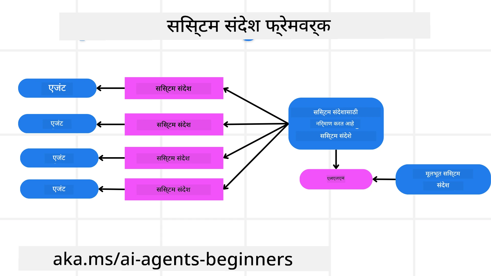
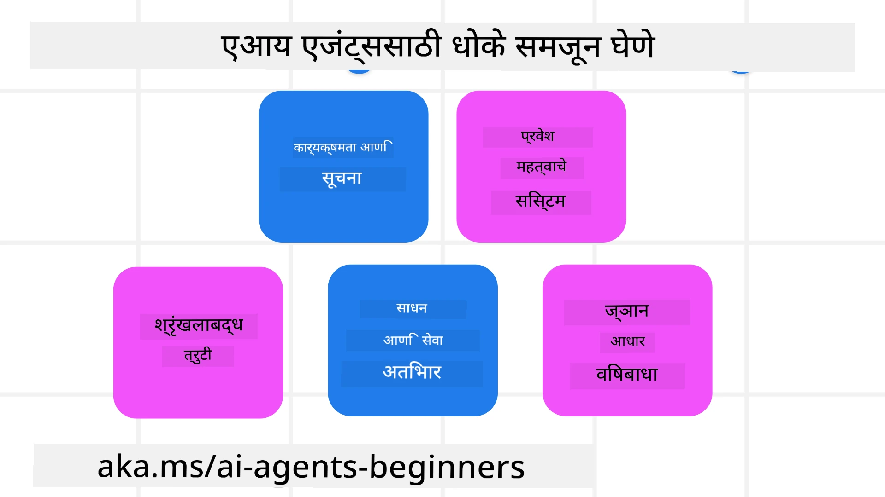
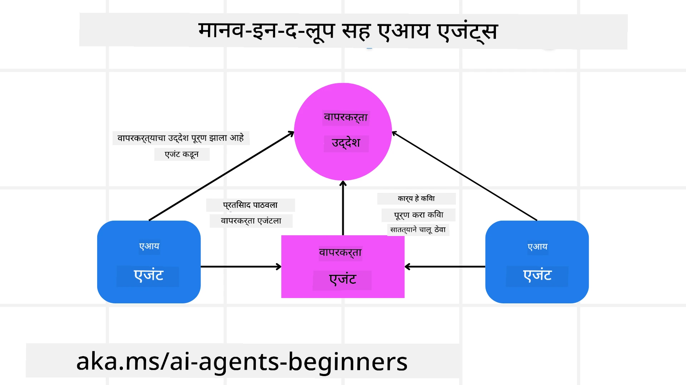

[](https://youtu.be/iZKkMEGBCUQ?si=Q-kEbcyHUMPoHp8L)

> _(या धड्याचा व्हिडिओ पाहण्यासाठी वरच्या प्रतिम्यावर क्लिक करा)_

# विश्वसनीय AI एजंट तयार करणे

## परिचय

हा धडा यावर लक्ष केंद्रित करेल:

- सुरक्षित आणि प्रभावी AI एजंट कसे बनवायचे आणि तैनात करायचे
- AI एजंट विकसित करताना महत्वाच्या सुरक्षा बाबी
- AI एजंट विकसित करताना डेटा आणि वापरकर्त्यांची गोपनीयता कशी कायम ठेवायची

## शिकण्याची उद्दिष्टे

हा धडा पूर्ण केल्यानंतर, आपल्याला खालील गोष्टींचे ज्ञान असेल:

- AI एजंट तयार करताना धोके ओळखणे आणि त्यांचे निवारण करणे.
- डेटा आणि प्रवेश योग्यरित्या व्यवस्थापित होत असल्याचे सुनिश्चित करण्यासाठी सुरक्षा उपाय लागू करणे.
- डेटा गोपनीयता राखत आणि गुणवत्तापूर्ण वापरकर्ता अनुभव देणारे AI एजंट तयार करणे.

## सुरक्षा

आता आपण एजंट-आधारित सुरक्षित अनुप्रयोग तयार करण्याकडे पाहूया. सुरक्षा म्हणजे AI एजंट त्याप्रमाणेच कार्य करतो जे त्यासाठी डिझाइन केले गेले आहे. एजंट-आधारित अनुप्रयोगांचे तयार करणाऱ्यां म्हणून, सुरक्षा जास्तीत जास्त करण्यासाठी आमच्याकडे पद्धती आणि साधने आहेत:

### सिस्टम संदेश फ्रेमवर्क तयार करणे

जर आपण कधीही Large Language Models (LLMs) वापरून AI ऍप्लिकेशन तयार केले असेल, तर आपण समजता की मजबूत सिस्टम प्रॉम्प्ट किंवा सिस्टम संदेश डिझाइन करणे किती महत्त्वाचे आहे. हे प्रॉम्प्ट LLM कसे वापरकर्त्यास आणि डेटाशी संवाद साधतील यासाठी मेटा नियम, सूचना आणि मार्गदर्शक तत्वे स्थापन करतात.

AI एजंटसाठी, सिस्टम प्रॉम्प्ट आणखी महत्त्वाचा आहे कारण AI एजंट्सना आपण डिझाइन केलेल्या कामांना पूर्ण करण्यासाठी अत्यंत विशिष्ट सूचना आवश्यक असतात.

स्केलेबल सिस्टम प्रॉम्प्ट तयार करण्यासाठी, आपण आमच्या अनुप्रयोगात एक किंवा अधिक एजंट तयार करण्यासाठी सिस्टम संदेश फ्रेमवर्क वापरू शकतो:



#### पायरी 1: मेटा सिस्टम संदेश तयार करा 

मेटा प्रॉम्प्टचा वापर LLM द्वारे आपण तयार करणार्‍या एजंटसाठी सिस्टम प्रॉम्प्ट निर्माण करण्यासाठी केला जाईल. आम्ही ते एक टेम्पलेट म्हणून डिझाइन करतो जेणेकरून आवश्यक असल्यास अनेक एजंट प्रभावीपणे तयार करता येतील.

खालील उदाहरण मेटा सिस्टम संदेशाचे आहे जे आम्ही LLM ला देऊ:

```plaintext
You are an expert at creating AI agent assistants. 
You will be provided a company name, role, responsibilities and other
information that you will use to provide a system prompt for.
To create the system prompt, be descriptive as possible and provide a structure that a system using an LLM can better understand the role and responsibilities of the AI assistant. 
```

#### पायरी 2: एक मूलभूत प्रॉम्प्ट तयार करा

पुढील पायरी म्हणजे AI एजंटचे वर्णन करणारा एक मूलभूत प्रॉम्प्ट तयार करणे. यात एजंटची भूमिका, एजंट पूर्ण करणार्‍या कार्यांची यादी आणि एजंटच्या इतर जबाबदाऱ्यांचा समावेश असावा.

खाली एक उदाहरण आहे:

```plaintext
You are a travel agent for Contoso Travel that is great at booking flights for customers. To help customers you can perform the following tasks: lookup available flights, book flights, ask for preferences in seating and times for flights, cancel any previously booked flights and alert customers on any delays or cancellations of flights.  
```

#### पायरी 3: मूलभूत सिस्टम संदेश LLM ला द्या

आता आपण हा सिस्टम संदेश सुधारित करू शकतो — मेटा सिस्टम संदेशाला सिस्टम संदेश म्हणून आणि आमचा मूलभूत सिस्टम संदेश म्हणून पुरवून.

यामुळे असा सिस्टम संदेश तयार होईल जो आमच्या AI एजंट्सना मार्गदर्शन करण्यासाठी चांगल्या प्रकारे डिझाइन केलेला असेल:

```markdown
**Company Name:** Contoso Travel  
**Role:** Travel Agent Assistant

**Objective:**  
You are an AI-powered travel agent assistant for Contoso Travel, specializing in booking flights and providing exceptional customer service. Your main goal is to assist customers in finding, booking, and managing their flights, all while ensuring that their preferences and needs are met efficiently.

**Key Responsibilities:**

1. **Flight Lookup:**
    
    - Assist customers in searching for available flights based on their specified destination, dates, and any other relevant preferences.
    - Provide a list of options, including flight times, airlines, layovers, and pricing.
2. **Flight Booking:**
    
    - Facilitate the booking of flights for customers, ensuring that all details are correctly entered into the system.
    - Confirm bookings and provide customers with their itinerary, including confirmation numbers and any other pertinent information.
3. **Customer Preference Inquiry:**
    
    - Actively ask customers for their preferences regarding seating (e.g., aisle, window, extra legroom) and preferred times for flights (e.g., morning, afternoon, evening).
    - Record these preferences for future reference and tailor suggestions accordingly.
4. **Flight Cancellation:**
    
    - Assist customers in canceling previously booked flights if needed, following company policies and procedures.
    - Notify customers of any necessary refunds or additional steps that may be required for cancellations.
5. **Flight Monitoring:**
    
    - Monitor the status of booked flights and alert customers in real-time about any delays, cancellations, or changes to their flight schedule.
    - Provide updates through preferred communication channels (e.g., email, SMS) as needed.

**Tone and Style:**

- Maintain a friendly, professional, and approachable demeanor in all interactions with customers.
- Ensure that all communication is clear, informative, and tailored to the customer's specific needs and inquiries.

**User Interaction Instructions:**

- Respond to customer queries promptly and accurately.
- Use a conversational style while ensuring professionalism.
- Prioritize customer satisfaction by being attentive, empathetic, and proactive in all assistance provided.

**Additional Notes:**

- Stay updated on any changes to airline policies, travel restrictions, and other relevant information that could impact flight bookings and customer experience.
- Use clear and concise language to explain options and processes, avoiding jargon where possible for better customer understanding.

This AI assistant is designed to streamline the flight booking process for customers of Contoso Travel, ensuring that all their travel needs are met efficiently and effectively.

```

#### पायरी 4: पुनरावृत्ती करा आणि सुधारणा करा

या सिस्टम संदेश फ्रेमवर्कचे मूल्य म्हणजे अनेक एजंटसाठी सिस्टम संदेश तयार करणे स्केल करणे आणि आपल्या सिस्टम संदेशांना कालांतराने सुधारताना सोपे करणे. आपल्या संपूर्ण वापर केससाठी प्रथमच एक कार्यक्षम सिस्टम संदेश मिळणे क्वचितच शक्य असते. मूलभूत सिस्टम संदेश बदलून आणि ते सिस्टममध्ये चालवून छोटे बदल व सुधारणा करून परिणामांची तुलना व मूल्यांकन करणे शक्य होते.

## धोक्यांचे आकलन

विश्वसनीय AI एजंट तयार करण्यासाठी, आपल्या AI एजंटवर असलेल्या धोके व धोक्य यांचे आकलन करून त्यातून बचाव करणे महत्त्वाचे आहे. चला AI एजंट्सवरील काही वेगवेगळ्या धोक्यांकडे आणि त्यांना कसे अधिक चांगल्याप्रकारे नियोजित व तयारी करायची याकडे पाहूया.



### कार्य आणि सूचना

**वर्णन:** हल्लेखोर प्रॉम्प्टिंग किंवा इनपुटमध्ये फेरफार करून AI एजंटच्या सूचना किंवा उद्दिष्टे बदलण्याचा प्रयत्न करतात.

**निवारण**: AI एजंट प्रक्रियेत आणण्यापूर्वी संभाव्य धोकादायक प्रॉम्प्ट्स शोधण्यासाठी मान्यकरण तपासण्या आणि इनपुट फिल्टर्स कार्यान्वित करा. कारण अशा हल्ल्यांना सामान्यतः एजंटसोबत वारंवार संवाद आवश्यक असतो, संभाषणातील टर्नची संख्या मर्यादित करणे हे अशा प्रकारच्या हल्ल्यांना रोखण्याचा आणखी एक मार्ग आहे.

### संवेदनशील सिस्टीम्सवर प्रवेश

**वर्णन**: जर एखाद्या AI एजंटला संवेदनशील डेटा साठवणाऱ्या सिस्टीम्स आणि सेवांवर प्रवेश असेल, तर हल्लेखोर एजंट आणि त्या सेवांमधील संवाद बिघडवू शकतात. हे थेट हल्ले असू शकतात किंवा एजंटमार्फत या सिस्टीम्सबद्दल माहिती मिळवण्याच्या अप्रत्यक्ष प्रयत्नांनाही अंतर्भूत असू शकते.

**निवारण**: अशा प्रकारच्या हल्ल्यांना प्रतिबंध करण्यासाठी AI एजंटला केवळ आवश्यकतेनुसारच सिस्टीम्सवर प्रवेश द्यावा. एजंट आणि सिस्टीममधील संवादही सुरक्षित असावा. प्रमाणीकरण आणि प्रवेश नियंत्रण अंमलात आणणे ही माहिती सुरक्षित ठेवण्याचा आणखी एक मार्ग आहे.

### संसाधने आणि सेवा ओव्हरलोड करणे

**वर्णन:** AI एजंट विविध टूल्स आणि सेवांमध्ये प्रवेश करून कार्य पूर्ण करतात. हल्लेखोर या क्षमतेचा वापर करून AI एजंटमार्फत अनेक विनंत्या पाठवून या सेवांवर हल्ला करू शकतात, ज्यामुळे सिस्टम फेल्युअर किंवा उंच खर्च होऊ शकतो.

**निवारण:** एखाद्या सेवेकडे AI एजंट किती विनंत्या करू शकतो याची संख्या मर्यादित करण्यासाठी धोरणे अंमलात आणा. संभाषणातील टर्न आणि आपल्या AI एजंटकडे जाणाऱ्या विनंत्यांची संख्या मर्यादित करणे हे अशा प्रकारच्या हल्ल्यांना रोखण्याचा आणखी एक मार्ग आहे.

### ज्ञानाधार विषबाधा

**वर्णन:** हा प्रकारचा हल्ला थेट AI एजंटला लक्ष्य करत नाही तर त्या ज्ञानाधाराला आणि इतर सेवांना लक्ष्य करतो ज्याचा AI एजंट वापर करेल. यामध्ये AI एजंट एखादे कार्य पूर्ण करण्यासाठी वापरणार्‍या डेटामध्ये किंवा माहितीमध्ये भ्रष्टता आणणे समाविष्ट असू शकते, ज्यामुळे वापरकर्त्याला पक्षपाती किंवा अनिच्छित प्रतिसाद मिळू शकतात.

**निवारण:** AI एजंट आपल्या वर्कफ्लोमध्ये वापरणार्‍या डेटाची नियमित तपासणी करा. या डेटावर प्रवेश सुरक्षित असल्याचे सुनिश्चित करा आणि हा डेटा फक्त विश्वासार्ह व्यक्तींनी बदलावा जेणेकरून या प्रकारचा हल्ला टाळता येईल.

### साखळीबद्ध त्रुटी

**वर्णन:** AI एजंट कार्य पूर्ण करण्यासाठी विविध टूल्स आणि सेवांमध्ये प्रवेश करतात. हल्लेखोरांमुळे होणाऱ्या त्रुटींमुळे AI एजंट ज्या इतर सिस्टिम्सशी जोडलेला आहे त्या सिस्टिम्सचे अपयश होऊ शकते, ज्यामुळे हल्ला अधिक व्यापक होऊन तपासणे अधिक अवघड होते.

**निवारण**: यास टाळण्याचा एक मार्ग म्हणजे AI एजंटला मर्यादित वातावरणात कार्य करण्यास सांगणे, उदा. Docker कंटेनरमध्ये टास्क चालवणे, जेणेकरून थेट सिस्टम हल्ले टाळता येतील. काही सिस्टीम एरर दाखविल्यास फॉलबॅक मेकॅनिझम आणि रीट्राय लॉजिक तयार करणे हे मोठ्या प्रणाली अपयश टाळण्याचा आणखी एक मार्ग आहे.

## मानवी सहभाग

विश्वसनीय AI एजंट सिस्टम तयार करण्याचा आणखी एक प्रभावी मार्ग म्हणजे मानवी सहभाग वापरणे. यामुळे असा प्रवाह तयार होतो ज्यात वापरकर्ते चालू असताना एजंटला अभिप्राय देऊ शकतात. वापरकर्ते बहु-एजंट सिस्टममध्ये मूलतः एजंट म्हणून कार्य करतात आणि चालू प्रक्रियेची मंजुरी किंवा थांबवणूक देऊन सहभाग घेतात.



खाली Microsoft Agent Framework वापरून हा संकल्पना कशी अमलात आणली जाते हे दाखवणारा कोड स्निपेट आहे:

```python
import os
from agent_framework.azure import AzureAIProjectAgentProvider
from azure.identity import AzureCliCredential

# मानवी मध्यस्थतेतील मंजुरीसह प्रदाता तयार करा
provider = AzureAIProjectAgentProvider(
    credential=AzureCliCredential(),
)

# मानवी मंजुरीच्या टप्प्यासह एजंट तयार करा
response = provider.create_response(
    input="Write a 4-line poem about the ocean.",
    instructions="You are a helpful assistant. Ask for user approval before finalizing.",
)

# वापरकर्ता प्रतिसाद पुनरावलोकन करून मंजूर करू शकतो
print(response.output_text)
user_input = input("Do you approve? (APPROVE/REJECT): ")
if user_input == "APPROVE":
    print("Response approved.")
else:
    print("Response rejected. Revising...")
```

## निष्कर्ष

विश्वसनीय AI एजंट तयार करण्यासाठी बारकाईने डिझाइन, मजबूत सुरक्षा उपाय आणि सततचे पुनरावृत्ती आवश्यक आहे. संरचित मेटा प्रॉम्प्टिंग सिस्टम्स अंमलात आणून, संभाव्य धोक्यांचा आकलन करून आणि निवारण धोरणे लागू करून, विकसक सुरक्षित आणि प्रभावी AI एजंट तयार करू शकतात. याव्यतिरिक्त, मानवी सहभागाचा दृष्टिकोन समाविष्ट केल्याने AI एजंट वापरकर्त्यांच्या गरजांसोबत सुसंगत राहतात आणि जोखमी कमी होतात. जसे AI विकसित होत राहते, तसतशी सुरक्षा, गोपनीयता आणि नैतिक विचारांवर पुढाकार घेणे AI-चालित सिस्टममध्ये विश्वास आणि विश्वासार्हता वाढवण्यासाठी महत्त्वाचे ठरेल.

### विश्वसनीय AI एजंट तयार करण्याबद्दल अधिक प्रश्न आहेत?

इतर शिकणाऱ्यांशी भेटण्यासाठी, ऑफिस ऑवर्सला हजर राहण्यासाठी आणि आपल्या AI एजंट्सचे प्रश्नांची उत्तरे मिळवण्यासाठी [Microsoft Foundry Discord](https://aka.ms/ai-agents/discord) मध्ये सहभागी व्हा.

## अतिरिक्त स्रोत

- <a href="https://learn.microsoft.com/azure/ai-studio/responsible-use-of-ai-overview" target="_blank">जबाबदार AI आढावा</a>
- <a href="https://learn.microsoft.com/azure/ai-studio/concepts/evaluation-approach-gen-ai" target="_blank">जनरेटिव्ह AI मॉडेल्स आणि AI अनुप्रयोगांचे मूल्यांकन</a>
- <a href="https://learn.microsoft.com/azure/ai-services/openai/concepts/system-message?context=%2Fazure%2Fai-studio%2Fcontext%2Fcontext&tabs=top-techniques" target="_blank">सुरक्षा सिस्टम संदेश</a>
- <a href="https://blogs.microsoft.com/wp-content/uploads/prod/sites/5/2022/06/Microsoft-RAI-Impact-Assessment-Template.pdf?culture=en-us&country=us" target="_blank">जोखीम मूल्यांकन टेम्पलेट</a>

## मागील धडा

[Agentic RAG](../05-agentic-rag/README.md)

## पुढील धडा

[Planning Design Pattern](../07-planning-design/README.md)

---

<!-- CO-OP TRANSLATOR DISCLAIMER START -->
**अस्वीकरण**:
हा दस्तऐवज AI भाषांतर सेवा [Co-op Translator](https://github.com/Azure/co-op-translator) वापरून भाषांतरित केला गेला आहे. आम्ही अचूकतेसाठी प्रयत्नशील असलो तरी, कृपया लक्षात ठेवा की स्वयंचलित भाषांतरात चुका किंवा अचूकतेचा अभाव असू शकतो. मूळ दस्तऐवज त्याच्या मूळ भाषेत असलेली आवृत्ती अधिकृत स्रोत म्हणून मानली जावी. महत्त्वाच्या माहितीसाठी व्यावसायिक मानवी भाषांतर करण्याची शिफारस केली जाते. या भाषांतराच्या वापरामुळे उद्भवणाऱ्या कोणत्याही गैरसमजांबद्दल किंवा चुकीच्या अर्थसमजाबद्दल आम्ही जबाबदार नाही.
<!-- CO-OP TRANSLATOR DISCLAIMER END -->