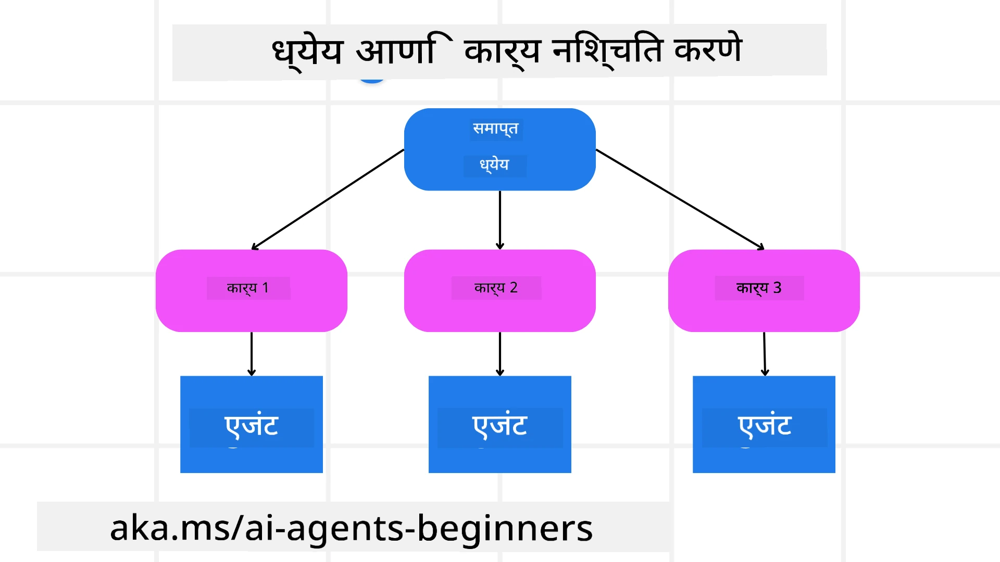

[](https://youtu.be/kPfJ2BrBCMY?si=9pYpPXp0sSbK91Dr)

> _(वरील प्रतिमा क्लिक करून या धड्याचा व्हिडिओ पहा)_

# नियोजन डिझाइन

## परिचय

या धड्यात खालील गोष्टी समाविष्ट असतील

* एक स्पष्ट एकूण उद्दिष्ट निश्चित करणे आणि एका क्लिष्ट कार्याचे व्यवस्थापनीय उपकार्यांत विभाजन करणे.
* अधिक विश्वासार्ह आणि मशीन-पठनीय प्रतिसादांसाठी संरचित आउटपुटचा उपयोग करणे.
* डायनॅमिक कार्ये आणि अनपेक्षित इनपुट हाताळण्यासाठी इव्हेंट-ड्रिव्हन पद्धती लागू करणे.

## शिकण्याचे उद्दिष्टे

हा धडा पूर्ण झाल्यावर, तुम्हाला खालील बाबी समजतील:

* AI एजंटसाठी एकूण उद्दिष्ट ओळखणे आणि सेट करणे, ज्यामुळे ते काय साध्य करायचे आहे हे स्पष्टपणे कळते.
* एका क्लिष्ट कार्याचे छोटे, उद्दिष्टाभिमुख उपकार्यांत विभाजन करणे आणि त्यांना तार्किक क्रमाने आयोजित करणे.
* एजंट्सना योग्य साधने (उदा., शोध साधने किंवा डेटा ऍनॅलिटिक्स साधने) देणे, त्यांचा वापर कधी आणि कसा करायचा हे ठरवणे, आणि अनपेक्षित परिस्थिती हाताळणे.
* उपकार्यांचे परिणाम मूल्यांकन करणे, कामगिरी मोजणे, आणि अंतिम आउटपुट सुधारण्यासाठी क्रिया पुनरावृत्ती करणे.

## एकूण उद्दिष्ट निश्चित करणे आणि कार्य विघटन करणे



बहुसंख्य वास्तविक जगातील कार्ये एका पाऊलांत हाताळता येण्याइतकी सोपी नसतात. AI एजंटला त्याच्या नियोजन आणि क्रियांसाठी मार्गदर्शन करणारे संक्षिप्त उद्दिष्ट आवश्यक आहे. उदाहरणार्थ, खालील उद्दिष्ट विचारात घ्या:

    "3 दिवसांचे प्रवास वेळापत्रक तयार करा."

जरी ते साध्या शब्दात सांगता येते, तरी त्याला अधिक तपशीलाची गरज असते. उद्दिष्ट जितके स्पष्ट असेल, तितक्या चांगल्या प्रकारे एजंट (आणि कोणतेही मानव सहयोगी) योग्य परिणामावर लक्ष केंद्रित करू शकतील, जसे की फ्लाइट पर्याय, हॉटेल शिफारसी आणि क्रियाकलाप सूचना असलेले सविस्तर प्रवास वेळापत्रक तयार करणे.

### कार्याचे विघटन

मोठी किंवा गुंतागुंतीची कामे लहान, उद्दिष्टाभिमुख उपकार्यांत विभाजित केल्याने ते व्यवस्थापनीय बनतात.
प्रवास वेळापत्रकाच्या उदाहरणासाठी, तुम्ही उद्दिष्ट खालील उपकार्यांत विभाजित करू शकता:

* फ्लाइट आरक्षण
* हॉटेल आरक्षण
* कार भाड्याने घेणे
* वैयक्तिकरण

प्रत्येक उपकार्य नंतर समर्पित एजंट्स किंवा प्रक्रियांद्वारे हाताळले जाऊ शकते. एक एजंट सर्वोत्तम फ्लाइट डील शोधण्यात तज्ज्ञ असू शकतो, दुसरा हॉटेल आरक्षणांवर लक्ष केंद्रीत करू शकतो, आणि तसेच पुढे. समन्वय करणारा किंवा “डाउनस्ट्रीम” एजंट नंतर या परिणामांना एकत्र करून वापरकर्त्यास एक सुसंगत प्रवास वेळापत्रक सादर करू शकतो.

ही मॉड्युलर पद्धत हळूहळू सुधारणा करण्यासही परवानगी देते. उदाहरणार्थ, तुम्ही फूड शिफारसी किंवा स्थानिक क्रियाकलाप सूचना यांसाठी विशेष एजंट्स जोडू शकता आणि वेळोवेळी वेळापत्रक सुधारू शकता.

### संरचित आउटपुट

Large Language Models (LLMs) संरचित आउटपुट (उदा., JSON) तयार करू शकतात जे डाउनस्ट्रीम एजंट्स किंवा सेवांसाठी पार्स आणि प्रोसेस करणे सोपे असते. हे बहु-एजंट संदर्भात विशेषतः उपयुक्त आहे, जिथे नियोजन आउटपुट मिळाल्यानंतर आपण या कार्यांवर क्रिया करू शकतो.

खालील Python स्निपेट एक साधा नियोजन एजंट दाखवते जो उद्दिष्ट उपकार्यांत विघटन करतो आणि संरचित योजना तयार करतो:

```python
from pydantic import BaseModel
from enum import Enum
from typing import List, Optional, Union
import json
import os
from typing import Optional
from pprint import pprint
from agent_framework.azure import AzureAIProjectAgentProvider
from azure.identity import AzureCliCredential

class AgentEnum(str, Enum):
    FlightBooking = "flight_booking"
    HotelBooking = "hotel_booking"
    CarRental = "car_rental"
    ActivitiesBooking = "activities_booking"
    DestinationInfo = "destination_info"
    DefaultAgent = "default_agent"
    GroupChatManager = "group_chat_manager"

# प्रवास उपकार्य मॉडेल
class TravelSubTask(BaseModel):
    task_details: str
    assigned_agent: AgentEnum  # आम्हाला हे काम एजंटला सोपवायचे आहे

class TravelPlan(BaseModel):
    main_task: str
    subtasks: List[TravelSubTask]
    is_greeting: bool

provider = AzureAIProjectAgentProvider(credential=AzureCliCredential())

# वापरकर्त्याचा संदेश परिभाषित करा
system_prompt = """You are a planner agent.
    Your job is to decide which agents to run based on the user's request.
    Provide your response in JSON format with the following structure:
{'main_task': 'Plan a family trip from Singapore to Melbourne.',
 'subtasks': [{'assigned_agent': 'flight_booking',
               'task_details': 'Book round-trip flights from Singapore to '
                               'Melbourne.'}
    Below are the available agents specialised in different tasks:
    - FlightBooking: For booking flights and providing flight information
    - HotelBooking: For booking hotels and providing hotel information
    - CarRental: For booking cars and providing car rental information
    - ActivitiesBooking: For booking activities and providing activity information
    - DestinationInfo: For providing information about destinations
    - DefaultAgent: For handling general requests"""

user_message = "Create a travel plan for a family of 2 kids from Singapore to Melbourne"

response = client.create_response(input=user_message, instructions=system_prompt)

response_content = response.output_text
pprint(json.loads(response_content))
```

### मल्टी-एजंट समन्वयासह नियोजन एजंट

या उदाहरणात, Semantic Router Agent वापरकर्त्याचा विनंती (उदा., "मला माझ्या ट्रिपसाठी हॉटेल योजना हवी आहे.") प्राप्त करतो.

प्लॅनर नंतर:

* हॉटेल योजना प्राप्त करतो: प्लॅनर वापरकर्त्याचा संदेश घेतो आणि सिस्टम प्रॉम्प्टवर (उपलब्ध एजंट तपशीलांसह) आधारित, एक संरचित प्रवास योजना तयार करतो.
* एजंट्स आणि त्यांच्या साधनांची यादी करतो: एजंट नोंदणीमध्ये एजंट्सची यादी (उदा., फ्लाइट, हॉटेल, कार भाड्याने घेणे, आणि क्रियाकलापांसाठी) आणि ते कोणत्या फंक्शन्स किंवा साधने ऑफर करतात हे असते.
* योजनाला संबंधित एजंटांकडे मार्गदर्शन करतो: उपकार्यांच्या संख्येनुसार, प्लॅनर संदेश थेट समर्पित एजंटला पाठवू शकतो (एकल-कार्य परिस्थितीसाठी) किंवा बहु-एजंट सहयोगासाठी ग्रुप चॅट मॅनेजरद्वारे समन्वय करू शकतो.
* परिणामांचा सारांश करतो: शेवटी, प्लॅनर निर्मित केलेल्या योजनाचा स्पष्टतेसाठी सारांश देतो.
खालील Python कोड उद्धरण हे पायऱ्या दाखवते:

```python

from pydantic import BaseModel

from enum import Enum
from typing import List, Optional, Union

class AgentEnum(str, Enum):
    FlightBooking = "flight_booking"
    HotelBooking = "hotel_booking"
    CarRental = "car_rental"
    ActivitiesBooking = "activities_booking"
    DestinationInfo = "destination_info"
    DefaultAgent = "default_agent"
    GroupChatManager = "group_chat_manager"

# प्रवास उप-कार्य मॉडेल

class TravelSubTask(BaseModel):
    task_details: str
    assigned_agent: AgentEnum # आम्हाला हे कार्य एजंटला नियुक्त करायचे आहे

class TravelPlan(BaseModel):
    main_task: str
    subtasks: List[TravelSubTask]
    is_greeting: bool
import json
import os
from typing import Optional

from agent_framework.azure import AzureAIProjectAgentProvider
from azure.identity import AzureCliCredential

# क्लायंट तयार करा

provider = AzureAIProjectAgentProvider(credential=AzureCliCredential())

from pprint import pprint

# वापरकर्त्याचा संदेश परिभाषित करा

system_prompt = """You are a planner agent.
    Your job is to decide which agents to run based on the user's request.
    Below are the available agents specialized in different tasks:
    - FlightBooking: For booking flights and providing flight information
    - HotelBooking: For booking hotels and providing hotel information
    - CarRental: For booking cars and providing car rental information
    - ActivitiesBooking: For booking activities and providing activity information
    - DestinationInfo: For providing information about destinations
    - DefaultAgent: For handling general requests"""

user_message = "Create a travel plan for a family of 2 kids from Singapore to Melbourne"

response = client.create_response(input=user_message, instructions=system_prompt)

response_content = response.output_text

# JSON म्हणून लोड केल्यानंतर प्रतिसादाची सामग्री मुद्रित करा

pprint(json.loads(response_content))
```

खालील आउटपुट मागील कोडमधून आहे आणि तुम्ही हा संरचित आउटपुट वापरून `assigned_agent` कडे मार्गदर्शन करू शकता आणि अंतिम वापरकर्त्यास प्रवास योजना सारांशित करू शकता.

```json
{
    "is_greeting": "False",
    "main_task": "Plan a family trip from Singapore to Melbourne.",
    "subtasks": [
        {
            "assigned_agent": "flight_booking",
            "task_details": "Book round-trip flights from Singapore to Melbourne."
        },
        {
            "assigned_agent": "hotel_booking",
            "task_details": "Find family-friendly hotels in Melbourne."
        },
        {
            "assigned_agent": "car_rental",
            "task_details": "Arrange a car rental suitable for a family of four in Melbourne."
        },
        {
            "assigned_agent": "activities_booking",
            "task_details": "List family-friendly activities in Melbourne."
        },
        {
            "assigned_agent": "destination_info",
            "task_details": "Provide information about Melbourne as a travel destination."
        }
    ]
}
```

मागील कोड नमुना असलेले एक उदाहरण नोटबुक [इथे](07-python-agent-framework.ipynb) उपलब्ध आहे.

### पुनरावृत्ती नियोजन

काही कार्यांना परत-फिरून किंवा पुन्हा नियोजनाची गरज असते, जिथे एका उपकार्याचा परिणाम पुढील उपकार्यावर प्रभाव टाकतो. उदाहरणार्थ, जर एजंट फ्लाइट बुक करताना अनपेक्षित डेटा स्वरूप शोधतो, तर त्याने हॉटेल आरक्षणांवर जाण्यापूर्वी आपली रणनीती समायोजित करावी लागू शकते.

या व्यतिरिक्त, वापरकर्त्याचे अभिप्राय (उदा., एखाद्या मानवाने ते आधीची फ्लाइट पसंत केली असल्याचे ठरवणे) आंशिक पुनर्नियोजन सुरु करू शकतात. ही डायनॅमिक, आवर्ती पद्धत अंतिम सोल्युशन वास्तविक मर्यादा आणि विकसित वापरकर्ता प्राधान्यांशी जुळवून घेत असल्याची खात्री करते.

उदा. नमुना कोड

```python
from agent_framework.azure import AzureAIProjectAgentProvider
from azure.identity import AzureCliCredential
#.. मागील कोडप्रमाणेच आणि वापरकर्त्याचा इतिहास व सध्याची योजना पुढे पाठवा

system_prompt = """You are a planner agent to optimize the
    Your job is to decide which agents to run based on the user's request.
    Below are the available agents specialized in different tasks:
    - FlightBooking: For booking flights and providing flight information
    - HotelBooking: For booking hotels and providing hotel information
    - CarRental: For booking cars and providing car rental information
    - ActivitiesBooking: For booking activities and providing activity information
    - DestinationInfo: For providing information about destinations
    - DefaultAgent: For handling general requests"""

user_message = "Create a travel plan for a family of 2 kids from Singapore to Melbourne"

response = client.create_response(
    input=user_message,
    instructions=system_prompt,
    context=f"Previous travel plan - {TravelPlan}",
)
# .. पुन्हा नियोजन करा आणि कार्ये संबंधित एजंटांना पाठवा
```

अधिक सर्वसमावेशक नियोजनासाठी Magnetic One चे <a href="https://www.microsoft.com/research/articles/magentic-one-a-generalist-multi-agent-system-for-solving-complex-tasks" target="_blank">ब्लॉगपोस्ट</a> पहा ज्यात क्लिष्ट कार्ये सोडवण्याबद्दल माहिती दिली आहे.

## सारांश

या लेखात आपण कसा एक प्लॅनर तयार करू शकतो जो गतिशीलपणे उपलब्ध एजंट्स निवडू शकतो हे पाहिले. प्लॅनरचे आउटपुट कार्यांचे विघटन करते आणि एजंट्सना कार्ये असाइन करते जेणेकरून ती अंमलात आणली जाऊ शकतात. येथे असे गृहीत धरले आहे की एजंट्स कडे कार्य पार पाडण्यासाठी आवश्यक फंक्शन्स/साधने उपलब्ध आहेत. एजंट्सव्यतिरिक्त तुम्ही प्रतिबिंब (reflection), सारांशकार (summarizer), आणि राऊंड-रॉबिन चॅट सारख्या पॅटर्न्स देखील समाविष्ट करून आणखी सानुकूल करू शकता.

## अतिरिक्त संसाधने

Magentic One - A Generalist multi-agent system for solving complex tasks आणि त्याने अनेक आव्हानात्मक एजंटिक बेंचमार्कवर प्रभावी निकाल साधले आहेत. संदर्भ: <a href="https://www.microsoft.com/research/articles/magentic-one-a-generalist-multi-agent-system-for-solving-complex-tasks" target="_blank">Magentic One</a>. या अंमलबजावणीत ऑर्केस्ट्रेटर कार्य-विशिष्ट योजना तयार करतो आणि उपलब्ध एजंट्सना हे कार्य सोपवून देतो. नियोजनाबरोबरच ऑर्केस्ट्रेटर कार्याची प्रगती ट्रॅक करण्यासाठी आणि आवश्यकतेनुसार पुनर्नियोजन करण्यासाठी एक ट्रॅकिंग यंत्रणा देखील वापरतो.

### नियोजन डिझाइन पॅटर्नबद्दल अधिक प्रश्न आहेत का?

इतर शिकणाऱ्यांशी भेटण्यासाठी, ऑफिस तासांत सहभागी होण्यासाठी आणि तुमच्या AI एजंट्स संबंधी प्रश्नांची उत्तरे मिळवण्यासाठी [Microsoft Foundry Discord](https://aka.ms/ai-agents/discord) मध्ये सामील व्हा.

## मागील धडा

[विश्वसनीय AI एजंट्स तयार करणे](../06-building-trustworthy-agents/README.md)

## पुढील धडा

[मल्टी-एजंट डिझाइन पॅटर्न](../08-multi-agent/README.md)

---

<!-- CO-OP TRANSLATOR DISCLAIMER START -->
अस्वीकरण:
हा दस्तऐवज AI अनुवाद सेवा Co‑op Translator (https://github.com/Azure/co-op-translator) वापरून अनुवादित केला आहे. आम्ही अचूकतेसाठी प्रयत्न करतो, परंतु कृपया लक्षात घ्या की स्वयंचलित अनुवादांमध्ये चुका किंवा अचूकतेच्या त्रुटी असू शकतात. मूळ दस्तऐवज त्याच्या मूळ भाषेत अधिकृत स्रोत म्हणून मानले जावे. महत्वाच्या माहितीकरिता व्यावसायिक मानवी अनुवादाची शिफारस केली जाते. या अनुवादाच्या वापरामुळे उद्भवणाऱ्या कोणत्याही गैरसमजुतींसाठी किंवा चुकीच्या अर्थ लावल्याबद्दल आम्ही जबाबदार नाही.
<!-- CO-OP TRANSLATOR DISCLAIMER END -->