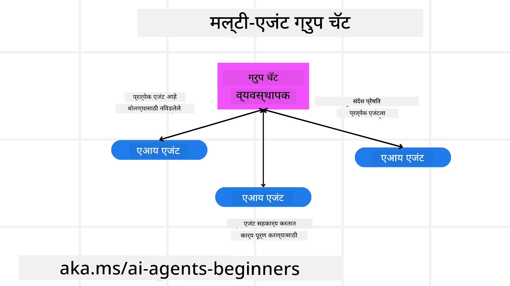
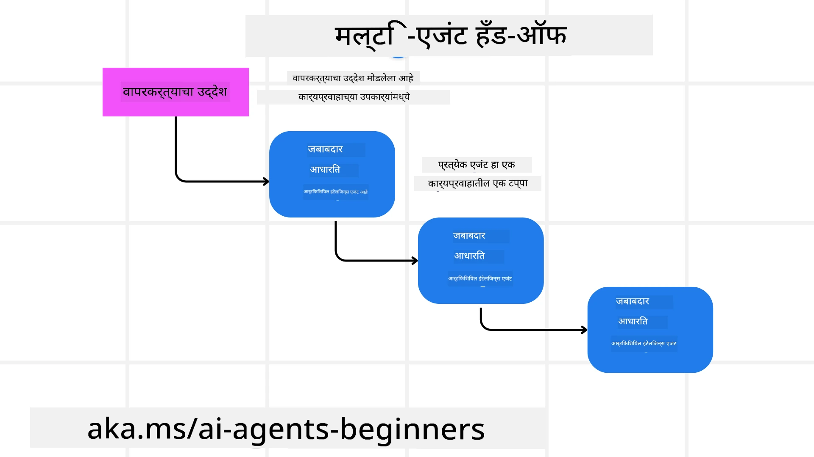
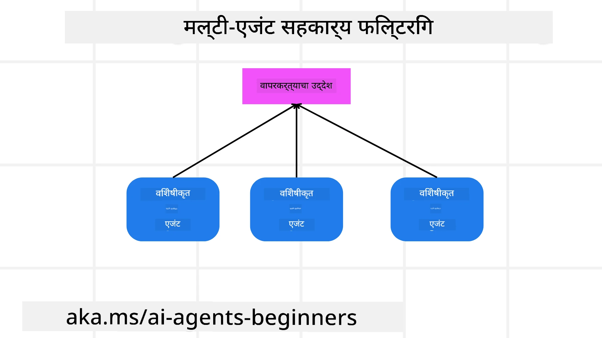

> _(वरील प्रतिमा क्लिक करा आणि या धड्याचा व्हिडिओ पहा)_

# बहु-एजंट डिझाइन पॅटर्न

जशीच आपण अनेक एजंट्स असलेल्या प्रकल्पावर काम सुरू करतो, तशीच आपल्याला बहु-एजंट डिझाइन पॅटर्नचा विचार करावा लागतो. तथापि, कधी बहु-एजंटकडे स्विच करायचे आणि त्याचे फायदे काय आहेत हे ताबडतोब स्पष्ट होणार नाही.

## परिचय

या धड्यात आपण पुढील प्रश्नांची उत्तरे शोधण्याचा प्रयत्न करीत आहोत:

- कोणत्या परिस्थितींमध्ये बहु-एजंट लागू करता येतात?
- एकल एजंट अनेक कार्ये करत असताना बहु-एजंट वापरण्याचे काय फायदे आहेत?
- बहु-एजंट डिझाइन पॅटर्न अंमलात आणण्यासाठी कोणती-बांधकाम घटक आवश्यक आहेत?
- अनेक एजंट एकमेकांशी कसे परस्परसंवाद करतात हे आपल्याला कसे दिसेल?

## शिक्षण उद्दिष्टे

या धड्यानंतर, आपल्याला खालील गोष्टी करण्यास सक्षम असले पाहिजेत:

- कोणत्या परिस्थितींमध्ये बहु-एजंट लागू होते हे ओळखणे
- एकल एजंटच्या तुलनेत बहु-एजंट वापरण्याचे फायदे ओळखणे
- बहु-एजंट डिझाइन पॅटर्न अंमलात आणण्याच्या बांधकाम घटकांचे आकलन करणे

मोठ्या चित्राकडे काय पाहावे?

*बहु-एजंट हा एक डिझाइन पॅटर्न आहे ज्यामुळे अनेक एजंट्स एकत्र काम करून एक सामान्य उद्दिष्ट साध्य करू शकतात*.

हा पॅटर्न रोबोटिक्स, स्वयंचलित प्रणाली आणि वितरीत संगणनासह विविध क्षेत्रांमध्ये विस्तृतपणे वापरला जातो.

## ज्या परिस्थितींमध्ये बहु-एजंट लागू होतात

तर कोणत्या परिस्थिती बहु-एजंट वापरण्याचे उत्तम उदाहरण आहेत? उत्तर असे आहे की अनेक परिस्थिती आहेत जिथे अनेक एजंट वापरणे फायदेशीर असते, विशेषतः खालील बाबतीत:

- **मोठे कार्यभार**: मोठे कार्यभार लहान कार्यांमध्ये विभागले जाऊ शकतात आणि वेगवेगळ्या एजंट्सना नियुक्त केले जाऊ शकतात, ज्यामुळे समांतर प्रक्रिया आणि वेगवान पूर्णता मिळते. याचे एक उदाहरण म्हणजे मोठ्या प्रमाणावर डेटा प्रक्रियेचा कार्य.
- **संकुल कार्ये**: संकुल कार्यांचेही लहान उपकार्यांमध्ये विभाजन केले जाऊ शकते आणि वेगळ्या एजंट्सना नियुक्त केले जाऊ शकते, जे प्रत्येक एका विशिष्ट पैलूमध्ये तज्ज्ञ असतात. याचे एक चांगले उदाहरण स्वयंचलित वाहनांच्या बाबतीत आहे जिथे वेगवेगळे एजंट मार्गदर्शन, अडथळा शोध आणि इतर वाहनांशी संवाद व्यवस्थापित करतात.
- **विविध तज्ज्ञता**: वेगवेगळ्या एजंट्सकडे विविध तज्ज्ञता असू शकते, ज्यामुळे ते एका कार्याच्या विविध पैलूंना एकल एजंटपेक्षा अधिक प्रभावीपणे हाताळू शकतात. या बाबतीत आरोग्यसेवा ही एक चांगली उदाहरणे आहे जिथे एजंट्स डायग्नोसिस, उपचार योजना आणि रुग्ण निरीक्षण यांचे व्यवस्थापन करू शकतात.

## एकल एजंटच्या तुलनेत बहु-एजंट वापरण्याचे फायदे

साध्या कार्यांसाठी एकल एजंट प्रणाली चांगली काम करू शकते, परंतु अधिक जटिल कार्यांसाठी अनेक एजंट्स वापरल्याने अनेक फायदे मिळू शकतात:

- **विशेषीकरण**: प्रत्येक एजंट विशिष्ट कार्यात तज्ज्ञ असू शकतो. एकल एजंटमध्ये विशेषीकरणाचा अभाव असल्यास, आपल्याकडे सर्व काही करू शकणारा एजंट असतो परंतु जटिल कार्यांसमोर काय करायचे हे गोंधळू शकतो. उदाहरणार्थ, तो असे कार्य करेल जे त्याला सर्वोत्तम प्रकारे सुटत नाही.
- **स्केलेबिलिटी**: एखाद्या सिस्टीमला वाढवायचे असल्यास एकल एजंटवर भार टाकण्याऐवजी अधिक एजंट्स जोडणे सोपे असते.
- **दोष सहनशीलता**: जर एका एजंटने काम थांबवल्यास, इतर एजंट्स कार्यरत राहू शकतात, ज्यामुळे प्रणालीची विश्वासार्हता सुनिश्चित होते.

उदाहरण म्हणून समजा, आपण वापरकर्त्यासाठी प्रवास बुक करणार आहोत. एकल एजंट प्रणालीला प्रवासाच्या बुकिंग प्रक्रियेचे सर्व पैलू हाताळावे लागतील, उदा. फ्लाइट शोधणे, हॉटेल आणि रेंटल कार बुक करणे. हे एकल एजंटने साध्य करायचे असल्यास, त्या एजंटकडे हे सर्व कार्ये हाताळण्यासाठी साधने असावी लागतील. यामुळे एक जटिल आणि मोनोलिथिक प्रणाली तयार होऊ शकते जी देखभाल आणि स्केल करणे कठीण असते. दुसरीकडे, बहु-एजंट प्रणालीमध्ये वेगवेगळे एजंट्स फ्लाइट शोधणे, हॉटेल बुक करणे आणि रेंटल कार बुक करणे यांसाठी विशेषीकृत असू शकतात. यामुळे प्रणाली अधिक मॉड्युलर, देखभालयोग्य आणि स्केलेबल होते.

हे तुलना करा एका छोट्या कुटुंबाच्या प्रवासी कार्यालयाशी (mom-and-pop store) versus फ्रँचायझी चालवणाऱ्या प्रवासी कार्यालयाशी. घरगुती दुकानात एकल एजंट प्रवास बुकिंग प्रक्रियेचे सर्व पैलू हाताळेल, तर फ्रँचायझीत वेगवेगळे एजंट्स विविध पैलू हाताळतील.

## बहु-एजंट डिझाइन पॅटर्नची बांधकाम घटक

बहु-एजंट डिझाइन पॅटर्न अंमलात आणण्यापूर्वी, आपल्याला या पॅटर्नचे बनवणारे घटक समजून घ्यावे लागतील.

पुन्हा एकदा वापरकर्त्यासाठी प्रवास बुक करण्याच्या उदाहरणाकडे पाहून हे अधिक ठोस करूया. या प्रकरणात, बांधकाम घटकांमध्ये समाविष्ट असतील:

- **एजंट संवाद**: फ्लाइट शोधणारे, हॉटेल बुक करणारे आणि रेंटल कार्स बुक करणारे एजंट्स वापरकर्त्याच्या प्राधान्ये आणि निर्बंधांबद्दल माहिती वाटून घेण्यासाठी आणि सामायिक करण्यासाठी संवाद साधणे आवश्यक आहे. आपण या संवादासाठी प्रोटोकॉल आणि पद्धती ठरवाव्या लागतील. याचा अर्थ ठोसपणे असा आहे की फ्लाइट शोधणारा एजंट हॉटेल बुक करणाऱ्या एजंटशी संवाद साधेल जेणेकरून हॉटेल फ्लाइटच्या त्याच तारखांसाठी बुक होईल. म्हणजे एजंट्सना वापरकर्त्याच्या प्रवासाच्या तारखांबद्दल माहिती शेअर करावी लागेल, म्हणजे आपल्याला ठरवावे लागेल *कोणते एजंट माहिती शेअर करत आहेत आणि ते कशी शेअर करत आहेत*.
- **समन्वय यंत्रणा**: एजंट्सना त्यांच्या क्रिया समन्वयित कराव्या लागतात जेणेकरून वापरकर्त्याच्या प्राधान्ये आणि निर्बंध पूर्ण होतील. उदाहरणार्थ, वापरकर्त्याची प्राधान्ये अशी असू शकतात की ते एअरपोर्टजवळचे हॉटेल हवे आहेत तर निर्बंध असा असू शकतो की रेंटल कार्स फक्त एअरपोर्टवर उपलब्ध आहेत. याचा अर्थ हॉटेल बुक करणारा एजंट रेंटल कार बुक करणाऱ्या एजंटशी समन्वय साधेल. म्हणजे आपल्याला ठरवावे लागेल *एजंट्स त्यांच्या क्रिया कशा समन्वयित करणार आहेत*.
- **एजंट आर्किटेक्चर**: एजंट्सना निर्णय घेण्यासाठी आणि वापरकर्त्याशीच्या परस्परसंवादातून शिकण्यासाठी अंतर्गत रचना असणे आवश्यक आहे. याचा अर्थ फ्लाइट शोधणाऱ्या एजंटकडे कोणत्या फ्लाइट्स शिफारस कराव्यात यावर निर्णय घेण्यासाठी अंतर्गत रचना असावी लागेल. याचा अर्थ आपल्याला ठरवावे लागेल *एजंट्स कसे निर्णय घेत आहेत आणि वापरकर्त्याशीच्या परस्परसंवादातून कसे शिकत आहेत*. उदाहरणार्थ, फ्लाइट शोधणारा एजंट मशीन लर्निंग मॉडेलचा वापर करून वापरकर्त्याच्या भूतकाळी प्राधान्यांवर आधारित फ्लाइट्स शिफारस करू शकतो.
- **बहु-एजंट परस्परसंवादांवरील दृश्यमानता**: अनेक एजंट्स एकमेकांशी कसे परस्परसंवाद करतात हे आपल्याला दिसेल असावे. यासाठी एजंट क्रिया आणि परस्परसंवाद ट्रॅक करण्यासाठी साधने आणि तंत्रे असणे आवश्यक आहे. हे लॉगिंग आणि मॉनिटरिंग साधने, व्हिज्युअलायझेशन साधने आणि कार्यक्षमता मेट्रिक्सच्या रूपात असू शकते.
- **बहु-एजंट पॅटर्न**: बहु-एजंट सिस्टीम अंमलात आणण्यासाठी वेगवेगळे पॅटर्न आहेत, जसे की केंद्रीकृत, विकेंद्रित आणि हायब्रिड आर्किटेक्चर. आपल्याला आपल्या वापरप्रकरणासाठी योग्य पॅटर्न ठरवावा लागेल.
- **मानव सहभागी**: बहुतेक प्रकरणांमध्ये, आपण एका मानवी सहभागासह असता आणि एजंट्सना कधी मानवी हस्तक्षेप विचारायचा हे निर्देश द्यावे लागते. हे वापरकर्त्याने विशिष्ट हॉटेल किंवा फ्लाइट विचारणे असू शकते जे एजंट्सने शिफारस केलेले नसतील किंवा बुक करण्यापूर्वी पुष्टी विचारणे असू शकते.

## बहु-एजंट परस्परसंवादांमध्ये दृश्यमानता

आपल्याला अनेक एजंट्स एकमेकांशी कसे परस्परसंवाद करतात हे दिसणे महत्वाचे आहे. हे दृश्यमानता डीबगिंग, ऑप्टिमायझेशन आणि संपूर्ण प्रणालीच्या कार्यक्षमतेसाठी अनिवार्य आहे. हे साध्य करण्यासाठी, आपल्याकडे एजंट क्रिया आणि परस्परसंवाद ट्रॅक करण्यासाठी साधने आणि तंत्रे असणे आवश्यक आहे. हे लॉगिंग आणि मॉनिटरिंग साधने, व्हिज्युअलायझेशन साधने आणि कार्यक्षमता मेट्रिक्सच्या रूपात असू शकते.

उदाहरणार्थ, वापरकर्त्यासाठी प्रवास बुक करण्याच्या प्रकरणात, आपल्याकडे डॅशबोर्ड असू शकतो जो प्रत्येक एजंटची स्थिती, वापरकर्त्याची प्राधान्ये आणि निर्बंध, आणि एजंट्समधील परस्परसंवाद दर्शवितो. या डॅशबोर्डवर वापरकर्त्याच्या प्रवासाच्या तारखा, फ्लाइट एजंटने शिफारस केलेल्या फ्लाइट्स, हॉटेल एजंटने शिफारस केलेली हॉटेल्स आणि रेंटल कार एजंटने शिफारस केलेल्या रेंटल कार्स दिसू शकतात. यामुळे आपल्याला एजंट्स कसे परस्परसंवाद करतात आणि वापरकर्त्याच्या प्राधान्ये व निर्बंध पूर्ण होत आहेत का हे स्पष्टपणे दिसेल.

चला या पैलूंना अधिक तपशीलात पाहूया.

- **लॉगिंग आणि मॉनिटरिंग साधने**: आपण प्रत्येक एजंटने घेतलेल्या प्रत्येक क्रियेचे लॉगिंग करायला पाहिजे. लॉग एंट्रीत त्या क्रिया करणाऱ्या एजंटची माहिती, घेतलेली क्रिया, क्रिया घेतलेल्या वेळीचा टाईमस्टँप आणि क्रियेचा परिणाम साठवता येईल. ही माहिती नंतर डीबगिंग, ऑप्टिमायझिंग आणि इतर कामांसाठी वापरता येईल.
- **व्हिज्युअलायझेशन साधने**: व्हिज्युअलायझेशन साधने एजंट्समधील परस्परसंवाद अधिक सुलभ पद्धतीने पाहण्यास मदत करतात. उदाहरणार्थ, आपण एजंट्समधील माहिती प्रवाह दाखवणारा ग्राफ तयार करू शकता. हे बोटलनेक्स, अकार्यक्षमता आणि प्रणालीतील इतर समस्या ओळखण्यास मदत करू शकते.
- **कार्यक्षमता मेट्रिक्स**: कार्यक्षमता मेट्रिक्स बहु-एजंट प्रणालीच्या कार्यक्षमतेचे ट्रॅक ठेवण्यास मदत करू शकतात. उदाहरणार्थ, आपण एखादे कार्य पूर्ण होण्यास लागणारा वेळ, प्रत्येक वेळ युनिटमध्ये पूर्ण झालेले कार्यांचे प्रमाण, आणि एजंट्सद्वारे दिलेल्या शिफारशींची अचूकता ट्रॅक करू शकता. ही माहिती सुधारणा करण्याचे क्षेत्र ओळखण्यास आणि प्रणाली ऑप्टिमाइझ करण्यास मदत करेल.

## बहु-एजंट पॅटर्न

चला बहु-एजंट अॅप तयार करण्यासाठी काही ठोस पॅटर्नमध्ये खोल जाऊया. येथे काही मनोरंजक पॅटर्न आहेत जे विचारात घेण्यासारखे आहेत:

### गट चॅट

हा पॅटर्न उपयुक्त आहे जेव्हा आपण अशी गट चॅट अॅप्लिकेशन तयार करू इच्छित असता जिथे अनेक एजंट्स एकमेकांशी संवाद साधू शकतात. या पॅटर्नचे विशिष्ट उपयोग प्रकरणे टीम सहकार्य, ग्राहक समर्थन आणि सोशल नेटवर्किंग यांना समाविष्ट करतात.

या पॅटर्नमध्ये, प्रत्येक एजंट गट चॅटमधील एका वापरकर्त्याचे प्रतिनिधित्व करतो आणि संदेश मॅसेजिंग प्रोटोकॉल वापरून एजंट्समध्ये देवाणघेवाण केली जाते. एजंट्स गट चॅटवर संदेश पाठवू शकतात, गट चॅटमधून संदेश प्राप्त करू शकतात आणि इतर एजंट्सच्या संदेशांना प्रतिसाद देऊ शकतात.

हा पॅटर्न केंद्रीकृत आर्किटेक्चर वापरून अंमलात आणता येतो जिथे सर्व संदेश एका केंद्रीय सर्व्हरमार्फत मार्गदर्शित केले जातात, किंवा विकेंद्रित आर्किटेक्चर वापरून जिथे संदेश थेट देवाणघेवाण केले जातात.

### हँड-ऑफ

हा पॅटर्न उपयुक्त आहे जेव्हा आपण अशी अॅप्लिकेशन तयार करू इच्छिता जिथे अनेक एजंट्स एकमेकांना कार्ये हस्तांतरित करू शकतात.

या पॅटर्नचे सामान्य उपयोग प्रकरणे ग्राहक समर्थन, टास्क मॅनेजमेंट आणि वर्कफ्लो ऑटोमेशन यांचा समावेश करतात.

या पॅटर्नमध्ये, प्रत्येक एजंट एक कार्य किंवा वर्कफ्लोमधील एक टप्पा दर्शवतो, आणि एजंट्स पूर्वनिर्धारित नियमांनुसार इतर एजंट्सना कार्ये हस्तांतरित करू शकतात.

### सहकारी फिल्टरिंग

हा पॅटर्न उपयुक्त आहे जेव्हा आपण अशी अॅप्लिकेशन तयार करू इच्छिता जिथे अनेक एजंट्स वापरकर्त्यांना शिफारसी करण्यासाठी सहकार्य करू शकतात.

एकाधिक एजंट्सना सहकार्य करावे लागण्याचे कारण म्हणजे प्रत्येक एजंटच्या वेगवेगळ्या तज्ज्ञता असू शकतात आणि ते शिफारशी प्रक्रियेत विविध मार्गांनी योगदान देऊ शकतात.

उदाहरण म्हणून घ्या की वापरकर्ता स्टॉक मार्केटमध्ये कोणता स्टॉक विकत घ्यावा याबाबत शिफारस इच्छितो.

- **इंडस्ट्री तज्ञ**: एक एजंट विशिष्ट उद्योगातील तज्ञ असू शकतो.
- **तांत्रिक विश्लेषण**: दुसरा एजंट तांत्रिक विश्लेषणात तज्ज्ञ असू शकतो.
- **मूलभूत विश्लेषण**: आणखी एक एजंट मूलभूत विश्लेषणात तज्ज्ञ असू शकतो. या एजंट्सनी एकत्र काम करून वापरकर्त्यास अधिक व्यापक शिफारस देऊ शकतात.

## परिदृश्य: परतफेड प्रक्रिया

विचार करा की एखाद्या ग्राहकाला उत्पादनासाठी परतफेड मिळवायची आहे, या प्रक्रियेत अनेक एजंट्स सामील असू शकतात परंतु चला यास विशिष्ट परतफेड प्रक्रियेसाठी एजंट्स आणि इतर प्रक्रियांमध्ये वापरता येणाऱ्या सामान्य एजंट्समध्ये विभाजित करूया.

**परतफेड प्रक्रियेसाठी विशिष्ट एजंट्स**:

खालील काही एजंट्स परतफेड प्रक्रियेत सामील असू शकतात:

- **ग्राहक एजंट**: हा एजंट ग्राहकाचे प्रतिनिधित्व करतो आणि परतफेड प्रक्रिया सुरू करण्यासाठी जबाबदार असतो.
- **विक्रेता एजंट**: हा एजंट विक्रेत्याचे प्रतिनिधित्व करतो आणि परतफेड प्रक्रिया प्रक्रिया करण्यासाठी जबाबदार असतो.
- **पेमेंट एजंट**: हा एजंट पेमेंट प्रक्रियेचे प्रतिनिधित्व करतो आणि ग्राहकाचे पैसे परत करण्यासाठी जबाबदार असतो.
- **रिझोल्यूशन एजंट**: हा एजंट समस्या निवारण प्रक्रियाचे प्रतिनिधित्व करतो आणि परतफेड प्रक्रियेदरम्यान उद्भवणाऱ्या कोणत्याही समस्यांचे निराकरण करण्यासाठी जबाबदार असतो.
- **अनुपालन एजंट**: हा एजंट अनुपालन प्रक्रियेचे प्रतिनिधित्व करतो आणि परतफेड प्रक्रिया नियम आणि धोरणांशी सुसंगत आहे याची खात्री करण्यासाठी जबाबदार असतो.

**सामान्य एजंट्स**:

हे एजंट्स आपल्या व्यवसायाच्या इतर भागांद्वारे वापरले जाऊ शकतात.

- **शिपिंग एजंट**: हा एजंट शिपिंग प्रक्रियेचे प्रतिनिधित्व करतो आणि उत्पादन विक्रेत्याकडे परत पाठविण्याच्या शिपिंगसाठी जबाबदार असतो. हा एजंट परतफेड प्रक्रियेसाठी तसेच खरेदीद्वारे उत्पादनाच्या सामान्य शिपिंगसाठी वापरला जाऊ शकतो.
- **फीडबॅक एजंट**: हा एजंट फीडबॅक प्रक्रियेचे प्रतिनिधित्व करतो आणि ग्राहकाकडून फीडबॅक गोळा करण्यासाठी जबाबदार असतो. फीडबॅक कोणत्याही वेळी घेतला जाऊ शकतो आणि केवळ परतफेड प्रक्रियेपुरते मर्यादित नसतो.
- **एस्केलेशन एजंट**: हा एजंट एस्केलेशन प्रक्रियेचे प्रतिनिधित्व करतो आणि समस्यांचे उच्च स्तरावर समर्थनाकडे उचला करण्यासाठी जबाबदार असतो. आपण कोणत्याही प्रक्रियेसाठी जिथे एखादी समस्या उचलावी लागते अशा ठिकाणी या प्रकारचा एजंट वापरू शकता.
- **सूचना एजंट**: हा एजंट सूचना प्रक्रियेचे प्रतिनिधित्व करतो आणि परतफेड प्रक्रियेच्या विविध टप्प्यांवर ग्राहकाला सूचना पाठवण्यास जबाबदार असतो.
- **अनालिटिक्स एजंट**: हा एजंट अनालिटिक्स प्रक्रियेचे प्रतिनिधित्व करतो आणि परतफेड प्रक्रियेशी संबंधित डेटाचे विश्लेषण करण्यासाठी जबाबदार असतो.
- **ऑडिट एजंट**: हा एजंट ऑडिट प्रक्रियेचे प्रतिनिधित्व करतो आणि परतफेड प्रक्रिया योग्यरित्या पार पडत आहे याची खात्री करण्यासाठी ऑडिट करण्यास जबाबदार असतो.
- **रिपोर्टिंग एजंट**: हा एजंट रिपोर्टिंग प्रक्रियेचे प्रतिनिधित्व करतो आणि परतफेड प्रक्रियेवरील अहवाल तयार करण्यासाठी जबाबदार असतो.
- **ज्ञान एजंट**: हा एजंट ज्ञान प्रक्रियेचे प्रतिनिधित्व करतो आणि परतफेड प्रक्रियेशी संबंधित माहितीचा नॉलेज बेस व्यवस्थापित करण्यासाठी जबाबदार असतो. हा एजंट परतफेडबद्दल तसेच आपल्या व्यवसायाच्या इतर भागांबद्दलही ज्ञान ठेवू शकतो.
- **सुरक्षा एजंट**: हा एजंट सुरक्षा प्रक्रियेचे प्रतिनिधित्व करतो आणि परतफेड प्रक्रियेची सुरक्षा सुनिश्चित करण्यासाठी जबाबदार असतो.
- **गुणवत्ता एजंट**: हा एजंट गुणवत्ता प्रक्रियेचे प्रतिनिधित्व करतो आणि परतफेड प्रक्रियेची गुणवत्ता सुनिश्चित करण्यासाठी जबाबदार असतो.

वरील सूचीमध्ये परतफेड प्रक्रियेसाठी विशिष्ट एजंट्स तसेच आपल्या व्यवसायाच्या इतर भागांमध्ये वापरता येणाऱ्या सामान्य एजंट्स दोन्हीबद्दल बर्‍याच एजंट्स दिले गेले आहेत. आशा आहे की यामुळे आपल्याला बहु-एजंट प्रणालीमध्ये कोणते एजंट वापरायचे हे कसे ठरवायचे याबद्दल कल्पना मिळेल.

## असाइनमेंट

ग्राहक समर्थन प्रक्रियेसाठी एक बहु-एजंट प्रणाली डिझाइन करा. प्रक्रियेत सामील एजंट्स, त्यांच्या भूमिका व जबाबदाऱ्या आणि ते एकमेकांशी कसे परस्परसंवाद करतात हे ओळखा. ग्राहक समर्थन प्रक्रियेसाठी विशिष्ट एजंट्स आणि आपल्या व्यवसायाच्या इतर भागांमध्ये वापरता येणारे सामान्य एजंट्स दोन्ही विचारात घ्या.
> वाचण्यापूर्वी थोडा विचार करा, तुम्हाला अपेक्षेपेक्षा अधिक एजंट्सची आवश्यकता असू शकते.
> टीप: ग्राहक समर्थन प्रक्रियेच्या वेगवेगळ्या टप्प्यांविषयी विचार करा आणि कोणत्याही प्रणालीसाठी आवश्यक असलेल्या एजंट्सबद्दलही विचार करा.

## Solution

[समाधान](./solution/solution.md)

## Knowledge checks

Question: When should you consider using multi-agents?

- [ ] A1: जेव्हा तुमच्याकडे कमी कार्यभार आणि साधे कार्य असेल.
- [ ] A2: जेव्हा तुमच्याकडे मोठा कार्यभार असेल
- [ ] A3: जेव्हा तुमच्याकडे साधे कार्य असेल.

[समाधान क्विझ](./solution/solution-quiz.md)

## Summary

या धड्यात, आपण मल्टी-एजंट डिझाइन पॅटर्नवर पाहिले आहे, ज्यात मल्टी-एजंट कुठल्या प्रसंगी लागू होतात, एकल एजंटच्या पेक्षा मल्टी-एजंट वापरण्याचे फायदे, मल्टी-एजंट डिझाइन पॅटर्न अमलात आणण्यासाठीचे घटक, आणि एकमेकांशी कसे संवाद साधत आहेत याची पारदर्शकता कशी राखायची यांचा समावेश आहे.

### Got More Questions about the Multi-Agent Design Pattern?

[Microsoft Foundry Discord](https://aka.ms/ai-agents/discord) मध्ये सामील व्हा जेणेकरून तुम्ही इतर शिकणाऱ्यांसोबत भेटू शकता, ऑफिस ऑवर्सना उपस्थित राहू शकता आणि तुमचे AI एजंट्स संदर्भातील प्रश्नांची उत्तरे मिळवू शकता.

## Additional resources

- <a href="https://learn.microsoft.com/azure/ai-services/agents/overview" target="_blank">Microsoft एजंट फ्रेमवर्क दस्तऐवजीकरण</a>
- <a href="https://www.analyticsvidhya.com/blog/2024/10/agentic-design-patterns/" target="_blank">एजेंटिक डिझाइन पॅटर्न</a>

## Previous Lesson

[नियोजन रचना](../07-planning-design/README.md)

## Next Lesson

[AI एजंट्समधील मेटाकॉग्निशन](../09-metacognition/README.md)

---

<!-- CO-OP TRANSLATOR DISCLAIMER START -->
अस्वीकरण:
हा दस्तऐवज AI अनुवाद सेवा [Co-op Translator](https://github.com/Azure/co-op-translator) वापरून अनुवादित केला आहे. आम्ही अचूकतेसाठी प्रयत्न करतो, परंतु कृपया लक्षात घ्या की स्वयंचलित अनुवादांमध्ये त्रुटी किंवा अपूर्णता असू शकते. मूळ दस्तऐवज त्याच्या स्थानिक भाषेत अधिकृत स्रोत मानला जावा. महत्त्वाची माहितीच्या बाबतीत व्यावसायिक मानवी अनुवादाची शिफारस केली जाते. या अनुवादाच्या वापरामुळे उद्भवणाऱ्या कोणत्याही गैरसमजांबद्दल किंवा चुकीच्या अर्थ लावण्याबद्दल आम्ही उत्तरदायी नाही.
<!-- CO-OP TRANSLATOR DISCLAIMER END -->