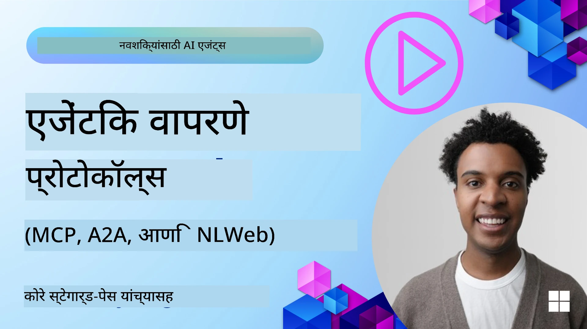
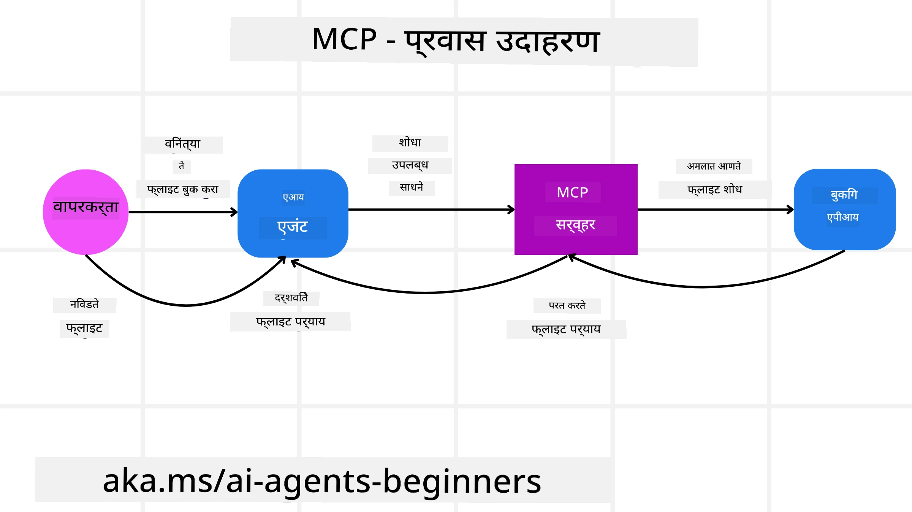
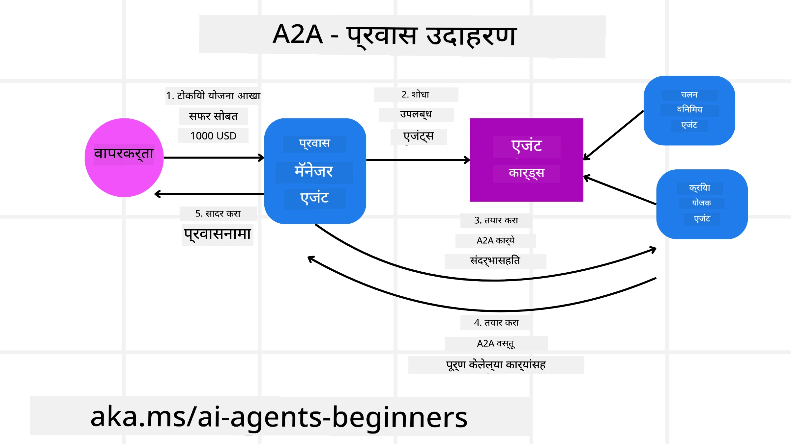
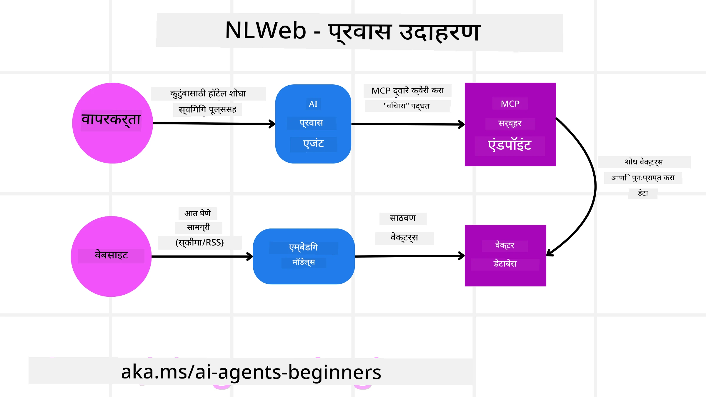

# एजेंटिक प्रोटोकॉल्सचा वापर (MCP, A2A आणि NLWeb)

> _(या धड्याचा व्हिडिओ पाहण्यासाठी वरील प्रतिमेवर क्लिक करा)_

जसे AI एजंट्सचा वापर वाढतो आहे, तसेच प्रोटोकॉल्सची गरज वाढते जी मानकीकरण, सुरक्षा, आणि खुल्या नवोन्मेषाला समर्थन देतात याची खात्री करतात. या धड्यात, आपण 3 प्रोटोकॉल्सवर चर्चा करू ज्यांनी ही गरज भागवण्याचा हेतू ठेवला आहे - मॉडेल कॉन्टेक्स्ट प्रोटोकॉल (MCP), एजंट टू एजंट (A2A) आणि नैसर्गिक भाषा वेब (NLWeb).

## परिचय

या धड्यात आपण समजून घेऊ:

• कसे **MCP** AI एजंट्सना वापरकर्त्याचे कार्य पूर्ण करण्यासाठी बाह्य साधने आणि डेटा वापरण्याची परवानगी देते.

• कसे **A2A** वेगवेगळ्या AI एजंट्समधील संवाद आणि सहकार्य सक्षम करते.

• कसे **NLWeb** नैसर्गिक भाषेच्या इंटरफेसना कोणत्याही वेबसाइटवर आणते ज्यामुळे AI एजंट्स वेबसाइटवरील सामग्री शोधू आणि संवाद साधू शकतात.

## शिक्षणाचे उद्दिष्टे

• AI एजंट्सच्या संदर्भात MCP, A2A, आणि NLWeb चे मुख्य उद्दिष्ट आणि फायदे **ओळखणे**.

• प्रत्येक प्रोटोकॉल कसा LLMs, साधने आणि इतर एजंट्समधील संवाद आणि संवाद साधण्यात मदत करतो हे **समजावून सांगणे**.

• वेगवेगळ्या प्रोटोकॉल्सचे भूमिकांचे **परिचय करून देणे** ज्याने क्लिष्ट एजेंटिक प्रणाली तयार होतात.

## मॉडेल कॉन्टेक्स्ट प्रोटोकॉल

**मॉडेल कॉन्टेक्स्ट प्रोटोकॉल (MCP)** हा एक खुला मानक आहे जो अनुप्रयोगांना LLMs साठी संदर्भ आणि साधने प्रदान करण्याचा मानकीकृत मार्ग देतो. हे AI एजंट्सना वेगवेगळ्या डेटा स्त्रोतांशी आणि साधनांशी सुसंगत रीतीने जोडणारा "सर्वव्यापी अडॅप्टर" सक्षम करते.

MCP चे घटक, थेट API वापराशी तुलना आणि AI एजंट्स कसे MCP सर्व्हर वापरू शकतात याचे उदाहरण आपण पाहूया.

### MCP चे मुख्य घटक

MCP **क्लायंट-सर्व्हर आर्किटेक्चर**वर चालते आणि मुख्य घटक आहेत:

• **होस्ट्स** हे LLM अनुप्रयोग आहेत (उदाहरणार्थ VSCode सारखा कोड एडिटर) जे MCP सर्व्हरशी कनेक्शन्स सुरू करतात.

• **क्लायंट्स** हे होस्ट अनुप्रयोगातील घटक आहेत जे सर्व्हरशी एक-ते-एक कनेक्शन राखतात.

• **सर्व्हर** हे लाइटवेट प्रोग्रॅम आहेत जे विशिष्ट क्षमता व्याप्त करतात.

प्रोटोकॉलमध्ये तीन मुख्य मूळ घटक आहेत जे MCP सर्व्हरच्या क्षमता आहेत:

• **साधने (Tools)**: वेगळे क्रिया किंवा फंक्शन्स ज्याला AI एजंट कॉल करू शकतो. उदा., हवामान सेवा "get weather" साधन प्रदर्शित करू शकते, किंवा ई-कॉमर्स सर्व्हर "purchase product" साधन. MCP सर्व्हर्स प्रत्येक साधनाचे नाव, स्पष्टीकरण, आणि इनपुट/आउटपुट स्कीमा त्याच्या क्षमतांमध्ये जाहीर करतो.

• **संसाधने (Resources)**: वाचण्यायोग्य डेटा आयटम्स किंवा दस्तऐवज जे MCP सर्व्हर प्रदान करू शकतो आणि क्लायंट्स ते मागणीनुसार प्राप्त करू शकतात. उदाहरणे डेटाबेस रेकॉर्ड, फाइल्स किंवा लॉग फाइल्स. संसाधने टेक्स्ट (कोड किंवा JSON सारखी) किंवा बायनरी (इमेजेस किंवा PDF सारखे) असू शकतात.

• **प्रॉम्प्ट्स (Prompts)**: पूर्वपरिभाषित साच्यांद्वारे अधिक क्लिष्ट कार्यप्रवाहांचे सुझाव देणारी टेम्प्लेट्स.

### MCP चे फायदे

MCP AI एजंटसाठी महत्त्वपूर्ण फायदे पुरवतो:

• **डायनॅमिक टूल डिस्कव्हरी**: एजंट्स सर्व्हरकडून उपलब्ध साधनांची यादी व त्यांचे वर्णन डायनॅमिक मिळवू शकतात. पारंपरिक API शी तुलना करता, जिथे स्थिर कोडिंग आवश्यक असते आणि API बदलल्यास कोड बदलावा लागतो, MCP एकदा इंटीग्रेट करून अधिक सुलभतेने पर्याय बदलण्यास परवानगी देतो.

• **विविध LLM मध्ये परस्परसंवाद**: MCP वेगवेगळ्या LLMs सह काम करतो, ज्यामुळे चांगल्या कामगिरीसाठी मुख्य मॉडेल बदलणे शक्य होते.

• **मानकीकृत सुरक्षा**: MCP मध्ये मानकीकृत प्रमाणीकरण पद्धत समाविष्ट आहे, जी अनेक MCP सर्व्हर्सना प्रवेश देताना स्केलेबिलिटी सुधारते. हे विविध API कीज आणि प्रमाणीकरण प्रकारांपेक्षा सोपे आहे.

### MCP उदाहरण

समजा, वापरकर्ता MCP चालित AI सहायकाशी फ्लाइट बुक करू इच्छित आहे.

1. **कनेक्शन**: AI सहाय्यक (MCP क्लायंट) एखाद्या विमान कंपनीने दिलेल्या MCP सर्व्हरशी कनेक्ट होतो.

2. **साधन शोध**: क्लायंट विमान कंपनीच्या MCP सर्व्हरला विचारतो, "तुमच्याकडे कोणती साधने आहेत?" सर्व्हर "search flights" आणि "book flights" साधने उत्तरे देतो.

3. **साधन कॉलिंग**: तुम्ही AI सहाय्यकाला म्हणता, "पोर्टलंड ते होनोलूलू फ्लाइट शोधा." AI सहाय्यक त्याच्या LLM चा वापर करून "search flights" साधन कॉल करतो आणि MCP सर्व्हरला संबंधित परिमाण (उद्गम, गंतव्य) देतो.

4. **कार्यवाही व प्रतिसाद**: MCP सर्व्हर विमान कंपनीच्या अंतर्गत बुकिंग API शी तीव्र कॉल करतो, फ्लाइट माहिती प्राप्त करतो (उदा. JSON डेटा) आणि AI सहाय्यकाला परत पाठवतो.

5. **पुढील संवाद**: AI सहाय्यक फ्लाइट पर्याय सादर करतो. तुम्ही फ्लाइट निवडल्यावर "book flight" साधन कॉल करत बुकिंग पूर्ण करतो.

## एजंट-टू-एजंट प्रोटोकॉल (A2A)

MCP LLMsना साधनांशी जोडण्यावर लक्ष केंद्रित करतो, तर **एजंट-टू-एजंट (A2A) प्रोटोकॉल** वेगळ्या AI एजंट्समधील संवाद व सहकार्य आणखी एका पातळीवर नेतो. A2A वेगवेगळ्या संघटना, वातावरणे, आणि टेक स्टॅक्समधील AI एजंट्सना जोडतो, ज्यामुळे ते सामायिक कार्य पूर्ण करू शकतात.

आपण A2A चे घटक आणि फायदे पाहू, तसेच ट्रॅव्हल अॅप्लिकेशनमधील उदाहरणवर त्याचा वापर कसा होईल ते पाहू.

### A2A चे मुख्य घटक

A2A एजंट्समधील संवाद सक्षम करतो आणि ते वापरकर्त्याच्या उपकार्यात सहकार्य करतात. प्रोटोकॉलमधील घटक हे काम पूर्ण होण्यास मदत करतात:

#### एजंट कार्ड

जसे MCP सर्व्हर साधनांची यादी देवू शकतो, तसे एजंट कार्ड मध्ये असते:
- एजंटचे नाव.
- पूर्ण केलेल्या सामान्य कार्यांचे **वर्णन**.
- विशिष्ट कौशल्ये आणि त्यांचे विवरण ज्यामुळे इतर एजंट्स किंवा मानवी वापरकर्त्यांना त्या एजंटला कॉल का आणि कधी करायचे ते समजते.
- एजंटचा सध्याचा **एंडपॉइंट URL**.
- एजंटची **आवृत्ती** व **क्षमता** जसे की स्ट्रीमिंग प्रतिसाद आणि पुश सूचनां.

#### एजंट एक्झिक्यूटर

एजंट एक्झिक्यूटरचा जबाबदार आहे **वापरकर्त्याच्या चॅट संदर्भाला रिमोट एजंटकडे पाठवणे**, जेणेकरून रिमोट एजंट कार्य समजून घेऊ शकेल. A2A सर्व्हर मध्ये, एजंट स्वतःचा LLM वापरून येणाऱ्या विनंत्या पार्स आणि अंतर्गत साधने वापरून कार्य पार पाडतो.

#### आर्टिफॅक्ट

एकदा रिमोट एजंटने विनंती केलेले कार्य पूर्ण केल्यावर, त्याचे कार्य उत्पादन **आर्टिफॅक्ट** म्हणून तयार होते. आर्टिफॅक्टमध्ये **एजंटच्या कार्याचा निकाल**, **कार्याचे वर्णन**, आणि प्रोटोकॉलमधून पाठवलेला **टेक्स्ट संदर्भ** असतो. आर्टिफॅक्ट पाठवल्यानंतर रिमोट एजंटशी कनेक्शन बंद होते जोपर्यंत पुन्हा गरज भासेल.

#### इव्हेंट क्यू

हे घटक **अपडेट्स हाताळण्यासाठी आणि संदेश देवाण-घेवाणीसाठी** वापरले जाते. उत्पादनात, एजंटिक प्रणालींसाठी कनेक्शन नको वेळी बंद होऊ नये यासाठी हे महत्त्वाचे आहे, विशेषतः जेव्हा कार्य पूर्ण होण्यास अधिक वेळ लागतो.

### A2A चे फायदे

• **वर्धित सहकार्य**: वेगवेगळ्या विक्रेते व प्लॅटफॉर्ममधील एजंट्स संवाद साधू शकतात, संदर्भ शेयर करू शकतात आणि काम एकत्र करू शकतात, ज्यामुळे आधी विभक्त असलेल्या प्रणालींमध्ये स्वयंचलन सुलभ होते.

• **मॉडेल निवडण्याची लवचिकता**: प्रत्येक A2A एजंट स्वतःचा LLM निवडू शकतो ज्यामुळे निरनिराळ्या एजंट्ससाठी मॉडेल्स ऑप्टिमाइझ किंवा फाइन-ट्यून केले जातात, जे MCP च्या एकल LLM कनेक्शनपेक्षा वेगळे आहे.

• **एंबेड केलेली प्रमाणीकरण**: A2A प्रोटोकॉलमध्ये प्रमाणीकरण सामील आहे, जे एजंट संवादासाठी मजबूत सुरक्षा प्रदान करते.

### A2A उदाहरण

ट्रॅव्हल बुकिंग परिस्थितीत A2A चे उदाहरण पाहू.

1. **वापरकर्ता मल्टी-एजंटकडे विनंती करतो**: वापरकर्ता "Travel Agent" A2A क्लायंट/एजंटशी संवाद साधतो, उदा., "कृपया पुढील आठवड्यासाठी होनोलूलूसाठी संपूर्ण प्रवास बुक करा, ज्यामध्ये फ्लाइट, हॉटेल आणि कार भाड्याने घेणे यांचा समावेश असो".

2. **ट्रॅव्हल एजंटने आयोजन केले**: ट्रॅव्हल एजंट या जटिल विनंतीला प्राप्त करतो. त्याचा LLM वापरून तो विचार करतो की कोणत्या अन्य विशेष एजंट्सशी संवाद साधावा.

3. **एजंट-टू-एजंट संवाद**: ट्रॅव्हल एजंट A2A प्रोटोकॉल वापरून downstream एजंट्सशी, जसे की "Airline Agent," "Hotel Agent," आणि "Car Rental Agent," जे विविध कंपन्यांनी निर्माण केले आहेत, कनेक्ट करतो.

4. **कार्यालयित कार्य पूर्णत्व**: ट्रॅव्हल एजंट त्या विशेष एजंट्सना विशिष्ट कार्ये पाठवतो (उदा., "होनोलूलूसाठी फ्लाइट शोधा," "हॉटेल बुक करा," "कार भाड्याने घ्या"). प्रत्येक एजंट त्यांचा स्वतःचा LLM आणि त्यांची स्वतःची साधने (जे MCP सर्व्हर असू शकतात) वापरून कार्य पूर्ण करतो.

5. **एकत्रित प्रतिसाद**: सर्व एजंट्स कार्य पूर्ण केल्यानंतर, ट्रॅव्हल एजंट फ्लाइट तपशील, हॉटेल पुष्टी, कार भाड्याने घेणे यांच्या निकालांसह पूर्ण संवाद शैलीत उत्तर वापरकर्त्याला पाठवतो.

## नैसर्गिक भाषा वेब (NLWeb)

वेबसाइट्स हे वापरकर्त्यांसाठी इंटरनेटवर माहिती व डेटा उपलब्ध करण्याचा प्राथमिक मार्ग आहेत.

आता आपण NLWeb चे वेगवेगळे घटक, त्याचे फायदे आणि आमच्या ट्रॅव्हल अॅप्लिकेशनने NLWeb कसे वापरले हे पाहू.

### NLWeb चे घटक

- **NLWeb ऍप्लिकेशन (मुख्य सेवा कोड)**: नैसर्गिक भाषा प्रश्नांची प्रक्रिया करणारी प्रणाली. ती प्लॅटफॉर्मच्या विविध भागांना जोडून प्रतिसाद तयार करते. तुम्ही याला वेबसाइटच्या नैसर्गिक भाषा वैशिष्ट्यांचे **इंजन** समजू शकता.

- **NLWeb प्रोटोकॉल**: ही वेबसाइटशी नैसर्गिक भाषेत संवादाचे **मूलभूत नियम** आहेत. ते JSON स्वरूपात प्रतिसाद पाठवते (सामान्यतः Schema.org वापरून). याचा उद्देश "AI वेब" साठी सोपी पायाभूत रचना तयार करणे आहे, जसे की HTML ऑनलाईन दस्तऐवज शेअर करायला परवानगी दिली.

- **MCP सर्व्हर (मॉडेल कॉन्टेक्स्ट प्रोटोकॉल एंडपॉइंट)**: प्रत्येक NLWeb सेटअप MCP सर्व्हर म्हणून देखील कार्य करतो. म्हणजेच तो इतर AI सिस्टिम्ससह **साधने (जसे "ask" मेथड) आणि डेटा** शेअर करू शकतो. व्यवहारात, वेबसाइटची क्षमता AI एजंट्ससाठी वापरायला जाऊ शकते, ज्यामुळे वेबसाइट व्यापक "एजंट परिसंस्था" चा भाग बनते.

- **एंबेडिंग मॉडेल्स**: या मॉडेल्सचा वापर वेबसाइट सामग्रीला संख्यात्मक प्रतिनिधित्वमध्ये (व्हेक्टर/एंबेडिंग्स) रूपांतरित करण्यासाठी होतो. हे व्हेक्टर संगणकांना तुलना आणि शोध सक्षम करतात. त्यांना खास डेटाबेसमध्ये संग्रहित केले जाते आणि वापरकर्ता कोणते एंबेडिंग मॉडेल वापरायचे ते निवडू शकतो.

- **व्हेक्टर डेटाबेस (रिट्रीव्हल यंत्रणा)**: हा डेटाबेस वेबसाइट सामग्रीच्या एंबेडिंग्स संग्रहित करतो. जेव्हा एखादा प्रश्न विचारला जातो, तेव्हा NLWeb वेगाने सर्वात संबंधित माहिती शोधण्यासाठी व्हेक्टर डेटाबेस तपासतो. तो शक्य असलेल्या उत्तरांची यादी लवकर नव्हे पण समानता नुसार क्रमित करतो. NLWeb Qdrant, Snowflake, Milvus, Azure AI Search, आणि Elasticsearch सारख्या वेगवेगळ्या व्हेक्टर स्टोरेज सिस्टम्स सह काम करतो.

### NLWeb उदाहरणाद्वारे

पुन्हा आमच्या ट्रॅव्हल बुकिंग वेबसाइटचा विचार करा, परंतु यावेळी ती NLWeb ने चालवलेली आहे.

1. **डेटा इन्गेस्टिंग**: ट्रॅव्हल वेबसाइटवरील उत्पादने (जसे फ्लाइट लिस्टिंग, हॉटेल वर्णने, टूर पॅकेजेस) Schema.org वापरून स्वरूपित केली जातात किंवा RSS फीड्सद्वारे लोड होतात. NLWeb च्या साधनांनी हा संरचित डेटा इन्गेस्ट केला, एंबेडिंग तयार केली आणि ते स्थानिक किंवा रिमोट व्हेक्टर डेटाबेसमध्ये संग्रहित केले.

2. **नैसर्गिक भाषा क्वेरी (मानव)**: वापरकर्ता वेबसाइटवर येऊन मेनूवर नेव्हिगेट न करता चॅट इंटरफेसमध्ये लिहितो: "कृपया पुढील आठवड्यासाठी होनोलूलूमध्ये कुटुंबासाठी योग्य, पोहण्याच्या तलावासह हॉटेल शोधा".

3. **NLWeb प्रक्रिया**: NLWeb ऍप्लिकेशन ही क्वेरी प्राप्त करते. LLM ला क्वेरी समजण्यासाठी पाठवते आणि त्याच वेळी व्हेक्टर डेटाबेसमध्ये संबंधित हॉटेल यादी शोधते.

4. **अचूक निकाल**: LLM डेटाबेसमधील शोध निकालांवर "कुटुंबासाठी योग्य," "तलाव," आणि "होनोलूलू" अटींचा वापर करून उत्तम जुळणी शोधण्यात मदत करतो आणि नंतर नैसर्गिक भाषेत प्रतिसाद तयार करतो. महत्वाचे म्हणजे, हा प्रतिसाद वेबसाइटच्या कॅटलॉगमधील प्रत्यक्ष हॉटेलकडे संदर्भित करतो, बनावट माहिती टाळतो.

5. **AI एजंट संवाद**: NLWeb MCP सर्व्हर म्हणून कार्य करत असल्यामुळे, बाह्य AI ट्रॅव्हल एजंट देखील या वेबसाइटच्या NLWeb उदाहरणाशी जोडू शकते. AI एजंट `ask` MCP पद्धत वापरून वेबसाइटला थेट प्रश्न विचारू शकतो: `ask("Are there any vegan-friendly restaurants in the Honolulu area recommended by the hotel?")`. NLWeb या प्रश्नाची प्रक्रिया करेल, त्याच्या रेस्टॉरंट माहितीच्या डेटाबेसचा वापर करेल (जर लोड केलेला असेल), आणि संरचित JSON प्रतिसाद परत पाठवेल.

### MCP/A2A/NLWeb विषयी अधिक प्रश्न?

[Microsoft Foundry Discord](https://aka.ms/ai-agents/discord) मध्ये सामील व्हा, इतर शिकणाऱ्यांशी भेटा, ऑफिस अवर्समध्ये सहभागी व्हा आणि तुमचे AI एजंट्स संबंधी प्रश्नांची उत्तरे मिळवा.

## संसाधने

- [MCP for Beginners](https://aka.ms/mcp-for-beginners)  
- [MCP Documentation](https://learn.microsoft.com/python/api/overview/azure/ai-projects-readme)
- [NLWeb Repo](https://github.com/nlweb-ai/NLWeb)
- [Microsoft Agent Framework](https://aka.ms/ai-agents-beginners/agent-framewrok)

---

<!-- CO-OP TRANSLATOR DISCLAIMER START -->
**अस्वीकरण**:
हा दस्तऐवज AI अनुवाद सेवेद्वारे [Co-op Translator](https://github.com/Azure/co-op-translator) वापरून अनुवादित केला आहे. आम्ही अचूकतेसाठी प्रयत्न करतो, परंतु कृपया लक्षात घ्या की स्वयंचलित अनुवादांमध्ये त्रुटी किंवा अचूकतेच्या कमतरता असू शकतात. मूळ दस्तऐवज त्याच्या स्थानिक भाषेत अधिकृत स्रोत मानला पाहिजे. महत्त्वाच्या माहितीसाठी व्यावसायिक मानवी अनुवाद शिफारसीय आहे. या अनुवादाचा वापर केल्यामुळे झालेल्या कोणत्याही गैरसमज किंवा चुकीच्या अर्थलागी आम्ही उत्तरदायी नाही.
<!-- CO-OP TRANSLATOR DISCLAIMER END -->