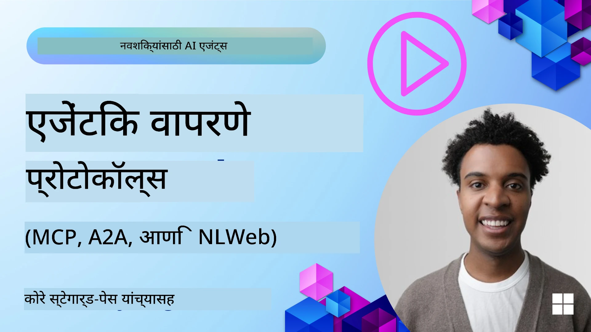
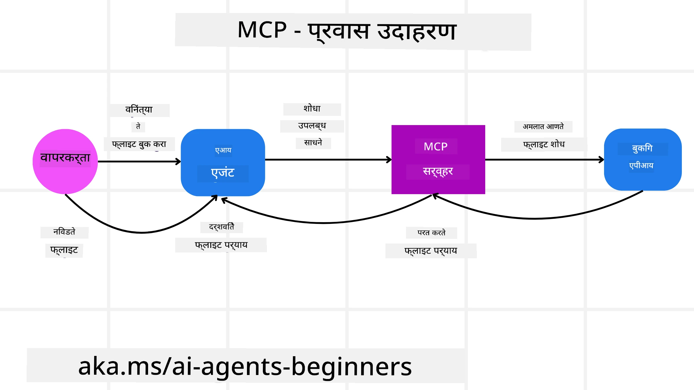
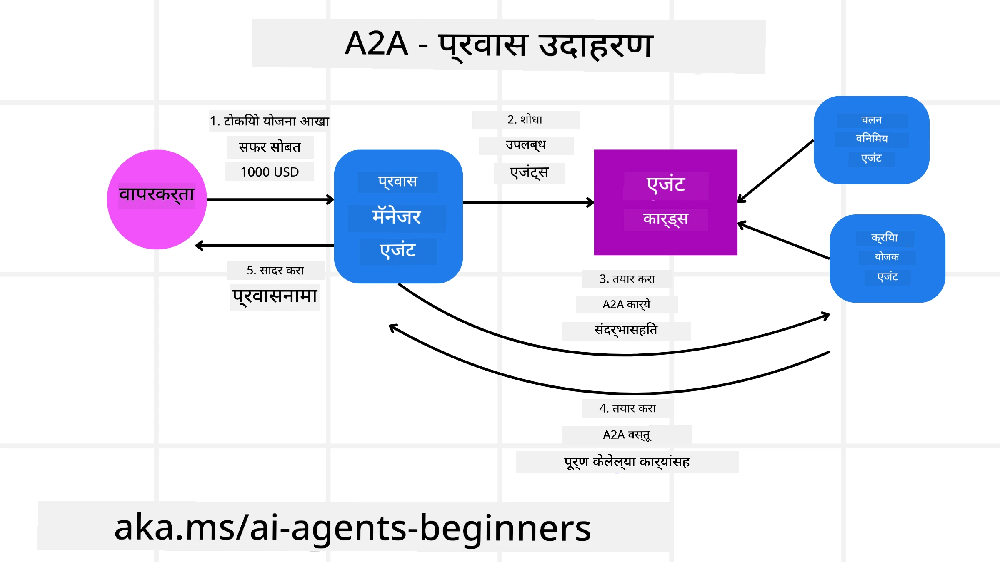
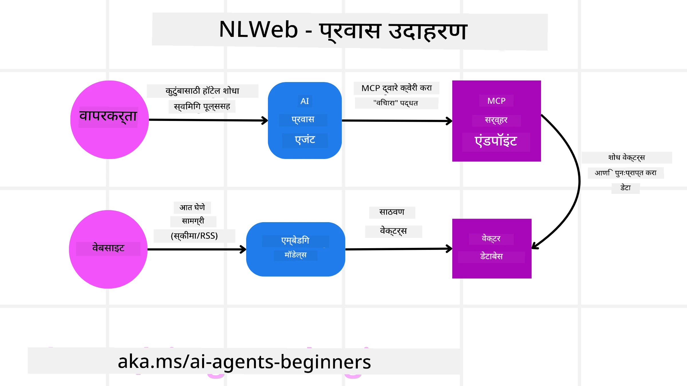

# एजेन्टिक प्रोटोकॉल्स वापरणे (MCP, A2A आणि NLWeb)

> _(या लेसनचा व्हिडिओ पाहण्यासाठी वरील प्रतिमेवर क्लिक करा)_

AI एजंट्स चा वापर वाढत असल्यामुळे, मानकीकरण, सुरक्षा आणि खुल्या नवकल्पनेसाठी समर्थन सुनिश्चित करणारे प्रोटोकॉल्सची गरज देखील वाढत आहे. या लेसनमध्ये, आपण 3 प्रोटोकॉल्स पाहणार आहोत जे या गरजेची पूर्तता करण्याचा प्रयत्न करतात - मॉडेल कॉन्टेक्स्ट प्रोटोकॉल (MCP), एजंट टू एजंट (A2A) आणि नॅचरल लँग्वेज वेब (NLWeb).

## परिचय

या लेसनमध्ये आपण समजून घेणार आहोत:

• कसे **MCP** AI एजंट्सना बाह्य साधने आणि डेटा वापरुन वापरकर्त्याचे कार्य पूर्ण करण्याची परवानगी देतो.

• कसे **A2A** विविध AI एजंट्स दरम्यान संवाद आणि सहकार्य सक्षम करते.

• कसे **NLWeb** नैसर्गिक भाषा इंटरफेस कोणत्याही वेबसाइटवर आणतो, ज्यामुळे AI एजंट्सना त्यातील सामग्री शोधणे आणि संवाद साधणे शक्य होते.

## शिकण्याच्या उद्दिष्टे

• AI एजंटच्या संदर्भात MCP, A2A आणि NLWeb चा मुख्य उद्देश आणि फायदे **ओळखणे**.

• प्रत्येक प्रोटोकॉल कसा LLMs, साधने आणि इतर एजंट्स दरम्यान संवाद आणि परस्परसंवाद सुलभ करतो ते **समजावणे**.

• जटिल एजंटिक प्रणाली बांधण्यात प्रत्येक प्रोटोकॉलची वेगळी भूमिका **ओळखणे**.

## मॉडेल कॉन्टेक्स्ट प्रोटोकॉल

**मॉडेल कॉन्टेक्स्ट प्रोटोकॉल (MCP)** हा एक खुला मानक आहे जो LLMs कडे संदर्भ आणि उपकरणे पुरविण्यासाठी मानकीकृत मार्ग प्रदान करतो. यामुळे AI एजंट्सना निरनिराळ्या डेटा स्रोत आणि साधनांशी सातत्याने जोडण्यासाठी "सर्वसाधारण अडॅप्टर" सक्षम होतो.

चला MCP चे घटक, थेट API वापरण्याच्या तुलनेत फायदे आणि AI एजंट्स कसे MCP सर्व्हर वापरू शकतात हे उदाहरण पाहूया.

### MCP मुख्य घटक

MCP हे **क्लायंट-सर्व्हर आर्किटेक्चर** वर आधारित आहे आणि याचे मुख्य घटक आहेत:

• **होस्ट्स** हे LLM अनुप्रयोग (उदाहरणार्थ, VSCode सारखे कोड एडिटर) असतात जे MCP सर्व्हरशी कनेक्शन सुरू करतात.

• **क्लायंट्स** हा होस्ट अनुप्रयोगातील घटक असतो जो सर्व्हरशी एक-ते-एक कनेक्शन सांभाळतो.

• **सर्व्हर** हे हलक्या वजनाचे प्रोग्राम असतात जे विशिष्ट क्षमता उघड करतात.

प्रोटोकॉलमध्ये तीन मुख्य प्रिमिटिव्ह्स समाविष्ट आहेत जे MCP सर्व्हरच्या क्षमता आहेत:

• **टूल्स**: AI एजंट्स कॉल करू शकणारे वेगळे क्रिया किंवा कार्य. उदाहरणार्थ, एखाद्या हवामान सेवा “get weather” टूल देऊ शकते, किंवा ई-कॉमर्स सर्व्हर “purchase product” टूल देते. MCP सर्व्हर प्रत्येक टूलचे नाव, वर्णन, आणि इनपुट/आउटपुट स्कीमा क्षमतांमध्ये जाहिरात करतात.

• **रिसोर्सेस**: वाचन-केवळ डेटा आयटम किंवा दस्तऐवज जे MCP सर्व्हर पुरवू शकतो आणि क्लायंट्स ते मागणीवर प्राप्त करू शकतात. उदाहरणे म्हणजे फायलींची सामग्री, डेटाबेस नोंदी, किंवा लॉग फाइल्स. हे टेक्स्ट (कोड किंवा JSON सारखे) किंवा बायनरी (इमेजेस किंवा PDF सारखे) असू शकतात.

• **प्रॉम्प्ट्स**: पूर्वनिर्धारित टेम्प्लेट्स जे सूचित प्रॉम्प्ट्स देतात, ज्यामुळे अधिक जटिल कार्यप्रवाह शक्य होतो.

### MCP चे फायदे

MCP AI एजंट्ससाठी महत्त्वाचे फायदे देते:

• **डायनॅमिक टूल डिस्कव्हरी**: एजंट्स एका सर्व्हर कडून उपलब्ध टूल्सचा आणि त्यांचे वर्णनाचा डायनॅमिक यादी प्राप्त करू शकतात. पारंपरिक API च्या स्थिर कोडिंगच्या तुलनेत, ज्यामध्ये API मध्ये बदल झाल्यास कोड अपडेट करावा लागतो, MCP एकदाच इंटीग्रेट करण्याचे पद्धत देते, ज्यामुळे अधिक अनुकूलता मिळते.

• **LLMs मध्ये परस्परसंवाद**: MCP विविध LLMs मध्ये काम करते, ज्यामुळे मुख्य मॉडेल बदलण्याची लवचीकता मिळते जेणेकरून कामगिरीसाठी चांगल्या मॉडेलचे मूल्यमापन करता येईल.

• **मानकीकृत सुरक्षा**: MCP मध्ये मानक प्रमाणीकरण पद्धत आहे, ज्यामुळे अधिक MCP सर्व्हर जोडताना स्केलिंग सुलभ होते. पारंपरिक API साठी वेगवेगळ्या की आणि प्रमाणीकरण प्रकार व्यवस्थापित करण्यापेक्षा हे सोपे आहे.

### MCP उदाहरण

कल्पना करा की वापरकर्ता MCP वापरणारे AI सहाय्यक वापरून विमान तिकीट बुक करू इच्छितो.

1. **कनेक्शन**: AI सहाय्यक (MCP क्लायंट) एखाद्या एअरलाइनला दिलेला MCP सर्व्हरशी कनेक्ट होतो.

2. **टूल शोध**: क्लायंट एअरलाइनच्या MCP सर्व्हरला विचारतो, "कुठे कुठे टूल्स उपलब्ध आहेत?" सर्व्हर "search flights" आणि "book flights" सारखे टूल्स परत करतो.

3. **टूल वापर**: तुम्ही AI सहाय्यकाला म्हणता, "पोर्टलंड ते होनोलुलूचा फ्लाइट शोधा." AI सहाय्यक त्याच्या LLM वापरुन "search flights" टूल कॉल करतो आणि संबंधित पॅरामीटर्स (मूळ ठिकाण, गंतव्य) MCP सर्व्हरकडे पाठवतो.

4. **कार्यान्वयन व प्रतिसाद**: MCP सर्व्हर, एका व्रॅपरसारखा, एअरलाइनच्या अंतर्गत बुकिंग API ला कॉल करतो. त्यानंतर फ्लाइट माहिती (उदा. JSON डेटा) प्राप्त करून AI सहाय्यकाकडे पाठवतो.

5. **पुढील संवाद**: AI सहाय्यक फ्लाइट पर्याय दाखवतो. तुम्ही फ्लाइट निवडल्यावर सहाय्यक त्या MCP सर्व्हरवर “book flight” टूल वापरून बुकिंग पूर्ण करू शकतो.

## एजंट-टू-एजंट प्रोटोकॉल (A2A)

जिथे MCP LLMs आणि साधनांना जोडतो, **एजंट-टू-एजंट (A2A) प्रोटोकॉल** आणखी एक पाऊल पुढे नेतो, विविध AI एजंट्स दरम्यान संवाद आणि सहकार्य सक्षम करतो. A2A वेगवेगळ्या संस्था, वातावरणे आणि तंत्रज्ञानाच्या पटलातील AI एजंट्सना एका समान कार्यासाठी जोडतो.

आपण A2A चे घटक, फायदे आणि आमच्या प्रवास अॅप्लिकेशनमध्ये हे कसे लागू होऊ शकते ते पाहणार आहोत.

### A2A प्रमुख घटक

A2A एजंट्स दरम्यान संवाद सक्षम करण्यावर आणि ते एकत्र वापरकर्त्याच्या उपकार्य पूर्ण करण्यासाठी काम करतात. प्रत्येक घटक या कार्याला हातभार लागतो:

#### एजंट कार्ड

जसे MCP सर्व्हर टूल्सची यादी सामायिक करतो, तसेच एजंट कार्डमध्ये असते:
- एजंटचे नाव.
- पूर्ण करणार्‍या सामान्य कामांचे **वर्णन**.
- विशिष्ट कौशल्यांची **यादी** ज्यामुळे इतर एजंट्स (किंवा मानव वापरकर्ते) कधी आणि का त्या एजंटला कॉल करावयाचे ते समजू शकेल.
- एजंटचा **सध्याचा एंडपॉईंट URL**.
- एजंटची **आवृत्ती** आणि **क्षमता** जसे की स्ट्रीमिंग प्रतिसाद आणि पुश अधिसूचना.

#### एजंट एक्झिक्युटर

एजंट एक्झिक्युटर वापरकर्त्याच्या चॅटचा संदर्भ दूरस्थ एजंटला पाठवण्यास जबाबदार आहे; दूरस्थ एजंटाला हे काम पूर्ण करण्यासाठी आवश्यक असतो. A2A सर्व्हरमध्ये, एजंट त्याचा स्वतःचा LLM वापरून विनंत्या पार्स करतो आणि त्याच्या अंतर्गत साधनांचा वापर करून कार्य करते.

#### आर्टिफॅक्ट

दूरस्थ एजंट मागणी केलेले काम पूर्ण केल्यावर, त्याचे कार्य आर्टिफॅक्ट म्हणून तयार होते. आर्टिफॅक्टमध्ये एजंटचे कार्य, पूर्ण केलेले वर्णन आणि प्रोटोकॉलमधून पाठवलेला मजकूर संदर्भ असतो. आर्टिफॅक्ट पाठवल्यानंतर, दूरस्थ एजंटशी कनेक्शन आवश्यक तेव्हाच पुन्हा उघडले जाते.

#### इव्हेंट क्यू

हा घटक अपडेट्स हाताळण्यासाठी आणि संदेश पाठवण्यासाठी वापरला जातो. एजंटिक प्रणालींमध्ये एजंट्सचे कनेक्शन काम पूर्ण होण्यापूर्वी बंद होऊ नये म्हणून हा विशेषतः महत्त्वाचा आहे, कारण काम पूर्ण होण्यास वेळ लागू शकतो.

### A2A चे फायदे

• **सुधारित सहकार्य**: विविध विक्रेते आणि प्लॅटफॉर्मवरील एजंट्सना संवाद साधता, संदर्भ शेअर करता आणि एकत्र काम करता सक्षम करते, ज्यामुळे परंपरागतपणे वेगळ्या प्रणालींमध्ये सहज स्वयंचलन शक्य होते.

• **मॉडेल निवडीची लवचीकता**: प्रत्येक A2A एजंट त्याच्या विनंत्यांसाठी कोणता LLM वापरायचा ते ठरवू शकतो, ज्यामुळे एजंटनिहाय ऑप्टिमायझेशन किंवा फाईन-ट्यून केलेले मॉडेल वापरणे शक्य होते, जे काही MCP परिस्थितींमध्ये एकच LLM कनेक्शन वापरतात त्यांच्यापेक्षा वेगळे आहे.

• **अगोदरच समाविष्ट केलेले प्रमाणीकरण**: A2A प्रोटोकॉलमध्ये थेट प्रमाणीकरण आहे, ज्यामुळे एजंट संवादांसाठी मजबूत सुरक्षा प्रणाली तयार होते.

### A2A उदाहरण

चला आपल्या प्रवास बुकिंग परिदृश्याचा विस्तार करू, पण यावेळी A2A वापरून.

1. **वापरकर्त्याची मागणी मल्टी-एजंटला**: वापरकर्ता "Travel Agent" A2A क्लायंट/एजंटशी संवाद साधतो, कदाचित म्हणतो, "पुढील आठवड्यासाठी होनोलुलूची संपूर्ण ट्रिप बुक करा, ज्यात फ्लाइट, हॉटेल आणि भाड्याने कारचा समावेश आहे."

2. **Travel Agent द्वारे समन्वय**: Travel Agent ही गुंतागुंतीची मागणी प्राप्त करतो. त्याचा LLM वापरून तो कार्याचे विश्लेषण करतो आणि खास एजंट्सशी संवाद साधणे आवश्यक असल्याचे ठरवतो.

3. **एजंट-एजंट संवाद**: Travel Agent नंतर A2A प्रोटोकॉल वापरून खालील एजंट्सशी कनेक्ट होतो, जसे "Airline Agent," "Hotel Agent," आणि "Car Rental Agent" जे भिन्न कंपन्यांनी तयार केले आहेत.

4. **काम वाटप**: Travel Agent या खास एजंट्सना विशिष्ट कार्ये पाठवतो (उदा., "Find flights to Honolulu," "Book a hotel," "Rent a car"). प्रत्येक खास एजंट त्याचे स्वतःचा LLM चालवतो आणि त्याचे स्वतःचे टूल्स (जे MCP सर्व्हर असू शकतात) वापरून त्याचे भाग पूर्ण करतो.

5. **एकत्रित प्रतिसाद**: सर्व एजंट्स त्यांचे कार्य पूर्ण केल्यावर, Travel Agent निकाल एकत्र करून वापरकर्त्यास एक संपूर्ण चॅट-शैली प्रतिसाद पाठवतो.

## नैसर्गिक भाषा वेब (NLWeb)

वेबसाइट्स इंटरनेटवर माहिती आणि डेटा मिळविण्याचा उपयोगकर्त्यांसाठी मुख्य मार्ग राहिल्या आहेत.

चला NLWeb चे विविध घटक, त्याचे फायदे आणि आमच्या प्रवास अॅप्लिकेशनद्वारे NLWeb कसे कार्य करते ते पाहूया.

### NLWeb चे घटक

- **NLWeb अनुप्रयोग (कोर सेवा कोड)**: जे नैसर्गिक भाषा प्रश्न प्रक्रिया करतो. हे प्लॅटफॉर्मचे विविध भाग जोडून प्रतिसाद तयार करतो. तुम्ही याला वेबसाइटच्या नैसर्गिक भाषा वैशिष्ट्यांना चालना देणारे **इंजिन** समजू शकता.

- **NLWeb प्रोटोकॉल**: ही वेबसाइटशी नैसर्गिक भाषा संवादासाठी **मूलभूत नियमांची संच** आहे. ते JSON स्वरूपात (सामान्यतः Schema.org वापरुन) प्रतिसाद पाठवते. याचा हेतू "AI Web" साठी साधा पाया तयार करणे आहे, जसे HTML ने ऑनलाइन दस्तऐवज शेअर करणे शक्य केले.

- **MCP सर्व्हर (मॉडेल कॉन्टेक्स्ट प्रोटोकॉल एंडपॉईंट)**: प्रत्येक NLWeb सेटअप MCP सर्व्हर म्हणून उभी असते. याचा अर्थ तो इतर AI प्रणालींसह टूल्स (उदा., “ask” पद्धत) आणि डेटा शेअर करू शकतो. व्यवहारिकदृष्ट्या, यामुळे वेबसाइटची सामग्री आणि क्षमतांचा AI एजंटद्वारे वापर शक्य होतो आणि ती "एजंट इकोसिस्टम" चा भाग बनते.

- **एम्बेडिंग मॉडेल्स**: हे मॉडेल्स वेबसाइट सामग्रीचे संख्यात्मक प्रतिनिधित्व (व्हेक्टर) मध्ये रूपांतर करतात. हे व्हेक्टर माणसांनाही समजणाऱ्या अर्थाने कंप्युटरांना तुलना करणे आणि शोधणे शक्य करतात. हे एक खास डेटाबेसमध्ये साठवले जातात, आणि वापरकर्ता कोणते एम्बेडिंग मॉडेल वापरायचे ते निवडू शकतात.

- **व्हेक्टर डेटाबेस (रिट्रीव्हल मेकॅनिझम)**: हा डेटाबेस वेबसाइटच्या सामग्रीचे एम्बेडिंग्ज साठवतो. जेव्हा कुणी प्रश्न विचारतो, NLWeb व्हेक्टर डेटाबेस तपासून सर्वात संबंधित माहिती शोधतो. तो तत्काळ संभाव्य उत्तरांची यादी परत करतो, ज्यांना सादृश्यतेनुसार क्रमबद्ध केलेले असते. NLWeb विविध व्हेक्टर साठवणुकीच्या प्रणालींसह कार्य करते, जसे की Qdrant, Snowflake, Milvus, Azure AI Search, आणि Elasticsearch.

### NLWeb चे उदाहरण

पुन्हा आपली प्रवास बुकिंग वेबसाइट पाहूया, पण यावेळी ती NLWeb द्वारा चालवली जाते.

1. **डेटा संग्रहण**: प्रवास वेबसाइटवर विद्यमान प्रॉडक्ट कॅटलॉग (जसे फ्लाइट यादी, हॉटेल वर्णन, टूर पॅकेजेस) Schema.org वापरुन फॉरमॅट केले जातात किंवा RSS फीडद्वारे लोड केले जातात. NLWeb च्या टूल्स या संरचित डेटाला ग्रहण करतात, एम्बेडिंग तयार करतात, आणि स्थानिक किंवा दूरस्थ व्हेक्टर डेटाबेसमध्ये साठवतात.

2. **नैसर्गिक भाषा प्रश्न (माणूस)**: वापरकर्ता वेबसाइटला भेट देतो आणि मेनू शोधण्याऐवजी चॅट इंटरफेस मध्ये टाइप करतो: "पुढील आठवड्यासाठी होनोलुलूमध्ये कुटुंबासाठी योग्य असे स्विमिंग पूल असलेले हॉटेल शोधा."

3. **NLWeb प्रक्रिया**: NLWeb अनुप्रयोग ही क्वेरी प्राप्त करतो. तो LLM कडे क्वेरी पाठवतो समजण्यासाठी आणि त्याच वेळी व्हेक्टर डेटाबेसमध्ये संबंधित हॉटेल यादी शोधतो.

4. **तपशीलवार निकाल**: LLM डेटाबेसमधून शोध निकाल समजावून घेतो, "कुटुंबासाठी योग्य," "स्विमिंग पूल," आणि "होनोलुलू" यावर आधारित सर्वोत्तम जुळणाऱ्या वस्तू ओळखतो, आणि नैसर्गिक भाषेत प्रतिसाद तयार करतो. महत्वाचे म्हणजे, प्रतिसाद वेबसाइटच्या कॅटलॉगमधील खऱ्या हॉटेलकडे निर्देश करतो, बनावट माहिती नाही.

5. **AI एजंट इंटरॅक्शन**: NLWeb MCP सर्व्हर म्हणून कार्य केल्यामुळे, बाह्य AI ट्रॅव्हल एजंट या वेबसाइटच्या NLWeb इंस्टन्सशी जोडू शकतो. AI एजंट मग `ask` MCP पद्धत वापरून थेट वेबसाइटला विचारू शकतो: `ask("Are there any vegan-friendly restaurants in the Honolulu area recommended by the hotel?")`. NLWeb हे प्रोसेस करेल, त्याच्या रेस्टॉरंट माहिती डेटाबेसचा वापर करुन (जर लोड केले असेल तर), आणि संरचित JSON प्रतिसाद परत करेल.

### MCP/A2A/NLWeb विषयी अधिक प्रश्न आहेत का?

[Microsoft Foundry Discord](https://discord.com/invite/ATgtXmAS5D) मध्ये सामील व्हा, इतर शिकणाऱ्यांशी भेटा, ऑफिस तासांमध्ये सहभागी व्हा आणि तुमचे AI एजंट्स प्रश्न विचारताना मदत मिळवा.

## संसाधने

- [MCP for Beginners](https://aka.ms/mcp-for-beginners)  
- [MCP Documentation](https://learn.microsoft.com/python/api/overview/azure/ai-projects-readme)
- [NLWeb Repo](https://github.com/nlweb-ai/NLWeb)
- [Microsoft Agent Framework](https://learn.microsoft.com/en-us/agent-framework/overview/?wt.mc_id=youtube_26688_organicsocial_reactor&pivots=programming-language-python)

## मागील धडा

[AI Agents in Production](../10-ai-agents-production/README.md)

## पुढील धडा

[Context Engineering for AI Agents](../12-context-engineering/README.md)

---

<!-- CO-OP TRANSLATOR DISCLAIMER START -->
**अस्वीकरण**:
हा दस्तऐवज AI भाषांतर सेवा [Co-op Translator](https://github.com/Azure/co-op-translator) चा वापर करून अनुवादित केला आहे. जरी आम्ही अचूकतेसाठी प्रयत्न करतो, तरी कृपया लक्षात घ्या की स्वयंचलित भाषांतरांमध्ये त्रुटी किंवा अचूकतेची कमतरता असू शकते. मूळ दस्तऐवज त्याच्या मूळ भाषेत अधिकृत स्रोत मानला पाहिजे. महत्त्वाची माहिती असल्यास, व्यावसायिक मानवी भाषांतराची शिफारस केली जाते. या भाषांतराच्या वापरामुळे उद्भवणाऱ्या कोणत्याही गैरसमज किंवा चुकीच्या अर्थलावणीसाठी आम्ही जबाबदार नाही.
<!-- CO-OP TRANSLATOR DISCLAIMER END -->