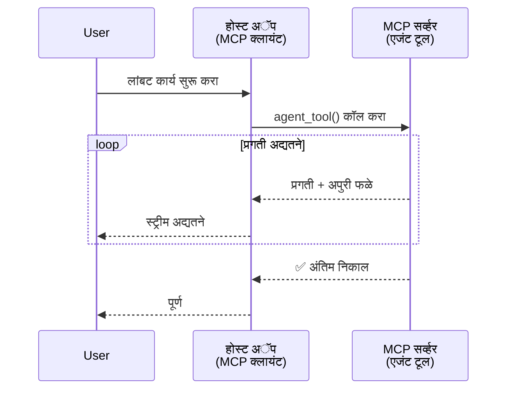
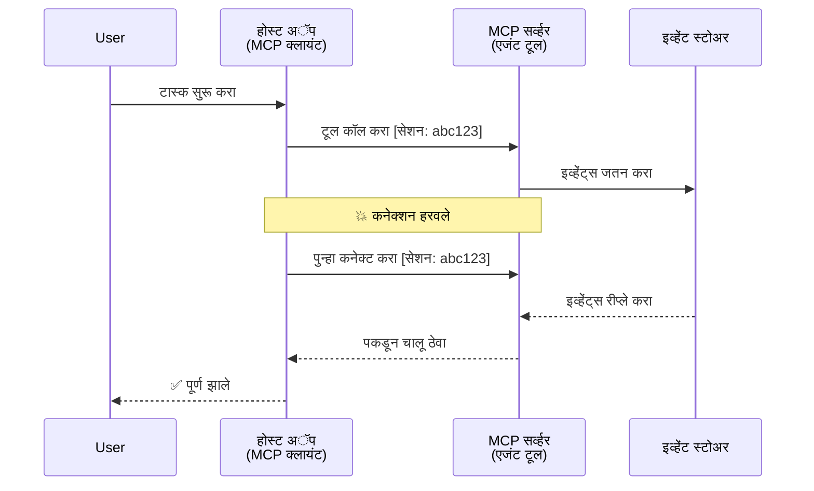
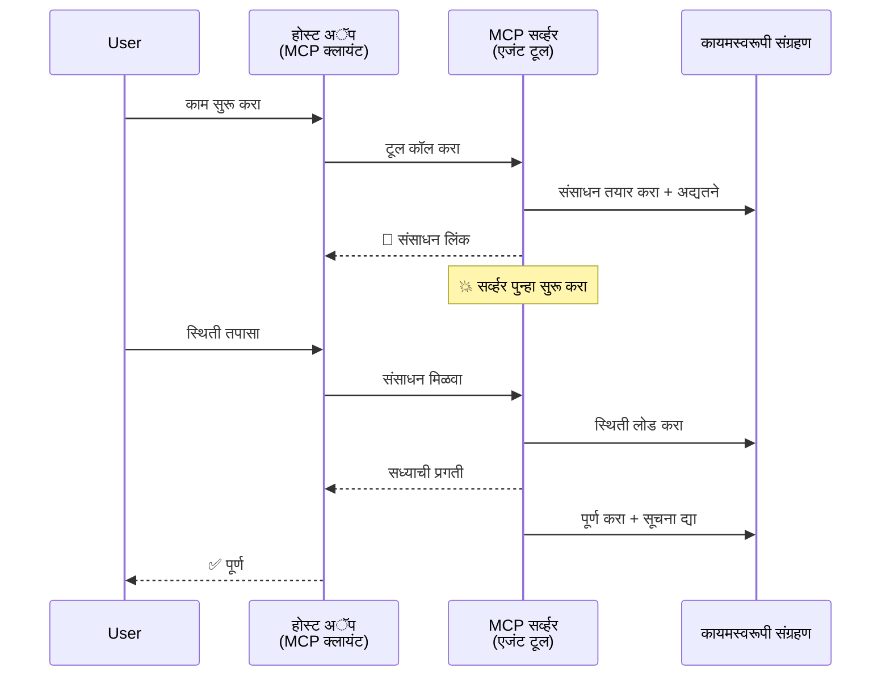
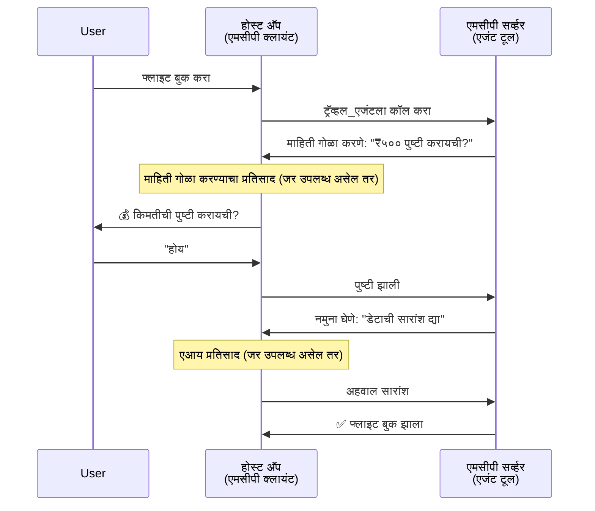
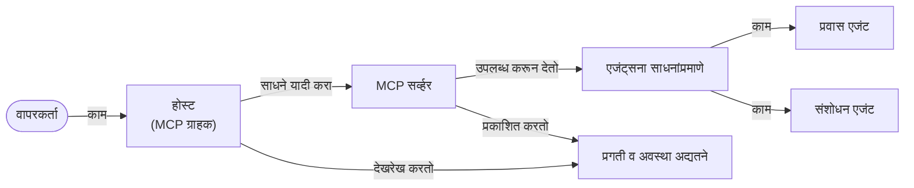

# MCP सह एजंट-टू-एजंट संप्रेषण प्रणाली तयार करीत आहे

> TL;DR - तुम्ही MCP वर एजंट2एजंट कम्युनिकेशन तयार करू शकता का? होय!

MCP त्याच्या मूळ उद्देशापेक्षा "LLMs ला संदर्भ प्रदान करणे" यापेक्षा खूप पुढे विकसित झाले आहे. अलीकडील सुधारणा यात समाविष्ट आहेत [रेझ्युमेबल स्ट्रीम्स](https://modelcontextprotocol.io/docs/concepts/transports#resumability-and-redelivery), [इलीसिटेशन](https://modelcontextprotocol.io/specification/2025-06-18/client/elicitation), [सॅम्पलिंग](https://modelcontextprotocol.io/specification/2025-06-18/client/sampling), आणि सूचनांसाठी ([प्रगती](https://modelcontextprotocol.io/specification/2025-06-18/basic/utilities/progress) आणि [संसाधने](https://modelcontextprotocol.io/specification/2025-06-18/schema#resourceupdatednotification)), आता MCP क्लिष्ट एजंट-टू-एजंट संप्रेषण प्रणाली तयार करण्यासाठी एक मजबूत पाया प्रदान करते.

## एजंट/टूल विषयी गैरसमज

जसे जास्त विकसक एजंटिक वर्तनांसह टूल्सचा शोध घेत आहेत (लांब कालावधीसाठी चालणे, अंमलबजावणी दरम्यान अतिरिक्त इनपुटची गरज असू शकते इत्यादी), एक सामान्य गैरसमज असा आहे की MCP अनुपयुक्त आहे कारण त्याच्या सुरुवातीच्या टूल्सच्या उदाहरणांमध्ये फक्त साधे विनंती-प्रतिक्रिया नमुने होते.

हा दृष्टिकोन जुना आहे. MCP तपशीलाने मागील काही महिन्यांत खूप सुधारणा केल्या आहेत ज्यामुळे लांब चालणाऱ्या एजंटिक वर्तनासाठी ह्या अंतराला भर घालता येतो:

- **स्ट्रीमिंग आणि आंशिक परिणाम**: अंमलबजावणी दरम्यान रिअल-टाइम प्रगती अपडेट्स
- **रीझ्युमेबिलिटी**: क्लायंट डिस्कनेक्शन नंतर पुन्हा कनेक्ट करू शकतात आणि सुरु ठेवू शकतात
- **टिकाऊपणा**: परिणाम सर्व्हर रिस्टार्ट नंतर देखील टिकतात (उदाहरणार्थ, रिसोर्स लिंकच्या माध्यमातून)
- **बहुपट संवाद**: इलीसिटेशन आणि सॅम्पलिंगद्वारे अंमलबजावणी दरम्यान संवादात्मक इनपुट

हे वैशिष्ट्य क्लिष्ट एजंटिक आणि बहु-एजंट अनुप्रयोग सक्षम करण्यासाठी संयोजित केले जाऊ शकतात, सर्व MCP प्रोटोकॉलवर आधारित.

संदर्भासाठी, आपण एजंटला "टूल" म्हणू ज्याचा उपयोग MCP सर्व्हरवर केला जातो. याचा अर्थ एक होस्ट अ‍ॅप्लिकेशन असणे जे MCP क्लायंट लागू करते, जे MCP सर्व्हरशी सत्र प्रस्थापित करते आणि एजंटला कॉल करू शकते.

## MCP टूल "एजंटिक" काय बनवते?

अंमलबजावणीमध्ये प्रवेश करण्याआधी, आपण ठरवू या की लांब चालणाऱ्या एजंट्सना समर्थन देण्यासाठी कोणती पायाभूत सुविधा क्षमता आवश्यक आहे.

> आपण एजंटला असा घटक म्हणू जो दीर्घकाळ स्वायत्तपणे कार्य करू शकतो, जो क्लिष्ट कार्ये हाताळू शकतो आणि ज्याला अनेक संवाद किंवा वास्तविक वेळ अभिप्रायावर आधारित समायोजनांची आवश्यकता असू शकते.

### 1. स्ट्रीमिंग आणि आंशिक परिणाम

पारंपरिक विनंती-प्रतिक्रिया नमुने लांब चालणाऱ्या कार्यांसाठी कार्य करत नाहीत. एजंट्सना आवश्यक आहे:

- रिअल-टाइम प्रगती अपडेट्स
- मध्ये-अंमलबजावणी परिणाम

**MCP समर्थन**: रिसोर्स अपडेट सूचना स्ट्रीमिंग आंशिक परिणाम सक्षम करतात, पण यासाठी JSON-RPC च्या 1:1 विनंती/प्रतिक्रिया मॉडेलच्या द्वंद्वाचा विचार करणे आवश्यक आहे.

| वैशिष्ट्य                   | वापर प्रकरण                                                                                                                                                   | MCP समर्थन                                                                                  |
| -------------------------- | -------------------------------------------------------------------------------------------------------------------------------------------------------------- | -------------------------------------------------------------------------------------------- |
| रिअल-टाइम प्रगती अपडेट्स  | वापरकर्त्याने कोडबेस स्थलांतर कार्याची विनंती केली. एजंट प्रगती स्ट्रीम करतो: "10% - अवलंबन विश्लेषण... 25% - TypeScript फायली रूपांतरण... 50% - आयात अद्यतने..." | ✅ प्रगती सूचना                                                                                |
| आंशिक परिणाम               | "पुस्तक तयार करा" कार्य आंशिक परिणाम स्ट्रीम करतो, उदा., 1) कथा आर्क सारांश, 2) प्रकरणांची यादी, 3) प्रत्येक प्रकरण पूर्ण केल्यावर. होस्ट कोणत्याही टप्प्यावर तपासू, रद्द करू किंवा पुनर्निर्देशित करू शकतो. | ✅ सूचनांना "विस्तारित" करून आंशिक परिणाम समाविष्ट करता येतात, PR 383, 776 च्या प्रस्ताव पहा   |

<div align="center" style="font-style: italic; font-size: 0.95em; margin-bottom: 0.5em;">
<strong>आकृती 1:</strong> ही आकृती दर्शवते की MCP एजंट लांब चालणाऱ्या कार्यादरम्यान रिअल-टाइम प्रगती अपडेट्स आणि आंशिक परिणाम कसे स्ट्रीम करतो, ज्यामुळे वापरकर्त्याला अंमलबजावणींचे रिअल-टाइम निरीक्षण करता येते.
</div>



### 2. रीझ्युमेबिलिटी

एजंट्सनी नेटवर्क तुटण्यांना सुसंवादी पद्धतीने हाताळावे लागते:

- (क्लायंट) डिस्कनेक्टनंतर पुन्हा कनेक्ट करा
- जिथून थांबले तिथून पुढे चालू ठेवा (मेसेज पुनर्वितरण)

**MCP समर्थन**: आज MCP StreamableHTTP ट्रान्सपोर्ट सत्र पुनरारंभ आणि मेसेज पुनर्वितरणला सत्र आयडी आणि अंतिम इव्हेंट आयडीसह समर्थित करतो. महत्त्वाची बाब म्हणजे सर्व्हरने एक इव्हेंटस्टोर लागू करणे आवश्यक आहे जे क्लायंट पुन्हा कनेक्ट झाल्यास इव्हेंटची पुनर्वाजवी करण्याची परवानगी देतो.
लक्षात घ्या की समुदायातील प्रस्ताव (PR #975) ट्रान्सपोर्ट-स्वतंत्र रीझ्युमेबल स्ट्रीम्सवर चर्चा करतो.

| वैशिष्ट्य     | वापर प्रकरण                                                                                                                                                       | MCP समर्थन                                                                |
| ------------ | ---------------------------------------------------------------------------------------------------------------------------------------------------------------- | -------------------------------------------------------------------------- |
| रीझ्युमेबिलिटी | क्लायंट लांब चालणाऱ्या कार्यादरम्यान डिस्कनेक्ट होतो. पुन्हा कनेक्शन झाल्यावर, सत्र उर्वरित इव्हेंटसह सुरू राहतो, जिथून थांबले तिथून सुरळीतपणे चालू ठेवतो. | ✅ StreamableHTTP ट्रान्सपोर्ट, सत्र आयडी, इव्हेंट पुनरावृत्ती, आणि EventStore |

<div align="center" style="font-style: italic; font-size: 0.95em; margin-bottom: 0.5em;">
<strong>आकृती 2:</strong> ही आकृती दर्शवते की MCP ची StreamableHTTP ट्रान्सपोर्ट आणि इव्हेंट स्टोर कसे सुरळीत सत्र पुनरारंभ सक्षम करतात: जर क्लायंट डिस्कनेक्ट झाला तर तो पुन्हा कनेक्ट होऊ शकतो, हरवलेले इव्हेंट पुनर्वाजवी करू शकतो, आणि प्रगती गमावल्याशिवाय कार्य सुरू ठेवू शकतो.
</div>



### 3. टिकाऊपणा

लांब चालणाऱ्या एजंट्सना टिकाऊ स्थितीची गरज असते:

- परिणाम सर्व्हर पुनरारंभांनंतर टिकतात
- स्थिती बँडच्या बाहेरून मिळवता येते
- सत्रांमध्ये प्रगती ट्रॅकिंग

**MCP समर्थन**: MCP आता टूल कॉलसाठी रिसोर्स लिंक रिटर्न टाइप समर्थन करतो. आजचा सामान्य नमुना असा आहे की एक टूल तयार करणे ज्याने रिसोर्स तयार केला आणि त्याचा रिसोर्स लिंक तत्काळ परत केला. टूलमध्ये पाठीमागे कार्य चालू ठेवता येते आणि रिसोर्स अपडेट करू शकतो. त्यावर आधारित क्लायंट हा रिसोर्सची स्थिती पोल करू शकतो आंशिक किंवा पूर्ण निकालांसाठी किंवा अपडेट सूचनांसाठी रिसोर्सला सबस्क्राइब करू शकतो.

येथे एक मर्यादा आहे की रिसोर्सचे पोलिंग किंवा अपडेटसाठी सबस्क्रिप्शन संसाधने वापरू शकते ज्यामुळे प्रमाणात परिणाम होऊ शकतात. एक खुला समुदाय प्रस्ताव (#992 समावेश) वेबहूक किंवा ट्रिगर्स समाविष्ट करण्याच्या शक्यतेवर चर्चा करतो जे सर्व्हर क्लायंट/होस्ट अ‍ॅप्लिकेशनला अपडेट्सची सूचना देऊ शकतो.

| वैशिष्ट्य    | वापर प्रकरण                                                                                                                                        | MCP समर्थन                                                        |
| ---------- | --------------------------------------------------------------------------------------------------------------------------------------------------- | ------------------------------------------------------------------ |
| टिकाऊपणा    | डेटा स्थलांतर कार्यादरम्यान सर्व्हर क्रॅश. परिणाम आणि प्रगती रिस्टार्टनंतर टिकतात, क्लायंट स्थिती तपासू शकतो आणि टिकाऊ संसाधनातून सुरू ठेवू शकतो.            | ✅ टिकाऊ साठवणूक आणि स्थिती सूचनांसह रिसोर्स लिंक               |

आजचा एक सामान्य नमुना असा आहे की टूल तयार केले जाते जे रिसोर्स तयार करते आणि तत्काळ रिसोर्स लिंक परत करते. टूल पाठीमागे कार्य करु शकतो, प्रगती अद्यतनांसाठी किंवा आंशिक निकालांसाठी सूचनाही देऊ शकतो, आणि गरजेनुसार रिसोर्स सामग्री अद्यतनित करू शकतो.

<div align="center" style="font-style: italic; font-size: 0.95em; margin-bottom: 0.5em;">
<strong>आकृती 3:</strong> ही आकृती दर्शवते की MCP एजंट्स टिकाऊ संसाधने आणि स्थिती सूचनांचा वापर करून कसे खात्री करतात की लांब चालणाऱ्या कार्यांना सर्व्हर रिस्टार्टनंतरही जीवनसत्त्व राहतो, ज्यामुळे क्लायंट्स प्रगती तपासू आणि निकाल मिळवू शकतात.
</div>



### 4. बहु-टर्न संवाद

एजंट्सना बर्‍याच वेळा अंमलबजावणी दरम्यान अतिरिक्त इनपुटची आवश्यकता असते:

- मानवी स्पष्टीकरण किंवा मंजुरी
- क्लिष्ट निर्णयांसाठी AI सहाय्य
- डायनॅमिक पॅरामिटर समायोजन

**MCP समर्थन**: सॅम्पलिंग (AI इनपुटसाठी) आणि इलीसिटेशन (मानवी इनपुटसाठी) मधून पूर्णपणे समर्थित.

| वैशिष्ट्य               | वापर प्रकरण                                                                                                                                     | MCP समर्थन                                           |
| ----------------------- | ------------------------------------------------------------------------------------------------------------------------------------------------ | ----------------------------------------------------- |
| बहु-टर्न संवाद          | ट्रॅव्हल बुकिंग एजंट वापरकर्त्याकडून किंमत पुष्टी मागवतो, मग बुकिंग पूर्ण करण्यापूर्वी AI कडून ट्रॅव्हल डेटा सारांश करतो.                           | ✅ मानवी इनपुटसाठी इलीसिटेशन, AI इनपुटसाठी सॅम्पलिंग |

<div align="center" style="font-style: italic; font-size: 0.95em; margin-bottom: 0.5em;">
<strong>आकृती 4:</strong> ही आकृती दर्शवते की MCP एजंट्स कसे संवादामुळे मानवी इनपुट मागवू शकतात किंवा अंमलबजावणी दरम्यान AI सहाय्य मागवू शकतात, जे क्लिष्ट, बहु-टर्न वर्कफ्लोजना समर्थन देते जसे पुष्टीकरणे आणि डायनॅमिक निर्णय घेणे.
</div>



## MCP वर लांब चालणाऱ्या एजंट्सची अंमलबजावणी - कोड आढावा

या लेखाचा भाग म्हणून, आम्ही एक [कोड रिपॉजिटरी](https://github.com/victordibia/ai-tutorials/tree/main/MCP%20Agents) प्रदान करतो ज्यामध्ये MCP Python SDK वापरून लांब चालणाऱ्या एजंट्सची पूर्ण अंमलबजावणी आहे ज्यात StreamableHTTP ट्रान्सपोर्ट सत्र पुनरारंभ आणि मेसेज पुनर्वितरणासाठी आहे. अंमलबजावणी दाखवते की MCP क्षमता कशा एकत्र करून प्रगत एजंट-सदृश वर्तन सक्षम करता येते.

विशेषतः, आम्ही दोन मुख्य एजंट टूल्ससह एक सर्व्हर अंमलबजावितो:

- **ट्रॅव्हल एजंट** - इलीसिटेशनद्वारे किंमत पुष्टीसह ट्रॅव्हल बुकिंग सेवा अनुकरण करते
- **रिसर्च एजंट** - सॅम्पलिंगद्वारे AI सहाय्यित सारांशांसह संशोधन कार्य करते

दोन्ही एजंट्स रिअल-टाइम प्रगती अपडेट्स, संवादात्मक पुष्टीकरणे आणि पूर्ण सत्र पुनरारंभ क्षमताही दर्शवितात.

### मुख्य अंमलबजावणी संकल्पना

खालील विभाग प्रत्येक क्षमतेसाठी सर्व्हर-साइड एजंट अंमलबजावणी आणि क्लायंट-साइड होस्ट हाताळणी दाखवतात:

#### स्ट्रीमिंग आणि प्रगती अपडेट्स - रिअल-टाइम कार्य स्थिती

स्ट्रीमिंग एजंट्सना लांब चालणाऱ्या कार्यांदरम्यान रिअल-टाइम प्रगती अपडेट देण्यास सक्षम करते, वापरकर्त्यांना कार्याची स्थिती आणि मध्ये-परिणामांसोबत माहिती ठेवते.

**सर्व्हर अंमलबजावणी (एजंट प्रगती सूचनां पाठवतो):**

```python
# server/server.py येथून - प्रवास एजंट प्रगती अद्यतने पाठवत आहे
for i, step in enumerate(steps):
    await ctx.session.send_progress_notification(
        progress_token=ctx.request_id,
        progress=i * 25,
        total=100,
        message=step,
        related_request_id=str(ctx.request_id)
    )
    await anyio.sleep(2)  # कामाचा अनुकरण करा

# पर्यायी: तपशीलवार टप्प्याटप्प्याने अद्यतनांसाठी लॉग संदेश
await ctx.session.send_log_message(
    level="info",
    data=f"Processing step {current_step}/{steps} ({progress_percent}%)",
    logger="long_running_agent",
    related_request_id=ctx.request_id,
)
```

**क्लायंट अंमलबजावणी (होस्ट प्रगती अपडेट्स प्राप्त करतो):**

```python
# client/client.py मधून - क्लायंट रिअल-टाइम सूचना हाताळत आहे
async def message_handler(message) -> None:
    if isinstance(message, types.ServerNotification):
        if isinstance(message.root, types.LoggingMessageNotification):
            console.print(f"📡 [dim]{message.root.params.data}[/dim]")
        elif isinstance(message.root, types.ProgressNotification):
            progress = message.root.params
            console.print(f"🔄 [yellow]{progress.message} ({progress.progress}/{progress.total})[/yellow]")

# सत्र तयार करताना संदेश हाताळणारा नोंदवा
async with ClientSession(
    read_stream, write_stream,
    message_handler=message_handler
) as session:
```

#### इलीसिटेशन - वापरकर्ता इनपुट मागणे

इलीसिटेशन एजंट्सना अंमलबजावणी दरम्यान वापरकर्ता इनपुट मागण्यास सक्षम करते. हे पुष्टीकरणे, स्पष्टीकरणे किंवा मंजुरीसाठी अत्यावश्यक आहे.

**सर्व्हर अंमलबजावणी (एजंट पुष्टीकरण मागतो):**

```python
# सर्व्हर/server.py मधून - प्रवास एजंट किमतीची पुष्टी करत आहे
elicit_result = await ctx.session.elicit(
    message=f"Please confirm the estimated price of $1200 for your trip to {destination}",
    requestedSchema=PriceConfirmationSchema.model_json_schema(),
    related_request_id=ctx.request_id,
)

if elicit_result and elicit_result.action == "accept":
    # बुकिंगसह पुढे जा
    logger.info(f"User confirmed price: {elicit_result.content}")
elif elicit_result and elicit_result.action == "decline":
    # बुकिंग रद्द करा
    booking_cancelled = True
```

**क्लायंट अंमलबजावणी (होस्ट इलीसिटेशन कॉलबॅक प्रदान करतो):**

```python
# client/client.py मधून - क्लाएंट हाताळणी विनंत्या
async def elicitation_callback(context, params):
    console.print(f"💬 Server is asking for confirmation:")
    console.print(f"   {params.message}")

    response = console.input("Do you accept? (y/n): ").strip().lower()

    if response in ['y', 'yes']:
        return types.ElicitResult(
            action="accept",
            content={"confirm": True, "notes": "Confirmed by user"}
        )
    else:
        return types.ElicitResult(
            action="decline",
            content={"confirm": False, "notes": "Declined by user"}
        )

# सत्र तयार करताना कॉलबॅक नोंदवा
async with ClientSession(
    read_stream, write_stream,
    elicitation_callback=elicitation_callback
) as session:
```

#### सॅम्पलिंग - AI सहाय्य मागणे

सॅम्पलिंग एजंट्सना अंमलबजावणी दरम्यान क्लिष्ट निर्णयांसाठी किंवा सामग्री निर्मितीसाठी LLM सहाय्य मागण्यास सक्षम करते. हे मानव-एआय संमिश्र वर्कफ्लोजना परवानगी देते.

**सर्व्हर अंमलबजावणी (एजंट AI सहाय्य मागतो):**

```python
# server/server.py मधून - संशोधन एजंट AI सारांश मागवत आहे
sampling_result = await ctx.session.create_message(
    messages=[
        SamplingMessage(
            role="user",
            content=TextContent(type="text", text=f"Please summarize the key findings for research on: {topic}")
        )
    ],
    max_tokens=100,
    related_request_id=ctx.request_id,
)

if sampling_result and sampling_result.content:
    if sampling_result.content.type == "text":
        sampling_summary = sampling_result.content.text
        logger.info(f"Received sampling summary: {sampling_summary}")
```

**क्लायंट अंमलबजावणी (होस्ट सॅम्पलिंग कॉलबॅक प्रदान करतो):**

```python
# client/client.py मधून - क्लायंट हाताळणी सॅम्पलिंग विनंत्या
async def sampling_callback(context, params):
    message_text = params.messages[0].content.text if params.messages else 'No message'
    console.print(f"🧠 Server requested sampling: {message_text}")

    # वास्तविक अनुप्रयोगात, हे LLM API कॉल करू शकते
    # डेमोसाठी, आम्ही एक नकली प्रतिसाद प्रदान करतो
    mock_response = "Based on current research, MCP has evolved significantly..."

    return types.CreateMessageResult(
        role="assistant",
        content=types.TextContent(type="text", text=mock_response),
        model="interactive-client",
        stopReason="endTurn"
    )

# सेशन तयार करताना कॉलबॅक नोंदणी करा
async with ClientSession(
    read_stream, write_stream,
    sampling_callback=sampling_callback,
    elicitation_callback=elicitation_callback
) as session:
```

#### रीझ्युमेबिलिटी - डिस्कनेक्शन दरम्यान सत्र सातत्य

रीझ्युमेबिलिटी सुनिश्चित करते की लांब चालणाऱ्या एजंट कार्यांना क्लायंट डिस्कनेक्शन्सनंतर टिकावे आणि पुन्हा कनेक्ट होण्यावर सुरळीतपणे पुढे चालू ठेवता येते. हे इव्हेंट स्टोअर्स आणि पुनरारंभ टोकनद्वारे अंमलबजावले जाते.

**इव्हेंट स्टोर अंमलबजावणी (सर्व्हर सत्र स्थिती राखतो):**

```python
# server/event_store.py मधून - सोपा इन-मेमरी इव्हेंट स्टोर
class SimpleEventStore(EventStore):
    def __init__(self):
        self._events: list[tuple[StreamId, EventId, JSONRPCMessage]] = []
        self._event_id_counter = 0

    async def store_event(self, stream_id: StreamId, message: JSONRPCMessage) -> EventId:
        """Store an event and return its ID."""
        self._event_id_counter += 1
        event_id = str(self._event_id_counter)
        self._events.append((stream_id, event_id, message))
        return event_id

    async def replay_events_after(self, last_event_id: EventId, send_callback: EventCallback) -> StreamId | None:
        """Replay events after the specified ID for resumption."""
        start_index = None
        stream_id = None
        for index, (event_stream_id, event_id, _) in enumerate(self._events):
            if event_id == last_event_id:
                start_index = index + 1
                stream_id = event_stream_id
                break

        if start_index is None:
            return None

        # फक्त सेशनच्या मूळ प्रवाहातील उशीरा इव्हेंट्स पुन्हा प्ले करा.
        for event_stream_id, event_id, message in self._events[start_index:]:
            if event_stream_id != stream_id:
                continue
            await send_callback(EventMessage(message, event_id))

        return stream_id

# server/server.py मधून - इव्हेंट स्टोर सेशन मॅनेजरकडे देणे
def create_server_app(event_store: Optional[EventStore] = None) -> Starlette:
    server = ResumableServer()

    # पुन्हा सुरू करण्यासाठी इव्हेंट स्टोरसह सेशन मॅनेजर तयार करा
    session_manager = StreamableHTTPSessionManager(
        app=server,
        event_store=event_store,  # इव्हेंट स्टोर सेशन पुन्हा सुरू करण्यास सक्षम करते
        json_response=False,
        security_settings=security_settings,
    )

    return Starlette(routes=[Mount("/mcp", app=session_manager.handle_request)])

# वापर: इव्हेंट स्टोरसह आरंभ करा
event_store = SimpleEventStore()
app = create_server_app(event_store)
```

**रीझ्युम्प्शन टोकनसह क्लायंट मेटाडेटा (क्लायंट साठवलेली स्थिती वापरून पुन्हा कनेक्ट होतो):**

```python
# client/client.py कडून - मेटाडेटासह क्लायंट पुन्हा सुरू करणे
if existing_tokens and existing_tokens.get("resumption_token"):
    # जिथून थांबलो तिथून सुरू ठेवण्यासाठी विद्यमान पुन्हा सुरू करण्याचा टोकन वापरा
    metadata = ClientMessageMetadata(
        resumption_token=existing_tokens["resumption_token"],
    )
else:
    # टोकन प्राप्त झाल्यावर तो जतन करण्यासाठी callback तयार करा
    def enhanced_callback(token: str):
        protocol_version = getattr(session, 'protocol_version', None)
        token_manager.save_tokens(session_id, token, protocol_version, command, args)

    metadata = ClientMessageMetadata(
        on_resumption_token_update=enhanced_callback,
    )

# पुन्हा सुरू करण्याच्या मेटाडेटासह विनंती पाठवा
result = await session.send_request(
    types.ClientRequest(
        types.CallToolRequest(
            method="tools/call",
            params=types.CallToolRequestParams(name=command, arguments=args)
        )
    ),
    types.CallToolResult,
    metadata=metadata,
)
```

होस्ट अ‍ॅप्लिकेशन सत्र आयडी आणि रीझ्युम्प्शन टोकन्स लोकली राखते, ज्यामुळे ते प्रगती किंवा स्थिती न गमावता विद्यमान सत्रांशी पुन्हा कनेक्ट होऊ शकते.

### कोड संघटना

<div align="center" style="font-style: italic; font-size: 0.95em; margin-bottom: 0.5em;">
<strong>आकृती 5:</strong> MCP आधारित एजंट प्रणालीचे आर्किटेक्चर
</div>



**महत्वाची फाइल्स:**

- **`server/server.py`** - रीझ्युमेबल MCP सर्व्हर ट्रॅव्हल आणि रिसर्च एजंट्ससह जे इलीसिटेशन, सॅम्पलिंग, आणि प्रगती अपडेट्स दर्शवितात
- **`client/client.py`** - संवादात्मक होस्ट अ‍ॅप्लिकेशन रीझ्युम्पशन समर्थन, कॉलबॅक हँडलर्स, आणि टोकन व्यवस्थापनेसह
- **`server/event_store.py`** - सत्र पुनरारंभ आणि मेसेज पुनर्वितरण सक्षम करणारी इव्हेंट स्टोर अंमलबजावणी

## MCP वर मल्टि-एजंट संप्रेषणात विस्तारणे

वरील अंमलबजावणी होस्ट अ‍ॅप्लिकेशनचे बुद्धिमत्ता आणि व्याप्ती वाढवून मल्टि-एजंट प्रणालींमध्ये विस्तारीत केली जाऊ शकते:

- **बुद्धिमान कार्य विभागणी**: होस्ट क्लिष्ट वापरकर्ता विनंत्यांचे विश्लेषण करतो आणि त्यांना भिन्न विशेष एजंट्ससाठी उपकार्यांमध्ये विभागतो
- **मल्टि-सर्व्हर समन्वय**: होस्ट अनेक MCP सर्व्हरशी कनेक्शन राखतो, प्रत्येक भिन्न एजंट क्षमता प्रदान करतो
- **कार्य स्थिती व्यवस्थापन**: होस्ट एकाच वेळी अनेक एजंट कार्यांतील प्रगती ट्रॅक करतो, अवलंबित्व आणि अनुक्रमिकतेचे व्यवस्थापन करतो
- **लवचिकता आणि पुनःप्रयत्न**: होस्ट अपयश व्यवस्थापित करतो, पुनःप्रयत्न लॉजिक लागू करतो, आणि एजंट उपलब्ध नसल्यास कार्य पुनर्निर्देशित करतो
- **परिणाम संयोजन**: होस्ट अनेक एजंट्सकडून आउटपुट एकत्र करून सुसंगत अंतिम निकाल तयार करतो

होस्ट एक साध्या क्लायंटपासून बुद्धिमान संयोजकामध्ये विकसित होतो, वितरीत एजंट क्षमता समन्वयित करताच तेच MCP प्रोटोकॉल पाया राखतो.

## निष्कर्ष

MCP च्या सुधारित क्षमतांमुळे - संसाधन सूचना, इलीसिटेशन/सॅम्पलिंग, रीझ्युमेबल स्ट्रीम्स, आणि टिकाऊ संसाधने - क्लिष्ट एजंट-टू-एजंट संवाद सक्षम होतो, पण प्रोटोकॉल सोप्या स्वरूपात राखली जाते.

## सुरूवात कशी करावी

स्वतःचा एजंट2एजंट सिस्टम तयार करण्यास तयार आहात? हे पावले अनुसरा:

### 1. डेमो चालवा

```bash
# पुन्हा सुरु करण्यासाठी इव्हेंट स्टोअर सहित सर्व्हर सुरु करा
python -m server.server --port 8006

# दुसऱ्या टर्मिनलमध्ये, इंटरऐक्टिव्ह क्लायंट चालवा
python -m client.client --url http://127.0.0.1:8006/mcp
```

**संवादात्मक मोडमधील उपलब्ध आदेश:**

- `travel_agent` - इलीसिटेशनद्वारे किंमत पुष्टीसह ट्रॅव्हल बुकिंग करा
- `research_agent` - सॅम्पलिंगद्वारे AI सहाय्यित सारांशांसह संशोधन करा
- `list` - सर्व उपलब्ध टूल्स दाखवा
- `clean-tokens` - रीझ्युम्प्शन टोकन स्पष्ट करा
- `help` - तपशीलवार आदेश मदत दाखवा
- `quit` - क्लायंट बाहेर पडा

### 2. रीझ्युम्पशन क्षमता तपासा

- लांब चालणारा एजंट सुरू करा (उदा., `travel_agent`)
- अंमलबजावणी दरम्यान क्लायंट मध्ये व्यत्यय आणा (Ctrl+C दाबा)
- क्लायंट पुन्हा सुरू करा - तो आपोआप जिथून थांबले तिथून चालू ठेवेल

### 3. अन्वेषण करा आणि विस्तारा करा

- **उदाहरणे तपासा**: [mcp-agents](https://github.com/victordibia/ai-tutorials/tree/main/MCP%20Agents) येथे पाहा
- **समुदायात सहभागी व्हा**: GitHub वरील MCP चर्चेत सहभागी व्हा
- **प्रयोग करा**: एक साधे लांब चालणारे कार्य सुरू करा आणि हळूहळू स्ट्रीमिंग, रीझ्युमेबिलिटी, आणि मल्टि-एजंट समन्वय जोडा

हे दाखविते की MCP कसे बुद्धिमान एजंट वर्तन सक्षम करू शकतो आणि टूल आधारित साधेपणाही राखतो.

एकूणच, MCP प्रोटोकॉल स्पेक जलद गतीने विकसित होत आहे; वाचकांनी अधिकृत दस्तऐवज संकेतस्थळावर अधिक अलीकडील अद्यतनांसाठी भेट देण्याचा सल्ला दिला आहे - https://modelcontextprotocol.io/introduction

---

<!-- CO-OP TRANSLATOR DISCLAIMER START -->
**अस्वीकरण**:
हा दस्तऐवज AI भाषांतर सेवा [Co-op Translator](https://github.com/Azure/co-op-translator) चा वापर करून अनुवादित केला आहे. जरी आम्ही अचूकतेसाठी प्रयत्न करतो, तरी कृपया लक्षात घ्या की स्वयंचलित भाषांतरांमध्ये त्रुटी किंवा अचूकतेची कमतरता असू शकते. मूळ दस्तऐवज त्याच्या मूळ भाषेत अधिकृत स्रोत मानला पाहिजे. महत्त्वाची माहिती असल्यास, व्यावसायिक मानवी भाषांतराची शिफारस केली जाते. या भाषांतराच्या वापरामुळे उद्भवणाऱ्या कोणत्याही गैरसमज किंवा चुकीच्या अर्थलावणीसाठी आम्ही जबाबदार नाही.
<!-- CO-OP TRANSLATOR DISCLAIMER END -->