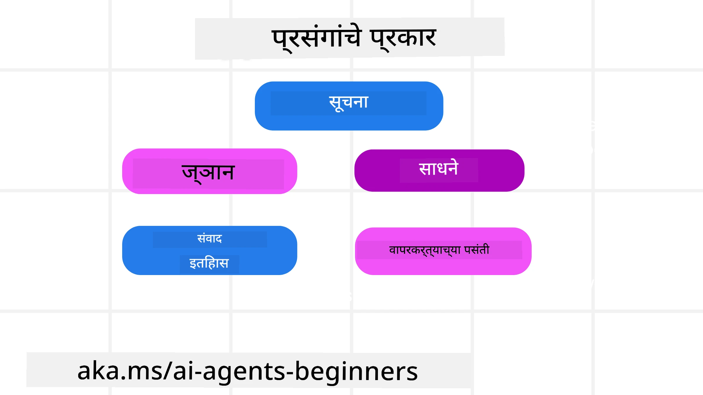
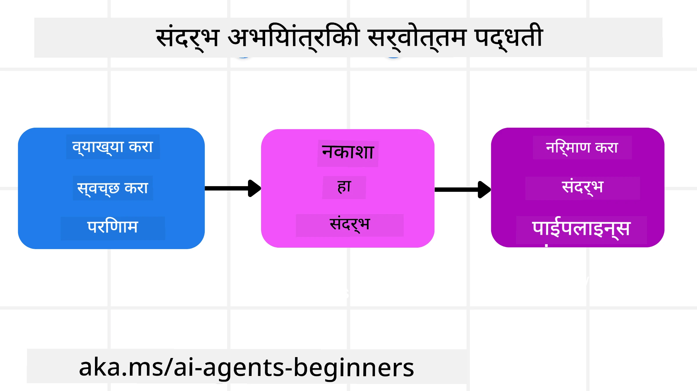

# AI एजंटसाठी संदर्भ अभियांत्रण

> _(या धड्याचा व्हिडिओ पाहण्यासाठी वर दिलेल्या चित्रावर क्लिक करा)_

तुम्ही ज्या अनुप्रयोगासाठी AI एजंट तयार करत आहात, त्याचा गुंतागुंतीचा अभ्यास करणे विश्वसनीय एजंट तयार करण्यासाठी महत्त्वाचे आहे. आपल्याला अशा AI एजंटची निर्मिती करणे आवश्यक आहे जे प्रभावीपणे माहिती व्यवस्थापित करू शकतील आणि केवळ प्रॉम्प्ट अभियांत्रणापेक्षा जटिल गरजा पूर्ण करू शकतील.

या धड्यात, आपण संदर्भ अभियांत्रण म्हणजे काय आणि AI एजंट तयार करताना त्याची भूमिका काय आहे हे पाहणार आहोत.

## परिचय

हा धडा खालील बाबींचा समावेश करेल:

• **संदर्भ अभियांत्रण म्हणजे काय** आणि ते प्रॉम्प्ट अभियांत्रणापेक्षा कसे वेगळे आहे.

• **प्रभावी संदर्भ अभियांत्रणासाठी धोरणे**, ज्यात माहिती लिहिणे, निवडणे, संक्षेप करणे आणि वेगळे करणे यांचा समावेश आहे.

• **सामान्य संदर्भ अपयश** जे तुमच्या AI एजंटला बिघडवू शकतात आणि त्यांची दुरुस्ती कशी करावी.

## शिक्षण उद्दिष्टे

हा धडा पूर्ण केल्यावर, तुम्हाला खालील बाबी समजतील:

• **संदर्भ अभियांत्रणाचे परिभाषित करणे** आणि त्यास प्रॉम्प्ट अभियांत्रणापासून कसे वेगळे करायचे ते.

• **LLM (लार्ज लँग्वेज मॉडेल) अनुप्रयोगांमधील संदर्भातील मुख्य घटक ओळखणे**.

• **एजंटच्या कामगिरीत सुधारणा करण्यासाठी संदर्भ लिहिणे, निवडणे, संक्षेप करणे, आणि वेगळे करण्याच्या धोरणांचा वापर करणे**.

• **सामान्य संदर्भ अपयश** ओळखणे - जसे की विषबाधा, विचलन, गोंधळ आणि संघर्ष, आणि त्यासाठी उपाययोजना करणे.

## संदर्भ अभियांत्रण म्हणजे काय?

AI एजंटसाठी, संदर्भ म्हणजे एखादा AI एजंट विशिष्ट क्रिया करण्यासाठी अंतर्गत नियोजन केलेले घटक. संदर्भ अभियांत्रण म्हणजे AI एजंट पुढील टप्पा पूर्ण करू शकेल यासाठी योग्य माहिती मिळवणं सुनिश्चित करण्याचा सराव. संदर्भ खिडकीचा आकार मर्यादित असतो, त्यामुळे एजंट तयार करणाऱ्यांनी संदर्भात माहिती जोडणे, काढणे आणि गोळा करणे यासाठी प्रणाली आणि प्रक्रिया तयार करणे आवश्यक आहे.

### प्रॉम्प्ट अभियांत्रण वि. संदर्भ अभियांत्रण

प्रॉम्प्ट अभियांत्रण एक स्थिर सूचनांचा संच वापरून AI एजंटना प्रभावीपणे मार्गदर्शन करण्यावर केंद्रित असते. तर संदर्भ अभियांत्रण म्हणजे गतिशील माहिती संचाचे व्यवस्थापन करणे, ज्यात प्राथमिक प्रॉम्प्टसुद्धा समाविष्ट आहे, जेणेकरून AI एजंट वेळोवेळी आवश्यक माहिती मिळवत राहील. संदर्भ अभियांत्रणाची मुख्य संकल्पना अशी आहे की ही प्रक्रिया पुन्हा पुन्हा करता येण्याजोगी आणि विश्वसनीय व्हावी.

### संदर्भांचे प्रकार

हे लक्षात ठेवणे महत्त्वाचे आहे की संदर्भ केवळ एकच गोष्ट नाही. AI एजंटला लागणारी माहिती विविध स्रोतांमधून येते आणि एजंटला या स्रोतांमध्ये प्रवेश मिळवून देणे आपले कर्तव्य आहे:

AI एजंटला व्यवस्थापित करावी लागणाऱ्या संदर्भांचे प्रकार:

• **सूचना:** हे एजंटचे "नियम" सारखे असतात – प्रॉम्प्ट्स, सिस्टम मेसेजेस, फ्यू-शॉट उदाहरणे (एआयला काहीतरी कसे करायचे ते दाखवणारी उदाहरणे), आणि वापरता येणाऱ्या साधनांचे वर्णन. येथे प्रॉम्प्ट अभियांत्रण आणि संदर्भ अभियांत्रण यांचा संगम होतो.

• **ज्ञान:** यामध्ये तथ्ये, डेटाबेसमधून मिळालेली माहिती, किंवा एजंटने साठवलेली दीर्घकालीन आठवणी यांचा समावेश होतो. यामध्ये एजंटला विविध ज्ञान स्रोतांमध्ये प्रवेश हवा असल्यास Retrieval Augmented Generation (RAG) प्रणालीचा समावेश करता येतो.

• **साधने:** हे बाह्य फंक्शन्स, API आणि MCP सर्व्हरची व्याख्यादेखील असतात जे एजंट कॉल करू शकतो, आणि त्यांनी वापरल्यावर मिळालेला अभिप्राय.

• **संवाद इतिहास:** वापरकर्त्याशी चालणारा चालू संभाषण. वेळ निघताना हे संभाषण जास्त आणि गुंतागुंतीचे होतात ज्यामुळे संदर्भ खिडकीत जागा व्यापली जाते.

• **वापरकर्ता पसंती:** वापरकर्त्याच्या आवड-निवडींबद्दल वेळोवेळी मिळालेली माहिती. या माहितीचा वापर करून प्रमुख निर्णय घेण्यासाठी मदत केली जाते.

## प्रभावी संदर्भ अभियांत्रणासाठी धोरणे

### नियोजन धोरणे

चांगले संदर्भ अभियांत्रण चांगल्या नियोजनाने सुरू होते. संदर्भ अभियांत्रणाचे संकल्पनात्मक वापर कसा करायचा हे समजून घेण्यासाठी खालील पद्धत उपयुक्त आहे:

1. **स्पष्ट परिणाम ठरवा** - AI एजंटना दिल्या जाणार्‍या कामाचे परिणाम स्पष्टपणे ठरवले पाहिजेत. प्रश्न विचारा - "जेव्हा AI एजंट आपले काम पूर्ण करेल तेव्हा जग कसे दिसेल?" म्हणजे, वापरकर्त्याला AI एजंटशी संवाद साधल्यावर काय बदल, माहिती किंवा प्रतिसाद मिळायला हवा.

2. **संदर्भ नकाशा तयार करा** - एकदा AI एजंटच्या परिणामांची व्याख्या केल्यावर, "या कामासाठी AI एजंटला कोणती माहिती हवी?" हा प्रश्न उत्तरावा लागतो. यामुळे तुम्हाला संदर्भ नकाशा बनवण्यास मदत होईल की तेथून माहिती मिळू शकते.

3. **संदर्भ पाईपलाईन्स तयार करा** - तुम्हाला माहिती कुठे आहे हे माहीत असल्यावर, आता प्रश्न आहे, "एजंट ही माहिती कशी मिळवणार?". हे RAG, MCP सर्व्हर्स वापरणे आणि इतर साधने वापरून करता येऊ शकते.

### व्यावहारिक धोरणे

नियोजन महत्त्वाचे आहे, पण एकदा माहिती एजंटच्या संदर्भ खिडकीत येऊ लागली की, तिला व्यवस्थापित करण्यासाठी व्यावहारिक धोरणे असणे आवश्यक आहे:

#### संदर्भ व्यवस्थापन

काही माहिती ऑटोमॅटिकली संदर्भ खिडकीत जोडली जाईल, पण संदर्भ अभियांत्रण म्हणजे अधिक सक्रिय भूमिका घेऊन खालील धोरणांचा वापर करणे:

 1. **एजंट स्क्रॅचपॅड**  
 हे शेकडो एजंटला चालू काम व वापरकर्ता संवादाचे संबंधित नोट्स घेण्याची परवानगी देते. हे संदर्भ खिडकीच्या बाहेर एका फाइल किंवा रनटाइम ऑब्जेक्टमध्ये असावे जे एजंट नंतर सत्रादरम्यान परत मिळवू शकतो.

 2. **आठवणी**  
 स्क्रॅचपॅड सत्राच्या संदर्भाबाहेर माहिती व्यवस्थापित करतात. आठवणी एजंटला अनेक सत्रांमध्ये संबंधित माहिती साठवण्याची आणि परत मिळवण्याची परवानगी देतात. यात सारांश, वापरकर्ता पसंती आणि सुधारणा अभिप्राय यांचा समावेश असू शकतो.

 3. **संदर्भ संक्षेप करणे**  
 संदर्भ खिडकी वाढू लागल्यावर आणि मर्यादेच्या जवळ पोहोचल्यावर सारांश तयार करणे आणि हटवणे यांसारख्या तंत्रांचा वापर केला जातो. यामध्ये महत्त्वाची माहिती टिकवून फक्त ती ठेवणे किंवा जुन्या मेसेजेस काढून टाकणे यांचा समावेश होतो.

 4. **मल्टी-एजंट सिस्टम्स**  
 मल्टी-एजंट सिस्टम तयार करणे संदर्भ अभियांत्रणाचा एक प्रकार आहे कारण प्रत्येक एजंटची स्वतःची संदर्भ खिडकी असते. संदर्भ कसा सामायिक केला जाईल आणि इतर एजंटना कसा पास केला जाईल हे नियोजन करण्याची गरज आहे.

 5. **सँडबॉक्स पर्यावरण**  
 जर एखाद्या एजंटला काही कोड चालवायचा असेल किंवा कागदपत्रातील मोठी माहिती प्रक्रिया करायची असेल, तर यासाठी खूप टोकनची गरज भासू शकते. संदर्भ खिडकीत सगळं साठवण्याऐवजी, एजंट सँडबॉक्स वातावरण वापरू शकतो जे कोड चालवून फक्त निकाल आणि आवश्यक माहिती वाचू शकतो.

 6. **रनटाइम स्टेट ऑब्जेक्ट्स**  
 हे अशा माहितीच्या कंटेनर तयार करून केले जाते जेव्हा एजंटला विशिष्ट माहितीवर प्रवेश हवा असतो. एक क्लिष्ट काम असल्यास, एजंट प्रत्येक उपकार्याचा निकाल साठवू शकतो ज्यामुळे संदर्भ त्याच उपकार्याशी संबंधित राहतो.

#### संदर्भ तपासणी

हे धोरण वापरल्यानंतर, पुढील मॉडेल कॉलने खरोखर काय स्वीकारले हे तपासणे उपयुक्त आहे. एक उपयुक्त डिबगिंग प्रश्न आहे:

> एजंट ने खूप संदर्भ लोड केला, चुकीचा संदर्भ लोड केला, किंवा आवश्यक संदर्भ मिस केला का?

यासाठी तुम्हाला रॉ प्रॉम्प्ट, साधन आउटपुट, किंवा आठवणीची सामग्री लॉग करण्याची गरज नाही. उत्पादनात, लहान संदर्भ तपासणी नोंदी ज्या काउंट, आयडी, हॅशेस, आणि धोरण लेबल्स यांना टिपतात ती प्राधान्याने वापरा:

- **निवड:** किती उमेदवार तुकडे, साधने, किंवा आठवणी विचारात घेतल्या गेल्या, किती निवडल्या गेल्या आणि कोणत्या नियमाने किंवा स्कोअरने इतर फिल्टर केले हे ट्रॅक करा.

- **संक्षेप:** स्रोत श्रेणी किंवा ट्रेस आयडी, सारांश आयडी, संक्षेपपूर्वी नंतरचा अंदाजे टोकन काउंट, आणि पुढील कॉलसाठी मूळ मजकूर वगळला गेला की नाही हे नोंदवा.

- **विच्छेदन:** कोणता उपकार्य वेगळ्या एजंट, सत्र किंवा सँडबॉक्समध्ये चालला, कोणता मर्यादित सारांश परत आला, आणि मोठे साधन परिणाम मुख्य एजंटच्या संदर्भाबाहेर राहिले की नाही हे नोंदवा.

- **आठवणी आणि RAG:** परत मिळालील दस्तऐवज आयडी, आठवणी आयडी, स्कोअर्स, निवडलेले आयडी, आणि रेडॅक्शन स्थिती पूर्ण मजकुराऐवजी साठवा.

- **सुरक्षा आणि गोपनीयता:** संवेदनशील प्रॉम्प्ट मजकूर, साधन आर्ग्युमेंट्स, साधन निकाल किंवा वापरकर्ता स्मृतीबॉडीऐवजी हॅश, आयडी, टोकन बकेट्स, आणि धोरण लेबल्स प्राधान्याने वापरा.

उद्दिष्ट अधिक संदर्भ ठेवणे नाही. तर, पुरावा कसा ठेवलाय हे सांभाळणे जेणेकरून डेव्हलपरला कळेल कोणती संदर्भ धोरण वापरली गेली आणि पुढील मॉडेल कॉल अपेक्षित पद्धतीने बदलला का.

### संदर्भ अभियांत्रणाचे उदाहरण

समजा आपल्याला AI एजंटला **"पॅरिसला माझ्यासाठी सहल बुक करा."** असे आदेश द्यायचे आहेत.

• केवळ प्रॉम्प्ट अभियांत्रणाचा वापर करणारा सोपा एजंट फक्त उत्तर देईल: **"ठीक आहे, तुम्हाला पॅरिसला कधी जायचे आहे?"**. तो फक्त वापरकर्त्याच्या तात्काळ प्रश्नावर प्रक्रिया करेल.

• संदर्भ अभियांत्रण धोरणांचा वापर करणारा एजंट बरेच अधिक करू शकतो. उत्तर देण्याआधी त्याची प्रणाली कदाचित:

  ◦ **तुमचा कॅलेंडर तपासेल** (प्रत्यक्ष वेळेतील माहिती मिळवणे).

  ◦ **भूतकाळातील प्रवास प्राधान्य लक्षात ठेवेल** (दीर्घकालीन आठवणीतून) जसे की प्राधान्य असलेली एअरलायन, बजेट किंवा थेट फ्लाइटची पसंती.

  ◦ **फ्लाइट आणि हॉटेल बुकिंगसाठी उपलब्ध साधने ओळखेल**.

- नंतर, एजंट उत्तर देऊ शकतो: "हाय [तुमचे नाव]! मला दिसते की तुम्ही ऑक्टोबरमधील पहिल्या आठवड्यात फ्री आहात. मी तुमच्या सामान्य बजेटमध्ये [प्राधान्य एअरलायन] च्या माध्यमातून पॅरिससाठी थेट फ्लाइट्स शोधू का?" हे समृद्ध, संदर्भ-समजून दिलेले उत्तर संदर्भ अभियांत्रणाची सामर्थ्य दाखवते.

## सामान्य संदर्भ अपयश

### संदर्भ विषबाधा

**काय आहे:** जेव्हा एखादी भ्रमात्मक (LLM कडून निर्माण झालेली खोटी माहिती) किंवा चूक संदर्भात येते आणि सतत त्याचा संदर्भ दिला जातो, ज्यामुळे एजंट अशक्य उद्दिष्टे ध्येय करतो किंवा अर्थहीन धोरणे तयार करतो.

**काय करावे:** **संदर्भ मान्यता** आणि **क्वारंटाइन** लागू करा. दीर्घकालीन आठवणीत माहिती जोडण्यापूर्वी तिची पडताळणी करा. संभाव्य विषबाधा आढळल्यास, चुकीची माहिती पसरू नये म्हणून नवीन संदर्भ धागे सुरू करा.

**प्रवास बुकिंग उदाहरण:** तुमचा एजंट असा भ्रम निर्माण करतो की **एका लहान स्थानिक विमानतळावरून दूरच्या आंतरराष्ट्रीय शहरासाठी थेट फ्लाइट आहे**, जिथे खरी तर आंतरराष्ट्रीय उड्डाणे उपलब्ध नाहीत. ही अस्तित्वात नसलेली फ्लाइट माहिती संदर्भात साठवली जाते. नंतर तुम्ही बुकिंग करायला सांगताना एजंट सतत अशक्य मार्गासाठी तिकीटे शोधत राहतो, जे त्रुटी निर्माण करते.

**उपाय:** फ्लाइट अस्तित्व आणि मार्गांची रिअल-टाइम API वापरून **तपासणी करण्याचा टप्पा जोडणे** _पूर्वी_ एजंटच्या कार्य संदर्भात फ्लाइट तपशील जोडण्यापूर्वी. पडताळणी अपयशी झाल्यास, चुकीची माहिती "क्वारंटाइन" केली जाते आणि पुढे वापरली जात नाही.

### संदर्भ विचलन

**काय आहे:** जेव्हा संदर्भ इतका मोठा होतो की मॉडेल ट्रेनींग दरम्यान शिकलेल्या माहितीऐवजी जमा झालेल्या इतिहासाकडे जास्त लक्ष देते, ज्यामुळे पुनरावृत्ती किंवा उपयुक्त नसलेल्या क्रिया होतात. संदर्भ खिडकी पूर्ण होण्याआधीही चुकी होऊ शकते.

**काय करावे:** **संदर्भ सारांश तयार करा**. वेळोवेळी जमलेल्या माहितीस संक्षिप्त सारांशांमध्ये रूपांतरित करा, महत्त्वाचा तपशील ठेवून जुना अनावश्यक इतिहास काढून टाका. यामुळे लक्ष "リसेट" होते.

**प्रवास बुकिंग उदाहरण:** तुम्ही बराच काळ स्वप्नातील प्रवास स्थळांबद्दल चर्चा करत होता, ज्यात दोन वर्षांपूर्वीच्या बॅकपॅकिंग ट्रिपचा तपशीलवार उल्लेखही होता. जेव्हा तुम्ही म्हणता **"पुढील महिन्यासाठी स्वस्त फ्लाइट शोधा",** एजंट जुन्या, अनावश्यक तपशीलांमध्ये अडकतो आणि तुम्हाला परत बॅकपॅकिंग साधन किंवा भूतकाळच्या तिकिटांबद्दल विचारतो, आताच्या मागणीकडे दुर्लक्ष करतो.

**उपाय:** काही फेरफटका किंवा संदर्भ खूप मोठा झाल्यावर, एजंटने **संवादातील सर्वात ताजे आणि संबंधित भाग सारांशित करणे** - तुमच्या प्रवासाच्या सध्याच्या तारखा आणि स्थानावर लक्ष केंद्रित करणे - आणि हा संक्षिप्त सारांश पुढील LLM कॉलसाठी वापरणे, कमी संबंधित ऐतिहासिक चॅटला वगळणे.

### संदर्भ गोंधळ

**काय आहे:** अनावश्यक संदर्भ, विशेषतः खूप साधने उपलब्ध असणे, ज्यामुळे मॉडेल चुकीची उत्तरे निर्माण करतो किंवा अनावश्यक साधने कॉल करतो. लहान मॉडेल्सना विशेषतः हे अधिक त्रासदायक होते.

**काय करावे:** RAG तंत्र वापरून **साधन लोडआउट व्यवस्थापन** करा. साधनांचे वर्णन व्हेक्टर डेटाबेसमध्ये साठवा आणि प्रत्येक विशिष्ट कामासाठी फक्त सर्वात संबंधित साधने निवडा. संशोधनात साधनांची निवड ३० पेक्षा कमी ठेवण्याचा सल्ला दिला आहे.

**प्रवास बुकिंग उदाहरण:** तुमच्या एजंटला मोठ्या संख्येने साधने आहेत: `book_flight`, `book_hotel`, `rent_car`, `find_tours`, `currency_converter`, `weather_forecast`, `restaurant_reservations`, इत्यादी. तुम्ही विचारता, **"पॅरिसमध्ये फिरण्याचा सर्वोत्तम मार्ग काय आहे?"** साधनांच्या भरपूर पर्यायांमुळे, एजंट गोंधळून `book_flight` अथवा `rent_car` कॉल करण्याचा प्रयत्न करतो, जरी तुम्हाला सार्वजनिक वाहतूक आवडत असेल, कारण साधनांचे वर्णनांत ओव्हरलॅप असू शकतो किंवा सर्वोत्तम साधन ओळखण्यात अडचण येते.

**उपाय:** साधन वर्णनांवर **RAG वापरा**. जेव्हा तुम्ही पॅरिसमध्ये फिरण्याबद्दल विचारता, तेव्हा सिस्टम तुमच्या क्वेरीवरून फक्त संबंधित साधने जसे की `rent_car` किंवा `public_transport_info` निवडते आणि LLM ला एक लक्ष केंद्रीत साधन संच सादर करते.

### संदर्भ संघर्ष

**काय आहे:** संदर्भात विरोधाभासी माहिती असणे, ज्यामुळे अगदी गोंधळलेले तर्क किंवा वाईट अंतिम उत्तर तयार होतात. हे सहसा जेव्हा माहिती टप्प्याटप्प्याने येते आणि सुरुवातीच्या चुकीच्या अनुमान संदर्भात राहतात तेव्हा होते.

**काय करावे:** संदर्भ काढून टाकणे आणि **ऑफलोडिंग** वापरा. काढून टाकणे म्हणजे जुनी किंवा विरोधी माहिती नवे तपशील येताच काढून टाकणे. ऑफलोडिंग म्हणजे मॉडेलला वेगळी "स्क्रॅचपॅड" कार्यक्षेत्र देणे ज्यामुळे तो माहिती प्रक्रिया करू शकतो पण मुख्य संदर्भ बिघडत नाही.
**प्रवास आरक्षणाचे उदाहरण:** तुम्ही प्रारंभी तुमच्या एजंटला सांगता, **"मला इकॉनॉमी क्लासमध्ये उडायचे आहे."** नंतर संभाषणात, तुम्ही तुमचा निर्णय बदलता आणि म्हणता, **"खरं तर, या प्रवासासाठी, चल bधंदा क्लासमध्ये जाऊया."** जर दोन्ही सूचना सांदर्भिक कंटेक्स्टमध्ये राहिल्या तर, एजंटला विरोधाभासी शोध परिणाम मिळू शकतात किंवा कोणती प्राधान्य द्यायची हे समजून घेण्यात गोंधळ होऊ शकतो.

**उपाय:** **संदर्भ कपात** अमलात आणा. जेव्हा नवीन सूचना जुन्या सूचनेशी विरोध करते, तेव्हा जुनी सूचना काढून टाकली जाते किंवा संदर्भात स्पष्टपणे अधिलिखित केली जाते. पर्यायीप्रमाणे, एजंट विरोधाभासी प्राधान्ये सुसंगत करण्यासाठी **स्क्रॅचपॅड** वापरू शकतो, ज्यामुळे फक्त अंतिम, सुसंगत सूचना त्याच्या कृतींसाठी मार्गदर्शन करते.

## संदर्भ अभियांत्रण विषयी अधिक प्रश्न आहेत का?

इतर शिकणाऱ्यांशी भेटण्यासाठी, ऑफिस तासांना उपस्थित राहण्यासाठी आणि तुमच्या AI एजंट्स प्रश्नांची उत्तरे मिळवण्यासाठी [Microsoft Foundry Discord](https://aka.ms/ai-agents/discord) मध्ये सामील व्हा.

---

<!-- CO-OP TRANSLATOR DISCLAIMER START -->
**अस्वीकरण**:
हा दस्तऐवज AI भाषांतर सेवा [Co-op Translator](https://github.com/Azure/co-op-translator) चा वापर करून अनुवादित केला आहे. जरी आम्ही अचूकतेसाठी प्रयत्न करतो, तरी कृपया लक्षात घ्या की स्वयंचलित भाषांतरांमध्ये त्रुटी किंवा अचूकतेची कमतरता असू शकते. मूळ दस्तऐवज त्याच्या मूळ भाषेत अधिकृत स्रोत मानला पाहिजे. महत्त्वाची माहिती असल्यास, व्यावसायिक मानवी भाषांतराची शिफारस केली जाते. या भाषांतराच्या वापरामुळे उद्भवणाऱ्या कोणत्याही गैरसमज किंवा चुकीच्या अर्थलावणीसाठी आम्ही जबाबदार नाही.
<!-- CO-OP TRANSLATOR DISCLAIMER END -->