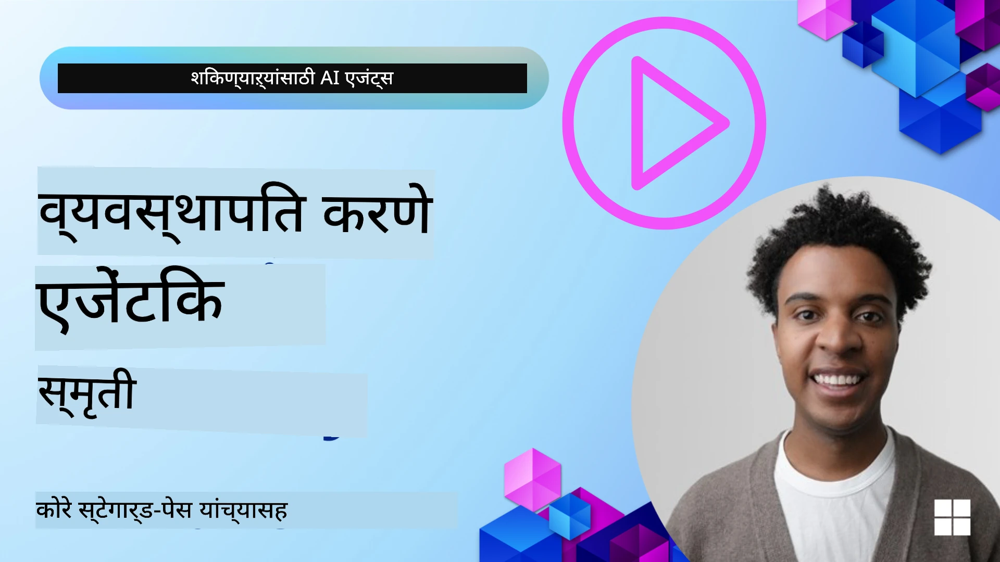

# AI एजंटसाठी मेमरी  

AI एजंट तयार करताना त्याचे अनन्य फायदे हा विषय चर्चेत असतो: कार्य पूर्ण करण्यासाठी टूल्स कॉल करण्याची क्षमता आणि कालांतराने सुधारण्याची क्षमता. आत्मसुधारणा करणाऱ्या एजंट तयार करण्यामागे मेमरी म्हणजे पाया आहे ज्यामुळे वापरकर्त्यांसाठी उत्कृष्ट अनुभव तयार होऊ शकतो.

या धड्यात आपण पाहणार आहोत की AI एजंटसाठी मेमरी म्हणजे काय आणि आपण ती कशी व्यवस्थापित करू शकतो आणि आपल्या अनुप्रयोगांच्या फायद्यासाठी कशी वापरू शकतो.

## परिचय

या धड्यात पुढील बाबी समाविष्ट असतील:

• **AI एजंट मेमरी समजून घेणे**: मेमरी म्हणजे काय आणि हे एजंटसाठी का आवश्यक आहे.

• **मेमरी अमलात आणणे आणि साठवणे**: आपल्या AI एजंट्समध्ये मेमरी क्षमता कशी जोडता येईल, विशेषतः अल्पकालीन आणि दीर्घकालीन मेमरीवर लक्ष केंद्रित करून.

• **AI एजंट्सना आत्मसुधारणीय बनवणे**: मेमरी कशी एजंटना मागील संवादांमधून शिकण्यास आणि कालांतराने सुधारण्यास सक्षम करते.

## उपलब्ध अमलबजावणी

या धड्यात दोन सविस्तर नोटबुक ट्यूटोरियल्स आहेत:

• **[13-agent-memory.ipynb](./13-agent-memory.ipynb)**: Mem0 आणि Azure AI Search वापरून Microsoft Agent Framework सह मेमरीची अंमलबजावणी.

• **[13-agent-memory-cognee.ipynb](./13-agent-memory-cognee.ipynb)**: Cognee वापरून संरचित मेमरीची अंमलबजावणी, ज्यामुळे एम्बेडिंगवर आधारित नॉलेज ग्राफ आपोआप तयार होतो, ग्राफचे दृश्यकरण आणि बुद्धिमान पुनर्प्राप्ती करता येते.

## शिकण्याचे उद्दिष्टे

हा धडा पूर्ण केल्यावर आपल्याला कळेल:

• **AI एजंट मेमरीचे विविध प्रकार ओळखणे**, जसे की वर्किंग, अल्पकालीन आणि दीर्घकालीन मेमरी, तसेच खास प्रकार जसे की पर्सोना आणि एपिसोडिक मेमरी.

• **Microsoft Agent Framework वापरून अल्पकालीन आणि दीर्घकालीन मेमरी अंमलबजावणी आणि व्यवस्थापन** कसे करायचे, तसेच Mem0, Cognee, व्हाइटबोर्ड मेमरी यांसारखे टूल्स कसे वापरायचे आणि Azure AI Search सोबत कसे एकत्र करायचे.

• **आत्मसुधारणा करणाऱ्या AI एजंटसाठी तत्त्वे समजणे** आणि टिकाऊ मेमरी व्यवस्थापन प्रणाली कशी सतत शिकण्यास आणि जुळवून घेण्यास मदत करते.

## AI एजंट मेमरी समजून घेणे

मूलतः, **AI एजंटसाठी मेमरी म्हणजे अशा यंत्रणा ज्या त्यांना माहिती टिकवून ठेवण्याची आणि पुनरावृत्ती करण्याची क्षमता देतात**. ही माहिती संभाषणातील विशिष्ट तपशील, वापरकर्त्याच्या प्राधान्ये, गत क्रियाकलाप किंवा शिकलेल्या नमुन्यांबाबत असू शकते.

मेमरी शिवाय, AI अनुप्रयोग बहुतेक वेळा स्टेटलेस (स्थिती-रहित) असतात, म्हणजे प्रत्येक संवाद नवीन सुरुवातीपासून होतो. यामुळे वापरकर्त्यास वारंवारता आणि निराशाजनक अनुभव येतो जिथे एजंट मागील संदर्भ किंवा प्राधान्ये "भूलतो".

### मेमरी का महत्त्वाची आहे?

एजंटची बुद्धिमत्ता त्याच्या मागील माहिती लक्षात ठेवण्याच्या आणि वापरण्याच्या क्षमतेशी खोलवर संबंधीत आहे. मेमरी एजंट्सना बनवते:

• **परिशीलनक्षम**: मागील क्रिया आणि परिणामातून शिकणे.

• **परस्परसंवादी**: चालू संभाषणाच्या संदर्भाला कायम ठेवणे.

• **पूर्वसूचक आणि प्रतिसादक्षम**: ऐतिहासिक डेटावर आधारित गरजांची अपेक्षा करणे किंवा योग्य प्रतिसाद देणे.

• **स्वायत्त**: संग्रहित ज्ञान वापरून अधिक स्वतंत्रपणे कार्य करणे.

मेमरीची अंमलबजावणी करण्याचा उद्देश एजंटला अधिक **विश्वसनीय आणि सक्षम** बनवणे आहे.

### मेमरीचे प्रकार

#### वर्किंग मेमरी

याला एखाद्या एजंटने एका चालू कार्य किंवा विचार प्रक्रियेदरम्यान वापरल्या जाणाऱ्या स्क्रॅच पेपरसारखे समजा. हे लगेच लागणारी माहिती जिथे पुढील पाऊल मोजण्यासाठी असते तिकडे ठेवते.

AI एजंटसाठी वर्किंग मेमरी बहुतांश वेळा संभाषणातील सर्वांत संबंधित माहिती पकडते, जरी पूर्ण चॅट इतिहास लांब किंवा संक्षिप्त असला तरी. हे आवश्यक तत्वे जसे की गरजा, प्रस्तावना, निर्णय, आणि क्रिया यावर लक्ष केंद्रित करते.

**वर्किंग मेमरीचे उदाहरण**

एखाद्या प्रवास बुकिंग एजंटमध्ये, वर्किंग मेमरी वापरकर्त्याची सध्याची विनंती जसे "मला पॅरिसला ट्रिप बुक करायचा आहे" अशा स्वरूपात ठेवू शकते. ही विशिष्ट गरज एजंटच्या तात्काळ संदर्भात ठेवली जाते ज्यामुळे चालू संवाद मार्गदर्शित होतो.

#### अल्पकालीन मेमरी

हा मेमरीचा प्रकार एका संवाद किंवा सत्राच्या कालावधीसाठी माहिती टिकवून ठेवतो. हा सध्याच्या चॅटचा संदर्भ आहे, ज्यामुळे एजंट मागील संवादातील वाक्यांशांकडे परत पाहू शकतो.

**अल्पकालीन मेमरीचे उदाहरण**

जर एखाद्या वापरकर्त्याने विचारले, "पॅरिसला फ्लाइटचा खर्च किती येईल?" आणि मग "तिथल्या निवासाबद्दल काय?" विचारले, तर अल्पकालीन मेमरी एजंटला "तिथे" म्हणजे "पॅरिस" हे त्या एका संवादात लक्षात ठेवू देते.

#### दीर्घकालीन मेमरी

ही माहिती अनेक संवाद किंवा सत्रांमध्ये टिकून राहते. त्यामुळे एजंट वापरकर्त्याच्या प्राधान्यांची, ऐतिहासिक संवादांची किंवा सामान्य ज्ञानाची जास्त काळासाठी आठवण ठेवू शकतो. ही वैयक्तिकरणासाठी महत्त्वाची आहे.

**दीर्घकालीन मेमरीचे उदाहरण**

दीर्घकालीन मेमरी जसे ठेवते की "बेनला स्कीइंग आणि बाह्य क्रियाकलाप आवडतात, त्याला डोंगराच्या दृश्यासह कॉफी हवी आहे, आणि ते पूर्वीच्या दुखापतीमुळे प्रगत स्की ढलान टाळतो". पूर्वीच्या संवादांमधून शिकलेली ही माहिती भविष्यकालीन प्रवास नियोजन सत्रांमध्ये सूचनांना वैयक्तिक बनवते.

#### पर्सोना मेमरी

हा खास मेमरीचा प्रकार एजंटला सतत एकसारखे "व्यक्तिमत्व" किंवा "पर्सोना" विकसित करण्यात मदत करतो. हे एजंटला स्वतःबद्दल किंवा त्याच्या भूमिका बद्दल तपशील लक्षात ठेवण्याची क्षमता देते, ज्यामुळे संवाद अधिक प्रवाही आणि केंद्रित होतात.

**पर्सोना मेमरीचे उदाहरण**  
जर प्रवास एजंट "तज्ञ स्की नियोजक" म्हणून डिझाइन केला गेला असेल, तर पर्सोना मेमरी या भूमिकेचे पुष्टीकरण करू शकते, ज्यामुळे त्याचे प्रत्युत्तर तज्ञाच्या टोन आणि ज्ञानाशी सुसंगत राहते.

#### वर्कफ्लो / एपिसोडिक मेमरी

ही मेमरी एका गुंतागुंतीच्या कार्यादरम्यान एजंटने घेतलेल्या पावलांची मालिका साठवते, ज्यात यश आणि अपयश देखील असते. हे विशिष्ट "एपिसोड" किंवा भूतकाळातील अनुभव लक्षात ठेवण्यासारखे आहे ज्यातून शिकता येते.

**एपिसोडिक मेमरीचे उदाहरण**

जर एखाद्या एजंटने विशिष्ट फ्लाइट बुक करण्याचा प्रयत्न केला आणि ती अपयशी ठरली कारण ती फ्लाइट उपलब्ध नव्हती, तर एपिसोडिक मेमरी या अपयशाची नोंद ठेवेल, ज्यामुळे पुढील प्रयत्नात एजंट पर्यायी फ्लाइट्स शोधू शकेल किंवा वापरकर्त्याला अधिक माहितीपूर्ण मार्गाने समस्या मांडू शकेल.

#### एंटिटी मेमरी

या मध्ये संभाषणांमधून विशिष्ट एंटिटीज (जसे की लोक, स्थळे, किंवा वस्तू) आणि घटना काढणे आणि लक्षात ठेवणे यांचा समावेश होतो. हे एजंटला मुख्य घटकांबाबत संरचित समज विकसित करण्यास अनुमती देते.

**एंटिटी मेमरीचे उदाहरण**

मागील प्रवासाविषयी संभाषणातून, एजंट "पॅरिस," "एफिल टॉवर," आणि "Le Chat Noir रेस्टॉरंटमध्ये जेवण" अशा एंटिटीज काढू शकतो. भविष्यातील संवादात, एजंट "Le Chat Noir" लक्षात ठेवून तिथे नवीन आरक्षण करण्याची ऑफर देऊ शकतो.

#### संरचित RAG (Retrieval Augmented Generation)

RAG हा व्यापक तंत्र आहे, पण "संरचित RAG" हे एक सामर्थ्यवान मेमरी तंत्रज्ञान म्हणून ठळक आहे. ते विविध स्रोतांमधून (संभाषणे, ई-मेल्स, प्रतिमा) घनदाट, संरचित माहिती काढते आणि त्याचा वापर प्रतिसादांमध्ये अचूकता, पुनरावृत्ती आणि वेग सुधारण्यासाठी करते. पारंपरिक RAG प्रमाणे केवळ सेमॅंटिक सादृश्यतेवर अवलंबून नसून, संरचित RAG माहितीच्या अंतर्निहित रचनेशी कार्य करते.

**संरचित RAG चे उदाहरण**  
केवळ कीवर्ड जुळविण्याऐवजी, संरचित RAG ई-मेलमधून उड्डाणाचे तपशील (गंतव्य, तारीख, वेळ, विमानतळ) पार्स करू शकते आणि हे संरचित स्वरूपात साठवते. यामुळे नेमके प्रश्न जसे की "मंगळवारी मी पॅरिससाठी कोणता फ्लाइट बुक केला?" याचे अचूक उत्तर मिळू शकते.

## मेमरीची अंमलबजावणी आणि साठवण

AI एजंटसाठी मेमरी अंमलबजावणीमध्ये **मेमरी व्यवस्थापन** चा सुव्यवस्थित प्रक्रिया समाविष्ट आहे, ज्यात तयार करणे, साठवणे, पुनर्प्राप्त करणे, एकत्रित करणे, अद्ययावत करणे आणि अगदी "भुलणे" (किंवा हटवणे) यांचा समावेश होतो. पुनर्प्राप्ती हा विशेषतः महत्त्वाचा घटक आहे.

### खासगी मेमरी टूल्स

#### Mem0

एजंट मेमरी साठवण्यासाठी आणि व्यवस्थापित करण्याचा एक मार्ग Mem0 सारख्या खासगी टूल्सचा वापर आहे. Mem0 एक टिकणारी मेमरी लेयर म्हणून कार्य करते, ज्यामुळे एजंट त्याच्या संबंधित संवादांना आठवू शकतो, वापरकर्त्याच्या प्राधान्ये आणि वास्तविक संदर्भ साठवू शकतो, तसेच शुभ आणि अपयशातून शिकू शकतो. याचा अर्थ असा की स्थितीरहित एजंट स्थितीपूर्ण एजंटमध्ये बदले जातात.

हे **दोन टप्यांच्या मेमरी पाइपलाइन: एक्स्ट्रॅक्शन आणि अपडेट** द्वारे काम करते. आधी, एजंटच्या थ्रेडमध्ये जोडलेले संदेश Mem0 सेवेकडे पाठवले जातात, जिथे एक लार्ज लँग्वेज मॉडेल (LLM) संभाषण इतिहासाचा सारांश काढते आणि नवीन स्मृती काढते. नंतर, LLM-ने चालवलेला अपडेट टप्पा हे ठरवतो की या स्मृती जोडायच्या, बदलायच्या की हटवायच्या, आणि त्या एक हायब्रिड डेटाबेसमध्ये साठवल्या जातात ज्यात व्हेक्टर, ग्राफ, आणि की-वॅल्यू डेटाबेस असू शकतो. ही प्रणाली विविध मेमरी प्रकारना समर्थन देते आणि एंटिटी दरम्यान संबंधांचे व्यवस्थापन करण्यासाठी ग्राफ मेमरी देखील समाविष्ट करू शकते.

#### Cognee

दुसरा सामर्थ्यवान दृष्टिकोन म्हणजे **Cognee**, एक मुक्त स्रोत सिमॅंटिक मेमरी आहे जी AI एजंटसाठी संरचित आणि असंरचित डेटा क्वेरी करू शकणाऱ्या नॉलेज ग्राफमध्ये रूपांतरित करते ज्याला एम्बेडिंग्सचा आधार आहे. Cognee **द्विदल साठवण संरचना** प्रदान करते ज्यात व्हेक्टर सादृश्यता शोध आणि ग्राफ संबंध एकत्र केलेले असतात, ज्यामुळे एजंटना केवळ माहिती समान आहे हेच नव्हे तर संकल्पना एकमेकांशी कशा संबंधित आहेत हेही समजते.

हे **हायब्रिड पुनर्प्राप्ती** मध्ये पारंगत आहे ज्यात व्हेक्टर सादृश्यता, ग्राफ संरचना आणि LLM तर्कशास्त्र एकत्र वाळवले जातात - कच्चा चंक शोधणे ते ग्राफ-जाणकार प्रश्न उत्तर देण्यापर्यंत. प्रणाली **सजीव स्मृती** राखते जी विकसित होते आणि वाढते, तसेच एक जोडलेला ग्राफ म्हणून क्वेरी करता येते, ज्यामुळे अल्पकालीन सत्र संदर्भ आणि दीर्घकालीन टिकाऊ स्मृती दोन्ही पुरवते.

Cognee नोटबुक ट्यूटोरियल ([13-agent-memory-cognee.ipynb](./13-agent-memory-cognee.ipynb)) ही एकात्मिक स्मृती थर कसा तयार करायचा हे दाखवते, विविध डेटास्रोतांची आर्थिकपणे समाविष्ट कशी करायची, नॉलेज ग्राफचे दृश्यकरण कसे करायचे आणि विशिष्ट एजंट गरजांसाठी वेगवेगळ्या शोध धोरणांसह क्वेरी कशी करायची याचे व्यावहारिक उदाहरणांसह.

### RAG सह मेमरी साठवणे

Mem0 सारख्या खासगी मेमरी टूल्स व्यतिरिक्त, आपण मजबूत शोध सेवा जसे की **Azure AI Search वापरून स्मृती साठवू आणि पुनर्प्राप्त करू शकता**, विशेषतः संरचित RAG साठी.

यामुळे आपण आपल्या एजंटच्या प्रतिसादांना स्वतःच्या डेटावर आधारित करू शकता, जे अधिक संबंधित आणि अचूक उत्तर सुनिश्चित करते. Azure AI Search वापरकर्त्याचे प्रवास स्मृती, उत्पादन कॅटलॉग, किंवा इतर कोणत्याही विषयवार ज्ञान साठवण्यासाठी वापरता येऊ शकतो.

Azure AI Search समर्थित क्षमता जसे की **संरचित RAG**, ज्यामुळे मोठ्या डेटासेटमधून (संभाषण इतिहास, ईमेल्स, अगदी प्रतिमा) घन, संरचित माहिती काढणे आणि पुनर्प्राप्ती करणे शक्य होते. हे पारंपरिक टेक्स्ट चंकिंग आणि एम्बेडिंग पद्धतींपेक्षा "असाधारण अचूकता आणि पुनरावृत्ती" प्रदान करते.

## AI एजंटना आत्मसुधारणीय बनवणे

आत्मसुधारणीय एजंटसाठी एक सामान्य नमुना असतो ज्यात एक **"ज्ञान एजंट"** समाविष्ट केला जातो. हा स्वतंत्र एजंट वापरकर्ता आणि प्राथमिक एजंटमधील मुख्य संभाषणाचे निरीक्षण करतो. त्याची भूमिका:

1. **मूल्यवान माहिती ओळखणे**: संवादातील कोणताही भाग सामान्य ज्ञान किंवा विशिष्ट वापरकर्ता प्राधान्य म्हणून जतन करण्याजोगा आहे का ते ठरवणे.

2. **काढणे आणि सारांश करणे**: संवादातून आवश्यक असलेले शिक्षण किंवा प्राधान्य संग्रहित करणे.

3. **ज्ञान आधारात साठवणे**: ही काढलेली माहिती बहुधा व्हेक्टर डेटाबेसमध्ये संग्रहित करणे, ज्यामुळे नंतर पुनर्प्राप्ती शक्य होते.

4. **भविष्यातील क्वेरीजसाठी वाढवणे**: जेव्हा वापरकर्ता नवीन क्वेरी सुरु करतो, तेव्हा ज्ञान एजंट संबंधित संग्रहित माहिती पुनर्प्राप्त करून वापरकर्त्याच्या प्रॉम्प्टमध्ये जोडतो, ज्यामुळे प्राथमिक एजंटला महत्त्वाचा संदर्भ मिळतो (RAG प्रमाणे).

### मेमरीसाठी ऑप्टिमायझेशन्स

• **प्रतिक्रिया वेळेचे व्यवस्थापन**: वापरकर्ता संवाद मंदावू नये म्हणून आधी एक स्वस्त, जलद मॉडेल वापरले जाऊ शकते जे वेगाने तपासते की माहिती साठवण्यायोग्य किंवा पुनर्प्राप्त करण्यायोग्य आहे का, नंतर गरज भासल्यास अधिक गुंतागुंतीची काढणी/पुनर्प्राप्ती प्रक्रिया चालवते.

• **ज्ञान आधाराचे देखभाल**: वाढत्या ज्ञान आधारासाठी कमी वापरल्या जाणाऱ्या माहितीला "कोल्ड स्टोरेज" मध्ये हलवले जाऊ शकते ज्यामुळे खर्च व्यवस्थापित केला जातो.

## एजंट मेमरीबाबत अधिक प्रश्न आहेत का?

इतर शिकणाऱ्यांशी भेटायला, ऑफिस अवर्समध्ये सहभागी व्हायला आणि आपले AI एजंटसंबंधित प्रश्न विचारायला [Microsoft Foundry Discord](https://aka.ms/ai-agents/discord) मध्ये सहभागी व्हा.

---

<!-- CO-OP TRANSLATOR DISCLAIMER START -->
**अस्वीकरण**:
हा दस्तऐवज AI भाषांतर सेवा [Co-op Translator](https://github.com/Azure/co-op-translator) वापरून भाषांतरित केलेला आहे. आम्ही अचूकतेसाठी प्रयत्नशील असलो तरी, कृपया लक्षात घ्या की स्वयंचलित भाषांतरामध्ये त्रुटी किंवा अचूकतेची कमतरता असू शकते. मूळ दस्तऐवज त्याच्या मूळ भाषेत अधिकारप्राप्त स्रोत मानला जाण्याचा सल्ला दिला जातो. महत्त्वाची माहिती साठी व्यावसायिक मानवी भाषांतर घेणे उचित राहील. या भाषांतराचा वापर करताना उद्भवलेल्या कोणत्याही गैरसमजुती किंवा चुकीच्या अर्थव्यवस्थेबाबत आम्ही जबाबदार नाही.
<!-- CO-OP TRANSLATOR DISCLAIMER END -->