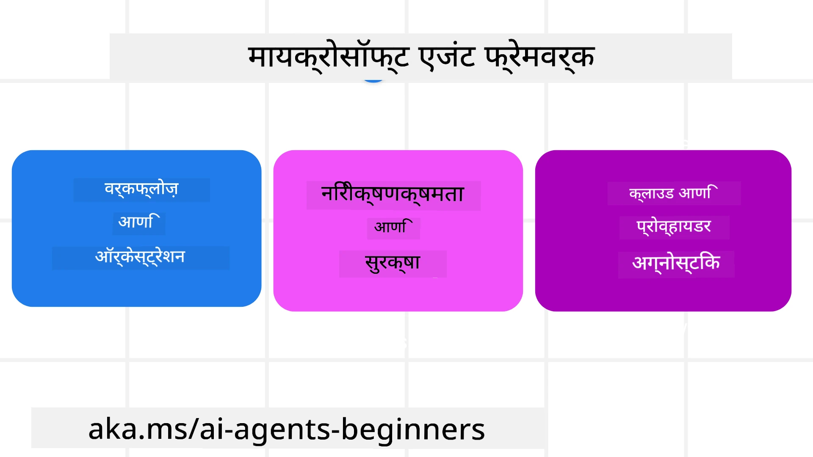
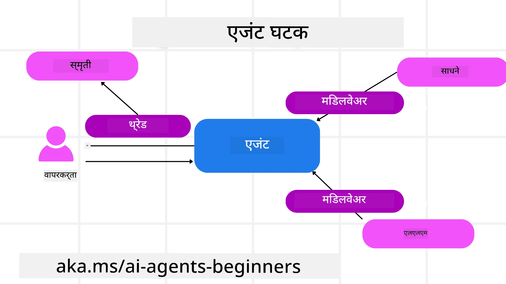

# Microsoft Agent Framework चे अन्वेषण


### परिचय

हा धडा यातील गोष्टी समाविष्ट करेल:

- Microsoft Agent Framework समजून घेणे: प्रमुख वैशिष्ट्ये आणि मूल्य  
- Microsoft Agent Framework च्या मुख्य संकल्पनांचा शोध
- उन्नत MAF पॅटर्न: वर्कफ्लोज, मिडलवेअर, आणि मेमरी

## शिकण्याची उद्दिष्टे

हा धडा पूर्ण केल्यावर, तुम्हाला पुढील गोष्टी माहित असतील:

- Microsoft Agent Framework वापरून प्रॉडक्शन-रेडी AI एजंट तयार करण्याची पद्धत
- Microsoft Agent Framework चे मुख्य वैशिष्ट्ये तुमच्या एजेंटिक वापरप्रकरणात कशा लागू करायच्या
- वर्कफ्लो, मिडलवेअर आणि ऑब्झर्वेबिलिटी यांसारखी उन्नत पद्धती वापरणे

## कोड नमुने

[Microsoft Agent Framework (MAF)](https://aka.ms/ai-agents-beginners/agent-framewrok) साठी कोड नमुने या रेपॉझिटरीमध्ये `xx-python-agent-framework` आणि `xx-dotnet-agent-framework` फाइल्सखाली सापडतील.

## Microsoft Agent Framework समजून घेणे



[Microsoft Agent Framework (MAF)](https://aka.ms/ai-agents-beginners/agent-framewrok) हे AI एजंट तयार करण्यासाठी Microsoft चे एक एकीकृत फ्रेमवर्क आहे. हे उत्पादन व संशोधन वातावरणातील वेगवेगळ्या एजेंटिक वापरप्रकरणांना हाताळण्यासाठी लवचिकता देते, ज्यात समाविष्ट आहेत:

- **क्रमिक एजंट ऑर्केस्ट्रेशन** अशा परिस्थितीत जिथे पायरी-दर-पायरी वर्कफ्लो आवश्यक असतात.
- **समानकालिक ऑर्केस्ट्रेशन** अशा परिस्थितीत जिथे एजंट्स एकाच वेळी कार्य पूर्ण करतात.
- **ग्रुप चॅट ऑर्केस्ट्रेशन** अशा परिस्थितीत जिथे एजंट एकत्रितपणे एका कार्यावर सहयोग करतात.
- **हॅण्डऑफ ऑर्केस्ट्रेशन** अशा परिस्थितीत जिथे एजंट उपकार्य पूर्ण होत असताना कार्य एकमेकांना हँडऑफ करतात.
- **मैग्नेटिक ऑर्केस्ट्रेशन** अशा परिस्थितीत जिथे एक मॅनेजर एजंट कार्य सूची तयार आणि सुधारित करतो आणि उपएजंट्सना समन्वयित करतो.

प्रॉडक्शनमधील AI एजंट पुरवण्यासाठी, MAF मध्ये पुढील वैशिष्ट्येदेखील आहेत:

- **ऑब्झर्वेबिलिटी** OpenTelemetry वापरून जिथे AI एजंटच्या प्रत्येक क्रियेचे पृथक्करण, साधन कॉल, ऑर्केस्ट्रेशन पावले, कारणमंथन प्रवाह आणि Microsoft Foundry डॅशबोर्डद्वारे कार्यक्षमता निरीक्षण केले जाते.
- **सुरक्षा** Microsoft Foundry वर एजंट होस्ट करून ज्यामध्ये भूमिका-आधारित प्रवेश, खाजगी डेटा हॅंडलिंग आणि अंगभूत कंटेंट सुरक्षा यांसारखे सुरक्षा नियंत्रण समाविष्ट आहेत.
- **टिकाऊपणा (Durability)** कारण एजंट थ्रेड्स आणि वर्कफ्लो थांबवता, पुन्हा सुरु करता आणि त्रुटींपासून पुनर्प्राप्त करू शकतात, ज्यामुळे दीर्घकाळ चालणाऱ्या प्रक्रियांना सक्षम केले जाते.
- **नियंत्रण** कारण मानव-इन-द-लूप वर्कफ्लो समर्थित आहेत जिथे कार्यांवर मानवी मंजुरी आवश्यक म्हणून चिन्हांकित केली जाऊ शकते.

Microsoft Agent Framework हे इंटरऑपरेबल राहण्यावरही लक्ष केंद्रित करते:

- **क्लाउड-ऍग्नॉस्टिक** - एजंट कंटेनर्समध्ये, ऑन-प्रिम आणि वेगवेगळ्या क्लाउडवर चालवता येऊ शकतात.
- **प्रोव्हायडर-ऍग्नॉस्टिक** - एजंट तुमच्या प्राधान्यपूर्ण SDK वापरून तयार केले जाऊ शकतात ज्यात Azure OpenAI आणि OpenAI समाविष्ट आहेत
- **ओपन स्टँडर्ड्स ची एकत्रीकरण** - एजंट दुसरे एजंट आणि साधने शोधण्यासाठी आणि वापरण्यासाठी Agent-to-Agent (A2A) आणि Model Context Protocol (MCP) सारख्या प्रोटोकॉलचा उपयोग करू शकतात.
- **प्लगइन्स आणि कनेक्टर्स** - Microsoft Fabric, SharePoint, Pinecone आणि Qdrant सारख्या डेटा आणि मेमरी सेवांशी कनेक्शन केले जाऊ शकतात.

चला पाहूया की हे वैशिष्ट्ये Microsoft Agent Framework च्या काही मुख्य संकल्पनांवर कशी लागू केली जातात.

## Microsoft Agent Framework चे मुख्य संकल्पना

### एजंट्स



**एजंट तयार करणे**

एजंट तयार करण्यासाठी inference service (LLM Provider), AI एजंट साठी अनुसरण करण्यासाठी निर्देशांचा संच, आणि एक नियुक्त `name` परिभाषित करणे आवश्यक आहे:

```python
agent = AzureOpenAIChatClient(credential=AzureCliCredential()).create_agent( instructions="You are good at recommending trips to customers based on their preferences.", name="TripRecommender" )
```

वरील उदाहरण `Azure OpenAI` वापरत आहे परंतु एजंट विविध सेवा वापरून तयार केले जाऊ शकतात ज्यात `Microsoft Foundry Agent Service` समाविष्ट आहे:

```python
AzureAIAgentClient(async_credential=credential).create_agent( name="HelperAgent", instructions="You are a helpful assistant." ) as agent
```

OpenAI `Responses`, `ChatCompletion` APIs

```python
agent = OpenAIResponsesClient().create_agent( name="WeatherBot", instructions="You are a helpful weather assistant.", )
```

```python
agent = OpenAIChatClient().create_agent( name="HelpfulAssistant", instructions="You are a helpful assistant.", )
```

किंवा A2A प्रोटोकॉल वापरून रिमोट एजंट:

```python
agent = A2AAgent( name=agent_card.name, description=agent_card.description, agent_card=agent_card, url="https://your-a2a-agent-host" )
```

**एजंट चालवणे**

एजंट्स `.run` किंवा `.run_stream` पद्धती वापरून नॉन-स्ट्रीमिंग किंवा स्ट्रीमिंग प्रतिसादांसाठी चालवले जातात.

```python
result = await agent.run("What are good places to visit in Amsterdam?")
print(result.text)
```

```python
async for update in agent.run_stream("What are the good places to visit in Amsterdam?"):
    if update.text:
        print(update.text, end="", flush=True)

```

प्रत्येक एजंट रनमध्ये `max_tokens` सारखे पॅरामीटर्स सानुकूल करण्यासाठी पर्याय असू शकतात, एजंट कॉल करू शकणारी `tools`, आणि अगदी एजंटसाठी वापरले जाणारे `model` सुद्धा.

हे त्यावेळी उपयुक्त असते जेव्हा वापरकर्त्याच्या कार्यासाठी विशिष्ट मॉडेल्स किंवा साधने आवश्यक असतात.

**टूल्स**

टूल्स एजंट परिभाषित करताना दोन्ही ठिकाणी परिभाषित केली जाऊ शकतात:

```python
def get_attractions( location: Annotated[str, Field(description="The location to get the top tourist attractions for")], ) -> str: """Get the top tourist attractions for a given location.""" return f"The top attractions for {location} are." 


# जेव्हा थेट ChatAgent तयार करताना

agent = ChatAgent( chat_client=OpenAIChatClient(), instructions="You are a helpful assistant", tools=[get_attractions]

```

आणि एजंट चालवताना सुद्धा:

```python

result1 = await agent.run( "What's the best place to visit in Seattle?", tools=[get_attractions] # हे साधन फक्त या रनसाठी प्रदान केले आहे )
```

**एजंट थ्रेड्स**

एजंट थ्रेड्स मल्टि-टर्न संभाषणे हाताळण्यासाठी वापरली जातात. थ्रेड्स खालीलपैकी कोणत्याही पद्धतीने तयार केली जाऊ शकतात:

- `get_new_thread()` वापरून जे थ्रेड कालांतराने जतन करण्यास सक्षम करते
- एजंट चालवताना ऑटोमॅटिकली थ्रेड तयार करणे आणि ती थ्रेड फक्त चालू रनदरम्यान टिकवणे

थ्रेड तयार करण्यासाठी कोड असे दिसते:

```python
# नवीन थ्रेड तयार करा.
thread = agent.get_new_thread() # एजंटला त्या थ्रेडसह चालवा.
response = await agent.run("Hello, I am here to help you book travel. Where would you like to go?", thread=thread)

```

नंतर तुम्ही थ्रेड सिरीयलाइझ करून नंतरच्या वापरासाठी संग्रहित करू शकता:

```python
# नवीन थ्रेड तयार करा.
thread = agent.get_new_thread() 

# थ्रेडसह एजंट चालवा.

response = await agent.run("Hello, how are you?", thread=thread) 

# साठवणीसाठी थ्रेड सीरिअलाइझ करा.

serialized_thread = await thread.serialize() 

# साठवणीतून लोड केल्यावर थ्रेडची स्थिती डीसीरिअलाइझ करा.

resumed_thread = await agent.deserialize_thread(serialized_thread)
```

**एजंट मिडलवेअर**

एजंट्स वापरकर्त्यांचे कार्य पूर्ण करण्यासाठी टूल्स आणि LLMs शी संवाद करतात. काही परिस्थितींमध्ये, या परस्परसंवादांदरम्यान कृती करण्याची किंवा ट्रॅक करण्याची गरज असते. एजंट मिडलवेअर आम्हाला हे करण्याची परवानगी देते:

*फंक्शन मिडलवेअर*

हे मिडलवेअर एजंट आणि त्या फंक्शन/टूलच्या दरम्यान एखादी कृती चालवण्याची परवानगी देते ज्याला तो कॉल करणार आहे. उदाहरणार्थ, तुम्हाला फंक्शन कॉलवर काही लॉगिंग करायचे असल्यास हे वापरले जाऊ शकते.

खालील कोडमध्ये `next` हे पुढील मिडलवेअर किंवा प्रत्यक्ष फंक्शन कॉल केले जाईल की नाही हे परिभाषित करते.

```python
async def logging_function_middleware(
    context: FunctionInvocationContext,
    next: Callable[[FunctionInvocationContext], Awaitable[None]],
) -> None:
    """Function middleware that logs function execution."""
    # पूर्व-प्रक्रिया: फंक्शनच्या अंमलबजावणीपूर्वी लॉग करा
    print(f"[Function] Calling {context.function.name}")

    # पुढील मिडलवेअर किंवा फंक्शनच्या अंमलबजावणीकडे पुढे जा
    await next(context)

    # पश्च-प्रक्रिया: फंक्शनच्या अंमलबजावणीनंतर लॉग करा
    print(f"[Function] {context.function.name} completed")
```

*चॅट मिडलवेअर*

हे मिडलवेअर एजंट आणि LLM दरम्यानच्या विनंत्यांदरम्यान एखादी कृती नोंदवण्याची किंवा चालवण्याची परवानगी देते.

यात AI सर्व्हिसकडे पाठवण्यात येणाऱ्या `messages` सारखी महत्त्वाची माहिती असते.

```python
async def logging_chat_middleware(
    context: ChatContext,
    next: Callable[[ChatContext], Awaitable[None]],
) -> None:
    """Chat middleware that logs AI interactions."""
    # पूर्व-प्रक्रिया: AI कॉलपूर्वी नोंद करा
    print(f"[Chat] Sending {len(context.messages)} messages to AI")

    # पुढील मिडलवेअर किंवा AI सेवेकडे पुढे जा
    await next(context)

    # पोस्ट-प्रक्रिया: AI प्रतिसादानंतर नोंद करा
    print("[Chat] AI response received")

```

**एजंट मेमरी**

`Agentic Memory` धड्यातील चर्चा प्रमाणे, मेमरी हा एजंटला वेगवेगळ्या संदर्भांवर कार्य करण्यास सक्षम करण्याचा एक महत्त्वाचा घटक आहे. MAF मध्ये वेगवेगळ्या प्रकारच्या मेमरी उपलब्ध आहेत:

*इन-मेंमरी स्टोरेज*

हे ऍप्लिकेशन रनटाइम दरम्यान थ्रेड्समध्ये संग्रहित केलेली मेमरी आहे.

```python
# नवीन थ्रेड तयार करा.
thread = agent.get_new_thread() # एजंट त्या थ्रेडवर चालवा.
response = await agent.run("Hello, I am here to help you book travel. Where would you like to go?", thread=thread)
```

*पर्सिस्टंट मेसेजेस*

हा मेमरी विविध सत्रांमध्ये संभाषण इतिहास साठवताना वापरला जातो. हा `chat_message_store_factory` वापरून परिभाषित केला जातो:

```python
from agent_framework import ChatMessageStore

# कस्टम संदेश साठवण तयार करा
def create_message_store():
    return ChatMessageStore()

agent = ChatAgent(
    chat_client=OpenAIChatClient(),
    instructions="You are a Travel assistant.",
    chat_message_store_factory=create_message_store
)

```

*डायनॅमिक मेमरी*

ही मेमरी एजंट चालवण्यापूर्वी संदर्भात जोडली जाते. ही मेमरी बाहेरील सेवांमध्ये जसे की mem0 मध्ये साठवली जाऊ शकते:

```python
from agent_framework.mem0 import Mem0Provider

# उन्नत मेमरी क्षमतांसाठी Mem0 चा वापर
memory_provider = Mem0Provider(
    api_key="your-mem0-api-key",
    user_id="user_123",
    application_id="my_app"
)

agent = ChatAgent(
    chat_client=OpenAIChatClient(),
    instructions="You are a helpful assistant with memory.",
    context_providers=memory_provider
)

```

**एजंट ऑब्झर्वेबिलिटी**

विश्वसनीय आणि देखभालयोग्य एजंटिक सिस्टम तयार करण्यासाठी ऑब्झर्वेबिलिटी महत्त्वाची आहे. MAF OpenTelemetry शी समाकलित करून त्रेसिंग आणि मीटर्स प्रदान करते ज्यामुळे चांगली ऑब्झर्वेबिलिटी मिळते.

```python
from agent_framework.observability import get_tracer, get_meter

tracer = get_tracer()
meter = get_meter()
with tracer.start_as_current_span("my_custom_span"):
    # काहीतरी करा
    pass
counter = meter.create_counter("my_custom_counter")
counter.add(1, {"key": "value"})
```

### वर्कफ्लोज

MAF वर्कफ्लोज ऑफर करते जे पूर्व-परिभाषित पावले आहेत कार्य पूर्ण करण्यासाठी आणि त्या पावलांमध्ये AI एजंट घटक म्हणून समाविष्ट असतात.

वर्कफ्लोज वेगवेगळ्या घटकांनी बनलेले असतात जे चांगला कंट्रोल फ्लो सक्षम करतात. वर्कफ्लोज **मल्टी-एजंट ऑर्केस्ट्रेशन** आणि **चेकपॉइंटिंग** देखील सक्षम करतात ज्याद्वारे वर्कफ्लो स्थिती जतन केली जाऊ शकते.

वर्कफ्लोची मुख्य घटक आहेत:

**एक्झिक्युटर्स**

एक्झिक्युटर्स इनपुट मेसेज स्वीकारतात, त्यांना नियुक्त कार्य पार पाडतात, आणि नंतर आउटपुट मेसेज तयार करतात. हे वर्कफ्लोला मोठ्या कार्याकडे पुढे नेते. एक्झिक्युटर्स AI एजंट किंवा कस्टम लॉजिक असू शकतात.

**एजेस**

एजेस वर्कफ्लोमध्ये मेसेजचा प्रवाह परिभाषित करण्यासाठी वापरल्या जातात. हे असे असू शकतात:

*Direct Edges* - एक्झिक्युटर्स दरम्यान साधे एक-ते-एक कनेक्शन्स:

```python
from agent_framework import WorkflowBuilder

builder = WorkflowBuilder()
builder.add_edge(source_executor, target_executor)
builder.set_start_executor(source_executor)
workflow = builder.build()
```

*Conditional Edges* - विशिष्ट अटी पूर्ण झाल्यानंतर सक्रिय होतात. उदाहरणार्थ, जेव्हा हॉटेलच्या खोल्या उपलब्ध नसतात, तेव्हा एक्झिक्युटर इतर पर्याय सुचवू शकतो.

*Switch-case Edges* - निश्चित अटींना आधार देऊन मेसेज्सना वेगवेगळ्या एक्झिक्युटर्सकडे मार्गदर्शित करतात. उदाहरणार्थ, जर प्रवाशाला प्रायोरिटी प्रवेश असेल तर त्यांच्या कार्यांची हाताळणी दुसऱ्या वर्कफ्लोद्वारे केली जाऊ शकते.

*Fan-out Edges* - एकच मेसेज अनेक लक्ष्यांपर्यंत पाठवतात.

*Fan-in Edges* - वेगवेगळ्या एक्झिक्युटर्समधून अनेक मेसेज्स गोळा करून एका लक्ष्याकडे पाठवतात.

**इव्हेंट्स**

वर्कफ्लो मध्ये चांगली ऑब्झर्वेबिलिटी देण्यासाठी, MAF कार्यान्वयनासाठी अंगभूत इव्हेंट्स ऑफर करते ज्यात समाविष्ट आहे:

- `WorkflowStartedEvent`  - वर्कफ्लोचे कार्यान्वयन सुरू होते
- `WorkflowOutputEvent` - वर्कफ्लो आउटपुट तयार करते
- `WorkflowErrorEvent` - वर्कफ्लोमध्ये त्रुटी येते
- `ExecutorInvokeEvent`  - एक्झिक्युटर प्रक्रिया सुरू करते
- `ExecutorCompleteEvent`  -  एक्झिक्युटर प्रक्रिया पूर्ण करते
- `RequestInfoEvent` - एक विनंती जारी केली जाते

## उन्नत MAF पॅटर्न

वरील विभाग Microsoft Agent Framework ची मुख्य संकल्पना कव्हर करतात. जेव्हा तुम्ही अधिक क्लिष्ट एजंट तयार करता, तेव्हा विचार करण्यासाठी काही उन्नत पॅटर्न येथे आहेत:

- **मिडलवेअर संयोजन**: फंक्शन आणि चॅट मिडलवेअर वापरून अनेक मिडलवेअर हँडलर्स (लॉगिंग, ऑथ, रेट-लिमिटिंग) साखळीबद्ध करा जेणेकरून एजंटच्या व्यवहारावर सूक्ष्म नियंत्रण करता येईल.
- **वर्कफ्लो चेकपॉइंटिंग**: वर्कफ्लो इव्हेंट्स आणि सिरीयलायझेशन वापरून दीर्घकालिक एजंट प्रक्रियांची जतन आणि पुन्हा सुरू करणे.
- **डायनॅमिक टूल निवड**: टूल वर्णनांवर RAG आणि MAF च्या टूल रेजिस्ट्रेशनचे संयोजन करून फक्त प्रत्येक क्वेरीसाठी संबंधित टूल्स सादर करणे.
- **मल्टी-एजंट हॅण्डऑफ**: विशेषीकृत एजंट्स दरम्यान हॅण्डऑफ समन्वयित करण्यासाठी वर्कफ्लो एजेस आणि कंडिशनल रूटिंग वापरणे.

## कोड नमुने

Microsoft Agent Framework साठी कोड नमुने या रेपॉझिटरीमध्ये `xx-python-agent-framework` आणि `xx-dotnet-agent-framework` फाइल्सखाली सापडतील.

## Microsoft Agent Framework बाबत अजून प्रश्न आहेत का?

इतर शिक्षार्थ्यांशी भेटण्यासाठी, ऑफिस ऑवर्समध्ये सहभागी होण्यासाठी आणि तुमचे AI Agents संदर्भातील प्रश्नांची उत्तरे मिळवण्यासाठी [Microsoft Foundry Discord](https://aka.ms/ai-agents/discord) मध्ये सामील व्हा.

---

<!-- CO-OP TRANSLATOR DISCLAIMER START -->
अस्वीकरण:
हा दस्तऐवज AI अनुवाद सेवा [Co-op Translator](https://github.com/Azure/co-op-translator) वापरून अनुवादित केला गेलेला आहे. जरी आम्ही अचूकतेसाठी प्रयत्न करतो, तरी कृपया लक्षात घ्या की स्वयंचलित अनुवादांमध्ये चुका किंवा अचूकतेतील त्रुटी असू शकतात. मूळ दस्तऐवज त्याच्या मूळ भाषेत अधिकृत स्रोत मानला जावा. महत्वाची माहिती असल्यास व्यावसायिक मानवी अनुवादाची शिफारस केली जाते. या अनुवादाच्या वापरामुळे उद्भवणाऱ्या कोणत्याही गैरसमजुतींसाठी किंवा चुकीच्या अर्थकाढणीसाठी आम्ही जबाबदार नाही.
<!-- CO-OP TRANSLATOR DISCLAIMER END -->