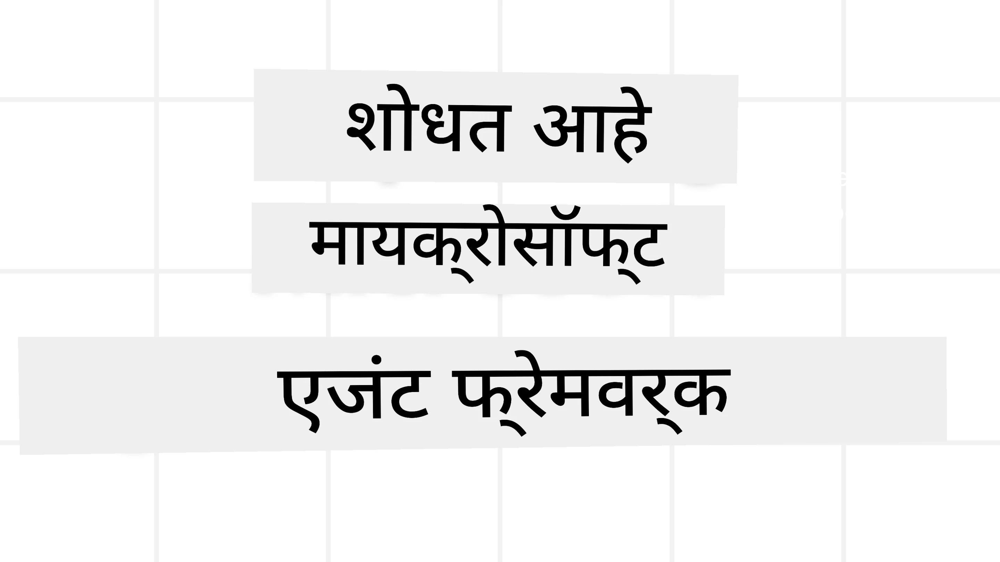
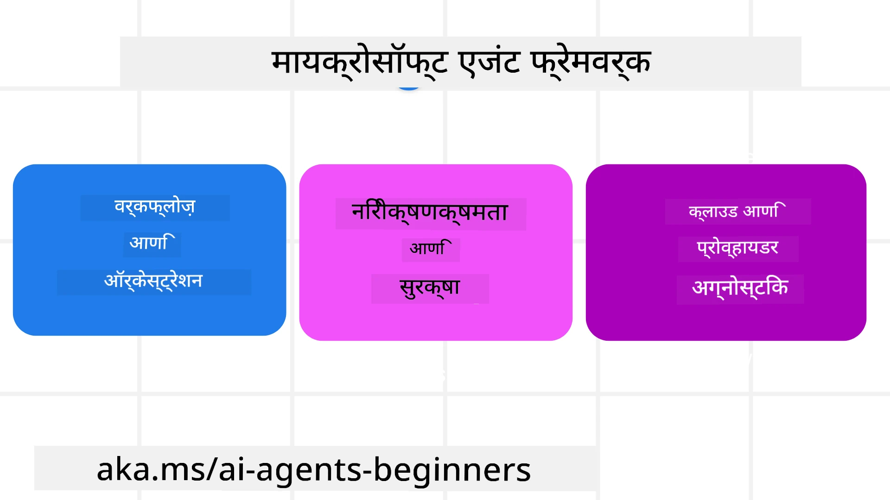
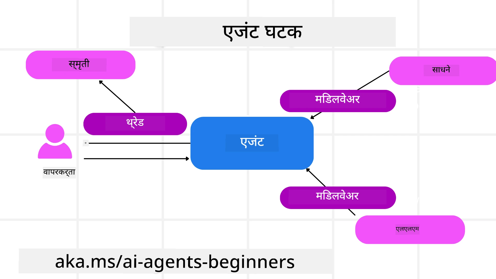

# मायक्रोसॉफ्ट एजेंट फ्रेमवर्कचा अभ्यास



### परिचय

ह्या धड्यात आपण खालील गोष्टी समजून घेऊ:

- मायक्रोसॉफ्ट एजेंट फ्रेमवर्कची सहज समज: मुख्य वैशिष्ट्ये आणि मूल्य  
- मायक्रोसॉफ्ट एजेंट फ्रेमवर्कच्या मुख्य संकल्पनांचा अभ्यास
- प्रगत MAF नमुने: कार्यप्रवाह, मिडलवेअर आणि मेमरी

## शिकण्याचे उद्दिष्टे

हा धडा पूर्ण केल्यावर, तुम्हाला माहिती असेल की:

- मायक्रोसॉफ्ट एजेंट फ्रेमवर्क वापरून उत्पादनासाठी तयार AI एजंट तयार करायचे कसे
- मायक्रोसॉफ्ट एजंट फ्रेमवर्कच्या मुख्य वैशिष्ट्यांचा तुमच्या एजंटची वापर प्रकरणांवर लागू करणे
- कार्यप्रवाह, मिडलवेअर आणि निरीक्षणशीलता यासह प्रगत नमुने वापरणे

## कोड नमुने 

[Microsoft Agent Framework (MAF)](https://learn.microsoft.com/en-us/agent-framework/overview/?wt.mc_id=youtube_26688_organicsocial_reactor&pivots=programming-language-python) साठी कोड नमुने या रिपॉझिटरीमध्ये `xx-python-agent-framework` आणि `xx-dotnet-agent-framework` फायलींच्या खाली उपलब्ध आहेत.

## मायक्रोसॉफ्ट एजंट फ्रेमवर्कची समज



[Microsoft Agent Framework (MAF)](https://learn.microsoft.com/en-us/agent-framework/overview/?wt.mc_id=youtube_26688_organicsocial_reactor&pivots=programming-language-python) हा मायक्रोसॉफ्टचा एकसंध फ्रेमवर्क आहे ज्याचा वापर AI एजंट तयार करण्यासाठी केला जातो. हा उत्पादन आणि संशोधन वातावरणातील विविध एजंट वापर केसेसना तोंड देण्यासाठी लवचिकता प्रदान करतो ज्यात समाविष्ट आहेत:

- **क्रमवार एजंट व्यवस्थापन** ज्यामध्ये टप्प्याटप्प्याने कार्यप्रवाह आवश्यक आहे.
- **समानवेळी व्यवस्थापन** जिथे एजंटना एकाच वेळी कार्य पूर्ण करायची असते.
- **गट चॅट व्यवस्थापन** जिथे एजंट एकत्रितपणे एका कार्यावर सहकार्य करु शकतात.
- **हँडऑफ व्यवस्थापन** जिथे एजंट एकमेकांना कार्य हस्तांतरित करतात जेव्हा उपकार्य पूर्ण होतात.
- **चुंबकीय व्यवस्थापन** जिथे व्यवस्थापक एजंट कार्य यादी तयार करतो आणि सादर करतो तसेच उपएजंट्सच्या समन्वयासाठी हाताळणी करतो.

उत्पादनात AI एजंट वितरित करण्यासाठी, MAF मध्ये या सुविधाही आहेत:

- **निरीक्षणशीलता** OpenTelemetry च्या वापराने जिथे AI एजंटची प्रत्येक क्रिया जसे की साधन वापर, व्यवस्थापन चरण, विचार प्रक्रियेचे प्रवाह आणि मायक्रोसॉफ्ट Foundry डॅशबोर्डद्वारे कारगिरी निरीक्षण केली जाते.
- **सुरक्षा** एजंटना मायक्रोसॉफ्ट Foundry मध्ये स्थानिकरित्या होस्ट करून, ज्यामध्ये भूमिका-आधारित प्रवेश, खाजगी डेटा हाताळणी आणि अंतर्निर्मित सामग्री सुरक्षा यांसारखे सुरक्षा नियंत्रण आहेत.
- **दृढता** कारण एजंट थ्रेड्स आणि कार्यप्रवाह थांबवू, पुन्हा सुरू करू तसेच त्रुटींपासून पुनर्प्राप्त करू शकतात, ज्यामुळे दीर्घकालीन प्रक्रिया शक्य होते.
- **नियंत्रण** कारण मानवाच्या सहभागाने कार्यप्रवाह समर्थित आहेत ज्यात कामे मानवी मंजुरीची गरज म्हणून चिन्हांकित केली जातात.

मायक्रोसॉफ्ट एजंट फ्रेमवर्क इंटरऑपरेबल असण्यावरही लक्ष केंद्रित करतो:

- **क्लाउड-निरपेक्ष असणे** - एजंट कंटेनर्समध्ये, ऑन-प्रिमायझ, आणि अनेक वेगवेगळ्या क्लाउडमध्ये चालू शकतात.
- **प्रदायक-निरपेक्ष असणे** - तुमच्या प्राधान्याच्या SDK वापरून एजंट तयार करणे ज्यात Azure OpenAI आणि OpenAI आहेत.
- **खुल्या मानकांचे एकत्रीकरण** - एजंट-टू-एजंट (A2A) आणि मॉडेल संदर्भ प्रोटोकॉल (MCP) सारख्या प्रोटोकॉल्सचा वापर करून इतर एजंट्स आणि साधने शोधून वापरणे.
- **प्लगइन्स आणि कनेक्टर्स** - मायक्रोसॉफ्ट फॅब्रिक, शेअरपॉइंट, पाइनकोन आणि क्यूड्रंटसारख्या डेटा आणि मेमरी सेवा कनेक्ट करणे शक्य आहे.

चला, पाहूया हे वैशिष्ट्ये मायक्रोसॉफ्ट एजंट फ्रेमवर्कच्या काही मुख्य संकल्पनांवर कसे लागू होतात.

## मायक्रोसॉफ्ट एजेंट फ्रेमवर्कच्या मुख्य संकल्पना

### एजंट्स




**एजंट तयार करणे**

एजंट तयार करणे म्हणजे इन्फरन्स सेवा (LLM प्रदाता), AI एजंटने अनुसरावयाच्या सूचनांचा संच, आणि एका निर्दिष्ट `name` ची व्याख्या करणे होय:


```python
agent = AzureOpenAIChatClient(credential=AzureCliCredential()).create_agent( instructions="You are good at recommending trips to customers based on their preferences.", name="TripRecommender" )
```

वरील उदाहरणात `Azure OpenAI` वापरले जात आहे, परंतु एजंट विविध सेवा वापरून तयार केले जाऊ शकतात जसे की `Microsoft Foundry Agent Service`:

```python
AzureAIAgentClient(async_credential=credential).create_agent( name="HelperAgent", instructions="You are a helpful assistant." ) as agent
```

OpenAI `Responses`, `ChatCompletion` APIs

```python
agent = OpenAIResponsesClient().create_agent( name="WeatherBot", instructions="You are a helpful weather assistant.", )
```

```python
agent = OpenAIChatClient().create_agent( name="HelpfulAssistant", instructions="You are a helpful assistant.", )
```

किंवा [MiniMax](https://platform.minimaxi.com/) जे OpenAI-सुसंगत API प्रदान करते ज्यामध्ये मोठ्या संदर्भ विंडोज (जास्तीत जास्त 204K टोकन्स) असतात:

```python
agent = OpenAIChatClient(base_url="https://api.minimax.io/v1", api_key=os.environ["MINIMAX_API_KEY"], model_id="MiniMax-M3").create_agent( name="HelpfulAssistant", instructions="You are a helpful assistant.", )
```

किंवा A2A प्रोटोकॉल वापरून रिमोट एजंट्स:

```python
agent = A2AAgent( name=agent_card.name, description=agent_card.description, agent_card=agent_card, url="https://your-a2a-agent-host" )
```

**एजंट चालविणे**

एजंट `.run` किंवा `.run_stream` पद्धती वापरून चालविले जातात जे नॉन-स्ट्रीमिंग किंवा स्ट्रीमिंग प्रतिसादांसाठी असू शकतात.

```python
result = await agent.run("What are good places to visit in Amsterdam?")
print(result.text)
```

```python
async for update in agent.run_stream("What are the good places to visit in Amsterdam?"):
    if update.text:
        print(update.text, end="", flush=True)

```

प्रत्येक एजंट रनमध्ये पर्याय देखील असू शकतात जसे की एजंटद्वारे वापरले जाणारे `max_tokens`, एजंट कॉल करू शकणारे `tools`, आणि अगदी एजंटसाठी वापरले जाणारे `model` देखील कस्टमाइझ करता येऊ शकतात.

हे विशेष मॉडेल्स किंवा टूल्स वापरणे आवश्यक असलेल्या वापरकर्त्याच्या कामासाठी उपयुक्त ठरते.

**टूल्स**

एजंट तयार करताना तसेच एजंट चालवताना टूल्स व्याख्यीत केली जाऊ शकतात:

```python
def get_attractions( location: Annotated[str, Field(description="The location to get the top tourist attractions for")], ) -> str: """Get the top tourist attractions for a given location.""" return f"The top attractions for {location} are." 


# ChatAgent थेट तयार करताना

agent = ChatAgent( chat_client=OpenAIChatClient(), instructions="You are a helpful assistant", tools=[get_attractions]

```

आणि एजंट चालवताना:

```python

result1 = await agent.run( "What's the best place to visit in Seattle?", tools=[get_attractions] # केवळ या धावणीसाठी प्रदान केलेले साधन )
```

**एजंट थ्रेड्स**

एजंट थ्रेड्स बहु-वार्तालाप हाताळण्यासाठी वापरले जातात. थ्रेड्स तयार करण्याचे दोन मार्ग आहेत:

- `get_new_thread()` वापरून ज्यामुळे थ्रेड काळानुसार जतन केला जाऊ शकतो
- एजंट चालवताना आपोआप थ्रेड तयार करणं आणि केवळ चालू रन दरम्यान थ्रेड टिकून ठेवणे.

थ्रेड तयार करण्यासाठी कोड असे दिसतो:

```python
# एक नवीन थ्रेड तयार करा.
thread = agent.get_new_thread() # त्या थ्रेडसह एजंट चालवा.
response = await agent.run("Hello, I am here to help you book travel. Where would you like to go?", thread=thread)

```

नंतर पुढील वापरासाठी थ्रेड सिरीयलाइझ करू शकता:

```python
# एक नवीन थ्रेड तयार करा.
thread = agent.get_new_thread() 

# थ्रेडसह एजंट चालवा.

response = await agent.run("Hello, how are you?", thread=thread) 

# संग्रहासाठी थ्रेड सीरियलाईज करा.

serialized_thread = await thread.serialize() 

# संग्रहातून लोड केल्यानंतर थ्रेडची स्थिती डीसीरियलाईज करा.

resumed_thread = await agent.deserialize_thread(serialized_thread)
```

**एजंट मिडलवेअर**

एजंट टूल्स आणि एलएलएम्सशी संवाद साधून वापरकर्त्याच्या कामां पूर्ण करतो. काही परिस्थितीत, आपल्याला या संवादांमध्ये क्रियांना अंमलात आणणे किंवा ट्रॅक करणे आवश्यक आहे. एजंट मिडलवेअर यासाठी सक्षम करते:

*फंक्शन मिडलवेअर*

हे मिडलवेअर एजंट आणि कॉल होणाऱ्या फंक्शन/टूल यांच्यामध्ये क्रिया अंमलात आणू देते. उदाहरणार्थ, फंक्शन कॉलवर लॉगिंग करण्याची गरज असेल तर हे वापरले जाते.

पुढील कोडमध्ये `next` ठरवते की पुढील मिडलवेअर किंवा खरी फंक्शन कॉल केली जावी.

```python
async def logging_function_middleware(
    context: FunctionInvocationContext,
    next: Callable[[FunctionInvocationContext], Awaitable[None]],
) -> None:
    """Function middleware that logs function execution."""
    # पूर्व-प्रक्रिया: फंक्शन अंमलबजावणीपूर्वी लॉग करा
    print(f"[Function] Calling {context.function.name}")

    # पुढील मिडलवेअर किंवा फंक्शन अंमलबजावणीसाठी पुढे चला
    await next(context)

    # पोस्ट-प्रक्रिया: फंक्शन अंमलबजावणी नंतर लॉग करा
    print(f"[Function] {context.function.name} completed")
```

*चॅट मिडलवेअर*

हे मिडलवेअर एजंट आणि एलएलएममधील विनंत्यांमध्ये क्रिया किंवा लॉगिंग सक्षम करते.

यात AI सेवेला पाठवण्यात येणाऱ्या `messages` सारखी महत्त्वाची माहिती असते.

```python
async def logging_chat_middleware(
    context: ChatContext,
    next: Callable[[ChatContext], Awaitable[None]],
) -> None:
    """Chat middleware that logs AI interactions."""
    # पूर्व-प्रक्रिया: AI कॉलपूर्व लॉग करा
    print(f"[Chat] Sending {len(context.messages)} messages to AI")

    # पुढील मिडलवेअर किंवा AI सेवेचा पुढे सुरू ठेवा
    await next(context)

    # पोस्ट-प्रक्रिया: AI प्रतिसादानंतर लॉग करा
    print("[Chat] AI response received")

```

**एजंट मेमरी**

`Agentic Memory` धड्यात वर्णन केल्याप्रमाणे, मेमरी वेगवेगळ्या संदर्भांवर एजंटला कार्यान्वित करण्यात महत्त्वाची भूमिका बजावते. MAF मध्ये अनेक प्रकारच्या मेमरी उपलब्ध आहेत:

*इन्-मेमरी स्टोरेज*

ही मेमरी ॲप्लिकेशन रनटाइम दरम्यान थ्रेड्समध्ये साठवलेली असते.

```python
# नवीन धागा तयार करा.
thread = agent.get_new_thread() # धाग्यासह एजंट चालवा.
response = await agent.run("Hello, I am here to help you book travel. Where would you like to go?", thread=thread)
```

*परसिस्टंट मेसेजेस*

हि मेमरी विविध सेशन्स दरम्यान संभाषण इतिहास साठवण्यासाठी वापरली जाते. ही `chat_message_store_factory` वापरून व्याख्यीत केली जाते:

```python
from agent_framework import ChatMessageStore

# सानुकूल संदेश संच तयार करा
def create_message_store():
    return ChatMessageStore()

agent = ChatAgent(
    chat_client=OpenAIChatClient(),
    instructions="You are a Travel assistant.",
    chat_message_store_factory=create_message_store
)

```

*डायनामिक मेमरी*


हा मेमरी एजंट्स चालवण्यापूर्वी संदर्भात जोडला जातो. हे मेमरीज mem0 सारख्या बाह्य सेवांमध्ये संग्रहित केल्या जाऊ शकतात:

```python
from agent_framework.mem0 import Mem0Provider

# प्रगत मेमरी क्षमता साठी Mem0 वापरणे
memory_provider = Mem0Provider(
    api_key="your-mem0-api-key",
    user_id="user_123",
    application_id="my_app"
)

agent = ChatAgent(
    chat_client=OpenAIChatClient(),
    instructions="You are a helpful assistant with memory.",
    context_providers=memory_provider
)

```

**एजंट निरीक्षणक्षमता**

विश्वसनीय आणि संधारणीय एजंटिक सिस्टम्स तयार करण्यासाठी निरीक्षणक्षमता महत्त्वाची आहे. MAF चा OpenTelemetry सोबत समाकलन केल्याने उत्तम निरीक्षणासाठी ट्रेसिंग आणि मीटर्स प्रदान केले जातात.

```python
from agent_framework.observability import get_tracer, get_meter

tracer = get_tracer()
meter = get_meter()
with tracer.start_as_current_span("my_custom_span"):
    # काहीतरी करा
    pass
counter = meter.create_counter("my_custom_counter")
counter.add(1, {"key": "value"})
```

### कार्यप्रवाह

MAF कार्यप्रवाह प्रदान करतो जे पूर्व-निर्धारित टप्पे आहेत, जे एका कार्याला पूर्ण करतात आणि त्या टप्प्यांमध्ये AI एजंट घटक म्हणून असतात.

कार्यप्रवाह वेगवेगळ्या घटकांनी बनलेले असतात जे चांगले नियंत्रण प्रवाह सक्षम करतात. कार्यप्रवाह **मल्टी-एजंट समन्वय** आणि **चेकपॉइंटिंग** देखील सक्षम करतात ज्यामुळे कार्यप्रवाह स्थिती जतन करता येते.

कार्यप्रवाहाचे मुख्य घटक आहेत:

**कार्यकारी (Executors)**

कार्यकारी इनपुट संदेश प्राप्त करतात, त्यांना दिलेले कार्य पार पाडतात, आणि नंतर एक आउटपुट संदेश तयार करतात. हे कार्यप्रवाहाला मोठ्या कार्याकडे पुढे नेते. कार्यकारी AI एजंट किंवा कस्टम लॉजिक असू शकतात.

**काठ (Edges)**

काठ कार्यप्रवाहातील संदेश प्रवाह परिभाषित करण्यासाठी वापरले जातात. हे प्रकारचे असू शकतात:

*डायरेक्ट काठ* - कार्यकारकांमध्ये सोपे एकतेसंबंध

```python
from agent_framework import WorkflowBuilder

builder = WorkflowBuilder()
builder.add_edge(source_executor, target_executor)
builder.set_start_executor(source_executor)
workflow = builder.build()
```

*अटीवर आधारित काठ* - विशिष्ट अटी पूर्ण झाल्यानंतर सक्रिय. उदा., जेव्हा हॉटेलच्या खोली उपलब्ध नसतात, तेव्हा कार्यकारी इतर पर्याय सुचावू शकतो.

*स्विच-केस काठ* - परिभाषित अटींवर आधारित वेगवेगळ्या कार्यकारकांना संदेश मार्गदर्शन करतात. उदा., जर प्रवास करणाऱ्याला प्राधान्य प्रवेश असेल तर त्यांचे कार्य वेगळ्या कार्यप्रवाहातून हाताळले जातील.

*फॅन-आउट काठ* - एक संदेश अनेक लक्ष्यांकडे पाठविणे.

*फॅन-इन काठ* - वेगवेगळ्या कार्यकारकांकडून अनेक संदेश गोळा करणे आणि एका लक्ष्याकडे पाठविणे.

**इव्हेंट्स (Events)**

कार्यप्रवाहांमध्ये चांगली निरीक्षणक्षमता प्रदान करण्यासाठी, MAF अंमलबजावणीसाठी अंतर्निहित इव्हेंट्स प्रदान करतो ज्यामध्ये:

- `WorkflowStartedEvent`  - कार्यप्रवाह अंमलबजावणी सुरू होते
- `WorkflowOutputEvent` - कार्यप्रवाह आउटपुट तयार करतो
- `WorkflowErrorEvent` - कार्यप्रवाहाला त्रुटी येते
- `ExecutorInvokeEvent`  - कार्यकारी प्रक्रिया सुरू करतो
- `ExecutorCompleteEvent`  - कार्यकारी प्रक्रिया पूर्ण करतो
- `RequestInfoEvent` - विनंती केली जाते

## प्रगत MAF नमुने

वरील विभाग Microsoft Agent Framework च्या मुख्य संकल्पनांवर प्रकाश टाकतात. तुम्ही अधिक गुंतागुंतीचे एजंट तयार करत असाल तर येथे काही प्रगत नमुने विचारात घेण्यासाठी आहेत:

- **मिडलवेअर संयोजन**: एजंट वर्तनावर सूक्ष्म नियंत्रणासाठी लॉगिंग, ऑथ, रेट-लिमिटिंग साठी अनेक मिडलवेअर हँडलर्स चेन करा.
- **कार्यप्रवाह चेकपॉइंटिंग**: दीर्घकाळ चालणाऱ्या एजंट प्रक्रियेचा सेव्ह आणि पुन्हा सुरू करण्यासाठी कार्यप्रवाह इव्हेंट्स आणि सिरीयलायझेशन वापरा.
- **डायनॅमिक टूल निवड**: टूल वर्णनांवर RAG वापरून MAF च्या टूल नोंदणीसह फक्त संबंधित टूल्स सादर करा.
- **मल्टी-एजंट हस्तांतरण**: विशेष एजंट्स दरम्यान हाताळणीसाठी कार्यप्रवाह काठ आणि अटींवर आधारित राउटिंग वापरा.

## Microsoft Foundry वर LangChain / LangGraph एजंट होस्ट करणे

Microsoft Agent Framework हे **फ्रेमवर्क-इंटरऑपरेबल** आहे — तुम्ही फक्त MAF वापरून लिहिलेल्या एजंट्सपुरते मर्यादित नाही. जर तुमच्याकडे आधीच **LangChain** किंवा **LangGraph** वापरून एजंट तयार असेल, तर तुम्ही त्यास **Microsoft Foundry होस्टेड एजंट** म्हणून चालवू शकता, ज्यामुळे Foundry रनटाइम, सत्र, स्केलिंग, आयडेंटिटी आणि प्रोटोकॉल एंडपॉइंट्स व्यवस्थापित करते, तर तुमची एजंट लॉजिक LangGraph मध्ये राहते.

हे `langchain_azure_ai.agents.hosting` पॅकेज वापरून केले जाते, जे Foundry होस्टेड एजंट वापरलेल्या त्याच प्रोटोकॉलवर संकलित LangGraph ग्राफ उघडते.

**1. होस्टिंग अतिरिक्त इंस्टॉल करा:**

```bash
pip install -U "langchain-azure-ai[hosting]>=1.2.4" azure-identity
```

`hosting` अतिरिक्त Foundry प्रोटोकॉल लायब्ररीज इंस्टॉल करते: `azure-ai-agentserver-responses` (OpenAI-समकक्ष `/responses` एंडपॉइंट) आणि `azure-ai-agentserver-invocations` (सामान्य `/invocations` एंडपॉइंट).

**2. होस्टिंग प्रोटोकॉल निवडा:**

| प्रोटोकॉल | होस्ट वर्ग | एंडपॉइंट | वापर कधी करावा |
|----------|-----------|----------|----------|
| **Responses** | `ResponsesHostServer` | `/responses` | OpenAI-समकक्ष चॅट, स्ट्रीमिंग, प्रतिसाद इतिहास व संभाषण थ्रेडिंग हवा असल्यास — संभाषणात्मक एजंट्ससाठी शिफारस केलेली डिफॉल्ट. |
| **Invocations** | `InvocationsHostServer` | `/invocations` | कस्टम JSON स्वरूप, वेबहूक-शैली एंडपॉइंट, किंवा गैर-संभाषणात्मक प्रक्रिया हवी असल्यास. |

कारण **Responses API Foundry मध्ये एजंट-शैली विकासासाठी मुख्य API आहे**, बहुतेक एजंटसाठी `ResponsesHostServer` पासून प्रारंभ करा.

**3. पर्यावरणीय चल सेट करा** (`az login` आधी करा जेणेकरून `DefaultAzureCredential` प्रमाणित करू शकेल):

```bash
export FOUNDRY_PROJECT_ENDPOINT="https://<resource>.services.ai.azure.com/api/projects/<project>"
export FOUNDRY_MODEL_NAME="gpt-5-mini"
```

नंतर एजंट जेव्हा Foundry मध्ये होस्टेड एजंट म्हणून चालेल, तेव्हा प्लॅटफॉर्म `FOUNDRY_PROJECT_ENDPOINT` आपोआप इंजेक्ट करते.

**4. Responses प्रोटोकॉलवर LangGraph एजंट एक्सपोज करा:**

```python
import os

from azure.ai.projects import AIProjectClient
from azure.identity import DefaultAzureCredential, get_bearer_token_provider
from langchain.agents import create_agent
from langchain_openai import ChatOpenAI
from langchain_azure_ai.agents.hosting import ResponsesHostServer

_AZURE_AI_SCOPE = "https://ai.azure.com/.default"


def build_chat_model() -> ChatOpenAI:
    project_endpoint = os.environ["FOUNDRY_PROJECT_ENDPOINT"].rstrip("/")
    deployment = os.environ.get("FOUNDRY_MODEL_NAME", "gpt-5-mini")
    credential = DefaultAzureCredential()
    project = AIProjectClient(endpoint=project_endpoint, credential=credential)
    openai_client = project.get_openai_client()
    token_provider = get_bearer_token_provider(credential, _AZURE_AI_SCOPE)

    # येथे ChatOpenAI Foundry प्रोजेक्टच्या OpenAI-सुसंगत (प्रतिसाद) एंडपॉइंटला लक्ष्य करतो.
    return ChatOpenAI(
        model=deployment,
        base_url=str(openai_client.base_url),
        api_key=token_provider,
    )


def main() -> None:
    graph = create_agent(build_chat_model(), tools=[])
    port = int(os.environ.get("PORT", "8088"))
    ResponsesHostServer(graph).run(port=port)


if __name__ == "__main__":
    main()
```

स्थानिकपणे `python main.py` ने चालवा, नंतर `http://localhost:8088/responses` येथे Responses विनंती पाठवा.

**मुख्य वर्तन:**

- **संभाषणे**: क्लायंट `previous_response_id` किंवा `conversation` आयडी पाठवून संभाषण सुरू ठेवतात. जर तुमचा ग्राफ LangGraph चेकपोइंटरसह संकलित केला असेल, तर Foundry संभाषण स्थिती चेकपॉइंटशी जोडते (उत्पादनात टिकाऊ चेकपोइंटर वापरा; स्थानिक चाचणीसाठी `MemorySaver` चांगला आहे).
- **ह्यूमन-इन-द-लूप**: जर तुमचा ग्राफ LangGraph `interrupt()` वापरतो, तर `ResponsesHostServer` प्रलंबित इनरपटला Responses `function_call` / `mcp_approval_request` आयटम म्हणून दाखवतो, आणि क्लायंट जुळणारे `function_call_output` / `mcp_approval_response` सह सुरू ठेवतात.
- **Foundry मध्ये डिप्लॉय करा**: Azure Developer CLI वापरा — `azd ext install azure.ai.agents`, `azd ai agent init -m <manifest>`, `azd ai agent run` (स्थानिक, Docker आवश्यक), मग `azd provision` आणि `azd deploy`. होस्टेड-एजंट डिप्लॉयमेंटसाठी **Foundry Project Manager** भूमिका आवश्यक आहे.

या उदाहरणाचा चालवता येणारा आवृत्ती [code-samples/14-langchain-hosted-agent.py](../../../14-microsoft-agent-framework/code-samples/14-langchain-hosted-agent.py) मध्ये आहे. पूर्ण वॉकथ्रू (Invocations प्रोटोकॉल, कस्टम विनंती स्कीम्स, व समस्या निवारण) साठी, [Host LangGraph agents as Foundry hosted agents](https://learn.microsoft.com/azure/foundry/how-to/develop/langchain-hosted-agents) पहा.

## कोड नमुने

Microsoft Agent Framework साठी कोड नमुने या रिपॉझिटरीमध्ये `xx-python-agent-framework` आणि `xx-dotnet-agent-framework` फाइल्सखाली सापडतील.

## Microsoft Agent Framework विषयी अजून प्रश्न आहेत का?

[Microsoft Foundry Discord](https://discord.com/invite/ATgtXmAS5D) मध्ये सामील व्हा, इतर शिकणाऱ्यांना भेटा, ऑफिस तासांना उपस्थित राहा आणि तुमचे AI एजंट्स प्रश्न विचार करा.
## मागील धडा

[AI एजंटसाठी मेमरी](../13-agent-memory/README.md)

## पुढील धडा


[कंप्युटर वापर एजंट्स (CUA) तयार करणे](../15-browser-use/README.md)

---

<!-- CO-OP TRANSLATOR DISCLAIMER START -->
**अस्वीकरण**:
हा दस्तऐवज AI भाषांतर सेवा [Co-op Translator](https://github.com/Azure/co-op-translator) चा वापर करून अनुवादित केला आहे. जरी आम्ही अचूकतेसाठी प्रयत्न करतो, तरी कृपया लक्षात घ्या की स्वयंचलित भाषांतरांमध्ये त्रुटी किंवा अचूकतेची कमतरता असू शकते. मूळ दस्तऐवज त्याच्या मूळ भाषेत अधिकृत स्रोत मानला पाहिजे. महत्त्वाची माहिती असल्यास, व्यावसायिक मानवी भाषांतराची शिफारस केली जाते. या भाषांतराच्या वापरामुळे उद्भवणाऱ्या कोणत्याही गैरसमज किंवा चुकीच्या अर्थलावणीसाठी आम्ही जबाबदार नाही.
<!-- CO-OP TRANSLATOR DISCLAIMER END -->