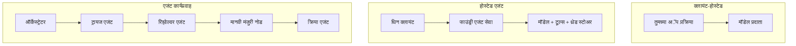
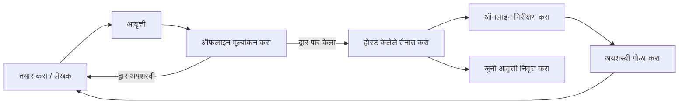
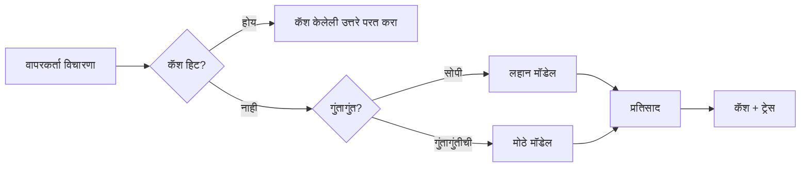
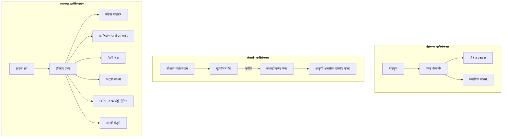

# Microsoft Foundry सह स्केलेबल एजंट्स स्थापित करणे


या कोर्सच्या आतापर्यंत तुम्ही अशा एजंट्स तयार केले आहेत जे तुमच्या लॅपटॉपवर, नोटबुकमध्ये चालतात, `az login` आणि काही पर्यावरण चल भूमिका (environment variables) द्वारे चालित. शिकण्यासाठी हा बरोबर मार्ग आहे. हजारो ग्राहक 3 वाजता सकाळी अवलंबून असलेल्या एजंट चालवण्याचा तो बरोबर मार्ग नाही.

हा धडा "माझ्या मशीनवर चालते" आणि "उत्पादनात विश्वासार्ह आणि किफायतशीर चालते" यामधील अंतराबद्दल आहे. आम्ही हा अंतर बंद करतो **Microsoft Foundry** आणि **Microsoft Foundry Agent Service** वापरून, आणि आम्ही एक खरा ग्राहक सेवा एजंट तयार करतो ज्यामध्ये टूल्स, शोध, मेमरी, मूल्यमापन, आणि मॉनिटरिंग असते.

## परिचय

हा धडा खालील बाबींचा समावेश करेल:

- **प्रोटोटाईप एजंट** आणि **प्रतिष्ठापित एजंट** यामधील फरक, आणि का हा संक्रमण मुख्यतः मॉडेलच्या *सर्व* आजूबाजूतील बाबतीत आहे.
- एजंटसाठी **प्रतिष्ठापन नमुने**: क्लायंट-होस्टेड, सेवा-होस्टेड (होस्टेड एजंटस), आणि वर्कफ्लो-समन्वित.
- Microsoft Foundry वर **एजंट जीवनचक्र** — तयार करा, आवृत्ती द्या, प्रतिष्ठापीत करा, मूल्यमापन करा, निरीक्षण करा, निवृत्त करा.
- **स्केलिंग धोरणे**: मॉडेल रूटिंग, कॅशिंग, समसामयिकता, आणि स्टेटलेस डिझाइन.
- OpenTelemetry आणि Foundry ट्रेसिंगसह **निरीक्षणक्षमता**.
- मॉडेल निवड, रूटिंग, आणि मूल्यमापन दारेद्वारे **खर्चाची ऑप्टिमायझेशन**.
- **एंटरप्राइझ विचार**: प्रशासन, मानवी मंजुरी, आणि उत्पादनात MCP सर्व्हर सुरक्षितपणे चालवणे.

## शिकण्याचे उद्दिष्टे

हा धडा पूर्ण केल्यानंतर, तुम्हाला कसे माहित असेल:

- दिलेल्या एजंट कार्यभारासाठी योग्य प्रतिष्ठापन नमुना कसा निवडायचा.
- एजंट Microsoft Foundry Agent Service मध्ये प्रतिष्ठापीत कसा करायचा ज्यामुळे तो आवृत्ती, प्रशासन, आणि निरीक्षणक्षमता मिळतो.
- ट्रेसिंगसाठी एजंट कसे उपकरणांसाठी सुसज्ज करायचे आणि प्रत्येक प्रकाशनापूर्वी चालणाऱ्या मूल्यमापन पाईपलाइनशी कसे जोडायचे.
- स्केलिंगवर विलंब आणि खर्च नियंत्रित ठेवण्यासाठी मॉडेल रूटिंग आणि कॅशिंग कसे लागू करायचे.
- उच्च-जोखमीच्या क्रियांसाठी मानवी मंजुरी दरवाजा कसा जोडायचा आणि उत्पादन-सुरक्षित मार्गाने MCP सर्व्हर कसे एकत्र करायचे.

## पूर्वअट

हा धडा गृहित धरतो की तुम्ही आधीचे धडे पूर्ण केले आहेत आणि ते समजता:

- [Microsoft Agent Framework](../14-microsoft-agent-framework/README.md) सोबत एजंट तयार करणे (धडा 14).
- [टूल वापर](../04-tool-use/README.md) (धडा 4) आणि [एजंटिक RAG](../05-agentic-rag/README.md) (धडा 5).
- [एजंट मेमरी](../13-agent-memory/README.md) (धडा 13) आणि [एजंटिक प्रोटोकॉल्स / MCP](../11-agentic-protocols/README.md) (धडा 11).
- [निरीक्षण क्षमता आणि मूल्यमापन](../10-ai-agents-production/README.md) (धडा 10) — हा धडा थेट त्यावर आधारित आहे.

तुम्हाला खालील गोष्टीही आवश्यक असतील:

- किमान एक प्रतिष्ठापित चॅट मॉडेलसह **Azure सदस्यता** आणि **Microsoft Foundry प्रकल्प**.
- प्रमाणित Azure CLI (`az login`).
- Python 3.12+ आणि रिपॉजिटरीतील पॅकेजेस [`requirements.txt`](../../../requirements.txt).

## प्रोटोटाईप ते उत्पादन: प्रत्यक्ष काय बदलते

प्रोटोटाईप एजंट आणि उत्पादन एजंट यांचा कोअर लूप सारखा असतो — विचार करा, टूल्स कॉल करा, प्रतिसाद द्या. जे बदलते ते त्या लूपच्या आजूबाजूला असलेल्या सर्व गोष्टी. मॉडेल उत्पादन एजंटचा कदाचित 20% असतो; बाकी 80% ही ऑपरेशनल रचना असते.

| बाब | प्रोटोटाईप | उत्पादन |
| --- | --- | --- |
| **होस्टिंग** | तुमच्या नोटबुकमध्ये चालते | होस्टेड सेवा म्हणून चालते, आवृत्ती देण्यात येते आणि रोल आउट केली जाते |
| **ओळख** | तुमचा `az login` टोकन | स्कोप केलेले RBAC सह व्यवस्थापित ओळख |
| **स्थिती** | इन-मेमरी, रीस्टार्टवर गमावले जाते | बाह्यीकृत (थ्रेड स्टोर, मेमरी सेवा) |
| **अपयश** | तुम्हाला ट्रेसबॅक दिसतो | पुनःप्रयत्न, फॉलबॅक, डेड-लेटर, अलर्ट्स |
| **खर्च** | "थोडेसे पैसे" | विनंतीनिहाय ट्रॅक केले, रूट केलेले, कॅश केलेले, बजेट केलेले |
| **गुणवत्ता** | आउटपुट डोळ्यांनी तपासता | प्रत्येक प्रकाशनाच्या अगोदर स्वयंचलित मूल्यमापन केलेले |
| **विश्वास** | प्रत्येक क्रियेस मान्यता देता | धोरण + जोखमीच्या क्रियांसाठी मानवी-इन-द-लूप |

हा तक्ता लक्षात ठेवा. खालील प्रत्येक विभाग या पंक्तींपैकी एकाशी जुळतो.

## एजंट प्रतिष्ठापन नमुने

तुम्ही तीन नमुने वापराल, अनेकदा संयोजनात.

### 1. क्लायंट-होस्टेड एजंट्स

एजंट ऑब्जेक्ट तुमच्या *अ‍ॅप्लिकेशन प्रक्रिये*च्या आत असतो. तुमचा कोड थेट मॉडेल प्रदाता कॉल करतो; विचार लूप तुमच्या सेवेत चालतो. हेच प्रत्येक मागील धड्यात झाले आहे.

- **कधी वापरावे** लूपवर पूर्ण नियंत्रण हवे असल्यास, कस्टम मिडलवेयरसाठी, किंवा एजंट एका विद्यमान बॅकएंडमध्ये एम्बेड करताना.
- **व्यापार**: स्केलिंग, स्थिती, आणि तीव्रता स्वतः सांभाळावी लागते.

### 2. होस्टेड एजंट्स (Foundry Agent Service)

एजंट Microsoft Foundry मध्ये *संसाधन म्हणून नोंदणीकृत* असतो. Foundry विचार लूप होस्ट करतो, थ्रेड्स साठवतो, सामग्री सुरक्षा आणि RBAC लागू करतो, आणि एजंट Foundry पोर्टलमध्ये दिसतो. तुमच्या अ‍ॅप्लिकेशनमध्ये एक हलका क्लायंट बनतो जो थ्रेड्स तयार करतो आणि प्रतिसाद वाचतो.

- **कधी वापरावे** टिकाऊपणा, अंगभूत निरीक्षण, प्रशासन, आणि कमी ऑपरेशनल सर्फेस क्षेत्र हवे असल्यास.
- **व्यापार**: व्यवस्थापित रनटाइमसाठी कमी-स्तरीय नियंत्रण कमी होते.

### 3. एजंट वर्कफ्लोज

अनेक एजंट्स (आणि टूल्स) एका ग्राफमध्ये संयोजित केले जातात ज्यामध्ये स्पष्ट नियंत्रण प्रवाह असतो — अनुक्रमिक चरण, शाखा, मानवी मंजुरी नोड्स, आणि टिकाऊ चेकपॉइंट जे थांबवू आणि पुन्हा सुरू करू शकतात. हा Microsoft Agent Framework **वर्कफ्लोज** क्षमतेचा उत्पादन स्केलवर वापर आहे.

- **कधी वापरावे** एकाच टास्कसाठी अनेक विशेषज्ञ एजंट्स लागल्यास किंवा मधोमध मंजुरीचा टप्पा हवा असल्यास.
- **व्यापार**: अधिक हालचालीची गरज; समन्वय-स्तरीय निरीक्षण आवश्यक.



## Microsoft Foundry वरील एजंट जीवनचक्र

एजंट प्रतिष्ठापित करणे एकदा केल्यावर `push` सारखे नसते. ते एक लूप आहे, आणि ते सॉफ्टवेअर प्रकाशन चक्रासारखे दिसते कारण तेच आहे.



मुख्य कल्पना, [धडा 10](../10-ai-agents-production/README.md) मधून आली आहे: **ऑफलाइन मूल्यमापन ही गेट आहे, न की नंतरची विचारणा.** नवीन एजंट आवृत्ती जेव्हाच पाठवली जाते जेव्हा ती तुमच्या मूल्यमापन निकषांवर उगम करते. ऑनलाइन निरीक्षण नंतर वास्तविक अपयशं ऑफलाइन चाचणी सेटमध्ये परत पाठवते. हा पूर्ण लूप आहे.

## स्केलिंग धोरणे

एजंट स्केल करणे हे स्टेटलेस वेब API स्केल करण्यापासून वेगळे आहे, कारण प्रत्येक विनंती एकाधिक महागडे मॉडेल आणि टूल कॉल ट्रिगर करू शकते. चार तंत्रे जास्त भार वाहतात.

**स्टेटलेस विनंती हाताळणी.** तुमच्या प्रक्रियेतील मेमरीमध्ये कोणतीही प्रति-वापरकर्ता स्थिती ठेऊ नका. संवाद थ्रेड्स Foundry थ्रेड स्टोर किंवा मेमरी सेवेत जतन करा जेणेकरून कोणतीही उदाहरण कोणतीही विनंती हाताळू शकेल. हेच तुम्हाला आडवे स्केल मिळवायला मदत करतो — उदाहरणे जोडा, कोणत्याहीच चिकट सत्रांशिवाय.

**मॉडेल रूटिंग.** प्रत्येक विनंतीसाठी तुमचा सर्वात सामर्थ्यशाली (आणि सर्वात महागडा) मॉडेल नको असतो. सोप्या विनंत्यांसाठी — हेतू वर्गीकरण, लहान तथ्यात्मक उत्तरं — लहान, जलद मॉडेलला रूट करा, आणि मोठा मॉडेल खरं विचार करण्यासाठी राखून ठेवा. Foundry चा **मॉडेल राऊटर** हे तुमच्यासाठी करू शकतो, किंवा तुम्ही स्वतः एक हलका वर्गीकार तयार करू शकता. तुम्ही लॅबमध्ये DIY आवृत्ती तयार कराल.

**प्रतिसाद कॅशिंग.** अनेक समर्थन प्रश्न जवळजवळ डुप्लिकेट असतात ("माझा पासवर्ड कसा रीसॅड करावा?"). सामान्य प्रश्नांची उत्तरे कॅश करा आणि मॉडेलवर पूर्णपणे हिट न करता त्यांना सर्व्ह करा. अगदी थोडकष्ठी कॅश हिट रेटही महत्वाचेपणाुळे खर्च आणि विलंब कमी करतो.

**समसामयिकता आणि बॅकप्रेशर.** मॉडेल प्रदात्यांच्या दरमर्यादा असतात. तुमची समसामयिकता मर्यादित ठेवा, एक्स्पोनेंशियल बॅकऑफसह पुनःप्रयत्न वापरा, आणि सावधपणाने अयशस्वी व्हा (थांबवलेल्या "आम्ही त्यावर काम करत आहोत" प्रतिसादाने 500 च्या तुलनेत जास्त चांगले).



## उत्पादनातील निरीक्षणक्षमता

तुम्ही काय पाहू शकत नाही ते तुम्ही ऑपरेट करू शकत नाही. धडा 10 मध्ये वर्णन केल्याप्रमाणे, Microsoft Agent Framework मूळतः **OpenTelemetry** ट्रेसेस उत्सर्जित करतो — प्रत्येक मॉडेल कॉल, टूल वापर, आणि समन्वय चरण एक स्पॅन बनतो. उत्पादनात तुम्ही त्या स्पॅन्स Microsoft Foundry (किंवा कोणत्याही OTel-योग्य बॅकेंड) कडे निर्यात करता, ज्यामुळे तुम्हाला खालील बाबी करता येतात:

- मुक्त मॉडेल आणि टूल कॉल्सच्या प्रत्येक पायर्‍यावर एक ग्राहक तक्रार ट्रेस करा.
- वेळेनुसार p50/p95 विलंब आणि खर्च प्रति विनंती पाहा.
- त्रुटी दर वाढ आणि खर्चातील विचित्रतांवर सतर्क रहा, अगदी तुमच्या वापरकर्त्यांनो (किंवा तुमच्या आर्थिक टीम) यांना लक्षात येण्यापूर्वी.

```python
from agent_framework.observability import get_tracer

tracer = get_tracer()

with tracer.start_as_current_span("support_request") as span:
    span.set_attribute("customer.tier", "enterprise")
    span.set_attribute("routed.model", "gpt-5-nano")
    # एजंट अंमलबजावणी ह्या स्पॅनमध्ये आपोआप ट्रेस केली जाते
```

`customer.tier` आणि `routed.model` सारखे गुणधर्म ट्रेसेसच्या भिंतीला उत्तरे देणाऱ्या प्रश्नांमध्ये रूपांतर करतात ("एंटरप्राइझ ग्राहक खूप वेळा लहान मॉडेलकडे रूट होत आहेत का?").

## खर्च ऑप्टिमायझेशन

उत्पादन एजंटमधील खर्च मुख्यतः टोकन्समुळे होतो. परिणामांच्या अनुक्रमे तीन लीव्हर:

1. **मॉडेल योग्य आकाराचे ठेवा.** छोटा मॉडेल जो तुमचा मूल्यमापन गेट पार करतो, तो नेहमीच मोठ्या मॉडेलपेक्षा स्वस्त असतो जो देखील पास होतो. मोठ्या मॉडेलच्या काळजीऐवजी छोटा मॉडेल पुरेसा आहे हे सिद्ध करण्यासाठी मूल्यमापन वापरा.
2. **कठीणीनुसार रूट करा.** वर सांगितल्याप्रमाणे — मोठ्या मॉडेलसाठी केवळ ज्या विनंत्यांना मोठ्या मॉडेलचे चिंतन आवश्यक आहे त्यासाठी मोठा खर्च करा.
3. **उग्रपणे कॅश करा.** सर्वात स्वस्त मॉडेल कॉल तो आहे जो तुम्ही कधीच करत नाही.

मूल्यमापन दरवाजे आणि खर्च नियंत्रण दोन वेगवेगळ्या दृष्टीकोनातून पहिल्यासारखेच तंत्र आहेत: मूल्यमापन तुम्हाला *गुणवत्तेचा पाया* सांगतो, रूटिंग आणि कॅशिंग तुम्हाला त्या पायाच्या *खर्चाजवळ* ठेवतात.

## एंटरप्राइझ प्रतिष्ठापन विचार

**प्रशासन.** होस्टेड एजंट्स Foundry ची RBAC, सामग्री सुरक्षा, आणि ऑडिट लॉगिंग वारसा म्हणून मिळवतात. प्रत्येक एजंटला जास्तीतजास्त कमी हक्क असलेली व्यवस्थापित ओळख द्या — ज्ञान आधार वाचन फक्त, टिकेटिंग API चा स्कोप केलेला प्रवेश, आणि काही नाही.

**मानवी-इन-द-लूप.** काही क्रियांना थेट स्वयंचलित करणे फार महत्त्वाचे नसते — रिफंड देणे, खाते हटवणे, कायदेशीर टीमकडे पाठवणे. Microsoft Agent Framework **मंजुरी-आवश्यक** टूल्सना समर्थन देतो: एजंट क्रिया प्रस्तावित करतो, अंमलबजावणी थांबते, मानवी मंजुरी किंवा नाकारणी होते, आणि वर्कफ्लो पुन्हा सुरू होते. तुम्ही [धडा 6](../06-building-trustworthy-agents/README.md) मध्ये या प्राथमिक गोष्टी पाहिल्या; येथे तुम्ही ते प्रतिष्ठापित करता.

**उत्पादनात MCP.** [MCP](../11-agentic-protocols/README.md) तुमच्या एजंटला मानक इंटरफेसद्वारे बाह्य टूल्स वापरू देते. उत्पादनात प्रत्येक MCP सर्व्हरला अविश्वसनीय सीमा म्हणून वाचा: सर्व्हर आवृत्ती पिन करा, स्कोप केलेली ओळख वापरून चालवा, त्याचे आउटपुट वैधता करा, आणि कधीही त्याला गुप्त माहिती उघडू नका. MCP सर्व्हर ही अवलंबन आहे, आणि अवलंबनांना पॅच केले जाते, ऑडिट केले जाते, आणि दरम्यान मर्यादित केले जाते.



हे तीन आकृत्या — विकास, प्रतिष्ठापन, रनटाइम — हे एजंट आयुष्याच्या तीन टप्प्यावरील एकच एजंट आहेत. पुढील लॅब तुम्हाला ते तयार करण्यासाठी मार्गदर्शन करेल.

## हातोडीसाठी लॅब: उत्पादनासाठी तयार ग्राहक सेवा एजंट

[`code_samples/16-python-agent-framework.ipynb`](./code_samples/16-python-agent-framework.ipynb) उघडा आणि सुरवंशापासून पूर्ण करा. तुम्ही एक **Contoso ग्राहक सेवा एजंट** तयार कराल ज्यात प्रत्येक उत्पादन चिंता जोडलेली आहे:

1. **टूल कॉलिंग** — ऑर्डर स्थिती पहा आणि समर्थन तिकिटे उघडा.
2. **RAG** — ज्ञान आधारातून धोरण प्रश्नांची उत्तरे द्या (Azure AI Search, मेमरीमध्ये 'fallback' म्हणून जेणेकरून नोटबुक शोध संसाधनाशिवायही चालेल).
3. **मेमरी** — संभाषणातील फेर्‍यांमध्ये ग्राहक लक्षात ठेवा.
4. **मॉडेल रूटिंग** — एक क्लिष्टता वर्गीकार प्रत्येक विनंती लहान किंवा मोठ्या मॉडेलकडे मार्गदर्शन करतो.
5. **प्रतिसाद कॅशिंग** — पुन्हा विचारलेल्या प्रश्नांना कॅशमधून सेवा द्या.
6. **मानवी मंजुरी** — निश्चित मर्यादेपेक्षा जास्त रिफंडसाठी मानवी स्वाक्षरीचा थांबा.
7. **मूल्यमापन पाईपलाइन** — एक लहान ऑफलाइन चाचणी संच एजंटच्या गुणांकनासाठी आणि प्रकाशन गेट म्हणून काम करतो.
8. **निरीक्षणक्षमता** — प्रत्येक विनंतीच्या भोवती OpenTelemetry ट्रेसिंग.

### मार्गदर्शन

नोटबुक अशाप्रकारे आयोजित आहे की प्रत्येक उत्पादन चिंता एक स्वतंत्र, चालवण्याजोगा विभाग आहे. त्याचा मुख्य भाग म्हणजे रूटिंग-प्लस-कॅशिंग विनंती हँडलर:

```python
async def handle_support_request(query: str, customer_id: str) -> str:
    # 1. शक्य तितक्या वेळेस कॅशेमधून सेवा द्या.
    cached = response_cache.get(normalize(query))
    if cached:
        return cached

    # 2. खर्च नियंत्रणासाठी गुंतागुंतीनुसार मार्गदर्शन करा.
    model = "gpt-5-nano" if is_simple(query) else "gpt-5-mini"

    # 3. निरीक्षणासाठी एजंटला ट्रेस स्पॅनमधून चालवा.
    with tracer.start_as_current_span("support_request") as span:
        span.set_attribute("routed.model", model)
        span.set_attribute("customer.id", customer_id)
        response = await support_agent.run(query, model=model)

    # 4. कॅश करा आणि परत करा.
    response_cache.set(normalize(query), response.text)
    return response.text
```

प्रकाशनाचे दरवाजे असं दिसतात:

```python
async def evaluation_gate(agent, test_cases, threshold: float = 0.8) -> bool:
    passed = 0
    for case in test_cases:
        result = await agent.run(case["input"])
        if score_response(result.text, case["expected"]) >= 0.8:
            passed += 1
    pass_rate = passed / len(test_cases)
    print(f"Evaluation pass rate: {pass_rate:.0%} (gate: {threshold:.0%})")
    return pass_rate >= threshold  # गेट पास झाल्यासच तैनात करा
```

प्रत्येक ओळ वाचा — नोटबुक प्राथमिक गोष्टी खूप लहान ठेवतो जेणेकरून काहीही फ्रेमवर्क कॉल मागे लपलेले नसावे.

## प्रतिष्ठापित एजंटची स्मोक चाचणी करून पडताळणी करणे

वरचं मूल्यमापन गेट तुमच्या एजंट ऑब्जेक्टविरुद्ध *ऑफलाइन* चालवते. एजंट होस्टेड एजंट म्हणून प्रतिष्ठापित झाल्यावर, तुम्हाला अजून एक, अगदी स्वस्त तपासणी करायला हवी: **प्रतिष्ठापित एंडपॉइंट खरोखर प्रतिसाद देत आहे का?**

"यशस्वी" प्रतिष्ठापन फक्त कंट्रोल प्लेनने व्याख्या स्वीकारली हे सिद्ध करते — ते एजंट प्रतिसाद देतो हे सिद्ध करत नाही. हरवलेले अवलंबित्व, खराब मॉडेल रूटिंग, किंवा कालबाह्य कनेक्शन "हिरव्या" प्रतिष्ठापनाला परत काहीही न देणारी ठेवू शकते. **स्मोक चाचणी** हे काही सेकंदांत पकडते, प्रत्येक प्रतिष्ठापनावर, पूर्ण मूल्यमापनाच्या खर्चाशिवाय.

या रिपॉझिटरीमध्ये [AI Smoke Test](https://github.com/marketplace/actions/ai-smoke-test) GitHub Action वर आधारित वापरायला तयार स्मोक-चाचणी पाईपलाइन आहे:

- **कॅटलॉग** — [`tests/lesson-16-smoke-tests.json`](../../../tests/lesson-16-smoke-tests.json) मध्ये Contoso समर्थन एजंटसाठी प्रॉम्प्ट आणि पुष्टीकरणे आहेत (भूमिगत धोरण उत्तरे, ऑर्डर शोधणे, विषयावर राहणे, आणि बहु-टर्न थ्रेड सलगता). इतर धड्यांच्या एजंटसाठी कॅटलॉगससर्व त्या साहित्यानुसार येथे आहेत — पहा [`tests/README.md`](../tests/README.md).
- **वर्कफ्लो** — [`.github/workflows/smoke-test.yml`](../../../.github/workflows/smoke-test.yml) Azure OIDC सह लॉगइन करतो आणि प्रत्येक प्रॉम्प्ट एजंटच्या Responses एंडपॉइंटवर POST करतो, कोणतीही पुष्टी न मिळाल्यास नोकरी असफल होते.

```yaml
- name: Smoke-test hosted agent
  uses: JFolberth/ai-smoketest@v1
  with:
    project_endpoint: ${{ inputs.project_endpoint }}
    agent_name: ContosoSupportAgent
    tests_file: tests/lesson-16-smoke-tests.json
```


तुमचा एजंट डिप्लॉय झाल्यावर, **Actions** टॅबमधून तो चालवा, तुमचा Foundry प्रोजेक्ट एंडपॉइंट आणि एजंट नाव दिलेले असावे. फेडरेटेड ओळखीसाठी Foundry प्रोजेक्ट स्कोपमध्ये **Azure AI User** भूमिका आवश्यक आहे. लेयर्सना एका पिरॅमिडसारखा विचार करा: स्मोक चाचण्या (पोहोचता येते का आणि प्रतिसाद देतो का?) प्रत्येक डिप्लॉयवर चालतात, ऑफलाइन मूल्यांकन (पुरेसे चांगले का ते पाठवायला?) प्रमोशनपूर्वी चालते, आणि ऑनलाइन मूल्यांकन (खऱ्या वापरात कसे चालले आहे?) सतत चालू असते.

## ज्ञान तपासणी

असाइनमेंटकडे जाण्यापूर्वी तुमची समज तपासा.

**1. साधारणतः उत्पादन एजंटचा कितपत भाग "मॉडेल" आहे, आणि उरलेले काय आहे?**

<details>
<summary>उत्तर</summary>

मॉडेल सिस्टमचा अल्पसंख्यक भाग असतो — बहुधा सुमारे 20% म्हटले जाते. उरलेले म्हणजे ऑपरेशनल कंकाल: होस्टिंग आणि वर्शनिंग, ओळख आणि RBAC, बाह्यीकृत स्थिती, अपयश हाताळणी, खर्च ट्रॅकिंग, मूल्यांकन, आणि मानव-इन-द-लूप नियंत्रण. उत्पादनाकडे जाणे म्हणजे सर्व काही *विचार करण्याच्या लूपच्या भोवताली* बांधणे होय.
</details>

**2. तुम्ही कधी Hosted Agent निवडाल आणि कधी क्लायंट-होस्टेड एजंट?**

<details>
<summary>उत्तर</summary>

जेव्हा तुम्हाला बिल्ट-इन टिकाऊपणा (थ्रेड्स जे सतत राहतायेत आणि पुन्हा सुरू होऊ शकतात), निरीक्षणक्षमता, सामग्री सुरक्षा, आणि RBAC असलेलं व्यवस्थापित रनटाईम हवं असेल, आणि तुम्ही reasoning लूपवर कमी-स्तर नियंत्रण थोडंसं दिलं तरी कमी ऑपरेशनल क्षेत्र मिळवू इच्छित असाल तेव्हा Hosted Agent योग्य आहे. क्लायंट-होस्टेड तेव्हा प्राधान्य आहे जेव्हा तुम्हाला reasoning लूपवर पूर्ण नियंत्रण हवं किंवा एजंटला विद्यमान बॅकएंडमध्ये एम्बेड करत असाल.
</details>

**3. स्केलेबल एजंट त्याच्या स्वतःच्या प्रोसेस मेमरीत स्टेटलेस का असावा लागतो?**

<details>
<summary>उत्तर</summary>

म्हणजे कोणत्याही इंस्टन्सला कोणतंही विनंती हाताळता येईल, ज्यामुळे हरीजॉन्टल स्केलिंग स्टिकी सेशन्सशिवाय शक्य होते. प्रति-युजर संभाषण स्थिती थ्रेड स्टोअर किंवा मेमरी सेवेमध्ये बाह्यीकृत केली जाते. जर स्थिती प्रोसेस मेमरीमध्ये असती, तर रीस्टार्टच्या वेळी ती गमावली जाईल आणि लोड मुक्तपणे वितरित करता येणार नाही.
</details>

**4. मॉडेल राउटिंग कोणती समस्या सोडवते, आणि मूल्यांकनाशी त्याचा काय संबंध आहे?**

<details>
<summary>उत्तर</summary>

राउटिंग सोप्या विनंत्या एका लहान, स्वस्त, वेगवान मॉडेलकडे पाठवते आणि मोठा मॉडेल खरी विचारसरणीसाठी राखून ठेवतो, ज्यामुळे विलंब आणि खर्च दोन्ही नियंत्रित होतात. हे मूल्यांकनाशी संबंधित कारण मूल्यांकन हेच दर्शवते की लहान मॉडेल विशिष्ट विनंत्यांसाठी पुरेसे चांगले आहे — मूल्याकनाशिवाय राउटिंग ही फक्त अंदाज बसवणे आहे.
</details>

**5. "मूल्यांकन दरवाजा" म्हणजे काय आणि तो जीवनचक्रात कुठे असतो?**

<details>
<summary>उत्तर</summary>

मूल्यांकन दरवाजा म्हणजे नवीन एजंट आवृत्तीवर ऑफलाइन चाचणी संच चालवतो आणि पास दर एका मर्यादा ओलांडत नसेल तर डिप्लॉयमेंट ब्लॉक करतो. तो जीवनचक्रात "आवृत्ती" आणि "डिप्लॉय" यामध्ये असतो, गुणवत्ता ही रिलीजची पूर्वशर्ती बनवतो, शिपिंगनंतर तपासणी करण्याऐवजी.
</details>

**6. उत्पादनात MCP सर्व्हरला का अविश्वसनीय सीमा म्हणून वागवले पाहिजे?**

<details>
<summary>उत्तर</summary>

कारण ते बाह्य अवलंबित्व आहे ज्यात तुमचा एजंट कॉल करतो. तुम्ही त्याची आवृत्ती पिन केली पाहिजे, स्कोप केलेल्या ओळखीने चालवले पाहिजे, त्याच्या आउटपुटची मान्यता करावी, रेट-लिमिट करावी, आणि कधीच त्याला सिक्रेट्स उघड करू नयेत — हाच नियम तुम्ही कोणत्याही तृतीय-पक्ष अवलंबित्वावर वापरता. त्याचे आउटपुट तुमच्या एजंटच्या विचारसरणीत जातात, म्हणून न तपासलेला विश्वास एक सुरक्षा धोका आहे.
</details>

**7. उत्पादन एजंटच्या खर्चावर सहसा कोणता एक बदल सर्वात जास्त परिणाम करतो, आणि का?**

<details>
<summary>उत्तर</summary>

मॉडेलचे योग्य आकार निश्चित करणे — जास्तीत जास्त लहान मॉडेल वापरणे जे तुमचा मूल्यांकन दरवाजा पार करते. खर्च टोकन्सने प्रभुत्व ठेवतो, आणि गुणवत्ता निकष पूर्ण करणारे लहान मॉडेल नेहमी मोठ्या मॉडेलपेक्षा स्वस्त असते. कॅशिंग आणि राउटिंग नंतर खर्च अजून कमी करतात, पण योग्य बेस मॉडेल निवडणे हा पहिला आणि मोठा परिणाम असतो.
</details>

**8. `customer.tier` आणि `routed.model` सारख्या स्पॅन अॅट्रीब्यूट्सचे निरीक्षणक्षमता मध्ये काय महत्त्व आहे?**

<details>
<summary>उत्तर</summary>

ते कच्च्या ट्रेसेसना उत्तरदायी व्यवसाय प्रश्नांमध्ये बदलतात. अॅट्रीब्यूट्स नसल्यास तुम्हाला फक्त स्पॅन्सची भिंत दिसते; अॅट्रीब्यूट्स असल्यास तुम्ही विचारू शकता "एंटरप्राइज ग्राहक खूप वेळा लहान मॉडेलकडे राऊट होत आहेत का?" किंवा "कोणता मॉडेल आमच्या सर्वाधिक संथ विनंत्यांना हाताळतो?" अॅट्रीब्यूट्स तुमच्या ऑपरेशन्ससाठी महत्त्वाच्या परिमाणांनुसार टेलिमेट्री कशी विभागायची ते ठरवतात.
</details>

## असाइनमेंट

लॅबमधील ग्राहक समर्थन एजंट घेऊन तो एका विशिष्ट परिस्थितीसाठी मजबूत करा: **SaaS कंपनीसाठी सदस्यता बिलिंग समर्थन एजंट.**

तुमच्या सबमिशनमध्ये असावं:

1. **साधनं बदला** बिलिंग-संबंधित साधनांमध्ये: `get_subscription_status`, `get_invoice`, आणि `issue_credit` (50 डॉलर्सपेक्षा जास्त क्रेडिटसाठी मानवी मंजुरी आवश्यक).
2. **तीन RAG दस्तऐवज जोडा** ज्यात कंपनीची रिफंड धोरण, बिलिंग चक्र, आणि रद्द करण्याची धोरण यांचा समावेश असेल.
3. **मूल्यांकन संच वाढवा** किमान आठ प्रकरणांपर्यंत, ज्यात किमान दोन प्रकरणे मानवी मंजुरीचा मार्ग सक्रिय करतात, आणि तुमचा मूल्यांकन दरवाजा योग्य प्रकारे पास किंवा फेल होतो याची पुष्टी करा.
4. **एक खर्च अहवाल जोडा**: एजंटद्वारे दहा मिश्रित चौकशा चालवल्यानंतर, किती विनंत्या लहान मॉडेलकडे, किती मोठ्या मॉडेलकडे, आणि किती कॅशेमधून सेव्ह केल्या गेल्या हे छापून दाखवा.

कोणता मॉडेल-राउटिंग नियम तुम्ही निवडला आणि त्याला प्रत्यक्ष ट्रॅफिकसह कसा मान्य कराल याची एक छोटी परिच्छेद (मार्कडाऊन सेलमध्ये) लिहा. कोणताही एकच बरोबर उत्तर नाही — तुम्हाला उत्पादनाच्या गोष्टी coherent रीतीने जोडल्या गेल्याबद्दलच मूल्यांकन केले जाईल.

## सारांश

या धड्यात तुम्ही एजंटला प्रोटोटाइपमधून उत्पादनात Microsoft Foundry वापरून नेले:

- उत्पादनात जाणं म्हणजे मॉडेलच्या भोवताली असलेला **ऑपरेशनल कंकाल** — होस्टिंग, ओळख, स्थिती, अपयश हाताळणी, खर्च, गुणवत्ता, आणि विश्वास.
- तुम्ही तीन **डिप्लॉयमेंट नमुने** शिकलात — क्लायंट-होस्टेड, Hosted Agents, आणि Agent Workflows — आणि त्यात कोणता कधी योग्य ते.
- तुम्ही **एजंट जीवनचक्र** ओळखलं, जिथे ऑफलाइन **मूल्यांकन हा एक रिलीज गेट** आहे आणि ऑनलाइन निरीक्षण अपयश पुन्हा चाचणी संचात परत देतो.
- तुम्ही **स्केलिंग धोरणे** लागू केली — स्टेटलेस डिझाइन, मॉडेल राउटिंग, कॅशिंग, आणि मर्यादित कॉन्करेंसी — आणि त्यांना **खर्च ऑप्टिमायझेशन** शी जोडले.
- तुम्ही **एंटरप्राइज नियंत्रण** जसे की RBAC, मानव-इन-द-लूप मंजुरी, आणि उत्पादन-सुरक्षित MCP इंटिग्रेशन जोडले.
- तुम्ही **उत्पादनासाठी तयार ग्राहक समर्थन एजंट** तयार केला जो ह्या सर्व चिंताRunnable कोडमध्ये एकत्र करतो.

पुढील धडा उलटा प्रवास करतो: एजंट्सना क्लाउडमध्ये वाढवण्याऐवजी, तुम्ही त्यांना *खाली* आणाल, एका विकसक मशीनवर पूर्णपणे लोकली चालवाल.

## अतिरिक्त साधने

- <a href="https://learn.microsoft.com/azure/ai-foundry/what-is-azure-ai-foundry" target="_blank">Microsoft Foundry दस्तऐवज</a>
- <a href="https://learn.microsoft.com/azure/ai-foundry/agents/overview" target="_blank">Microsoft Foundry एजंट सेवा आढावा</a>
- <a href="https://learn.microsoft.com/en-us/agent-framework/overview/?wt.mc_id=youtube_26688_organicsocial_reactor&pivots=programming-language-python" target="_blank">Microsoft Agent Framework</a>
- <a href="https://learn.microsoft.com/azure/ai-foundry/concepts/model-router" target="_blank">Microsoft Foundry मधील मॉडेल राउटर</a>
- <a href="https://learn.microsoft.com/azure/search/search-what-is-azure-search" target="_blank">Azure AI Search</a>
- <a href="https://opentelemetry.io/" target="_blank">OpenTelemetry</a>
- <a href="https://github.com/marketplace/actions/ai-smoke-test" target="_blank">AI स्मोक टेस्ट GitHub अॅक्शन</a>
- <a href="https://modelcontextprotocol.io/" target="_blank">मॉडेल कॉन्टेक्स्ट प्रोटोकॉल (MCP)</a>

## मागील धडा

[कंप्यूटर वापरणारे एजंट तयार करणे (CUA)](../15-browser-use/README.md)

## पुढील धडा

[स्थानिक AI एजंट तयार करणे](../17-creating-local-ai-agents/README.md)

---

<!-- CO-OP TRANSLATOR DISCLAIMER START -->
**अस्वीकरण**:
हा दस्तऐवज AI भाषांतर सेवा [Co-op Translator](https://github.com/Azure/co-op-translator) चा वापर करून अनुवादित केला आहे. जरी आम्ही अचूकतेसाठी प्रयत्न करतो, तरी कृपया लक्षात घ्या की स्वयंचलित भाषांतरांमध्ये त्रुटी किंवा अचूकतेची कमतरता असू शकते. मूळ दस्तऐवज त्याच्या मूळ भाषेत अधिकृत स्रोत मानला पाहिजे. महत्त्वाची माहिती असल्यास, व्यावसायिक मानवी भाषांतराची शिफारस केली जाते. या भाषांतराच्या वापरामुळे उद्भवणाऱ्या कोणत्याही गैरसमज किंवा चुकीच्या अर्थलावणीसाठी आम्ही जबाबदार नाही.
<!-- CO-OP TRANSLATOR DISCLAIMER END -->