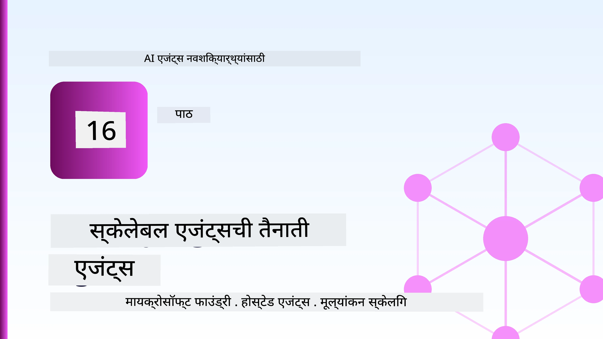
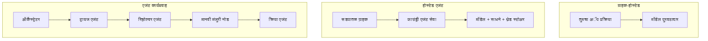
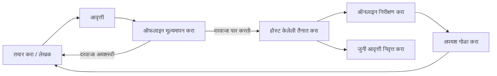
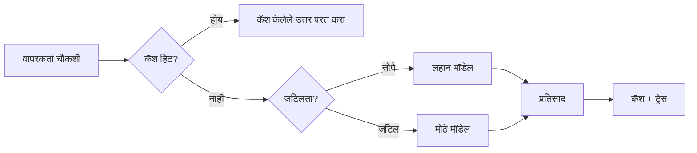
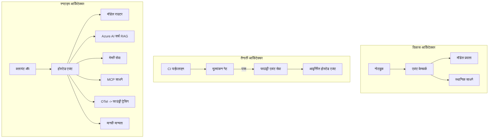

# मायक्रोसॉफ्ट फाउंड्रीसह स्केलेबल एजंटसाठी डिप्लॉयमेंट



यापर्यंतच्या अभ्यासक्रमात आपण असे एजंट तयार केले आहेत जे आपल्या लॅपटॉपवर, नोटबुकमध्ये चालतात, `az login` आणि काही पर्यावरण चलांच्या मदतीने चालवले जातात. हे शिकण्यासाठी नक्कीच योग्य मार्ग आहे. परंतु हजारो ग्राहकांच्या अवलंबन असलेल्या एजंटसाठी, ती ही योग्य पद्धत नाही, विशेषतः रात्री 3 वाजता.

हा धडा "माझ्या मशीनवर चालते" आणि "उत्पादनांमध्ये विश्वासार्ह आणि किफायतशीर चालते" यातील अंतराबद्दल आहे. आपण हे अंतर **मायक्रोसॉफ्ट फाउंड्री** आणि **मायक्रोसॉफ्ट फाउंड्री एजंट सेवा** वापरून पूर्ण करतो, आणि आम्ही एक खरा ग्राहक समर्थन एजंट तयार करून ते करतो ज्यात साधने, शोध, स्मृती, मूल्यांकन आणि निरीक्षण आहे.

## परिचय

या धड्यात समाविष्ट आहे:

- **प्रोटोटाइप एजंट** आणि **डिप्लॉय एजंट** मधील फरक, आणि संक्रमण का मॉडेलच्या *भोवती* असलेल्या सर्व गोष्टींबद्दल आहे.
- एजंटसाठी **डिप्लॉयमेंट नमुने**: क्लायंट-होस्टेड, सेवा-होस्टेड (होस्टेड एजंट्स), आणि वर्कफ्लो-ऑर्केस्ट्रेटेड.
- मायक्रोसॉफ्ट फाउंड्रीवर **एजंटचा जीवनचक्र** — तयार करा, आवृत्ती तयार करा, डिप्लॉय करा, मूल्यमापन करा, निरीक्षण करा, निवृत्त करा.
- **स्केलिंग धोरणे**: मॉडेल राउटिंग, कॅशिंग, समवर्तीता, आणि स्टेटलेस डिझाइन.
- OpenTelemetry आणि फाउंड्री ट्रेसिंगसह **निरीक्षणीयता**.
- **खर्च अनुकूलन** मॉडेल निवड, राउटिंग, व मूल्यांकन दारे यामार्फत.
- **एंटरप्राइज विचार**: प्रशासन, मानवी मंजुरी, आणि उत्पादनात MCP सर्व्हर सुरक्षितपणे चालवणे.

## शिक्षणाचे लक्ष्य

या धडा पूर्ण केल्यानंतर, तुम्हाला कळेल की:

- दिलेल्या एजंटच्या वर्कलोडसाठी योग्य डिप्लॉयमेंट नमुना कसा निवडायचा.
- मायक्रोसॉफ्ट फाउंड्री एजंट सेवेमध्ये एजंट कसा डिप्लॉय करायचा जेणेकरून तो आवृत्त, शासित, आणि निरीक्षणीय असेल.
- ट्रेसिंगसाठी एजंटला कसे उपकरणं लावायची आणि प्रत्येक प्रकाशनाआधी चालणारे मूल्यांकन पाइपलाइन कसे जोडायचे.
- मोठ्या प्रमाणावर विलंब आणि खर्च नियंत्रणात ठेवण्यासाठी मॉडेल राउटिंग आणि कॅशिंग कसे लागू करायचे.
- उच्च जोखमीच्या क्रिया साठी मानवी मंजुरी कसे घ्यायचे आणि MCP सर्व्हर उत्पादनात सुरक्षितपणे कसे एकत्र करायचे.

## पूर्वअट

या धड्यात आपल्याला पूर्वीचे धडे पूर्ण केलेले असल्याची आणि खालील बाबीमध्ये पारंगत असल्याची अपेक्षा आहे:

- [Microsoft Agent Framework](../14-microsoft-agent-framework/README.md) (धडा 14) वापरून एजंट तयार करणे.
- [Tool Use](../04-tool-use/README.md) (धडा 4) आणि [Agentic RAG](../05-agentic-rag/README.md) (धडा 5).
- [Agent Memory](../13-agent-memory/README.md) (धडा 13) आणि [Agentic Protocols / MCP](../11-agentic-protocols/README.md) (धडा 11).
- [Observability and Evaluation](../10-ai-agents-production/README.md) (धडा 10) — हा धडा त्यावर आधारित आहे.

तुम्हाला खालील गोष्टीही लागतील:

- एक **Azure सदस्यता** आणि एक **मायक्रोसॉफ्ट फाउंड्री प्रकल्प** ज्यात किमान एक डिप्लॉय केलेले चॅट मॉडेल आहे.
- प्रमाणीकृत **Azure CLI** (`az login`).
- Python 3.12+ आणि संग्रहातील पॅकेजेस [`requirements.txt`](../../../requirements.txt).

## प्रोटोटाइप ते उत्पादन: काय खरोखर बदलते

प्रोटोटाइप एजंट आणि उत्पादन एजंट एकाच मुख्य लूप शेअर करतात — विचार करा, साधने कॉल करा, प्रतिसाद द्या. बदल होतो तो या लूपभोवतीच्या सर्व गोष्टींमध्ये. उत्पादन एजंटमध्ये मॉडेल कदाचित २०% आहे; उर्वरित ८०% म्हणजे ऑपरेशनल साचा.

| बाब | प्रोटोटाइप | उत्पादन |
| --- | --- | --- |
| **होस्टिंग** | तुमच्या नोटबुकमध्ये चालते | होस्टेड सेवा म्हणून चालते, आवृत्तीसह आणि रोलआउट सह |
| **ओळख** | तुमचा `az login` टोकन | स्कोप केलेली RBAC असलेली व्यवस्थापित ओळख |
| **स्थिती** | इन-मेमरी, रीस्टार्टवर गमावलेली | बाह्य रूपात (थ्रेड स्टोर, मेमरी सेवा) |
| **अयशस्वीपणा** | तुम्हाला ट्रेसबॅक दिसतो | पुनर्प्रयत्न, फॉलबॅक, डेड-लेटर, अलर्ट्स |
| **खर्च** | "काही पैसेच" | प्रत्येक विनंतीसाठी ट्रॅक केलेले, राऊट केलेले, कॅश केलेले, बजेट केलेले |
| **गुणवत्ता** | तुम्ही आउटपुट पहात आहात | प्रत्येक प्रकाशनाआधी आपोआप मूल्यमापन केले जाते |
| **विश्वास** | तुम्ही प्रत्येक क्रियेची मंजुरी देता | धोरण + जोखमीच्या क्रियांसाठी मानवी सहभाग |

ही तक्ती लक्षात ठेवा. खालील प्रत्येक विभाग या ओळींपैकी एका ओळीशी संबंधित आहे.

## एजंट डिप्लॉयमेंट नमुने

तुम्ही तीन नमुने वापराल, बहुधा संयोजनात.

### 1. क्लायंट-होस्टेड एजंट्स

एजंट ऑब्जेक्ट तुमच्या अप्लिकेशन प्रक्रियेत असतो. तुमचा कोड मॉडेल प्रदाता थेट कॉल करतो; विचार लूप तुमच्या सेवेत चालतो. हे आधीच्या प्रत्येक धड्याने केलेले आहे.

- **जेव्हा वापरावे** जेव्हा तुम्हाला लूप, कस्टम मिडलवेअर किंवा वर्तमान बॅकएंडमधील एजंटसाठी पूर्ण नियंत्रण हवे असेल.
- **तडजोड**: तुम्ही स्वतः स्केलिंग, स्थिती, आणि टिकाव आपल्याला सांभाळावा लागतो.

### 2. होस्टेड एजंट्स (फाउंड्री एजंट सेवा)

एजंट मायक्रोसॉफ्ट फाउंड्रीमध्ये *संसाधन म्हणून नोंदणीकृत* आहे. फाउंड्री विचार लूप होस्ट करते, थ्रेड साठवते, सामग्रीची सुरक्षितता आणि RBAC लागू करते, आणि फाउंड्री पोर्टलमध्ये एजंट दिसतो. तुमचे अॅप एक लहान क्लायंट बनेल जे थ्रेड तयार करते आणि प्रतिसाद वाचते.

- **जेव्हा वापरावे** जेव्हा तुम्हाला टिकाऊपणा, अंगभूत निरीक्षणीयता, प्रशासन आणि कमी ऑपरेशनल जबाबदारी हवी.
- **तडजोड**: व्यवस्थापित रनटाइमसाठी कमी तळातील नियंत्रण.

### 3. एजंट वर्कफ्लोज

अनेक एजंटस (आणि उपकरणे) स्पष्ट नियंत्रण प्रवाहासह ग्राफमध्ये एकत्र केले जातात — अनुक्रमिक टप्पे, शाखा, मानवी मंजुरी नोड्स, आणि टिकाऊ तपासबिंदू जे थांबवू आणि पुढे नेऊ शकतात. हे मायक्रोसॉफ्ट एजंट फ्रेमवर्कच्या **वर्कफ्लोज** क्षमतेचा परिमाणात वापर आहे.

- **जेव्हा वापरावे** जेव्हा एखादे काम अनेक खासगी एजंट्समध्ये विभागलेले असेल किंवा मध्यभागी मंजुरी टप्पा आवश्यक असेल.
- **तडजोड**: जास्त भाग हलतात; ऑर्केस्ट्रेशन-स्तरीय निरीक्षण आवश्यक.



## मायक्रोसॉफ्ट फाउंड्रीवरील एजंट जीवनचक्र

एजंट डिप्लॉय करणे एकदाचं 'पुश' करणे नाही. हे एक लूप आहे, आणि सॉफ्टवेअर रिलीझ सायकलसारखे दिसते कारण तेच आहे.



मुख्य कल्पना, [धडा 10](../10-ai-agents-production/README.md) कडून घेतलेली: **ऑफलाइन मूल्यांकन ही एक दारे आहे, न की नंतरची गोष्ट.** नवीन एजंट आवृत्ती तुमच्या मूल्यांकन निकषांवर खरी उतरली नाही तर ती पाठवली जात नाही. ऑनलाईन निरीक्षण नंतर वास्तविक जगातील अपयश तुमच्या ऑफलाइन चाचणी संचात फीडबॅक करतो. तोच संपूर्ण लूप आहे.

## स्केलिंग धोरणे

एजंट स्केल करणे स्टेटलेस वेब API स्केल करण्यापेक्षा वेगळे आहे, कारण प्रत्येक विनंती अनेक महागड्या मॉडेल आणि उपकरण कॉल सक्रिय करू शकते. चार तंत्रे मुख्य प्रमाणात प्रणालीवर भार टाकतात.

**स्टेटलेस विनंती हाताळणी.** तुमच्या प्रक्रियेमध्ये वापरकर्त्याच्या स्थितीचा मागोवा ठेवू नका. संभाषण थ्रेड्स फाउंड्री थ्रेड स्टोअर किंवा मेमरी सेवेमध्ये टिकवून ठेवा ज्यामुळे कोणताही उदाहरण कोणतीही विनंती हाताळू शकते. हेच क्षैतिज स्केलिंगपर्यंत पोहोचण्यास मदत करते — उदाहरणे वाढवा, कोई चिकट सत्र नाही.

**मॉडेल राउटिंग.** प्रत्येक विनंतीसाठी तुमचा सर्वात सक्षम (आणि महागडा) मॉडेल आवश्यक नाही. सोप्या विनंत्यां — हेतू वर्गीकरण, थोडक्यात तथ्यात्मक उत्तरे — साठी लहान, वेगवान मॉडेलचा वापर करा, आणि खरे विचारसरणीसाठी मोठ्या मॉडेल राखून ठेवा. फाउंड्रीचा **मॉडेल राउटर** हे तुमच्यासाठी करू शकतो, किंवा तुम्ही स्वतः एखादा हलक़ा वर्गीकार बनवू शकता. तुम्ही प्रयोगशाळेत DIY आवृत्ती तयार कराल.

**प्रतिक्रिया कॅशिंग.** अनेक समर्थन प्रश्न जवळजवळ समान असतात ("मी माझा पासवर्ड कसा रीसेट करतो?"). सामान्य प्रश्नांची उत्तरे कॅश करा आणि मॉडेलवर जाऊ न देता सेवा द्या. अगदी मध्यम कॅश हिट रेट खरंच खर्च आणि विलंब कमी करतो.

**समवर्तीता आणि बॅकप्रेशर.** मॉडेल प्रदात्यांकडे दरमर्यादा असते. तुमची समवर्ती मर्यादित करा, बहुगुणित मागे घेण्यासाठी पुनर्प्रयत्न वापरा, आणि सौम्य अयशस्वी व्यवहार करा (क्यू केलेला "आम्ही त्यावर काम करत आहोत" प्रतिसाद 500 च्या तुलनेत चांगला).



## उत्पादनात निरीक्षणीयता

जे तुम्ही पाहू शकत नाही ते संचालित करू शकत नाही. धडा 10 मध्ये स्पष्ट केल्याप्रमाणे, मायक्रोसॉफ्ट एजंट फ्रेमवर्क नैसर्गिकरित्या **OpenTelemetry** ट्रेसेस उत्पन्न करतो — प्रत्येक मॉडेल कॉल, उपकरण वापर, आणि ऑर्केस्ट्रेशन टप्पा एक स्पॅन बनतो. उत्पादनात तुम्ही हे स्पॅन्स मायक्रोसॉफ्ट फाउंड्रीकडे (किंवा कोणत्याही OTel-सुसंगत बॅकेंडकडे) निर्यात करता ज्यामुळे तुम्हाला:

- प्रत्येक ग्राहक तक्रार संपूर्ण मॉडेल आणि उपकरण कॉलमध्ये ट्रेस करता येते.
- वेळोवेळी प्रत्येकी विनंतीसाठी p50/p95 विलंब आणि खर्च पाहता येतो.
- तुमचे वापरकर्ते (किंवा तुमचा आर्थिक विभाग) लक्ष देण्याआधी त्रुटी दरातील वाढीवर आणि खर्चाच्या असामान्यतेवर अलर्ट मिळतो.

```python
from agent_framework.observability import get_tracer

tracer = get_tracer()

with tracer.start_as_current_span("support_request") as span:
    span.set_attribute("customer.tier", "enterprise")
    span.set_attribute("routed.model", "gpt-5-nano")
    # एजंटची अंमलबजावणी या स्पॅनच्या आत आपोआप ट्रेस केली जाते
```

`customer.tier` आणि `routed.model` सारखे गुणधर्म ट्रेसेसच्या भिंतींना उत्तर देणाऱ्या प्रश्नांमध्ये (उदा. "एंटरप्राइज ग्राहक खूपदा लहान मॉडेलकडे जात आहेत का?") बदलतात.

## खर्च अनुकूलन

उत्पादन एजंटांचे खर्च टोकन्सने नियंत्रित होतात. परिणामाच्यादृष्टीने क्रमाने तीन मुख्य उपाय:

1. **योग्य आकाराचे मॉडेल निवडा.** एक लहान मॉडेल जे तुम्हाला मूल्यांकन दारे पार करतो, तो मोठ्या मॉडेलपेक्षा नेहमीच कमी खर्चिक असतो ज्याने मूल्यांकन केले आहे. मोठ्या मॉडेल वगळता सावधगिरीने लहान मॉडेल पुरेसे आहे असे सिद्ध करण्यासाठी मूल्यांकन वापरा.
2. **संकटानुसार राउट करा.** वर दिल्याप्रमाणे — फक्त मोठ्या-मॉडेल विचारसरणीसाठीच त्यासाठी पैसे द्या.
3. **प्रतिक्रिया कॅश करा.** सर्वात स्वस्त मॉडेल कॉल तो आहे जो तुम्ही कधीच करत नाही.

मूल्यांकन दारे आणि खर्च नियंत्रण ही दोन बाजू आहेत: मूल्यांकन तुम्हाला *गुणवत्तेचा पाया* दाखवते, राउटिंग आणि कॅशिंग तुम्हाला त्या पायाचा *खर्च* शक्य तितका जवळ ठेवतो.

## एंटरप्राइज डिप्लॉयमेंट बाबी

**शासनव्यवस्था.** होस्टेड एजंट्स फाउंड्रीच्या RBAC, सामग्री सुरक्षा आणि ऑडिट लॉगिंगचा वारसा स्वीकारतात. प्रत्येक एजंटला कमी अधिकार असलेली व्यवस्थापित ओळख द्या — केवळ ज्ञानाधार वाचण्याचा अधिकार, तिकीट API साठी मर्यादित प्रवेश, यापेक्षा जास्त काही नाही.

**मानवी सहभाग.** काही क्रिया अतिशय महत्त्वाच्या असतात — परतावा देणे, खाते हटवणे, कायदेशीर टीमकडे वाढवणे. मायक्रोसॉफ्ट एजंट फ्रेमवर्क **मंजुरीची गरज असलेली** उपकरणे समर्थित करतो: एजंट क्रिया सुचवतो, अंमलबजावणी थांबते, मानवी मंजुरी किंवा नाकारणी होते, नंतर वर्कफ्लो सुरू होतो. तुम्ही हे [धडा 6](../06-building-trustworthy-agents/README.md) मध्ये पाहिले; येथे तुम्ही ते डिप्लॉय करता.

**उत्पादनात MCP.** [MCP](../11-agentic-protocols/README.md) तुमच्या एजंटला बाह्य उपकरणे मानक इंटरफेसद्वारे वापरण्याची परवानगी देते. उत्पादनात, प्रत्येक MCP सर्व्हर अनधिकृत सीमा मानून वागवा: सर्व्हर आवृत्ती निश्चित करा, एक स्कोप केलेली ओळख वापरा, त्याचे उत्पादन योग्य आहे का तपासा, आणि त्याला कधीही गुपिते देऊ नका. MCP सर्व्हर हा एक अवलंबित्व आहे, आणि अवलंबित्व पॅच, ऑडिट, व दरमर्यादित होतात.



ह्या तीन आकृत्या — विकास, डिप्लॉयमेंट, रनटाइम — हे एजंटची त्याच्या आयुष्यातील तीन अवस्था दाखवतात. पुढील प्रयोगशाळा तुम्हाला ते तयार करून दाखवेल.

## हँड्स-ऑन लॅब: उत्पादनासाठी तयार ग्राहक समर्थन एजंट

[`code_samples/16-python-agent-framework.ipynb`](./code_samples/16-python-agent-framework.ipynb) उघडा आणि सुरुवातीपासून शेवटपर्यंत त्यावर काम करा. तुम्ही एक **Contoso ग्राहक समर्थन एजंट** तयार कराल ज्यात प्रत्येक उत्पादन काळजी समाविष्ट आहे:

1. **साधन कॉलिंग** — ऑर्डर स्थिती तपासा आणि समर्थन तिकीटे उघडा.
2. **RAG** — ज्ञानाधारातील धोरण प्रश्नांची उत्तरे द्या (Azure AI Search, ज्यात इन-मेमरी फॉलबॅक आहे जेणेकरून नोटबुक शोध संसाधना नसतानाही चालेल).
3. **स्मृती** — संभाषणांच्या टप्प्यांदरम्यान ग्राहकाची आठवण ठेवा.
4. **मॉडेल राउटिंग** — एक गुंतागुंत वर्गीकार प्रत्येक विनंती लहान किंवा मोठ्या मॉडेलकडे मार्गदर्शित करतो.
5. **प्रतिक्रिया कॅशिंग** — पुनरावृत्ती प्रश्न कॅशमधून सेवा मिळतात.
6. **मानवी मंजुरी** — तरतूदांवरून जास्त परतावा घेतल्यास मानवी स्वाक्षरीसाठी थांबा.
7. **मूल्यांकन पाइपलाइन** — एक लहान ऑफलाइन चाचणी संच एजंटला गुणांकन करतो आणि प्रकाशनासाठी दार म्हणून काम करतो.
8. **निरीक्षणीयता** — प्रत्येक विनंतीभोवती OpenTelemetry ट्रेसिंग.

### मार्गदर्शन

नोटबुक असे रचलेले आहे की प्रत्येक उत्पादन काळजी स्वतंत्र, चालवण्याजोग्या विभागात आहे. त्याचा हृदय म्हणजे राउटिंग-प्लस-कॅशिंग विनंती हाताळणारा भाग:

```python
async def handle_support_request(query: str, customer_id: str) -> str:
    # 1. शक्य असल्यास कॅशमधून सर्व्ह करा.
    cached = response_cache.get(normalize(query))
    if cached:
        return cached

    # 2. खर्च नियंत्रित करण्यासाठी गुंतागुंतीनुसार मार्गदर्शन करा.
    model = "gpt-5-nano" if is_simple(query) else "gpt-5-mini"

    # 3. निरीक्षणासाठी एजंट ट्रेस स्पॅनमध्ये चालवा.
    with tracer.start_as_current_span("support_request") as span:
        span.set_attribute("routed.model", model)
        span.set_attribute("customer.id", customer_id)
        response = await support_agent.run(query, model=model)

    # 4. कॅश करा आणि परत करा.
    response_cache.set(normalize(query), response.text)
    return response.text
```

प्रकाशनाचे रक्षण करणारी मूल्यांकन दारे अशी दिसते:

```python
async def evaluation_gate(agent, test_cases, threshold: float = 0.8) -> bool:
    passed = 0
    for case in test_cases:
        result = await agent.run(case["input"])
        if score_response(result.text, case["expected"]) >= 0.8:
            passed += 1
    pass_rate = passed / len(test_cases)
    print(f"Evaluation pass rate: {pass_rate:.0%} (gate: {threshold:.0%})")
    return pass_rate >= threshold  # फक्त गेट पार केल्यासच लागू करा
```

प्रत्येक ओळ वाचा — नोटबुक प्राथमिक गोष्टी लहान ठेवतो ज्यामुळे फ्रेमवर्क कॉल पेछे काही लपलेले नाही.

## डिप्लॉय एजंटचे तपासणी स्मोक चाचण्या

वर दिलेली मूल्यांकन दारे तुमच्या एजंट ऑब्जेक्टच्या विरुद्ध *ऑफलाइन* चालते. एकदा एजंट होस्टेड एजंट म्हणून डिप्लॉय झाला की, आणखी एक, अधिक किफायतशीर तपासणी आवश्यक: **डिप्लॉय केलेले एंडपॉईंट खरंच उत्तर देते का?**

"यशस्वीपणे" डिप्लॉय करणे फक्त कंट्रोल प्लेनने व्याख्या स्वीकारली याचा पुरावा आहे — एजंटचा प्रतिसाद मिळेल याचा नाही. हरवलेली अवलंबित्व, चुकीचे मॉडेल राउटिंग, किंवा कालबाह्य कनेक्शन अशा कारणांनी एक हिरव्या स्थितीचा डिप्लॉय होऊ शकतो जो काहीही परत करत नाही. एक **स्मोक चाचणी** ती काही सेकंदांत, प्रत्येक डिप्लॉयवर, संपूर्ण मूल्यांकन खर्चाशिवाय पकडू शकते.

हा संग्रह [AI Smoke Test](https://github.com/marketplace/actions/ai-smoke-test) GitHub Action वर आधारित तयार-ते-वापरण्यासाठी स्मोक-चाचणी पाइपलाइन पाठवतो:

- **सूची** — [`tests/lesson-16-smoke-tests.json`](../../../tests/lesson-16-smoke-tests.json) मध्ये Contoso समर्थन एजंटसाठी प्रॉम्प्ट आणि अ‍ॅसर्शन आहेत (मूलभूत धोरण उत्तर, ऑर्डर शोध, विषयावर राहणे, आणि मल्टी-टर्न थ्रेड सलगता). इतर धड्यांच्या एजंटसाठी सूचीही त्याच सोबतच आहेत — पाहा [`tests/README.md`](../tests/README.md).
- **वर्कफ्लो** — [`.github/workflows/smoke-test.yml`](../../../.github/workflows/smoke-test.yml) Azure OIDC सह लॉगिन होतो आणि प्रत्येक प्रॉम्प्ट एजंटच्या Responses एनपॉईंटवर POST करतो, कोणत्याही अ‍ॅसर्शन चुकल्यास नोकरी फसवतो.

```yaml
- name: Smoke-test hosted agent
  uses: JFolberth/ai-smoketest@v1
  with:
    project_endpoint: ${{ inputs.project_endpoint }}
    agent_name: ContosoSupportAgent
    tests_file: tests/lesson-16-smoke-tests.json
```


आपला एजंट तैनात केल्यावर **Actions** टॅबमधून ते चालवा, आपला Foundry प्रकल्प एंडपॉइंट आणि एजंटचे नाव पुरवून. फेडरेटेड ओळखेसाठी Foundry प्रकल्प क्षेत्रामध्ये **Azure AI User** भूमिका आवश्यक आहे. स्तरांना पिरॅमिड म्हणून विचार करा: स्मोक चाचण्या (पोहोचण्यायोग्य आणि प्रतिसाद देत आहेत का?) प्रत्येक तैनातीवर चालतात, ऑफलाइन मूल्यांकन (परवडण्याजोगे आहे का?) प्रमोशनपूर्वी चालते, आणि ऑनलाइन मूल्यांकन (ते वास्तवात कसे काम करत आहे?) सतत चालू राहते.

## ज्ञान तपासणी

असाइनमेंटवर जाण्यापूर्वी आपले समज तपासा.

**1. सुमारे उत्पादन एजंटमध्ये "मॉडेल" किती आहे, आणि उरलेले काय आहे?**

<details>
<summary>उत्तर</summary>

मॉडेल हा प्रणालीचा अल्पांश आहे — सहसा सुमारे 20% म्हणून उल्लेख केला जातो. उरलेले म्हणजे ऑपरेशनल सांचाच आहे: होस्टिंग आणि आवृत्ती व्यवस्थापन, ओळख आणि RBAC, बाह्य स्थिती, अपयश हाताळणी, खर्च ट्रॅकिंग, मूल्यांकन, आणि मानवी नियंत्रण. उत्पादनात जाणे मुख्यतः कारणीभूत लूपच्या *भोवताली* सर्वकाही बांधण्याबद्दल आहे.
</details>

**2. आपण कधी Hosted Agent ला क्लायंट-होस्टेड एजंटच्या वरील निवड करता?**

<details>
<summary>उत्तर</summary>

जेव्हा आपण अंतर्बद्ध टिकाऊपणा (तंतु जे टिकून राहतात आणि पुन्हा सुरू होऊ शकतात), निरीक्षणक्षमता, सामग्री सुरक्षितता, आणि RBAC सह व्यवस्थापित रनटाइम इच्छिता आणि कारणीभूत लूपवरील काही कमी-स्तरीय नियंत्रण कमी करण्यास तयार असता, तेव्हा. क्लायंट-होस्टेड तेव्हा प्राधान्य दिले जाते जेव्हा आपल्याला लूपवर पूर्ण नियंत्रण आवश्यक असेल किंवा आपण एजंटला विद्यमान बॅकएंडमध्ये एम्बेड करत आहात.
</details>

**3. स्केलेबल एजंटने स्वतःच्या प्रोसेस मेमरीमध्ये स्थिती-रहित का असणे आवश्यक आहे?**

<details>
<summary>उत्तर</summary>

त्यामुळे कोणताही उदाहरण कोणत्याही विनंतीवर हाताळू शकतो, ज्यामुळे स्टिकी सेशन्स न ठेवता आडव्यापर पडताळणी केली जाऊ शकते. प्रति-युजर संभाषण स्थिती थ्रेड स्टोर किंवा मेमरी सेवा मध्ये बाह्य केली जाते. जर स्थिती प्रोसेस मेमरीमध्ये राहिली असती, तर रिस्टार्टवर ती गमावली जाईल आणि लोड मुक्तपणे वितरित करता येणार नाही.
</details>

**4. मॉडेल रूटिंग कोणती समस्या सोडवते, आणि मूल्यांकनाशी त्याचे काय नाते आहे?**

<details>
<summary>उत्तर</summary>

रूटिंग सोप्या विनंत्यांना लहान, स्वस्त, वेगवान मॉडेलकडे पाठवते आणि खऱ्या कारणीभूत विचारांसाठी मोठ्या मॉडेलकडे राखीव ठेवते, लेटन्सी आणि खर्च दोन्ही नियंत्रित करते. ते मूल्यांकनाशी संबंधित आहे कारण मूल्यांकनच *साबीत* करते की लहान मॉडेल विशिष्ट विनंत्यांसाठी पुरेसे चांगले आहे — मूल्यांकनाशिवाय रूटिंग हा अंदाज आहे.
</details>

**5. "मूल्यांकन द्वार" म्हणजे काय आणि ते जीवनचक्रात कुठे बसते?**

<details>
<summary>उत्तर</summary>

मूल्यांकन द्वार नवीन एजंट आवृत्तीवर ऑफलाइन चाचणी संच चालवतो आणि पास दर थरकपटी खाली गेल्यास तैनाती थांबवतो. हे जीवनचक्रात "आवृत्ती" आणि "तैनात" यामध्ये बसते, गुणवत्ता ही रिलीजसाठी पूर्वशर्ती म्हणून बनवते, न कि शिपिंगनंतर तपासण्याची गोष्ट.
</details>

**6. उत्पादनात MCP सर्व्हरला अविश्वसनीय सीमा म्हणून का पाहिले पाहिजे?**

<details>
<summary>उत्तर</summary>

कारण तो एक बाह्य अवलंबित्व आहे ज्याला आपला एजंट कॉल करतो. त्याची आवृत्ती स्थिर ठेवा, त्याला मर्यादित ओळखीने चालवा, त्याच्या आउटपुटची पडताळणी करा, दर मर्यादा ठेवा आणि कधीही त्याला गुपिते उघड करू नका — ज्याप्रमाणे आपण कोणत्याही तृतीय-पक्ष अवलंबित्वासाठी प्रयोग करता त्या प्रमाणे. त्याचे आउटपुट आपल्या एजंटच्या कारणीभूत विचारांसाठी वाहते, त्यामुळे पडताळलेले न झालेले विश्वास सुरक्षा जोखीम आहे.
</details>

**7. उत्पादन एजंटच्या खर्चावर सर्वाधिक परिणाम करणारी एकच बदल कोणती आहे आणि का?**

<details>
<summary>उत्तर</summary>

मॉडेलचे योग्य आकार निर्धारण — आपला मूल्यांकन द्वार पार करणारे सर्वात लहान मॉडेल वापरणे. खर्च टोकन्सवर अधीन असतो, आणि गुणवत्ता निकष पूर्ण करणारे लहान मॉडेल मोठ्या मॉडेलच्या तुलनेत जवळजवळ नेहमीच स्वस्त असते. कॅशिंग आणि रूटिंग नंतर खर्च अधिक कमी करतात, पण योग्य मूलभूत मॉडेल निवडण्याचा प्रभाव सर्वात मोठा असतो.
</details>

**8. `customer.tier` आणि `routed.model` सारख्या स्पॅन गुणधर्मांची निरीक्षणक्षमतेत काय भूमिका आहे?**

<details>
<summary>उत्तर</summary>

ते कच्च्या ट्रेसला उत्तर देणाऱ्या व्यवसाय प्रश्नांमध्ये रूपांतरित करतात. गुणधर्मांशिवाय तुमच्याकडे फक्त स्पॅनची भिंत असते; गुणधर्मांसह तुम्ही विचारू शकता "उद्योग ग्राहकांना लहान मॉडेलकडे खूप वेळा पाठवले जात आहे का?" किंवा "कोणते मॉडेल आपले सर्वात हळू विनंत्या हाताळते?" गुणधर्मांतून तुम्ही तुमच्या ऑपरेशनसाठी महत्त्वाच्या परिमाणांनुसार टेलिमेट्री कापू शकता.
</details>

## असाइनमेंट

लॅबमधील ग्राहक समर्थन एजंट घ्या आणि ते एका विशिष्ट परिस्थितीसाठी मजबूत करा: **SaaS कंपनीसाठी एक सदस्यत्व बिलिंग समर्थन एजंट.**

आपली सादर केलेली मामलात खालील गोष्टी असाव्यात:

1. **टूल्स बदल करा** बिलिंगच्या संबंधित टूल्सने: `get_subscription_status`, `get_invoice`, आणि `issue_credit` (50 डॉलरपेक्षा जास्त क्रेडिटसाठी मानवी मान्यता आवश्यक आहे).
2. **कंपनीच्या रिफंड धोरण, बिलिंग चक्र, आणि निरसन धोरण** या तीन RAG दस्तऐवज जोडा.
3. **मूल्यांकन संच कमीतकमी आठ प्रकरणांपर्यंत वाढवा**, ज्यात कमीतकमी दोन प्रकरणे मानवी-मान्यता मार्ग सक्रिय करायला हवे, आणि आपल्या मूल्यांकन द्वाराने ते योग्य प्रकारे पास किंवा फेल होणं खात्री करा.
4. **एक खर्च अहवाल जोडा**: एजंटद्वारे दहा मिश्रित प्रश्न विचारल्यानंतर, लहान मॉडेलवर किती गेले, मोठ्या मॉडेलवर किती गेले, आणि कॅशेमधून किती पुरवले गेले याची छपाई करा.

एक लहान परिच्छेद (markdown सेलमध्ये) लिहा ज्यात तुम्ही कोणता मॉडेल-रूटिंग नियम निवडला आणि त्याची खरी वाहतूक वापरून कशी पडताळणी कराल याचे स्पष्टीकरण द्या. एका सही उत्तर नाही — तुम्हाला उत्पादन चिंता कसे सुसंगतपणे जोडल्या आहेत हे पाहून मूल्यांकन केले जाईल.

## सारांश

या धड्यामध्ये आपण Microsoft Foundry सोबत एक एजंट प्रोटोटाइपपासून उत्पादनापर्यंत नेला:

- उत्पादनात जाणे मुख्यतः मॉडेलच्या भोवतालची **ऑपरेशनल सांचाच** आहे — होस्टिंग, ओळख, स्थिती, अपयश हाताळणी, खर्च, गुणवत्ता, आणि विश्वास.
- आपण तीन **तैनात पॅटर्नस** शिकलात — क्लायंट-होस्टेड, Hosted Agents, आणि Agent Workflows — आणि कधी कोणता योग्य आहे ते.
- आपण **एजंट जीवनचक्र** पाहिले, जिथे ऑफलाइन **मूल्यांकन हे रिलीज द्वार** म्हणून कार्य करते आणि ऑनलाइन निरीक्षण अपयशांना चाचणी संचात परत पाठवते.
- आपण **स्केलिंग धोरणे** लागू केली — स्थिती-रहित डिझाइन, मॉडेल रूटिंग, कॅशिंग, आणि मर्यादित सहकार्य — आणि त्यांना **खर्च ऑप्टिमायझेशन**शी जोडले.
- आपण **उद्योग नियंत्रण** जोडले: RBAC, मानवी-इन-द-लूप मंजुरी, आणि उत्पादनासाठी सुरक्षित MCP समाकलन.
- आपण एक **उत्पादन-तयार ग्राहक समर्थन एजंट** तयार केला जो या सर्व चिंता एकत्र रन करण्याजोग्या कोडमध्ये बांधतो.

पुढील धडा विरोधी प्रवास करतो: एजंट्सना क्लाउडमध्ये वाढवण्याऐवजी, आपण त्यांना एका डेव्हलपर मशीनवर घेऊन येणार आहात आणि पूर्णपणे स्थानिकपणे चालवणार आहात.

## अतिरिक्त संसाधने

- <a href="https://learn.microsoft.com/azure/ai-foundry/what-is-azure-ai-foundry" target="_blank">Microsoft Foundry दस्तऐवज</a>
- <a href="https://learn.microsoft.com/azure/ai-foundry/agents/overview" target="_blank">Microsoft Foundry Agent सेवा आढावा</a>
- <a href="https://learn.microsoft.com/en-us/agent-framework/overview/?wt.mc_id=youtube_26688_organicsocial_reactor&pivots=programming-language-python" target="_blank">Microsoft Agent Framework</a>
- <a href="https://learn.microsoft.com/azure/ai-foundry/concepts/model-router" target="_blank">Microsoft Foundry मधील मॉडेल राउटर</a>
- <a href="https://learn.microsoft.com/azure/search/search-what-is-azure-search" target="_blank">Azure AI Search</a>
- <a href="https://opentelemetry.io/" target="_blank">OpenTelemetry</a>
- <a href="https://github.com/marketplace/actions/ai-smoke-test" target="_blank">AI Smoke Test GitHub Action</a>
- <a href="https://modelcontextprotocol.io/" target="_blank">Model Context Protocol (MCP)</a>

## मागील धडा

[कंप्यूटर वापर एजंट तयार करणे (CUA)](../15-browser-use/README.md)

## पुढील धडा

[स्थानिक AI एजंट तयार करणे](../17-creating-local-ai-agents/README.md)

---

<!-- CO-OP TRANSLATOR DISCLAIMER START -->
**अस्वीकरण**:
हा दस्तऐवज AI भाषांतर सेवा [Co-op Translator](https://github.com/Azure/co-op-translator) चा वापर करून अनुवादित केला आहे. जरी आम्ही अचूकतेसाठी प्रयत्न करतो, तरी कृपया लक्षात घ्या की स्वयंचलित भाषांतरांमध्ये त्रुटी किंवा अचूकतेची कमतरता असू शकते. मूळ दस्तऐवज त्याच्या मूळ भाषेत अधिकृत स्रोत मानला पाहिजे. महत्त्वाची माहिती असल्यास, व्यावसायिक मानवी भाषांतराची शिफारस केली जाते. या भाषांतराच्या वापरामुळे उद्भवणाऱ्या कोणत्याही गैरसमज किंवा चुकीच्या अर्थलावणीसाठी आम्ही जबाबदार नाही.
<!-- CO-OP TRANSLATOR DISCLAIMER END -->